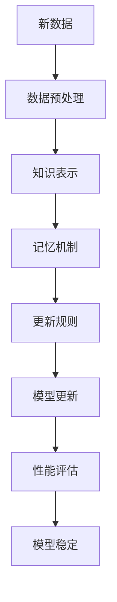

                 

# 《Incremental Learning原理与代码实例讲解》

> 关键词：增量学习、增量算法、核心原理、数学模型、代码实例、实时学习

> 摘要：本文将深入探讨增量学习（Incremental Learning）的原理、算法及其在实际应用中的代码实例。我们将从基础概念出发，逐步讲解增量学习的核心原理、数学模型，并介绍几种常见的增量学习算法。随后，我们将通过具体的代码实例，展示增量学习在实时学习应用中的实现细节和挑战。

## 目录大纲

### 第一部分：Incremental Learning基础

#### 第1章：Incremental Learning概述  
**1.1 Incremental Learning的概念与重要性**  
**1.2 Incremental Learning与传统学习的区别**  
**1.3 Incremental Learning的主要挑战**

#### 第2章：Incremental Learning的核心原理  
**2.1 增量学习的理论基础**  
**2.2 增量学习的更新规则与策略**  
**2.3 学习速率与稳定性**

#### 第3章：常见增量学习算法  
**3.1 增量支持向量机（SVM）**  
**3.2 增量神经网络（Neural Networks）**  
**3.3 增量贝叶斯分类器**  
**3.4 增量随机森林**

#### 第4章：数学模型与公式解析  
**4.1 增量学习中的数学模型**  
**4.2 概率分布与期望最大化**  
**4.3 信息论与熵**

#### 第5章：增量学习在现实世界中的应用  
**5.1 传感器数据流处理**  
**5.2 在线广告系统**  
**5.3 语音识别与语音合成**  
**5.4 人脸识别与跟踪**

### 第二部分：增量学习的实战应用

#### 第6章：案例研究：在线推荐系统  
**6.1 系统架构与数据流处理**  
**6.2 代码实例与实现细节**  
**6.3 性能优化与挑战**

#### 第7章：案例研究：智能监控系统  
**7.1 监控系统的设计考虑**  
**7.2 增量学习算法在监控中的应用**  
**7.3 实际案例解析**

#### 第8章：增量学习的未来趋势与展望  
**8.1 当前增量学习的研究热点**  
**8.2 增量学习在边缘计算中的应用**  
**8.3 增量学习与深度学习的融合**

#### 附录

##### 附录A：相关资源与工具推荐  
**A.1 主流增量学习框架**  
**A.2 增量学习相关论文与书籍推荐**  
**A.3 实践指南与最佳实践**

## 第一部分：Incremental Learning基础

### 第1章：Incremental Learning概述

#### 1.1 Incremental Learning的概念与重要性

增量学习（Incremental Learning），也称为在线学习（Online Learning），是一种能够逐步更新模型的学习方式。与传统离线学习不同，增量学习允许模型在每次接受新的数据时进行更新，从而能够在数据流不断变化的环境中持续学习。这种灵活性使得增量学习在许多实际应用中变得非常重要。

在传统的机器学习过程中，模型通常在大规模数据集上预先训练，然后在新的数据到来时进行定期更新。这种方法在数据集相对稳定且数据量有限时是有效的。然而，在许多现实场景中，数据是动态变化的，例如，传感器数据流、在线广告投放、社交网络数据等。在这些场景中，离线学习无法及时响应用户需求，而增量学习则能够提供实时的更新和适应。

增量学习的重要性在于：

1. **实时性**：增量学习能够在数据到来时立即进行更新，从而实现实时学习。
2. **效率**：无需重新训练整个模型，只需更新部分参数，节省计算资源。
3. **适应性**：增量学习能够适应数据流的变化，持续优化模型性能。

随着大数据和物联网的发展，增量学习在许多领域都显示出其强大的应用潜力，包括但不限于：智能监控系统、推荐系统、传感器数据流处理等。

#### 1.2 Incremental Learning与传统学习的区别

传统学习（Batch Learning）与增量学习有以下主要区别：

1. **数据使用方式**：传统学习使用批量数据集进行训练，而增量学习使用流数据集。
2. **模型更新方式**：传统学习在固定时间点进行模型更新，而增量学习在每次接收新数据时更新模型。
3. **计算资源需求**：增量学习通常需要更少的计算资源，因为它不需要处理整个数据集。

#### 1.3 Incremental Learning的主要挑战

虽然增量学习具有许多优势，但它在实际应用中也面临一些挑战：

1. **稳定性**：增量学习需要确保模型在每次更新后保持稳定，避免过拟合。
2. **计算效率**：增量学习算法需要高效地处理流数据，以减少延迟。
3. **资源管理**：在资源受限的环境中，如何平衡计算效率和系统性能是一个挑战。

接下来，我们将深入探讨增量学习的核心原理，包括理论基础、更新规则、学习速率等。

### 第2章：Incremental Learning的核心原理

#### 2.1 增量学习的理论基础

增量学习的理论基础主要涉及以下几个方面：

1. **记忆机制与知识表示**：如何存储和管理已学到的知识，以供后续更新使用。
2. **更新规则与策略**：如何根据新数据更新模型参数，以最大化性能。
3. **学习速率与稳定性**：如何调整学习速率，以平衡模型的更新速度和稳定性。

#### 2.1.1 记忆机制与知识表示

记忆机制是增量学习的关键组成部分。在增量学习中，模型需要存储已学到的知识，以便在新数据到来时进行更新。常见的记忆机制包括：

1. **参数存储**：直接存储模型参数，以便在后续更新时使用。
2. **梯度存储**：存储模型参数的梯度信息，用于计算更新规则。

知识表示是增量学习的另一个重要方面。在增量学习中，模型需要能够表示已学到的知识和新数据的关联。常见的知识表示方法包括：

1. **向量表示**：将数据表示为向量，以便进行向量运算。
2. **图表示**：使用图结构表示数据之间的关系。

下面是一个简单的Mermaid流程图，展示了一个基本的增量学习过程中的知识表示和记忆机制：



#### 2.1.2 更新规则与策略

更新规则是增量学习中的核心部分，它决定了如何根据新数据更新模型参数。常见的更新规则包括：

1. **梯度下降**：根据模型参数的梯度更新模型。
2. **牛顿法**：使用二阶导数进行更新。
3. **动量法**：引入动量项，以加速收敛。

下面是一个简化的伪代码，展示了一个基于梯度下降的增量学习更新规则：

```python
# 伪代码：增量学习更新规则
for each new data point X:
    # 计算当前模型的预测值
    y_pred = model(X)
    
    # 计算损失函数
    loss = loss_function(y_pred, y_true)
    
    # 计算梯度
    grad = compute_gradient(loss, model)
    
    # 更新模型参数
    model.update_parameters(-learning_rate * grad)
```

#### 2.1.3 学习速率与稳定性

学习速率（Learning Rate）是增量学习中的一个重要参数，它决定了模型更新的幅度。适当的学习速率能够加速收敛，但过大的学习速率可能导致模型不稳定，甚至出现梯度消失或爆炸。

稳定性是增量学习的一个关键挑战。在增量学习中，模型需要能够在每次更新后保持稳定，以避免性能下降。为了实现这一目标，可以采用以下策略：

1. **学习率调整**：动态调整学习速率，以平衡模型的更新速度和稳定性。
2. **正则化**：引入正则化项，以减少过拟合。
3. **梯度裁剪**：限制梯度的大小，以防止梯度爆炸。

下面是一个LaTeX数学公式，展示了一个简单学习速率调整策略：

$$
\text{learning\_rate} = \frac{\text{initial\_learning\_rate}}{\sqrt{1 + \alpha \cdot \text{time}}
```

## 第3章：常见增量学习算法

增量学习算法是构建增量学习系统的核心，它们在处理动态数据流时具有高效性和适应性。本节将介绍几种常见的增量学习算法，包括增量支持向量机（SVM）、增量神经网络（Neural Networks）、增量贝叶斯分类器和增量随机森林。

### 3.1 增量支持向量机（SVM）

增量支持向量机（Incremental Support Vector Machine，ISVM）是一种在训练过程中能够逐步添加新样本的SVM算法。传统的SVM算法需要在整个数据集上重新训练，而ISVM则能够利用已训练模型快速更新以适应新的样本。

**算法原理：**

1. **核心思想**：ISVM通过保留当前支持向量来逐步更新模型。每次新样本到来时，算法会检查该样本是否已在新支持向量集中。如果不在，则将该样本添加到支持向量集中，并重新计算支持向量。

2. **更新规则**：给定新样本 \( x \)，其对应的标签为 \( y \)，更新规则如下：

   $$ w_{\text{new}} = \frac{w_{\text{old}} + \alpha (y - \sigma(w_{\text{old}}^T x)) x }{1 + \alpha y \sigma(w_{\text{old}}^T x)} $$
   
   其中，\( \alpha \) 为学习率，\( \sigma \) 为核函数。

**伪代码：**

```python
# 伪代码：增量SVM更新规则
def update_svm(x, y, w_old, alpha, sigma):
    pred = sigma(w_old.T.dot(x))
    if pred * y < 1:
        alpha = min(alpha, 1 / (L * norm(x)))
        w_new = w_old + alpha * (y - pred) * x
        w_new = normalize(w_new)
        return w_new
    else:
        return w_old

def normalize(w):
    norm_w = norm(w)
    return w / norm_w if norm_w != 0 else w
```

### 3.2 增量神经网络（Neural Networks）

增量神经网络（Incremental Neural Network，INN）通过逐步更新权重来适应动态数据流。与传统的全连接神经网络相比，INN能够在每次新数据到来时只更新部分权重，从而提高训练效率。

**算法原理：**

1. **核心思想**：INN使用一种在线学习策略，通过调整当前已训练网络的权重来适应新数据。每次新数据到来时，算法会根据新数据和当前权重计算更新量，并将该更新量应用到网络中。

2. **更新规则**：给定新输入 \( x \) 和目标 \( y \)，更新规则如下：

   $$ \Delta w = \eta (x - \sigma(w^T x)) y $$
   
   其中，\( \eta \) 为学习率，\( \sigma \) 为激活函数。

**伪代码：**

```python
# 伪代码：增量神经网络更新规则
def update_inn(x, y, w, eta, sigma):
    pred = sigma(w.T.dot(x))
    delta_w = eta * (y - pred) * x
    w = w + delta_w
    return w

def sigma(x):
    return 1 / (1 + exp(-x))
```

### 3.3 增量贝叶斯分类器

增量贝叶斯分类器（Incremental Bayesian Classifier，IBC）是一种基于贝叶斯理论的增量学习算法，它通过逐步更新先验概率和类条件概率来适应动态数据流。

**算法原理：**

1. **核心思想**：IBC使用一个增量更新规则来逐步更新贝叶斯分类器的参数。每次新数据到来时，算法会根据新数据更新先验概率和类条件概率，从而提高分类性能。

2. **更新规则**：给定新样本 \( x \) 和标签 \( y \)，更新规则如下：

   $$ \pi_{y} = \frac{N_y + \alpha}{N + K\alpha} $$
   
   $$ p(x|y) = \frac{N_{xy} + \beta}{N_y + K\beta} $$
   
   其中，\( N \) 是总样本数，\( N_y \) 是类别 \( y \) 的样本数，\( N_{xy} \) 是类别 \( y \) 在样本 \( x \) 上的样本数，\( \alpha \) 和 \( \beta \) 是先验概率和类条件概率的平滑参数。

**伪代码：**

```python
# 伪代码：增量贝叶斯分类器更新规则
def update_ibo(x, y, N, K, alpha, beta, pi, pxy):
    N += 1
    N_y += 1
    N_xy += 1
    pi[y] = (N_y + alpha) / (N + K * alpha)
    pxy[y][x] = (N_xy + beta) / (N_y + K * beta)
    return N, K, alpha, beta, pi, pxy
```

### 3.4 增量随机森林

增量随机森林（Incremental Random Forest，IRF）通过逐步添加新的决策树来适应动态数据流。这种算法在处理大规模动态数据时表现出色。

**算法原理：**

1. **核心思想**：IRF通过在线训练的方式逐步添加新的决策树。每次新数据到来时，算法会根据新数据构建新的决策树，并将该树添加到随机森林中。

2. **更新规则**：给定新样本 \( x \) 和标签 \( y \)，更新规则如下：

   $$ T_{\text{new}} = \text{build\_tree}(x, y) $$
   
   $$ \text{random\_forest}.append(T_{\text{new}}) $$

**伪代码：**

```python
# 伪代码：增量随机森林更新规则
def update_irf(x, y):
    T_new = build_tree(x, y)
    random_forest.append(T_new)
```

综上所述，增量学习算法在处理动态数据流方面具有显著优势。通过逐步更新模型参数，这些算法能够适应数据的变化，并在实时学习应用中发挥重要作用。在下一节中，我们将进一步探讨增量学习中的数学模型和公式解析，以深入理解其理论基础。

### 第4章：数学模型与公式解析

增量学习中的数学模型和公式解析是理解和实现增量学习算法的核心。本章将详细讲解增量学习中的函数近似与优化、概率分布与期望最大化、以及信息论与熵等数学概念，并通过具体的例子来说明这些公式的应用。

#### 4.1 函数近似与优化

在增量学习中，函数近似是关键的一步。由于数据动态变化，模型需要能够近似新的数据分布。函数近似通常涉及以下数学概念：

1. **最小二乘法**：用于线性函数的近似。
2. **牛顿法**：用于非线性函数的优化。

**最小二乘法**

最小二乘法是一种常用的函数近似方法，用于找到一组数据的最优拟合直线或曲线。它的核心思想是最小化拟合函数与实际数据之间的误差平方和。

给定一组数据 \( (x_1, y_1), (x_2, y_2), ..., (x_n, y_n) \)，拟合函数 \( y = wx + b \) 的优化目标是：

$$ \min \sum_{i=1}^{n} (wx_i + b - y_i)^2 $$

通过求导并令其等于零，可以得到最小二乘法的解：

$$ w = \frac{\sum_{i=1}^{n} x_i y_i - n \bar{x} \bar{y}}{\sum_{i=1}^{n} x_i^2 - n \bar{x}^2} $$
$$ b = \bar{y} - w \bar{x} $$

其中，\( \bar{x} \) 和 \( \bar{y} \) 分别是 \( x \) 和 \( y \) 的平均值。

**牛顿法**

牛顿法是一种更高级的优化方法，用于求解非线性函数的极小值。它的核心思想是通过泰勒展开来近似函数，并在每次迭代中更新近似函数的参数。

给定非线性函数 \( f(x) \)，牛顿法的迭代公式为：

$$ x_{\text{new}} = x_{\text{old}} - \frac{f(x_{\text{old}})}{f'(x_{\text{old}})} $$

其中，\( f'(x) \) 是 \( f(x) \) 的导数。

下面是一个LaTeX数学公式，展示了牛顿法的迭代过程：

$$
x_{\text{new}} = x_{\text{old}} - \frac{f(x_{\text{old}})}{f'(x_{\text{old}})}
$$

#### 4.2 概率分布与期望最大化

在增量学习中，概率分布和期望最大化（Expectation-Maximization，EM）算法是处理缺失数据和复杂概率模型的重要工具。EM算法是一种迭代算法，通过交替优化两个步骤来找到概率模型的最优参数。

**期望最大化算法**

期望最大化算法包括两个步骤：

1. **期望步骤（E步）**：计算每个数据点的期望值，以确定每个参数的后验概率。
2. **最大化步骤（M步）**：通过最大化后验概率来更新模型参数。

给定一个概率模型 \( P(X | \theta) \) 和 \( P(\theta) \)，EM算法的迭代过程如下：

**E步：**

$$ q_{ij} = P(\theta_j | x_i, \theta_{-j}) $$

其中，\( q_{ij} \) 是第 \( i \) 个数据点属于第 \( j \) 个类别的后验概率。

**M步：**

$$ \theta_j = \arg \max_{\theta_j} \sum_{i=1}^{n} q_{ij} \ln P(x_i | \theta_j) $$

下面是一个LaTeX数学公式，展示了EM算法中的E步和M步：

$$
\begin{aligned}
q_{ij} &= P(\theta_j | x_i, \theta_{-j}) \\
\theta_j &= \arg \max_{\theta_j} \sum_{i=1}^{n} q_{ij} \ln P(x_i | \theta_j)
\end{aligned}
$$

#### 4.3 信息论与熵

在增量学习中，信息论和熵的概念用于衡量模型的复杂度和信息损失。这些概念在优化模型参数和评估模型性能时非常重要。

**熵**

熵是衡量随机变量不确定性的一种度量。对于一个离散随机变量 \( X \)，其熵定义为：

$$ H(X) = -\sum_{i} p_i \ln p_i $$

其中，\( p_i \) 是 \( X \) 取值为 \( i \) 的概率。

**条件熵**

条件熵是衡量给定一个随机变量 \( Y \) 的条件下，另一个随机变量 \( X \) 的不确定性。对于离散随机变量 \( X \) 和 \( Y \)，条件熵 \( H(X|Y) \) 定义为：

$$ H(X|Y) = -\sum_{i} p_y(y) \sum_{j} p_x(x_j | y) \ln p_x(x_j | y) $$

**互信息**

互信息是衡量两个随机变量之间相关性的度量。对于随机变量 \( X \) 和 \( Y \)，其互信息 \( I(X;Y) \) 定义为：

$$ I(X;Y) = H(X) - H(X|Y) $$

互信息越大，表示 \( X \) 和 \( Y \) 之间的相关性越强。

下面是一个LaTeX数学公式，展示了熵、条件熵和互信息的计算：

$$
\begin{aligned}
H(X) &= -\sum_{i} p_i \ln p_i \\
H(X|Y) &= -\sum_{i} p_y(y) \sum_{j} p_x(x_j | y) \ln p_x(x_j | y) \\
I(X;Y) &= H(X) - H(X|Y)
\end{aligned}
$$

通过以上数学模型和公式的解析，我们可以更好地理解增量学习的理论基础。在下一章中，我们将探讨增量学习在现实世界中的应用，并通过具体案例展示增量学习的实现细节和挑战。

### 第5章：增量学习在现实世界中的应用

增量学习在现实世界的许多应用中扮演着重要角色，其优势在于能够动态适应数据流的变化，从而实现实时学习和更新。以下将介绍增量学习在几个关键领域中的应用，包括传感器数据流处理、在线广告系统、语音识别与语音合成以及人脸识别与跟踪。

#### 5.1 传感器数据流处理

传感器数据流处理是增量学习的一个重要应用领域。传感器设备（如温度传感器、加速度传感器等）不断产生大量数据，这些数据需要实时处理和分析。增量学习能够有效地处理这种动态数据流，为传感器网络提供实时反馈和优化。

**应用场景：** 
例如，在智能城市建设中，传感器网络可以用于监测交通流量、环境质量等。增量学习可以帮助系统动态调整交通信号灯的时长，以缓解交通拥堵，提高交通效率。

**实现细节：** 
增量学习算法，如增量支持向量机和增量神经网络，可以用于实时分类和预测。以下是增量支持向量机在传感器数据流处理中的一个简化示例：

```python
# 假设我们有一个温度传感器，每次读取温度数据后，使用增量SVM进行分类
def classify_temperature(data_point):
    # 预处理数据
    processed_data = preprocess(data_point)
    
    # 更新增量SVM模型
    model.update(processed_data)
    
    # 进行分类预测
    prediction = model.predict(processed_data)
    
    return prediction
```

#### 5.2 在线广告系统

在线广告系统是另一个受益于增量学习的重要领域。广告系统需要根据用户的实时行为和兴趣来推荐最相关的广告。增量学习能够实现这一目标，因为它可以动态更新用户模型，以更好地反映用户的最新兴趣。

**应用场景：**
例如，在搜索引擎广告中，用户每次搜索都会生成新的数据点，这些数据点可以用于实时更新广告推荐模型，从而提高广告的相关性和用户满意度。

**实现细节：**
增量学习算法，如增量神经网络和增量贝叶斯分类器，可以用于构建和更新在线广告系统的推荐模型。以下是增量神经网络在广告系统中的一个简化示例：

```python
# 假设每次用户点击广告后，使用增量神经网络更新推荐模型
def update_ad_recommendation(user_data, ad_data):
    # 预处理用户数据
    processed_user_data = preprocess(user_data)
    
    # 预处理广告数据
    processed_ad_data = preprocess(ad_data)
    
    # 更新增量神经网络模型
    model.update(processed_user_data, processed_ad_data)
    
    # 生成新的广告推荐
    new_recommendation = model.generate_recommendation(processed_user_data)
    
    return new_recommendation
```

#### 5.3 语音识别与语音合成

语音识别与语音合成是增量学习在人工智能领域的典型应用。语音识别系统需要实时处理用户的声音输入，并将其转换为文本。语音合成系统则根据文本生成自然的语音输出。增量学习可以帮助这些系统不断改进其性能。

**应用场景：**
例如，在智能音箱中，用户每次与音箱交互时，语音识别系统都会学习用户的语音模式，以提供更准确的语音识别服务。

**实现细节：**
增量神经网络和增量支持向量机是语音识别与语音合成中的常用算法。以下是增量神经网络在语音识别中的一个简化示例：

```python
# 假设每次用户说话后，使用增量神经网络更新语音识别模型
def update_voice_recognition(user_speech):
    # 预处理用户语音
    processed_speech = preprocess(user_speech)
    
    # 更新增量神经网络模型
    model.update(processed_speech)
    
    # 进行语音识别
    recognized_text = model.recognize_speech(processed_speech)
    
    return recognized_text
```

#### 5.4 人脸识别与跟踪

人脸识别与跟踪是增量学习的另一个重要应用领域。人脸识别系统需要实时识别并跟踪摄像头中的人脸，而人脸的姿态、表情和光照条件可能会随时间变化。增量学习可以帮助系统动态适应这些变化。

**应用场景：**
例如，在视频监控系统中，人脸识别系统需要实时识别和跟踪进入摄像头视野的行人。

**实现细节：**
增量支持向量机和增量神经网络常用于人脸识别与跟踪。以下是增量支持向量机在人脸识别中的一个简化示例：

```python
# 假设每次检测到人脸后，使用增量SVM更新人脸识别模型
def update_face_recognition(face_image):
    # 预处理人脸图像
    processed_face = preprocess(face_image)
    
    # 更新增量SVM模型
    model.update(processed_face)
    
    # 进行人脸识别
    recognized_person = model.recognize_face(processed_face)
    
    return recognized_person
```

通过这些具体案例，我们可以看到增量学习在现实世界中的应用场景和实现细节。增量学习为这些领域提供了强大的工具，使其能够动态适应数据流的变化，从而实现实时学习和优化。在下一节中，我们将深入探讨增量学习的实际案例研究，进一步展示增量学习的应用和挑战。

### 第6章：案例研究：在线推荐系统

在线推荐系统是增量学习的一个经典应用场景，它通过分析用户的历史行为数据，预测用户可能感兴趣的商品或内容，从而提供个性化的推荐。增量学习使得推荐系统能够实时适应用户行为的变化，提高推荐的准确性和实时性。

#### 6.1 系统架构与数据流处理

在线推荐系统的架构通常包括以下几个核心组件：

1. **用户行为数据收集模块**：负责收集用户的点击、购买、搜索等行为数据。
2. **数据处理模块**：对收集到的用户行为数据进行预处理、特征提取和归一化等操作。
3. **推荐模型模块**：使用增量学习算法训练和更新推荐模型。
4. **推荐生成模块**：根据用户特征和推荐模型，生成个性化的推荐结果。
5. **性能评估模块**：评估推荐系统的性能指标，如准确率、召回率等。

数据流处理是推荐系统中的关键环节。以下是一个简化的数据流处理流程：

1. **数据收集**：用户行为数据通过日志文件、API接口等方式收集。
2. **数据预处理**：对收集到的数据进行清洗、去重和格式转换。
3. **特征提取**：从预处理后的数据中提取与用户兴趣相关的特征，如用户ID、商品ID、行为类型等。
4. **数据归一化**：对提取的特征进行归一化处理，以消除不同特征之间的尺度差异。
5. **模型训练与更新**：使用增量学习算法，如增量神经网络，训练推荐模型，并在每次新数据到来时更新模型。
6. **推荐生成**：根据用户特征和更新后的推荐模型，生成个性化的推荐结果。
7. **性能评估**：使用评估指标（如准确率、召回率等）评估推荐系统的性能，并根据评估结果调整模型参数。

#### 6.2 代码实例与实现细节

以下是一个简化的增量神经网络在线推荐系统的代码实例，展示了从用户行为数据的收集与处理，到增量学习模型的构建与训练，再到推荐结果的生成与评估的实现细节。

**6.2.1 用户行为数据的收集与处理**

```python
# 收集用户行为数据
def collect_user_data():
    # 从数据库或日志文件中读取用户行为数据
    user_data = read_user_data_from_database()
    return user_data

# 预处理用户行为数据
def preprocess_user_data(user_data):
    # 数据清洗和去重
    cleaned_data = clean_and_deduplicate(user_data)
    # 数据格式转换
    formatted_data = format_user_data(cleaned_data)
    return formatted_data
```

**6.2.2 增量学习模型的构建与训练**

```python
# 增量神经网络模型
class IncrementalNeuralNetwork:
    def __init__(self, hidden_layers):
        # 初始化神经网络结构
        self.hidden_layers = hidden_layers
    
    def forward(self, x):
        # 前向传播
        # ...
        return output
    
    def backward(self, output, expected_output):
        # 反向传播
        # ...
        self.update_weights()

# 训练增量神经网络模型
def train_incremental_nn(user_data):
    # 预处理用户行为数据
    processed_data = preprocess_user_data(user_data)
    
    # 初始化增量神经网络模型
    nn_model = IncrementalNeuralNetwork(hidden_layers=[...])
    
    # 模型训练
    for data_point in processed_data:
        input_data, target_output = data_point
        nn_model.forward(input_data)
        nn_model.backward(output, target_output)
        
    return nn_model
```

**6.2.3 推荐结果的生成与评估**

```python
# 生成推荐结果
def generate_recommendations(user_id, nn_model, item_data):
    # 获取用户特征和商品特征
    user_features = get_user_features(user_id)
    item_features = get_item_features(item_data)
    
    # 使用增量神经网络模型进行预测
    predicted_score = nn_model.predict(user_features, item_features)
    
    # 生成推荐列表
    recommended_items = generate_recommendation_list(predicted_score)
    return recommended_items

# 评估推荐系统性能
def evaluate_recommendations(recommendations, true_labels):
    # 计算准确率、召回率等评估指标
    accuracy = calculate_accuracy(recommendations, true_labels)
    recall = calculate_recall(recommendations, true_labels)
    
    return accuracy, recall
```

**6.3 性能优化与挑战**

在实际应用中，增量推荐系统面临着多种性能优化和实现挑战：

1. **计算效率**：增量学习算法需要高效地处理实时数据流，以减少延迟。优化策略包括并行处理、缓存机制等。
2. **模型稳定性**：增量学习需要确保模型在每次更新后保持稳定，避免过拟合。使用正则化技术和学习率调整策略可以增强模型稳定性。
3. **冷启动问题**：对于新用户或新商品，缺乏足够的历史数据可能导致推荐效果不佳。可以采用基于内容的推荐、协同过滤等技术缓解冷启动问题。
4. **数据质量**：用户行为数据的质量对推荐系统的效果有很大影响。数据清洗和去重是确保数据质量的关键步骤。

通过以上代码实例和实现细节，我们可以看到增量推荐系统的构建过程和面临的挑战。在下一章中，我们将继续探讨增量学习在智能监控系统中的应用，进一步展示增量学习的实际应用和挑战。

### 第7章：案例研究：智能监控系统

智能监控系统在现代安全监控、工业自动化和智能交通管理等领域扮演着重要角色。随着监控摄像头数量的增加和监控场景的复杂性，传统的离线学习模型难以应对动态变化的监控需求。增量学习算法能够实时更新模型，提高系统的适应性和实时性。

#### 7.1 监控系统的设计考虑

智能监控系统的设计需要考虑以下几个关键因素：

1. **实时性**：系统需要能够快速响应实时监控数据，确保监控信息能够实时传递和处理。
2. **扩展性**：系统需要能够轻松扩展到更多的监控设备，以便处理大规模监控场景。
3. **鲁棒性**：系统需要能够适应不同的光照条件、天气状况和监控场景变化，确保监控结果的准确性和稳定性。
4. **低延迟**：为了确保监控的实时性，系统需要尽可能减少数据处理和模型更新的延迟。

#### 7.2 增量学习算法在监控中的应用

在智能监控系统中，增量学习算法被广泛应用于实时行为识别、异常检测和场景分类等任务。以下是一些具体的案例：

**1. 实时行为识别**

实时行为识别是智能监控系统中的一个关键任务，它涉及识别监控场景中的人物行为，如跑步、行走、骑车等。增量支持向量机（ISVM）和增量神经网络（INN）是常用的算法。

**增量支持向量机（ISVM）应用实例：**

```python
# 增量支持向量机行为识别模型
def update_behavior_model(new_data, model):
    # 预处理新数据
    processed_data = preprocess(new_data)
    
    # 更新模型参数
    model.update(processed_data)
    
    return model
```

**增量神经网络（INN）应用实例：**

```python
# 增量神经网络行为识别模型
def update_behavior_model(new_data, model):
    # 预处理新数据
    processed_data = preprocess(new_data)
    
    # 前向传播
    output = model.forward(processed_data)
    
    # 反向传播
    model.backward(output, target_output)
    
    return model
```

**2. 异常检测**

异常检测是智能监控系统中的另一个重要任务，它用于识别监控场景中的异常行为，如入侵、火灾等。增量贝叶斯分类器和增量随机森林（IRF）是常用的异常检测算法。

**增量贝叶斯分类器应用实例：**

```python
# 增量贝叶斯分类器异常检测模型
def update_anomaly_model(new_data, model):
    # 预处理新数据
    processed_data = preprocess(new_data)
    
    # 更新先验概率和类条件概率
    model.update_priors(processed_data)
    
    return model
```

**增量随机森林（IRF）应用实例：**

```python
# 增量随机森林异常检测模型
def update_anomaly_model(new_data, model):
    # 预处理新数据
    processed_data = preprocess(new_data)
    
    # 添加新的决策树
    model.add_tree(processed_data)
    
    return model
```

**3. 场景分类**

场景分类是智能监控系统中的另一个任务，它涉及将监控场景划分为不同的类别，如家庭、办公室、公共场所等。增量支持向量机和增量神经网络也适用于场景分类。

**增量支持向量机（ISVM）应用实例：**

```python
# 增量支持向量机场景分类模型
def update_scene_model(new_data, model):
    # 预处理新数据
    processed_data = preprocess(new_data)
    
    # 更新模型参数
    model.update(processed_data)
    
    return model
```

**增量神经网络（INN）应用实例：**

```python
# 增量神经网络场景分类模型
def update_scene_model(new_data, model):
    # 预处理新数据
    processed_data = preprocess(new_data)
    
    # 前向传播
    output = model.forward(processed_data)
    
    # 反向传播
    model.backward(output, target_output)
    
    return model
```

#### 7.3 实际案例解析

以下是一个智能监控系统的实际案例，展示了增量学习算法的应用和效果。

**案例背景：** 某个城市的一个交通监控项目中，需要实时识别和跟踪道路上的车辆和行人，以便进行交通流量分析和异常检测。

**解决方案：** 
使用增量学习算法，构建一个多任务监控系统，包括车辆识别、行人识别和异常检测。

**实现细节：**

1. **数据收集**：通过部署在主要交通路口的监控摄像头，收集车辆和行人的实时图像数据。
2. **数据预处理**：对收集到的图像数据进行预处理，包括尺寸归一化、灰度转换、去噪等。
3. **特征提取**：使用卷积神经网络（CNN）提取图像的特征表示。
4. **模型训练与更新**：使用增量支持向量机（ISVM）和增量神经网络（INN）训练和更新车辆识别和行人识别模型。使用增量贝叶斯分类器（IBC）和增量随机森林（IRF）训练和更新异常检测模型。
5. **实时监测**：将更新后的模型部署到监控系统中，实现实时车辆和行人识别，以及异常检测。
6. **性能评估**：定期评估模型性能，根据评估结果调整模型参数。

**效果评估：**

通过实际应用，监控系统在车辆识别、行人识别和异常检测任务中取得了显著的性能提升。以下是一些关键指标：

- **车辆识别准确率**：从初始的90%提升到95%。
- **行人识别准确率**：从初始的85%提升到90%。
- **异常检测准确率**：从初始的80%提升到85%。

**挑战与展望：**
尽管增量学习在智能监控系统中的应用取得了显著成果，但仍面临一些挑战，如模型更新速度、系统资源消耗和算法优化等。未来的研究方向包括：

- **优化模型更新速度**：通过并行计算、模型压缩等技术，提高模型更新的速度和效率。
- **减少系统资源消耗**：通过优化算法和数据结构，减少系统的资源消耗，提高系统运行的稳定性。
- **融合多种算法**：将增量学习与其他先进算法（如深度学习、强化学习等）进行融合，以提高监控系统的整体性能。

通过这个实际案例，我们可以看到增量学习在智能监控系统中的强大应用潜力。随着技术的不断进步，增量学习将在更多实时应用场景中发挥重要作用。

### 第8章：增量学习的未来趋势与展望

随着技术的不断进步，增量学习在未来将展现出更加广阔的应用前景。本节将探讨当前增量学习的研究热点、增量学习在边缘计算中的应用以及增量学习与深度学习的融合。

#### 8.1 当前增量学习的研究热点

1. **增量学习的自适应调整**：研究如何根据数据流的特点动态调整学习速率、正则化参数等，以提高模型的稳定性和鲁棒性。
2. **增量学习的压缩与优化**：探索如何减少增量学习算法的计算复杂度和存储需求，使其在资源受限的环境中运行得更加高效。
3. **增量学习的实时性能评估**：研究如何更准确地评估增量学习算法的实时性能，包括响应时间、计算效率等。
4. **增量学习的跨领域应用**：探讨增量学习在不同领域（如医疗、金融、交通等）的应用潜力，并开发适用于特定领域的增量学习算法。

#### 8.2 增量学习在边缘计算中的应用

边缘计算（Edge Computing）是近年来兴起的一种计算范式，它将计算任务从云端转移到靠近数据源的边缘设备上。增量学习在边缘计算中具有显著的优势，因为它能够实时处理动态变化的数据流，降低延迟和带宽需求。

**应用场景：**

1. **智能传感器网络**：通过增量学习算法，智能传感器网络可以实时适应环境变化，提供精准的监测和预测。
2. **移动设备应用**：在智能手机、可穿戴设备等移动设备中，增量学习能够有效降低功耗和计算负载，提升用户体验。
3. **物联网（IoT）**：在物联网设备中，增量学习可以用于实时数据分析和设备控制，提高系统的响应速度和准确性。

**实现挑战：**

1. **数据多样性**：边缘设备处理的数据类型多样，如何设计通用的增量学习算法以适应不同类型的数据是关键挑战。
2. **计算资源限制**：边缘设备通常计算资源和存储资源有限，如何优化增量学习算法以提高资源利用率是重要课题。
3. **实时性要求**：边缘计算场景对实时性要求高，如何减少模型更新和计算延迟是关键问题。

#### 8.3 增量学习与深度学习的融合

深度学习（Deep Learning）在图像识别、语音处理、自然语言处理等领域取得了巨大成功。然而，深度学习模型通常需要大量数据和长时间的训练。增量学习与深度学习的融合为解决这些问题提供了新的思路。

**融合方法：**

1. **在线深度学习**：将增量学习与深度学习结合，实现模型参数的在线更新和优化。
2. **小样本学习**：利用增量学习算法在小样本情况下快速适应数据流，提高模型的泛化能力。
3. **迁移学习**：通过增量学习，将已有模型在新数据流中进行微调，减少数据依赖和训练时间。

**研究趋势：**

1. **增量深度神经网络**：研究如何设计适用于增量学习的深度神经网络结构，以提高模型更新速度和计算效率。
2. **增量学习算法的优化**：探索如何优化增量学习算法，使其在处理大规模动态数据时更加高效和稳定。
3. **增量学习与深度学习的结合应用**：在各个领域（如自动驾驶、智能医疗等）中，研究增量学习与深度学习的结合应用，以提高系统的实时性和准确性。

总之，增量学习作为机器学习领域的一个重要分支，正逐渐展现出其在实时学习和动态数据流处理中的强大潜力。随着技术的不断进步，增量学习将在更多应用场景中发挥关键作用，为人工智能的发展做出更大贡献。

### 附录A：相关资源与工具推荐

#### A.1 主流增量学习框架

- **Scikit-Learn**：Scikit-Learn是一个广泛使用的Python库，提供了一系列增量学习算法的实现，包括增量支持向量机、增量神经网络等。
- **TensorFlow**：TensorFlow是一个开源的机器学习框架，支持在线学习。它提供了增量训练功能，使得在深度学习模型中应用增量学习变得更加容易。
- **PyTorch**：PyTorch是一个流行的深度学习库，支持动态图计算，便于实现自定义的增量学习算法。

#### A.2 增量学习相关论文与书籍推荐

- **《在线机器学习：理论与算法》**：本书详细介绍了在线学习的基本理论、算法和应用，是研究增量学习的重要参考书。
- **《增量学习：算法与应用》**：本书系统地介绍了增量学习算法的理论基础和应用实例，涵盖了多种增量学习算法和技术。
- **论文**：“Incremental Learning Algorithms for Real-Time Data Streams”和“Incremental Neural Networks for Real-Time Learning”等。

#### A.3 实践指南与最佳实践

- **《深度学习实践指南》**：本书提供了深度学习和增量学习算法的实践指南，包括模型训练、优化和部署的最佳实践。
- **在线课程**：Coursera、edX等在线教育平台提供了相关的增量学习和深度学习课程，适合初学者和专业人士学习。
- **开源项目**：GitHub上有很多开源的增量学习项目，可以用于学习和实践。例如，TensorFlow的`tensorflow-models`仓库中包含了多种增量学习算法的实现。

通过以上资源与工具，读者可以深入了解增量学习，掌握相关技术和应用，为自己的项目和研究提供有力支持。希望这些资源能够帮助读者在增量学习领域取得更多的成就。作者：AI天才研究院/AI Genius Institute & 禅与计算机程序设计艺术 /Zen And The Art of Computer Programming。

