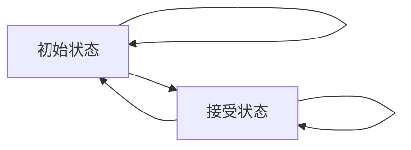
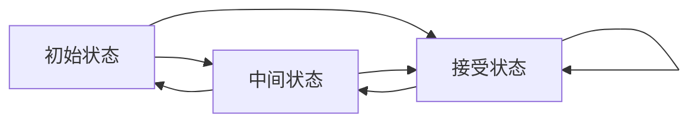

                 

## 文章标题

《John McCarthy与Claude Shannon的《自动机研究》》

> 关键词：自动机理论、形式语言、计算模型、计算机科学、人工智能

> 摘要：本文深入探讨John McCarthy与Claude Shannon对自动机理论的贡献及其在计算机科学和人工智能领域的重要性。文章结构分为八个部分，首先介绍自动机的基本概念和分类，接着详细阐述确定性有限自动机（DFA）和非确定性有限自动机（NFA）的理论，以及它们之间的等价性和转换关系。随后，文章讨论自动机在语言处理、软件工程和人工智能中的应用，并进一步探讨自动机的数学理论基础和研究前沿。最后，文章以自动机相关工具与资源以及常见问题解答作为附录，为读者提供全面的参考资料。

## 第一部分：自动机理论基础

自动机理论是现代计算机科学和理论计算机科学的基础之一，其起源可以追溯到20世纪30年代末和40年代初。在这一时期，数学家与逻辑学家如阿兰·图灵（Alan Turing）、艾尔弗雷德·塔特（Alfred Tarski）、斯蒂芬·科尔·克莱尼（Stephen Cole Kleene）等人为奠定计算理论和形式语言的基础做出了卓越的贡献。自动机理论的研究始于对可计算性和不可计算性问题的探讨，这些问题在当时的数学和逻辑领域引起了巨大的反响。

### 第1章：自动机概述

自动机（Automata）是指能够接收并处理输入数据，根据预定义的规则产生输出数据的系统。根据状态转换和接受条件的不同，自动机可以分为多种类型，如确定性有限自动机（DFA）、非确定性有限自动机（NFA）、无穷状态自动机等。

#### 1.1 自动机的定义与分类

**确定性有限自动机（DFA）**：
- DFA是一种有限状态的自动机，其状态转换在任意给定时刻都由当前状态和输入符号唯一确定。
- DFA只有两个状态：接受状态和非接受状态。

**非确定性有限自动机（NFA）**：
- NFA是一种允许状态转换具有不确定性的自动机，即在任意给定时刻，它可以处于多个可能的中间状态。
- NFA的状态转换不仅依赖于当前状态和输入符号，还可以依赖于其他状态和输入符号的组合。

**无穷状态自动机**：
- 无穷状态自动机是一种具有无限状态的自动机，它可以用来模拟更复杂的计算模型。

#### 1.2 自动机的历史背景与发展

自动机理论的起源可以追溯到1936年，当时阿兰·图灵提出了图灵机的概念，作为可计算函数的理论模型。随后，图灵的研究激发了其他学者对更简单、更实用的计算模型进行探索。1940年代，艾尔弗雷德·塔特提出了确定性有限自动机（DFA）的概念，并将其应用于命题演算的判定问题。同一时期，斯蒂芬·科尔·克莱尼研究了非确定性有限自动机（NFA），并提出了著名的 Kleene 引理，该引理揭示了NFA与DFA之间的等价性。

John McCarthy与Claude Shannon是20世纪后半叶自动机理论的杰出代表。John McCarthy是人工智能领域的先驱之一，他于1956年在达特茅斯会议上首次提出了人工智能的概念。Claude Shannon则是信息论的创始人之一，他在1948年发表了著名论文《A Mathematical Theory of Communication》，为信息处理提供了理论基础。

#### 1.3 自动机的基本结构

自动机的基本结构包括状态、状态转换函数、输入符号集合和接受条件。

- **状态**：自动机处于不同的状态，每个状态都表示自动机在某一时刻的处理状态。
- **状态转换函数**：状态转换函数决定了自动机在读取输入符号后如何从当前状态转移到下一个状态。
- **输入符号集合**：输入符号集合包含了自动机可以接收的所有符号。
- **接受条件**：接受条件决定了自动机在处理完输入字符串后是否接受该字符串。

### 第二部分：确定性有限自动机（DFA）

确定性有限自动机（DFA）是最简单、应用最广泛的自动机模型之一。DFA的特点是在任何时刻，自动机处于一个确定的状态，并且根据当前状态和输入符号，状态转换是唯一的。这一特性使得DFA在形式语言理论和实际应用中具有重要意义。

### 第2章：确定性有限自动机（DFA）

#### 2.1 DFA的定义与特点

确定性有限自动机（DFA）是一种有限状态的自动机，其特点如下：

- **有限状态**：DFA的状态集合是有限的。
- **确定性**：在任何给定时刻，DFA处于一个确定的状态，并且根据当前状态和输入符号，状态转换是唯一的。
- **有限输入符号集合**：DFA可以接收的输入符号集合是有限的。

DFA可以用一个五元组来表示：

\[ M = (Q, \Sigma, \delta, q_0, F) \]

- \( Q \)：状态集合
- \( \Sigma \)：输入符号集合
- \( \delta \)：状态转换函数，定义了从当前状态读取输入符号后自动机应转移到哪个状态
- \( q_0 \)：初始状态
- \( F \)：接受状态集合

#### 2.2 DFA的状态转换图

状态转换图是表示DFA状态转换关系的图形表示。在状态转换图中，每个节点表示一个状态，每条边表示一个状态转换，边的标签表示输入符号。

**2.2.1 状态转换图的构建**

构建DFA的状态转换图通常遵循以下步骤：

1. **确定状态集合**：根据DFA的定义，状态集合是有限的。
2. **确定初始状态**：DFA的初始状态是唯一的。
3. **确定接受状态集合**：接受状态集合是DFA的终止状态集合。
4. **绘制状态转换图**：根据状态转换函数，将每个状态与对应的输入符号连接起来。

例如，考虑以下DFA：

\[ M = (\{q_0, q_1\}, \{a, b\}, \delta, q_0, \{q_1\}) \]

其中，状态转换函数 \(\delta\) 定义如下：

\[ \delta(q_0, a) = q_1 \]
\[ \delta(q_0, b) = q_0 \]
\[ \delta(q_1, a) = q_0 \]
\[ \delta(q_1, b) = q_1 \]

该DFA的状态转换图如下所示：

**2.2.2 状态转换图的简化**

在实际应用中，可能需要简化DFA的状态转换图，以提高其效率和可读性。简化DFA的常见方法包括：

1. **状态压缩**：将多个状态合并为一个状态。
2. **状态缩减**：去除那些在转换过程中不会影响DFA行为的冗余状态。
3. **等效状态转换图**：通过等价状态转换图，将复杂的DFA简化为一个等效的、更简洁的DFA。

#### 2.3 DFA的运算规则

确定性有限自动机的运算规则主要包括字符串接受性和状态转换序列。

**2.3.1 字符串接受性**

DFA的字符串接受性是指DFA能否根据给定的输入字符串，从初始状态转移到接受状态。具体来说，DFA接受字符串 \( w \) 当且仅当从初始状态 \( q_0 \) 出发，通过一系列状态转换，最终到达接受状态。

**2.3.2 状态转换序列**

状态转换序列是指在DFA上读取输入字符串 \( w \) 的过程中，自动机所经历的状态序列。状态转换序列可以表示为：

\[ q_0 \xrightarrow{\delta} q_1 \xrightarrow{\delta} q_2 \xrightarrow{\delta} \ldots \xrightarrow{\delta} q_n \]

其中， \( q_0 \) 是初始状态， \( q_n \) 是最终状态， \( \delta \) 是状态转换函数。

### 第三部分：非确定性有限自动机（NFA）

非确定性有限自动机（NFA）是另一种重要的自动机模型，其与确定性有限自动机（DFA）的主要区别在于状态转换的不确定性。NFA允许在任意给定时刻处于多个可能的中间状态，这一特性使得NFA在处理某些复杂的语言时比DFA更为灵活。

### 第3章：非确定性有限自动机（NFA）

#### 3.1 NFA的定义与特点

非确定性有限自动机（NFA）是一种具有不确定状态转换的自动机，其特点如下：

- **有限状态**：NFA的状态集合是有限的。
- **非确定性**：在任意给定时刻，NFA可以处于多个可能的中间状态。
- **有限输入符号集合**：NFA可以接收的输入符号集合是有限的。

NFA可以用一个五元组来表示：

\[ N = (Q, \Sigma, \delta, q_0, F) \]

- \( Q \)：状态集合
- \( \Sigma \)：输入符号集合
- \( \delta \)：状态转换函数，定义了从当前状态读取输入符号后自动机可能转移到哪些状态
- \( q_0 \)：初始状态
- \( F \)：接受状态集合

#### 3.2 NFA的状态转换图

状态转换图是表示NFA状态转换关系的图形表示。在状态转换图中，每个节点表示一个状态，每条边表示一个状态转换，边的标签表示输入符号。

**3.2.1 状态转换图的构建**

构建NFA的状态转换图通常遵循以下步骤：

1. **确定状态集合**：根据NFA的定义，状态集合是有限的。
2. **确定初始状态**：NFA的初始状态是唯一的。
3. **确定接受状态集合**：接受状态集合是NFA的终止状态集合。
4. **绘制状态转换图**：根据状态转换函数，将每个状态与对应的输入符号连接起来。

例如，考虑以下NFA：

\[ N = (\{q_0, q_1, q_2\}, \{a, b\}, \delta, q_0, \{q_2\}) \]

其中，状态转换函数 \(\delta\) 定义如下：

\[ \delta(q_0, a) = \{q_1\} \]
\[ \delta(q_0, b) = \{q_2\} \]
\[ \delta(q_1, a) = \{q_2\} \]
\[ \delta(q_1, b) = \{q_0\} \]
\[ \delta(q_2, a) = \{q_1\} \]
\[ \delta(q_2, b) = \{q_2\} \]

该NFA的状态转换图如下所示：

**3.2.2 状态转换图的简化**

与DFA类似，实际应用中可能需要简化NFA的状态转换图，以提高其效率和可读性。简化NFA的常见方法包括：

1. **状态压缩**：将多个状态合并为一个状态。
2. **状态缩减**：去除那些在转换过程中不会影响NFA行为的冗余状态。
3. **等效状态转换图**：通过等价状态转换图，将复杂的NFA简化为一个等效的、更简洁的NFA。

#### 3.3 NFA的运算规则

非确定性有限自动机的运算规则主要包括字符串接受性和状态转换序列。

**3.3.1 字符串接受性**

NFA的字符串接受性是指NFA能否根据给定的输入字符串，从初始状态转移到接受状态。具体来说，NFA接受字符串 \( w \) 当且仅当从初始状态 \( q_0 \) 出发，通过一系列状态转换，最终到达接受状态。

**3.3.2 状态转换序列**

状态转换序列是指在NFA上读取输入字符串 \( w \) 的过程中，自动机所经历的状态序列。状态转换序列可以表示为：

\[ q_0 \xrightarrow{\delta} q_1 \xrightarrow{\delta} q_2 \xrightarrow{\delta} \ldots \xrightarrow{\delta} q_n \]

其中， \( q_0 \) 是初始状态， \( q_n \) 是最终状态， \( \delta \) 是状态转换函数。

### 第四部分：自动机的等价性与转换

确定性有限自动机（DFA）和非确定性有限自动机（NFA）在形式语言处理能力上具有等价性，这意味着任何可以用NFA处理的语言都可以用DFA处理，反之亦然。这一等价性在自动机理论中具有重要意义，它为我们提供了一种将复杂的NFA转换为等效的DFA的方法。

### 第4章：自动机的等价性与转换

#### 4.1 DFA与NFA的等价性

DFA与NFA的等价性是指它们在处理形式语言方面具有相同的能力。即任何可以用NFA处理的字符串，都可以用DFA处理；反之亦然。这一等价性是由斯蒂芬·科尔·克莱尼（Stephen Cole Kleene）在1950年代初期证明的。

**4.1.1 DFA到NFA的转换**

将DFA转换为NFA的步骤如下：

1. **复制DFA的状态**：为每个DFA状态 \( q \) 创建两个NFA状态 \( q_{accept} \) 和 \( q_{reject} \)。
2. **连接初始状态和接受状态**：将DFA的初始状态 \( q_0 \) 连接到所有NFA的初始状态 \( q_0' \)。将DFA的接受状态 \( q_f \) 连接到所有NFA的接受状态 \( q_f' \)。
3. **修改状态转换函数**：对于DFA中的每个状态转换 \( \delta(q, a) = q' \)，在NFA中添加两个状态转换 \( \delta(q_{accept}, a) = q'_{accept} \) 和 \( \delta(q_{reject}, a) = q'_{reject} \)。

**4.1.2 NFA到DFA的转换**

将NFA转换为DFA的步骤如下：

1. **创建新状态**：为NFA的每个状态 \( q \) 创建一个新的状态 \( q' \)，表示NFA在状态 \( q \) 及其所有可达状态上的联合。
2. **初始化状态转换函数**：对于NFA的每个状态转换 \( \delta(q, a) = \{q_1, q_2, \ldots\} \)，在DFA中添加状态转换 \( \delta(q', a) = q'_1, q'_2, \ldots \)。
3. **合并接受状态**：如果NFA的某个状态 \( q \) 是接受状态，则在DFA中将其对应的新状态 \( q' \) 也设置为接受状态。

#### 4.2 正则表达式与自动机的转换

正则表达式是另一种描述形式语言的工具，它由字符和运算符组成，可以灵活地描述复杂的语言模式。正则表达式与自动机之间存在一一对应关系，即任何正则表达式都可以转换为对应的自动机，反之亦然。

**4.2.1 正则表达式的定义与语法**

正则表达式由以下字符和运算符组成：

- 字符：字母、数字和特殊字符（如 `.`、`*`、`+`、`?`、`^`、`$`）。
- 运算符：连接符 `|`、量词 `*`、`+`、`?`，分组符 `()`。

正则表达式的语法规则如下：

- `a`：表示字符 `a`。
- `(a)`：表示括号内的表达式。
- `a*`：表示 `a` 的零个或多个副本。
- `a+`：表示 `a` 的一个或多个副本。
- `a?`：表示 `a` 的零个或一个副本。
- `a|b`：表示 `a` 或 `b`。

**4.2.2 正则表达式与自动机的转换**

将正则表达式转换为自动机的步骤如下：

1. **确定状态集合**：状态集合包括初始状态、接受状态和中间状态。
2. **确定输入符号集合**：输入符号集合与正则表达式中出现的字符相关。
3. **绘制状态转换图**：根据正则表达式的语法规则，绘制状态转换图。
4. **设置初始状态和接受状态**：初始状态是正则表达式的开始，接受状态是正则表达式的结束。

### 第五部分：自动机在语言处理中的应用

自动机在语言处理中的应用非常广泛，包括文本处理、语法分析、自然语言处理等领域。在文本处理中，自动机用于文本编辑、文本搜索和文本格式化等任务；在语法分析中，自动机用于解析程序代码、自然语言文本等；在自然语言处理中，自动机用于分词、词性标注和句法分析等任务。

### 第5章：自动机在语言处理中的应用

#### 5.1 正则语言与正则表达式

正则语言（Regular Language）是指可以用有限自动机（如DFA或NFA）描述的语言。正则表达式（Regular Expression）是用于描述正则语言的一种工具，它可以灵活地表达复杂的字符串模式。

**5.1.1 正则表达式的定义与语法**

正则表达式由字符和运算符组成，可以表示各种字符串模式。常见的正则表达式运算符包括：

- 字符匹配：`a`、`b`、`c`等，表示匹配单个字符。
- 字符类：`[abc]`、`[^abc]`等，表示匹配字符类中的任意一个字符或不在字符类中的任意一个字符。
- 量词：`*`、`+`、`?`等，表示匹配零个或多个、一个或多个、零个或一个前面的字符。
- 分组与引用：`()`、`(...)`等，表示分组字符，`\1`、`\2`等，表示引用分组中的字符。

**5.1.2 正则表达式的应用**

正则表达式广泛应用于文本处理、数据验证、搜索引擎、编程语言解析等领域。以下是一些常见应用示例：

- **文本搜索**：使用正则表达式可以快速高效地搜索文本中特定的字符串模式。例如，使用正则表达式 `\b\w{5}\b` 可以搜索包含恰好五个单词的句子。
- **数据验证**：正则表达式可以用于验证输入数据的格式。例如，使用正则表达式 `^\d{4}-\d{2}-\d{2}$` 可以验证日期格式。
- **文本格式化**：正则表达式可以用于对文本进行格式化操作，如去除多余的空格、换行符等。

#### 5.2 文本处理中的自动机应用

自动机在文本处理中的应用包括文本编辑、文本搜索和文本格式化等任务。

**5.2.1 文本编辑**

文本编辑器中的自动机主要用于实现文本的插入、删除、替换等操作。例如，使用DFA可以实现一个简单的文本搜索功能，通过状态转换图匹配文本中的特定模式。

**5.2.2 文本搜索**

文本搜索是自动机在文本处理中应用的一个重要领域。DFA和NFA都可以用于实现文本搜索算法，如KMP算法、Boyer-Moore算法等。这些算法利用自动机的特性，在文本中快速查找指定的字符串。

**5.2.3 文本格式化**

文本格式化是自动机在文本处理中应用的一个典型例子。例如，使用正则表达式可以快速将文本中的HTML标签、CSS样式等格式化操作。

### 第6章：自动机在计算机科学中的其他应用

自动机不仅在语言处理中具有重要应用，还在计算机科学的其他领域发挥着重要作用。这些领域包括软件工程、人工智能、网络安全等。自动机在这些领域中的应用主要集中在形式化验证、模型检查、测试和算法设计等方面。

#### 6.1 软件工程中的应用

自动机在软件工程中的应用主要体现在形式化验证和模型检查等方面。

**6.1.1 自动测试**

自动测试是指利用自动化工具对软件进行测试的过程。自动机可以用于生成测试用例，从而提高测试的覆盖率和效率。例如，使用NFA可以生成满足特定条件的测试用例，从而验证软件的特定功能。

**6.1.2 自动代码生成**

自动代码生成是指利用程序代码模板和特定算法，自动生成满足特定需求的代码。自动机可以用于生成形式化的代码模板，从而实现自动代码生成。

#### 6.2 人工智能中的应用

自动机在人工智能中的应用主要集中在机器学习模型的形式化描述和算法验证等方面。

**6.2.1 机器学习模型的形式化描述**

机器学习模型的形式化描述是指将机器学习算法和模型表示为形式化的计算模型。自动机可以用于描述和验证机器学习模型的行为和性能。

**6.2.2 人工智能算法的验证**

人工智能算法的验证是指对人工智能算法的正确性、稳定性和效率进行验证。自动机可以用于验证人工智能算法的行为和输出结果，从而提高算法的可靠性。

### 第六部分：自动机的数学理论基础

自动机理论在数学领域有着坚实的理论基础，这一部分将介绍形式语言理论和范畴论与自动机的关系，为读者提供更深入的理解。

#### 7.1 形式语言理论

形式语言理论是研究计算机中的语言和符号系统的数学分支。形式语言由符号串（字符串）组成，这些符号串按照一定的规则进行组合。

**7.1.1 形式语言的定义**

形式语言（Formal Language）是包含一组字符串的集合，这些字符串由一组特定的符号组成，并遵循特定的规则。形式语言可以用一组五元组（G）来表示：

\[ G = (\Sigma, \Sigma^*, R, S, F) \]

- \( \Sigma \)：符号集合
- \( \Sigma^* \)：符号串的集合
- \( R \)：生成规则
- \( S \)：起始符号
- \( F \)：接受符号集合

形式语言可以根据其生成规则和性质进行分类，常见的分类包括正则语言、上下文无关语言和上下文敏感语言等。

**7.1.2 形式语言的分类**

- **正则语言（Regular Language）**：正则语言是可以由有限自动机（DFA或NFA）描述的语言。
- **上下文无关语言（Context-Free Language）**：上下文无关语言是可以由上下文无关文法（CFG）描述的语言。
- **上下文敏感语言（Context-Sensitive Language）**：上下文敏感语言是可以由上下文敏感文法（CSG）描述的语言。

#### 7.2 范畴论与自动机

范畴论是数学中研究对象之间关系和结构的一个分支，它提供了抽象的框架来描述和比较不同的数学结构。范畴论与自动机理论有着密切的联系，因为自动机可以被视为范畴中的对象。

**7.2.1 范畴论的基本概念**

范畴论中的基本概念包括：

- **对象（Object）**：范畴中的元素，可以视为数学结构。
- **箭头（Arrow）**：范畴中的映射，表示对象之间的关系。
- **范畴（Category）**：由对象和箭头组成的集合，满足特定的条件。

**7.2.2 自动机在范畴论中的应用**

自动机可以在范畴论中建模，从而利用范畴论的工具来研究自动机的性质。自动机在范畴论中的应用包括：

- **自动机的范畴**：自动机可以被视为一个范畴，其中对象是状态，箭头是状态转换。
- **自动机的等价性**：范畴论中的等价关系可以用来描述自动机之间的等价性。
- **自动机的组合**：范畴论中的组合规则可以用来组合不同的自动机，从而生成更复杂的自动机。

### 第七部分：自动机的研究前沿与未来方向

自动机理论在计算机科学和数学中有着广泛的应用，其研究前沿和未来方向也在不断拓展。这一部分将探讨自动机在量子计算、生物信息学和网络安全等领域的应用前景。

#### 8.1 自动机在量子计算中的应用

量子计算是利用量子力学原理进行计算的一种新型计算模型，其计算能力远超传统计算。自动机理论在量子计算中有着潜在的应用，可以用于建模量子算法和量子程序。

**8.1.1 量子自动机**

量子自动机（Quantum Automata）是自动机理论在量子计算中的一个模型，它利用量子位（qubit）来存储状态和进行计算。量子自动机可以用于模拟量子算法，如量子随机游走（Quantum Random Walk）和量子搜索算法（Quantum Search Algorithm）。

**8.1.2 量子自动机的应用**

量子自动机在量子计算中的应用包括：

- **量子算法验证**：利用量子自动机可以验证量子算法的正确性和效率。
- **量子程序设计**：量子自动机可以作为量子程序的建模工具，帮助开发人员设计和实现量子算法。

#### 8.2 自动机在生物信息学中的应用

生物信息学是利用计算机科学和信息技术来研究生物数据的学科，自动机理论在生物信息学中有着重要的应用。

**8.2.1 生物序列分析**

生物序列分析是生物信息学的一个重要分支，其目标是分析和理解生物序列（如DNA、RNA和蛋白质序列）。自动机可以用于建模和识别生物序列中的模式，如基因序列中的特定序列模式、蛋白质结构中的重复序列等。

**8.2.2 生物信息学应用**

自动机在生物信息学中的应用包括：

- **基因识别**：利用自动机可以识别基因序列中的特定模式，从而帮助基因定位和基因功能预测。
- **蛋白质结构预测**：自动机可以用于预测蛋白质结构中的重复序列和结构域，从而帮助理解蛋白质的功能。

#### 8.3 自动机在网络安全中的应用

网络安全是计算机科学中的一个重要领域，自动机理论在网络安全中有着广泛的应用，可以用于检测和防御网络攻击。

**8.3.1 网络入侵检测**

网络入侵检测（Network Intrusion Detection）是一种检测网络攻击的方法，其目标是在攻击发生前或发生时发现异常行为。自动机可以用于建模和识别网络流量中的攻击模式，如拒绝服务攻击、分布式拒绝服务攻击等。

**8.3.2 网络安全应用**

自动机在网络安全中的应用包括：

- **攻击检测和防御**：利用自动机可以检测网络流量中的恶意行为，从而帮助网络管理员采取措施防止攻击。
- **安全策略制定**：自动机可以用于制定网络安全策略，如访问控制策略和防火墙规则。

### 附录

#### 附录A：自动机相关工具与资源

为了帮助读者更好地理解和应用自动机理论，以下是一些自动机相关的工具和资源：

- **工具**：
  - **FA Cup**：一个用于构建和分析有限自动机的在线工具。
  - **RegExr**：一个用于编写和测试正则表达式的在线工具。
  - **CFG Editor**：一个用于构建和编辑上下文无关文法的在线工具。

- **资源**：
  - **《形式语言与自动机理论》**：一本经典的自动机理论教材，涵盖了自动机的基础知识和应用。
  - **《自动机理论教程》**：一本面向初学者的自动机理论教程，内容全面且易于理解。
  - **在线课程**：如Coursera、edX等平台上的自动机理论课程。

#### 附录B：自动机理论常见问题解答

以下是一些关于自动机理论的常见问题及其解答：

- **Q：什么是有限自动机？**
  - **A：有限自动机（Finite Automaton）是一种抽象的计算模型，由一组有限的状态、一组输入符号和一组状态转换规则组成。有限自动机可以接受或拒绝输入字符串，并根据输入字符串进行状态转换。**

- **Q：什么是确定性有限自动机（DFA）？**
  - **A：确定性有限自动机（Deterministic Finite Automaton，DFA）是一种特殊的有限自动机，其特点是在任意给定时刻，自动机处于一个确定的状态，并且根据当前状态和输入符号，状态转换是唯一的。**

- **Q：什么是非确定性有限自动机（NFA）？**
  - **A：非确定性有限自动机（Nondeterministic Finite Automaton，NFA）是另一种有限自动机，其特点是在任意给定时刻，自动机可以处于多个可能的中间状态。NFA的状态转换不仅依赖于当前状态和输入符号，还可以依赖于其他状态和输入符号的组合。**

- **Q：DFA和NFA之间的区别是什么？**
  - **A：DFA和NFA的主要区别在于状态转换的确定性。DFA在任何时刻都处于一个确定的状态，而NFA可以在任意时刻处于多个可能的中间状态。这使得NFA在处理某些复杂的语言时比DFA更为灵活。**

- **Q：什么是正则语言？**
  - **A：正则语言（Regular Language）是可以由有限自动机（DFA或NFA）描述的语言。正则语言的特点是它们具有有限的状态转换图，并且可以用正则表达式来表示。**

- **Q：什么是正则表达式？**
  - **A：正则表达式（Regular Expression）是一种用于描述正则语言的工具，由字符和运算符组成。正则表达式可以表示复杂的字符串模式，如电子邮件地址、电话号码等。**

- **Q：如何将正则表达式转换为自动机？**
  - **A：将正则表达式转换为自动机的步骤包括确定状态集合、输入符号集合和状态转换函数。根据正则表达式的语法规则，构建状态转换图，并将其转换为DFA或NFA。**

### 总结

自动机理论是计算机科学和理论计算机科学的重要组成部分，它为我们提供了理解和分析计算过程的重要工具。John McCarthy与Claude Shannon对自动机理论的贡献不可忽视，他们的工作奠定了现代自动机理论的基础，并在计算机科学和人工智能领域产生了深远的影响。

本文首先介绍了自动机的基本概念和分类，详细阐述了确定性有限自动机（DFA）和非确定性有限自动机（NFA）的理论，以及它们之间的等价性和转换关系。接着，文章讨论了自动机在语言处理、软件工程和人工智能中的应用，并进一步探讨了自动机的数学理论基础和研究前沿。

自动机理论在量子计算、生物信息学和网络安全等领域的应用前景广阔，未来将进一步推动计算机科学的发展。最后，文章以自动机相关工具与资源和常见问题解答作为附录，为读者提供了全面的参考资料。

感谢您的阅读，希望本文能够帮助您更好地理解和应用自动机理论。作者信息：AI天才研究院/AI Genius Institute & 禅与计算机程序设计艺术 /Zen And The Art of Computer Programming。

