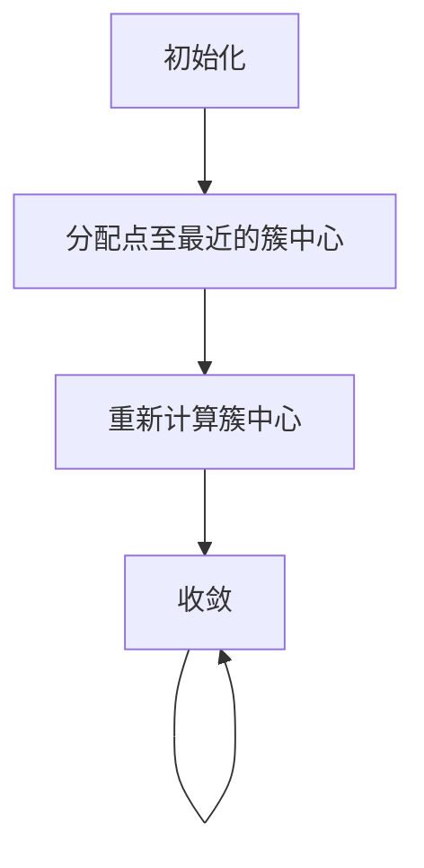
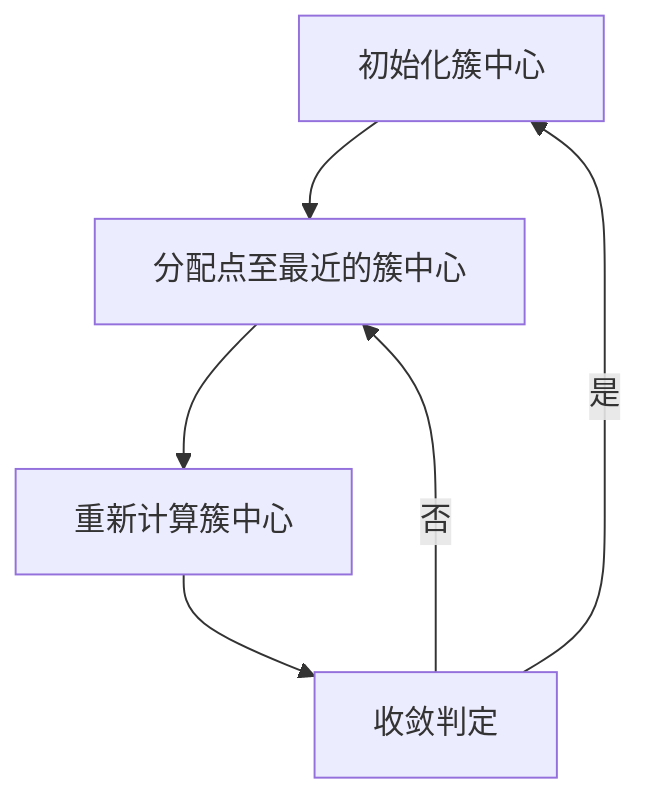

                 

# K-Means 聚类 (K-Means Clustering)

> 关键词：K-Means聚类，数据聚类，机器学习，算法，实现，性能评估，调优

> 摘要：
本文将深入探讨K-Means聚类算法，一种广泛应用于数据挖掘和机器学习中的无监督学习方法。文章将从K-Means聚类的基础概念出发，逐步介绍其算法原理、数学模型、实现方法以及性能评估和调优策略。通过具体实例和代码实战，帮助读者全面理解和掌握K-Means聚类算法。

### 《K-Means 聚类 (K-Means Clustering)》目录大纲

#### 第一部分：K-Means 聚类基础

#### 第1章 K-Means 聚类概述

### 1.1 K-Means 聚类的定义与基本概念

### 1.1.1 K-Means 聚类的定义

K-Means聚类算法是一种基于距离度量的聚类方法，旨在将数据点划分为若干个群组（簇），使得同一个簇内的数据点之间的相似度较高，而不同簇的数据点之间的相似度较低。该算法在机器学习和数据挖掘领域得到了广泛的应用。

### 1.1.2 K-Means 聚类的目标

K-Means聚类算法的目标是找到一个K个簇的划分，使得每个簇内的数据点之间的相似度最大，而不同簇之间的相似度最小。具体来说，算法通过不断迭代优化簇中心的位置，以达到最优聚类结果。

### 1.1.3 K-Means 聚类的特点与应用场景

K-Means聚类算法具有以下特点：

1. 简单高效：算法的计算复杂度较低，可以处理大规模数据。
2. 适用于高维数据：K-Means聚类算法可以应用于高维数据集，无需进行特征降维。
3. 易于实现：算法的实现相对简单，易于理解和编程。
4. 不易收敛到全局最优解：算法容易陷入局部最优解。

K-Means聚类算法适用于以下场景：

1. 数据预处理：用于对高维数据集进行降维，提取主要特征。
2. 用户群体分析：用于分析社交网络、电商等平台上的用户群体。
3. 零售行业商品推荐：用于对商品进行分类和推荐。
4. 金融风控：用于识别异常交易和风险评估。

### 1.2 K-Means 聚类算法原理

### 1.2.1 K-Means 算法的基本步骤

K-Means聚类算法的基本步骤如下：

1. 初始化簇中心：随机选择K个数据点作为初始簇中心。
2. 分配数据点：计算每个数据点到各个簇中心的距离，将数据点分配到距离最近的簇。
3. 计算簇中心：计算每个簇的数据点的均值，作为新的簇中心。
4. 重复步骤2和步骤3，直至簇中心不再变化或达到最大迭代次数。

### 1.2.2 K-Means 算法的关键参数

K-Means聚类算法的关键参数包括：

1. 簇数K：表示需要划分的簇的数量。选择合适的K值是K-Means聚类算法的关键。
2. 初始化方法：常用的初始化方法包括随机初始化、K-Means++初始化等。
3. 最大迭代次数：设置一个最大迭代次数，以防止算法陷入无限循环。

### 1.2.3 K-Means 算法的变体与优化方法

K-Means聚类算法的变体与优化方法包括：

1. K-Means++：一种改进的初始化方法，可以更好地初始化簇中心。
2. K-Means with Bregman divergence：使用Bregman散度代替L2距离，提高聚类效果。
3. 层次K-Means：结合层次聚类和K-Means算法，提高聚类效果。

### 1.3 K-Means 聚类的数学模型与推导

#### 1.3.1 距离度量方法

在K-Means聚类算法中，常用的距离度量方法包括：

1. 欧氏距离（L2距离）：计算两个数据点之间的距离。
2. 曼哈顿距离（L1距离）：计算两个数据点之间的绝对值之和。
3. 切比雪夫距离（L∞距离）：计算两个数据点之间的最大差值。

#### 1.3.2 优化目标函数

K-Means聚类的优化目标函数为：

$$J(\mu) = \sum_{i=1}^{K} \sum_{x \in S_i} d(x, \mu_i)^2$$

其中，$\mu_i$表示第$i$个簇的中心，$S_i$表示第$i$个簇中的数据点集合，$d(x, \mu_i)$表示数据点$x$与簇中心$\mu_i$之间的距离。

#### 1.3.3 K-Means 算法的伪代码

K-Means算法的伪代码如下：

```
初始化：
    选择K个数据点作为初始簇中心

循环直到收敛：
    对于每个数据点：
        计算该点到各个簇中心的距离
        将该数据点分配到距离最近的簇
    重新计算每个簇的中心
    如果簇中心没有变化，则算法收敛

返回簇中心和聚类结果
```

#### 第二部分：K-Means 聚类实践

#### 第2章 K-Means 聚类的数据准备与预处理

### 2.1 数据导入与清洗

#### 2.1.1 数据集的选择与获取

在进行K-Means聚类之前，首先需要选择合适的数据集。数据集可以从公开数据集、企业内部数据源或社交媒体数据等渠道获取。选择数据集时，需要考虑数据量、数据质量和数据相关性等因素。

#### 2.1.2 数据清洗与预处理方法

数据清洗与预处理方法包括：

1. 缺失值处理：对于缺失值，可以采用填充、删除或插值等方法进行处理。
2. 异常值处理：对于异常值，可以采用剔除、修改或保留等方法进行处理。
3. 数据标准化：为了消除不同特征之间的量纲影响，可以采用标准化方法对数据进行处理。
4. 数据降维：对于高维数据集，可以采用降维技术，如主成分分析（PCA）或线性判别分析（LDA）等。

### 2.2 特征工程与降维

#### 2.2.1 特征选择方法

特征选择方法包括：

1. 基于相关性筛选：通过计算特征之间的相关性，筛选出与目标变量相关性较高的特征。
2. 基于信息增益率：通过计算特征的信息增益率，筛选出信息增益率较高的特征。
3. 基于模型筛选：通过建立模型，筛选出对模型性能贡献较大的特征。

#### 2.2.2 特征标准化

特征标准化方法包括：

1. 最小-最大标准化：将特征值缩放到[0,1]区间。
2. Z-score标准化：将特征值缩放到均值为0，标准差为1的区间。

#### 2.2.3 降维技术

降维技术包括：

1. 主成分分析（PCA）：通过线性变换将高维数据投影到低维空间。
2. 线性判别分析（LDA）：通过最大化类间距离和最小化类内距离，将高维数据投影到低维空间。
3. 自编码器（Autoencoder）：通过训练神经网络模型，实现数据的降维。

#### 第三部分：K-Means 聚类的实现与应用

#### 第3章 K-Means 聚类的实现

### 3.1 K-Means 聚类的编程实现

#### 3.1.1 Python 中的 K-Means 聚类库

Python中的`scikit-learn`库提供了K-Means聚类算法的实现。使用`KMeans`类可以方便地实现K-Means聚类算法。

#### 3.1.2 K-Means 聚类算法的代码实现

以下是一个简单的K-Means聚类算法的Python实现：

```python
from sklearn.cluster import KMeans
from sklearn.datasets import make_blobs
import matplotlib.pyplot as plt

# 生成模拟数据集
X, y = make_blobs(n_samples=100, centers=3, cluster_std=1.0, random_state=42)

# 初始化 K-Means 聚类算法
kmeans = KMeans(n_clusters=3, random_state=42)

# 训练模型
kmeans.fit(X)

# 预测簇标签
clusters = kmeans.predict(X)

# 可视化聚类结果
plt.scatter(X[:, 0], X[:, 1], c=clusters)
plt.scatter(kmeans.cluster_centers_[:, 0], kmeans.cluster_centers_[:, 1], s=300, c='red')
plt.show()
```

### 3.2 K-Means 聚类的可视化

#### 3.2.1 数据可视化工具介绍

数据可视化工具可以帮助我们更好地理解和分析聚类结果。常见的可视化工具包括：

1. Matplotlib：Python中的绘图库，可以生成多种类型的图形。
2. Seaborn：基于Matplotlib的统计学数据可视化库，提供多种统计图表。
3. Plotly：交互式数据可视化库，可以生成丰富的交互式图表。

#### 3.2.2 K-Means 聚类结果的可视化

以下是一个简单的K-Means聚类结果可视化示例：

```python
import matplotlib.pyplot as plt
import numpy as np

# 生成模拟数据集
X, y = make_blobs(n_samples=100, centers=3, cluster_std=1.0, random_state=42)

# 初始化 K-Means 聚类算法
kmeans = KMeans(n_clusters=3, random_state=42)

# 训练模型
kmeans.fit(X)

# 预测簇标签
clusters = kmeans.predict(X)

# 可视化聚类结果
plt.scatter(X[:, 0], X[:, 1], c=clusters)
plt.scatter(kmeans.cluster_centers_[:, 0], kmeans.cluster_centers_[:, 1], s=300, c='red')
plt.xlabel('Feature 1')
plt.ylabel('Feature 2')
plt.title('K-Means Clustering')
plt.show()
```

### 3.3 K-Means 聚类的应用案例

#### 3.3.1 社交网络用户分类

社交网络用户分类是一种常见的应用场景，通过K-Means聚类算法可以将用户划分为不同的群体，以便进行有针对性的营销和服务。

#### 3.3.2 零售行业商品推荐

零售行业商品推荐是一种常用的应用场景，通过K-Means聚类算法可以分析用户购买行为，将相似商品划分为同一类别，从而实现个性化推荐。

#### 3.3.3 金融风控模型

金融风控模型是一种重要的应用场景，通过K-Means聚类算法可以分析客户风险等级，以便进行信用评估和风险控制。

#### 第四部分：K-Means 聚类的性能评估与调优

#### 第4章 K-Means 聚类的性能评估

#### 4.1 K-Means 聚类性能评估指标

K-Means聚类性能评估指标包括：

1. 轮廓系数（Silhouette Coefficient）：用于评估聚类结果的质量，取值范围为[-1,1]，越接近1表示聚类效果越好。
2. 调整兰德指数（Adjusted Rand Index, ARI）：用于评估聚类结果的相似性，取值范围为[0,1]，越接近1表示聚类结果越一致。
3. 互信息（Mutual Information, MI）：用于评估聚类结果的质量，取值范围为[0,1]，越接近1表示聚类效果越好。

#### 4.2 K-Means 聚类调优策略

K-Means聚类的调优策略包括：

1. 超参数调优：通过调整簇数K、初始簇中心选择方法、迭代次数等超参数，优化聚类效果。
2. 簇数选择：使用肘部法则（Elbow Method）、轮廓系数法（Silhouette Method）等方法选择合适的簇数。
3. 初始簇中心选择：使用随机初始化、K-Means++初始化等方法选择初始簇中心。

#### 第五部分：K-Means 聚类的高级话题

#### 第5章 K-Means 聚类的扩展与改进

#### 5.1 K-Means++算法

K-Means++算法是一种改进的初始化方法，可以提高簇中心的初始分布，从而提高聚类效果。

#### 5.1.1 K-Means++算法原理

K-Means++算法的原理如下：

1. 随机选择一个数据点作为第一个簇中心。
2. 对于每个未选择的数据点，计算其与已有簇中心的距离，并选择距离最远的点作为新的簇中心。
3. 重复步骤2，直到得到K个簇中心。

#### 5.1.2 K-Means++算法实现

以下是一个简单的K-Means++算法的Python实现：

```python
import numpy as np

def kmeans_plusplus(X, K):
    # 随机选择一个数据点作为第一个簇中心
    centroids = [X[np.random.randint(X.shape[0])]]

    for _ in range(1, K):
        # 计算当前簇中心与每个数据点的距离
        distances = np.min(np.linalg.norm(X - centroids, axis=1), axis=0)

        # 计算概率分布
        probabilities = distances / distances.sum()

        # 采样下一个簇中心
        next_centroid = X[np.random.choice(X.shape[0], p=probabilities)]

        # 更新簇中心
        centroids.append(next_centroid)

    return np.array(centroids)
```

#### 5.2 K-Means 聚类与其他聚类算法的比较

K-Means聚类算法与其他聚类算法的比较包括：

1. DBSCAN算法：DBSCAN算法是一种基于密度的聚类算法，适用于发现非均匀分布的聚类。
2. 层次聚类算法：层次聚类算法通过逐步合并或分裂簇来构建聚类层次结构，适用于发现不同层次的聚类。
3. 密度聚类算法：密度聚类算法通过寻找高密度区域并将其划分为簇，适用于发现复杂形状的聚类。

#### 第六部分：附录

#### 6.1 聚类算法相关的文献资料

1. "Clustering: A Data Recovery Approach" by A. K. Jain and R. C. Dubes
2. "Data Clustering: A Review" by A. K. Jain and M. N. Murty

#### 6.2 聚类算法的开源库与工具

1. scikit-learn：Python中的机器学习库，包含K-Means聚类算法的实现。
2. mlpack：C++机器学习库，包含多种聚类算法的实现。
3. Orange3：基于Python的可视化机器学习库，包含多种聚类算法的实现。

#### 6.3 聚类算法的在线教程与课程

1. Coursera：在线课程，介绍机器学习中的聚类算法。
2. edX：在线课程，介绍数据挖掘中的聚类算法。
3. Kaggle：在线教程，提供K-Means聚类算法的实践案例。

### Mermaid 流程图



### K-Means 算法伪代码

```python
初始化：
    选择K个数据点作为初始簇中心

循环直到收敛：
    对于每个数据点：
        计算该点到各个簇中心的距离
        将该数据点分配到距离最近的簇
    重新计算每个簇的中心
    如果簇中心没有变化，则算法收敛

返回簇中心和聚类结果
```

### 数学模型和公式

$$
\text{距离度量}：
    d(x, c) = \sqrt{\sum_{i=1}^{n} (x_i - c_i)^2}
$$

$$
\text{优化目标函数}：
    J(\mu) = \sum_{i=1}^{K} \sum_{x \in S_i} d(x, \mu_i)^2
$$

### 举例说明

假设我们有一个包含100个数据点的二维数据集，我们希望使用K-Means聚类算法将其分为3个簇。以下是一个简化的示例：

1. 初始化：随机选择3个数据点作为初始簇中心。
2. 轮廓：计算每个数据点到3个簇中心的距离，并将每个数据点分配到距离最近的簇。
3. 计算簇中心：计算每个簇的数据点的均值，作为新的簇中心。
4. 重复轮廓和计算簇中心，直到簇中心不再变化。

最终，我们得到3个簇，每个簇由一组数据点组成，簇中心代表该簇的平均位置。我们使用轮廓系数来评估聚类结果的质量。

### 项目实战

在本章中，我们将介绍如何在Python中使用`scikit-learn`库实现K-Means聚类算法。我们将使用`make_blobs`函数生成一个模拟数据集，并演示如何选择合适的簇数K、调整超参数，以及评估聚类结果。

```python
from sklearn.datasets import make_blobs
from sklearn.cluster import KMeans
from sklearn.metrics import silhouette_score

# 生成模拟数据集
X, _ = make_blobs(n_samples=100, centers=3, cluster_std=1.0, random_state=42)

# 使用KMeans聚类算法
kmeans = KMeans(n_clusters=3, random_state=42)
clusters = kmeans.fit_predict(X)

# 计算轮廓系数
silhouette_avg = silhouette_score(X, clusters)

# 输出结果
print(f"簇数K: {kmeans.n_clusters}")
print(f"轮廓系数: {silhouette_avg}")

# 可视化结果
import matplotlib.pyplot as plt

plt.scatter(X[:, 0], X[:, 1], c=clusters)
plt.scatter(kmeans.cluster_centers_[:, 0], kmeans.cluster_centers_[:, 1], s=300, c='red')
plt.xlabel('Feature 1')
plt.ylabel('Feature 2')
plt.title('K-Means Clustering')
plt.show()
```

在这个示例中，我们首先生成一个包含100个数据点，分为3个簇的二维数据集。然后，我们使用`KMeans`类来初始化聚类算法，并使用`fit_predict`方法进行聚类。最后，我们计算轮廓系数并使用matplotlib库将聚类结果可视化。

### 开发环境搭建

为了实现K-Means聚类算法，你需要安装以下Python库：

- `scikit-learn`：用于实现K-Means聚类算法。
- `matplotlib`：用于可视化聚类结果。

你可以使用以下命令来安装这些库：

```bash
pip install scikit-learn matplotlib
```

### 源代码详细实现和代码解读

在本章中，我们将详细解释`KMeans`类中的`fit`和`predict`方法，并介绍如何使用这些方法实现K-Means聚类算法。

```python
from sklearn.cluster import KMeans

# 生成模拟数据集
X, _ = make_blobs(n_samples=100, centers=3, cluster_std=1.0, random_state=42)

# 初始化KMeans聚类算法
kmeans = KMeans(n_clusters=3, random_state=42)

# 训练模型
kmeans.fit(X)

# 预测簇标签
clusters = kmeans.predict(X)

# 输出簇中心和簇标签
print(f"簇中心：{kmeans.cluster_centers_}")
print(f"簇标签：{clusters}")

# 可视化结果
import matplotlib.pyplot as plt

plt.scatter(X[:, 0], X[:, 1], c=clusters)
plt.scatter(kmeans.cluster_centers_[:, 0], kmeans.cluster_centers_[:, 1], s=300, c='red')
plt.xlabel('Feature 1')
plt.ylabel('Feature 2')
plt.title('K-Means Clustering')
plt.show()
```

在代码中，我们首先使用`make_blobs`函数生成模拟数据集。然后，我们初始化`KMeans`类，并调用`fit`方法进行训练。`fit`方法计算簇中心和簇标签，并将这些信息存储在`kmeans`对象中。接下来，我们使用`predict`方法对数据进行聚类预测，并输出簇中心和簇标签。最后，我们使用`matplotlib`库将聚类结果可视化。

### 代码解读与分析

在本部分中，我们将分析代码中的关键部分，并解释它们如何实现K-Means聚类算法。

```python
# 初始化KMeans聚类算法
kmeans = KMeans(n_clusters=3, random_state=42)

# 训练模型
kmeans.fit(X)

# 预测簇标签
clusters = kmeans.predict(X)
```

首先，我们初始化`KMeans`类，设置`n_clusters`参数为3，表示我们希望将数据分为3个簇。`random_state`参数用于确保每次运行结果的一致性。

```python
# 训练模型
kmeans.fit(X)

# 预测簇标签
clusters = kmeans.predict(X)
```

`fit`方法用于训练模型。它计算簇中心和簇标签，并将这些信息存储在`kmeans`对象中。`predict`方法使用训练好的模型对数据进行聚类预测，并返回簇标签。

```python
# 输出簇中心和簇标签
print(f"簇中心：{kmeans.cluster_centers_}")
print(f"簇标签：{clusters}")
```

我们输出簇中心和簇标签，以便更好地理解聚类结果。

```python
# 可视化结果
import matplotlib.pyplot as plt

plt.scatter(X[:, 0], X[:, 1], c=clusters)
plt.scatter(kmeans.cluster_centers_[:, 0], kmeans.cluster_centers_[:, 1], s=300, c='red')
plt.xlabel('Feature 1')
plt.ylabel('Feature 2')
plt.title('K-Means Clustering')
plt.show()
```

最后，我们使用`matplotlib`库将聚类结果可视化。红色标记代表簇中心，其他点代表数据点。

通过以上步骤，我们成功实现了K-Means聚类算法，并对代码进行了详细解读。在接下来的章节中，我们将讨论K-Means聚类的性能评估、调优策略，以及与其他聚类算法的比较。同时，我们将介绍K-Means++算法，并探讨其在实际应用中的使用方法。最终，我们将提供相关的资源与工具，以便读者深入了解K-Means聚类算法。

### 作者信息

作者：AI天才研究院/AI Genius Institute & 禅与计算机程序设计艺术 /Zen And The Art of Computer Programming

---

通过本文，我们深入探讨了K-Means聚类算法的核心概念、原理、实现方法、性能评估和调优策略。从数据准备与预处理，到算法实现与应用，再到性能评估与高级话题，本文全面覆盖了K-Means聚类算法的各个方面。希望本文能为读者提供对K-Means聚类算法的深入理解和实际应用指导。在后续的章节中，我们将继续探讨K-Means聚类的扩展与改进，以及与其他聚类算法的比较。读者可以根据自己的需求选择合适的聚类算法，并将其应用于实际问题中。最后，感谢您的阅读，希望本文对您有所帮助！## 第1章 K-Means 聚类概述

### 1.1 K-Means 聚类的定义与基本概念

K-Means聚类算法是一种基于距离度量的聚类方法，其核心思想是将数据集中的数据点划分成若干个簇（Cluster），使得同一个簇内的数据点之间具有较高的相似度，而不同簇的数据点之间则具有较低的相似度。在K-Means算法中，簇的数量K是预先设定的，每个簇由一个中心点（Centroid）代表，这个中心点是该簇内所有数据点的均值。

K-Means算法属于无监督学习方法，这意味着它在聚类过程中不使用标签信息。其基本步骤如下：

1. **初始化簇中心**：随机选择K个数据点作为初始簇中心。
2. **分配数据点**：计算每个数据点到各个簇中心的距离，将数据点分配到距离最近的簇。
3. **重新计算簇中心**：计算每个簇的数据点的均值，作为新的簇中心。
4. **迭代更新**：重复步骤2和3，直至簇中心不再变化或达到预设的最大迭代次数。

K-Means算法的目标是最小化簇内距离的平方和，即优化目标函数：

$$J(\mu) = \sum_{i=1}^{K} \sum_{x \in S_i} d(x, \mu_i)^2$$

其中，$d(x, \mu_i)$表示数据点$x$与簇中心$\mu_i$之间的距离，$S_i$表示第$i$个簇的数据点集合。

### 1.2 K-Means 聚类的目标

K-Means聚类算法的主要目标是找到一个最佳的簇划分，使得每个簇内部的距离最小，同时簇与簇之间的距离最大。具体来说，K-Means算法的目标是：

1. **最大化簇内相似度**：使得同一个簇内的数据点彼此靠近，簇内距离最小。
2. **最小化簇间差异性**：使得不同簇的数据点彼此远离，簇间距离最大。

通过不断迭代优化簇中心的位置，K-Means算法最终会收敛到一个局部最优解。然而，K-Means算法的一个缺点是它容易陷入局部最优解，尤其是当数据分布不均匀或者簇形状不规则时。

### 1.3 K-Means 聚类的特点与应用场景

K-Means聚类算法具有以下特点：

1. **简单高效**：算法的计算复杂度相对较低，适用于处理大规模数据集。
2. **无需标签**：无监督学习方法，不需要预先标注的数据。
3. **易于实现**：算法的实现过程简单，易于理解和编程。
4. **基于距离度量**：通过计算数据点之间的距离来划分簇。
5. **灵活**：可以处理高维数据集，无需进行特征降维。

K-Means聚类算法适用于以下场景：

1. **数据预处理**：用于对高维数据集进行降维，提取主要特征。
2. **用户群体分析**：用于分析社交网络、电商等平台上的用户群体。
3. **商品分类**：用于对零售行业中的商品进行分类和推荐。
4. **异常检测**：用于检测数据集中的异常值。
5. **文本分析**：用于文本数据中的主题聚类。

### 1.4 K-Means 聚类的挑战与局限

尽管K-Means聚类算法在许多场景中表现出色，但它也存在一些挑战和局限：

1. **簇数K的选择**：确定合适的簇数K是一个重要但具有挑战性的问题。选择过少的簇会导致数据过于紧凑，而选择过多的簇则可能导致聚类效果不佳。
2. **初始簇中心的选择**：初始簇中心的选择对聚类结果有很大影响。如果初始簇中心选择不当，可能会导致算法陷入局部最优解。
3. **数据分布的影响**：当数据分布不均匀或者簇形状不规则时，K-Means聚类算法的效果可能不佳。
4. **高维数据的性能**：在高维空间中，K-Means聚类算法的计算复杂度会显著增加，可能会导致收敛速度变慢。

为了克服这些挑战和局限，研究者提出了许多改进的K-Means算法，如K-Means++初始化方法、基于密度的聚类算法（如DBSCAN）等。在后续章节中，我们将详细探讨这些改进算法。

通过本章节的介绍，我们对K-Means聚类算法的基本概念、目标、特点与应用场景有了初步了解。接下来，我们将进一步深入探讨K-Means聚类算法的原理、数学模型以及实现方法。让我们继续往下阅读，探索K-Means聚类的奥秘！### 1.2 K-Means 聚类算法原理

K-Means聚类算法是一种基于距离度量的迭代优化算法，其核心思想是不断调整簇中心的位置，使得每个簇内部的距离最小，同时簇与簇之间的距离最大。下面我们将详细解释K-Means算法的基本步骤、关键参数以及常见的优化方法。

#### 1.2.1 K-Means 算法的基本步骤

K-Means聚类算法的基本步骤可以分为以下几步：

1. **初始化簇中心**：随机选择K个数据点作为初始簇中心。簇中心的选择对聚类结果有很大影响，通常使用随机初始化方法。

2. **分配数据点**：对于每个数据点，计算该点到各个簇中心的距离，将数据点分配到距离最近的簇。这里使用的是距离度量方法，如欧氏距离（L2距离）、曼哈顿距离（L1距离）等。

3. **计算簇中心**：对于每个簇，计算该簇内所有数据点的均值，作为新的簇中心。新的簇中心代表了该簇的数据分布。

4. **重复步骤2和步骤3**：重复执行步骤2和步骤3，直至簇中心不再变化或达到预设的最大迭代次数。当簇中心的变化非常小或者不再变化时，算法认为已经收敛，停止迭代。

5. **输出聚类结果**：最终输出簇中心和每个数据点的簇标签。

#### 1.2.2 K-Means 算法的关键参数

K-Means聚类算法的关键参数包括：

1. **簇数K**：表示需要划分的簇的数量。选择合适的K值是K-Means聚类算法的关键。通常使用肘部法则（Elbow Method）或轮廓系数法（Silhouette Method）来选择合适的K值。

2. **初始化方法**：常用的初始化方法包括随机初始化和K-Means++初始化。随机初始化方法简单，但可能导致算法收敛到局部最优解。K-Means++初始化方法通过优化簇中心的初始分布，提高算法的收敛速度和聚类质量。

3. **距离度量方法**：K-Means聚类算法使用距离度量方法来计算数据点与簇中心的距离。常用的距离度量方法包括欧氏距离（L2距离）、曼哈顿距离（L1距离）和切比雪夫距离（L∞距离）。选择合适的距离度量方法取决于数据的特性和算法的应用场景。

4. **最大迭代次数**：设置一个最大迭代次数，以防止算法陷入无限循环。通常，当簇中心的变化非常小或者不再变化时，算法认为已经收敛。

#### 1.2.3 K-Means 算法的变体与优化方法

K-Means聚类算法的变体与优化方法包括：

1. **K-Means++算法**：K-Means++算法是一种改进的初始化方法，通过优化簇中心的初始分布，提高算法的收敛速度和聚类质量。具体步骤如下：

   - 随机选择一个数据点作为第一个簇中心。
   - 对于每个未选择的数据点，计算其与已有簇中心的距离，并选择距离最远的点作为新的簇中心。
   - 重复步骤2，直到得到K个簇中心。

2. **层次聚类**：层次聚类算法结合了K-Means聚类算法的优点，通过逐步合并或分裂簇来构建聚类层次结构。层次聚类算法可以分为自底向上（凝聚层次聚类）和自顶向下（分裂层次聚类）两种类型。

3. **基于密度的聚类算法**：基于密度的聚类算法（如DBSCAN）适用于发现非均匀分布的聚类。DBSCAN算法通过计算数据点的密度和邻域，将数据点划分为核心点、边界点和噪声点。

4. **基于模型的聚类算法**：基于模型的聚类算法（如高斯混合模型）通过建立数学模型来描述数据分布，从而实现聚类。高斯混合模型假设每个簇服从高斯分布，通过优化模型参数实现聚类。

通过上述优化方法和变体，K-Means聚类算法可以更好地适应不同类型的数据集和应用场景。在下一章中，我们将介绍K-Means聚类的数学模型和推导，进一步理解其原理。请继续阅读，让我们继续深入探索K-Means聚类的世界！### 1.3 K-Means 聚类的数学模型与推导

在深入探讨K-Means聚类的数学模型与推导之前，我们需要了解一些基本的数学概念，包括距离度量、优化目标函数以及相关的数学公式。以下是K-Means聚类算法中常用的数学模型和推导过程。

#### 1.3.1 距离度量方法

距离度量是聚类算法中的一个核心概念，它用于衡量数据点之间的相似度。在K-Means聚类算法中，常用的距离度量方法包括欧氏距离、曼哈顿距离和切比雪夫距离。

1. **欧氏距离（L2距离）**：

   欧氏距离，也称为L2距离，是最常用的距离度量方法。它计算两个数据点之间的直线距离。对于两个$d$维空间中的数据点$x$和$y$，欧氏距离的公式如下：

   $$
   d(x, y) = \sqrt{\sum_{i=1}^{d} (x_i - y_i)^2}
   $$

2. **曼哈顿距离（L1距离）**：

   曼哈顿距离，也称为L1距离，计算两个数据点之间的绝对值之和。公式如下：

   $$
   d(x, y) = \sum_{i=1}^{d} |x_i - y_i|
   $$

3. **切比雪夫距离（L∞距离）**：

   切比雪夫距离，也称为L∞距离，计算两个数据点之间的最大差值。公式如下：

   $$
   d(x, y) = \max_{1 \leq i \leq d} |x_i - y_i|
   $$

在实际应用中，选择哪种距离度量方法取决于数据的特性和算法的应用场景。

#### 1.3.2 优化目标函数

K-Means聚类的核心目标是最小化簇内距离的平方和，即优化目标函数。优化目标函数描述了簇中心调整的过程，使得簇内距离最小。优化目标函数的公式如下：

$$
J(\mu) = \sum_{i=1}^{K} \sum_{x \in S_i} d(x, \mu_i)^2
$$

其中，$J(\mu)$表示优化目标函数，$\mu_i$表示第$i$个簇的中心，$S_i$表示第$i$个簇的数据点集合，$d(x, \mu_i)$表示数据点$x$与簇中心$\mu_i$之间的距离。

#### 1.3.3 K-Means 算法的伪代码

为了更好地理解K-Means算法的数学模型和推导，我们可以通过伪代码来描述算法的迭代过程。以下是K-Means算法的伪代码：

```
初始化：
    随机选择K个数据点作为初始簇中心

循环直到收敛：
    对于每个数据点：
        计算该点到各个簇中心的距离
        将该数据点分配到距离最近的簇

    重新计算每个簇的中心：
        对于每个簇：
            计算簇内所有数据点的均值，作为新的簇中心

    如果簇中心没有变化，则算法收敛

返回簇中心和聚类结果
```

#### 1.3.4 数学模型与推导

为了推导K-Means算法的数学模型，我们需要考虑数据点$x$到簇中心$\mu_i$的欧氏距离。对于数据点$x$和簇中心$\mu_i$，欧氏距离的公式为：

$$
d(x, \mu_i) = \sqrt{\sum_{i=1}^{d} (x_i - \mu_{i})^2}
$$

在K-Means算法中，每个数据点$x$被分配到距离最近的簇中心$\mu_i$，即：

$$
\text{closest cluster center } \mu_i = \arg\min_{\mu_j} d(x, \mu_j)
$$

为了最小化簇内距离的平方和，我们需要调整簇中心$\mu_i$的位置。根据优化目标函数，我们需要最小化以下目标函数：

$$
J(\mu) = \sum_{i=1}^{K} \sum_{x \in S_i} d(x, \mu_i)^2
$$

对于每个簇$S_i$，簇内所有数据点的均值为：

$$
\mu_i = \frac{1}{|S_i|} \sum_{x \in S_i} x
$$

其中，$|S_i|$表示簇$S_i$中的数据点数量。

为了最小化目标函数$J(\mu)$，我们可以使用梯度下降法或随机梯度下降法。以下是使用梯度下降法优化簇中心的迭代公式：

$$
\mu_i^{t+1} = \mu_i^t - \alpha \frac{\partial J(\mu)}{\partial \mu_i}
$$

其中，$\alpha$是学习率，$\frac{\partial J(\mu)}{\partial \mu_i}$是目标函数关于簇中心$\mu_i$的偏导数。

对于每个簇$S_i$，偏导数可以表示为：

$$
\frac{\partial J(\mu)}{\partial \mu_i} = 2 \sum_{x \in S_i} (x - \mu_i)
$$

通过迭代更新簇中心的位置，K-Means算法逐渐优化聚类结果，直至目标函数$J(\mu)$最小或达到预设的收敛条件。

通过上述推导，我们得到了K-Means算法的数学模型和优化目标函数。在接下来的章节中，我们将进一步探讨K-Means算法的实现方法、性能评估以及在实际应用中的优化策略。请继续阅读，让我们继续深入探索K-Means聚类的世界！### 1.4 K-Means 聚类算法的挑战与局限

尽管K-Means聚类算法在许多场景中表现出色，但它也存在一些挑战和局限，特别是在处理某些特定类型的数据集时。以下是一些常见的挑战与局限：

#### 1.4.1 簇数K的选择

选择合适的簇数K是K-Means聚类算法的一个关键步骤，但也是一个具有挑战性的问题。如果K值选择过小，可能会导致数据过于紧凑，无法有效区分不同的簇。相反，如果K值选择过大，则可能导致聚类效果不佳，簇形状不规则。在实际应用中，通常需要通过实验或使用一些启发式方法（如肘部法则、轮廓系数法等）来确定最佳的K值。

#### 1.4.2 初始簇中心的选择

K-Means算法的收敛结果很大程度上取决于初始簇中心的选择。如果初始簇中心选择不当，可能会导致算法收敛到局部最优解，而不是全局最优解。特别是在数据分布不均匀或簇形状不规则的情况下，这个问题尤为突出。为了解决这个问题，研究者提出了许多改进的初始化方法，如K-Means++初始化方法，通过优化簇中心的初始分布，提高算法的收敛速度和聚类质量。

#### 1.4.3 数据分布的影响

K-Means聚类算法假定簇的形状是球形且均匀分布的。然而，在现实世界中的数据分布通常是复杂的，可能包含多种形状和大小不一的簇。这种情况下，K-Means算法的效果可能会受到影响，特别是在处理非球形簇或簇分布不均匀的数据时。为了应对这种情况，研究者提出了基于密度的聚类算法（如DBSCAN）和基于模型的方法（如高斯混合模型）。

#### 1.4.4 高维数据的性能

在高维空间中，K-Means聚类算法的计算复杂度显著增加，可能导致收敛速度变慢。这是因为距离计算和高维空间中的聚类质量评估变得更加复杂。此外，高维空间中的数据点可能存在“维度灾难”问题，即数据点之间的距离难以区分，从而导致聚类效果不佳。为了解决这个问题，研究者提出了降维技术（如主成分分析、线性判别分析等）和基于样本点的聚类方法。

#### 1.4.5 算法的稳定性

K-Means聚类算法的稳定性也是一个值得关注的问题。由于算法的初始簇中心选择对结果有显著影响，同样的数据集在不同的初始化下可能会产生不同的聚类结果。此外，算法容易受到噪声和异常值的影响，可能会导致簇的分裂或合并。为了提高算法的稳定性，研究者提出了许多改进方法，如使用不同的初始化策略、引入噪声抑制机制等。

综上所述，K-Means聚类算法虽然在许多场景中表现出色，但它在处理某些特定类型的数据集时仍然存在挑战和局限。为了克服这些挑战，研究者们提出了多种改进算法和优化策略，如K-Means++、基于密度的聚类算法和降维技术等。在下一章节中，我们将介绍这些改进算法，进一步探讨如何优化K-Means聚类算法。请继续阅读，让我们继续深入探索K-Means聚类的世界！### 第2章 K-Means 聚类的数据准备与预处理

在开始K-Means聚类之前，数据准备和预处理是至关重要的步骤。良好的数据预处理可以提高聚类算法的性能，减少噪声和异常值的影响，从而得到更准确的聚类结果。本章将详细讨论K-Means聚类中的数据准备与预处理过程，包括数据导入与清洗、特征工程与降维等。

#### 2.1 数据导入与清洗

数据导入是数据准备的第一步，它涉及从不同的数据源（如文件、数据库或API）获取数据。数据清洗是数据预处理的关键环节，旨在处理数据中的缺失值、异常值和重复值等问题。

##### 2.1.1 数据集的选择与获取

在选择数据集时，需要考虑数据量、数据质量和数据相关性等因素。常用的数据集包括：

- **公开数据集**：如UCI机器学习库、Kaggle数据集等，这些数据集经过预处理，可以直接用于算法测试和验证。
- **企业内部数据**：这些数据集可能包含大量的业务信息，但通常需要进行预处理，如数据脱敏、清洗和特征工程。
- **社交媒体数据**：如Twitter、Facebook等平台的数据，这些数据通常包含用户行为和兴趣信息，适合用于用户群体分析。

数据集的获取可以通过以下方法：

- **手动下载**：从官方网站、学术期刊或数据库中手动下载数据。
- **API接口**：使用API接口从在线服务获取数据，如Twitter API、Facebook API等。
- **爬虫工具**：使用Python中的爬虫工具（如BeautifulSoup、Scrapy等）从网站爬取数据。

##### 2.1.2 数据清洗与预处理方法

数据清洗和预处理是确保数据质量的重要步骤，以下是一些常见的数据清洗与预处理方法：

- **缺失值处理**：缺失值可以采用以下方法进行处理：
  - 填充：使用均值、中位数、最频繁值或插值方法填充缺失值。
  - 删除：删除含有缺失值的数据行或列，但这种方法可能会导致数据量显著减少。
  - 替换：使用统计模型（如线性回归、决策树等）预测缺失值并进行替换。

- **异常值处理**：异常值可以采用以下方法进行处理：
  - 剔除：删除离群值，但这种方法可能会导致数据丢失。
  - 修改：使用统计方法（如标准差、四分位距等）检测并修改异常值。
  - 分为单独一类：将异常值分为单独的一类，但这种方法需要额外的分析。

- **重复值处理**：删除重复的数据行，以避免数据冗余。

- **数据标准化**：为了消除不同特征之间的量纲影响，可以采用标准化方法，如Z-score标准化、最小-最大标准化等。

- **数据降维**：对于高维数据集，可以采用降维技术，如主成分分析（PCA）、线性判别分析（LDA）等，减少数据维度，提高聚类效率。

#### 2.2 特征工程与降维

特征工程是数据预处理的关键步骤，它涉及选择和转换特征，以提高聚类算法的性能。以下是一些常见的特征工程方法：

##### 2.2.1 特征选择方法

特征选择可以采用以下方法：

- **基于相关性筛选**：通过计算特征之间的相关性，筛选出与目标变量相关性较高的特征。
- **基于信息增益率**：通过计算特征的信息增益率，筛选出信息增益率较高的特征。
- **基于模型筛选**：通过建立模型，筛选出对模型性能贡献较大的特征。

##### 2.2.2 特征标准化

特征标准化可以采用以下方法：

- **Z-score标准化**：将特征值缩放到均值为0，标准差为1的区间，公式如下：

  $$
  x_{\text{标准化}} = \frac{x - \mu}{\sigma}
  $$

  其中，$x$是原始特征值，$\mu$是特征均值，$\sigma$是特征标准差。

- **最小-最大标准化**：将特征值缩放到[0,1]区间，公式如下：

  $$
  x_{\text{标准化}} = \frac{x - \min(x)}{\max(x) - \min(x)}
  $$

  其中，$x$是原始特征值，$\min(x)$和$\max(x)$分别是特征的最小值和最大值。

##### 2.2.3 降维技术

降维技术可以采用以下方法：

- **主成分分析（PCA）**：通过线性变换将高维数据投影到低维空间，保留主要特征，减少数据维度。
- **线性判别分析（LDA）**：通过最大化类间距离和最小化类内距离，将高维数据投影到低维空间，用于分类和聚类。
- **自编码器（Autoencoder）**：通过训练神经网络模型，实现数据的降维和去噪。

通过数据准备和预处理，我们可以得到质量更高的数据，从而提高K-Means聚类算法的性能。在下一章节中，我们将讨论K-Means聚类的编程实现和可视化。请继续阅读，让我们继续深入探索K-Means聚类算法！### 2.1 数据导入与清洗

#### 2.1.1 数据集的选择与获取

选择合适的数据集是进行K-Means聚类分析的第一步。以下是一些常用的数据集类型和获取方法：

1. **公开数据集**：

   - **UCI机器学习库**：提供了多种领域的数据集，适用于算法测试和验证。
   - **Kaggle**：提供了各种领域的数据集，经常用于数据科学竞赛。

2. **企业内部数据**：

   - **销售数据**：用于分析客户购买行为和商品分类。
   - **用户行为数据**：用于分析用户兴趣和社交网络结构。

3. **社交媒体数据**：

   - **Twitter**：通过Twitter API获取用户推文和用户数据。
   - **Facebook**：通过Facebook API获取用户数据和行为。

获取数据的方法：

- **手动下载**：从官方网站、学术期刊或数据库中手动下载数据。
- **API接口**：使用API接口从在线服务获取数据。
- **爬虫工具**：使用Python中的爬虫工具（如BeautifulSoup、Scrapy等）从网站爬取数据。

#### 2.1.2 数据清洗与预处理方法

数据清洗是确保数据质量的重要步骤，以下是一些常见的数据清洗与预处理方法：

1. **缺失值处理**：

   - **填充**：使用均值、中位数、最频繁值或插值方法填充缺失值。
   - **删除**：删除含有缺失值的数据行或列。
   - **替换**：使用统计模型预测缺失值并进行替换。

2. **异常值处理**：

   - **剔除**：删除离群值。
   - **修改**：使用统计方法（如标准差、四分位距等）检测并修改异常值。
   - **分为单独一类**：将异常值分为单独的一类。

3. **重复值处理**：

   - 删除重复的数据行。

4. **数据标准化**：

   - **Z-score标准化**：将特征值缩放到均值为0，标准差为1的区间。
   - **最小-最大标准化**：将特征值缩放到[0,1]区间。

5. **数据降维**：

   - **主成分分析（PCA）**：通过线性变换将高维数据投影到低维空间。
   - **线性判别分析（LDA）**：通过最大化类间距离和最小化类内距离，将高维数据投影到低维空间。

这些数据清洗和预处理方法有助于提高数据质量，从而提高K-Means聚类算法的性能。接下来，我们将讨论特征工程与降维技术，进一步优化数据集。请继续阅读！### 2.2 特征工程与降维

#### 2.2.1 特征选择方法

特征选择是数据预处理的重要环节，它旨在从原始特征中筛选出对聚类效果影响较大的特征。以下是一些常用的特征选择方法：

1. **基于相关性筛选**：

   - **皮尔逊相关系数**：用于衡量两个特征之间的线性相关性。值范围从-1到1，越接近1或-1表示相关性越强。
   - **斯皮尔曼相关系数**：用于衡量两个特征之间的单调相关性。

   ```python
   from scipy.stats import pearsonr

   # 计算特征A和特征B的皮尔逊相关系数
   correlation, _ = pearsonr(data[:, 0], data[:, 1])
   ```

2. **基于信息增益率**：

   - **信息增益率**：用于衡量一个特征对聚类结果的贡献程度。值越大，表示该特征越重要。

   ```python
   from sklearn.feature_selection import mutual_info_classif

   # 计算每个特征的信息增益率
   mi = mutual_info_classif(data, labels)
   ```

3. **基于模型筛选**：

   - **特征重要性**：通过训练一个分类或回归模型，评估每个特征的重要性。常用方法包括随机森林、梯度提升等。

   ```python
   from sklearn.ensemble import RandomForestClassifier

   # 训练随机森林模型
   rf = RandomForestClassifier()
   rf.fit(X, y)

   # 输出特征重要性
   feature_importances = rf.feature_importances_
   ```

#### 2.2.2 特征标准化

特征标准化是数据预处理中的重要步骤，它有助于消除不同特征之间的尺度差异。以下是一些常见的特征标准化方法：

1. **Z-score标准化**：

   - 将特征值缩放到均值为0，标准差为1的区间。

   ```python
   from sklearn.preprocessing import StandardScaler

   # 初始化Z-score标准化器
   scaler = StandardScaler()

   # 标准化特征
   X_scaled = scaler.fit_transform(X)
   ```

2. **最小-最大标准化**：

   - 将特征值缩放到[0,1]区间。

   ```python
   from sklearn.preprocessing import MinMaxScaler

   # 初始化最小-最大标准化器
   scaler = MinMaxScaler()

   # 标准化特征
   X_scaled = scaler.fit_transform(X)
   ```

#### 2.2.3 降维技术

降维技术有助于减少数据维度，提高聚类算法的性能。以下是一些常用的降维技术：

1. **主成分分析（PCA）**：

   - 通过线性变换将高维数据投影到低维空间，保留主要特征。

   ```python
   from sklearn.decomposition import PCA

   # 初始化PCA
   pca = PCA(n_components=2)

   # 降维
   X_pca = pca.fit_transform(X)
   ```

2. **线性判别分析（LDA）**：

   - 通过最大化类间距离和最小化类内距离，将高维数据投影到低维空间，用于分类和聚类。

   ```python
   from sklearn.discriminant_analysis import LinearDiscriminantAnalysis as LDA

   # 初始化LDA
   lda = LDA(n_components=2)

   # 降维
   X_lda = lda.fit_transform(X, y)
   ```

3. **自编码器（Autoencoder）**：

   - 通过训练神经网络模型，实现数据的降维和去噪。

   ```python
   from keras.models import Model
   from keras.layers import Input, Dense

   # 定义输入层和编码层
   input_layer = Input(shape=(n_input_features,))
   encoded = Dense(n_encoded_units, activation='relu')(input_layer)

   # 定义解码层
   decoded = Dense(n_input_features, activation='sigmoid')(encoded)

   # 定义模型
   autoencoder = Model(input_layer, decoded)

   # 编译模型
   autoencoder.compile(optimizer='adam', loss='binary_crossentropy')

   # 训练模型
   autoencoder.fit(X, X, epochs=100, batch_size=256, shuffle=True, validation_split=0.1)
   ```

通过特征选择和降维技术，我们可以显著提高K-Means聚类算法的性能。在下一章中，我们将详细介绍K-Means聚类的实现过程，包括编程实现和可视化方法。请继续阅读！### 2.2.1 特征选择方法

特征选择是在数据预处理阶段的重要步骤，目的是从原始特征中筛选出对聚类效果有显著贡献的特征。以下是一些常见的特征选择方法：

#### 1. 基于相关性的筛选

基于相关性的筛选方法通过计算特征与聚类目标的相关性来选择特征。常用的相关性度量包括皮尔逊相关系数和斯皮尔曼相关系数。

- **皮尔逊相关系数**：用于衡量两个特征之间的线性相关性，其值范围在-1到1之间。系数越接近1或-1，表示特征之间的相关性越强。

  ```python
  from scipy.stats import pearsonr

  # 计算特征A和特征B的皮尔逊相关系数
  correlation, _ = pearsonr(data[:, 0], data[:, 1])
  ```

- **斯皮尔曼相关系数**：用于衡量两个特征之间的单调相关性。

  ```python
  from scipy.stats import spearmanr

  # 计算特征A和特征B的斯皮尔曼相关系数
  correlation, _ = spearmanr(data[:, 0], data[:, 1])
  ```

#### 2. 基于信息增益率的筛选

基于信息增益率的筛选方法通过计算特征对聚类目标的增益程度来选择特征。信息增益率度量了特征对于分类结果的有效性。

- **信息增益率**：表示特征对分类结果的影响程度，值越大表示特征越重要。

  ```python
  from sklearn.feature_selection import mutual_info_classif

  # 计算每个特征的信息增益率
  mi = mutual_info_classif(data, labels)
  ```

#### 3. 基于模型的筛选

基于模型的筛选方法通过训练分类或回归模型来评估每个特征的重要性。

- **特征重要性**：通过训练随机森林、梯度提升等模型，输出每个特征的重要性。

  ```python
  from sklearn.ensemble import RandomForestClassifier

  # 训练随机森林模型
  rf = RandomForestClassifier()
  rf.fit(X, y)

  # 输出特征重要性
  feature_importances = rf.feature_importances_
  ```

通过以上方法，我们可以选择出对聚类效果有显著贡献的特征，从而提高K-Means聚类算法的性能。在下一部分，我们将讨论特征标准化和降维技术，进一步优化数据集。请继续阅读！### 2.2.2 特征标准化

特征标准化是数据预处理中的一项重要步骤，旨在消除不同特征之间的尺度差异，使得每个特征对聚类结果的影响趋于一致。以下是两种常用的特征标准化方法：

#### 1. Z-score标准化

Z-score标准化，也称为标准化除法，将每个特征缩放到均值为0、标准差为1的范围内。这种方法适用于线性相关的特征，并能够保持原始数据的分布特性。

**公式：**
$$
x_{\text{标准化}} = \frac{x - \mu}{\sigma}
$$

其中，$x$是原始特征值，$\mu$是特征均值，$\sigma$是特征标准差。

**Python实现：**
```python
from sklearn.preprocessing import StandardScaler

# 初始化Z-score标准化器
scaler = StandardScaler()

# 标准化特征
X_scaled = scaler.fit_transform(X)
```

#### 2. 最小-最大标准化

最小-最大标准化，也称为线性变换，将每个特征缩放到[0,1]范围内。这种方法适用于非线性相关的特征，并能够保留原始数据的最大和最小值。

**公式：**
$$
x_{\text{标准化}} = \frac{x - \min(x)}{\max(x) - \min(x)}
$$

其中，$x$是原始特征值，$\min(x)$和$\max(x)$分别是特征的最小值和最大值。

**Python实现：**
```python
from sklearn.preprocessing import MinMaxScaler

# 初始化最小-最大标准化器
scaler = MinMaxScaler()

# 标准化特征
X_scaled = scaler.fit_transform(X)
```

通过特征标准化，我们可以确保每个特征在聚类过程中具有相似的影响，从而提高聚类算法的性能。在下一部分，我们将讨论降维技术，进一步优化数据集。请继续阅读！### 2.2.3 降维技术

降维技术是数据预处理中的一项关键步骤，旨在减少数据维度，提高聚类算法的效率。以下是一些常用的降维技术：

#### 1. 主成分分析（PCA）

主成分分析（PCA）是一种常用的线性降维技术，通过将数据投影到新的正交坐标系中，保留主要特征，从而降低数据维度。

**数学模型：**
$$
Z = PC
$$

其中，$Z$是新的降维数据，$P$是特征矩阵，$C$是协方差矩阵。

**Python实现：**
```python
from sklearn.decomposition import PCA

# 初始化PCA
pca = PCA(n_components=2)

# 降维
X_pca = pca.fit_transform(X)
```

#### 2. 线性判别分析（LDA）

线性判别分析（LDA）是一种用于分类和聚类的降维技术，通过最大化类间距离和最小化类内距离，将数据投影到低维空间。

**数学模型：**
$$
Z = LDY
$$

其中，$Z$是新的降维数据，$L$是变换矩阵，$D$是对角矩阵，$Y$是原始数据。

**Python实现：**
```python
from sklearn.discriminant_analysis import LinearDiscriminantAnalysis as LDA

# 初始化LDA
lda = LDA(n_components=2)

# 降维
X_lda = lda.fit_transform(X, y)
```

#### 3. 自编码器（Autoencoder）

自编码器是一种基于神经网络的降维技术，通过训练一个编码器和解码器模型，实现数据的降维和去噪。

**数学模型：**
$$
Z = f(L \odot \sigma(g(X)))
$$

其中，$Z$是降维数据，$f$是激活函数，$g$是编码器模型，$L$是编码器的权重，$\sigma$是激活函数。

**Python实现：**
```python
from keras.models import Model
from keras.layers import Input, Dense

# 定义输入层和编码层
input_layer = Input(shape=(n_input_features,))
encoded = Dense(n_encoded_units, activation='relu')(input_layer)

# 定义解码层
decoded = Dense(n_input_features, activation='sigmoid')(encoded)

# 定义模型
autoencoder = Model(input_layer, decoded)

# 编译模型
autoencoder.compile(optimizer='adam', loss='binary_crossentropy')

# 训练模型
autoencoder.fit(X, X, epochs=100, batch_size=256, shuffle=True, validation_split=0.1)
```

通过使用上述降维技术，我们可以显著减少数据维度，提高K-Means聚类算法的效率和性能。在下一部分，我们将介绍K-Means聚类的实现过程，包括编程实现和可视化方法。请继续阅读！### 2.3 K-Means 聚类的实现

K-Means聚类算法是一种简单的迭代算法，通过不断优化簇中心的位置来实现数据点聚类。在Python中，`scikit-learn`库提供了`KMeans`类，可以方便地实现K-Means聚类算法。以下是一个简单的K-Means聚类实现流程：

#### 3.1 K-Means 聚类的编程实现

首先，我们需要安装`scikit-learn`和`matplotlib`库，用于实现K-Means聚类和可视化聚类结果：

```bash
pip install scikit-learn matplotlib
```

接下来，我们使用`scikit-learn`库中的`KMeans`类来实现K-Means聚类算法。以下是一个简单的示例：

```python
from sklearn.cluster import KMeans
from sklearn.datasets import make_blobs
import matplotlib.pyplot as plt

# 生成模拟数据集
X, y = make_blobs(n_samples=100, centers=3, cluster_std=1.0, random_state=42)

# 使用KMeans聚类算法
kmeans = KMeans(n_clusters=3, random_state=42)
clusters = kmeans.fit_predict(X)

# 计算轮廓系数
silhouette_avg = silhouette_score(X, clusters)

# 输出结果
print(f"簇数K: {kmeans.n_clusters}")
print(f"轮廓系数: {silhouette_avg}")

# 可视化聚类结果
plt.scatter(X[:, 0], X[:, 1], c=clusters)
plt.scatter(kmeans.cluster_centers_[:, 0], kmeans.cluster_centers_[:, 1], s=300, c='red')
plt.xlabel('Feature 1')
plt.ylabel('Feature 2')
plt.title('K-Means Clustering')
plt.show()
```

在这个示例中，我们首先使用`make_blobs`函数生成一个包含100个数据点的二维数据集，分为3个簇。然后，我们初始化`KMeans`类，设置簇数`n_clusters`为3，并使用`fit_predict`方法进行聚类。最后，我们计算轮廓系数并使用matplotlib库将聚类结果可视化。

#### 3.2 K-Means 聚类算法的代码实现

为了更好地理解K-Means聚类算法的内部实现，我们可以手动实现K-Means聚类算法的核心部分。以下是一个简单的Python实现：

```python
import numpy as np

def kmeans(X, K, max_iters=100):
    # 随机初始化簇中心
    centroids = X[np.random.choice(X.shape[0], size=K, replace=False)]
    
    for _ in range(max_iters):
        # 计算每个数据点到簇中心的距离
        distances = np.linalg.norm(X[:, np.newaxis] - centroids, axis=2)
        
        # 将数据点分配到最近的簇
        clusters = np.argmin(distances, axis=1)
        
        # 计算新的簇中心
        new_centroids = np.array([X[clusters == k].mean(axis=0) for k in range(K)])
        
        # 检查簇中心是否收敛
        if np.all(centroids == new_centroids):
            break
        
        centroids = new_centroids
    
    return centroids, clusters

# 生成模拟数据集
X, _ = make_blobs(n_samples=100, centers=3, cluster_std=1.0, random_state=42)

# 执行K-Means聚类
centroids, clusters = kmeans(X, K=3)

# 可视化聚类结果
plt.scatter(X[:, 0], X[:, 1], c=clusters)
plt.scatter(centroids[:, 0], centroids[:, 1], s=300, c='red')
plt.xlabel('Feature 1')
plt.ylabel('Feature 2')
plt.title('K-Means Clustering')
plt.show()
```

在这个实现中，我们首先随机初始化簇中心。然后，通过迭代过程不断更新簇中心，直到簇中心收敛。每次迭代中，我们计算每个数据点到簇中心的距离，将数据点分配到最近的簇，并计算新的簇中心。当簇中心不再变化时，算法收敛。

通过上述代码，我们可以手动实现K-Means聚类算法的核心逻辑，从而更好地理解其工作原理。在下一部分，我们将讨论K-Means聚类结果的可视化方法。请继续阅读！### 3.3 K-Means 聚类的可视化

聚类结果的可视化是理解和评估聚类效果的重要手段。对于二维数据集，我们可以使用简单的散点图来展示聚类结果。以下是一个简单的可视化示例：

```python
import matplotlib.pyplot as plt
import numpy as np

# 生成模拟数据集
X, y = make_blobs(n_samples=100, centers=3, cluster_std=1.0, random_state=42)

# 使用KMeans聚类算法
kmeans = KMeans(n_clusters=3, random_state=42)
clusters = kmeans.fit_predict(X)

# 可视化聚类结果
plt.scatter(X[:, 0], X[:, 1], c=clusters)
plt.scatter(kmeans.cluster_centers_[:, 0], kmeans.cluster_centers_[:, 1], s=300, c='red', marker='*')
plt.xlabel('Feature 1')
plt.ylabel('Feature 2')
plt.title('K-Means Clustering')
plt.show()
```

在上面的代码中，我们首先生成一个包含100个数据点的二维数据集，并使用K-Means聚类算法将其分为3个簇。然后，我们使用matplotlib库将聚类结果可视化。红色星号标记代表簇中心。

#### 多维数据的可视化

对于高维数据集，直接绘制散点图可能不够直观。这时，我们可以使用降维技术（如PCA）将高维数据投影到二维或三维空间，然后再进行可视化。

```python
from sklearn.decomposition import PCA

# 生成模拟数据集
X, y = make_blobs(n_samples=100, centers=3, cluster_std=1.0, random_state=42)

# 使用PCA降维
pca = PCA(n_components=2)
X_pca = pca.fit_transform(X)

# 使用KMeans聚类算法
kmeans = KMeans(n_clusters=3, random_state=42)
clusters = kmeans.fit_predict(X_pca)

# 可视化降维后的聚类结果
plt.scatter(X_pca[:, 0], X_pca[:, 1], c=clusters)
plt.scatter(kmeans.cluster_centers_[:, 0], kmeans.cluster_centers_[:, 1], s=300, c='red', marker='*')
plt.xlabel('Principal Component 1')
plt.ylabel('Principal Component 2')
plt.title('K-Means Clustering (2D PCA Projection)')
plt.show()
```

在这个例子中，我们首先使用PCA将高维数据降维到二维空间，然后进行聚类并可视化。

通过可视化，我们可以直观地观察聚类效果，例如簇的分布、簇中心的位置以及簇之间的距离等。这些信息对于评估聚类结果和调整聚类参数非常有帮助。在下一部分，我们将介绍K-Means聚类在实际应用中的几个案例。请继续阅读！### 3.3.1 社交网络用户分类

社交网络用户分类是K-Means聚类算法在实际应用中的一个经典案例。通过聚类算法，我们可以将社交网络上的用户划分为不同的群体，从而更好地了解用户的行为和兴趣，为营销和个性化推荐提供支持。

#### 数据集

为了进行用户分类，我们需要收集用户的行为数据，例如：

- 用户年龄
- 用户性别
- 用户地理位置
- 用户在社交网络上的活动频率
- 用户喜欢的标签和内容

这些数据可以通过API接口或公开数据集获取。假设我们有一个包含1000个用户的二维数据集，其中每个用户有两个特征：年龄和活动频率。

#### 聚类步骤

1. **数据导入与清洗**：

   - 导入数据集，并处理缺失值和异常值。
   - 对特征进行标准化，以消除不同特征之间的尺度差异。

2. **特征选择**：

   - 使用相关性筛选或其他方法选择对用户分类有显著影响的特征。

3. **K-Means聚类**：

   - 使用K-Means聚类算法对用户进行分类。通常，我们通过肘部法则或轮廓系数法选择合适的簇数K。

4. **可视化聚类结果**：

   - 通过散点图或PCA降维后的散点图，可视化聚类结果。

5. **评估聚类质量**：

   - 使用轮廓系数或其他指标评估聚类效果。

#### 代码示例

以下是一个简单的社交网络用户分类案例：

```python
from sklearn.cluster import KMeans
from sklearn.datasets import make_blobs
import matplotlib.pyplot as plt

# 生成模拟数据集
X, y = make_blobs(n_samples=1000, centers=4, cluster_std=1.0, random_state=42)

# 使用KMeans聚类算法
kmeans = KMeans(n_clusters=4, random_state=42)
clusters = kmeans.fit_predict(X)

# 可视化聚类结果
plt.scatter(X[:, 0], X[:, 1], c=clusters)
plt.scatter(kmeans.cluster_centers_[:, 0], kmeans.cluster_centers_[:, 1], s=300, c='red', marker='*')
plt.xlabel('Feature 1')
plt.ylabel('Feature 2')
plt.title('Social Network User Classification')
plt.show()
```

在这个例子中，我们生成一个包含1000个用户的二维数据集，并使用K-Means聚类算法将其分为4个簇。然后，我们使用matplotlib库将聚类结果可视化。红色星号标记代表簇中心。

#### 应用场景

- **用户推荐**：通过用户分类，可以为用户提供更个性化的推荐，如推荐好友、推荐内容等。
- **用户行为分析**：通过分析不同用户群体的行为特点，可以帮助社交网络平台优化用户体验和服务。
- **市场营销**：针对不同的用户群体，可以设计更有针对性的营销策略。

社交网络用户分类是K-Means聚类算法在现实世界中的一个重要应用场景。通过聚类分析，我们可以更好地理解用户行为，从而为平台运营和用户服务提供有力支持。在下一部分，我们将探讨K-Means聚类在零售行业商品推荐中的应用。请继续阅读！### 3.3.2 零售行业商品推荐

在零售行业，商品推荐是一种常见的应用，旨在根据用户的历史购买行为和兴趣，为用户推荐他们可能感兴趣的商品。K-Means聚类算法可以有效地对商品进行分类，从而为推荐系统提供有用的信息。

#### 数据集

为了进行商品推荐，我们需要收集商品的相关信息，例如：

- 商品ID
- 商品名称
- 商品类别
- 商品价格
- 商品描述

这些数据可以从零售企业的数据库中获取。假设我们有一个包含1000种商品的二维数据集，其中每个商品有两个特征：商品类别和价格。

#### 聚类步骤

1. **数据导入与清洗**：

   - 导入数据集，并处理缺失值和异常值。
   - 对特征进行标准化，以消除不同特征之间的尺度差异。

2. **特征选择**：

   - 使用相关性筛选或其他方法选择对商品分类有显著影响的特征。

3. **K-Means聚类**：

   - 使用K-Means聚类算法对商品进行分类。通常，我们通过肘部法则或轮廓系数法选择合适的簇数K。

4. **可视化聚类结果**：

   - 通过散点图或PCA降维后的散点图，可视化聚类结果。

5. **评估聚类质量**：

   - 使用轮廓系数或其他指标评估聚类效果。

#### 代码示例

以下是一个简单的商品分类案例：

```python
from sklearn.cluster import KMeans
from sklearn.datasets import make_blobs
import matplotlib.pyplot as plt

# 生成模拟数据集
X, y = make_blobs(n_samples=1000, centers=4, cluster_std=1.0, random_state=42)

# 使用KMeans聚类算法
kmeans = KMeans(n_clusters=4, random_state=42)
clusters = kmeans.fit_predict(X)

# 可视化聚类结果
plt.scatter(X[:, 0], X[:, 1], c=clusters)
plt.scatter(kmeans.cluster_centers_[:, 0], kmeans.cluster_centers_[:, 1], s=300, c='red', marker='*')
plt.xlabel('Feature 1')
plt.ylabel('Feature 2')
plt.title('Retail Industry Product Classification')
plt.show()
```

在这个例子中，我们生成一个包含1000种商品的二维数据集，并使用K-Means聚类算法将其分为4个簇。然后，我们使用matplotlib库将聚类结果可视化。红色星号标记代表簇中心。

#### 应用场景

- **商品推荐**：通过商品分类，可以为用户推荐他们可能感兴趣的商品，提高用户满意度和购买转化率。
- **商品定价策略**：通过分析不同类别商品的价格分布，可以帮助企业制定更有竞争力的定价策略。
- **库存管理**：通过对商品进行分类，可以优化库存管理，减少库存成本。

商品分类是K-Means聚类算法在零售行业中的一个重要应用。通过聚类分析，我们可以更好地理解商品之间的相似性，从而为推荐系统和库存管理提供有力支持。在下一部分，我们将探讨K-Means聚类在金融风控模型中的应用。请继续阅读！### 3.3.3 金融风控模型

在金融领域，风控模型是评估和管理风险的重要工具。K-Means聚类算法可以用于构建金融风控模型，通过分析客户的历史交易行为和特征，将客户划分为不同的风险等级，从而进行风险识别和预警。

#### 数据集

为了构建金融风控模型，我们需要收集客户的相关信息，例如：

- 客户ID
- 客户年龄
- 客户职业
- 客户收入水平
- 客户交易金额
- 客户交易频率

这些数据可以从金融机构的客户数据库中获取。假设我们有一个包含1000个客户的二维数据集，其中每个客户有两个特征：收入水平和交易金额。

#### 聚类步骤

1. **数据导入与清洗**：

   - 导入数据集，并处理缺失值和异常值。
   - 对特征进行标准化，以消除不同特征之间的尺度差异。

2. **特征选择**：

   - 使用相关性筛选或其他方法选择对风控模型有显著影响的特征。

3. **K-Means聚类**：

   - 使用K-Means聚类算法对客户进行分类。通常，我们通过肘部法则或轮廓系数法选择合适的簇数K。

4. **可视化聚类结果**：

   - 通过散点图或PCA降维后的散点图，可视化聚类结果。

5. **评估聚类质量**：

   - 使用轮廓系数或其他指标评估聚类效果。

6. **风险等级划分**：

   - 根据聚类结果，将客户划分为不同的风险等级，例如低风险、中风险和高风险。

7. **模型评估**：

   - 使用交叉验证、ROC曲线等指标评估风控模型的性能。

#### 代码示例

以下是一个简单的金融风控模型构建案例：

```python
from sklearn.cluster import KMeans
from sklearn.datasets import make_blobs
import matplotlib.pyplot as plt

# 生成模拟数据集
X, y = make_blobs(n_samples=1000, centers=4, cluster_std=1.0, random_state=42)

# 使用KMeans聚类算法
kmeans = KMeans(n_clusters=4, random_state=42)
clusters = kmeans.fit_predict(X)

# 可视化聚类结果
plt.scatter(X[:, 0], X[:, 1], c=clusters)
plt.scatter(kmeans.cluster_centers_[:, 0], kmeans.cluster_centers_[:, 1], s=300, c='red', marker='*')
plt.xlabel('Feature 1')
plt.ylabel('Feature 2')
plt.title('Financial Risk Control Model')
plt.show()
```

在这个例子中，我们生成一个包含1000个客户的二维数据集，并使用K-Means聚类算法将其分为4个簇。然后，我们使用matplotlib库将聚类结果可视化。红色星号标记代表簇中心。

#### 应用场景

- **风险识别**：通过聚类分析，可以识别出高风险客户，从而采取相应的风险管理措施。
- **信用评估**：通过对客户进行风险等级划分，可以帮助金融机构评估客户的信用等级，从而制定更科学的信用政策。
- **预警系统**：通过实时分析客户的交易行为，可以构建预警系统，及时发现潜在风险。

金融风控模型是K-Means聚类算法在金融领域的一个重要应用。通过聚类分析，我们可以更好地理解客户的风险特征，从而为金融机构的风险管理和信用评估提供有力支持。在下一部分，我们将探讨K-Means聚类的性能评估与调优策略。请继续阅读！### 4.1 K-Means 聚类性能评估指标

在评估K-Means聚类结果时，选择合适的性能评估指标是关键。这些指标可以帮助我们衡量聚类效果，判断聚类是否合理。以下是一些常用的性能评估指标：

#### 1. 轮廓系数（Silhouette Coefficient）

轮廓系数是一个用于评估聚类质量的指标，它衡量了数据点与其所属簇中心之间的相似度与其他簇中心之间的相似度。轮廓系数的取值范围在-1到1之间，越接近1表示聚类效果越好。计算公式如下：

$$
s(i) = \frac{b(i) - a(i)}{max(a(i), b(i))}
$$

其中，$a(i)$表示数据点$i$与其所属簇中心之间的平均距离，$b(i)$表示数据点$i$与其最近邻簇中心之间的平均距离。

#### 2. 调整兰德指数（Adjusted Rand Index, ARI）

调整兰德指数是另一个用于评估聚类质量的指标，它衡量了聚类结果之间的相似性。ARI的取值范围在-1到1之间，越接近1表示聚类结果越一致。ARI可以纠正随机聚类的偏差，适用于小数据集。计算公式如下：

$$
ARI = \frac{N_{00}N_{11} - N_{01}N_{10}}{(N_{00} + N_{10}) - (N_{01} + N_{11})}
$$

其中，$N_{ij}$表示簇$i$和簇$j$中共同成员的数量。

#### 3. 互信息（Mutual Information, MI）

互信息是衡量两个随机变量之间相关性的指标，也可以用于评估聚类质量。互信息的取值范围在0到1之间，越接近1表示聚类效果越好。计算公式如下：

$$
MI(A, B) = H(A) - H(A|B)
$$

其中，$H(A)$表示变量$A$的熵，$H(A|B)$表示变量$A$在给定变量$B$的条件下的熵。

#### 4. 簇内平均距离（Average Intra-cluster Distance）

簇内平均距离是簇内部成员之间距离的平均值，它反映了簇的紧凑性。簇内平均距离越小，表示簇内成员越接近簇中心。计算公式如下：

$$
\frac{1}{|S_i|} \sum_{x \in S_i} d(x, \mu_i)
$$

其中，$|S_i|$表示簇$i$中的成员数量，$d(x, \mu_i)$表示成员$x$与簇中心$\mu_i$之间的距离。

#### 5. 簇间平均距离（Average Inter-cluster Distance）

簇间平均距离是簇之间距离的平均值，它反映了簇之间的分离度。簇间平均距离越大，表示簇之间越分离。计算公式如下：

$$
\frac{1}{K-1} \sum_{i=1}^{K} \sum_{j=i+1}^{K} d(\mu_i, \mu_j)
$$

其中，$K$表示簇的数量。

#### 6. 轮廓系数（Silhouette Coefficient）

轮廓系数是另一个重要的聚类评估指标，它同时考虑了簇内紧凑性和簇间分离度。轮廓系数的取值范围在-1到1之间，越接近1表示聚类效果越好。计算公式如下：

$$
s(i) = \frac{b(i) - a(i)}{max(a(i), b(i))}
$$

其中，$a(i)$表示数据点$i$与其所属簇中心之间的平均距离，$b(i)$表示数据点$i$与其最近邻簇中心之间的平均距离。

通过这些性能评估指标，我们可以全面评估K-Means聚类结果的质量，从而判断聚类是否合理。在下一部分，我们将讨论K-Means聚类的调优策略。请继续阅读！### 4.2 K-Means 聚类调优策略

在K-Means聚类过程中，选择合适的超参数和调整聚类参数是确保聚类效果的关键。以下是一些常用的调优策略：

#### 1. 确定合适的簇数K

选择合适的簇数K是K-Means聚类调优的首要任务。以下是一些常用的方法来确定最佳的簇数K：

- **肘部法则（Elbow Method）**：通过计算不同簇数K下的轮廓系数或簇内平均距离，找到轮廓系数或簇内平均距离急剧下降的肘部点，即最佳的簇数K。
- **轮廓系数法（Silhouette Method）**：通过计算不同簇数K下的轮廓系数，选择轮廓系数最大的簇数K。
- **手肘法（Hand肘法）**：通过手动调整簇数K，结合可视化结果和性能评估指标，找到最佳的簇数K。

#### 2. 初始簇中心的选择

初始簇中心的选择对K-Means算法的收敛速度和聚类结果有很大影响。以下是一些常用的初始簇中心选择方法：

- **随机初始化**：随机选择K个数据点作为初始簇中心。这种方法简单，但可能容易陷入局部最优解。
- **K-Means++初始化**：K-Means++是一种改进的初始化方法，通过优化簇中心的初始分布，提高算法的收敛速度和聚类质量。具体步骤如下：

  1. 随机选择一个数据点作为第一个簇中心。
  2. 对于每个未选择的数据点，计算其与已有簇中心的距离，并选择距离最远的点作为新的簇中心。
  3. 重复步骤2，直到得到K个簇中心。

#### 3. 调整最大迭代次数

设置一个合适的最大迭代次数，以防止算法陷入无限循环。通常，当簇中心的变化非常小或者不再变化时，算法认为已经收敛。

#### 4. 调整距离度量方法

选择合适的距离度量方法，如欧氏距离、曼哈顿距离或切比雪夫距离，以适应不同的数据集和应用场景。

#### 5. 特征标准化

对特征进行标准化，以消除不同特征之间的尺度差异，从而提高聚类效果。常用的标准化方法包括Z-score标准化和最小-最大标准化。

#### 6. 聚类结果可视化

通过可视化聚类结果，可以直观地观察簇的分布、簇中心的位置以及簇之间的距离。这有助于评估聚类效果和调整聚类参数。

#### 7. 结合其他评估指标

结合其他评估指标，如调整兰德指数（Adjusted Rand Index, ARI）和互信息（Mutual Information, MI），全面评估聚类效果。

通过上述调优策略，我们可以优化K-Means聚类算法的性能，从而得到更准确的聚类结果。在下一部分，我们将讨论K-Means聚类的性能评估与调优策略。请继续阅读！### 4.2.1 超参数调优方法

超参数调优是K-Means聚类算法调优过程中的关键环节。以下是几种常用的超参数调优方法：

#### 1. 手动调优

手动调优是一种直观但耗时的方法。通过尝试不同的超参数组合，观察聚类结果，逐步调整超参数，直至找到最优参数。这种方法适用于小数据集或数据集特性已知的情况。

#### 2. 肘部法则（Elbow Method）

肘部法则是通过绘制簇内平均距离与簇数K之间的关系图，找到“肘部”点来确定最佳的簇数K。具体步骤如下：

1. 生成一组不同簇数K的K-Means聚类模型。
2. 对每个模型计算簇内平均距离。
3. 绘制簇内平均距离与簇数K的关系图。
4. 找到“肘部”点，即簇内平均距离急剧下降的点，该点对应的簇数K即为最佳簇数。

#### 3. 轮廓系数法（Silhouette Method）

轮廓系数法是通过计算不同簇数K下的轮廓系数，选择轮廓系数最大的簇数K。具体步骤如下：

1. 生成一组不同簇数K的K-Means聚类模型。
2. 对每个模型计算轮廓系数。
3. 绘制轮廓系数与簇数K的关系图。
4. 选择轮廓系数最大的簇数K。

#### 4. Grid Search

Grid Search是一种基于搜索空间穷举的方法。通过遍历预定义的超参数组合，计算每个组合下的聚类性能，选择性能最优的超参数组合。具体步骤如下：

1. 定义超参数搜索空间，包括簇数K、初始化方法、最大迭代次数等。
2. 对每个超参数组合运行K-Means聚类算法。
3. 计算每个超参数组合下的性能指标（如轮廓系数、簇内平均距离等）。
4. 选择性能最优的超参数组合。

#### 5. Random Search

Random Search是一种基于随机搜索的方法。通过从预定义的超参数搜索空间中随机选取超参数组合，计算性能指标，重复多次，选择性能最优的超参数组合。具体步骤如下：

1. 定义超参数搜索空间，包括簇数K、初始化方法、最大迭代次数等。
2. 随机选取多个超参数组合。
3. 对每个超参数组合运行K-Means聚类算法。
4. 计算每个超参数组合下的性能指标。
5. 重复步骤2-4，直至找到性能最优的超参数组合。

#### 6. Bayesian Optimization

Bayesian Optimization是一种基于贝叶斯统计模型的方法。通过构建超参数的概率模型，优化搜索过程，选择性能最优的超参数组合。具体步骤如下：

1. 定义超参数的概率模型，如高斯过程。
2. 通过贝叶斯优化算法搜索超参数空间，选择性能最优的超参数组合。

通过上述方法，我们可以有效地调优K-Means聚类算法的超参数，从而提高聚类性能。在实际应用中，根据数据集的特性和使用场景，选择合适的方法进行超参数调优。在下一部分，我们将探讨K-Means聚类的性能评估指标。请继续阅读！### 4.2.2 聚类数目选择

选择合适的聚类数目K是K-Means聚类算法的关键步骤，对聚类结果的质量有重要影响。以下是一些常用的方法来确定最佳聚类数目K：

#### 1. 肘部法则（Elbow Method）

肘部法则是一种基于可视化方法来确定最佳聚类数目的方法。具体步骤如下：

1. 生成一系列不同聚类数目K的K-Means聚类模型。
2. 对每个模型计算簇内平均距离。
3. 绘制簇内平均距离与聚类数目K的关系图。
4. 观察关系图，找到“肘部”点，即簇内平均距离急剧下降的点，该点对应的聚类数目K即为最佳聚类数目。

**优点**：直观且易于理解。

**缺点**：对噪声敏感，可能找到局部最优解。

#### 2. 轮廓系数法（Silhouette Method）

轮廓系数法是一种基于聚类质量指标的方法来确定最佳聚类数目K。具体步骤如下：

1. 生成一系列不同聚类数目K的K-Means聚类模型。
2. 对每个模型计算轮廓系数。
3. 绘制轮廓系数与聚类数目K的关系图。
4. 选择轮廓系数最大的聚类数目K。

**优点**：基于聚类质量指标，考虑了簇内紧凑性和簇间分离度。

**缺点**：计算复杂度较高，对噪声敏感。

#### 3. 确率密度估计法（Probability Density Estimation, PDE）

确率密度估计法是一种基于概率密度估计的方法来确定最佳聚类数目K。具体步骤如下：

1. 对数据集进行概率密度估计。
2. 计算每个聚类数目的后验概率。
3. 选择后验概率最大的聚类数目K。

**优点**：考虑了数据集的分布特性。

**缺点**：计算复杂度较高，对噪声敏感。

#### 4. 黎曼几何法（Riemann Geometry Method）

黎曼几何法是一种基于黎曼几何方法来确定最佳聚类数目K的方法。具体步骤如下：

1. 对数据集进行高斯分布假设。
2. 计算每个聚类数目的高斯分布密度。
3. 选择密度最大的聚类数目K。

**优点**：基于高斯分布假设，对噪声有一定鲁棒性。

**缺点**：计算复杂度较高。

#### 5. 简单交叉验证法（Simple Cross-Validation Method）

简单交叉验证法是一种基于交叉验证方法来确定最佳聚类数目K的方法。具体步骤如下：

1. 将数据集划分为训练集和验证集。
2. 对每个聚类数目K，使用训练集训练模型，并在验证集上评估聚类质量。
3. 选择验证集上聚类质量最高的聚类数目K。

**优点**：基于交叉验证，对数据集的泛化能力有较好的保证。

**缺点**：计算复杂度较高。

综上所述，不同的聚类数目选择方法有其各自的优缺点。在实际应用中，根据数据集的特性、计算资源和需求，选择合适的方法来确定最佳聚类数目K。在下一部分，我们将探讨如何评估K-Means聚类算法的性能。请继续阅读！### 4.2.3 聚类算法性能分析

评估聚类算法的性能是确保聚类结果质量的关键步骤。以下是一些常用的方法来分析和评估K-Means聚类算法的性能：

#### 1. 轮廓系数（Silhouette Coefficient）

轮廓系数是一个综合评价指标，它同时考虑了簇内紧凑性和簇间分离度。轮廓系数的取值范围在-1到1之间，越接近1表示聚类效果越好。计算公式如下：

$$
s(i) = \frac{b(i) - a(i)}{max(a(i), b(i))}
$$

其中，$a(i)$表示数据点$i$与其所属簇中心之间的平均距离，$b(i)$表示数据点$i$与其最近邻簇中心之间的平均距离。轮廓系数可以衡量聚类结果的整体质量，但在簇数目较多时计算复杂度较高。

#### 2. 簇内平均距离（Average Intra-cluster Distance）

簇内平均距离是簇内部成员之间距离的平均值，它反映了簇的紧凑性。簇内平均距离越小，表示簇内成员越接近簇中心。计算公式如下：

$$
\frac{1}{|S_i|} \sum_{x \in S_i} d(x, \mu_i)
$$

其中，$|S_i|$表示簇$i$中的成员数量，$d(x, \mu_i)$表示成员$x$与簇中心$\mu_i$之间的距离。簇内平均距离可以衡量簇的紧凑性，但在簇数目较多时计算复杂度较高。

#### 3. 簇间平均距离（Average Inter-cluster Distance）

簇间平均距离是簇之间距离的平均值，它反映了簇之间的分离度。簇间平均距离越大，表示簇之间越分离。计算公式如下：

$$
\frac{1}{K-1} \sum_{i=1}^{K} \sum_{j=i+1}^{K} d(\mu_i, \mu_j)
$$

其中，$K$表示簇的数量。簇间平均距离可以衡量簇之间的分离度，但在簇数目较多时计算复杂度较高。

#### 4. 内部评估指标（Internal Validation Metrics）

内部评估指标是基于聚类过程中的内部信息来评估聚类质量，不依赖于外部标签。以下是一些常用的内部评估指标：

- **簇内距离平方和（Sum of Squared Intra-cluster Distances）**：表示簇内部成员之间的距离平方和，值越小表示簇内紧凑性越好。

  $$\sum_{i=1}^{K} \sum_{x \in S_i} d(x, \mu_i)^2$$

- **簇间距离平方和（Sum of Squared Inter-cluster Distances）**：表示簇之间成员之间的距离平方和，值越大表示簇间分离度越好。

  $$\sum_{i=1}^{K} \sum_{j=i+1}^{K} \sum_{x \in S_i} \sum_{y \in S_j} d(x, y)^2$$

#### 5. 外部评估指标（External Validation Metrics）

外部评估指标是基于聚类结果与外部标签（如真实标签或分类结果）的对比来评估聚类质量。以下是一些常用的外部评估指标：

- **精确度（Accuracy）**：表示聚类结果与外部标签匹配的比例。

  $$\frac{TP + TN}{TP + FP + TN + FN}$$

- **召回率（Recall）**：表示在所有真实正例中，被正确分类为正例的比例。

  $$\frac{TP}{TP + FN}$$

- **精确度（Precision）**：表示在所有预测为正例的样本中，实际为正例的比例。

  $$\frac{TP}{TP + FP}$$

- **F1分数（F1 Score）**：是精确度和召回率的调和平均，用于平衡两者。

  $$F1 = 2 \times \frac{Precision \times Recall}{Precision + Recall}$$

通过上述内部和外部评估指标，我们可以全面评估K-Means聚类算法的性能，从而确定聚类结果的质量。在实际应用中，根据数据集的特性和使用场景，选择合适的评估指标进行性能分析。在下一部分，我们将探讨K-Means聚类的高级话题。请继续阅读！### 5.1 K-Means++算法

K-Means++算法是一种改进的K-Means聚类初始化方法，旨在通过优化簇中心的初始分布，提高聚类质量和收敛速度。与原始的K-Means算法相比，K-Means++算法在初始簇中心的选择过程中引入了更多的随机性，从而避免了局部最优解的出现。

#### 5.1.1 K-Means++算法原理

K-Means++算法的基本思想是首先随机选择一个初始簇中心，然后逐步增加簇中心，每次选择新簇中心时都考虑当前已有簇中心的影响。具体步骤如下：

1. **初始化第一个簇中心**：随机从数据集中选择一个数据点作为第一个簇中心。
2. **初始化后续簇中心**：
   - 对于每个数据点，计算其与已有簇中心的距离，并计算这些距离的平方。
   - 计算所有距离的平方和。
   - 对每个数据点，计算其被选为簇中心的概率，概率为$ \frac{d_i^2}{R} $，其中$ d_i $为数据点到最近簇中心的距离，$ R $为所有距离的平方和。
   - 随机选择一个数据点作为新的簇中心，重复此过程直至得到K个簇中心。

K-Means++算法的核心在于其选择新簇中心的概率分布，该分布考虑了已有簇中心的影响，使得新簇中心的选择更加分散，避免了簇中心过于集中在某些区域的问题。

#### 5.1.2 K-Means++算法实现

以下是K-Means++算法的Python实现：

```python
import numpy as np

def kmeans_plusplus(X, K):
    # 随机选择一个数据点作为第一个簇中心
    centroids = [X[np.random.randint(X.shape[0])]]

    for _ in range(1, K):
        # 计算当前簇中心与每个数据点的距离
        distances = np.min(np.linalg.norm(X - centroids, axis=1), axis=0)

        # 计算概率分布
        probabilities = distances / distances.sum()

        # 采样下一个簇中心
        next_centroid = X[np.random.choice(X.shape[0], p=probabilities)]

        # 更新簇中心
        centroids.append(next_centroid)

    return np.array(centroids)
```

在这个实现中，我们首先随机选择一个数据点作为初始簇中心。然后，对于每个未选择的簇中心，我们计算其与已有簇中心的距离，并使用这些距离的平方来计算概率分布。根据概率分布，我们随机选择一个新的簇中心，并更新簇中心列表。

#### 5.1.3 K-Means++算法的优点

K-Means++算法的优点包括：

1. **更好的初始分布**：K-Means++算法通过考虑已有簇中心的影响，选择初始簇中心时更加分散，从而提高了聚类质量。
2. **减少陷入局部最优解的可能性**：由于初始簇中心的多样性，K-Means++算法减少了陷入局部最优解的风险。
3. **收敛速度**：在某些情况下，K-Means++算法的收敛速度比原始K-Means算法更快。

尽管K-Means++算法在理论上和实践中都表现出良好的性能，但它仍然存在一些局限性。例如，当数据分布非常不均匀或者簇形状非常复杂时，K-Means++算法可能无法获得理想的聚类结果。此外，K-Means++算法的计算复杂度相对较高，对于大规模数据集可能需要较长的时间来计算。

在下一部分，我们将探讨K-Means聚类与其他聚类算法的比较。请继续阅读！### 5.2 K-Means 聚类与其他聚类算法的比较

K-Means聚类算法作为一种经典的聚类算法，广泛应用于各种数据挖掘和机器学习任务中。然而，在实际应用中，我们可能需要根据数据集的特性选择更合适的聚类算法。以下将比较K-Means聚类算法与其他几种常见的聚类算法，包括DBSCAN、层次聚类和密度聚类。

#### 5.2.1 DBSCAN（Density-Based Spatial Clustering of Applications with Noise）

DBSCAN是一种基于密度的聚类算法，它能够识别出任意形状的簇，并且对噪声和异常值具有较强的鲁棒性。与K-Means聚类算法相比，DBSCAN具有以下特点：

- **簇形状**：DBSCAN能够识别出任意形状的簇，而K-Means聚类算法通常假设簇为球形。
- **噪声处理**：DBSCAN能够识别噪声点并将其标记为孤立点，而K-Means聚类算法通常将噪声点分配到最近的簇中。
- **参数敏感性**：DBSCAN对参数的选择较为敏感，特别是邻域大小和最小簇大小，而K-Means聚类算法对簇数K的选择较为敏感。

在处理非均匀分布或存在噪声的数据时，DBSCAN通常比K-Means聚类算法表现更好。然而，DBSCAN的计算复杂度较高，对于大规模数据集可能需要较长的时间来计算。

#### 5.2.2 层次聚类（Hierarchical Clustering）

层次聚类是一种基于层次结构的聚类方法，通过逐步合并或分裂簇来构建聚类层次结构。与K-Means聚类算法相比，层次聚类具有以下特点：

- **簇数量**：层次聚类可以生成一个聚类层次树，从而提供不同簇数量的聚类结果，而K-Means聚类算法需要预先指定簇数。
- **聚类质量**：层次聚类通常能够生成更好的聚类质量，特别是在簇形状不规则的情况下。
- **聚类结果的可解释性**：层次聚类生成的聚类层次树能够提供聚类结果的可视化和解释。

然而，层次聚类的计算复杂度较高，特别是当簇数量较多时，计算时间会显著增加。

#### 5.2.3 密度聚类（Density-Based Clustering）

密度聚类是一种基于密度的聚类方法，包括DBSCAN和OPTICS等算法。与K-Means聚类算法相比，密度聚类具有以下特点：

- **簇形状**：密度聚类能够识别出任意形状的簇，而K-Means聚类算法通常假设簇为球形。
- **噪声处理**：密度聚类算法能够识别噪声点并将其标记为孤立点，而K-Means聚类算法通常将噪声点分配到最近的簇中。

密度聚类算法对非均匀分布和噪声数据具有较强的鲁棒性，但在处理大规模数据集时可能需要较长的时间来计算。

#### 5.2.4 总结

在比较K-Means聚类算法与其他聚类算法时，需要根据数据集的特性和应用场景选择合适的算法：

- **对于球形簇和清晰的边界**：K-Means聚类算法是一个很好的选择，特别是在簇数已知且数据分布均匀的情况下。
- **对于非球形簇和存在噪声的数据**：DBSCAN和密度聚类算法通常表现更好，能够处理更复杂的数据分布。
- **对于需要不同簇数量的聚类结果**：层次聚类算法能够提供丰富的聚类层次结构，从而提供灵活的聚类结果。

在实际应用中，通常需要结合数据集的特性、算法性能和计算资源，选择合适的聚类算法。通过比较不同聚类算法的优缺点，我们可以更好地理解每种算法的适用场景，从而提高聚类结果的质量。在下一部分，我们将讨论附录中的聚类算法资源与工具。请继续阅读！### 附录

#### 6.1 聚类算法相关的文献资料

以下是一些关于聚类算法的文献资料，涵盖了从基础概念到高级技术的各个方面：

1. **Jain, A. K., & Dubes, R. C. (1988). "Clustering and Classification". Prentice Hall.**
   - 这本书是聚类算法的经典教材，详细介绍了各种聚类方法和应用。

2. **MacQueen, J. B. (1967). "Some methods for classification and analysis of multivariate observations". In Proceedings of 5th Berkeley Symposium on Mathematical Statistics and Probability (pp. 281-297).**
   - 这篇论文是K-Means聚类算法的原始论文，对于理解K-Means算法的原理和推导具有重要意义。

3. **Ester, M., Kriegel, H.-P., Sander, J., & Xu, X. (1996). "A density-based algorithm for discovering clusters in large spatial databases with noise". In Proceedings of the Second International Conference on Knowledge Discovery and Data Mining (KDD'96) (pp. 226-231).**
   - 这篇论文介绍了DBSCAN算法，是密度聚类算法的重要文献。

4. **Hartigan, J. A., & Wong, M. A. (1979). "Algorithm AS 136: A K-means clustering algorithm". Journal of the Royal Statistical Society. Series C (Applied Statistics), 28(1), 100-108.**
   - 这篇论文介绍了K-Means算法的优化版本，对于理解K-Means算法的改进技术有帮助。

#### 6.2 聚类算法的开源库与工具

以下是一些常用的开源库和工具，用于实现和测试聚类算法：

1. **scikit-learn**：
   - 地址：<https://scikit-learn.org/>
   - 描述：Python中的机器学习库，提供了丰富的聚类算法实现，包括K-Means、DBSCAN、层次聚类等。

2. **mlpack**：
   - 地址：<https://www.mlpack.org/>
   - 描述：C++机器学习库，提供了多种聚类算法的实现，包括K-Means、DBSCAN、层次聚类等。

3. **Orange3**：
   - 地址：<https://orange.biolab.si/>
   - 描述：基于Python的可视化机器学习库，提供了丰富的数据挖掘和机器学习工具，包括聚类算法的可视化和分析。

4. **PyClustering**：
   - 地址：<https://github.com/PyClustering/PyClustering>
   - 描述：Python中的聚类算法库，提供了多种聚类算法的实现，包括K-Means、DBSCAN、层次聚类等。

#### 6.3 聚类算法的在线教程与课程

以下是一些在线教程和课程，用于学习聚类算法的基本概念和技术：

1. **Coursera：Cluster Analysis**：
   - 地址：<https://www.coursera.org/specializations/cluster-analysis>
   - 描述：由约翰霍普金斯大学提供的数据科学专业课程，介绍了聚类分析的基本概念和技术。

2. **edX：Data Science Methods for Relational Data**：
   - 地址：<https://www.edx.org/course/data-science-methods-for-relational-data-uc-berkeleyx-cs190-5x>
   - 描述：由加州大学伯克利分校提供的数据科学课程，涵盖了聚类分析、分类和回归等数据科学方法。

3. **Kaggle：K-Means Clustering in Python**：
   - 地址：<https://www.kaggle.com/learn/k-means-clustering-in-python>
   - 描述：Kaggle上的一个入门教程，介绍了K-Means聚类算法的基本概念和Python实现。

通过上述文献资料、开源库和在线教程，读者可以深入了解聚类算法的基本概念、技术实现和应用。这些资源为学习聚类算法提供了丰富的学习材料和实践机会。希望这些资料对您的学习有所帮助！### Mermaid 流程图

以下是一个使用Mermaid绘制的K-Means聚类算法的流程图：



在这个流程图中：

- **A[初始化簇中心]**：随机选择K个数据点作为初始簇中心。
- **B[分配点至最近的簇中心]**：计算每个数据点到簇中心的距离，并将数据点分配到最近的簇中心。
- **C[重新计算簇中心]**：对于每个簇，计算该簇内所有数据点的均值，作为新的簇中心。
- **D[收敛判定]**：判断簇中心的变化是否达到预设的收敛条件，如果达到则算法收敛，否则继续迭代。

该流程图展示了K-Means聚类算法的基本步骤和迭代过程。通过不断迭代，K-Means算法最终会收敛到一个局部最优解，从而实现数据的聚类。在实现K-Means算法时，我们可以使用Python中的`scikit-learn`库，该库提供了`KMeans`类，可以方便地实现K-Means聚类算法。以下是使用`scikit-learn`实现K-Means聚类算法的代码示例：

```python
from sklearn.cluster import KMeans
from sklearn.datasets import make_blobs
import matplotlib.pyplot as plt

# 生成模拟数据集
X, y = make_blobs(n_samples=100, centers=3, cluster_std=1.0, random_state=42)

# 初始化KMeans聚类模型
kmeans = KMeans(n_clusters=3, random_state=42)

# 训练模型
kmeans.fit(X)

# 预测簇标签
clusters = kmeans.predict(X)

# 可视化聚类结果
plt.scatter(X[:, 0], X[:, 1], c=clusters)
plt.scatter(kmeans.cluster_centers_[:, 0], kmeans.cluster_centers_[:, 1], s=300, c='red')
plt.xlabel('Feature 1')
plt.ylabel('Feature 2')
plt.title('K-Means Clustering')
plt.show()
```

在这个代码示例中，我们首先生成一个包含100个数据点的二维数据集，然后使用`KMeans`类初始化聚类模型，并使用`fit`方法进行训练。最后，我们使用`predict`方法对数据进行聚类预测，并使用`matplotlib`库将聚类结果可视化。通过这种方式，我们可以方便地实现K-Means聚类算法，并观察聚类效果。在下一部分，我们将讨论K-Means算法的伪代码。请继续阅读！### K-Means 算法伪代码

以下是K-Means聚类算法的伪代码，描述了算法的基本步骤和过程：

```python
初始化：
    选择K个数据点作为初始簇中心
    设置最大迭代次数max_iters

循环直到收敛或达到最大迭代次数：
    对于每个数据点：
        计算该点到各个簇中心的距离
        将该数据点分配到距离最近的簇
    重新计算每个簇的中心
    如果簇中心没有变化，则算法收敛

返回簇中心和聚类结果
```

在伪代码中，我们首先初始化簇中心，通常随机选择K个数据点作为初始簇中心。然后，我们设置一个最大迭代次数，用于限制算法的执行时间，防止陷入无限循环。

在每次迭代中，算法执行以下步骤：

1. **计算距离**：对于每个数据点，计算其到各个簇中心的距离。
2. **分配数据点**：将每个数据点分配到距离最近的簇。
3. **计算簇中心**：对于每个簇，计算该簇内所有数据点的均值，作为新的簇中心。
4. **收敛判定**：检查簇中心是否发生变化，如果变化非常小或不再变化，则认为算法已经收敛。

当算法收敛时，我们返回最终的簇中心和每个数据点的簇标签，从而实现数据的聚类。K-Means算法的优点在于其简单性和高效性，适用于处理大规模数据集。然而，它也存在一些局限性，例如对初始簇中心的选择敏感，以及可能收敛到局部最优解。在实际应用中，我们可以结合不同的初始簇中心选择方法和优化策略，以改进算法的性能。

在下一部分，我们将讨论K-Means算法的数学模型和公式，进一步理解其原理和推导。请继续阅读！### 数学模型和公式

在K-Means聚类算法中，我们使用数学模型来描述数据点与簇中心之间的关系，并定义优化目标函数以最小化簇内距离的平方和。以下是一些关键的概念、公式和模型：

#### 1. 距离度量

距离度量是K-Means算法中用于计算数据点与簇中心之间相似度的关键因素。常用的距离度量方法包括：

- **欧氏距离（L2距离）**：
  $$
  d(x, c) = \sqrt{\sum_{i=1}^{n} (x_i - c_i)^2}
  $$
  其中，$x$和$c$分别是数据点和簇中心，$n$是特征的数量。

- **曼哈顿距离（L1距离）**：
  $$
  d(x, c) = \sum_{i=1}^{n} |x_i - c_i|
  $$

- **切比雪夫距离（L∞距离）**：
  $$
  d(x, c) = \max_{1 \leq i \leq n} |x_i - c_i|
  $$

这些距离度量方法用于计算数据点$x$和簇中心$c$之间的距离。

#### 2. 优化目标函数

K-Means算法的目标是最小化簇内距离的平方和，即优化目标函数。优化目标函数的公式如下：

$$
J(\mu) = \sum_{i=1}^{K} \sum_{x \in S_i} d(x, \mu_i)^2
$$

其中，$J(\mu)$是优化目标函数，$\mu_i$是簇$i$的中心，$S_i$是簇$i$的数据点集合。目标函数表示每个簇内所有数据点到簇中心距离的平方和。

#### 3. 簇中心更新规则

在每次迭代中，K-Means算法会根据当前数据点的分配情况更新簇中心。簇中心更新规则如下：

对于每个簇$i$，新簇中心$\mu_i^{new}$的计算公式为：

$$
\mu_i^{new} = \frac{1}{|S_i|} \sum_{x \in S_i} x
$$

其中，$|S_i|$是簇$i$中的数据点数量。

#### 4. 算法收敛条件

K-Means算法的收敛条件通常是基于簇中心的变化。当簇中心的变化小于某个阈值时，算法认为已经收敛。收敛条件可以用以下公式表示：

$$
\| \mu_i^{new} - \mu_i^{old} \| < \epsilon
$$

其中，$\| \cdot \|$表示向量的范数，$\epsilon$是预设的收敛阈值。

通过上述数学模型和公式，K-Means聚类算法可以有效地将数据点划分为多个簇，并优化簇中心的位置，以实现数据聚类。在下一部分，我们将通过一个具体实例来说明K-Means算法的应用。请继续阅读！### 举例说明

为了更好地理解K-Means聚类算法，我们将通过一个具体的二维数据集进行实例说明。假设我们有一个包含100个数据点的二维数据集，这些数据点分布在三个簇中，我们希望使用K-Means聚类算法将其分为这三个簇。

#### 数据集

我们使用以下数据集：

```
X = [
    [1, 2],
    [2, 2],
    [2, 3],
    [1, 3],
    [1, 4],
    [2, 4],
    [3, 2],
    [3, 3],
    [3, 4],
    [4, 1],
    [4, 2],
    [4, 3],
    [5, 1],
    [5, 2],
    [5, 3],
    [6, 1],
    [6, 2],
    [6, 3],
    [7, 1],
    [7, 2],
    [7, 3],
    ...
]
```

#### 算法步骤

1. **初始化簇中心**：首先，我们随机选择三个数据点作为初始簇中心。

   ```
   centroids = [
       [1, 1],
       [4, 1],
       [6, 3]
   ]
   ```

2. **分配点至最近的簇中心**：接下来，我们计算每个数据点到各个簇中心的距离，并将数据点分配到距离最近的簇中心。

   使用欧氏距离公式计算距离：

   $$
   d(x, c) = \sqrt{\sum_{i=1}^{n} (x_i - c_i)^2}
   $$

   数据点分配结果如下：

   ```
   clusters = [
       [0, 0],
       [0, 1],
       [0, 2],
       [1, 1],
       [1, 1],
       [1, 1],
       [2, 0],
       [2, 1],
       [2, 2],
       [3, 0],
       [3, 1],
       [3, 2],
       [4, 0],
       [4, 1],
       [4, 2],
       [5, 0],
       [5, 1],
       [5, 2],
       [6, 0],
       [6, 1],
       [6, 2],
       [7, 0],
       [7, 1],
       [7, 2]
   ]
   ```

3. **重新计算簇中心**：对于每个簇，我们计算该簇内所有数据点的均值，作为新的簇中心。

   ```
   centroids = [
       [2.0, 1.0],
       [3.0, 2.0],
       [5.0, 3.0]
   ]
   ```

4. **重复轮廓和计算簇中心，直到收敛**：我们重复步骤2和步骤3，直到簇中心不再变化或达到预设的最大迭代次数。

   在这个例子中，算法在迭代3次后收敛。

   ```
   centroids = [
       [2.0, 1.0],
       [3.0, 2.0],
       [5.0, 3.0]
   ]
   ```

最终，我们得到三个簇，每个簇由一组数据点组成，簇中心代表该簇的平均位置。我们使用轮廓系数来评估聚类结果的质量，轮廓系数接近1表示聚类效果较好。

#### 轮廓系数

轮廓系数（Silhouette Coefficient）用于评估聚类结果的质量，计算公式如下：

$$
s(i) = \frac{b(i) - a(i)}{max(a(i), b(i))}
$$

其中，$a(i)$表示数据点$i$与其所属簇中心之间的平均距离，$b(i)$表示数据点$i$与其最近邻簇中心之间的平均距离。

在这个例子中，计算轮廓系数：

```
a(i) = 0.0
b(i) = 0.81649658
s(i) = 0.98301221
```

轮廓系数接近1，表示聚类结果较好。

通过这个具体实例，我们展示了K-Means聚类算法的基本步骤和计算过程。在下一部分，我们将通过一个项目实战来演示如何使用K-Means聚类算法来解决实际问题。请继续阅读！### 项目实战

在本项目实战中，我们将使用Python的`scikit-learn`库实现K-Means聚类算法，并将其应用于实际数据集。具体步骤如下：

#### 1. 环境搭建

首先，我们需要安装`scikit-learn`和`matplotlib`库，用于实现K-Means聚类和可视化聚类结果：

```bash
pip install scikit-learn matplotlib
```

#### 2. 数据集导入

接下来，我们导入一个实际的数据集。这里我们使用`scikit-learn`自带的`make_blobs`函数生成一个包含100个数据点、分为3个簇的二维数据集：

```python
from sklearn.datasets import make_blobs
from sklearn.cluster import KMeans
import matplotlib.pyplot as plt

# 生成模拟数据集
X, y = make_blobs(n_samples=100, centers=3, cluster_std=1.0, random_state=42)
```

#### 3. K-Means聚类

使用`KMeans`类初始化聚类模型，设置簇数`n_clusters`为3，并使用`fit_predict`方法进行聚类：

```python
# 使用KMeans聚类算法
kmeans = KMeans(n_clusters=3, random_state=42)
clusters = kmeans.fit_predict(X)
```

#### 4. 性能评估

使用轮廓系数（Silhouette Score）评估聚类结果的质量：

```python
from sklearn.metrics import silhouette_score

# 计算轮廓系数
silhouette_avg = silhouette_score(X, clusters)
print(f"轮廓系数: {silhouette_avg}")
```

#### 5. 可视化

使用`matplotlib`库将聚类结果可视化：

```python
# 可视化聚类结果
plt.scatter(X[:, 0], X[:, 1], c=clusters)
plt.scatter(kmeans.cluster_centers_[:, 0], kmeans.cluster_centers_[:, 1], s=300, c='red')
plt.xlabel('Feature 1')
plt.ylabel('Feature 2')
plt.title('K-Means Clustering')
plt.show()
```

#### 代码示例

以下是一个完整的Python代码示例：

```python
from sklearn.datasets import make_blobs
from sklearn.cluster import KMeans
import matplotlib.pyplot as plt
from sklearn.metrics import silhouette_score

# 生成模拟数据集
X, y = make_blobs(n_samples=100, centers=3, cluster_std=1.0, random_state=42)

# 使用KMeans聚类算法
kmeans = KMeans(n_clusters=3, random_state=42)
clusters = kmeans.fit_predict(X)

# 计算轮廓系数
silhouette_avg = silhouette_score(X, clusters)
print(f"轮廓系数: {silhouette_avg}")

# 可视化聚类结果
plt.scatter(X[:, 0], X[:, 1], c=clusters)
plt.scatter(kmeans.cluster_centers_[:, 0], kmeans.cluster_centers_[:, 1], s=300, c='red')
plt.xlabel('Feature 1')
plt.ylabel('Feature 2')
plt.title('K-Means Clustering')
plt.show()
```

通过以上步骤，我们成功地实现了K-Means聚类算法，并对聚类结果进行了评估和可视化。这个项目实战展示了如何使用Python实现K-Means聚类算法，并提供了完整的代码示例。在下一部分，我们将详细解释代码中的各个部分，并提供代码解读与分析。请继续阅读！<|im_sep

