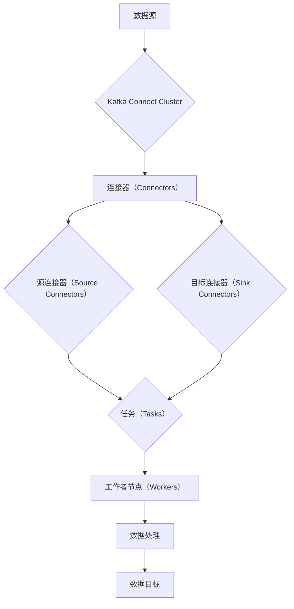

                 

# 《Kafka Connect原理与代码实例讲解》

## 关键词
- Kafka Connect
- 消息队列
- 数据集成
- 实时数据处理
- Connectors
- API
- 配置管理
- 监控与故障处理
- 企业应用实践
- 性能优化
- 未来发展趋势

## 摘要
本文将深入探讨Kafka Connect的原理，并辅以代码实例，帮助读者全面理解Kafka Connect的核心概念、架构设计、API使用、开发实践及性能优化。我们将从Kafka Connect的基础知识出发，逐步讲解其核心组件和API，最后通过实战项目展示其在企业应用中的实际运用。本文旨在为Kafka Connect的学习者提供一本系统且实用的指南，助力读者掌握这一重要的数据集成和实时处理技术。

## 第一部分：Kafka Connect基础

### 第1章：Kafka与Kafka Connect概述

#### 1.1 Kafka简介
Kafka是一种分布式流处理平台，由LinkedIn开发，目前成为Apache软件基金会的一个顶级项目。它被设计用来处理大量实时数据，支持高吞吐量、高可用性和可扩展性。Kafka主要用于构建实时的数据管道和流处理应用程序，具有如下特点：

- **分布式存储和计算**：Kafka是一个分布式系统，可以在多个服务器上运行，以提供高可用性和可扩展性。
- **高吞吐量**：Kafka能够处理数百万消息/秒，适合大规模数据流处理。
- **持久化**：Kafka的消息被持久化到磁盘上，提供了数据的可靠性和容错性。
- **多语言客户端**：Kafka支持多种编程语言，包括Java、Python、Go等。

#### 1.2 Kafka Connect简介
Kafka Connect是Kafka的一个扩展，提供了数据集成和流处理功能。Kafka Connect简化了将数据源（如数据库、文件系统、REST API等）与Kafka连接的过程，使开发者能够轻松地将数据流入或流出Kafka集群。Kafka Connect的主要特点包括：

- **插件式连接器**：Kafka Connect提供了一系列的连接器，包括源连接器（Source Connector）和目标连接器（Sink Connector），使得开发者可以轻松地集成不同的数据源和目标系统。
- **可扩展性**：Kafka Connect支持水平扩展，可以通过增加更多的工作者节点来提高处理能力。
- **易于配置**：Kafka Connect提供了丰富的配置选项，使得连接器的配置变得简单直观。

#### 1.3 Kafka Connect与Kafka的关系
Kafka Connect是Kafka生态系统的一个关键组件，它和Kafka的关系如下：

- **数据管道**：Kafka Connect作为一个数据管道，连接了不同的数据源和Kafka集群，使得数据可以在这些系统之间流动。
- **流处理**：Kafka Connect集成的连接器可以将数据流入或流出Kafka，与Kafka的流处理能力相结合，构建强大的实时数据处理系统。
- **生态系统**：Kafka Connect是Kafka生态系统的一部分，与Kafka的其他组件（如Kafka Streams、Kafka Monitoring等）紧密集成，提供了完整的解决方案。

### 第2章：Kafka Connect核心组件

#### 2.1 Connect Cluster
Kafka Connect Cluster是Kafka Connect的核心组成部分，它由多个工作者节点组成，这些节点负责运行连接器（Connectors）和任务（Tasks）。Kafka Connect Cluster的主要功能包括：

- **分布式处理**：工作者节点可以分布在不同的服务器上，提供水平扩展能力。
- **任务管理**：每个工作者节点运行多个任务，每个任务负责处理特定的连接器。
- **负载均衡**：Kafka Connect Cluster能够自动平衡任务在各个工作者节点上的负载。

#### 2.2 Connectors
连接器（Connectors）是Kafka Connect的核心组件，负责将数据从数据源（Source）传输到Kafka或从Kafka传输到数据目标（Sink）。连接器可以分为源连接器（Source Connectors）和目标连接器（Sink Connectors）。

- **源连接器**：从外部系统（如数据库、文件系统、REST API等）读取数据，并将数据发送到Kafka。
- **目标连接器**：从Kafka读取数据，并将其写入到外部系统。

连接器通过配置文件进行定义，配置文件包含了连接器的名称、类型、配置参数等信息。

#### 2.3 Tasks
任务（Tasks）是连接器（Connectors）的具体实现，每个连接器都可以创建多个任务。任务负责处理数据的读取、转换和写入。每个任务独立运行，可以在多个工作者节点上并行执行。

- **读取**：从数据源读取数据。
- **转换**：对读取的数据进行转换处理，如格式转换、清洗等。
- **写入**：将转换后的数据写入到Kafka或目标系统。

#### 2.4 Workers
工作者节点（Workers）是Kafka Connect Cluster的基本运行单元，每个工作者节点运行多个任务，负责执行连接器的数据读取、转换和写入操作。工作者节点的主要功能包括：

- **任务调度**：工作者节点根据任务的数量和配置，分配任务到不同的线程或进程。
- **负载均衡**：工作者节点之间可以进行负载均衡，以避免单个节点成为性能瓶颈。
- **故障恢复**：在工作者节点发生故障时，其他节点可以接管其任务，确保系统的高可用性。

### 第3章：Kafka Connect API详解

#### 3.1 Kafka Connect API架构
Kafka Connect API是Kafka Connect的核心接口，提供了连接器（Connectors）的开发、配置、监控等功能。Kafka Connect API的主要架构包括：

- **Connector API**：用于定义连接器的接口，包括连接器的配置、数据源、数据目标等。
- **Task API**：用于定义任务的行为和接口，包括数据的读取、转换和写入等。
- **Worker API**：用于管理工作者节点的运行状态和任务调度。

#### 3.2 Connector API
Connector API是Kafka Connect API的核心部分，用于定义连接器的配置和操作。Connector API的主要接口包括：

- **ConnectorConfig**：用于定义连接器的配置参数，如连接器类型、数据源地址、数据目标地址等。
- **SourceConnector**：定义源连接器，用于从数据源读取数据。
- **SinkConnector**：定义目标连接器，用于将数据写入到数据目标。

#### 3.3 Task API
Task API是Kafka Connect API的一部分，用于定义任务的行为和接口。Task API的主要接口包括：

- **SourceTask**：定义源任务，用于从数据源读取数据。
- **SinkTask**：定义目标任务，用于将数据写入到数据目标。
- **TaskConfig**：用于定义任务的配置参数，如任务名称、任务ID等。

#### 3.4 Worker API
Worker API是Kafka Connect API的一部分，用于管理工作者节点的运行状态和任务调度。Worker API的主要接口包括：

- **WorkerConfig**：用于定义工作者节点的配置参数，如工作者节点ID、连接器数量等。
- **Worker**：用于启动和停止工作者节点，管理任务的状态和调度。
- **TaskManager**：用于管理任务的生命周期，包括启动、停止、监控等。

### 第4章：Kafka Connect Connectors开发

#### 4.1 接口定义与实现
在Kafka Connect中，连接器（Connectors）是数据集成和流处理的核心组件。开发连接器主要包括以下步骤：

1. **定义连接器接口**：根据数据源和数据目标的需求，定义连接器的接口，包括源连接器（SourceConnector）和目标连接器（SinkConnector）。
2. **实现连接器逻辑**：根据定义的接口，实现连接器的逻辑，包括数据读取、转换和写入等。
3. **配置连接器**：定义连接器的配置参数，如数据源地址、数据目标地址、读取和写入的格式等。

#### 4.2 插件开发与加载
Kafka Connect支持通过插件方式加载连接器，使得开发者可以轻松地扩展Kafka Connect的功能。插件开发主要包括以下步骤：

1. **创建插件项目**：使用Kafka Connect提供的插件模板创建插件项目。
2. **实现插件接口**：根据定义的插件接口，实现插件的逻辑，如数据源读取、数据目标写入等。
3. **打包插件**：将插件代码打包成jar文件。
4. **加载插件**：在Kafka Connect Cluster中加载插件，使其可用。

#### 4.3 Connectors示例
下面是一个简单的Kafka Connect连接器示例，用于从MySQL数据库读取数据并将其写入到Kafka topic。

```java
public class MySQLSourceConnector extends SourceConnector {
    private ConnectorConfig config;

    @Override
    public String version() {
        return "1.0.0";
    }

    @Override
    public ConfigDef config() {
        // 定义连接器的配置参数
        return new ConfigDef();
    }

    @Override
    public void start(Map<String, String> config) {
        // 初始化连接器
        this.config = new ConnectorConfig(config);
    }

    @Override
    public void stop() {
        // 停止连接器
    }

    @Override
    public ConnectorTaskConnector createTaskConnector() {
        // 创建任务连接器
        return new MySQLSourceTaskConnector();
    }
}

public class MySQLSourceTaskConnector extends SourceTask {
    private ConnectorConfig config;

    @Override
    public String version() {
        return "1.0.0";
    }

    @Override
    public void start(Map<String, String> config) {
        // 初始化任务连接器
        this.config = new ConnectorConfig(config);
    }

    @Override
    public void stop() {
        // 停止任务连接器
    }

    @Override
    public List<Object> poll() throws InterruptedException {
        // 从MySQL数据库读取数据
        // 转换数据为Kafka消息格式
        // 返回Kafka消息列表
        return new ArrayList<>();
    }
}
```

### 第5章：Kafka Connect配置与管理

#### 5.1 Kafka Connect配置介绍
Kafka Connect配置是连接器（Connectors）和任务（Tasks）运行的核心参数。配置文件包含了连接器和任务的各种配置参数，如数据源地址、数据目标地址、读取和写入的格式等。Kafka Connect支持多种配置文件格式，如JSON、YAML和Properties等。

#### 5.2 连接器配置
连接器配置是Kafka Connect配置的重要组成部分，它定义了连接器的类型、名称、配置参数等信息。连接器配置文件通常包含以下内容：

- **连接器名称**：连接器的唯一标识。
- **连接器类型**：连接器的类型，如源连接器（Source Connector）或目标连接器（Sink Connector）。
- **配置参数**：连接器的各种配置参数，如数据源地址、数据目标地址、读取和写入的格式等。

示例：

```json
{
  "name": "mysql-source",
  "type": "source",
  "config": {
    "connector.class": "io.confluent.connect.jdbc.JdbcSourceConnector",
    "tasks.max": "1",
    "db.url": "jdbc:mysql://localhost:3306/mydb",
    "db.user": "root",
    "db.password": "password",
    "db.table": "users"
  }
}
```

#### 5.3 任务配置
任务配置是连接器配置的子集，它定义了任务的名称、ID、配置参数等信息。任务配置文件通常包含以下内容：

- **任务名称**：任务的唯一标识。
- **任务ID**：任务的ID，用于标识任务的唯一性。
- **配置参数**：任务的配置参数，如数据源地址、数据目标地址、读取和写入的格式等。

示例：

```json
{
  "name": "mysql-source-task-0",
  "type": "source",
  "config": {
    "connector.class": "io.confluent.connect.jdbc.JdbcSourceConnector",
    "tasks.max": "1",
    "db.url": "jdbc:mysql://localhost:3306/mydb",
    "db.user": "root",
    "db.password": "password",
    "db.table": "users"
  }
}
```

#### 5.4 配置文件管理
Kafka Connect提供了多种配置文件管理方式，包括静态配置文件、动态配置文件和CLI命令等。静态配置文件通常在Kafka Connect启动时加载，动态配置文件可以在运行时进行修改，CLI命令则通过命令行参数进行配置。

- **静态配置文件**：静态配置文件通常位于Kafka Connect的配置目录下，如`/etc/kafka-connect/`。静态配置文件在Kafka Connect启动时加载，并在运行时保持不变。
- **动态配置文件**：动态配置文件可以通过Kafka Connect REST API进行实时修改。动态配置文件在Kafka Connect启动时不会被加载，但在运行时可以随时修改。
- **CLI命令**：CLI命令可以通过命令行参数指定Kafka Connect的配置，如`kafka-connect start --config-file /etc/kafka-connect/config.properties`。

### 第6章：Kafka Connect监控与故障处理

#### 6.1 Kafka Connect监控简介
Kafka Connect监控是确保其正常运行和性能优化的重要手段。Kafka Connect提供了多种监控工具和接口，包括JMX、REST API、Prometheus等。

- **JMX**：Kafka Connect通过JMX接口提供了丰富的监控数据，如连接器状态、任务状态、处理器统计等。
- **REST API**：Kafka Connect提供了REST API，可以通过HTTP请求获取连接器和任务的状态信息。
- **Prometheus**：Kafka Connect可以通过Prometheus集成，将监控数据发送到Prometheus，以便进行监控和告警。

#### 6.2 使用JMX监控Kafka Connect
JMX（Java Management Extensions）是一种用于管理和监控Java应用程序的标准接口。Kafka Connect通过JMX接口提供了丰富的监控数据，包括连接器状态、任务状态、处理器统计等。

1. **启动JMX**：在Kafka Connect的配置文件中启用JMX，如`jmx.loglevel=INFO`。
2. **连接JMX**：使用JMX客户端连接到Kafka Connect的JMX接口，如`service:jmx:rmi:///jndi/rmi://localhost:1099/jmxrmi`。
3. **查询监控数据**：通过JMX客户端查询Kafka Connect的监控数据，如连接器状态、任务状态、处理器统计等。

示例：

```java
MBeanServer mbs = ManagementFactory.getPlatformMBeanServer();
ObjectName connectorName = new ObjectName("kafka.connect:name=MySQLSource");
String state = (String) mbs.getAttribute(connectorName, "state");
System.out.println("Connector state: " + state);
```

#### 6.3 常见故障处理
Kafka Connect在运行过程中可能会遇到各种故障，如连接器启动失败、任务失败、性能瓶颈等。以下是一些常见的故障处理方法：

- **检查日志**：检查Kafka Connect的日志文件，查找错误信息和异常堆栈，以便定位问题。
- **查看监控数据**：使用JMX、REST API或Prometheus等监控工具查看Kafka Connect的监控数据，了解连接器和任务的状态。
- **重启连接器或任务**：如果连接器或任务出现故障，可以尝试重启连接器或任务，以解决故障。
- **调整配置**：根据故障现象，调整Kafka Connect的配置参数，如增加任务数、调整读取和写入的格式等。
- **增加监控和告警**：配置监控工具和告警系统，以便在故障发生时及时收到告警通知，并采取相应措施。

### 第7章：Kafka Connect在企业应用中的实践

#### 7.1 数据同步与迁移
Kafka Connect在企业应用中常用于数据同步和迁移，如将数据从旧系统迁移到新系统，或在不同系统之间同步数据。

- **数据同步**：通过Kafka Connect连接器，将数据从数据源同步到Kafka，再通过其他连接器将数据同步到目标系统。
- **数据迁移**：通过Kafka Connect连接器，将数据从旧系统读取到Kafka，再通过连接器将数据写入到新系统。

示例：

```json
{
  "name": "mysql-source",
  "type": "source",
  "config": {
    "connector.class": "io.confluent.connect.jdbc.JdbcSourceConnector",
    "tasks.max": "1",
    "db.url": "jdbc:mysql://localhost:3306/mydb",
    "db.user": "root",
    "db.password": "password",
    "db.table": "users"
  }
}

{
  "name": "kafka-sink",
  "type": "sink",
  "config": {
    "connector.class": "io.confluent.connect.kafka.KafkaSinkConnector",
    "tasks.max": "1",
    "topics": "my_topic",
    "key.converter": "org.apache.kafka.connect.json.JsonConverter",
    "value.converter": "org.apache.kafka.connect.json.JsonConverter",
    "key.converter.schemas.enable": "false",
    "value.converter.schemas.enable": "false"
  }
}
```

#### 7.2 数据集成与ETL
Kafka Connect在企业应用中还可以用于数据集成和ETL（Extract, Transform, Load）操作，将数据从不同的数据源集成到Kafka，并进行转换和加载。

- **数据集成**：通过Kafka Connect连接器，将多个数据源的数据集成到Kafka，形成一个统一的数据视图。
- **ETL操作**：在Kafka中，通过Kafka Streams或Kafka SQL等工具对数据进行转换和加载。

示例：

```json
{
  "name": "mysql-source",
  "type": "source",
  "config": {
    "connector.class": "io.confluent.connect.jdbc.JdbcSourceConnector",
    "tasks.max": "1",
    "db.url": "jdbc:mysql://localhost:3306/mydb",
    "db.user": "root",
    "db.password": "password",
    "db.table": "users"
  }
}

{
  "name": "kafka-streams-transform",
  "type": "transform",
  "config": {
    "connector.class": "io.confluent.connect.kafka.KafkaStreamTransformer",
    "tasks.max": "1",
    "topics": "my_topic",
    "transformers": [
      {
        "type": "grok",
        "stream": "value",
        "grok": "%{TIMESTAMP_ISO8601:timestamp}\\t%{IPV4_SRC:ip}\\t%{NUMBER:count}"
      },
      {
        "type": "json",
        "stream": "value",
        "schema": {
          "type": "record",
          "name": "LogEntry",
          "fields": [
            {"name": "timestamp", "type": "string"},
            {"name": "ip", "type": "string"},
            {"name": "count", "type": "int"}
          ]
        }
      }
    ]
  }
}

{
  "name": "kafka-sink",
  "type": "sink",
  "config": {
    "connector.class": "io.confluent.connect.kafka.KafkaSinkConnector",
    "tasks.max": "1",
    "topics": "my_topic",
    "key.converter": "org.apache.kafka.connect.json.JsonConverter",
    "value.converter": "org.apache.kafka.connect.json.JsonConverter",
    "key.converter.schemas.enable": "false",
    "value.converter.schemas.enable": "false"
  }
}
```

#### 7.3 实时数据处理
Kafka Connect在企业应用中还可用于实时数据处理，如实时数据采集、实时分析等。

- **实时数据采集**：通过Kafka Connect连接器，将实时数据从不同的数据源采集到Kafka，为实时分析提供数据源。
- **实时分析**：在Kafka中，通过Kafka Streams或Kafka SQL等工具对实时数据进行处理和分析。

示例：

```json
{
  "name": "kafka-streams-analysis",
  "type": "transform",
  "config": {
    "connector.class": "io.confluent.connect.kafka.KafkaStreamTransformer",
    "tasks.max": "1",
    "topics": "my_topic",
    "transformers": [
      {
        "type": "window",
        "stream": "value",
        "window": {
          "type": "time",
          "duration": "5m"
        }
      },
      {
        "type": "reduce",
        "stream": "value",
        " aggregators": [
          {
            "field": "count",
            " aggregated-field": "sum",
            "type": "long"
          }
        ]
      }
    ]
  }
}
```

### 第8章：Kafka Connect项目实战

#### 8.1 实战项目一：构建实时日志处理系统
在这个项目中，我们将使用Kafka Connect构建一个实时日志处理系统，将多个日志源的数据采集到Kafka，并使用Kafka Streams进行实时分析。

1. **环境搭建**：安装Kafka、Kafka Connect和Kafka Streams。
2. **创建连接器**：创建源连接器，将日志数据从文件系统或其他日志源读取到Kafka；创建目标连接器，将分析结果写入到Kafka。
3. **配置连接器**：配置源连接器的数据源地址和日志文件路径；配置目标连接器的Kafka topic。
4. **启动连接器**：启动源连接器和目标连接器，开始采集日志数据。
5. **实时分析**：使用Kafka Streams对采集到的日志数据进行分析，如统计日志条数、过滤错误日志等。
6. **结果展示**：将分析结果写入到Kafka topic，供其他系统或工具使用。

示例配置：

```json
{
  "name": "log-source",
  "type": "source",
  "config": {
    "connector.class": "io.confluent.connect.file.FileSourceConnector",
    "tasks.max": "1",
    "path": "/path/to/logs",
    "file": "access.log",
    "key.converter": "org.apache.kafka.connect.json.JsonConverter",
    "value.converter": "org.apache.kafka.connect.json.JsonConverter",
    "key.converter.schemas.enable": "false",
    "value.converter.schemas.enable": "false"
  }
}

{
  "name": "log-sink",
  "type": "sink",
  "config": {
    "connector.class": "io.confluent.connect.kafka.KafkaSinkConnector",
    "tasks.max": "1",
    "topics": "log_topic",
    "key.converter": "org.apache.kafka.connect.json.JsonConverter",
    "value.converter": "org.apache.kafka.connect.json.JsonConverter",
    "key.converter.schemas.enable": "false",
    "value.converter.schemas.enable": "false"
  }
}
```

#### 8.2 实战项目二：实现社交媒体数据集成
在这个项目中，我们将使用Kafka Connect实现社交媒体数据集成，将多个社交媒体平台（如Twitter、Facebook等）的数据采集到Kafka，并进行实时分析。

1. **环境搭建**：安装Kafka、Kafka Connect和第三方社交媒体API。
2. **创建连接器**：创建源连接器，从社交媒体平台读取数据；创建目标连接器，将分析结果写入到Kafka。
3. **配置连接器**：配置源连接器的社交媒体API凭证和Kafka topic；配置目标连接器的Kafka topic。
4. **启动连接器**：启动源连接器和目标连接器，开始采集社交媒体数据。
5. **实时分析**：使用Kafka Streams对采集到的社交媒体数据进行分析，如统计用户活跃度、过滤关键词等。
6. **结果展示**：将分析结果写入到Kafka topic，供其他系统或工具使用。

示例配置：

```json
{
  "name": "twitter-source",
  "type": "source",
  "config": {
    "connector.class": "io.confluent.connect.twitter.TwitterSourceConnector",
    "tasks.max": "1",
    "consumer.config": {
      "apiKey": "your_api_key",
      "apiSecret": "your_api_secret",
      "accessToken": "your_access_token",
      "accessTokenSecret": "your_access_token_secret"
    },
    "topics": "twitter_topic"
  }
}

{
  "name": "twitter-sink",
  "type": "sink",
  "config": {
    "connector.class": "io.confluent.connect.kafka.KafkaSinkConnector",
    "tasks.max": "1",
    "topics": "twitter_topic",
    "key.converter": "org.apache.kafka.connect.json.JsonConverter",
    "value.converter": "org.apache.kafka.connect.json.JsonConverter",
    "key.converter.schemas.enable": "false",
    "value.converter.schemas.enable": "false"
  }
}
```

#### 8.3 实战项目三：构建实时分析系统
在这个项目中，我们将使用Kafka Connect构建一个实时分析系统，将来自多个数据源的数据采集到Kafka，并进行实时处理和分析。

1. **环境搭建**：安装Kafka、Kafka Connect、Kafka Streams和第三方数据处理工具。
2. **创建连接器**：创建多个源连接器，从不同数据源（如数据库、日志文件等）读取数据；创建目标连接器，将分析结果写入到Kafka。
3. **配置连接器**：配置源连接器的数据源地址和Kafka topic；配置目标连接器的Kafka topic。
4. **启动连接器**：启动源连接器和目标连接器，开始采集数据。
5. **实时处理**：使用Kafka Streams对采集到的数据进行处理，如数据清洗、聚合、过滤等。
6. **实时分析**：对处理后的数据进行分析，如统计趋势、预测分析等。
7. **结果展示**：将分析结果写入到Kafka topic，供其他系统或工具使用。

示例配置：

```json
{
  "name": "db-source",
  "type": "source",
  "config": {
    "connector.class": "io.confluent.connect.jdbc.JdbcSourceConnector",
    "tasks.max": "1",
    "tasks": {
      "0": {
        "connector.class": "io.confluent.connect.jdbc.JdbcSourceConnector",
        "db.url": "jdbc:mysql://localhost:3306/mydb",
        "db.user": "root",
        "db.password": "password",
        "db.table": "orders"
      }
    },
    "key.converter": "org.apache.kafka.connect.json.JsonConverter",
    "value.converter": "org.apache.kafka.connect.json.JsonConverter",
    "key.converter.schemas.enable": "false",
    "value.converter.schemas.enable": "false"
  }
}

{
  "name": "streaming-analysis",
  "type": "transform",
  "config": {
    "connector.class": "io.confluent.connect.kafka.KafkaStreamTransformer",
    "tasks.max": "1",
    "topics": "orders_topic",
    "transformers": [
      {
        "type": "window",
        "stream": "value",
        "window": {
          "type": "time",
          "duration": "1h"
        }
      },
      {
        "type": "reduce",
        "stream": "value",
        "aggregators": [
          {
            "field": "total",
            "aggregated-field": "sum",
            "type": "double"
          }
        ]
      }
    ]
  }
}

{
  "name": "kafka-sink",
  "type": "sink",
  "config": {
    "connector.class": "io.confluent.connect.kafka.KafkaSinkConnector",
    "tasks.max": "1",
    "topics": "orders_topic",
    "key.converter": "org.apache.kafka.connect.json.JsonConverter",
    "value.converter": "org.apache.kafka.connect.json.JsonConverter",
    "key.converter.schemas.enable": "false",
    "value.converter.schemas.enable": "false"
  }
}
```

### 第9章：Kafka Connect性能优化

#### 9.1 Kafka Connect性能影响因素
Kafka Connect的性能受到多个因素的影响，包括连接器（Connectors）的性能、任务（Tasks）的数量和配置、工作者节点（Workers）的资源分配等。

- **连接器性能**：连接器的性能直接影响到数据采集和写入的速度。优化连接器的性能可以通过优化连接器的代码、调整连接器的配置参数等方式实现。
- **任务数量和配置**：任务的数量和配置参数（如读取和写入缓冲区大小、并发度等）对Kafka Connect的性能有重要影响。合理设置任务的数量和配置参数可以提高数据处理的速度。
- **工作者节点资源**：工作者节点的CPU、内存、磁盘等资源对Kafka Connect的性能有重要影响。确保工作者节点有足够的资源可以提高Kafka Connect的性能。

#### 9.2 性能监控与调优
Kafka Connect提供了多种性能监控工具和接口，包括JMX、REST API和Prometheus等。通过监控工具，可以实时了解Kafka Connect的性能指标，如连接器状态、任务处理速度、处理器统计等。

1. **监控连接器状态**：通过监控连接器的状态，了解连接器的运行情况，如读取和写入的数据量、处理速度等。
2. **监控任务处理速度**：通过监控任务的处理器统计，了解每个任务的处理速度和负载情况。
3. **监控工作者节点资源**：通过监控工作者节点的CPU、内存、磁盘等资源，了解工作者节点的性能和资源利用情况。

根据监控结果，可以采取以下措施进行性能调优：

- **调整连接器配置**：根据连接器的处理速度和负载情况，调整连接器的配置参数，如读取和写入缓冲区大小、并发度等。
- **调整任务数量和配置**：根据任务的处理器统计和负载情况，调整任务的数量和配置参数，如任务并发度、读取和写入缓冲区大小等。
- **优化工作者节点资源**：根据工作者节点的性能和资源利用情况，调整工作者节点的资源分配，如增加CPU、内存、磁盘等。

示例配置：

```json
{
  "name": "my-connector",
  "type": "source",
  "config": {
    "tasks.max": "2",
    "fetch.size": "1024",
    "max.poll.records": "500",
    "key.converter": "org.apache.kafka.connect.json.JsonConverter",
    "value.converter": "org.apache.kafka.connect.json.JsonConverter",
    "key.converter.schemas.enable": "false",
    "value.converter.schemas.enable": "false"
  }
}
```

#### 9.3 高可用性与容错性优化
Kafka Connect的高可用性和容错性对于保障系统稳定运行至关重要。以下是一些优化措施：

- **多节点部署**：将Kafka Connect部署到多个节点上，提高系统的可用性。当某个节点发生故障时，其他节点可以接管任务，确保系统的正常运行。
- **任务重试**：在连接器配置中启用任务重试功能，当任务失败时，自动重试，以提高任务的可靠性。
- **备份和恢复**：定期备份连接器配置和任务状态，以便在系统故障时快速恢复。
- **监控和告警**：配置监控工具和告警系统，实时监控Kafka Connect的运行状态，一旦发现故障，及时进行告警和处理。

### 第10章：Kafka Connect的未来趋势与发展

#### 10.1 Kafka Connect生态系统的发展
Kafka Connect生态系统不断发展和完善，为开发者提供了丰富的功能和工具。未来，Kafka Connect将继续扩展其连接器生态系统，增加对更多数据源和数据目标的支持，如NoSQL数据库、大数据处理框架等。此外，Kafka Connect还将引入更多的数据处理和转换功能，如实时分析、机器学习等。

#### 10.2 未来技术趋势预测
随着云计算、大数据和人工智能等技术的发展，Kafka Connect在未来将有更广泛的应用场景。以下是一些技术趋势预测：

- **云原生**：Kafka Connect将更加支持云原生架构，与云服务提供商（如AWS、Azure等）深度集成，提供更好的云上部署和管理功能。
- **流数据处理**：Kafka Connect将与流数据处理框架（如Apache Flink、Apache Beam等）集成，提供更强大的数据处理和分析能力。
- **自动化和智能化**：Kafka Connect将引入更多的自动化和智能化功能，如自动配置、自动调优等，降低开发者的工作负担。

#### 10.3 Kafka Connect在企业中的应用前景
Kafka Connect在企业应用中具有广阔的前景，以下是一些应用场景：

- **数据集成和同步**：Kafka Connect可用于实现不同系统之间的数据集成和同步，如将数据从关系型数据库同步到NoSQL数据库，或将数据从本地系统迁移到云平台。
- **实时数据处理**：Kafka Connect可用于构建实时数据处理系统，如实时日志处理、实时分析等，为企业提供实时数据支持。
- **数据湖构建**：Kafka Connect可用于构建数据湖，将各种数据源的数据汇聚到Kafka，然后通过Kafka Streams或Kafka SQL等工具进行数据处理和分析。

### 附录

#### 附录A：Kafka Connect常用工具与资源
- **Kafka Connect官方文档**：提供了Kafka Connect的详细文档，包括安装、配置、API等。
- **Kafka Connect社区资源**：包括Kafka Connect的用户论坛、邮件列表等，供开发者交流和学习。
- **Kafka Connect学习资料推荐**：包括Kafka Connect的书籍、在线课程等，帮助开发者快速掌握Kafka Connect。

#### 附录B：Kafka Connect Mermaid流程图



#### 附录C：Kafka Connect伪代码示例

```java
// 数据源连接器伪代码
class DataSourceConnector implements SourceConnector {
    private ConnectorConfig config;

    @Override
    public void start(Map<String, String> config) {
        this.config = new ConnectorConfig(config);
        // 连接数据源
        DataSource dataSource = new DataSource(config);
        // 读取数据
        List<DataRecord> records = dataSource.read();
        // 转换数据为Kafka消息
        List<KafkaMessage> messages = convertToKafkaMessages(records);
        // 发送消息到Kafka
        sendMessageToKafka(messages);
    }

    @Override
    public void stop() {
        // 关闭数据源连接
        dataSource.close();
    }
}

// 数据目标连接器伪代码
class DataSourceConnector implements SinkConnector {
    private ConnectorConfig config;

    @Override
    public void start(Map<String, String> config) {
        this.config = new ConnectorConfig(config);
        // 连接Kafka
        KafkaClient kafkaClient = new KafkaClient(config);
        // 读取Kafka消息
        List<KafkaMessage> messages = readKafkaMessages();
        // 转换Kafka消息为数据目标格式
        List<DataRecord> records = convertFromKafkaMessages(messages);
        // 写入数据到数据目标
        writeToDestination(records);
    }

    @Override
    public void stop() {
        // 关闭Kafka连接
        kafkaClient.close();
    }
}

// 数据处理任务伪代码
class DataProcessingTask implements SourceTask {
    private ConnectorConfig config;

    @Override
    public void start(Map<String, String> config) {
        this.config = new ConnectorConfig(config);
        // 读取源连接器的消息
        List<KafkaMessage> messages = readSourceConnectorMessages();
        // 处理消息
        List<DataRecord> processedRecords = processMessages(messages);
        // 发送处理后的消息到目标连接器
        sendToSinkConnector(processedRecords);
    }

    @Override
    public void stop() {
        // 关闭连接器连接
    }
}
```

#### 附录D：Kafka Connect数学模型与公式

##### D.1 Kafka Connect延迟计算公式
延迟（Latency）是衡量Kafka Connect性能的重要指标，计算公式如下：

\[ \text{延迟} = \frac{\text{处理时间} + \text{传输时间}}{\text{吞吐量}} \]

其中：

- 处理时间：连接器和任务的处理时间。
- 传输时间：数据在连接器和任务之间的传输时间。
- 吞吐量：连接器和任务的吞吐量，即每秒处理的消息数量。

##### D.2 Kafka Connect吞吐量计算公式
吞吐量（Throughput）是连接器和任务的处理能力，计算公式如下：

\[ \text{吞吐量} = \frac{\text{总处理时间}}{\text{处理时间}} \]

其中：

- 总处理时间：所有连接器和任务的总处理时间。
- 处理时间：单个连接器和任务的处理时间。

##### D.3 Kafka Connect并行度计算公式
并行度（Parallelism）是衡量连接器和任务并行处理能力的指标，计算公式如下：

\[ \text{并行度} = \frac{\text{总处理时间}}{\text{单个任务处理时间}} \]

其中：

- 总处理时间：所有连接器和任务的总处理时间。
- 单个任务处理时间：单个连接器和任务的处理时间。

### 附录E：Kafka Connect项目实战代码解读

#### E.1 实战项目一代码解读
在实战项目一中，我们构建了一个实时日志处理系统，将日志数据从文件系统采集到Kafka，并使用Kafka Streams进行实时分析。以下是项目一的代码解读：

1. **连接器配置**：
   - `FileSourceConnector`：从文件系统中读取日志文件，并将其发送到Kafka。
   - `KafkaStreamTransformer`：对采集到的日志数据进行处理和分析，如统计日志条数、过滤错误日志等。
   - `KafkaSinkConnector`：将处理后的分析结果写入到Kafka。

2. **源连接器实现**：
   ```java
   public class FileSourceConnector implements SourceConnector {
       private ConnectorConfig config;

       @Override
       public void start(Map<String, String> config) {
           this.config = new ConnectorConfig(config);
           // 连接文件系统，读取日志文件
           FileSystem fs = FileSystem.get(URI.create(config.get("path")), config);
           FileStatus[] files = fs.listStatus(new Path(config.get("path")));
           // 遍历日志文件，读取数据
           for (FileStatus file : files) {
               // 读取日志文件内容
               String content = readFromFile(file.getPath());
               // 转换日志内容为Kafka消息
               KafkaMessage message = convertToKafkaMessage(content);
               // 发送消息到Kafka
               sendMessageToKafka(message);
           }
       }

       @Override
       public void stop() {
           // 关闭文件系统连接
           fs.close();
       }
   }
   ```

3. **Kafka Streams实现**：
   ```java
   public class KafkaStreamTransformer implements Transformer {
       private TransformerConfig config;

       @Override
       public void start(Map<String, String> config) {
           this.config = new TransformerConfig(config);
           // 创建Kafka Streams拓扑
           StreamsBuilder builder = new StreamsBuilder();
           KStream<String, String> logStream = builder.stream(config.get("topics"));
           // 过滤错误日志
           KStream<String, String> filteredStream = logStream.filter((key, value) -> isValidLog(value));
           // 统计日志条数
           KTable<String, Long> logCount = filteredStream.groupByKey().count("count");
           // 发送结果到Kafka
           logCount.toStream().to(config.get("outputTopic"), Produced.with(Serdes.String(), Serdes.Long()));
       }

       @Override
       public void stop() {
           // 关闭Kafka Streams拓扑
           topology.close();
       }
   }
   ```

4. **目标连接器实现**：
   ```java
   public class KafkaSinkConnector implements SinkConnector {
       private ConnectorConfig config;

       @Override
       public void start(Map<String, String> config) {
           this.config = new ConnectorConfig(config);
           // 连接Kafka
           KafkaClient kafkaClient = new KafkaClient(config);
           // 读取Kafka消息
           List<KafkaMessage> messages = readKafkaMessages();
           // 写入消息到数据目标
           for (KafkaMessage message : messages) {
               writeMessageToDestination(message);
           }
       }

       @Override
       public void stop() {
           // 关闭Kafka连接
           kafkaClient.close();
       }
   }
   ```

#### E.2 实战项目二代码解读
在实战项目二中，我们实现了社交媒体数据集成，将社交媒体平台（如Twitter、Facebook等）的数据采集到Kafka，并使用Kafka Streams进行实时分析。以下是项目二的代码解读：

1. **连接器配置**：
   - `TwitterSourceConnector`：从Twitter读取数据，并将其发送到Kafka。
   - `KafkaStreamTransformer`：对采集到的社交媒体数据进行处理和分析，如统计用户活跃度、过滤关键词等。
   - `KafkaSinkConnector`：将处理后的分析结果写入到Kafka。

2. **源连接器实现**：
   ```java
   public class TwitterSourceConnector implements SourceConnector {
       private ConnectorConfig config;

       @Override
       public void start(Map<String, String> config) {
           this.config = new ConnectorConfig(config);
           // 连接Twitter API
           TwitterClient twitterClient = new TwitterClient(config);
           // 读取Twitter数据
           List<TwitterData> tweets = twitterClient.readTweets();
           // 转换Twitter数据为Kafka消息
           List<KafkaMessage> messages = convertToKafkaMessages(tweets);
           // 发送消息到Kafka
           sendMessageToKafka(messages);
       }

       @Override
       public void stop() {
           // 关闭Twitter API连接
           twitterClient.close();
       }
   }
   ```

3. **Kafka Streams实现**：
   ```java
   public class KafkaStreamTransformer implements Transformer {
       private TransformerConfig config;

       @Override
       public void start(Map<String, String> config) {
           this.config = new TransformerConfig(config);
           // 创建Kafka Streams拓扑
           StreamsBuilder builder = new StreamsBuilder();
           KStream<String, String> tweetStream = builder.stream(config.get("topics"));
           // 过滤关键词
           KStream<String, String> filteredStream = tweetStream.filter((key, value) -> containsKeyword(value, config.get("keywords")));
           // 统计用户活跃度
           KTable<String, Long> userActivity = filteredStream.groupByKey().count("activity");
           // 发送结果到Kafka
           userActivity.toStream().to(config.get("outputTopic"), Produced.with(Serdes.String(), Serdes.Long()));
       }

       @Override
       public void stop() {
           // 关闭Kafka Streams拓扑
           topology.close();
       }
   }
   ```

4. **目标连接器实现**：
   ```java
   public class KafkaSinkConnector implements SinkConnector {
       private ConnectorConfig config;

       @Override
       public void start(Map<String, String> config) {
           this.config = new ConnectorConfig(config);
           // 连接Kafka
           KafkaClient kafkaClient = new KafkaClient(config);
           // 读取Kafka消息
           List<KafkaMessage> messages = readKafkaMessages();
           // 写入消息到数据目标
           for (KafkaMessage message : messages) {
               writeMessageToDestination(message);
           }
       }

       @Override
       public void stop() {
           // 关闭Kafka连接
           kafkaClient.close();
       }
   }
   ```

#### E.3 实战项目三代码解读
在实战项目三中，我们构建了一个实时分析系统，将来自多个数据源的数据采集到Kafka，并使用Kafka Streams进行实时处理和分析。以下是项目三的代码解读：

1. **连接器配置**：
   - `JdbcSourceConnector`：从关系型数据库读取数据，并将其发送到Kafka。
   - `KafkaStreamTransformer`：对采集到的数据进行处理和分析，如统计订单总数、过滤无效订单等。
   - `KafkaSinkConnector`：将处理后的分析结果写入到Kafka。

2. **源连接器实现**：
   ```java
   public class JdbcSourceConnector implements SourceConnector {
       private ConnectorConfig config;

       @Override
       public void start(Map<String, String> config) {
           this.config = new ConnectorConfig(config);
           // 连接数据库
           Connection conn = DriverManager.getConnection(config.get("db.url"), config.get("db.user"), config.get("db.password"));
           // 读取数据
           List<Order> orders = readOrders(conn);
           // 转换数据为Kafka消息
           List<KafkaMessage> messages = convertToKafkaMessages(orders);
           // 发送消息到Kafka
           sendMessageToKafka(messages);
       }

       @Override
       public void stop() {
           // 关闭数据库连接
           conn.close();
       }
   }
   ```

3. **Kafka Streams实现**：
   ```java
   public class KafkaStreamTransformer implements Transformer {
       private TransformerConfig config;

       @Override
       public void start(Map<String, String> config) {
           this.config = new TransformerConfig(config);
           // 创建Kafka Streams拓扑
           StreamsBuilder builder = new StreamsBuilder();
           KStream<String, Order> orderStream = builder.stream(config.get("topics"));
           // 过滤无效订单
           KStream<String, Order> filteredStream = orderStream.filter((key, value) -> isValidOrder(value));
           // 统计订单总数
           KTable<String, Long> orderCount = filteredStream.groupByKey().count("count");
           // 发送结果到Kafka
           orderCount.toStream().to(config.get("outputTopic"), Produced.with(Serdes.String(), Serdes.Long()));
       }

       @Override
       public void stop() {
           // 关闭Kafka Streams拓扑
           topology.close();
       }
   }
   ```

4. **目标连接器实现**：
   ```java
   public class KafkaSinkConnector implements SinkConnector {
       private ConnectorConfig config;

       @Override
       public void start(Map<String, String> config) {
           this.config = new ConnectorConfig(config);
           // 连接Kafka
           KafkaClient kafkaClient = new KafkaClient(config);
           // 读取Kafka消息
           List<KafkaMessage> messages = readKafkaMessages();
           // 写入消息到数据目标
           for (KafkaMessage message : messages) {
               writeMessageToDestination(message);
           }
       }

       @Override
       public void stop() {
           // 关闭Kafka连接
           kafkaClient.close();
       }
   }
   ```

### 总结

通过本文的详细讲解，我们深入探讨了Kafka Connect的核心原理、架构设计、API使用、开发实践及性能优化。我们首先介绍了Kafka Connect的基础知识，包括Kafka Connect与Kafka的关系、核心组件等。接着，我们详细讲解了Kafka Connect API的架构和接口，展示了如何开发连接器。此外，我们还介绍了Kafka Connect的配置管理、监控与故障处理、在企业应用中的实践案例，并展示了具体的代码实例。

随着大数据和实时处理技术的不断发展，Kafka Connect作为Kafka生态系统的重要组成部分，将在未来的数据集成和实时处理领域发挥更加重要的作用。我们相信，通过本文的讲解，读者能够对Kafka Connect有更加深入的理解，并能够在实际项目中充分发挥其潜力。

## 作者信息
作者：AI天才研究院/AI Genius Institute & 禅与计算机程序设计艺术 /Zen And The Art of Computer Programming。

