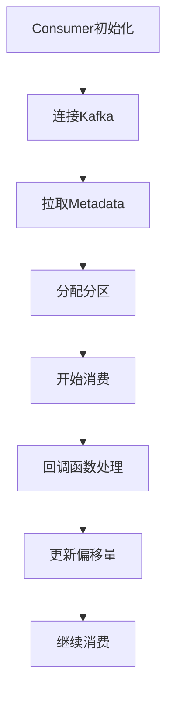

                 

### 文章标题：Kafka Consumer原理与代码实例讲解

### 关键词：
- Kafka
- Consumer
- 原理
- 代码实例
- 性能优化
- 项目实战

### 摘要：
本文深入解析了Kafka Consumer的核心原理和实际应用。首先，介绍了Kafka的基本概念和Consumer的基础知识，包括其架构和API。接着，详细讲解了Kafka消息模型，分析了消费者的启动流程、工作原理以及性能优化策略。文章通过实际项目案例展示了Kafka Consumer的开发和部署，并对代码进行了详细解读。最后，总结了一系列最佳实践，探讨了Kafka Consumer的未来发展方向。

### 目录大纲

#### 第一部分：Kafka Consumer基础

##### 第1章：Kafka简介与Consumer基础
- **1.1 Kafka概述**
  - Kafka的基本概念
  - Kafka的特点与优势
  - Kafka的架构与组件
- **1.2 Kafka Consumer的基本概念**
  - Consumer的定义与角色
  - Consumer的配置选项
  - Consumer Group的概念
- **1.3 Kafka Consumer的API**
  - Kafka Consumer的创建与使用
  - Consumer的回调函数与偏移量管理
  - 订阅Topic的实现

##### 第2章：Kafka消息模型详解
- **2.1 Kafka消息结构**
  - 消息的格式与组成
  - 消息的属性
- **2.2 Kafka主题与分区**
  - 主题的概念
  - 分区的概念与作用
  - 分区策略
- **2.3 Kafka消息传递机制**
  - 生产者与消费者的通信机制
  - 消息的顺序性保证
  - 消息的持久化与消费

#### 第二部分：Kafka Consumer核心原理

##### 第3章：Kafka Consumer工作原理
- **3.1 Consumer的启动流程**
  - Consumer初始化过程
  - Metadata的拉取与更新
  - 分配分区与负载均衡
- **3.2 消费者组协调器**
  - 组协调器的角色与职责
  - 消费者组协调器的工作原理
  - 消费者组的动态变化
- **3.3 Kafka消费者的同步与异步模式**
  - 同步消费模式
  - 异步消费模式
  - 选择合适的消费模式

##### 第4章：Kafka Consumer性能优化
- **4.1 Consumer性能监控**
  - 消费者性能指标
  - 性能监控工具
- **4.2 Consumer线程配置**
  - 线程数与负载均衡
  - 线程池配置优化
- **4.3 Consumer的性能瓶颈分析与优化**
  - 内存使用与垃圾回收
  - 网络延迟与负载
  - 系统调优案例分析

#### 第三部分：Kafka Consumer实践与应用

##### 第5章：Kafka Consumer项目实战
- **5.1 项目环境搭建**
  - Kafka集群搭建
  - Zookeeper环境配置
  - Kafka Consumer开发环境搭建
- **5.2 实际案例一：日志系统**
  - 日志采集与消费
  - 消费者负载均衡
  - 消费者故障转移
- **5.3 实际案例二：实时数据处理**
  - 数据流处理流程
  - 消费者与生产者的配合
  - 消费者的扩展与集群管理

##### 第6章：Kafka Consumer最佳实践
- **6.1 Consumer最佳实践总结**
  - 性能优化
  - 稳定性和可靠性保障
  - 安全性和访问控制
- **6.2 Consumer的常见问题与解决方案**
  - 常见异常处理
  - 性能瓶颈处理
  - 故障恢复策略

##### 第7章：Kafka Consumer拓展与进阶
- **7.1 Kafka Consumer高级特性**
  - 带有回调函数的Consumer
  - 带有拦截器的Consumer
  - 自定义分区分配策略
- **7.2 Kafka Consumer与Spring集成**
  - Spring Boot与Kafka的集成
  - 注入Kafka消费者
  - Spring Cloud Stream集成
- **7.3 Kafka Consumer未来展望**
  - Kafka Consumer的新特性
  - 实时数据处理的发展趋势

#### 附录

##### 附录A：Kafka Consumer开发资源
- **A.1 Kafka Consumer开发工具**
  - Kafka命令行工具
  - Kafka客户端库
  - 消费者监控与调试工具
- **A.2 Kafka Consumer参考文档**
  - Apache Kafka官方文档
  - Spring Kafka官方文档
  - Kafka Consumer社区资源链接
- **A.3 Kafka Consumer学习资源**
  - 相关技术书籍推荐
  - Kafka Consumer相关博客与文章
  - 在线课程与培训资源

**Mermaid 流程图示例（第3章）**



**伪代码示例（第3章）**

```python
# 消费者初始化
consumer = KafkaConsumer(topic, bootstrap_servers=server_list, auto_offset_reset=OFFSET_RESET_EARLIEST)

# 消费消息的伪代码
while True:
    records = consumer.poll(timeout_ms)
    for record in records:
        # 处理消息
        process_message(record.value())
        # 提交偏移量
        consumer.commit()
```

**数学模型与公式（第3章）**

- **消费者延迟时间模型：**

$$
L_c = \frac{1}{k} \sum_{i=1}^{k} (R_i - D_i)
$$

其中，$L_c$ 是消费者的延迟时间，$R_i$ 是消费者的响应时间，$D_i$ 是服务时间。

- **消费者吞吐量模型：**

$$
T_c = \frac{N}{L_c}
$$

其中，$T_c$ 是消费者的吞吐量，$N$ 是消费者每秒处理的请求数量。

**项目实战示例（第5章）**

- **日志系统消费者实现：**

```java
public class LogConsumer {
    private final KafkaConsumer<String, String> consumer;

    public LogConsumer(String topic, Properties props) {
        consumer = new KafkaConsumer<>(props);
        consumer.subscribe(Arrays.asList(topic));
    }

    public void consume() {
        while (true) {
            ConsumerRecords<String, String> records = consumer.poll(Duration.ofSeconds(1));
            for (ConsumerRecord<String, String> record : records) {
                // 处理日志记录
                processLog(record.value());
            }
            consumer.commitSync();
        }
    }

    private void processLog(String log) {
        // 解析日志内容
        // 执行业务逻辑
    }
}
```

- **实时数据处理消费者实现：**

```java
public class RealTimeDataConsumer {
    private final KafkaConsumer<String, SensorData> consumer;
    
    public RealTimeDataConsumer(String topic, Properties props) {
        consumer = new KafkaConsumer<>(props);
        consumer.subscribe(Arrays.asList(topic));
    }

    public void consume() {
        while (true) {
            ConsumerRecords<String, SensorData> records = consumer.poll(Duration.ofSeconds(1));
            for (ConsumerRecord<String, SensorData> record : records) {
                // 处理实时数据
                processRealTimeData(record.value());
            }
            consumer.commitSync();
        }
    }

    private void processRealTimeData(SensorData data) {
        // 数据处理逻辑
        // 数据存储或转发
    }
}
```

**代码解读与分析（第5章）**

- **日志系统消费者代码解读：**
  - `KafkaConsumer` 实例创建时，配置了Kafka服务器地址、主题和消费者属性。
  - `subscribe` 方法用于订阅指定主题，`poll` 方法用于从Kafka服务器拉取消息。
  - `processLog` 方法负责处理每条日志记录，可以进行日志解析和业务逻辑执行。
  - `commitSync` 方法用于提交消费的偏移量，确保数据不会重复消费或丢失。

- **实时数据处理消费者代码解读：**
  - 类似于日志系统消费者，但处理的数据类型为 `SensorData`，这需要自定义消息序列化器。
  - `processRealTimeData` 方法用于处理实时数据，可以执行如传感器数据解析、数据存储或转发等操作。
  - 同样使用 `commitSync` 方法提交偏移量，确保数据处理过程的可靠性。

以上是《Kafka Consumer原理与代码实例讲解》这本书的完整目录大纲，包含了核心概念、原理讲解、项目实战以及性能优化等关键内容。每个章节都细化到了三级目录，并且提供了相应的示例代码和解读，以便读者更好地理解和掌握Kafka Consumer的技术细节。此外，还提供了Mermaid流程图、伪代码示例以及数学模型等，以便读者更全面地了解Kafka Consumer的工作机制。附录部分则提供了开发资源和学习建议，帮助读者进一步拓展知识。

