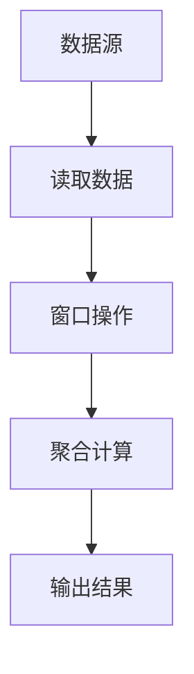
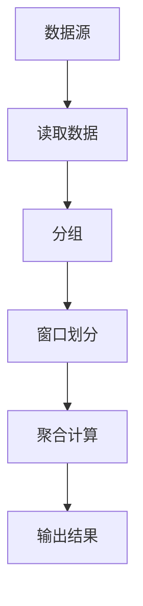
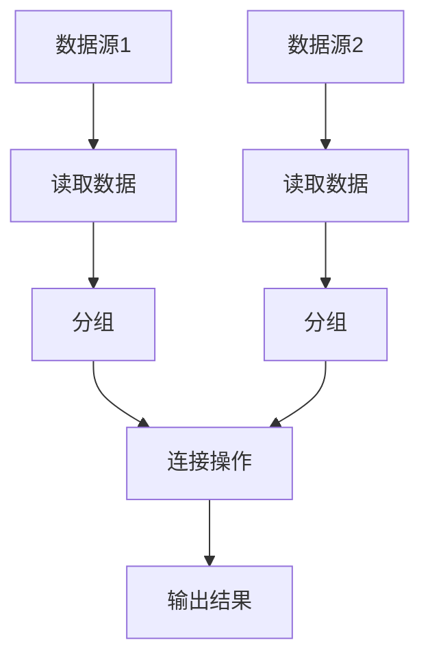

                 

# 《Kafka Streams原理与代码实例讲解》

> 关键词：Kafka Streams, 实时处理, 流处理, 窗口操作, 聚合算法, 分布式处理

> 摘要：本文将对Kafka Streams的原理进行深入讲解，涵盖其概述、基础架构、核心概念、算法原理、数学模型以及实战案例。通过本文的学习，读者将能够理解Kafka Streams的工作机制，掌握其核心功能，并能够运用到实际项目中。

## 第1章: Kafka Streams 介绍

Kafka Streams是一个基于Apache Kafka的实时流处理框架，旨在提供高效、可靠和易于使用的数据流处理能力。它允许开发者将Kafka消息队列中的数据进行实时处理和分析，生成新的消息流，或者触发业务逻辑。

### 1.1 Kafka Streams 概念

Kafka Streams提供了基于Java的API，用于构建高性能、可扩展的流处理应用程序。它允许开发者将Kafka消息队列中的数据进行处理，包括数据转换、聚合、连接等操作。处理后的数据可以继续被发送到Kafka主题，也可以被其他应用程序消费。

### 1.2 Kafka Streams 与 Kafka 关系

Kafka Streams与Kafka消息队列紧密相连。Kafka Streams通过Kafka消费者的方式读取Kafka主题中的数据，进行处理，然后可以将处理后的数据发送回Kafka，或者发送给其他系统。Kafka Streams利用Kafka的高吞吐量和持久性，实现大规模的数据流处理。

### 1.3 Kafka Streams 的优势

1. **高吞吐量和高性能**：Kafka Streams利用Kafka的分布式架构，可以处理大规模的数据流，同时保持低延迟。
2. **易于使用**：Kafka Streams提供了简单的API，使得开发者可以快速上手，构建流处理应用程序。
3. **可扩展性**：Kafka Streams支持水平扩展，可以在集群中运行多个实例，提高系统的处理能力。
4. **可靠性和持久性**：Kafka Streams利用Kafka的特性，保证了数据处理的可靠性和持久性。

### 1.4 Kafka Streams 的应用场景

1. **实时分析**：Kafka Streams可以用于实时处理和分析数据流，如实时用户行为分析、交易监控等。
2. **日志处理**：Kafka Streams可以用于处理和分析日志数据，如实时日志分析、异常检测等。
3. **推荐系统**：Kafka Streams可以用于构建实时推荐系统，如基于用户行为的实时推荐、新闻头条推荐等。
4. **事件驱动架构**：Kafka Streams可以用于实现事件驱动架构，如订单处理、库存管理等。

## 第2章: Kafka Streams 基础架构

Kafka Streams的基础架构主要包括三个核心组件：数据源、处理逻辑和数据存储。

### 2.1 Kafka Streams 架构概述


Kafka Streams的架构如图所示，主要包括以下三个部分：

1. **数据源**：数据源是Kafka主题，数据流从Kafka主题中被读取。
2. **处理逻辑**：处理逻辑由Kafka Streams程序实现，对数据进行处理和分析。
3. **数据存储**：处理后的数据可以存储在Kafka主题中，也可以被其他系统消费。

### 2.2 Kafka Streams 核心组件

1. **Kafka Streams 应用程序**：Kafka Streams应用程序是一个Java应用程序，包含处理逻辑，通过Kafka消费者读取数据，通过Kafka生产者发送数据。
2. **Kafka 消费者**：Kafka消费者从Kafka主题中读取数据。
3. **Kafka 生产者**：Kafka生产者将处理后的数据发送到Kafka主题。

### 2.3 Kafka Streams 集群模式

Kafka Streams支持集群模式，可以在多个节点上运行，提高系统的处理能力和可靠性。在集群模式中，每个节点运行一个Kafka Streams应用程序实例，实例之间通过Kafka进行通信。


集群模式中，Kafka Streams应用程序实例通过Kafka主题进行通信，可以实现对数据的分布式处理。

## 第3章: Kafka Streams 核心概念

Kafka Streams的核心概念包括窗口操作、时间窗口、滚动窗口、滑动窗口和复合窗口。

### 3.1 窗口操作

窗口操作是对数据流进行时间划分的一种方式，将数据流划分成多个时间段，以便进行聚合和计算。窗口操作主要包括以下内容：

#### 3.1.1 窗口的概念

窗口是指对数据流进行时间划分的一个时间段。窗口可以是固定的，也可以是滑动的。每个窗口包含一定时间范围内的数据。

#### 3.1.2 窗口类型

Kafka Streams支持两种窗口类型：时间窗口和滚动窗口。

1. **时间窗口**：时间窗口是固定的时间段，如1分钟、1小时等。每个时间窗口包含相同数量的数据。
2. **滚动窗口**：滚动窗口是随着时间不断向前推进的窗口。每个窗口的时间长度是固定的，但窗口中的数据会不断更新。

#### 3.1.3 窗口函数

窗口函数是对窗口内的数据进行计算和处理的方式。Kafka Streams支持以下几种窗口函数：

1. **聚合函数**：对窗口内的数据进行聚合操作，如求和、求平均值等。
2. **计数函数**：对窗口内的数据进行计数操作。
3. **最大值和最小值函数**：对窗口内的数据进行最大值和最小值操作。
4. **自定义函数**：自定义窗口函数，以实现更复杂的计算和处理。

### 3.2 时间窗口

时间窗口是一种基于固定时间的窗口类型，将数据流划分成固定的时间段。时间窗口的长度可以是1分钟、1小时、1天等。

#### 3.2.1 时间窗口的概念

时间窗口是指一个固定的时间段，用于对数据流进行划分。每个时间窗口包含相同数量的数据。

#### 3.2.2 时间窗口类型

Kafka Streams支持两种时间窗口类型：

1. **固定时间窗口**：固定时间窗口的长度是固定的，如1分钟、1小时等。
2. **可变时间窗口**：可变时间窗口的长度可以根据数据量自动调整。

#### 3.2.3 时间窗口函数

时间窗口函数是对时间窗口内的数据进行计算和处理的方式。Kafka Streams支持以下时间窗口函数：

1. **聚合函数**：对窗口内的数据进行聚合操作，如求和、求平均值等。
2. **计数函数**：对窗口内的数据进行计数操作。
3. **最大值和最小值函数**：对窗口内的数据进行最大值和最小值操作。
4. **自定义函数**：自定义时间窗口函数，以实现更复杂的计算和处理。

### 3.3 滚动窗口与滑动窗口

滚动窗口和滑动窗口是两种基于时间推进的窗口类型。

#### 3.3.1 滚动窗口的概念

滚动窗口是指一个固定的时间长度，随着时间不断向前推进，窗口中的数据会不断更新。滚动窗口的时间长度是固定的，不会根据数据量自动调整。

#### 3.3.2 滚动窗口类型

Kafka Streams支持以下滚动窗口类型：

1. **固定长度滚动窗口**：固定长度滚动窗口的时间长度是固定的，如1分钟、1小时等。
2. **可变长度滚动窗口**：可变长度滚动窗口的时间长度可以根据数据量自动调整。

#### 3.3.3 滑动窗口的概念

滑动窗口是指一个固定的时间长度，随着时间不断向前推进，窗口中的数据会不断更新。与滚动窗口不同的是，滑动窗口的时间长度是固定的，但窗口中的数据会根据时间推进而更新。

#### 3.3.4 滑动窗口类型

Kafka Streams支持以下滑动窗口类型：

1. **固定长度滑动窗口**：固定长度滑动窗口的时间长度是固定的，如1分钟、1小时等。
2. **可变长度滑动窗口**：可变长度滑动窗口的时间长度可以根据数据量自动调整。

### 3.4 复合窗口

复合窗口是对多个窗口类型的组合，以实现对数据流的更灵活划分和处理。

#### 3.4.1 复合窗口的概念

复合窗口是指由多个窗口类型组合而成的窗口，以实现对数据流的更灵活划分和处理。复合窗口可以包含多个时间窗口、滚动窗口或滑动窗口。

#### 3.4.2 复合窗口类型

Kafka Streams支持以下复合窗口类型：

1. **时间窗口与滚动窗口的复合**：将时间窗口和滚动窗口组合，以实现更灵活的数据流划分。
2. **时间窗口与滑动窗口的复合**：将时间窗口和滑动窗口组合，以实现更灵活的数据流划分。
3. **滚动窗口与滑动窗口的复合**：将滚动窗口和滑动窗口组合，以实现更灵活的数据流划分。

#### 3.4.3 复合窗口函数

复合窗口函数是对复合窗口内的数据进行计算和处理的方式。Kafka Streams支持以下复合窗口函数：

1. **聚合函数**：对窗口内的数据进行聚合操作，如求和、求平均值等。
2. **计数函数**：对窗口内的数据进行计数操作。
3. **最大值和最小值函数**：对窗口内的数据进行最大值和最小值操作。
4. **自定义函数**：自定义复合窗口函数，以实现更复杂的计算和处理。

## 第4章: Kafka Streams 算法原理

Kafka Streams提供了多种流处理算法，包括无状态流处理、有状态流处理、聚合算法和连接操作算法。

### 4.1 Kafka Streams 流处理算法

#### 4.1.1 流处理算法概述

流处理算法是对数据流进行实时处理和计算的方式。Kafka Streams提供了多种流处理算法，包括无状态流处理、有状态流处理、聚合算法和连接操作算法。

1. **无状态流处理**：无状态流处理是指对数据流进行计算，不依赖于之前的数据状态。无状态流处理通常用于简单的数据转换和计算。
2. **有状态流处理**：有状态流处理是指对数据流进行计算，依赖于之前的数据状态。有状态流处理通常用于复杂的数据分析和计算。
3. **聚合算法**：聚合算法是对数据流进行聚合操作的方式，如求和、求平均值等。聚合算法通常用于对数据流进行统计和分析。
4. **连接操作算法**：连接操作算法是对两个或多个数据流进行连接操作的方式，如内连接、外连接等。连接操作算法通常用于对多个数据流进行综合分析和计算。

#### 4.1.2 无状态流处理

无状态流处理是指对数据流进行计算，不依赖于之前的数据状态。无状态流处理通常用于简单的数据转换和计算。

```java
StreamsBuilder builder = new StreamsBuilder();

KStream<String, String> source = builder.stream("input_topic");

KStream<String, String> transformedStream = source.mapValues(value -> value.toUpperCase());

transformedStream.to("output_topic");
```

在上面的示例中，`mapValues`操作是一个无状态流处理操作，它将输入数据流中的每个值转换为大写形式。

#### 4.1.3 有状态流处理

有状态流处理是指对数据流进行计算，依赖于之前的数据状态。有状态流处理通常用于复杂的数据分析和计算。

```java
StreamsBuilder builder = new StreamsBuilder();

KStream<String, Integer> source = builder.stream("input_topic");

KTable<String, Integer> stateStore = source.groupByKey().windowed(TumblingWindows.of(Duration.ofMinutes(5)));

KTable<String, Integer> aggregatedStream = stateStore.aggregate(
    () -> 0,
    (key, value, aggregate) -> aggregate + value
);

aggregatedStream.to("output_topic");
```

在上面的示例中，`groupByKey().windowed(TumblingWindows.of(Duration.ofMinutes(5)))`操作是一个有状态流处理操作，它将输入数据流按照键进行分组，并使用5分钟滚动窗口对数据进行聚合。`aggregate`操作是一个有状态聚合操作，它对窗口内的数据进行求和。

#### 4.2 Kafka Streams 聚合算法

聚合算法是对数据流进行聚合操作的方式，如求和、求平均值等。聚合算法通常用于对数据流进行统计和分析。

```java
StreamsBuilder builder = new StreamsBuilder();

KStream<String, Integer> source = builder.stream("input_topic");

KTable<String, Integer> aggregatedStream = source.aggregate(
    () -> 0,
    (key, value, aggregate) -> aggregate + value
);

aggregatedStream.to("output_topic");
```

在上面的示例中，`aggregate`操作是一个聚合操作，它对输入数据流中的每个值进行求和。聚合操作通常使用`AggregateOperator`类实现。

#### 4.2.1 聚合算法概述

Kafka Streams提供了多种聚合算法，包括求和、求平均值、计数、最大值和最小值等。

1. **求和**：求和算法对窗口内的所有值进行累加。
2. **求平均值**：求平均值算法对窗口内的所有值进行累加，并除以值的个数。
3. **计数**：计数算法对窗口内的所有值进行计数。
4. **最大值**：最大值算法找出窗口内的最大值。
5. **最小值**：最小值算法找出窗口内的最小值。
6. **自定义聚合**：自定义聚合算法可以使用`AggregateOperator`类的`combinerBuilder`和`serializableSupplier`方法自定义聚合函数。

#### 4.2.2 聚合操作符

Kafka Streams提供了多种聚合操作符，包括`sum()`、`avg()`、`count()`、`max()`和`min()`等。

1. **sum()**：求和操作符，对窗口内的所有值进行累加。
2. **avg()**：求平均值操作符，对窗口内的所有值进行累加，并除以值的个数。
3. **count()**：计数操作符，对窗口内的所有值进行计数。
4. **max()**：最大值操作符，找出窗口内的最大值。
5. **min()**：最小值操作符，找出窗口内的最小值。

#### 4.3 Kafka Streams 连接操作算法

连接操作算法是对两个或多个数据流进行连接操作的方式，如内连接、外连接等。连接操作算法通常用于对多个数据流进行综合分析和计算。

```java
StreamsBuilder builder = new StreamsBuilder();

KStream<String, Integer> source1 = builder.stream("input_topic1");
KStream<String, String> source2 = builder.stream("input_topic2");

KStream<String, Tuple2<Integer, String>> connectedStream = source1.join(source2);

connectedStream.to("output_topic");
```

在上面的示例中，`join`操作是一个连接操作，它将`input_topic1`和`input_topic2`中的数据进行内连接，生成一个新的数据流。

#### 4.3.1 连接操作概述

连接操作是对两个或多个数据流进行连接的方式，可以使用内连接、外连接、左连接和右连接等不同的连接方式。

1. **内连接**：内连接是指只有当两个数据流中的键都存在时，才进行连接。
2. **外连接**：外连接是指将两个数据流中的所有键都进行连接，包括只在一个数据流中存在的键。
3. **左连接**：左连接是指将左侧数据流中的所有键都进行连接，右侧数据流中不存在的键使用null填充。
4. **右连接**：右连接是指将右侧数据流中的所有键都进行连接，左侧数据流中不存在的键使用null填充。

#### 4.3.2 连接操作符

Kafka Streams提供了多种连接操作符，包括`join()`、`leftJoin()`、`rightJoin()`和`fullJoin()`等。

1. **join()**：内连接操作符，对两个数据流进行内连接。
2. **leftJoin()**：左连接操作符，对两个数据流进行左连接。
3. **rightJoin()**：右连接操作符，对两个数据流进行右连接。
4. **fullJoin()**：全连接操作符，对两个数据流进行全连接。

## 第5章: Kafka Streams 数学模型

Kafka Streams的数学模型是对流处理算法进行数学描述和计算的方式。本节将介绍窗口模型、时间窗口模型、滚动窗口与滑动窗口模型的数学表达和计算过程。

### 5.1 窗口模型

窗口模型是对数据流进行时间划分的数学模型。窗口模型包括窗口长度、滑动步长和数据点等基本概念。

#### 5.1.1 窗口模型的数学表达

窗口模型的数学表达如下：

\[ W_t = \{ x_i | t - L < i \leq t \} \]

其中，\( W_t \) 表示时间 \( t \) 的窗口，\( L \) 表示窗口长度，\( x_i \) 表示窗口内的数据点。

#### 5.1.2 窗口模型的计算过程

窗口模型的计算过程包括以下步骤：

1. 确定窗口长度 \( L \)。
2. 根据当前时间 \( t \)，计算当前窗口 \( W_t \) 的起始时间 \( t - L \)。
3. 遍历当前窗口内的所有数据点 \( x_i \)，进行计算和处理。

### 5.2 时间窗口模型

时间窗口模型是基于固定时间的窗口类型，将数据流划分成固定的时间段。时间窗口模型包括窗口长度、滑动步长和数据点等基本概念。

#### 5.2.1 时间窗口模型的数学表达

时间窗口模型的数学表达如下：

\[ W_t = \{ x_i | t - L < i \leq t \} \]

其中，\( W_t \) 表示时间 \( t \) 的窗口，\( L \) 表示窗口长度，\( x_i \) 表示窗口内的数据点。

#### 5.2.2 时间窗口模型的计算过程

时间窗口模型的计算过程包括以下步骤：

1. 确定窗口长度 \( L \)。
2. 根据当前时间 \( t \)，计算当前窗口 \( W_t \) 的起始时间 \( t - L \)。
3. 遍历当前窗口内的所有数据点 \( x_i \)，进行计算和处理。

### 5.3 滚动窗口与滑动窗口模型

滚动窗口与滑动窗口是基于时间推进的窗口类型，随着时间不断向前推进，窗口中的数据会不断更新。滚动窗口与滑动窗口模型包括窗口长度、滑动步长和数据点等基本概念。

#### 5.3.1 滚动窗口与滑动窗口模型的数学表达

滚动窗口与滑动窗口模型的数学表达如下：

\[ W_t = \{ x_i | t - L < i \leq t - S \} \]

其中，\( W_t \) 表示时间 \( t \) 的窗口，\( L \) 表示窗口长度，\( S \) 表示滑动步长，\( x_i \) 表示窗口内的数据点。

#### 5.3.2 滚动窗口与滑动窗口模型的计算过程

滚动窗口与滑动窗口模型的计算过程包括以下步骤：

1. 确定窗口长度 \( L \) 和滑动步长 \( S \)。
2. 根据当前时间 \( t \)，计算当前窗口 \( W_t \) 的起始时间 \( t - L \)。
3. 遍历当前窗口内的所有数据点 \( x_i \)，进行计算和处理。

4. 当时间 \( t \) 推进到 \( t - S \) 时，窗口 \( W_t \) 的起始时间更新为 \( t - L - S \)，继续遍历窗口内的数据点，进行计算和处理。

## 第6章: Kafka Streams 实战案例

本节将介绍三个Kafka Streams的实战案例：实时数据统计、实时推荐系统和实时日志分析。

### 6.1 实战案例一：实时数据统计

#### 6.1.1 实战背景

某电商网站需要实时统计每天每个商品的销售数量，以便进行库存管理和营销策略调整。

#### 6.1.2 实战环境搭建

1. 安装Kafka集群，并创建两个主题：`input_topic`和`output_topic`。
2. 编写Kafka生产者应用程序，模拟商品销售数据，并写入`input_topic`。
3. 编写Kafka Streams应用程序，从`input_topic`读取数据，进行实时统计，并将结果写入`output_topic`。

#### 6.1.3 实现步骤

1. 创建一个`StreamsBuilder`对象。
2. 从`input_topic`读取数据，使用`map()`操作将商品销售数据转换为`Integer`类型。
3. 使用`groupBy()`操作对销售数据进行分组。
4. 使用`windowedBy()`操作将数据划分为1天窗口，使用`TumblingWindows.ofDays(1)`指定窗口长度。
5. 使用`reduce()`操作对每个窗口内的销售数量进行累加。
6. 将处理后的数据写入`output_topic`。

#### 6.1.4 源代码解析

```java
StreamsBuilder builder = new StreamsBuilder();

KStream<String, Integer> input = builder.stream("input_topic");

KStream<String, Integer> output = input
    .mapValues(value -> 1)
    .groupBy((key, value) -> key)
    .windowedBy(TumblingWindows.ofDays(1))
    .reduce((value1, value2) -> value1 + value2);

output.to("output_topic");
```

在上面的示例中，`mapValues()`操作将销售数量转换为1，`groupBy()`操作对销售数据进行分组，`windowedBy()`操作将数据划分为1天窗口，`reduce()`操作对每个窗口内的销售数量进行累加，最后将结果写入`output_topic`。

### 6.2 实战案例二：实时推荐系统

#### 6.2.1 实战背景

某电商网站需要实时推荐给用户购买的商品，基于用户的浏览历史和购买记录进行推荐。

#### 6.2.2 实战环境搭建

1. 安装Kafka集群，并创建三个主题：`input_topic1`、`input_topic2`和`output_topic`。
2. 编写Kafka生产者应用程序，模拟用户的浏览历史和购买记录，并写入`input_topic1`和`input_topic2`。
3. 编写Kafka Streams应用程序，从`input_topic1`和`input_topic2`读取数据，进行实时推荐，并将结果写入`output_topic`。

#### 6.2.3 实现步骤

1. 创建一个`StreamsBuilder`对象。
2. 从`input_topic1`读取用户浏览历史数据，使用`map()`操作将数据转换为用户ID和浏览商品ID的键值对。
3. 从`input_topic2`读取用户购买记录数据，使用`map()`操作将数据转换为用户ID和购买商品ID的键值对。
4. 使用`join()`操作将用户浏览历史数据和购买记录数据进行内连接，生成用户ID和浏览购买商品ID的键值对。
5. 使用`map()`操作将键值对转换为推荐结果。
6. 将处理后的数据写入`output_topic`。

#### 6.2.4 源代码解析

```java
StreamsBuilder builder = new StreamsBuilder();

KStream<String, String> browseHistory = builder.stream("input_topic1");
KStream<String, String> purchaseRecords = builder.stream("input_topic2");

KStream<String, Tuple2<String, String>> joinedStream = browseHistory.join(purchaseRecords, JoinWindows.of(Duration.ofMinutes(5)));

KStream<String, String> recommendationStream = joinedStream
    .mapValues(t -> t.f0);

recommendationStream.to("output_topic");
```

在上面的示例中，`browseHistory`和`purchaseRecords`分别从`input_topic1`和`input_topic2`读取用户浏览历史数据和购买记录数据，`join()`操作将两个数据流进行内连接，生成用户ID和浏览购买商品ID的键值对，`mapValues()`操作将键值对转换为推荐结果，最后将结果写入`output_topic`。

### 6.3 实战案例三：实时日志分析

#### 6.3.1 实战背景

某互联网公司需要实时分析系统日志，检测异常行为和性能问题。

#### 6.3.2 实战环境搭建

1. 安装Kafka集群，并创建一个主题：`input_topic`。
2. 编写Kafka生产者应用程序，模拟系统日志数据，并写入`input_topic`。
3. 编写Kafka Streams应用程序，从`input_topic`读取数据，进行实时分析，并将结果输出到控制台。

#### 6.3.3 实现步骤

1. 创建一个`StreamsBuilder`对象。
2. 从`input_topic`读取日志数据，使用`map()`操作将数据转换为日志内容和日志级别的键值对。
3. 使用`groupBy()`操作对日志数据进行分组。
4. 使用`windowedBy()`操作将数据划分为1分钟窗口，使用`TumblingWindows.ofMinutes(1)`指定窗口长度。
5. 使用`reduce()`操作对每个窗口内的日志内容进行计数，并统计日志级别。
6. 将处理后的数据输出到控制台。

#### 6.3.4 源代码解析

```java
StreamsBuilder builder = new StreamsBuilder();

KStream<String, String> logs = builder.stream("input_topic");

KStream<String, Tuple2<String, String>> processedLogs = logs
    .map((key, value) -> new KeyValue<>(value, value))
    .groupBy((key, value) -> value)
    .windowedBy(TumblingWindows.ofMinutes(1));

KTable<String, Long> logCount = processedLogs.count();

logCount.toStream().foreach((key, value) -> System.out.println(key + ": " + value));
```

在上面的示例中，`logs`从`input_topic`读取日志数据，`map()`操作将数据转换为日志内容和日志级别的键值对，`groupBy()`操作对日志数据进行分组，`windowedBy()`操作将数据划分为1分钟窗口，`count()`操作对每个窗口内的日志内容进行计数，最后将结果输出到控制台。

## 第7章: Kafka Streams 高级特性

Kafka Streams提供了许多高级特性，包括高级流处理操作、集群与分布式处理以及与其他大数据技术的集成。

### 7.1 Kafka Streams 高级流处理操作

Kafka Streams的高级流处理操作包括窗口聚合、状态更新、延迟处理等。

#### 7.1.1 高级流处理操作概述

高级流处理操作是在Kafka Streams中用于处理复杂流处理任务的功能。这些操作包括窗口聚合、状态更新、延迟处理等。

1. **窗口聚合**：窗口聚合是对窗口内的数据进行聚合操作，如求和、求平均值等。
2. **状态更新**：状态更新是用于更新和处理流处理应用程序的状态信息。
3. **延迟处理**：延迟处理是用于延迟处理数据流中的数据，以便后续处理。

#### 7.1.2 高级流处理操作实例

```java
StreamsBuilder builder = new StreamsBuilder();

KStream<String, Integer> source = builder.stream("input_topic");

KTable<String, Integer> aggregatedStream = source
    .groupByKey()
    .windowed(TumblingWindows.ofMinutes(1))
    .reduce((value1, value2) -> value1 + value2);

KTable<String, Integer> updatedStream = aggregatedStream
    .updateStateWith((key, aggregate, newValue) -> {
        if (newValue > 0) {
            return newValue;
        } else {
            return aggregate;
        }
    });

updatedStream.toStream().foreach((key, value) -> System.out.println(key + ": " + value));
```

在上面的示例中，`reduce()`操作对窗口内的数据进行求和，`updateStateWith()`操作用于更新状态信息，最后将结果输出到控制台。

### 7.2 Kafka Streams 集群与分布式处理

Kafka Streams支持集群和分布式处理，可以在多个节点上运行，提高系统的处理能力和可靠性。

#### 7.2.1 Kafka Streams 集群概述

在Kafka Streams集群中，每个节点运行一个Kafka Streams应用程序实例。实例之间通过Kafka进行通信，可以实现对数据的分布式处理。


Kafka Streams集群包括以下组件：

1. **Kafka Streams 应用程序实例**：每个节点运行一个Kafka Streams应用程序实例，负责处理本地数据流。
2. **Kafka 主题**：实例之间通过Kafka主题进行通信，实现数据交换和同步。
3. **Kafka Streams 集群管理器**：负责管理Kafka Streams集群，包括实例的启动、停止和状态监控。

#### 7.2.2 Kafka Streams 分布式处理

Kafka Streams分布式处理包括以下步骤：

1. **数据分区**：将数据流划分为多个分区，每个分区由一个Kafka Streams应用程序实例处理。
2. **数据复制**：将数据流复制到多个Kafka主题，实现数据的冗余和容错。
3. **数据同步**：实例之间通过Kafka主题进行数据同步，保证数据的一致性和可靠性。
4. **负载均衡**：根据实例的处理能力和负载，动态调整数据分区的分配，实现负载均衡。

### 7.3 Kafka Streams 与其他大数据技术的集成

Kafka Streams与其他大数据技术（如Hadoop、Spark等）集成，可以实现更复杂的数据处理和分析。

#### 7.3.1 Kafka Streams 与 Hadoop 集成

Kafka Streams与Hadoop集成，可以将Kafka Streams处理后的数据写入HDFS，实现数据持久化和离线分析。


Kafka Streams与Hadoop集成包括以下步骤：

1. **数据写入**：将Kafka Streams处理后的数据写入Kafka主题。
2. **数据复制**：将Kafka主题的数据复制到HDFS，实现数据的持久化。
3. **离线分析**：使用Hadoop的MapReduce、Spark等框架对HDFS中的数据进行离线分析。

#### 7.3.2 Kafka Streams 与 Spark 集成

Kafka Streams与Spark集成，可以将Kafka Streams处理后的数据直接发送到Spark，实现实时数据处理和分析。


Kafka Streams与Spark集成包括以下步骤：

1. **数据写入**：将Kafka Streams处理后的数据写入Kafka主题。
2. **数据发送**：将Kafka主题的数据发送到Spark，使用Spark Streaming进行实时处理和分析。
3. **结果输出**：将Spark处理后的结果写入Kafka主题，或者发送给其他系统。

## 第8章: Kafka Streams 未来发展

Kafka Streams是一个快速发展的流处理框架，未来的发展将主要集中在以下几个方面：

### 8.1 Kafka Streams 发展趋势

1. **性能优化**：Kafka Streams将持续优化性能，提高处理速度和吞吐量，以满足更大数据量和更复杂的处理需求。
2. **功能增强**：Kafka Streams将持续增强功能，引入更多的高级流处理操作和算法，提高数据处理和分析的灵活性。
3. **生态系统完善**：Kafka Streams将与其他大数据技术（如Hadoop、Spark等）更好地集成，构建一个完整的流处理生态系统。

### 8.2 Kafka Streams 与其他流处理框架的比较

Kafka Streams与其他流处理框架（如Apache Flink、Apache Storm等）进行比较，具有以下优势：

1. **高吞吐量和低延迟**：Kafka Streams利用Kafka的高吞吐量和低延迟，可以处理大规模的数据流。
2. **易于使用**：Kafka Streams提供了简单的API，使得开发者可以快速上手，构建流处理应用程序。
3. **可靠性和持久性**：Kafka Streams利用Kafka的特性，保证了数据处理的可靠性和持久性。

### 8.3 Kafka Streams 未来发展方向

Kafka Streams的未来发展方向将主要集中在以下几个方面：

1. **云原生**：Kafka Streams将朝着云原生方向发展，支持在云平台上（如Kubernetes、AWS等）部署和运行。
2. **实时数据流处理**：Kafka Streams将继续加强对实时数据流处理的支持，提供更丰富的实时数据处理和分析功能。
3. **与其他大数据技术的深度融合**：Kafka Streams将与其他大数据技术（如Hadoop、Spark等）更好地集成，构建一个完整的流处理生态系统。

## 附录

### 附录 A: Kafka Streams 开发工具与资源

#### A.1 Kafka Streams 开发工具介绍

1. **Kafka Streams 官方文档**：Kafka Streams的官方文档提供了详细的API说明、示例代码和教程，是学习Kafka Streams的最佳资源。
2. **Kafka Streams 社区**：Kafka Streams的社区提供了丰富的讨论和资源，包括问题解答、代码示例和最佳实践。

#### A.2 Kafka Streams 资源链接

1. **Kafka Streams GitHub 仓库**：[https://github.com/apache/kafka-streams](https://github.com/apache/kafka-streams)
2. **Kafka Streams 官方文档**：[https://kafka-streams.iona.io/documentation.html](https://kafka-streams.iona.io/documentation.html)
3. **Kafka Streams 社区论坛**：[https://cwiki.apache.org/confluence/display/KAFKA/Kafka+Streams](https://cwiki.apache.org/confluence/display/KAFKA/Kafka+Streams)

### 附录 B: Kafka Streams Mermaid 流程图

#### B.1 窗口操作流程图



#### B.2 聚合算法流程图



#### B.3 连接操作流程图



### 附录 C: Kafka Streams 数学模型公式

#### C.1 窗口模型公式

\[ W_t = \{ x_i | t - L < i \leq t \} \]

#### C.2 时间窗口模型公式

\[ W_t = \{ x_i | t - L < i \leq t \} \]

#### C.3 滚动窗口与滑动窗口模型公式

\[ W_t = \{ x_i | t - L < i \leq t - S \} \]

### 附录 D: 代码实例与解析

#### D.1 实时数据统计案例

```java
StreamsBuilder builder = new StreamsBuilder();

KStream<String, Integer> input = builder.stream("input_topic");

KStream<String, Integer> output = input
    .mapValues(value -> 1)
    .groupBy((key, value) -> key)
    .windowedBy(TumblingWindows.ofDays(1))
    .reduce((value1, value2) -> value1 + value2);

output.to("output_topic");
```

该示例实现了一个实时数据统计案例，从`input_topic`读取商品销售数据，使用`mapValues()`操作将销售数量转换为1，使用`groupBy()`操作对销售数据进行分组，使用`windowedBy()`操作将数据划分为1天窗口，使用`reduce()`操作对每个窗口内的销售数量进行累加，最后将结果写入`output_topic`。

#### D.2 实时推荐系统案例

```java
StreamsBuilder builder = new StreamsBuilder();

KStream<String, String> browseHistory = builder.stream("input_topic1");
KStream<String, String> purchaseRecords = builder.stream("input_topic2");

KStream<String, Tuple2<String, String>> joinedStream = browseHistory.join(purchaseRecords, JoinWindows.of(Duration.ofMinutes(5)));

KStream<String, String> recommendationStream = joinedStream
    .mapValues(t -> t.f0);

recommendationStream.to("output_topic");
```

该示例实现了一个实时推荐系统案例，从`input_topic1`读取用户浏览历史数据，从`input_topic2`读取用户购买记录数据，使用`join()`操作将两个数据流进行内连接，使用`mapValues()`操作将键值对转换为推荐结果，最后将结果写入`output_topic`。

#### D.3 实时日志分析案例

```java
StreamsBuilder builder = new StreamsBuilder();

KStream<String, String> logs = builder.stream("input_topic");

KStream<String, Tuple2<String, String>> processedLogs = logs
    .map((key, value) -> new KeyValue<>(value, value))
    .groupBy((key, value) -> value)
    .windowedBy(TumblingWindows.ofMinutes(1));

KTable<String, Long> logCount = processedLogs.count();

logCount.toStream().foreach((key, value) -> System.out.println(key + ": " + value));
```

该示例实现了一个实时日志分析案例，从`input_topic`读取系统日志数据，使用`map()`操作将数据转换为日志内容和日志级别的键值对，使用`groupBy()`操作对日志数据进行分组，使用`windowedBy()`操作将数据划分为1分钟窗口，使用`count()`操作对每个窗口内的日志内容进行计数，最后将结果输出到控制台。

### 附录 E: Kafka Streams FAQ

#### E.1 Kafka Streams 常见问题解答

1. **什么是Kafka Streams？**
   Kafka Streams是一个基于Apache Kafka的实时流处理框架，旨在提供高效、可靠和易于使用的数据流处理能力。

2. **Kafka Streams与Kafka的关系是什么？**
   Kafka Streams与Kafka消息队列紧密相连。Kafka Streams通过Kafka消费者的方式读取Kafka主题中的数据，进行处理，然后可以将处理后的数据发送回Kafka。

3. **Kafka Streams有哪些优势？**
   Kafka Streams的优势包括高吞吐量和高性能、易于使用、可扩展性、可靠性和持久性。

4. **Kafka Streams适用于哪些应用场景？**
   Kafka Streams适用于实时分析、日志处理、推荐系统和事件驱动架构等应用场景。

5. **如何搭建Kafka Streams开发环境？**
   可以使用Maven或Gradle构建Kafka Streams项目，并添加Kafka Streams的依赖库。

6. **Kafka Streams的窗口操作是什么？**
   窗口操作是对数据流进行时间划分的方式，以便进行聚合和计算。Kafka Streams支持时间窗口、滚动窗口和滑动窗口等窗口类型。

7. **如何使用Kafka Streams进行聚合操作？**
   可以使用`reduce()`操作对窗口内的数据进行聚合操作，如求和、求平均值等。

8. **如何使用Kafka Streams进行连接操作？**
   可以使用`join()`操作对两个或多个数据流进行连接操作，如内连接、外连接等。

#### E.2 Kafka Streams 使用技巧

1. **如何优化Kafka Streams的性能？**
   - 合理设置Kafka消费者的线程数和批量读取大小。
   - 使用适当的窗口类型和窗口长度，以减少处理延迟。
   - 使用高效的聚合函数和连接操作算法。

2. **如何处理Kafka Streams中的数据丢失问题？**
   - 使用Kafka的副本机制和持久性保证数据不丢失。
   - 在Kafka Streams应用程序中实现重试和故障恢复机制。

3. **如何进行Kafka Streams的调试？**
   - 使用Kafka的监控工具，如Kafka Manager或Kafka Websocket Manager，监控Kafka Streams的性能和状态。
   - 在Kafka Streams应用程序中添加日志记录和调试代码，以便分析和调试问题。

4. **如何进行Kafka Streams的性能测试？**
   - 使用负载生成器模拟大规模数据流，测试Kafka Streams的处理能力和性能。
   - 使用性能测试工具，如JMeter或Gatling，进行压力测试和性能测试。

#### E.3 Kafka Streams 性能优化策略

1. **合理设置消费者线程数和批量读取大小**：根据系统处理能力和数据量，合理设置Kafka消费者的线程数和批量读取大小，以提高处理效率和吞吐量。

2. **使用高效的聚合函数和连接操作算法**：选择高效的聚合函数和连接操作算法，减少计算延迟和处理时间。例如，使用`reduce()`操作进行简单的求和，使用`join()`操作进行高效的连接。

3. **使用适当的时间窗口类型和窗口长度**：根据实际业务需求，选择适当的时间窗口类型和窗口长度，以减少处理延迟和计算资源消耗。例如，对于实时性要求较高的应用，可以使用较短的时间窗口。

4. **优化Kafka主题的分区数和副本数**：根据数据量和负载，合理设置Kafka主题的分区数和副本数，以提高数据可靠性和处理效率。例如，对于大规模数据流，可以使用更多的分区和副本。

5. **优化Kafka Streams应用程序的代码**：优化Kafka Streams应用程序的代码，减少不必要的计算和资源消耗。例如，使用并行处理和异步处理，减少线程阻塞和等待时间。

## 作者

作者：AI天才研究院/AI Genius Institute & 禅与计算机程序设计艺术 /Zen And The Art of Computer Programming

