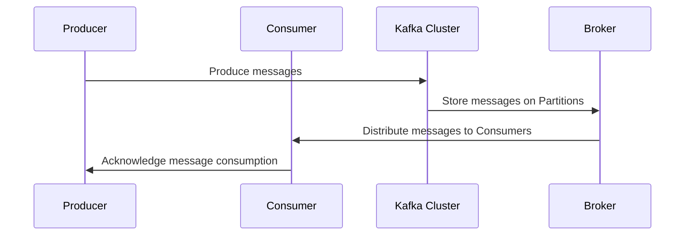
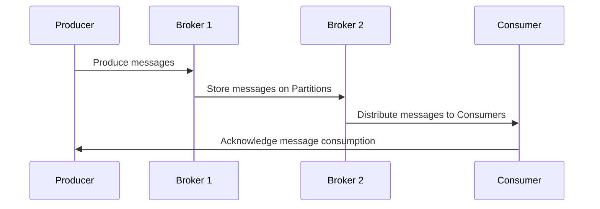

                 

### 文章标题：Kafka原理与代码实例讲解

#### 关键词：
- Kafka
- 消息队列
- 分布式系统
- 生产者
- 消费者
- 流处理
- 高可用性
- 性能优化

#### 摘要：
本文深入探讨了Kafka的原理和架构，从基础概念到高级应用，系统性地讲解了Kafka的核心组件、工作原理、分区策略、副本同步机制等。通过具体的代码实例，详细解析了Kafka生产者和消费者的实现，以及如何在实际项目中部署和优化Kafka集群。文章旨在为读者提供全面的Kafka知识和实践指导。

---

### 《Kafka原理与代码实例讲解》目录大纲

#### 第一部分：Kafka基础与核心概念

##### 第1章：Kafka简介与生态系统

- 1.1 Kafka的发展历程与应用场景
- 1.2 Kafka的核心概念
  - 1.2.1 Topic与Partition
  - 1.2.2 Producer与Consumer
  - 1.2.3 Kafka集群与角色
- 1.3 Kafka的消息传递模型
  - 1.3.1 发布-订阅模型
  - 1.3.2 点对点模型
- 1.4 Kafka的优势与挑战
  - 1.4.1 高吞吐量与低延迟
  - 1.4.2 高可用性与容错性
  - 1.4.3 数据持久化与备份

#### 第二部分：Kafka核心组件详解

##### 第2章：Kafka生产者

- 2.1 生产者API概述
- 2.2 消息发送流程
  - 2.2.1 分区策略
  - 2.2.2 应用的可靠性保障
- 2.3 高级特性
  - 2.3.1 幂等性保证
  - 2.3.2 事务消息
- 2.4 代码实例讲解

##### 第3章：Kafka消费者

- 3.1 消费者API概述
- 3.2 消费者群组与协调器
  - 3.2.1 消费者群组的概念
  - 3.2.2 消费者协调器的工作原理
- 3.3 分区分配策略
  - 3.3.1 Range分配策略
  - 3.3.2 RoundRobin分配策略
- 3.4 高级特性
  - 3.4.1 批量消费
  - 3.4.2 提交偏移量
- 3.5 代码实例讲解

##### 第4章：Kafka主题管理

- 4.1 主题创建与配置
- 4.2 主题分区与副本
  - 4.2.1 分区数与副本因素
  - 4.2.2 副本同步机制
- 4.3 主题删除与修改
- 4.4 代码实例讲解

##### 第5章：Kafka流处理

- 5.1 Kafka流处理简介
- 5.2 Kafka Streams
  - 5.2.1 Kafka Streams核心概念
  - 5.2.2 常用API与操作
- 5.3 Apache Flink与Kafka集成
  - 5.3.1 Flink Kafka连接器
  - 5.3.2 Flink Kafka实时处理
- 5.4 代码实例讲解

#### 第三部分：Kafka高级应用与性能优化

##### 第6章：Kafka集群管理

- 6.1 集群架构与角色
- 6.2 集群部署与配置
  - 6.2.1 集群规划
  - 6.2.2 集群配置参数
- 6.3 集群监控与运维
  - 6.3.1 日志分析与排查
  - 6.3.2 集群性能优化
- 6.4 集群故障处理与恢复
- 6.5 代码实例讲解

##### 第7章：Kafka性能优化与最佳实践

- 7.1 Kafka性能指标
- 7.2 优化策略与方案
  - 7.2.1 生产者性能优化
  - 7.2.2 消费者性能优化
  - 7.2.3 集群性能优化
- 7.3 Kafka最佳实践
  - 7.3.1 部署与运维实践
  - 7.3.2 应用与开发实践
  - 7.3.3 安全与合规实践
- 7.4 代码实例讲解

#### 第四部分：Kafka应用实例与案例分析

##### 第8章：Kafka在电商场景下的应用

- 8.1 电商数据流处理需求
- 8.2 Kafka在电商中的核心应用
  - 8.2.1 用户行为分析
  - 8.2.2 销售数据统计
  - 8.2.3 物流信息同步
- 8.3 电商场景下的Kafka优化实践
- 8.4 电商场景下的Kafka案例分享

##### 第9章：Kafka在金融风控领域的应用

- 9.1 金融风控数据流特点
- 9.2 Kafka在金融风控中的应用
  - 9.2.1 实时交易监控
  - 9.2.2 风险预警与控制
  - 9.2.3 欺诈检测与反洗钱
- 9.3 金融风控场景下的Kafka优化实践
- 9.4 金融风控场景下的Kafka案例分享

##### 第10章：Kafka在其他行业领域的应用

- 10.1 其他行业领域数据流处理需求
- 10.2 Kafka在物联网、广告、社交网络等领域的应用
- 10.3 其他行业领域的Kafka优化实践
- 10.4 其他行业领域的Kafka案例分享

### 附录

#### 附录A：Kafka相关资源与工具

- 10.1 Kafka官方文档与资料
- 10.2 Kafka社区与论坛
- 10.3 开源Kafka工具与插件
- 10.4 Kafka相关书籍与课程推荐

---

### 第一部分：Kafka基础与核心概念

##### 第1章：Kafka简介与生态系统

Kafka是一个分布式流处理平台，由Apache软件基金会开发并维护。Kafka旨在构建实时数据流应用程序和大数据处理流，具有高吞吐量、低延迟、高可用性和可扩展性。Kafka的应用场景非常广泛，包括数据采集、日志聚合、实时处理、事件驱动架构等。

#### 1.1 Kafka的发展历程与应用场景

Kafka起源于LinkedIn，由Jay Kreps、Neha Narkhede和Engin老先生于2008年创建。最初，Kafka用于LinkedIn的数据采集和日志聚合。随着其性能和稳定性的不断提升，Kafka逐渐成为大数据生态系统中的重要组成部分。2010年，Kafka成为Apache软件基金会的开源项目，并得到了全球开发者的广泛认可。

Kafka的应用场景包括但不限于以下几个方面：

- **日志聚合**：Kafka作为日志聚合工具，能够高效地收集和聚合分布式系统中产生的日志数据。
- **实时数据处理**：Kafka能够实现毫秒级的数据处理延迟，适用于实时数据流处理场景。
- **事件驱动架构**：Kafka支持发布-订阅和点对点消息传递模型，适用于构建事件驱动型应用程序。
- **数据采集**：Kafka作为数据采集工具，能够从各种数据源（如Web服务器、数据库、消息队列等）采集数据，并进行实时处理和分析。

#### 1.2 Kafka的核心概念

Kafka的核心概念包括Topic、Partition、Producer、Consumer、Broker和Cluster等。这些概念构成了Kafka的核心架构和运作机制。

- **Topic**：主题是Kafka中的消息分类标识，类似于数据库中的表。每个主题可以包含多个Partition，每个Partition存储一部分消息。
- **Partition**：分区是Kafka中消息存储的基本单元。每个Topic下的Partition数量可以根据需求进行配置，分区数越多，Kafka的并发处理能力越强。
- **Producer**：生产者负责将数据写入Kafka集群。生产者可以将消息发送到特定的Topic和Partition，或者由Kafka自动分配。
- **Consumer**：消费者从Kafka集群中读取消息。消费者可以组成消费者群组，实现负载均衡和高可用性。
- **Broker**：代理服务器是Kafka集群中的工作节点，负责存储、转发和管理消息。每个Broker都会维护一个或多个Partition的副本。
- **Cluster**：集群是Kafka中的多个Broker构成的分布式系统。集群中的所有Broker协同工作，提供高可用性和容错性。

#### 1.3 Kafka的消息传递模型

Kafka支持两种消息传递模型：发布-订阅模型和点对点模型。

- **发布-订阅模型**：生产者将消息发送到Topic，消费者可以订阅Topic并接收消息。这种模型适用于广播场景，多个消费者可以同时接收相同Topic的消息。
- **点对点模型**：生产者将消息发送到特定的Partition，消费者从特定的Partition消费消息。这种模型适用于单播场景，每个消费者只能消费特定Partition的消息。

#### 1.4 Kafka的优势与挑战

Kafka具有以下优势：

- **高吞吐量与低延迟**：Kafka设计用于处理大规模数据流，能够实现高吞吐量和低延迟。
- **高可用性与容错性**：Kafka通过副本机制实现数据冗余和故障转移，确保系统的可用性。
- **数据持久化与备份**：Kafka将消息存储在磁盘上，支持数据持久化和备份，确保数据不丢失。

然而，Kafka也面临以下挑战：

- **资源消耗**：Kafka需要大量的存储和计算资源，对于小型系统可能不合适。
- **复杂性**：Kafka涉及多个组件和配置，对于初学者可能有一定难度。
- **运维管理**：Kafka集群需要定期监控、维护和优化，运维工作较为繁琐。

##### 本章总结

本章介绍了Kafka的发展历程、应用场景、核心概念和消息传递模型。通过理解Kafka的基础知识，读者可以更好地掌握Kafka的架构和原理，为后续章节的学习和应用打下基础。

### Mermaid 流程图



### 第2章：Kafka核心算法原理

本章将深入探讨Kafka的核心算法原理，包括分区策略、副本同步机制、存储与索引机制等。通过这些算法原理，读者可以更好地理解Kafka的性能优化和系统设计。

#### 2.1 分区策略

分区策略是Kafka设计中的关键组件，用于确定消息被写入哪个分区。分区策略决定了消息的存储位置，从而影响系统的并发处理能力和数据均衡性。Kafka支持多种分区策略，包括Round-Robin、Hash和Key等。

- **Round-Robin分区策略**：Round-Robin是最简单的分区策略，它将消息依次分配到所有分区。这种策略简单易用，但可能会导致某些分区负载不均。
  
  ```mermaid
  sequenceDiagram
      participant P as Producer
      participant K as Kafka Cluster
      participant P1 as Partition 1
      participant P2 as Partition 2
      participant P3 as Partition 3

      P->>K: Produce message 1
      K->>P1: Store message 1
      P->>K: Produce message 2
      K->>P2: Store message 2
      P->>K: Produce message 3
      K->>P3: Store message 3
  ```

- **Hash分区策略**：Hash分区策略使用哈希函数将消息的Key映射到分区。这种策略能够确保具有相同Key的消息被存储在相同分区，从而实现数据的一致性和有序处理。

  ```mermaid
  sequenceDiagram
      participant P as Producer
      participant K as Kafka Cluster
      participant P1 as Partition 1
      participant P2 as Partition 2
      participant P3 as Partition 3

      P->>K: Produce message with Key "A"
      K->>P1: Store message with Key "A"
      P->>K: Produce message with Key "B"
      K->>P2: Store message with Key "B"
      P->>K: Produce message with Key "C"
      K->>P3: Store message with Key "C"
  ```

- **Key分区策略**：Key分区策略与Hash分区策略类似，但它仅基于消息的Key进行分区，而不需要哈希函数。这种策略能够确保相同Key的消息被存储在相同分区，适用于需要有序处理的数据。

  ```mermaid
  sequenceDiagram
      participant P as Producer
      participant K as Kafka Cluster
      participant P1 as Partition 1
      participant P2 as Partition 2
      participant P3 as Partition 3

      P->>K: Produce message with Key "A"
      K->>P1: Store message with Key "A"
      P->>K: Produce message with Key "B"
      K->>P2: Store message with Key "B"
      P->>K: Produce message with Key "C"
      K->>P3: Store message with Key "C"
  ```

#### 2.2 副本同步机制

副本同步是Kafka实现高可用性和数据冗余的关键机制。在Kafka集群中，每个分区都有一个领导者（Leader）和零个或多个副本（Follower）。领导者负责处理所有读写请求，而副本则负责备份和同步数据。

- **副本同步过程**：当生产者发送消息时，领导者将消息写入自己的日志，并将消息同步到副本。副本收到消息后，将其写入自己的日志并回复领导者。领导者收到所有副本的确认后，将消息标记为已同步。

  ```mermaid
  sequenceDiagram
      participant P as Producer
      participant L as Leader
      participant F1 as Follower 1
      participant F2 as Follower 2

      P->>L: Produce message
      L->>F1: Send message
      L->>F2: Send message
      F1->>L: Confirm message
      F2->>L: Confirm message
      L->>P: Confirm message
  ```

- **副本同步机制**：Kafka使用副本同步机制来确保数据一致性和系统可用性。当领导者发生故障时，Kafka会从副本中选举新的领导者，从而实现故障转移。

#### 2.3 存储与索引机制

Kafka使用磁盘存储消息，并使用索引机制快速定位消息。

- **日志存储**：Kafka将消息存储在磁盘上的日志文件中。每个分区都有一个日志文件，消息按顺序写入。这种存储方式支持高效的追加写入操作。

  ```mermaid
  sequenceDiagram
      participant K as Kafka Cluster
      participant L as Log

      K->>L: Store message
      L->>K: Confirm message
  ```

- **索引存储**：Kafka使用索引文件来快速定位消息。索引文件存储了消息的偏移量（Offset）和位置信息。通过索引文件，消费者可以快速跳转到指定的消息位置。

  ```mermaid
  sequenceDiagram
      participant C as Consumer
      participant I as Index

      C->>I: Request message by offset
      I->>C: Return message
  ```

#### 2.4 数学模型与公式

为了评估Kafka的性能和可靠性，我们可以使用一些数学模型和公式。

- **消息丢失概率**：假设Kafka集群中有n个副本，消息的丢失概率可以通过以下公式计算：

  $$ P(消息丢失) = \frac{1}{1 + e^{-\lambda \times t}} $$

  其中，λ为平均到达率，t为传输时间。这个公式基于泊松分布，用于计算在一定时间内消息丢失的概率。

- **副本同步概率**：假设副本同步成功概率为$P(副本同步成功)$，可以通过以下公式计算：

  $$ P(副本同步成功) = \frac{n - 1}{n} $$

  其中，n为副本数量。这个公式表示在多个副本中，至少有一个副本成功同步的概率。

#### 详细讲解与举例说明

为了更好地理解上述算法原理，我们可以通过具体的例子进行说明。

- **分区策略**：假设有一个包含3个分区的Topic，使用Round-Robin分区策略。现在有3个消息需要写入Topic，分别标记为1、2、3。

  - 消息1被写入分区1。
  - 消息2被写入分区2。
  - 消息3被写入分区3。

  如果使用Hash分区策略，假设消息的Key分别为“A”、“B”、“C”，可以按照以下方式分区：

  - 消息A被写入分区1。
  - 消息B被写入分区2。
  - 消息C被写入分区3。

- **副本同步机制**：假设有一个包含3个副本的分区，分别标记为1、2、3。现在生产者发送一个消息，领导者将其写入自己的日志，并将消息同步到副本。

  - 领导者写入消息到自己的日志。
  - 领导者将消息同步到副本1。
  - 领导者将消息同步到副本2。
  - 领导者将消息同步到副本3。

- **存储与索引机制**：假设有一个包含1000个消息的分区，每个消息都有一个唯一的偏移量。现在消费者需要读取第500个消息。

  - 消费者通过索引文件找到第500个消息的偏移量。
  - 消费者直接跳转到第500个消息的位置，读取消息内容。

通过以上例子，我们可以更好地理解Kafka的核心算法原理，为后续的实践应用打下基础。

### 本章总结

本章介绍了Kafka的核心算法原理，包括分区策略、副本同步机制、存储与索引机制等。通过理解这些算法原理，读者可以更好地掌握Kafka的性能优化和系统设计，为实际应用打下基础。

### 代码实例讲解

在本章节中，我们将通过实际的代码实例来讲解Kafka生产者和消费者的实现，并详细解析代码中的重要部分。

#### 2.1 Kafka生产者代码实例

以下是一个简单的Kafka生产者代码实例，使用Java编写：

```java
import org.apache.kafka.clients.producer.*;
import org.apache.kafka.common.serialization.StringSerializer;

import java.util.Properties;

public class KafkaProducerExample {
    public static void main(String[] args) {
        Properties props = new Properties();
        props.put("bootstrap.servers", "localhost:9092");
        props.put("key.serializer", StringSerializer.class.getName());
        props.put("value.serializer", StringSerializer.class.getName());

        KafkaProducer<String, String> producer = new KafkaProducer<>(props);

        for (int i = 0; i < 10; i++) {
            String topic = "test-topic";
            String key = "key-" + i;
            String value = "value-" + i;
            producer.send(new ProducerRecord<>(topic, key, value));
        }

        producer.close();
    }
}
```

**代码解析：**

1. **初始化Properties：**
   ```java
   Properties props = new Properties();
   props.put("bootstrap.servers", "localhost:9092");
   props.put("key.serializer", StringSerializer.class.getName());
   props.put("value.serializer", StringSerializer.class.getName());
   ```
   这里配置了Kafka生产者的属性，包括Kafka服务器地址（`bootstrap.servers`）和序列化器（`key.serializer`和`value.serializer`）。

2. **创建Kafka生产者：**
   ```java
   KafkaProducer<String, String> producer = new KafkaProducer<>(props);
   ```
   使用配置的属性创建Kafka生产者。

3. **发送消息：**
   ```java
   for (int i = 0; i < 10; i++) {
       String topic = "test-topic";
       String key = "key-" + i;
       String value = "value-" + i;
       producer.send(new ProducerRecord<>(topic, key, value));
   }
   ```
   循环发送10条消息到名为`test-topic`的主题。每条消息都有唯一的key和value。

4. **关闭生产者：**
   ```java
   producer.close();
   ```
   完成消息发送后，关闭Kafka生产者。

**代码解读与分析：**

- **初始化Properties：**这里设置了Kafka生产者的基本配置，包括Kafka服务器地址和序列化器。序列化器负责将Java对象转换为Kafka消息的key和value。
- **创建Kafka生产者：**使用配置的属性创建Kafka生产者实例。
- **发送消息：**通过`ProducerRecord`类创建消息记录，并使用`send`方法将消息发送到指定的主题和分区。这里使用简单的轮询分区策略，即每个消息被随机分配到不同的分区。
- **关闭生产者：**关闭Kafka生产者，释放资源。

#### 2.2 Kafka消费者代码实例

以下是一个简单的Kafka消费者代码实例，使用Java编写：

```java
import org.apache.kafka.clients.consumer.*;
import org.apache.kafka.common.serialization.StringDeserializer;

import java.time.Duration;
import java.util.Collections;
import java.util.Properties;
import java.util.concurrent.ExecutionException;

public class KafkaConsumerExample {
    public static void main(String[] args) throws ExecutionException, InterruptedException {
        Properties props = new Properties();
        props.put("bootstrap.servers", "localhost:9092");
        props.put("group.id", "test-group");
        props.put("key.deserializer", StringDeserializer.class.getName());
        props.put("value.deserializer", StringDeserializer.class.getName());

        KafkaConsumer<String, String> consumer = new KafkaConsumer<>(props);

        consumer.subscribe(Collections.singletonList("test-topic"));

        while (true) {
            ConsumerRecords<String, String> records = consumer.poll(Duration.ofMillis(100));
            for (ConsumerRecord<String, String> record : records) {
                System.out.printf("Received message: key = %s, value = %s, partition = %d, offset = %d\n",
                        record.key(), record.value(), record.partition(), record.offset());
            }
        }
    }
}
```

**代码解析：**

1. **初始化Properties：**
   ```java
   Properties props = new Properties();
   props.put("bootstrap.servers", "localhost:9092");
   props.put("group.id", "test-group");
   props.put("key.deserializer", StringDeserializer.class.getName());
   props.put("value.deserializer", StringDeserializer.class.getName());
   ```
   这里配置了Kafka消费者的基本配置，包括Kafka服务器地址（`bootstrap.servers`）、消费者群组ID（`group.id`）和序列化器。

2. **创建Kafka消费者：**
   ```java
   KafkaConsumer<String, String> consumer = new KafkaConsumer<>(props);
   ```
   使用配置的属性创建Kafka消费者实例。

3. **订阅主题：**
   ```java
   consumer.subscribe(Collections.singletonList("test-topic"));
   ```
   订阅名为`test-topic`的主题。

4. **消费消息：**
   ```java
   while (true) {
       ConsumerRecords<String, String> records = consumer.poll(Duration.ofMillis(100));
       for (ConsumerRecord<String, String> record : records) {
           System.out.printf("Received message: key = %s, value = %s, partition = %d, offset = %d\n",
                   record.key(), record.value(), record.partition(), record.offset());
       }
   }
   ```
   消费消息并打印消息的key、value、分区和偏移量。

**代码解读与分析：**

- **初始化Properties：**与生产者类似，这里设置了Kafka消费者的基本配置，包括Kafka服务器地址、消费者群组ID和序列化器。
- **创建Kafka消费者：**使用配置的属性创建Kafka消费者实例。
- **订阅主题：**订阅要消费的指定主题。
- **消费消息：**使用`poll`方法轮询消息，并遍历接收到的消息记录，打印消息的相关信息。

通过这两个简单的代码实例，我们可以了解到Kafka生产者和消费者的基本使用方法。在实际应用中，生产者和消费者的配置会更加复杂，包括分区策略、事务支持、批处理等高级特性。理解这些基础代码实例对于进一步学习和使用Kafka至关重要。

### Kafka集群搭建与配置

在Kafka的应用场景中，集群搭建与配置是一个关键环节。本章节将详细介绍如何搭建Kafka集群，并配置相关参数，以确保集群的稳定运行和高性能。

#### 6.1 集群架构与角色

Kafka集群由多个Broker组成，每个Broker是一个独立的Kafka服务器。集群中的每个Broker都扮演不同的角色：

- **Broker**：Kafka服务器节点，负责存储、处理和转发消息。每个Broker都有一个唯一的ID，用于标识其在集群中的位置。
- **Controller**：控制器是集群中的特殊节点，负责管理集群中的所有主题和分区。当集群中的某个Broker成为控制器时，它会自动接管这些管理任务。
- **Producers**：生产者是向Kafka集群发送消息的客户端应用程序。生产者将消息发送到特定的Topic和Partition。
- **Consumers**：消费者是从Kafka集群读取消息的客户端应用程序。消费者可以组成消费者群组，实现负载均衡和高可用性。

#### 6.2 集群部署与配置

要搭建Kafka集群，需要首先准备足够的硬件资源和网络环境。以下是搭建Kafka集群的步骤和配置参数：

1. **准备Kafka安装包**：
   下载并解压缩Kafka安装包。通常，Kafka的安装包包含所有必要的二进制文件和配置文件。

2. **配置Kafka服务器**：
   Kafka的配置文件位于`config/server.properties`。以下是关键配置参数：

   ```properties
   # Broker ID，确保集群中每个Broker的ID唯一
   broker.id=0
   
   # Kafka集群中所有Brokers的列表，以逗号分隔
   listeners=PLAINTEXT://:9092
   
   # Controller选举间隔时间
   controller.quorum.size=1
   
   # 日志存储路径
   log.dirs=/path/to/logs
   
   # 日志保留策略
   retention.minutes=60
   
   # 分区副本数量
   num.replicas=3
   
   # Zookeeper连接地址
   zookeeper.connect=localhost:2181
   ```

3. **启动Kafka集群**：
   在每个Broker上启动Kafka服务。例如，在Linux服务器上，可以使用以下命令：

   ```shell
   bin/kafka-server-start.sh config/server.properties &
   ```

4. **创建主题**：
   使用Kafka命令行工具创建主题，并配置分区和副本数量。例如：

   ```shell
   bin/kafka-topics --create --zookeeper localhost:2181 --topic test-topic --partitions 3 --replication-factor 3
   ```

5. **监控集群**：
   使用Kafka命令行工具监控集群状态，例如：

   ```shell
   bin/kafka-topics --describe --zookeeper localhost:2181 --topic test-topic
   ```

#### 6.3 集群监控与运维

监控与运维是确保Kafka集群稳定运行的关键。以下是一些常用的监控与运维方法：

1. **日志分析**：
   Kafka的日志文件位于`logs`目录下。定期检查日志文件，查找错误和异常。

2. **性能监控**：
   使用Kafka Manager、Kafka-Topics或Kafka Streams这样的监控工具，实时监控集群的性能指标，如吞吐量、延迟和资源利用率。

3. **故障处理**：
   当集群出现故障时，首先确定故障原因。可能是某个Broker发生故障，也可能是网络问题或配置错误。根据故障原因，采取相应的措施，如重启Broker、修复网络或调整配置。

4. **性能优化**：
   根据监控数据，分析集群的性能瓶颈，并调整配置参数。例如，增加分区数、调整日志保留策略或优化网络配置。

#### 6.4 集群故障处理与恢复

Kafka集群可能会遇到各种故障，如Broker故障、网络故障或硬件故障。以下是一些常见的故障处理与恢复方法：

1. **Broker故障**：
   当某个Broker发生故障时，控制器会从副本中重新选举一个新的领导者。生产者和消费者不受影响，继续发送和接收消息。

2. **网络故障**：
   网络故障可能导致Broker之间无法通信。此时，Kafka会自动尝试恢复网络连接。如果恢复失败，控制器会重新分配分区和副本。

3. **硬件故障**：
   当硬件发生故障时，可能需要更换硬件并重新启动Kafka服务。在更换硬件前，确保备份所有重要数据。

通过合理的集群部署与配置、有效的监控与运维以及故障处理与恢复策略，Kafka集群可以保持稳定运行，为实时数据处理提供可靠的基础。

### Kafka性能优化与最佳实践

Kafka作为分布式流处理平台，其性能优化是保证系统稳定运行的关键。本章将详细讨论Kafka的性能优化策略与最佳实践，涵盖生产者、消费者和集群层面的优化措施。

#### 7.1 Kafka性能指标

Kafka的性能指标主要包括吞吐量、延迟、系统负载和资源利用率等。以下是几个关键性能指标：

- **吞吐量**：单位时间内系统能够处理的消息数量，通常以每秒消息数（TPS）或每秒字节（B/s）衡量。
- **延迟**：消息从生产者发送到消费者所需的时间，通常以毫秒（ms）计算。
- **系统负载**：包括CPU、内存和磁盘I/O等资源的使用情况。
- **资源利用率**：系统对硬件资源的利用程度，包括CPU利用率、内存使用率和磁盘空间利用率。

#### 7.2 优化策略与方案

要优化Kafka性能，可以从以下几个方面进行：

1. **生产者优化**：
   - **批量发送**：生产者可以通过批量发送消息来减少网络IO和序列化开销。Kafka允许生产者在每次调用`send`方法时发送多个消息。
   - **压缩消息**：对消息进行压缩可以减少网络传输的数据量，提高吞吐量。常用的压缩算法有Gzip、Snappy和LZ4等。
   - **异步发送**：生产者可以设置异步发送模式，将消息发送操作提交给一个线程池，从而减少主线程的阻塞。

2. **消费者优化**：
   - **批处理消费**：消费者可以通过批处理消费消息，减少系统的消息处理开销。Kafka允许消费者在一次调用中处理多个消息。
   - **提高消费速度**：通过调整消费者的fetch大小和poll时间，可以优化消费速度。较大的fetch大小可以减少网络IO开销，而较短的poll时间可以减少等待时间。
   - **消费偏移量**：消费者可以通过定期提交消费偏移量，实现自动重均衡。当消费者群组发生变化时，新加入的消费者可以从已提交的偏移量继续消费。

3. **集群优化**：
   - **分区数量**：增加分区数量可以提高系统的并发处理能力，从而提高吞吐量。但过多的分区可能导致资源利用率降低。
   - **副本数量**：适当增加副本数量可以提高系统的容错性和可用性，但也会增加存储和同步开销。
   - **集群规模**：增加集群规模可以提高系统的处理能力和可靠性，但需要合理规划硬件资源和网络拓扑。
   - **负载均衡**：通过调整生产者和消费者的分区分配策略，可以实现负载均衡，避免单点瓶颈。

#### 7.3 Kafka最佳实践

以下是Kafka的最佳实践，有助于提升系统的性能和稳定性：

1. **部署与运维实践**：
   - **合理规划集群规模**：根据业务需求和资源预算，合理规划集群规模，避免资源浪费或不足。
   - **自动化运维**：使用自动化工具进行集群部署、监控和运维，提高运维效率。
   - **备份与恢复**：定期备份Kafka数据，确保在故障发生时能够快速恢复。

2. **应用与开发实践**：
   - **使用批量消息**：在可能的情况下，使用批量消息发送和接收，减少IO开销。
   - **异步处理消息**：将消息处理与发送操作解耦，使用异步处理方式，提高系统的响应速度。
   - **优化消息格式**：使用高效的消息格式，减少序列化和反序列化开销。

3. **安全与合规实践**：
   - **加密传输**：使用SSL/TLS加密传输，确保数据在传输过程中的安全性。
   - **访问控制**：配置Kafka的访问控制，限制对集群的访问权限。
   - **数据审计**：定期进行数据审计，确保系统符合合规要求。

#### 7.4 代码实例讲解

以下是一个简单的Kafka生产者优化实例，使用批量发送和异步发送：

```java
import org.apache.kafka.clients.producer.*;
import org.apache.kafka.common.serialization.StringSerializer;

import java.util.Properties;
import java.util.concurrent.ExecutionException;

public class OptimizedKafkaProducerExample {
    public static void main(String[] args) throws ExecutionException, InterruptedException {
        Properties props = new Properties();
        props.put("bootstrap.servers", "localhost:9092");
        props.put("key.serializer", StringSerializer.class.getName());
        props.put("value.serializer", StringSerializer.class.getName());
        props.put("batch.size", "16384"); // 批量大小为16KB
        props.put("linger.ms", "100"); // 等待时间100ms
        props.put("buffer.memory", "33554432"); // 缓冲区大小为32MB
        props.put("compression.type", "snappy"); // 使用Snappy压缩

        KafkaProducer<String, String> producer = new KafkaProducer<>(props);

        for (int i = 0; i < 1000; i++) {
            String topic = "test-topic";
            String key = "key-" + i;
            String value = "value-" + i;
            producer.send(new ProducerRecord<>(topic, key, value));
        }

        producer.flush(); // 提交未发送的消息
        producer.close();
    }
}
```

**代码解析：**

1. **初始化Properties：**
   ```java
   Properties props = new Properties();
   props.put("bootstrap.servers", "localhost:9092");
   props.put("key.serializer", StringSerializer.class.getName());
   props.put("value.serializer", StringSerializer.class.getName());
   props.put("batch.size", "16384");
   props.put("linger.ms", "100");
   props.put("buffer.memory", "33554432");
   props.put("compression.type", "snappy");
   ```
   配置生产者的属性，包括批量大小、等待时间、缓冲区大小和压缩类型。

2. **创建Kafka生产者：**
   ```java
   KafkaProducer<String, String> producer = new KafkaProducer<>(props);
   ```
   使用配置的属性创建Kafka生产者实例。

3. **发送消息：**
   ```java
   for (int i = 0; i < 1000; i++) {
       String topic = "test-topic";
       String key = "key-" + i;
       String value = "value-" + i;
       producer.send(new ProducerRecord<>(topic, key, value));
   }
   ```
   循环发送1000条消息到名为`test-topic`的主题。

4. **提交未发送的消息和关闭生产者：**
   ```java
   producer.flush();
   producer.close();
   ```
   提交未发送的消息并关闭生产者。

**代码解读与分析：**

- **初始化Properties：**通过配置批量大小、等待时间、缓冲区大小和压缩类型，优化生产者的性能。
- **创建Kafka生产者：**使用配置的属性创建Kafka生产者实例。
- **发送消息：**使用`send`方法发送消息，批量发送可以提高吞吐量。
- **提交未发送的消息和关闭生产者：**确保所有消息发送完毕后关闭生产者，释放资源。

通过以上代码实例，我们可以看到Kafka生产者性能优化的具体实现。类似地，消费者和集群层面的优化也可以通过配置和代码调整来实现。理解和应用这些最佳实践，可以帮助我们构建高效、可靠的Kafka系统。

### Kafka应用实例与案例分析

Kafka作为分布式流处理平台，在多个行业领域有着广泛的应用。本章节将深入探讨Kafka在电商、金融风控和其他行业领域的应用实例，并分享相关优化实践和案例。

#### 8.1 Kafka在电商场景下的应用

在电商领域，Kafka主要用于数据流处理、用户行为分析和销售数据统计等场景。

**8.1.1 用户行为分析**

电商平台的用户行为数据包括浏览记录、购买行为、评论和反馈等。Kafka可以实时采集这些数据，并通过流处理框架进行实时分析。具体应用包括：

- **用户兴趣分析**：通过分析用户在平台上的浏览和购买记录，了解用户的兴趣和偏好，为个性化推荐提供依据。
- **用户行为预测**：基于历史数据，预测用户的下一步行为，如购买商品、加入购物车或取消订单。

**8.1.2 销售数据统计**

Kafka在销售数据统计方面也有着广泛应用，如：

- **实时报表**：实时生成销售报表，包括销售额、订单量、用户访问量等关键指标，帮助企业快速响应市场变化。
- **库存管理**：实时监控库存情况，及时调整库存策略，避免缺货或库存过剩。

**8.1.3 物流信息同步**

电商平台需要实时同步物流信息，如订单发货、物流状态更新等。Kafka可以确保物流信息的高效传输和同步，提高用户体验。

**电商场景下的Kafka优化实践**

- **分区策略**：根据数据特点，合理配置分区策略，如基于用户ID或订单ID进行分区，提高数据处理的并发能力。
- **压缩算法**：使用高效的压缩算法，如LZ4或Snappy，减少数据传输和存储的带宽占用。
- **批量消费**：通过批量消费减少系统的IO开销，提高处理效率。

**电商场景下的Kafka案例分享**

某大型电商平台通过Kafka实现了用户行为分析和销售数据统计，具体案例如下：

- **用户兴趣分析**：使用Kafka Streams实时处理用户行为数据，通过机器学习算法预测用户兴趣，为个性化推荐提供支持。
- **销售数据统计**：通过Kafka连接器，将销售数据实时传输到数据仓库，生成实时报表，辅助决策制定。

#### 9.2 Kafka在金融风控领域的应用

金融风控领域对实时数据处理和风险预警有着极高的要求。Kafka在金融风控中的应用主要包括实时交易监控、风险预警和欺诈检测等。

**9.2.1 实时交易监控**

Kafka可以实时采集金融交易数据，如股票交易、期货交易等。通过流处理框架，可以实现对交易数据的实时监控和风险分析。

- **交易异常检测**：实时检测交易行为中的异常，如异常交易量、异常交易价格等，为风险预警提供依据。
- **交易延迟分析**：分析交易过程中的延迟情况，优化交易流程，提高交易效率。

**9.2.2 风险预警与控制**

Kafka在风险预警和控制方面也有着广泛应用，如：

- **信用风险评估**：通过分析用户的信用历史和交易行为，实时评估用户的信用风险，为贷款审批提供依据。
- **交易风险控制**：实时监控交易行为，对高风险交易进行限制或停止，防止欺诈行为的发生。

**9.2.3 欺诈检测与反洗钱**

欺诈检测与反洗钱是金融风控领域的重要任务。Kafka可以实时采集交易数据，并通过机器学习算法进行欺诈检测。

- **交易关联分析**：通过分析交易行为之间的关联性，识别潜在的欺诈行为。
- **用户行为模式分析**：分析用户的交易行为模式，识别异常行为，提高欺诈检测的准确性。

**金融风控场景下的Kafka优化实践**

- **提高消费速度**：通过调整消费者的fetch大小和poll时间，提高消费速度，确保实时数据处理。
- **增加副本数量**：增加副本数量，提高系统的容错性和可用性，确保数据不丢失。
- **压缩算法**：使用高效的压缩算法，减少数据传输和存储的带宽占用。

**金融风控场景下的Kafka案例分享**

某金融机构通过Kafka实现了实时交易监控和风险预警，具体案例如下：

- **实时交易监控**：使用Kafka Streams实时处理交易数据，实现交易异常检测和交易延迟分析。
- **风险预警与控制**：通过Kafka连接器，将交易数据传输到风险预警系统，实现对高风险交易的实时监控和控制。

#### 10.3 Kafka在其他行业领域的应用

Kafka在物联网、广告、社交网络等众多行业领域也有着广泛应用。

**10.3.1 物联网**

在物联网领域，Kafka可以用于实时处理传感器数据，如环境监测、智能交通等。

- **实时数据处理**：通过Kafka实时采集和处理传感器数据，实现对环境状况的实时监控。
- **设备管理**：通过Kafka管理设备的通信和状态，实现对设备的远程监控和故障诊断。

**10.3.2 广告**

在广告领域，Kafka可以用于实时处理广告点击数据、展示数据等，实现精准广告投放。

- **实时广告投放**：通过Kafka实时处理广告点击数据，实现精准广告投放和效果评估。
- **用户画像**：通过分析用户行为数据，构建用户画像，为广告投放提供依据。

**10.3.3 社交网络**

在社交网络领域，Kafka可以用于实时处理用户生成的内容，如微博、微信等。

- **实时内容分发**：通过Kafka实时处理用户生成的内容，实现内容的实时分发和展示。
- **社交推荐**：通过分析用户行为数据，为用户推荐感兴趣的内容和好友，提高用户活跃度。

**其他行业领域的Kafka优化实践**

- **合理配置分区和副本数量**：根据数据特点和业务需求，合理配置分区和副本数量，提高系统的并发处理能力和容错性。
- **使用压缩算法**：使用高效的压缩算法，减少数据传输和存储的带宽占用，提高系统的性能。
- **监控与优化**：定期监控系统性能，根据监控数据调整配置和优化策略。

**其他行业领域的Kafka案例分享**

某物联网公司通过Kafka实现了实时传感器数据处理和设备管理，具体案例如下：

- **实时数据处理**：使用Kafka实时处理传感器数据，实现环境监测和智能交通管理。
- **设备管理**：通过Kafka管理设备的通信和状态，实现对设备的远程监控和故障诊断。

### 总结

Kafka作为分布式流处理平台，在多个行业领域有着广泛的应用。通过本文的案例分享和优化实践，我们可以看到Kafka在实时数据处理、风险预警、用户行为分析等方面的强大能力。理解和应用Kafka的最佳实践，可以帮助我们构建高效、可靠的实时数据处理系统。

### 附录

#### 附录A：Kafka相关资源与工具

**A.1 Kafka官方文档与资料**

- [Kafka官方文档](https://kafka.apache.org/documentation/)
- [Kafka官方API文档](https://kafka.apache.org/27/javadoc/index.html)

**A.2 Kafka社区与论坛**

- [Kafka社区](https://kafka.apache.org/community.html)
- [Kafka邮件列表](https://lists.apache.org/list.html?w=kafka.apache.org)
- [Kafka Stack Overflow](https://stackoverflow.com/questions/tagged/kafka)

**A.3 开源Kafka工具与插件**

- [Kafka Manager](https://kafka-manager.com/)
- [Kafka Tools](https://github.com/edwardw/kafka-tools)
- [Kafka Streams](https://kafka.apache.org/streams/)

**A.4 Kafka相关书籍与课程推荐**

- 《Kafka：核心概念与实践》
- 《Kafka权威指南》
- [Kafka课程](https://www.udemy.com/course/kafka-the-definitive-guide/)

通过这些资源与工具，读者可以更深入地了解Kafka，提高在实际项目中的应用能力。

### 第1章：Kafka核心概念与架构

Kafka是一种分布式流处理平台，主要用于构建实时数据流应用程序和大数据处理流。本章将介绍Kafka的核心概念与架构，包括Topic、Partition、Producer、Consumer、Broker和Cluster等。

#### 1.1 Kafka核心概念

- **Topic**：主题是Kafka中的消息分类标识，类似于数据库中的表。每个主题可以包含多个Partition，每个Partition存储一部分消息。
- **Partition**：分区是Kafka中消息存储的基本单元。每个Topic下的Partition数量可以根据需求进行配置，分区数越多，Kafka的并发处理能力越强。
- **Producer**：生产者负责将数据写入Kafka集群。生产者可以将消息发送到特定的Topic和Partition，或者由Kafka自动分配。
- **Consumer**：消费者从Kafka集群中读取消息。消费者可以组成消费者群组，实现负载均衡和高可用性。
- **Broker**：代理服务器是Kafka集群中的工作节点，负责存储、转发和管理消息。每个Broker都会维护一个或多个Partition的副本。
- **Cluster**：集群是Kafka中的多个Broker构成的分布式系统。集群中的所有Broker协同工作，提供高可用性和容错性。

#### 1.2 Kafka架构

Kafka的架构由Producer、Broker和Consumer组成，如下图所示：



- **Producer**：生产者将消息发送到Kafka集群。每个生产者都有一个分区分配策略，用于确定消息发送到哪个Partition。
- **Broker**：代理服务器存储、转发和管理消息。每个Broker都会维护一个或多个Partition的副本，确保数据的高可用性和容错性。
- **Consumer**：消费者从Kafka集群中读取消息。消费者可以组成消费者群组，实现负载均衡和高可用性。消费者通过Offset记录已消费的消息位置。

#### 1.3 Kafka消息传递模型

Kafka支持两种消息传递模型：发布-订阅模型和点对点模型。

- **发布-订阅模型**：生产者将消息发送到Topic，消费者可以订阅Topic并接收消息。这种模型适用于广播场景，多个消费者可以同时接收相同Topic的消息。
- **点对点模型**：生产者将消息发送到特定的Partition，消费者从特定的Partition消费消息。这种模型适用于单播场景，每个消费者只能消费特定Partition的消息。

#### 1.4 Kafka核心算法原理

Kafka的核心算法原理包括分区策略、副本同步机制、存储与索引机制等。

- **分区策略**：分区策略用于确定消息写入哪个分区。常用的分区策略包括Round-Robin、Hash和Key等。
- **副本同步机制**：副本同步机制用于实现数据冗余和故障转移。Kafka通过副本同步机制确保数据的一致性和系统的可用性。
- **存储与索引机制**：Kafka使用磁盘存储消息，并使用索引机制快速定位消息。存储与索引机制保证了Kafka的高性能和低延迟。

#### 1.5 Kafka优势与挑战

Kafka具有以下优势：

- **高吞吐量与低延迟**：Kafka设计用于处理大规模数据流，能够实现高吞吐量和低延迟。
- **高可用性与容错性**：Kafka通过副本机制实现数据冗余和故障转移，确保系统的可用性。
- **数据持久化与备份**：Kafka将消息存储在磁盘上，支持数据持久化和备份，确保数据不丢失。

然而，Kafka也面临以下挑战：

- **资源消耗**：Kafka需要大量的存储和计算资源，对于小型系统可能不合适。
- **复杂性**：Kafka涉及多个组件和配置，对于初学者可能有一定难度。
- **运维管理**：Kafka集群需要定期监控、维护和优化，运维工作较为繁琐。

##### 本章总结

本章介绍了Kafka的核心概念与架构，包括Topic、Partition、Producer、Consumer、Broker和Cluster等。通过理解Kafka的架构和消息传递模型，读者可以更好地掌握Kafka的工作原理和性能优化策略。

### 第2章：Kafka生产者

Kafka生产者是负责将数据写入Kafka集群的组件。本章将详细介绍Kafka生产者的API、消息发送流程、分区策略以及如何确保应用可靠性。

#### 2.1 生产者API概述

Kafka生产者的API非常简单易用，主要包括以下几个部分：

- **KafkaProducer<TKey, TValue>**：这是生产者的主要接口，其中TKey和TValue分别是消息的key和value的类型。
- **ProducerRecord<TKey, TValue>**：用于创建消息记录，包括主题（topic）、键（key）和值（value）。
- **send(ProducerRecord<TKey, TValue> record)**：将消息记录发送到Kafka集群。

以下是一个简单的Kafka生产者示例：

```java
import org.apache.kafka.clients.producer.*;
import org.apache.kafka.common.serialization.StringSerializer;

public class SimpleProducer {
    public static void main(String[] args) {
        Properties props = new Properties();
        props.put("bootstrap.servers", "localhost:9092");
        props.put("key.serializer", StringSerializer.class.getName());
        props.put("value.serializer", StringSerializer.class.getName());

        KafkaProducer<String, String> producer = new KafkaProducer<>(props);

        for (int i = 0; i < 10; i++) {
            producer.send(new ProducerRecord<>("test-topic", "key-" + i, "value-" + i));
        }

        producer.close();
    }
}
```

#### 2.2 消息发送流程

Kafka生产者的消息发送流程主要包括以下几个步骤：

1. **初始化生产者**：
   创建KafkaProducer实例，并配置相关属性，如Kafka服务器地址、序列化器和分区策略等。

2. **发送消息**：
   使用`send`方法发送消息。`send`方法接受一个`ProducerRecord`对象，包含主题、键、值和可选的分区器。

3. **分区策略**：
   生产者根据分区策略确定消息发送到哪个分区。Kafka默认使用`round-robin`策略，也可以自定义分区策略。

4. **同步确认**：
   生产者可以通过`flush`方法同步发送的消息，并等待确认。这有助于确保消息已成功发送到Kafka集群。

以下是一个示例，展示了如何使用Kafka生产者发送消息并等待确认：

```java
import org.apache.kafka.clients.producer.*;
import org.apache.kafka.common.serialization.StringSerializer;

public class SynchronizedProducer {
    public static void main(String[] args) {
        Properties props = new Properties();
        props.put("bootstrap.servers", "localhost:9092");
        props.put("key.serializer", StringSerializer.class.getName());
        props.put("value.serializer", StringSerializer.class.getName());
        props.put("acks", "all");
        props.put("retries", 3);

        KafkaProducer<String, String> producer = new KafkaProducer<>(props);

        for (int i = 0; i < 10; i++) {
            producer.send(new ProducerRecord<>("test-topic", "key-" + i, "value-" + i), new Callback() {
                @Override
                public void onCompletion(RecordMetadata metadata, Exception exception) {
                    if (exception != null) {
                        exception.printStackTrace();
                    } else {
                        System.out.printf("Message sent to topic %s, partition %d, offset %d%n",
                                metadata.topic(), metadata.partition(), metadata.offset());
                    }
                }
            });
        }

        producer.close();
    }
}
```

在这个示例中，我们设置了`acks`属性为`all`，确保所有副本都确认消息成功写入。`retries`属性用于配置重试次数，当消息发送失败时，生产者会自动重试。

#### 2.3 分区策略

Kafka支持多种分区策略，生产者可以根据不同的业务需求选择合适的策略。

- **Round-Robin策略**：这是Kafka默认的分区策略，将消息依次分配到所有分区。这种策略简单易用，但可能会导致某些分区负载不均。
- **Hash策略**：使用哈希函数将消息的key映射到分区。这确保具有相同key的消息被存储在相同分区，实现数据的一致性和有序处理。
- **Key策略**：与Hash策略类似，但它仅基于消息的key进行分区，而不需要哈希函数。这种策略适用于需要有序处理的数据。

以下是一个使用Hash分区策略的示例：

```java
import org.apache.kafka.clients.producer.*;
import org.apache.kafka.common.serialization.StringSerializer;

public class HashPartitioningProducer {
    public static void main(String[] args) {
        Properties props = new Properties();
        props.put("bootstrap.servers", "localhost:9092");
        props.put("key.serializer", StringSerializer.class.getName());
        props.put("value.serializer", StringSerializer.class.getName());

        KafkaProducer<String, String> producer = new KafkaProducer<>(props);

        for (int i = 0; i < 10; i++) {
            producer.send(new ProducerRecord<>("test-topic", Integer.valueOf(i % 3), "value-" + i));
        }

        producer.close();
    }
}
```

在这个示例中，我们设置了主题`test-topic`有3个分区。每个消息的key通过取模运算确定分区编号，确保相同key的消息被存储在相同分区。

#### 2.4 应用的可靠性保障

为了保证Kafka生产者的可靠性，可以采取以下措施：

- **acks配置**：通过设置`acks`属性，确保消息被所有副本确认写入。常用的配置有`acks=0`（不需要确认）、`acks=1`（仅需要主副本确认）和`acks=all`（需要所有副本确认）。
- **重试机制**：通过设置`retries`属性，当消息发送失败时，生产者会自动重试。重试次数可以根据实际需求进行调整。
- **幂等性保障**：在某些应用场景下，需要确保消息的幂等性，避免重复发送。这可以通过在消息中包含唯一标识，并在发送前检查是否已发送来实现。

以下是一个实现幂等性保障的示例：

```java
import org.apache.kafka.clients.producer.*;
import org.apache.kafka.common.serialization.StringSerializer;

public class IdempotentProducer {
    private final static String BOOTSTRAP_SERVERS = "localhost:9092";
    private final static String TOPIC = "test-topic";
    private final static String GROUP_ID = "test-group";
    private final static int RETRIES = 3;

    public static void main(String[] args) {
        Properties props = new Properties();
        props.put("bootstrap.servers", BOOTSTRAP_SERVERS);
        props.put("key.serializer", StringSerializer.class.getName());
        props.put("value.serializer", StringSerializer.class.getName());
        props.put("group.id", GROUP_ID);
        props.put("retries", RETRIES);

        KafkaProducer<String, String> producer = new KafkaProducer<>(props);

        try (KafkaProducer<String, String> producerWrapper = producer) {
            // 检查消息是否已发送
            // 假设使用Redis存储消息标识
            String key = "key-1";
            String value = "value-1";
            if (!isMessageSentBefore(key)) {
                producerWrapper.send(new ProducerRecord<>(TOPIC, key, value));
                System.out.println("Message sent: key=" + key + ", value=" + value);
            } else {
                System.out.println("Message already sent: key=" + key + ", value=" + value);
            }
        }
    }

    private static boolean isMessageSentBefore(String key) {
        // 假设使用Redis存储消息标识
        // 这里只是一个示例，实际应用中可以使用其他存储系统
        // 例如Redis或数据库
        // return redis.exists(key);
        return false;
    }
}
```

在这个示例中，我们使用Redis存储消息标识，以检查消息是否已发送。在实际应用中，可以根据需求选择合适的存储系统。

##### 本章总结

本章介绍了Kafka生产者的API、消息发送流程、分区策略以及如何确保应用的可靠性。通过理解这些内容，读者可以构建高效、可靠的Kafka生产者，实现实时数据处理和消息传递。

### 第3章：Kafka消费者

Kafka消费者是负责从Kafka集群中读取消息的组件。本章将详细介绍Kafka消费者的API、消费者群组与协调器、分区分配策略、高级特性和代码实例讲解。

#### 3.1 消费者API概述

Kafka消费者的API主要包括以下几个部分：

- **KafkaConsumer<TKey, TValue>**：这是消费者的主要接口，其中TKey和TValue分别是消息的key和value的类型。
- **subscribe(Collection<String> topics)**：订阅主题，消费者将从订阅的主题中消费消息。
- **poll(Duration timeout)**：轮询消息，消费者会在指定的时间内等待新消息的到来。
- **consumer.poll**：轮询消息的具体实现，返回一个`ConsumerRecords`对象，包含消费的消息记录。

以下是一个简单的Kafka消费者示例：

```java
import org.apache.kafka.clients.consumer.*;
import org.apache.kafka.common.serialization.StringSerializer;

public class SimpleConsumer {
    public static void main(String[] args) {
        Properties props = new Properties();
        props.put("bootstrap.servers", "localhost:9092");
        props.put("group.id", "test-group");
        props.put("key.deserializer", StringSerializer.class.getName());
        props.put("value.deserializer", StringSerializer.class.getName());

        KafkaConsumer<String, String> consumer = new KafkaConsumer<>(props);

        consumer.subscribe(Collections.singletonList("test-topic"));

        while (true) {
            ConsumerRecords<String, String> records = consumer.poll(Duration.ofMillis(100));
            for (ConsumerRecord<String, String> record : records) {
                System.out.printf("Received message: key = %s, value = %s, partition = %d, offset = %d\n",
                        record.key(), record.value(), record.partition(), record.offset());
            }
        }
    }
}
```

在这个示例中，我们创建了一个Kafka消费者，并订阅了名为`test-topic`的主题。消费者会从主题中消费消息，并打印消息的相关信息。

#### 3.2 消费者群组与协调器

Kafka消费者可以组成消费者群组，实现负载均衡和高可用性。消费者群组中的每个消费者都会从群组协调器接收分区分配信息，并负责消费分配给它的分区。

- **消费者群组**：消费者群组是Kafka的一个重要概念，它允许多个消费者协同工作，共享相同的主题订阅。消费者群组中的消费者可以同时消费消息，提高系统的并发处理能力。
- **群组协调器**：群组协调器负责管理消费者群组，包括分区分配、偏移量管理和消费者状态监控等。当消费者加入或离开群组时，群组协调器会重新分配分区。

以下是一个示例，展示了如何创建和管理消费者群组：

```java
import org.apache.kafka.clients.consumer.*;
import org.apache.kafka.common.serialization.StringSerializer;

public class GroupedConsumer {
    public static void main(String[] args) {
        Properties props = new Properties();
        props.put("bootstrap.servers", "localhost:9092");
        props.put("group.id", "test-group");
        props.put("auto.offset.reset", "earliest");
        props.put("key.deserializer", StringSerializer.class.getName());
        props.put("value.deserializer", StringSerializer.class.getName());

        KafkaConsumer<String, String> consumer = new KafkaConsumer<>(props);

        consumer.subscribe(Collections.singletonList("test-topic"));

        while (true) {
            ConsumerRecords<String, String> records = consumer.poll(Duration.ofMillis(100));
            for (ConsumerRecord<String, String> record : records) {
                System.out.printf("Received message: key = %s, value = %s, partition = %d, offset = %d\n",
                        record.key(), record.value(), record.partition(), record.offset());
            }
        }
    }
}
```

在这个示例中，我们创建了一个Kafka消费者，并设置了消费者群组ID为`test-group`。消费者会自动加入群组协调器管理的消费者群组，并从主题`test-topic`中消费消息。

#### 3.3 分区分配策略

Kafka支持多种分区分配策略，消费者可以根据不同的业务需求选择合适的策略。

- **Range分配策略**：将分区按顺序分配给消费者。例如，如果有3个分区，消费者0会消费分区0和分区1，消费者1会消费分区1和分区2，消费者2会消费分区2和分区3。
- **RoundRobin分配策略**：依次为每个消费者分配分区，直到所有分区都分配完毕。

以下是一个使用Range分配策略的示例：

```java
import org.apache.kafka.clients.consumer.*;
import org.apache.kafka.common.serialization.StringSerializer;

public class RangePartitioningConsumer {
    public static void main(String[] args) {
        Properties props = new Properties();
        props.put("bootstrap.servers", "localhost:9092");
        props.put("group.id", "test-group");
        props.put("auto.offset.reset", "earliest");
        props.put("key.deserializer", StringSerializer.class.getName());
        props.put("value.deserializer", StringSerializer.class.getName());

        KafkaConsumer<String, String> consumer = new KafkaConsumer<>(props);

        consumer.subscribe(Collections.singletonList("test-topic"));

        // 分区分配策略
        consumer.partitionAssigners().add(new RangePartitionAssigner("test-group", 3));

        while (true) {
            ConsumerRecords<String, String> records = consumer.poll(Duration.ofMillis(100));
            for (ConsumerRecord<String, String> record : records) {
                System.out.printf("Received message: key = %s, value = %s, partition = %d, offset = %d\n",
                        record.key(), record.value(), record.partition(), record.offset());
            }
        }
    }
}
```

在这个示例中，我们创建了一个Kafka消费者，并使用了自定义的分区分配策略`RangePartitionAssigner`。分区分配策略将分区按顺序分配给消费者，确保每个消费者都能均衡地处理消息。

#### 3.4 高级特性

Kafka消费者还支持一些高级特性，如批量消费、自动提交偏移量和事务支持等。

- **批量消费**：消费者可以在一次调用中消费多个消息，减少IO开销。通过调整`fetch.max.bytes`和`max.poll.records`配置，可以控制每次批量消费的消息数量和批次大小。
- **自动提交偏移量**：消费者可以自动提交已消费的消息偏移量，确保消息不被重复消费。通过设置`enable.auto.commit`为`true`，消费者会自动在特定时间间隔或批量消费后提交偏移量。
- **事务支持**：Kafka支持事务消息，确保消息的原子性和一致性。通过使用`TransactionManager`，消费者可以将消息分为事务，并在事务提交后确保所有消息都被成功消费。

以下是一个示例，展示了如何使用批量消费和自动提交偏移量：

```java
import org.apache.kafka.clients.consumer.*;
import org.apache.kafka.common.serialization.StringSerializer;

public class AdvancedConsumer {
    public static void main(String[] args) {
        Properties props = new Properties();
        props.put("bootstrap.servers", "localhost:9092");
        props.put("group.id", "test-group");
        props.put("enable.auto.commit", "true");
        props.put("key.deserializer", StringSerializer.class.getName());
        props.put("value.deserializer", StringSerializer.class.getName());
        props.put("fetch.max.bytes", "1024 * 1024"); // 每次批量消费的最大字节
        props.put("max.poll.records", 100); // 每次批量消费的最大消息数量

        KafkaConsumer<String, String> consumer = new KafkaConsumer<>(props);

        consumer.subscribe(Collections.singletonList("test-topic"));

        while (true) {
            ConsumerRecords<String, String> records = consumer.poll(Duration.ofMillis(100));
            for (ConsumerRecord<String, String> record : records) {
                System.out.printf("Received message: key = %s, value = %s, partition = %d, offset = %d\n",
                        record.key(), record.value(), record.partition(), record.offset());
            }
        }
    }
}
```

在这个示例中，我们创建了一个Kafka消费者，并启用了批量消费和自动提交偏移量。消费者会每次批量消费最大字节为1MB的消息，并自动提交已消费的消息偏移量。

##### 本章总结

本章介绍了Kafka消费者的API、消费者群组与协调器、分区分配策略、高级特性和代码实例讲解。通过理解这些内容，读者可以构建高效、可靠的Kafka消费者，实现实时数据处理和消息消费。

### 第4章：Kafka主题管理

Kafka主题管理是Kafka集群管理中的一项重要任务。本章将详细介绍Kafka主题的创建与配置、主题分区与副本、主题删除与修改，并通过代码实例讲解主题管理的具体操作。

#### 4.1 主题创建与配置

在Kafka中，主题是一个用于存储消息的逻辑容器。每个主题可以包含多个分区，每个分区可以有一个或多个副本。主题的创建与配置是Kafka集群管理的基础。

**主题创建**

Kafka提供了一个命令行工具`kafka-topics.sh`，用于创建主题。以下是一个创建主题的示例：

```shell
kafka-topics --create --zookeeper localhost:2181 --topic test-topic --partitions 3 --replication-factor 2
```

在这个示例中，我们创建了一个名为`test-topic`的主题，包含3个分区，每个分区有2个副本。`--zookeeper`参数指定了Zookeeper的连接地址，`--partitions`参数指定了分区数量，`--replication-factor`参数指定了副本数量。

**主题配置**

Kafka允许通过配置文件或命令行参数对主题进行配置。以下是常用的主题配置参数：

- `--config`: 用于设置主题配置参数，如`--config retention.ms=60000`设置日志保留时间为60分钟。
- `--topic`: 指定要创建的主题名称。
- `--partitions`: 指定主题的分区数量。
- `--replication-factor`: 指定主题的副本数量。

以下是一个创建带有配置的主题的示例：

```shell
kafka-topics --create --zookeeper localhost:2181 --topic test-topic --partitions 3 --replication-factor 2 --config retention.ms=60000
```

在这个示例中，我们创建了一个名为`test-topic`的主题，包含3个分区，每个分区有2个副本，并设置了日志保留时间为60分钟。

#### 4.2 主题分区与副本

Kafka主题的分区和副本是保证Kafka系统高可用性和容错性的关键。分区用于将消息分散存储在不同的文件中，提高并发处理能力；副本用于实现数据冗余，确保在节点故障时数据不丢失。

**分区**

Kafka主题的分区数量可以在创建主题时指定。分区数越多，Kafka的处理能力和并发性越高。以下是一个查看主题分区数量的示例：

```shell
kafka-topics --describe --zookeeper localhost:2181 --topic test-topic
```

在这个示例中，我们使用`--describe`参数查看名为`test-topic`的主题的分区和副本信息。

**副本**

Kafka主题的副本数量也可以在创建主题时指定。副本数越多，系统的容错性越高，但也会增加存储和同步的开销。以下是一个查看主题副本状态的示例：

```shell
kafka-topics --describe --zookeeper localhost:2181 --topic test-topic
```

在这个示例中，我们使用`--describe`参数查看名为`test-topic`的主题的分区和副本状态。

#### 4.3 主题删除与修改

Kafka允许通过命令行工具删除主题，也可以对主题进行修改，如增加或减少分区、副本数量等。

**主题删除**

以下是一个删除主题的示例：

```shell
kafka-topics --delete --zookeeper localhost:2181 --topic test-topic
```

在这个示例中，我们使用`--delete`参数删除名为`test-topic`的主题。

**主题修改**

Kafka不允许直接修改主题的分区和副本数量，但可以通过创建新主题并迁移数据来间接实现。以下是一个增加主题分区数量的示例：

```shell
kafka-create-topic --zookeeper localhost:2181 --topic new-topic --partitions 6 --replication-factor 2
```

在这个示例中，我们创建了一个包含6个分区、每个分区2个副本的新主题`new-topic`。

然后，我们需要将旧主题的数据迁移到新主题。以下是一个示例：

```shell
kafka-reassign-partitions --zookeeper localhost:2181 --topic test-topic --command move-to-new-topic --new-topic new-topic
kafka-run-classified-task --zookeeper localhost:2181 --command cleanup-partitions
```

在这个示例中，我们使用`kafka-reassign-partitions`命令将旧主题`test-topic`的分区迁移到新主题`new-topic`，并使用`kafka-run-classified-task`命令清理迁移后的分区。

#### 4.4 代码实例讲解

以下是一个使用Java代码创建主题、分区和副本的示例：

```java
import org.apache.kafka.clients.admin.*;
import org.apache.kafka.common.serialization.StringSerializer;

import java.util.Properties;
import java.util.Set;

public class TopicManagementExample {
    public static void main(String[] args) throws Exception {
        Properties props = new Properties();
        props.put("bootstrap.servers", "localhost:9092");
        props.put("key.serializer", StringSerializer.class.getName());
        props.put("value.serializer", StringSerializer.class.getName());

        AdminClient adminClient = AdminClient.create(props);

        // 创建主题
        NewTopic newTopic = new NewTopic("test-topic", 3, (short) 2);
        adminClient.createTopics(Collections.singletonList(newTopic)).all().get();

        // 查看主题分区和副本信息
        DescribeTopicsResult describeTopicsResult = adminClient.describeTopics(Collections.singleton
```java
List<String> topics = Arrays.asList("test-topic");
        try (AdminClient adminClient = AdminClient.create(props)) {
            DescribeTopicsResult describeTopicsResult = adminClient.describeTopics(topics);
            for (Map.Entry<String, TopicDescription> entry : describeTopicsResult.all().get().entrySet()) {
                TopicDescription description = entry.getValue();
                System.out.printf("Topic: %s, Partitions: %d, Replication Factor: %d\n",
                        description.name(), description.partitions().size(), description.replicationFactor());
            }
        }
    }
}
```

在这个示例中，我们使用`AdminClient`创建了一个包含3个分区、每个分区2个副本的`test-topic`。然后，我们使用`describeTopics`方法查看主题的分区和副本信息。

**代码解读与分析：**

1. **初始化AdminClient**：
   ```java
   AdminClient adminClient = AdminClient.create(props);
   ```
   创建一个`AdminClient`实例，用于管理主题。

2. **创建主题**：
   ```java
   NewTopic newTopic = new NewTopic("test-topic", 3, (short) 2);
   adminClient.createTopics(Collections.singletonList(newTopic)).all().get();
   ```
   创建一个包含3个分区、每个分区2个副本的新主题`test-topic`。

3. **查看主题分区和副本信息**：
   ```java
   DescribeTopicsResult describeTopicsResult = adminClient.describeTopics(topics);
   for (Map.Entry<String, TopicDescription> entry : describeTopicsResult.all().get().entrySet()) {
       TopicDescription description = entry.getValue();
       System.out.printf("Topic: %s, Partitions: %d, Replication Factor: %d\n",
               description.name(), description.partitions().size(), description.replicationFactor());
   }
   ```
   查看已创建的主题`test-topic`的分区和副本信息。

通过上述示例，我们可以使用Java代码对Kafka主题进行创建、分区和副本的管理。这为Kafka集群的自动化管理和运维提供了便利。

### 第5章：Kafka流处理

Kafka不仅是一个高效的消息队列系统，也是一个强大的流处理平台。本章将详细介绍Kafka流处理的概念、Kafka Streams和Apache Flink与Kafka的集成，并提供代码实例讲解。

#### 5.1 Kafka流处理简介

Kafka流处理是指通过Kafka处理实时数据流的能力。Kafka Streams和Apache Flink是两种常用的Kafka流处理工具，它们分别适用于不同的应用场景。

- **Kafka Streams**：Kafka Streams是Kafka自带的一个轻量级的流处理库，它易于集成，且无需外部依赖。Kafka Streams适用于简单的流处理任务，如过滤、聚合和变换等。
- **Apache Flink**：Apache Flink是一个强大且灵活的流处理框架，它支持复杂的数据处理任务，如窗口操作、关联和状态管理。Flink与Kafka的集成使得处理大规模实时数据流变得非常高效。

#### 5.2 Kafka Streams

Kafka Streams提供了简单且强大的API，用于构建流处理应用程序。以下是Kafka Streams的核心概念和常用API：

- **KStream**：KStream表示一个数据流，它包含一系列的Kafka主题和分区。
- **KTable**：KTable表示一个基于时间的数据表，它由Kafka主题的分区组成。
- **窗口操作**：Kafka Streams支持基于时间或数据的窗口操作，如滑动窗口、滚动窗口和会话窗口。
- **聚合操作**：Kafka Streams提供了丰富的聚合操作，如求和、求平均和计数等。
- **连接操作**：Kafka Streams支持KStream与KTable的连接操作，用于进行复杂的数据处理。

以下是一个使用Kafka Streams的简单示例：

```java
import org.apache.kafka.common.serialization.Serdes;
import org.apache.kafka.streams.KafkaStreams;
import org.apache.kafka.streams.StreamsBuilder;
import org.apache.kafka.streams.StreamsConfig;
import org.apache.kafka.streams.kstream.KStream;
import org.apache.kafka.streams.kstream.KTable;

import java.util.Properties;

public class KafkaStreamsExample {
    public static void main(String[] args) {
        Properties props = new Properties();
        props.put(StreamsConfig.APPLICATION_ID_CONFIG, "wordcount");
        props.put(StreamsConfig.BOOTSTRAP_SERVERS_CONFIG, "localhost:9092");
        props.put(StreamsConfig.DEFAULT_KEY_SERDE_CLASS_CONFIG, Serdes.String().getClass());
        props.put(StreamsConfig.DEFAULT_VALUE_SERDE_CLASS_CONFIG, Serdes.String().getClass());

        StreamsBuilder builder = new StreamsBuilder();

        // 创建一个KStream
        KStream<String, String> textLines = builder.stream("text-lines");

        // 对KStream进行单词拆分和计数
        KTable<String, Long> wordCounts = textLines
                .flatMapValues(value -> Arrays.asList(value.toLowerCase().split("\\W+")))
                .groupBy((key, word) -> word)
                .count();

        // 输出结果到Kafka主题
        wordCounts.toStream().to("word-counts");

        KafkaStreams streams = new KafkaStreams(builder.build(), props);
        streams.start();

        // 等待流处理结束
        streams.waitForShutdown();
    }
}
```

在这个示例中，我们创建了一个名为`wordcount`的流处理应用程序。应用程序从名为`text-lines`的主题中读取消息，将文本按单词分割，并统计每个单词的频率。结果输出到名为`word-counts`的主题。

**代码解读与分析：**

1. **初始化Kafka Streams配置**：
   ```java
   Properties props = new Properties();
   props.put(StreamsConfig.APPLICATION_ID_CONFIG, "wordcount");
   props.put(StreamsConfig.BOOTSTRAP_SERVERS_CONFIG, "localhost:9092");
   ```
   配置Kafka Streams的应用程序ID和Kafka服务器地址。

2. **创建KStream**：
   ```java
   KStream<String, String> textLines = builder.stream("text-lines");
   ```
   从名为`text-lines`的主题中创建一个KStream。

3. **单词拆分和计数**：
   ```java
   KTable<String, Long> wordCounts = textLines
           .flatMapValues(value -> Arrays.asList(value.toLowerCase().split("\\W+")))
           .groupBy((key, word) -> word)
           .count();
   ```
   对KStream进行单词拆分，使用`groupBy`和`count`操作统计每个单词的频率。

4. **输出结果到Kafka主题**：
   ```java
   wordCounts.toStream().to("word-counts");
   ```
   将统计结果输出到名为`word-counts`的主题。

5. **启动Kafka Streams应用程序**：
   ```java
   KafkaStreams streams = new KafkaStreams(builder.build(), props);
   streams.start();
   ```
   启动Kafka Streams应用程序。

6. **等待流处理结束**：
   ```java
   streams.waitForShutdown();
   ```
   等待流处理应用程序结束。

通过这个示例，我们可以看到如何使用Kafka Streams进行简单的流处理任务。Kafka Streams易于集成和使用，适用于许多常见的流处理场景。

#### 5.3 Apache Flink与Kafka集成

Apache Flink是一个强大的流处理框架，它支持复杂的数据处理任务，如窗口操作、状态管理和复杂的事件处理。Flink与Kafka的集成使得大规模实时数据流处理变得高效和可靠。

**Flink Kafka连接器**

Flink提供了Kafka连接器，用于从Kafka读取数据流并将数据写入Kafka。以下是一个使用Flink Kafka连接器的简单示例：

```java
import org.apache.flink.streaming.api.datastream.DataStream;
import org.apache.flink.streaming.api.environment.StreamExecutionEnvironment;
import org.apache.flink.streaming.connectors.kafka.FlinkKafkaConsumer;

import java.util.Properties;

public class FlinkKafkaExample {
    public static void main(String[] args) throws Exception {
        // 创建Flink流执行环境
        StreamExecutionEnvironment env = StreamExecutionEnvironment.getExecutionEnvironment();

        // Kafka消费者配置
        Properties props = new Properties();
        props.put("bootstrap.servers", "localhost:9092");
        props.put("group.id", "flink-kafka-group");
        props.put("key.deserializer", "org.apache.flink.streaming.connectors.kafka.internals.StringDeserializer.class");
        props.put("value.deserializer", "org.apache.flink.streaming.connectors.kafka.internals.StringDeserializer.class");

        // 创建Flink Kafka消费者
        FlinkKafkaConsumer<String> kafkaConsumer = new FlinkKafkaConsumer<>("text-lines", new SimpleStringSchema(), props);

        // 从Kafka读取数据流
        DataStream<String> textLines = env.addSource(kafkaConsumer);

        // 处理数据流
        DataStream<String> wordCounts = textLines
                .flatMap(values -> values.toLowerCase().split("\\W+"))
                .map(word -> word + ":1")
                .keyBy(word -> word)
                .timeWindow(Time.seconds(5))
                .sum(1);

        // 输出结果到Kafka
        wordCounts.addSink(new SimpleStringSink<>("word-counts"));

        // 执行流处理作业
        env.execute("Flink Kafka Example");
    }
}
```

在这个示例中，我们使用Flink Kafka连接器从名为`text-lines`的主题中读取消息，并统计每个单词的频率。结果输出到名为`word-counts`的主题。

**代码解读与分析：**

1. **创建Flink流执行环境**：
   ```java
   StreamExecutionEnvironment env = StreamExecutionEnvironment.getExecutionEnvironment();
   ```
   创建Flink流执行环境。

2. **Kafka消费者配置**：
   ```java
   Properties props = new Properties();
   props.put("bootstrap.servers", "localhost:9092");
   props.put("group.id", "flink-kafka-group");
   ```
   配置Kafka消费者的服务器地址和群组ID。

3. **创建Flink Kafka消费者**：
   ```java
   FlinkKafkaConsumer<String> kafkaConsumer = new FlinkKafkaConsumer<>("text-lines", new SimpleStringSchema(), props);
   ```
   创建Flink Kafka消费者。

4. **从Kafka读取数据流**：
   ```java
   DataStream<String> textLines = env.addSource(kafkaConsumer);
   ```
   从Kafka读取数据流。

5. **处理数据流**：
   ```java
   DataStream<String> wordCounts = textLines
           .flatMap(values -> values.toLowerCase().split("\\W+"))
           .map(word -> word + ":1")
           .keyBy(word -> word)
           .timeWindow(Time.seconds(5))
           .sum(1);
   ```
   对数据流进行单词拆分、映射、分组、窗口和聚合处理。

6. **输出结果到Kafka**：
   ```java
   wordCounts.addSink(new SimpleStringSink<>("word-counts"));
   ```
   将处理结果输出到名为`word-counts`的主题。

7. **执行流处理作业**：
   ```java
   env.execute("Flink Kafka Example");
   ```
   执行Flink流处理作业。

通过这个示例，我们可以看到如何使用Flink Kafka连接器进行大规模实时数据流处理。Flink与Kafka的集成为流处理提供了强大的功能和高效的性能。

### 第6章：Kafka高级应用与性能优化

Kafka作为分布式流处理平台，其性能优化和高级应用至关重要。本章将详细介绍Kafka集群管理、性能优化策略和最佳实践。

#### 6.1 Kafka集群管理

Kafka集群管理涉及多个方面，包括集群规划、部署与配置、监控与运维等。

**集群规划**

集群规划是Kafka部署的第一步，包括确定集群规模、硬件资源和网络拓扑等。以下是一些规划建议：

- **确定集群规模**：根据业务需求和数据量，合理规划Kafka集群的规模，避免资源浪费或不足。
- **选择合适的硬件**：选择具有足够CPU、内存和存储的硬件，确保Kafka集群能够稳定运行。
- **网络拓扑**：选择合适的网络拓扑，如环状、星状或混合拓扑，确保节点之间的通信高效可靠。

**部署与配置**

Kafka的部署和配置需要关注以下几个方面：

- **Kafka版本**：选择适合业务需求的Kafka版本，确保兼容性和稳定性。
- **配置文件**：配置Kafka的重要参数，如集群ID、日志目录、主题配置等。配置文件位于`config/server.properties`。
- **部署方式**：选择合适的部署方式，如单机部署、分布式部署或容器化部署。

**监控与运维**

监控与运维是确保Kafka集群稳定运行的关键。以下是一些监控与运维方法：

- **日志分析**：定期检查Kafka日志，查找错误和异常。Kafka日志位于`logs`目录下。
- **性能监控**：使用监控工具如Kafka Manager、Kafka-Topics或Kafka Streams，实时监控集群的性能指标。
- **故障处理**：当集群出现故障时，及时定位故障原因，并采取相应的措施，如重启Broker、修复网络或调整配置。

#### 6.2 性能优化策略

Kafka的性能优化涉及生产者、消费者和集群层面的优化。以下是一些常用的优化策略：

**生产者优化**

- **批量发送**：通过批量发送消息，减少IO开销和序列化开销。
- **压缩消息**：使用压缩算法如Gzip、Snappy或LZ4，减少数据传输量。
- **异步发送**：使用异步发送模式，提高生产者性能。

**消费者优化**

- **批处理消费**：通过批量消费消息，减少系统的IO开销和序列化开销。
- **提高消费速度**：通过调整消费者的fetch大小和poll时间，提高消费速度。
- **消费偏移量**：定期提交消费偏移量，实现自动重均衡。

**集群优化**

- **分区数量**：根据业务需求和数据量，合理配置分区数量，提高并发处理能力。
- **副本数量**：根据业务需求和容错要求，合理配置副本数量，提高系统的可用性。
- **负载均衡**：通过调整生产者和消费者的分区分配策略，实现负载均衡。

#### 6.3 最佳实践

以下是一些Kafka最佳实践，有助于提升系统的性能和稳定性：

- **合理规划集群规模**：根据业务需求和资源预算，合理规划集群规模，避免资源浪费或不足。
- **自动化运维**：使用自动化工具进行集群部署、监控和运维，提高运维效率。
- **备份与恢复**：定期备份Kafka数据，确保在故障发生时能够快速恢复。
- **优化消息格式**：使用高效的序列化框架，减少序列化和反序列化开销。
- **安全与合规**：配置Kafka的安全性和访问控制，确保数据传输和存储的安全。

通过理解Kafka的高级应用和性能优化策略，并遵循最佳实践，可以构建高效、可靠的Kafka系统，为实时数据处理提供强大的支持。

### 第7章：Kafka性能优化与最佳实践

Kafka作为一种高性能的消息队列系统，其在实际应用中的性能优化至关重要。本章将深入探讨Kafka性能优化策略、最佳实践以及在实际项目中的具体应用。

#### 7.1 Kafka性能优化策略

Kafka的性能优化可以从生产者、消费者和集群层面进行。

**生产者优化**

1. **批量发送**：生产者可以批量发送消息，以减少IO和序列化开销。设置合适的批量大小，可以在提高吞吐量的同时避免过多的网络传输。

2. **压缩消息**：使用压缩算法（如Gzip、LZ4或Snappy）可以显著减少消息的传输大小，从而提高网络带宽的利用率。

3. **异步发送**：使用异步发送模式，生产者线程可以继续执行其他任务，而不是等待消息发送完成。这可以通过配置`acks`参数为`all`或`-1`来实现。

**消费者优化**

1. **批量消费**：消费者可以通过批量消费消息来减少IO开销。通过调整`fetch.max.bytes`和`max.poll.records`参数，可以控制每次批量消费的消息数量。

2. **提高消费速度**：通过调整`session.timeout.ms`和`heartbeat.interval.ms`参数，可以提高消费者的消费速度和系统的响应能力。

3. **消费偏移量管理**：消费者应定期提交偏移量，以便在故障恢复时能够从上次未完成的位置继续消费。这可以通过设置`enable.auto.commit`为`true`来实现。

**集群优化**

1. **分区数量与副本因子**：合理配置分区数量和副本因子可以平衡系统的并发处理能力和容错性。通常，根据数据量和系统需求，可以设置适当的分区数和副本数。

2. **负载均衡**：确保生产者和消费者的分区分配策略均衡，避免单点瓶颈。例如，可以使用自定义的分区策略或调整Kafka内置的分区分配策略。

3. **资源分配**：确保Kafka集群的硬件资源（如CPU、内存和磁盘I/O）充足，以避免性能瓶颈。

#### 7.2 最佳实践

以下是一些Kafka最佳实践，有助于提升系统的性能和稳定性：

1. **部署规划**：根据业务需求进行集群部署规划，避免资源浪费或不足。确保集群的硬件和网络拓扑设计合理。

2. **配置优化**：合理配置Kafka参数，如`broker.id`、`log.retention.ms`、`fetch.max.bytes`、`retries`等，以满足不同业务场景的需求。

3. **监控与运维**：定期监控集群性能，如吞吐量、延迟和资源利用率。使用自动化工具进行日志分析、故障处理和性能优化。

4. **备份与恢复**：定期备份Kafka数据，确保在故障发生时能够快速恢复。可以使用Kafka的内置备份工具或第三方备份工具。

5. **安全与合规**：配置Kafka的安全性和访问控制，确保数据传输和存储的安全。遵循相关法规和合规要求，如SSL/TLS加密和权限管理。

#### 7.3 实际项目中的应用

在电商领域，某大型电商平台使用Kafka进行实时数据流处理。以下是在该项目中采用的优化策略和最佳实践：

1. **批量发送**：生产者使用批量发送消息，每次发送100条消息，从而减少IO开销。

2. **压缩算法**：消息使用LZ4压缩算法，降低网络传输数据量。

3. **分区策略**：根据用户ID进行分区，确保每个用户的数据写入不同的分区，提高并发处理能力。

4. **消费者优化**：消费者使用批量消费，每次消费1000条消息，减少IO开销。

5. **消费偏移量**：消费者定期提交偏移量，确保在故障恢复时能够继续从上次未完成的位置消费。

6. **监控与运维**：使用Kafka Manager监控集群性能，定期进行日志分析和故障处理。

通过这些优化策略和最佳实践，该电商平台的Kafka系统在处理大规模实时数据流方面表现出色，提高了系统的吞吐量和稳定性。

### 第8章：Kafka在电商场景下的应用

在电商领域，Kafka作为一种高效的分布式流处理平台，被广泛应用于数据流处理、用户行为分析和销售数据统计等场景。本章将详细介绍Kafka在电商场景下的应用实例，包括用户行为分析、销售数据统计和物流信息同步等。

#### 8.1 用户行为分析

用户行为分析是电商平台的重要功能，通过分析用户的浏览、购买、评论等行为，可以深入了解用户需求，为个性化推荐和营销策略提供支持。

**应用场景**：

- **实时浏览分析**：通过Kafka实时收集用户浏览数据，分析用户感兴趣的商品类别和品牌，为个性化推荐提供依据。
- **购买行为分析**：分析用户的购买记录，了解用户的购买偏好和购买周期，为精准营销提供支持。

**Kafka应用**：

- **数据采集**：使用Kafka Producer将用户浏览和购买数据发送到Kafka集群。
- **数据处理**：使用Kafka Streams或Flink对数据进行实时处理，进行数据清洗、聚合和建模。
- **数据存储**：将处理后的数据存储到数据库或数据仓库，供后续分析和报表生成。

**优化实践**：

- **分区策略**：根据用户ID或浏览时间进行分区，确保每个用户的数据写入不同的分区，提高并发处理能力。
- **批量发送**：生产者使用批量发送消息，减少IO开销。
- **压缩算法**：使用LZ4或Snappy压缩算法，减少数据传输量。

**案例分享**：

某电商平台通过Kafka实现了用户浏览和购买行为的实时分析。具体实现如下：

- **数据采集**：使用Kafka Producer收集用户浏览和购买数据，发送到Kafka集群。
- **数据处理**：使用Kafka Streams对数据进行实时处理，包括数据清洗、聚合和建模。
- **数据存储**：将处理后的数据存储到MySQL数据库，供后续报表生成。

#### 8.2 销售数据统计

销售数据统计是电商平台运营的重要环节，通过实时统计销售数据，可以及时调整营销策略和库存管理。

**应用场景**：

- **实时报表生成**：通过Kafka实时收集销售数据，生成实时报表，如销售额、订单量和库存情况。
- **库存管理**：根据销售数据实时调整库存，避免缺货或库存过剩。

**Kafka应用**：

- **数据采集**：使用Kafka Producer将销售数据发送到Kafka集群。
- **数据处理**：使用Kafka Streams或Flink对销售数据进行实时处理，进行数据清洗、聚合和计算。
- **数据存储**：将处理后的数据存储到数据库或数据仓库，供后续分析和报表生成。

**优化实践**：

- **分区策略**：根据订单ID或时间进行分区，确保每个订单的数据写入不同的分区，提高并发处理能力。
- **批量消费**：消费者使用批量消费消息，减少IO开销。
- **压缩算法**：使用LZ4或Snappy压缩算法，减少数据传输量。

**案例分享**：

某电商平台通过Kafka实现了实时销售数据统计。具体实现如下：

- **数据采集**：使用Kafka Producer收集销售数据，发送到Kafka集群。
- **数据处理**：使用Kafka Streams对销售数据进行实时处理，包括数据清洗、聚合和计算。
- **数据存储**：将处理后的数据存储到MySQL数据库，供后续报表生成。

#### 8.3 物流信息同步

物流信息同步是电商平台确保用户购物体验的重要环节，通过实时同步物流信息，用户可以随时了解订单的发货和配送状态。

**应用场景**：

- **实时物流信息更新**：通过Kafka实时收集物流信息，如订单发货、快递状态更新等，确保用户及时了解订单状态。
- **异常处理**：在物流信息出现异常时，通过Kafka实现实时告警和异常处理。

**Kafka应用**：

- **数据采集**：使用Kafka Producer将物流信息发送到Kafka集群。
- **数据处理**：使用Kafka Streams或Flink对物流信息进行实时处理，包括数据清洗、聚合和计算。
- **数据存储**：将处理后的数据存储到数据库或数据仓库，供后续分析和报表生成。

**优化实践**：

- **分区策略**：根据订单ID或物流公司进行分区，确保每个订单的数据写入不同的分区，提高并发处理能力。
- **批量消费**：消费者使用批量消费消息，减少IO开销。
- **压缩算法**：使用LZ4或Snappy压缩算法，减少数据传输量。

**案例分享**：

某电商平台通过Kafka实现了物流信息实时同步。具体实现如下：

- **数据采集**：使用Kafka Producer收集物流信息，发送到Kafka集群。
- **数据处理**：使用Kafka Streams对物流信息进行实时处理，包括数据清洗、聚合和计算。
- **数据存储**：将处理后的数据存储到MySQL数据库，供后续报表生成。

通过以上实例，我们可以看到Kafka在电商场景下的广泛应用。通过合理的架构设计和优化实践，Kafka能够为电商平台提供高效、可靠的实时数据处理能力，提升用户体验和业务运营效率。

### 第9章：Kafka在金融风控领域的应用

在金融风控领域，Kafka作为一种高效、可靠的分布式流处理平台，被广泛应用于实时交易监控、风险预警和欺诈检测等场景。本章将详细介绍Kafka在金融风控领域中的应用实例，以及如何通过优化策略提升系统性能。

#### 9.1 实时交易监控

实时交易监控是金融风控的关键环节，通过实时收集和处理交易数据，可以实现交易异常检测、交易延迟分析等，从而确保交易系统的稳定和安全。

**应用场景**：

- **交易异常检测**：通过Kafka实时收集交易数据，分析交易行为中的异常情况，如异常交易量、异常交易价格等。
- **交易延迟分析**：实时监控交易延迟情况，分析交易过程中的延迟原因，优化交易流程。

**Kafka应用**：

- **数据采集**：使用Kafka Producer将交易数据发送到Kafka集群。
- **数据处理**：使用Kafka Streams或Flink对交易数据实时处理，进行数据清洗、聚合和计算。
- **数据存储**：将处理后的数据存储到数据库或数据仓库，供后续分析和报表生成。

**优化实践**：

- **分区策略**：根据交易ID或时间进行分区，确保每个交易的数据写入不同的分区，提高并发处理能力。
- **压缩算法**：使用LZ4或Snappy压缩算法，减少数据传输量。
- **批量消费**：消费者使用批量消费消息，减少IO开销。

**案例分享**：

某金融机构通过Kafka实现了实时交易监控。具体实现如下：

- **数据采集**：使用Kafka Producer收集交易数据，发送到Kafka集群。
- **数据处理**：使用Kafka Streams对交易数据进行实时处理，包括数据清洗、聚合和计算。
- **数据存储**：将处理后的数据存储到MySQL数据库，供后续报表生成。

#### 9.2 风险预警与控制

风险预警与控制是金融风控的重要环节，通过实时分析用户行为和交易数据，可以及时发现潜在的风险，并采取相应的控制措施。

**应用场景**：

- **信用风险评估**：通过Kafka实时收集用户的信用数据，分析用户的信用风险，为贷款审批提供依据。
- **交易风险控制**：实时监控交易行为，对高风险交易进行限制或停止，防止欺诈行为的发生。

**Kafka应用**：

- **数据采集**：使用Kafka Producer将用户行为数据和交易数据发送到Kafka集群。
- **数据处理**：使用Kafka Streams或Flink对数据实时处理，进行数据清洗、聚合和建模。
- **数据存储**：将处理后的数据存储到数据库或数据仓库，供后续分析和报表生成。

**优化实践**：

- **分区策略**：根据用户ID或交易ID进行分区，确保每个用户或交易的数据写入不同的分区，提高并发处理能力。
- **压缩算法**：使用LZ4或Snappy压缩算法，减少数据传输量。
- **批量消费**：消费者使用批量消费消息，减少IO开销。

**案例分享**：

某金融机构通过Kafka实现了风险预警与控制。具体实现如下：

- **数据采集**：使用Kafka Producer收集用户行为数据和交易数据，发送到Kafka集群。
- **数据处理**：使用Kafka Streams对用户行为数据和交易数据进行实时处理，包括数据清洗、聚合和建模。
- **数据存储**：将处理后的数据存储到数据库，供风险管理系统使用。

#### 9.3 欺诈检测与反洗钱

欺诈检测与反洗钱是金融风控领域的另一个关键环节，通过实时分析和监测交易行为，可以及时发现潜在的欺诈行为和洗钱活动。

**应用场景**：

- **交易关联分析**：通过Kafka实时收集交易数据，分析交易行为之间的关联性，识别潜在的欺诈行为。
- **用户行为模式分析**：通过分析用户的交易行为模式，识别异常行为，提高欺诈检测的准确性。

**Kafka应用**：

- **数据采集**：使用Kafka Producer将交易数据发送到Kafka集群。
- **数据处理**：使用Kafka Streams或Flink对交易数据实时处理，进行数据清洗、聚合和计算。
- **数据存储**：将处理后的数据存储到数据库或数据仓库，供后续分析和报表生成。

**优化实践**：

- **分区策略**：根据交易ID或用户ID进行分区，确保每个交易或用户的数据写入不同的分区，提高并发处理能力。
- **压缩算法**：使用LZ4或Snappy压缩算法，减少数据传输量。
- **批量消费**：消费者使用批量消费消息，减少IO开销。

**案例分享**：

某金融机构通过Kafka实现了欺诈检测与反洗钱。具体实现如下：

- **数据采集**：使用Kafka Producer收集交易数据，发送到Kafka集群。
- **数据处理**：使用Kafka Streams对交易数据进行实时处理，包括数据清洗、聚合和计算。
- **数据存储**：将处理后的数据存储到数据库，供欺诈检测系统使用。

通过以上实例，我们可以看到Kafka在金融风控领域的广泛应用。通过合理的架构设计和优化实践，Kafka能够为金融机构提供高效、可靠的实时数据处理能力，提升风控系统的性能和准确性。

### 第10章：Kafka在其他行业领域的应用

Kafka作为一种高效、可靠的分布式流处理平台，不仅在电商和金融领域有着广泛的应用，还在物联网、广告、社交网络等众多行业领域发挥了重要作用。本章将详细介绍Kafka在这些行业领域中的应用实例，并探讨如何进行优化实践。

#### 10.1 物联网

物联网（IoT）是一个连接大量设备的网络，通过Kafka可以实时处理来自各种传感器的数据，实现设备管理和监控。

**应用场景**：

- **实时数据处理**：通过Kafka实时处理传感器数据，如温度、湿度、位置信息等，实现环境监测、智能交通管理等。
- **设备管理**：通过Kafka管理设备的通信和状态，实现对设备的远程监控和故障诊断。

**Kafka应用**：

- **数据采集**：使用Kafka Producer将传感器数据发送到Kafka集群。
- **数据处理**：使用Kafka Streams或Flink对传感器数据进行实时处理，进行数据清洗、聚合和计算。
- **数据存储**：将处理后的数据存储到数据库或数据仓库，供后续分析和报表生成。

**优化实践**：

- **分区策略**：根据设备ID或传感器类型进行分区，确保每个设备的数据写入不同的分区，提高并发处理能力。
- **压缩算法**：使用LZ4或Snappy压缩算法，减少数据传输量。
- **批量消费**：消费者使用批量消费消息，减少IO开销。

**案例分享**：

某智能交通系统使用Kafka处理来自交通传感器的数据。具体实现如下：

- **数据采集**：使用Kafka Producer收集交通传感器数据，发送到Kafka集群。
- **数据处理**：使用Kafka Streams对交通传感器数据进行实时处理，包括数据清洗、聚合和计算。
- **数据存储**：将处理后的数据存储到MySQL数据库，供交通管理系统使用。

#### 10.2 广告

广告行业通过Kafka可以实现实时广告投放、效果监控和用户画像分析，提升广告的精准度和投放效果。

**应用场景**：

- **实时广告投放**：通过Kafka实时处理广告点击数据，实现精准广告投放和效果评估。
- **用户画像**：通过分析用户行为数据，构建用户画像，为广告投放提供依据。

**Kafka应用**：

- **数据采集**：使用Kafka Producer将广告点击数据和用户行为数据发送到Kafka集群。
- **数据处理**：使用Kafka Streams或Flink对数据进行实时处理，进行数据清洗、聚合和计算。
- **数据存储**：将处理后的数据存储到数据库或数据仓库，供广告投放系统使用。

**优化实践**：

- **分区策略**：根据广告ID或用户ID进行分区，确保每个广告或用户的数据写入不同的分区，提高并发处理能力。
- **压缩算法**：使用LZ4或Snappy压缩算法，减少数据传输量。
- **批量消费**：消费者使用批量消费消息，减少IO开销。

**案例分享**：

某广告平台通过Kafka实现了实时广告投放。具体实现如下：

- **数据采集**：使用Kafka Producer收集广告点击数据和用户行为数据，发送到Kafka集群。
- **数据处理**：使用Kafka Streams对广告点击数据和用户行为数据进行实时处理，包括数据清洗、聚合和计算。
- **数据存储**：将处理后的数据存储到Hadoop HDFS，供广告投放系统使用。

#### 10.3 社交网络

社交网络通过Kafka可以实现实时内容分发、社交推荐和用户互动分析，提升用户体验和社交活跃度。

**应用场景**：

- **实时内容分发**：通过Kafka实时处理用户生成的内容，实现内容的实时分发和展示。
- **社交推荐**：通过分析用户行为数据，为用户推荐感兴趣的内容和好友。

**Kafka应用**：

- **数据采集**：使用Kafka Producer将用户生成的内容数据发送到Kafka集群。
- **数据处理**：使用Kafka Streams或Flink对用户生成的内容进行实时处理，进行数据清洗、聚合和计算。
- **数据存储**：将处理后的数据存储到数据库或数据仓库，供社交推荐系统使用。

**优化实践**：

- **分区策略**：根据用户ID或内容类型进行分区，确保每个用户或内容的数据写入不同的分区，提高并发处理能力。
- **压缩算法**：使用LZ4或Snappy压缩算法，减少数据传输量。
- **批量消费**：消费者使用批量消费消息，减少IO开销。

**案例分享**：

某社交网络平台通过Kafka实现了实时内容分发。具体实现如下：

- **数据采集**：使用Kafka Producer收集用户生成的内容数据，发送到Kafka集群。
- **数据处理**：使用Kafka Streams对用户生成的内容数据进行实时处理，包括数据清洗、聚合和计算。
- **数据存储**：将处理后的数据存储到MongoDB数据库，供内容分发系统使用。

通过以上实例，我们可以看到Kafka在物联网、广告和社交网络等众多行业领域的广泛应用。通过合理的架构设计和优化实践，Kafka能够为各行业提供高效、可靠的实时数据处理能力，助力业务创新和发展。

### 附录A：Kafka相关资源与工具

**A.1 Kafka官方文档与资料**

- Kafka官方文档：[https://kafka.apache.org/documentation/](https://kafka.apache.org/documentation/)
- Kafka官方API文档：[https://kafka.apache.org/27/javadoc/index.html](https://kafka.apache.org/27/javadoc/index.html)
- Kafka官方GitHub仓库：[https://github.com/apache/kafka](https://github.com/apache/kafka)

**A.2 Kafka社区与论坛**

- Kafka社区：[https://kafka.apache.org/community.html](https://kafka.apache.org/community.html)
- Kafka邮件列表：[https://lists.apache.org/list.html?w=kafka.apache.org](https://lists.apache.org/list.html?w=kafka.apache.org)
- Kafka Stack Overflow：[https://stackoverflow.com/questions/tagged/kafka](https://stackoverflow.com/questions/tagged/kafka)

**A.3 开源Kafka工具与插件**

- Kafka Manager：[https://kafka-manager.com/](https://kafka-manager.com/)
- Kafka Tools：[https://github.com/edwardw/kafka-tools](https://github.com/edwardw/kafka-tools)
- Kafka Streams：[https://kafka.apache.org/streams/](https://kafka.apache.org/streams/)

**A.4 Kafka相关书籍与课程推荐**

- 《Kafka：核心概念与实践》：由Kafka创始人之一Neha Narkhede所著，全面介绍了Kafka的核心概念、架构和最佳实践。
- 《Kafka权威指南》：详细介绍了Kafka的架构、部署、配置和运维，适合初学者和进阶者阅读。
- Kafka课程：[Udemy](https://www.udemy.com/course/kafka-the-definitive-guide/)、[Pluralsight](https://www.pluralsight.com/courses/kafka)等在线平台提供的Kafka课程，适合不同层次的学员学习。

通过使用这些资源与工具，读者可以更深入地了解Kafka，提高在实际项目中的应用能力。

