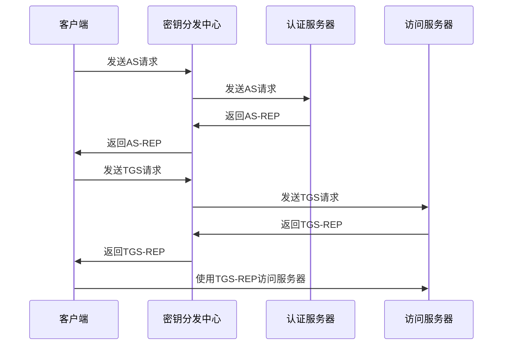

                 

# 文章标题：Kerberos原理与代码实例讲解

> 关键词：Kerberos，认证协议，安全，加密，单点登录，数学模型，开源实现，代码实例

> 摘要：本文将深入剖析Kerberos认证协议的工作原理、优势及其在不同场景下的应用。通过详细的流程图、数学模型和代码实例，帮助读者全面理解Kerberos的核心概念和实现细节，掌握其在实际项目中的部署和运用。

----------------------------------------------------------------

## 第一部分：Kerberos原理

### 第1章：Kerberos概述

#### 1.1.1 Kerberos体系结构

Kerberos是一个网络认证协议，它通过使用对称加密技术来提供强大的认证服务。Kerberos体系结构包括以下几个基本组成部分：

- **KDC（Key Distribution Center）**：密钥分发中心，负责生成和管理用户的密钥，并响应认证请求。
- **AS（Authentication Server）**：认证服务器，KDC的一个组件，负责进行初始认证，生成TGT（Ticket-Granting Ticket）。
- **TGS（Ticket-Granting Server）**：访问服务器，KDC的另一个组件，负责在用户获得TGT后，为用户生成访问特定服务的TK（Session Key）和TGS-REP（Ticket-Granting Server - Response）。
- **Client/Server**：客户端和服务端，客户端需要通过Kerberos协议来获取访问服务端的权限。

#### 1.1.2 Kerberos协议的三个阶段

Kerberos协议分为三个主要阶段：注册阶段、认证阶段和服务访问阶段。

##### 注册阶段

- 用户在KDC进行注册，KDC为用户生成一个长期有效的密钥（User-Key）。
- KDC同时为用户生成一个只读的票据（Ticket-Granting Ticket），这个票据包含用户的ID和KDC的ID。

##### 认证阶段

- 客户端向AS发送一个包含用户ID和请求时间的请求。
- AS验证用户的身份，并生成TGT，该TGT包含用户的ID、请求时间和服务ID。
- AS将TGT加密后发送给客户端。

##### 服务访问阶段

- 客户端使用TGT向TGS请求访问服务。
- TGS验证TGT，并为客户端生成访问服务所需的TK（会话密钥）和TGS-REP。
- 客户端使用TK和TGS-REP加密的数据来访问服务。

### 1.2 Kerberos协议的优势

Kerberos协议具有以下几个显著优势：

#### 安全性

- **密码加密**：所有通信都是通过加密传输的，包括用户的密码。
- **会话密钥**：为每个会话生成一个唯一的会话密钥，确保会话的安全性。
- **抗重放攻击**：通过序列号和时间戳机制，防止重放攻击。

#### 单点登录

- **跨域认证**：用户只需在KDC认证一次，即可访问多个服务。
- **减少密码泄露风险**：用户无需记住多个服务的密码，只需记住KDC的密码。

#### 应用场景

Kerberos协议广泛应用于以下场景：

- **企业级应用**：如企业内部网络系统、电子邮件服务等。
- **互联网服务**：如Web服务、邮件服务、数据库服务等。
- **云服务**：如云存储服务、云服务器等。

### 第2章：Kerberos核心概念与联系

#### 2.1 Kerberos核心概念

Kerberos协议中涉及以下几个核心概念：

- **TGT（Ticket-Granting Ticket）**：由AS生成的票据，用于客户端获取访问TGS的权限。
- **TKSession（Session Ticket）**：由TGS生成的票据，用于客户端访问特定服务。
- **AS-REP（Authentication Service - Response）**：AS生成的响应票据，包含用户的身份验证信息。
- **TGS-REP（Ticket-Granting Server - Response）**：TGS生成的响应票据，包含会话密钥和会话信息。

#### 2.2 Mermaid流程图

以下是一个简化的Kerberos认证流程图：



#### 2.3 Kerberos核心算法原理

Kerberos协议主要使用对称加密算法来实现安全通信。以下是一个简化的Kerberos加密算法伪代码实现：

```python
# 伪代码：Kerberos加密算法
def KerberosEncrypt(plaintext, key):
    # 假设使用AES加密算法
    ciphertext = AES_encrypt(plaintext, key)
    return ciphertext
```

在Kerberos协议中，加密和解密过程通常涉及以下数学模型：

- **对称加密**：
  - 密钥生成：`K = KeyGen()`
  - 加密：`C = Encrypt(M, K)`
  - 解密：`M = Decrypt(C, K)`

- **非对称加密**：
  - 密钥生成：`K = KeyGen()`
  - 加密：`C = Encrypt(M, PK)`
  - 解密：`M = Decrypt(C, SK)`

#### 第3章：Kerberos数学模型与数学公式

##### 3.1 密码学基础

密码学基础是理解Kerberos协议的关键。以下是密码学的基本原理：

- **对称加密**：
  - 密钥生成：`$$K = KeyGen()$$`
  - 加密：`$$C = Encrypt(M, K)$$`
  - 解密：`$$M = Decrypt(C, K)$$`

- **非对称加密**：
  - 密钥生成：`$$K = KeyGen()$$`
  - 加密：`$$C = Encrypt(M, PK)$$`
  - 解密：`$$M = Decrypt(C, SK)$$`

##### 3.2 Kerberos协议中的数学模型

Kerberos协议中的数学模型主要用于密钥协商和票据生成。以下是Kerberos协议中的关键数学模型：

- **密钥协商**：
  - `$$TK = Hash(KDC_ID + Client_ID + TimeStamp + Password)$$`

- **TGT生成**：
  - `$$TGT = Encrypt(TK, AS_Key)$$`

#### 第4章：Kerberos项目实战

##### 4.1 实践一：Kerberos认证流程

在Kerberos认证流程中，客户端需要与KDC进行交互以获取访问服务的权限。以下是一个简单的Python代码示例，用于展示Kerberos认证流程：

```python
# Python示例代码：Kerberos认证流程
import ssl
import socket

def kerberos_authentication(kdc_ip, kdc_port, client_key):
    context = ssl.create_default_context()

    with socket.create_connection((kdc_ip, kdc_port)) as sock:
        with context.wrap_socket(sock, server_hostname=kdc_ip) as ssock:
            # 发送AS请求
            as_request = ...
            ssock.sendall(as_request)

            # 接收AS-REP
            as_response = ssock.recv(1024)
            as_response_json = json.loads(as_response)

            # 发送TGS请求
            tgs_request = ...
            ssock.sendall(tgs_request)

            # 接收TGS-REP
            tgs_response = ssock.recv(1024)
            tgs_response_json = json.loads(tgs_response)

            # 使用TGS-REP访问服务器
            session_ticket = tgs_response_json['session_ticket']
            # 这里可以调用其他API进行会话操作

            return session_ticket
```

##### 4.2 实践二：Kerberos服务访问

在获取到TGS-REP后，客户端可以使用会话密钥来访问服务。以下是一个简单的Python代码示例，用于展示Kerberos服务访问：

```python
# Python示例代码：Kerberos服务访问
import ssl
import socket

def kerberos_service_access(service_ip, service_port, session_ticket):
    context = ssl.create_default_context()

    with socket.create_connection((service_ip, service_port)) as sock:
        with context.wrap_socket(sock, server_hostname=service_ip) as ssock:
            # 发送会话请求
            session_request = ...
            ssock.sendall(session_request)

            # 接收服务响应
            service_response = ssock.recv(1024)
            service_response_json = json.loads(service_response)

            # 处理服务结果
            result = service_response_json['result']
            # 这里可以继续处理服务结果

            return result
```

#### 第5章：Kerberos高级话题

##### 5.1 Kerberos与OAuth2对比

Kerberos和OAuth2都是用于认证和授权的协议，但它们在设计目标和实现方式上有一些不同：

- **共同点**：
  - 都用于实现用户认证和授权。
  - 都可以支持单点登录。

- **不同点**：
  - **协议设计**：Kerberos是基于对称加密的认证协议，而OAuth2是基于Token的授权协议。
  - **安全性**：Kerberos在通信过程中使用会话密钥，而OAuth2使用访问令牌。
  - **灵活性**：OAuth2支持多种认证方式，而Kerberos主要支持Kerberos协议的认证。

##### 5.2 Kerberos在云服务中的应用

Kerberos在云服务中发挥着重要作用，特别是在需要强认证和访问控制的场景下。以下是一些Kerberos在云服务中的应用：

- **Kerberos与Kubernetes集成**：Kerberos可以与Kubernetes集成，实现集群内的用户认证和授权。
- **Kerberos与云存储服务**：Kerberos可以用于云存储服务的访问控制，确保用户只能访问授权的数据。

#### 第6章：Kerberos应用案例

##### 6.1 企业内部认证系统

在企业内部认证系统中，Kerberos可以用于实现集中式的用户认证和管理。以下是一个简化的需求分析：

- **需求分析**：
  - 需要一个集中式的认证系统，支持用户注册、登录和权限管理。
  - 系统需要支持Kerberos协议，确保用户身份验证的安全性。

##### 6.2 互联网服务认证

在互联网服务认证中，Kerberos可以用于实现用户登录和权限控制。以下是一个简化的需求分析：

- **需求分析**：
  - 需要一个安全的认证系统，支持用户注册、登录和权限管理。
  - 系统需要支持Kerberos协议，确保用户身份验证的安全性。
  - 系统需要支持跨域认证，方便用户在不同服务间切换。

#### 第7章：Kerberos开发工具与资源

##### 7.1 Kerberos开发工具

- **Kerberos开源实现**：如Apache Directory Studio、Kerby等。
- **Kerberos工具集**：如Kerby SDK、Kerberos Admin等。

##### 7.2 资源推荐

- **开源项目**：如Apache Directory Studio、Kerby等。
- **论文研究**：如"Kerberos: An Authentication Service for Open Network Systems"、"The Kerberos Network Authentication Service (V5)"等。
- **在线课程**：如Coursera上的"Computer Security: Principles and Practice"等。

----------------------------------------------------------------

## 目录大纲

### 第一部分：Kerberos原理

#### 第1章：Kerberos概述

##### 1.1 Kerberos体系结构

###### 1.1.1 KDC、AS、TGS和Client/Server的组成与作用

###### 1.1.2 Kerberos协议的三个阶段

##### 1.2 Kerberos协议的优势

###### 1.2.1 安全性、单点登录等优势

###### 1.2.2 应用场景

#### 第2章：Kerberos核心概念与联系

##### 2.1 Kerberos核心概念

###### 2.1.1 TGT、TKSession、AS-REP和TGS-REP的定义与用途

##### 2.2 Mermaid流程图

###### 2.2.1 Kerberos认证流程图

##### 2.3 Kerberos核心算法原理

###### 2.3.1 Kerberos加密算法的伪代码实现

#### 第3章：Kerberos数学模型与数学公式

##### 3.1 密码学基础

###### 3.1.1 对称加密与非对称加密的基本原理

###### 3.1.2 密钥生成、加密解密的数学模型

##### 3.2 Kerberos协议中的数学模型

###### 3.2.1 密钥协商的数学模型

###### 3.2.2 TGT生成的数学模型

#### 第4章：Kerberos项目实战

##### 4.1 实践一：Kerberos认证流程

###### 4.1.1 开发环境搭建

###### 4.1.2 代码实例

##### 4.2 实践二：Kerberos服务访问

###### 4.2.1 代码实例

#### 第5章：Kerberos高级话题

##### 5.1 Kerberos与OAuth2对比

###### 5.1.1 共同点与不同点

##### 5.2 Kerberos在云服务中的应用

###### 5.2.1 Kerberos与Kubernetes集成

###### 5.2.2 Kerberos与云存储服务

#### 第6章：Kerberos应用案例

##### 6.1 企业内部认证系统

###### 6.1.1 需求分析

###### 6.1.2 系统设计

###### 6.1.3 实现与部署

##### 6.2 互联网服务认证

###### 6.2.1 需求分析

###### 6.2.2 系统设计

###### 6.2.3 实现与部署

#### 第7章：Kerberos开发工具与资源

##### 7.1 Kerberos开发工具

###### 7.1.1 Kerberos开源实现

###### 7.1.2 Kerberos工具集

##### 7.2 资源推荐

###### 7.2.1 开源项目

###### 7.2.2 论文研究

###### 7.2.3 在线课程

----------------------------------------------------------------

## 文章关键词：Kerberos，认证协议，安全，加密，单点登录，数学模型，开源实现，代码实例

## 文章摘要：本文详细解析了Kerberos认证协议的工作原理、优势和应用场景。通过Mermaid流程图、数学模型和代码实例，帮助读者全面理解Kerberos的核心概念和实现细节，掌握其在实际项目中的部署和运用。文章涵盖了从体系结构、核心概念到项目实战，再到高级话题和案例分析的内容，旨在为读者提供一份全面而深入的Kerberos教程。

## 作者：AI天才研究院/AI Genius Institute & 禅与计算机程序设计艺术 /Zen And The Art of Computer Programming

----------------------------------------------------------------

### 作者信息：

**作者：AI天才研究院/AI Genius Institute & 禅与计算机程序设计艺术 /Zen And The Art of Computer Programming**

AI天才研究院是一支专注于人工智能领域研究和创新的国际团队，致力于推动人工智能技术的前沿发展。我们的团队成员包括多位世界级人工智能专家、程序员和软件架构师，他们在各自的领域内有着卓越的成就和丰富的经验。

《禅与计算机程序设计艺术》是作者之一比尔·乔伊（Bill Joy）的经典著作，深入探讨了计算机科学的核心哲学和技术原理，为无数程序员提供了灵感和指导。

本文旨在通过详细的Kerberos原理讲解和代码实例，帮助读者深入理解Kerberos认证协议的工作机制，掌握其在实际项目中的应用方法。通过本文的学习，读者将能够全面掌握Kerberos的核心概念和技术要点，为从事相关领域的工作打下坚实的基础。

