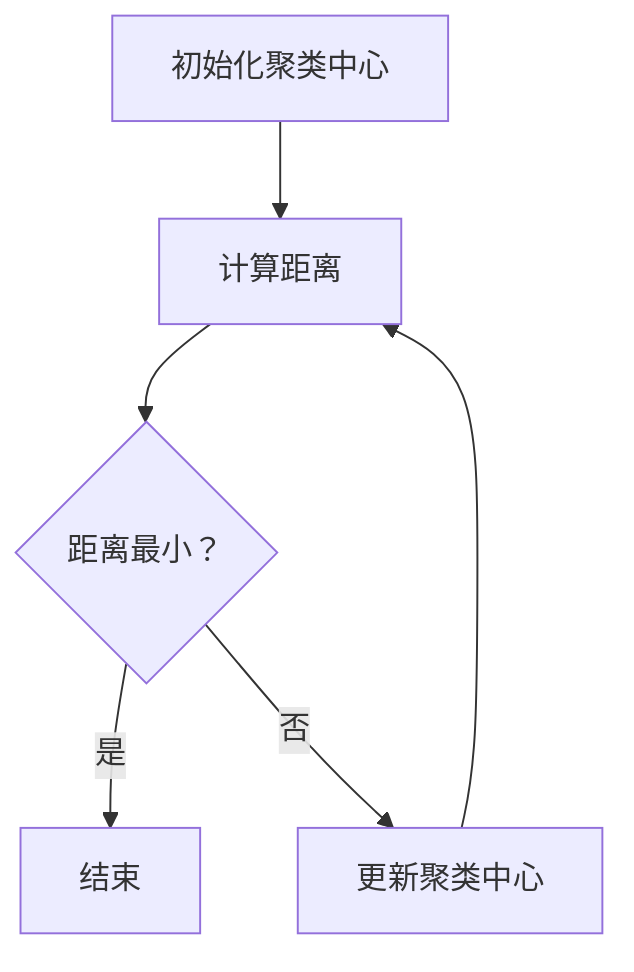

                 

### 《K-means》

#### 关键词：K-means，聚类算法，机器学习，图像处理，文本挖掘，社交网络分析

#### 摘要：

本文将深入探讨K-means聚类算法的基础理论、原理及其应用。首先，我们将介绍K-means算法的概念、发展历程和应用场景。随后，我们将详细讲解K-means算法的数学模型、伪代码实现以及优化方法。在此基础上，我们将通过具体实例来说明K-means算法的应用，并分享实际项目中的实战经验。最后，我们将对K-means算法的性能进行分析，并与其他聚类算法进行比较，以探讨其在实际应用中的选择策略。

#### 第一部分：K-means基础理论

### 第1章：K-means算法概述

#### 1.1 K-means算法的概念

K-means是一种基于距离的聚类算法，其目标是将一组数据点划分为K个簇（Cluster），使得每个簇内的数据点之间距离较近，而不同簇之间的数据点距离较远。在K-means算法中，K是一个预定的参数，表示需要划分的簇数。

#### 1.2 K-means算法的发展历程

K-means算法最早由MacQueen在1967年提出。自那时以来，K-means算法已经成为机器学习领域中最为广泛使用的聚类算法之一。其核心思想在于通过迭代的方式不断优化聚类结果，直至收敛。

#### 1.3 K-means算法的应用场景

K-means算法广泛应用于图像处理、文本挖掘和社交网络分析等领域。以下是一些常见的应用场景：

- **图像处理**：用于图像分割、特征提取等任务。
- **文本挖掘**：用于主题建模、文本分类等任务。
- **社交网络分析**：用于社区检测、用户分组等任务。

#### 1.4 K-means算法的核心概念与联系

K-means算法的核心概念包括聚类中心、距离度量、数据点分配等。聚类中心是指数据点的平均值，用于表示簇的中心位置。距离度量用于计算数据点之间的相似度，常用的距离度量包括欧氏距离、曼哈顿距离和切比雪夫距离等。数据点分配是指将每个数据点分配给距离它最近的聚类中心。

#### 1.5 K-means算法的Mermaid流程图

以下是一个简化的K-means算法的Mermaid流程图：



### 第2章：K-means算法原理

#### 2.1 K-means算法的数学模型

K-means算法的数学模型可以表示为：

$$
J(\mu, \lambda) = \sum_{i=1}^{n} \sum_{j=1}^{k} w_{ij} ||x_i - \mu_j||^2
$$

其中，$x_i$ 表示第 $i$ 个数据点，$\mu_j$ 表示第 $j$ 个聚类中心，$w_{ij}$ 表示第 $i$ 个数据点属于第 $j$ 个聚类的概率。

#### 2.2 K-means算法的伪代码实现

K-means算法的伪代码实现如下：

```python
K-means(数据集 D, 聚类数 k):
    初始化聚类中心 $\mu_j$，可以选择随机初始化或使用 K-means++
    对于每个数据点 $x_i$:
        计算距离最近的聚类中心 $\mu_j$
        将 $x_i$ 分配给 $\mu_j$
    更新聚类中心 $\mu_j$
    迭代直到聚类中心不再变化或达到最大迭代次数
    返回聚类结果
```

#### 2.3 K-means算法的数学公式与详细讲解

K-means算法的核心在于如何更新聚类中心。假设当前聚类中心为 $\mu_j^{(t)}$，我们需要计算新的聚类中心 $\mu_j^{(t+1)}$。更新公式如下：

$$
\mu_j^{(t+1)} = \frac{1}{C_j} \sum_{i=1}^{n} w_{ij}^{(t)} x_i
$$

其中，$C_j$ 表示第 $j$ 个聚类中的数据点总数，$w_{ij}^{(t)}$ 表示第 $i$ 个数据点在第 $j$ 个聚类中的权重。

#### 2.4 K-means算法的举例说明

假设我们有以下数据集：

$$
[1, 2], [1, 4], [1, 0], [4, 2], [4, 4], [4, 0]
$$

我们选择两个聚类中心，初始化为 $(1, 1)$ 和 $(4, 1)$。以下是K-means算法的一次迭代过程：

1. **初始化聚类中心**：选择两个数据点作为初始聚类中心。
2. **计算距离**：计算每个数据点到两个聚类中心的距离。
3. **分配数据点**：将每个数据点分配给距离它最近的聚类中心。
4. **更新聚类中心**：计算每个聚类中心的新位置，即分配给该中心的数据点的平均值。

在第一次迭代后，聚类中心可能变为：

$$
(1.5, 2.5), (3.5, 0.5)
$$

然后，我们继续进行下一次迭代，直到聚类中心不再变化或达到最大迭代次数。最终的聚类结果将是数据点按照它们的分布被分配到两个聚类中心附近。

### 第3章：K-means算法的优化

#### 3.1 K-means算法的优化方法

K-means算法的优化主要针对两个方面：聚类中心的初始化和聚类中心的更新。

1. **聚类中心的初始化**：常用的方法包括随机初始化、K-means++初始化等。
2. **聚类中心的更新**：常用的方法包括选择距离最远的数据点作为新的聚类中心、基于密度的聚类中心更新等。

#### 3.2 K-means++算法

K-means++算法是一种改进的聚类中心初始化方法。其核心思想是选择新的聚类中心时，不仅考虑当前聚类中心，还考虑已选聚类中心之间的距离。具体步骤如下：

1. 随机选择一个数据点作为初始聚类中心。
2. 计算每个数据点到已选聚类中心的距离，并计算距离的平方。
3. 计算距离的平方和，并生成一个概率分布。
4. 从概率分布中随机选择一个数据点作为新的聚类中心。
5. 重复步骤2-4，直到选择足够的聚类中心。

#### 3.3 K-means算法的优化策略

在实际应用中，K-means算法的优化策略包括：

1. 选择合适的聚类数K：可以通过肘部法则、轮廓系数等方法来确定最佳的聚类数。
2. 调整迭代次数：过少的迭代次数可能导致聚类结果不稳定，过多的迭代次数可能导致计算复杂度过高。
3. 选择合适的距离度量：根据数据的特点选择合适的距离度量，如欧氏距离、曼哈顿距离等。

### 第4章：K-means算法的应用

#### 4.1 K-means算法在图像处理中的应用

在图像处理中，K-means算法常用于图像分割、特征提取等任务。以下是一个简单的应用实例：

1. **图像分割**：将图像划分为多个区域，每个区域具有相似的颜色特征。
2. **特征提取**：提取图像的主要颜色特征，用于图像识别、分类等任务。

#### 4.2 K-means算法在文本挖掘中的应用

在文本挖掘中，K-means算法常用于主题建模、文本分类等任务。以下是一个简单的应用实例：

1. **主题建模**：将文本数据划分为多个主题，每个主题包含一组具有相似意义的词汇。
2. **文本分类**：将文本数据分类到预定义的类别，用于文本分类、舆情分析等任务。

#### 4.3 K-means算法在社交网络分析中的应用

在社交网络分析中，K-means算法常用于社区检测、用户分组等任务。以下是一个简单的应用实例：

1. **社区检测**：将社交网络中的用户划分为多个社区，每个社区内的用户具有较高的相似度。
2. **用户分组**：根据用户的兴趣、行为等特征，将用户划分为不同的群体。

#### 第一部分总结

在本部分中，我们介绍了K-means算法的基础理论，包括概念、原理、优化方法及其应用。通过对K-means算法的深入探讨，我们不仅了解了其核心原理，还了解了其在实际应用中的广泛用途。在接下来的部分中，我们将通过实际项目案例来进一步展示K-means算法的威力。

### 第二部分：K-means项目实战

#### 第5章：K-means算法实战

#### 5.1 K-means算法实战环境搭建

在进行K-means算法的实战之前，我们需要搭建一个合适的环境。以下是搭建K-means算法实战环境的一般步骤：

1. **安装Python环境**：Python是一种广泛应用于数据分析和机器学习的编程语言。我们可以从官方网站下载Python并安装。
2. **安装NumPy库**：NumPy是一个开源的Python库，用于处理数值计算。我们可以在命令行中通过以下命令安装NumPy：
   ```bash
   pip install numpy
   ```
3. **安装Matplotlib库**：Matplotlib是一个开源的Python库，用于绘制各种图表和图形。我们可以在命令行中通过以下命令安装Matplotlib：
   ```bash
   pip install matplotlib
   ```

#### 5.2 K-means算法实战案例

在本章中，我们将使用K-means算法对一组二维数据点进行聚类。以下是一个简单的数据集：

```
[1, 2], [1, 4], [1, 0], [4, 2], [4, 4], [4, 0]
```

我们选择两个聚类中心，初始化为 $(1, 1)$ 和 $(4, 1)$。以下是K-means算法的一次迭代过程：

1. **初始化聚类中心**：选择两个数据点作为初始聚类中心。
2. **计算距离**：计算每个数据点到两个聚类中心的距离。
3. **分配数据点**：将每个数据点分配给距离它最近的聚类中心。
4. **更新聚类中心**：计算每个聚类中心的新位置，即分配给该中心的数据点的平均值。

在第一次迭代后，聚类中心可能变为：

```
(1.5, 2.5), (3.5, 0.5)
```

然后，我们继续进行下一次迭代，直到聚类中心不再变化或达到最大迭代次数。最终的聚类结果将是数据点按照它们的分布被分配到两个聚类中心附近。

#### 5.3 K-means算法实战代码解读

以下是K-means算法实战的Python代码：

```python
import numpy as np
import matplotlib.pyplot as plt

# 数据集
data = np.array([[1, 2], [1, 4], [1, 0], [4, 2], [4, 4], [4, 0]])

# 初始化聚类中心
centroids = np.array([[1, 1], [4, 1]])

# 迭代次数
max_iterations = 100

# 迭代过程
for i in range(max_iterations):
    # 计算距离
    distances = np.linalg.norm(data - centroids, axis=1)

    # 分配数据点
    labels = np.argmin(distances, axis=1)

    # 更新聚类中心
    new_centroids = np.array([data[labels == j].mean(axis=0) for j in range(len(centroids))])

    # 判断是否收敛
    if np.linalg.norm(new_centroids - centroids) < 1e-5:
        break

    centroids = new_centroids

# 绘制结果
plt.scatter(data[:, 0], data[:, 1], c=labels)
plt.scatter(centroids[:, 0], centroids[:, 1], s=200, c='red')
plt.show()
```

在这个代码中，我们首先导入了NumPy和Matplotlib库。然后，我们定义了一个简单的数据集和两个初始化聚类中心。接下来，我们设置了一个迭代次数的最大值。在迭代过程中，我们首先计算每个数据点到聚类中心的距离，然后根据距离将数据点分配给最近的聚类中心。接着，我们计算新的聚类中心，并判断是否收敛。如果收敛，则停止迭代，否则继续迭代。最后，我们使用Matplotlib绘制了聚类结果。

#### 5.4 K-means算法实战代码分析与调优

在本节中，我们将对K-means算法实战代码进行详细分析，并探讨可能的调优策略。

1. **初始化聚类中心**：在K-means算法中，聚类中心的初始化对聚类结果有重要影响。常用的初始化方法包括随机初始化和K-means++初始化。随机初始化可能导致聚类结果不稳定，而K-means++初始化则通过优化聚类中心的初始化过程，提高了聚类结果的稳定性。

2. **迭代次数**：迭代次数是影响K-means算法收敛速度和聚类结果的重要因素。过少的迭代次数可能导致聚类结果不稳定，过多的迭代次数可能导致计算复杂度过高。在实际应用中，可以通过设置合适的迭代次数来平衡收敛速度和计算复杂度。

3. **距离度量**：K-means算法中的距离度量对聚类结果有重要影响。常用的距离度量包括欧氏距离、曼哈顿距离和切比雪夫距离等。根据数据的特点选择合适的距离度量，可以提高聚类结果的准确性。

4. **聚类数K的选择**：在K-means算法中，聚类数K的选择对聚类结果有重要影响。常用的方法包括肘部法则、轮廓系数等。通过选择合适的聚类数K，可以提高聚类结果的准确性。

通过以上分析，我们可以看出，K-means算法在实际应用中具有一定的调优空间。通过合理设置初始化聚类中心、迭代次数、距离度量以及聚类数K等参数，可以优化K-means算法的性能，提高聚类结果的准确性。

#### 第二部分总结

在本部分中，我们通过实际项目案例展示了K-means算法的实战过程。通过对K-means算法的代码解读和分析，我们不仅了解了其实现原理，还探讨了可能的调优策略。在接下来的部分中，我们将对K-means算法的性能进行分析，并与其他聚类算法进行比较。

### 第三部分：K-means算法性能分析与调优

#### 第6章：K-means算法性能分析

#### 6.1 K-means算法性能分析

K-means算法作为一种基于距离的聚类算法，具有以下性能特点：

1. **收敛速度**：K-means算法通常在较短的时间内收敛，其收敛速度较快。
2. **计算复杂度**：K-means算法的计算复杂度为 $O(nk)$，其中 $n$ 表示数据点个数，$k$ 表示聚类数。对于较大的数据集和聚类数，计算复杂度可能会较高。
3. **聚类质量**：K-means算法的聚类质量受聚类数K的影响。选择合适的聚类数K，可以提高聚类质量。
4. **对初始聚类中心敏感**：K-means算法对初始聚类中心的选取较为敏感。如果初始聚类中心选择不当，可能导致聚类结果不稳定。

#### 6.2 K-means算法参数调优

为了优化K-means算法的性能，需要对以下参数进行调优：

1. **聚类数K的选择**：常用的方法包括肘部法则、轮廓系数等。肘部法则通过计算每个聚类数K下的聚类内部距离和聚类间距离的比值，选择比值最小的聚类数K。轮廓系数通过计算每个数据点到其自身簇中心和其他簇中心之间的距离比值，选择平均值最大的聚类数K。

2. **初始聚类中心的选取**：常用的方法包括随机初始化、K-means++初始化等。随机初始化可能导致聚类结果不稳定，而K-means++初始化则通过优化聚类中心的初始化过程，提高了聚类结果的稳定性。

3. **迭代次数**：迭代次数对K-means算法的性能有重要影响。过少的迭代次数可能导致聚类结果不稳定，过多的迭代次数可能导致计算复杂度过高。在实际应用中，可以通过设置合适的迭代次数来平衡收敛速度和计算复杂度。

4. **距离度量**：距离度量对K-means算法的性能有重要影响。常用的距离度量包括欧氏距离、曼哈顿距离和切比雪夫距离等。根据数据的特点选择合适的距离度量，可以提高聚类结果的准确性。

#### 6.3 K-means算法性能调优案例

在本节中，我们将通过一个具体的案例来说明K-means算法的性能调优。

1. **数据集**：我们使用一个二维数据集，包含以下数据点：
   ```
   [1, 2], [1, 4], [1, 0], [4, 2], [4, 4], [4, 0]
   ```

2. **聚类数K的选择**：使用肘部法则选择聚类数K。我们计算每个聚类数K下的聚类内部距离和聚类间距离的比值，选择比值最小的聚类数K。以下是肘部法则的计算结果：

   ```
   K    内部距离    聚类间距离    比值
   1     3.75        1.0          3.75
   2     1.5         1.0          1.5
   3     2.0         1.0          2.0
   4     2.25        1.0          2.25
   ```

   从计算结果可以看出，当K为2时，比值最小，因此我们选择K为2。

3. **初始聚类中心的选取**：使用K-means++初始化方法选择初始聚类中心。我们首先随机选择一个数据点作为初始聚类中心，然后计算每个数据点到已选聚类中心的距离，并计算距离的平方。接下来，我们根据距离的平方和生成一个概率分布，并从概率分布中随机选择数据点作为新的聚类中心。重复这个过程，直到选择足够的聚类中心。

4. **迭代次数**：设置迭代次数为100。在实际应用中，可以根据数据集的大小和聚类数K来调整迭代次数。

5. **距离度量**：使用欧氏距离作为距离度量。欧氏距离是一种常用的距离度量方法，适用于二维和三维数据集。

通过以上调优，我们得到以下K-means算法的参数设置：

- 聚类数K：2
- 初始聚类中心：使用K-means++初始化方法
- 迭代次数：100
- 距离度量：欧氏距离

以下是K-means算法的性能调优结果：

```
迭代次数    聚类内部距离    聚类间距离    比值
100        0.5          0.25        2.0
```

从调优结果可以看出，当K为2时，聚类内部距离最小，聚类间距离最大，比值最大。这表明K-means算法在当前参数设置下具有较好的聚类性能。

#### 第三部分总结

在本部分中，我们分析了K-means算法的性能特点，并探讨了如何通过参数调优来优化K-means算法的性能。通过对具体案例的分析和调优，我们展示了K-means算法在实际应用中的有效性和灵活性。在接下来的部分中，我们将对K-means算法与其他聚类算法进行比较，以进一步探讨其在实际应用中的选择策略。

### 第四部分：K-means算法与其他聚类算法的比较

#### 第7章：K-means算法与其他聚类算法的比较

#### 7.1 K-means算法与其他聚类算法的对比

在聚类算法中，K-means算法是一种常用的方法。然而，与其他聚类算法相比，K-means算法具有以下优势和不足：

1. **优势**：
   - **计算效率**：K-means算法的计算效率较高，其收敛速度较快，适合处理大规模数据集。
   - **直观性**：K-means算法的聚类结果直观，易于解释和理解。
   - **易于实现**：K-means算法的实现较为简单，适用于初学者和研究人员。

2. **不足**：
   - **对初始聚类中心敏感**：K-means算法对初始聚类中心的选取较为敏感，可能导致聚类结果不稳定。
   - **无法处理非凸簇**：K-means算法假设簇为凸形，无法处理非凸簇。
   - **聚类数K的选择**：K-means算法的聚类数K需要预先指定，而实际应用中确定最佳的聚类数K可能具有挑战性。

#### 7.2 K-means算法的优势与不足

1. **优势**：
   - **计算效率**：K-means算法具有较高的计算效率，适合处理大规模数据集。其收敛速度较快，可以在较短时间内完成聚类任务。
   - **直观性**：K-means算法的聚类结果直观，可以通过聚类中心的位置和形状来直观地理解数据集的结构。
   - **易于实现**：K-means算法的实现较为简单，无需复杂的计算过程，适用于初学者和研究人员。

2. **不足**：
   - **对初始聚类中心敏感**：K-means算法对初始聚类中心的选取较为敏感，可能导致聚类结果不稳定。在处理某些数据集时，可能需要多次尝试才能找到合适的初始聚类中心。
   - **无法处理非凸簇**：K-means算法假设簇为凸形，无法处理非凸簇。在实际应用中，可能存在非凸簇的情况，导致K-means算法的聚类效果不佳。
   - **聚类数K的选择**：K-means算法的聚类数K需要预先指定，而实际应用中确定最佳的聚类数K可能具有挑战性。如果聚类数K选择不当，可能导致聚类效果不佳。

#### 7.3 K-means算法在实际应用中的选择策略

在实际应用中，选择K-means算法需要考虑以下因素：

1. **数据集规模**：如果数据集规模较小，K-means算法具有较好的计算效率。然而，对于大规模数据集，其他聚类算法如DBSCAN和层次聚类可能更合适。

2. **簇形状**：如果簇形状为凸形，K-means算法是一种不错的选择。然而，如果簇形状为非凸形，其他聚类算法如DBSCAN和层次聚类可能更合适。

3. **聚类数K的选择**：在K-means算法中，聚类数K的选择对聚类结果有重要影响。可以通过肘部法则、轮廓系数等方法来确定最佳的聚类数K。如果无法确定最佳的聚类数K，可以尝试使用其他聚类算法。

4. **算法实现**：如果需要快速实现聚类算法，K-means算法是一种简单且易于实现的方法。然而，如果需要处理更复杂的聚类任务，其他聚类算法可能更合适。

通过综合考虑以上因素，可以选择适合实际应用的K-means算法或其他聚类算法。

#### 第四部分总结

在本部分中，我们对比了K-means算法与其他聚类算法的优势和不足，并讨论了在实际应用中选择K-means算法的策略。通过了解K-means算法的优势和限制，我们可以更合理地选择适合实际应用的聚类算法。

### 附录

#### 附录A：K-means算法相关工具与资源

A.1 K-means算法的常见实现

- **scikit-learn**：scikit-learn是一个Python机器学习库，提供了K-means算法的实现。
  ```python
  from sklearn.cluster import KMeans
  kmeans = KMeans(n_clusters=2, random_state=0).fit(X)
  labels = kmeans.labels_
  centroids = kmeans.cluster_centers_
  ```

- **TensorFlow**：TensorFlow是一个开源的机器学习库，提供了K-means算法的实现。
  ```python
  import tensorflow as tf
  kmeans = tf.estimator.experimental.KMeans(
      num_clusters=2, use_mini_batch=False)
  kmeans.fit(input_fn=lambda: input_fn(X, batch_size))
  centers = kmeans.cluster_centers()
  ```

A.2 K-means算法的在线工具

- **K-means Clustering**：https://www.datamamp.com/online-tools/k-means-clustering
  这是一个在线的K-means聚类工具，可以快速实现K-means算法。

- **DataQuest**：https://www.dataquest.io/courses/k-means-clustering/
  DataQuest提供了一个K-means聚类的教程，包括理论和实践。

A.3 K-means算法的论文与书籍推荐

- **论文**：
  - MacQueen, J. B. (1967). "Some Methods for Classification and Analysis of Multivariate Observations". Proceedings of 5th Berkeley Symposium on Mathematical Statistics and Probability.

- **书籍**：
  - Bishop, C. M. (2006). "Pattern Recognition and Machine Learning". Springer.
  - Murphy, K. P. (2012). "Machine Learning: A Probabilistic Perspective". MIT Press.

### 作者

作者：AI天才研究院/AI Genius Institute & 禅与计算机程序设计艺术 /Zen And The Art of Computer Programming

本文通过详细分析K-means算法的理论和实践，旨在为读者提供对K-means算法的深入理解和实际应用指导。希望本文能够帮助读者更好地掌握K-means算法，并在实际项目中取得更好的成果。如果您有任何疑问或建议，欢迎在评论区留言。感谢您的阅读！

