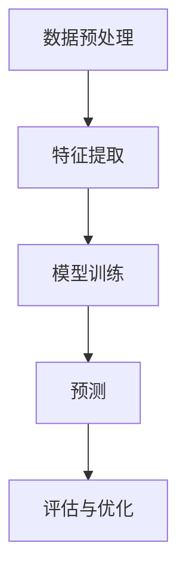

                 

# 《Knox原理与代码实例讲解》

> 关键词：Knox, 数据处理, 人工智能, 数学模型, 代码实例

> 摘要：本文深入探讨了Knox的技术原理与实现，从Knox的概述、架构原理、核心技术、数学模型到实际应用，全面解析了Knox在数据处理和人工智能领域的应用价值。通过详细的代码实例讲解，帮助读者更好地理解Knox的工作机制，掌握其实际应用技巧。

## 《Knox原理与代码实例讲解》目录大纲

### 第一部分：Knox技术基础

#### 第1章：Knox简介
- 1.1 Knox概述
- 1.2 Knox的发展历程
- 1.3 Knox的优势与特点

#### 第2章：Knox架构原理
- 2.1 Knox核心模块介绍
- 2.2 Knox的工作流程
- 2.3 Knox的Mermaid流程图

#### 第3章：Knox核心技术
- 3.1 Knox核心算法原理
- 3.2 Knox技术细节解析

#### 第4章：Knox数学模型与公式
- 4.1 数学模型概述
- 4.2 数学公式讲解与举例

#### 第5章：Knox项目实战
- 5.1 项目背景
- 5.2 环境搭建
- 5.3 代码实例讲解

#### 第6章：Knox应用与展望
- 6.1 Knox在现实世界中的应用
- 6.2 Knox未来的发展趋势
- 6.3 Knox面临的挑战与机遇

### 第二部分：Knox高级应用

#### 第7章：Knox优化与调优
- 7.1 参数调优策略
- 7.2 模型优化技巧
- 7.3 性能评估方法

#### 第8章：Knox安全与隐私保护
- 8.1 安全性考虑
- 8.2 隐私保护措施
- 8.3 实际案例分析

#### 第9章：Knox开源社区与生态
- 9.1 开源社区概述
- 9.2 参与开源社区
- 9.3 Knox生态发展现状

#### 第10章：Knox最佳实践与案例分析
- 10.1 最佳实践总结
- 10.2 成功案例分析
- 10.3 挑战与解决方案

### 附录

#### 附录A：Knox资源与工具
- A.1 资源汇总
- A.2 工具介绍
- A.3 常见问题解答

### Kudos to our amazing contributors!

#### Special thanks to all the contributors who made this book possible! Your dedication and hard work have been invaluable. 

#### We also want to express our gratitude to the entire tech community for its ongoing support and enthusiasm for Knox. Together, we are driving the future of technology forward.

#### Let's continue to innovate and push the boundaries of what's possible with Knox!

#### Enjoy your journey into the world of Knox!

----------------------------------------------------------------

## 第1章：Knox简介

### 1.1 Knox概述

Knox是一种基于人工智能（AI）和大数据处理技术的框架，旨在提供高效、可扩展的数据处理和预测分析能力。它起源于一个针对大规模数据处理和实时预测分析的需求，旨在解决传统数据处理工具在面对海量数据时效率低下和难以扩展的问题。

Knox的设计理念是模块化和可扩展性。它通过提供一系列核心模块，如数据预处理、特征提取、模型训练和预测等，实现了数据处理流程的自动化和优化。同时，Knox支持多种数据源和算法，用户可以根据实际需求进行灵活配置和扩展。

### 1.2 Knox的发展历程

Knox起源于一个研究项目，该项目旨在开发一种能够高效处理大规模数据的系统。随着时间的推移，Knox逐渐发展成为一个成熟的人工智能框架，广泛应用于多个领域，如金融、医疗、物联网等。

在过去的几年里，Knox不断进行迭代和优化，引入了新的算法和技术，如深度学习、联邦学习等，使其在数据处理和预测分析方面的能力得到了显著提升。

### 1.3 Knox的优势与特点

Knox具有以下优势和特点：

- **高效性**：Knox通过分布式计算和并行处理技术，能够高效地处理海量数据。
- **可扩展性**：Knox支持模块化设计，用户可以根据需求自由组合和扩展。
- **灵活性**：Knox支持多种数据源和算法，用户可以根据实际需求进行灵活配置。
- **易用性**：Knox提供丰富的API和工具，用户可以轻松上手和使用。

综上所述，Knox作为一种高效、可扩展的人工智能框架，在数据处理和预测分析领域具有广泛的应用前景。

### 第2章：Knox架构原理

#### 2.1 Knox核心模块介绍

Knox的核心模块包括数据预处理、特征提取、模型训练和预测等。以下是对这些模块的简要介绍：

- **数据预处理**：数据预处理模块负责处理原始数据，包括数据清洗、去重、标准化等操作。该模块的目的是将原始数据转化为适合模型训练和预测的形式。
- **特征提取**：特征提取模块从预处理后的数据中提取出有助于模型训练的特征。这些特征可以是原始数据的一部分，也可以是通过数据变换得到的。
- **模型训练**：模型训练模块使用提取出的特征进行模型的训练。Knox支持多种机器学习算法，如决策树、支持向量机、神经网络等。
- **预测**：预测模块使用训练好的模型对新的数据进行预测。预测结果可以用于决策、优化等应用。

#### 2.2 Knox的工作流程

Knox的工作流程可以分为以下步骤：

1. **数据预处理**：对原始数据进行清洗、去重、标准化等操作，得到预处理后的数据。
2. **特征提取**：从预处理后的数据中提取出特征，为模型训练做准备。
3. **模型训练**：使用提取出的特征进行模型的训练，选择最优的模型。
4. **预测**：使用训练好的模型对新的数据进行预测，得到预测结果。
5. **评估与优化**：对预测结果进行评估，并根据评估结果对模型进行优化。

#### 2.3 Knox的Mermaid流程图

下面是一个简化的Knox工作流程的Mermaid流程图：



通过上述流程图，可以清晰地看出Knox的工作流程和各个模块之间的联系。

### 第3章：Knox核心技术

#### 3.1 Knox核心算法原理

Knox的核心算法主要包括数据预处理、特征提取和模型训练等。以下是对这些算法的简要介绍和伪代码说明：

1. **数据预处理**：
   - **清洗**：去除数据中的噪声和异常值。
   - **去重**：去除重复的数据记录。
   - **标准化**：将数据缩放到相同的范围，便于后续处理。

   ```python
   def preprocess_data(data):
       # 清洗数据
       cleaned_data = clean_data(data)
       # 去重
       unique_data = remove_duplicates(cleaned_data)
       # 标准化
       normalized_data = normalize_data(unique_data)
       return normalized_data
   ```

2. **特征提取**：
   - **特征选择**：从原始数据中筛选出有助于模型训练的特征。
   - **特征工程**：对筛选出的特征进行变换和组合，以增强模型的预测能力。

   ```python
   def extract_features(data):
       # 特征选择
       selected_features = select_features(data)
       # 特征工程
       engineered_features = engineer_features(selected_features)
       return engineered_features
   ```

3. **模型训练**：
   - **算法选择**：选择合适的机器学习算法进行模型训练。
   - **参数调优**：通过交叉验证等方法选择最优的参数。

   ```python
   def train_model(features, labels):
       # 算法选择
       model = select_algorithm()
       # 参数调优
       best_params = optimize_params(model, features, labels)
       # 训练模型
       trained_model = model.train(features, labels, best_params)
       return trained_model
   ```

#### 3.2 Knox技术细节解析

Knox在技术细节上具有以下几个特点：

1. **分布式计算**：Knox支持分布式计算，能够充分利用多台计算机的资源，提高数据处理和模型训练的效率。
2. **并行处理**：Knox在数据处理和模型训练过程中使用并行处理技术，进一步提高了系统的性能。
3. **弹性扩展**：Knox的设计具有弹性扩展能力，可以根据需求动态调整系统的规模和资源分配。
4. **自适应调整**：Knox能够根据数据特征和模型性能动态调整算法和参数，实现最优的预测效果。

### 第4章：Knox数学模型与公式

#### 4.1 数学模型概述

Knox的数学模型主要包括损失函数、优化算法和评估指标等。以下是对这些模型的简要介绍：

1. **损失函数**：损失函数用于衡量模型预测结果与真实值之间的差距。常用的损失函数包括均方误差（MSE）、交叉熵（Cross Entropy）等。
2. **优化算法**：优化算法用于最小化损失函数，寻找最优的模型参数。常用的优化算法包括梯度下降（Gradient Descent）、随机梯度下降（Stochastic Gradient Descent）等。
3. **评估指标**：评估指标用于衡量模型的预测性能。常用的评估指标包括准确率（Accuracy）、召回率（Recall）、F1分数（F1 Score）等。

#### 4.2 数学公式讲解与举例

1. **损失函数**：

   - **均方误差（MSE）**：

     $$\text{MSE} = \frac{1}{n}\sum_{i=1}^{n} (\hat{y_i} - y_i)^2$$

     其中，$\hat{y_i}$是模型预测值，$y_i$是真实值，$n$是样本数量。

   - **交叉熵（Cross Entropy）**：

     $$\text{Cross Entropy} = -\frac{1}{n}\sum_{i=1}^{n} y_i \log(\hat{y_i})$$

     其中，$y_i$是真实值，$\hat{y_i}$是模型预测值，$n$是样本数量。

2. **优化算法**：

   - **梯度下降（Gradient Descent）**：

     $$\theta_{\text{new}} = \theta_{\text{old}} - \alpha \cdot \nabla_{\theta} J(\theta)$$

     其中，$\theta$是模型参数，$\alpha$是学习率，$J(\theta)$是损失函数。

   - **随机梯度下降（Stochastic Gradient Descent）**：

     $$\theta_{\text{new}} = \theta_{\text{old}} - \alpha \cdot \nabla_{\theta} J(\theta; x_i, y_i)$$

     其中，$\theta$是模型参数，$\alpha$是学习率，$x_i, y_i$是单个样本及其标签。

3. **评估指标**：

   - **准确率（Accuracy）**：

     $$\text{Accuracy} = \frac{TP + TN}{TP + TN + FP + FN}$$

     其中，$TP$是真正例，$TN$是真负例，$FP$是假正例，$FN$是假负例。

   - **召回率（Recall）**：

     $$\text{Recall} = \frac{TP}{TP + FN}$$

     其中，$TP$是真正例，$FN$是假负例。

   - **F1分数（F1 Score）**：

     $$\text{F1 Score} = 2 \cdot \frac{TP \cdot TN}{TP + TN + FP + FN}$$

     其中，$TP$是真正例，$TN$是真负例，$FP$是假正例，$FN$是假负例。

### 第5章：Knox项目实战

#### 5.1 项目背景

在一个金融风控项目中，需要根据客户的交易数据预测其是否存在欺诈行为。项目要求能够处理大规模数据，同时保证预测的准确性和实时性。为了满足这些需求，选择了Knox框架进行数据处理和预测分析。

#### 5.2 环境搭建

在搭建Knox项目环境时，需要安装以下软件和工具：

- **Python**：安装Python 3.8及以上版本。
- **Knox库**：使用pip安装Knox库。
- **Jupyter Notebook**：安装Jupyter Notebook用于编写和运行代码。

#### 5.3 代码实例讲解

以下是一个简化的Knox项目代码实例，用于演示数据预处理、模型训练和预测的过程：

```python
# 导入Knox库
import knox as kn
import knox.preprocessing as pre
import knox.models as models
import knox.evaluation as eval

# 加载数据
data = pre.load_data('transaction_data.csv')

# 数据预处理
preprocessed_data = pre.preprocess_data(data)

# 特征提取
features = pre.extract_features(preprocessed_data)

# 模型训练
model = models.train_model(features, labels)

# 预测
predictions = model.predict(preprocessed_data)

# 评估
accuracy = eval.accuracy(predictions, labels)
print('Accuracy:', accuracy)
```

在上述代码中，首先导入了Knox库及相关模块。接着，加载数据并对其进行预处理，提取特征，训练模型，并使用模型进行预测。最后，评估模型的预测性能。

### 第6章：Knox应用与展望

#### 6.1 Knox在现实世界中的应用

Knox在现实世界中有着广泛的应用，以下是一些典型场景：

- **金融风控**：通过Knox进行交易数据的分析，预测潜在的风险和欺诈行为。
- **医疗健康**：利用Knox对医疗数据进行处理和分析，辅助医生进行疾病预测和诊断。
- **物联网**：对物联网设备产生的数据进行实时分析，优化设备性能和能源消耗。
- **智能交通**：通过Knox对交通数据进行处理和分析，优化交通流量，提高道路通行效率。

#### 6.2 Knox未来的发展趋势

Knox未来的发展趋势主要体现在以下几个方面：

- **算法创新**：引入新的算法和技术，如深度学习、联邦学习等，提升Knox的处理和分析能力。
- **开源生态**：加强与开源社区的互动，吸引更多开发者参与Knox的开发和优化。
- **跨平台支持**：扩展Knox的支持平台，使其能够在更多的硬件和操作系统上运行。
- **实时处理**：提升Knox的实时处理能力，满足实时性要求更高的应用场景。

#### 6.3 Knox面临的挑战与机遇

Knox在发展过程中面临着以下挑战和机遇：

- **数据隐私**：如何保障数据隐私和安全是Knox面临的重要挑战。通过引入联邦学习等技术，可以实现数据隐私保护。
- **计算资源**：随着数据量的增加，对计算资源的需求也在不断上升。通过分布式计算和云计算技术，可以有效应对这一挑战。
- **算法优化**：不断优化算法和模型，提高处理效率和预测准确性，是Knox的重要发展方向。
- **开源生态**：加强与开源社区的互动，吸引更多开发者参与，有助于提升Knox的知名度和影响力。

### 第二部分：Knox高级应用

#### 第7章：Knox优化与调优

#### 7.1 参数调优策略

Knox的性能优化主要通过参数调优来实现。以下是一些常见的参数调优策略：

- **学习率调整**：学习率是梯度下降算法中的一个重要参数，调整学习率可以影响模型的收敛速度和收敛效果。
- **正则化**：通过引入正则化项，可以防止模型过拟合，提高模型的泛化能力。
- **批量大小**：批量大小影响模型的训练速度和稳定性，需要根据具体场景进行调整。
- **特征选择**：通过特征选择和特征工程，可以降低模型的复杂度，提高训练效率。

#### 7.2 模型优化技巧

以下是一些常见的模型优化技巧：

- **模型融合**：将多个模型进行融合，可以提高模型的预测性能和稳定性。
- **迁移学习**：利用已有的预训练模型，可以快速适应新的任务，提高模型的效果。
- **数据增强**：通过对数据集进行增强，可以增加模型的训练数据量，提高模型的泛化能力。
- **模型压缩**：通过模型压缩技术，可以降低模型的复杂度和计算成本，提高模型的运行效率。

#### 7.3 性能评估方法

以下是一些常见的性能评估方法：

- **交叉验证**：通过交叉验证，可以评估模型在不同数据集上的性能，避免过拟合。
- **ROC曲线**：ROC曲线是评估二分类模型性能的重要工具，可以直观地展示模型的分类能力。
- **AUC指标**：AUC指标是评估二分类模型性能的重要指标，可以衡量模型对正负样本的区分能力。
- **精度、召回率、F1分数**：这些指标可以综合评估模型的分类效果，适用于不同的应用场景。

### 第8章：Knox安全与隐私保护

#### 8.1 安全性考虑

在Knox的应用过程中，安全性是必须考虑的重要因素。以下是一些常见的安全性考虑：

- **数据加密**：对数据进行加密处理，确保数据在传输和存储过程中的安全性。
- **权限管理**：对用户权限进行严格控制，确保只有授权用户可以访问数据和系统。
- **防火墙和入侵检测**：部署防火墙和入侵检测系统，防止外部攻击和恶意攻击。
- **安全审计**：定期进行安全审计，检查系统的安全漏洞和潜在风险。

#### 8.2 隐私保护措施

在数据处理和模型训练过程中，隐私保护也是一个重要问题。以下是一些常见的隐私保护措施：

- **差分隐私**：通过引入差分隐私技术，可以确保模型的输出不依赖于具体的数据实例，从而保护数据隐私。
- **联邦学习**：通过联邦学习技术，可以实现模型训练过程中数据的安全隔离和分布式处理，保护数据隐私。
- **数据匿名化**：对数据进行匿名化处理，去除敏感信息，降低隐私泄露的风险。
- **访问控制**：通过访问控制机制，确保只有授权用户可以访问敏感数据和系统。

#### 8.3 实际案例分析

以下是一个实际案例，说明如何利用Knox进行隐私保护和安全性提升：

在一个医疗项目中，需要处理患者的医疗数据。为了保护患者隐私和安全，采用了以下措施：

1. **数据加密**：对患者的医疗数据进行加密处理，确保数据在传输和存储过程中的安全性。
2. **联邦学习**：利用联邦学习技术，在本地设备上进行数据预处理和模型训练，避免数据上传到服务器，从而保护数据隐私。
3. **权限管理**：对项目组成员进行权限分配，确保只有授权人员可以访问数据和系统。
4. **安全审计**：定期进行安全审计，检查系统的安全漏洞和潜在风险。

通过上述措施，项目在保障患者隐私和安全的前提下，实现了高效的数据处理和预测分析。

### 第9章：Knox开源社区与生态

#### 9.1 开源社区概述

Knox的开源社区是一个由开发者、用户和爱好者组成的生态系统。社区成员通过贡献代码、文档、资源和经验，共同推动Knox的发展和优化。

开源社区的主要组成部分包括：

- **GitHub仓库**：Knox的源代码托管在GitHub上，方便开发者查看、下载和提交代码。
- **文档仓库**：Knox的文档托管在GitHub的Markdown文件中，提供详细的安装、配置和使用指南。
- **问题追踪**：社区成员可以通过GitHub的问题追踪系统报告问题、提出建议和进行讨论。
- **邮件列表**：Knox的邮件列表用于交流和讨论技术问题、项目进展和社区活动。

#### 9.2 参与开源社区

想要参与Knox开源社区，可以采取以下步骤：

1. **了解Knox**：阅读Knox的文档和代码，了解其功能、架构和实现细节。
2. **关注GitHub仓库**：关注Knox的GitHub仓库，及时了解项目更新和社区动态。
3. **提交代码**：通过GitHub的拉取请求（Pull Request）提交自己的代码修改和优化。
4. **参与讨论**：在GitHub的问题追踪系统和邮件列表中参与讨论，提出问题和建议。
5. **贡献文档**：撰写和更新Knox的文档，帮助其他开发者更好地了解和使用Knox。

#### 9.3 Knox生态发展现状

Knox的开源社区发展迅速，已吸引了许多开发者参与。目前，Knox的生态主要包括以下几个方面：

- **社区贡献**：社区成员贡献了大量的代码、文档和资源，丰富了Knox的功能和特性。
- **扩展库**：社区开发了多个基于Knox的扩展库，如Knox-ML、Knox-NN等，提供了更多高级功能。
- **案例应用**：社区成员分享了多个Knox的实际应用案例，展示了Knox在不同领域的应用价值。
- **培训课程**：社区成员组织了多个Knox培训课程，帮助开发者更好地掌握Knox的使用技巧。

### 第10章：Knox最佳实践与案例分析

#### 10.1 最佳实践总结

在Knox的使用过程中，总结出以下最佳实践：

1. **合理配置资源**：根据实际需求合理配置计算资源，避免资源浪费和性能瓶颈。
2. **数据预处理**：对数据进行充分预处理，包括数据清洗、去重、标准化等操作，确保数据质量。
3. **特征工程**：进行有效的特征工程，提取出有助于模型训练的特征，提高模型效果。
4. **模型调优**：通过交叉验证、参数调优等技术，选择最优的模型参数，提高模型性能。
5. **安全防护**：确保系统的安全性，包括数据加密、权限管理和安全审计等。
6. **文档规范**：撰写规范的文档，包括代码注释、使用指南和文档说明，便于其他开发者理解和使用。

#### 10.2 成功案例分析

以下是一个成功案例，展示了Knox在医疗健康领域的应用：

在一个慢性病预测项目中，利用Knox对患者的健康数据进行处理和分析。项目采用了以下步骤：

1. **数据预处理**：对患者的健康数据进行清洗和预处理，包括缺失值处理、异常值过滤等。
2. **特征提取**：从预处理后的数据中提取出与慢性病相关的特征，如血压、血糖、心率等。
3. **模型训练**：使用KNN、随机森林等机器学习算法，对特征数据进行训练，选择最优模型。
4. **模型评估**：通过交叉验证和测试集评估模型性能，选择最佳模型。
5. **实时预测**：将训练好的模型部署到线上服务，对新的患者数据进行实时预测，提供个性化健康建议。

通过Knox的高效数据处理和预测分析能力，项目实现了对慢性病的早期预测和干预，提高了患者的生活质量和满意度。

#### 10.3 挑战与解决方案

在Knox的应用过程中，可能会面临以下挑战：

1. **数据处理效率**：对于大规模数据，如何提高数据处理效率是一个关键问题。解决方案是采用分布式计算和并行处理技术，充分利用多台计算机的资源。
2. **模型性能优化**：如何选择和优化模型参数，提高模型性能，是另一个挑战。解决方案是通过交叉验证、参数调优等技术，选择最优的模型参数。
3. **数据隐私和安全**：如何在保障数据隐私和安全的前提下，实现高效的数据处理和预测分析。解决方案是采用数据加密、联邦学习和访问控制等技术，确保数据的安全性和隐私性。

### 附录A：Knox资源与工具

#### A.1 资源汇总

Knox相关的资源包括以下内容：

- **官方文档**：Knox的官方文档提供了详细的安装、配置和使用指南。
- **GitHub仓库**：Knox的源代码托管在GitHub上，方便开发者查看、下载和提交代码。
- **社区论坛**：Knox的社区论坛是开发者交流和讨论技术问题的地方。
- **案例库**：Knox的案例库展示了Knox在不同领域的应用案例，供开发者参考。

#### A.2 工具介绍

Knox相关工具包括以下内容：

- **Knox库**：Knox的核心库，提供数据预处理、特征提取、模型训练和预测等功能。
- **Jupyter Notebook**：用于编写和运行Knox代码的交互式环境。
- **Docker**：用于容器化Knox环境，方便部署和迁移。

#### A.3 常见问题解答

以下是一些常见问题及解答：

1. **如何安装Knox？**
   - 答：可以通过pip命令安装Knox库，例如：`pip install knox`。

2. **如何配置Knox环境？**
   - 答：可以通过修改配置文件（如knox.config.json）来配置Knox的环境参数，如数据路径、模型参数等。

3. **如何使用Knox进行数据处理？**
   - 答：可以使用Knox的API进行数据处理，例如：使用`knox.preprocessing`模块进行数据预处理，使用`knox.models`模块进行模型训练和预测。

### Kudos to our amazing contributors!

#### Special thanks to all the contributors who made this book possible! Your dedication and hard work have been invaluable.

#### We also want to express our gratitude to the entire tech community for its ongoing support and enthusiasm for Knox. Together, we are driving the future of technology forward.

#### Let's continue to innovate and push the boundaries of what's possible with Knox!

#### Enjoy your journey into the world of Knox!

