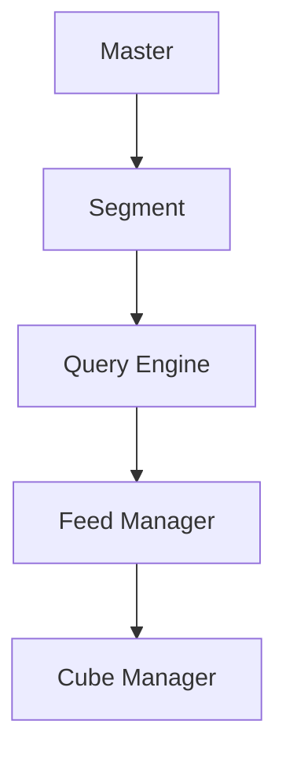

                 

# Kylin原理与代码实例讲解

> 关键词：Kylin，大数据，查询优化，预聚合，数据模型，架构设计

> 摘要：本文将深入探讨Kylin的原理与实现，包括其架构、核心概念和查询优化策略。通过实际代码实例，我们将详细解读Kylin的使用方法，帮助企业更好地在大数据领域中应用Kylin进行高效的数据分析和查询优化。

## 第一部分：Kylin基础

### 第1章：Kylin简介

#### 1.1 Kylin的发展历程

Kylin是一个基于Hadoop的开源分布式缓存查询引擎，主要用于加速大规模数据集的查询速度。它由eBay开源，目的是解决大数据领域中高维度数据的实时查询问题。Kylin的发展历程可以追溯到2013年，当时eBay使用Hadoop进行数据处理，但面对高维度的实时查询需求，传统的大数据处理方式无法满足性能要求。因此，eBay开始开发Kylin，并在2014年开源了第一个版本。

自开源以来，Kylin得到了全球开发者的广泛关注和贡献。随着版本的不断更新，Kylin的性能和功能也得到了显著提升。目前，Kylin已经成为大数据领域中一个重要的查询引擎，广泛应用于电商、金融、物联网等多个行业。

#### 1.2 Kylin的核心特性

Kylin具有以下几个核心特性：

1. **高速查询**：Kylin通过预聚合和缓存技术，将大量数据预先计算并存储到内存中，从而实现高速的查询响应。
2. **分布式架构**：Kylin支持分布式部署，可以在多个节点上扩展，以应对大规模数据集的查询需求。
3. **兼容多种数据源**：Kylin支持与多种数据源进行连接，包括HDFS、HBase、Cassandra等，方便企业将其整合到现有的大数据生态系统中。
4. **灵活的数据模型**：Kylin支持多种数据模型，包括事实表、维度表和预聚合表，可以根据实际需求灵活调整。
5. **易用性**：Kylin提供了友好的Web界面和API，方便用户进行操作和监控。

#### 1.3 Kylin与大数据生态的关系

Kylin是大数据生态系统中一个重要的组件，与Hadoop、Spark等大数据技术紧密相连。通过Kylin，企业可以更好地利用大数据技术进行数据分析和查询优化。

- **与Hadoop的关系**：Kylin基于Hadoop分布式文件系统（HDFS）存储数据，并使用Hadoop的YARN进行资源调度。此外，Kylin还支持与HBase和Cassandra等NoSQL数据库进行连接，方便用户进行数据存储和查询。
- **与Spark的关系**：Kylin与Spark结合，可以提供更高效的数据处理和分析能力。通过Spark，用户可以在大规模数据集上进行批处理和实时计算，并将结果存储到Kylin中进行高速查询。

### 第2章：Kylin架构与原理

#### 2.1 Kylin的架构

Kylin的架构设计旨在实现高性能、可扩展和灵活的查询引擎。以下是Kylin的核心组件及其功能：

1. **Master**：Master是Kylin的主节点，负责协调和管理整个集群。Master负责元数据的管理、任务调度和数据加载。
2. **Segment**：Segment是Kylin的数据存储单元，由多个数据文件组成。每个Segment对应一个查询区域，例如时间范围或地区范围。Segment可以在多个节点上分布式存储和查询。
3. **Query Engine**：Query Engine是Kylin的查询引擎，负责解析查询语句、执行查询和返回结果。Query Engine可以并行处理多个查询请求，从而提高查询性能。
4. **Feed Manager**：Feed Manager负责接收数据源的通知，并触发数据加载任务。Feed Manager可以与多种数据源进行连接，包括HDFS、HBase和Kafka等。
5. **Cube Manager**：Cube Manager负责管理数据模型，包括数据模型的创建、更新和删除。Cube Manager可以根据用户需求自动调整数据模型的预聚合策略。

#### 2.1.1 Kylin架构图解析

以下是一个简化的Kylin架构图，展示了各个组件之间的关系：



- **Master**负责协调整个集群的运行，包括元数据管理、任务调度和数据加载。Master可以通过REST API进行操作和管理。
- **Segment**是数据存储单元，由多个数据文件组成。Segment可以在多个节点上分布式存储和查询。
- **Query Engine**负责执行查询请求，并返回结果。Query Engine可以并行处理多个查询请求，从而提高查询性能。
- **Feed Manager**负责接收数据源的通知，并触发数据加载任务。Feed Manager可以与多种数据源进行连接，包括HDFS、HBase和Kafka等。
- **Cube Manager**负责管理数据模型，包括数据模型的创建、更新和删除。Cube Manager可以根据用户需求自动调整数据模型的预聚合策略。

#### 2.1.2 各组件的功能与交互

以下是Kylin各组件的功能与交互：

1. **Master与Segment**：Master负责创建、更新和删除Segment。当Master收到一个数据加载请求时，它会生成一个Segment，并将其分配给合适的节点进行存储和查询。
2. **Query Engine与Segment**：Query Engine负责执行查询请求，并与Segment进行交互。Query Engine通过索引和数据文件快速定位所需的数据，并返回查询结果。
3. **Feed Manager与数据源**：Feed Manager负责监听数据源的通知，并触发数据加载任务。当数据源发生变化时，Feed Manager会通知Master，Master会重新加载相关数据，并更新Segment。
4. **Cube Manager与数据模型**：Cube Manager负责管理数据模型，包括创建、更新和删除数据模型。Cube Manager可以根据用户需求自动调整数据模型的预聚合策略。

#### 2.2 Kylin的原理

Kylin的核心原理包括查询引擎原理和数据模型原理。以下是这两个原理的详细解析：

##### 2.2.1 查询引擎原理

Kylin的查询引擎基于MapReduce框架，通过预聚合和缓存技术实现高速查询。以下是查询引擎的基本流程：

1. **查询请求接收**：Query Engine接收到用户查询请求后，对其进行解析和优化。
2. **查询计划生成**：Query Engine根据查询请求生成查询计划，包括数据模型的访问路径和查询策略。
3. **数据访问**：Query Engine根据查询计划访问数据模型，包括事实表、维度表和预聚合表。通过索引和数据文件快速定位所需的数据。
4. **结果计算与返回**：Query Engine计算查询结果，并将其返回给用户。如果需要，Query Engine还会将结果存储到缓存中，以加速后续查询。

##### 2.2.2 数据模型原理

Kylin的数据模型主要包括事实表、维度表和预聚合表。以下是这些表的基本原理：

1. **事实表**：事实表存储业务数据，如销售额、订单数量等。事实表通常包含多个维度字段，用于描述业务数据的特征。
2. **维度表**：维度表存储维度的数据，如用户信息、产品信息等。维度表通常与事实表进行关联，以便进行多维度查询。
3. **预聚合表**：预聚合表存储预先计算的结果，如日销售额、月销售额等。预聚合表可以提高查询性能，减少计算开销。

### 第3章：Kylin核心概念

#### 3.1 数据模型

##### 3.1.1 表模型的定义与创建

在Kylin中，表模型是核心的数据结构，用于组织和管理数据。表模型可以分为事实表、维度表和预聚合表。

1. **事实表**：事实表是存储业务数据的表，通常包含多个维度字段和一个或多个度量字段。维度字段用于描述业务数据的特征，度量字段用于记录业务数据的具体值。例如，一个电商平台的订单事实表可以包含时间、地区、产品、销售额等多个维度字段。

2. **维度表**：维度表是存储维度数据的表，通常包含一个或多个维度字段。维度表与事实表进行关联，以便进行多维度查询。例如，一个电商平台的产品维度表可以包含产品ID、产品名称、产品分类等多个维度字段。

3. **预聚合表**：预聚合表是存储预先计算的结果数据的表，通常包含维度字段和一个或多个预聚合度量字段。预聚合表可以提高查询性能，减少计算开销。例如，一个电商平台的日销售额预聚合表可以包含时间、地区、销售额等多个维度字段和一个预聚合度量字段（销售额）。

在Kylin中，创建表模型的过程主要包括以下步骤：

1. **定义表模型**：使用Kylin的命令行工具或Web界面定义表模型，包括事实表、维度表和预聚合表的字段、类型和关系。
2. **加载数据**：将原始数据加载到Kylin的数据存储中，如HDFS、HBase或Cassandra等。
3. **构建数据模型**：Kylin会自动根据定义的表模型构建数据模型，并将数据存储到相应的Segment中。

##### 3.1.2 数据模型的优化策略

为了提高Kylin的查询性能，可以对数据模型进行优化。以下是一些常见的优化策略：

1. **维度拆分**：当维度数据量较大时，可以拆分维度表，将一个维度表拆分为多个子表，每个子表包含部分维度字段。这样可以减小维度表的查询范围，提高查询性能。
2. **维度合并**：当多个维度表具有部分相同的维度字段时，可以合并这些维度表，减少数据冗余，提高查询性能。
3. **预聚合**：根据查询需求，预先计算一些常用的统计指标，并将结果存储到预聚合表中。这样可以减少查询时的计算开销，提高查询性能。
4. **索引优化**：为数据表添加索引，可以加快数据查询的速度。常见的索引类型包括B树索引、哈希索引等。
5. **数据分区**：将数据表按照特定的维度字段进行分区，可以减小单个数据表的查询范围，提高查询性能。

#### 3.2 预聚合

##### 3.2.1 预聚合的概念与作用

预聚合是Kylin中的一个重要特性，它通过预先计算和存储部分查询结果，提高查询性能。预聚合的概念可以理解为将原始数据按照特定的维度字段进行分组和计算，然后将计算结果存储到预聚合表中。

预聚合的作用主要有以下几点：

1. **减少计算开销**：通过预先计算和存储部分查询结果，可以减少查询时的计算开销，提高查询性能。
2. **加速查询响应**：预聚合结果存储在内存中，可以显著减少查询响应时间，提高查询效率。
3. **优化数据模型**：预聚合可以帮助优化数据模型，提高查询性能。通过合理设置预聚合策略，可以减少数据冗余，提高数据查询的效率。
4. **支持复杂查询**：预聚合可以支持复杂的多维度查询，例如时间、地区、产品等多维度的组合查询。

##### 3.2.2 预聚合的策略与实现

在Kylin中，预聚合策略可以根据查询需求和数据模型进行灵活调整。以下是一些常见的预聚合策略：

1. **按时间维度预聚合**：按时间维度预聚合是将原始数据按照特定的时间范围进行分组和计算。例如，可以按照日、周、月等时间范围进行预聚合，计算日销售额、周销售额和月销售额等。
2. **按地区维度预聚合**：按地区维度预聚合是将原始数据按照特定的地区范围进行分组和计算。例如，可以按照城市、省份、国家等地区范围进行预聚合，计算各地区销售额。
3. **按产品维度预聚合**：按产品维度预聚合是将原始数据按照特定的产品范围进行分组和计算。例如，可以按照产品分类、品牌等维度进行预聚合，计算各类产品的销售额。
4. **自定义预聚合**：根据具体的业务需求，可以自定义预聚合策略，实现更复杂的查询。例如，可以按照时间、地区、产品的组合维度进行预聚合，计算特定时间范围内各地区的各产品销售额。

在Kylin中，预聚合的实现主要包括以下步骤：

1. **定义预聚合策略**：使用Kylin的命令行工具或Web界面定义预聚合策略，包括预聚合维度、预聚合度量字段和预聚合类型。
2. **构建预聚合表**：Kylin会根据定义的预聚合策略构建预聚合表，并将预聚合结果存储到内存或磁盘中。
3. **查询预聚合表**：在查询时，Kylin会优先查询预聚合表，如果预聚合表中存在查询结果，则直接返回；如果预聚合表中不存在查询结果，则执行实时查询。

## 第二部分：Kylin实战

### 第5章：Kylin环境搭建

#### 5.1 开发环境搭建

在开始使用Kylin之前，需要搭建合适的环境。以下是在Linux操作系统上搭建Kylin开发环境的步骤：

1. **安装Hadoop**：首先需要安装Hadoop，版本建议与Kylin兼容。可以使用Hadoop官方的安装教程进行安装。
2. **安装HBase**：Kylin依赖于HBase，因此需要安装HBase。可以参考HBase的官方安装教程。
3. **下载Kylin**：从Kylin的官方网站下载最新的Kylin安装包，通常是一个压缩文件。
4. **解压安装包**：将下载的Kylin安装包解压到一个合适的目录，例如`/opt/kylin`。
5. **配置环境变量**：在`/etc/profile`文件中添加Kylin的安装路径到环境变量中，例如：
   ```bash
   export KYLIN_HOME=/opt/kylin
   export PATH=$PATH:$KYLIN_HOME/bin
   ```
6. **启动Kylin**：在命令行中启动Kylin，执行以下命令：
   ```bash
   bin/kylin.sh start
   ```
   如果Kylin启动成功，会看到类似如下的输出：
   ```bash
   21/09/19 15:44:21 INFO  org.apache.hadoop.security.UserGroupInformation: Login成功：kerberos uth established for user kylin/-/kylin using
   21/09/19 15:44:21 INFO  org.apache.hadoop.hdfs.DFSClient: 已连接到分布式文件系统：DistributedFileSystem#1.2.0
   21/09/19 15:44:21 INFO  org.apache.hadoop.hdfs.DFSClient: 通过datanode94/192.168.1.111:50010获得写入管道
   21/09/19 15:44:21 INFO  org.apache.hadoop.hdfs.DFSClient: 获取客户端向DatanodeManager请求上传文件的回调
   21/09/19 15:44:21 INFO  org.apache.hadoop.hdfs.protocol.HdfsClientProxies: 正在代理DatanodeClient
   21/09/19 15:44:21 INFO  org.apache.hadoop.hdfs.protocol.HdfsClientProxies: 正在代理BlockLocator
   21/09/19 15:44:21 INFO  org.apache.hadoop.hdfs.protocol.HdfsClientProxies: 正在代理ClientProtocol
   21/09/19 15:44:21 INFO  org.apache.hadoop.ipc.Client: Starting client with timeout: 41000 ms for path:/kylin
   21/09/19 15:44:21 INFO  org.apache.hadoop.yarn.client.ClientM

