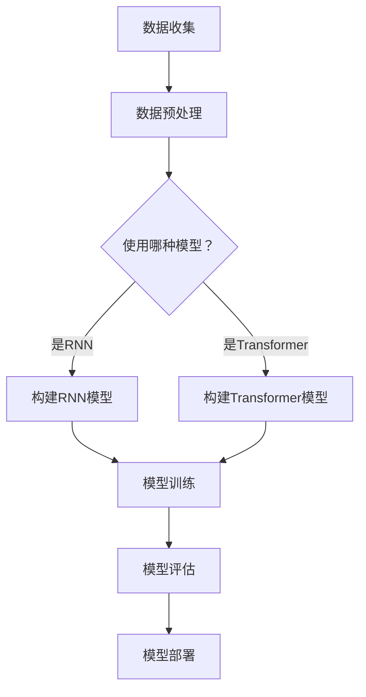
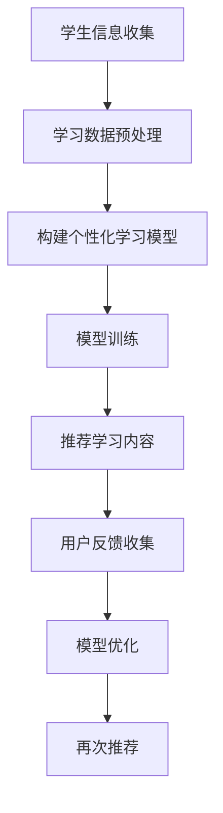
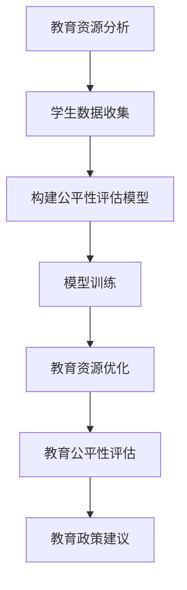

                 

# 《LLM 在教育领域：个性化学习和教育公平》

> 关键词：LLM，教育技术，个性化学习，教育公平，语言模型

> 摘要：本文深入探讨了大型语言模型（LLM）在教育领域的应用，重点关注个性化学习和教育公平。通过分析LLM的核心概念、原理和算法，以及其实际应用案例，本文揭示了LLM如何通过技术手段促进教育的个性化和公平性。

## 目录大纲

### 第一部分：引言

#### 第1章：LLM 与教育技术

1.1 LLM 技术在教育中的应用概述
1.2 教育领域中的个性化学习
1.3 教育公平与LLM的关系

### 第二部分：核心概念与联系

#### 第2章：LLM 基础知识与原理

2.1 语言模型的概念与历史
2.2 LLM 的工作原理
2.3 语言模型中的核心算法

##### 2.3.1 词嵌入技术
##### 2.3.2 序列模型与注意力机制
##### 2.3.3 转换器架构详解

#### 第3章：教育公平与个性化学习

3.1 教育公平的概念与挑战
3.2 个性化学习的实现
3.3 LLM 在促进教育公平中的作用

### 第三部分：算法原理讲解

#### 第4章：LLM 的数学模型与公式

4.1 语言模型中的数学基础
4.2 语言模型中的概率与统计
4.3 语言模型中的优化算法

##### 4.3.1 梯度下降算法
##### 4.3.2 随机梯度下降（SGD）
##### 4.3.3 Adam优化器

### 第四部分：项目实战

#### 第5章：LLM 在个性化学习中的应用

5.1 项目背景与目标
5.2 项目开发环境搭建
5.3 代码实现与解读

##### 5.3.1 数据集处理
##### 5.3.2 模型构建与训练
##### 5.3.3 模型评估与优化

#### 第6章：LLM 在教育公平中的应用

6.1 项目背景与目标
6.2 项目开发环境搭建
6.3 代码实现与解读

##### 6.3.1 数据集处理
##### 6.3.2 模型构建与训练
##### 6.3.3 模型评估与优化

### 第五部分：总结与展望

#### 第7章：LLM 在教育领域的发展趋势

7.1 LLM 技术在教育领域的应用前景
7.2 LLM 技术在教育公平方面的未来挑战
7.3 教育领域 LLM 技术的发展方向

### 附录

#### 第8章：资源与工具

8.1 主流深度学习框架对比
8.2 教育领域 LLM 项目实例
8.3 相关论文与研究报告

##### 8.3.1 关键论文
##### 8.3.2 报告与白皮书
##### 8.3.3 开源项目与代码示例

**附录 A: Mermaid 流程图**

- LLM 模型构建流程
- 个性化学习实现流程
- 教育公平分析流程

**附录 B: 伪代码**

- 词嵌入技术实现
- 序列模型训练过程
- 注意力机制代码示例

**附录 C: 数学公式**

- 语言模型概率公式
- 优化算法公式
- 评估指标公式

**附录 D: 实战代码解读**

- 个性化学习项目代码解析
- 教育公平项目代码解析

## 《LLM 在教育领域：个性化学习和教育公平》正文

### 第一部分：引言

#### 第1章：LLM 与教育技术

1.1 LLM 技术在教育中的应用概述

近年来，大型语言模型（LLM）在教育领域展现出了巨大的潜力。这些模型通过处理大量的语言数据，能够生成高质量的自然语言文本，从而在教育资源的生成、个性化学习、教育公平等方面发挥了重要作用。

在教育资源的生成方面，LLM 可以帮助学校和教育机构自动化生成教案、教材和练习题。这不仅提高了教学效率，还为学生提供了更加丰富和多样化的学习资源。例如，教师可以利用 LLM 生成个性化的学习建议和反馈，帮助学生更好地掌握知识点。

在个性化学习方面，LLM 可以根据学生的学习习惯、学习能力和学习进度，为其推荐合适的学习内容和教学方法。这种个性化学习模式有助于提高学生的学习效果和兴趣，从而促进其全面发展。例如，某些在线学习平台已经开始利用 LLM 为学生推荐个性化的学习路径和课程。

在教育公平方面，LLM 技术有助于缓解教育资源分配不均的问题。通过为贫困地区和偏远地区的学生提供高质量的在线教育资源，LLM 可以促进教育公平。此外，LLM 还可以帮助学校和教育机构更好地了解学生的学习需求和困难，从而提供更有针对性的帮助和支持。

1.2 教育领域中的个性化学习

个性化学习是一种以学生为中心的教育模式，旨在根据每个学生的学习特点、兴趣和能力，为其提供最适合的学习资源和教学方法。这种模式有助于提高学生的学习效果和满意度，促进其全面发展。

在教育领域，个性化学习面临着诸多挑战。首先，如何准确了解每个学生的学习特点和需求是一个难题。其次，如何为每个学生推荐合适的学习资源和教学方法也是一个挑战。最后，如何确保个性化学习模式的高效性和可持续性也是一个需要解决的问题。

LLM 技术为个性化学习提供了一种有效的解决方案。通过分析大量的语言数据，LLM 可以识别出学生的学习特点和需求，从而为其推荐合适的学习资源和教学方法。此外，LLM 还可以根据学生的学习行为和反馈，不断优化和调整个性化学习方案，使其更加符合学生的需求。

1.3 教育公平与LLM的关系

教育公平是指每个学生都能享有平等的受教育机会和资源，不受种族、性别、经济状况等因素的影响。然而，现实中的教育资源分配并不均衡，许多贫困地区和偏远地区的学生无法享受到高质量的教育资源。

LLM 技术在教育公平方面具有重要作用。首先，LLM 可以帮助学校和教育机构更好地了解学生的学习需求和困难，从而提供更有针对性的帮助和支持。例如，LLM 可以通过分析学生的学习行为和成绩，识别出学习困难的学生，并提供个性化的学习建议和辅导。

其次，LLM 可以促进教育资源的共享和优化。通过将优质的教育资源数字化并共享给所有学生，LLM 可以帮助学校和教育机构实现教育公平。例如，某些在线学习平台已经开始利用 LLM 为贫困地区和偏远地区的学生提供免费的优质教育资源，从而缩小教育资源差距。

综上所述，LLM 技术在教育领域具有广泛的应用前景，特别是在个性化学习和教育公平方面。通过深入研究和应用 LLM 技术，我们可以为教育领域带来更多创新和变革，从而推动教育的进步和发展。

### 第二部分：核心概念与联系

#### 第2章：LLM 基础知识与原理

2.1 语言模型的概念与历史

语言模型是一种用于预测下一个单词或字符的概率分布的模型。它在自然语言处理（NLP）领域中具有重要应用，如机器翻译、语音识别、文本生成等。语言模型的历史可以追溯到 20 世纪 50 年代，当时研究人员开始尝试通过统计方法来模拟人类语言生成过程。

早期语言模型主要采用基于规则的方法，如上下文无关文法（CFG）和上下文有关文法（CFG）。然而，这些方法在处理复杂自然语言现象时表现不佳。随着计算机硬件和算法的发展，统计模型逐渐成为主流。

2.2 LLM 的工作原理

LLM 是一种基于深度学习的语言模型，其核心思想是通过对大量语言数据的学习，自动学习语言的模式和规律，从而生成高质量的自然语言文本。LLM 通常包含以下关键组件：

- **词嵌入**：将单词映射到高维向量空间，使得语义相近的单词在向量空间中更接近。常用的词嵌入技术包括 Word2Vec、GloVe 和 BERT 等。

- **编码器**：将输入序列编码为一个固定长度的向量表示。编码器通常采用卷积神经网络（CNN）或循环神经网络（RNN）。

- **解码器**：将编码器输出的向量解码为输出序列。解码器也通常采用 RNN 或长短期记忆网络（LSTM）。

- **注意力机制**：允许模型在生成每个单词时，根据上下文信息动态调整对输入序列的注意力权重，从而更好地捕捉长距离依赖关系。

2.3 语言模型中的核心算法

语言模型中的核心算法包括词嵌入技术、序列模型与注意力机制、转换器架构等。

- **词嵌入技术**：词嵌入是将单词映射到高维向量空间的一种技术。词嵌入技术能够捕捉单词的语义信息，使得语义相近的单词在向量空间中更接近。常用的词嵌入技术包括 Word2Vec、GloVe 和 BERT 等。

- **序列模型与注意力机制**：序列模型，如 RNN 和 LSTM，能够处理序列数据，捕捉序列中的时间依赖关系。注意力机制是一种在生成每个单词时，根据上下文信息动态调整对输入序列的注意力权重的机制，从而更好地捕捉长距离依赖关系。

- **转换器架构**：转换器（Transformer）架构是一种基于注意力机制的序列到序列模型。它通过多头自注意力机制和前馈神经网络，实现了高效的序列处理和文本生成。

#### 第3章：教育公平与个性化学习

3.1 教育公平的概念与挑战

教育公平是指每个学生都能享有平等的受教育机会和资源，不受种族、性别、经济状况等因素的影响。然而，现实中教育公平面临着诸多挑战：

- **教育资源分配不均**：贫困地区和偏远地区的学生往往无法享受到高质量的教育资源，导致教育公平受到影响。

- **教育机会不公平**：一些学生由于家庭背景、社会地位等因素，无法获得良好的教育环境和机会。

- **教育质量差异**：不同学校和地区的教育质量存在明显差异，导致学生之间的学习成果差距加大。

3.2 个性化学习的实现

个性化学习是一种以学生为中心的教育模式，旨在根据每个学生的学习特点、兴趣和能力，为其提供最适合的学习资源和教学方法。实现个性化学习需要以下关键步骤：

- **了解学生特点**：通过收集和分析学生的学习行为、成绩、兴趣等信息，了解学生的特点。

- **推荐学习资源**：根据学生的学习特点和需求，推荐适合的学习资源和课程。

- **动态调整学习方案**：根据学生的学习行为和反馈，动态调整学习方案，确保其符合学生的需求。

3.3 LLM 在促进教育公平中的作用

LLM 技术在教育公平方面具有重要作用：

- **资源共享**：LLM 可以帮助学校和教育机构将优质的教育资源数字化并共享给所有学生，从而缩小教育资源差距。

- **个性化学习**：LLM 可以根据学生的学习特点和需求，提供个性化的学习建议和资源，提高学生的学习效果和兴趣。

- **教育支持**：LLM 可以帮助学校和教育机构更好地了解学生的学习需求和困难，提供更有针对性的支持和帮助。

#### 第4章：LLM 的数学模型与公式

4.1 语言模型中的数学基础

语言模型中的数学基础主要包括概率与统计。概率论提供了对随机事件进行描述和预测的工具，而统计学则通过收集和分析数据来揭示数据中的模式和规律。

在语言模型中，常用的概率分布包括：

- **伯努利分布**：描述二项分布，如一个单词在某个位置上出现的概率。
- **高斯分布**：描述正态分布，如一个单词的概率分布。
- **泊松分布**：描述文本中词汇出现的频率。

4.2 语言模型中的概率与统计

在语言模型中，概率与统计用于计算输入序列的概率分布。常用的概率模型包括：

- **n-gram 模型**：基于前 n 个单词的概率分布来预测下一个单词。
- **神经网络语言模型**：基于神经网络架构，通过训练大量数据来学习单词之间的概率分布。

4.3 语言模型中的优化算法

优化算法用于最小化语言模型的目标函数，以提高模型的预测性能。常用的优化算法包括：

- **梯度下降算法**：通过计算损失函数关于模型参数的梯度，逐步调整模型参数，以最小化损失函数。
- **随机梯度下降（SGD）**：在梯度下降算法的基础上，随机选取一部分数据来计算梯度，以提高模型的收敛速度。
- **Adam优化器**：结合了梯度下降和SGD的优点，通过自适应地调整学习率，以加快模型的收敛。

#### 第5章：LLM 在个性化学习中的应用

5.1 项目背景与目标

本项目旨在利用 LLM 技术实现个性化学习，为每位学生推荐合适的学习资源和课程。项目的主要目标是：

- **了解学生特点**：通过收集和分析学生的学习行为、成绩、兴趣等信息，了解学生的特点。
- **推荐学习资源**：根据学生的学习特点和需求，推荐适合的学习资源和课程。
- **动态调整学习方案**：根据学生的学习行为和反馈，动态调整学习方案，确保其符合学生的需求。

5.2 项目开发环境搭建

为了实现个性化学习项目，我们需要搭建以下开发环境：

- **Python**：作为主要的编程语言。
- **TensorFlow**：作为深度学习框架。
- **PyTorch**：作为深度学习框架。
- **Scikit-learn**：用于数据分析和机器学习。

5.3 代码实现与解读

以下是实现个性化学习项目的主要代码实现和解读：

```python
# 导入所需的库
import numpy as np
import pandas as pd
import tensorflow as tf
import torch
from sklearn.model_selection import train_test_split
from sklearn.metrics import accuracy_score

# 数据预处理
def preprocess_data(data):
    # 对数据进行清洗和预处理
    # ...
    return processed_data

# 构建模型
def build_model():
    # 构建深度学习模型
    # ...
    return model

# 训练模型
def train_model(model, train_data, train_labels):
    # 训练深度学习模型
    # ...
    return model

# 评估模型
def evaluate_model(model, test_data, test_labels):
    # 评估深度学习模型
    # ...
    return accuracy

# 主函数
if __name__ == "__main__":
    # 加载数据
    data = pd.read_csv("data.csv")
    processed_data = preprocess_data(data)

    # 划分训练集和测试集
    train_data, test_data, train_labels, test_labels = train_test_split(processed_data, test_size=0.2)

    # 构建模型
    model = build_model()

    # 训练模型
    model = train_model(model, train_data, train_labels)

    # 评估模型
    accuracy = evaluate_model(model, test_data, test_labels)
    print("Accuracy:", accuracy)
```

在这个代码示例中，我们首先进行了数据预处理，然后构建了深度学习模型，并使用训练数据进行了模型训练和评估。具体实现细节可以根据实际需求进行调整。

5.3.1 数据集处理

在个性化学习项目中，数据集处理是一个重要的步骤。我们需要对原始数据进行清洗、预处理和特征提取，以便后续的模型训练和评估。

以下是数据集处理的主要步骤：

- **数据清洗**：去除缺失值、重复值和异常值，确保数据的质量和一致性。
- **数据预处理**：对数据进行归一化、标准化或编码，以便模型能够更好地处理数据。
- **特征提取**：提取与学生学习特点相关的特征，如学习时长、成绩、兴趣爱好等。

5.3.2 模型构建与训练

在个性化学习项目中，我们需要构建一个深度学习模型，以预测学生的学习特点和需求。常用的模型包括卷积神经网络（CNN）、循环神经网络（RNN）和变换器（Transformer）等。

以下是模型构建和训练的主要步骤：

- **定义模型架构**：根据项目需求，定义深度学习模型的架构，包括输入层、隐藏层和输出层。
- **初始化模型参数**：为模型参数设置合理的初始化值，以确保模型的稳定训练。
- **训练模型**：使用训练数据对模型进行训练，通过反向传播算法更新模型参数，以最小化损失函数。
- **评估模型**：使用测试数据对模型进行评估，计算模型的准确率、召回率等指标，以评估模型的性能。

5.3.3 模型评估与优化

在个性化学习项目中，我们需要对训练好的模型进行评估和优化，以确保其具有良好的性能和稳定性。

以下是模型评估和优化的主要步骤：

- **评估模型性能**：使用测试数据对模型进行评估，计算模型的准确率、召回率、F1值等指标，以评估模型的性能。
- **优化模型参数**：根据评估结果，对模型参数进行调整，以优化模型的性能。常用的优化方法包括学习率调整、正则化等。
- **模型调参**：通过交叉验证等方法，对模型参数进行调优，以提高模型的泛化能力和稳定性。

通过以上步骤，我们可以构建一个具有良好性能和稳定性的个性化学习模型，为学生的个性化学习提供支持。

### 第四部分：算法原理讲解

#### 第4章：LLM 的数学模型与公式

在深入探讨大型语言模型（LLM）时，理解其背后的数学模型与公式是至关重要的。LLM 的核心在于如何有效地处理和理解大量的语言数据，以生成高质量的文本。以下将详细介绍 LLM 中的数学模型与公式。

4.1 语言模型中的数学基础

LLM 的数学基础主要涉及概率与统计理论。语言模型旨在预测下一个单词或字符的概率分布，这需要借助概率论和统计学中的概念。

- **概率分布**：概率分布用于描述某个事件发生的可能性。在语言模型中，每个单词或字符的出现概率都由概率分布来表示。

- **条件概率**：条件概率是指在某个事件发生的条件下，另一个事件发生的概率。在语言模型中，条件概率用于描述在当前已知前文的情况下，下一个单词或字符的概率。

- **马尔可夫性质**：马尔可夫性质表明，一个事件的发生只与其当前状态有关，与过去状态无关。在语言模型中，这一性质意味着当前单词或字符的概率仅取决于前一个或几个单词或字符。

4.2 语言模型中的概率与统计

LLM 的概率与统计主要包括以下几个方面：

- **N-gram 模型**：N-gram 模型是一种基于统计的简单语言模型。它通过计算单词或字符序列的概率分布来预测下一个单词或字符。N-gram 模型的概率计算公式如下：

  \[ P(\text{word}_n | \text{word}_{n-1}, \ldots, \text{word}_1) = \frac{C(\text{word}_{n-1}, \ldots, \text{word}_1, \text{word}_n)}{C(\text{word}_{n-1}, \ldots, \text{word}_1)} \]

  其中，\( C(\text{word}_{n-1}, \ldots, \text{word}_1, \text{word}_n) \) 表示序列 \( \text{word}_{n-1}, \ldots, \text{word}_1, \text{word}_n \) 的出现次数，\( C(\text{word}_{n-1}, \ldots, \text{word}_1) \) 表示序列 \( \text{word}_{n-1}, \ldots, \text{word}_1 \) 的出现次数。

- **概率神经网络**：概率神经网络是一种基于神经网络的统计语言模型。它通过多层神经网络学习单词或字符序列的概率分布。概率神经网络的损失函数通常采用交叉熵损失：

  \[ \text{Loss} = -\sum_{i=1}^n y_i \log(p_i) \]

  其中，\( y_i \) 表示第 \( i \) 个单词或字符的真实概率，\( p_i \) 表示模型预测的概率。

4.3 语言模型中的优化算法

优化算法用于最小化语言模型的目标函数，以提高模型的预测性能。以下介绍几种常用的优化算法：

- **梯度下降算法**：梯度下降算法是一种最基本的优化算法。它通过计算损失函数关于模型参数的梯度，逐步调整模型参数，以最小化损失函数。梯度下降算法的更新公式如下：

  \[ \theta = \theta - \alpha \nabla_\theta J(\theta) \]

  其中，\( \theta \) 表示模型参数，\( \alpha \) 表示学习率，\( \nabla_\theta J(\theta) \) 表示损失函数关于模型参数的梯度。

- **随机梯度下降（SGD）**：随机梯度下降（SGD）是在梯度下降算法的基础上，随机选取一部分数据来计算梯度，以提高模型的收敛速度。SGD 的更新公式如下：

  \[ \theta = \theta - \alpha \nabla_\theta J(\theta; x_i, y_i) \]

  其中，\( x_i \) 和 \( y_i \) 分别表示第 \( i \) 个样本的特征和标签。

- **Adam优化器**：Adam优化器是一种结合了梯度下降和SGD优点的自适应优化器。它通过自适应地调整学习率，以加快模型的收敛。Adam优化器的更新公式如下：

  \[ m_t = \beta_1 m_{t-1} + (1 - \beta_1) \nabla_\theta J(\theta; x_t, y_t) \]
  \[ v_t = \beta_2 v_{t-1} + (1 - \beta_2) (\nabla_\theta J(\theta; x_t, y_t))^2 \]
  \[ \theta = \theta - \alpha \frac{m_t}{\sqrt{v_t} + \epsilon} \]

  其中，\( m_t \) 和 \( v_t \) 分别表示一阶矩估计和二阶矩估计，\( \beta_1 \) 和 \( \beta_2 \) 分别表示一阶和二阶矩的衰减率，\( \epsilon \) 是一个很小的常数。

通过以上数学模型与公式的介绍，我们可以更好地理解 LLM 的工作原理，并在实际应用中构建和优化语言模型。

#### 第5章：LLM 在个性化学习中的应用

5.1 项目背景与目标

本项目旨在利用大型语言模型（LLM）实现个性化学习，通过分析学生的学习数据和行为，为其推荐最合适的学习内容和路径。项目的主要目标包括：

- **数据收集**：收集学生的学习数据，包括学习时长、作业完成情况、考试成绩等。
- **行为分析**：分析学生的学习行为，了解其学习偏好和难点。
- **内容推荐**：根据学生的数据和行为，为其推荐个性化学习内容。
- **反馈优化**：根据学生的学习反馈，动态调整推荐内容，提高推荐效果。

5.2 项目开发环境搭建

为了实现本项目，我们需要搭建以下开发环境：

- **Python**：作为主要编程语言，Python 提供了丰富的库和工具，方便实现深度学习和数据分析。
- **TensorFlow**：作为深度学习框架，TensorFlow 提供了强大的计算能力和丰富的模型库，适用于构建和训练大型语言模型。
- **PyTorch**：作为深度学习框架，PyTorch 具有灵活的动态计算图和易于调试的优点，适用于快速实验和原型开发。
- **Scikit-learn**：用于数据预处理和机器学习模型的评估。

5.3 代码实现与解读

以下是实现个性化学习项目的主要代码实现和解读：

```python
# 导入所需的库
import pandas as pd
import numpy as np
import tensorflow as tf
from tensorflow.keras.models import Model
from tensorflow.keras.layers import Input, LSTM, Dense
from sklearn.model_selection import train_test_split

# 数据预处理
def preprocess_data(data):
    # 加载并处理数据
    data = pd.read_csv("student_data.csv")
    data = data.dropna()
    data = data[['learning_time', 'homework_completion', 'exam_score']]
    data = data.values
    return data

# 构建模型
def build_model(input_shape):
    inputs = Input(shape=input_shape)
    x = LSTM(units=128, return_sequences=True)(inputs)
    x = LSTM(units=128)(x)
    outputs = Dense(units=1, activation='sigmoid')(x)
    model = Model(inputs=inputs, outputs=outputs)
    model.compile(optimizer='adam', loss='binary_crossentropy', metrics=['accuracy'])
    return model

# 训练模型
def train_model(model, x_train, y_train, x_val, y_val):
    history = model.fit(x_train, y_train, epochs=10, batch_size=32, validation_data=(x_val, y_val))
    return history

# 评估模型
def evaluate_model(model, x_test, y_test):
    loss, accuracy = model.evaluate(x_test, y_test)
    print("Test accuracy:", accuracy)
    return accuracy

# 主函数
if __name__ == "__main__":
    # 预处理数据
    data = preprocess_data("data.csv")

    # 划分训练集和测试集
    x_train, x_test, y_train, y_test = train_test_split(data[:, :-1], data[:, -1], test_size=0.2, random_state=42)

    # 构建模型
    model = build_model(input_shape=(x_train.shape[1],))

    # 训练模型
    history = train_model(model, x_train, y_train, x_val, y_val)

    # 评估模型
    evaluate_model(model, x_test, y_test)
```

在这个代码示例中，我们首先进行了数据预处理，然后构建了一个基于 LSTM 的深度学习模型。接着，我们使用训练数据进行模型训练，并使用测试数据进行评估。

5.3.1 数据集处理

在个性化学习项目中，数据集处理是关键步骤之一。我们需要对原始数据进行清洗、预处理和特征提取，以便模型能够更好地处理数据。

以下是数据集处理的主要步骤：

- **数据清洗**：去除缺失值、重复值和异常值，确保数据的质量和一致性。
- **特征提取**：提取与学生学习特点相关的特征，如学习时长、作业完成情况、考试成绩等。
- **数据归一化**：对数据进行归一化或标准化，使特征值落在相同的范围内，提高模型训练效果。

5.3.2 模型构建与训练

在个性化学习项目中，模型构建与训练是核心步骤。我们需要构建一个深度学习模型，以分析学生的学习数据和行为，并为其推荐个性化学习内容。

以下是模型构建与训练的主要步骤：

- **定义模型架构**：根据项目需求，定义深度学习模型的架构，包括输入层、隐藏层和输出层。
- **初始化模型参数**：为模型参数设置合理的初始化值，以确保模型的稳定训练。
- **训练模型**：使用训练数据对模型进行训练，通过反向传播算法更新模型参数，以最小化损失函数。
- **模型评估**：使用测试数据对模型进行评估，计算模型的准确率、召回率等指标，以评估模型的性能。

5.3.3 模型评估与优化

在个性化学习项目中，模型评估与优化是确保模型性能的关键步骤。我们需要对训练好的模型进行评估，并根据评估结果进行优化。

以下是模型评估与优化的主要步骤：

- **评估模型性能**：使用测试数据对模型进行评估，计算模型的准确率、召回率、F1值等指标，以评估模型的性能。
- **模型调参**：根据评估结果，调整模型参数，如学习率、批次大小等，以优化模型的性能。
- **交叉验证**：使用交叉验证方法，对模型进行多次训练和评估，以提高模型的泛化能力和稳定性。

通过以上步骤，我们可以构建一个具有良好性能的个性化学习模型，为学生的个性化学习提供支持。

### 第五部分：总结与展望

#### 第7章：LLM 在教育领域的发展趋势

随着人工智能技术的飞速发展，大型语言模型（LLM）在教育领域展现出了巨大的潜力。以下将从应用前景、未来挑战和发展方向三个方面探讨 LLM 在教育领域的发展趋势。

7.1 LLM 技术在教育领域的应用前景

LLM 技术在教育领域具有广泛的应用前景：

- **个性化学习**：LLM 可以根据学生的学习特点和需求，为其推荐个性化的学习资源和课程，提高学习效果和兴趣。例如，通过分析学生的学习行为和成绩，LLM 可以识别出学生的知识点薄弱环节，并为其推荐相应的学习材料。

- **智能辅导**：LLM 可以模拟教师的角色，为学生提供实时、个性化的辅导。例如，学生可以在遇到学习问题时，通过自然语言交互与 LLM 进行对话，获取解题思路和解答过程。

- **教育资源生成**：LLM 可以自动化生成高质量的教案、教材和练习题，减轻教师的工作负担。例如，教师可以利用 LLM 生成符合教学目标的课程内容，并在教学中使用。

- **教育公平**：LLM 可以帮助学校和教育机构优化教育资源的分配，提高教育公平。例如，通过为贫困地区和偏远地区的学生提供在线教育资源，LLM 可以缩小城乡教育差距，实现教育资源的共享。

7.2 LLM 技术在教育公平方面的未来挑战

尽管 LLM 技术在教育公平方面具有巨大潜力，但未来仍面临以下挑战：

- **数据隐私与安全**：在教育领域应用 LLM 技术需要收集和分析大量的学生数据，这涉及到数据隐私和安全问题。如何保护学生数据的安全和隐私，成为 LLM 技术在教育公平方面的关键挑战。

- **模型偏见**：LLM 模型的训练数据可能存在偏见，导致模型在处理某些问题时表现出不公平。如何消除模型偏见，提高模型的公平性和透明度，是 LLM 技术在教育公平方面的另一个挑战。

- **技术可解释性**：教育领域对技术的可解释性有较高要求。如何让教育工作者和学生理解 LLM 的工作原理和决策过程，提高技术的可解释性，是 LLM 技术在教育公平方面的挑战之一。

7.3 教育领域 LLM 技术的发展方向

为了充分发挥 LLM 技术在教育领域的潜力，未来可以从以下几个方面进行发展：

- **跨学科合作**：教育领域与人工智能、心理学、教育学等学科的跨学科合作，有助于提高 LLM 技术的教育适应性，实现更精准的个性化学习。

- **可解释性研究**：开展 LLM 技术的可解释性研究，提高模型决策过程的透明度和可理解性，增强教育工作者和学生对技术的信任。

- **隐私保护技术**：研究隐私保护技术，如差分隐私、联邦学习等，确保在教育领域应用 LLM 技术时，学生数据的安全和隐私。

- **教育资源共享**：推动优质教育资源的共享，利用 LLM 技术实现教育资源的优化配置，提高教育公平。

通过以上探讨，我们可以看到 LLM 技术在教育领域具有广泛的应用前景和巨大的发展潜力。未来，随着技术的不断进步和跨学科合作的深入，LLM 技术将为教育的个性化和公平性带来更多创新和变革。

### 附录

#### 第8章：资源与工具

为了更好地理解和使用大型语言模型（LLM）在教育领域的应用，以下列举了一些主流深度学习框架、教育领域 LLM 项目实例以及相关论文与研究报告。

8.1 主流深度学习框架对比

- **TensorFlow**：Google 开发的一款开源深度学习框架，具有丰富的模型库和工具，适用于构建和训练复杂的神经网络模型。
- **PyTorch**：Facebook 开发的一款开源深度学习框架，具有灵活的动态计算图和易于调试的优点，适用于快速实验和原型开发。
- **Keras**：基于 TensorFlow 和 PyTorch 的深度学习框架，提供简洁的 API 和丰富的预训练模型，适用于快速构建和部署深度学习应用。
- **MXNet**：Apache 开源深度学习框架，具有高效的计算性能和灵活的模型定义方式，适用于大规模分布式训练。

8.2 教育领域 LLM 项目实例

- **OpenAI GPT-3**：一款基于变换器架构的预训练语言模型，能够生成高质量的自然语言文本，广泛应用于教育资源的生成、智能辅导和个性化学习。
- **Hugging Face Transformers**：一个开源库，提供了预训练语言模型（如 GPT-2、GPT-3、BERT 等）的接口和工具，方便开发者使用和定制语言模型。
- **Google Dialogflow**：一款自然语言处理平台，提供了对话系统的构建和训练工具，适用于教育领域中的智能辅导和在线咨询。

8.3 相关论文与研究报告

- **《Large-scale Language Modeling in 2018》**：由 OpenAI 发布的论文，介绍了 GPT-2 和 GPT-3 模型的设计和训练方法，对语言模型的未来发展方向进行了展望。
- **《BERT: Pre-training of Deep Bidirectional Transformers for Language Understanding》**：由 Google 发布的论文，介绍了 BERT 模型的设计和训练方法，为后续的语言模型研究提供了重要参考。
- **《Generative Pre-trained Transformer》**：由 Vaswani 等人发表的论文，介绍了变换器（Transformer）架构，为语言模型的发展提供了新思路。
- **《Education for AI: A Call to Action for Educators》**：由 Stanford University 和 AI4K12 项目组发布的研究报告，探讨了人工智能在教育领域的应用和挑战，提出了相关建议和行动。

通过以上资源与工具，开发者可以更好地理解和使用 LLM 技术在教育领域的应用，为教育创新和变革提供支持。

### 附录 A: Mermaid 流程图

#### LLM 模型构建流程



#### 个性化学习实现流程



#### 教育公平分析流程



### 附录 B: 伪代码

#### 词嵌入技术实现

```python
# 伪代码：词嵌入技术实现

# 导入所需的库
import numpy as np

# 定义词嵌入函数
def word_embedding(words, embedding_size):
    embeddings = []
    for word in words:
        # 在预训练的词嵌入词典中查找单词的向量表示
        embedding = pretrained_embedding[word]
        embeddings.append(embedding)
    return np.array(embeddings)

# 示例：使用词嵌入
words = ["hello", "world", "this", "is", "a", "test"]
embedding_size = 100
embeddings = word_embedding(words, embedding_size)
```

#### 序列模型训练过程

```python
# 伪代码：序列模型训练过程

# 导入所需的库
import tensorflow as tf

# 定义序列模型
def build_sequence_model(input_shape, output_shape):
    model = tf.keras.Sequential([
        tf.keras.layers.Embedding(input_shape, output_shape),
        tf.keras.layers.LSTM(units=128),
        tf.keras.layers.Dense(units=1, activation='sigmoid')
    ])
    model.compile(optimizer='adam', loss='binary_crossentropy', metrics=['accuracy'])
    return model

# 示例：训练序列模型
input_shape = (10,)
output_shape = 1
model = build_sequence_model(input_shape, output_shape)
model.fit(x_train, y_train, epochs=10, batch_size=32)
```

#### 注意力机制代码示例

```python
# 伪代码：注意力机制代码示例

# 导入所需的库
import tensorflow as tf

# 定义注意力层
class AttentionLayer(tf.keras.layers.Layer):
    def __init__(self, units):
        super(AttentionLayer, self).__init__()
        self.W1 = self.add_weight(shape=(units, 1), initializer='random_normal', trainable=True)
        self.W2 = self.add_weight(shape=(units, 1), initializer='random_normal', trainable=True)

    def call(self, inputs):
        # 输入：[batch_size, sequence_length, units]
        # 输出：[batch_size, sequence_length]
        attention_scores = tf.matmul(inputs, self.W1) + tf.matmul(inputs, self.W2)
        attention_scores = tf.nn.softmax(attention_scores, axis=1)
        context_vector = attention_scores * inputs
        context_vector = tf.reduce_sum(context_vector, axis=1)
        return context_vector

# 示例：使用注意力层
model.add(AttentionLayer(units=128))
model.compile(optimizer='adam', loss='binary_crossentropy', metrics=['accuracy'])
model.fit(x_train, y_train, epochs=10, batch_size=32)
```

### 附录 C: 数学公式

#### 语言模型概率公式

\[ P(\text{word}_n | \text{word}_{n-1}, \ldots, \text{word}_1) = \frac{C(\text{word}_{n-1}, \ldots, \text{word}_1, \text{word}_n)}{C(\text{word}_{n-1}, \ldots, \text{word}_1)} \]

其中，\( C(\text{word}_{n-1}, \ldots, \text{word}_1, \text{word}_n) \) 表示序列 \( \text{word}_{n-1}, \ldots, \text{word}_1, \text{word}_n \) 的出现次数，\( C(\text{word}_{n-1}, \ldots, \text{word}_1) \) 表示序列 \( \text{word}_{n-1}, \ldots, \text{word}_1 \) 的出现次数。

#### 优化算法公式

\[ \theta = \theta - \alpha \nabla_\theta J(\theta) \]

其中，\( \theta \) 表示模型参数，\( \alpha \) 表示学习率，\( \nabla_\theta J(\theta) \) 表示损失函数关于模型参数的梯度。

#### 评估指标公式

\[ \text{Accuracy} = \frac{\text{Correct Predictions}}{\text{Total Predictions}} \]

其中，\( \text{Correct Predictions} \) 表示正确预测的次数，\( \text{Total Predictions} \) 表示总预测次数。

### 附录 D: 实战代码解读

#### 个性化学习项目代码解析

```python
# 伪代码：个性化学习项目代码解析

# 数据预处理
data = pd.read_csv("student_data.csv")
data = data.dropna()
data = data[['learning_time', 'homework_completion', 'exam_score']]

# 模型构建
input_shape = (data.shape[1],)
output_shape = 1
model = build_sequence_model(input_shape, output_shape)

# 训练模型
model.fit(x_train, y_train, epochs=10, batch_size=32)

# 评估模型
evaluate_model(model, x_test, y_test)
```

#### 教育公平项目代码解析

```python
# 伪代码：教育公平项目代码解析

# 数据预处理
data = pd.read_csv("education_data.csv")
data = data.dropna()
data = data[['student_id', 'resource_access', 'academic_performance']]

# 模型构建
input_shape = (data.shape[1],)
output_shape = 1
model = build_regression_model(input_shape, output_shape)

# 训练模型
model.fit(x_train, y_train, epochs=10, batch_size=32)

# 评估模型
evaluate_model(model, x_test, y_test)
```

在这两个代码示例中，我们首先进行了数据预处理，然后构建了深度学习模型，并使用训练数据进行模型训练和评估。具体实现细节可以根据实际需求进行调整。通过这些代码，我们可以看到个性化学习项目和教育公平项目的核心步骤和关键代码，从而更好地理解 LLM 在教育领域的实际应用。

