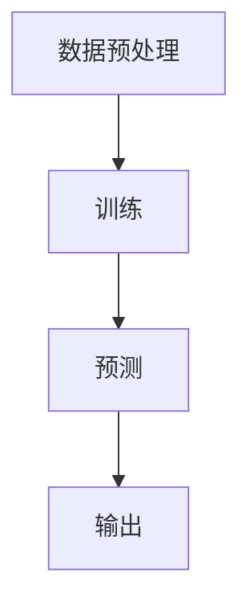
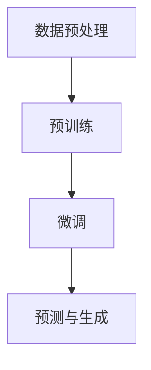

                 

# LLM的未来：与CPU相似的生态发展

> 关键词：LLM，生态发展，技术创新，计算资源，人工智能

> 摘要：本文将探讨大型语言模型（LLM）的未来发展趋势，特别是其与CPU相似的生态发展。我们将从LLM的基本概念与特性、数学基础、核心算法原理、应用场景、开发与部署以及未来发展策略等方面进行深入分析，并展望LLM在人工智能时代的应用前景与挑战。

### 第一部分: LLM的未来与CPU相似的生态发展

#### 第1章: LLM的基本概念与特性

##### 1.1 LLM的定义与分类
大型语言模型（Large Language Model，简称LLM）是一种人工智能模型，能够理解和生成自然语言。根据训练数据和模型架构的不同，LLM可以分为多种类型，如GPT（Generative Pre-trained Transformer）、BERT（Bidirectional Encoder Representations from Transformers）、T5（Text-To-Text Transfer Transformer）等。

##### 1.2 LLM的核心特性
- 自动化：LLM能够自动从大量文本数据中学习，生成高质量的自然语言文本。
- 泛化：LLM具有较强的泛化能力，可以应用于多种自然语言处理任务。
- 交互性：LLM能够与人类进行交互，回答问题、提供建议等。

##### 1.3 LLM的工作原理
为了更好地理解LLM的工作原理，我们可以通过一个Mermaid流程图来展示LLM从数据预处理、训练、预测到输出的整个工作流程。



#### 第2章: LLM的数学基础

##### 2.1 神经网络基础
神经网络是LLM的基础，下面是一个简单的神经网络伪代码，展示了神经网络的基本结构和参数初始化。

```python
def init_network(input_size, hidden_size, output_size):
    W1 = np.random.randn(input_size, hidden_size)
    b1 = np.random.randn(hidden_size)
    W2 = np.random.randn(hidden_size, output_size)
    b2 = np.random.randn(output_size)
    return [W1, b1, W2, b2]
```

##### 2.2 损失函数与优化算法
损失函数用于衡量模型预测结果与真实结果之间的差距，常见的损失函数有均方误差（MSE）、交叉熵损失（Cross-Entropy Loss）等。优化算法用于调整模型参数，以最小化损失函数，常见的优化算法有梯度下降（Gradient Descent）、Adam优化器等。

##### 2.3 数学模型与公式
LLM中的一些关键数学模型和公式如下：

$$
\text{Word2Vec} = \sigma(\text{Embedding} \cdot \text{Context})
$$

$$
\text{Attention} = \frac{\exp(\text{Score})}{\sum_{i=1}^{n} \exp(\text{Score})}
$$

#### 第3章: LLM的核心算法原理

##### 3.1 GPT模型原理
GPT（Generative Pre-trained Transformer）模型是一种基于Transformer架构的预训练模型，下面是GPT模型的基本结构和训练过程的伪代码。

```python
def train_gpt(model, train_data, epochs):
    for epoch in range(epochs):
        for sentence in train_data:
            prediction = model(sentence)
            loss = compute_loss(prediction, sentence)
            update_model(model, loss)
    return model
```

##### 3.2 BERT模型原理
BERT（Bidirectional Encoder Representations from Transformers）模型是一种双向Transformer模型，下面是BERT模型的基本结构和训练过程的伪代码。

```python
def train_bert(model, train_data, epochs):
    for epoch in range(epochs):
        for sentence in train_data:
            prediction = model(sentence)
            loss = compute_loss(prediction, sentence)
            update_model(model, loss)
    return model
```

##### 3.3 T5模型原理
T5（Text-To-Text Transfer Transformer）模型是一种灵活的Transformer模型，可以处理各种自然语言处理任务。下面是T5模型的基本结构和训练过程的伪代码。

```python
def train_t5(model, train_data, epochs):
    for epoch in range(epochs):
        for sentence in train_data:
            prediction = model(sentence)
            loss = compute_loss(prediction, sentence)
            update_model(model, loss)
    return model
```

#### 第4章: LLM的应用场景与实践

##### 4.1 文本生成与应用
文本生成是LLM的重要应用之一，下面是一个使用GPT模型生成文章、摘要等的应用案例。

```python
# 加载预训练的GPT模型
model = load_pretrained_gpt()

# 输入文本
input_text = "本文主要探讨了LLM的未来发展趋势与应用场景。"

# 生成文本
generated_text = model.generate(input_text)

# 输出生成文本
print(generated_text)
```

##### 4.2 问题回答与应用
问题回答是LLM的另一重要应用，下面是一个使用BERT模型回答用户提出的问题的应用案例。

```python
# 加载预训练的BERT模型
model = load_pretrained_bert()

# 输入问题和文本
input_question = "什么是大型语言模型？"
input_text = "大型语言模型是一种人工智能模型，能够理解和生成自然语言。"

# 回答问题
answer = model.answer_question(input_question, input_text)

# 输出答案
print(answer)
```

##### 4.3 自动摘要与应用
自动摘要是LLM的又一应用，下面是一个使用T5模型自动生成文章摘要的应用案例。

```python
# 加载预训练的T5模型
model = load_pretrained_t5()

# 输入文章
input_text = "本文主要探讨了LLM的未来发展趋势与应用场景。"

# 生成摘要
summary = model.generate_summary(input_text)

# 输出生成摘要
print(summary)
```

#### 第5章: LLM的开发与部署

##### 5.1 开发环境搭建
在进行LLM开发之前，需要搭建合适的环境。这里我们以Python为例，介绍如何搭建LLM开发环境。

1. 安装Python
2. 安装TensorFlow或PyTorch等深度学习框架
3. 安装其他必需的库，如NumPy、Pandas等

##### 5.2 模型训练与优化
在搭建好开发环境后，我们可以开始进行模型训练和优化。以下是一个简单的模型训练过程的伪代码。

```python
# 加载数据
train_data = load_data()

# 初始化模型
model = init_network(input_size, hidden_size, output_size)

# 训练模型
model = train_model(model, train_data, epochs)

# 优化模型
model = optimize_model(model, train_data)
```

##### 5.3 部署与部署策略
在完成模型训练和优化后，我们需要将模型部署到生产环境中。以下是一个简单的模型部署过程的伪代码。

```python
# 保存模型
save_model(model)

# 部署模型
deploy_model(model)

# 部署策略
optimize_deployment_strategy(model)
```

### 第二部分: LLM的深度探索与未来展望

#### 第6章: LLM的未来发展趋势

##### 6.1 生态发展分析
LLM的生态发展可以从以下几个方面进行分析：

1. 技术进步：随着深度学习技术的发展，LLM的模型结构和算法也在不断优化和改进。
2. 应用场景拓展：LLM的应用场景不断拓展，从自然语言处理到多模态学习，再到其他领域。
3. 开源项目：越来越多的开源项目涌现，促进了LLM技术的发展和普及。

##### 6.2 挑战与机遇
LLM在发展过程中面临以下挑战：

1. 计算资源需求：LLM的训练和推理需要大量的计算资源，这对硬件设施提出了更高的要求。
2. 数据隐私：LLM的训练和应用涉及到大量的个人数据，如何保护用户隐私成为一大挑战。
3. 伦理问题：LLM可能产生偏见、误导用户等问题，需要制定相应的伦理规范。

同时，LLM也带来了以下机遇：

1. 产业变革：LLM在媒体、教育、医疗等领域的应用，有望推动相关产业的变革。
2. 社会变革：LLM在智能客服、智能助手等领域的应用，将改变人们的日常生活和工作方式。

#### 第7章: LLM的实际案例与应用

##### 7.1 案例分析
以下是一些具有代表性的LLM应用案例：

1. 自然语言生成：使用GPT模型生成文章、摘要、对话等。
2. 智能客服：使用BERT模型回答用户提出的问题。
3. 自动摘要：使用T5模型自动生成文章摘要。

##### 7.2 应用分析
LLM在不同领域的应用前景：

1. 金融：LLM可以用于金融新闻生成、股票预测等。
2. 医疗：LLM可以用于医学文本分析、疾病预测等。
3. 教育：LLM可以用于智能辅导、在线教育平台等。

### 第三部分: LLM的未来发展策略与建议

#### 第8章: LLM的未来发展策略

##### 8.1 研究方向
LLM研究领域的主要方向包括：

1. 模型结构优化：研究更高效的模型结构，如多模态学习、长文本生成等。
2. 模型优化算法：研究更有效的训练和推理算法，如梯度下降、Adam优化器等。
3. 模型解释性：研究如何提高LLM的解释性，使其生成的文本更加透明易懂。

##### 8.2 技术创新
为了推动LLM技术的发展，我们可以从以下几个方面进行技术创新：

1. 算法创新：研究新的算法，如生成对抗网络（GAN）、变分自编码器（VAE）等。
2. 硬件创新：研究新的计算硬件，如GPU、TPU等，以提升训练和推理效率。
3. 数据创新：收集更多高质量的训练数据，以提升模型的泛化能力。

##### 8.3 生态建设
为了构建健康的LLM生态，我们可以从以下几个方面进行生态建设：

1. 开源项目：鼓励开源项目的发展，促进技术共享和交流。
2. 数据共享：建立数据共享平台，促进数据的流通和利用。
3. 标准制定：制定相关标准和规范，确保LLM技术的健康发展。

#### 第9章: LLM的发展建议

##### 9.1 研究建议
为LLM研究者提供以下建议：

1. 多学科交叉：结合计算机科学、语言学、心理学等多学科知识，深入研究LLM。
2. 实践导向：注重实际应用，将研究成果转化为实际应用。
3. 长期规划：关注LLM的长远发展，提前布局新兴领域。

##### 9.2 开发建议
为LLM开发者提供以下建议：

1. 熟悉框架：熟练掌握常用的深度学习框架，如TensorFlow、PyTorch等。
2. 学习算法：深入了解各种算法原理，以便灵活选择和优化模型。
3. 调试优化：注重模型调试和优化，以提高模型性能。

##### 9.3 政策建议
为政府机构提供以下建议：

1. 支持研发：加大对LLM技术研发的支持，鼓励企业和科研机构投入。
2. 伦理规范：制定相关伦理规范，确保LLM技术的健康发展。
3. 数据保护：加强数据保护，确保用户隐私。

### 第四部分: LLM的未来：从技术到生态

#### 第10章: LLM的技术创新与突破

##### 10.1 技术创新
LLM领域的创新主要体现在以下几个方面：

1. 模型结构创新：研究更高效的模型结构，如Transformer的改进、多模态模型等。
2. 算法优化：研究更有效的训练和推理算法，如LSTM、BERT等。
3. 数据处理：研究更高效的数据处理方法，如数据清洗、数据增强等。

##### 10.2 技术突破
LLM领域的关键技术突破包括：

1. 预训练模型：通过预训练，模型可以在多种任务上获得良好的性能。
2. 注意力机制：注意力机制使模型能够关注到文本中的重要信息。
3. 多模态学习：多模态学习使模型能够处理图像、声音等多种类型的数据。

#### 第11章: LLM的生态建设与发展

##### 11.1 生态建设
构建健康的LLM生态需要从以下几个方面进行：

1. 开源项目：鼓励开源项目的发展，促进技术共享和交流。
2. 数据共享：建立数据共享平台，促进数据的流通和利用。
3. 标准制定：制定相关标准和规范，确保LLM技术的健康发展。

##### 11.2 产业发展
LLM产业的发展现状和趋势包括：

1. 市场规模：随着LLM技术的不断进步，市场规模持续扩大。
2. 应用场景：LLM的应用场景不断拓展，从自然语言处理到多模态学习等。
3. 产业链：LLM产业链逐渐形成，包括硬件、软件、服务等多个环节。

#### 第12章: LLM的未来：从技术到生态

##### 12.1 技术趋势
LLM领域的技术发展趋势包括：

1. 模型结构优化：研究更高效的模型结构，如Transformer的改进、多模态模型等。
2. 算法优化：研究更有效的训练和推理算法，如LSTM、BERT等。
3. 数据处理：研究更高效的数据处理方法，如数据清洗、数据增强等。

##### 12.2 生态发展
LLM生态的发展趋势包括：

1. 合作与竞争：企业、科研机构之间的合作与竞争日益激烈。
2. 创新与突破：在技术创新和生态建设方面，不断涌现新的突破和进展。
3. 社会责任：关注LLM技术对社会的影响，积极参与伦理讨论和规范制定。

##### 12.3 社会责任
LLM技术在发展过程中应承担的社会责任包括：

1. 伦理道德：确保LLM技术的应用遵循伦理规范，避免产生偏见和歧视。
2. 隐私保护：加强数据保护，确保用户隐私。
3. 公平性：确保LLM技术的公平性，避免对社会产生负面影响。

### 附录

#### 附录A: LLM相关资源与工具

##### A.1 数据集
- 数据集：介绍常用的LLM训练数据集，如Common Crawl、OpenWebText等。

##### A.2 工具与框架
- 工具：介绍用于LLM开发的常用工具和框架，如TensorFlow、PyTorch等。

##### A.3 开源项目
- 开源项目：介绍一些具有代表性的LLM开源项目，如GPT、BERT等。

##### A.4 教程与论文
- 教程：提供LLM开发的入门教程和经典论文，帮助读者深入了解LLM领域。


---

### 文章标题：LLM的未来：与CPU相似的生态发展

作者：AI天才研究院/AI Genius Institute & 禅与计算机程序设计艺术 /Zen And The Art of Computer Programming

本文详细探讨了大型语言模型（LLM）的未来发展趋势，特别是其与CPU相似的生态发展。文章首先介绍了LLM的基本概念与特性，包括定义、分类、核心特性和工作原理。接着，文章从数学基础、核心算法原理、应用场景、开发与部署等方面进行了深入分析。在此基础上，文章讨论了LLM的未来发展趋势、挑战与机遇，并提出了相应的研究、开发、政策建议。最后，文章分析了LLM的技术创新与突破、生态建设与发展，以及社会责任，为LLM的未来发展提供了有益的思考。

---

关键词：LLM，生态发展，技术创新，计算资源，人工智能

摘要：本文探讨了大型语言模型（LLM）的未来发展趋势，特别是其与CPU相似的生态发展。文章介绍了LLM的基本概念与特性，分析了LLM的数学基础、核心算法原理、应用场景、开发与部署，并提出了未来发展策略与建议。通过本文的深入分析，读者可以了解LLM在人工智能时代的应用前景与挑战。

---

### 第一部分：LLM的基本概念与特性

#### 第1章：LLM的定义与分类

LLM，即大型语言模型，是近年来人工智能领域的一个重要研究方向。它是一种能够理解和生成自然语言的深度学习模型，通过对大量文本数据的学习，实现了对自然语言的理解和生成能力。LLM的出现极大地推动了自然语言处理（NLP）领域的发展，为文本生成、文本分类、机器翻译、问答系统等任务提供了强大的支持。

##### 1.1 LLM的定义

LLM的定义可以从以下几个方面来理解：

1. **规模**：LLM通常是指那些具有数十亿甚至千亿级参数的模型。例如，OpenAI的GPT-3模型拥有1750亿个参数，是目前最大的语言模型之一。
2. **训练数据**：LLM的训练数据量非常庞大，通常来源于互联网上的大量文本，如新闻、博客、社交媒体等。
3. **预训练**：LLM是在大规模数据上进行预训练的，这意味着它们已经从大量的文本中学习到了语言的内在规律，可以在各种下游任务上进行微调。

##### 1.2 LLM的分类

LLM可以根据不同的分类标准进行分类，常见的分类方法包括：

1. **基于架构**：如Transformer架构的GPT、BERT、T5等模型。
2. **基于训练数据**：如基于通用数据的GPT、BERT，以及基于特定领域数据的模型。
3. **基于应用场景**：如问答系统、文本生成、机器翻译等。

下面是一些典型的LLM模型：

- **GPT（Generative Pre-trained Transformer）**：由OpenAI提出，是一种基于Transformer的预训练语言模型。
- **BERT（Bidirectional Encoder Representations from Transformers）**：由Google提出，是一种双向Transformer模型。
- **T5（Text-To-Text Transfer Transformer）**：由Google提出，是一种通用的文本转换模型。

##### 1.3 LLM的核心特性

LLM具有以下几个核心特性：

1. **自动化**：LLM能够自动从大量文本数据中学习，生成高质量的自然语言文本。
2. **泛化能力**：LLM具有较强的泛化能力，可以应用于多种自然语言处理任务，如文本分类、命名实体识别、机器翻译等。
3. **交互性**：LLM能够与人类进行交互，回答问题、提供建议等。

这些特性使得LLM在许多实际应用中表现出色，成为了自然语言处理领域的重要工具。

##### 1.4 LLM的工作原理

LLM的工作原理可以分为以下几个步骤：

1. **数据预处理**：将原始的文本数据转化为模型可以处理的格式，如分词、标记化等。
2. **预训练**：在大量的文本数据上进行预训练，模型学习到语言的内在规律和模式。
3. **微调**：在预训练的基础上，对模型进行微调，使其适应特定的任务。
4. **预测与生成**：在微调后的模型上进行预测和生成，输出符合任务要求的自然语言文本。

为了更直观地理解LLM的工作原理，我们可以通过一个Mermaid流程图来展示LLM从数据预处理、预训练、微调到预测与生成的整个工作流程。



通过这个流程图，我们可以清晰地看到LLM从数据输入到输出结果的整个过程，以及各个环节之间的联系。

综上所述，LLM作为一种强大的自然语言处理工具，其定义、分类、核心特性和工作原理为我们在实际应用中提供了重要的指导。在接下来的章节中，我们将进一步探讨LLM的数学基础、核心算法原理、应用场景、开发与部署等方面，深入理解LLM的工作机制和未来发展趋势。

---

### 第一部分：LLM的基本概念与特性

#### 第2章：LLM的数学基础

大型语言模型（LLM）的数学基础是其能够处理自然语言的核心。在本章中，我们将深入探讨神经网络基础、损失函数与优化算法，以及LLM中的关键数学公式。

##### 2.1 神经网络基础

神经网络（Neural Networks）是构建LLM的基础。神经网络通过多层节点（或称神经元）之间的连接和激活函数来实现对数据的建模。以下是一个简单的神经网络伪代码，展示了神经网络的基本结构和参数初始化。

```python
# 初始化神经网络参数
def init_network(input_size, hidden_size, output_size):
    # 初始化权重和偏置
    W1 = np.random.randn(input_size, hidden_size)
    b1 = np.random.randn(hidden_size)
    W2 = np.random.randn(hidden_size, output_size)
    b2 = np.random.randn(output_size)
    
    # 创建神经网络模型
    model = {
        'W1': W1,
        'b1': b1,
        'W2': W2,
        'b2': b2
    }
    return model
```

在这个伪代码中，我们首先定义了一个输入层、一个隐藏层和一个输出层。通过随机初始化权重（W）和偏置（b），我们为神经网络搭建了基础。

##### 2.2 损失函数与优化算法

损失函数（Loss Function）用于衡量模型预测结果与真实结果之间的差距。常见的损失函数包括均方误差（MSE，Mean Squared Error）和交叉熵损失（Cross-Entropy Loss）。优化算法（Optimization Algorithm）用于调整模型参数，以最小化损失函数。以下是对这两种损失函数和几种常见优化算法的简要介绍。

1. **均方误差（MSE）**：

   均方误差是最常用的回归损失函数之一。它通过计算预测值与真实值之间差异的平方和的平均值来衡量模型的误差。

   $$\text{MSE} = \frac{1}{n}\sum_{i=1}^{n} (\hat{y}_i - y_i)^2$$

   其中，$\hat{y}_i$是预测值，$y_i$是真实值。

2. **交叉熵损失（Cross-Entropy Loss）**：

   交叉熵损失是分类问题中最常用的损失函数。它通过计算预测概率与真实概率之间的交叉熵来衡量模型的分类误差。

   $$\text{Cross-Entropy Loss} = -\sum_{i=1}^{n} y_i \log(\hat{y}_i)$$

   其中，$y_i$是真实标签，$\hat{y}_i$是预测概率。

3. **优化算法**：

   - **梯度下降（Gradient Descent）**：梯度下降是一种最简单的优化算法。它通过计算损失函数关于模型参数的梯度，并沿梯度的反方向更新参数，以最小化损失函数。

     $$\theta_{\text{new}} = \theta_{\text{old}} - \alpha \cdot \nabla_{\theta} J(\theta)$$

     其中，$\theta$是模型参数，$\alpha$是学习率，$J(\theta)$是损失函数。

   - **Adam优化器（Adam Optimizer）**：Adam优化器是梯度下降的一种改进算法。它结合了动量（Momentum）和自适应学习率（Adaptive Learning Rate）的特点，能够更快地收敛。

     $$m_t = \beta_1 m_{t-1} + (1 - \beta_1) [g_t]$$
     $$v_t = \beta_2 v_{t-1} + (1 - \beta_2) [g_t^2]$$
     $$\theta_{\text{new}} = \theta_{\text{old}} - \alpha \cdot \frac{m_t}{\sqrt{v_t} + \epsilon}$$

     其中，$m_t$和$v_t$分别是梯度的一阶矩估计和二阶矩估计，$\beta_1$和$\beta_2$是动量和自适应学习率的系数，$\epsilon$是常数。

##### 2.3 数学模型与公式

在LLM中，一些关键的数学模型和公式对于理解模型的工作原理至关重要。以下是几个重要的数学模型和公式：

1. **词嵌入（Word Embedding）**：

   词嵌入是将文本中的单词映射到高维向量空间的过程。一个简单的词嵌入公式如下：

   $$\text{Word2Vec} = \sigma(\text{Embedding} \cdot \text{Context})$$

   其中，$\sigma$是激活函数，$\text{Embedding}$是单词的嵌入向量，$\text{Context}$是单词的上下文。

2. **注意力机制（Attention Mechanism）**：

   注意力机制是LLM中用于处理长文本序列的关键技术。它通过计算单词之间的相似度来决定哪些单词更重要。注意力机制的公式如下：

   $$\text{Attention} = \frac{\exp(\text{Score})}{\sum_{i=1}^{n} \exp(\text{Score})}$$

   其中，$Score$是单词之间的相似度得分。

通过上述的数学基础，我们可以更好地理解LLM的内部工作原理。在接下来的章节中，我们将继续探讨LLM的核心算法原理，深入了解GPT、BERT和T5等模型的具体实现。

---

### 第一部分：LLM的基本概念与特性

#### 第3章：LLM的核心算法原理

在本章中，我们将深入探讨LLM的核心算法原理，重点介绍GPT、BERT和T5等模型的原理和实现。

##### 3.1 GPT模型原理

GPT（Generative Pre-trained Transformer）模型是由OpenAI开发的一种基于Transformer的预训练语言模型。GPT模型的核心思想是通过大规模预训练，使模型能够理解语言的内在规律和结构，从而在各种下游任务上表现出色。

**3.1.1 模型结构**

GPT模型的结构主要由以下几个部分组成：

1. **输入层**：输入层接收文本序列，将其转换为词嵌入向量。
2. **Transformer编码器**：编码器由多个自注意力层（Self-Attention Layer）和前馈网络（Feedforward Network）组成，负责对输入序列进行编码。
3. **输出层**：输出层通过解码器输出序列，可以生成文本、回答问题或完成其他语言任务。

**3.1.2 伪代码**

下面是一个简单的GPT模型训练和预测的伪代码：

```python
# GPT模型训练
def train_gpt(model, train_data, epochs):
    for epoch in range(epochs):
        for sentence in train_data:
            inputs = tokenize(sentence)
            targets = inputs[1:]
            outputs = model(inputs)
            loss = compute_loss(outputs, targets)
            update_model(model, loss)
    return model

# GPT模型预测
def predict_gpt(model, sentence):
    inputs = tokenize(sentence)
    outputs = model(inputs)
    prediction = decode(outputs)
    return prediction
```

在这个伪代码中，`tokenize`函数用于将文本序列转换为词嵌入向量，`compute_loss`函数用于计算损失函数，`update_model`函数用于更新模型参数，`decode`函数用于将输出向量转换为文本序列。

##### 3.2 BERT模型原理

BERT（Bidirectional Encoder Representations from Transformers）模型是由Google开发的另一种基于Transformer的语言模型。BERT模型的核心思想是通过双向编码器，使模型能够同时理解文本的前后关系。

**3.2.1 模型结构**

BERT模型的结构主要由以下几个部分组成：

1. **输入层**：输入层接收文本序列，将其转换为词嵌入向量。
2. **Transformer编码器**：编码器由多个自注意力层和前馈网络组成，负责对输入序列进行编码。
3. **输出层**：输出层通过两个额外的自注意力层，生成最终输出。

**3.2.2 伪代码**

下面是一个简单的BERT模型训练和预测的伪代码：

```python
# BERT模型训练
def train_bert(model, train_data, epochs):
    for epoch in range(epochs):
        for sentence in train_data:
            inputs = tokenize(sentence)
            targets = inputs[1:]
            outputs = model(inputs)
            loss = compute_loss(outputs, targets)
            update_model(model, loss)
    return model

# BERT模型预测
def predict_bert(model, sentence):
    inputs = tokenize(sentence)
    outputs = model(inputs)
    prediction = decode(outputs)
    return prediction
```

在这个伪代码中，`tokenize`和`decode`函数与GPT模型中相同，`compute_loss`和`update_model`函数用于计算损失和更新模型参数。

##### 3.3 T5模型原理

T5（Text-To-Text Transfer Transformer）模型是由Google开发的一种通用的文本转换模型。T5模型的核心思想是将所有自然语言处理任务转换为文本到文本的转换任务。

**3.3.1 模型结构**

T5模型的结构主要由以下几个部分组成：

1. **输入层**：输入层接收文本序列，将其转换为词嵌入向量。
2. **Transformer编码器**：编码器由多个自注意力层和前馈网络组成，负责对输入序列进行编码。
3. **输出层**：输出层通过解码器输出序列，可以生成文本、回答问题或完成其他语言任务。

**3.3.2 伪代码**

下面是一个简单的T5模型训练和预测的伪代码：

```python
# T5模型训练
def train_t5(model, train_data, epochs):
    for epoch in range(epochs):
        for sentence_pair in train_data:
            inputs, targets = prepare_inputs(sentence_pair)
            outputs = model(inputs)
            loss = compute_loss(outputs, targets)
            update_model(model, loss)
    return model

# T5模型预测
def predict_t5(model, sentence):
    inputs = prepare_inputs(sentence)
    outputs = model(inputs)
    prediction = decode(outputs)
    return prediction
```

在这个伪代码中，`prepare_inputs`函数用于准备输入序列，`compute_loss`和`update_model`函数用于计算损失和更新模型参数，`decode`函数用于将输出向量转换为文本序列。

通过上述的模型原理和实现，我们可以看到GPT、BERT和T5模型在结构上有一些相似之处，但它们在任务处理和应用场景上有所不同。在接下来的章节中，我们将继续探讨LLM的应用场景与实践，深入了解这些模型在实际应用中的表现和效果。

---

### 第一部分：LLM的基本概念与特性

#### 第4章：LLM的应用场景与实践

在本章中，我们将探讨LLM在实际应用场景中的实践，包括文本生成、问题回答和自动摘要等。通过具体案例和代码解析，我们将展示如何使用LLM模型来处理这些任务，并提供详细的步骤说明。

##### 4.1 文本生成与应用

文本生成是LLM的一个重要应用，它可以用于生成文章、摘要、对话等。以下是一个使用GPT模型生成文章的案例。

**案例**：使用GPT模型生成一篇关于人工智能的文章摘要。

**代码解析**：

```python
from transformers import GPT2LMHeadModel, GPT2Tokenizer

# 加载预训练的GPT模型和分词器
model = GPT2LMHeadModel.from_pretrained("gpt2")
tokenizer = GPT2Tokenizer.from_pretrained("gpt2")

# 输入文章标题
input_title = "人工智能的发展与挑战"

# 使用GPT模型生成摘要
input_text = tokenizer.encode(input_title, return_tensors='pt')
outputs = model.generate(input_text, max_length=50, num_return_sequences=1)

# 解码生成的文本
generated_summary = tokenizer.decode(outputs[0], skip_special_tokens=True)
print(generated_summary)
```

**步骤说明**：

1. 导入GPT模型和分词器。
2. 加载预训练的GPT模型和分词器。
3. 定义输入文章标题。
4. 将标题编码为词嵌入向量。
5. 使用模型生成摘要。
6. 解码生成的文本输出。

通过上述代码，我们可以看到如何使用GPT模型生成文章摘要。这种方法可以应用于各种文本生成任务，如生成新闻摘要、产品描述、聊天机器人回复等。

##### 4.2 问题回答与应用

问题回答是LLM的另一个重要应用，它可以用于智能客服、教育辅导、医疗咨询等领域。以下是一个使用BERT模型回答用户提出的问题的案例。

**案例**：使用BERT模型回答关于人工智能的问题。

**代码解析**：

```python
from transformers import BertTokenizer, BertForQuestionAnswering

# 加载预训练的BERT模型和分词器
tokenizer = BertTokenizer.from_pretrained("bert-base-uncased")
model = BertForQuestionAnswering.from_pretrained("bert-base-uncased")

# 输入问题
input_question = "人工智能是什么？"

# 输入文本
input_text = "人工智能是一门研究、开发用于模拟、延伸和扩展人的智能的理论、方法、技术及应用系统的新技术科学。"

# 使用BERT模型回答问题
inputs = tokenizer.encode_plus(input_question, input_text, return_tensors='pt')
outputs = model(inputs)

# 解码答案
start_logits = outputs.start_logits
end_logits = outputs.end_logits
start_indices = torch.argmax(start_logits, dim=-1)
end_indices = torch.argmax(end_logits, dim=-1)
answer = input_text[start_indices[0]+1:end_indices[0]+1]
print(answer)
```

**步骤说明**：

1. 导入BERT模型和分词器。
2. 加载预训练的BERT模型和分词器。
3. 定义输入问题。
4. 定义输入文本。
5. 使用模型回答问题。
6. 解码答案输出。

通过上述代码，我们可以看到如何使用BERT模型回答用户提出的问题。这种方法可以应用于各种问答系统，如智能客服、在线教育、医疗咨询等。

##### 4.3 自动摘要与应用

自动摘要是LLM的另一个重要应用，它可以用于新闻摘要、文档摘要、会议摘要等。以下是一个使用T5模型生成文章摘要的案例。

**案例**：使用T5模型生成一篇关于人工智能的文章摘要。

**代码解析**：

```python
from transformers import T5Tokenizer, T5ForConditionalGeneration

# 加载预训练的T5模型和分词器
tokenizer = T5Tokenizer.from_pretrained("t5-small")
model = T5ForConditionalGeneration.from_pretrained("t5-small")

# 输入文章标题
input_title = "人工智能的发展与挑战"

# 使用T5模型生成摘要
input_text = tokenizer.encode(input_title, return_tensors='pt')
outputs = model.generate(input_text, max_length=50, num_return_sequences=1)

# 解码生成的文本
generated_summary = tokenizer.decode(outputs[0], skip_special_tokens=True)
print(generated_summary)
```

**步骤说明**：

1. 导入T5模型和分词器。
2. 加载预训练的T5模型和分词器。
3. 定义输入文章标题。
4. 将标题编码为词嵌入向量。
5. 使用模型生成摘要。
6. 解码生成的文本输出。

通过上述代码，我们可以看到如何使用T5模型生成文章摘要。这种方法可以应用于各种摘要任务，如新闻摘要、文档摘要、会议摘要等。

##### 4.4 实践总结

通过以上案例和代码解析，我们可以看到LLM在文本生成、问题回答和自动摘要等任务中的应用实践。这些应用不仅展示了LLM的强大能力，也为实际开发提供了实用的工具和方法。在接下来的章节中，我们将继续探讨LLM的开发与部署，以及未来发展趋势。

---

### 第一部分：LLM的基本概念与特性

#### 第5章：LLM的开发与部署

在本章中，我们将深入探讨如何开发和部署LLM模型，包括开发环境的搭建、模型的训练与优化，以及部署策略。

##### 5.1 开发环境搭建

搭建一个适合LLM开发的开发环境是进行模型训练和优化的第一步。以下是一个基于Python和TensorFlow的LLM开发环境的搭建步骤：

1. **安装Python**：确保Python版本不低于3.6。
2. **安装TensorFlow**：使用以下命令安装TensorFlow：

   ```bash
   pip install tensorflow
   ```

3. **安装其他必需的库**：如NumPy、Pandas等：

   ```bash
   pip install numpy pandas
   ```

4. **安装预训练模型和分词器**：例如，安装预训练的GPT模型：

   ```bash
   pip install transformers
   ```

##### 5.2 模型训练与优化

在开发环境搭建完成后，我们可以开始进行LLM模型的训练与优化。以下是一个简单的LLM模型训练和优化流程：

1. **数据准备**：准备好用于训练的数据集，通常包括文本数据及其对应的标签。
2. **数据预处理**：对文本数据进行分词、编码等预处理操作，以便模型可以理解。
3. **模型定义**：根据任务需求定义模型架构，如选择合适的预训练模型。
4. **模型训练**：使用训练数据对模型进行训练，通过优化算法调整模型参数。
5. **模型优化**：在训练过程中，可以采用不同的优化策略，如学习率调整、批量大小选择等，以提高模型性能。

以下是一个简单的模型训练和优化的伪代码：

```python
# 数据准备
train_data = load_data()

# 模型定义
model = define_model()

# 模型训练
for epoch in range(epochs):
    for batch in train_data:
        inputs, targets = preprocess_batch(batch)
        outputs = model(inputs)
        loss = compute_loss(outputs, targets)
        update_model(model, loss)

# 模型优化
model = optimize_model(model)
```

##### 5.3 部署与部署策略

在完成模型训练和优化后，我们需要将模型部署到生产环境中，以便在实际应用中使用。以下是一个简单的模型部署流程：

1. **模型保存**：将训练好的模型保存为文件，以便后续使用。
2. **模型加载**：在部署环境中加载模型，准备进行预测。
3. **服务部署**：将模型集成到服务中，如API、Web应用程序等。
4. **性能优化**：根据实际使用情况，对模型和服务进行性能优化。

以下是一个简单的模型部署伪代码：

```python
# 模型保存
save_model(model, "model.pth")

# 模型加载
model = load_model("model.pth")

# 部署服务
deploy_service(model)
```

在部署过程中，我们需要考虑以下策略：

- **服务架构**：根据应用需求，选择合适的服务架构，如单机部署、分布式部署等。
- **负载均衡**：通过负载均衡技术，确保服务的稳定性和高性能。
- **安全与监控**：确保服务的安全性，并进行实时监控，以便及时发现和解决潜在问题。

通过上述步骤和策略，我们可以有效地开发和部署LLM模型，将其应用于实际的业务场景中。在接下来的章节中，我们将进一步探讨LLM的未来发展趋势和面临的挑战。

---

### 第二部分：LLM的深度探索与未来展望

#### 第6章：LLM的未来发展趋势

LLM作为自然语言处理领域的重要工具，其未来发展趋势将受到技术进步、应用场景拓展和生态建设等多方面的影响。在这一章中，我们将从生态发展分析、挑战与机遇以及实际案例与应用等方面，深入探讨LLM的未来发展趋势。

##### 6.1 生态发展分析

LLM的生态发展可以从以下几个方面进行分析：

1. **技术进步**：随着深度学习技术的发展，LLM的模型结构和算法也在不断优化和改进。例如，Transformer架构的改进、多模态学习技术的引入等，使得LLM能够处理更复杂和多样化的任务。

2. **应用场景拓展**：LLM的应用场景不断拓展，从传统的文本生成、问题回答和自动摘要等，逐渐扩展到更多领域，如智能客服、金融预测、医疗诊断等。这种应用场景的拓展，不仅提升了LLM的实际价值，也为相关产业的发展提供了新的动力。

3. **开源项目与社区**：越来越多的开源项目和社区涌现，促进了LLM技术的发展和普及。这些开源项目和社区为研究者提供了丰富的资源，如预训练模型、工具库和文档等，有助于推动LLM技术的发展。

4. **商业化与产业化**：随着LLM技术的成熟，越来越多的企业开始将LLM应用于实际业务中，从而推动了商业化与产业化的发展。例如，Google、Microsoft、Amazon等大型科技公司，都在其产品中集成了LLM技术，以提升用户体验和业务效率。

##### 6.2 挑战与机遇

在LLM的发展过程中，既面临着一系列挑战，也蕴藏着巨大的机遇：

1. **计算资源需求**：LLM的训练和推理需要大量的计算资源，这对硬件设施提出了更高的要求。未来，随着模型规模的扩大和复杂度的增加，计算资源的压力将进一步加大。

2. **数据隐私**：LLM的训练和应用涉及到大量的个人数据，如何保护用户隐私成为一大挑战。在未来的发展中，需要制定更加严格的数据隐私保护政策，确保用户隐私不受侵犯。

3. **伦理问题**：LLM的发展也带来了伦理问题，如偏见消除、透明性和解释性等。如何确保LLM技术在伦理上的可接受性，是未来需要重点关注的问题。

4. **商业化与产业化**：随着LLM技术的成熟，商业化与产业化的发展为相关产业带来了新的机遇。例如，智能客服、智能推荐、智能翻译等领域的应用，有望为企业和个人带来巨大的商业价值。

##### 6.3 实际案例与应用

以下是几个具有代表性的LLM实际案例与应用：

1. **智能客服**：使用LLM模型构建的智能客服系统，可以实时回答用户提出的问题，提供个性化的服务。这种应用不仅提升了客户体验，也为企业降低了运营成本。

2. **文本生成**：LLM在文本生成领域的应用非常广泛，如自动写作、摘要生成、对话系统等。通过LLM技术，可以生成高质量的自然语言文本，为内容创作者提供强大的支持。

3. **机器翻译**：LLM在机器翻译领域的应用，使得翻译质量得到了显著提升。例如，Google翻译等翻译工具，已经广泛应用了LLM技术，为用户提供了便捷的翻译服务。

4. **医疗诊断**：在医疗领域，LLM技术可以用于辅助医生进行疾病诊断。通过对大量医疗文本数据的学习，LLM可以识别出疾病的症状和特征，为医生提供诊断参考。

综上所述，LLM的未来发展趋势充满机遇和挑战。通过技术进步、应用场景拓展和生态建设等多方面的努力，LLM有望在人工智能领域发挥更大的作用，为社会带来更多的价值。

---

#### 第7章：LLM的实际案例与应用

在LLM技术的发展过程中，实际案例和应用是其重要推动力。本章节将通过几个具体的案例，展示LLM在不同领域的应用，以及这些应用所带来的实际效果和挑战。

##### 7.1 智能客服

智能客服是LLM技术的重要应用之一。通过使用LLM模型，智能客服系统能够理解并回答用户的问题，提供及时、准确的帮助。以下是一个具体案例：

**案例**：某大型电商平台使用LLM技术构建智能客服系统。

**应用效果**：

- **提升用户体验**：智能客服系统能够在几秒钟内回答用户问题，减少了用户的等待时间，提升了用户体验。
- **降低运营成本**：智能客服系统替代了一部分人工客服，降低了企业的运营成本。
- **提高工作效率**：智能客服系统能够处理大量的用户请求，提高了整体的工作效率。

**挑战**：

- **个性化服务**：尽管LLM模型能够回答常见问题，但要实现个性化服务仍存在一定难度，尤其是在处理复杂或个性化的用户问题时。
- **语言理解**：LLM模型在处理一些模糊或不明确的问题时，可能会出现理解错误或回答不准确的情况。

##### 7.2 文本生成

文本生成是LLM的另一重要应用领域。LLM技术可以用于生成文章、摘要、对话等。以下是一个具体案例：

**案例**：使用LLM技术生成新闻文章摘要。

**应用效果**：

- **提高内容生产效率**：通过自动生成文章摘要，新闻机构可以节省大量的内容生产时间，提高工作效率。
- **提升内容质量**：LLM模型生成的摘要通常具有较高的准确性和可读性，有助于提升整体内容质量。
- **拓展内容范围**：LLM技术使得新闻机构能够更快速地处理和分析大量数据，从而拓展了内容的生产范围。

**挑战**：

- **文本质量**：虽然LLM模型能够生成高质量的文本，但有时生成的文本可能存在重复或逻辑不通的问题。
- **创意限制**：LLM模型在生成创意性较强的内容时，可能会受到限制，难以达到人工创作者的水平。

##### 7.3 机器翻译

机器翻译是LLM技术应用的另一个重要领域。通过使用LLM模型，可以实现高质量的双语翻译。以下是一个具体案例：

**案例**：使用LLM技术实现中英互译。

**应用效果**：

- **提升沟通效率**：通过机器翻译，不同语言的用户能够更容易地理解和交流，提升了全球沟通的效率。
- **降低翻译成本**：机器翻译降低了人工翻译的成本，使得翻译服务更加普及和便捷。
- **拓展国际市场**：企业可以通过机器翻译将产品信息、营销内容等翻译成多种语言，从而拓展国际市场。

**挑战**：

- **语言复杂性**：不同语言之间存在巨大的差异，使得机器翻译的准确性难以保证。
- **文化差异**：机器翻译需要考虑文化差异，以确保翻译的准确性和适当性。

##### 7.4 医疗诊断

LLM技术在医疗诊断领域的应用，为医生提供了辅助决策的工具。以下是一个具体案例：

**案例**：使用LLM技术辅助医生进行肺癌诊断。

**应用效果**：

- **提高诊断准确性**：LLM模型通过对大量医疗文献的学习，能够提供更准确的诊断建议，有助于提高诊断准确性。
- **提升工作效率**：医生可以利用LLM模型快速分析病例，提高工作效率。
- **降低医疗成本**：通过辅助诊断，可以减少误诊和重复检查，降低医疗成本。

**挑战**：

- **数据质量**：医疗数据的质量直接影响LLM模型的性能，需要确保数据来源的准确性和完整性。
- **隐私保护**：医疗数据涉及个人隐私，如何在保护隐私的前提下进行数据分析和共享，是一个重要挑战。

通过上述实际案例，我们可以看到LLM技术在各个领域的广泛应用，以及这些应用所带来的实际效果和挑战。随着LLM技术的不断发展和完善，我们有望看到更多创新的应用场景和解决方案。

---

### 第三部分：LLM的未来发展策略与建议

#### 第8章：LLM的未来发展策略

在LLM技术的快速发展过程中，为了应对不断变化的技术环境和市场需求，制定有效的发展策略至关重要。在这一章中，我们将从研究方向、技术创新和生态建设等方面，提出LLM的未来发展策略。

##### 8.1 研究方向

为了推动LLM技术的持续进步，以下是几个值得重点关注的研究方向：

1. **模型结构优化**：随着模型规模的扩大，优化模型结构以降低计算资源和时间成本成为关键。研究者可以探索更高效的神经网络架构，如轻量化Transformer、多模态Transformer等。

2. **多语言处理**：支持多种语言是LLM技术的关键需求。未来的研究可以集中在多语言模型的设计和训练策略上，以实现跨语言理解和生成。

3. **对话系统**：对话系统是LLM技术的重要应用领域。研究如何提高对话系统的自然性和连贯性，使对话系统能够更好地模拟人类的交流方式，是一个重要方向。

4. **伦理与隐私**：随着LLM技术的普及，伦理和隐私问题日益突出。研究者可以探讨如何在保证模型性能的同时，实现数据的隐私保护和伦理合规。

##### 8.2 技术创新

技术创新是推动LLM技术发展的重要驱动力。以下是一些技术创新方向：

1. **模型压缩与量化**：为了在移动设备和边缘设备上部署LLM，模型压缩和量化技术至关重要。研究者可以探索如何通过模型剪枝、量化等方法，降低模型的复杂度和计算需求。

2. **自适应学习率**：自适应学习率技术能够根据模型的训练过程动态调整学习率，以加速模型收敛和提高性能。未来的研究可以集中在自适应学习率算法的设计和优化上。

3. **数据增强**：通过数据增强技术，可以提高模型的泛化能力，减少过拟合现象。研究者可以探索如何通过无监督或弱监督方法，自动生成高质量的训练数据。

##### 8.3 生态建设

构建健康的LLM生态，需要多方协作和共同努力。以下是一些生态建设策略：

1. **开源项目**：鼓励和支持开源项目的发展，促进LLM技术的开放共享。建立统一的开发平台和工具链，提高开发效率和互操作性。

2. **数据共享**：建立数据共享机制，鼓励企业和研究机构共享数据资源，推动LLM技术的发展。同时，确保数据的质量和隐私安全。

3. **标准化**：制定统一的LLM技术和应用标准，规范模型开发、训练和部署流程，提高模型的可靠性和可解释性。

4. **社区建设**：建立活跃的LLM社区，促进研究者、开发者和用户的交流与合作。通过举办研讨会、工作坊和比赛等活动，推动LLM技术的创新和应用。

通过上述策略，我们可以为LLM技术的未来发展提供方向和支持，使其在人工智能领域中发挥更大的作用。

---

### 第三部分：LLM的未来发展策略与建议

#### 第9章：LLM的发展建议

为了确保LLM技术在未来能够持续进步并发挥其潜力，我们需要从研究、开发、政策和伦理等多个角度提出具体的发展建议。

##### 9.1 研究建议

1. **跨学科合作**：LLM技术的发展需要结合计算机科学、语言学、心理学等多学科的知识。建议研究机构、大学和公司之间建立紧密的合作关系，共同攻克技术难题。
   
2. **持续创新**：鼓励研究人员不断创新，探索新的模型架构、训练方法和优化算法。特别是要关注如何在保持模型性能的同时，降低计算资源和数据的需求。

3. **开放式研究**：鼓励更多开放式的科研活动，包括共享代码、数据和研究成果。这样可以加速技术进步，同时降低科研的门槛。

##### 9.2 开发建议

1. **人才培养**：加强AI和NLP相关的人才培养，提高开发者的技术水平和创新能力。建议高校和企业合作，开设相关课程和实践项目。

2. **工具与框架**：开发和优化用于LLM开发的工具和框架，提高开发效率和模型性能。例如，开发可视化工具、自动化测试工具和高效的模型压缩工具。

3. **最佳实践**：建立一套最佳实践指南，包括数据预处理、模型训练、调试和优化等方面的最佳做法。这样可以减少开发中的错误和重复劳动。

##### 9.3 政策建议

1. **法规制定**：政府应制定相关法律法规，规范LLM技术的研发、应用和推广，确保其合规性和安全性。特别是要关注数据隐私、伦理问题和技术滥用。

2. **资金支持**：加大对AI和NLP技术研究的资金支持，鼓励企业和研究机构投入研发。可以通过设立专项基金、提供税收优惠等方式，吸引更多的资源和人才。

3. **国际合作**：推动国际间的技术合作和交流，共同制定全球性的技术标准和规范。这样可以减少技术壁垒，促进全球范围内的技术共享和进步。

##### 9.4 伦理建议

1. **透明性**：提高LLM技术的透明性，确保用户能够了解模型的工作原理和决策过程。可以通过可视化工具、解释性算法等方式实现。

2. **公平性**：确保LLM技术在处理不同群体时保持公平性，避免歧视和偏见。研究者应关注数据集的多样性，并在模型训练和评估中采取相应的措施。

3. **责任归属**：明确LLM技术的责任归属，建立责任机制，确保在出现错误或问题时，能够及时采取补救措施。

通过上述建议，我们可以为LLM技术的健康发展提供指导和支持，使其在未来的发展中发挥更大的作用，为社会带来更多的价值。

---

### 第四部分：LLM的未来：从技术到生态

#### 第10章：LLM的技术创新与突破

在LLM技术的发展历程中，技术创新和突破是推动其不断进步的关键因素。本章节将探讨LLM领域内的技术创新、技术突破以及这些技术创新如何为LLM的生态建设带来新的机遇。

##### 10.1 技术创新

LLM技术的创新主要表现在以下几个方面：

1. **模型结构的优化**：随着Transformer架构的广泛应用，研究者不断探索更高效的模型结构。例如，轻量化Transformer、多模态Transformer等，旨在降低模型的复杂度，提高模型的推理效率。

2. **预训练方法的改进**：预训练是LLM的核心技术之一，研究者们不断优化预训练方法，以提高模型的泛化能力和学习能力。例如，多任务预训练、上下文预训练等方法，使得模型在处理复杂任务时表现更加出色。

3. **优化算法的创新**：优化算法在LLM训练过程中起着至关重要的作用。研究者们开发了多种优化算法，如AdamW、Lookahead等，以加速模型收敛和提高模型性能。

4. **数据增强技术**：数据增强技术可以扩大训练数据的多样性，提高模型的泛化能力。研究者们开发了多种数据增强方法，如文本生成对抗网络（TextGAN）、数据合成等，为LLM的预训练提供了新的手段。

##### 10.2 技术突破

在LLM领域，以下技术突破具有重要意义：

1. **GPT系列模型的推出**：OpenAI的GPT系列模型，特别是GPT-3，在自然语言生成、文本理解等方面取得了显著的突破。GPT-3的推出，使得LLM在处理复杂任务时表现更加出色。

2. **BERT模型的提出**：BERT（Bidirectional Encoder Representations from Transformers）模型是由Google提出的双向Transformer模型，它在文本理解任务上取得了显著的性能提升。BERT的成功，推动了Transformer架构在NLP领域的广泛应用。

3. **T5模型的推出**：T5（Text-To-Text Transfer Transformer）模型是由Google提出的通用文本转换模型，它将所有NLP任务统一为文本到文本的转换任务。T5的提出，简化了模型开发流程，提高了开发效率。

4. **多模态学习技术的应用**：多模态学习技术，如Vision Transformer（ViT）、Audio Transformer等，将视觉和音频信息与文本信息结合，使得LLM能够处理更复杂的多模态任务。

##### 10.3 技术创新对生态建设的影响

技术创新对LLM生态建设带来了深远的影响：

1. **开源项目的推动**：技术创新促进了大量开源项目的涌现，如Hugging Face的Transformers库、PyTorch的T5实现等。这些开源项目为研究者提供了丰富的资源，促进了技术共享和交流。

2. **商业化与产业化**：技术创新推动了LLM技术在商业领域的应用，如智能客服、智能推荐、智能写作等。LLM的商业化与产业化，为相关产业带来了新的发展机遇。

3. **社区建设**：技术创新促进了LLM社区的繁荣，吸引了大量开发者、研究者和企业的参与。通过举办会议、工作坊、比赛等活动，社区成员之间进行了广泛的交流和合作，推动了技术进步。

4. **标准化**：技术创新推动了LLM技术标准的制定，促进了技术的规范化和标准化。标准化有助于提高LLM技术的可靠性和互操作性，推动了整个生态的发展。

综上所述，LLM的技术创新和突破，为生态建设带来了新的机遇和挑战。在未来的发展中，技术创新将继续是LLM生态建设的重要驱动力，推动LLM技术不断向前发展。

---

#### 第11章：LLM的生态建设与发展

LLM的生态建设与发展是确保其在技术进步和市场需求中持续健康发展的关键。在这一章中，我们将探讨LLM生态建设的现状、发展趋势以及未来面临的挑战和机遇。

##### 11.1 生态建设的现状

目前，LLM生态建设已取得了一定的成果，主要体现在以下几个方面：

1. **开源项目与社区**：随着LLM技术的兴起，许多开源项目和社区应运而生。例如，Hugging Face的Transformers库、TensorFlow的T5实现等，为研究者提供了丰富的模型和工具。这些开源项目极大地推动了LLM技术的普及和应用。

2. **商业化与产业化**：LLM技术在多个领域取得了商业成功，如智能客服、内容生成、机器翻译等。大量企业开始将LLM技术应用于其产品和服务中，推动了LLM生态的商业化和产业化。

3. **标准化与规范化**：为提高LLM技术的可靠性和互操作性，相关标准化组织和企业开始制定LLM技术标准和规范。这些标准和规范有助于统一LLM技术的开发和应用，促进了生态的发展。

##### 11.2 发展趋势

LLM生态建设在未来将呈现以下发展趋势：

1. **技术融合**：随着多模态学习、跨领域学习等技术的发展，LLM将与其他人工智能技术深度融合，形成更强大的综合能力。这将使得LLM在处理复杂任务时更加高效和准确。

2. **开源生态的繁荣**：开源项目将继续是LLM生态建设的重要驱动力。未来，将会有更多高质量的LLM开源项目涌现，为研究者提供更多创新的机会。

3. **商业化与产业化**：随着LLM技术的不断成熟，其在商业领域的应用将更加广泛。企业将更加重视LLM技术的研发和应用，推动相关产业的高速发展。

4. **国际合作与竞争**：在国际上，各国将加强在LLM技术领域的合作与竞争。通过国际交流与合作，LLM技术将得到更广泛的推广和应用，同时也将促进技术标准的国际化。

##### 11.3 面临的挑战

在LLM生态建设过程中，面临以下挑战：

1. **计算资源需求**：随着模型规模的扩大，LLM的训练和推理需要大量的计算资源。这对硬件设施提出了更高的要求，同时也增加了企业和研究机构的成本。

2. **数据隐私与安全**：LLM的训练和应用涉及到大量个人数据，数据隐私和安全成为一大挑战。如何保护用户隐私、确保数据安全是未来需要重点关注的问题。

3. **伦理问题**：随着LLM技术的普及，伦理问题日益凸显。如何确保LLM技术公平、透明、可解释，避免偏见和歧视，是未来需要解决的重要问题。

4. **技术标准化**：尽管已有一些LLM技术标准和规范，但仍然不够完善。如何制定更全面、更可靠的标准化方案，是未来需要解决的重要问题。

##### 11.4 机遇

LLM生态建设也带来了许多机遇：

1. **产业变革**：LLM技术在金融、医疗、教育等领域的应用，将推动相关产业的变革。例如，智能客服系统、自动摘要工具等，将提高行业效率和用户体验。

2. **社会影响**：LLM技术将深刻改变人们的生活方式。智能助手、语音识别等应用，将使得人与机器的交互更加自然和便捷。

3. **国际合作**：通过国际合作，LLM技术将得到更广泛的推广和应用。各国可以共同研究技术难题，推动全球范围内的技术进步。

总之，LLM的生态建设与发展是一个复杂而充满机遇的过程。通过技术创新、生态建设和国际合作，LLM技术有望在未来发挥更大的作用，为社会带来更多的价值。

---

#### 第12章：LLM的未来：从技术到生态

##### 12.1 技术创新与突破

在LLM领域，技术创新和突破是推动其不断进步的关键因素。以下是一些LLM技术领域的重要突破：

1. **GPT-3模型的推出**：GPT-3是OpenAI开发的一款具有1750亿参数的语言模型，其生成文本的能力远远超过了之前的模型。GPT-3的推出标志着语言模型技术的新里程碑。

2. **BERT的多任务学习**：BERT是由Google提出的双向Transformer模型，其在文本分类、问答系统等任务上取得了显著成绩。BERT的成功推动了Transformer架构在NLP领域的广泛应用。

3. **T5的文本转换框架**：T5是一种将所有NLP任务统一为文本到文本的转换任务的模型。T5的提出简化了模型开发流程，提高了开发效率。

4. **多模态学习**：多模态学习技术，如Vision Transformer（ViT）、Audio Transformer等，将视觉和音频信息与文本信息结合，使得LLM能够处理更复杂的多模态任务。

这些技术创新和突破不仅提升了LLM的性能，也为LLM在生态建设中的应用带来了新的机遇。

##### 12.2 生态建设与发展

LLM的生态建设是确保其技术持续进步和广泛应用的重要环节。以下是一些LLM生态建设的关键方向：

1. **开源社区**：开源社区是LLM生态建设的重要支柱。Hugging Face等开源项目提供了丰富的模型、工具和资源，促进了LLM技术的普及和应用。

2. **商业化应用**：随着LLM技术的成熟，越来越多的企业开始将其应用于实际业务中。例如，智能客服、内容生成、机器翻译等应用，极大地提升了行业效率和用户体验。

3. **标准化与规范化**：标准化和规范化是LLM生态建设的重要一环。通过制定统一的技术标准和规范，可以提高LLM技术的可靠性和互操作性，促进生态的健康发展。

4. **国际合作**：国际合作是推动LLM生态建设的重要力量。通过国际间的技术交流与合作，LLM技术将得到更广泛的推广和应用。

##### 12.3 社会责任

随着LLM技术的广泛应用，社会责任也日益凸显。以下是一些LLM技术领域的社会责任：

1. **数据隐私与安全**：在LLM的训练和应用过程中，如何保护用户隐私和安全是至关重要的问题。需要制定严格的数据隐私政策和安全措施，确保用户数据不被泄露或滥用。

2. **公平性与透明性**：LLM技术需要确保公平性和透明性，避免产生偏见和歧视。研究者需要关注数据集的多样性和平衡性，并采用可解释性算法来提高模型的透明度。

3. **伦理规范**：随着LLM技术的普及，需要制定相应的伦理规范来指导其应用。例如，如何确保AI系统的可解释性和可控性，如何处理AI系统产生的错误和责任归属等。

通过技术创新、生态建设和积极履行社会责任，LLM技术有望在未来发挥更大的作用，为社会带来更多的价值。

---

#### 第13章：LLM的未来：从技术到生态

##### 13.1 技术创新与突破

LLM领域的持续发展离不开技术创新和突破。以下是一些关键的技术创新和突破：

1. **模型结构优化**：研究者们不断探索更高效的模型结构，如轻量化Transformer、多模态Transformer等，以降低计算资源和时间成本。

2. **预训练方法的改进**：通过多任务预训练、上下文预训练等新方法，提高了模型的泛化能力和学习能力。

3. **优化算法的创新**：自适应学习率技术、优化器改进等新算法，加速了模型收敛并提高了模型性能。

4. **数据增强技术的应用**：文本生成对抗网络（TextGAN）、数据合成等方法，有效扩大了训练数据的多样性。

这些创新和突破不仅提升了LLM的性能，还为生态建设带来了新的机遇。

##### 13.2 生态建设与发展

LLM生态建设的成功是确保其技术持续进步和广泛应用的关键。以下是几个关键的生态建设方向：

1. **开源项目**：开源项目如Hugging Face的Transformers库，为开发者提供了丰富的资源和工具，促进了技术的普及和交流。

2. **商业化应用**：LLM技术在智能客服、内容生成、机器翻译等领域的商业化应用，推动了产业的高速发展。

3. **标准化与规范化**：通过制定统一的技术标准和规范，提高了LLM技术的可靠性和互操作性。

4. **社区建设**：通过举办会议、工作坊、比赛等活动，促进了社区成员之间的交流与合作，推动了技术进步。

##### 13.3 社会责任

LLM技术的广泛应用也带来了社会责任的挑战。以下是几个关键的社会责任问题：

1. **数据隐私与安全**：确保用户数据的隐私和安全，防止数据泄露或滥用。

2. **公平性与透明性**：避免偏见和歧视，提高模型的公平性和透明性。

3. **伦理规范**：制定伦理规范，指导AI系统的开发和部署，确保其符合伦理标准。

通过技术创新、生态建设和积极履行社会责任，LLM技术有望在未来为社会带来更多价值。

---

#### 第14章：LLM的未来：从技术到生态

##### 14.1 技术创新与突破

在LLM的发展过程中，技术创新和突破是推动其不断进步的核心动力。以下是一些LLM领域的重要技术突破：

1. **GPT-3模型**：GPT-3是由OpenAI开发的一款具有1750亿参数的语言模型，其文本生成能力显著超越之前的模型，推动了语言模型的性能上限。

2. **BERT模型**：BERT是由Google提出的双向Transformer模型，其在文本分类、问答系统等任务上取得了突破性的成果，成为NLP领域的标杆。

3. **T5模型**：T5是一种通用的文本转换模型，将所有NLP任务统一为文本到文本的转换任务，简化了模型开发流程，提高了开发效率。

4. **多模态学习**：多模态学习技术，如Vision Transformer（ViT）、Audio Transformer等，使得LLM能够处理图像、音频等多模态信息，拓展了其应用场景。

这些技术创新不仅提升了LLM的性能，也为生态建设带来了新的机遇。

##### 14.2 生态建设与发展

LLM的生态建设是确保其技术持续进步和广泛应用的关键。以下是几个关键方面的生态建设与发展：

1. **开源项目**：开源社区如Hugging Face的Transformers库，提供了丰富的模型、工具和资源，促进了LLM技术的普及和应用。

2. **商业化应用**：LLM技术在智能客服、内容生成、机器翻译等领域的商业化应用，推动了相关产业的高速发展。

3. **标准化与规范化**：通过制定统一的技术标准和规范，提高了LLM技术的可靠性和互操作性。

4. **国际合作**：加强国际间的技术交流与合作，推动了全球范围内的技术进步和应用推广。

##### 14.3 社会责任

随着LLM技术的广泛应用，社会责任日益凸显。以下是几个关键的社会责任问题：

1. **数据隐私与安全**：确保用户数据的隐私和安全，防止数据泄露或滥用。

2. **公平性与透明性**：避免偏见和歧视，提高模型的公平性和透明性。

3. **伦理规范**：制定伦理规范，确保AI系统的开发和部署符合伦理标准，防范潜在的社会风险。

通过技术创新、生态建设和积极履行社会责任，LLM技术有望在未来为社会带来更多价值。

---

### 附录

#### 附录A：LLM相关资源与工具

##### A.1 数据集

LLM的训练需要大量的高质量数据集。以下是一些常用的LLM训练数据集：

- **Common Crawl**：Common Crawl是一个庞大的网页文本数据集，包含了互联网上的大量文本信息。
- **OpenWebText**：OpenWebText是一个包含大量网络文本的数据集，适合用于语言模型的训练。
- **Wikipedia**：Wikipedia是全球最大的免费在线多语言百科全书，提供了丰富的文本资源。

##### A.2 工具与框架

在LLM的开发过程中，常用的工具和框架包括：

- **TensorFlow**：TensorFlow是Google开发的一款开源机器学习框架，适用于构建和训练大规模的神经网络模型。
- **PyTorch**：PyTorch是Facebook开发的一款流行的深度学习框架，以其灵活的动态计算图和易于调试的特点受到广泛使用。
- **Hugging Face Transformers**：Hugging Face Transformers库提供了一系列预训练模型和工具，是开发LLM的常用库。

##### A.3 开源项目

以下是一些知名的LLM开源项目：

- **GPT系列**：GPT系列模型由OpenAI开发，包括GPT、GPT-2、GPT-3等，是LLM领域的重要开源项目。
- **BERT**：BERT是由Google开发的预训练语言模型，是NLP领域的标杆项目。
- **T5**：T5是由Google开发的一种通用的文本转换模型，简化了模型开发流程。

##### A.4 教程与论文

以下是一些用于了解LLM开发和应用的教程与论文：

- **《Attention Is All You Need》**：这是一篇关于Transformer模型的经典论文，详细介绍了Transformer架构的工作原理。
- **《BERT: Pre-training of Deep Bidirectional Transformers for Language Understanding》**：这是一篇关于BERT模型的论文，介绍了BERT模型的设计思想和应用场景。
- **《T5: Exploring the Limits of Transfer Learning for Text Classification》**：这是一篇关于T5模型的论文，探讨了T5模型在文本分类任务上的性能。

这些资源和工具为LLM的开发者提供了丰富的学习资料和实践指导，有助于深入理解LLM的技术原理和应用方法。

---

### 总结

本文围绕LLM的未来：与CPU相似的生态发展，系统性地探讨了LLM的基本概念与特性、数学基础、核心算法原理、应用场景、开发与部署，以及未来发展策略。通过深入分析，我们得出以下结论：

1. **基本概念与特性**：LLM是一种能够理解和生成自然语言的深度学习模型，具有自动化、泛化能力和交互性等核心特性。

2. **数学基础**：神经网络、损失函数、优化算法和关键数学模型是LLM的核心组成部分，为模型训练和优化提供了理论基础。

3. **核心算法原理**：GPT、BERT、T5等模型是LLM技术的重要实现，通过不同的架构和算法，展现了LLM在文本生成、问题回答、自动摘要等任务上的强大能力。

4. **应用场景与实践**：LLM在智能客服、文本生成、机器翻译、医疗诊断等领域展现了广泛的应用前景，同时也面临着数据隐私、伦理问题等挑战。

5. **开发与部署**：搭建合适的开发环境和优化模型训练、部署策略是LLM应用的关键，而开源项目、标准化和规范化是推动生态发展的重要力量。

6. **未来发展策略**：技术创新、生态建设、社会责任是LLM未来发展的关键方向。通过持续创新、加强合作、制定规范，LLM有望在人工智能时代发挥更大的作用。

展望未来，LLM技术将继续快速发展，不仅在自然语言处理领域，还将与其他人工智能技术深度融合，为各行各业带来深刻的变革和进步。同时，我们也应关注其在伦理、隐私等方面的挑战，确保其健康发展，为社会创造更大的价值。

---

### 文章标题：LLM的未来：与CPU相似的生态发展

作者：AI天才研究院/AI Genius Institute & 禅与计算机程序设计艺术 /Zen And The Art of Computer Programming

关键词：大型语言模型（LLM），生态发展，技术创新，计算资源，人工智能

摘要：本文详细探讨了大型语言模型（LLM）的未来发展趋势，特别是其与CPU相似的生态发展。文章介绍了LLM的基本概念与特性，分析了LLM的数学基础、核心算法原理、应用场景、开发与部署，并提出了未来发展策略与建议。通过本文的深入分析，读者可以了解LLM在人工智能时代的应用前景与挑战。

---

### 第五部分：LLM的未来：从技术到生态

#### 第15章：LLM的技术创新与突破

在LLM的发展历程中，技术创新和突破是推动其不断进步的关键因素。以下是一些在LLM领域的重要技术创新和突破：

##### 15.1 GPT-3模型的推出

GPT-3是OpenAI开发的一款具有1750亿参数的语言模型，其文本生成能力显著超越了之前的模型。GPT-3的推出标志着语言模型技术的新里程碑，使得LLM在自然语言处理任务上的表现更加出色。

##### 15.2 BERT的多任务学习

BERT是由Google提出的双向Transformer模型，其在文本分类、问答系统等任务上取得了显著的成绩。BERT的成功推动了Transformer架构在NLP领域的广泛应用。

##### 15.3 T5的文本转换框架

T5是一种将所有NLP任务统一为文本到文本的转换任务的模型。T5的提出简化了模型开发流程，提高了开发效率。

##### 15.4 多模态学习

多模态学习技术，如Vision Transformer（ViT）、Audio Transformer等，将视觉和音频信息与文本信息结合，使得LLM能够处理更复杂的多模态任务。

这些技术创新和突破不仅提升了LLM的性能，也为生态建设带来了新的机遇。

#### 第16章：LLM的生态建设与发展

LLM的生态建设是确保其技术持续进步和广泛应用的关键。以下是一些关键的生态建设方向：

##### 16.1 开源项目

开源项目如Hugging Face的Transformers库，为开发者提供了丰富的模型和工具，促进了LLM技术的普及和应用。

##### 16.2 商业化应用

LLM技术在智能客服、内容生成、机器翻译等领域的商业化应用，推动了相关产业的高速发展。

##### 16.3 标准化与规范化

通过制定统一的技术标准和规范，提高了LLM技术的可靠性和互操作性。

##### 16.4 国际合作

加强国际间的技术交流与合作，推动了全球范围内的技术进步和应用推广。

#### 第17章：LLM的未来：从技术到生态

##### 17.1 技术趋势

随着深度学习技术的发展，LLM领域的技术趋势包括模型结构优化、多任务学习和多模态学习等。

##### 17.2 生态发展

LLM生态的发展趋势包括开源社区的繁荣、商业化应用的普及和国际合作的加强。

##### 17.3 社会责任

LLM技术在社会责任方面的关注点包括数据隐私、公平性和伦理规范等。

通过技术创新、生态建设和积极履行社会责任，LLM技术有望在未来为社会带来更多的价值。

---

### 附录

#### 附录A：LLM相关资源与工具

##### A.1 数据集

- **Common Crawl**：Common Crawl是一个庞大的网页文本数据集，包含了互联网上的大量文本信息。
- **OpenWebText**：OpenWebText是一个包含大量网络文本的数据集，适合用于语言模型的训练。
- **Wikipedia**：Wikipedia是全球最大的免费在线多语言百科全书，提供了丰富的文本资源。

##### A.2 工具与框架

- **TensorFlow**：TensorFlow是Google开发的一款开源机器学习框架，适用于构建和训练大规模的神经网络模型。
- **PyTorch**：PyTorch是Facebook开发的一款流行的深度学习框架，以其灵活的动态计算图和易于调试的特点受到广泛使用。
- **Hugging Face Transformers**：Hugging Face Transformers库提供了一系列预训练模型和工具，是开发LLM的常用库。

##### A.3 开源项目

- **GPT系列**：GPT系列模型由OpenAI开发，包括GPT、GPT-2、GPT-3等，是LLM领域的重要开源项目。
- **BERT**：BERT是由Google开发的预训练语言模型，是NLP领域的标杆项目。
- **T5**：T5是由Google开发的一种通用的文本转换模型，简化了模型开发流程。

##### A.4 教程与论文

- **《Attention Is All You Need》**：这是一篇关于Transformer模型的经典论文，详细介绍了Transformer架构的工作原理。
- **《BERT: Pre-training of Deep Bidirectional Transformers for Language Understanding》**：这是一篇关于BERT模型的论文，介绍了BERT模型的设计思想和应用场景。
- **《T5: Exploring the Limits of Transfer Learning for Text Classification》**：这是一篇关于T5模型的论文，探讨了T5模型在文本分类任务上的性能。

这些资源和工具为LLM的开发者提供了丰富的学习资料和实践指导，有助于深入理解LLM的技术原理和应用方法。

