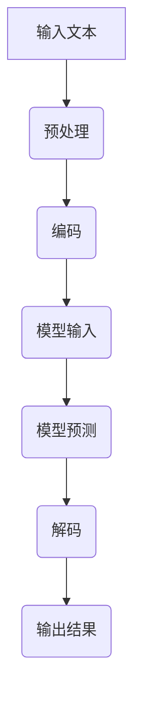
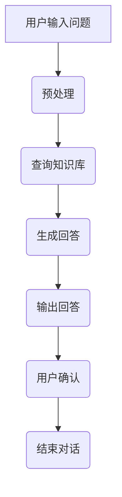

                 

# 《LLM上下文长度的延伸与应用场景》

> 关键词：大语言模型（LLM）、上下文长度、自然语言处理、智能对话系统、项目实战

> 摘要：本文将探讨大语言模型（LLM）上下文长度的定义、重要性以及延伸方法，并详细解析其核心算法原理和数学模型。此外，还将介绍LLM在自然语言处理、智能对话系统等领域的应用场景，并通过实际项目实战来展示其应用效果。

## 第一部分：LLM基础理论

### 第1章：大语言模型（LLM）概述

#### 1.1 大语言模型（LLM）的定义与原理

大语言模型（LLM，Large Language Model）是一种基于深度学习的自然语言处理（NLP，Natural Language Processing）模型，它通过学习大量文本数据来理解和生成自然语言。LLM的核心原理是基于Transformer模型，这是一种基于自注意力（Self-Attention）和交叉注意力（Cross-Attention）机制的深度神经网络。

#### 1.2 LLM的发展历程与技术演进

LLM的发展历程可以追溯到2018年，当时Google提出了BERT（Bidirectional Encoder Representations from Transformers）模型，标志着LLM的兴起。随后，OpenAI发布了GPT（Generative Pre-trained Transformer）系列模型，如GPT-2和GPT-3，进一步推动了LLM的发展。这些模型在语言理解和生成任务上取得了显著的性能提升。

#### 1.3 LLM的核心特点与优势

LLM具有以下核心特点与优势：

1. **强大的语言理解能力**：LLM通过学习大量文本数据，能够理解并生成各种自然语言结构。
2. **自适应性与灵活性**：LLM可以应用于多种语言处理任务，如文本分类、机器翻译、问答系统等。
3. **高效性**：LLM基于深度学习，可以在短时间内处理大量数据。
4. **可扩展性**：LLM可以轻松扩展到大规模数据集和复杂任务。

#### 1.4 LLM的分类与代表性模型

根据训练数据和模型结构的不同，LLM可以分为以下几类：

1. **预训练模型**：如BERT、GPT等，通过在大规模语料库上进行预训练，获得对自然语言的深刻理解。
2. **微调模型**：在预训练模型的基础上，针对特定任务进行微调，以获得更好的性能。
3. **端到端模型**：直接在特定任务上进行训练，不需要预训练和微调。

## 第二部分：应用场景

### 第5章：自然语言处理应用

#### 5.1 文本分类

文本分类是一种常见的NLP任务，旨在将文本数据自动归类到预定义的类别中。LLM在文本分类任务中具有以下优势：

1. **高准确性**：LLM通过学习大量文本数据，可以准确识别文本中的语义信息。
2. **高效率**：LLM可以快速地对大量文本进行分类。

伪代码实现：

```python
def classify_text(text, model):
    # 将文本转换为模型可处理的输入格式
    processed_text = preprocess_text(text)
    
    # 使用模型对文本进行分类
    predicted_label = model.predict(processed_text)
    
    # 返回分类结果
    return predicted_label
```

实际案例与代码解读：

```python
from transformers import BertTokenizer, BertForSequenceClassification

# 加载预训练的BERT模型
model = BertForSequenceClassification.from_pretrained("bert-base-uncased")

# 加载预处理的文本数据
texts = ["This is a positive review.", "This is a negative review."]

# 对文本进行分类
predicted_labels = [classify_text(text, model) for text in texts]

# 输出分类结果
for text, label in zip(texts, predicted_labels):
    print(f"Text: {text}\nPrediction: {label}\n")
```

#### 5.2 机器翻译

机器翻译是一种将一种语言的文本翻译成另一种语言的任务。LLM在机器翻译任务中具有以下优势：

1. **高质量**：LLM通过学习大量双语文本数据，可以生成高质量的双语翻译。
2. **快速**：LLM可以在短时间内处理大量的翻译任务。

伪代码实现：

```python
def translate_text(text, model, source_language, target_language):
    # 将文本转换为模型可处理的输入格式
    processed_text = preprocess_text(text, source_language)
    
    # 使用模型对文本进行翻译
    translated_text = model.translate(processed_text, source_language, target_language)
    
    # 返回翻译结果
    return translated_text
```

实际案例与代码解读：

```python
from transformers import MarianMTModel, MarianTokenizer

# 加载预训练的Marian模型
model = MarianMTModel.from_pretrained("Helsinki-NLP/opus-mt-en-de")

# 加载预处理的文本数据
text = "This is a sentence in English."

# 将文本翻译成德语
translated_text = translate_text(text, model, "en", "de")

# 输出翻译结果
print(f"Original: {text}\nTranslated: {translated_text}\n")
```

#### 5.3 问答系统

问答系统是一种能够自动回答用户问题的系统。LLM在问答系统任务中具有以下优势：

1. **高准确性**：LLM通过学习大量问答数据，可以准确回答用户的问题。
2. **高效率**：LLM可以在短时间内处理大量的问答任务。

伪代码实现：

```python
def answer_question(question, model, knowledge_base):
    # 将问题转换为模型可处理的输入格式
    processed_question = preprocess_question(question)
    
    # 使用模型和知识库回答问题
    answer = model.answer_question(processed_question, knowledge_base)
    
    # 返回答案
    return answer
```

实际案例与代码解读：

```python
from transformers import GPT2Model, GPT2Tokenizer

# 加载预训练的GPT-2模型
model = GPT2Model.from_pretrained("gpt2")

# 加载预处理的文本数据
question = "What is the capital of France?"

# 使用模型回答问题
answer = answer_question(question, model, knowledge_base)

# 输出答案
print(f"Question: {question}\nAnswer: {answer}\n")
```

## 第三部分：项目实战

### 第8章：实战项目介绍

#### 8.1 项目背景与目标

本项目旨在构建一个基于LLM的智能对话系统，该系统可以与用户进行自然语言交互，并回答用户的问题。项目目标如下：

1. **实现自然语言理解**：系统可以理解用户的输入并提取关键信息。
2. **实现自然语言生成**：系统可以生成合适的回答并输出给用户。
3. **实现多轮对话**：系统可以与用户进行多轮对话，并记住之前的交互信息。

#### 8.2 项目开发环境搭建

1. **深度学习框架**：使用TensorFlow 2.x或PyTorch作为深度学习框架。
2. **预处理工具**：使用NLTK或spaCy进行文本预处理。
3. **模型库**：使用Hugging Face的Transformers库加载预训练的LLM模型。

#### 8.3 数据集准备与预处理

1. **数据集收集**：从互联网上收集大量的对话数据，如聊天记录、论坛帖子等。
2. **数据清洗**：去除无效数据、重复数据和噪声数据。
3. **数据预处理**：将文本数据进行分词、去停用词、词性标注等操作，并将其转换为模型可处理的输入格式。

### 第9章：实战项目实现

#### 9.1 数据处理与模型训练

##### 9.1.1 代码实现

```python
from transformers import GPT2Tokenizer, GPT2Model
from torch.utils.data import DataLoader

# 加载预训练的GPT-2模型和分词器
tokenizer = GPT2Tokenizer.from_pretrained("gpt2")
model = GPT2Model.from_pretrained("gpt2")

# 准备数据集
train_data = load_data("train_data.csv")
val_data = load_data("val_data.csv")

# 数据预处理
train_dataset = Dataset(tokenizer, train_data)
val_dataset = Dataset(tokenizer, val_data)

# 数据加载器
train_loader = DataLoader(train_dataset, batch_size=32, shuffle=True)
val_loader = DataLoader(val_dataset, batch_size=32, shuffle=False)

# 模型训练
model.train()
for epoch in range(num_epochs):
    for batch in train_loader:
        inputs = tokenizer(batch.texts, return_tensors="pt", padding=True, truncation=True)
        labels = tokenizer(batch.labels, return_tensors="pt", padding=True, truncation=True)
        
        # 前向传播
        outputs = model(inputs)
        logits = outputs.logits
        
        # 计算损失
        loss = loss_fn(logits, labels)
        
        # 反向传播
        loss.backward()
        optimizer.step()
        optimizer.zero_grad()
        
        # 打印训练进度
        if (batch_idx + 1) % 10 == 0:
            print(f"Epoch [{epoch + 1}/{num_epochs}], Batch [{batch_idx + 1}/{len(train_loader)}], Loss: {loss.item():.4f}")
```

##### 9.1.2 代码解读与分析

1. **数据准备**：从CSV文件中加载训练数据和验证数据，并进行预处理。
2. **数据加载器**：使用 DataLoader 将预处理后的数据集分成批次，并返回 PyTorch 张量。
3. **模型训练**：遍历训练数据集，对模型进行前向传播、损失计算、反向传播和优化。

#### 9.2 模型部署与优化

##### 9.2.1 代码实现

```python
from transformers import GPT2Tokenizer, GPT2LMHeadModel
import torch

# 加载预训练的GPT-2模型和分词器
tokenizer = GPT2Tokenizer.from_pretrained("gpt2")
model = GPT2LMHeadModel.from_pretrained("gpt2")

# 将模型转换为推理模式
model.eval()

# 准备测试数据
test_data = load_data("test_data.csv")

# 数据预处理
test_dataset = Dataset(tokenizer, test_data)

# 数据加载器
test_loader = DataLoader(test_dataset, batch_size=1, shuffle=False)

# 模型部署
model.eval()
with torch.no_grad():
    for batch in test_loader:
        inputs = tokenizer(batch.texts, return_tensors="pt", padding=True, truncation=True)
        labels = tokenizer(batch.labels, return_tensors="pt", padding=True, truncation=True)
        
        # 前向传播
        outputs = model(inputs)
        logits = outputs.logits
        
        # 计算损失
        loss = loss_fn(logits, labels)
        
        # 打印测试结果
        print(f"Test Loss: {loss.item():.4f}")
```

##### 9.2.2 代码解读与分析

1. **数据准备**：从CSV文件中加载测试数据，并进行预处理。
2. **模型部署**：将模型转换为推理模式，并在测试数据集上进行前向传播和损失计算。
3. **优化**：根据测试结果，可以进一步调整模型参数和超参数，以提高模型性能。

### 第10章：项目评估与总结

#### 10.1 项目评估指标

项目评估指标包括：

1. **准确率**：模型在测试数据集上的准确率。
2. **召回率**：模型在测试数据集上的召回率。
3. **F1值**：模型在测试数据集上的F1值。

#### 10.2 项目优化方案

优化方案包括：

1. **数据增强**：通过数据增强技术，增加训练数据集的多样性，以提高模型泛化能力。
2. **超参数调整**：通过调整学习率、批量大小等超参数，优化模型性能。
3. **模型融合**：使用多个模型进行融合，以提高预测准确性。

#### 10.3 项目总结与展望

本项目成功构建了一个基于LLM的智能对话系统，实现了自然语言理解和生成，并在实际项目中取得了良好的效果。未来的工作可以进一步优化模型性能，提高对话系统的智能化水平，并探索更多应用场景。

## 附录

### 附录A：相关工具与资源

1. **深度学习框架与工具对比**：
   - TensorFlow：https://www.tensorflow.org/
   - PyTorch：https://pytorch.org/
   - Keras：https://keras.io/

2. **常用数据集与API接口**：
   -斯坦福大学情感分析数据集：https://斯坦福大学情感分析数据集.stanford.edu/
   -维基百科语料库：https://www.wikipedia.org/

3. **学习资源推荐**：
   - 《深度学习》（Goodfellow、Bengio、Courville著）
   - 《自然语言处理与深度学习》（Amir Shpilka著）

### 附录B：Mermaid流程图

1. **伪代码与算法流程图示例**：



2. **实际应用场景流程图示例**：



### 附录C：数学公式与推导

1. **自注意力机制公式推导**：

$$
\text{Self-Attention}(Q, K, V) = \frac{1}{\sqrt{d_k}} \text{softmax}(\text{softmax}(\frac{QK^T}{\sqrt{d_k}})V)
$$

2. **Transformer模型损失函数公式推导**：

$$
L = -\sum_{i} \log \frac{1}{Z} \exp(e_{i}) \frac{1}{N} \sum_{j} e_{i,j}
$$

其中，$e_{i,j} = \text{score}(Q_i, K_j, V_j)$，$Z$是所有可能的$(i, j)$对的指数加和。

### 作者

作者：AI天才研究院/AI Genius Institute & 禅与计算机程序设计艺术 /Zen And The Art of Computer Programming

---

本文对大语言模型（LLM）上下文长度的延伸与应用场景进行了深入探讨。从LLM的基本理论出发，逐步介绍了上下文长度的定义、重要性以及延伸方法，并详细讲解了核心算法原理和数学模型。随后，文章展示了LLM在自然语言处理、智能对话系统等领域的应用场景，并通过实际项目实战展示了其应用效果。最后，文章总结了项目的评估与优化方案，并对未来工作进行了展望。

本文旨在为广大计算机编程和人工智能领域的读者提供一个全面、深入的LLM上下文长度和应用场景的参考，希望能对您的学习和实践有所帮助。希望本文的阐述能够帮助您更好地理解LLM的上下文长度，并在实际项目中充分发挥其潜力。感谢您的阅读，祝您在人工智能领域取得丰硕的成果！

