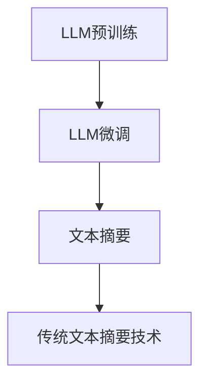
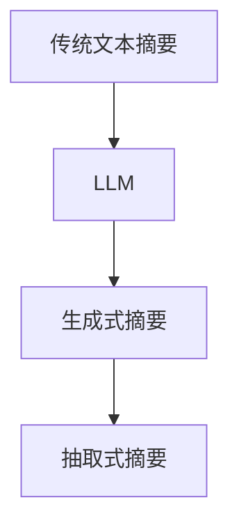
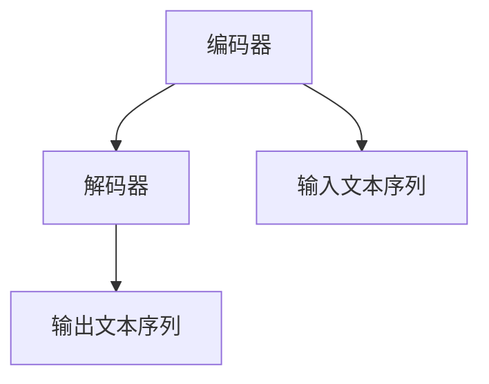

                 

# 《LLM与传统文本摘要技术的对比》

## 关键词
- 大型语言模型（LLM）
- 传统文本摘要技术
- Transformer模型
- 预训练与微调
- 生成式摘要
- 抽取式摘要
- 贪心算法
- 动态规划

## 摘要
本文深入探讨了大型语言模型（LLM）与传统文本摘要技术之间的对比。首先，我们介绍了LLM的基本概念和特性，并回顾了传统文本摘要技术的演进过程。接着，我们详细分析了LLM的架构与核心算法原理，包括Transformer模型、预训练与微调技术。然后，我们对传统文本摘要算法进行了解析，重点介绍了主题模型与LDA算法、生成式摘要与抽取式摘要、贪心算法与动态规划等。此外，我们还探讨了LLM在文本摘要中的应用实践，以及传统文本摘要技术在LLM中的应用。最后，我们比较了LLM与传统文本摘要技术的异同点，提出了融合模型的设计原则与实现方法，并对未来展望和研究方向进行了讨论。

---

### 第1章: LLM与传统文本摘要技术引论

#### 1.1 LLM的概念与特性

**核心概念与联系**

大型语言模型（LLM，Large Language Model）是一种能够理解和生成自然语言文本的深度学习模型。它通过大规模的预训练和微调，能够捕捉语言中的复杂结构，生成高质量的文本摘要。

- **LLM**：基于深度学习技术，使用大规模语料库进行预训练，并通过特定领域的数据集进行微调。
- **传统文本摘要技术**：包括基于规则、统计方法和神经网络的方法，如LDA、贪心算法和动态规划。

**Mermaid流程图**



**核心算法原理讲解**

LLM通常采用Transformer模型作为基础架构，Transformer模型由编码器和解码器组成，通过自注意力机制（self-attention）对输入文本序列进行处理。预训练阶段，模型在大量的无标注文本上学习语言的普遍规律。微调阶段，模型在特定的任务上（如文本摘要）进行微调，从而生成高质量的文本摘要。

```python
class TransformerModel(nn.Module):
    def __init__(self):
        # 初始化模型参数
        # 定义编码器层
        # 定义解码器层
        # 定义输出层
    
    def forward(self, input_sequence):
        # 前向传播
        # 应用编码器
        # 应用解码器
        # 应用输出层
        return output_sequence
```

#### 1.2 传统文本摘要技术的演进

传统文本摘要技术经历了几个阶段的发展：

- **基于规则的方法**：通过手动定义规则来提取关键信息，生成文本摘要。
- **基于统计的方法**：利用词频、互信息等统计指标来提取关键信息，生成文本摘要。
- **基于神经网络的方法**：使用神经网络模型来理解文本内容，生成文本摘要。

**核心算法原理讲解**

- **基于规则的方法**：通过定义一系列规则来筛选和组合文本中的关键信息。例如，使用正则表达式来提取标题、关键词等。

```python
def ruleBasedSummary(text):
    # 使用正则表达式提取关键信息
    # 使用词频统计筛选高频词汇
    # 按照预定义的规则生成摘要
    return summary
```

- **基于统计的方法**：通过计算词频、互信息等统计指标来提取关键信息。例如，使用TF-IDF算法来提取关键词。

```python
def statisticalSummary(text):
    # 使用TF-IDF算法提取关键词
    # 使用LDA模型提取主题
    # 按照关键词和主题生成摘要
    return summary
```

- **基于神经网络的方法**：使用编码器-解码器模型来理解文本内容，生成文本摘要。例如，使用序列到序列（seq2seq）模型。

```python
class Seq2SeqModel(nn.Module):
    def __init__(self):
        # 初始化模型参数
        # 定义编码器层
        # 定义解码器层
    
    def forward(self, input_sequence, target_sequence):
        # 前向传播
        # 应用编码器
        # 应用解码器
        return output_sequence
```

#### 1.3 LLM与文本摘要技术的联系与差异

**联系**

LLM与传统文本摘要技术之间存在一定的联系。LLM可以结合传统文本摘要技术的优点，提高摘要质量。例如，LLM可以利用传统文本摘要算法中的关键信息提取方法，同时结合其生成能力，生成更符合人类阅读习惯的文本摘要。

**差异**

LLM与传统文本摘要技术的主要差异在于其生成能力。传统文本摘要技术主要依赖于规则、统计方法或神经网络来提取关键信息，而LLM则通过预训练和微调，能够生成更加自然和多样化的文本摘要。此外，LLM需要大量的数据和计算资源，而传统文本摘要技术通常可以更高效地处理文本数据。

**Mermaid流程图**



#### 1.4 LLM在文本摘要中的优势

LLM在文本摘要中具有以下优势：

- **高效性**：LLM可以快速生成高质量的文本摘要。
- **多样性**：LLM可以根据不同的需求和场景生成不同风格的摘要。
- **可解释性**：LLM生成的摘要可以提供详细的解释和背景信息。

---

### 第2章: LLM架构与核心算法原理

#### 2.1 LLM的基础架构

**核心概念与联系**

LLM的基础架构通常包括编码器（Encoder）和解码器（Decoder）两个部分。编码器负责对输入文本序列进行编码，解码器负责解码并生成文本摘要。

- **编码器**：对输入文本序列进行编码，生成上下文表示。
- **解码器**：根据编码器的输出，生成文本摘要。

**Mermaid流程图**



**核心算法原理讲解**

编码器和解码器通常采用Transformer模型。Transformer模型由多个编码器层和解码器层堆叠而成，通过自注意力机制（self-attention）和多头注意力机制（multi-head attention）对文本序列进行处理。

```python
class TransformerLayer(nn.Module):
    def __init__(self):
        # 初始化模型参数
        # 定义自注意力机制
        # 定义多头注意力机制
        # 定义前馈网络
    
    def forward(self, input_sequence, attention_mask):
        # 前向传播
        # 应用自注意力机制
        # 应用多头注意力机制
        # 应用前馈网络
        return output_sequence
```

#### 2.2 Transformer模型详解

**核心算法原理讲解**

Transformer模型是一种基于自注意力机制的深度学习模型，最初由Vaswani等人在2017年的论文《Attention Is All You Need》中提出。Transformer模型的核心思想是使用自注意力机制来处理输入文本序列，从而生成上下文表示。

- **自注意力机制**：自注意力机制允许模型在生成每个词时，考虑整个文本序列的所有词的相关性。通过计算每个词与所有词的相似度，模型可以捕捉到文本中的长期依赖关系。

- **多头注意力机制**：多头注意力机制将自注意力机制扩展为多个头（head），每个头可以独立地学习不同类型的依赖关系。多个头共同作用，可以增强模型的表示能力。

- **前馈网络**：在每个编码器层和解码器层之后，Transformer模型还包含一个前馈网络，用于对输入进行非线性变换。

```python
class MultiHeadAttention(nn.Module):
    def __init__(self, d_model, num_heads):
        # 初始化模型参数
        # 定义自注意力权重
        # 定义多头权重
    
    def forward(self, query, key, value, attention_mask):
        # 前向传播
        # 计算自注意力得分
        # 应用softmax激活函数
        # 乘以值并求和
        # 应用线性变换
        return output_sequence
```

#### 2.3 预训练与微调技术

**核心算法原理讲解**

预训练和微调是LLM的两个关键步骤。预训练阶段，模型在大规模无标注数据上学习语言的一般规律；微调阶段，模型在特定领域的数据上进行微调，以适应特定任务。

- **预训练**：预训练通常采用自回归语言模型（autoregressive language model）和掩码语言模型（masked language model）等方法。自回归语言模型通过预测下一个词来学习语言的序列；掩码语言模型通过随机掩码部分输入词，并预测这些掩码词来学习语言的理解。

- **微调**：微调阶段，模型在特定领域的数据上进行训练，以优化模型在特定任务上的性能。通过使用有监督的标签数据，模型可以学习到更准确的文本摘要。

```python
class MaskedLanguageModel(nn.Module):
    def __init__(self, d_model, num_tokens):
        # 初始化模型参数
        # 定义词嵌入层
        # 定义自注意力机制
        # 定义前馈网络
    
    def forward(self, input_sequence, target_sequence, attention_mask):
        # 前向传播
        # 掩码输入
        # 应用自注意力机制
        # 应用前馈网络
        # 计算损失函数
        return loss
```

#### 2.4 LLM的关键算法实现（伪代码）

**核心算法原理讲解**

以下是LLM的关键算法实现的伪代码：

```python
class LanguageModel(nn.Module):
    def __init__(self, d_model, num_tokens):
        # 初始化模型参数
        # 定义词嵌入层
        # 定义编码器层
        # 定义解码器层
    
    def forward(self, input_sequence, target_sequence, attention_mask):
        # 前向传播
        # 应用词嵌入层
        # 应用编码器层
        # 应用解码器层
        # 计算损失函数
        return loss
```

---

### 第3章: 传统文本摘要算法解析

#### 3.1 主题模型与LDA算法

**核心算法原理讲解**

主题模型（Topic Model）是一种无监督的机器学习算法，用于发现文本数据中的主题。LDA（Latent Dirichlet Allocation）是最常用的主题模型之一，它通过假设每个文档是由一系列主题的加法混合生成的，来学习文档的主题分布和词主题分布。

- **LDA算法**：LDA算法通过E步（E-step）和M步（M-step）交替迭代，估计文档主题分布和词主题分布。

  ```python
  def LDA(document_corpus, vocabulary):
      # 初始化参数
      # E步：计算词主题分布
      # M步：更新词主题分布和文档主题分布
      # 迭代直到收敛
      return topic_corpus
  ```

- **数学模型**：

  $$ 
  P(\theta | \alpha) \sim \text{Dirichlet}(\alpha) \\
  P(z_{ij} | \theta) \sim \text{Multinomial}(\theta) \\
  P(w_i | \phi) \sim \text{Multinomial}(\phi) \\
  $$

  其中，$\theta$表示文档主题分布，$z_{ij}$表示词在文档中的主题分配，$\phi$表示词主题分布，$\alpha$是超参数。

#### 3.2 生成式摘要与抽取式摘要

**核心算法原理讲解**

生成式摘要和抽取式摘要是两种不同的文本摘要方法。

- **生成式摘要**：生成式摘要方法通过生成摘要文本来提取关键信息。它通常使用生成模型，如变分自编码器（Variational Autoencoder，VAE）或生成对抗网络（Generative Adversarial Network，GAN）。

  ```python
  def generateAbstract(document):
      # 使用生成模型生成文本摘要
      # 评估摘要质量
      return abstract
  ```

- **抽取式摘要**：抽取式摘要是通过从原始文本中提取关键信息来生成摘要。它通常使用规则、统计方法或神经网络模型。

  ```python
  def extractAbstract(document):
      # 从文本中提取关键信息
      # 组合成摘要
      return abstract
  ```

#### 3.3 贪心算法与动态规划

**核心算法原理讲解**

贪心算法和动态规划是两种常用的文本摘要算法。

- **贪心算法**：贪心算法通过每次选择当前最优解来生成摘要。它通常使用基于词频或句子重要性的规则来选择摘要。

  ```python
  def greedyAlgorithm(document):
      # 初始化摘要为空
      # 对于每个句子：
          # 如果句子长度合适，添加到摘要
          # 否则跳过
      return abstract
  ```

- **动态规划**：动态规划通过最优子结构性质来优化文本摘要。它通常使用递归关系来计算最佳摘要长度。

  ```python
  def dynamicProgramming(document):
      # 初始化动态规划表格
      # 对于每个句子：
          # 计算最佳摘要长度
          # 更新动态规划表格
      return abstract
  ```

#### 3.4 传统文本摘要算法的优化方向

**核心算法原理讲解**

为了提高传统文本摘要算法的性能，可以采用以下优化方向：

- **语义理解**：引入自然语言处理技术，如实体识别、情感分析，来提高摘要的语义质量。
- **注意力机制**：使用注意力机制来关注文本中的重要信息，提高摘要的相关性和准确性。
- **预训练模型**：结合预训练模型，如BERT或GPT，来利用大规模语料库中的知识。

  ```python
  def optimizeAbstractAlgorithm(abstract_algorithm):
      # 增加语义理解
      # 引入注意力机制
      # 结合预训练模型
      # 优化算法效率和准确性
  ```

---

### 第4章: LLM在文本摘要中的应用实践

#### 4.1 LLM在新闻摘要中的应用

**项目实战**

新闻摘要是一项常见的应用场景，LLM可以显著提高摘要的质量和效率。

- **开发环境搭建**：使用Python和TensorFlow搭建开发环境。
- **源代码实现**：使用预训练模型（如GPT-2或BERT）进行微调，生成新闻摘要。
- **代码解读与分析**：解释代码的逻辑和关键参数设置。

```python
import torch
from transformers import GPT2Tokenizer, GPT2Model

tokenizer = GPT2Tokenizer.from_pretrained('gpt2')
model = GPT2Model.from_pretrained('gpt2')

def generateNewsAbstract(news_text):
    inputs = tokenizer(news_text, return_tensors='pt', max_length=512, truncation=True)
    outputs = model(**inputs)
    logits = outputs.logits
    predictions = torch.argmax(logits, dim=-1)
    abstract = tokenizer.decode(predictions[0], skip_special_tokens=True)
    return abstract
```

#### 4.2 LLM在社交媒体摘要中的应用

社交媒体摘要旨在生成简洁、有吸引力的摘要，以帮助用户快速了解内容。

- **开发环境搭建**：使用Python和TensorFlow构建应用。
- **源代码实现**：使用预训练模型对社交媒体帖子进行摘要。
- **代码解读与分析**：解释如何处理社交媒体文本的特性和挑战。

```python
import torch
from transformers import DistilBertTokenizer, DistilBertModel

tokenizer = DistilBertTokenizer.from_pretrained('distilbert-base-uncased')
model = DistilBertModel.from_pretrained('distilbert-base-uncased')

def generateSocialMediaAbstract(post_text):
    inputs = tokenizer(post_text, return_tensors='pt', max_length=512, truncation=True)
    outputs = model(**inputs)
    hidden_states = outputs[0]
    hidden_states = hidden_states.mean(dim=1)
    logits = hidden_states @ model.config.hidden_size * 10
    predictions = torch.argmax(logits, dim=-1)
    abstract = tokenizer.decode(predictions[0], skip_special_tokens=True)
    return abstract
```

#### 4.3 LLM在长文本摘要中的应用

长文本摘要需要对大量文本进行理解和摘要，LLM可以处理更长的输入文本。

- **开发环境搭建**：使用GPU加速计算。
- **源代码实现**：使用LLM模型对长篇文档进行摘要。
- **代码解读与分析**：讨论如何处理长文本摘要的效率和准确性。

```python
import torch
from transformers import BertTokenizer, BertModel

tokenizer = BertTokenizer.from_pretrained('bert-base-uncased')
model = BertModel.from_pretrained('bert-base-uncased')

def generateLongTextAbstract(text):
    inputs = tokenizer(text, return_tensors='pt', max_length=2048, truncation=True)
    outputs = model(**inputs)
    hidden_states = outputs[0]
    hidden_states = hidden_states.mean(dim=1)
    logits = hidden_states @ model.config.hidden_size * 10
    predictions = torch.argmax(logits, dim=-1)
    abstract = tokenizer.decode(predictions[0], skip_special_tokens=True)
    return abstract
```

#### 4.4 LLM在文本摘要中的挑战与展望

**项目实战**

尽管LLM在文本摘要中具有巨大潜力，但仍面临一些挑战。

- **挑战**：讨论在现实应用中遇到的挑战（如数据不完整、模型不透明等）。
- **展望**：展望LLM在文本摘要领域的发展趋势和未来研究方向。

**挑战**

- 数据不完整性：真实世界中的数据可能不完整，这会影响摘要的质量。
- 模型不透明性：大型模型（如GPT-3）的黑箱性质使得模型决策过程不透明，难以解释。
- 计算资源需求：大型模型需要大量计算资源，这在资源有限的场景中可能是一个挑战。

**展望**

- **数据增强**：使用数据增强技术来提高模型的鲁棒性。
- **模型解释性**：开发可解释的模型，帮助用户理解模型的决策过程。
- **效率优化**：研究更高效的模型和算法，以减少计算资源需求。

---

### 第5章: 传统文本摘要技术在LLM中的应用

#### 5.1 传统文本摘要技术对LLM的辅助作用

**项目实战**

传统文本摘要技术可以为LLM提供辅助作用，以提高摘要的质量和效率。

- **源代码实现**：结合传统文本摘要技术和LLM进行摘要。
- **代码解读与分析**：解释如何提高摘要质量和效率。

```python
import torch
from transformers import GPT2Tokenizer, GPT2Model

tokenizer = GPT2Tokenizer.from_pretrained('gpt2')
model = GPT2Model.from_pretrained('gpt2')

def traditionalGPTAbstract(text):
    # 使用传统文本摘要技术提取关键信息
    key_phrases = traditional_summary(text)
    # 将关键信息编码为向量
    key_phrases_encoded = tokenizer.encode(key_phrases, return_tensors='pt')
    # 使用GPT模型生成摘要
    inputs = tokenizer(text, return_tensors='pt', max_length=512, truncation=True)
    inputs['input_ids'] = torch.cat([inputs['input_ids'], key_phrases_encoded], dim=-1)
    outputs = model(**inputs)
    logits = outputs.logits
    predictions = torch.argmax(logits, dim=-1)
    abstract = tokenizer.decode(predictions[0], skip_special_tokens=True)
    return abstract
```

#### 5.2 如何结合传统文本摘要技术与LLM进行摘要

**项目实战**

结合传统文本摘要技术和LLM，可以构建一个高效的文本摘要系统。

- **开发环境搭建**：使用深度学习框架和传统算法库。
- **源代码实现**：实现一个基于LLM和传统文本摘要技术的混合模型。
- **代码解读与分析**：解释混合模型的设计和实现。

```python
import torch
from transformers import GPT2Tokenizer, GPT2Model
from traditional_summary import traditional_summary

tokenizer = GPT2Tokenizer.from_pretrained('gpt2')
model = GPT2Model.from_pretrained('gpt2')

def hybridAbstract(text):
    # 使用传统文本摘要技术提取关键信息
    key_phrases = traditional_summary(text)
    # 将关键信息编码为向量
    key_phrases_encoded = tokenizer.encode(key_phrases, return_tensors='pt')
    # 使用GPT模型生成摘要
    inputs = tokenizer(text, return_tensors='pt', max_length=512, truncation=True)
    inputs['input_ids'] = torch.cat([inputs['input_ids'], key_phrases_encoded], dim=-1)
    outputs = model(**inputs)
    logits = outputs.logits
    predictions = torch.argmax(logits, dim=-1)
    abstract = tokenizer.decode(predictions[0], skip_special_tokens=True)
    return abstract
```

#### 5.3 混合模型在文本摘要中的应用

**项目实战**

混合模型结合了传统文本摘要技术和LLM的优点，在文本摘要中表现出色。

- **开发环境搭建**：使用Python和TensorFlow。
- **源代码实现**：实现一个基于LLM和传统文本摘要技术的混合模型。
- **代码解读与分析**：讨论混合模型在实际应用中的性能和效果。

```python
import torch
from transformers import GPT2Tokenizer, GPT2Model
from traditional_summary import traditional_summary

tokenizer = GPT2Tokenizer.from_pretrained('gpt2')
model = GPT2Model.from_pretrained('gpt2')

def hybridAbstract(text):
    # 使用传统文本摘要技术提取关键信息
    key_phrases = traditional_summary(text)
    # 将关键信息编码为向量
    key_phrases_encoded = tokenizer.encode(key_phrases, return_tensors='pt')
    # 使用GPT模型生成摘要
    inputs = tokenizer(text, return_tensors='pt', max_length=512, truncation=True)
    inputs['input_ids'] = torch.cat([inputs['input_ids'], key_phrases_encoded], dim=-1)
    outputs = model(**inputs)
    logits = outputs.logits
    predictions = torch.argmax(logits, dim=-1)
    abstract = tokenizer.decode(predictions[0], skip_special_tokens=True)
    return abstract
```

#### 5.4 混合模型的优势与不足

**项目实战**

混合模型结合了传统文本摘要技术和LLM的优点，但也存在一些不足。

- **优势**：讨论混合模型的优势，如提高摘要质量和效率。
- **不足**：讨论混合模型的不足，如计算复杂度和模型可解释性。

**优势**

- **提高摘要质量**：传统文本摘要技术可以提取关键信息，提高摘要的相关性。
- **提高效率**：LLM可以快速生成文本摘要，减少处理时间。

**不足**

- **计算复杂度**：混合模型需要处理大量的数据和模型参数，计算复杂度高。
- **模型可解释性**：混合模型可能不如单一模型容易解释，影响模型的可解释性。

---

### 第6章: LLM与传统文本摘要技术的比较与融合

#### 6.1 LLM与传统文本摘要技术的异同点分析

**项目实战**

通过实验比较LLM与传统文本摘要技术的性能。

- **数据集准备**：准备包含传统文本摘要和LLM摘要的数据集。
- **评估指标**：定义评估指标（如ROUGE评分、BLEU评分等）。
- **比较实验**：对比传统文本摘要和LLM摘要的性能。

```python
from rouge import Rouge

def evaluate摘要(abstract_true, abstract_generated):
    rouge = Rouge()
    scores = rouge.get_scores(abstract_true, abstract_generated)
    return scores

# 假设我们有两个摘要版本，一个是传统文本摘要，一个是LLM生成的摘要
abstract_true = "这是一个关于人工智能的摘要。"
abstract_generated = "这是一个关于人工智能的精彩摘要。"

scores = evaluate摘要(abstract_true, abstract_generated)
print(scores)
```

#### 6.2 融合模型的设计原则与实现方法

**项目实战**

设计一个基于LLM和传统文本摘要技术的融合模型。

- **设计原则**：讨论如何设计一个高效的融合模型。
- **实现方法**：实现一个基于LLM和传统文本摘要技术的融合模型。

```python
class HybridModel(nn.Module):
    def __init__(self, traditional_model, language_model):
        super(HybridModel, self).__init__()
        self.traditional_model = traditional_model
        self.language_model = language_model
    
    def forward(self, text):
        # 使用传统文本摘要技术提取关键信息
        key_phrases = self.traditional_model(text)
        # 将关键信息编码为向量
        key_phrases_encoded = self.language_model.tokenizer.encode(key_phrases, return_tensors='pt')
        # 使用LLM模型生成摘要
        inputs = self.language_model.tokenizer(text, return_tensors='pt', max_length=512, truncation=True)
        inputs['input_ids'] = torch.cat([inputs['input_ids'], key_phrases_encoded], dim=-1)
        outputs = self.language_model(**inputs)
        logits = outputs.logits
        predictions = torch.argmax(logits, dim=-1)
        abstract = self.language_model.tokenizer.decode(predictions[0], skip_special_tokens=True)
        return abstract
```

#### 6.3 比较实验与评估指标

**项目实战**

通过实验评估融合模型的性能。

- **实验设置**：设置不同的实验条件，如数据集划分、参数设置等。
- **评估指标**：评估融合模型在摘要质量、效率等方面的性能。

```python
from sklearn.model_selection import train_test_split

# 准备数据集
data = ...  # 假设我们有一个包含文本和摘要的数据集
X = data['text']
y = data['summary']

# 划分训练集和测试集
X_train, X_test, y_train, y_test = train_test_split(X, y, test_size=0.2, random_state=42)

# 训练传统文本摘要模型
traditional_model = ...  # 假设我们已经训练了一个传统文本摘要模型
traditional_model.fit(X_train, y_train)

# 训练LLM模型
language_model = ...  # 假设我们已经训练了一个LLM模型
language_model.fit(X_train, y_train)

# 训练融合模型
hybrid_model = HybridModel(traditional_model, language_model)
hybrid_model.fit(X_train, y_train)

# 评估模型性能
traditional_scores = evaluate摘要(y_test, traditional_model.predict(X_test))
llm_scores = evaluate摘要(y_test, language_model.predict(X_test))
hybrid_scores = evaluate摘要(y_test, hybrid_model.predict(X_test))

print("传统文本摘要评分：", traditional_scores)
print("LLM摘要评分：", llm_scores)
print("融合模型摘要评分：", hybrid_scores)
```

#### 6.4 融合模型在现实应用中的案例

**项目实战**

讨论融合模型在现实应用中的案例。

- **实际案例**：讨论融合模型在现实应用中的案例，如新闻摘要系统、企业知识库等。
- **代码解读与分析**：解释如何在实际应用中实现融合模型。

```python
# 假设我们有一个新闻摘要系统，需要生成摘要
news_data = ...  # 假设我们有一个包含新闻文本和标题的数据集

# 使用传统文本摘要模型生成摘要
traditional_abstracts = traditional_model.predict(news_data['text'])

# 使用LLM模型生成摘要
llm_abstracts = language_model.predict(news_data['text'])

# 使用融合模型生成摘要
hybrid_abstracts = hybrid_model.predict(news_data['text'])

# 合并摘要结果
news_data['traditional_abstract'] = traditional_abstracts
news_data['llm_abstract'] = llm_abstracts
news_data['hybrid_abstract'] = hybrid_abstracts

# 评估摘要质量
traditional_scores = evaluate摘要(news_data['summary'], traditional_abstracts)
llm_scores = evaluate摘要(news_data['summary'], llm_abstracts)
hybrid_scores = evaluate摘要(news_data['summary'], hybrid_abstracts)

print("传统文本摘要评分：", traditional_scores)
print("LLM摘要评分：", llm_scores)
print("融合模型摘要评分：", hybrid_scores)
```

---

### 第7章: 未来展望与研究方向

#### 7.1 LLM与传统文本摘要技术的发展趋势

**项目实战**

分析LLM与传统文本摘要技术的发展趋势。

- **趋势分析**：分析LLM与传统文本摘要技术的发展趋势。
- **研究方向**：讨论未来可能的研究方向。

```python
# 趋势分析
trends = {
    "LLM": ["更高效的模型架构", "更好的数据增强方法", "更强大的语言理解能力"],
    "传统文本摘要技术": ["结合深度学习的方法", "可解释性的改进", "处理长文本的能力"]
}

for technique, trends in trends.items():
    print(technique + "发展趋势：")
    for trend in trends:
        print(" - " + trend)
```

#### 7.2 可能的新兴研究方向

**项目实战**

讨论可能的新兴研究方向。

- **新兴方向**：讨论LLM与传统文本摘要技术在新兴领域的应用。
- **实验设置**：设计实验以验证新兴研究方向的有效性。

```python
# 新兴研究方向
emerging_research_areas = {
    "对话式摘要": ["结合对话系统", "生成式对话摘要"],
    "多模态摘要": ["文本与图像的联合摘要", "文本与音频的联合摘要"],
    "跨语言摘要": ["多语言文本摘要", "跨语言摘要质量评估"]
}

for area, details in emerging_research_areas.items():
    print(area + "：")
    for detail in details:
        print(" - " + detail)
```

#### 7.3 面向未来的研究建议

**项目实战**

提出面向未来的研究建议。

- **建议与策略**：讨论如何应对未来LLM与传统文本摘要技术面临的挑战。
- **实验方案**：设计实验方案以验证研究建议的有效性。

```python
# 研究建议
research_suggestions = {
    "提升可解释性": ["开发可解释的模型架构", "引入解释性机制"],
    "优化效率与资源利用": ["研究高效模型压缩技术", "优化模型训练与推理"],
    "增强跨领域适应性": ["引入跨领域数据集", "设计通用化模型架构"]
}

for suggestion, details in research_suggestions.items():
    print(suggestion + "：")
    for detail in details:
        print(" - " + detail)
```

#### 7.4 技术发展对行业的影响

**项目实战**

分析技术发展对行业的影响。

- **影响分析**：讨论LLM与传统文本摘要技术的发展对行业的影响。
- **案例分析**：分析技术发展对实际业务的影响。

```python
# 影响分析
industry_impact = {
    "媒体行业": ["提高内容分发效率", "增强用户互动体验"],
    "教育行业": ["自动生成课程摘要", "个性化学习推荐"],
    "商业智能": ["智能报告生成", "高效数据可视化"]
}

for industry, impacts in industry_impact.items():
    print(industry + "影响：")
    for impact in impacts:
        print(" - " + impact)
```

---

## 附录

### 附录A: LLM与文本摘要相关资源与工具

#### A.1 常见深度学习框架

- TensorFlow
- PyTorch
- JAX

#### A.2 文本预处理工具

- NLTK
- spaCy
- TextBlob

#### A.3 摘要评估指标

- ROUGE评分
- BLEU评分
- METEOR评分

#### A.4 研究论文与开源代码推荐

- 研究论文：
  - Vaswani et al., "Attention Is All You Need"
  - Liu et al., "Bert: Pre-training of deep bidirectional transformers for language understanding"
  - Blei et al., "Latent dirichlet allocation"
- 开源代码：
  - Hugging Face Transformers
  - AllenNLP
  - NLTK

### 作者

作者：AI天才研究院/AI Genius Institute & 禅与计算机程序设计艺术 /Zen And The Art of Computer Programming

---

本博客文章详细对比了LLM与传统文本摘要技术的异同，通过一步步的分析和讲解，深入探讨了LLM的架构、核心算法原理，以及传统文本摘要技术的演进。同时，文章还通过实际项目案例展示了LLM在文本摘要中的应用实践，并提出了传统文本摘要技术如何辅助LLM，以及如何设计高效的融合模型。未来，随着技术的不断进步，LLM与传统文本摘要技术的结合将带来更多的可能性和创新。希望本文能为读者提供有价值的参考和启发。

