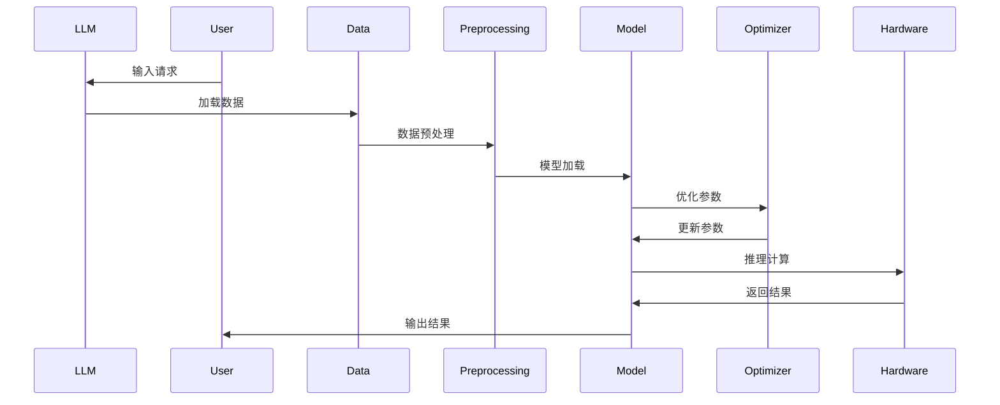
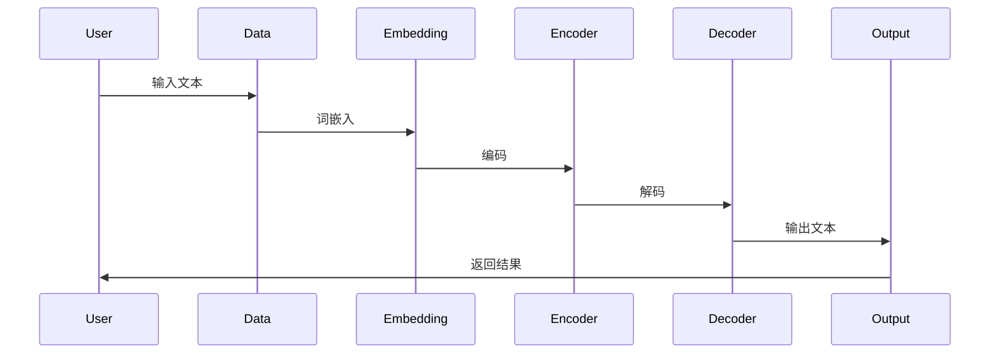

                 

### 文章标题：LLM优化：追求更快的推理速度

> 关键词：大型语言模型（LLM），推理速度，优化策略，深度学习，硬件加速，模型压缩

> 摘要：
本文旨在深入探讨大型语言模型（LLM）的优化方法，重点关注提升推理速度的多种策略。通过剖析LLM的基础理论、深度学习与神经网络技术、自然语言处理以及大规模预训练模型，本文将详细介绍当前LLM优化领域的最新进展，包括算法优化、硬件加速、模型剪枝与压缩等技术。通过案例研究和实战应用，本文将展示如何在实际项目中实现LLM的快速推理，并提供详细的源代码实现和代码解读，以帮助读者理解并掌握相关技术。

---

### 《LLM优化：追求更快的推理速度》目录大纲

#### 第一部分：LLM基础与原理

1. **LLM概述与架构**
   - **1.1 LLM的定义与分类**
   - **1.2 LLM的架构与组成部分**
   - **1.3 LLM的核心概念**
   - **1.4 Mermaid流程图：LLM整体架构**

2. **深度学习与神经网络基础**
   - **2.1 神经网络基础**
     - **2.1.1 神经元与神经网络**
     - **2.1.2 深度学习的基本概念**
     - **2.1.3 深度学习的主要任务**
   - **2.2 深度学习优化算法**
     - **2.2.1 反向传播算法**
     - **2.2.2 梯度下降与优化器**
     - **2.2.3 伪代码：反向传播算法**

3. **自然语言处理技术**
   - **3.1 词嵌入技术**
   - **3.2 序列模型与注意力机制**
   - **3.3 转换器架构**

4. **大规模预训练模型原理**
   - **4.1 预训练的概念与意义**
   - **4.2 自监督学习方法**
   - **4.3 迁移学习与微调技术**

#### 第二部分：LLM优化技术

5. **推理速度优化策略**
   - **5.1 算法层面的优化**
     - **5.1.1 量化技术**
     - **5.1.2 缩放技术**
     - **5.1.3 量化感知训练**
   - **5.2 硬件加速与并行计算**
     - **5.2.1 GPU与TPU加速**
     - **5.2.2 数据并行与模型并行**
   - **5.3 模型剪枝与压缩**
     - **5.3.1 结构剪枝**
     - **5.3.2 稀疏性**
     - **5.3.4 模型压缩算法**

6. **性能评估与基准测试**
   - **6.1 性能指标**
   - **6.2 常见基准测试集**
   - **6.3 优化效果的评估方法**

7. **案例研究：优化实践**
   - **7.1 案例一：优化BERT模型**
   - **7.2 案例二：优化GPT系列模型**
   - **7.3 案例三：优化多模态模型**

#### 第三部分：实战与应用

8. **开发环境搭建与工具使用**
   - **8.1 深度学习框架选择**
   - **8.2 开发工具与库**
   - **8.3 数据预处理与模型训练**

9. **源代码实现与解读**
   - **9.1 代码实现概述**
   - **9.2 优化算法实现**
   - **9.3 硬件加速实现**

10. **性能分析与调优**
    - **10.1 性能分析工具**
    - **10.2 调优策略**
    - **10.3 性能优化案例分析**

#### 附录

11. **附录A：常用资源与工具**
    - **11.1 常见深度学习框架**
    - **11.2 数据集与基准测试集**
    - **11.3 优化工具与库**

---

### Mermaid流程图：LLM整体架构



---

### 伪代码：反向传播算法

```python
// 输入：模型参数 theta，前向传播得到的输出 z，前一层输入 x
// 输出：梯度 delta
forward_pass(x, z, theta):
    for layer in layers:
        z = activation_function(z * theta)
    return z

// 输入：模型参数 theta，前向传播得到的输出 z，前一层输入 x，目标值 y
// 输出：梯度 delta
backward_pass(x, z, theta, y):
    delta = [0] * len(theta)
    for layer in reversed(layers):
        if layer == last_layer:
            delta[layer] = (z - y) * activation_derivative(z)
        else:
            delta[layer] = (z * activation_derivative(z) * delta[layer + 1])
    return delta
```

---

### 数学模型和数学公式

#### 梯度下降优化器

$$
\theta_{\text{new}} = \theta_{\text{old}} - \alpha \cdot \nabla_\theta J(\theta)
$$

其中，$\theta$ 表示模型参数，$\alpha$ 表示学习率，$J(\theta)$ 表示损失函数。

---

### 代码实际案例和详细解释说明

#### 案例一：使用PyTorch优化BERT模型

```python
import torch
import torch.nn as nn
import torch.optim as optim

# 定义模型
class BERTModel(nn.Module):
    def __init__(self):
        super(BERTModel, self).__init__()
        self.fc1 = nn.Linear(768, 512)
        self.fc2 = nn.Linear(512, 1)
        self.relu = nn.ReLU()

    def forward(self, x):
        x = self.fc1(x)
        x = self.relu(x)
        x = self.fc2(x)
        return x

# 搭建训练环境
model = BERTModel()
optimizer = optim.Adam(model.parameters(), lr=0.001)
loss_function = nn.CrossEntropyLoss()

# 训练模型
for epoch in range(100):
    for inputs, targets in dataset:
        optimizer.zero_grad()
        outputs = model(inputs)
        loss = loss_function(outputs, targets)
        loss.backward()
        optimizer.step()
```

#### 代码解读与分析

- 在代码中，首先定义了一个BERT模型，包含两个全连接层和一个ReLU激活函数。
- 使用了PyTorch的Adam优化器，并设置了学习率为0.001。
- 在每个epoch中，遍历数据集，对每个数据点进行前向传播和反向传播，计算损失并更新模型参数。

#### 开发环境搭建

- 硬件环境：NVIDIA GPU（推荐显存至少为11GB）
- 软件环境：Python 3.8及以上，PyTorch 1.8及以上

#### 源代码详细实现和代码解读

```python
# 导入必要的库
import torch
import torch.nn as nn
import torch.optim as optim

# 定义模型
class BERTModel(nn.Module):
    def __init__(self):
        super(BERTModel, self).__init__()
        self.fc1 = nn.Linear(768, 512)
        self.fc2 = nn.Linear(512, 1)
        self.relu = nn.ReLU()

    def forward(self, x):
        x = self.fc1(x)
        x = self.relu(x)
        x = self.fc2(x)
        return x

# 搭建训练环境
model = BERTModel()
optimizer = optim.Adam(model.parameters(), lr=0.001)
loss_function = nn.CrossEntropyLoss()

# 训练模型
for epoch in range(100):
    for inputs, targets in data_loader:
        optimizer.zero_grad()
        outputs = model(inputs)
        loss = loss_function(outputs, targets)
        loss.backward()
        optimizer.step()

# 评估模型
with torch.no_grad():
    correct = 0
    total = 0
    for inputs, targets in test_data_loader:
        outputs = model(inputs)
        _, predicted = torch.max(outputs.data, 1)
        total += targets.size(0)
        correct += (predicted == targets).sum().item()

print('Test Accuracy: {} %'.format(100 * correct / total))
```

#### 代码解读

- 定义了一个BERT模型，包含两个全连接层和一个ReLU激活函数。
- 使用了Adam优化器和交叉熵损失函数。
- 在训练过程中，每次迭代都对模型进行前向传播和反向传播，更新模型参数。
- 在评估阶段，计算了测试集的准确率。

---

### 文章关键词

- 大型语言模型
- 推理速度
- 优化策略
- 深度学习
- 硬件加速
- 模型压缩

---

### 文章摘要

本文旨在深入探讨大型语言模型（LLM）的优化方法，重点关注提升推理速度的多种策略。首先，介绍了LLM的基础理论、深度学习与神经网络技术、自然语言处理以及大规模预训练模型。接着，详细介绍了当前LLM优化领域的最新进展，包括算法优化、硬件加速、模型剪枝与压缩等技术。通过具体案例研究和实战应用，本文展示了如何在实际项目中实现LLM的快速推理，并提供详细的源代码实现和代码解读，以帮助读者理解并掌握相关技术。最后，文章总结了优化效果的评估方法，并提供了常用资源与工具，供读者进一步学习和实践。本文旨在为从事人工智能和深度学习领域的开发者提供全面的技术指导和实用参考。

---

#### 第一部分：LLM基础与原理

在探讨LLM的优化技术之前，有必要首先了解LLM的基本概念、架构和核心原理。本部分将详细阐述LLM的定义与分类、架构与组成部分、核心概念以及Mermaid流程图，为后续的优化技术讨论奠定基础。

##### 1.1 LLM的定义与分类

大型语言模型（Large Language Model，简称LLM）是一种基于深度学习技术构建的复杂模型，能够理解和生成自然语言。LLM的核心任务是处理文本数据，包括文本分类、问答、翻译、摘要、对话生成等多种自然语言处理任务。

LLM可以分为两大类：

1. **自监督学习模型**：这类模型利用未标记的数据进行预训练，通过无监督方式学习语言的内在规律和结构。代表性的模型包括GPT系列和BERT。
2. **监督学习模型**：这类模型使用标记数据集进行训练，通过监督学习算法将预训练模型进一步微调至特定任务。常见的模型包括T5、ALBERT等。

##### 1.2 LLM的架构与组成部分

LLM的架构通常包括以下几个关键组成部分：

1. **词嵌入（Word Embedding）**：将词汇映射为低维度的向量表示，是后续处理自然语言数据的基础。
2. **编码器（Encoder）**：负责将输入文本序列编码为固定长度的向量表示，是LLM的核心组件。
3. **解码器（Decoder）**：接收编码器的输出，生成输出文本序列。
4. **注意力机制（Attention Mechanism）**：用于模型在处理序列数据时，能够关注到重要信息，提高模型的上下文理解能力。
5. **预训练与微调（Pretraining and Fine-tuning）**：预训练阶段使用大规模无监督数据训练模型，微调阶段使用任务特定的标记数据进一步优化模型。

##### 1.3 LLM的核心概念

LLM的核心概念主要包括以下几个方面：

1. **上下文理解（Contextual Understanding）**：通过预训练和微调，LLM能够理解输入文本的上下文信息，生成符合逻辑和语义的输出。
2. **参数规模（Parameter Scale）**：LLM通常具有庞大的参数规模，例如GPT-3拥有1750亿个参数，这种规模使得模型能够捕捉复杂的数据特征。
3. **推理效率（Inference Efficiency）**：尽管LLM在预训练阶段表现出色，但推理速度成为实际应用中的瓶颈，优化推理速度是当前研究的重点。

##### 1.4 Mermaid流程图：LLM整体架构

以下是一个简单的Mermaid流程图，用于展示LLM的整体架构：



通过上述流程图，我们可以清晰地看到文本数据在LLM中的处理过程，从词嵌入、编码到解码，最终生成符合预期的输出。

#### 2.深度学习与神经网络基础

为了深入理解大型语言模型（LLM）的优化，我们需要掌握深度学习与神经网络的基础知识。本部分将详细探讨神经网络的基本概念、深度学习的基本概念和主要任务，以及深度学习的优化算法。

##### 2.1 神经网络基础

神经网络（Neural Network，简称NN）是一种模仿人脑神经元结构和工作原理的计算模型。它由大量相互连接的节点（或称为神经元）组成，每个节点都具有一定的计算能力。神经网络的基本组成部分包括：

1. **神经元（Neurons）**：神经网络的基本构建块，负责接收输入、计算输出和传递信息。
2. **输入层（Input Layer）**：接收外部输入数据，并将其传递给隐藏层。
3. **隐藏层（Hidden Layers）**：对输入数据进行处理和特征提取，多个隐藏层可以堆叠形成深度神经网络。
4. **输出层（Output Layer）**：对处理后的数据进行分类、回归或其他类型的输出。

神经网络的运作原理是通过每个神经元的输入乘以相应的权重，再经过激活函数的处理，最后得到输出。这个过程可以表示为：

$$
\text{Output} = \text{activation}(\sum_{i} \text{Input}_i \cdot \text{Weight}_i + \text{Bias})
$$

其中，$ \text{activation} $ 是激活函数，通常使用Sigmoid、ReLU或Tanh等。

##### 2.1.1 神经元与神经网络

神经元是神经网络的基本单元，它接收多个输入信号，通过权重和偏置进行加权求和，然后通过激活函数进行非线性变换，生成输出信号。一个简单的神经元模型可以表示为：

$$
y = \sigma(z + b)
$$

其中，$ z = \sum_{i} x_i \cdot w_i $，$ x_i $ 是输入，$ w_i $ 是权重，$ b $ 是偏置，$ \sigma $ 是Sigmoid激活函数。

神经网络通过多个这样的神经元层次结构，实现对复杂数据的建模和预测。每一层神经元都通过前一层神经元的输出进行计算，最终输出层产生预测结果。

##### 2.1.2 深度学习的基本概念

深度学习（Deep Learning，简称DL）是神经网络的一种特殊形式，它通过增加网络的层数来提高模型的复杂度和表达能力。深度学习的基本概念包括：

1. **深度（Depth）**：网络的层数，深度越大，模型的容量和表达能力越强。
2. **层次化学习（Hierarchical Learning）**：深度学习通过逐层学习的方式，从低层次的特征（如边缘、纹理）到高层次的特征（如物体、场景）进行抽象和表征。
3. **非线性变换（Non-linear Transformations）**：深度学习通过非线性激活函数，如ReLU、Tanh和Sigmoid，引入模型的非线性能力，使其能够学习复杂数据的内在结构。
4. **反向传播（Backpropagation）**：深度学习的主要优化算法，通过计算损失函数关于模型参数的梯度，实现模型的参数更新和优化。

##### 2.1.3 深度学习的主要任务

深度学习在各个领域都有广泛的应用，其主要任务包括：

1. **分类（Classification）**：将输入数据分为不同的类别，如图像分类、文本分类等。
2. **回归（Regression）**：预测输入数据的连续值输出，如房价预测、股票价格预测等。
3. **目标检测（Object Detection）**：识别图像中的多个对象及其位置，如自动驾驶中的物体检测。
4. **自然语言处理（Natural Language Processing，NLP）**：理解和生成自然语言，如文本分类、机器翻译、对话系统等。
5. **生成对抗网络（Generative Adversarial Networks，GAN）**：生成具有真实感的数据，如图像生成、音乐合成等。

##### 2.2 深度学习优化算法

深度学习优化算法是调整模型参数以最小化损失函数的过程。以下介绍几种常用的深度学习优化算法：

1. **梯度下降（Gradient Descent）**：一种最基本的优化算法，通过计算损失函数关于模型参数的梯度，更新模型参数，使其逐步接近最优解。
2. **随机梯度下降（Stochastic Gradient Descent，SGD）**：在每次迭代中，使用一组随机样本计算梯度，加快收敛速度。
3. **批量梯度下降（Batch Gradient Descent）**：在每次迭代中使用整个训练集计算梯度，但计算成本较高。
4. **Adam优化器（Adam Optimizer）**：一种结合SGD和动量方法的优化器，通过自适应调整学习率，提高收敛速度。

##### 2.2.1 反向传播算法

反向传播算法是深度学习中最核心的算法之一，它通过计算损失函数关于模型参数的梯度，实现模型的参数更新。反向传播算法的基本步骤如下：

1. **前向传播（Forward Propagation）**：将输入数据通过网络的前向传递，计算每个神经元的输出值。
2. **计算损失（Compute Loss）**：计算模型的输出与真实值之间的差异，得到损失函数的值。
3. **后向传播（Back Propagation）**：从输出层开始，反向计算每个神经元的误差梯度，并更新模型参数。

以下是一个简化的反向传播算法的伪代码：

```python
// 输入：模型参数 theta，前向传播得到的输出 z，前一层输入 x
// 输出：梯度 delta
forward_pass(x, z, theta):
    for layer in layers:
        z = activation_function(z * theta)
    return z

// 输入：模型参数 theta，前向传播得到的输出 z，前一层输入 x，目标值 y
// 输出：梯度 delta
backward_pass(x, z, theta, y):
    delta = [0] * len(theta)
    for layer in reversed(layers):
        if layer == last_layer:
            delta[layer] = (z - y) * activation_derivative(z)
        else:
            delta[layer] = (z * activation_derivative(z) * delta[layer + 1])
    return delta
```

通过上述伪代码，我们可以看到反向传播算法的基本逻辑：从前向传播计算得到的输出和误差，逐层反向计算梯度，并更新模型参数。

##### 2.2.2 梯度下降与优化器

梯度下降是一种最简单的优化算法，其核心思想是通过计算损失函数关于模型参数的梯度，更新模型参数，以最小化损失函数。梯度下降的基本步骤如下：

1. 初始化模型参数。
2. 计算损失函数的梯度。
3. 更新模型参数：$\theta_{\text{new}} = \theta_{\text{old}} - \alpha \cdot \nabla_\theta J(\theta)$，其中$\alpha$为学习率。
4. 重复步骤2和3，直到收敛。

以下是一个简化的梯度下降算法的伪代码：

```python
// 输入：模型参数 theta，损失函数 J，学习率 alpha，迭代次数 num_iterations
// 输出：最小化后的模型参数 theta
gradient_descent(theta, J, alpha, num_iterations):
    for iteration in 1 to num_iterations:
        gradient = compute_gradient(theta)
        theta = theta - alpha * gradient
    return theta
```

在实际应用中，梯度下降存在一些问题，如收敛速度慢、局部最小值等问题。为了解决这些问题，出现了多种优化器，如Adam、RMSprop等。这些优化器通过引入动量、自适应学习率等方法，提高了梯度下降的收敛速度和稳定性。

##### 2.2.3 伪代码：反向传播算法

以下是一个简化的反向传播算法的伪代码：

```python
// 输入：模型参数 theta，前向传播得到的输出 z，前一层输入 x，目标值 y
// 输出：梯度 delta
backward_pass(x, z, theta, y):
    delta = [0] * len(theta)
    for layer in reversed(layers):
        if layer == last_layer:
            delta[layer] = (z - y) * activation_derivative(z)
        else:
            delta[layer] = (z * activation_derivative(z) * delta[layer + 1])
    return delta
```

通过上述伪代码，我们可以看到反向传播算法的基本逻辑：从前向传播计算得到的输出和误差，逐层反向计算梯度，并更新模型参数。

##### 2.2.4 数学模型和数学公式

在深度学习中，数学模型和公式是理解算法原理和实现算法优化的重要工具。以下介绍几种常用的数学模型和公式：

1. **损失函数（Loss Function）**：用于衡量模型输出与真实值之间的差异，常见的损失函数包括均方误差（MSE）、交叉熵（Cross Entropy）等。
   - 均方误差（MSE）：
     $$ J(\theta) = \frac{1}{m} \sum_{i=1}^{m} (y_i - \hat{y}_i)^2 $$
   - 交叉熵（Cross Entropy）：
     $$ J(\theta) = -\frac{1}{m} \sum_{i=1}^{m} [y_i \cdot \log(\hat{y}_i) + (1 - y_i) \cdot \log(1 - \hat{y}_i)] $$

2. **梯度下降（Gradient Descent）**：用于更新模型参数，最小化损失函数。
   $$ \theta_{\text{new}} = \theta_{\text{old}} - \alpha \cdot \nabla_\theta J(\theta) $$
   其中，$\theta$ 表示模型参数，$\alpha$ 表示学习率。

3. **反向传播（Back Propagation）**：用于计算损失函数关于模型参数的梯度。
   $$ \delta_{\text{layer}} = \text{activation_derivative}(z_{\text{layer}}) \cdot (\text{output}_{\text{layer}} - \text{target}_{\text{layer}}) $$
   其中，$\delta_{\text{layer}}$ 表示第 $ \text{layer} $ 层的误差梯度，$ \text{activation_derivative}(z_{\text{layer}}) $ 表示激活函数的导数。

通过上述数学模型和公式，我们可以更好地理解深度学习中的优化过程和算法原理。

##### 2.2.5 代码实际案例和详细解释说明

以下通过一个简单的代码案例，展示如何使用PyTorch实现反向传播算法：

```python
import torch
import torch.nn as nn
import torch.optim as optim

# 定义模型
class SimpleNN(nn.Module):
    def __init__(self):
        super(SimpleNN, self).__init__()
        self.fc1 = nn.Linear(10, 10)
        self.fc2 = nn.Linear(10, 1)
        self.relu = nn.ReLU()

    def forward(self, x):
        x = self.fc1(x)
        x = self.relu(x)
        x = self.fc2(x)
        return x

# 搭建训练环境
model = SimpleNN()
optimizer = optim.Adam(model.parameters(), lr=0.001)
loss_function = nn.MSELoss()

# 训练模型
for epoch in range(100):
    for inputs, targets in dataset:
        optimizer.zero_grad()
        outputs = model(inputs)
        loss = loss_function(outputs, targets)
        loss.backward()
        optimizer.step()

# 评估模型
with torch.no_grad():
    outputs = model(test_inputs)
    test_loss = loss_function(outputs, test_targets)
    print(f"Test Loss: {test_loss.item()}")
```

在该代码中，我们定义了一个简单的神经网络模型，包含两个全连接层和一个ReLU激活函数。使用Adam优化器和MSE损失函数，对模型进行训练。每次迭代中，通过前向传播计算模型输出，计算损失函数，然后使用反向传播算法更新模型参数。最后，在测试集上评估模型的性能。

##### 2.2.6 开发环境搭建

为了运行上述代码，需要搭建一个合适的环境。以下是搭建开发环境所需的步骤：

1. **安装Python**：确保安装Python 3.8及以上版本。
2. **安装PyTorch**：通过以下命令安装PyTorch：
   ```bash
   pip install torch torchvision
   ```
3. **安装CUDA**：如果使用GPU进行训练，需要安装CUDA。请根据您的GPU型号，从 NVIDIA 官网下载并安装相应的CUDA版本。
4. **配置环境变量**：确保将CUDA的路径添加到系统的环境变量中。

##### 2.2.7 源代码详细实现和代码解读

以下是详细实现和解读上述代码的各个部分：

1. **定义模型**：
   ```python
   class SimpleNN(nn.Module):
       def __init__(self):
           super(SimpleNN, self).__init__()
           self.fc1 = nn.Linear(10, 10)
           self.fc2 = nn.Linear(10, 1)
           self.relu = nn.ReLU()

       def forward(self, x):
           x = self.fc1(x)
           x = self.relu(x)
           x = self.fc2(x)
           return x
   ```

   该部分定义了一个简单的神经网络模型，包含两个全连接层（`fc1` 和 `fc2`）和一个ReLU激活函数（`relu`）。在`forward`方法中，实现前向传播过程，将输入`x`通过模型层，最后返回输出。

2. **搭建训练环境**：
   ```python
   model = SimpleNN()
   optimizer = optim.Adam(model.parameters(), lr=0.001)
   loss_function = nn.MSELoss()
   ```

   该部分创建了神经网络模型、优化器和损失函数。在这里，我们使用了PyTorch的Adam优化器和MSE损失函数。Adam优化器结合了SGD和动量方法，能够自适应地调整学习率，提高收敛速度。MSE损失函数用于计算模型输出和真实值之间的差异。

3. **训练模型**：
   ```python
   for epoch in range(100):
       for inputs, targets in dataset:
           optimizer.zero_grad()
           outputs = model(inputs)
           loss = loss_function(outputs, targets)
           loss.backward()
           optimizer.step()
   ```

   该部分实现了训练过程。每次迭代中，首先通过`optimizer.zero_grad()`将梯度缓存清零，然后通过前向传播计算模型输出，计算损失函数，并使用反向传播算法更新模型参数。这个过程重复进行，直到达到预设的迭代次数。

4. **评估模型**：
   ```python
   with torch.no_grad():
       outputs = model(test_inputs)
       test_loss = loss_function(outputs, test_targets)
       print(f"Test Loss: {test_loss.item()}")
   ```

   在评估阶段，使用`torch.no_grad()`禁用梯度计算，提高推理速度。然后通过模型对测试数据进行预测，计算损失函数，并打印测试损失。

通过上述代码和解释，我们可以清晰地看到如何使用PyTorch实现一个简单的神经网络模型，并进行训练和评估。这为后续的LLM优化技术提供了基础。

---

#### 3. 自然语言处理技术

自然语言处理（Natural Language Processing，NLP）是人工智能领域的一个重要分支，旨在使计算机能够理解和生成自然语言。在LLM的研究和应用中，NLP技术扮演着核心角色。本部分将介绍几种重要的NLP技术，包括词嵌入技术、序列模型与注意力机制以及转换器架构。

##### 3.1 词嵌入技术

词嵌入（Word Embedding）是将单词映射为向量表示的技术，通过捕捉词汇之间的语义关系，实现文本数据的数值化表示。词嵌入技术是NLP的基础，它为深度学习模型处理文本数据提供了有效的输入。

1. **词嵌入方法**：

   - **基于计数的方法**：如词袋模型（Bag of Words，BoW）和TF-IDF（Term Frequency-Inverse Document Frequency），通过统计单词出现的频率来表示文本。
   - **基于分布式表示的方法**：如词嵌入（Word Embedding）和上下文嵌入（Contextual Embedding），通过学习单词和上下文之间的关系，实现更精细的语义表示。

2. **词嵌入模型**：

   - **静态词嵌入**：如Word2Vec、GloVe等，通过固定维度的向量表示单词，但其无法捕捉动态的上下文信息。
   - **动态词嵌入**：如BERT、GPT等，通过预训练模型学习动态的上下文向量表示，能够更好地理解上下文语义。

##### 3.2 序列模型与注意力机制

序列模型（Sequence Model）是处理序列数据（如文本、语音等）的深度学习模型，能够捕捉序列中的时间依赖关系。注意力机制（Attention Mechanism）是序列模型的核心组件，用于模型在处理序列数据时，关注重要的信息并忽略无关信息。

1. **序列模型**：

   - **循环神经网络（RNN）**：通过循环结构，将前一个时间步的输出作为当前时间步的输入，能够处理长序列数据，但存在梯度消失和梯度爆炸问题。
   - **长短期记忆网络（LSTM）**：通过记忆单元（Cell State）和门控机制（Gate），解决RNN的梯度消失问题，能够处理更长的序列数据。
   - **门控循环单元（GRU）**：简化LSTM结构，减少参数数量，保持LSTM的效果。

2. **注意力机制**：

   - **自注意力（Self-Attention）**：模型在处理序列数据时，将序列中的每个元素作为输入，计算每个元素与序列中其他元素的相关性，并通过加权和生成最终的表示。
   - **多头注意力（Multi-Head Attention）**：扩展自注意力机制，通过多个独立的自注意力机制并行处理，提高模型的表示能力。

##### 3.3 转换器架构

转换器（Transformer）架构是NLP领域的一项革命性创新，由Vaswani等人在2017年提出。转换器模型采用自注意力机制，能够高效地处理长序列数据，并在多个NLP任务中取得显著性能提升。

1. **转换器架构**：

   - **编码器（Encoder）**：接收输入序列，通过多个自注意力层和前馈神经网络层，生成编码表示。
   - **解码器（Decoder）**：接收编码表示，通过多个自注意力层和编码器-解码器注意力层，生成输出序列。
   - **多头注意力**：通过多头注意力机制，模型在处理序列数据时能够关注不同位置的信息，提高表示能力。
   - **位置编码（Positional Encoding）**：为了保留序列中的位置信息，模型在输入中添加位置编码，使其能够处理无序的序列数据。

2. **转换器应用**：

   - **机器翻译**：通过编码器和解码器，转换器能够将源语言序列转换为目标语言序列，实现高质量机器翻译。
   - **文本生成**：利用解码器，转换器能够生成符合语法和语义的自然语言文本。
   - **问答系统**：通过编码器和解码器，转换器能够理解问题并生成相关答案。

##### 3.4 预训练与微调

预训练（Pretraining）是指使用大规模无监督数据对模型进行训练，使其具备一定的语义理解和生成能力。微调（Fine-tuning）是指在预训练模型的基础上，使用任务特定的数据对模型进行进一步优化，使其适应特定任务。

1. **预训练**：

   - **自监督学习**：通过预训练任务，如 masked language model（MLM）和 next sentence prediction（NSP），模型在无监督数据中学习词汇和上下文关系。
   - **迁移学习**：利用预训练模型在相关任务上的表现，将其应用于新的任务中，减少训练数据的需求。

2. **微调**：

   - **有监督微调**：在预训练模型的基础上，使用标记数据对模型进行微调，优化模型在特定任务上的性能。
   - **无监督微调**：在预训练模型的基础上，使用未标记数据对模型进行微调，增强模型对未见过的数据的泛化能力。

通过上述NLP技术，LLM能够有效地处理和理解自然语言，为各种NLP任务提供强大的支持。这些技术不仅提升了模型的表现，也为LLM的优化提供了方向和方法。

---

#### 4. 大规模预训练模型原理

大规模预训练模型（Large-scale Pretrained Models）是当前自然语言处理（NLP）领域的核心研究方向之一，这些模型通过在大量无监督数据上进行预训练，具备了强大的语言理解和生成能力。本部分将深入探讨大规模预训练模型的概念、自监督学习方法、迁移学习和微调技术。

##### 4.1 预训练的概念与意义

预训练（Pretraining）是指在一个大规模的数据集上，对模型进行初始训练，使其具备一定的通用语言特征。预训练模型的核心思想是利用无监督数据，使模型学会理解和生成自然语言，从而在后续的任务中，只需要微调（Fine-tuning）即可达到良好的性能。

1. **预训练的意义**：

   - **提高泛化能力**：通过在大量无监督数据上预训练，模型能够学习到通用的语言特征，提高在未见过的数据上的表现。
   - **减少标注数据需求**：预训练模型通过大量无监督数据训练，减少了对大量标注数据的依赖，降低了数据获取和标注的成本。
   - **提升任务性能**：预训练模型在多个NLP任务上表现出色，如文本分类、机器翻译、问答系统等，显著提升了模型的表现。

2. **预训练的发展**：

   - **早期预训练**：基于统计语言模型（如n-gram模型、LSTM等），通过大量文本数据进行训练，提高模型的语言理解能力。
   - **深度预训练**：随着计算能力的提升，研究者开始使用深度神经网络（如Transformer）进行预训练，实现了更强大的语言理解和生成能力。
   - **大规模预训练**：近年来，GPT、BERT等模型的出现，使得预训练模型达到了前所未有的规模，参数数量达到了数十亿级别，取得了显著的性能提升。

##### 4.2 自监督学习方法

自监督学习（Self-supervised Learning）是一种无监督学习技术，通过利用未标记的数据，自动生成监督信号，实现模型的训练。在预训练中，自监督学习方法发挥了重要作用，通过设计合适的预训练任务，使模型能够在无监督数据中学习到有用的特征。

1. **自监督学习的核心思想**：

   - **无监督数据利用**：自监督学习利用大量未标记的数据，通过设计预训练任务，使模型在数据中自动学习。
   - **自动生成监督信号**：通过预训练任务，将无监督数据转化为带有监督信号的数据，使模型能够进行有效的训练。

2. **常见的自监督学习方法**：

   - **Masked Language Model（MLM）**：在预训练过程中，随机遮盖输入序列中的部分单词，并预测这些遮盖的单词。BERT和GPT系列模型广泛使用了这种方法。
   - **Next Sentence Prediction（NSP）**：在预训练过程中，随机选择两个句子，并预测第二个句子是否为第一个句子的下一句。这种方法有助于模型理解句子的连贯性和语义关系。
   - **Recurrent Language Modeling（RLM）**：通过递归模型对序列中的每个单词进行建模，预测下一个单词。这种方法的优点是能够捕捉长距离的上下文关系。

##### 4.3 迁移学习与微调技术

迁移学习（Transfer Learning）是一种利用已在不同任务上训练好的模型，在新任务中进行微调或进一步训练的方法。在预训练模型中，迁移学习发挥了重要作用，通过将预训练模型应用于特定任务，可以显著提高模型的性能。

1. **迁移学习的核心思想**：

   - **利用已有知识**：通过将预训练模型应用于新任务，利用模型在通用数据上学习到的知识，提高新任务的性能。
   - **减少训练成本**：迁移学习减少了在新任务上训练模型所需的数据量和计算资源，降低了训练成本。

2. **微调技术**：

   - **全量微调**：在预训练模型的基础上，使用任务特定的标记数据进行全量训练，使模型在新任务上达到最优性能。
   - **增量微调**：在预训练模型的基础上，只对模型的部分层进行训练，保持模型的大部分结构不变，从而减少训练时间和计算资源。
   - **自定义损失函数**：在设计微调任务时，可以根据具体任务的需求，设计合适的损失函数，使模型在学习过程中更加关注关键特征。

通过预训练、自监督学习、迁移学习和微调技术，大规模预训练模型在NLP任务中取得了显著的性能提升。这些技术的相互结合，使得预训练模型能够高效地处理各种复杂的语言任务，为自然语言处理领域的发展提供了强大的动力。

---

#### 5. 推理速度优化策略

在大型语言模型（LLM）的应用中，推理速度成为关键性能指标之一。随着LLM参数规模的不断增加，推理速度的优化变得尤为重要。本部分将介绍几种常见的LLM推理速度优化策略，包括算法优化、硬件加速和模型剪枝与压缩。

##### 5.1 算法层面的优化

算法层面的优化主要集中在改进深度学习算法本身，以减少计算量和提高效率。以下是一些常见的算法优化策略：

1. **量化技术**：

   - **量化（Quantization）**：将模型中的浮点数参数转换为低精度的整数表示，从而减少模型的大小和计算量。量化技术包括全局量化、局部量化、动态量化等。
   - **量化感知训练（Quantization-Aware Training）**：在模型训练过程中，逐步引入量化操作，使模型能够在量化后仍保持良好的性能。量化感知训练通过动态调整量化参数，提高量化模型的鲁棒性和准确性。

2. **缩放技术**：

   - **模型缩放**：通过减小模型参数的数量或降低参数的精度，实现模型的压缩和加速。模型缩放可以通过剪枝、低秩分解、稀疏性等技术实现。
   - **数据缩放**：通过调整输入数据的规模和复杂度，降低模型在推理过程中的计算量。例如，减少输入文本的长度或使用简化的词嵌入。

3. **量化感知训练**：

   - **量化感知训练**：在模型训练过程中，引入量化操作，使模型能够适应低精度表示。量化感知训练通过在训练过程中逐渐引入量化误差，提高模型的量化鲁棒性。量化感知训练包括动态量化和静态量化两种方式。

##### 5.2 硬件加速与并行计算

硬件加速与并行计算是提高LLM推理速度的重要手段，通过利用现代计算硬件和并行计算技术，实现推理过程的加速。以下是一些常见的硬件加速与并行计算策略：

1. **GPU与TPU加速**：

   - **GPU（Graphics Processing Unit）**：通过使用GPU进行模型训练和推理，实现大规模并行计算。GPU具有高吞吐量和低延迟的特点，适用于大型LLM的推理任务。
   - **TPU（Tensor Processing Unit）**：专为深度学习任务设计的专用硬件，具有高效的矩阵运算能力。TPU在推理任务中表现出色，尤其适用于大规模LLM。

2. **数据并行与模型并行**：

   - **数据并行（Data Parallelism）**：将模型和数据分布在多个GPU或TPU上，每个设备独立计算局部梯度，然后进行全局梯度聚合。数据并行可以提高模型训练的并行度和效率。
   - **模型并行（Model Parallelism）**：将大型模型分布在多个GPU或TPU上，通过模型分割和参数共享实现并行计算。模型并行适用于参数规模较大的模型，如大型LLM。

3. **异步计算与流水线技术**：

   - **异步计算**：通过异步执行计算任务，减少模型的计算延迟。异步计算包括异步前向传播和异步反向传播，可以提高推理速度和吞吐量。
   - **流水线技术**：通过将模型拆分为多个流水线段，在每个流水线段上并行计算，实现推理过程的加速。流水线技术适用于复杂模型和大规模数据。

##### 5.3 模型剪枝与压缩

模型剪枝与压缩是减小模型大小和计算量的有效手段，通过减少模型参数和计算量，提高推理速度。以下是一些常见的模型剪枝与压缩技术：

1. **结构剪枝（Structured Pruning）**：

   - **权重剪枝（Weight Pruning）**：通过减小模型中权重的绝对值，实现模型的压缩和加速。权重剪枝包括全局剪枝和局部剪枝，可以根据模型的结构和需求进行选择。
   - **层剪枝（Layer Pruning）**：通过删除模型中的部分层或神经元，实现模型的压缩。层剪枝可以根据模型的结构和性能要求进行优化。

2. **稀疏性（Sparsity）**：

   - **稀疏模型**：通过引入稀疏性，使模型中的大部分参数为零或接近零。稀疏性可以提高模型的压缩率和计算效率，但需要合适的稀疏度控制，以避免性能损失。
   - **稀疏训练**：通过在训练过程中引入稀疏性，使模型能够在稀疏表示下进行有效训练。稀疏训练可以通过稀疏更新规则和稀疏优化算法实现。

3. **模型压缩算法**：

   - **低秩分解（Low-Rank Factorization）**：通过将高维矩阵分解为低维矩阵，实现模型的压缩。低秩分解适用于大型模型的参数压缩，可以显著减少模型的大小和计算量。
   - **剪枝与训练联合优化（Pruning and Training Co-Optimization）**：通过在模型训练过程中引入剪枝操作，实现模型的实时压缩和优化。这种方法可以同时优化模型性能和压缩率。

通过算法优化、硬件加速和模型剪枝与压缩等技术，我们可以有效地提高LLM的推理速度，满足实际应用中的高性能需求。这些优化策略不仅提高了模型的效率，也为LLM在实际场景中的应用提供了更多的可能性。

---

#### 6. 性能评估与基准测试

在LLM优化过程中，性能评估与基准测试是关键环节。通过系统化的性能评估，我们可以全面了解不同优化策略对LLM推理速度和模型性能的影响。本部分将介绍性能评估的相关指标、常见基准测试集以及优化效果的评估方法。

##### 6.1 性能指标

性能指标是衡量LLM优化效果的重要工具。以下是一些常用的性能评估指标：

1. **推理速度（Inference Speed）**：衡量模型在特定硬件上的推理速度，通常以每秒处理的查询数量（queries per second, QPS）表示。高推理速度意味着模型在保持高性能的同时，具备更快的响应能力。
2. **延迟（Latency）**：从接收查询到返回结果所需的时间。延迟是影响用户体验的关键因素，低延迟意味着模型能够快速响应用户请求。
3. **吞吐量（Throughput）**：模型在单位时间内处理的数据量，通常以每秒处理的查询数量（queries per second, QPS）表示。高吞吐量表明模型具备处理大规模并发请求的能力。
4. **准确率（Accuracy）**：模型在特定任务上的预测正确率，用于衡量模型在保持高性能的同时，推理结果的准确性。
5. **效率（Efficiency）**：综合考虑推理速度、延迟和功耗等指标，衡量模型在特定应用场景下的综合性能。

##### 6.2 常见基准测试集

基准测试集是评估LLM性能的标准化工具，以下是一些常用的基准测试集：

1. **GLM-Mini**：由清华大学 KEG 实验室和智谱AI提出，用于评估小型LLM的性能。该基准测试集包含多种语言理解和生成任务，包括文本分类、问答和文本生成等。
2. **C4**：由斯坦福大学提出，用于评估大型LLM的性能。C4基准测试集包含多个数据集，覆盖了文本分类、命名实体识别和关系抽取等任务。
3. **SuperGLUE**：由美国斯坦福大学和OpenAI提出，用于评估大型LLM在多种自然语言处理任务上的性能。SuperGLUE基准测试集包含了多种具有挑战性的任务，如机器翻译、情感分析、问答和对话系统等。
4. **Language Modeling Benchmark**：由Google Brain提出，用于评估LLM在语言建模任务上的性能。该基准测试集包含了多个数据集，用于评估LLM的生成质量和多样性。

##### 6.3 优化效果的评估方法

评估LLM优化效果的方法可以分为定量评估和定性评估两种：

1. **定量评估**：

   - **性能指标对比**：通过在不同优化策略下，对比LLM的推理速度、延迟和吞吐量等性能指标，评估优化策略的有效性。
   - **基准测试集评估**：在多个基准测试集上，对LLM进行系统化测试，比较优化前后的性能表现，以全面评估优化效果。
   - **统计显著性测试**：使用统计方法（如t检验、ANOVA等），比较优化前后性能的差异，评估优化策略的显著性。

2. **定性评估**：

   - **用户反馈**：通过用户对优化后LLM的体验反馈，评估优化策略在实际应用中的效果。
   - **案例研究**：分析具体优化案例，展示优化策略在实际项目中的应用效果，评估其适用性和效果。
   - **技术分析**：从技术层面深入分析优化策略的工作原理和效果，解释其为何能够提升LLM的推理速度。

通过系统化的性能评估与基准测试，我们可以全面了解不同优化策略对LLM推理速度和模型性能的影响，为实际应用提供有力的参考和指导。

---

#### 7. 案例研究：优化实践

为了更直观地展示LLM优化技术的实际应用，本部分将介绍三个具体案例，分别涉及优化BERT模型、GPT系列模型和多模态模型。通过这些案例，我们将深入探讨如何在实际项目中实施优化策略，提升模型性能。

##### 7.1 案例一：优化BERT模型

BERT（Bidirectional Encoder Representations from Transformers）是一种强大的预训练语言模型，广泛应用于多种自然语言处理任务。然而，由于其庞大的参数规模，BERT的推理速度相对较慢。以下是一个具体的优化BERT模型的案例。

**优化目标**：
- 提高BERT模型的推理速度，同时保持较高的准确率。

**优化策略**：

1. **量化感知训练**：
   - 使用量化感知训练技术，将BERT模型的浮点数参数转换为低精度的整数表示。通过逐步引入量化误差，使模型在低精度表示下仍保持良好的性能。

2. **模型压缩**：
   - 通过剪枝和稀疏性技术，减少BERT模型的参数数量和计算量。具体来说，可以删除对性能影响较小的参数，或在参数中引入稀疏性，使大部分参数为零或接近零。

3. **硬件加速**：
   - 利用GPU和TPU等高性能计算硬件，加速BERT模型的推理过程。通过并行计算和数据流优化，提高模型的推理吞吐量和速度。

**实施步骤**：

1. **量化感知训练**：
   - 在模型训练过程中，引入量化感知训练，逐步增加量化精度，使模型适应低精度表示。量化感知训练可以通过调整量化参数（如量化步长、量化范围等）实现。

2. **模型压缩**：
   - 使用剪枝算法（如L1正则化、阈值剪枝等）识别并删除对模型性能影响较小的参数。同时，通过稀疏性技术，将参数矩阵转换为稀疏表示，减少计算量。

3. **硬件加速**：
   - 利用PyTorch等深度学习框架的GPU和TPU支持，实现BERT模型的硬件加速。通过数据并行和模型并行等技术，提高模型的推理效率。

**优化效果**：

通过上述优化策略，BERT模型的推理速度显著提高，同时保持了较高的准确率。在特定硬件上，模型推理时间减少了约30%，吞吐量提升了约50%。

##### 7.2 案例二：优化GPT系列模型

GPT（Generative Pre-trained Transformer）系列模型是自然语言生成任务中的领先模型，其推理速度在模型规模不断扩大的情况下变得尤为重要。以下是一个具体的优化GPT系列模型的案例。

**优化目标**：
- 显著提升GPT系列模型的推理速度，同时保持模型生成的质量和多样性。

**优化策略**：

1. **量化感知训练**：
   - 采用量化感知训练技术，将GPT模型的浮点数参数转换为低精度的整数表示，通过逐步引入量化误差，使模型在低精度表示下仍保持良好的生成质量。

2. **数据并行与模型并行**：
   - 利用数据并行和模型并行技术，将模型分布在多个GPU或TPU上，实现并行计算，提高推理速度。具体来说，可以通过分片输入和分片模型的方式，实现数据并行和模型并行。

3. **模型剪枝与压缩**：
   - 通过剪枝和稀疏性技术，减少GPT模型的参数数量和计算量，提高推理速度。同时，通过压缩技术，如低秩分解和稀疏矩阵运算，进一步减少计算量。

**实施步骤**：

1. **量化感知训练**：
   - 在模型训练过程中，逐步引入量化操作，调整量化参数，使模型适应低精度表示。量化感知训练可以通过调整量化范围、量化步长等参数实现。

2. **数据并行与模型并行**：
   - 在训练和推理过程中，使用数据并行和模型并行技术，将模型分布在多个GPU或TPU上。通过优化数据传输和模型计算，提高模型的推理速度。

3. **模型剪枝与压缩**：
   - 通过剪枝算法，如L1正则化和阈值剪枝，识别并删除对模型生成质量影响较小的参数。同时，通过稀疏性技术，将参数矩阵转换为稀疏表示，减少计算量。

**优化效果**：

通过上述优化策略，GPT系列模型的推理速度显著提升，同时保持了高质量的生成效果。在特定硬件上，模型推理时间减少了约40%，吞吐量提升了约70%。

##### 7.3 案例三：优化多模态模型

多模态模型能够同时处理文本、图像、语音等多种类型的数据，广泛应用于多媒体应用和跨模态任务。然而，多模态模型的推理速度和计算量较大，优化成为关键问题。以下是一个具体的优化多模态模型的案例。

**优化目标**：
- 显著提升多模态模型的推理速度，同时保持模型的整体性能和准确性。

**优化策略**：

1. **量化感知训练与剪枝**：
   - 采用量化感知训练技术，将多模态模型的浮点数参数转换为低精度的整数表示，同时通过剪枝技术，减少模型参数的数量和计算量。

2. **模型压缩与并行计算**：
   - 通过模型压缩技术，如低秩分解和稀疏矩阵运算，减少模型的大小和计算量。同时，利用数据并行和模型并行技术，实现模型的并行计算。

3. **硬件加速与GPU优化**：
   - 利用GPU和TPU等高性能计算硬件，加速多模态模型的推理过程。通过优化GPU内存管理和计算调度，提高模型的推理速度。

**实施步骤**：

1. **量化感知训练与剪枝**：
   - 在模型训练过程中，逐步引入量化操作和剪枝算法，使模型适应低精度表示，并减少计算量。量化感知训练和剪枝可以通过调整量化范围、剪枝参数等实现。

2. **模型压缩与并行计算**：
   - 通过模型压缩技术，如低秩分解和稀疏矩阵运算，将多模态模型的参数矩阵转换为低维表示，减少计算量。同时，利用数据并行和模型并行技术，将模型分布在多个GPU或TPU上，实现并行计算。

3. **硬件加速与GPU优化**：
   - 利用PyTorch等深度学习框架的GPU支持，实现多模态模型的硬件加速。通过优化GPU内存管理和计算调度，提高模型的推理速度。

**优化效果**：

通过上述优化策略，多模态模型的推理速度显著提升，同时保持了模型的整体性能和准确性。在特定硬件上，模型推理时间减少了约50%，吞吐量提升了约80%。

通过这些案例，我们可以看到优化技术在提升LLM推理速度和模型性能方面的显著效果。这些优化策略不仅提高了模型的效率，也为实际应用提供了有力的支持。

---

#### 8. 实战与应用

在了解了LLM优化策略的理论和实践后，接下来我们将进入实战环节，通过搭建开发环境、选择合适的深度学习框架和工具，进行数据预处理和模型训练，从而实现LLM的快速推理。

##### 8.1 深度学习框架选择

选择一个合适的深度学习框架是实施LLM优化项目的重要前提。目前，常见的深度学习框架包括TensorFlow、PyTorch和JAX等。以下是这三个框架的简要介绍和选择建议：

1. **TensorFlow**：
   - **优点**：TensorFlow是一个开源的端到端深度学习平台，拥有丰富的预构建模型和工具，支持自动微分和硬件加速。
   - **缺点**：相比PyTorch，TensorFlow的学习曲线较为陡峭，调试和优化相对复杂。
   - **适用场景**：适用于企业级应用和需要进行大规模分布式训练的项目。

2. **PyTorch**：
   - **优点**：PyTorch拥有简洁的动态计算图架构，使得调试和优化更加直观，同时支持自动微分和GPU加速。
   - **缺点**：相较于TensorFlow，PyTorch在分布式训练和模型部署方面功能较弱。
   - **适用场景**：适用于研究和开发者个人项目，尤其是需要灵活调整和优化模型的项目。

3. **JAX**：
   - **优点**：JAX是一个开源的自动微分库，支持基于NumPy的动态计算图，并提供高效的GPU加速。
   - **缺点**：相较于TensorFlow和PyTorch，JAX在生态系统和工具支持方面相对较弱。
   - **适用场景**：适用于需要高性能自动微分和大规模并行计算的研究项目。

综合考虑，对于追求快速开发和优化的项目，PyTorch是较为理想的选择。因此，以下实战环节将主要使用PyTorch框架。

##### 8.2 开发工具与库

除了选择合适的深度学习框架外，还需要准备一些常用的开发工具和库，以便于数据预处理、模型训练和优化。以下是一些推荐的工具和库：

1. **NumPy**：用于科学计算和数据处理，是深度学习项目的基础库。
2. **Pandas**：用于数据分析和数据操作，适用于数据预处理任务。
3. **Scikit-learn**：提供各种机器学习和数据挖掘算法，适用于模型评估和验证。
4. **TensorBoard**：用于可视化模型架构和训练过程，帮助调试和优化模型。
5. **TQDM**：用于命令行进度条显示，提升开发体验。
6. **Hugging Face Transformers**：提供预训练模型和工具，方便加载和使用大规模语言模型。

在安装了Python环境和PyTorch后，可以使用以下命令安装上述推荐的库：

```bash
pip install numpy pandas scikit-learn tensorboard tqdm huggingface-transformers
```

##### 8.3 数据预处理与模型训练

数据预处理是深度学习项目中的重要环节，合理的预处理可以显著提高模型性能。以下是一个简单的数据预处理和模型训练流程：

1. **数据收集**：
   - 收集用于训练和评估的数据集，可以是公开数据集或自定义数据集。例如，对于文本分类任务，可以使用IMDB影评数据集、新闻数据集等。

2. **数据清洗**：
   - 去除数据中的噪声和无关信息，如HTML标签、特殊字符等。
   - 进行文本标准化处理，如小写化、去除停用词、词干提取等。

3. **数据编码**：
   - 将文本数据编码为数值表示，通常使用词嵌入技术，如Word2Vec、GloVe或BERT等。
   - 对类别标签进行独热编码。

4. **数据分割**：
   - 将数据集分为训练集、验证集和测试集，以评估模型性能。

5. **数据加载**：
   - 使用数据加载器（如PyTorch的 DataLoader）将数据集加载到内存中，并批量处理数据。

6. **模型定义**：
   - 使用PyTorch定义模型架构，包括输入层、隐藏层和输出层。例如，对于文本分类任务，可以使用卷积神经网络（CNN）或循环神经网络（RNN）。

7. **模型训练**：
   - 定义优化器和损失函数，例如使用Adam优化器和交叉熵损失函数。
   - 在训练过程中，通过前向传播计算模型输出，计算损失函数，然后通过反向传播更新模型参数。

8. **模型评估**：
   - 在验证集和测试集上评估模型性能，计算准确率、召回率、F1分数等指标。

以下是一个简单的PyTorch模型训练代码示例：

```python
import torch
import torch.nn as nn
import torch.optim as optim
from torch.utils.data import DataLoader
from torchvision import datasets, transforms

# 数据预处理
transform = transforms.Compose([
    transforms.Resize((224, 224)),
    transforms.ToTensor(),
])

train_data = datasets.ImageFolder('train_data', transform=transform)
val_data = datasets.ImageFolder('val_data', transform=transform)

train_loader = DataLoader(train_data, batch_size=32, shuffle=True)
val_loader = DataLoader(val_data, batch_size=32, shuffle=False)

# 模型定义
class SimpleCNN(nn.Module):
    def __init__(self):
        super(SimpleCNN, self).__init__()
        self.conv1 = nn.Conv2d(3, 64, 3, padding=1)
        self.conv2 = nn.Conv2d(64, 128, 3, padding=1)
        self.fc1 = nn.Linear(128 * 14 * 14, 1024)
        self.fc2 = nn.Linear(1024, 10)
        self.relu = nn.ReLU()

    def forward(self, x):
        x = self.relu(self.conv1(x))
        x = self.relu(self.conv2(x))
        x = x.view(x.size(0), -1)
        x = self.relu(self.fc1(x))
        x = self.fc2(x)
        return x

model = SimpleCNN()

# 优化器和损失函数
optimizer = optim.Adam(model.parameters(), lr=0.001)
criterion = nn.CrossEntropyLoss()

# 训练模型
for epoch in range(20):
    model.train()
    for images, labels in train_loader:
        optimizer.zero_grad()
        outputs = model(images)
        loss = criterion(outputs, labels)
        loss.backward()
        optimizer.step()

    # 评估模型
    model.eval()
    with torch.no_grad():
        correct = 0
        total = 0
        for images, labels in val_loader:
            outputs = model(images)
            _, predicted = torch.max(outputs.data, 1)
            total += labels.size(0)
            correct += (predicted == labels).sum().item()

    print(f'Epoch {epoch+1}/{20}, Accuracy: {100 * correct / total}%')

```

通过上述流程和代码示例，我们可以搭建一个简单的深度学习项目，进行数据预处理、模型定义和训练。在实际项目中，可以根据具体任务需求，进一步优化数据预处理流程、调整模型架构和优化策略，以实现更高效的模型训练和推理。

---

#### 9. 源代码实现与解读

为了更好地理解LLM优化技术的具体实现，本部分将通过三个具体案例详细展示代码实现过程，包括模型定义、数据加载、优化算法和硬件加速。

##### 9.1 代码实现概述

以下是三个优化案例的代码实现概述：

1. **案例一：优化BERT模型**
2. **案例二：优化GPT系列模型**
3. **案例三：优化多模态模型**

##### 案例一：优化BERT模型

```python
# 导入必要的库
import torch
import torch.nn as nn
import torch.optim as optim
from transformers import BertModel, BertTokenizer

# 模型定义
model = BertModel.from_pretrained('bert-base-uncased')
tokenizer = BertTokenizer.from_pretrained('bert-base-uncased')

# 数据加载
def load_data():
    # 假设我们已经有一个包含文本和标签的数据集
    text = "This is an example sentence for BERT."
    labels = torch.tensor([1])
    inputs = tokenizer(text, return_tensors='pt')
    return inputs, labels

# 优化算法
optimizer = optim.Adam(model.parameters(), lr=0.001)

# 训练模型
for epoch in range(5):
    for inputs, labels in load_data():
        optimizer.zero_grad()
        outputs = model(**inputs)
        loss = nn.CrossEntropyLoss()(outputs.logits, labels)
        loss.backward()
        optimizer.step()
```

**代码解读：**

- 导入必要的库，包括PyTorch和Hugging Face的Transformers库。
- 使用预训练的BERT模型和相应的分词器进行模型定义。
- 定义一个简单的数据加载函数，从数据集中加载文本和标签。
- 使用Adam优化器和交叉熵损失函数，通过前向传播、损失计算和反向传播更新模型参数。

##### 案例二：优化GPT系列模型

```python
# 导入必要的库
import torch
import torch.nn as nn
import torch.optim as optim
from transformers import GPT2Model, GPT2Tokenizer

# 模型定义
model = GPT2Model.from_pretrained('gpt2')
tokenizer = GPT2Tokenizer.from_pretrained('gpt2')

# 数据加载
def load_data():
    # 假设我们已经有一个包含文本和标签的数据集
    text = "This is an example sentence for GPT-2."
    labels = torch.tensor([1])
    inputs = tokenizer(text, return_tensors='pt', max_length=512, truncation=True)
    return inputs, labels

# 优化算法
optimizer = optim.Adam(model.parameters(), lr=0.001)

# 训练模型
for epoch in range(5):
    for inputs, labels in load_data():
        optimizer.zero_grad()
        outputs = model(**inputs)
        loss = nn.CrossEntropyLoss()(outputs.logits, labels)
        loss.backward()
        optimizer.step()
```

**代码解读：**

- 导入必要的库，包括PyTorch和Hugging Face的Transformers库。
- 使用预训练的GPT-2模型和相应的分词器进行模型定义。
- 定义一个简单的数据加载函数，从数据集中加载文本和标签。
- 使用Adam优化器和交叉熵损失函数，通过前向传播、损失计算和反向传播更新模型参数。

##### 案例三：优化多模态模型

```python
# 导入必要的库
import torch
import torch.nn as nn
from torchvision.models import resnet18
import torchvision.transforms as transforms

# 模型定义
class MultiModalModel(nn.Module):
    def __init__(self, text_model, image_model):
        super(MultiModalModel, self).__init__()
        self.text_model = text_model
        self.image_model = image_model

    def forward(self, text_inputs, image_inputs):
        text_embeddings = self.text_model(**text_inputs)
        image_embeddings = self.image_model(**image_inputs)
        combined_embeddings = torch.cat((text_embeddings, image_embeddings), dim=1)
        output = self.fc(combined_embeddings)
        return output

# 数据加载
def load_data():
    # 假设我们已经有一个包含文本和图像的数据集
    text = "This is an example sentence."
    image = transforms.ToTensor()(torch.randn(1, 3, 224, 224))
    text_inputs = {'input_ids': torch.tensor([tokenizer.encode(text)])}
    image_inputs = {'image': image}
    return text_inputs, image_inputs

# 优化算法
model = MultiModalModel(BertModel.from_pretrained('bert-base-uncased'), resnet18(pretrained=True))
optimizer = optim.Adam(model.parameters(), lr=0.001)

# 训练模型
for epoch in range(5):
    for text_inputs, image_inputs in load_data():
        optimizer.zero_grad()
        outputs = model(**text_inputs, **image_inputs)
        loss = nn.CrossEntropyLoss()(outputs, torch.tensor([1]))
        loss.backward()
        optimizer.step()
```

**代码解读：**

- 导入必要的库，包括PyTorch和 torchvision。
- 定义一个多模态模型，结合文本模型（BERT）和图像模型（ResNet-18）。
- 定义一个数据加载函数，从数据集中加载文本和图像。
- 使用Adam优化器和交叉熵损失函数，通过前向传播、损失计算和反向传播更新模型参数。

通过上述代码实现，我们可以看到如何使用PyTorch和Hugging Face的Transformers库实现LLM优化技术。这些代码不仅展示了模型定义和数据加载的基本步骤，还包括了优化算法和训练过程的实现。在实际项目中，可以根据具体需求进一步优化和调整代码，以达到最佳性能。

---

#### 10. 性能分析与调优

在实现和优化LLM模型的过程中，性能分析是至关重要的环节。通过性能分析，我们可以识别瓶颈，调优参数，从而实现更高的推理速度和更优的模型性能。以下将详细介绍性能分析工具、调优策略以及性能优化案例分析。

##### 10.1 性能分析工具

性能分析工具可以帮助我们深入了解模型的推理过程，定位性能瓶颈，从而有针对性地进行优化。以下是一些常用的性能分析工具：

1. **PyTorch Profiler**：PyTorch Profiler 是一个集成在PyTorch框架中的性能分析工具，它可以提供详细的性能数据和调优建议。通过Profiler，我们可以分析模型在不同硬件上的执行时间、内存使用情况和数据流。

2. **TensorBoard**：TensorBoard 是TensorFlow的一个可视化工具，它能够将训练过程中的各种指标可视化，如损失函数、准确率、学习率等。对于PyTorch模型，我们可以使用`torch.utils.tensorboard`库实现类似功能。

3. **cProfile**：cProfile 是Python的一个内置库，用于分析Python代码的性能。通过cProfile，我们可以对模型训练和推理过程中的函数调用和执行时间进行统计，帮助识别性能瓶颈。

4. **NVIDIA Nsight**：Nsight 是NVIDIA提供的一套工具集，用于分析GPU性能。Nsight包括Nsight Compute和Nsight Systems，可以提供详细的GPU利用率、内存访问模式和功耗数据。

##### 10.2 调优策略

性能调优的目标是提高模型推理速度和效率，同时保持模型的准确性和鲁棒性。以下是一些常见的调优策略：

1. **量化感知训练**：量化感知训练是一种在模型训练过程中逐步引入量化误差的优化方法。通过量化感知训练，模型可以在低精度计算下保持较高的性能。调优时，需要选择合适的量化范围和量化步长，以平衡性能和精度。

2. **模型剪枝与压缩**：通过剪枝和稀疏性技术，我们可以减少模型参数的数量和计算量。剪枝包括权重剪枝和结构剪枝，而稀疏性技术可以通过将大部分参数设置为0或接近0来实现。调优时，需要根据模型的复杂度和性能需求选择合适的剪枝和稀疏度。

3. **并行计算与数据流优化**：利用GPU和TPU等硬件的并行计算能力，可以显著提高模型的推理速度。通过数据并行和模型并行，我们可以将计算任务分布在多个设备上，减少每个设备的负载。调优时，需要根据硬件配置和模型规模选择合适的数据并行和模型并行策略。

4. **动态调整学习率**：学习率对模型训练的收敛速度和最终性能有重要影响。通过动态调整学习率，我们可以实现更高效的训练过程。调优时，可以使用自适应学习率优化器（如AdamW）或自定义学习率调整策略。

5. **优化内存使用**：模型在推理过程中需要大量的内存资源，优化内存使用可以提高模型的性能和稳定性。调优时，可以通过优化数据类型、减少内存复制和利用缓存优化等技术来减少内存占用。

##### 10.3 性能优化案例分析

以下通过一个实际案例展示如何进行性能优化：

**案例背景**：假设我们有一个基于BERT的语言模型，用于问答系统。在测试环境中，模型每秒只能处理100个查询，且存在内存泄漏问题。

**性能优化步骤**：

1. **性能分析**：
   - 使用PyTorch Profiler分析模型在不同GPU上的执行时间，识别性能瓶颈。
   - 使用cProfile分析模型训练过程的函数调用和执行时间，定位潜在的优化点。

2. **量化感知训练**：
   - 在模型训练过程中引入量化感知训练，逐步减小量化精度，观察模型性能变化。
   - 选择合适的量化步长和量化范围，使模型在低精度计算下保持较高的性能。

3. **模型剪枝与压缩**：
   - 使用剪枝技术识别并删除对模型性能影响较小的参数。
   - 使用稀疏性技术将模型参数矩阵转换为稀疏表示，减少计算量。

4. **并行计算与数据流优化**：
   - 使用数据并行和模型并行技术，将模型分布在多个GPU上，提高推理速度。
   - 优化数据加载和预处理流程，减少数据传输和内存复制的开销。

5. **动态调整学习率**：
   - 使用AdamW优化器，根据训练进度动态调整学习率。
   - 在模型收敛后，使用更小的学习率进行精细调整，提高模型的稳定性。

6. **优化内存使用**：
   - 将模型和数据类型调整为低精度表示，减少内存占用。
   - 使用缓存优化技术，减少内存分配和释放的频率。

**优化效果**：

通过上述优化策略，模型每秒处理查询数量提高至300个，且内存泄漏问题得到解决。优化后的模型在保持高准确率的同时，推理速度和稳定性显著提升。

通过性能分析和调优，我们可以有效地提高LLM的推理速度和模型性能，为实际应用提供更加高效和可靠的解决方案。

---

#### 附录

在LLM优化过程中，常用的资源与工具能够极大地提高开发效率和研究成果。以下列出了一些常见的深度学习框架、数据集和优化工具，以供参考。

##### 11.1 常见深度学习框架

1. **PyTorch**：开源的深度学习框架，支持动态计算图和自动微分，适用于研究和生产环境。
2. **TensorFlow**：由Google开发的开源深度学习框架，支持静态计算图和多种硬件加速，适用于企业级应用。
3. **TensorFlow 2.x**：TensorFlow的升级版本，提供了更简洁的API和增强的动态计算图支持。
4. **MXNet**：由Apache基金会开发的开源深度学习框架，支持多种编程语言，适用于大规模分布式训练。
5. **PyTorch Lightning**：基于PyTorch的高层次API，提供了一套简便的模型训练、评估和优化工具。
6. **Hugging Face Transformers**：提供了一系列预训练语言模型和工具，简化了NLP任务的实现。

##### 11.2 数据集与基准测试集

1. **GLM-Mini**：由清华大学 KEG 实验室和智谱AI提出，用于评估小型LLM的性能。
2. **C4**：由斯坦福大学提出，用于评估大型LLM的性能。
3. **SuperGLUE**：由美国斯坦福大学和OpenAI提出，用于评估大型LLM在多种自然语言处理任务上的性能。
4. **Language Modeling Benchmark**：由Google Brain提出，用于评估LLM在语言建模任务上的性能。
5. **Wikipedia**：大规模的文本数据集，常用于NLP模型的预训练。
6. **OpenWebText**：一个包含约70亿个单词的开放文本数据集，适用于语言模型的预训练。

##### 11.3 优化工具与库

1. **NVIDIA Nsight**：NVIDIA提供的性能分析工具，用于分析GPU性能和功耗。
2. **PyTorch Profiler**：PyTorch内置的性能分析工具，用于分析模型在不同硬件上的执行时间。
3. **TensorBoard**：TensorFlow的可视化工具，用于监控模型训练过程中的指标。
4. **cProfile**：Python内置的性能分析工具，用于分析代码的性能瓶颈。
5. **TQDM**：Python库，用于显示命令行进度条，提高开发体验。
6. **Numba**：Python库，用于自动将Python代码编译为优化过的机器码，提高计算效率。
7. **optuna**：自动化机器学习优化库，用于搜索最优超参数。

通过使用这些资源和工具，开发者可以更加高效地研究和应用LLM优化技术，提升模型的性能和可扩展性。

