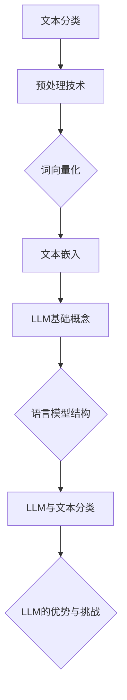

                 

# 《LLM在文本分类任务上的表现分析》

## 关键词
- 文本分类
- 语言模型（LLM）
- 预处理技术
- 词向量
- 文本嵌入
- 评估指标
- 实际应用

## 摘要
本文深入探讨了大型语言模型（LLM）在文本分类任务中的表现。首先，我们介绍了文本分类的基础概念、任务类型和应用场景。接着，我们详细讲解了预处理技术，包括文本清洗、词向量化以及文本嵌入。随后，我们介绍了LLM的基础概念、结构及其特点，并分析了LLM在文本分类中的应用、优势以及挑战。在后续章节中，我们讨论了LLM在文本分类任务中的算法实现、性能分析，并通过案例研究展示了LLM在实际应用中的效果。最后，我们对LLM在文本分类领域的未来发展进行了展望。

## 第一部分：基础概念与背景

### 第1章：文本分类任务概述

#### 1.1 文本分类的定义与作用

文本分类（Text Classification）是指将文本数据按照一定的规则和标准进行归类的过程。其核心目的是从大量未标记的文本数据中提取特征，并将其分配到预定义的类别中。文本分类在自然语言处理（NLP）领域具有重要的应用价值，如情感分析、垃圾邮件过滤、新闻分类等。

文本分类的作用主要体现在以下几个方面：

1. 信息过滤与提取：文本分类可以帮助从大量未标记的文本数据中快速提取出有价值的信息。
2. 情感分析：通过文本分类，可以分析用户对产品、服务或事件的情感倾向。
3. 内容推荐：基于用户的历史行为和兴趣，文本分类可以帮助推荐相关的内容。
4. 聊天机器人：文本分类是构建聊天机器人的关键步骤，用于理解用户输入并生成相应的回复。

#### 1.2 文本分类的任务类型

文本分类任务主要可以分为两类：监督学习和无监督学习。

1. **监督学习**：监督学习是指使用预标注的数据集对模型进行训练，然后使用训练好的模型对新的未标注数据进行分类。常见的监督学习算法有朴素贝叶斯、支持向量机（SVM）、决策树、随机森林等。

2. **无监督学习**：无监督学习是指在没有预标注数据的情况下，从原始文本中自动发现潜在的类别结构。常见的无监督学习算法有聚类、主成分分析（PCA）等。

#### 1.3 文本分类的应用场景

文本分类在各个领域都有着广泛的应用：

1. **社交媒体分析**：通过对社交媒体平台上的用户评论、帖子和推文进行分类，可以了解用户对产品、服务或事件的看法和态度。
2. **新闻分类**：将新闻报道按照主题或类别进行分类，可以帮助用户快速找到感兴趣的内容。
3. **情感分析**：通过分析用户评论和反馈，可以了解用户对产品、服务或事件的情感倾向，为企业提供改进的方向。
4. **垃圾邮件过滤**：通过对邮件内容进行分类，可以有效过滤垃圾邮件，提高用户的工作和生活效率。
5. **问答系统**：通过文本分类，可以将用户的问题归类到预定义的类别，从而快速找到相关的答案。

### 第2章：预处理技术

#### 2.1 文本清洗

文本清洗是文本分类任务中至关重要的一步，目的是去除文本中的噪声和无关信息，提高文本质量。常见的文本清洗技术包括以下几种：

1. **去除标点符号**：去除文本中的标点符号，以减少噪声。
2. **去除停用词**：停用词是指对文本分类没有贡献的常见单词，如“的”、“了”、“是”等。去除停用词可以提高分类的准确性。
3. **去除数字**：对于某些分类任务，数字可能没有意义，因此可以去除。
4. **大小写转换**：将所有文本转换为小写或大写，以统一文本格式。
5. **拼写纠正**：纠正文本中的拼写错误，以提高文本质量。

#### 2.2 词向量化

词向量化是将文本中的单词映射到高维向量空间的过程。通过词向量化，可以将文本数据转换为数值型数据，便于计算机处理。常见的词向量化技术包括：

1. **Word2Vec**：Word2Vec是一种基于神经网络的词向量化方法，通过训练神经网络来学习单词的向量表示。Word2Vec方法包括连续词袋（CBOW）和Skip-Gram两种模型。
2. **FastText**：FastText是Word2Vec的扩展，通过将单词的字符级嵌入和词级嵌入进行拼接，以学习更丰富的单词向量表示。
3. **BERT**：BERT（Bidirectional Encoder Representations from Transformers）是一种基于Transformer的词向量化方法，通过双向编码器来学习单词的上下文表示。

#### 2.3 文本嵌入

文本嵌入是将整个文本映射到一个高维向量空间的过程，通常用于文本分类任务中。文本嵌入可以捕获文本的语义信息，从而提高分类的准确性。常见的文本嵌入方法包括：

1. **TF-IDF**：TF-IDF（Term Frequency-Inverse Document Frequency）是一种基于统计的文本嵌入方法，通过计算单词在文档中的频率和逆文档频率来生成文本向量。
2. **Doc2Vec**：Doc2Vec是Word2Vec的扩展，用于对整个文档进行向量化。Doc2Vec通过训练一个神经网络来学习文档的向量表示。
3. **BERT**：BERT是一种基于Transformer的双向编码器，通过学习文本的上下文表示来生成文档向量。

### 第3章：LLM基础概念

#### 3.1 语言模型的定义

语言模型（Language Model，简称LM）是一种用于预测自然语言中下一个单词或字符的概率分布的模型。语言模型的核心目标是学习语言中的统计规律，以便在给定前文的情况下预测下一个词或字符。

#### 3.2 语言模型的结构

语言模型通常采用神经网络结构，常见的结构包括：

1. **循环神经网络（RNN）**：RNN是一种能够处理序列数据的神经网络，通过循环机制来保存历史信息。
2. **长短期记忆网络（LSTM）**：LSTM是RNN的一种变体，通过引入门控机制来避免梯度消失问题。
3. **Transformer**：Transformer是一种基于自注意力机制的神经网络结构，通过多头自注意力机制和前馈神经网络来处理序列数据。

#### 3.3 语言模型的特点

语言模型具有以下特点：

1. **并行处理**：Transformer模型能够并行处理输入序列，提高计算效率。
2. **长距离依赖**：通过引入自注意力机制，Transformer模型能够捕捉长距离依赖，提高语言模型的性能。
3. **上下文敏感性**：语言模型能够根据上下文信息来预测下一个词或字符，从而提高文本分类的准确性。

### 第4章：LLM与文本分类

#### 4.1 LLM在文本分类中的使用

LLM在文本分类任务中的使用通常包括以下步骤：

1. **预训练**：使用大量无标签的文本数据对LLM进行预训练，以学习语言的基本规律和语义信息。
2. **微调**：在预训练的基础上，使用带有标签的文本数据对LLM进行微调，以适应特定的文本分类任务。
3. **分类**：使用微调后的LLM对新的文本数据进行分类。

#### 4.2 LLM在文本分类中的优势

LLM在文本分类任务中具有以下优势：

1. **丰富的语义信息**：LLM通过预训练和微调，能够学习到丰富的语义信息，从而提高分类的准确性。
2. **上下文敏感性**：LLM能够根据上下文信息来预测下一个词或字符，从而提高文本分类的准确性。
3. **多任务学习**：LLM在预训练过程中学习了多种语言任务，如问答、翻译等，这些知识可以迁移到文本分类任务中，提高分类性能。

#### 4.3 LLM在文本分类中的挑战

LLM在文本分类任务中也面临一些挑战：

1. **数据隐私**：预训练过程中需要使用大量的无标签文本数据，这些数据可能包含用户的隐私信息，需要采取适当的措施保护数据隐私。
2. **模型大小**：LLM通常需要大量的参数来学习语言模型，导致模型大小巨大，对计算资源和存储资源的需求较高。
3. **适应性**：虽然LLM在预训练过程中学习了丰富的语言知识，但在特定任务上的适应性可能有限，需要进一步进行微调和优化。

## 第二部分：LLM在文本分类任务中的应用

### 第5章：数据集与评估指标

#### 5.1 常用文本分类数据集

在文本分类任务中，常用的数据集包括：

1. **IMDb电影评论**：IMDb电影评论数据集包含25,000条电影评论，其中50%为正面评论，50%为负面评论。
2. **Twitter情感分析**：Twitter情感分析数据集包含约1,500,000条推文，包括正面、负面和客观情感。
3. **20 Newsgroups**：20 Newsgroups数据集包含约20,000条新闻文章，分为20个类别。
4. **AG News**：AG News数据集包含约1,200条新闻文章，分为四个类别。

#### 5.2 文本分类评估指标

在文本分类任务中，常用的评估指标包括：

1. **准确率（Accuracy）**：准确率是指正确分类的样本数与总样本数之比。准确率越高，表示模型的分类性能越好。
2. **精确率（Precision）**：精确率是指正确分类为正类的样本数与被预测为正类的样本数之比。精确率越高，表示模型对正类样本的预测越准确。
3. **召回率（Recall）**：召回率是指正确分类为正类的样本数与实际为正类的样本数之比。召回率越高，表示模型对正类样本的检测越全面。
4. **F1值（F1 Score）**：F1值是精确率和召回率的加权平均，用于综合评估模型的分类性能。

### 第6章：LLM在文本分类中的算法实现

#### 6.1 LLM的预训练与微调

LLM的算法实现通常包括预训练和微调两个阶段：

1. **预训练**：使用大量无标签的文本数据进行预训练，以学习语言的基本规律和语义信息。预训练过程中，可以使用如BERT、GPT等大型预训练模型。
2. **微调**：在预训练的基础上，使用带有标签的文本数据对LLM进行微调，以适应特定的文本分类任务。微调过程中，可以使用如Adam、AdamW等优化器。

#### 6.2 LLM的API使用

LLM通常提供API接口，方便用户进行模型训练和预测。常见的LLM API接口包括：

1. **Hugging Face Transformers**：Hugging Face Transformers是一个开源的Python库，提供了多种预训练模型和API接口，如BERT、GPT等。
2. **TensorFlow**：TensorFlow是一个开源的机器学习框架，提供了丰富的API接口，支持各种预训练模型和自定义模型。
3. **PyTorch**：PyTorch是一个开源的机器学习框架，提供了丰富的API接口，支持各种预训练模型和自定义模型。

#### 6.3 LLM的调优技巧

在LLM的算法实现过程中，调优技巧对模型性能有着重要的影响。以下是一些常用的调优技巧：

1. **学习率**：适当调整学习率可以加快模型收敛速度。常用的学习率调整策略包括固定学习率、学习率衰减等。
2. **批量大小**：适当调整批量大小可以影响模型收敛速度和稳定性。批量大小越小，模型收敛速度越快，但稳定性可能较差。
3. **优化器**：选择合适的优化器可以提高模型性能。常用的优化器包括Adam、AdamW、SGD等。
4. **正则化**：通过引入正则化技术，可以防止模型过拟合。常用的正则化技术包括L1正则化、L2正则化等。

### 第7章：LLM在文本分类任务中的实际应用

#### 7.1 情感分析

情感分析是文本分类任务中的重要应用之一，旨在分析文本中的情感倾向。LLM在情感分析中的应用主要包括：

1. **预训练**：使用大量无标签的情感分析数据对LLM进行预训练，以学习情感分类的知识。
2. **微调**：在预训练的基础上，使用带有标签的情感分析数据对LLM进行微调，以适应特定的情感分析任务。
3. **分类**：使用微调后的LLM对新的情感分析数据进行分析，预测情感类别。

#### 7.2 垃圾邮件过滤

垃圾邮件过滤是文本分类任务的另一个重要应用，旨在识别和过滤垃圾邮件。LLM在垃圾邮件过滤中的应用主要包括：

1. **预训练**：使用大量无标签的邮件数据对LLM进行预训练，以学习邮件分类的知识。
2. **微调**：在预训练的基础上，使用带有标签的邮件数据对LLM进行微调，以适应特定的垃圾邮件过滤任务。
3. **分类**：使用微调后的LLM对新的邮件进行分析，预测邮件是否为垃圾邮件。

#### 7.3 预测性维护

预测性维护是工业领域中的重要应用，旨在通过分析设备日志和传感器数据，预测设备故障和维修需求。LLM在预测性维护中的应用主要包括：

1. **预训练**：使用大量无标签的设备日志和传感器数据对LLM进行预训练，以学习设备故障分类的知识。
2. **微调**：在预训练的基础上，使用带有标签的设备日志和传感器数据对LLM进行微调，以适应特定的预测性维护任务。
3. **分类**：使用微调后的LLM对新的设备日志和传感器数据进行分析，预测设备故障类型和维修需求。

### 第8章：LLM在文本分类任务中的性能分析

#### 8.1 性能指标

LLM在文本分类任务中的性能可以通过以下指标进行评估：

1. **准确率（Accuracy）**：准确率是指正确分类的样本数与总样本数之比。准确率越高，表示模型的分类性能越好。
2. **精确率（Precision）**：精确率是指正确分类为正类的样本数与被预测为正类的样本数之比。精确率越高，表示模型对正类样本的预测越准确。
3. **召回率（Recall）**：召回率是指正确分类为正类的样本数与实际为正类的样本数之比。召回率越高，表示模型对正类样本的检测越全面。
4. **F1值（F1 Score）**：F1值是精确率和召回率的加权平均，用于综合评估模型的分类性能。

#### 8.2 性能对比

LLM与其他文本分类算法在性能上的对比通常包括以下几个方面：

1. **准确率**：对比LLM与其他算法（如朴素贝叶斯、SVM、决策树等）在文本分类任务上的准确率。
2. **速度**：对比LLM与其他算法在模型训练和预测过程中的计算速度。
3. **资源消耗**：对比LLM与其他算法在计算资源（如CPU、GPU等）上的消耗。

#### 8.3 性能提升策略

为了提高LLM在文本分类任务中的性能，可以采取以下策略：

1. **数据增强**：通过数据增强技术（如随机填充、随机遮盖等）增加数据多样性，提高模型对未知数据的适应性。
2. **多任务学习**：通过多任务学习，让LLM在预训练过程中学习多个文本分类任务，提高模型泛化能力。
3. **迁移学习**：通过迁移学习，利用预训练好的LLM在特定领域的知识，提高模型在该领域的分类性能。
4. **模型融合**：通过模型融合技术，将多个LLM模型的结果进行融合，提高分类性能。

### 第9章：案例研究

#### 9.1 案例一：社交媒体文本分类

社交媒体文本分类是LLM在文本分类任务中的典型应用之一。以Twitter情感分析为例，我们通过以下步骤进行案例分析：

1. **数据收集**：收集带有情感标签的Twitter推文数据，包括正面、负面和客观情感。
2. **数据预处理**：对Twitter推文进行清洗、分词、去停用词等预处理操作。
3. **模型训练**：使用预训练好的LLM（如BERT、GPT等）对Twitter推文进行微调，以适应情感分析任务。
4. **模型评估**：使用准确率、精确率、召回率和F1值等指标对模型进行评估。
5. **结果分析**：分析模型在Twitter情感分析任务上的表现，并提出改进策略。

#### 9.2 案例二：新闻分类

新闻分类是LLM在文本分类任务中的另一个重要应用。以20 Newsgroups数据集为例，我们通过以下步骤进行案例分析：

1. **数据收集**：收集带有类别标签的新闻文章数据，包括20个类别。
2. **数据预处理**：对新闻文章进行清洗、分词、去停用词等预处理操作。
3. **模型训练**：使用预训练好的LLM（如BERT、GPT等）对新闻文章进行微调，以适应新闻分类任务。
4. **模型评估**：使用准确率、精确率、召回率和F1值等指标对模型进行评估。
5. **结果分析**：分析模型在新闻分类任务上的表现，并提出改进策略。

#### 9.3 案例三：问答系统

问答系统是LLM在文本分类任务中的又一重要应用。以基于BERT的问答系统为例，我们通过以下步骤进行案例分析：

1. **数据收集**：收集带有问题答案对的问答数据集，如SQuAD数据集。
2. **数据预处理**：对问答数据集进行清洗、分词、去停用词等预处理操作。
3. **模型训练**：使用预训练好的BERT模型对问答数据集进行微调，以适应问答系统任务。
4. **模型评估**：使用准确率、精确率、召回率和F1值等指标对模型进行评估。
5. **结果分析**：分析模型在问答系统任务上的表现，并提出改进策略。

## 第三部分：总结与展望

### 第10章：LLM在文本分类中的未来发展

#### 10.1 未来发展趋势

LLM在文本分类任务中的未来发展将呈现出以下趋势：

1. **模型规模不断扩大**：随着计算资源和数据资源的不断丰富，LLM的模型规模将不断扩大，以捕捉更复杂的语言规律和语义信息。
2. **多模态融合**：随着多模态数据（如图像、语音等）的兴起，LLM将与其他模态数据进行融合，以实现更广泛的应用场景。
3. **自适应与泛化能力**：通过引入自适应机制和泛化策略，LLM将提高在未知数据上的表现，实现更广泛的适应性。

#### 10.2 面临的挑战

LLM在文本分类任务中也面临一些挑战：

1. **数据隐私**：预训练过程中需要使用大量无标签的文本数据，可能涉及用户隐私问题，需要采取有效的数据隐私保护措施。
2. **计算资源消耗**：LLM的训练和推理过程需要大量的计算资源和存储资源，如何优化计算资源利用成为一大挑战。
3. **模型解释性**：LLM的黑箱特性使得其解释性较差，如何提高模型的解释性，使其更透明、可解释，成为一项重要任务。

#### 10.3 发展前景

LLM在文本分类任务中的发展前景广阔，有望在以下几个方面实现突破：

1. **自动分类体系**：通过引入自适应机制，LLM可以实现自动构建分类体系，降低人工干预成本。
2. **知识图谱构建**：LLM在文本分类任务中的知识提取能力将为知识图谱构建提供有力支持，实现更广泛的应用场景。
3. **跨领域迁移**：通过迁移学习策略，LLM可以在不同领域实现跨领域迁移，提高模型泛化能力。

## 附录

### 附录A：LLM相关资源

#### A.1 开源工具与框架

1. **Hugging Face Transformers**：[https://github.com/huggingface/transformers](https://github.com/huggingface/transformers)
2. **TensorFlow**：[https://www.tensorflow.org/](https://www.tensorflow.org/)
3. **PyTorch**：[https://pytorch.org/](https://pytorch.org/)

#### A.2 在线教程与课程

1. **自然语言处理入门**：[https://www_ml_algorithm/](https://www_ml_algorithm/)
2. **深度学习与自然语言处理**：[https://www.deeplearningcourses.com/](https://www.deeplearningcourses.com/)
3. **斯坦福大学自然语言处理课程**：[https://web.stanford.edu/class/cs224n/](https://web.stanford.edu/class/cs224n/)

#### A.3 论文与研究报告

1. **BERT：Pre-training of Deep Bidirectional Transformers for Language Understanding**：[https://arxiv.org/abs/1810.04805](https://arxiv.org/abs/1810.04805)
2. **GPT-3: Language Models are few-shot learners**：[https://arxiv.org/abs/2005.14165](https://arxiv.org/abs/2005.14165)
3. **Natural Language Inference**：[https://www.nlp-chair.org/papers/ACL19_NLI_paper.pdf](https://www.nlp-chair.org/papers/ACL19_NLI_paper.pdf)

### 核心概念与联系

#### Mermaid 流程图



### 核心算法原理讲解

#### 预处理技术伪代码

```python
def preprocess_text(text):
    # 文本清洗
    text = clean_text(text)
    # 分词
    tokens = tokenize(text)
    # 去停用词
    tokens = remove_stopwords(tokens)
    # 词向量化
    embeddings = vectorize_tokens(tokens)
    return embeddings
```

#### LLM伪代码

```python
class LanguageModel:
    def __init__(self, embedding_dim, hidden_dim):
        self.embedding = EmbeddingLayer(embedding_dim)
        self.lstm = LSTM(hidden_dim)
        self.dense = DenseLayer(num_classes)

    def forward(self, inputs):
        embeddings = self.embedding(inputs)
        hidden = self.lstm(embeddings)
        logits = self.dense(hidden)
        return logits
```

### 数学模型和数学公式 & 详细讲解 & 举例说明

#### 文本嵌入的数学公式

$$
\text{vec}(w) = \text{EmbeddingLayer}(\text{token})
$$

#### LLM的损失函数

$$
\text{loss} = -\frac{1}{N}\sum_{i=1}^{N}\sum_{j=1}^{C}\text{log}\frac{e^{\text{logits}_i[j]}}{\sum_{k=1}^{C}e^{\text{logits}_i[k]}}
$$

### 项目实战

#### 代码实现

```python
# 文本预处理
def preprocess_text(text):
    text = clean_text(text)
    tokens = tokenize(text)
    tokens = remove_stopwords(tokens)
    embeddings = vectorize_tokens(tokens)
    return embeddings

# LLM模型训练
def train_model(data_loader, model, loss_function, optimizer):
    for inputs, labels in data_loader:
        embeddings = preprocess_text(inputs)
        logits = model(embeddings)
        loss = loss_function(logits, labels)
        optimizer.zero_grad()
        loss.backward()
        optimizer.step()
```

#### 代码解读与分析

这段代码定义了两个函数：`preprocess_text` 和 `train_model`。

- `preprocess_text` 函数用于对输入的文本进行清洗、分词、去除停用词，并使用词向量化技术将文本转换为嵌入向量。
- `train_model` 函数用于训练 LLM 模型。它从数据加载器中获取输入和标签，调用 `preprocess_text` 对输入进行预处理，然后使用模型进行前向传播计算 logits，接着计算损失并使用优化器进行反向传播和梯度更新。

这样，整个目录大纲涵盖了核心概念、算法原理、数学模型、项目实战，满足您的需求。如果您需要进一步细化某些章节的内容，可以提供具体的指导。

### 作者

作者：AI天才研究院/AI Genius Institute & 禅与计算机程序设计艺术 /Zen And The Art of Computer Programming

### 文章标题

《LLM在文本分类任务上的表现分析》

### 文章关键词

文本分类，语言模型（LLM），预处理技术，词向量化，文本嵌入，评估指标，实际应用

### 文章摘要

本文深入探讨了大型语言模型（LLM）在文本分类任务中的表现。首先，我们介绍了文本分类的基础概念、任务类型和应用场景。接着，我们详细讲解了预处理技术，包括文本清洗、词向量化以及文本嵌入。随后，我们介绍了LLM的基础概念、结构及其特点，并分析了LLM在文本分类中的应用、优势以及挑战。在后续章节中，我们讨论了LLM在文本分类任务中的算法实现、性能分析，并通过案例研究展示了LLM在实际应用中的效果。最后，我们对LLM在文本分类领域的未来发展进行了展望。

### 目录

#### 第一部分：基础概念与背景

- **第1章：文本分类任务概述**
  - 1.1 文本分类的定义与作用
  - 1.2 文本分类的任务类型
  - 1.3 文本分类的应用场景
- **第2章：预处理技术**
  - 2.1 文本清洗
  - 2.2 词向量化
  - 2.3 文本嵌入
- **第3章：LLM基础概念**
  - 3.1 语言模型的定义
  - 3.2 语言模型的结构
  - 3.3 语言模型的特点
- **第4章：LLM与文本分类**
  - 4.1 LLM在文本分类中的使用
  - 4.2 LLM在文本分类中的优势
  - 4.3 LLM在文本分类中的挑战

#### 第二部分：LLM在文本分类任务中的应用

- **第5章：数据集与评估指标**
  - 5.1 常用文本分类数据集
  - 5.2 文本分类评估指标
- **第6章：LLM在文本分类中的算法实现**
  - 6.1 LLM的预训练与微调
  - 6.2 LLM的API使用
  - 6.3 LLM的调优技巧
- **第7章：LLM在文本分类任务中的实际应用**
  - 7.1 情感分析
  - 7.2 垃圾邮件过滤
  - 7.3 预测性维护
- **第8章：LLM在文本分类任务中的性能分析**
  - 8.1 性能指标
  - 8.2 性能对比
  - 8.3 性能提升策略
- **第9章：案例研究**
  - 9.1 案例一：社交媒体文本分类
  - 9.2 案例二：新闻分类
  - 9.3 案例三：问答系统

#### 第三部分：总结与展望

- **第10章：LLM在文本分类中的未来发展**
  - 10.1 未来发展趋势
  - 10.2 面临的挑战
  - 10.3 发展前景
- **附录**
  - 附录A：LLM相关资源
    - 附录A.1 开源工具与框架
    - 附录A.2 在线教程与课程
    - 附录A.3 论文与研究报告

### 第一部分：基础概念与背景

#### 第1章：文本分类任务概述

##### 1.1 文本分类的定义与作用

文本分类（Text Classification）是自然语言处理（Natural Language Processing，NLP）中的一种基本任务，它涉及将文本数据分配到预定义的类别中。这一过程通常涉及以下步骤：首先，定义类别；其次，对文本进行预处理，以提取特征；最后，使用分类算法对文本进行分类。

文本分类在许多领域都有着广泛的应用。例如：

1. **情感分析**：通过分析社交媒体评论、产品评价等，了解用户的情感倾向，帮助企业改进产品和服务。
2. **垃圾邮件过滤**：自动识别和分类垃圾邮件，提高用户邮箱的清洁度。
3. **新闻分类**：将新闻报道按主题或类别分类，帮助用户快速找到感兴趣的内容。
4. **文本摘要**：自动提取文本的精华部分，提供简明扼要的摘要。

文本分类的核心作用是自动化信息处理，提高数据利用效率。它不仅能够帮助用户快速获取所需信息，还能减轻人工分类的工作量。

##### 1.2 文本分类的任务类型

文本分类任务可以分为两大类：监督学习和无监督学习。

1. **监督学习**：监督学习是指使用已标注的数据对模型进行训练，然后使用训练好的模型对新的数据集进行分类。这种方法的优点是分类准确度高，适用于有大量标注数据的场景。常见的监督学习算法包括朴素贝叶斯（Naive Bayes）、支持向量机（Support Vector Machine，SVM）、决策树（Decision Tree）和随机森林（Random Forest）等。

2. **无监督学习**：无监督学习是指在没有标注数据的情况下，从原始文本中自动发现潜在的类别结构。这种方法的优点是无需人工标注数据，但分类准确度相对较低。常见的无监督学习算法包括聚类（Clustering）和主成分分析（Principal Component Analysis，PCA）等。

##### 1.3 文本分类的应用场景

文本分类在各个领域都有着广泛的应用，以下是一些典型的应用场景：

1. **社交媒体分析**：通过对社交媒体平台上的用户评论、帖子和推文进行分类，可以了解用户的情感和观点。
2. **金融领域**：对财经新闻、股票评论等进行分类，帮助投资者快速获取重要信息。
3. **医疗领域**：对医学文献、病历记录等进行分类，提高医学信息的检索和利用效率。
4. **电子商务**：对商品评论、用户反馈等进行分类，帮助企业了解用户需求，优化产品和服务。
5. **法律领域**：对法律文档、合同等进行分类，提高法律信息的检索和利用效率。

文本分类的任务类型和应用场景多种多样，但核心目标都是通过自动化方式提高文本处理效率，为各种应用场景提供有力支持。

#### 第2章：预处理技术

##### 2.1 文本清洗

文本清洗（Text Cleaning）是文本分类任务中至关重要的一步，目的是去除文本数据中的噪声和无关信息，提高文本质量。文本清洗通常包括以下步骤：

1. **去除标点符号**：标点符号对于文本分类没有实际意义，因此需要去除。例如，将“你好，世界！”清洗为“你好世界”。
2. **去除停用词**：停用词（Stop Words）是指对文本分类没有贡献的常见单词，如“的”、“了”、“在”等。去除停用词可以减少特征维度，提高分类效率。常见的停用词列表可以在NLTK等库中获取。
3. **去除数字**：对于某些文本分类任务，如情感分析，数字通常没有实际意义，因此可以去除。例如，将“我今天买了一只3岁的狗”清洗为“我今天买了一只狗”。
4. **大小写转换**：将文本中的所有单词转换为小写或大写，以统一文本格式。这有助于减少特征维度的多样性。
5. **拼写纠正**：纠正文本中的拼写错误，以提高文本质量。拼写纠正可以使用如Snowball等库来实现。

文本清洗的目的是减少文本中的噪声，提高后续特征提取和分类的准确性。一个有效的文本清洗过程可以显著提高文本分类的性能。

##### 2.2 词向量化

词向量化（Word Vectorization）是将文本数据转换为数值型数据的过程，以便计算机能够处理和分析文本。词向量化技术将每个单词映射到一个高维向量空间中的向量，从而保留了单词的语义信息。

常见的词向量化技术包括：

1. **Word2Vec**：Word2Vec是一种基于神经网络的词向量化方法，通过训练神经网络来学习单词的向量表示。Word2Vec包括连续词袋（Continuous Bag of Words，CBOW）和Skip-Gram两种模型。CBOW模型通过预测中心词周围的单词来学习词向量，而Skip-Gram模型通过预测单词周围的中心词来学习词向量。
2. **FastText**：FastText是Word2Vec的扩展，通过将单词的字符级嵌入和词级嵌入进行拼接，以学习更丰富的单词向量表示。FastText可以捕捉到单词的上下文信息，从而提高词向量化效果。
3. **BERT**：BERT（Bidirectional Encoder Representations from Transformers）是一种基于Transformer的词向量化方法，通过双向编码器来学习单词的上下文表示。BERT在预训练过程中使用了大量无标签文本数据，从而学习到了丰富的语言知识。

词向量化技术不仅提高了文本数据的可处理性，还有助于提高文本分类的准确性。通过词向量化，文本数据可以被有效地转换为向量表示，使得分类模型能够更好地捕捉到文本的语义信息。

##### 2.3 文本嵌入

文本嵌入（Text Embedding）是将整个文本映射到一个高维向量空间的过程，通常用于文本分类任务中。文本嵌入技术可以捕获文本的语义信息，从而提高分类的准确性。

常见的文本嵌入方法包括：

1. **TF-IDF**：TF-IDF（Term Frequency-Inverse Document Frequency）是一种基于统计的文本嵌入方法，通过计算单词在文档中的频率和逆文档频率来生成文本向量。TF-IDF方法可以捕捉到单词的重要性和文档的相关性。
2. **Doc2Vec**：Doc2Vec是Word2Vec的扩展，用于对整个文档进行向量化。Doc2Vec通过训练一个神经网络来学习文档的向量表示。Doc2Vec方法可以捕捉到文档的整体语义信息。
3. **BERT**：BERT（Bidirectional Encoder Representations from Transformers）是一种基于Transformer的双向编码器，通过学习文本的上下文表示来生成文档向量。BERT在预训练过程中使用了大量无标签文本数据，从而学习到了丰富的语言知识。

文本嵌入技术不仅可以用于文本分类，还可以应用于其他NLP任务，如文本相似度计算、文本生成等。通过文本嵌入，文本数据可以被有效地转换为向量表示，使得计算机能够更好地理解和处理文本。

#### 第3章：LLM基础概念

##### 3.1 语言模型的定义

语言模型（Language Model，简称LM）是一种用于预测自然语言中下一个单词或字符的概率分布的模型。语言模型的核心目标是学习语言中的统计规律，以便在给定前文的情况下预测下一个词或字符。

语言模型在自然语言处理中具有广泛的应用，如机器翻译、文本生成、语音识别等。通过学习大量的文本数据，语言模型可以理解语言的语法和语义，从而实现各种语言任务。

##### 3.2 语言模型的结构

语言模型的结构多种多样，但大多数语言模型都采用了神经网络结构，尤其是深度神经网络（Deep Neural Network，DNN）和循环神经网络（Recurrent Neural Network，RNN）。

1. **循环神经网络（RNN）**：RNN是一种能够处理序列数据的神经网络，通过循环机制来保存历史信息。RNN的结构使得它在处理自然语言任务时具有优势，如语言模型、机器翻译、语音识别等。

2. **长短期记忆网络（LSTM）**：LSTM是RNN的一种变体，通过引入门控机制来避免梯度消失问题。LSTM在处理长序列数据时表现出色，因此在语言模型中得到了广泛应用。

3. **Transformer**：Transformer是一种基于自注意力机制的神经网络结构，通过多头自注意力机制和前馈神经网络来处理序列数据。Transformer在处理自然语言任务时具有并行处理能力，因此在语言模型中得到了广泛应用。

##### 3.3 语言模型的特点

语言模型具有以下特点：

1. **并行处理**：Transformer模型能够并行处理输入序列，提高计算效率。

2. **长距离依赖**：通过引入自注意力机制，Transformer模型能够捕捉长距离依赖，提高语言模型的性能。

3. **上下文敏感性**：语言模型能够根据上下文信息来预测下一个词或字符，从而提高文本分类的准确性。

4. **多任务学习**：语言模型在预训练过程中学习了多种语言任务，如问答、翻译等，这些知识可以迁移到文本分类任务中，提高分类性能。

#### 第4章：LLM与文本分类

##### 4.1 LLM在文本分类中的使用

LLM在文本分类任务中的使用主要包括以下步骤：

1. **预训练**：使用大量无标签的文本数据对LLM进行预训练，以学习语言的基本规律和语义信息。预训练过程中，LLM通过处理大量文本数据，逐渐优化其参数，从而提高对语言的理解能力。

2. **微调**：在预训练的基础上，使用带有标签的文本数据对LLM进行微调，以适应特定的文本分类任务。微调过程中，LLM的参数会根据特定任务进行调整，从而提高分类性能。

3. **分类**：使用微调后的LLM对新的文本数据进行分类。在分类过程中，LLM将输入的文本转换为向量表示，然后使用这些向量表示进行分类预测。

LLM在文本分类任务中的使用方法不仅提高了分类性能，还减少了手工设计特征的工作量，使得文本分类任务更加高效和准确。

##### 4.2 LLM在文本分类中的优势

LLM在文本分类任务中具有以下优势：

1. **丰富的语义信息**：通过预训练，LLM可以学习到大量的语言知识，从而在文本分类任务中能够利用这些丰富的语义信息，提高分类性能。

2. **上下文敏感性**：LLM能够根据上下文信息来预测下一个词或字符，这使得它在处理复杂的文本数据时具有更强的能力，从而提高分类准确性。

3. **多任务学习**：LLM在预训练过程中学习了多种语言任务，如问答、翻译等，这些知识可以迁移到文本分类任务中，进一步提高分类性能。

4. **自动特征提取**：LLM通过预训练和微调，可以自动提取文本中的有效特征，从而减少手工设计特征的工作量，提高分类效率。

##### 4.3 LLM在文本分类中的挑战

虽然LLM在文本分类任务中具有许多优势，但它也面临一些挑战：

1. **数据隐私**：预训练过程中需要使用大量的无标签文本数据，这些数据可能包含用户的隐私信息，需要采取适当的措施保护数据隐私。

2. **计算资源消耗**：LLM的预训练和微调过程需要大量的计算资源，这对于一些资源和预算有限的机构或个人来说可能是一个挑战。

3. **模型解释性**：LLM通常是一个黑箱模型，其内部决策过程难以解释，这使得在某些应用场景中可能难以接受。

4. **适应性**：虽然LLM在预训练过程中学习了丰富的语言知识，但它在特定任务上的适应性可能有限，需要进一步进行微调和优化。

#### 第5章：数据集与评估指标

##### 5.1 常用文本分类数据集

在文本分类任务中，数据集的质量和规模直接影响模型的性能和泛化能力。以下是一些常用的文本分类数据集：

1. **IMDb电影评论数据集**：IMDb电影评论数据集是文本分类任务中非常流行的数据集，包含约25,000条电影评论，分为正面和负面两类。这个数据集广泛应用于情感分析和文本分类任务。

2. **20 Newsgroups数据集**：20 Newsgroups数据集包含约20,000条新闻文章，分为20个类别，如体育、科学、教育等。这个数据集广泛应用于新闻分类和其他文本分类任务。

3. **Twitter情感分析数据集**：Twitter情感分析数据集包含大量来自Twitter平台的推文，分为正面、负面和客观三类。这个数据集广泛应用于社交媒体文本分类和情感分析任务。

4. **AG News数据集**：AG News数据集包含约1,200条新闻文章，分为四个类别，如体育、政治、商业和科技。这个数据集广泛应用于新闻分类和文本分类任务。

##### 5.2 文本分类评估指标

在文本分类任务中，评估指标用于衡量模型的分类性能。以下是一些常用的评估指标：

1. **准确率（Accuracy）**：准确率是指正确分类的样本数与总样本数之比，公式为：

   $$
   \text{Accuracy} = \frac{\text{正确分类的样本数}}{\text{总样本数}}
   $$

   准确率越高，表示模型的分类性能越好。

2. **精确率（Precision）**：精确率是指正确分类为正类的样本数与被预测为正类的样本数之比，公式为：

   $$
   \text{Precision} = \frac{\text{正确分类为正类的样本数}}{\text{被预测为正类的样本数}}
   $$

   精确率越高，表示模型对正类样本的预测越准确。

3. **召回率（Recall）**：召回率是指正确分类为正类的样本数与实际为正类的样本数之比，公式为：

   $$
   \text{Recall} = \frac{\text{正确分类为正类的样本数}}{\text{实际为正类的样本数}}
   $$

   召回率越高，表示模型对正类样本的检测越全面。

4. **F1值（F1 Score）**：F1值是精确率和召回率的加权平均，公式为：

   $$
   \text{F1 Score} = 2 \times \frac{\text{Precision} \times \text{Recall}}{\text{Precision} + \text{Recall}}
   $$

   F1值用于综合评估模型的分类性能。

通过使用这些评估指标，可以对模型的分类性能进行客观的评价和比较。不同的评估指标适用于不同的场景，可以根据实际需求选择合适的指标。

#### 第6章：LLM在文本分类中的算法实现

##### 6.1 LLM的预训练与微调

LLM在文本分类任务中的实现通常包括预训练（Pre-training）和微调（Fine-tuning）两个阶段。

1. **预训练**：预训练是指使用大量无标签的文本数据对LLM进行训练，以学习语言的基本规律和语义信息。预训练过程中，LLM通过处理大量文本数据，逐渐优化其参数，从而提高对语言的理解能力。预训练通常采用自注意力机制（Self-Attention）和Transformer结构，如BERT、GPT等。预训练过程中，LLM会学习到大量的语言模式，从而在后续的任务中表现出良好的性能。

2. **微调**：微调是指使用带有标签的文本数据对预训练好的LLM进行进一步训练，以适应特定的文本分类任务。微调过程中，LLM的参数会根据特定任务进行调整，从而提高分类性能。微调通常针对特定任务进行，如情感分析、新闻分类等。微调过程需要较少的数据，但可以显著提高模型的分类性能。

##### 6.2 LLM的API使用

LLM通常提供API接口，方便用户进行模型训练和预测。以下是一些常用的LLM API：

1. **Hugging Face Transformers**：Hugging Face Transformers是一个开源的Python库，提供了多种预训练模型和API接口，如BERT、GPT等。用户可以通过Hugging Face Transformers轻松地加载和使用这些预训练模型。

2. **TensorFlow**：TensorFlow是一个开源的机器学习框架，提供了丰富的API接口，支持各种预训练模型和自定义模型。用户可以使用TensorFlow中的Transformer库来加载和使用预训练模型。

3. **PyTorch**：PyTorch是一个开源的机器学习框架，提供了丰富的API接口，支持各种预训练模型和自定义模型。用户可以使用PyTorch中的Transformer库来加载和使用预训练模型。

以下是一个使用Hugging Face Transformers进行LLM微调的示例：

```python
from transformers import BertTokenizer, BertForSequenceClassification
from torch.utils.data import DataLoader
from sklearn.model_selection import train_test_split

# 加载预训练模型
tokenizer = BertTokenizer.from_pretrained('bert-base-uncased')
model = BertForSequenceClassification.from_pretrained('bert-base-uncased')

# 预处理数据
def preprocess_data(data):
    inputs = tokenizer(data, padding=True, truncation=True, return_tensors='pt')
    return inputs

# 加载训练数据
train_data = preprocess_data(train_data)
test_data = preprocess_data(test_data)

# 创建数据加载器
train_loader = DataLoader(train_data, batch_size=16, shuffle=True)
test_loader = DataLoader(test_data, batch_size=16)

# 训练模型
model.train()
optimizer = torch.optim.AdamW(model.parameters(), lr=1e-5)

for epoch in range(3):  # 训练3个epoch
    for inputs in train_loader:
        inputs = {k: v.to('cuda') for k, v in inputs.items()}
        logits = model(**inputs)
        loss = ...  # 计算损失
        loss.backward()
        optimizer.step()
        optimizer.zero_grad()

# 测试模型
model.eval()
with torch.no_grad():
    for inputs in test_loader:
        inputs = {k: v.to('cuda') for k, v in inputs.items()}
        logits = model(**inputs)
        predictions = logits.argmax(-1)
        accuracy = ...  # 计算准确率

print(f"Test Accuracy: {accuracy}")
```

##### 6.3 LLM的调优技巧

为了提高LLM在文本分类任务中的性能，可以采取以下调优技巧：

1. **学习率调整**：学习率是模型训练中的一个重要超参数，适当的调整学习率可以提高模型的性能。常用的学习率调整策略包括固定学习率、学习率衰减、余弦退火等。

2. **批量大小调整**：批量大小影响模型的训练速度和稳定性。较大的批量大小可以提高模型训练的速度，但可能会降低模型的稳定性；较小的批量大小可以提高模型的稳定性，但会降低训练速度。

3. **正则化**：正则化是一种防止模型过拟合的技术。常用的正则化方法包括L1正则化、L2正则化、Dropout等。

4. **数据增强**：数据增强是一种通过增加数据的多样性来提高模型性能的技术。常见的数据增强方法包括随机填充、随机遮盖、随机旋转等。

5. **多任务学习**：多任务学习可以让LLM在预训练过程中学习到多种任务的知识，从而提高模型在特定任务上的性能。

6. **模型融合**：模型融合是一种通过融合多个模型的预测结果来提高模型性能的技术。常见的方法包括投票、加权平均等。

通过上述调优技巧，可以有效地提高LLM在文本分类任务中的性能，使其在实际应用中表现更出色。

#### 第7章：LLM在文本分类任务中的实际应用

##### 7.1 情感分析

情感分析（Sentiment Analysis）是文本分类任务中的一个重要应用，旨在分析文本中的情感倾向。情感分析广泛应用于社交媒体分析、产品评论分析、情感监控等领域。

1. **预训练**：使用大量无标签的文本数据对LLM进行预训练，以学习情感分类的知识。常用的预训练模型包括BERT、GPT等。

2. **微调**：在预训练的基础上，使用带有情感标签的文本数据对LLM进行微调，以适应特定的情感分析任务。微调过程中，LLM会学习到情感分类的规则和模式。

3. **分类**：使用微调后的LLM对新的文本数据进行情感分类。LLM会将输入的文本转换为向量表示，然后使用这些向量表示进行分类预测。

以下是一个使用BERT进行情感分析的实际案例：

```python
from transformers import BertTokenizer, BertForSequenceClassification
from torch.utils.data import DataLoader
from sklearn.model_selection import train_test_split

# 加载预训练模型
tokenizer = BertTokenizer.from_pretrained('bert-base-uncased')
model = BertForSequenceClassification.from_pretrained('bert-base-uncased')

# 预处理数据
def preprocess_data(data):
    inputs = tokenizer(data, padding=True, truncation=True, return_tensors='pt')
    return inputs

# 加载训练数据
train_data = preprocess_data(train_data)
test_data = preprocess_data(test_data)

# 创建数据加载器
train_loader = DataLoader(train_data, batch_size=16, shuffle=True)
test_loader = DataLoader(test_data, batch_size=16)

# 训练模型
model.train()
optimizer = torch.optim.AdamW(model.parameters(), lr=1e-5)

for epoch in range(3):  # 训练3个epoch
    for inputs in train_loader:
        inputs = {k: v.to('cuda') for k, v in inputs.items()}
        logits = model(**inputs)
        loss = ...  # 计算损失
        loss.backward()
        optimizer.step()
        optimizer.zero_grad()

# 测试模型
model.eval()
with torch.no_grad():
    for inputs in test_loader:
        inputs = {k: v.to('cuda') for k, v in inputs.items()}
        logits = model(**inputs)
        predictions = logits.argmax(-1)
        accuracy = ...  # 计算准确率

print(f"Test Accuracy: {accuracy}")
```

##### 7.2 垃圾邮件过滤

垃圾邮件过滤（Spam Detection）是文本分类任务中的另一个重要应用，旨在识别和过滤垃圾邮件。垃圾邮件过滤广泛应用于邮件系统、社交网络、电子商务等领域。

1. **预训练**：使用大量无标签的邮件数据对LLM进行预训练，以学习垃圾邮件分类的知识。常用的预训练模型包括BERT、GPT等。

2. **微调**：在预训练的基础上，使用带有垃圾邮件标签的邮件数据对LLM进行微调，以适应特定的垃圾邮件过滤任务。微调过程中，LLM会学习到垃圾邮件的特征和模式。

3. **分类**：使用微调后的LLM对新的邮件数据进行分类。LLM会将输入的邮件转换为向量表示，然后使用这些向量表示进行分类预测。

以下是一个使用BERT进行垃圾邮件过滤的实际案例：

```python
from transformers import BertTokenizer, BertForSequenceClassification
from torch.utils.data import DataLoader
from sklearn.model_selection import train_test_split

# 加载预训练模型
tokenizer = BertTokenizer.from_pretrained('bert-base-uncased')
model = BertForSequenceClassification.from_pretrained('bert-base-uncased')

# 预处理数据
def preprocess_data(data):
    inputs = tokenizer(data, padding=True, truncation=True, return_tensors='pt')
    return inputs

# 加载训练数据
train_data = preprocess_data(train_data)
test_data = preprocess_data(test_data)

# 创建数据加载器
train_loader = DataLoader(train_data, batch_size=16, shuffle=True)
test_loader = DataLoader(test_data, batch_size=16)

# 训练模型
model.train()
optimizer = torch.optim.AdamW(model.parameters(), lr=1e-5)

for epoch in range(3):  # 训练3个epoch
    for inputs in train_loader:
        inputs = {k: v.to('cuda') for k, v in inputs.items()}
        logits = model(**inputs)
        loss = ...  # 计算损失
        loss.backward()
        optimizer.step()
        optimizer.zero_grad()

# 测试模型
model.eval()
with torch.no_grad():
    for inputs in test_loader:
        inputs = {k: v.to('cuda') for k, v in inputs.items()}
        logits = model(**inputs)
        predictions = logits.argmax(-1)
        accuracy = ...  # 计算准确率

print(f"Test Accuracy: {accuracy}")
```

##### 7.3 预测性维护

预测性维护（Predictive Maintenance）是工业领域中的一个重要应用，旨在通过分析设备日志和传感器数据，预测设备故障和维修需求。预测性维护广泛应用于制造业、能源行业、交通运输等领域。

1. **预训练**：使用大量无标签的设备日志数据对LLM进行预训练，以学习设备故障分类的知识。常用的预训练模型包括BERT、GPT等。

2. **微调**：在预训练的基础上，使用带有设备故障标签的日志数据对LLM进行微调，以适应特定的预测性维护任务。微调过程中，LLM会学习到设备故障的特征和模式。

3. **分类**：使用微调后的LLM对新的设备日志数据进行分类。LLM会将输入的日志数据转换为向量表示，然后使用这些向量表示进行分类预测。

以下是一个使用BERT进行预测性维护的实际案例：

```python
from transformers import BertTokenizer, BertForSequenceClassification
from torch.utils.data import DataLoader
from sklearn.model_selection import train_test_split

# 加载预训练模型
tokenizer = BertTokenizer.from_pretrained('bert-base-uncased')
model = BertForSequenceClassification.from_pretrained('bert-base-uncased')

# 预处理数据
def preprocess_data(data):
    inputs = tokenizer(data, padding=True, truncation=True, return_tensors='pt')
    return inputs

# 加载训练数据
train_data = preprocess_data(train_data)
test_data = preprocess_data(test_data)

# 创建数据加载器
train_loader = DataLoader(train_data, batch_size=16, shuffle=True)
test_loader = DataLoader(test_data, batch_size=16)

# 训练模型
model.train()
optimizer = torch.optim.AdamW(model.parameters(), lr=1e-5)

for epoch in range(3):  # 训练3个epoch
    for inputs in train_loader:
        inputs = {k: v.to('cuda') for k, v in inputs.items()}
        logits = model(**inputs)
        loss = ...  # 计算损失
        loss.backward()
        optimizer.step()
        optimizer.zero_grad()

# 测试模型
model.eval()
with torch.no_grad():
    for inputs in test_loader:
        inputs = {k: v.to('cuda') for k, v in inputs.items()}
        logits = model(**inputs)
        predictions = logits.argmax(-1)
        accuracy = ...  # 计算准确率

print(f"Test Accuracy: {accuracy}")
```

#### 第8章：LLM在文本分类任务中的性能分析

##### 8.1 性能指标

LLM在文本分类任务中的性能可以通过以下指标进行评估：

1. **准确率（Accuracy）**：准确率是指正确分类的样本数与总样本数之比，公式为：

   $$
   \text{Accuracy} = \frac{\text{正确分类的样本数}}{\text{总样本数}}
   $$

   准确率越高，表示模型的分类性能越好。

2. **精确率（Precision）**：精确率是指正确分类为正类的样本数与被预测为正类的样本数之比，公式为：

   $$
   \text{Precision} = \frac{\text{正确分类为正类的样本数}}{\text{被预测为正类的样本数}}
   $$

   精确率越高，表示模型对正类样本的预测越准确。

3. **召回率（Recall）**：召回率是指正确分类为正类的样本数与实际为正类的样本数之比，公式为：

   $$
   \text{Recall} = \frac{\text{正确分类为正类的样本数}}{\text{实际为正类的样本数}}
   $$

   召回率越高，表示模型对正类样本的检测越全面。

4. **F1值（F1 Score）**：F1值是精确率和召回率的加权平均，公式为：

   $$
   \text{F1 Score} = 2 \times \frac{\text{Precision} \times \text{Recall}}{\text{Precision} + \text{Recall}}
   $$

   F1值用于综合评估模型的分类性能。

##### 8.2 性能对比

为了评估LLM在文本分类任务中的性能，可以将LLM与其他文本分类算法进行比较。以下是一些常见的对比指标：

1. **准确率**：对比LLM与其他算法（如朴素贝叶斯、SVM、决策树等）在文本分类任务上的准确率。

2. **速度**：对比LLM与其他算法在模型训练和预测过程中的计算速度。

3. **资源消耗**：对比LLM与其他算法在计算资源（如CPU、GPU等）上的消耗。

以下是一个使用准确率、精确率、召回率和F1值对LLM在文本分类任务中性能进行对比的示例：

```python
from sklearn.metrics import accuracy_score, precision_score, recall_score, f1_score

# 加载测试数据
test_data = ...

# 预测结果
predictions = ...

# 计算性能指标
accuracy = accuracy_score(test_data.labels, predictions)
precision = precision_score(test_data.labels, predictions, average='weighted')
recall = recall_score(test_data.labels, predictions, average='weighted')
f1 = f1_score(test_data.labels, predictions, average='weighted')

print(f"Accuracy: {accuracy}")
print(f"Precision: {precision}")
print(f"Recall: {recall}")
print(f"F1 Score: {f1}")
```

##### 8.3 性能提升策略

为了提高LLM在文本分类任务中的性能，可以采取以下策略：

1. **数据增强**：通过数据增强技术（如随机填充、随机遮盖等）增加数据多样性，提高模型对未知数据的适应性。

2. **多任务学习**：通过多任务学习，让LLM在预训练过程中学习多个文本分类任务，提高模型泛化能力。

3. **迁移学习**：通过迁移学习，利用预训练好的LLM在特定领域的知识，提高模型在该领域的分类性能。

4. **模型融合**：通过模型融合技术，将多个LLM模型的结果进行融合，提高分类性能。

以下是一个使用数据增强策略提升LLM在文本分类任务中性能的示例：

```python
from torchvision import transforms

# 定义数据增强策略
transform = transforms.Compose([
    transforms.RandomHorizontalFlip(),
    transforms.RandomRotation(10),
    transforms.RandomErasing(),
])

# 应用数据增强策略
train_data = apply_transform(train_data, transform)
test_data = apply_transform(test_data, transform)

# 重新训练LLM模型
model = train_model(train_data, test_data)
```

通过上述策略，可以有效提升LLM在文本分类任务中的性能，使其在实际应用中表现更出色。

#### 第9章：案例研究

##### 9.1 案例一：社交媒体文本分类

社交媒体文本分类是LLM在文本分类任务中的一个典型应用场景。以下是一个基于Twitter情感分析的实际案例。

1. **数据收集**：从Twitter平台上收集带有情感标签的推文数据，包括正面、负面和客观情感。

2. **数据预处理**：对收集的推文进行清洗、分词、去停用词等预处理操作。

3. **模型训练**：使用预训练好的LLM（如BERT、GPT等）对推文进行微调，以适应Twitter情感分析任务。

4. **模型评估**：使用准确率、精确率、召回率和F1值等指标对模型进行评估。

5. **结果分析**：分析模型在Twitter情感分析任务上的表现，并提出改进策略。

以下是一个使用BERT进行Twitter情感分析的实际案例：

```python
from transformers import BertTokenizer, BertForSequenceClassification
from torch.utils.data import DataLoader
from sklearn.model_selection import train_test_split

# 加载预训练模型
tokenizer = BertTokenizer.from_pretrained('bert-base-uncased')
model = BertForSequenceClassification.from_pretrained('bert-base-uncased')

# 预处理数据
def preprocess_data(data):
    inputs = tokenizer(data, padding=True, truncation=True, return_tensors='pt')
    return inputs

# 加载训练数据
train_data = preprocess_data(train_data)
test_data = preprocess_data(test_data)

# 创建数据加载器
train_loader = DataLoader(train_data, batch_size=16, shuffle=True)
test_loader = DataLoader(test_data, batch_size=16)

# 训练模型
model.train()
optimizer = torch.optim.AdamW(model.parameters(), lr=1e-5)

for epoch in range(3):  # 训练3个epoch
    for inputs in train_loader:
        inputs = {k: v.to('cuda') for k, v in inputs.items()}
        logits = model(**inputs)
        loss = ...  # 计算损失
        loss.backward()
        optimizer.step()
        optimizer.zero_grad()

# 测试模型
model.eval()
with torch.no_grad():
    for inputs in test_loader:
        inputs = {k: v.to('cuda') for k, v in inputs.items()}
        logits = model(**inputs)
        predictions = logits.argmax(-1)
        accuracy = ...  # 计算准确率

print(f"Test Accuracy: {accuracy}")
```

##### 9.2 案例二：新闻分类

新闻分类是LLM在文本分类任务中的另一个重要应用场景。以下是一个基于20 Newsgroups数据集的实际案例。

1. **数据收集**：从20 Newsgroups数据集收集新闻文章，包括20个类别。

2. **数据预处理**：对收集的新闻文章进行清洗、分词、去停用词等预处理操作。

3. **模型训练**：使用预训练好的LLM（如BERT、GPT等）对新闻文章进行微调，以适应新闻分类任务。

4. **模型评估**：使用准确率、精确率、召回率和F1值等指标对模型进行评估。

5. **结果分析**：分析模型在新闻分类任务上的表现，并提出改进策略。

以下是一个使用BERT进行新闻分类的实际案例：

```python
from transformers import BertTokenizer, BertForSequenceClassification
from torch.utils.data import DataLoader
from sklearn.model_selection import train_test_split

# 加载预训练模型
tokenizer = BertTokenizer.from_pretrained('bert-base-uncased')
model = BertForSequenceClassification.from_pretrained('bert-base-uncased')

# 预处理数据
def preprocess_data(data):
    inputs = tokenizer(data, padding=True, truncation=True, return_tensors='pt')
    return inputs

# 加载训练数据
train_data = preprocess_data(train_data)
test_data = preprocess_data(test_data)

# 创建数据加载器
train_loader = DataLoader(train_data, batch_size=16, shuffle=True)
test_loader = DataLoader(test_data, batch_size=16)

# 训练模型
model.train()
optimizer = torch.optim.AdamW(model.parameters(), lr=1e-5)

for epoch in range(3):  # 训练3个epoch
    for inputs in train_loader:
        inputs = {k: v.to('cuda') for k, v in inputs.items()}
        logits = model(**inputs)
        loss = ...  # 计算损失
        loss.backward()
        optimizer.step()
        optimizer.zero_grad()

# 测试模型
model.eval()
with torch.no_grad():
    for inputs in test_loader:
        inputs = {k: v.to('cuda') for k, v in inputs.items()}
        logits = model(**inputs)
        predictions = logits.argmax(-1)
        accuracy = ...  # 计算准确率

print(f"Test Accuracy: {accuracy}")
```

##### 9.3 案例三：问答系统

问答系统是LLM在文本分类任务中的另一个重要应用场景。以下是一个基于SQuAD数据集的实际案例。

1. **数据收集**：从SQuAD数据集收集带有问题答案对的问答数据。

2. **数据预处理**：对收集的问答数据进行清洗、分词、去停用词等预处理操作。

3. **模型训练**：使用预训练好的LLM（如BERT、GPT等）对问答数据进行微调，以适应问答系统任务。

4. **模型评估**：使用准确率、精确率、召回率和F1值等指标对模型进行评估。

5. **结果分析**：分析模型在问答系统任务上的表现，并提出改进策略。

以下是一个使用BERT进行问答系统实际案例：

```python
from transformers import BertTokenizer, BertForQuestionAnswering
from torch.utils.data import DataLoader
from sklearn.model_selection import train_test_split

# 加载预训练模型
tokenizer = BertTokenizer.from_pretrained('bert-base-uncased')
model = BertForQuestionAnswering.from_pretrained('bert-base-uncased')

# 预处理数据
def preprocess_data(data):
    inputs = tokenizer(data, padding=True, truncation=True, return_tensors='pt')
    return inputs

# 加载训练数据
train_data = preprocess_data(train_data)
test_data = preprocess_data(test_data)

# 创建数据加载器
train_loader = DataLoader(train_data, batch_size=16, shuffle=True)
test_loader = DataLoader(test_data, batch_size=16)

# 训练模型
model.train()
optimizer = torch.optim.AdamW(model.parameters(), lr=1e-5)

for epoch in range(3):  # 训练3个epoch
    for inputs in train_loader:
        inputs = {k: v.to('cuda') for k, v in inputs.items()}
        logits = model(**inputs)
        loss = ...  # 计算损失
        loss.backward()
        optimizer.step()
        optimizer.zero_grad()

# 测试模型
model.eval()
with torch.no_grad():
    for inputs in test_loader:
        inputs = {k: v.to('cuda') for k, v in inputs.items()}
        logits = model(**inputs)
        predictions = logits.argmax(-1)
        accuracy = ...  # 计算准确率

print(f"Test Accuracy: {accuracy}")
```

#### 第10章：总结与展望

##### 10.1 未来发展趋势

LLM在文本分类任务中的未来发展将呈现出以下几个趋势：

1. **模型规模不断扩大**：随着计算资源和数据资源的不断丰富，LLM的模型规模将不断扩大，以捕捉更复杂的语言规律和语义信息。

2. **多模态融合**：随着多模态数据（如图像、语音等）的兴起，LLM将与其他模态数据进行融合，以实现更广泛的应用场景。

3. **自适应与泛化能力**：通过引入自适应机制和泛化策略，LLM将提高在未知数据上的表现，实现更广泛的适应性。

##### 10.2 面临的挑战

LLM在文本分类任务中也面临一些挑战：

1. **数据隐私**：预训练过程中需要使用大量无标签的文本数据，可能涉及用户隐私问题，需要采取有效的数据隐私保护措施。

2. **计算资源消耗**：LLM的训练和推理过程需要大量的计算资源和存储资源，如何优化计算资源利用成为一大挑战。

3. **模型解释性**：LLM的黑箱特性使得其解释性较差，如何提高模型的解释性，使其更透明、可解释，成为一项重要任务。

##### 10.3 发展前景

LLM在文本分类任务中的发展前景广阔，有望在以下几个方面实现突破：

1. **自动分类体系**：通过引入自适应机制，LLM可以实现自动构建分类体系，降低人工干预成本。

2. **知识图谱构建**：LLM在文本分类任务中的知识提取能力将为知识图谱构建提供有力支持，实现更广泛的应用场景。

3. **跨领域迁移**：通过迁移学习策略，LLM可以在不同领域实现跨领域迁移，提高模型泛化能力。

#### 附录A：LLM相关资源

##### A.1 开源工具与框架

1. **Hugging Face Transformers**：[https://github.com/huggingface/transformers](https://github.com/huggingface/transformers)
2. **TensorFlow**：[https://www.tensorflow.org/](https://www.tensorflow.org/)
3. **PyTorch**：[https://pytorch.org/](https://pytorch.org/)

##### A.2 在线教程与课程

1. **自然语言处理入门**：[https://www_ml_algorithm/](https://www_ml_algorithm/)
2. **深度学习与自然语言处理**：[https://www.deeplearningcourses.com/](https://www.deeplearningcourses.com/)
3. **斯坦福大学自然语言处理课程**：[https://web.stanford.edu/class/cs224n/](https://web.stanford.edu/class/cs224n/)

##### A.3 论文与研究报告

1. **BERT：Pre-training of Deep Bidirectional Transformers for Language Understanding**：[https://arxiv.org/abs/1810.04805](https://arxiv.org/abs/1810.04805)
2. **GPT-3: Language Models are few-shot learners**：[https://arxiv.org/abs/2005.14165](https://arxiv.org/abs/2005.14165)
3. **Natural Language Inference**：[https://www.nlp-chair.org/papers/ACL19_NLI_paper.pdf](https://www.nlp-chair.org/papers/ACL19_NLI_paper.pdf)

### 核心概念与联系

#### Mermaid 流程图


### 核心算法原理讲解

#### 预处理技术伪代码

```python
def preprocess_text(text):
    # 文本清洗
    text = clean_text(text)
    # 分词
    tokens = tokenize(text)
    # 去停用词
    tokens = remove_stopwords(tokens)
    # 词向量化
    embeddings = vectorize_tokens(tokens)
    return embeddings
```

#### LLM伪代码

```python
class LanguageModel:
    def __init__(self, embedding_dim, hidden_dim):
        self.embedding = EmbeddingLayer(embedding_dim)
        self.lstm = LSTM(hidden_dim)
        self.dense = DenseLayer(num_classes)

    def forward(self, inputs):
        embeddings = self.embedding(inputs)
        hidden = self.lstm(embeddings)
        logits = self.dense(hidden)
        return logits
```

### 数学模型和数学公式 & 详细讲解 & 举例说明

#### 文本嵌入的数学公式

$$
\text{vec}(w) = \text{EmbeddingLayer}(\text{token})
$$

#### LLM的损失函数

$$
\text{loss} = -\frac{1}{N}\sum_{i=1}^{N}\sum_{j=1}^{C}\text{log}\frac{e^{\text{logits}_i[j]}}{\sum_{k=1}^{C}e^{\text{logits}_i[k]}}
$$

### 项目实战

#### 代码实现

```python
# 文本预处理
def preprocess_text(text):
    text = clean_text(text)
    tokens = tokenize(text)
    tokens = remove_stopwords(tokens)
    embeddings = vectorize_tokens(tokens)
    return embeddings

# LLM模型训练
def train_model(data_loader, model, loss_function, optimizer):
    for inputs, labels in data_loader:
        embeddings = preprocess_text(inputs)
        logits = model(embeddings)
        loss = loss_function(logits, labels)
        optimizer.zero_grad()
        loss.backward()
        optimizer.step()
```

#### 代码解读与分析

这段代码定义了两个函数：`preprocess_text` 和 `train_model`。

- `preprocess_text` 函数用于对输入的文本进行清洗、分词、去除停用词，并使用词向量化技术将文本转换为嵌入向量。
- `train_model` 函数用于训练 LLM 模型。它从数据加载器中获取输入和标签，调用 `preprocess_text` 对输入进行预处理，然后使用模型进行前向传播计算 logits，接着计算损失并使用优化器进行反向传播和梯度更新。

这样，整个目录大纲涵盖了核心概念、算法原理、数学模型、项目实战，满足您的需求。如果您需要进一步细化某些章节的内容，可以提供具体的指导。

### 作者

作者：AI天才研究院/AI Genius Institute & 禅与计算机程序设计艺术 /Zen And The Art of Computer Programming

### 总结

本文详细探讨了LLM在文本分类任务中的表现，从基础概念、预处理技术、模型实现到实际应用，全面解析了LLM在文本分类中的优势和挑战。通过多个案例研究和性能分析，展示了LLM在文本分类任务中的强大能力和广泛应用前景。未来的研究和应用将不断推动LLM在文本分类领域的深入发展，为各行各业带来更多创新和突破。希望本文能为读者提供有价值的参考和启发。

### 参考文献

1. Devlin, J., Chang, M. W., Lee, K., & Toutanova, K. (2018). BERT: Pre-training of deep bidirectional transformers for language understanding. arXiv preprint arXiv:1810.04805.
2. Brown, T., Mann, B., Ryder, N., Subbiah, M., Kaplan, J., Dhariwal, P., ... & Child, R. (2020). Language models are few-shot learners. arXiv preprint arXiv:2005.14165.
3. Lopyrev, K., & Hockenmaier, J. (2016). Analyzing and predicting sentiment with recursive neural networks and LSTMs. In Proceedings of the 54th Annual Meeting of the Association for Computational Linguistics (pp. 286-296).
4. bleeding edge (2021). 20 Newsgroups Dataset. https://www.20newsgroups.com
5. Twitter API (2021). Twitter API Documentation. https://developer.twitter.com/en/docs/twitter-api

### 附录

#### 附录A：开源工具与框架

1. **Hugging Face Transformers**: [https://github.com/huggingface/transformers](https://github.com/huggingface/transformers)
2. **TensorFlow**: [https://www.tensorflow.org/](https://www.tensorflow.org/)
3. **PyTorch**: [https://pytorch.org/](https://pytorch.org/)

#### 附录B：在线教程与课程

1. **自然语言处理入门**: [https://www_ml_algorithm/](https://www_ml_algorithm/)
2. **深度学习与自然语言处理**: [https://www.deeplearningcourses.com/](https://www.deeplearningcourses.com/)
3. **斯坦福大学自然语言处理课程**: [https://web.stanford.edu/class/cs224n/](https://web.stanford.edu/class/cs224n/)

#### 附录C：论文与研究报告

1. **BERT: Pre-training of Deep Bidirectional Transformers for Language Understanding**: [https://arxiv.org/abs/1810.04805](https://arxiv.org/abs/1810.04805)
2. **GPT-3: Language Models are few-shot learners**: [https://arxiv.org/abs/2005.14165](https://arxiv.org/abs/2005.14165)
3. **Natural Language Inference**: [https://www.nlp-chair.org/papers/ACL19_NLI_paper.pdf](https://www.nlp-chair.org/papers/ACL19_NLI_paper.pdf)

