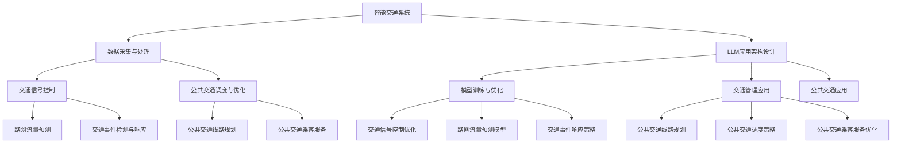

                 

# 文章标题

《LLM在智能交通系统中的应用》

> 关键词：LLM，智能交通系统，交通管理，数据预处理，模型训练，实际应用案例

> 摘要：本文将详细探讨大语言模型（LLM）在智能交通系统中的应用，包括其定义、原理、架构设计、数据处理与模型训练、以及实际应用案例。通过对LLM在智能交通系统中各个应用领域的深入分析，本文旨在为读者提供一幅清晰的应用全景图，同时揭示其在实际应用中面临的挑战与未来发展趋势。

### 第一部分：智能交通系统概述

#### 第1章：智能交通系统简介

**1.1 智能交通系统的定义与背景**

智能交通系统（Intelligent Transportation System，简称ITS）是一种基于信息技术、数据通信传输技术、电子传感技术、电子控制技术、计算机技术和人工智能技术的综合系统。它的目标是提高交通效率、减少交通事故、降低空气污染、优化资源利用，从而实现智能化的交通管理和服务。

智能交通系统的发展可以追溯到20世纪60年代，当时主要侧重于车辆导航和道路信息管理。随着技术的进步，智能交通系统的应用领域不断扩展，包括但不限于交通信号控制、交通流量监测、交通事件检测与响应、公共交通服务优化等。

**1.2 智能交通系统的发展历程**

智能交通系统的发展历程可以分为以下几个阶段：

- **第一阶段（1960s-1980s）：早期探索**  
  这一阶段主要是对交通信息的采集和传输进行基础研究，如车辆导航系统和道路信息管理系统。

- **第二阶段（1990s）：系统集成**  
  随着计算机技术和通信技术的快速发展，智能交通系统开始逐步集成多种技术，实现交通管理和服务功能的综合应用。

- **第三阶段（2000s-2010s）：智能化发展**  
  这一阶段，人工智能、大数据、云计算等新技术逐渐融入智能交通系统，使得交通管理更加智能化和高效化。

- **第四阶段（2010s-至今）：全面智能化**  
  当前，智能交通系统已经实现了高度智能化，包括自动驾驶、车联网、智能交通信号控制等，正朝着全面智能化的方向迈进。

**1.3 智能交通系统的关键组成部分**

智能交通系统的关键组成部分包括：

- **传感器与监控设备**  
  传感器和监控设备用于收集道路、车辆和交通环境的相关数据，如交通流量、车辆速度、道路状况等。

- **数据处理与分析系统**  
  数据处理与分析系统负责对采集到的交通数据进行处理、分析和存储，为交通管理和决策提供数据支持。

- **通信网络**  
  通信网络用于传输交通数据、控制指令和消息，确保各个组成部分之间的信息流通。

- **控制系统**  
  控制系统负责对交通信号灯、交通事件检测与响应等系统进行控制和调度，实现交通管理的自动化和智能化。

- **决策支持系统**  
  决策支持系统通过对交通数据的分析和预测，为交通管理者提供决策建议，优化交通资源配置和交通管理策略。

**1.4 智能交通系统的社会影响**

智能交通系统在社会生活中具有广泛的影响，包括：

- **提高交通效率**  
  通过优化交通信号控制和交通流量管理，智能交通系统可以显著提高交通效率，减少交通拥堵。

- **减少交通事故**  
  智能交通系统可以通过实时监控和预警，及时检测和响应交通事件，减少交通事故的发生。

- **降低空气污染**  
  通过优化交通流量和减少车辆排放，智能交通系统有助于降低空气污染，改善环境质量。

- **优化资源利用**  
  智能交通系统可以通过优化交通流量和资源配置，提高道路、停车场等交通设施的使用效率，降低资源浪费。

- **提升公共交通服务质量**  
  智能交通系统可以通过优化公共交通调度和线路规划，提高公共交通服务的质量和效率，满足人民群众的出行需求。

#### 第2章：LLM与智能交通系统

**2.1 LLM的概念与原理**

大语言模型（Large Language Model，简称LLM）是一种基于深度学习的自然语言处理模型，通过训练大量文本数据，模型能够预测文本中的下一个词或句子，从而生成连贯、自然的语言文本。LLM的工作原理主要基于神经网络，特别是循环神经网络（RNN）和变压器（Transformer）等模型架构。

LLM的核心技术包括：

- **预训练（Pre-training）**：通过在大规模文本数据集上进行预训练，模型学会了文本的语法、语义和上下文信息。
- **微调（Fine-tuning）**：在特定任务上，对预训练的模型进行微调，使其适应特定领域的应用需求。
- **生成（Generation）**：利用模型生成的能力，自动生成符合语法和语义规则的自然语言文本。

**2.2 LLM在智能交通系统中的应用价值**

LLM在智能交通系统中具有广泛的应用价值，主要包括以下几个方面：

- **交通信息处理与分析**：LLM可以处理和分析大量的交通数据，提取有用的信息，为交通管理和决策提供支持。
- **智能交通信号控制**：通过分析实时交通数据，LLM可以优化交通信号控制策略，提高交通效率和安全性。
- **交通事件检测与响应**：LLM可以实时监测交通状况，快速识别交通事件，并生成相应的应对策略。
- **公共交通调度与优化**：LLM可以优化公共交通调度和线路规划，提高公共交通服务的质量和效率。
- **交通规划与设计**：LLM可以辅助交通规划师进行交通网络设计和规划，提供科学的数据分析和预测。

**2.3 LLM与传统交通系统的区别**

与传统交通系统相比，LLM在智能交通系统中具有以下显著区别：

- **技术层面**：传统交通系统主要依赖物理设备和人工管理，而LLM则基于人工智能和大数据技术，具有更高的智能化水平和自适应能力。
- **数据处理能力**：传统交通系统数据处理能力有限，而LLM可以处理和分析大规模、多维度的交通数据，提供更全面和深入的数据支持。
- **实时性**：传统交通系统反应速度较慢，而LLM可以实时处理和分析交通数据，快速响应交通事件和变化。
- **灵活性**：传统交通系统在应对复杂交通状况时灵活性较差，而LLM可以根据实时数据和交通状况动态调整交通管理策略，提高应对能力。

### 第二部分：LLM在智能交通系统的应用架构

#### 第3章：智能交通系统中的LLM架构

**3.1 LLM架构的设计原则**

智能交通系统中LLM架构的设计原则包括：

- **数据驱动**：LLM架构应基于大量交通数据的输入，通过数据驱动的方式实现交通信息处理与分析。
- **模块化**：LLM架构应采用模块化设计，将不同的功能模块进行分离，实现功能模块的可扩展性和可维护性。
- **适应性**：LLM架构应具有适应性，能够根据交通状况的变化和需求的变化，动态调整和优化交通管理策略。
- **可靠性**：LLM架构应具备高可靠性，能够在各种复杂交通状况下稳定运行，保证交通系统的正常运行。

**3.2 LLM在交通管理中的应用**

LLM在交通管理中的应用主要包括以下几个方面：

- **交通信号控制**：LLM可以通过分析实时交通数据，优化交通信号控制策略，提高交通效率和安全性。
- **路网流量预测**：LLM可以通过对历史交通数据和实时数据的分析，预测路网流量变化，为交通管理和决策提供数据支持。
- **交通事件检测与响应**：LLM可以实时监测交通状况，快速识别交通事件，并生成相应的应对策略，减少交通事故和交通拥堵。
- **公共交通调度与优化**：LLM可以优化公共交通调度和线路规划，提高公共交通服务的质量和效率。

**3.3 LLM在公共交通中的应用**

LLM在公共交通中的应用主要包括以下几个方面：

- **公共交通线路规划**：LLM可以通过分析交通数据和乘客需求，优化公共交通线路规划，提高线路的覆盖范围和服务质量。
- **公共交通调度与优化**：LLM可以通过实时交通数据和乘客需求预测，动态调整公共交通调度策略，提高公共交通服务的响应速度和效率。
- **公共交通乘客服务**：LLM可以通过分析乘客行为和需求，提供个性化的乘客服务，如实时公交到站信息、路线规划等。

### 第三部分：LLM在智能交通系统的数据处理与模型训练

#### 第4章：智能交通系统的数据处理与模型训练

**4.1 数据采集与预处理**

智能交通系统中的数据采集与预处理是模型训练的关键步骤，主要包括以下几个方面：

- **数据源选择**：选择合适的数据源，如交通传感器、交通监控摄像头、GPS数据等，确保数据的质量和完整性。
- **数据预处理方法**：对采集到的交通数据进行清洗、去噪、归一化等预处理操作，提高数据的质量和可用性。

**4.2 LLM的训练与优化**

LLM的训练与优化主要包括以下几个方面：

- **训练数据集构建**：构建包含大量交通数据的训练数据集，确保数据集的多样性和代表性。
- **模型训练过程**：采用深度学习框架，如TensorFlow或PyTorch，训练LLM模型，优化模型参数。
- **模型优化与调整**：通过交叉验证和性能评估，调整模型参数，提高模型在智能交通系统中的性能。

### 第四部分：LLM在智能交通系统中的实际应用

#### 第5章：基于LLM的智能交通系统案例研究

**5.1 案例一：城市交通信号控制系统**

- **5.1.1 系统架构设计**  
  系统架构设计包括数据采集模块、数据处理模块、交通信号控制模块和用户交互模块。

- **5.1.2 系统实现与测试**  
  系统实现包括交通信号控制算法的编写和模型训练，测试主要验证系统在不同交通状况下的性能和可靠性。

- **5.1.3 系统效果评估**  
  系统效果评估主要通过对比实际交通状况和预测交通状况的误差，评估系统的交通信号控制效果。

**5.2 案例二：智慧公共交通调度系统**

- **5.2.1 系统需求分析**  
  系统需求分析主要包括公共交通线路规划、公共交通调度和公共交通乘客服务等方面的需求。

- **5.2.2 系统设计与实现**  
  系统设计包括数据采集与处理模块、模型训练模块和调度策略优化模块。

- **5.2.3 系统运行效果**  
  系统运行效果主要通过评估公共交通线路规划的科学性、调度策略的合理性以及乘客服务的满意度等方面来衡量。

### 第五部分：LLM在智能交通系统中的挑战与未来趋势

#### 第6章：LLM在智能交通系统中的挑战

**6.1 LLM在智能交通系统中的挑战**

- **数据隐私与安全**：智能交通系统涉及大量个人隐私数据，如何保护数据隐私和安全是LLM在智能交通系统中面临的重要挑战。
- **模型解释性与可解释性**：LLM在智能交通系统中的应用往往具有高度复杂性和非线性，如何提高模型的解释性和可解释性，使其更易于被用户理解和接受，是当前的一个重要研究方向。
- **模型公平性与偏见**：在训练过程中，LLM可能会受到数据偏见的影响，导致模型在特定群体上表现不佳，如何消除模型偏见，提高公平性是另一个关键挑战。

**6.2 智能交通系统的未来趋势**

- **新型交通模式与LLM**：随着自动驾驶、车联网等新型交通模式的发展，LLM将在这些领域发挥重要作用，推动智能交通系统向更高层次发展。
- **人工智能与传统交通行业的融合**：人工智能技术与传统交通行业的深度融合，将带来交通管理、交通服务等方面的革命性变革。
- **智能交通系统的可持续发展**：在应对城市化、人口增长等挑战的过程中，智能交通系统需要实现可持续发展，LLM将在其中发挥关键作用。

### 附录

#### 第7章：LLM在智能交通系统中的应用资源

- **7.1 常用LLM框架与工具**  
  TensorFlow、PyTorch、Hugging Face Transformers等。

- **7.2 开发与测试环境搭建**  
  硬件环境要求：高性能计算服务器、GPU等；软件环境配置：操作系统、深度学习框架、编程语言等。

- **7.3 实际应用案例代码解析**  
  代码示例：交通信号控制算法实现、公共交通调度策略优化等。

### 附录A：智能交通系统与LLM流程图

### 结语

作者：AI天才研究院/AI Genius Institute & 禅与计算机程序设计艺术 /Zen And The Art of Computer Programming

本文旨在探讨LLM在智能交通系统中的应用，通过详细分析其定义、原理、架构设计、数据处理与模型训练、以及实际应用案例，揭示了LLM在智能交通系统中的重要价值。然而，随着智能交通系统的发展，LLM在实际应用中仍面临诸多挑战，需要进一步研究和探索。未来，LLM有望在智能交通系统中发挥更为重要的作用，推动交通行业的智能化和可持续发展。

