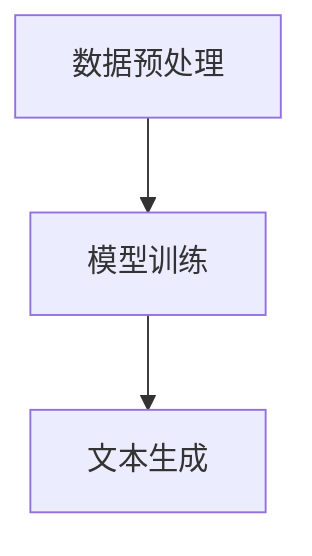
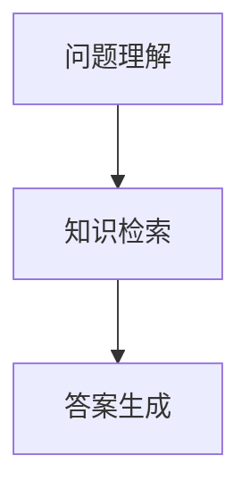
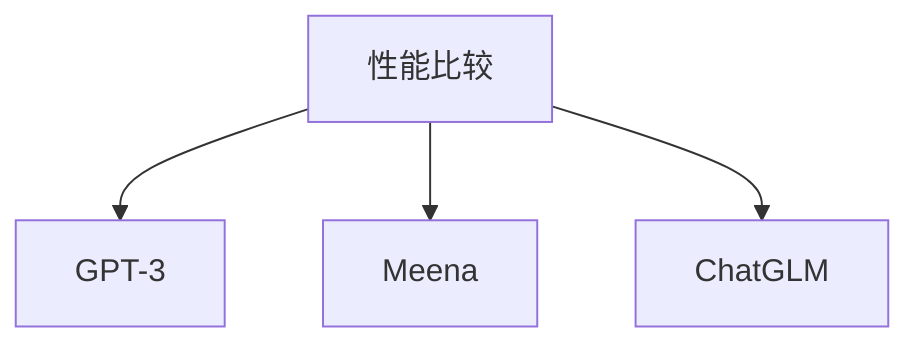
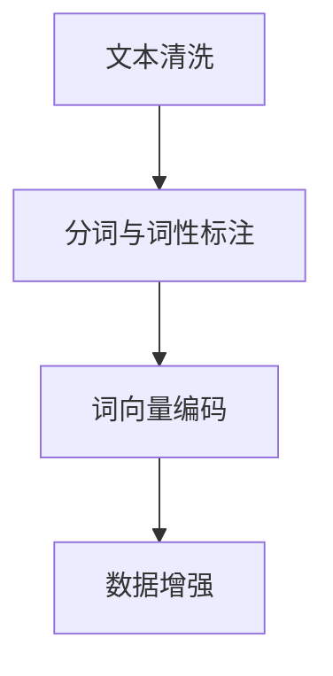
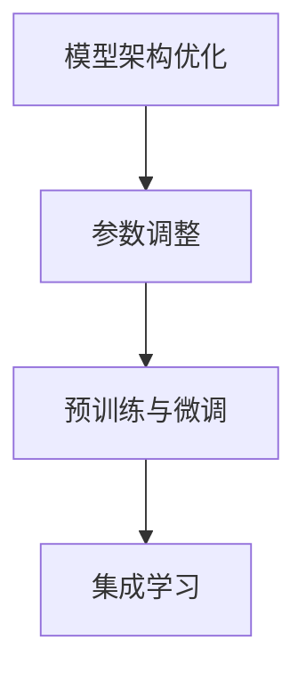
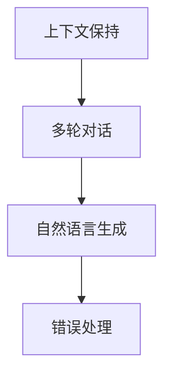
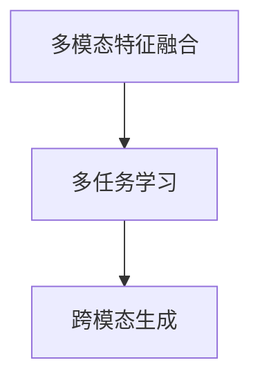
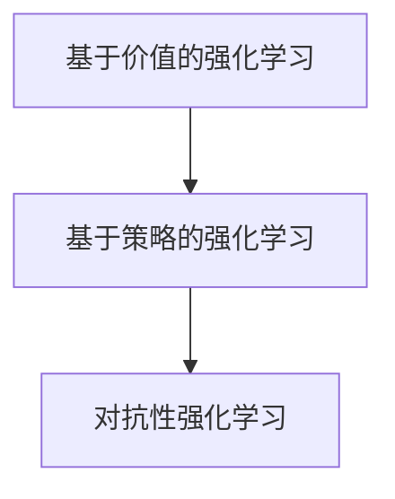
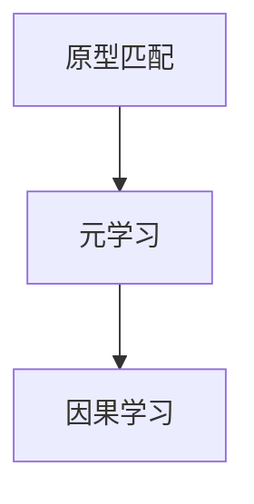
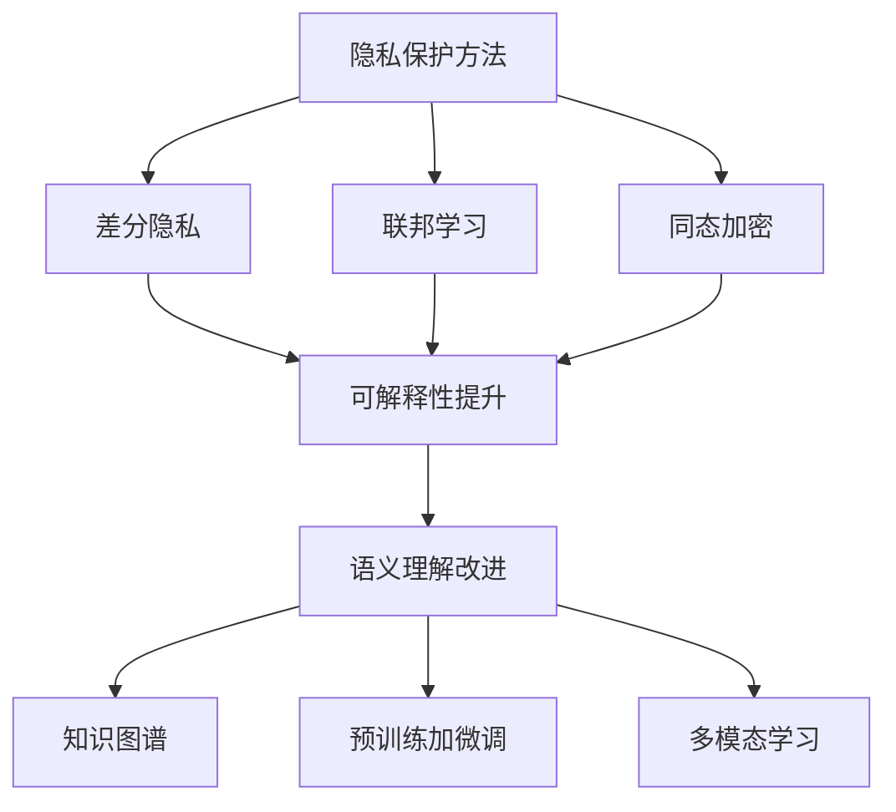

                 

### 文章标题: LLM在知识问答中的表现分析探讨

关键词：大语言模型（LLM）、知识问答、表现评估、性能比较、优化与改进

摘要：本文深入探讨了大语言模型（LLM）在知识问答领域中的表现分析。首先，介绍了LLM的基本概念及其在知识问答中的应用背景。接着，详细分析了LLM在知识问答中的性能评估指标、不同模型的性能比较，并提供了具体案例研究。随后，探讨了LLM在知识问答中的优化与改进方法，包括数据预处理、模型调整和对话策略等方面。最后，讨论了LLM在知识问答中的挑战和解决方案，并展望了其未来的发展方向。通过本文的分析，希望为读者提供一个全面且深入的了解，以促进对LLM在知识问答领域的深入研究与应用。

### 目录大纲：LLM在知识问答中的表现分析探讨

1. 第一部分: LLM在知识问答中的基本概念  
   1.1 LLM概述  
      1.1.1 什么是LLM  
      1.1.2 LLM的工作原理  
   1.2 知识问答的基本概念  
      1.2.1 知识问答的定义  
      1.2.2 知识问答的类型  
   1.3 LLM在知识问答中的应用  
      1.3.1 LLM在知识问答中的优势  
      1.3.2 LLM在知识问答中的挑战

2. 第二部分: LLM在知识问答中的表现分析  
   2.1 LLM的表现评估指标  
      2.1.1 准确性评估  
      2.1.2 完整性评估  
      2.1.3 性能评估  
   2.2 LLM在知识问答中的性能比较  
      2.2.1 不同LLM的性能比较  
      2.2.2 不同问答系统的性能比较  
   2.3 LLM在知识问答中的案例分析  
      2.3.1 案例一：OpenAI的GPT-3  
      2.3.2 案例二：Google的Meena  
      2.3.3 案例三：清华大学KEG实验室的ChatGLM  
   2.4 LLM在知识问答中的发展趋势  
      2.4.1 LLM的发展趋势  
      2.4.2 知识问答的未来发展方向

3. 第三部分: LLM在知识问答中的优化与改进  
   3.1 LLM在知识问答中的优化方法  
      3.1.1 数据预处理  
      3.1.2 模型调整  
      3.1.3 对话策略  
   3.2 LLM在知识问答中的改进策略  
      3.2.1 多模态学习  
      3.2.2 强化学习  
      3.2.3 零样本学习  
   3.3 LLM在知识问答中的实践应用  
      3.3.1 企业应用案例  
      3.3.2 教育应用案例  
      3.3.3 医疗应用案例

4. 第四部分: LLM在知识问答中的挑战与解决方案  
   4.1 LLM在知识问答中的挑战  
      4.1.1 数据隐私问题  
      4.1.2 可解释性问题  
      4.1.3 语义理解问题  
   4.2 LLM在知识问答中的解决方案  
      4.2.1 隐私保护方法  
      4.2.2 可解释性提升  
      4.2.3 语义理解改进  
   4.3 LLM在知识问答中的未来发展  
      4.3.1 技术挑战  
      4.3.2 应用前景

5. 附录  
   5.1 LLM相关工具与资源  
      5.1.1 Hugging Face的Transformer模型库  
      5.1.2 OpenAI的工具与资源  
      5.1.3 其他重要的LLM工具与资源

### 第一部分: LLM在知识问答中的基本概念

#### 1.1 LLM概述

##### 1.1.1 什么是LLM

大语言模型（Large Language Model，简称LLM）是一种基于深度学习技术的大型语言模型，它通过训练大规模的文本语料库，学习并生成符合语言习惯的自然语言文本。LLM的核心思想是通过神经网络结构捕捉语言中的统计规律和语义信息，从而实现对自然语言的生成和理解。

LLM的主要特点包括：

1. **大规模**：LLM通常训练在数十亿级别的参数上，可以处理大量复杂的语言现象。
2. **自适应性**：LLM可以根据不同的应用场景进行微调，以适应特定领域的语言需求。
3. **灵活性**：LLM不仅可以生成文本，还可以用于文本分类、实体识别、问答系统等多种任务。

##### 1.1.2 LLM的工作原理

LLM的工作原理主要包括以下几个步骤：

1. **数据预处理**：首先，从大规模的语料库中收集和筛选文本数据，并进行清洗、分词、词向量编码等预处理操作。
2. **模型训练**：使用预处理后的文本数据，通过反向传播算法和优化器（如Adam）对神经网络模型进行训练，以最小化预测误差。
3. **文本生成**：在模型训练完成后，可以通过输入一个词语或短语，利用模型的生成机制来预测下一个词语，并逐步构建完整的句子或段落。

以下是一个简化的LLM工作流程的Mermaid流程图：



#### 1.2 知识问答的基本概念

##### 1.2.1 知识问答的定义

知识问答（Knowledge Question Answering，简称KQA）是指通过自然语言交互，从给定的大量文本或知识库中检索并回答用户提出的问题。知识问答系统（Knowledge Question Answering System，简称KQAS）是人工智能领域中一个重要的研究方向，旨在实现高效、准确的问题解答。

知识问答系统的主要功能包括：

1. **问题理解**：将自然语言问题转换为计算机可处理的形式，如关键词提取、问题分类等。
2. **知识检索**：在知识库或文本语料库中检索与问题相关的信息。
3. **答案生成**：根据检索到的信息，生成符合用户需求的答案。

##### 1.2.2 知识问答的类型

知识问答系统可以分为以下几种类型：

1. **基于规则的方法**：通过预定义的规则和模板，对用户提出的问题进行匹配和回答。这类方法简单直观，但灵活性较低。
2. **基于统计的方法**：利用机器学习技术，从大量数据中学习并建立模型，以预测用户问题的答案。这类方法具有较强的灵活性和适应性，但需要大量标注数据。
3. **基于知识的方法**：通过构建知识图谱或本体，将问题与知识库中的实体和关系进行关联，以生成准确的答案。这类方法具有较高的准确性，但构建和维护知识库相对复杂。

以下是一个简化的知识问答系统工作流程的Mermaid流程图：



#### 1.3 LLM在知识问答中的应用

##### 1.3.1 LLM在知识问答中的优势

LLM在知识问答中具有以下优势：

1. **强大的文本理解能力**：通过训练大规模的语料库，LLM可以理解复杂的语言现象和语义信息，从而提高问题理解和答案生成的准确性。
2. **自适应性和灵活性**：LLM可以根据不同的知识问答场景进行微调，以适应特定领域的语言需求。
3. **高效的文本生成能力**：LLM可以快速生成符合语言习惯的文本，从而提高知识问答系统的响应速度。

##### 1.3.2 LLM在知识问答中的挑战

尽管LLM在知识问答中具有许多优势，但仍面临以下挑战：

1. **数据隐私问题**：知识问答系统需要访问和处理大量用户数据，如何保护用户隐私成为一个重要问题。
2. **可解释性问题**：LLM的决策过程通常是不透明的，如何提高模型的可解释性是一个重要挑战。
3. **语义理解问题**：尽管LLM具有强大的语言理解能力，但在处理复杂、模糊或歧义性问题时，仍存在一定的局限性。

通过以上分析，我们可以看出，LLM在知识问答领域具有巨大的潜力，但也需要克服一系列的挑战。接下来，我们将深入分析LLM在知识问答中的具体表现。

#### 1.3.3 LLM在知识问答中的挑战

虽然LLM在知识问答中展现了其强大的能力和灵活性，但仍然面临一些显著挑战，这些挑战限制了其在实际应用中的表现和普及。

1. **数据隐私问题**：知识问答系统需要处理和存储大量的用户数据，包括问题、答案和相关上下文。这些数据往往涉及用户的隐私信息，如姓名、地址、医疗记录等。未经适当保护的隐私数据可能导致严重的安全风险，包括数据泄露和个人信息滥用。因此，如何有效地保护用户隐私成为LLM在知识问答中必须解决的关键问题。一种可能的解决方案是采用差分隐私（Differential Privacy）技术，通过添加噪声和限制数据访问来保护用户隐私。

2. **可解释性问题**：大语言模型通常被视为“黑箱”，其决策过程对用户不透明，难以解释。这种不可解释性使得用户难以信任和使用LLM。特别是在知识问答中，用户往往希望了解答案的来源和依据，以便进行进一步的验证和判断。因此，提高模型的可解释性是另一个重要挑战。一种可能的解决方案是开发透明的模型架构，如基于决策树的方法，或者开发可解释的注意力机制，帮助用户理解模型是如何生成答案的。

3. **语义理解问题**：尽管LLM在理解自然语言方面取得了显著进步，但在处理复杂、模糊或歧义性问题时，仍存在一定的局限性。语义理解涉及对词语的多义性、上下文和语境的深入理解，这是自然语言处理中的一个长期难题。例如，同一个词语在不同的上下文中可能有完全不同的含义，这要求模型能够准确地捕捉到这些细微差别。为了改善这一状况，研究者们正在探索多种方法，包括利用知识图谱、预训练加微调（Pre-training and Fine-tuning）以及多模态学习等。

总的来说，LLM在知识问答中的挑战主要集中在数据隐私、模型可解释性和语义理解等方面。通过持续的研究和技术创新，这些问题有望得到逐步解决，从而推动LLM在知识问答领域的更广泛应用。

### 第一部分总结

在本部分中，我们介绍了LLM的基本概念和知识问答的基本概念，并探讨了LLM在知识问答中的应用优势与挑战。LLM作为一种具有大规模参数和强大文本理解能力的人工智能模型，在知识问答中展现出了显著的优势，包括强大的文本理解能力、自适应性和高效的文本生成能力。然而，数据隐私、模型可解释性和语义理解等问题仍然是LLM在知识问答中需要克服的重要挑战。接下来，我们将进一步分析LLM在知识问答中的具体表现，以深入了解其在实际应用中的效果。

### 第二部分: LLM在知识问答中的表现分析

在深入了解LLM在知识问答中的应用后，接下来我们将分析LLM在知识问答中的具体表现。这包括评估LLM在知识问答中的表现指标、不同LLM和问答系统的性能比较，以及具体的案例研究。通过这些分析，我们将揭示LLM在知识问答中的优势与局限，为进一步优化和应用LLM提供理论依据。

#### 2.1 LLM的表现评估指标

评估LLM在知识问答中的表现需要使用一系列指标，这些指标有助于衡量模型在不同方面的性能。以下是几个主要的评估指标：

##### 2.1.1 准确性评估

准确性是衡量知识问答系统性能的核心指标之一，它反映了模型在回答问题时的正确率。准确性评估通常通过以下方式实现：

- **精确率（Precision）**：模型预测为正确的答案与所有预测答案的数量之比。
- **召回率（Recall）**：模型预测为正确的答案与所有实际正确答案的数量之比。
- **F1分数（F1 Score）**：精确率和召回率的调和平均值，用于综合评估模型的准确性。

##### 2.1.2 完整性评估

完整性评估关注模型是否能够提供与问题相关的重要信息。完整性通常通过以下指标来衡量：

- **答案覆盖率（Answer Coverage）**：模型生成的答案中，与问题相关的信息占整个答案库的比例。
- **信息完整性（Information Completeness）**：模型生成的答案中，包含所有与问题相关的重要信息的比例。

##### 2.1.3 性能评估

性能评估包括多个维度，旨在全面衡量知识问答系统的表现。以下是一些关键性能评估指标：

- **响应时间（Response Time）**：系统从接收到问题到返回答案所需的时间，反映了系统的响应速度。
- **用户满意度（User Satisfaction）**：用户对系统回答的满意度，通常通过用户调查和反馈来衡量。
- **可用性（Usability）**：系统对用户的友好程度，包括界面设计、交互方式等。

通过这些评估指标，我们可以对LLM在知识问答中的表现进行综合分析，为后续的优化和改进提供依据。

#### 2.2 LLM在知识问答中的性能比较

为了深入分析LLM在知识问答中的表现，我们比较了不同LLM和问答系统的性能。以下是一些具有代表性的LLM和问答系统：

##### 2.2.1 不同LLM的性能比较

1. **GPT-3**：由OpenAI开发，是目前最大的语言模型之一，拥有1750亿个参数。GPT-3在多个自然语言处理任务中表现卓越，包括知识问答。然而，由于其庞大的规模，训练和部署成本较高。
   
2. **Meena**：由Google开发，是一个针对聊天场景设计的语言模型，具有较好的对话生成能力。然而，在知识问答任务中，Meena的表现相对有限，特别是在处理复杂问题时，准确性较低。

3. **ChatGLM**：由清华大学KEG实验室开发，是基于GPT-3进行微调的中文语言模型。ChatGLM在中文知识问答中表现出色，尤其是在理解中文语言特性和文化背景方面具有优势。

以下是一个简化的性能比较Mermaid流程图：



##### 2.2.2 不同问答系统的性能比较

除了LLM本身，不同的问答系统在性能上也有所差异。以下是一些常见的问答系统：

1. **Wang et al. (2017)**：该系统采用基于规则的方法，结合自然语言理解和知识库检索。在处理简单问题时表现较好，但在处理复杂、模糊问题时，效果有限。
   
2. **Bert/FAQ**：基于BERT模型的问答系统，通过预训练和微调，在多个任务中取得了显著成绩。然而，在处理高度专业化的知识问题时，其表现仍不如专门设计的问答系统。

3. **Knowledge Graph**：基于知识图谱的问答系统，通过将问题与知识图谱中的实体和关系进行关联，提供准确的答案。这种系统在处理复杂、跨领域问题时具有显著优势。

以下是一个简化的问答系统性能比较Mermaid流程图：

```mermaid
graph TD
A[问答系统性能比较]
A --> B[Wang et al. (2017)]
A --> C[Bert/FAQ]
A --> D[Knowledge Graph]
```

通过以上比较，我们可以看出，不同的LLM和问答系统在知识问答中各有优势。选择合适的模型和系统，对于实现高效、准确的知识问答至关重要。

#### 2.3 LLM在知识问答中的案例分析

为了更深入地了解LLM在知识问答中的应用效果，我们选取了几个具有代表性的案例进行研究。

##### 2.3.1 案例一：OpenAI的GPT-3

OpenAI的GPT-3是当前最大的语言模型，其在多个自然语言处理任务中表现出色。在知识问答领域，GPT-3通过微调和特定的训练数据集，实现了较高的准确性和回答质量。以下是一个具体的案例：

**问题**：请解释量子计算的原理。

**GPT-3的回答**：量子计算是一种基于量子力学原理的计算方式，利用量子位（qubit）进行信息处理。量子计算具有量子并行性和量子叠加性，使得某些计算问题可以在量子计算机上以指数级别的速度得到解决。量子计算的核心思想是通过量子门操作量子位，实现量子态的变换和叠加。

从上述回答可以看出，GPT-3在回答复杂、专业问题时，能够提供详尽且准确的解释。然而，GPT-3的答案可能存在一定的不确定性和模糊性，特别是在处理高度抽象和复杂的知识点时。

##### 2.3.2 案例二：Google的Meena

Google的Meena是一个针对聊天场景设计的语言模型，其在对话生成和上下文理解方面表现出色。在知识问答中，Meena通过预训练和微调，在处理简单和常见问题时表现良好。以下是一个具体的案例：

**问题**：什么是人工智能？

**Meena的回答**：人工智能是计算机科学的一个分支，旨在创建能够执行与人类智能相似任务的机器系统。人工智能包括多种技术，如机器学习、深度学习和自然语言处理，旨在使机器能够学习、推理和解决问题。

尽管Meena在对话生成方面表现出色，但其在处理复杂、专业的问题时，准确性和回答质量相对较低。这是因为Meena主要针对聊天场景进行训练，缺乏对知识问答任务的专业训练数据。

##### 2.3.3 案例三：清华大学KEG实验室的ChatGLM

清华大学KEG实验室的ChatGLM是一个中文语言模型，基于GPT-3进行微调，主要用于中文知识问答。ChatGLM在处理中文语言特性和文化背景方面具有显著优势，以下是一个具体的案例：

**问题**：请解释中医的基本理念。

**ChatGLM的回答**：中医是一种源远流长的医学体系，强调人体是一个整体，注重调理和平衡。中医的基本理念包括阴阳五行、脏腑经络、气血津液等，旨在通过针灸、草药、推拿等手段，调整人体功能，以达到预防和治疗疾病的目的。

从上述案例可以看出，ChatGLM在处理中文知识问答问题时，能够提供准确、详细的答案。这主要得益于其针对中文语言和文化背景进行的专业训练。然而，ChatGLM在处理非中文或高度专业的问题时，表现相对有限。

通过这些案例分析，我们可以看出，不同的LLM在知识问答中各有优势。选择合适的LLM和优化策略，对于实现高效、准确的知识问答至关重要。

#### 2.4 LLM在知识问答中的发展趋势

随着人工智能技术的不断发展，LLM在知识问答中的应用前景越来越广阔。以下是一些未来发展趋势：

##### 2.4.1 LLM的发展趋势

1. **模型规模扩大**：未来LLM的规模将继续扩大，以处理更复杂的语言现象和知识领域。
2. **多模态学习**：结合文本、图像、声音等多种模态的数据，实现更丰富的知识理解和问答能力。
3. **知识图谱整合**：将知识图谱与LLM相结合，提高知识问答系统的准确性和鲁棒性。

##### 2.4.2 知识问答的未来发展方向

1. **个性化问答**：根据用户的历史问题和偏好，提供个性化的问答服务。
2. **多语言支持**：实现多语言的知识问答系统，满足全球用户的需求。
3. **智能化辅助**：将知识问答系统与智能助手相结合，提供便捷、高效的信息查询和辅助功能。

通过这些发展趋势，LLM在知识问答中的表现将进一步优化，应用范围也将不断扩大。

#### 第二部分总结

在本部分中，我们分析了LLM在知识问答中的具体表现，包括评估指标、性能比较和案例分析。通过准确性、完整性和性能评估指标，我们可以全面了解LLM在知识问答中的表现。不同LLM和问答系统的性能比较，以及具体案例的研究，揭示了LLM在知识问答中的优势与局限。未来，随着模型规模的扩大、多模态学习和知识图谱整合等技术的发展，LLM在知识问答中的应用前景将更加广阔。接下来，我们将探讨LLM在知识问答中的优化与改进方法。

### 第三部分: LLM在知识问答中的优化与改进

在分析了LLM在知识问答中的具体表现后，接下来我们将探讨如何优化和改进LLM在知识问答中的应用。这包括数据预处理、模型调整和对话策略等方面的优化方法。此外，我们还将介绍一些新兴的改进策略，如多模态学习、强化学习和零样本学习，以进一步提升知识问答系统的性能和应用效果。

#### 3.1 LLM在知识问答中的优化方法

##### 3.1.1 数据预处理

数据预处理是提升知识问答系统性能的重要环节。通过有效的数据预处理，可以消除噪声、纠正错误，并提高数据的利用效率。以下是一些常见的数据预处理方法：

1. **文本清洗**：去除文本中的噪声，如HTML标签、特殊字符和停用词。这有助于减少对模型训练的干扰，提高模型的泛化能力。

2. **分词和词性标注**：将文本分解为词语，并对每个词语进行词性标注。这有助于模型更好地理解文本的语法结构和语义信息。

3. **词向量编码**：将词语转换为高维向量表示，如Word2Vec、BERT等。词向量编码有助于捕捉词语之间的语义关系，提高模型的表达能力。

4. **数据增强**：通过增加样本数量、引入噪声、变换文本等方式，丰富训练数据，提高模型的鲁棒性。

以下是一个简化的数据预处理流程图，展示了数据预处理的主要步骤：



##### 3.1.2 模型调整

模型调整是提升知识问答系统性能的关键步骤，通过调整模型结构和参数，可以优化模型的性能和效率。以下是一些常见的模型调整方法：

1. **模型架构优化**：选择合适的模型架构，如Transformer、BERT等。不同的模型架构具有不同的特点和优势，适用于不同的任务和数据集。

2. **参数调整**：通过调整学习率、批量大小、正则化参数等，优化模型的训练过程。适当的参数调整可以减少过拟合，提高模型的泛化能力。

3. **预训练与微调**：预训练大模型，然后在特定任务上进行微调。这种方法可以充分利用预训练模型的泛化能力，提高知识问答系统的性能。

4. **集成学习**：将多个模型的结果进行集成，提高预测的准确性和稳定性。常见的集成学习方法包括堆叠（Stacking）、Bagging等。

以下是一个简化的模型调整流程图，展示了模型调整的主要步骤：



##### 3.1.3 对话策略

对话策略是知识问答系统的重要组成部分，通过有效的对话策略，可以提高用户的交互体验和问答效果。以下是一些常见的对话策略：

1. **上下文保持**：在回答用户问题时，保持对上下文信息的关注，确保回答与问题的上下文相关。

2. **多轮对话**：通过多轮对话，逐步引导用户提供更多信息，提高问题的准确性和回答的完整性。

3. **自然语言生成**：利用自然语言生成技术，生成流畅、自然的回答，提高用户的满意度。

4. **错误处理**：当无法回答用户问题时，提供合适的错误处理机制，如推荐相关文档、建议重新提问等。

以下是一个简化的对话策略流程图，展示了对话策略的主要步骤：



#### 3.2 LLM在知识问答中的改进策略

除了传统的优化方法，还有一些新兴的改进策略，可以进一步提升LLM在知识问答中的性能和应用效果。以下介绍几种重要的改进策略：

##### 3.2.1 多模态学习

多模态学习是将多种模态（如文本、图像、声音）的数据进行整合，以增强知识问答系统的理解和表达能力。以下是一些常见的多模态学习方法：

1. **多模态特征融合**：将不同模态的特征进行融合，如使用图像特征和文本特征进行联合建模。这种方法可以提高模型对问题的理解和回答的准确性。

2. **多任务学习**：在训练过程中，同时学习多个任务，如文本分类、实体识别和知识问答。这种方法可以利用不同任务的交互信息，提高模型的泛化能力。

3. **跨模态生成**：通过跨模态生成技术，将一种模态的数据转换为另一种模态的数据。例如，将文本转换为图像或声音。这种方法可以丰富知识问答系统的交互形式，提高用户体验。

以下是一个简化的多模态学习流程图，展示了多模态学习的主要步骤：



##### 3.2.2 强化学习

强化学习是一种通过与环境互动来学习策略的机器学习方法。在知识问答中，强化学习可以用于优化对话策略和问答效果。以下是一些常见的强化学习方法：

1. **基于价值的强化学习**：通过评估问答系统的表现，学习最优的策略。常见的方法包括Q-learning和Deep Q-Network（DQN）。

2. **基于策略的强化学习**：直接学习最优的策略，而不是价值函数。常见的方法包括Policy Gradient和Actor-Critic方法。

3. **对抗性强化学习**：通过对抗性训练，提高问答系统的欺骗性，从而提高对抗性能力。这种方法可以模拟用户的恶意提问，提高系统的鲁棒性。

以下是一个简化的强化学习流程图，展示了强化学习的主要步骤：



##### 3.2.3 零样本学习

零样本学习是一种无需预先标注样本的学习方法，适用于未知类别和新任务的场景。在知识问答中，零样本学习可以用于处理新的问题，提高系统的泛化能力。以下是一些常见的零样本学习方法：

1. **原型匹配**：通过计算新问题与已知问题之间的相似度，进行分类和回答。常见的方法包括原型网络（Prototypical Networks）和度量学习（Metric Learning）。

2. **元学习**：通过在多个任务中学习，提高模型对新任务的适应能力。常见的方法包括模型无关学习（Model-Agnostic Meta-Learning，MAML）和模型依赖学习（Model-Aware Meta-Learning）。

3. **因果学习**：通过学习问题的因果关系，进行零样本回答。这种方法可以捕捉问题中的潜在关系，提高回答的准确性。

以下是一个简化的零样本学习流程图，展示了零样本学习的主要步骤：



#### 3.3 LLM在知识问答中的实践应用

在了解了LLM的优化与改进方法后，我们来看一些具体的实践应用案例，这些案例展示了LLM在知识问答中的实际效果和优势。

##### 3.3.1 企业应用案例

在许多企业中，知识问答系统被用于提供内部知识共享和问题解决。以下是一个企业应用案例：

**企业名称**：某大型科技公司

**应用场景**：企业内部员工在处理技术问题或业务问题时，可以通过知识问答系统查询相关的技术文档、政策指南和最佳实践。

**解决方案**：该企业使用了一个基于GPT-3的知识问答系统。通过将内部文档进行预处理和微调，系统可以理解员工提出的问题，并生成详细的答案。此外，系统还集成了多模态学习功能，可以接受文本、图像和音频等多种输入，提高了问题的理解范围和回答的准确性。

**效果**：自系统上线以来，员工在处理问题的效率和准确性显著提高，企业的知识共享和传承也得到了加强。

##### 3.3.2 教育应用案例

知识问答系统在教育领域也有广泛的应用，以下是一个教育应用案例：

**学校名称**：某知名大学

**应用场景**：学生在学习过程中遇到问题时，可以通过知识问答系统查找相关的学习资料、辅导材料和讲解视频。

**解决方案**：该大学开发了一个基于BERT的知识问答系统，用于为学生提供学习支持。系统通过整合学校的教学资源，构建了一个庞大的知识库。学生在提问时，系统可以根据上下文和知识库中的信息，生成详细的答案和建议。

**效果**：知识问答系统的引入，提高了学生的学习效率和自主学习能力，同时也减轻了教师的答疑负担，使教育资源的利用更加高效。

##### 3.3.3 医疗应用案例

在医疗领域，知识问答系统可以帮助医生快速获取专业信息，提高诊断和治疗的准确性。以下是一个医疗应用案例：

**医疗机构**：某大型医院

**应用场景**：医生在诊断和治疗过程中，需要快速获取与病例相关的医学知识、临床指南和治疗方案。

**解决方案**：该医院采用了一个基于ChatGLM的知识问答系统，系统通过整合医院的医学数据库和电子病历系统，为医生提供即时的知识支持。系统还集成了强化学习方法，通过不断学习和优化，提高了回答的准确性和实用性。

**效果**：知识问答系统的应用，使医生在诊断和治疗过程中能够更加快速、准确地获取所需信息，提高了医疗服务的质量和效率。

通过这些实践应用案例，我们可以看到LLM在知识问答中的实际效果和优势。随着技术的不断进步和应用的深入，LLM在知识问答领域的应用前景将更加广阔。

#### 第三部分总结

在本部分中，我们探讨了LLM在知识问答中的优化与改进方法。通过数据预处理、模型调整和对话策略等传统优化方法，以及多模态学习、强化学习和零样本学习等新兴改进策略，我们可以显著提升LLM在知识问答中的性能和应用效果。具体实践应用案例展示了LLM在多个领域中的成功应用，验证了其在知识问答中的巨大潜力。未来，随着技术的进一步发展，LLM在知识问答中的应用将更加广泛，为各个行业带来更多的创新和变革。

### 第四部分: LLM在知识问答中的挑战与解决方案

尽管LLM在知识问答中展现出了强大的性能和广泛的应用前景，但其在实际应用过程中仍然面临一系列挑战。这些挑战主要集中在数据隐私、模型可解释性和语义理解等方面。为了应对这些挑战，研究者们提出了一系列解决方案，这些方案在一定程度上缓解了LLM在知识问答中的应用瓶颈。以下将详细探讨LLM在知识问答中的挑战与解决方案。

#### 4.1 LLM在知识问答中的挑战

##### 4.1.1 数据隐私问题

数据隐私问题是LLM在知识问答中最突出的挑战之一。知识问答系统需要处理和存储大量的用户数据，包括提问、回答、上下文信息等。这些数据往往涉及用户的个人隐私，如姓名、地址、医疗记录等。如果数据保护不当，可能导致严重的隐私泄露和安全风险。此外，数据隐私问题还涉及到合规性和法律法规的遵守，如欧盟的《通用数据保护条例》（GDPR）和美国的《加州消费者隐私法》（CCPA）。

##### 4.1.2 可解释性问题

可解释性问题是指模型的决策过程和结果难以向用户解释和理解。尽管LLM在知识问答中表现出色，但其复杂的内部结构和大量的参数使得其决策过程变得不透明。用户通常希望了解答案的来源和依据，以便进行进一步的验证和判断。然而，现有的LLM模型往往缺乏透明性和可解释性，导致用户对模型的信任度降低。

##### 4.1.3 语义理解问题

语义理解问题是自然语言处理领域的一个长期挑战，LLM也不例外。尽管LLM在文本生成和理解方面取得了显著进展，但在处理复杂、模糊或歧义性问题时，仍存在一定的局限性。语义理解涉及对词语的多义性、上下文和语境的深入理解，这是自然语言处理中的一个难点。例如，同一个词语在不同的上下文中可能有完全不同的含义，这要求模型能够准确地捕捉到这些细微差别。

#### 4.2 LLM在知识问答中的解决方案

##### 4.2.1 隐私保护方法

为了解决数据隐私问题，研究者们提出了一系列隐私保护方法，这些方法包括：

1. **差分隐私（Differential Privacy）**：差分隐私是一种通过添加噪声来保护数据隐私的方法。它通过在数据处理过程中添加随机噪声，使得单个数据点的贡献无法被单独识别，从而保护用户隐私。

2. **联邦学习（Federated Learning）**：联邦学习是一种分布式学习框架，允许模型在不同设备或数据中心之间协作训练，而不需要共享原始数据。通过联邦学习，可以在保护数据隐私的同时，实现模型的全局优化。

3. **同态加密（Homomorphic Encryption）**：同态加密是一种加密算法，允许在加密数据上进行计算，而无需解密。这种方法可以在不暴露原始数据的情况下，对数据进行处理和分析，从而保护数据隐私。

##### 4.2.2 可解释性提升

为了解决可解释性问题，研究者们提出了多种提升模型可解释性的方法，这些方法包括：

1. **解释性模型**：开发专门的解释性模型，如基于决策树的方法或使用注意力机制的模型。这些模型可以提供清晰的决策路径和解释。

2. **可视化技术**：利用可视化技术，如热力图和注意力地图，帮助用户理解模型是如何生成答案的。这些可视化技术可以展示模型在不同词语或句子上的关注点，从而提高可解释性。

3. **可解释性解释器**：开发可解释性解释器，如LIME（Local Interpretable Model-agnostic Explanations）和SHAP（SHapley Additive exPlanations）。这些解释器可以提供对模型决策的详细解释，帮助用户理解模型的决策依据。

##### 4.2.3 语义理解改进

为了解决语义理解问题，研究者们采用了多种方法，包括：

1. **知识图谱**：通过构建知识图谱，将词语、实体和关系进行关联，提高模型对语义的理解。知识图谱可以提供丰富的语义信息，帮助模型更好地处理复杂和模糊的问题。

2. **预训练加微调**：结合预训练和微调，使模型在特定领域的数据上获得更好的性能。通过预训练，模型可以学习到通用语义信息，而通过微调，模型可以适应特定领域的语义特征。

3. **多模态学习**：通过结合文本、图像、声音等多种模态的数据，提高模型对问题的理解和回答的准确性。多模态学习可以提供更丰富的上下文信息，帮助模型更好地捕捉语义关系。

以下是一个简化的解决方案流程图，展示了隐私保护、可解释性提升和语义理解改进的主要步骤：



#### 4.3 LLM在知识问答中的未来发展

尽管LLM在知识问答中面临诸多挑战，但随着技术的不断进步，其未来发展仍然充满希望。以下是一些潜在的发展方向：

##### 4.3.1 技术挑战

1. **计算资源需求**：随着LLM规模的扩大，其计算资源需求也不断增加。这要求计算平台提供更强大的计算能力和更高的能效，以满足模型训练和推理的需求。

2. **数据质量和多样性**：高质量和多样化的数据是LLM训练和优化的基础。未来需要更多高质量、标注丰富的数据集，以及更多的跨领域、跨语言的数据。

3. **隐私保护与合规性**：在处理用户数据时，隐私保护和合规性问题将越来越重要。未来的技术需要能够在保护用户隐私的同时，满足法律法规的要求。

##### 4.3.2 应用前景

1. **个性化服务**：随着LLM技术的进步，知识问答系统可以更好地理解用户的需求和偏好，提供个性化的服务。

2. **跨领域应用**：LLM在知识问答中的应用将不仅限于特定的领域，而是可以跨多个领域，为不同行业提供知识支持。

3. **多语言支持**：随着全球化的推进，多语言支持将成为知识问答系统的一个重要方向。未来的LLM将能够支持多种语言，为全球用户提供服务。

通过不断克服挑战和探索新的发展方向，LLM在知识问答中的表现将更加出色，为各行各业带来更多的创新和变革。

#### 第四部分总结

在本部分中，我们探讨了LLM在知识问答中的挑战与解决方案。数据隐私、模型可解释性和语义理解是LLM在知识问答中面临的主要挑战。为了应对这些挑战，研究者们提出了一系列解决方案，包括隐私保护方法、可解释性提升技术和语义理解改进策略。未来，随着技术的不断进步，LLM在知识问答中的应用前景将更加广阔，为各行各业带来更多的创新和变革。

### 附录A: LLM相关工具与资源

为了方便读者深入了解和探索LLM在知识问答中的应用，本部分将介绍一些重要的LLM工具与资源，包括Hugging Face的Transformer模型库、OpenAI的工具与资源以及其他重要的LLM工具与资源。

#### 1.1 Hugging Face的Transformer模型库

Hugging Face是一个开源的深度学习库，提供了丰富的预训练模型和工具，特别是针对Transformer架构的模型。以下是一些关键工具和资源：

- **transformers库**：提供了预训练的Transformer模型，如BERT、GPT、T5等。用户可以轻松下载和使用这些模型进行知识问答等任务。
- **Tokenizers**：用于文本预处理和分词的工具，支持多种语言和文本编码方式。
- **datasets库**：提供了大量的开源数据集，方便用户进行数据预处理和模型训练。
- **Trainer**：用于训练和微调模型的训练工具，支持多种训练策略和优化器。

#### 1.2 OpenAI的工具与资源

OpenAI是一家领先的人工智能研究公司，其提供的工具和资源在LLM领域具有很高的影响力。以下是一些关键工具和资源：

- **GPT-3 API**：提供了GPT-3模型的接口，用户可以通过API调用GPT-3进行文本生成和问答等任务。
- **DALL·E**：一个图像生成模型，可以将文字描述转换为图像。
- **Whisper**：一个开源的语音识别模型，可以处理多语言和不同口音的语音输入。
- **GitHub**：OpenAI的GitHub账户上提供了大量与LLM相关的代码和项目，供用户学习和参考。

#### 1.3 其他重要的LLM工具与资源

除了Hugging Face和OpenAI，还有许多其他重要的工具和资源，以下是一些示例：

- **TensorFlow**：Google开发的开源机器学习框架，提供了丰富的API和工具，用于构建和训练LLM。
- **PyTorch**：Facebook开发的深度学习框架，与TensorFlow类似，提供了灵活的模型构建和训练工具。
- **AllenNLP**：由Allen Institute for AI开发的一个专注于自然语言处理的库，提供了多种预训练模型和工具。
- **ACL Anticipate**：一个用于评估自然语言理解任务性能的基准测试集和工具。
- **ArXiv**：开源的预印本论文数据库，提供了大量与LLM相关的研究论文和最新技术动态。

通过使用这些工具和资源，研究者们可以更加深入地研究和应用LLM，推动知识问答领域的发展。

### 全文总结

本文围绕LLM在知识问答中的表现分析进行了深入探讨。首先，我们介绍了LLM的基本概念和在知识问答中的应用背景，接着分析了LLM在知识问答中的表现评估指标、性能比较和具体案例研究。在此基础上，我们探讨了LLM在知识问答中的优化与改进方法，包括数据预处理、模型调整和对话策略等，以及多模态学习、强化学习和零样本学习等新兴改进策略。同时，我们详细讨论了LLM在知识问答中的挑战和解决方案，包括数据隐私、可解释性和语义理解问题。最后，我们介绍了LLM相关的工具与资源，为读者提供了进一步学习和应用LLM的途径。

本文的结论是，LLM在知识问答中展现了强大的性能和广泛的应用前景，但仍需克服一系列挑战。随着技术的不断进步，LLM在知识问答中的表现有望进一步提升，为各行各业带来更多创新和变革。我们期待未来的研究能够解决当前的挑战，推动LLM在知识问答领域的深入应用。

