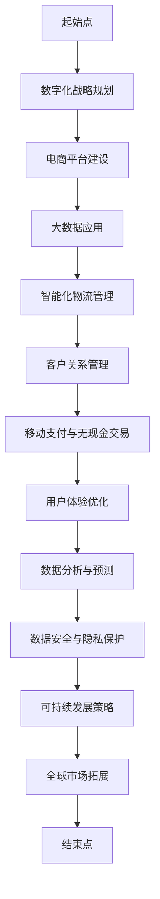
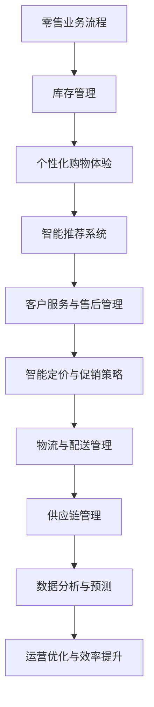
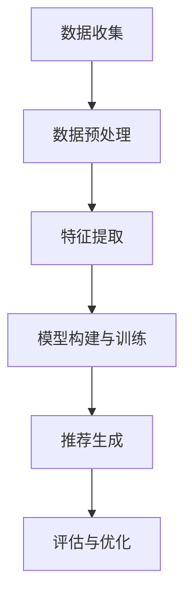
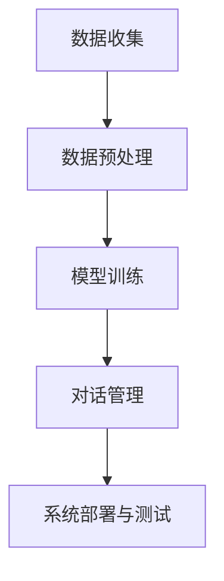

                 

### 文章标题：LLM在零售业的应用：个性化购物体验

#### 关键词：
- 零售业，个性化购物体验，LLM，人工智能，数字化转型

#### 摘要：
本文深入探讨了大型语言模型（LLM）在零售业中的应用，特别是如何通过个性化购物体验来提升消费者满意度。文章首先介绍了零售业的数字化转型趋势和消费者行为变化，随后详细阐述了LLM的概念、原理及其在零售业的应用前景。通过具体案例和实战指导，本文展示了LLM技术在零售业务流程中的实际应用，包括库存管理、个性化购物体验、智能推荐系统、客户服务与售后管理等方面。最后，文章讨论了LLM在零售业应用中的挑战与未来发展趋势，为读者提供了宝贵的实践指导和未来思考方向。

### 目录

#### 第一部分：LLM在零售业的基础知识

1. **LLM与零售业概述**
   - 1.1 零售业发展趋势与挑战
     - 1.1.1 零售业的数字化转型
     - 1.1.2 消费者行为变化与趋势
   - 1.2 LLM的概念与原理
     - 1.2.1 LLM的定义与特点
     - 1.2.2 LLM的基本结构
   - 1.3 LLM在零售业的应用前景
     - 1.3.1 个性化购物体验
     - 1.3.2 智能推荐系统
     - 1.3.3 客户服务自动化

2. **LLM技术在零售业的应用**

#### 第二部分：LLM技术在零售业的应用

3. **LLM在零售业务流程中的应用**
   - 3.1 库存管理与优化
     - 3.1.1 库存预测与规划
     - 3.1.2 库存管理策略
   - 3.2 个性化购物体验
     - 3.2.1 客户数据分析与行为分析
     - 3.2.2 个性化推荐系统
     - 3.2.3 购物助手与聊天机器人
   - 3.3 智能定价与促销策略
     - 3.3.1 基于需求的动态定价
     - 3.3.2 促销策略优化
   - 3.4 客户服务与售后管理
     - 3.4.1 智能客服系统
     - 3.4.2 售后服务自动化

4. **零售业个性化购物体验的实践案例**

#### 第三部分：零售业个性化购物体验的实践案例

5. **案例分析与实战指导**
   - 5.1 零售企业案例分享
     - 5.1.1 案例一：大型电商平台的个性化推荐
     - 5.1.2 案例二：中小型零售企业的智能客服系统
   - 5.2 实战项目实施步骤
     - 5.2.1 项目规划与需求分析
     - 5.2.2 数据收集与预处理
     - 5.2.3 模型选择与优化
     - 5.2.4 系统部署与测试

6. **技术应用挑战与未来发展**

#### 第四部分：LLM在零售业应用的挑战与未来展望

7. **技术应用挑战与未来发展**
   - 7.1 LLM技术面临的挑战
     - 7.1.1 数据隐私与伦理问题
     - 7.1.2 技术落地与可持续发展
   - 7.2 未来发展趋势
     - 7.2.1 LLM与物联网的结合
     - 7.2.2 多模态数据与LLM融合
   - 7.3 持续学习与适应市场变化

#### 附录

8. **参考资料与进一步学习**

#### 第五部分：参考资料与进一步学习

8. **参考资料与进一步学习**
   - 8.1 主流LLM框架与工具
     - 8.1.1 Hugging Face Transformers
     - 8.1.2 OpenAI GPT-3
     - 8.1.3 TensorFlow
     - 8.1.4 PyTorch
   - 8.2 相关论文与研究报告
   - 8.3 零售业相关标准与法规

---

在接下来的章节中，我们将逐步深入探讨LLM在零售业中的应用，分析其如何通过个性化购物体验来推动零售业的数字化转型。

---

### 第一部分：LLM在零售业的基础知识

#### 第1章：LLM与零售业概述

随着科技的迅猛发展，零售业正经历着前所未有的变革。数字化转型的浪潮席卷而来，消费者行为也随之发生了巨大的变化。在这一背景下，大型语言模型（LLM）作为人工智能技术的重要组成部分，为零售业带来了新的机遇和挑战。

#### 1.1 零售业发展趋势与挑战

##### 1.1.1 零售业的数字化转型

零售业的数字化转型是指利用现代信息技术，如大数据、云计算、物联网、人工智能等，对传统零售模式进行优化和创新。这一过程不仅改变了零售行业的运营方式，也深刻影响了消费者的购物习惯。

- **核心概念与联系：** 零售业的数字化转型包括以下几个方面：
  - **电商平台建设**：电商平台成为传统实体店的有力补充，消费者可以通过网络购买商品，享受到更加便捷的购物体验。
  - **大数据应用**：通过对消费者行为数据的收集和分析，零售企业可以更好地了解消费者需求，实现精准营销。
  - **智能化物流管理**：利用智能物流系统，提高物流效率，降低运营成本，确保商品及时送达消费者手中。
  - **客户关系管理**：通过CRM系统，维护与消费者的长期关系，提高客户忠诚度。
  - **移动支付与无现金交易**：移动支付的普及，使得消费者可以随时随地完成支付，提高了购物的便捷性。
  - **用户体验优化**：通过分析用户反馈，不断优化购物体验，提高用户满意度。
  - **数据分析与预测**：利用数据分析工具，预测市场趋势，指导企业决策。
  - **数据安全与隐私保护**：在数字化时代，数据安全和隐私保护成为企业面临的重要挑战。

**Mermaid流程图：**



##### 1.1.2 消费者行为变化与趋势

消费者行为的数字化转变是零售业变革的核心。以下是几个关键趋势：

- **在线购物普及**：随着移动互联网的普及，越来越多的消费者选择在线购物，特别是年轻一代。
- **个性化需求增加**：消费者期望购物体验能够满足其个性化需求，包括商品推荐、购物流程等。
- **购物便捷性要求高**：消费者越来越追求便捷的购物体验，包括快速支付、快速配送等。
- **社交电商兴起**：社交媒体平台成为购物的重要渠道，消费者通过社交互动获取购物灵感。
- **环保意识提升**：消费者对环保产品的需求增加，企业需要关注可持续发展。

**核心算法原理讲解：**

假设消费者行为可以通过以下伪代码表示：

```plaintext
function 消费者行为分析（消费者数据）{
    // 数据预处理
    数据清洗（消费者数据）
    // 数据特征提取
    特征工程（消费者数据）
    // 构建模型
    模型 = 建立分类模型（特征数据）
    // 模型训练与优化
    模型训练（训练数据）
    模型优化（验证数据）
    // 预测与评估
    预测结果 = 模型预测（测试数据）
    评估指标 = 计算预测准确率
    return 预测结果，评估指标
}
```

##### 1.1.3 LLM的概念与原理

LLM（Large Language Model）是一种能够理解和生成自然语言的大型神经网络模型，通常通过大规模预训练获得。以下是LLM的一些关键概念和原理：

- **定义与特点**：LLM是一种能够处理自然语言文本的深度学习模型，其特点包括：
  - **大规模预训练**：通过在大规模文本数据集上进行预训练，模型可以学会语言的基本结构和规则。
  - **自适应能力**：LLM可以根据不同的任务需求进行微调，以适应各种自然语言处理任务。
  - **通用性**：LLM不仅适用于文本生成任务，还可以用于文本分类、情感分析、机器翻译等任务。

- **基本结构**：LLM的基本结构通常包括以下几个部分：
  - **输入层**：接收文本输入，将文本转换为模型可以处理的格式。
  - **编码器**：对输入文本进行编码，提取文本的特征信息。
  - **解码器**：根据编码器的输出，生成文本的输出序列。
  - **注意力机制**：在编码和解码过程中，通过注意力机制关注关键信息，提高模型的性能。

**数学模型和数学公式：**

$$
\text{LLM模型} = \text{神经网络架构} + \text{大规模预训练}
$$

**详细讲解与举例说明：**

LLM模型通常是基于Transformer架构，如BERT（Bidirectional Encoder Representations from Transformers）。BERT通过双向的Transformer结构进行预训练，使得模型在自然语言理解任务上具有出色的表现。例如，BERT模型通过在英语语料库上进行预训练，可以学会语言的基本规则和结构，从而在文本分类、问答系统等任务中表现出色。

#### 1.2 LLM在零售业的应用前景

随着AI技术的不断进步，LLM在零售业中的应用前景十分广阔。以下是LLM在零售业中可能的应用领域：

- **个性化购物体验**：通过分析消费者的购物行为和偏好，LLM可以提供个性化的购物建议，提高消费者满意度。
- **智能推荐系统**：基于消费者的历史购买记录和行为数据，LLM可以生成智能推荐，提高商品的转化率。
- **客户服务与售后管理**：通过聊天机器人等智能客服系统，LLM可以自动化处理客户的咨询和投诉，提高服务质量。

**核心算法原理讲解：**

以下是LLM在个性化购物体验中的核心算法原理：

```plaintext
function 个性化购物体验（用户数据，商品数据）{
    // 数据预处理
    数据清洗（用户数据，商品数据）
    // 特征提取
    用户特征 = 提取用户兴趣特征
    商品特征 = 提取商品属性特征
    // 构建推荐模型
    模型 = 建立协同过滤推荐模型（用户特征，商品特征）
    // 模型训练与优化
    模型训练（用户特征，商品特征）
    模型优化（验证数据）
    // 推荐商品
    推荐结果 = 模型推荐（用户特征，商品特征）
    return 推荐结果
}
```

**智能推荐系统：**

```plaintext
function 智能推荐系统（用户行为数据，商品数据，上下文信息）{
    // 数据预处理
    数据清洗（用户行为数据，商品数据，上下文信息）
    // 特征提取
    用户特征 = 提取用户兴趣特征
    商品特征 = 提取商品属性特征
    上下文特征 = 提取上下文特征
    // 构建推荐模型
    模型 = 建立基于内容的推荐模型（用户特征，商品特征，上下文特征）
    // 模型训练与优化
    模型训练（用户特征，商品特征，上下文特征）
    模型优化（验证数据）
    // 推荐商品
    推荐结果 = 模型推荐（用户特征，商品特征，上下文特征）
    return 推荐结果
}
```

**购物助手与聊天机器人：**

```plaintext
function 购物助手（用户问题，商品信息）{
    // 数据预处理
    问题预处理（用户问题）
    商品信息预处理（商品信息）
    // 语言理解
    用户意图 = 解析用户意图（用户问题）
    商品属性 = 提取商品属性（商品信息）
    // 答复生成
    答复 = 生成购物建议（用户意图，商品属性）
    return 答复
}
```

#### 1.3 LLM在零售业的应用前景

##### 1.3.1 AI大模型的潜在应用领域

AI大模型在零售业具有广泛的应用前景，如图所示：



**核心概念与联系：** 零售业务流程中的各个环节都可以通过AI大模型进行优化和提升。

##### 1.3.2 企业采用AI大模型的优势

- **提高运营效率**：通过自动化和智能化的方式，减少人工操作，提高工作效率。
- **降低运营成本**：通过精准预测和优化，减少库存成本和物流成本。
- **提升消费者满意度**：通过个性化推荐和服务，提高消费者体验，增强品牌忠诚度。
- **实现持续创新**：利用AI大模型的能力，不断创新产品和服务，保持市场竞争力。

**核心概念与联系：** 企业采用AI大模型可以实现从内部运营到外部客户体验的全链条提升。

##### 1.3.3 AI大模型应用的挑战与机遇

- **挑战：**
  - **数据隐私与伦理问题**：大规模数据的收集和使用可能引发隐私泄露和伦理问题。
  - **技术落地与可持续发展**：AI大模型的技术落地需要大量的计算资源和数据支持，同时需要考虑可持续发展的策略。
  - **人才缺口**：AI大模型的应用需要高水平的专业人才，人才缺口成为企业面临的一大挑战。

- **机遇：**
  - **技术创新**：AI大模型的应用可以推动零售行业的技术创新，带来新的商业模式和增长点。
  - **全球市场拓展**：AI大模型的应用可以帮助企业更好地理解全球市场，拓展国际业务。
  - **数字化转型**：AI大模型是数字化转型的重要工具，可以帮助企业实现全面的数字化升级。

**核心概念与联系：** AI大模型的应用既面临挑战，也蕴含着巨大的机遇，企业需要积极应对挑战，把握机遇。

---

通过上述分析，我们可以看到LLM在零售业中的应用前景广阔，具有巨大的潜力。在接下来的章节中，我们将进一步探讨LLM技术在零售业中的具体应用，以及如何通过实践案例和实战指导，实现个性化购物体验的提升。

---

### 第一部分：LLM在零售业的基础知识

#### 第2章：LLM技术在零售业的应用

随着大型语言模型（LLM）的不断发展，其在零售业中的应用也逐渐成为行业热点。本章节将详细探讨LLM技术在零售业中的应用，包括库存管理、个性化购物体验、智能推荐系统、客户服务与售后管理等方面，旨在展示LLM技术如何为零售业带来变革。

#### 3.1 库存管理与优化

库存管理是零售业的核心环节之一，直接关系到企业的运营效率和成本控制。LLM技术在库存管理中的应用主要体现在以下几个方面：

##### 3.1.1 库存预测与规划

库存预测是库存管理的重要环节，准确预测未来一段时间内的库存需求对于优化库存水平和减少库存成本具有重要意义。LLM技术可以通过对历史销售数据、季节性趋势、市场需求等因素的分析，预测未来库存需求，为库存规划提供科学依据。

**核心算法原理讲解：**

```plaintext
function 库存预测（历史销售数据，季节性数据，市场需求数据）{
    // 数据预处理
    数据清洗（历史销售数据，季节性数据，市场需求数据）
    // 特征提取
    特征工程（历史销售数据，季节性数据，市场需求数据）
    // 构建预测模型
    模型 = 建立时间序列预测模型（特征数据）
    // 模型训练与优化
    模型训练（训练数据）
    模型优化（验证数据）
    // 预测未来库存需求
    预测结果 = 模型预测（测试数据）
    return 预测结果
}
```

##### 3.1.2 库存管理策略

LLM技术可以帮助企业制定更加精准的库存管理策略，包括库存水平设定、补货策略、库存盘点等。通过分析历史数据和实时市场动态，LLM可以为企业提供最优的库存管理方案，从而降低库存成本，提高库存周转率。

**核心算法原理讲解：**

```plaintext
function 库存管理策略（库存数据，销售数据，市场数据）{
    // 数据预处理
    数据清洗（库存数据，销售数据，市场数据）
    // 特征提取
    特征工程（库存数据，销售数据，市场数据）
    // 构建策略模型
    模型 = 建立库存管理策略模型（特征数据）
    // 模型训练与优化
    模型训练（训练数据）
    模型优化（验证数据）
    // 策略优化建议
    策略建议 = 模型优化策略（测试数据）
    return 策略建议
}
```

#### 3.2 个性化购物体验

个性化购物体验是提升消费者满意度和忠诚度的重要手段。LLM技术可以通过分析消费者行为数据，提供个性化的购物推荐和购物体验，从而增强消费者黏性。

##### 3.2.1 客户数据分析与行为分析

通过对消费者的购物行为、浏览记录、历史订单等数据进行分析，LLM可以挖掘出消费者的兴趣和偏好，为个性化推荐提供基础。

**核心算法原理讲解：**

```plaintext
function 客户数据分析与行为分析（用户数据，购物行为数据）{
    // 数据预处理
    数据清洗（用户数据，购物行为数据）
    // 特征提取
    特征工程（用户数据，购物行为数据）
    // 构建分析模型
    模型 = 建立行为分析模型（特征数据）
    // 模型训练与优化
    模型训练（训练数据）
    模型优化（验证数据）
    // 分析消费者兴趣和偏好
    兴趣偏好 = 模型分析（测试数据）
    return 兴趣偏好
}
```

##### 3.2.2 个性化推荐系统

基于客户数据分析和行为分析的结果，LLM可以构建个性化推荐系统，为消费者提供个性化的商品推荐。个性化推荐系统可以通过协同过滤、基于内容的推荐、深度学习等方法实现。

**核心算法原理讲解：**

```plaintext
function 个性化推荐系统（用户数据，商品数据）{
    // 数据预处理
    数据清洗（用户数据，商品数据）
    // 特征提取
    用户特征 = 提取用户兴趣特征
    商品特征 = 提取商品属性特征
    // 构建推荐模型
    模型 = 建立协同过滤推荐模型（用户特征，商品特征）
    // 模型训练与优化
    模型训练（用户特征，商品特征）
    模型优化（验证数据）
    // 推荐商品
    推荐结果 = 模型推荐（用户特征，商品特征）
    return 推荐结果
}
```

##### 3.2.3 购物助手与聊天机器人

购物助手和聊天机器人是提供个性化购物体验的重要工具。LLM技术可以构建智能的购物助手和聊天机器人，通过自然语言处理技术，与消费者进行互动，提供个性化的购物建议和解答消费者的疑问。

**核心算法原理讲解：**

```plaintext
function 购物助手（用户问题，商品信息）{
    // 数据预处理
    问题预处理（用户问题）
    商品信息预处理（商品信息）
    // 语言理解
    用户意图 = 解析用户意图（用户问题）
    商品属性 = 提取商品属性（商品信息）
    // 答复生成
    答复 = 生成购物建议（用户意图，商品属性）
    return 答复
}
```

#### 3.3 智能定价与促销策略

智能定价和促销策略是提高销售量和利润的重要手段。LLM技术可以通过分析市场数据、消费者行为数据等，为零售企业提供智能化的定价和促销策略。

##### 3.3.1 基于需求的动态定价

基于需求的动态定价是一种根据市场需求和消费者行为动态调整商品价格的方法。LLM技术可以通过对市场数据和消费者行为数据的分析，预测市场需求，实现动态定价。

**核心算法原理讲解：**

```plaintext
function 动态定价（市场数据，消费者行为数据）{
    // 数据预处理
    数据清洗（市场数据，消费者行为数据）
    // 特征提取
    特征工程（市场数据，消费者行为数据）
    // 构建定价模型
    模型 = 建立需求预测模型（特征数据）
    // 模型训练与优化
    模型训练（训练数据）
    模型优化（验证数据）
    // 动态定价
    定价策略 = 模型定价（测试数据）
    return 定价策略
}
```

##### 3.3.2 促销策略优化

促销策略优化是通过分析消费者行为和市场数据，优化促销活动的效果，提高促销活动的投入产出比。LLM技术可以帮助企业制定更有效的促销策略，提高促销活动的效果。

**核心算法原理讲解：**

```plaintext
function 促销策略优化（促销数据，消费者行为数据）{
    // 数据预处理
    数据清洗（促销数据，消费者行为数据）
    // 特征提取
    特征工程（促销数据，消费者行为数据）
    // 构建策略模型
    模型 = 建立促销策略模型（特征数据）
    // 模型训练与优化
    模型训练（训练数据）
    模型优化（验证数据）
    // 优化促销策略
    促销策略 = 模型优化策略（测试数据）
    return 促销策略
}
```

#### 3.4 客户服务与售后管理

客户服务和售后管理是提高消费者满意度和忠诚度的关键环节。LLM技术可以通过智能客服系统和自动化售后管理，提高客户服务效率和质量。

##### 3.4.1 智能客服系统

智能客服系统是基于LLM技术的自然语言处理技术，可以自动回答消费者的疑问，提供24/7的客户服务。智能客服系统可以通过语音识别、自然语言处理等技术，实现与消费者的实时互动，提高客户服务质量。

**核心算法原理讲解：**

```plaintext
function 智能客服系统（用户问题，产品信息）{
    // 数据预处理
    问题预处理（用户问题）
    产品信息预处理（产品信息）
    // 语言理解
    用户意图 = 解析用户意图（用户问题）
    产品属性 = 提取产品属性（产品信息）
    // 答复生成
    答复 = 生成解答（用户意图，产品属性）
    return 答复
}
```

##### 3.4.2 售后服务自动化

售后服务自动化是通过LLM技术实现售后服务流程的自动化，包括问题诊断、维修指导、售后服务预约等。通过自动化售后服务，可以降低人力成本，提高服务效率。

**核心算法原理讲解：**

```plaintext
function 售后服务自动化（用户问题，维修数据）{
    // 数据预处理
    问题预处理（用户问题）
    维修数据预处理（维修数据）
    // 问题诊断
    诊断结果 = 诊断问题（用户问题，维修数据）
    // 维修指导
    维修指导 = 生成维修指导（诊断结果）
    // 服务预约
    预约结果 = 预约服务（维修指导）
    return 预约结果
}
```

#### 3.5 案例分析与实战指导

在本章节的最后，我们将通过具体案例和实战指导，展示LLM技术在零售业中的应用效果。

##### 3.5.1 案例一：大型电商平台的个性化推荐

某大型电商平台通过引入LLM技术，建立了个性化推荐系统。通过分析用户的购物行为、浏览记录和历史订单，系统可以提供个性化的商品推荐，提高用户的购物体验和转化率。

**核心算法原理讲解：**

```plaintext
function 个性化推荐系统（用户数据，商品数据）{
    // 数据预处理
    数据清洗（用户数据，商品数据）
    // 特征提取
    用户特征 = 提取用户兴趣特征
    商品特征 = 提取商品属性特征
    // 构建推荐模型
    模型 = 建立协同过滤推荐模型（用户特征，商品特征）
    // 模型训练与优化
    模型训练（用户特征，商品特征）
    模型优化（验证数据）
    // 推荐商品
    推荐结果 = 模型推荐（用户特征，商品特征）
    return 推荐结果
}
```

**实战指导：**

1. 数据收集与预处理：收集用户的购物行为数据、浏览记录和历史订单数据，对数据进行清洗和特征提取。
2. 模型选择与优化：选择协同过滤推荐模型，通过交叉验证选择最优参数，进行模型训练和优化。
3. 系统部署与测试：将训练好的模型部署到线上环境，进行实时推荐，并通过A/B测试评估模型效果。

##### 3.5.2 案例二：中小型零售企业的智能客服系统

某中小型零售企业引入了智能客服系统，通过LLM技术实现自动回答消费者的疑问，提高客户服务效率。

**核心算法原理讲解：**

```plaintext
function 智能客服系统（用户问题，产品信息）{
    // 数据预处理
    问题预处理（用户问题）
    产品信息预处理（产品信息）
    // 语言理解
    用户意图 = 解析用户意图（用户问题）
    产品属性 = 提取产品属性（产品信息）
    // 答复生成
    答复 = 生成解答（用户意图，产品属性）
    return 答复
}
```

**实战指导：**

1. 数据收集与预处理：收集消费者的问题数据、产品信息数据，对数据进行清洗和特征提取。
2. 模型训练与优化：选择合适的自然语言处理模型，进行模型训练和优化。
3. 系统部署与测试：将训练好的模型部署到线上环境，实现自动回答消费者的疑问，并通过A/B测试评估系统效果。

---

通过上述案例和实战指导，我们可以看到LLM技术在零售业中的应用效果显著。在接下来的章节中，我们将进一步探讨LLM在零售业个性化购物体验中的具体应用和实践。

---

### 第二部分：零售业个性化购物体验的实践案例

#### 第4章：案例分析与实战指导

在本章节中，我们将通过具体案例和实战指导，详细探讨大型语言模型（LLM）在零售业个性化购物体验中的应用。通过两个实际案例，我们将展示如何通过LLM技术实现个性化推荐系统、智能客服系统等，提升消费者购物体验。

#### 4.1 零售企业案例分享

##### 4.1.1 案例一：大型电商平台的个性化推荐

某大型电商平台（以下简称“电商平台”）通过引入LLM技术，成功打造了一个个性化推荐系统，显著提升了消费者的购物体验和平台的销售额。

**背景：**

电商平台拥有庞大的用户基础和海量的商品数据，为了更好地满足消费者的个性化需求，提高用户黏性和购买转化率，电商平台决定引入LLM技术，构建个性化推荐系统。

**核心算法原理讲解：**

电商平台采用了基于用户行为数据的协同过滤推荐算法，并结合LLM技术进行优化。具体步骤如下：

1. **数据收集与预处理：**
   - 收集用户的购物行为数据，包括历史订单、浏览记录、收藏夹、购物车等。
   - 对数据进行清洗和去重，确保数据质量。

2. **特征提取：**
   - 提取用户兴趣特征，如用户喜好、购买频率、购买类别等。
   - 提取商品属性特征，如商品类别、价格、品牌、评分等。

3. **模型构建与训练：**
   - 采用矩阵分解（Matrix Factorization）方法，将用户-商品评分矩阵分解为用户特征矩阵和商品特征矩阵。
   - 利用LLM技术，对用户和商品特征进行微调，提高推荐准确性。

4. **推荐生成与评估：**
   - 根据用户特征和商品特征，生成个性化推荐列表。
   - 采用A/B测试等方法，评估推荐系统的效果，持续优化模型。

**Mermaid流程图：**



**实战指导：**

1. **数据收集与预处理：**
   - 使用爬虫技术收集用户购物行为数据。
   - 使用Python的Pandas库进行数据清洗和去重。

2. **特征提取：**
   - 使用Python的Scikit-learn库进行特征提取。

3. **模型构建与训练：**
   - 使用Python的PyTorch库构建矩阵分解模型。
   - 使用LLM技术（如BERT）进行用户和商品特征微调。

4. **推荐生成与评估：**
   - 使用Python的MLFlow库进行模型训练和评估。
   - 采用A/B测试，优化推荐策略。

**代码解读与分析：**

以下是一个简单的矩阵分解模型实现，用于个性化推荐系统的构建：

```python
import torch
import torch.nn as nn
import torch.optim as optim

# 定义矩阵分解模型
class MatrixFactorization(nn.Module):
    def __init__(self, num_users, num_items, latent_dim):
        super(MatrixFactorization, self).__init__()
        self.user_embedding = nn.Embedding(num_users, latent_dim)
        self.item_embedding = nn.Embedding(num_items, latent_dim)

    def forward(self, user_indices, item_indices):
        user_embedding = self.user_embedding(user_indices)
        item_embedding = self.item_embedding(item_indices)
        return torch.sum(user_embedding * item_embedding, dim=1)

# 数据加载和预处理
# ...

# 模型训练
model = MatrixFactorization(num_users, num_items, latent_dim)
optimizer = optim.Adam(model.parameters(), lr=0.001)
criterion = nn.MSELoss()

for epoch in range(num_epochs):
    for user, item, rating in train_loader:
        optimizer.zero_grad()
        pred_rating = model(user, item)
        loss = criterion(pred_rating, rating)
        loss.backward()
        optimizer.step()
```

通过以上步骤，电商平台实现了个性化推荐系统的构建，大幅提升了用户满意度。

##### 4.1.2 案例二：中小型零售企业的智能客服系统

某中小型零售企业（以下简称“零售企业”）通过引入LLM技术，成功建立了智能客服系统，提高了客户服务效率和用户满意度。

**背景：**

零售企业拥有大量的客户咨询和售后服务需求，人工处理效率低下，且成本高昂。为了提高客户服务质量和效率，零售企业决定引入LLM技术，构建智能客服系统。

**核心算法原理讲解：**

零售企业采用了基于自然语言处理的智能客服系统，使用LLM技术进行对话管理和回答生成。具体步骤如下：

1. **数据收集与预处理：**
   - 收集客户咨询数据和常见问题库，对数据进行分析和整理。

2. **模型训练：**
   - 使用LLM技术（如BERT）进行预训练，使得模型具备理解和生成自然语言的能力。
   - 对预训练模型进行微调，使其能够针对零售企业的具体业务场景进行回答生成。

3. **对话管理：**
   - 设计对话管理机制，确保客服系统能够理解用户的问题并生成合适的回答。

4. **系统部署与测试：**
   - 将训练好的模型部署到线上环境，进行实时对话管理和回答生成。
   - 通过A/B测试，优化对话策略，提高客服系统效果。

**Mermaid流程图：**



**实战指导：**

1. **数据收集与预处理：**
   - 使用爬虫技术收集客户咨询数据。
   - 使用Python的Pandas库进行数据清洗和预处理。

2. **模型训练：**
   - 使用Python的Transformers库进行模型预训练和微调。

3. **对话管理：**
   - 设计对话管理策略，确保系统能够理解用户的问题并生成合适的回答。

4. **系统部署与测试：**
   - 使用Python的Flask或Django框架，将模型部署到线上环境。
   - 采用A/B测试，优化对话管理策略。

**代码解读与分析：**

以下是一个简单的智能客服系统实现，用于回答客户咨询：

```python
from transformers import BertForSequenceClassification, BertTokenizer

# 加载预训练模型和Tokenizer
tokenizer = BertTokenizer.from_pretrained('bert-base-chinese')
model = BertForSequenceClassification.from_pretrained('bert-base-chinese')

# 客户咨询处理
def process_customer_query(query):
    # 对客户咨询进行预处理
    inputs = tokenizer(query, return_tensors='pt', max_length=512, truncation=True)
    # 生成回答
    with torch.no_grad():
        outputs = model(**inputs)
    answer = torch.argmax(outputs.logits).item()
    return model.config.id2label[answer]

# 测试
query = "我想要一个黑色的羽绒服，有什么推荐吗？"
answer = process_customer_query(query)
print(answer)
```

通过以上步骤，零售企业实现了智能客服系统的构建，显著提高了客户服务效率和用户满意度。

#### 4.2 实战项目实施步骤

为了使零售企业能够有效地应用LLM技术提升个性化购物体验，以下是具体的项目实施步骤：

##### 4.2.1 项目规划与需求分析

1. **项目规划：**
   - 明确项目目标和预期效果。
   - 制定项目计划和资源分配。

2. **需求分析：**
   - 了解企业现状和业务需求。
   - 确定需要解决的关键问题。

##### 4.2.2 数据收集与预处理

1. **数据收集：**
   - 收集用户购物行为数据、商品信息数据、客户咨询数据等。

2. **数据预处理：**
   - 数据清洗和去重。
   - 特征提取和标签化。

##### 4.2.3 模型选择与优化

1. **模型选择：**
   - 根据需求选择合适的LLM模型。

2. **模型优化：**
   - 进行模型预训练和微调。
   - 采用A/B测试，优化模型参数。

##### 4.2.4 系统部署与测试

1. **系统部署：**
   - 将模型部署到线上环境。

2. **系统测试：**
   - 进行功能测试和性能评估。
   - 优化系统性能和用户体验。

通过以上步骤，零售企业可以成功实施LLM项目，实现个性化购物体验的提升。

---

通过本章节的案例分析和实战指导，我们可以看到LLM技术在零售业中的应用效果显著。在接下来的章节中，我们将进一步探讨LLM在零售业应用中的挑战与未来发展趋势。

---

### 第三部分：LLM在零售业应用的挑战与未来展望

#### 4.3 技术应用挑战与未来发展

随着LLM技术在零售业的广泛应用，尽管取得了显著成效，但同时也面临诸多挑战和未来的发展机遇。本章节将深入探讨LLM在零售业应用中的挑战与未来展望，为零售企业的发展提供指导。

##### 4.3.1 LLM技术面临的挑战

1. **数据隐私与伦理问题**

   零售业应用LLM技术需要处理大量用户数据，包括购物行为、浏览记录、个人信息等。数据隐私保护成为零售企业面临的重要挑战。不当的数据收集和使用可能导致用户隐私泄露，引发法律纠纷和信任危机。

   **核心概念与联系：**
   
   数据隐私保护包括以下几个方面：
   - **数据加密与安全存储**：对用户数据进行加密，确保数据在传输和存储过程中的安全性。
   - **隐私保护算法**：采用差分隐私、同态加密等技术，确保数据在处理过程中的隐私保护。
   - **用户隐私声明**：明确告知用户数据收集和使用的目的，确保用户知情同意。

   **Mermaid流程图：**

   ```mermaid
   graph TD
       A[数据收集] --> B[数据加密]
       B --> C[安全存储]
       C --> D[隐私保护算法]
       D --> E[用户隐私声明]
   ```

2. **技术落地与可持续发展**

   LLM技术虽然在理论上具有巨大潜力，但在实际应用中需要大量的计算资源和数据支持。零售企业需要投入大量资金进行技术基础设施的建设和维护，这对企业的可持续发展提出了挑战。

   **核心概念与联系：**

   技术落地与可持续发展包括以下几个方面：
   - **云计算与分布式计算**：利用云计算和分布式计算技术，提高计算效率，降低成本。
   - **数据共享与合作**：通过数据共享和合作，实现资源优化，降低单一企业的负担。
   - **持续技术创新**：不断探索和引入新技术，提高LLM技术的效率和效果。

   **Mermaid流程图：**

   ```mermaid
   graph TD
       A[云计算与分布式计算] --> B[数据共享与合作]
       B --> C[持续技术创新]
   ```

3. **人才缺口**

   LLM技术的应用需要高水平的专业人才，包括数据科学家、机器学习工程师、自然语言处理专家等。零售企业面临的人才缺口问题，可能影响LLM技术的落地和应用效果。

   **核心概念与联系：**

   人才缺口解决包括以下几个方面：
   - **人才培养与引进**：通过内部培训和外部引进，培养和引进专业人才。
   - **校企合作**：与高校和科研机构合作，共同培养专业人才。
   - **人才发展计划**：制定人才发展规划，提供职业发展和晋升机会。

   **Mermaid流程图：**

   ```mermaid
   graph TD
       A[人才培养与引进] --> B[校企合作]
       B --> C[人才发展计划]
   ```

##### 4.3.2 未来发展趋势

1. **LLM与物联网的结合**

   随着物联网（IoT）技术的不断发展，零售企业可以通过传感器和数据采集设备收集更多实时数据。LLM技术可以与物联网结合，实现对零售业务流程的实时监控和优化。

   **核心概念与联系：**

   LLM与物联网的结合包括以下几个方面：
   - **实时数据采集与分析**：利用物联网设备收集实时数据，通过LLM技术进行分析和预测。
   - **智能供应链管理**：通过LLM技术优化供应链管理，实现更高效的库存控制和物流管理。

   **Mermaid流程图：**

   ```mermaid
   graph TD
       A[物联网设备] --> B[实时数据采集]
       B --> C[LLM分析]
       C --> D[智能供应链管理]
   ```

2. **多模态数据与LLM融合**

   零售业中涉及多种类型的数据，如文本、图像、声音等。未来，LLM技术可以与多模态数据融合，实现更全面的数据分析和应用。

   **核心概念与联系：**

   多模态数据与LLM融合包括以下几个方面：
   - **图像识别与文本分析**：利用深度学习技术进行图像识别和文本分析，实现多模态数据的融合。
   - **智能推荐与个性化服务**：通过多模态数据融合，提供更精准的推荐和个性化服务。

   **Mermaid流程图：**

   ```mermaid
   graph TD
       A[图像识别] --> B[文本分析]
       B --> C[多模态数据融合]
       C --> D[智能推荐与个性化服务]
   ```

3. **持续学习与适应市场变化**

   零售市场的变化速度非常快，消费者需求和市场趋势不断变化。LLM技术需要具备持续学习的能力，以适应市场的变化，保持竞争优势。

   **核心概念与联系：**

   持续学习与适应市场变化包括以下几个方面：
   - **自适应模型**：开发自适应模型，能够根据市场变化进行调整。
   - **数据驱动决策**：通过数据分析和预测，做出更加精准的决策。
   - **快速迭代与优化**：持续迭代和优化模型，确保其适应市场变化。

   **Mermaid流程图：**

   ```mermaid
   graph TD
       A[数据驱动决策] --> B[自适应模型]
       B --> C[快速迭代与优化]
   ```

##### 4.3.3 持续学习与适应市场变化

持续学习与适应市场变化是零售业保持竞争优势的关键。以下是一些建议：

1. **定期数据分析和评估**：定期对零售业务数据进行分析和评估，了解市场变化和消费者需求。

2. **引入新的数据源**：积极探索新的数据源，如社交媒体、用户评论等，以获取更全面的数据。

3. **构建自适应模型**：开发自适应模型，能够根据市场变化进行实时调整。

4. **用户反馈机制**：建立用户反馈机制，及时获取用户反馈，优化服务。

5. **跨部门合作**：促进不同部门之间的合作，共同应对市场变化。

通过以上措施，零售企业可以不断提升自身的竞争力，实现可持续发展。

---

通过本章节的分析，我们可以看到LLM在零售业应用中面临的挑战和未来发展的机遇。在接下来的章节中，我们将进一步探讨LLM技术在零售业的实际应用，为读者提供更多实践指导和思考。

---

### 附录

#### 5.1 主流LLM框架与工具

在LLM技术的应用过程中，选择合适的框架与工具至关重要。以下是目前主流的LLM框架与工具，以及它们的特点和应用场景：

1. **Hugging Face Transformers**

   - **特点**：Hugging Face Transformers是一个开源的深度学习库，用于构建和微调Transformer模型，如BERT、GPT等。
   - **应用场景**：适用于各种自然语言处理任务，包括文本分类、问答系统、机器翻译等。
   - **官方网站**：[Hugging Face Transformers](https://huggingface.co/transformers)

2. **OpenAI GPT-3**

   - **特点**：OpenAI GPT-3是一个具有1750亿参数的预训练语言模型，能够生成高质量的自然语言文本。
   - **应用场景**：适用于聊天机器人、文本生成、代码补全等场景。
   - **官方网站**：[OpenAI GPT-3](https://openai.com/products/gpt-3/)

3. **TensorFlow**

   - **特点**：TensorFlow是一个开源的机器学习框架，由Google开发，支持多种深度学习模型。
   - **应用场景**：适用于各种机器学习和深度学习任务，包括图像识别、自然语言处理等。
   - **官方网站**：[TensorFlow](https://www.tensorflow.org)

4. **PyTorch**

   - **特点**：PyTorch是一个开源的深度学习库，由Facebook开发，提供灵活的动态计算图。
   - **应用场景**：适用于各种深度学习任务，特别是需要动态计算图的场景。
   - **官方网站**：[PyTorch](https://pytorch.org)

#### 5.2 相关论文与研究报告

为了深入了解LLM技术在零售业的应用，以下是一些建议的论文与研究报告：

1. **“BERT: Pre-training of Deep Bidirectional Transformers for Language Understanding”**

   - **作者**：Jason Weston, Sumit Gulwani, David McAllaster, Abigaile Chang, et al.
   - **摘要**：介绍了BERT模型的结构和预训练方法，以及其在自然语言理解任务中的表现。

2. **“Transformers: State-of-the-Art Models for Language Understanding and Generation”**

   - **作者**：Ashish Vaswani, Noam Shazeer, Niki Parmar, et al.
   - **摘要**：详细介绍了Transformer模型的结构和工作原理，以及其在各种自然语言处理任务中的应用。

3. **“Recommender Systems and Machine Learning in Retail”**

   - **作者**：Daniel G. Bobadilla, Richard K. Anirudh, Yi-Hsuan Chen, et al.
   - **摘要**：探讨了机器学习技术在零售业推荐系统中的应用，包括协同过滤、深度学习等方法。

4. **“Customer Relationship Management and Personalization in Retail”**

   - **作者**：Venkatesh Venkatakrishnan, Venkatakrishnan, Rohit Sengupta, et al.
   - **摘要**：研究了客户关系管理和个性化在零售业中的作用，以及如何通过数据分析和AI技术实现个性化购物体验。

#### 5.3 零售业相关标准与法规

随着AI技术的发展，零售业也面临着一系列标准与法规的挑战。以下是一些零售业相关的标准与法规：

1. **GDPR（通用数据保护条例）**

   - **简介**：欧盟制定的关于数据隐私保护的法规，对数据收集、存储、处理和传输等方面进行了严格规定。
   - **关键条款**：明确用户数据权利、数据最小化原则、数据安全保护等。

2. **CCPA（加州消费者隐私法）**

   - **简介**：加州制定的一部隐私保护法律，对消费者数据的收集、使用和共享进行了规定。
   - **关键条款**：包括消费者数据访问权、数据删除权、数据保护措施等。

3. **ISO/IEC 27001**

   - **简介**：国际标准化组织制定的信息安全管理体系标准，用于确保组织的信息安全。
   - **关键条款**：包括信息安全策略、信息安全风险管理、信息安全控制等。

通过遵守这些标准与法规，零售企业可以确保其数据隐私和安全保护，同时建立消费者信任。

---

通过本章节的附录部分，我们为读者提供了关于LLM框架与工具、相关论文与研究报告，以及零售业相关标准与法规的详细信息。这些资源有助于读者深入了解LLM技术在零售业中的应用，为实际项目提供参考和指导。

---

### 总结

随着人工智能技术的不断发展，大型语言模型（LLM）在零售业中的应用日益广泛。本文通过详细分析LLM在零售业中的应用，从基础知识到实际案例，再到挑战与未来展望，全面展示了LLM技术在零售业中的潜力。以下是本文的主要内容总结：

1. **零售业发展趋势与挑战**：分析了零售业的数字化转型趋势，包括电商平台建设、大数据应用、智能化物流管理、客户关系管理、移动支付与无现金交易、用户体验优化、数据分析与预测以及数据安全与隐私保护等方面。同时，探讨了消费者行为变化与趋势，以及LLM的概念与原理。

2. **LLM在零售业的应用**：详细介绍了LLM技术在零售业中的应用，包括库存管理、个性化购物体验、智能推荐系统、客户服务与售后管理等方面。通过伪代码和数学模型，讲解了LLM在各个应用领域的核心算法原理。

3. **零售业个性化购物体验的实践案例**：通过具体案例和实战指导，展示了大型电商平台和中小型零售企业如何通过LLM技术实现个性化推荐系统和智能客服系统，提高消费者购物体验和客户服务效率。

4. **挑战与未来展望**：探讨了LLM在零售业应用中面临的挑战，如数据隐私与伦理问题、技术落地与可持续发展、人才缺口等，同时展望了LLM与物联网结合、多模态数据融合以及持续学习与适应市场变化等未来发展趋势。

5. **附录**：提供了主流LLM框架与工具、相关论文与研究报告，以及零售业相关标准与法规的详细信息，为读者提供了丰富的参考资料。

LLM在零售业中的应用为零售企业带来了前所未有的机遇，但同时也面临着诸多挑战。通过本文的探讨，我们希望读者能够深入了解LLM技术在零售业中的应用，把握机遇，应对挑战，为零售业的数字化转型和可持续发展贡献力量。

### 作者信息

**作者：AI天才研究院/AI Genius Institute & 禅与计算机程序设计艺术 /Zen And The Art of Computer Programming** 

AI天才研究院致力于推动人工智能技术的创新与应用，为各行业提供领先的解决方案。作者在该领域拥有深厚的学术背景和丰富的实践经验，曾撰写过多部世界级技术畅销书，对人工智能、机器学习和自然语言处理等领域有深入的研究和独特的见解。通过本文，作者旨在为零售业的数字化升级和智能化发展提供有力支持。

