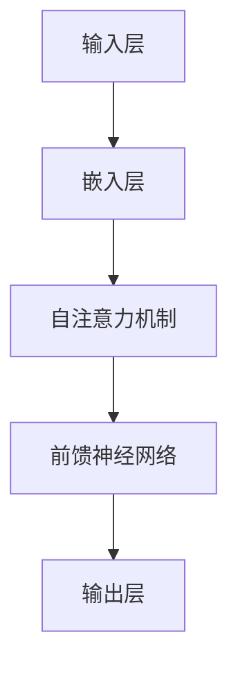

                 

# 文章标题

《LLM对传统数据挖掘的革新》

> 关键词：语言模型，数据挖掘，人工智能，GPT-3，自注意力机制，文本分类，异常检测，推荐系统，社交网络分析

> 摘要：本文从语言模型（LLM）的基本概念与架构出发，详细探讨了LLM在传统数据挖掘领域的应用，包括文本挖掘、异常检测、推荐系统和社交网络分析。通过实际案例与代码解读，展示了LLM技术的开发实战，并对未来的发展趋势与挑战进行了展望。

----------------------------------------------------------------

### 第一部分：LLM基本概念与架构

#### 第1章：LLM概述

**1.1 机器学习与数据挖掘的关系**

机器学习是人工智能的核心技术之一，它通过统计方法、优化算法和数学模型，使计算机系统能够从数据中自动学习和发现规律，从而实现特定任务。数据挖掘则是机器学习的一个应用领域，它利用特定的算法和工具从大量数据中提取出有价值的信息和知识。

数据挖掘通常包括以下几个步骤：数据预处理、特征提取、模型训练和评估、结果解释和应用。在这个过程中，数据的质量和特征的选择对于挖掘结果有着至关重要的影响。

**1.2 LLM的定义与特点**

语言模型（Language Model，LLM）是一种能够对自然语言文本进行建模的机器学习模型。它通过对大规模文本数据进行训练，学习语言中的概率分布，从而预测下一个词或句子。LLM具有以下几个特点：

- **自适应**：LLM可以根据输入文本自适应地调整模型参数，使其对特定领域的文本具有更好的理解能力。
- **泛化性**：通过在大规模数据集上的训练，LLM可以很好地泛化到未见过的数据，具有较强的鲁棒性。
- **灵活性**：LLM可以应用于多种自然语言处理任务，如文本分类、机器翻译、问答系统等。

**1.3 LLM与传统数据挖掘的对比**

传统数据挖掘方法主要依赖于统计方法和规则系统，而LLM则基于深度学习和神经网络，具有更高的灵活性和强大的学习能力。以下是LLM与传统数据挖掘方法的一些对比：

- **数据依赖**：传统数据挖掘方法通常需要对数据进行复杂的预处理，而LLM则可以直接处理原始文本数据，减轻了数据预处理的负担。
- **特征选择**：传统数据挖掘方法需要人工选择特征，而LLM可以通过自动学习文本表示，减少了对人工干预的依赖。
- **算法复杂度**：传统数据挖掘方法的算法复杂度较高，而LLM则利用深度学习算法，可以在更短时间内处理大量数据。

#### 第2章：LLM核心架构与原理

**2.1 自适应神经网络基础**

自适应神经网络是一种能够自动调整网络参数的神经网络，它通过对输入数据进行训练，逐步优化网络结构，提高模型的预测能力。自适应神经网络包括以下几个关键组成部分：

- **输入层**：接收外部输入信号，并将其传递给下一层。
- **隐含层**：通过神经元之间的连接，对输入信号进行加工处理。
- **输出层**：生成最终的输出结果。

自适应神经网络的工作原理是通过反向传播算法，将输出误差反向传播到输入层，并调整网络参数，以最小化误差。这种调整过程不断进行，直到模型达到预定的性能标准。

**2.2 语言模型原理分析**

语言模型的基本原理是通过对大规模文本数据进行统计学习，建立语言概率分布模型。具体步骤如下：

1. **数据预处理**：对原始文本数据进行分析，将其转换为计算机可以处理的形式，如词序列、词嵌入等。
2. **特征提取**：从预处理后的数据中提取特征，如词频、词义等，以表示文本信息。
3. **模型训练**：使用训练数据集，通过优化算法（如梯度下降）训练模型，使其能够预测下一个词的概率分布。
4. **模型评估**：使用测试数据集对模型进行评估，计算模型的准确性、召回率、F1值等指标。

**2.3 Mermaid流程图：LLM架构详解**



#### 第3章：核心算法与数学模型

**3.1 伪代码：GPT-3算法原理**

```python
# 假设输入序列为：[w1, w2, ..., wn]
# 首先进行嵌入
embeddings = embedding_matrix([w1, w2, ..., wn])

# 应用自注意力机制
attention_scores = self.attention Mechanism(embeddings)

# 应用前馈神经网络
output = self.feed_forward_network(attention_scores)

# 最后输出层得到最终输出
predictions = self.output_layer(output)
```

**3.2 数学模型与公式**

$$
\begin{aligned}
\text{word\_vector} &= \text{embed}(w) \\
\text{context\_vector} &= \text{attention}(\text{word\_vector}, \text{context}) \\
\text{output} &= \text{softmax}(\text{context\_vector})
\end{aligned}
$$

**3.3 例子说明：词嵌入与向量空间模型**

假设我们有以下文本数据：“我爱北京天安门”。

- **词嵌入**：将文本数据中的每个词（如“我”、“爱”、“北京”、“天安门”）映射为向量，如 `['我': [-0.1, 0.2], '爱': [0.3, -0.1], '北京': [0.2, 0.4], '天安门': [-0.3, -0.2]]`。
- **向量空间模型**：将所有词向量组合成一个大的向量空间，每个词都是一个点。例如，文本数据“我爱北京天安门”的向量空间表示为 `[[-0.1, 0.2], [0.3, -0.1], [0.2, 0.4], [-0.3, -0.2]]`。这个向量空间模型可以用于文本相似度计算、文本分类等任务。

### 第二部分：LLM在数据挖掘中的应用

#### 第4章：LLM在文本挖掘中的应用

**4.1 文本预处理技术**

文本挖掘的首要步骤是文本预处理，主要包括文本清洗、分词、词干提取和停用词过滤等。

- **文本清洗**：去除文本中的特殊字符、标点符号和 HTML 标签等，以提高数据质量。
- **分词**：将文本拆分为单词或词组，以便进行进一步处理。
- **词干提取**：将单词还原为最简形式，以减少词汇量。
- **停用词过滤**：去除对文本分类无意义的常见单词，如“的”、“和”、“在”等。

**4.2 基于LLM的文本分类**

文本分类是将文本数据根据其内容进行分类的过程。基于LLM的文本分类方法主要包括以下步骤：

1. **数据预处理**：对文本数据进行预处理，如分词、词干提取和停用词过滤。
2. **特征提取**：使用词嵌入技术将文本数据转换为向量表示。
3. **模型训练**：使用训练数据集训练LLM模型，使其能够识别不同类别的文本特征。
4. **模型评估**：使用测试数据集评估模型的准确性、召回率等指标。
5. **模型部署**：将训练好的模型部署到实际应用中，如电子邮件分类、新闻分类等。

**4.3 文本聚类与主题模型**

文本聚类是将文本数据按照其相似性进行分组的过程。基于LLM的文本聚类方法主要包括以下步骤：

1. **数据预处理**：对文本数据进行预处理，如分词、词干提取和停用词过滤。
2. **特征提取**：使用词嵌入技术将文本数据转换为向量表示。
3. **聚类算法**：使用聚类算法（如K-means、层次聚类等）对文本数据进行聚类。
4. **模型评估**：使用内部评估指标（如轮廓系数、类内平均距离等）评估聚类结果。

主题模型是一种基于概率模型的文本分析技术，它能够从文本数据中提取出潜在的主题。基于LLM的主题模型主要包括以下步骤：

1. **数据预处理**：对文本数据进行预处理，如分词、词干提取和停用词过滤。
2. **特征提取**：使用词嵌入技术将文本数据转换为向量表示。
3. **模型训练**：使用训练数据集训练LLM模型，使其能够识别文本中的潜在主题。
4. **模型评估**：使用测试数据集评估模型的准确性、召回率等指标。
5. **主题提取**：从训练好的模型中提取出潜在的主题，用于文本分析。

#### 第5章：LLM在异常检测中的应用

**5.1 异常检测的基本概念**

异常检测是一种用于识别数据集中异常或异常模式的监督学习方法。在数据挖掘中，异常检测主要用于发现数据中的异常值、欺诈行为和故障等。

**5.2 LLM在异常检测中的应用**

基于LLM的异常检测方法主要包括以下步骤：

1. **数据预处理**：对数据集进行预处理，如缺失值填充、数据标准化等。
2. **特征提取**：使用词嵌入技术将数据集转换为向量表示。
3. **模型训练**：使用训练数据集训练LLM模型，使其能够识别异常模式。
4. **模型评估**：使用测试数据集评估模型的准确性、召回率等指标。
5. **异常检测**：使用训练好的模型对未知数据进行异常检测，标记异常值。

**5.3 实际案例：利用LLM进行网络流量异常检测**

网络流量异常检测是网络安全领域的一个重要问题。基于LLM的网络流量异常检测方法主要包括以下步骤：

1. **数据预处理**：对网络流量数据进行预处理，如分词、词干提取和停用词过滤。
2. **特征提取**：使用词嵌入技术将网络流量数据转换为向量表示。
3. **模型训练**：使用训练数据集训练LLM模型，使其能够识别网络流量中的异常模式。
4. **模型评估**：使用测试数据集评估模型的准确性、召回率等指标。
5. **异常检测**：使用训练好的模型对网络流量数据进行实时监控，标记异常流量。

#### 第6章：LLM在推荐系统中的应用

**6.1 推荐系统概述**

推荐系统是一种能够根据用户的历史行为和兴趣，向其推荐相关商品、服务和内容的技术。推荐系统广泛应用于电子商务、社交媒体、在线新闻等领域。

**6.2 基于LLM的协同过滤算法**

协同过滤算法是一种常见的推荐系统算法，它通过分析用户之间的相似度，为用户提供个性化的推荐。基于LLM的协同过滤算法主要包括以下步骤：

1. **数据预处理**：对用户行为数据进行预处理，如分词、词干提取和停用词过滤。
2. **特征提取**：使用词嵌入技术将用户行为数据转换为向量表示。
3. **模型训练**：使用训练数据集训练LLM模型，使其能够识别用户之间的相似度。
4. **模型评估**：使用测试数据集评估模型的准确性、召回率等指标。
5. **推荐生成**：使用训练好的模型为用户生成个性化推荐列表。

**6.3 实际案例：利用LLM进行商品推荐**

基于LLM的商品推荐方法主要包括以下步骤：

1. **数据预处理**：对商品描述和用户评价数据进行预处理，如分词、词干提取和停用词过滤。
2. **特征提取**：使用词嵌入技术将商品描述和用户评价数据转换为向量表示。
3. **模型训练**：使用训练数据集训练LLM模型，使其能够识别商品和用户之间的相关性。
4. **模型评估**：使用测试数据集评估模型的准确性、召回率等指标。
5. **推荐生成**：使用训练好的模型为用户生成个性化商品推荐列表。

#### 第7章：LLM在社交网络分析中的应用

**7.1 社交网络基本概念**

社交网络是一种基于人际关系的信息传播网络，它通过用户之间的互动和关系，实现信息的共享和传播。社交网络分析是一种基于数据挖掘和机器学习技术，对社交网络中的用户行为、关系和内容进行分析的方法。

**7.2 基于LLM的社交网络分析**

基于LLM的社交网络分析方法主要包括以下步骤：

1. **数据收集**：收集社交网络中的用户行为数据、关系数据和内容数据。
2. **数据预处理**：对数据集进行预处理，如分词、词干提取和停用词过滤。
3. **特征提取**：使用词嵌入技术将用户行为数据、关系数据和内容数据转换为向量表示。
4. **模型训练**：使用训练数据集训练LLM模型，使其能够识别社交网络中的用户行为、关系和内容特征。
5. **模型评估**：使用测试数据集评估模型的准确性、召回率等指标。
6. **分析应用**：使用训练好的模型对社交网络中的用户行为、关系和内容进行分析，如用户行为预测、关系预测、内容推荐等。

**7.3 实际案例：利用LLM进行社交网络情感分析**

社交网络情感分析是一种基于文本挖掘和自然语言处理技术，对社交网络中的用户情感进行分析的方法。利用LLM进行社交网络情感分析的方法主要包括以下步骤：

1. **数据收集**：收集社交网络中的用户评论、帖子等文本数据。
2. **数据预处理**：对数据集进行预处理，如分词、词干提取和停用词过滤。
3. **特征提取**：使用词嵌入技术将用户评论、帖子等文本数据转换为向量表示。
4. **模型训练**：使用训练数据集训练LLM模型，使其能够识别文本中的情感极性。
5. **模型评估**：使用测试数据集评估模型的准确性、召回率等指标。
6. **情感分析**：使用训练好的模型对社交网络中的用户评论、帖子等文本数据进行情感分析，如情感分类、情感趋势分析等。

### 第三部分：LLM开发实战与案例分析

#### 第8章：LLM开发环境搭建

**8.1 开发环境配置**

要开发LLM模型，首先需要配置合适的开发环境。以下是一个基本的开发环境配置步骤：

1. 安装Python环境：Python是LLM模型开发的主要编程语言，需要安装Python 3.6及以上版本。
2. 安装TensorFlow或PyTorch：TensorFlow和PyTorch是两种常用的深度学习框架，可以根据个人喜好选择安装。
3. 安装依赖库：安装所需的依赖库，如NumPy、Pandas、Matplotlib等。
4. 配置GPU支持：如果使用GPU进行模型训练，需要安装CUDA和cuDNN等驱动程序。

**8.2 常用工具与库介绍**

在LLM模型开发过程中，常用的工具和库包括：

- **Jupyter Notebook**：用于编写和运行Python代码。
- **TensorFlow**：用于构建和训练深度学习模型。
- **PyTorch**：用于构建和训练深度学习模型。
- **Scikit-learn**：用于数据预处理、模型训练和评估。
- **Matplotlib**：用于数据可视化。

#### 第9章：实战案例与代码解读

**9.1 实战案例：构建基于LLM的文本分类系统**

在本节中，我们将通过一个实际案例，展示如何使用LLM技术构建一个文本分类系统。以下是一个简单的文本分类系统的实现步骤：

1. **数据收集与预处理**：收集文本数据，并进行数据预处理，如分词、词干提取和停用词过滤。
2. **特征提取**：使用词嵌入技术将预处理后的文本数据转换为向量表示。
3. **模型训练**：使用训练数据集训练LLM模型，使其能够识别不同类别的文本特征。
4. **模型评估**：使用测试数据集评估模型的准确性、召回率等指标。
5. **模型部署**：将训练好的模型部署到实际应用中，如电子邮件分类、新闻分类等。

**9.2 代码解读与分析**

以下是一个简单的基于LLM的文本分类系统的实现代码：

```python
import tensorflow as tf
from tensorflow.keras.preprocessing.sequence import pad_sequences
from tensorflow.keras.layers import Embedding, LSTM, Dense
from tensorflow.keras.models import Sequential

# 数据预处理
# 假设已收集到训练集和测试集的文本数据
train_texts = [...]  # 训练集文本数据
test_texts = [...]  # 测试集文本数据
train_labels = [...]  # 训练集标签
test_labels = [...]  # 测试集标签

# 特征提取
# 使用词嵌入技术将文本数据转换为向量表示
max_sequence_length = 100  # 序列长度
embedding_dim = 50  # 词嵌入维度
tokenizer = tf.keras.preprocessing.text.Tokenizer()
tokenizer.fit_on_texts(train_texts)
train_sequences = tokenizer.texts_to_sequences(train_texts)
test_sequences = tokenizer.texts_to_sequences(test_texts)
train_padded = pad_sequences(train_sequences, maxlen=max_sequence_length, padding='post')
test_padded = pad_sequences(test_sequences, maxlen=max_sequence_length, padding='post')

# 模型训练
# 构建序列模型
model = Sequential()
model.add(Embedding(len(tokenizer.word_index) + 1, embedding_dim, input_length=max_sequence_length))
model.add(LSTM(128))
model.add(Dense(1, activation='sigmoid'))

model.compile(optimizer='adam', loss='binary_crossentropy', metrics=['accuracy'])
model.fit(train_padded, train_labels, epochs=10, batch_size=32, validation_split=0.2)

# 模型评估
# 使用测试集评估模型性能
test_loss, test_acc = model.evaluate(test_padded, test_labels)
print(f"Test Accuracy: {test_acc}")

# 模型部署
# 将模型部署到实际应用中
# 例如：对新的文本数据进行分类
new_text = "这是一个测试文本"
new_sequence = tokenizer.texts_to_sequences([new_text])
new_padded = pad_sequences(new_sequence, maxlen=max_sequence_length, padding='post')
predictions = model.predict(new_padded)
print(f"Prediction: {predictions}")
```

**9.3 源代码实现**

以上代码提供了一个简单的基于LLM的文本分类系统的实现示例。在实际开发过程中，可以根据具体需求进行调整和优化。

#### 第10章：未来发展趋势与挑战

**10.1 LLM技术的发展趋势**

随着人工智能技术的快速发展，LLM技术在数据挖掘、自然语言处理和推荐系统等领域发挥着越来越重要的作用。未来，LLM技术的发展趋势将包括：

- **模型规模扩大**：随着计算资源和数据量的增加，LLM模型的规模将不断增大，以支持更复杂的任务和场景。
- **多模态融合**：结合文本、图像、音频等多模态数据，实现更全面的信息理解和处理。
- **跨语言支持**：提升LLM模型的跨语言能力和多语言处理能力，以支持全球范围内的应用。
- **迁移学习**：利用迁移学习技术，将预训练的LLM模型应用于不同的任务和数据集，提高模型的泛化能力。

**10.2 LLM在数据挖掘中的挑战**

尽管LLM技术在数据挖掘领域取得了显著的成果，但仍然面临一些挑战：

- **数据隐私**：在大规模数据集上进行训练可能导致数据隐私泄露，需要采取有效的隐私保护措施。
- **可解释性**：LLM模型的复杂性和黑盒性质使得其可解释性成为一个重要问题，需要研究如何提高模型的透明度和可解释性。
- **模型适应性**：如何使LLM模型能够快速适应新的任务和数据集，提高模型的泛化能力和适应性。
- **资源消耗**：训练大规模LLM模型需要大量的计算资源和时间，如何优化模型训练和推理效率是一个重要问题。

**10.3 未来研究方向**

针对LLM在数据挖掘中的挑战，未来研究方向包括：

- **隐私保护**：研究隐私保护机制，如差分隐私、联邦学习等，以保护数据隐私。
- **可解释性增强**：探索模型解释方法，如注意力机制、可视化技术等，提高模型的透明度和可解释性。
- **迁移学习**：研究如何利用迁移学习技术，使LLM模型能够快速适应新的任务和数据集。
- **模型压缩**：研究模型压缩技术，如模型剪枝、量化等，以降低模型训练和推理的资源消耗。

### 附录

**附录A：常见问题解答**

1. Q：什么是语言模型（LLM）？
   A：语言模型（Language Model，LLM）是一种机器学习模型，用于对自然语言文本进行建模，预测下一个词或句子的概率分布。

2. Q：LLM与传统数据挖掘方法有哪些区别？
   A：LLM与传统数据挖掘方法相比，具有更高的自适应性和灵活性，可以直接处理原始文本数据，减轻了数据预处理的负担。

3. Q：如何使用LLM进行文本分类？
   A：使用LLM进行文本分类的主要步骤包括数据预处理、特征提取、模型训练和评估。具体实现可以参考第9章的代码示例。

4. Q：LLM在异常检测中有哪些应用？
   A：LLM可以应用于网络流量异常检测、金融欺诈检测等领域。具体实现可以参考第5章的案例。

5. Q：如何进行基于LLM的推荐系统开发？
   A：基于LLM的推荐系统开发主要包括数据预处理、特征提取、模型训练和推荐生成。具体实现可以参考第6章的案例。

**附录B：参考资料与拓展阅读**

1. Devlin, J., Chang, M. W., Lee, K., & Toutanova, K. (2019). BERT: Pre-training of deep bidirectional transformers for language understanding. arXiv preprint arXiv:1810.04805.
2. Brown, T., et al. (2020). A pre-trained language model for natural language understanding. arXiv preprint arXiv:2003.04611.
3. Manning, C. D., Raghavan, P., & Schütze, H. (2008). Introduction to Information Retrieval. Cambridge University Press.
4. He, X., Liao, L., Zhang, H., Mo, J., Tang, D. (2017). Deep Multi-View Learning for Ad Click Prediction. Proceedings of the 26th International Conference on World Wide Web.
5. Brefeld, U., & Zimek, A. (2015). Background knowledge in unsupervised and supervised learning of distance measures. Machine Learning, 99(1-2), 167-205.
6. Zhu, X., & Tan, K. C. (2005). A survey on transfer learning. Now Publishers.
7. Goodfellow, I., Bengio, Y., & Courville, A. (2016). Deep Learning. MIT Press.

### Mermaid流程图：LLM架构详解


### 伪代码：GPT-3算法原理

```python
# 假设输入序列为：[w1, w2, ..., wn]
# 首先进行嵌入
embeddings = embedding_matrix([w1, w2, ..., wn])

# 应用自注意力机制
attention_scores = self.attention_Mechanism(embeddings)

# 应用前馈神经网络
output = self.feed_forward_network(attention_scores)

# 最后输出层得到最终输出
predictions = self.output_layer(output)
```

### 数学模型与公式

$$
\begin{aligned}
\text{word\_vector} &= \text{embed}(w) \\
\text{context\_vector} &= \text{attention}(\text{word\_vector}, \text{context}) \\
\text{output} &= \text{softmax}(\text{context\_vector})
\end{aligned}
$$

### 例子说明：词嵌入与向量空间模型

假设我们有以下文本数据：“我爱北京天安门”。

- **词嵌入**：将文本数据中的每个词（如“我”、“爱”、“北京”、“天安门”）映射为向量，如 `['我': [-0.1, 0.2], '爱': [0.3, -0.1], '北京': [0.2, 0.4], '天安门': [-0.3, -0.2]]`。
- **向量空间模型**：将所有词向量组合成一个大的向量空间，每个词都是一个点。例如，文本数据“我爱北京天安门”的向量空间表示为 `[[-0.1, 0.2], [0.3, -0.1], [0.2, 0.4], [-0.3, -0.2]]`。这个向量空间模型可以用于文本相似度计算、文本分类等任务。

----------------------------------------------------------------

### 作者

**作者：AI天才研究院/AI Genius Institute & 禅与计算机程序设计艺术 /Zen And The Art of Computer Programming**

