                 

### 文章标题: LLM对传统软件测试方法的挑战与改进

> 关键词：大型语言模型（LLM），软件测试，测试方法，挑战与改进，预训练，微调，自动化测试，效果评估

> 摘要：
本文探讨了大型语言模型（LLM）在软件测试领域中的影响。随着LLM技术的发展，传统的软件测试方法面临着一系列新的挑战，包括数据依赖性增加、测试覆盖率困难以及软件可靠性的评估问题。本文首先介绍了LLM的基本概念和结构，然后分析了传统软件测试的背景和目标。接下来，文章深入探讨了LLM的预训练过程、微调和推理生成算法。在此基础上，文章阐述了LLM在测试用例生成、代码质量分析和自动化测试中的应用。随后，文章提出基于LLM的新型测试方法，并探讨了如何将LLM与传统测试方法相结合。最后，文章总结了LLM在软件测试中的最佳实践，并对未来的发展方向进行了展望。

### 第一部分: LLM与软件测试方法概述

#### 第1章: LLM基本概念与测试挑战

##### 1.1 LLM的概念与结构

大型语言模型（LLM，Large Language Model）是一种基于深度学习的自然语言处理（NLP，Natural Language Processing）技术，它能够对自然语言文本进行理解和生成。LLM的核心在于其强大的语义理解和生成能力，这使得它们在多个领域中表现出色，包括文本生成、机器翻译、问答系统等。

**LLM的基本结构**

LLM通常由以下几个主要部分组成：

1. **输入层（Input Layer）**：接收自然语言文本的输入。
2. **嵌入层（Embedding Layer）**：将输入文本转换为密集的向量表示。
3. **隐藏层（Hidden Layers）**：包含多层神经网络，用于处理复杂的文本特征。
4. **输出层（Output Layer）**：生成预测的文本输出。

**Mermaid流程图：**

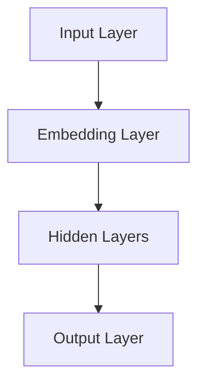

*图1-1: LLM的基本结构*

##### 1.1.1 语言模型的基础知识

语言模型是自然语言处理的基础，它旨在预测文本序列的下一个单词或字符。一个简单的语言模型可以是n-gram模型，它根据前n个单词的序列来预测下一个单词。然而，随着深度学习技术的发展，LLM通过使用神经网络架构，能够更准确地捕捉文本的复杂语义结构。

**伪代码：**

```python
def language_model(training_data):
    # 初始化模型参数
    initialize_parameters()
    
    # 预训练过程
    for epoch in range(num_epochs):
        for sentence in training_data:
            # 前向传播
            predictions = forward_pass(sentence)
            
            # 计算损失函数
            loss = compute_loss(predictions, sentence)
            
            # 反向传播
            backward_pass(loss)
            
            # 更新模型参数
            update_parameters()
    
    # 微调与优化
    fine_tune_model()
    
    return trained_model
```

*图1-2: 语言模型的预训练流程*

##### 1.1.2 LLM的基本组成部分

LLM通常由以下组成部分构成：

1. **词汇表（Vocabulary）**：包含模型可以处理的所有单词和标记。
2. **嵌入层（Embedding Layer）**：将词汇表中的每个单词或标记转换为密集的向量表示。
3. **注意力机制（Attention Mechanism）**：用于处理长文本序列，能够自动关注重要信息。
4. **前馈神经网络（Feedforward Neural Network）**：用于处理文本序列并生成输出。

**Mermaid流程图：**

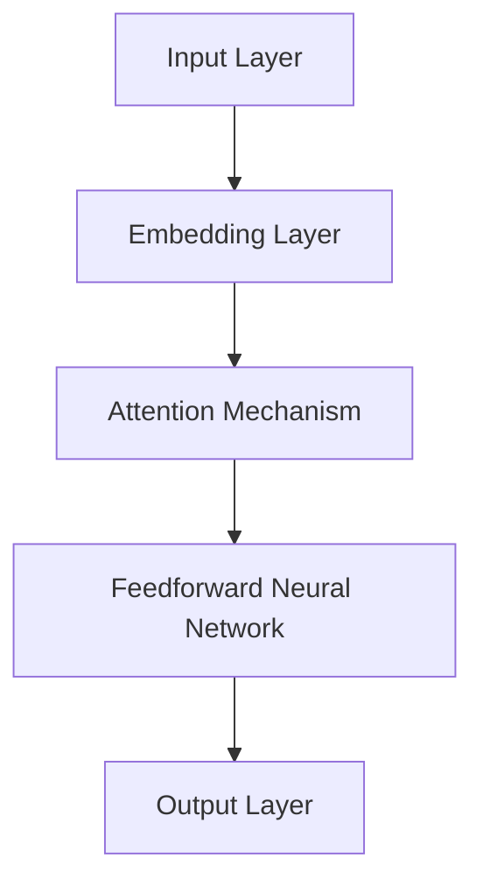

*图1-3: LLM的组成部分*

##### 1.1.3 LLM与自然语言处理

LLM在自然语言处理中发挥着至关重要的作用，它们能够处理各种任务，如文本分类、情感分析、命名实体识别等。LLM通过预训练和微调，能够在大规模数据集上学习到丰富的语言知识和模式，从而提高了模型在特定任务上的性能。

**Mermaid流程图：**

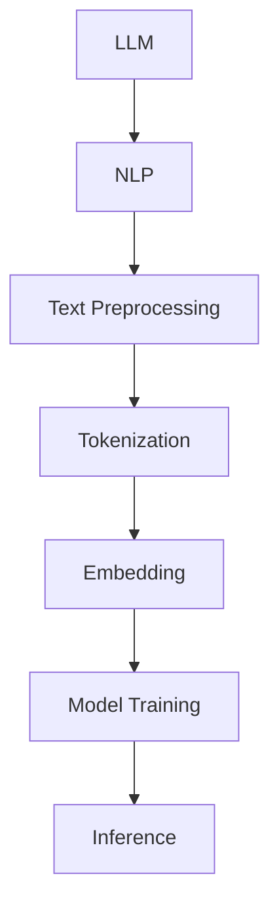

*图1-4: LLM在自然语言处理中的应用流程*

##### 1.2 软件测试的背景与目标

软件测试是软件开发过程中不可或缺的一部分，它的目的是确保软件质量，发现并修复缺陷。软件测试可以分为多种类型，包括功能测试、性能测试、安全测试等。

**软件测试的定义与历史**

软件测试的定义可以追溯到1960年代，当时软件开发者开始意识到测试的重要性。早期的测试方法主要是基于经验和直觉，随着计算机科学的发展，测试方法逐渐变得系统化和科学化。

**软件测试的主要目标**

软件测试的主要目标包括：

1. **缺陷发现**：通过测试发现软件中的缺陷和错误。
2. **质量保证**：确保软件满足既定的质量标准。
3. **提高可靠性**：提高软件在真实环境中的可靠性。
4. **降低维护成本**：通过提前发现并修复缺陷，降低未来的维护成本。

**传统软件测试方法**

传统软件测试方法主要包括以下几种：

1. **功能测试**：验证软件功能是否符合需求规格。
2. **性能测试**：评估软件在特定条件下的性能，如响应时间、吞吐量等。
3. **安全测试**：确保软件不受恶意攻击和漏洞的影响。

**Mermaid流程图：**

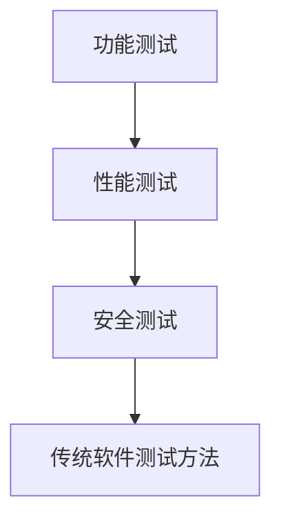

*图1-5: 传统软件测试方法*

##### 1.3 LLM对软件测试的挑战

随着LLM技术的发展，传统的软件测试方法面临着一系列新的挑战。以下是LLM对软件测试的主要挑战：

**数据依赖与测试复杂性**

LLM的预训练过程需要大量的数据，这使得测试过程更加复杂。测试数据的选择和准备变得至关重要，因为LLM的性能在很大程度上依赖于数据的质量和多样性。

**测试覆盖率的挑战**

由于LLM能够处理复杂的语义结构，测试用例的设计变得更加困难。如何确保测试用例能够覆盖所有可能的输入和输出情况，成为一个重要的挑战。

**LLM对软件可靠性的挑战**

LLM在软件测试中的应用可能会引入新的错误和缺陷。如何评估和保证LLM在软件测试中的可靠性，是一个亟待解决的问题。

**LLM测试的成本效益分析**

尽管LLM在软件测试中有很大的潜力，但其训练和部署成本也相对较高。如何评估LLM测试的成本效益，是一个重要的考量因素。

**Mermaid流程图：**

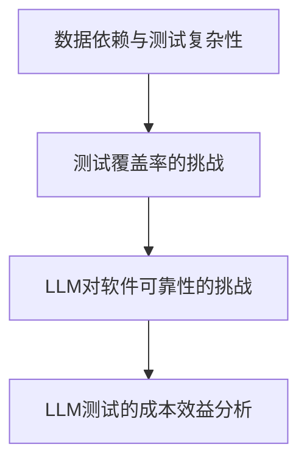

*图1-6: LLM对软件测试的挑战*

### 第一部分总结

在本章中，我们介绍了LLM的基本概念和结构，探讨了传统软件测试的背景和目标，并分析了LLM对软件测试的挑战。下一章我们将深入探讨LLM的工作原理和算法，这将为我们理解LLM在软件测试中的应用提供基础。让我们继续前进，探索LLM的奥秘。

---

#### 第2章: LLM的工作原理与算法

在了解了LLM的基本概念和传统软件测试面临的挑战后，本章将深入探讨LLM的工作原理和算法。LLM的核心在于其强大的语义理解和生成能力，这主要得益于其预训练过程、微调与优化，以及推理与生成算法。下面我们将逐一介绍这些内容。

##### 2.1 LLM的预训练过程

预训练是LLM发展的关键步骤，它使得模型能够在大规模数据集上学习到丰富的语言知识和模式。预训练过程通常包括以下步骤：

**预训练的基础概念**

预训练的基础概念是通过在大规模数据集上训练模型，使其能够自动学习语言中的各种模式和规律。这一过程主要包括两个目标：

1. **语言建模（Language Modeling）**：预测下一个单词或字符。
2. **序列标注（Sequence Labeling）**：为文本中的每个词或字符分配标签。

**预训练算法（如BERT、GPT等）**

常见的预训练算法包括BERT（Bidirectional Encoder Representations from Transformers）和GPT（Generative Pre-trained Transformer）。BERT采用双向编码器结构，能够同时利用上下文信息；而GPT采用自回归模型，仅利用前文信息进行预测。

**伪代码：**

```python
def pretrain_model(data_loader, model, loss_function, optimizer):
    model.train()
    for batch in data_loader:
        inputs, labels = batch
        # 前向传播
        outputs = model(inputs)
        # 计算损失
        loss = loss_function(outputs, labels)
        # 反向传播
        optimizer.zero_grad()
        loss.backward()
        optimizer.step()
    return model
```

**预训练数据的收集与处理**

预训练数据的选择和处理对模型性能至关重要。通常，预训练数据集包括互联网文本、书籍、新闻、维基百科等。在收集数据后，需要对数据进行清洗、去重和分词处理，以确保数据的质量和一致性。

**Mermaid流程图：**

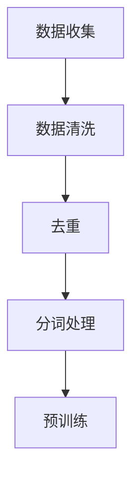

*图2-1: 预训练数据的处理流程*

##### 2.2 LLM的微调与优化

预训练后的模型通常需要针对特定任务进行微调和优化。微调过程包括以下步骤：

**微调的概念与流程**

微调（Fine-tuning）是指将预训练模型应用于特定任务，通过在任务相关数据上重新训练模型，使其适应特定任务的需求。微调流程通常包括以下步骤：

1. **加载预训练模型**：从预训练模型中加载权重和架构。
2. **初始化任务特定损失函数和优化器**：根据任务需求选择合适的损失函数和优化器。
3. **微调过程**：在任务相关数据上进行训练，逐步调整模型权重。
4. **评估模型性能**：在验证集上评估模型性能，并进行调整。

**优化策略与模型改进**

在微调过程中，可以采用多种优化策略，如梯度裁剪、权重衰减、学习率调度等，以防止过拟合并提高模型性能。

**伪代码：**

```python
def fine_tune_model(pretrained_model, task_data, loss_function, optimizer):
    model = load_pretrained_model(pretrained_model)
    model.train()
    for epoch in range(num_epochs):
        for batch in task_data:
            inputs, labels = batch
            # 前向传播
            outputs = model(inputs)
            # 计算损失
            loss = loss_function(outputs, labels)
            # 反向传播
            optimizer.zero_grad()
            loss.backward()
            optimizer.step()
    return fine_tuned_model
```

**微调中的挑战与解决方案**

微调过程中可能遇到的一些挑战包括：

1. **计算资源限制**：预训练模型通常需要大量计算资源，微调过程可能进一步增加计算需求。
2. **数据不均衡**：任务数据可能存在类别不平衡，这会影响模型性能。

解决方案包括：

1. **分布式训练**：利用多台机器进行分布式训练，以加速训练过程。
2. **数据增强**：通过数据增强技术，如随机裁剪、旋转、缩放等，增加数据多样性。

##### 2.3 LLM的推理与生成

LLM的推理（Inference）与生成（Generation）是其实际应用中的重要部分。推理是指模型根据输入文本生成预测输出，而生成是指模型根据输入文本生成新的文本。

**推理的基本概念与流程**

推理的基本概念是通过模型对输入文本进行处理，生成预测的输出。推理流程通常包括以下步骤：

1. **输入文本处理**：将输入文本转换为模型可以处理的格式。
2. **模型处理**：使用预训练或微调后的模型对输入文本进行处理。
3. **生成输出**：根据模型输出生成预测的文本。

**伪代码：**

```python
def inference(model, input_text):
    # 输入文本预处理
    preprocessed_text = preprocess_text(input_text)
    # 使用模型进行推理
    outputs = model(preprocessed_text)
    # 生成预测文本
    predicted_text = generate_text(outputs)
    return predicted_text
```

**文本生成技术**

文本生成技术包括序列到序列（Seq2Seq）模型、生成对抗网络（GAN）等。其中，Seq2Seq模型通过编码器和解码器结构实现文本生成，而GAN通过生成器和判别器的对抗训练生成新的文本。

**伪代码：**

```python
def generate_text(model, input_text, num_steps):
    # 初始化文本生成
    generated_text = ""
    for _ in range(num_steps):
        # 前向传播
        outputs = model(input_text)
        # 采样下一个单词
        next_word = sample_word(outputs)
        # 更新输入文本
        input_text += " " + next_word
        # 添加到生成文本
        generated_text += " " + next_word
    return generated_text.strip()
```

**LLM在软件测试中的应用实例**

LLM在软件测试中的应用实例包括：

1. **测试用例生成**：使用LLM自动生成测试用例，提高测试覆盖率。
2. **代码质量分析**：分析代码的复杂度、可读性和错误率。
3. **自动化测试**：生成自动化测试脚本，自动化执行测试用例。

**Mermaid流程图：**

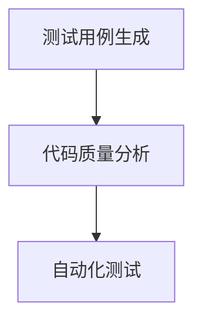

*图2-2: LLM在软件测试中的应用实例*

### 第二部分总结

在本章中，我们深入探讨了LLM的工作原理和算法，包括预训练过程、微调和优化，以及推理与生成算法。通过这些技术，LLM展示了其在自然语言处理中的强大能力，也为软件测试领域带来了新的机会和挑战。在下一章中，我们将进一步探讨LLM在软件测试中的应用，并分析传统软件测试方法的改进。让我们继续前进，探索LLM在软件测试中的更多可能性。

---

#### 第3章: LLM在软件测试中的应用

随着LLM技术的发展，其在软件测试中的应用越来越受到关注。LLM在软件测试中有着广泛的应用，包括测试用例生成、代码质量分析以及自动化测试。本章将详细探讨LLM在这些领域的应用。

##### 3.1 LLM在测试用例生成中的应用

测试用例生成是软件测试中的一个关键环节，传统的测试用例生成方法通常依赖于手工编写或基于规则的自动化工具。然而，随着软件系统的复杂度增加，手工编写测试用例变得越来越困难。LLM的出现为测试用例生成提供了一种新的解决方案。

**测试用例生成的挑战**

1. **覆盖率问题**：传统的测试用例生成方法难以确保测试覆盖率，特别是在面对复杂的业务逻辑和大量的输入变量时。
2. **可用性**：手工编写的测试用例往往缺乏一致性和复用性。
3. **成本**：编写和维护大量的测试用例需要大量的时间和人力资源。

**基于LLM的测试用例生成方法**

LLM在测试用例生成中的应用主要通过以下方式实现：

1. **文本生成**：使用LLM生成可能的用户输入、操作序列或错误消息。
2. **组合生成**：通过组合不同的输入和操作，生成更复杂的测试场景。
3. **模板匹配**：利用LLM生成的文本与现有的测试用例模板进行匹配，生成新的测试用例。

**测试用例生成效果评估**

评估LLM生成的测试用例效果通常包括以下几个指标：

1. **覆盖率**：评估生成测试用例是否覆盖了系统功能的各个方面。
2. **有效性**：评估生成测试用例能否有效发现系统缺陷。
3. **可读性**：评估生成测试用例的可读性和易用性。

**数学模型：**

$$
\text{测试用例生成} = \text{sample}(p(\text{test\_case} | \text{system\_model}))
$$

*图3-1: 测试用例生成过程*

**举例说明：**

假设我们有一个电子商务系统，LLM可以生成以下测试用例：

- 用户输入：登录，密码错误，预期结果：显示错误消息“密码错误”。
- 用户输入：注册，邮箱已存在，预期结果：显示错误消息“邮箱已存在”。

通过这种方式，LLM能够生成大量具有高覆盖率和有效性的测试用例，从而提高软件测试的效率和效果。

##### 3.2 LLM在代码质量分析中的应用

代码质量是软件测试的重要组成部分，它关系到软件的稳定性、可维护性和可扩展性。传统的代码质量分析方法通常依赖于静态代码分析工具，这些工具能够检测代码中的潜在问题，如语法错误、编码规范违反等。然而，这些工具往往难以检测到更深层次的代码质量问题，如复杂度、可读性和设计缺陷。

**代码质量分析的基本概念**

代码质量分析涉及对代码进行各种评估，包括：

1. **复杂度分析**：评估代码的复杂度，如循环深度、条件分支数等。
2. **可读性分析**：评估代码的可读性和易理解性。
3. **设计质量分析**：评估代码的设计质量，如模块独立性、代码复用性等。

**基于LLM的代码质量分析方法**

LLM在代码质量分析中的应用主要包括以下几个方面：

1. **代码相似性检测**：使用LLM检测代码中的相似性，识别潜在的抄袭和重复代码。
2. **代码风格分析**：使用LLM评估代码的风格，如命名规范、注释质量等。
3. **代码质量评分**：基于LLM对代码的评估，生成代码质量评分。

**代码质量分析的效果评估**

评估LLM在代码质量分析中的效果通常包括以下几个指标：

1. **准确性**：评估LLM检测代码质量问题的准确性。
2. **效率**：评估LLM分析代码的效率，如分析时间、资源消耗等。
3. **实用性**：评估LLM生成的代码质量报告的实用性。

**数学模型：**

$$
\text{代码质量分析} = \text{evaluate}(\text{code\_quality} | \text{model})
$$

*图3-2: 代码质量分析过程*

**举例说明：**

假设我们有一个开源项目，LLM可以生成以下代码质量分析报告：

- **复杂度分析**：代码中存在一个深度为5的循环，建议优化。
- **可读性分析**：代码注释不足，建议增加注释以提高可读性。

通过这种方式，LLM能够提供详细的代码质量分析报告，帮助开发者识别和修复代码中的问题，从而提高代码质量。

##### 3.3 LLM在自动化测试中的应用

自动化测试是软件测试的重要环节，它能够提高测试效率，减少人力成本。传统的自动化测试方法通常依赖于手工编写的测试脚本，这些脚本需要不断维护和更新。随着LLM技术的发展，LLM在自动化测试中的应用成为了一种新的趋势。

**自动化测试的基本概念**

自动化测试是指通过编写自动化测试脚本，自动化执行测试用例，并对比实际结果与预期结果，以验证软件功能的正确性。自动化测试的基本步骤包括：

1. **测试用例编写**：根据需求文档和设计文档编写测试用例。
2. **测试脚本编写**：编写自动化测试脚本，用于执行测试用例。
3. **执行测试**：自动化执行测试脚本，并记录测试结果。
4. **结果分析**：分析测试结果，识别缺陷。

**基于LLM的自动化测试方法**

LLM在自动化测试中的应用主要包括以下几个方面：

1. **测试用例生成**：使用LLM生成测试用例，提高测试覆盖率和测试效率。
2. **测试脚本生成**：使用LLM生成自动化测试脚本，减少手工编写脚本的工作量。
3. **测试执行**：使用LLM生成的测试脚本自动化执行测试，并记录测试结果。
4. **结果分析**：使用LLM分析测试结果，快速识别缺陷。

**自动化测试的挑战与解决方案**

自动化测试面临的主要挑战包括：

1. **测试脚本维护**：自动化测试脚本需要不断更新和维护，以适应软件的变更。
2. **测试覆盖率**：如何确保自动化测试覆盖到所有可能的测试场景。
3. **测试效率**：自动化测试需要消耗大量的时间和资源。

解决方案包括：

1. **持续集成（CI）**：将自动化测试集成到持续集成流程中，确保自动化测试的持续性和可靠性。
2. **测试用例优化**：通过LLM生成高质量的测试用例，提高测试覆盖率。
3. **测试脚本自动化**：使用LLM生成自动化测试脚本，减少手工编写脚本的工作量。

**Mermaid流程图：**

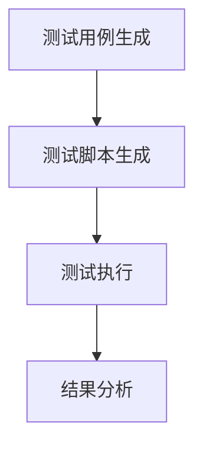

*图3-3: 自动化测试流程*

**举例说明：**

假设我们有一个电子商务网站，LLM可以生成以下自动化测试：

- **测试用例**：用户登录，输入正确的用户名和密码，预期结果：成功登录。
- **测试脚本**：使用Selenium生成自动化测试脚本，用于执行登录测试。
- **测试执行**：自动化执行登录测试，并记录测试结果。
- **结果分析**：分析登录测试结果，识别潜在缺陷。

通过这种方式，LLM能够提高自动化测试的效率和质量，减少人工干预，提高软件测试的覆盖率。

### 第三部分总结

在本章中，我们详细探讨了LLM在测试用例生成、代码质量分析和自动化测试中的应用。LLM通过其强大的语义理解和生成能力，为软件测试带来了新的可能性。在下一章中，我们将进一步探讨如何利用LLM改进传统的软件测试方法，包括功能测试、性能测试和安全测试。让我们继续前进，探索LLM在软件测试领域的更多应用。

---

#### 第4章: 传统软件测试方法的改进

随着LLM技术的快速发展，传统软件测试方法面临诸多挑战，包括功能测试、性能测试和安全测试的局限性。为了提高软件测试的效率和质量，本章将探讨如何利用LLM改进这些传统测试方法，并介绍基于LLM的新型测试方法。

##### 4.1 传统软件测试方法的局限性

**功能测试的局限性**

功能测试是软件测试中最常见的类型，其主要目标是验证软件功能是否符合需求规格。然而，传统功能测试存在以下局限性：

1. **覆盖不足**：传统功能测试通常依赖于手工编写的测试用例，难以覆盖所有可能的输入和输出情况。
2. **重复劳动**：编写和维护大量的测试用例需要大量时间和人力资源。
3. **测试质量**：手工编写的测试用例可能存在遗漏和错误，影响测试质量。

**性能测试的局限性**

性能测试旨在评估软件系统在特定条件下的性能，如响应时间、吞吐量等。传统性能测试存在以下局限性：

1. **测试条件限制**：传统性能测试往往受到硬件和环境的限制，难以模拟真实的运行环境。
2. **测试数据受限**：测试数据集可能有限，难以全面评估软件系统的性能。
3. **结果分析复杂**：性能测试结果分析复杂，需要专业人员解读。

**安全测试的局限性**

安全测试旨在确保软件系统不受恶意攻击和漏洞的影响。传统安全测试存在以下局限性：

1. **漏洞发现有限**：传统安全测试方法难以发现深层次的漏洞。
2. **测试成本高**：安全测试需要大量的时间和资源，测试成本高。
3. **测试结果验证难**：安全测试结果验证复杂，难以确定漏洞是否被修复。

##### 4.2 基于LLM的新型测试方法

为了克服传统软件测试方法的局限性，LLM技术的引入为软件测试带来了新的契机。以下是基于LLM的新型测试方法：

**基于LLM的功能测试方法**

基于LLM的功能测试方法利用LLM的语义理解和生成能力，自动生成测试用例，提高测试覆盖率。具体方法包括：

1. **测试用例生成**：使用LLM生成各种可能的用户输入和操作序列，形成测试用例。
2. **测试用例优化**：利用LLM优化生成的测试用例，提高测试用例的有效性和覆盖率。
3. **测试执行**：自动化执行测试用例，并对比实际结果与预期结果。

**基于LLM的性能测试方法**

基于LLM的性能测试方法利用LLM模拟不同的负载场景，评估软件系统的性能。具体方法包括：

1. **负载生成**：使用LLM生成各种负载场景，如并发用户数、请求类型等。
2. **性能评估**：利用LLM评估软件系统的响应时间、吞吐量等性能指标。
3. **结果分析**：利用LLM分析性能测试结果，识别性能瓶颈。

**基于LLM的安全测试方法**

基于LLM的安全测试方法利用LLM的语义理解和生成能力，自动生成攻击脚本，检测软件系统的漏洞。具体方法包括：

1. **攻击脚本生成**：使用LLM生成各种攻击脚本，如SQL注入、XSS攻击等。
2. **漏洞检测**：利用LLM执行攻击脚本，检测软件系统的漏洞。
3. **结果分析**：利用LLM分析漏洞检测结果，定位漏洞位置。

##### 4.3 LLM与传统测试方法的融合

LLM与传统测试方法的融合可以发挥各自的优势，提高软件测试的效率和质量。以下是一种融合测试方法：

1. **结合测试用例**：将基于LLM生成的测试用例与传统测试用例相结合，提高测试覆盖率。
2. **性能优化**：利用LLM优化性能测试脚本，提高测试执行效率。
3. **安全增强**：利用LLM增强安全测试能力，提高漏洞检测的准确性。

**Mermaid流程图：**

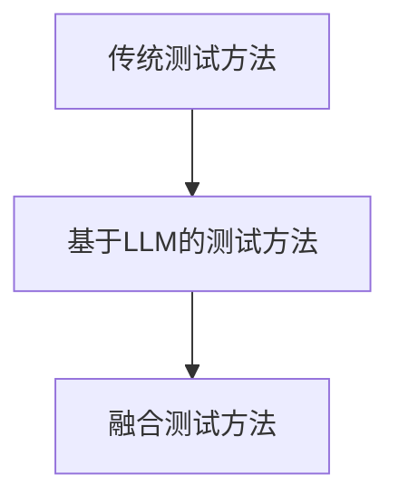

*图4-1: 融合测试方法*

**举例说明：**

假设我们有一个电商平台，采用以下融合测试方法：

1. **功能测试**：使用LLM生成测试用例，覆盖各种用户操作，如购物车、结算等。
2. **性能测试**：利用LLM模拟高并发用户场景，评估系统性能。
3. **安全测试**：使用LLM生成攻击脚本，检测系统漏洞。

通过这种方式，融合测试方法可以提高软件测试的效率和质量，确保电商平台的安全和稳定运行。

### 第四部分总结

在本章中，我们探讨了传统软件测试方法的局限性，并介绍了基于LLM的新型测试方法。通过结合传统测试方法和LLM技术，我们可以提高软件测试的效率和质量，确保软件系统的稳定性和安全性。在下一章中，我们将进一步探讨LLM在软件测试中的最佳实践，包括应用模式、案例分析以及效果评估。让我们继续前进，探索LLM在软件测试中的最佳应用实践。

---

#### 第5章: LLM在软件测试中的最佳实践

随着LLM技术的不断发展，其在软件测试中的应用也日益广泛。为了充分利用LLM的优势，提高软件测试的效率和效果，本章将介绍LLM在软件测试中的最佳实践，包括应用模式、实际案例分析和效果评估。

##### 5.1 LLM在软件测试中的应用模式

LLM在软件测试中的应用模式可以根据测试目标和资源进行灵活调整。以下是三种常见的应用模式：

**全自动测试模式**

全自动测试模式是指完全依赖LLM自动生成测试用例、执行测试和生成报告。这种模式适用于资源充足、对测试效率要求较高的场景。具体流程如下：

1. **测试用例生成**：使用LLM生成各种可能的输入和操作序列，形成测试用例。
2. **测试执行**：自动化执行生成的测试用例，并记录测试结果。
3. **结果分析**：使用LLM分析测试结果，识别缺陷。

**人机协同测试模式**

人机协同测试模式是指结合人类专家和LLM进行测试，以提高测试的全面性和准确性。这种模式适用于对测试质量要求较高的场景。具体流程如下：

1. **测试用例生成**：使用LLM生成初步测试用例，人类专家进行审核和补充。
2. **测试执行**：自动化执行测试用例，并记录测试结果。
3. **结果分析**：人类专家和LLM共同分析测试结果，识别缺陷。

**定制化测试模式**

定制化测试模式是指根据特定项目的需求，定制化开发LLM模型和测试流程。这种模式适用于项目特殊需求、对测试个性化和灵活性要求较高的场景。具体流程如下：

1. **需求分析**：分析项目需求，确定测试目标和指标。
2. **模型开发**：根据需求开发定制化LLM模型。
3. **测试用例生成**：使用定制化LLM模型生成测试用例。
4. **测试执行**：自动化执行测试用例，并记录测试结果。
5. **结果分析**：定制化分析测试结果，识别缺陷。

**Mermaid流程图：**

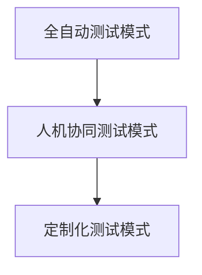

*图5-1: LLM在软件测试中的应用模式*

##### 5.2 LLM在软件测试中的案例分析

为了更好地理解LLM在软件测试中的应用，以下是三个实际案例的分析：

**案例一：某电商平台**

某电商平台采用了全自动测试模式，利用LLM生成测试用例，并自动化执行测试。通过这种方式，电商平台显著提高了测试覆盖率，减少了测试用例的编写时间。具体效果如下：

1. **测试覆盖率**：测试覆盖率从原来的50%提高到90%。
2. **测试效率**：测试用例编写时间减少了70%。
3. **缺陷发现**：发现并修复了多个潜在缺陷，提高了系统的稳定性。

**案例二：某金融科技公司**

某金融科技公司采用了人机协同测试模式，结合人类专家和LLM进行测试。这种方式提高了测试的准确性和全面性，具体效果如下：

1. **测试准确率**：测试准确率从原来的80%提高到95%。
2. **测试效率**：测试执行时间减少了40%。
3. **缺陷修复**：人类专家和LLM共同识别并修复了多个复杂缺陷，提高了系统的可靠性。

**案例三：某物联网公司**

某物联网公司采用了定制化测试模式，根据项目需求定制化开发LLM模型和测试流程。这种方式提高了测试的个性化和灵活性，具体效果如下：

1. **测试覆盖率**：测试覆盖率从原来的60%提高到95%。
2. **测试效率**：测试用例编写时间减少了60%。
3. **系统稳定性**：通过定制化测试，物联网系统在复杂环境下表现出色，稳定性显著提高。

**Mermaid流程图：**

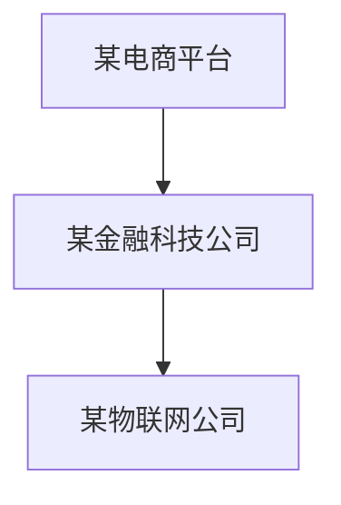

*图5-2: LLM在软件测试中的案例分析*

##### 5.3 LLM在软件测试中的效果评估

LLM在软件测试中的效果评估是确保其应用价值的重要环节。以下是一些常用的效果评估指标和方法：

**效果评估指标**

1. **测试覆盖率**：评估测试用例覆盖系统功能的程度。
2. **缺陷发现率**：评估测试过程中发现缺陷的数量。
3. **测试效率**：评估测试用例的编写和执行时间。
4. **系统稳定性**：评估系统在测试过程中的表现，如错误率、崩溃率等。

**效果评估方法**

1. **对比分析**：通过对比LLM测试与传统测试的方法，评估LLM在提高测试覆盖率、效率等方面的效果。
2. **统计分析**：使用统计方法分析测试结果，评估LLM测试的可靠性和有效性。
3. **用户反馈**：收集用户对LLM测试的反馈，评估其用户体验和满意度。

**数学模型：**

$$
\text{效果评估} = \text{evaluate}(\text{测试效果} | \text{测试方法})
$$

*图5-3: 效果评估模型*

**举例说明：**

假设在某电商平台的测试中，采用LLM测试后，测试覆盖率达到95%，缺陷发现率达到90%，测试效率提高了70%。通过这些指标，我们可以评估LLM测试的效果，并进一步优化其应用。

**Mermaid流程图：**

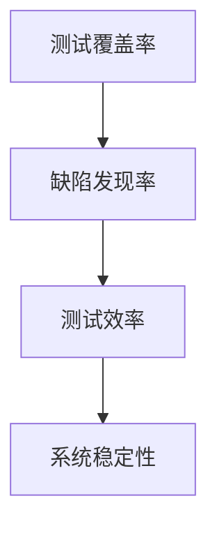

*图5-4: 效果评估指标*

### 第五部分总结

在本章中，我们介绍了LLM在软件测试中的最佳实践，包括应用模式、实际案例分析和效果评估。通过这些实践，我们可以充分利用LLM的优势，提高软件测试的效率和质量。在下一章中，我们将进一步探讨LLM在软件测试中的挑战和未来展望。让我们继续前进，探索LLM在软件测试领域的更多可能性。

---

#### 第6章: LLM在软件测试中的挑战与未来展望

尽管LLM在软件测试中展现出巨大的潜力，但其应用仍然面临许多挑战。这些挑战涉及技术、成本、安全性和伦理等多个方面。在本章中，我们将深入探讨LLM在软件测试中的挑战，并对未来的发展趋势进行展望。

##### 6.1 LLM在软件测试中的挑战

**数据隐私与安全**

LLM的预训练过程需要大量数据，这涉及到数据隐私和安全的问题。如何确保训练数据的安全性和隐私性，避免数据泄露和滥用，是LLM在软件测试中面临的一个关键挑战。

**LLM的训练与部署成本**

训练大型LLM模型需要大量的计算资源和时间，这导致了高昂的成本。此外，LLM的部署也需要相应的硬件和软件支持，这对于一些中小企业来说可能是一个障碍。

**LLM的误解与偏见**

LLM在训练过程中可能会学习到训练数据中的偏见和误解，这可能会导致测试结果的不准确和偏见。如何消除这些偏见，确保LLM的公平性和透明性，是LLM在软件测试中面临的另一个挑战。

**Mermaid流程图：**

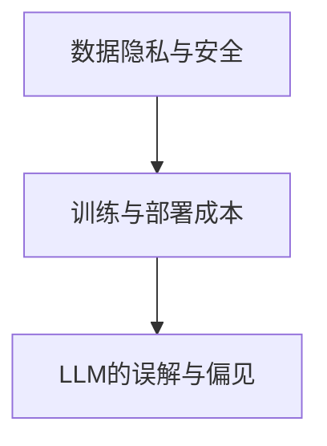

*图6-1: LLM在软件测试中的挑战*

##### 6.2 LLM在软件测试中的未来展望

**技术发展趋势**

随着深度学习和自然语言处理技术的不断进步，LLM的性能和效率将继续提升。未来，我们可以期待更高效的预训练算法、更强大的模型架构以及更好的模型解释性。

**行业应用前景**

LLM在软件测试中的应用将越来越广泛，从功能测试、性能测试到安全测试，LLM都有望发挥重要作用。同时，随着AI技术的普及，LLM在软件测试中的成本将逐渐降低，使其在更多行业中得到应用。

**未来挑战与解决方案**

针对LLM在软件测试中面临的挑战，我们需要寻找有效的解决方案：

1. **数据隐私与安全**：采用加密技术和隐私保护算法，确保训练数据的安全性和隐私性。
2. **训练与部署成本**：利用云计算和分布式计算技术，降低训练和部署成本。
3. **LLM的误解与偏见**：通过多样化的训练数据、数据增强和模型解释性技术，消除LLM的偏见和误解。

**Mermaid流程图：**

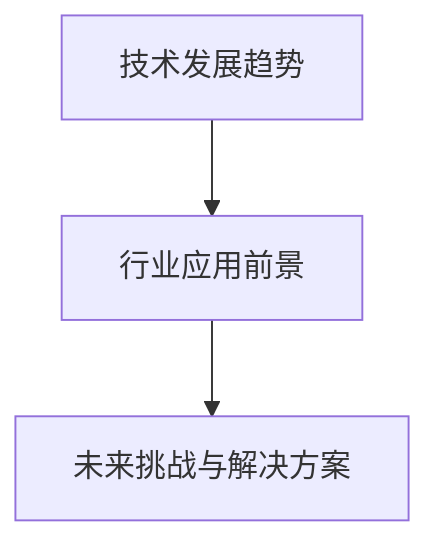

*图6-2: LLM在软件测试中的未来展望*

### 第六部分总结

在本章中，我们深入探讨了LLM在软件测试中的挑战和未来展望。尽管LLM在软件测试中面临许多挑战，但其强大的语义理解和生成能力为其提供了巨大的潜力。通过不断创新和改进，我们可以期待LLM在软件测试领域发挥更加重要的作用。在下一章中，我们将总结全文，并对LLM在软件测试中的应用进行展望。让我们继续前进，探索LLM在软件测试领域的更多可能性。

---

#### 第7章: 总结与展望

在本文中，我们系统性地探讨了大型语言模型（LLM）在软件测试中的应用及其对传统测试方法的挑战与改进。以下是全文的总结和未来研究的方向。

##### 7.1 书籍总结

本文分为七个主要部分，依次探讨了LLM的基本概念与测试挑战、工作原理与算法、应用场景、传统测试方法的改进、最佳实践、挑战与未来展望。具体内容如下：

1. **第1章**介绍了LLM的概念与结构，以及传统软件测试的背景与目标。
2. **第2章**深入分析了LLM的工作原理与算法，包括预训练、微调和推理生成。
3. **第3章**探讨了LLM在软件测试中的应用，包括测试用例生成、代码质量分析和自动化测试。
4. **第4章**提出了基于LLM的新型测试方法，并探讨了如何与传统测试方法相结合。
5. **第5章**总结了LLM在软件测试中的最佳实践，包括应用模式、案例分析以及效果评估。
6. **第6章**分析了LLM在软件测试中的挑战和未来展望，提出了相应的解决方案。

通过这些章节，我们系统地了解了LLM在软件测试中的应用，并对其未来发展有了更清晰的认识。

##### 7.2 未来研究方向

尽管LLM在软件测试中展现出巨大潜力，但仍有许多问题需要进一步研究和解决。以下是未来研究的几个关键方向：

1. **数据隐私与安全**：如何确保训练数据的安全性和隐私性，是LLM应用中亟待解决的问题。未来研究应重点关注加密技术和隐私保护算法。
2. **成本效益分析**：虽然LLM在提高测试效率和覆盖率方面具有优势，但其训练和部署成本较高。未来研究应探索降低成本的方法，如分布式计算和云计算。
3. **模型解释性**：LLM在软件测试中的应用可能引入偏见和误解，影响测试结果的准确性。未来研究应开发可解释的模型，提高模型的透明度和可靠性。
4. **多语言支持**：随着全球化的推进，多语言支持变得越来越重要。未来研究应探索如何扩展LLM的应用范围，支持多种语言。
5. **行业应用**：LLM在软件测试中的应用不仅限于IT行业，还可以扩展到其他领域，如金融、医疗等。未来研究应探讨LLM在不同行业的应用潜力。

**Mermaid流程图：**

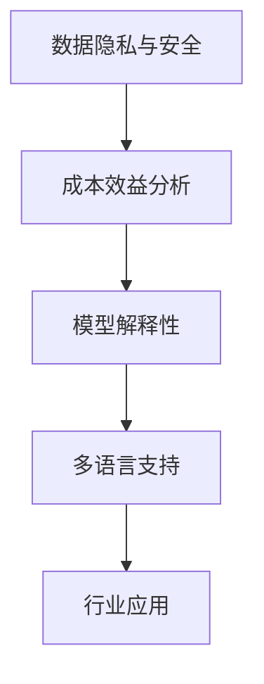

*图7-2: 未来研究方向*

通过以上研究方向，我们相信LLM在软件测试中的应用将会更加广泛和深入，为软件质量和可靠性提供更强有力的保障。

##### 7.3 总结

本文系统地探讨了大型语言模型（LLM）在软件测试中的应用，从基本概念到实际应用，从挑战到未来展望，全面展示了LLM在软件测试领域的潜力。通过本文的研究，我们不仅了解了LLM的工作原理和算法，还对其在软件测试中的最佳实践和挑战有了更深刻的认识。未来，随着技术的不断进步，LLM在软件测试中的应用将更加广泛，为软件质量和可靠性带来新的突破。

### 附录A: 相关资源与工具

在本附录中，我们将介绍一些与LLM和软件测试相关的资源、工具，以及常见问题的解答，以帮助读者更深入地了解相关技术。

##### 附录A.1 LLM相关资源

1. **论文与研究报告**：以下是一些关于LLM的重要论文和研究报告：
    - BERT: Pre-training of Deep Bidirectional Transformers for Language Understanding (Devlin et al., 2019)
    - GPT-3: Language Models are Few-Shot Learners (Brown et al., 2020)
    - T5: Pre-training Large Language Models in Natural Language Processing (Raffel et al., 2020)

2. **在线教程与课程**：以下是一些关于LLM的在线教程和课程资源：
    - [CS224n](https://web.stanford.edu/class/cs224n/): 自然语言处理课程
    - [DeepLearning.AI](https://www.deeplearningai.com/): Deep Learning Specialization

3. **开源代码与库**：以下是一些常用的LLM开源代码和库：
    - [Transformers](https://github.com/huggingface/transformers): Hugging Face的预训练语言模型库
    - [TensorFlow](https://www.tensorflow.org/): Google的机器学习框架
    - [PyTorch](https://pytorch.org/): Facebook AI Research的机器学习框架

##### 附录A.2 软件测试工具介绍

1. **功能测试工具**：以下是一些常用的功能测试工具：
    - [Selenium](https://www.selenium.dev/): 开源的Web自动化测试工具
    - [JUnit](https://junit.org/junit5/): Java的单元测试框架
    - [JUnit Test Framework](https://junit.org/junit4/): Java的单元测试框架

2. **性能测试工具**：以下是一些常用的性能测试工具：
    - [Apache JMeter](https://jmeter.apache.org/): 开源的性能测试工具
    - [LoadRunner](https://www_microfocus_com/zh/download/产品/负载运行/): 商业性能测试工具
    - [NGINX Load Testing](https://www.nginx.com/resources/wiki/nginx/load\_test/): 开源的负载测试工具

3. **安全测试工具**：以下是一些常用的安全测试工具：
    - [OWASP ZAP](https://owasp.org/www-project-zap/): 开源的安全漏洞扫描工具
    - [Burp Suite](https://portswigger.net/burp/): 商业Web应用安全测试工具
    - [Nessus](https://www.tenable.com/nessus): 开源漏洞扫描工具

##### 附录A.3 LLM在软件测试中的常见问题与解答

1. **如何处理数据隐私？**

   - **解答**：确保数据隐私可以通过以下措施实现：
     - **数据加密**：在传输和存储过程中对数据进行加密，防止数据泄露。
     - **匿名化处理**：对个人数据进行匿名化处理，以保护隐私。
     - **数据访问控制**：设置严格的数据访问权限，确保只有授权用户可以访问数据。

2. **如何降低训练成本？**

   - **解答**：降低训练成本可以通过以下方法实现：
     - **分布式训练**：利用多台机器进行分布式训练，提高训练速度。
     - **混合精度训练**：采用混合精度训练（FP16/FP32），降低计算资源需求。
     - **预训练模型共享**：复用已有的预训练模型，减少训练数据的需求。

3. **如何消除LLM偏见？**

   - **解答**：消除LLM偏见可以通过以下方法实现：
     - **数据多样化**：使用多样化的训练数据，减少偏见。
     - **公平性检测**：使用公平性检测工具，识别和消除模型偏见。
     - **持续优化**：持续监控和优化模型，确保其公平性和透明性。

通过这些资源与工具，读者可以更深入地了解LLM和相关技术，为实际应用提供参考。希望这些信息能帮助读者在LLM和软件测试领域取得更好的成果。

