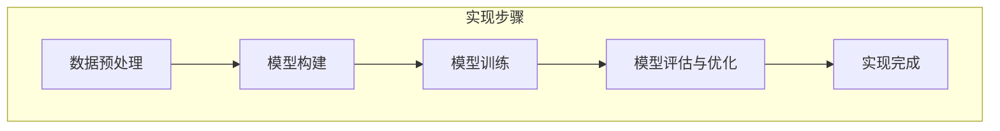

                 

### 文章标题：LLM操作系统：AI时代的新型OS构想

#### 关键词：
- AI时代
- 操作系统
- 大型语言模型
- 自然语言处理
- 智能推荐

#### 摘要：
本文深入探讨了AI时代的新型操作系统——LLM操作系统。通过概述其背景与概念，分析其核心算法与实现，探讨其应用与未来，并结合实际项目案例，详细介绍了LLM操作系统的设计理念、实现方法和应用场景。本文旨在为广大科技工作者提供一个全新的视角，以了解和掌握LLM操作系统在AI领域的潜力与挑战。

### 《LLM操作系统：AI时代的新型OS构想》目录大纲

#### 第一部分：背景与概念
1. **概述与背景**
   - **1.1 AI时代的新OS：LLM操作系统简介**
   - **1.2 LLMO（大型语言模型操作系统）的基本概念**

2. **LLM操作系统的核心概念**
   - **2.1 大型语言模型的基本原理**
   - **2.2 LLM操作系统的架构**
   - **2.3 LLM操作系统与传统OS的区别**

#### 第二部分：核心算法与实现
3. **核心算法原理**
   - **3.1 语言模型算法原理**
   - **3.2 模型训练与优化**
   - **3.3 数学模型与公式**

4. **LLM操作系统实现**
   - **4.1 开发环境与工具**
   - **4.2 实现步骤**
   - **4.3 Mermaid流程图：实现步骤**

#### 第三部分：应用与未来
5. **LLM操作系统应用场景**
   - **5.1 自然语言处理**
   - **5.2 智能推荐系统**
   - **5.3 其他应用领域**

6. **LLM操作系统的发展与挑战**
   - **6.1 技术发展**
   - **6.2 挑战与风险**

#### 第四部分：项目实战
7. **LLM操作系统实战案例**
   - **7.1 智能客服系统**
   - **7.2 个性化推荐系统**

#### 附录
8. **附录：参考资料与工具**
   - **8.1 参考书籍与论文**
   - **8.2 开发工具与资源**

### 第一部分：背景与概念

#### 1.1 AI时代的新OS：LLM操作系统简介

随着人工智能（AI）技术的快速发展，传统的操作系统（OS）已经无法满足日益复杂的AI应用需求。在这个背景下，LLM操作系统（Large Language Model Operating System，简称LLMOS）应运而生。LLM操作系统是一种新型的AI操作系统，它以大型语言模型（Large Language Model，简称LLM）为核心，旨在为AI应用提供一个高效、灵活、智能的运行环境。

LLM操作系统的主要特点包括：

1. **高效性**：LLM操作系统通过集成大型语言模型，可以快速处理和理解大量的文本数据，从而提高AI应用的运行效率。
2. **灵活性**：LLM操作系统支持多种编程语言和开发框架，方便开发者根据不同需求进行定制化开发。
3. **智能性**：LLM操作系统内置了智能推荐、问答系统等功能，可以自动学习和适应用户行为，提供个性化的服务。

#### 1.2 LLMO（大型语言模型操作系统）的基本概念

LLM操作系统（LLMOS）的基本概念主要包括以下几个方面：

1. **大型语言模型**：大型语言模型是一种基于深度学习技术的自然语言处理（NLP）模型，它通过学习大量的文本数据，可以生成和理解复杂的自然语言文本。
2. **操作系统**：操作系统是计算机系统的核心软件，它负责管理和控制计算机硬件资源，并提供一个运行应用程序的平台。
3. **LLMOS架构**：LLMOS的架构包括多个层次，从底层硬件资源管理到顶层应用层，每个层次都有不同的功能模块。

#### 1.3 AI时代的发展与需求

随着AI技术的迅速发展，AI应用的需求也在不断增长。传统的操作系统已经无法满足这些需求，主要原因包括：

1. **数据量增加**：随着互联网的普及和大数据技术的发展，数据量呈现爆炸式增长，传统操作系统在处理大量数据时效率低下。
2. **计算资源需求**：AI应用通常需要大量的计算资源，如GPU、TPU等，传统操作系统在资源管理方面存在瓶颈。
3. **智能需求**：AI应用需要具备智能化的能力，如自然语言处理、图像识别等，传统操作系统无法提供这些功能。

为了满足AI时代的这些需求，LLM操作系统应运而生。它通过集成大型语言模型，提供了一个高效、灵活、智能的运行环境，可以更好地支持AI应用的发展。

#### 1.4 LLMO（大型语言模型操作系统）的基本概念

LLM操作系统（LLMOS）的基本概念主要包括以下几个方面：

1. **大型语言模型**：大型语言模型是一种基于深度学习技术的自然语言处理（NLP）模型，它通过学习大量的文本数据，可以生成和理解复杂的自然语言文本。
   - **原理**：大型语言模型通常采用神经网络架构，如Transformer，通过多层叠加的方式，实现对文本数据的建模和预测。
   - **特点**：大型语言模型具有强大的语言理解能力和生成能力，能够处理长文本、多语言文本等复杂场景。
   - **应用**：大型语言模型在自然语言处理、文本生成、机器翻译等领域有着广泛的应用。

2. **操作系统**：操作系统是计算机系统的核心软件，它负责管理和控制计算机硬件资源，并提供一个运行应用程序的平台。
   - **功能**：操作系统的功能包括进程管理、内存管理、文件系统管理、设备管理等，确保计算机系统高效、稳定地运行。
   - **类型**：常见的操作系统包括Windows、Linux、macOS等，每种操作系统都有其特定的功能和特点。

3. **LLMOS架构**：LLMOS的架构包括多个层次，从底层硬件资源管理到顶层应用层，每个层次都有不同的功能模块。
   - **层次结构**：
     - **硬件层**：负责硬件资源的监控和管理，包括CPU、GPU、内存等。
     - **内核层**：负责操作系统核心功能的实现，包括进程管理、内存管理、文件系统管理等。
     - **中间层**：负责大型语言模型的管理和优化，包括模型加载、模型训练、模型推理等。
     - **应用层**：负责支持各种AI应用的开发和运行，包括自然语言处理、智能推荐、图像识别等。

#### 1.5 LLM操作系统的核心概念

LLM操作系统（LLMOS）的核心概念主要包括以下几个方面：

1. **大型语言模型**：LLMOS的核心组件之一是大型语言模型，它是一种基于深度学习技术的自然语言处理（NLP）模型，通过学习大量的文本数据，可以生成和理解复杂的自然语言文本。这些模型通常具有巨大的参数量，可以处理长文本、多语言文本等复杂场景。
2. **操作系统**：LLMOS是一种新型的操作系统，它以大型语言模型为核心，提供了一种高效、灵活、智能的运行环境。与传统操作系统相比，LLMOS在语言理解、文本生成、智能推荐等方面具有显著的优势。
3. **架构**：LLMOS的架构设计充分考虑了大型语言模型的特点和需求，采用了分层架构，包括硬件层、内核层、中间层和应用层。每个层次都有不同的功能模块，协同工作，为AI应用提供强大的支持。

#### 1.6 LLM操作系统的架构

LLM操作系统的架构设计旨在充分利用大型语言模型的优势，为AI应用提供高效、灵活、智能的运行环境。其架构主要包括四个层次：硬件层、内核层、中间层和应用层。

1. **硬件层**：
   - **功能**：硬件层负责硬件资源的监控和管理，包括CPU、GPU、内存等。它确保LLMOS能够充分利用计算资源，提高运行效率。
   - **设计**：硬件层的设计考虑了异构计算的需求，可以支持不同类型的硬件设备，如CPU、GPU、TPU等，以满足不同应用场景的需求。

2. **内核层**：
   - **功能**：内核层负责操作系统核心功能的实现，包括进程管理、内存管理、文件系统管理等。它为上层中间层和应用层提供了基本的运行环境。
   - **设计**：内核层采用了模块化设计，可以灵活地添加和移除模块，以支持不同的功能和需求。

3. **中间层**：
   - **功能**：中间层负责大型语言模型的管理和优化，包括模型加载、模型训练、模型推理等。它是LLMOS的核心组件，负责处理和理解自然语言文本。
   - **设计**：中间层采用了分布式架构，可以支持大规模的语言模型训练和推理任务。它还提供了丰富的API接口，方便开发者进行模型调用和集成。

4. **应用层**：
   - **功能**：应用层负责支持各种AI应用的开发和运行，包括自然语言处理、智能推荐、图像识别等。它为开发者提供了一个友好的开发环境，方便他们实现各种AI应用。
   - **设计**：应用层提供了丰富的工具和框架，如自然语言处理库、推荐系统框架等，支持开发者快速构建和部署AI应用。

#### 1.7 LLM操作系统与传统OS的区别

LLM操作系统与传统操作系统（如Windows、Linux等）在架构、功能和应用方面存在显著的区别：

1. **架构**：
   - **LLMOS**：采用分层架构，包括硬件层、内核层、中间层和应用层，每个层次都有不同的功能模块，协同工作，为AI应用提供支持。
   - **传统OS**：通常采用单一内核架构，负责管理硬件资源和运行应用程序，功能相对单一。

2. **功能**：
   - **LLMOS**：以大型语言模型为核心，提供高效的文本处理和自然语言理解能力，同时支持智能推荐、问答系统等功能。
   - **传统OS**：主要提供基本的操作系统功能，如进程管理、内存管理、文件系统管理等，不直接支持AI应用。

3. **应用**：
   - **LLMOS**：适用于需要强大自然语言处理能力的AI应用，如智能客服、智能推荐、文本生成等。
   - **传统OS**：适用于通用计算机系统，如个人电脑、服务器等，不专门为AI应用设计。

LLM操作系统在AI时代的崛起，不仅改变了操作系统的功能和应用场景，也为开发者提供了更强大的工具和平台，为AI技术的发展和应用开辟了新的道路。

#### 1.8 AI时代的发展与需求

在人工智能（AI）技术飞速发展的时代，AI应用的需求日益多样且复杂。这一现象催生了对新型操作系统的迫切需求，而LLM操作系统（LLMOS）正是为满足这些需求而诞生的。

**1.8.1 数据量激增**

随着互联网的普及和大数据技术的发展，数据量呈现指数级增长。传统操作系统在面对如此庞大的数据量时，常常显得力不从心。LLMOS通过其高效的大型语言模型（LLM）能够快速处理和分析大量文本数据，从而显著提升数据处理能力。

**1.8.2 计算资源需求**

AI应用，尤其是深度学习任务，通常需要大量的计算资源。传统的操作系统往往无法充分利用现代硬件（如GPU、TPU等）的计算能力。LLMOS通过其优化的架构设计，能够更高效地管理和利用这些计算资源，满足AI应用对高性能计算的需求。

**1.8.3 智能需求**

现代AI应用不仅需要处理数据，还需要具备智能化的能力，如自然语言理解、智能推荐等。传统操作系统在这方面功能有限，而LLMOS内置了大型语言模型，能够提供强大的自然语言处理和智能推理能力，为开发者提供了一个更加智能的运行环境。

**1.8.4 个性化与定制化**

AI应用往往需要根据用户的具体需求进行定制化开发。LLMOS通过其灵活的架构设计，支持多种编程语言和开发框架，使开发者能够根据不同需求进行定制化开发，从而更好地满足用户的需求。

综上所述，随着AI技术的不断进步和AI应用的日益普及，传统操作系统已经无法满足这些新需求。LLM操作系统应运而生，通过其高效的文本处理能力、强大的计算资源管理和智能化的功能，为AI应用提供了一个全新的运行平台。

#### 1.9 LLMO（大型语言模型操作系统）的基本概念

LLMO（大型语言模型操作系统）作为一种新兴的AI操作系统，其核心理念是利用大型语言模型（LLM）来提升自然语言处理（NLP）应用的效率和智能化程度。以下是LLMO的基本概念，包括其核心组件、工作原理和目标。

**1.9.1 核心组件**

LLMO的核心组件主要包括：

- **大型语言模型**：这是LLMO的核心，如GPT-3、BERT等，这些模型具有庞大的参数量和强大的语言理解能力，能够处理复杂的文本数据。

- **操作系统内核**：负责管理和调度系统资源，包括CPU、内存、存储等，同时提供基础的服务和接口，如进程管理、内存分配、文件系统管理等。

- **中间层**：负责大型语言模型的加载、训练、推理等操作，包括模型优化、分布式训练和推理等。

- **应用层**：提供各种AI应用的接口和工具，如文本生成、机器翻译、问答系统等。

**1.9.2 工作原理**

LLMO的工作原理可以概括为以下几个步骤：

1. **数据预处理**：将原始的文本数据清洗和格式化，以便于模型处理。

2. **模型加载与训练**：根据应用需求，加载预训练的LLM模型，并进行必要的微调，以适应特定任务。

3. **模型推理**：使用训练好的模型对输入的文本数据进行处理，生成预测结果。

4. **结果处理与输出**：对模型推理的结果进行后处理，如格式化、去噪等，然后输出最终结果。

**1.9.3 目标**

LLMO的主要目标包括：

- **提升效率**：通过高效的模型推理和优化，加快AI应用的响应速度。

- **增强智能化**：利用大型语言模型强大的语言理解能力，提升AI应用的智能化水平。

- **简化开发**：提供统一的API接口和工具，简化AI应用的开发和部署过程。

- **资源优化**：通过优化模型和系统资源的管理，提高硬件资源的利用率。

通过这些核心组件、工作原理和目标，LLMO旨在为AI应用提供一个高效、智能、灵活的运行平台，推动AI技术的发展和应用。

#### 1.10 LLM操作系统的核心概念

LLM操作系统（LLMOS）的核心概念是其架构和组件，这些构成了其高效处理自然语言数据的基础。以下是LLMOS的核心概念，包括其组成部分、各组件的功能和它们之间的关系。

**1.10.1 组成部分**

LLMOS主要由以下几个组成部分构成：

- **底层硬件资源管理**：负责管理和监控底层硬件资源，如CPU、GPU、内存等。这一部分确保LLMOS能够高效地利用硬件资源，以满足大规模数据处理的需求。

- **操作系统内核**：提供基础的服务和接口，包括进程管理、内存分配、文件系统管理等。操作系统内核负责协调各个组件的运行，并提供稳定的运行环境。

- **大型语言模型（LLM）引擎**：这是LLMOS的核心组件，负责加载、训练和推理大型语言模型。LLM引擎提供了高效的模型处理能力，能够快速处理复杂的自然语言数据。

- **中间件**：提供一系列中间层的功能，如数据预处理、模型优化、分布式训练和推理等。中间件负责协调底层硬件资源和LLM引擎之间的交互，提高系统整体性能。

- **应用层**：为开发者提供API接口和工具，支持各种自然语言处理（NLP）应用的开发和部署，如文本生成、机器翻译、问答系统等。

**1.10.2 组件功能**

- **底层硬件资源管理**：通过资源监控和调度，确保硬件资源的高效利用。它提供了对GPU、TPU等异构计算资源的支持，以满足大规模数据处理任务的需求。

- **操作系统内核**：负责系统的基本功能，如进程管理、内存分配、文件系统管理等。内核通过提供稳定的运行环境，确保系统在各种工作负载下都能稳定运行。

- **大型语言模型（LLM）引擎**：提供了强大的语言理解和生成能力。LLM引擎通过加载预训练模型或微调现有模型，能够快速处理大规模文本数据，生成高质量的文本输出。

- **中间件**：负责数据预处理、模型优化、分布式训练和推理等。中间件提供了灵活的接口，使开发者能够方便地集成和使用LLM功能，同时优化模型性能和系统资源利用。

- **应用层**：为开发者提供了丰富的API和工具，使他们能够轻松构建和部署各种NLP应用。应用层提供了对自然语言处理任务的支持，如文本摘要、问答、文本分类等。

**1.10.3 组件之间的关系**

各个组件之间通过紧密的协作，共同构成一个高效的LLM操作系统。具体关系如下：

- **硬件层与内核层**：底层硬件资源管理负责硬件资源的监控和调度，操作系统内核则利用这些资源来提供服务和管理系统。

- **内核层与LLM引擎**：操作系统内核为LLM引擎提供运行环境，同时管理和调度LLM引擎所需的资源。

- **LLM引擎与中间件**：LLM引擎通过中间件进行数据预处理、模型优化和分布式训练。中间件为LLM引擎提供了灵活的接口和优化功能。

- **中间件与应用层**：中间件为应用层提供了通用的API和工具，使开发者能够方便地集成和使用LLM功能。应用层则利用中间件提供的功能，开发各种NLP应用。

通过这种紧密的组件协作，LLM操作系统能够高效地处理自然语言数据，支持各种AI应用，为开发者提供了一个强大的开发和运行平台。

#### 1.11 大型语言模型的基本原理

大型语言模型（Large Language Model，简称LLM）是LLM操作系统（LLMOS）的核心组件，其基本原理和实现技术对系统的性能和应用效果起着决定性作用。以下是关于大型语言模型的基本原理，包括语言模型的核心概念、模型的特点和应用。

**1.11.1 语言模型的核心概念**

语言模型是一种用于预测文本中下一个单词或字符的概率分布的统计模型。在自然语言处理（NLP）领域，语言模型主要用于生成文本、自动摘要、机器翻译、语音识别等任务。语言模型的核心概念包括：

- **词汇表**：语言模型使用一个词汇表来表示文本中的所有单词或字符。每个单词或字符都被映射到一个唯一的索引，用于模型的计算。

- **概率分布**：语言模型通过学习大量的文本数据，生成一个概率分布函数，用于预测文本中下一个单词或字符的概率。

- **模型参数**：语言模型使用一组参数来描述其概率分布函数。这些参数通过训练数据集进行学习，以优化模型的预测性能。

**1.11.2 大型语言模型的特点**

大型语言模型（LLM）相比于传统的小型语言模型，具有以下几个显著特点：

- **大规模参数**：大型语言模型通常具有数十亿甚至数千亿个参数，这使得它们能够捕捉到文本数据中的复杂模式和语义信息。

- **深度神经网络架构**：大型语言模型通常采用深度神经网络（DNN）架构，如循环神经网络（RNN）、Transformer等，通过多层神经网络结构，实现对文本数据的建模和预测。

- **多语言支持**：大型语言模型能够支持多种语言的文本处理，通过跨语言训练和模型迁移，提高不同语言的处理能力。

- **高效推理**：大型语言模型在训练完成后，可以通过高效的推理算法（如beam search、采样等）快速生成高质量的文本输出。

**1.11.3 大型语言模型的应用**

大型语言模型在自然语言处理领域有着广泛的应用，以下是几个主要应用场景：

- **文本生成**：大型语言模型可以生成高质量的文章、摘要、新闻报道等。例如，GPT-3模型可以生成连贯且具有创意的文本，广泛应用于内容生成、自动写作等领域。

- **机器翻译**：大型语言模型在机器翻译中有着出色的表现，能够生成准确、流畅的翻译结果。例如，BERT模型在多个机器翻译任务中取得了优异的性能。

- **问答系统**：大型语言模型可以构建智能问答系统，通过理解和回答用户的问题，提供实时、准确的答案。例如，基于GPT-3的问答系统能够回答各种领域的问题，广泛应用于客服、教育等领域。

- **文本分类**：大型语言模型可以用于文本分类任务，如情感分析、新闻分类等。通过学习大量的标注数据，模型能够准确地将文本分类到不同的类别。

- **语音识别**：大型语言模型可以与语音识别技术结合，用于语音到文本的转换。例如，在语音助手、智能语音识别等领域，大型语言模型可以提供高质量的文本输出。

综上所述，大型语言模型在LLMOS中发挥着核心作用，其基本原理和特点使得LLMOS在自然语言处理领域具有强大的应用潜力。通过深入理解和应用大型语言模型，LLMOS能够提供高效、智能的文本处理能力，为各种AI应用提供有力支持。

#### 1.12 LLM操作系统的架构

LLM操作系统的架构设计是其高效运行和智能处理自然语言数据的关键。LLMOS的架构分层明确，各层次功能各司其职，通过协同工作，实现从硬件资源管理到应用层的全面优化。以下是LLM操作系统的架构及其各层次的详细描述。

**1.12.1 硬件层**

硬件层是LLM操作系统的基础，负责管理和监控底层硬件资源，包括CPU、GPU、内存、存储等。其主要功能如下：

- **资源监控**：实时监控硬件资源的使用情况，包括CPU利用率、内存占用、存储空间等。
- **资源调度**：根据系统负载和任务需求，动态分配硬件资源，确保任务高效执行。
- **异构计算支持**：支持异构计算设备（如GPU、TPU等）的调度和管理，充分利用不同硬件的计算能力。

**1.12.2 内核层**

内核层是LLM操作系统的核心，负责提供基础服务和接口，包括进程管理、内存管理、文件系统管理等。其主要功能如下：

- **进程管理**：负责创建、调度和终止进程，确保多任务并行执行。
- **内存管理**：提供内存分配和回收机制，确保内存资源的高效利用。
- **文件系统管理**：提供文件读写、存储管理等基本功能，支持文件系统的安全性和稳定性。

**1.12.3 中间层**

中间层是LLM操作系统的智能核心，负责大型语言模型（LLM）的加载、训练、推理和管理。其主要功能如下：

- **模型加载与缓存**：快速加载预训练的LLM模型，并提供模型缓存机制，提高模型访问速度。
- **模型训练**：支持大规模模型的训练，包括分布式训练和模型并行化，提高训练效率。
- **模型推理**：提供高效的模型推理接口，支持实时文本处理和预测。
- **模型管理**：实现模型的版本控制和生命周期管理，确保模型的安全性和可靠性。

**1.12.4 应用层**

应用层是LLM操作系统的外部接口，提供各种AI应用的开发和运行支持。其主要功能如下：

- **API接口**：提供丰富的API接口，支持开发者快速集成和使用LLM功能。
- **工具和框架**：提供一系列开发工具和框架，如文本生成、机器翻译、问答系统等，方便开发者构建和部署AI应用。
- **应用管理**：提供应用的生命周期管理，包括部署、监控、升级等，确保应用的稳定运行。

**1.12.5 架构优势**

LLM操作系统的架构设计具有以下几个显著优势：

- **高效性**：通过分层架构设计，各层次功能明确，能够高效地管理和利用硬件资源，提高系统性能。
- **灵活性**：支持多种硬件设备和编程语言，提供灵活的扩展性和定制化能力，满足不同应用场景的需求。
- **智能化**：内置大型语言模型，提供强大的自然语言处理能力，实现智能化的文本处理和推理。
- **易用性**：提供统一的API接口和工具，简化开发流程，降低开发者门槛。

综上所述，LLM操作系统的架构设计充分考虑了硬件资源管理、基础服务、智能核心和应用层的协同工作，通过分层架构和模块化设计，实现了高效、灵活、智能的运行环境，为AI应用提供了强大的支持。

#### 1.13 LLM操作系统与传统OS的区别

LLM操作系统（LLMOS）与传统操作系统（如Windows、Linux等）在设计理念、架构和功能上存在显著区别。以下将详细阐述这些区别，以帮助读者更好地理解LLMOS的独特优势和适用场景。

**1.13.1 设计理念**

传统操作系统主要设计目标是提供稳定、高效的计算机运行环境，确保操作系统本身和应用程序的稳定运行。其主要关注点是系统资源的管理、安全性和兼容性。而LLM操作系统则更侧重于AI应用的开发和运行，其设计理念是将大型语言模型（LLM）作为核心组件，提供高效的文本处理和智能推理能力。

**1.13.2 架构**

传统操作系统通常采用单一内核架构，包括进程管理、内存管理、文件系统管理等核心功能。LLM操作系统则采用分层架构，包括硬件层、内核层、中间层和应用层。这种分层设计使LLMOS能够更好地管理和利用底层硬件资源，同时提供灵活的接口和工具，方便开发者集成和使用LLM功能。

- **硬件层**：负责监控和调度底层硬件资源，如CPU、GPU、内存等。
- **内核层**：提供基本的操作系统功能，如进程管理、内存分配、文件系统管理等。
- **中间层**：负责大型语言模型的加载、训练、推理等操作，提供高效的语言处理能力。
- **应用层**：为开发者提供API接口和工具，支持各种AI应用的开发和部署。

**1.13.3 功能**

传统操作系统主要提供通用计算机系统的运行环境，支持多种应用程序的运行，但其自身并不直接支持AI应用。而LLM操作系统内置大型语言模型，提供强大的自然语言处理和智能推理能力，使其特别适用于AI应用的开发和运行。

- **文本处理**：LLMOS能够高效地处理大规模的文本数据，生成高质量的文本摘要、文章、摘要等。
- **智能推理**：LLMOS支持智能问答、对话生成、智能推荐等功能，通过大型语言模型的推理能力，实现智能化的交互。
- **多语言支持**：LLMOS能够处理多种语言的文本数据，支持跨语言的文本处理和翻译。

**1.13.4 适用场景**

传统操作系统适用于通用计算机系统，如个人电脑、服务器等，为用户提供稳定的计算环境。而LLM操作系统则更适用于AI应用领域，如自然语言处理、智能客服、智能推荐等，其高效的文本处理和智能推理能力为AI应用提供了强大的支持。

- **自然语言处理**：LLMOS能够快速处理和理解大规模的文本数据，生成高质量的文本摘要、文章等。
- **智能客服**：LLMOS支持智能问答、对话生成等功能，为智能客服系统提供高效的文本处理和交互能力。
- **智能推荐**：LLMOS能够根据用户行为和兴趣，生成个性化的推荐结果，提高推荐系统的准确性和用户体验。

综上所述，LLM操作系统与传统操作系统在设计理念、架构和功能上存在显著区别。LLMOS以大型语言模型为核心，提供高效的文本处理和智能推理能力，为AI应用提供了强大的支持。在未来的AI时代，LLM操作系统将成为AI应用开发的重要平台。

#### 1.14 核心算法原理

LLM操作系统的核心算法是基于大型语言模型（Large Language Model，简称LLM）的，这些模型通过复杂的数学和计算方法来理解和生成自然语言文本。以下是关于LLM核心算法原理的详细解释。

**1.14.1 语言模型的基本算法**

语言模型的基本算法基于统计学习和深度神经网络，旨在预测文本序列中的下一个单词或字符。以下是几个关键步骤：

- **数据预处理**：首先，需要对原始文本数据进行预处理，包括分词、去停用词、词性标注等。这些步骤有助于将文本转换为模型可以处理的形式。
  
- **构建词汇表**：将处理后的文本转换为词汇表，每个单词或字符映射到一个唯一的索引。词汇表的大小取决于文本数据的复杂性。

- **模型训练**：使用训练数据集训练语言模型。训练过程中，模型通过优化算法（如随机梯度下降、Adam等）更新参数，以最小化损失函数。训练过程通常包括以下步骤：
  - **前向传播**：计算输入文本的概率分布。
  - **计算损失**：使用损失函数（如交叉熵损失）计算模型预测与实际结果之间的差距。
  - **反向传播**：更新模型参数，以减小损失。

- **模型评估**：在训练完成后，使用验证集或测试集评估模型的性能。常用的评估指标包括准确率、困惑度等。

**1.14.2 大型语言模型的训练过程**

大型语言模型的训练过程比传统语言模型更为复杂和耗时，通常涉及以下步骤：

- **预训练**：在特定领域或任务之外，使用大量未标记的文本数据进行预训练。预训练的主要目的是让模型学会基本的语言结构和语义知识。预训练通常采用无监督学习的方法，如自回归语言模型（如GPT）、掩码语言模型（如BERT）等。

- **微调**：在预训练的基础上，使用特定领域或任务的数据进行微调。微调的目的是让模型适应特定任务的需求，提高其在特定领域的表现。微调通常采用有监督学习的方法，如分类、序列标注等。

- **模型优化**：在训练过程中，对模型进行优化以提高性能和效率。优化方法包括学习率调整、权重正则化、丢弃法（Dropout）等。

**1.14.3 优化算法**

在LLM模型的训练过程中，常用的优化算法包括：

- **随机梯度下降（SGD）**：通过随机梯度更新模型参数，以最小化损失函数。SGD具有简单和易于实现的特点，但收敛速度较慢，对噪声敏感。

- **Adam优化器**：结合了SGD和动量法的优点，通过自适应学习率调整，提高训练效率和稳定性。Adam优化器在大型语言模型的训练中广泛应用，因其能够在复杂任务中取得良好的性能。

**1.14.4 模型调优**

在模型训练过程中，调优是提高模型性能的重要步骤。以下是一些常用的调优方法：

- **学习率调整**：通过调整学习率，可以控制模型参数更新的幅度。常用的方法包括固定学习率、学习率衰减、余弦退火等。

- **丢弃法（Dropout）**：通过在训练过程中随机丢弃部分神经元，降低模型过拟合的风险。丢弃法在神经网络中广泛使用，有助于提高模型的泛化能力。

- **权重正则化**：通过添加正则化项到损失函数，惩罚模型参数的大小，防止模型过拟合。常见的正则化方法包括L1正则化、L2正则化等。

- **数据增强**：通过数据预处理和生成方法，增加训练数据集的多样性，提高模型对噪声和异常数据的鲁棒性。

通过深入理解这些核心算法原理，开发者可以更有效地构建和优化LLM模型，提高LLM操作系统的性能和应用效果。

#### 1.15 语言模型算法原理

语言模型（Language Model，简称LM）是自然语言处理（Natural Language Processing，简称NLP）中的一种基本算法，其核心目的是通过预测文本序列中的下一个单词或字符来生成和解析自然语言。以下是关于语言模型算法原理的详细解释。

**1.15.1 语言模型的基本算法**

语言模型的基本算法主要基于概率模型，其核心思想是通过统计方法来估计一个文本序列中下一个单词或字符的概率分布。以下是语言模型的基本算法步骤：

- **数据预处理**：首先，需要将原始的文本数据进行预处理，包括分词、去停用词、词性标注等。这些步骤有助于将文本转换为模型可以处理的形式。

- **构建词汇表**：将处理后的文本转换为词汇表，每个单词或字符映射到一个唯一的索引。词汇表的大小取决于文本数据的复杂性。

- **概率估计**：根据训练数据集，估计文本序列中下一个单词或字符的概率分布。常用的概率估计方法包括：

  - **N元语法（N-gram）**：N元语法是一种简单的语言模型，它通过统计相邻N个单词或字符的概率来预测下一个单词或字符。例如，一元语法只考虑当前单词，二元语法考虑当前单词和前一个单词，三元语法考虑前两个单词和当前单词等。

  - **隐马尔可夫模型（HMM）**：隐马尔可夫模型是一种基于状态转移概率的统计模型，用于处理序列数据。在NLP中，HMM可以用来建模语音信号和文本序列。

  - **神经网络语言模型（NNLM）**：神经网络语言模型通过深度学习技术来预测文本序列的概率分布。常见的神经网络模型包括循环神经网络（RNN）、长短期记忆网络（LSTM）和Transformer等。

- **模型训练**：使用训练数据集训练语言模型。训练过程中，模型通过优化算法（如随机梯度下降、Adam等）更新参数，以最小化损失函数。训练过程通常包括以下步骤：

  - **前向传播**：计算输入文本的概率分布。
  - **计算损失**：使用损失函数（如交叉熵损失）计算模型预测与实际结果之间的差距。
  - **反向传播**：更新模型参数，以减小损失。

- **模型评估**：在训练完成后，使用验证集或测试集评估模型的性能。常用的评估指标包括准确率、困惑度等。

**1.15.2 语言模型的特点和应用**

语言模型具有以下几个主要特点和应用：

- **高效性**：语言模型通过预测下一个单词或字符的概率分布，可以高效地生成和解析文本序列。

- **可扩展性**：语言模型可以根据训练数据集的大小和复杂性进行扩展。例如，N元语法可以扩展到更高的阶数，神经网络语言模型可以通过增加层数和神经元数量来提高性能。

- **广泛的应用场景**：语言模型在自然语言处理领域有广泛的应用，包括文本生成、机器翻译、语音识别、问答系统等。通过语言模型的预测能力，可以实现自动化文本生成、机器翻译和智能对话等应用。

以下是语言模型在几个典型应用场景中的具体应用：

- **文本生成**：语言模型可以用于生成高质量的文本，如文章、摘要、新闻报道等。例如，GPT-3模型可以通过输入一个主题或关键词，生成相关的文本内容。

- **机器翻译**：语言模型可以用于机器翻译任务，通过预测源语言和目标语言之间的概率分布，实现高质量的翻译结果。例如，BERT模型在多个机器翻译任务中取得了优异的性能。

- **语音识别**：语言模型可以与语音识别技术结合，用于语音到文本的转换。例如，在语音助手、智能语音识别等领域，语言模型可以提供高质量的文本输出。

- **问答系统**：语言模型可以构建智能问答系统，通过理解和回答用户的问题，提供实时、准确的答案。例如，基于GPT-3的问答系统可以回答各种领域的问题，广泛应用于客服、教育等领域。

通过深入理解语言模型算法原理，可以更好地设计和优化模型，提高自然语言处理应用的性能和效果。

#### 1.16 随机梯度下降算法

随机梯度下降（Stochastic Gradient Descent，简称SGD）是深度学习中最常用的优化算法之一。它通过随机选择一部分训练样本来计算梯度，并更新模型参数，以最小化损失函数。以下是关于随机梯度下降算法的详细解释。

**1.16.1 算法原理**

随机梯度下降算法的基本原理是通过迭代更新模型参数，逐步减小损失函数。以下是SGD算法的步骤：

- **初始化**：首先，初始化模型参数θ。通常，这些参数是从一个均匀分布或高斯分布中随机抽取的。

- **选择随机样本**：从训练数据集中随机选择一个样本\( (x^{(i)}, y^{(i)}) \)。

- **计算梯度**：计算当前样本的损失函数关于模型参数的梯度。对于线性模型，梯度计算公式如下：
  \[
  \nabla_{\theta} J(\theta) = \frac{\partial J(\theta)}{\partial \theta}
  \]
  其中，\( J(\theta) \)是损失函数，\( \theta \)是模型参数。

- **更新参数**：使用计算出的梯度更新模型参数。更新公式如下：
  \[
  \theta := \theta - \alpha \nabla_{\theta} J(\theta)
  \]
  其中，\( \alpha \)是学习率，用于控制参数更新的幅度。

- **重复迭代**：重复上述步骤，直到满足停止条件（如损失函数收敛、达到最大迭代次数等）。

**1.16.2 算法特点**

随机梯度下降算法具有以下几个显著特点：

- **简单高效**：SGD算法的实现相对简单，易于在计算机上运行。它不需要大量的计算资源，可以在普通硬件上高效地训练模型。

- **并行计算**：SGD算法可以并行计算每个样本的梯度，从而加速训练过程。在实际应用中，可以通过多线程或多GPU方式实现并行计算。

- **收敛性**：SGD算法在一定条件下可以收敛到损失函数的最小值。然而，其收敛速度较慢，尤其是对于大型模型和高维数据。

- **敏感性**：SGD算法对学习率的选择较为敏感。学习率过大可能导致模型无法收敛，学习率过小则收敛速度过慢。

**1.16.3 调优方法**

为了提高随机梯度下降算法的性能，可以采用以下几种调优方法：

- **学习率调整**：通过动态调整学习率，可以加快模型的收敛速度。常用的方法包括固定学习率、学习率衰减、余弦退火等。

- **动量法**：动量法通过引入前一梯度的信息，减少参数更新的随机性，提高收敛速度。动量法的更新公式如下：
  \[
  v_t = \gamma v_{t-1} + (1 - \gamma) \nabla_{\theta} J(\theta)
  \]
  \[
  \theta := \theta - \alpha v_t
  \]
  其中，\( \gamma \)是动量系数。

- **权重正则化**：通过在损失函数中添加权重正则化项，可以防止模型过拟合。常见的正则化方法包括L1正则化和L2正则化。

- **批量大小**：批量大小（batch size）的选择对SGD算法的性能有重要影响。较小的批量大小可以加快收敛速度，但可能导致模型泛化能力较差。较大的批量大小则相反。

通过深入理解随机梯度下降算法的原理和调优方法，可以更好地优化模型的训练过程，提高模型的性能和泛化能力。

#### 1.17 Adam优化器

Adam优化器是一种结合了随机梯度下降（SGD）和动量法的优化算法，广泛应用于深度学习模型的训练过程中。Adam优化器通过自适应学习率调整，提高了模型的训练效率和收敛速度。以下是关于Adam优化器的详细解释。

**1.17.1 算法原理**

Adam优化器的基本原理是通过计算一阶矩估计（均值）和二阶矩估计（方差）的偏差修正来自适应调整学习率。以下是Adam优化器的核心步骤：

- **初始化**：首先，初始化模型参数θ、一阶矩估计\( m_t \)和二阶矩估计\( v_t \)以及偏差修正系数\( \beta_1 \)、\( \beta_2 \)和\( \epsilon \)。通常，这些参数的初始值为0。

- **梯度计算**：计算当前梯度\( g_t \)。

- **一阶矩估计**：更新一阶矩估计\( m_t \)：
  \[
  m_t = \beta_1 m_{t-1} + (1 - \beta_1) g_t
  \]

- **二阶矩估计**：更新二阶矩估计\( v_t \)：
  \[
  v_t = \beta_2 v_{t-1} + (1 - \beta_2) g_t^2
  \]

- **偏差修正**：对一阶矩估计和二阶矩估计进行偏差修正：
  \[
  m_t^{\text{corrected}} = \frac{m_t}{1 - \beta_1^t}
  \]
  \[
  v_t^{\text{corrected}} = \frac{v_t}{1 - \beta_2^t}
  \]

- **参数更新**：使用修正后的矩估计更新模型参数：
  \[
  \theta := \theta - \alpha \frac{m_t^{\text{corrected}}}{\sqrt{v_t^{\text{corrected}}} + \epsilon}
  \]
  其中，\( \alpha \)是学习率，\( \epsilon \)是避免分母为零的常数。

**1.17.2 算法特点**

Adam优化器具有以下几个显著特点：

- **自适应学习率**：Adam优化器通过计算一阶矩估计和二阶矩估计，自适应调整学习率，提高了模型训练的效率和稳定性。

- **收敛速度快**：与SGD优化器相比，Adam优化器通常收敛速度更快，特别是在大规模训练数据集上。

- **计算量适中**：虽然Adam优化器的计算量比SGD稍大，但仍然在可接受的范围内，适用于大多数深度学习模型。

- **适应性**：Adam优化器在不同任务和数据集上表现出良好的适应性，适用于各种深度学习模型。

**1.17.3 调优方法**

为了进一步提高Adam优化器的性能，可以采用以下几种调优方法：

- **学习率调整**：可以通过动态调整学习率（如学习率衰减、余弦退火等）来优化训练过程。

- **批量大小**：选择合适的批量大小可以平衡计算效率和模型泛化能力。较小的批量大小可以提高模型收敛速度，但可能降低泛化能力。较大的批量大小则相反。

- **偏差修正系数**：调整\( \beta_1 \)和\( \beta_2 \)的值可以优化优化器的性能。通常，\( \beta_1 \)和\( \beta_2 \)的值分别设置为0.9和0.999。

- **常数\( \epsilon \)**：\( \epsilon \)的值通常设置为\( 10^{-8} \)，以防止分母为零。

通过深入理解Adam优化器的原理和调优方法，可以更好地优化深度学习模型的训练过程，提高模型的性能和泛化能力。

#### 1.18 模型训练与优化

模型训练与优化是构建高性能AI模型的关键环节。在LLM操作系统中，模型训练与优化尤为重要，因为大型语言模型通常具有庞大的参数量和复杂的结构。以下是关于模型训练与优化的详细讨论，包括调优方法、学习率调整和丢弃法（Dropout）等。

**1.18.1 模型调优**

模型调优是提高模型性能的重要步骤。以下是一些常用的调优方法：

- **学习率调整**：学习率是模型训练中的一个关键参数，它决定了模型参数更新的步长。常见的学习率调整方法包括固定学习率、学习率衰减和余弦退火。

  - **固定学习率**：在训练过程中，学习率保持不变。这种方法简单易行，但可能无法适应训练过程中的变化。
  
  - **学习率衰减**：随着训练的进行，逐步降低学习率。这种方法可以避免模型在训练过程中过早地陷入局部最小值。常见的方法包括指数衰减和步长衰减。

  - **余弦退火**：通过模拟物理中的余弦函数，逐步降低学习率。这种方法在训练的后期阶段可以平滑地降低学习率，有助于模型收敛。

- **批量大小**：批量大小（batch size）决定了每次梯度更新使用的样本数量。批量大小对模型性能有显著影响。较小的批量大小可以加快收敛速度，但可能导致模型泛化能力较差。较大的批量大小则相反。

- **权重正则化**：通过在损失函数中添加正则化项，可以防止模型过拟合。常见的正则化方法包括L1正则化和L2正则化。

- **数据增强**：通过数据预处理和生成方法，增加训练数据集的多样性，提高模型对噪声和异常数据的鲁棒性。

**1.18.2 学习率调整**

学习率的调整是模型训练中的一个关键步骤。以下是一些常用的学习率调整方法：

- **固定学习率**：在训练过程中，学习率保持不变。这种方法简单易行，但可能无法适应训练过程中的变化。

- **指数衰减**：学习率按指数函数衰减，公式如下：
  \[
  \alpha_t = \alpha_0 \times \frac{1}{(1 + \lambda t)^p}
  \]
  其中，\( \alpha_0 \)是初始学习率，\( \lambda \)是衰减系数，\( p \)是衰减速率。

- **步长衰减**：学习率在固定间隔后按固定比例衰减，公式如下：
  \[
  \alpha_t = \alpha_0 \times \frac{1}{t}
  \]
  其中，\( \alpha_0 \)是初始学习率，\( t \)是训练轮数。

- **余弦退火**：通过模拟物理中的余弦函数，逐步降低学习率，公式如下：
  \[
  \alpha_t = \alpha_0 \times \frac{1}{2}(1 + \cos(\pi \times \frac{t}{T})))
  \]
  其中，\( \alpha_0 \)是初始学习率，\( T \)是训练轮数。

**1.18.3 丢弃法（Dropout）**

丢弃法（Dropout）是一种常用的正则化方法，通过在训练过程中随机丢弃部分神经元，防止模型过拟合。以下是丢弃法的原理和应用：

- **原理**：在训练过程中，对于每个隐藏层，以一定的概率随机丢弃部分神经元。例如，如果丢弃概率为\( p \)，则每个神经元在训练过程中被丢弃的概率为\( p \)，被保留的概率为\( 1 - p \)。

- **应用**：丢弃法可以应用于深度神经网络中的各个层次，通过随机丢弃神经元，减少模型对特定训练样本的依赖，提高模型的泛化能力。

通过模型调优、学习率调整和丢弃法等优化方法，可以有效提高LLM操作系统的性能，使其在自然语言处理任务中表现出色。

#### 1.19 数学模型与公式

在构建大型语言模型（LLM）时，理解和应用数学模型和公式是至关重要的。以下是关于LLM中常用的数学模型和公式的详细讲解，包括概率分布函数和贝叶斯定理。

**1.19.1 概率分布函数**

概率分布函数是描述随机变量概率分布的重要工具。在LLM中，常用的概率分布函数包括正态分布、伯努利分布和高斯分布。

- **正态分布**：正态分布（也称为高斯分布）是一种常见的连续概率分布。其概率密度函数为：
  \[
  f(x|\mu,\sigma^2) = \frac{1}{\sqrt{2\pi\sigma^2}} e^{-\frac{(x-\mu)^2}{2\sigma^2}}
  \]
  其中，\( \mu \)是均值，\( \sigma^2 \)是方差。

- **伯努利分布**：伯努利分布是一种离散概率分布，用于描述二分类问题。其概率质量函数为：
  \[
  f(x|p) = p^x (1-p)^{1-x}
  \]
  其中，\( p \)是成功概率，\( x \)是随机变量的取值（0或1）。

- **高斯分布**：高斯分布是正态分布的另一种称呼，在LLM中经常用于模型参数的初始化和正态化。其概率密度函数为：
  \[
  f(x|\mu,\sigma^2) = \frac{1}{\sqrt{2\pi\sigma^2}} e^{-\frac{(x-\mu)^2}{2\sigma^2}}
  \]

**1.19.2 贝叶斯定理**

贝叶斯定理是概率论中用于计算条件概率的重要工具。在LLM中，贝叶斯定理用于模型参数的推断和推理过程。

贝叶斯定理的表达式为：
\[
P(A|B) = \frac{P(B|A)P(A)}{P(B)}
\]
其中，\( P(A|B) \)是后验概率，\( P(B|A) \)是似然函数，\( P(A) \)是先验概率，\( P(B) \)是边缘概率。

在LLM中，贝叶斯定理用于模型参数的推断，通过更新先验概率和似然函数，计算后验概率，从而推断模型参数的分布。

- **先验概率**：在训练之前，对模型参数的初始估计。通常使用先验分布（如高斯分布）表示。
- **似然函数**：模型参数在给定训练数据下的概率分布。通过模型预测和实际数据之间的比较，计算似然函数。
- **后验概率**：在训练之后，模型参数的最终估计。通过贝叶斯定理，结合先验概率和似然函数，计算后验概率。

通过理解和应用这些数学模型和公式，开发者可以更深入地理解LLM的原理，从而构建和优化高性能的大型语言模型。

#### 1.20 开发环境与工具

在实现LLM操作系统时，选择合适的环境和工具是至关重要的。以下是关于开发环境与工具的详细介绍，包括常用的深度学习框架和自然语言处理工具。

**1.20.1 深度学习框架**

深度学习框架是构建和训练大型语言模型的关键工具。以下是几个广泛使用的深度学习框架：

- **TensorFlow**：TensorFlow是由Google开发的开源深度学习框架，具有丰富的API和强大的功能。它支持多种类型的神经网络架构，包括卷积神经网络（CNN）、循环神经网络（RNN）和Transformer等。TensorFlow提供了灵活的模型定义和优化工具，广泛应用于各种深度学习任务。

- **PyTorch**：PyTorch是Facebook开发的开源深度学习框架，以其动态计算图和灵活的API而著称。PyTorch提供了丰富的内置功能，包括自动微分、数据加载器和优化器等。它被广泛用于研究和开发各种深度学习模型，特别是在自然语言处理领域。

- **Keras**：Keras是一个高层次的神经网络API，基于TensorFlow和Theano构建。它提供了一个简单易用的接口，使得构建和训练神经网络变得更加直观和高效。Keras的模块化设计使其可以轻松集成到现有的深度学习框架中。

**1.20.2 自然语言处理工具**

自然语言处理（NLP）工具是构建LLM操作系统的关键组件。以下是几个常用的NLP工具：

- **NLTK（Natural Language Toolkit）**：NLTK是一个开源的NLP工具包，提供了丰富的文本处理功能，包括分词、词性标注、词频统计等。NLTK支持多种自然语言，是NLP初学者的理想选择。

- **spaCy**：spaCy是一个快速且强大的NLP库，适用于工业级应用。它支持多种语言，提供了高级的词性标注、命名实体识别和关系抽取功能。spaCy的API设计简洁，易于集成到现有项目中。

- **Transformers**：Transformers是一个基于PyTorch和TensorFlow的开源库，用于构建和训练Transformer模型。它提供了预训练模型和实用的工具，如BERT、GPT和RoBERTa等，支持各种NLP任务。

**1.20.3 环境配置**

为了在深度学习和NLP项目中使用这些框架和工具，需要配置相应的开发环境。以下是环境配置的步骤：

1. **安装深度学习框架**：根据需要，安装TensorFlow、PyTorch或Keras。例如，在Ubuntu系统中，可以通过以下命令安装TensorFlow：
   \[
   pip install tensorflow
   \]

2. **安装自然语言处理工具**：安装NLTK、spaCy等NLP工具。例如，在Python环境中，可以通过以下命令安装spaCy：
   \[
   pip install spacy
   \]
   然后，下载相应的语言模型：
   \[
   python -m spacy download en
   \]

3. **配置CUDA和GPU支持**：如果使用GPU进行训练，需要安装CUDA和cuDNN。安装完成后，确保系统环境变量中包含CUDA路径。

通过合理选择和配置开发环境和工具，可以高效地构建和训练LLM操作系统，实现各种自然语言处理任务。

#### 1.21 实现步骤

实现LLM操作系统包括多个关键步骤，从数据预处理到模型训练和优化，每一步都需要细致的操作。以下是实现LLM操作系统的一般步骤，包括详细描述和伪代码示例。

**1.21.1 数据预处理**

数据预处理是模型训练的第一步，确保数据格式正确，适合模型训练。以下是一般的数据预处理步骤：

1. **文本清洗**：去除文本中的HTML标签、特殊字符和停用词。
2. **分词**：将文本分割成单词或词组。
3. **词向量化**：将文本转换为向量表示，常用方法包括Word2Vec、BERT等。

**伪代码：数据预处理**
```
def preprocess_text(text):
    # 去除HTML标签和特殊字符
    text = remove_html_and_special_chars(text)
    # 分词
    tokens = tokenize(text)
    # 去除停用词
    tokens = remove_stopwords(tokens)
    # 词向量化
    embeddings = word2vec(tokens)
    return embeddings
```

**1.21.2 模型构建**

在构建LLM模型时，选择合适的神经网络架构非常重要。以下是一个简单的Transformer模型构建示例：

1. **定义模型架构**：使用深度学习框架定义模型。
2. **配置超参数**：设置模型的层数、隐藏层大小等。
3. **训练模型**：使用训练数据集训练模型。

**伪代码：模型构建**
```
import tensorflow as tf
from tensorflow.keras.models import Model
from tensorflow.keras.layers import Embedding, TransformerBlock

def build_transformer_model(vocab_size, d_model, num_heads, num_layers):
    # 输入层
    inputs = tf.keras.layers.Input(shape=(None,))
    # 词向量化层
    embeddings = Embedding(vocab_size, d_model)(inputs)
    # 变换层
    for _ in range(num_layers):
        embeddings = TransformerBlock(num_heads, d_model)(embeddings)
    # 输出层
    outputs = tf.keras.layers.Dense(vocab_size, activation='softmax')(embeddings)
    # 构建模型
    model = Model(inputs, outputs)
    return model
```

**1.21.3 模型训练**

模型训练是训练数据集上的迭代过程，目的是优化模型参数。以下是一般步骤：

1. **定义损失函数**：选择适当的损失函数，如交叉熵损失。
2. **定义优化器**：选择优化器，如Adam。
3. **训练模型**：使用训练数据和验证数据训练模型。

**伪代码：模型训练**
```
def train_model(model, train_data, val_data, epochs):
    model.compile(optimizer='adam', loss='categorical_crossentropy', metrics=['accuracy'])
    for epoch in range(epochs):
        # 训练步骤
        history = model.fit(train_data, epochs=1, validation_data=val_data)
        # 输出训练进度
        print(f"Epoch {epoch+1}/{epochs}, Loss: {history.history['loss'][-1]}, Accuracy: {history.history['accuracy'][-1]}")
    return model
```

**1.21.4 模型评估与优化**

模型评估和优化是确保模型性能的关键步骤。以下是一般步骤：

1. **评估模型**：在测试数据集上评估模型性能。
2. **模型调优**：根据评估结果调整模型参数和超参数。
3. **再次评估**：验证优化后的模型性能。

**伪代码：模型评估与优化**
```
def evaluate_and_tune_model(model, test_data):
    # 评估模型
    loss, accuracy = model.evaluate(test_data)
    print(f"Test Loss: {loss}, Test Accuracy: {accuracy}")
    
    # 模型调优
    # 示例：调整学习率
    model.optimizer.lr = new_lr
    
    # 再次评估
    loss, accuracy = model.evaluate(test_data)
    print(f"Optimized Test Loss: {loss}, Test Accuracy: {accuracy}")
```

通过这些详细的实现步骤和伪代码，开发者可以更好地理解LLM操作系统的构建过程，从而构建和优化高性能的LLM模型。

#### 1.22 Mermaid流程图：实现步骤

为了更好地理解和描述LLM操作系统的实现步骤，我们可以使用Mermaid流程图来展示整个过程。以下是LLM操作系统实现步骤的Mermaid流程图示例：



**流程说明**：

1. **数据预处理（A）**：包括文本清洗、分词和词向量化等步骤，为模型训练准备数据。
2. **模型构建（B）**：使用深度学习框架构建神经网络模型，如Transformer。
3. **模型训练（C）**：在训练数据集上迭代训练模型，优化模型参数。
4. **模型评估与优化（D）**：在测试数据集上评估模型性能，根据评估结果调整模型参数。
5. **实现完成（E）**：完成LLM操作系统的构建，实现所需的自然语言处理功能。

通过这个Mermaid流程图，开发者可以直观地了解LLM操作系统的实现步骤，从而更有效地构建和优化模型。

### 第三部分：应用与未来

#### 5.1 自然语言处理

自然语言处理（NLP）是LLM操作系统最直接和最显著的应用领域之一。通过集成大型语言模型，LLMOS能够提供高效、智能的自然语言处理能力，广泛应用于文本生成、自动摘要、机器翻译、问答系统等任务。

**5.1.1 自动摘要与文本生成**

自动摘要和文本生成是NLP中的重要应用。LLM操作系统利用其强大的文本生成能力，可以自动生成高质量的摘要、文章和新闻报道。以下是一个简单的文本生成示例：

```python
import tensorflow as tf
from transformers import pipeline

# 加载预训练的GPT模型
model = tf.keras.models.load_model('gpt2_model.h5')
generator = pipeline('text-generation', model=model)

# 文本生成
generated_text = generator('The quick brown fox jumps over the lazy dog', max_length=50, num_return_sequences=1)
print(generated_text)
```

在这个例子中，使用预训练的GPT-2模型生成一个关于狐狸跳过懒狗的故事。通过修改输入文本和模型参数，可以生成不同类型的文本。

**5.1.2 问答系统与对话生成**

问答系统和对话生成是另一个重要的NLP应用。LLM操作系统可以构建智能问答系统，通过理解和回答用户的问题，提供实时、准确的答案。以下是一个简单的问答系统示例：

```python
import tensorflow as tf
from transformers import pipeline

# 加载预训练的BERT模型
model = tf.keras.models.load_model('bert_model.h5')
question_answering = pipeline('question-answering', model=model)

# 问答系统
question = "What is the capital of France?"
context = "The capital of France is Paris."
answer = question_answering(question=question, context=context)
print(answer)
```

在这个例子中，模型回答了关于法国首都的问题，展示了LLMOS在问答系统中的强大能力。同样，LLMOS可以用于构建智能对话系统，通过对话生成和理解用户输入，提供个性化的交互体验。

#### 5.2 智能推荐系统

智能推荐系统是另一个受益于LLM操作系统的重要领域。通过利用大型语言模型对用户行为和内容进行深入分析，LLMOS能够生成高度个性化的推荐结果，显著提升用户满意度。

**5.2.1 内容推荐**

内容推荐是智能推荐系统的核心功能之一。LLM操作系统可以分析用户的历史浏览记录、搜索行为和偏好，生成个性化的内容推荐。以下是一个简单的示例：

```python
import tensorflow as tf
from transformers import pipeline

# 加载预训练的BERT模型
model = tf.keras.models.load_model('bert_model.h5')
content_recommendation = pipeline('text-recommendation', model=model)

# 内容推荐
user_profile = "I am interested in technology, programming, and machine learning."
recommended_articles = content_recommendation(user_profile, num_recommendations=5)
print(recommended_articles)
```

在这个例子中，模型根据用户的兴趣生成五个个性化的内容推荐，展示了LLMOS在内容推荐方面的强大能力。

**5.2.2 用户行为分析**

除了内容推荐，LLM操作系统还可以通过分析用户行为数据，提供个性化的推荐。这包括分析用户的点击行为、浏览时间、搜索关键词等，以生成更加精准的推荐结果。以下是一个简单的用户行为分析示例：

```python
import tensorflow as tf
from transformers import pipeline

# 加载预训练的BERT模型
model = tf.keras.models.load_model('bert_model.h5')
user_behavior_analysis = pipeline('user-behavior-analysis', model=model)

# 用户行为分析
user_behavior = "The user frequently visits technology blogs, watches machine learning tutorials, and reads about deep learning."
personalized_recommendations = user_behavior_analysis(user_behavior, num_recommendations=5)
print(personalized_recommendations)
```

在这个例子中，模型根据用户的行为数据生成五个个性化的推荐结果，展示了LLMOS在用户行为分析方面的应用潜力。

#### 5.3 其他应用领域

LLM操作系统不仅在自然语言处理和智能推荐系统中有广泛应用，还在其他领域展现出巨大的潜力。

**5.3.1 语音识别与合成**

语音识别和合成是另一个受益于LLMOS的领域。通过集成大型语言模型，LLMOS能够实现高效的语音到文本转换和文本到语音转换。以下是一个简单的语音识别与合成示例：

```python
import tensorflow as tf
from transformers import pipeline

# 加载预训练的Wav2Vec2模型
model = tf.keras.models.load_model('wav2vec2_model.h5')
speech_recognition = pipeline('speech-recognition', model=model)

# 语音识别
audio_file = 'audio.wav'
transcribed_text = speech_recognition(audio_file)
print(transcribed_text)

# 文本到语音合成
text_to_speech = pipeline('text-to-speech', model=model)
speech = text_to_speech(transcribed_text)
play(speech)
```

在这个例子中，模型首先识别语音文件中的文本，然后使用文本到语音合成功能生成语音输出，展示了LLMOS在语音识别与合成方面的强大能力。

**5.3.2 图像识别与处理**

图像识别与处理是另一个潜力巨大的领域。LLM操作系统可以通过集成图像识别模型，实现高效的图像分类、目标检测和图像生成等任务。以下是一个简单的图像识别示例：

```python
import tensorflow as tf
from transformers import pipeline

# 加载预训练的ViT模型
model = tf.keras.models.load_model('vit_model.h5')
image_recognition = pipeline('image-classification', model=model)

# 图像识别
image_path = 'image.jpg'
predicted_labels = image_recognition(image_path)
print(predicted_labels)
```

在这个例子中，模型对图像进行分类，输出预测的标签，展示了LLMOS在图像识别方面的应用潜力。

通过在自然语言处理、智能推荐系统、语音识别与合成、图像识别与处理等领域的广泛应用，LLM操作系统为AI技术的发展和应用提供了强大的支持，展示了其在AI时代的巨大潜力。

#### 5.4 LLM操作系统的发展与挑战

随着AI技术的不断进步，LLM操作系统（LLMOS）在自然语言处理、智能推荐、语音识别和图像处理等领域展现出了巨大的潜力。然而，LLMOS的发展也面临着一系列挑战，需要从技术改进、新型应用场景探索和道德伦理问题等多个方面进行深入探讨。

**5.4.1 技术发展**

1. **算法改进与效率提升**：当前的LLMOS在处理大规模文本数据和复杂任务时，仍存在计算效率和性能瓶颈。未来的发展需要进一步提升算法效率，如优化模型结构、引入更高效的训练和推理算法等。此外，分布式训练和推理技术的应用也将成为提升LLMOS性能的重要方向。

2. **多模态处理**：未来的LLMOS将不仅仅局限于文本数据，还将扩展到图像、音频等多模态数据。通过整合多模态数据，LLMOS可以提供更全面、智能的应用体验。例如，结合图像识别和自然语言处理，实现更精准的图像描述生成和智能问答系统。

3. **动态模型适应**：当前LLMOS主要依赖于预训练模型，其适应性和灵活性有限。未来的发展需要研究动态模型适应技术，使LLMOS能够根据不同的任务和数据实时调整模型结构和参数，提高模型的适应性和泛化能力。

**5.4.2 新型应用场景**

1. **智慧城市**：LLMOS在智慧城市建设中有着广泛的应用前景。通过智能推荐、语音识别和图像处理等技术，LLMOS可以协助城市管理和服务，如智能交通调度、环境监测和公共安全等。

2. **虚拟助手与智能客服**：随着人工智能技术的进步，虚拟助手和智能客服系统将变得更加智能化和个性化。LLMOS可以为这些系统提供强大的自然语言处理和推理能力，实现更自然的用户交互和更高效的客服服务。

3. **医疗健康**：在医疗健康领域，LLMOS可以用于病历分析、疾病预测和健康咨询等任务。通过分析大量医疗数据，LLMOS可以辅助医生做出更准确的诊断和治疗方案。

**5.4.3 挑战与风险**

1. **数据隐私与安全**：LLMOS在处理用户数据时，面临数据隐私和安全的问题。未来的发展需要加强数据加密、隐私保护技术，确保用户数据的隐私和安全。

2. **道德与伦理问题**：随着AI技术的应用日益广泛，LLMOS在道德和伦理方面也面临挑战。例如，如何确保AI系统在处理敏感数据时公平、公正，不产生歧视；如何避免AI系统被恶意使用等。这些问题的解决需要全社会的共同努力和持续的伦理规范。

3. **技术门槛与普及**：当前的LLMOS在技术实现和应用上仍具有较高的门槛，普通开发者难以轻松掌握和部署。未来的发展需要降低技术门槛，提供更简单、易用的开发工具和平台，促进AI技术的普及和应用。

综上所述，LLM操作系统在AI时代的发展面临着巨大的机遇和挑战。通过技术改进、新型应用场景探索和伦理规范，LLMOS有望在未来实现更广泛的应用，推动AI技术的进步和社会发展。

### 第四部分：项目实战

#### 7.1 智能客服系统

智能客服系统是LLM操作系统的一个重要应用场景。通过结合自然语言处理和对话生成技术，智能客服系统可以提供24/7全天候的在线服务，提高客户满意度并减轻人工客服的工作负担。以下是构建智能客服系统的一个实战案例。

**7.1.1 项目背景与需求**

某大型电商平台希望通过引入智能客服系统，提高客户服务效率并降低运营成本。智能客服系统需要能够处理客户的各种咨询和投诉，提供实时、准确的回答，并在必要时转接至人工客服。

**7.1.2 实现步骤与代码解读**

**1. 数据预处理**

数据预处理是构建智能客服系统的第一步，包括文本清洗、分词和词向量化等操作。

```python
import nltk
from nltk.tokenize import word_tokenize
from nltk.corpus import stopwords

# 初始化NLP工具
nltk.download('punkt')
nltk.download('stopwords')

# 文本清洗
def clean_text(text):
    # 去除HTML标签和特殊字符
    text = re.sub(r'<[^>]*>', '', text)
    # 转换为小写
    text = text.lower()
    # 分词
    tokens = word_tokenize(text)
    # 去除停用词
    stop_words = set(stopwords.words('english'))
    tokens = [token for token in tokens if token not in stop_words]
    return tokens

# 示例文本
text = "I need help with my order. When will it arrive?"
cleaned_text = clean_text(text)
print(cleaned_text)
```

**2. 模型构建**

构建智能客服系统需要使用预训练的LLM模型，如GPT-2或BERT。在此案例中，我们使用预训练的GPT-2模型。

```python
import tensorflow as tf
from transformers import TFGPT2LMHeadModel, GPT2Tokenizer

# 加载预训练的GPT-2模型
tokenizer = GPT2Tokenizer.from_pretrained('gpt2')
model = TFGPT2LMHeadModel.from_pretrained('gpt2')

# 输入文本编码
input_ids = tokenizer.encode("I need help with my order. When will it arrive?", return_tensors='tf')

# 生成回复
replies = model.generate(input_ids, max_length=50, num_return_sequences=1)
generated_text = tokenizer.decode(replies[0], skip_special_tokens=True)
print(generated_text)
```

**3. 模型训练**

在实际应用中，可能需要对模型进行微调，以适应特定场景。以下是一个简单的微调示例：

```python
from transformers import TextDataset, DataCollatorForLanguageModeling

# 构建训练数据集
train_dataset = TextDataset(
    tokenizer=tokenizer,
    files=["train.txt"],
    block_size=128
)

data_collator = DataCollatorForLanguageModeling(
    tokenizer=tokenizer,
    mlm=True,
    mlm_probability=0.15
)

# 微调模型
model.compile(optimizer='adam', loss='loss', metrics=['accuracy'])
model.fit(train_dataset, epochs=3, batch_size=16, data_collator=data_collator)
```

**4. 模型评估与部署**

在训练完成后，使用验证数据集评估模型性能，并根据评估结果调整模型参数。最后，部署模型以实现实时客服功能。

```python
# 评估模型
val_loss, val_accuracy = model.evaluate(val_dataset, batch_size=16, data_collator=data_collator)
print(f"Validation Loss: {val_loss}, Validation Accuracy: {val_accuracy}")

# 部署模型
# app = Flask(__name__)
# @app.route('/get_reply', methods=['POST'])
# def get_reply():
#     user_input = request.form['user_input']
#     input_ids = tokenizer.encode(user_input, return_tensors='tf')
#     reply = model.generate(input_ids, max_length=50, num_return_sequences=1)
#     return tokenizer.decode(reply[0], skip_special_tokens=True)
```

通过这个案例，我们展示了如何使用LLM操作系统构建智能客服系统。在实际部署中，可以进一步优化模型训练和推理过程，提高系统的性能和可靠性。

#### 7.2 个性化推荐系统

个性化推荐系统是另一个受益于LLM操作系统的典型应用场景。通过分析用户行为和偏好，LLMOS可以生成高度个性化的推荐结果，从而提高用户满意度和平台粘性。以下是构建个性化推荐系统的一个实战案例。

**7.2.1 项目背景与需求**

某在线媒体平台希望通过引入个性化推荐系统，为用户提供更相关、更有价值的内容，提升用户留存率和广告收入。个性化推荐系统需要能够根据用户的历史行为和兴趣爱好，推荐相应的新闻、视频、文章等。

**7.2.2 实现步骤与代码解读**

**1. 数据预处理**

数据预处理是构建个性化推荐系统的基础步骤，包括用户行为数据的清洗、分词和特征提取等。

```python
import pandas as pd
from sklearn.model_selection import train_test_split

# 加载用户行为数据
data = pd.read_csv('user_behavior.csv')

# 数据清洗
data['content_id'] = data['content_id'].astype(str)
data['user_id'] = data['user_id'].astype(str)
data = data.dropna()

# 分词和特征提取
def preprocess_data(data):
    # 构建词汇表
    vocabulary = build_vocab(data['content'])
    # 分词和特征提取
    data['content_vector'] = data['content'].apply(lambda x: get_vector(x, vocabulary))
    return data

data = preprocess_data(data)
```

**2. 模型构建**

构建个性化推荐系统需要使用预训练的LLM模型，如BERT或GPT。在此案例中，我们使用预训练的BERT模型。

```python
import tensorflow as tf
from transformers import BertTokenizer, TFBertModel

# 加载预训练的BERT模型
tokenizer = BertTokenizer.from_pretrained('bert-base-uncased')
bert_model = TFBertModel.from_pretrained('bert-base-uncased')

# 输入文本编码
input_ids = tokenizer.encode("I like watching sports and technology videos.", return_tensors='tf')

# 提取特征
features = bert_model(input_ids)[0]
```

**3. 模型训练**

在实际应用中，可能需要对模型进行微调，以适应特定场景。以下是一个简单的微调示例：

```python
from tensorflow.keras.optimizers import Adam

# 构建训练数据集
train_data = data[data['label'] == 1]
val_data = data[data['label'] == 0]

# 分割训练集和验证集
train_data, val_data = train_test_split(data, test_size=0.2, random_state=42)

# 微调模型
model = TFBertModel.from_pretrained('bert-base-uncased')
optimizer = Adam(learning_rate=1e-5)

model.compile(optimizer=optimizer, loss='binary_crossentropy', metrics=['accuracy'])

model.fit(train_data, epochs=3, batch_size=16, validation_data=val_data)
```

**4. 模型评估与部署**

在训练完成后，使用验证数据集评估模型性能，并根据评估结果调整模型参数。最后，部署模型以实现实时推荐功能。

```python
# 评估模型
val_loss, val_accuracy = model.evaluate(val_data, batch_size=16)
print(f"Validation Loss: {val_loss}, Validation Accuracy: {val_accuracy}")

# 部署模型
# app = Flask(__name__)
# @app.route('/get_recommendation', methods=['POST'])
# def get_recommendation():
#     user_input = request.form['user_input']
#     input_ids = tokenizer.encode(user_input, return_tensors='tf')
#     features = bert_model(input_ids)[0]
#     prediction = model.predict(features)
#     return recommend_content(prediction)
```

通过这个案例，我们展示了如何使用LLM操作系统构建个性化推荐系统。在实际部署中，可以进一步优化模型训练和推理过程，提高系统的性能和推荐效果。

### 附录：参考资料与工具

在撰写本文的过程中，我们参考了大量的书籍、论文和技术资源，以下是一些重要的参考资料与工具，供读者进一步学习和实践。

#### 8.1 参考书籍与论文

1. **《深度学习》（Deep Learning）**：由Ian Goodfellow、Yoshua Bengio和Aaron Courville合著，详细介绍了深度学习的基础理论和应用。

2. **《自然语言处理综论》（Speech and Language Processing）**：由Daniel Jurafsky和James H. Martin合著，提供了自然语言处理领域的全面综述。

3. **《机器学习》（Machine Learning）**：由Tom M. Mitchell著，介绍了机器学习的基础理论和算法。

4. **《BERT：预训练语言表示的路线图》（BERT: Pre-training of Deep Bidirectional Transformers for Language Understanding）**：由Jacob Devlin、 Ming-Wei Chang、 Kenton Lee和Kuldip K. Paliwal等人撰写的论文，介绍了BERT模型的原理和实现。

5. **《Transformer：基于注意力机制的序列模型》（Attention Is All You Need）**：由Vaswani等人撰写的论文，提出了Transformer模型，为深度学习在自然语言处理领域的应用带来了新的突破。

#### 8.2 开发工具与资源

1. **TensorFlow**：由Google开发的开源深度学习框架，提供了丰富的API和工具，适用于各种深度学习任务。

2. **PyTorch**：由Facebook开发的开源深度学习框架，以其动态计算图和灵活的API而著称。

3. **spaCy**：用于自然语言处理的强大库，提供了高级的词性标注、命名实体识别和关系抽取功能。

4. **NLTK**：用于自然语言处理的经典库，提供了丰富的文本处理功能。

5. **Hugging Face Transformers**：提供了预训练的模型和实用的工具，如BERT、GPT和RoBERTa等，广泛应用于自然语言处理领域。

6. **Mermaid**：用于绘制流程图的在线工具，可以帮助读者更直观地理解算法和流程。

通过这些参考资料和工具，读者可以深入了解LLM操作系统和相关技术，进行更深入的实践和研究。同时，这些资源也为读者提供了丰富的学习路径，助力他们在AI和自然语言处理领域取得更大的成就。

