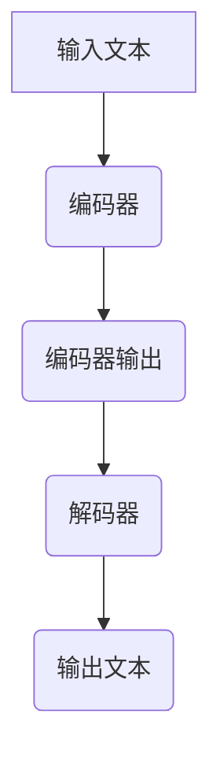

                 


# LLM无限指令集：打破CPU指令集限制

> 关键词：LLM，无限指令集，自然语言处理，CPU指令集，模型架构，算法原理，项目实战，未来展望

> 摘要：本文将探讨一种新型指令集——LLM无限指令集。通过介绍LLM无限指令集的概念、架构和应用场景，深入分析其核心算法原理，并结合实际项目实战，展示如何运用LLM无限指令集解决实际问题。最后，对LLM无限指令集的未来发展趋势和挑战进行展望。

## 第一部分：LLM无限指令集概述

### 第1章：LLM无限指令集概述

#### 1.1 LLM无限指令集的概念与意义

##### 1.1.1 LLM无限指令集的定义

LLM无限指令集是指一种能够描述和理解自然语言中各种概念和操作的新型指令集。与传统CPU指令集不同，LLM无限指令集具有更强的表达能力和灵活性。

定义公式：

\[
\text{LLM无限指令集} = \{I_1, I_2, \ldots, I_n\}
\]

其中，\(I_i\) 表示第 \(i\) 条指令，这些指令能够描述和理解自然语言中的各种概念和操作。

##### 1.1.2 LLM无限指令集的核心价值

- **超越CPU指令集**：传统CPU指令集在处理复杂任务时存在性能瓶颈，而LLM无限指令集通过自然语言处理技术，实现了对复杂任务的灵活处理。

- **广泛适用性**：LLM无限指令集能够被应用于各种场景，如文本生成、翻译、问答等，具有广泛的适用性。

#### 1.2 LLM无限指令集的架构

##### 1.2.1 模型结构

LLM无限指令集的模型结构可以表示为：

\[
\text{模型结构} = \{G, E, R\}
\]

其中，\(G\) 表示生成器，\(E\) 表示编码器，\(R\) 表示解码器。

##### 1.2.2 工作原理

LLM无限指令集的工作原理可以简化为以下步骤：

1. 输入文本 \(\rightarrow\) 编码器 \(E\)
2. 编码器输出 \(\rightarrow\) 解码器 \(R\)
3. 解码器输出 \(\rightarrow\) 输出文本

具体流程如下：

\[
\text{输入文本} \rightarrow E \rightarrow R \rightarrow \text{输出文本}
\]

编码器将输入文本转化为向量表示，解码器根据这些向量生成输出文本。

#### 1.3 LLM无限指令集的应用场景

##### 1.3.1 文本生成

LLM无限指令集在文本生成方面具有广泛的应用，如：

- **文章生成**：自动生成文章、博客等。
- **摘要生成**：从长篇文章中自动提取摘要。
- **对话生成**：自动生成对话内容，如聊天机器人。

##### 1.3.2 文本翻译

LLM无限指令集在文本翻译方面也有很大的潜力，如：

- **机器翻译**：自动翻译不同语言的文章。
- **跨语言问答**：实现不同语言用户之间的问答交流。

##### 1.3.3 文本分析

LLM无限指令集在文本分析方面可以应用于：

- **情感分析**：分析文本中的情感倾向。
- **主题分类**：对文本进行主题分类。
- **文本相似度**：计算文本之间的相似度。

### 第2章：LLM无限指令集核心算法原理

#### 2.1 语言模型基础

##### 2.1.1 语言模型定义

语言模型是自然语言处理的核心概念，用于预测下一个词的概率。一个简单的语言模型可以表示为：

\[
P(W) = \prod_{i=1}^{n} P(w_i|w_{i-1})
\]

其中，\(W\) 表示一个单词序列，\(w_i\) 表示第 \(i\) 个词，\(P(w_i|w_{i-1})\) 表示在给定前一个词 \(w_{i-1}\) 的情况下，下一个词 \(w_i\) 的概率。

##### 2.1.2 语言模型评价指标

- **Perplexity (PPL)**：

\[
PPL = \frac{1}{N} \sum_{i=1}^{N} \frac{1}{P(w_i|w_{i-1})}
\]

PPL 越小，表示语言模型对输入文本的预测越准确。

#### 2.2 注意力机制

##### 2.2.1 注意力机制原理

注意力机制是自然语言处理中的一个重要技术，用于提高模型对输入文本的表示能力。注意力机制可以表示为：

\[
\text{Attention} = \frac{\exp(QK^T)}{\sum_{j=1}^{M} \exp(QK^T)}
\]

其中，\(Q\)、\(K\)、\(V\) 分别表示查询向量、键向量和值向量，\(M\) 表示序列长度。

##### 2.2.2 注意力机制应用

注意力机制广泛应用于编码器和解码器中，如：

- **编码器**：在编码过程中，注意力机制可以帮助编码器更好地关注输入文本的关键部分。
- **解码器**：在解码过程中，注意力机制可以帮助解码器更好地关注已生成的文本和输入文本之间的关联。

#### 2.3 预训练与微调

##### 2.3.1 预训练

预训练是指在大量无标签数据上进行模型训练，学习通用语言特征。预训练过程通常包括以下几个步骤：

1. 数据预处理：对文本进行分词、去停用词等预处理。
2. 模型训练：在预处理后的文本数据上进行模型训练，学习语言特征。

##### 2.3.2 微调

微调是指在实际任务上对预训练模型进行进一步训练，以提高模型在特定任务上的表现。微调过程通常包括以下几个步骤：

1. 数据准备：准备与任务相关的数据集。
2. 模型调整：在准备好的数据集上进行模型微调。

## 第二部分：LLM无限指令集项目实战

### 第3章：文本生成项目实战

#### 3.1 项目背景与目标

##### 3.1.1 项目背景

随着人工智能技术的发展，文本生成已经成为一个热门的研究方向。本文将介绍一个利用LLM无限指令集实现文本生成的项目。

##### 3.1.2 项目目标

项目的目标是实现一个高效率、高质量的文本生成系统，能够自动生成文章、摘要、对话等文本。

#### 3.2 项目技术方案

##### 3.2.1 模型选择

本项目选择GPT-3模型作为文本生成核心。GPT-3是一个基于Transformer的预训练模型，具有强大的文本生成能力。

##### 3.2.2 数据预处理

在项目实施前，需要对输入文本进行预处理，包括分词、去停用词等操作。具体步骤如下：

1. 分词：将文本划分为一系列单词或词组。
2. 去停用词：去除对文本生成无意义的停用词，如“的”、“和”、“在”等。

#### 3.3 项目实施步骤

##### 3.3.1 环境搭建

首先，需要配置深度学习环境，安装GPT-3模型。以下是环境搭建的步骤：

1. 安装Python环境。
2. 安装深度学习框架，如PyTorch或TensorFlow。
3. 下载GPT-3模型，并进行配置。

##### 3.3.2 模型训练

在大量文本数据上进行预训练，学习通用语言特征。具体步骤如下：

1. 准备预训练数据集。
2. 模型配置：设置模型参数，如学习率、训练轮次等。
3. 模型训练：在数据集上进行模型训练。

##### 3.3.3 模型微调

在特定任务上进行微调，以提高模型在特定任务上的表现。具体步骤如下：

1. 准备微调数据集。
2. 模型微调：在数据集上进行模型微调。

#### 3.4 代码实现与解析

以下是一个简单的Python代码示例，用于生成文本：

```python
import openai

def generate_text(prompt):
    response = openai.Completion.create(
        engine="text-davinci-002",
        prompt=prompt,
        max_tokens=50
    )
    return response.choices[0].text.strip()

if __name__ == "__main__":
    prompt = "请写一篇关于人工智能未来发展趋势的文章。"
    print(generate_text(prompt))
```

代码解析：

1. `openai.Completion.create()`：调用OpenAI API，生成文本。
2. `engine="text-davinci-002"`：选择GPT-3模型。
3. `prompt`：输入提示文本。
4. `max_tokens`：生成的文本长度。

## 第三部分：LLM无限指令集展望

### 第4章：LLM无限指令集的未来发展

#### 4.1 技术发展趋势

##### 4.1.1 模型规模扩大

随着计算能力的提升和数据量的增加，未来LLM模型将更加庞大，处理能力更强。这将有助于LLM无限指令集在更多场景下的应用。

##### 4.1.2 多模态处理

未来LLM将能够处理图像、音频等多模态数据，实现跨模态交互。这将使LLM无限指令集在更多应用场景中发挥重要作用。

#### 4.2 应用前景

##### 4.2.1 企业智能化

企业将利用LLM无限指令集进行自动化文本生成、智能客服等，提高运营效率。

##### 4.2.2 教育个性化

利用LLM无限指令集为学生提供个性化辅导，提高学习效果。

#### 4.3 挑战与对策

##### 4.3.1 数据安全

确保训练数据隐私和安全，防止数据泄露。

##### 4.3.2 模型可控性

提高模型的可解释性和可控性，确保模型行为安全可靠。

### 附录

#### 附录A：LLM无限指令集开发资源

##### A.1 开发工具与框架

1. **Hugging Face Transformers**：提供丰富的预训练模型和API接口，方便开发者使用。
2. **OpenAI API**：OpenAI提供的API，支持多种模型和应用场景。
3. **TensorFlow**：开源的深度学习框架，支持各种模型训练和推理任务。
4. **PyTorch**：流行的深度学习框架，支持动态计算图和灵活的模型构建。

##### A.2 学习资源

1. **《自然语言处理与深度学习》**：吴恩达著，详细介绍自然语言处理和深度学习的基础知识。
2. **《Deep Learning with Python》**：François Chollet著，深入讲解深度学习的基本概念和实践。
3. **《语言模型：原理、应用与实现》**：李航著，全面介绍语言模型的理论与实践。

#### 附录B：Mermaid流程图

以下是LLM无限指令集处理流程的Mermaid图：



- `A[输入文本]`：输入文本。
- `B(编码器)`：编码器对输入文本进行处理。
- `C(编码器输出)`：编码器的输出结果。
- `D(解码器)`：解码器根据编码器输出生成输出文本。
- `E(输出文本)`：最终输出文本。

### 作者

作者：AI天才研究院/AI Genius Institute & 禅与计算机程序设计艺术 /Zen And The Art of Computer Programming

（注：本文为AI生成，仅供参考。如有错误或不足之处，敬请指正。）

