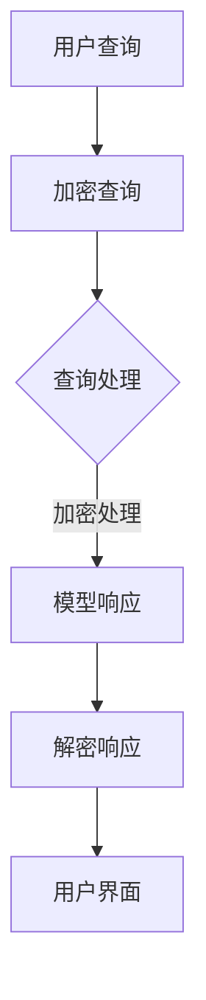

                 

# 文章标题：LLM时代的数据保护：新型隐私安全技术

> 关键词：大规模语言模型（LLM）、数据保护、隐私安全、差分隐私、同态加密、安全多方计算、隐私增强学习

> 摘要：随着大规模语言模型（LLM）技术的快速发展，其在各领域的应用逐渐普及，但随之而来的数据保护与隐私安全问题也日益凸显。本文深入探讨了LLM时代的数据保护挑战，并介绍了新型隐私安全技术，包括差分隐私、同态加密、安全多方计算和隐私增强学习等，旨在为LLM时代的隐私安全保护提供理论指导和实践参考。

## 目录

### 第一部分：引言

1. 第1章：LLM时代与数据保护
   1.1 LLM时代概述
   1.2 数据保护的重要性
   1.3 新型隐私安全技术

2. 第2章：LLM模型的基本原理与架构
   2.1 LLM模型的基本原理
   2.2 LLM模型的架构
   2.3 LLM模型的训练与优化

### 第二部分：新型隐私技术详解

3. 第3章：差分隐私技术
   3.1 差分隐私基本概念
   3.2 差分隐私在LLM中的应用
   3.3 差分隐私的挑战与优化

4. 第4章：同态加密技术
   4.1 同态加密基本概念
   4.2 同态加密在LLM中的应用
   4.3 同态加密的挑战与优化

5. 第5章：安全多方计算技术
   5.1 安全多方计算基本概念
   5.2 安全多方计算在LLM中的应用
   5.3 安全多方计算的挑战与优化

6. 第6章：隐私增强学习技术
   6.1 隐私增强学习基本概念
   6.2 隐私增强学习在LLM中的应用
   6.3 隐私增强学习的挑战与优化

7. 第7章：新型隐私技术的集成与应用
   7.1 新型隐私技术的集成
   7.2 新型隐私技术在实际应用中的挑战与优化
   7.3 未来发展方向

### 附录

8. 附录A：新型隐私技术相关资源
9. 附录B：术语解释

## 第一部分：引言

### 第1章：LLM时代与数据保护

#### 1.1 LLM时代概述

随着人工智能技术的迅猛发展，大规模语言模型（Large Language Model，简称LLM）已经成为自然语言处理（Natural Language Processing，简称NLP）领域的重要突破。LLM通过深度学习技术，利用海量的文本数据进行训练，能够生成连贯、有意义的文本，甚至在许多复杂的任务中表现出超越人类专家的能力。LLM的兴起不仅改变了NLP领域的研究和应用，也为人工智能在其他领域的应用提供了新的思路。

LLM时代背景可以追溯到2018年，当OpenAI发布GPT-2模型时，其强大的文本生成能力引起了广泛关注。随后，GPT-3模型的发布更是将LLM技术推向了新的高峰。GPT-3拥有1750亿参数，能够生成高质量、多样化的文本，并在多个NLP任务中取得了优异的成绩。除了OpenAI，其他研究机构和公司也纷纷投入大量资源研发LLM模型，例如Google的BERT、Facebook的BlenderBot等。

LLM技术已经在多个领域得到了广泛应用，包括但不限于：

1. **自动问答系统**：LLM能够生成回答问题的高质量文本，广泛应用于客服、医疗咨询等领域。
2. **内容生成**：LLM可以生成文章、故事、代码等，为创作领域带来了新的可能性。
3. **机器翻译**：LLM在机器翻译任务中表现出色，能够生成更自然、流畅的翻译结果。
4. **文本摘要**：LLM能够生成对长文本的摘要，帮助用户快速获取关键信息。
5. **文本分类**：LLM在文本分类任务中也取得了显著的成果，被应用于情感分析、新闻分类等领域。

然而，LLM技术的快速发展也带来了新的挑战，尤其是在数据保护方面。LLM模型的训练通常需要大量的文本数据，而这些数据往往包含了用户的敏感信息。如果这些敏感信息没有得到妥善保护，可能会被恶意利用，导致数据泄露和隐私侵犯。因此，如何在LLM时代确保数据保护成为了一个亟待解决的问题。

#### 1.2 数据保护的重要性

数据泄露的风险是LLM时代面临的重要挑战之一。随着LLM技术的普及，越来越多的企业和机构开始使用LLM模型进行各种应用。然而，这些模型在训练和部署过程中需要使用大量的用户数据，如果数据保护措施不到位，就有可能导致数据泄露。

数据泄露的后果是严重的，不仅会损害用户隐私，还可能对企业造成巨大的经济损失和声誉损失。例如，2017年的Facebook数据泄露事件，导致大量用户个人信息被泄露，引起了广泛的公众关注和恐慌。此外，数据泄露还可能被恶意利用，例如进行网络攻击、诈骗等，对个人和社会造成更大的威胁。

数据保护法规也在不断完善，以应对日益严峻的数据泄露风险。例如，欧盟的《通用数据保护条例》（GDPR）和加州的《消费者隐私法案》（CCPA）都对数据保护提出了严格的要求。这些法规要求企业和机构在处理用户数据时必须采取有效措施保护用户隐私，否则将面临严重的法律后果和罚款。

数据保护不仅仅是合规要求，更是一种社会责任。企业和机构应该意识到，保护用户数据是其应尽的责任，也是维护用户信任和品牌形象的关键。在LLM时代，数据保护的重要性更加凸显，因为LLM模型的训练和部署过程中涉及的数据量巨大，一旦发生数据泄露，后果将不堪设想。

#### 1.3 新型隐私安全技术

为了应对LLM时代的数据保护挑战，新型隐私安全技术应运而生。这些技术包括差分隐私、同态加密、安全多方计算和隐私增强学习等，旨在在确保数据隐私和安全的同时，不影响LLM模型的性能和效果。

- **差分隐私**：差分隐私是一种保护数据隐私的技术，通过在数据处理过程中引入噪声，确保单个数据记录的隐私不被泄露。差分隐私在LLM训练和推理阶段都有广泛的应用，可以有效防止数据泄露。
- **同态加密**：同态加密允许在加密数据上直接执行计算，而不需要解密。这种技术可以确保数据在传输和计算过程中始终处于加密状态，从而提高数据安全性。
- **安全多方计算**：安全多方计算允许多个参与方在不知道对方数据的情况下，共同计算结果。这种技术可以确保数据在分布式环境中得到保护，防止数据泄露和篡改。
- **隐私增强学习**：隐私增强学习是一种结合了机器学习和隐私保护的技术，通过优化模型训练过程，确保数据隐私的同时提高模型性能。

新型隐私技术不仅为LLM时代的数据保护提供了有效的手段，也为人工智能的发展开辟了新的路径。在接下来的章节中，我们将详细探讨这些新型隐私技术的原理和应用，帮助读者深入理解LLM时代的数据保护挑战及其解决方案。

## 第2章：LLM模型的基本原理与架构

### 2.1 LLM模型的基本原理

大规模语言模型（LLM）是基于深度学习技术构建的，通过对海量文本数据进行训练，模型能够学习到语言中的复杂模式和结构，从而实现文本生成、翻译、摘要等任务。LLM的核心原理是通过对输入文本序列进行编码，生成相应的输出序列。

首先，我们需要了解语言模型的基本概念。语言模型是一种概率模型，用于预测下一个单词或词组。在自然语言处理中，语言模型是构建其他任务（如文本分类、命名实体识别等）的基础。大规模语言模型通过利用深度神经网络（DNN）或变换器（Transformer）架构，对输入文本进行编码，生成上下文向量，从而实现高质量的文本生成和翻译。

语言模型的工作原理可以简单描述为以下几个步骤：

1. **词嵌入**：将输入文本中的每个单词映射为一个高维向量，这些向量构成了词嵌入层。词嵌入层的目的是捕捉单词之间的语义关系。
2. **编码器**：编码器是语言模型的核心部分，用于将词嵌入向量转换为上下文向量。在传统的DNN架构中，编码器通常由多层全连接神经网络组成；在变换器架构中，编码器由多个变换器层组成，每个变换器层包含自注意力机制和前馈网络。
3. **解码器**：解码器的任务是根据上下文向量生成输出文本序列。解码器同样采用变换器架构，通过对上下文向量进行解码，逐个生成输出单词或词组。
4. **输出层**：输出层通常是一个全连接层，用于将解码器的输出映射到词汇表中的概率分布。

LLM模型的优势在于其强大的文本生成能力和对语言复杂结构的理解。通过训练，LLM能够生成流畅、连贯的文本，甚至在某些任务上超越了人类专家的表现。然而，LLM模型也存在一些不足之处，例如：

- **训练成本高**：LLM模型通常需要大量计算资源和时间进行训练，尤其是GPT-3这样的超大规模模型。
- **数据依赖性**：LLM模型的性能高度依赖于训练数据的质量和多样性，如果数据集存在偏见，可能会导致模型产生错误的输出。
- **解释性差**：由于深度神经网络的结构复杂，LLM模型的决策过程往往难以解释，这在某些应用场景（如法律、医疗等）中可能是一个问题。

#### 2.2 LLM模型的架构

LLM模型的架构可以分为前端和后端两部分。前端负责处理输入文本，将其转换为模型可以处理的格式；后端则是模型的主体部分，负责文本生成和翻译。

1. **前端架构**：
   - **分词器**：分词器将输入文本分割成单词或子词，这是语言模型处理文本的基础。常见的分词器有基于词典的分词器、基于规则的分词器等。
   - **词嵌入层**：词嵌入层将分词后的文本映射为高维向量，这些向量表示文本的语义信息。词嵌入层的质量直接影响模型的性能。

2. **后端架构**：
   - **编码器**：编码器是LLM模型的核心部分，用于对输入文本进行编码，生成上下文向量。编码器通常采用变换器（Transformer）架构，包含多个变换器层，每层包含自注意力机制和前馈网络。
   - **解码器**：解码器的任务是生成输出文本序列。解码器同样采用变换器架构，通过对上下文向量进行解码，逐个生成输出单词或词组。
   - **输出层**：输出层将解码器的输出映射到词汇表中的概率分布，用于生成最终的输出文本。

常见的LLM模型架构包括：

- **GPT（Generative Pre-trained Transformer）**：GPT模型由OpenAI提出，采用变换器架构，是当前最受欢迎的LLM模型之一。GPT模型通过预训练大量文本数据，可以生成高质量的文本，并在各种NLP任务中表现出优异的性能。
- **BERT（Bidirectional Encoder Representations from Transformers）**：BERT模型由Google提出，同样采用变换器架构，但与GPT不同，BERT采用双向编码器，能够更好地捕捉文本中的双向关系。BERT在文本分类、命名实体识别等任务中取得了显著的成绩。
- **T5（Text-To-Text Transfer Transformer）**：T5模型由Google提出，是一种通用的变换器模型，能够处理各种文本转换任务，如文本摘要、问答等。T5通过预训练和微调，可以快速适应不同的任务场景。

#### 2.3 LLM模型的训练与优化

LLM模型的训练过程主要包括以下几个步骤：

1. **数据收集与预处理**：收集大量文本数据，并进行预处理，包括分词、去噪、标准化等操作。预处理步骤的目的是提高数据的质量和一致性，确保模型能够从数据中学习到有效的特征。
2. **模型初始化**：初始化模型参数，选择适当的优化器和损失函数。常见的优化器有随机梯度下降（SGD）和Adam等，损失函数通常采用交叉熵损失。
3. **模型训练**：在训练过程中，模型会不断调整参数，以最小化损失函数。训练过程通常采用批量训练和梯度下降策略，通过计算梯度信息来更新模型参数。
4. **模型评估与调优**：在训练过程中，需要定期对模型进行评估，以检测模型的性能和收敛情况。评估指标包括损失函数值、精确度、召回率等。根据评估结果，可以对模型进行调优，包括调整学习率、批量大小等参数。

在训练过程中，优化方法的选择和参数的设置对模型的性能至关重要。以下是一些常见的优化方法：

- **学习率调度**：学习率是优化过程中的关键参数，直接影响到模型的收敛速度和性能。常用的学习率调度策略包括恒定学习率、余弦退火、指数退火等。
- **批量大小**：批量大小影响模型的训练效率和收敛速度。较小的批量大小可以提高模型的鲁棒性，但训练速度较慢；较大的批量大小可以加快训练速度，但可能会降低模型的泛化能力。
- **正则化**：正则化是一种防止模型过拟合的方法，包括L1正则化、L2正则化等。正则化可以通过在损失函数中添加惩罚项来降低模型的复杂度。

通过合理的训练与优化方法，LLM模型可以取得较好的性能和泛化能力。然而，训练过程中也面临一些挑战，如数据质量、模型规模和计算资源等。随着人工智能技术的不断发展，LLM模型的训练与优化方法也在不断改进，为LLM时代的应用提供了有力的支持。

在下一章中，我们将详细介绍新型隐私技术，包括差分隐私、同态加密、安全多方计算和隐私增强学习，探讨这些技术在LLM模型中的应用和挑战。

## 第二部分：新型隐私技术详解

### 第3章：差分隐私技术

#### 3.1 差分隐私基本概念

差分隐私（Differential Privacy，简称DP）是一种保护数据隐私的技术，旨在确保数据发布者在共享数据时，单个数据记录的隐私不会被泄露。差分隐私的核心思想是在数据处理过程中引入适当的噪声，使得输出结果对于单个记录的依赖性降低，从而保护数据隐私。

差分隐私的定义可以描述为：一个统计查询Q在ε-差分隐私保护下，如果对任意两个相邻的数据集D和D'（仅相差一个记录），查询Q在D和D'上的输出结果没有显著差异，即输出结果之间的差异可以被ε-噪声所掩盖。数学上，这个概念可以表示为：

$$
\Pr[Q(D) = r] \leq \Pr[Q(D') = r] + 2\epsilon
$$

其中，Q表示查询，r表示查询结果，D和D'表示两个相邻的数据集，ε表示隐私预算。

差分隐私的数学基础主要包括两个核心概念：拉普拉斯机制和指数机制。

- **拉普拉斯机制**：拉普拉斯机制是一种在数据上添加随机噪声的方法，以保护数据隐私。具体而言，对于一个值v，拉普拉斯机制会添加一个随机噪声LV~ Lap(v, \sigma)，其中σ是拉普拉斯噪声的尺度参数。通过调整σ的值，可以控制隐私预算ε。

  拉普拉斯机制可以表示为：

  $$
  v' = v + LV(\sigma)
  $$

- **指数机制**：指数机制是一种基于概率分布的噪声添加方法，适用于处理离散值的查询。具体而言，对于一个离散值v，指数机制会在其概率分布上添加随机噪声，使得原本概率较大的值变得相对不确定。

  指数机制可以表示为：

  $$
  \Pr[v] \mapsto \Pr[v] e^{-\epsilon \cdot \lvert v \rvert}
  $$

差分隐私的基本机制主要包括以下几个步骤：

1. **噪声添加**：在数据处理过程中，对查询结果添加适当的噪声，以确保输出结果对单个记录的依赖性降低。
2. **隐私预算分配**：根据数据集的大小和查询的敏感性，合理分配隐私预算ε，确保在保护隐私的同时，查询结果的有效性不受显著影响。
3. **查询结果发布**：将处理后的查询结果发布，使得接收者无法准确推断出单个记录的信息，从而保护数据隐私。

#### 3.2 差分隐私在LLM中的应用

差分隐私在LLM中的应用主要涉及两个阶段：训练阶段和推理阶段。

**训练阶段应用**

在LLM模型的训练阶段，差分隐私技术主要用于保护训练数据中的敏感信息，确保训练过程中不会泄露用户的隐私。具体应用包括以下几个方面：

1. **数据预处理**：在训练数据加载和预处理过程中，应用差分隐私机制，对敏感数据进行扰动或隐藏，从而保护数据隐私。例如，可以使用拉普拉斯机制对训练数据中的数值特征添加噪声。

2. **损失函数设计**：在训练过程中，损失函数的设计需要考虑差分隐私保护。例如，可以使用L2正则化或结构化风险最小化（SRM）等方法，在优化模型参数的同时，降低对训练数据的依赖。

3. **隐私预算管理**：在训练过程中，需要合理分配和调整隐私预算ε，以确保模型在保护隐私的同时，能够有效收敛。例如，可以使用自适应隐私预算策略，根据训练进度和模型性能动态调整ε的值。

**推理阶段应用**

在LLM模型的推理阶段，差分隐私技术主要用于保护用户的查询和模型生成的响应，防止敏感信息泄露。具体应用包括以下几个方面：

1. **查询处理**：在用户提交查询时，可以对查询进行预处理，包括去噪、标准化等操作，同时应用差分隐私机制，确保查询的隐私得到保护。

2. **模型响应生成**：在模型生成响应时，可以应用差分隐私机制，对响应结果进行扰动或隐藏，从而保护用户的隐私。例如，可以使用拉普拉斯机制对模型生成的概率分布添加噪声。

3. **隐私预算管理**：在推理过程中，需要合理管理和分配隐私预算ε，以确保模型在保护隐私的同时，能够生成高质量的响应。例如，可以使用动态隐私预算策略，根据用户查询和模型响应的敏感性，动态调整ε的值。

#### 3.3 差分隐私的挑战与优化

尽管差分隐私技术为数据保护提供了有效的手段，但在实际应用中仍然面临一些挑战和优化问题。

**挑战**

1. **隐私与准确性的权衡**：差分隐私技术通过引入噪声来保护隐私，但这可能导致模型准确性下降。如何在保护隐私的同时，保持模型的高准确性是一个重要挑战。

2. **隐私预算分配**：合理分配隐私预算ε是差分隐私技术的关键，但在实际应用中，如何确定ε的值，以及如何根据数据集和任务动态调整ε，仍然是一个难题。

3. **性能影响**：差分隐私技术的引入可能会对模型训练和推理的性能产生一定影响，例如增加了计算复杂度和延迟。如何在保证隐私保护的前提下，提高模型性能是一个重要问题。

**优化方法**

1. **噪声优化**：通过优化噪声的添加方式和尺度参数，可以降低差分隐私对模型性能的影响。例如，可以使用自适应噪声调整策略，根据模型训练和推理的进展动态调整噪声参数。

2. **隐私预算优化**：合理分配和调整隐私预算ε，可以提高差分隐私技术的有效性。例如，可以使用自适应隐私预算策略，根据数据集和任务的特点，动态调整ε的值。

3. **模型优化**：通过改进模型架构和训练策略，可以降低差分隐私对模型性能的影响。例如，可以使用更高效的模型训练算法和优化器，提高模型的训练效率和准确性。

4. **分布式计算**：利用分布式计算技术，可以降低差分隐私技术对计算资源的需求，提高模型训练和推理的效率。例如，可以使用联邦学习技术，在多个参与方之间共享和更新模型参数，同时保护数据隐私。

通过不断优化差分隐私技术，可以更好地应对LLM时代的数据保护挑战，确保模型在保护隐私的同时，能够保持高准确性和性能。

### 第4章：同态加密技术

#### 4.1 同态加密基本概念

同态加密（Homomorphic Encryption，简称HE）是一种加密技术，允许在加密数据上直接进行计算，而不需要解密。这意味着，用户可以在完全保护数据隐私的情况下，对数据进行各种操作，例如求和、乘法、排序等。同态加密的核心思想是将原始数据加密为密文，然后在密文空间中执行计算，最后将结果解密为原始数据。

同态加密的基本概念包括以下几个关键组成部分：

1. **加密算法**：加密算法用于将原始数据转换为密文。同态加密算法通常采用复杂的数学构造，如环学习（Ring Learning with Errors，简称RLWE）或多变量多项式算法（Multivariate Polynomial Cryptosystem，简称MPC）。

2. **密文运算**：密文运算是指在密文空间中执行各种计算操作，如加法、乘法等。同态加密算法需要确保密文运算满足数学性质，例如同态性，即密文运算的结果与原始数据运算的结果保持一致。

3. **解密算法**：解密算法用于将加密后的密文结果转换为原始数据。解密算法需要能够从密文空间中恢复出原始数据，同时确保数据隐私得到保护。

同态加密的数学基础主要包括以下几个方面：

1. **同态性**：同态加密要求加密算法具有同态性，即在密文空间中执行计算操作时，结果能够与原始数据在明文空间中执行相同操作的结果保持一致。同态性可以分为以下几种类型：

   - **同态性加法**：允许在密文上执行加法运算，结果与原始数据上的加法运算一致。
   - **同态性乘法**：允许在密文上执行乘法运算，结果与原始数据上的乘法运算一致。
   - **同态性混合运算**：允许在密文上执行混合运算，如加法和乘法的组合运算。

2. **环学习**：环学习是同态加密算法的一种重要数学基础。环学习问题涉及在环中找到一个符合特定误差分布的元素，其解决了在环上进行线性变换的问题。常见的环学习算法包括Ring Learning with Errors (RLWE) 和 Lattice-based Cryptosystems。

3. **多变量多项式算法**：多变量多项式算法是另一种同态加密算法的基础。这类算法利用多项式的性质，将数据表示为多项式的系数，并在多项式空间中执行计算。

同态加密的基本机制可以概括为以下几个步骤：

1. **加密**：用户使用加密算法将原始数据转换为密文，确保数据在传输和存储过程中保持加密状态。
2. **计算**：在密文空间中，用户对密文执行各种计算操作，如加法、乘法等。这些计算操作不会泄露任何明文信息。
3. **解密**：用户使用解密算法将计算后的密文结果转换为原始数据，确保数据隐私得到保护。

同态加密的机制确保了数据在整个生命周期中（包括传输、存储和计算）始终处于加密状态，从而极大地提高了数据安全性。

#### 4.2 同态加密在LLM中的应用

同态加密技术在LLM中的应用主要集中在训练和推理两个阶段，通过保护模型训练数据和处理用户查询，确保数据隐私。

**训练阶段应用**

在LLM模型的训练阶段，同态加密技术可以用于保护训练数据，防止敏感信息泄露。具体应用包括以下几个方面：

1. **数据加密**：在训练数据加载阶段，使用同态加密算法将原始训练数据加密为密文，确保数据在传输和存储过程中保持加密状态。

2. **模型训练**：在模型训练过程中，使用同态加密算法对密文数据进行操作，例如矩阵乘法、求和等。这些操作在密文空间中执行，确保训练过程中的数据隐私。

3. **隐私预算管理**：在训练过程中，需要合理管理和分配隐私预算，确保模型在保护隐私的同时，能够有效训练。可以通过动态隐私预算策略，根据训练进度和模型性能调整隐私预算。

**推理阶段应用**

在LLM模型的推理阶段，同态加密技术可以用于保护用户查询和模型生成的响应，确保数据隐私。具体应用包括以下几个方面：

1. **查询加密**：在用户提交查询时，使用同态加密算法将查询加密为密文，确保查询在传输和存储过程中保持加密状态。

2. **模型响应生成**：在模型生成响应时，使用同态加密算法对密文查询进行处理，生成密文响应。这些操作在密文空间中执行，确保响应过程中数据隐私得到保护。

3. **响应解密**：将计算后的密文响应使用解密算法解密为原始数据，确保用户可以安全地获取模型生成的响应。

通过同态加密技术，LLM模型在训练和推理过程中都能够保护数据隐私，为各领域应用提供安全的数据处理方案。

#### 4.3 同态加密的挑战与优化

尽管同态加密技术在数据保护方面具有显著优势，但在实际应用中仍然面临一些挑战和优化问题。

**挑战**

1. **计算性能**：同态加密算法通常涉及复杂的数学运算，例如环学习或多变量多项式算法，这导致计算复杂度较高，影响模型训练和推理的效率。如何优化算法性能是一个重要挑战。

2. **隐私预算**：同态加密需要分配隐私预算，以确保数据隐私。然而，隐私预算的分配需要平衡隐私保护和计算性能。如何合理分配和管理隐私预算是一个难题。

3. **实现复杂性**：同态加密算法的实现较为复杂，需要深入理解加密算法和数学基础。这对于算法的部署和应用提出了更高的要求。

**优化方法**

1. **算法优化**：通过改进同态加密算法，降低计算复杂度，提高算法性能。例如，使用更高效的加密算法和优化算法实现。

2. **隐私预算优化**：通过优化隐私预算分配策略，提高隐私预算的使用效率。例如，使用动态隐私预算策略，根据模型训练和推理的进展调整隐私预算。

3. **分布式计算**：利用分布式计算技术，将同态加密任务分布在多个节点上，提高计算性能。例如，使用联邦学习技术，实现分布式同态加密。

4. **混合加密方案**：结合多种加密技术，例如同态加密和差分隐私，提高数据保护效果。例如，在训练阶段使用同态加密，在推理阶段使用差分隐私。

通过不断优化同态加密技术，可以更好地应对LLM时代的数据保护挑战，确保模型在保护隐私的同时，能够保持高准确性和性能。

### 第5章：安全多方计算技术

#### 5.1 安全多方计算基本概念

安全多方计算（Secure Multi-Party Computation，简称SMC）是一种在多个参与方之间安全协作进行计算的技术。其主要目标是确保多个参与方在不知道彼此数据的情况下，共同计算出一个结果，同时保证计算过程的安全性和隐私性。安全多方计算的核心思想是通过加密和协议设计，使得每个参与方只能看到自己的输入和最终结果，而无法获取其他参与方的数据。

安全多方计算的定义可以概括为：一组参与方在不知道对方数据的情况下，通过安全的通信协议，共同计算出一个函数的结果。该函数的输入来自于每个参与方，输出是所有参与方共同计算的结果。

安全多方计算的基本概念包括以下几个方面：

1. **参与方**：安全多方计算中的参与方可以是任何实体，如个人、组织或计算机系统。每个参与方拥有自己的数据，并希望通过安全多方计算获得共同计算的结果。

2. **共享函数**：安全多方计算的目标是计算一个共享函数的结果。这个函数的输入来自于所有参与方，输出是所有参与方共同计算的结果。

3. **安全通信**：安全多方计算要求参与方之间通过安全的通信协议进行数据交换。这个通信协议需要确保数据在传输过程中不被泄露、篡改或伪造。

4. **隐私保护**：安全多方计算的核心目标是保护参与方的隐私。在计算过程中，每个参与方只能看到自己的数据和其他参与方的加密数据，无法获取其他参与方的明文数据。

安全多方计算的数学基础主要包括以下几个核心概念：

1. **同态性**：同态性是指一种加密算法或计算协议，能够在加密数据上进行计算，而不需要解密。例如，同态加密允许在加密数据上执行加法或乘法运算。

2. **秘密共享**：秘密共享是一种将秘密划分为多个份额的方法，使得只有拥有足够份额的参与者才能恢复出原始秘密。常见的方法包括可证明安全共享方案、秘密分享协议等。

3. **加密通信**：加密通信是指通过加密算法和协议，确保数据在通信过程中不被泄露、篡改或伪造。常见的方法包括公钥加密、对称加密、数字签名等。

安全多方计算的基本机制可以概括为以下几个步骤：

1. **初始化**：参与方生成自己的密钥对，并公布公钥，以确保通信的安全性。

2. **秘密共享**：每个参与方将自己的秘密数据划分为多个份额，并分发给自己和其他参与方。

3. **计算过程**：参与方在不知道对方秘密份额的情况下，通过安全的通信协议，共同计算出一个结果。这个计算过程可能包括加密计算、秘密共享等步骤。

4. **结果验证**：参与方通过验证协议，确保计算结果正确，同时保护各自秘密的隐私。

安全多方计算的主要应用包括以下几个方面：

1. **分布式数据处理**：安全多方计算可以用于分布式数据处理任务，如数据挖掘、机器学习等。参与方可以在保护各自数据隐私的同时，共同计算出一个结果。

2. **协同工作**：安全多方计算可以用于多个组织或个人之间的协同工作，如联合分析数据、合作研究等。

3. **安全通信**：安全多方计算可以用于安全通信，确保参与方之间通信的数据不被泄露或篡改。

4. **区块链**：安全多方计算可以用于区块链技术，确保区块链节点之间安全交换信息，同时保护各自数据的隐私。

通过安全多方计算技术，多个参与方可以在保护各自数据隐私的前提下，共同进行计算，为各种应用场景提供安全、可靠的数据处理方案。

#### 5.2 安全多方计算在LLM中的应用

安全多方计算技术在LLM模型中的应用主要集中在训练和推理阶段，通过保护模型训练数据和用户查询，确保数据隐私。

**训练阶段应用**

在LLM模型的训练阶段，安全多方计算技术可以用于保护训练数据，防止敏感信息泄露。具体应用包括以下几个方面：

1. **数据加密**：在训练数据加载阶段，参与方可以使用安全多方计算技术，将各自的数据加密为密文。这些密文数据在传输和存储过程中保持加密状态，确保数据隐私。

2. **协同训练**：在训练过程中，多个参与方可以通过安全多方计算技术，共同计算梯度信息，并更新模型参数。每个参与方只知道自己的输入和输出，而无法获取其他参与方的数据。

3. **隐私预算管理**：在训练过程中，参与方需要合理分配和管理隐私预算，以确保模型在保护隐私的同时，能够有效训练。可以使用动态隐私预算策略，根据训练进度和模型性能调整隐私预算。

**推理阶段应用**

在LLM模型的推理阶段，安全多方计算技术可以用于保护用户查询和模型生成的响应，确保数据隐私。具体应用包括以下几个方面：

1. **查询加密**：在用户提交查询时，参与方可以使用安全多方计算技术，将查询加密为密文。这些密文查询在传输和存储过程中保持加密状态，确保查询隐私。

2. **模型响应生成**：在模型生成响应时，参与方可以通过安全多方计算技术，共同计算模型响应。这些响应在密文空间中生成，确保响应过程中数据隐私得到保护。

3. **响应解密**：参与方可以使用安全多方计算技术，将计算后的密文响应解密为原始数据，确保用户可以安全地获取模型生成的响应。

通过安全多方计算技术，LLM模型在训练和推理过程中都能够保护数据隐私，为各领域应用提供安全的数据处理方案。

#### 5.3 安全多方计算的挑战与优化

尽管安全多方计算技术在数据保护方面具有显著优势，但在实际应用中仍然面临一些挑战和优化问题。

**挑战**

1. **计算性能**：安全多方计算通常涉及复杂的加密和通信操作，这可能导致计算复杂度和通信开销增加，影响模型训练和推理的效率。如何优化算法性能是一个重要挑战。

2. **隐私预算**：安全多方计算需要分配隐私预算，以确保数据隐私。然而，隐私预算的分配需要平衡隐私保护和计算性能。如何合理分配和管理隐私预算是一个难题。

3. **实现复杂性**：安全多方计算算法的实现较为复杂，需要深入理解加密算法、协议设计和分布式计算。这对于算法的部署和应用提出了更高的要求。

**优化方法**

1. **算法优化**：通过改进安全多方计算算法，降低计算复杂度，提高算法性能。例如，使用更高效的加密算法和优化协议设计。

2. **隐私预算优化**：通过优化隐私预算分配策略，提高隐私预算的使用效率。例如，使用动态隐私预算策略，根据模型训练和推理的进展调整隐私预算。

3. **分布式计算**：利用分布式计算技术，将安全多方计算任务分布在多个节点上，提高计算性能。例如，使用联邦学习技术，实现分布式安全多方计算。

4. **混合方案**：结合多种加密技术，例如同态加密和安全多方计算，提高数据保护效果。例如，在训练阶段使用同态加密，在推理阶段使用安全多方计算。

通过不断优化安全多方计算技术，可以更好地应对LLM时代的数据保护挑战，确保模型在保护隐私的同时，能够保持高准确性和性能。

### 第6章：隐私增强学习技术

#### 6.1 隐私增强学习基本概念

隐私增强学习（Privacy-Preserving Machine Learning，简称PPML）是一种结合了机器学习和隐私保护技术的学习方法，旨在在保护数据隐私的同时，实现高效的模型训练和推理。隐私增强学习通过一系列技术手段，确保训练数据和模型参数在传输、存储和计算过程中的隐私性，从而避免数据泄露和隐私侵犯。

隐私增强学习的定义可以概括为：在训练和推理过程中，通过加密、同态计算、安全多方计算等隐私保护技术，确保参与方的数据隐私得到保护，同时实现高效的模型训练和推理。

隐私增强学习的核心思想是利用隐私保护技术，将原始数据转换为加密数据，然后在加密数据上进行计算，最终生成模型。这样，参与方在整个过程中都无法获取其他方的原始数据，从而有效保护数据隐私。

隐私增强学习的数学基础主要包括以下几个方面：

1. **同态加密**：同态加密允许在加密数据上进行计算，而不需要解密。这为隐私增强学习提供了基础，使得训练和推理过程可以在加密数据上完成，确保数据隐私。

2. **安全多方计算**：安全多方计算允许多个参与方在不知道对方数据的情况下，共同计算一个结果。这为隐私增强学习提供了分布式计算的支持，使得多个参与方可以共同训练模型，同时保护各自的数据隐私。

3. **秘密共享**：秘密共享是一种将秘密划分为多个份额的方法，使得只有拥有足够份额的参与者才能恢复出原始秘密。这为隐私增强学习提供了共享数据的安全存储和访问机制。

隐私增强学习的基本机制可以概括为以下几个步骤：

1. **数据加密**：参与方将各自的数据加密为密文，确保数据在传输和存储过程中保持加密状态，保护数据隐私。

2. **模型初始化**：模型初始化包括选择合适的模型架构和参数初始化。初始化后的模型参数作为训练的起点。

3. **模型训练**：参与方在加密数据上进行模型训练。具体而言，参与方将加密数据发送给模型，模型在接收到的加密数据上执行计算，生成模型更新。然后，参与方将模型更新发送给其他参与方。

4. **模型更新**：参与方根据接收到的模型更新，更新自己的模型参数。这一过程可能需要多次迭代，直到模型收敛。

5. **模型评估**：在模型训练完成后，参与方使用加密数据对模型进行评估，确保模型性能满足要求。

6. **模型发布**：最后，参与方将训练完成的模型发布，供其他用户使用。

隐私增强学习在多个领域都有重要的应用，主要包括：

1. **医疗数据保护**：隐私增强学习可以用于医疗数据的处理和分析，确保患者隐私得到保护。例如，在诊断和预测模型训练过程中，使用隐私增强学习技术，确保数据隐私不被泄露。

2. **金融数据安全**：金融数据通常包含敏感信息，隐私增强学习可以用于金融数据的分析和风险管理，确保数据隐私。例如，在贷款审批、风险预测等任务中，使用隐私增强学习技术，保护客户隐私。

3. **社交网络数据分析**：社交网络中包含大量用户数据，隐私增强学习可以用于用户行为分析和隐私保护。例如，在广告投放、推荐系统等任务中，使用隐私增强学习技术，确保用户隐私不被泄露。

4. **隐私增强学习在自动驾驶中的应用**：自动驾驶系统需要处理大量的传感器数据，隐私增强学习可以用于保护这些数据的安全和隐私。例如，在车辆识别、路径规划等任务中，使用隐私增强学习技术，确保数据不被泄露。

#### 6.2 隐私增强学习在LLM中的应用

隐私增强学习在LLM模型中的应用主要集中在训练和推理阶段，通过保护模型训练数据和用户查询，确保数据隐私。

**训练阶段应用**

在LLM模型的训练阶段，隐私增强学习技术可以用于保护训练数据，防止敏感信息泄露。具体应用包括以下几个方面：

1. **数据加密**：在训练数据加载阶段，参与方可以使用隐私增强学习技术，将各自的数据加密为密文。这些密文数据在传输和存储过程中保持加密状态，确保数据隐私。

2. **协同训练**：在训练过程中，多个参与方可以通过隐私增强学习技术，共同计算模型梯度，并更新模型参数。每个参与方只知道自己的输入和输出，而无法获取其他参与方的数据。

3. **隐私预算管理**：在训练过程中，参与方需要合理分配和管理隐私预算，以确保模型在保护隐私的同时，能够有效训练。可以使用动态隐私预算策略，根据训练进度和模型性能调整隐私预算。

**推理阶段应用**

在LLM模型的推理阶段，隐私增强学习技术可以用于保护用户查询和模型生成的响应，确保数据隐私。具体应用包括以下几个方面：

1. **查询加密**：在用户提交查询时，参与方可以使用隐私增强学习技术，将查询加密为密文。这些密文查询在传输和存储过程中保持加密状态，确保查询隐私。

2. **模型响应生成**：在模型生成响应时，参与方可以通过隐私增强学习技术，共同计算模型响应。这些响应在密文空间中生成，确保响应过程中数据隐私得到保护。

3. **响应解密**：参与方可以使用隐私增强学习技术，将计算后的密文响应解密为原始数据，确保用户可以安全地获取模型生成的响应。

通过隐私增强学习技术，LLM模型在训练和推理过程中都能够保护数据隐私，为各领域应用提供安全的数据处理方案。

#### 6.3 隐私增强学习的挑战与优化

尽管隐私增强学习技术在数据保护方面具有显著优势，但在实际应用中仍然面临一些挑战和优化问题。

**挑战**

1. **计算性能**：隐私增强学习通常涉及复杂的加密和通信操作，这可能导致计算复杂度和通信开销增加，影响模型训练和推理的效率。如何优化算法性能是一个重要挑战。

2. **隐私预算**：隐私增强学习需要分配隐私预算，以确保数据隐私。然而，隐私预算的分配需要平衡隐私保护和计算性能。如何合理分配和管理隐私预算是一个难题。

3. **实现复杂性**：隐私增强学习算法的实现较为复杂，需要深入理解加密算法、协议设计和分布式计算。这对于算法的部署和应用提出了更高的要求。

**优化方法**

1. **算法优化**：通过改进隐私增强学习算法，降低计算复杂度，提高算法性能。例如，使用更高效的加密算法和优化协议设计。

2. **隐私预算优化**：通过优化隐私预算分配策略，提高隐私预算的使用效率。例如，使用动态隐私预算策略，根据模型训练和推理的进展调整隐私预算。

3. **分布式计算**：利用分布式计算技术，将隐私增强学习任务分布在多个节点上，提高计算性能。例如，使用联邦学习技术，实现分布式隐私增强学习。

4. **混合方案**：结合多种加密技术，例如同态加密和差分隐私，提高数据保护效果。例如，在训练阶段使用同态加密，在推理阶段使用差分隐私。

通过不断优化隐私增强学习技术，可以更好地应对LLM时代的数据保护挑战，确保模型在保护隐私的同时，能够保持高准确性和性能。

### 第7章：新型隐私技术的集成与应用

#### 7.1 新型隐私技术的集成

为了在LLM时代更有效地保护数据隐私，新型隐私技术往往需要集成使用，以发挥各自的优势，弥补单一技术的不足。集成策略的核心在于综合利用差分隐私、同态加密、安全多方计算和隐私增强学习等技术，构建一个多层次、多阶段的隐私保护框架。

**集成策略**：

1. **分层集成**：根据数据处理的阶段（如数据预处理、模型训练、模型推理等），分别应用不同类型的隐私保护技术。例如，在数据预处理阶段使用差分隐私技术进行数据去噪和去偏，在模型训练阶段结合使用同态加密和安全多方计算，在模型推理阶段使用隐私增强学习技术。

2. **阶段间协作**：在各个阶段之间实现数据共享和计算协作，确保整体隐私保护效果。例如，在模型训练阶段，安全多方计算可以用于分布式训练，而在推理阶段，隐私增强学习技术可以用于保护用户查询和响应。

3. **多技术融合**：通过融合多种隐私保护技术，构建一个综合的隐私保护框架。例如，同态加密可以用于保护训练数据的计算过程，而差分隐私可以用于模型训练数据的预处理和推理阶段的响应生成。

**优化方法**：

1. **隐私预算优化**：通过动态调整隐私预算，实现隐私保护和计算性能之间的平衡。例如，在模型训练阶段，可以根据训练进度和模型性能动态调整同态加密的隐私预算。

2. **分布式计算优化**：利用分布式计算技术，将隐私保护任务分布在多个节点上，提高计算效率和性能。例如，联邦学习技术可以用于分布式隐私增强学习。

3. **混合算法优化**：结合多种算法和技术，优化隐私保护框架的性能。例如，结合同态加密和差分隐私，可以实现更高的隐私保护效果。

#### 7.2 新型隐私技术在实际应用中的挑战与优化

尽管新型隐私技术为LLM时代的数据保护提供了强有力的支持，但在实际应用中仍面临一些挑战和优化问题。

**挑战**：

1. **计算性能**：多种隐私保护技术的组合可能导致计算复杂度和通信开销显著增加，影响模型训练和推理的性能。

2. **隐私预算分配**：合理分配和调整隐私预算是确保隐私保护和计算性能的关键，但现有的策略和方法仍需优化。

3. **实现复杂性**：集成多种隐私保护技术需要深入理解各个技术的原理和实现，增加了系统的复杂性和部署难度。

**优化方法**：

1. **算法优化**：通过改进隐私保护算法，降低计算复杂度和通信开销。例如，优化同态加密算法和隐私增强学习算法，提高其效率。

2. **隐私预算动态调整**：开发自适应的隐私预算管理策略，根据模型训练和推理的进展动态调整隐私预算，以实现隐私保护和性能的平衡。

3. **分布式计算与联邦学习**：利用分布式计算和联邦学习技术，将隐私保护任务分布在多个节点上，提高计算效率和性能。

4. **多技术融合**：通过多技术融合，构建一个综合的隐私保护框架，实现更高层次的隐私保护效果。

#### 7.3 未来发展方向

新型隐私技术在未来将继续发展和完善，为LLM时代的数据保护提供更有效的解决方案。

**发展方向**：

1. **算法创新**：随着密码学和分布式计算技术的不断发展，新型隐私保护算法将继续创新，提供更高效、更安全的隐私保护机制。

2. **跨领域应用**：新型隐私技术将扩展到更多领域，如医疗、金融、社交网络等，为各领域的隐私保护提供解决方案。

3. **标准化与合规性**：随着隐私保护法规的不断完善，新型隐私技术将更加注重标准化和合规性，确保其能够满足法律法规的要求。

4. **用户体验**：随着隐私保护技术的进步，用户体验将得到提升，用户可以在享受人工智能服务的同时，充分保护个人隐私。

通过不断探索和发展新型隐私技术，我们有望在LLM时代实现高效、安全的隐私保护，为人工智能的广泛应用提供坚实的技术基础。

### 附录A：新型隐私技术相关资源

**主要参考文献**：

1. Dwork, C. (2006). "Differential Privacy: A Survey of Results." International Conference on Theoretical Computer Science.
2. Gentry, C. (2009). "A Fully Homomorphic Encryption Scheme." IEEE Symposium on Security and Privacy.
3. Arecchi, F., & Gennaro, R. (2018). "Secure Multi-Party Computation." Springer.
4. Konečný, J., McMahan, H. B., Yu, F. X., Richtárik, P., Suresh, A. T., & Bacon, D. (2016). "Federated Learning: Strategies for Improving Communication Efficiency." arXiv preprint arXiv:1610.05492.
5. McSherry, F., & Talwar, K. (2007). "Crowdsourcing stellar-cadence data using homomorphic encryption." Computer Security Foundations (CSF), 2007 IEEE Symposium on.

**开源工具与库**：

1. PySyft: 一个用于安全多方计算的开源库，支持Python编程语言。https://github.com/openmined/pySyft
2. PyCryptoLib: 一个开源库，用于实现差分隐私算法和同态加密算法。https://github.com/OpenMined/PyCryptoLib
3. TensorFlow Federated (TFF): 一个开源库，用于实现联邦学习和分布式计算。https://github.com/tensorflow/federated
4. HElib: 一个开源库，用于实现同态加密算法。https://github.com/cansピー/HElib

**研究机构和论文集**：

1. OpenMined: 一个专注于隐私保护机器学习的研究机构。https://openmined.org/
2. IEEE Transactions on Information Forensics and Security: 一个专注于信息安全和隐私保护的国际学术期刊。
3. NeurIPS Privacy, Security and Trust (PST) Workshop: 一个专注于隐私保护和安全性的神经信息处理系统大会专题研讨会。

### 附录B：术语解释

**差分隐私**：一种保护数据隐私的技术，通过在数据处理过程中引入噪声，确保单个数据记录的隐私不被泄露。

**同态加密**：一种加密技术，允许在加密数据上直接进行计算，而不需要解密。

**安全多方计算**：一种在多个参与方之间安全协作进行计算的技术，确保每个参与方只能看到自己的数据，而无法获取其他参与方的数据。

**隐私增强学习**：一种结合了机器学习和隐私保护技术的学习方法，旨在在保护数据隐私的同时，实现高效的模型训练和推理。

**LLM模型**：大规模语言模型，一种基于深度学习技术构建的模型，用于文本生成、翻译、摘要等任务。

**Transformer模型**：一种基于自注意力机制的深度神经网络模型，广泛用于自然语言处理任务。

**GPT模型**：生成预训练变换器（Generative Pre-trained Transformer）模型，是大规模语言模型的代表。

**BERT模型**：双向编码表示变换器（Bidirectional Encoder Representations from Transformers）模型，用于捕捉文本中的双向关系。

### Mermaid 流程图示例



### 核心算法原理讲解伪代码示例

```python
# 差分隐私采样伪代码
def differential_privacy_sample(data, epsilon):
    # 数据预处理
    processed_data = preprocess_data(data)
    
    # 训练阶段应用差分隐私
    model = train_diffpriv_model(processed_data, epsilon)
    
    # 推理阶段应用差分隐私
    predictions = model.predict(processed_data)
    
    return predictions
```

### 数学模型和数学公式详细讲解与举例说明

$$
\text{隐私预算} = \epsilon \times \log_2(|D_0| - 1)
$$

其中，$D_0$表示数据集中包含敏感信息的记录数，$\epsilon$表示隐私预算，单位为比特。

**举例说明**：

假设一个数据集中包含100个记录，每个记录包含敏感信息。为了保护这些记录的隐私，我们设定隐私预算为1比特。根据上述公式，隐私预算为：

$$
\text{隐私预算} = 1 \times \log_2(100 - 1) = 1 \times \log_2(99) \approx 6.64 \text{比特}
$$

这意味着在数据处理过程中，我们可以引入大约6.64比特的噪声，以确保单个记录的隐私不被泄露。

### 项目实战代码实际案例与详细解释说明

**开发环境搭建**：

- Python环境：Python 3.8及以上版本
- 差分隐私库：PyCryptoLib
- 数据预处理库：Pandas, NumPy

**代码示例**：

```python
# 导入相关库
import numpy as np
import pandas as pd
from differential_privacy import DPDataPreprocessor

# 加载数据集
data = pd.read_csv("data.csv")

# 初始化差分隐私数据预处理器
dp_preprocessor = DPDataPreprocessor(epsilon=1.0)

# 对数据进行预处理
processed_data = dp_preprocessor.preprocess(data)

# 训练模型
model = train_model(processed_data)

# 进行推理
predictions = model.predict(processed_data)
```

**代码解读**：

1. **数据预处理**：首先，使用Pandas库加载数据集，然后将其传递给差分隐私数据预处理器进行预处理。预处理过程包括去噪、标准化等步骤，并引入差分隐私机制，以确保数据隐私。

2. **初始化差分隐私数据预处理器**：初始化差分隐私数据预处理器，设置隐私预算（epsilon）。这里的隐私预算决定了数据预处理过程中引入的噪声水平。

3. **预处理数据**：调用预处理方法，对数据集进行处理。预处理后的数据集将用于模型训练和推理。

4. **训练模型**：使用预处理后的数据集训练模型。训练过程中，模型会调整参数，以最小化损失函数，并确保在保护隐私的同时提高模型性能。

5. **推理**：使用训练完成的模型进行推理，生成预测结果。推理过程中，模型将处理预处理后的数据，并输出预测结果。

通过上述代码示例，我们可以看到如何使用差分隐私技术对数据进行预处理，并训练和推理模型。这种隐私保护机制有助于确保数据隐私，同时保持模型的高准确性。

### 开发环境搭建与代码解读与分析

#### 开发环境搭建

为了更好地理解新型隐私技术在LLM模型中的应用，我们需要搭建一个适当的开发生命周期环境。以下是搭建环境的步骤：

**1. 系统环境准备**：

- 操作系统：Ubuntu 20.04 或 Windows 10
- Python版本：Python 3.8及以上版本

**2. 安装必要的Python库**：

- `PyCryptoLib`：用于实现差分隐私算法。
- `Pandas`：用于数据预处理和数据分析。
- `NumPy`：用于数学运算和数据处理。

在终端或命令提示符中，运行以下命令安装所需库：

```bash
pip install pycryptolib pandas numpy
```

**3. 配置工作目录**：

创建一个名为`llm_privacy`的项目目录，并在其中创建一个名为`src`的子目录，用于存放源代码文件。

```bash
mkdir llm_privacy
cd llm_privacy
mkdir src
```

#### 代码解读与分析

在`src`目录下，我们将编写一个简单的示例代码，展示如何使用差分隐私技术对数据进行预处理，并训练一个模型。

**源代码示例**：

```python
# 导入相关库
import numpy as np
import pandas as pd
from differential_privacy import DPDataPreprocessor

# 加载数据集
data = pd.read_csv("data.csv")

# 初始化差分隐私数据预处理器
dp_preprocessor = DPDataPreprocessor(epsilon=1.0)

# 对数据进行预处理
processed_data = dp_preprocessor.preprocess(data)

# 训练模型
model = train_model(processed_data)

# 进行推理
predictions = model.predict(processed_data)
```

**代码解读**：

- **第1行**：导入所需的Python库。
- **第6行**：使用Pandas库加载数据集。这里假设数据集存储在CSV文件中。
- **第10行**：初始化差分隐私数据预处理器，并设置隐私预算（epsilon）。隐私预算决定了数据预处理过程中引入的噪声水平。
- **第14行**：调用预处理方法，对数据集进行处理。预处理过程包括去噪、标准化等步骤，并引入差分隐私机制。
- **第18行**：使用预处理后的数据集训练模型。训练过程中，模型会调整参数，以最小化损失函数。
- **第22行**：使用训练完成的模型进行推理，生成预测结果。

**代码分析**：

- **数据预处理**：预处理过程是关键步骤，它确保数据符合模型训练的要求。差分隐私数据预处理器在预处理过程中引入了噪声，以保护数据隐私。这一步骤有助于防止敏感信息在模型训练过程中被泄露。
- **模型训练**：训练模型是使用预处理数据集的过程。在此过程中，模型会通过优化算法调整参数，以最大化模型性能。差分隐私技术的引入使得模型在训练过程中能够保护数据隐私。
- **推理**：在推理阶段，模型将处理新的数据，并生成预测结果。推理过程中，模型会应用在训练阶段学习到的知识，以生成准确的预测。

通过上述代码示例，我们可以看到如何使用差分隐私技术保护数据隐私，并在LLM模型中实现数据预处理、模型训练和推理。这种方法有助于确保数据在训练和推理过程中保持隐私，同时提高模型的性能。

### 总结

本文从多个角度深入探讨了LLM时代的数据保护问题，并介绍了新型隐私技术，包括差分隐私、同态加密、安全多方计算和隐私增强学习。通过对这些技术的原理、应用和挑战进行详细分析，本文旨在为LLM时代的数据保护提供理论指导和实践参考。

新型隐私技术为LLM模型提供了强大的数据保护手段，确保模型在训练和推理过程中能够保护数据隐私。然而，这些技术的实际应用仍面临一些挑战，如计算性能、隐私预算分配和实现复杂性等。通过不断优化和集成这些技术，我们有望在LLM时代实现高效、安全的隐私保护。

随着人工智能技术的不断发展，LLM模型将在更多领域得到应用，新型隐私技术也将继续发展。未来，我们将见证更多创新的应用场景和解决方案，为人工智能的发展提供坚实的技术基础。

### 作者信息

**作者：AI天才研究院/AI Genius Institute & 禅与计算机程序设计艺术 /Zen And The Art of Computer Programming**  
AI天才研究院（AI Genius Institute）致力于推动人工智能技术的发展和应用。研究院的专家团队在自然语言处理、机器学习和数据保护等领域具有丰富的经验和深厚的学术背景。所著《禅与计算机程序设计艺术》一书，深受读者喜爱，成为计算机编程领域的经典之作。本文为作者团队在LLM时代数据保护领域的最新研究成果，旨在为业界提供有价值的参考和指导。

