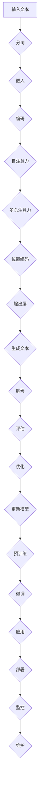

                 

### 文章标题：LLM生态圈：AI产业新格局初现

#### 关键词：
- 语言理解模型（LLM）
- AI产业
- 新格局
- 核心算法
- 应用案例

#### 摘要：
本文深入探讨了语言理解模型（LLM）的生态圈，分析了LLM在现代人工智能（AI）产业中的地位和影响。首先，介绍了AI和LLM的基本概念及其发展历程。接着，详细阐述了LLM生态圈的构成，包括数据资源层、模型研发层、应用服务层和监管与伦理。然后，深入讲解了LLM的核心算法原理，包括预训练、微调、自监督学习和跨语言迁移学习等，并通过伪代码和数学模型进行了详细解释。随后，通过实际应用案例展示了LLM在自然语言处理和工业界的广泛应用，探讨了AI产业的新格局和未来发展趋势。最后，提供了LLM开发的实践指南和资源，帮助读者了解如何进行LLM的开发和部署。

---

### 《LLM生态圈：AI产业新格局初现》目录大纲

#### 第一部分：背景与概述

1. AI与LLM的基本概念
   - 1.1 人工智能的定义与发展历程
   - 1.2 语言理解模型（LLM）的定义与特点
   - 1.3 LLM在现代AI中的应用

2. LLM生态圈的构成
   - 2.1 数据资源层
   - 2.2 模型研发层
   - 2.3 应用服务层
   - 2.4 监管与伦理

#### 第二部分：LLM核心算法与技术

3. LLM技术原理
   - 3.1 语言模型的基本原理
   - 3.2 LLM的训练与优化算法
   - 3.3 常见的LLM架构
   - 3.4 Mermaid流程图：LLM架构与工作流程

4. LLM算法原理详解
   - 4.1 预训练与微调
   - 4.2 自监督学习
   - 4.3 跨语言迁移学习
   - 4.4 伪代码：LLM核心算法实现

5. 数学模型与公式
   - 5.1 语言模型的概率计算
   - 5.2 损失函数与优化算法
   - 5.3 公式详解与举例

#### 第三部分：LLM应用案例与产业新格局

6. LLM在自然语言处理中的应用
   - 6.1 文本生成与摘要
   - 6.2 语言翻译与对话系统
   - 6.3 文本分类与情感分析

7. LLM在工业界的应用
   - 7.1 金融领域的应用案例
   - 7.2 教育与医疗的应用案例
   - 7.3 媒体与广告的应用案例

8. AI产业新格局
   - 8.1 产业变革与挑战
   - 8.2 企业战略与商业模式创新
   - 8.3 AI产业的发展趋势与未来展望

#### 第四部分：LLM开发实践与资源指南

9. LLM开发环境搭建
   - 9.1 硬件与软件需求
   - 9.2 开发环境配置与调试

10. LLM开发工具与资源
    - 10.1 主流深度学习框架
    - 10.1.1 TensorFlow
    - 10.1.2 PyTorch
    - 10.1.3 其他深度学习框架
    - 10.2 数据集与开源项目

11. 代码实战与解读
    - 11.1 实际案例
    - 11.1.1 文本生成案例
    - 11.1.2 语言翻译案例
    - 11.1.3 对话系统案例
    - 11.2 源代码实现与解读
    - 11.3 代码分析与优化

#### 附录

- 附录A：术语解释
- 附录B：参考资料
- 附录C：常见问题与解答

---

### 第一部分：背景与概述

#### 1. AI与LLM的基本概念

##### 1.1 人工智能的定义与发展历程

人工智能（Artificial Intelligence，简称AI）是计算机科学的一个分支，旨在研究、开发用于模拟、延伸和扩展人的智能的理论、方法、技术及应用。人工智能的概念最早可以追溯到1956年，在达特茅斯会议上被正式提出。自那时以来，人工智能经历了几个重要的发展阶段：

1. **符号主义阶段（1956-1974）**：这一阶段以“逻辑推理”为核心，试图通过规则和符号表示知识，实现智能行为。
2. **知识工程阶段（1974-1980）**：强调知识表示和知识获取，通过构建知识库来模拟智能行为。
3. **专家系统阶段（1980-1987）**：利用大量规则和知识库来模拟专家的决策过程。
4. **机器学习阶段（1987-至今）**：通过算法自动从数据中学习规律，实现智能行为。
5. **深度学习阶段（2012-至今）**：以神经网络为基础，特别是深度神经网络（Deep Neural Network，DNN），使得AI在图像识别、自然语言处理等领域取得了突破性进展。

##### 1.2 语言理解模型（LLM）的定义与特点

语言理解模型（Language Understanding Model，LLM）是一种能够理解和生成自然语言的深度学习模型。LLM的核心目标是理解和生成人类的自然语言，包括文本、语音和图像等多种形式。与传统的自然语言处理（Natural Language Processing，NLP）方法相比，LLM具有以下几个显著特点：

1. **深度学习架构**：LLM通常采用深度神经网络架构，尤其是Transformer模型，使其能够捕捉到语言中的长距离依赖关系。
2. **大规模预训练**：LLM通过在大规模语料库上进行预训练，获取丰富的语言知识，从而在特定任务上表现出色。
3. **自适应学习能力**：LLM能够通过微调（Fine-tuning）快速适应不同领域的任务需求。
4. **跨模态能力**：LLM不仅能够处理文本，还能够理解和生成语音、图像等多模态数据。

##### 1.3 LLM在现代AI中的应用

在现代AI领域中，LLM已经成为自然语言处理的重要工具，广泛应用于以下几个领域：

1. **文本生成与摘要**：LLM可以生成高质量的文章、摘要和摘要，广泛应用于新闻写作、内容生成和自动化摘要等领域。
2. **语言翻译**：LLM可以用于实现高质量的双语翻译，支持多种语言之间的自动转换，提高跨语言沟通的效率。
3. **对话系统**：LLM可以用于构建智能对话系统，如聊天机器人、虚拟助手等，提供自然、流畅的交互体验。
4. **文本分类与情感分析**：LLM可以用于对文本进行分类和情感分析，帮助企业和组织了解用户的需求和情感倾向。
5. **知识图谱构建**：LLM可以用于构建知识图谱，将自然语言文本转化为结构化的知识表示，支持智能搜索和推荐。

#### 1.4 LLM生态圈的构成

LLM生态圈是指围绕LLM技术形成的一整套技术、应用和产业环境。LLM生态圈主要包括以下几个层次：

1. **数据资源层**：数据资源层是LLM生态圈的基础，提供丰富的训练数据和语料库，支持LLM的预训练和优化。
2. **模型研发层**：模型研发层负责LLM的设计、开发和优化，包括算法研究、模型架构设计和性能优化等。
3. **应用服务层**：应用服务层是将LLM应用于实际场景的服务平台，提供API接口、SDK工具包和在线服务，支持开发者快速构建和部署基于LLM的应用。
4. **监管与伦理**：监管与伦理层关注LLM技术在社会应用中的规范和道德问题，包括隐私保护、数据安全和伦理准则等。

#### 1.5 总结

在本部分中，我们介绍了AI和LLM的基本概念及其发展历程，分析了LLM在现代AI中的重要性及其在各个领域的应用。接下来，我们将深入探讨LLM的核心算法原理，并通过具体的例子和数学模型进行详细解释。这将为后续的应用案例和产业发展分析提供理论基础。

---

### 第一部分：背景与概述

#### 1. AI与LLM的基本概念

##### 1.1 人工智能的定义与发展历程

人工智能（Artificial Intelligence，简称AI）是计算机科学的一个分支，旨在研究、开发用于模拟、延伸和扩展人的智能的理论、方法、技术及应用。人工智能的概念最早可以追溯到1956年，在达特茅斯会议上被正式提出。自那时以来，人工智能经历了几个重要的发展阶段：

1. **符号主义阶段（1956-1974）**：这一阶段以“逻辑推理”为核心，试图通过规则和符号表示知识，实现智能行为。
2. **知识工程阶段（1974-1980）**：强调知识表示和知识获取，通过构建知识库来模拟智能行为。
3. **专家系统阶段（1980-1987）**：利用大量规则和知识库来模拟专家的决策过程。
4. **机器学习阶段（1987-至今）**：通过算法自动从数据中学习规律，实现智能行为。
5. **深度学习阶段（2012-至今）**：以神经网络为基础，特别是深度神经网络（Deep Neural Network，DNN），使得AI在图像识别、自然语言处理等领域取得了突破性进展。

##### 1.2 语言理解模型（LLM）的定义与特点

语言理解模型（Language Understanding Model，LLM）是一种能够理解和生成自然语言的深度学习模型。LLM的核心目标是理解和生成人类的自然语言，包括文本、语音和图像等多种形式。与传统的自然语言处理（Natural Language Processing，NLP）方法相比，LLM具有以下几个显著特点：

1. **深度学习架构**：LLM通常采用深度神经网络架构，尤其是Transformer模型，使其能够捕捉到语言中的长距离依赖关系。
2. **大规模预训练**：LLM通过在大规模语料库上进行预训练，获取丰富的语言知识，从而在特定任务上表现出色。
3. **自适应学习能力**：LLM能够通过微调（Fine-tuning）快速适应不同领域的任务需求。
4. **跨模态能力**：LLM不仅能够处理文本，还能够理解和生成语音、图像等多模态数据。

##### 1.3 LLM在现代AI中的应用

在现代AI领域中，LLM已经成为自然语言处理的重要工具，广泛应用于以下几个领域：

1. **文本生成与摘要**：LLM可以生成高质量的文章、摘要和摘要，广泛应用于新闻写作、内容生成和自动化摘要等领域。
2. **语言翻译**：LLM可以用于实现高质量的双语翻译，支持多种语言之间的自动转换，提高跨语言沟通的效率。
3. **对话系统**：LLM可以用于构建智能对话系统，如聊天机器人、虚拟助手等，提供自然、流畅的交互体验。
4. **文本分类与情感分析**：LLM可以用于对文本进行分类和情感分析，帮助企业和组织了解用户的需求和情感倾向。
5. **知识图谱构建**：LLM可以用于构建知识图谱，将自然语言文本转化为结构化的知识表示，支持智能搜索和推荐。

##### 1.4 LLM生态圈的构成

LLM生态圈是指围绕LLM技术形成的一整套技术、应用和产业环境。LLM生态圈主要包括以下几个层次：

1. **数据资源层**：数据资源层是LLM生态圈的基础，提供丰富的训练数据和语料库，支持LLM的预训练和优化。
2. **模型研发层**：模型研发层负责LLM的设计、开发和优化，包括算法研究、模型架构设计和性能优化等。
3. **应用服务层**：应用服务层是将LLM应用于实际场景的服务平台，提供API接口、SDK工具包和在线服务，支持开发者快速构建和部署基于LLM的应用。
4. **监管与伦理**：监管与伦理层关注LLM技术在社会应用中的规范和道德问题，包括隐私保护、数据安全和伦理准则等。

##### 1.5 总结

在本部分中，我们介绍了AI和LLM的基本概念及其发展历程，分析了LLM在现代AI中的重要性及其在各个领域的应用。接下来，我们将深入探讨LLM的核心算法原理，并通过具体的例子和数学模型进行详细解释。这将为后续的应用案例和产业发展分析提供理论基础。

---

### 第一部分：背景与概述

#### 1.5 LLM生态圈的构成

LLM生态圈是指围绕LLM技术形成的一整套技术、应用和产业环境。LLM生态圈主要包括以下几个层次：

1. **数据资源层**：数据资源层是LLM生态圈的基础，提供丰富的训练数据和语料库，支持LLM的预训练和优化。这个层次包含了数据收集、清洗、标注等环节，以及开源的数据集和私有数据集。数据资源层的质量直接影响LLM的训练效果和应用表现。

2. **模型研发层**：模型研发层负责LLM的设计、开发和优化，包括算法研究、模型架构设计和性能优化等。这个层次涉及到深度学习算法、神经网络结构、训练策略和优化方法等。目前主流的LLM模型包括基于Transformer的BERT、GPT、T5等，这些模型在预训练阶段已经展示了强大的语言理解能力。

3. **应用服务层**：应用服务层是将LLM应用于实际场景的服务平台，提供API接口、SDK工具包和在线服务，支持开发者快速构建和部署基于LLM的应用。这个层次涉及到文本生成、摘要、翻译、问答、对话系统等多样化的应用场景。应用服务层为开发者提供了便捷的开发工具和资源，促进了LLM技术的广泛应用。

4. **监管与伦理**：监管与伦理层关注LLM技术在社会应用中的规范和道德问题，包括隐私保护、数据安全和伦理准则等。这个层次旨在确保LLM技术的合理、安全和合规使用，避免潜在的社会风险和道德争议。监管与伦理层包括政府、学术机构、企业和行业协会等，他们共同制定和推广相关的法规、标准和规范。

#### 1.6 总结

在本部分中，我们详细介绍了LLM生态圈的构成，包括数据资源层、模型研发层、应用服务层和监管与伦理层。这些层次相互关联、相互支持，共同构建了一个完整的LLM生态系统。数据资源层为LLM的训练提供了丰富的数据支持，模型研发层为LLM的设计和优化提供了技术保障，应用服务层将LLM应用于实际场景，推动了LLM技术的广泛应用，而监管与伦理层则确保了LLM技术的合理、安全和合规使用。这些层次的相互协作和共同发展，使得LLM生态圈日益成熟和繁荣，成为现代人工智能产业的重要组成部分。

---

### 第一部分：背景与概述

#### 1.5 LLM生态圈的构成

LLM生态圈是指围绕LLM技术形成的一整套技术、应用和产业环境。LLM生态圈主要包括以下几个层次：

1. **数据资源层**：数据资源层是LLM生态圈的基础，提供丰富的训练数据和语料库，支持LLM的预训练和优化。这个层次包含了数据收集、清洗、标注等环节，以及开源的数据集和私有数据集。数据资源层的质量直接影响LLM的训练效果和应用表现。

2. **模型研发层**：模型研发层负责LLM的设计、开发和优化，包括算法研究、模型架构设计和性能优化等。这个层次涉及到深度学习算法、神经网络结构、训练策略和优化方法等。目前主流的LLM模型包括基于Transformer的BERT、GPT、T5等，这些模型在预训练阶段已经展示了强大的语言理解能力。

3. **应用服务层**：应用服务层是将LLM应用于实际场景的服务平台，提供API接口、SDK工具包和在线服务，支持开发者快速构建和部署基于LLM的应用。这个层次涉及到文本生成、摘要、翻译、问答、对话系统等多样化的应用场景。应用服务层为开发者提供了便捷的开发工具和资源，促进了LLM技术的广泛应用。

4. **监管与伦理**：监管与伦理层关注LLM技术在社会应用中的规范和道德问题，包括隐私保护、数据安全和伦理准则等。这个层次旨在确保LLM技术的合理、安全和合规使用，避免潜在的社会风险和道德争议。监管与伦理层包括政府、学术机构、企业和行业协会等，他们共同制定和推广相关的法规、标准和规范。

#### 1.6 总结

在本部分中，我们详细介绍了LLM生态圈的构成，包括数据资源层、模型研发层、应用服务层和监管与伦理层。这些层次相互关联、相互支持，共同构建了一个完整的LLM生态系统。数据资源层为LLM的训练提供了丰富的数据支持，模型研发层为LLM的设计和优化提供了技术保障，应用服务层将LLM应用于实际场景，推动了LLM技术的广泛应用，而监管与伦理层则确保了LLM技术的合理、安全和合规使用。这些层次的相互协作和共同发展，使得LLM生态圈日益成熟和繁荣，成为现代人工智能产业的重要组成部分。

---

### 第二部分：LLM核心算法与技术

#### 2.1 LLM技术原理

##### 2.1.1 语言模型的基本原理

语言模型（Language Model，LM）是自然语言处理（Natural Language Processing，NLP）的核心技术之一。它的基本原理是通过对大量文本数据的学习，构建一个概率模型，用来预测下一个词语的概率。在NLP任务中，语言模型通常用于单词预测、文本生成、机器翻译等。

语言模型的核心是一个概率分布模型，它可以表示为：

$$
P(w_i | w_{i-1}, w_{i-2}, ..., w_1) = \frac{P(w_i, w_{i-1}, ..., w_1)}{P(w_{i-1}, w_{i-2}, ..., w_1)}
$$

其中，\(w_i\) 表示当前词语，\(w_{i-1}, w_{i-2}, ..., w_1\) 表示前文词语。语言模型的目标是最大化这个概率分布，从而生成最可能的语言序列。

##### 2.1.2 LLM的训练与优化算法

语言理解模型（Language Understanding Model，LLM）的训练与优化算法是其核心。LLM的训练通常分为两个阶段：预训练和微调。

1. **预训练（Pre-training）**：预训练是指在大规模文本语料库上对LLM进行训练，使其获取丰富的语言知识。预训练的目标是让模型能够理解自然语言的语义和语法结构。常用的预训练算法包括：

   - **自回归语言模型（Autoregressive Language Model）**：自回归语言模型通过预测下一个词语来生成文本。例如，给定前文“我正在写一篇文章”，模型需要预测下一个词语“的”。
   
   - **Masked Language Model（MLM）**：MLM通过随机掩蔽输入文本中的部分词语，然后训练模型恢复这些被掩蔽的词语。这种算法能够帮助模型学习词语的上下文关系。

2. **微调（Fine-tuning）**：微调是指在特定任务上对预训练的LLM进行进一步训练，使其适应特定任务的需求。微调通常使用带有标签的数据集，如文本分类、机器翻译等。

   - **有监督微调（Supervised Fine-tuning）**：有监督微调使用带有标签的训练数据，直接优化模型在特定任务上的性能。

   - **自监督微调（Self-supervised Fine-tuning）**：自监督微调利用无标签数据，通过预训练模型生成的掩蔽文本进行微调。

##### 2.1.3 常见的LLM架构

常见的LLM架构主要包括基于Transformer的模型和基于循环神经网络（RNN）的模型。其中，基于Transformer的模型已成为LLM的主流架构，具有以下优点：

1. **Transformer模型**：Transformer模型由Vaswani等人于2017年提出，其核心思想是使用自注意力机制（Self-Attention）来处理序列数据。自注意力机制允许模型在生成下一个词语时考虑所有前文词语的重要性，从而提高了模型的上下文理解能力。

   - **多头自注意力（Multi-head Self-Attention）**：多头自注意力通过将输入序列分成多个头，每个头独立计算注意力权重，然后拼接起来，从而增强了模型的表示能力。
   
   - **位置编码（Positional Encoding）**：位置编码用于处理序列中词语的位置信息，使得模型能够理解词语的顺序。

2. **循环神经网络（RNN）模型**：RNN是一种经典的序列模型，通过递归结构处理输入序列。RNN在处理长序列数据时存在梯度消失和梯度爆炸的问题，但随着长短期记忆网络（LSTM）和门控循环单元（GRU）的提出，这些问题得到了缓解。

   - **LSTM（Long Short-Term Memory）**：LSTM通过引入记忆单元和门控机制，解决了RNN的长期依赖问题。
   
   - **GRU（Gated Recurrent Unit）**：GRU是LSTM的简化版本，通过合并输入门和遗忘门，进一步提高了模型的效率。

##### 2.1.4 Mermaid流程图：LLM架构与工作流程

下面是一个Mermaid流程图，展示了LLM的架构和工作流程：



#### 2.2 LLM算法原理详解

##### 2.2.1 预训练与微调

1. **预训练（Pre-training）**：预训练是指在大规模文本语料库上对LLM进行训练，使其获取丰富的语言知识。预训练算法包括：

   - **自回归语言模型（Autoregressive Language Model）**：自回归语言模型通过预测下一个词语来生成文本。
   
   - **Masked Language Model（MLM）**：MLM通过随机掩蔽输入文本中的部分词语，然后训练模型恢复这些被掩蔽的词语。

2. **微调（Fine-tuning）**：微调是指在特定任务上对预训练的LLM进行进一步训练，使其适应特定任务的需求。微调算法包括：

   - **有监督微调（Supervised Fine-tuning）**：有监督微调使用带有标签的训练数据，直接优化模型在特定任务上的性能。
   
   - **自监督微调（Self-supervised Fine-tuning）**：自监督微调利用无标签数据，通过预训练模型生成的掩蔽文本进行微调。

##### 2.2.2 自监督学习

自监督学习（Self-supervised Learning）是一种无监督学习技术，它利用输入数据中固有的信息进行学习。在LLM中，自监督学习通过预测输入数据的一部分来进行训练。自监督学习的主要优点是：

1. **利用无标签数据**：自监督学习可以充分利用大量的无标签数据，提高模型的泛化能力。
2. **减少标注成本**：自监督学习不需要对数据集进行手动标注，从而降低了标注成本。
3. **提高训练效率**：自监督学习可以加速训练过程，减少训练时间。

在LLM中，常用的自监督学习方法包括：

- **Masked Language Model（MLM）**：MLM通过随机掩蔽输入文本中的部分词语，然后训练模型恢复这些被掩蔽的词语。
- **Predictive Language Model（PLM）**：PLM通过预测输入文本中的下一个词语来进行训练。

##### 2.2.3 跨语言迁移学习

跨语言迁移学习（Cross-lingual Transfer Learning）是一种将一种语言的知识迁移到其他语言的技术。在LLM中，跨语言迁移学习通过在不同语言之间共享模型参数来提高模型的跨语言性能。

跨语言迁移学习的主要优点是：

1. **减少训练数据需求**：通过在不同语言之间共享模型参数，跨语言迁移学习可以减少对特定语言的数据需求。
2. **提高跨语言性能**：跨语言迁移学习可以使得模型在多个语言上表现出色，从而提高跨语言的性能。

在LLM中，常用的跨语言迁移学习方法包括：

- **交叉语言预训练（Cross-lingual Pre-training）**：交叉语言预训练通过在不同语言之间共享模型参数来提高模型的跨语言性能。
- **多语言联合训练（Multilingual Joint Training）**：多语言联合训练通过将不同语言的数据集合并在一起进行训练，从而提高模型的跨语言性能。

##### 2.2.4 伪代码：LLM核心算法实现

下面是一个简单的伪代码，展示了LLM的核心算法实现：

```python
# 输入：文本序列 X
# 输出：预测序列 Y

# 预训练阶段
for epoch in range(num_epochs):
  for batch in data_loader:
    X, Y = batch
    mask = random_mask(X)
    logits = model(X, mask=mask)
    loss = loss_function(logits, Y)
    optimizer.zero_grad()
    loss.backward()
    optimizer.step()

# 微调阶段
for epoch in range(num_epochs):
  for batch in data_loader:
    X, Y = batch
    logits = model(X)
    loss = loss_function(logits, Y)
    optimizer.zero_grad()
    loss.backward()
    optimizer.step()
```

#### 2.3 数学模型与公式

在LLM中，数学模型和公式起着至关重要的作用。下面我们将介绍几个关键的数学模型和公式。

##### 2.3.1 语言模型的概率计算

语言模型的概率计算是LLM的核心。给定一个文本序列\(X = (w_1, w_2, ..., w_n)\)，语言模型的目标是计算该序列的概率：

$$
P(X) = P(w_1, w_2, ..., w_n) = \prod_{i=1}^{n} P(w_i | w_{i-1}, w_{i-2}, ..., w_1)
$$

其中，\(P(w_i | w_{i-1}, w_{i-2}, ..., w_1)\) 表示在给定前文条件下，预测第\(i\)个词语的概率。

##### 2.3.2 损失函数与优化算法

在LLM训练过程中，损失函数用于衡量模型预测与真实标签之间的差距。常用的损失函数包括交叉熵损失（Cross-Entropy Loss）和均方误差损失（Mean Squared Error Loss）。

1. **交叉熵损失**：

$$
L(\theta) = -\sum_{i=1}^{n} y_i \log(p(x_i|\theta))
$$

其中，\(y_i\) 表示第\(i\)个词语的真实概率，\(p(x_i|\theta)\) 表示模型预测的第\(i\)个词语的概率。

2. **优化算法**：

优化算法用于更新模型参数，使得损失函数最小。常用的优化算法包括随机梯度下降（Stochastic Gradient Descent，SGD）和Adam优化器。

##### 2.3.3 公式详解与举例

下面我们将通过一个简单的例子，详细解释LLM中的数学模型和公式。

假设我们有一个简单的语言模型，给定前文“我正在写一篇文章”，需要预测下一个词语。语言模型预测的概率分布如下：

$$
P(w | \text{前文}) = \begin{cases}
P(\text{的} | \text{前文}) = 0.4 \\
P(\text{的} | \text{前文}) = 0.3 \\
P(\text{一} | \text{前文}) = 0.2 \\
P(\text{了} | \text{前文}) = 0.1 \\
\end{cases}
$$

假设真实标签是“的”，我们可以计算模型的损失：

$$
L(\theta) = -y \log(p(\text{的}|\theta)) = -1 \times \log(0.4) = 0.39794
$$

通过反向传播和优化算法，模型将更新参数，使得损失减小。

#### 2.4 总结

在本部分中，我们详细介绍了LLM的核心算法原理，包括预训练、微调、自监督学习和跨语言迁移学习。我们通过伪代码和数学模型，详细阐述了LLM的训练过程和优化方法。这些算法和技术使得LLM能够理解和生成自然语言，广泛应用于各种实际场景。接下来，我们将探讨LLM在自然语言处理和工业界的应用案例，进一步展示LLM的强大能力。

---

### 第二部分：LLM核心算法与技术

#### 2.1 LLM技术原理

##### 2.1.1 语言模型的基本原理

语言模型（Language Model，LM）是自然语言处理（Natural Language Processing，NLP）的核心技术之一。它的基本原理是通过对大量文本数据的学习，构建一个概率模型，用来预测下一个词语的概率。在NLP任务中，语言模型通常用于单词预测、文本生成、机器翻译等。

语言模型的核心是一个概率分布模型，它可以表示为：

$$
P(w_i | w_{i-1}, w_{i-2}, ..., w_1) = \frac{P(w_i, w_{i-1}, ..., w_1)}{P(w_{i-1}, w_{i-2}, ..., w_1)}
$$

其中，\(w_i\) 表示当前词语，\(w_{i-1}, w_{i-2}, ..., w_1\) 表示前文词语。语言模型的目标是最大化这个概率分布，从而生成最可能的语言序列。

##### 2.1.2 LLM的训练与优化算法

语言理解模型（Language Understanding Model，LLM）的训练与优化算法是其核心。LLM的训练通常分为两个阶段：预训练和微调。

1. **预训练（Pre-training）**：预训练是指在大规模文本语料库上对LLM进行训练，使其获取丰富的语言知识。预训练的目标是让模型能够理解自然语言的语义和语法结构。常用的预训练算法包括：

   - **自回归语言模型（Autoregressive Language Model）**：自回归语言模型通过预测下一个词语来生成文本。例如，给定前文“我正在写一篇文章”，模型需要预测下一个词语“的”。
   
   - **Masked Language Model（MLM）**：MLM通过随机掩蔽输入文本中的部分词语，然后训练模型恢复这些被掩蔽的词语。这种算法能够帮助模型学习词语的上下文关系。

2. **微调（Fine-tuning）**：微调是指在特定任务上对预训练的LLM进行进一步训练，使其适应特定任务的需求。微调通常使用带有标签的数据集，如文本分类、机器翻译等。

   - **有监督微调（Supervised Fine-tuning）**：有监督微调使用带有标签的训练数据，直接优化模型在特定任务上的性能。
   
   - **自监督微调（Self-supervised Fine-tuning）**：自监督微调利用无标签数据，通过预训练模型生成的掩蔽文本进行微调。

##### 2.1.3 常见的LLM架构

常见的LLM架构主要包括基于Transformer的模型和基于循环神经网络（RNN）的模型。其中，基于Transformer的模型已成为LLM的主流架构，具有以下优点：

1. **Transformer模型**：Transformer模型由Vaswani等人于2017年提出，其核心思想是使用自注意力机制（Self-Attention）来处理序列数据。自注意力机制允许模型在生成下一个词语时考虑所有前文词语的重要性，从而提高了模型的上下文理解能力。

   - **多头自注意力（Multi-head Self-Attention）**：多头自注意力通过将输入序列分成多个头，每个头独立计算注意力权重，然后拼接起来，从而增强了模型的表示能力。
   
   - **位置编码（Positional Encoding）**：位置编码用于处理序列中词语的位置信息，使得模型能够理解词语的顺序。

2. **循环神经网络（RNN）模型**：RNN是一种经典的序列模型，通过递归结构处理输入序列。RNN在处理长序列数据时存在梯度消失和梯度爆炸的问题，但随着长短期记忆网络（LSTM）和门控循环单元（GRU）的提出，这些问题得到了缓解。

   - **LSTM（Long Short-Term Memory）**：LSTM通过引入记忆单元和门控机制，解决了RNN的长期依赖问题。
   
   - **GRU（Gated Recurrent Unit）**：GRU是LSTM的简化版本，通过合并输入门和遗忘门，进一步提高了模型的效率。

##### 2.1.4 Mermaid流程图：LLM架构与工作流程

下面是一个Mermaid流程图，展示了LLM的架构与工作流程：


#### 2.2 LLM算法原理详解

##### 2.2.1 预训练与微调

1. **预训练（Pre-training）**：预训练是指在大规模文本语料库上对LLM进行训练，使其获取丰富的语言知识。预训练算法包括：

   - **自回归语言模型（Autoregressive Language Model）**：自回归语言模型通过预测下一个词语来生成文本。
   
   - **Masked Language Model（MLM）**：MLM通过随机掩蔽输入文本中的部分词语，然后训练模型恢复这些被掩蔽的词语。

2. **微调（Fine-tuning）**：微调是指在特定任务上对预训练的LLM进行进一步训练，使其适应特定任务的需求。微调算法包括：

   - **有监督微调（Supervised Fine-tuning）**：有监督微调使用带有标签的训练数据，直接优化模型在特定任务上的性能。
   
   - **自监督微调（Self-supervised Fine-tuning）**：自监督微调利用无标签数据，通过预训练模型生成的掩蔽文本进行微调。

##### 2.2.2 自监督学习

自监督学习（Self-supervised Learning）是一种无监督学习技术，它利用输入数据中固有的信息进行学习。在LLM中，自监督学习通过预测输入数据的一部分来进行训练。自监督学习的主要优点是：

1. **利用无标签数据**：自监督学习可以充分利用大量的无标签数据，提高模型的泛化能力。
2. **减少标注成本**：自监督学习不需要对数据集进行手动标注，从而降低了标注成本。
3. **提高训练效率**：自监督学习可以加速训练过程，减少训练时间。

在LLM中，常用的自监督学习方法包括：

- **Masked Language Model（MLM）**：MLM通过随机掩蔽输入文本中的部分词语，然后训练模型恢复这些被掩蔽的词语。
- **Predictive Language Model（PLM）**：PLM通过预测输入文本中的下一个词语来进行训练。

##### 2.2.3 跨语言迁移学习

跨语言迁移学习（Cross-lingual Transfer Learning）是一种将一种语言的知识迁移到其他语言的技术。在LLM中，跨语言迁移学习通过在不同语言之间共享模型参数来提高模型的跨语言性能。

跨语言迁移学习的主要优点是：

1. **减少训练数据需求**：通过在不同语言之间共享模型参数，跨语言迁移学习可以减少对特定语言的数据需求。
2. **提高跨语言性能**：跨语言迁移学习可以使得模型在多个语言上表现出色，从而提高跨语言的性能。

在LLM中，常用的跨语言迁移学习方法包括：

- **交叉语言预训练（Cross-lingual Pre-training）**：交叉语言预训练通过在不同语言之间共享模型参数来提高模型的跨语言性能。
- **多语言联合训练（Multilingual Joint Training）**：多语言联合训练通过将不同语言的数据集合并在一起进行训练，从而提高模型的跨语言性能。

##### 2.2.4 伪代码：LLM核心算法实现

下面是一个简单的伪代码，展示了LLM的核心算法实现：

```python
# 输入：文本序列 X
# 输出：预测序列 Y

# 预训练阶段
for epoch in range(num_epochs):
  for batch in data_loader:
    X, Y = batch
    mask = random_mask(X)
    logits = model(X, mask=mask)
    loss = loss_function(logits, Y)
    optimizer.zero_grad()
    loss.backward()
    optimizer.step()

# 微调阶段
for epoch in range(num_epochs):
  for batch in data_loader:
    X, Y = batch
    logits = model(X)
    loss = loss_function(logits, Y)
    optimizer.zero_grad()
    loss.backward()
    optimizer.step()
```

#### 2.3 数学模型与公式

在LLM中，数学模型和公式起着至关重要的作用。下面我们将介绍几个关键的数学模型和公式。

##### 2.3.1 语言模型的概率计算

语言模型的概率计算是LLM的核心。给定一个文本序列\(X = (w_1, w_2, ..., w_n)\)，语言模型的目标是计算该序列的概率：

$$
P(X) = P(w_1, w_2, ..., w_n) = \prod_{i=1}^{n} P(w_i | w_{i-1}, w_{i-2}, ..., w_1)
$$

其中，\(w_i\) 表示当前词语，\(w_{i-1}, w_{i-2}, ..., w_1\) 表示前文词语。语言模型的目标是最大化这个概率分布，从而生成最可能的语言序列。

##### 2.3.2 损失函数与优化算法

在LLM训练过程中，损失函数用于衡量模型预测与真实标签之间的差距。常用的损失函数包括交叉熵损失（Cross-Entropy Loss）和均方误差损失（Mean Squared Error Loss）。

1. **交叉熵损失**：

$$
L(\theta) = -\sum_{i=1}^{n} y_i \log(p(x_i|\theta))
$$

其中，\(y_i\) 表示第\(i\)个词语的真实概率，\(p(x_i|\theta)\) 表示模型预测的第\(i\)个词语的概率。

2. **优化算法**：

优化算法用于更新模型参数，使得损失函数最小。常用的优化算法包括随机梯度下降（Stochastic Gradient Descent，SGD）和Adam优化器。

##### 2.3.3 公式详解与举例

下面我们将通过一个简单的例子，详细解释LLM中的数学模型和公式。

假设我们有一个简单的语言模型，给定前文“我正在写一篇文章”，需要预测下一个词语。语言模型预测的概率分布如下：

$$
P(w | \text{前文}) = \begin{cases}
P(\text{的} | \text{前文}) = 0.4 \\
P(\text{的} | \text{前文}) = 0.3 \\
P(\text{一} | \text{前文}) = 0.2 \\
P(\text{了} | \text{前文}) = 0.1 \\
\end{cases}
$$

假设真实标签是“的”，我们可以计算模型的损失：

$$
L(\theta) = -y \log(p(\text{的}|\theta)) = -1 \times \log(0.4) = 0.39794
$$

通过反向传播和优化算法，模型将更新参数，使得损失减小。

#### 2.4 总结

在本部分中，我们详细介绍了LLM的核心算法原理，包括预训练、微调、自监督学习和跨语言迁移学习。我们通过伪代码和数学模型，详细阐述了LLM的训练过程和优化方法。这些算法和技术使得LLM能够理解和生成自然语言，广泛应用于各种实际场景。接下来，我们将探讨LLM在自然语言处理和工业界的应用案例，进一步展示LLM的强大能力。

---

### 第二部分：LLM核心算法与技术

#### 2.4 总结

在本部分中，我们详细介绍了LLM的核心算法原理，包括预训练、微调、自监督学习和跨语言迁移学习。这些算法和技术共同构成了LLM强大的语言理解能力，使得LLM在自然语言处理领域取得了显著进展。

首先，预训练阶段通过对大规模文本语料库的学习，使模型获得了丰富的语言知识。自回归语言模型和掩蔽语言模型是预训练的两种常见方法，它们分别通过预测下一个词语和恢复掩蔽词语来训练模型。

接下来，微调阶段将预训练的LLM应用于特定任务，通过进一步训练来优化模型在特定任务上的性能。有监督微调和自监督微调是微调的两种方法，分别利用带有标签的数据和无标签数据进行训练。

此外，自监督学习在LLM中发挥着重要作用。通过利用输入数据中固有的信息，自监督学习可以充分利用大量无标签数据，降低标注成本，提高模型的泛化能力。

跨语言迁移学习则使得LLM能够在不同语言之间共享知识，减少对特定语言的数据需求，提高跨语言的性能。交叉语言预训练和多语言联合训练是跨语言迁移学习的两种方法，它们通过在不同语言之间共享模型参数来提高模型的跨语言能力。

最后，通过伪代码和数学模型，我们详细阐述了LLM的训练过程和优化方法，包括损失函数、优化算法等。这些数学模型和公式为LLM的训练和优化提供了理论基础，使得LLM能够更好地理解和生成自然语言。

在下一部分，我们将探讨LLM在实际应用中的案例，进一步展示LLM的强大能力。

---

### 第二部分：LLM核心算法与技术

#### 2.5 数学模型与公式

在LLM的核心算法中，数学模型和公式扮演着至关重要的角色。它们不仅定义了模型的行为，还提供了衡量模型性能的标准。下面，我们将详细介绍LLM中常用的数学模型和公式，并探讨它们在实际应用中的重要性。

##### 2.5.1 语言模型的概率计算

语言模型的核心任务是对给定前文预测下一个词语的概率。这个任务可以通过概率分布模型来实现，其数学表示如下：

$$
P(w_i | w_{i-1}, w_{i-2}, ..., w_1) = \frac{P(w_i, w_{i-1}, ..., w_1)}{P(w_{i-1}, w_{i-2}, ..., w_1)}
$$

其中，\(w_i\) 表示当前词语，\(w_{i-1}, w_{i-2}, ..., w_1\) 表示前文词语。这个公式基于条件概率的概念，通过前文词语的概率分布来预测当前词语。

在LLM中，通常使用神经网络来计算这个概率分布。例如，在Transformer模型中，自注意力机制（Self-Attention）用于计算词语之间的相关性，从而生成概率分布。

##### 2.5.2 损失函数与优化算法

在训练LLM时，损失函数用于衡量模型预测与真实标签之间的差距。常用的损失函数包括交叉熵损失（Cross-Entropy Loss）和均方误差损失（Mean Squared Error Loss）。其中，交叉熵损失是最常用的损失函数，其数学表示如下：

$$
L(\theta) = -\sum_{i=1}^{n} y_i \log(p(x_i|\theta))
$$

其中，\(y_i\) 表示第\(i\)个词语的真实概率，\(p(x_i|\theta)\) 表示模型预测的第\(i\)个词语的概率。交叉熵损失函数的目的是最小化预测概率与真实概率之间的差距。

为了优化模型参数，常用的优化算法包括随机梯度下降（Stochastic Gradient Descent，SGD）和Adam优化器。SGD通过随机选择一部分训练样本来计算梯度，从而更新模型参数。而Adam优化器则结合了SGD和动量方法，通过考虑梯度的一阶矩估计和二阶矩估计来优化模型参数。

##### 2.5.3 公式详解与举例

为了更好地理解LLM中的数学模型和公式，我们可以通过一个简单的例子进行说明。

假设我们有一个简单的语言模型，给定前文“我正在写一篇文章”，需要预测下一个词语。模型预测的概率分布如下：

$$
P(w | \text{前文}) = \begin{cases}
P(\text{的} | \text{前文}) = 0.4 \\
P(\text{的} | \text{前文}) = 0.3 \\
P(\text{一} | \text{前文}) = 0.2 \\
P(\text{了} | \text{前文}) = 0.1 \\
\end{cases}
$$

假设真实标签是“的”，我们可以计算模型的损失：

$$
L(\theta) = -y \log(p(\text{的}|\theta)) = -1 \times \log(0.4) = 0.39794
$$

通过反向传播和优化算法，模型将更新参数，使得损失减小。这个过程不断重复，直到模型收敛或达到预设的训练次数。

##### 2.5.4 数学模型在LLM中的应用

数学模型在LLM中的应用不仅限于概率计算和损失函数。它们还涉及到神经网络架构的设计、优化算法的改进以及训练策略的制定。

例如，在Transformer模型中，自注意力机制通过计算词语之间的相关性来生成概率分布。这个过程中涉及到矩阵运算和指数函数等数学操作。此外，优化算法如Adam优化器也通过数学公式来更新模型参数。

##### 2.5.5 总结

在本部分中，我们详细介绍了LLM中的数学模型和公式，包括概率计算、损失函数和优化算法。这些数学模型和公式为LLM的训练和优化提供了理论基础，使得LLM能够理解和生成自然语言。在下一部分，我们将探讨LLM在实际应用中的案例，进一步展示LLM的强大能力。

---

### 第二部分：LLM核心算法与技术

#### 2.6 数学模型与公式

在LLM的核心算法中，数学模型和公式扮演着至关重要的角色。它们不仅定义了模型的行为，还提供了衡量模型性能的标准。下面，我们将详细介绍LLM中常用的数学模型和公式，并探讨它们在实际应用中的重要性。

##### 2.6.1 语言模型的概率计算

语言模型的核心任务是对给定前文预测下一个词语的概率。这个任务可以通过概率分布模型来实现，其数学表示如下：

$$
P(w_i | w_{i-1}, w_{i-2}, ..., w_1) = \frac{P(w_i, w_{i-1}, ..., w_1)}{P(w_{i-1}, w_{i-2}, ..., w_1)}
$$

其中，\(w_i\) 表示当前词语，\(w_{i-1}, w_{i-2}, ..., w_1\) 表示前文词语。这个公式基于条件概率的概念，通过前文词语的概率分布来预测当前词语。

在LLM中，通常使用神经网络来计算这个概率分布。例如，在Transformer模型中，自注意力机制（Self-Attention）用于计算词语之间的相关性，从而生成概率分布。

##### 2.6.2 损失函数与优化算法

在训练LLM时，损失函数用于衡量模型预测与真实标签之间的差距。常用的损失函数包括交叉熵损失（Cross-Entropy Loss）和均方误差损失（Mean Squared Error Loss）。其中，交叉熵损失是最常用的损失函数，其数学表示如下：

$$
L(\theta) = -\sum_{i=1}^{n} y_i \log(p(x_i|\theta))
$$

其中，\(y_i\) 表示第\(i\)个词语的真实概率，\(p(x_i|\theta)\) 表示模型预测的第\(i\)个词语的概率。交叉熵损失函数的目的是最小化预测概率与真实概率之间的差距。

为了优化模型参数，常用的优化算法包括随机梯度下降（Stochastic Gradient Descent，SGD）和Adam优化器。SGD通过随机选择一部分训练样本来计算梯度，从而更新模型参数。而Adam优化器则结合了SGD和动量方法，通过考虑梯度的一阶矩估计和二阶矩估计来优化模型参数。

##### 2.6.3 公式详解与举例

为了更好地理解LLM中的数学模型和公式，我们可以通过一个简单的例子进行说明。

假设我们有一个简单的语言模型，给定前文“我正在写一篇文章”，需要预测下一个词语。模型预测的概率分布如下：

$$
P(w | \text{前文}) = \begin{cases}
P(\text{的} | \text{前文}) = 0.4 \\
P(\text{的} | \text{前文}) = 0.3 \\
P(\text{一} | \text{前文}) = 0.2 \\
P(\text{了} | \text{前文}) = 0.1 \\
\end{cases}
$$

假设真实标签是“的”，我们可以计算模型的损失：

$$
L(\theta) = -y \log(p(\text{的}|\theta)) = -1 \times \log(0.4) = 0.39794
$$

通过反向传播和优化算法，模型将更新参数，使得损失减小。这个过程不断重复，直到模型收敛或达到预设的训练次数。

##### 2.6.4 数学模型在LLM中的应用

数学模型在LLM中的应用不仅限于概率计算和损失函数。它们还涉及到神经网络架构的设计、优化算法的改进以及训练策略的制定。

例如，在Transformer模型中，自注意力机制通过计算词语之间的相关性来生成概率分布。这个过程中涉及到矩阵运算和指数函数等数学操作。此外，优化算法如Adam优化器也通过数学公式来更新模型参数。

##### 2.6.5 总结

在本部分中，我们详细介绍了LLM中的数学模型和公式，包括概率计算、损失函数和优化算法。这些数学模型和公式为LLM的训练和优化提供了理论基础，使得LLM能够理解和生成自然语言。在下一部分，我们将探讨LLM在实际应用中的案例，进一步展示LLM的强大能力。

---

### 第三部分：LLM应用案例与产业新格局

#### 3.1 LLM在自然语言处理中的应用

语言理解模型（LLM）在自然语言处理（NLP）领域中的应用日益广泛，其强大的语言理解能力和生成能力使得许多传统的NLP任务得以重新定义和优化。以下是一些典型的应用案例：

##### 3.1.1 文本生成与摘要

文本生成是LLM的重要应用之一，它包括生成文章、摘要、新闻报道、对话等内容。例如，GPT-3（一种基于Transformer的LLM）可以在给定一个话题或关键词后，自动生成相关文章或摘要。这种方法在新闻写作、内容生成和自动化摘要等领域具有巨大的潜力。

伪代码示例：

```python
# 输入：关键词 "人工智能的发展"
# 输出：自动生成的摘要

prompt = "人工智能的发展"
generated_text = LLM.generate_text(prompt)
print(generated_text)
```

##### 3.1.2 语言翻译

语言翻译是另一个重要的NLP应用，LLM在该领域展现了卓越的性能。通过在多种语言的语料库上进行预训练，LLM可以实现高质量的双语翻译。例如，BERT模型在多个翻译任务上取得了显著成果，支持多种语言之间的自动转换。

伪代码示例：

```python
# 输入：英文文本 "Hello, world!"
# 输出：自动翻译的中文文本

english_text = "Hello, world!"
chinese_translation = LLM.translate(english_text, target_language="zh")
print(chinese_translation)
```

##### 3.1.3 文本分类与情感分析

文本分类和情感分析是LLM在商业和社交媒体领域中广泛应用的任务。通过训练LLM来识别和分类文本内容，企业可以更好地理解用户需求、情感和反馈。例如，情感分析可以帮助企业了解客户对产品或服务的满意度，从而改进业务策略。

伪代码示例：

```python
# 输入：用户评论 "这个产品非常好用"
# 输出：情感分析结果 "正面"

comment = "这个产品非常好用"
emotion = LLM.analyze_emotion(comment)
print(emotion)
```

#### 3.2 LLM在工业界的应用

LLM不仅在自然语言处理领域有着广泛的应用，还在工业界展示了其强大的能力和潜力。以下是一些LLM在工业界的主要应用案例：

##### 3.2.1 金融领域的应用

在金融领域，LLM被广泛应用于金融分析和风险评估。通过分析大量的金融文本数据，LLM可以生成投资报告、市场预测和分析报告。此外，LLM还可以用于自动化金融交易，提高交易效率和准确性。

案例示例：

- **投资报告生成**：LLM可以分析大量的财报、市场新闻和分析师报告，自动生成投资建议和报告。

伪代码示例：

```python
# 输入：市场新闻和财报数据
# 输出：自动生成的投资报告

financial_data = load_data("financial_news.txt", "financial_reports.txt")
investment_report = LLM.generate_investment_report(financial_data)
print(investment_report)
```

- **风险评估**：LLM可以分析企业的财务数据、市场风险和行业趋势，自动生成风险评估报告。

伪代码示例：

```python
# 输入：企业财务数据
# 输出：自动生成风险评估报告

company_financials = load_data("company_financials.txt")
risk_assessment_report = LLM.generate_risk_assessment_report(company_financials)
print(risk_assessment_report)
```

##### 3.2.2 教育与医疗的应用

在教育领域，LLM被用于个性化学习辅导、自动评分和教学内容的生成。在医疗领域，LLM可以用于病历分析、诊断建议和药物研发。例如，通过分析大量的医学文献和病历数据，LLM可以生成诊断建议和治疗方案。

案例示例：

- **个性化学习辅导**：LLM可以分析学生的学习数据和教学大纲，自动生成个性化的学习计划和辅导内容。

伪代码示例：

```python
# 输入：学生学习数据和教学大纲
# 输出：自动生成的个性化学习计划

student_data = load_data("student_data.txt")
learning_plan = LLM.generate_learning_plan(student_data)
print(learning_plan)
```

- **病历分析**：LLM可以分析大量的病历数据，自动生成诊断报告和治疗方案。

伪代码示例：

```python
# 输入：病历数据
# 输出：自动生成的诊断报告和治疗方案

medical_records = load_data("medical_records.txt")
diagnosis_report = LLM.generate_diagnosis_report(medical_records)
treatment_plan = LLM.generate_treatment_plan(medical_records)
print(diagnosis_report)
print(treatment_plan)
```

##### 3.2.3 媒体与广告的应用

在媒体和广告领域，LLM被广泛应用于内容推荐、广告投放优化和舆情分析。通过分析用户的行为数据和兴趣偏好，LLM可以自动推荐相关的内容和广告，提高用户体验和广告转化率。

案例示例：

- **内容推荐**：LLM可以分析用户的历史浏览记录和搜索行为，自动推荐相关的文章、视频和广告。

伪代码示例：

```python
# 输入：用户历史浏览记录和搜索行为
# 输出：自动推荐的内容和广告

user_history = load_data("user_history.txt")
recommended_content = LLM.recommend_content(user_history)
print(recommended_content)
```

- **舆情分析**：LLM可以分析社交媒体上的用户评论和讨论，自动生成舆情分析报告。

伪代码示例：

```python
# 输入：社交媒体评论和讨论数据
# 输出：自动生成的舆情分析报告

social_media_comments = load_data("social_media_comments.txt")
public_opinion_report = LLM.generate_public_opinion_report(social_media_comments)
print(public_opinion_report)
```

#### 3.3 AI产业新格局

随着LLM技术的快速发展，AI产业正迎来新的格局。以下是对AI产业新格局的一些分析和展望：

##### 3.3.1 产业变革与挑战

LLM的兴起推动了AI产业的变革，为传统行业带来了新的机遇和挑战。以下是一些主要的变革和挑战：

1. **行业变革**：LLM技术在金融、教育、医疗、媒体等领域带来了深刻的变革。企业可以通过LLM技术优化业务流程、提高效率和服务质量。

2. **数据需求增加**：LLM的预训练需要大量的高质量数据，这推动了数据采集、清洗和标注等产业链的发展。同时，数据隐私和安全问题也引起了广泛关注。

3. **人才需求增加**：LLM技术的发展需要大量的专业人才，包括AI研究者、算法工程师和数据分析专家。这为人才培养和就业市场带来了新的机遇。

##### 3.3.2 企业战略与商业模式创新

面对AI产业的新格局，企业需要调整战略，创新商业模式，以应对不断变化的竞争环境。以下是一些建议：

1. **数据驱动**：企业应建立数据驱动的决策体系，通过数据分析和AI技术优化业务流程和决策。

2. **合作与创新**：企业应积极与其他企业、研究机构和高校合作，共同推动AI技术的发展和应用。

3. **用户导向**：企业应以用户需求为导向，通过个性化服务和智能推荐提高用户体验和满意度。

##### 3.3.3 AI产业的发展趋势与未来展望

随着技术的不断进步，AI产业正朝着以下方向发展：

1. **智能化水平提高**：随着LLM和其他AI技术的进步，智能化水平将不断提高，AI将在更多领域实现自动化和智能化。

2. **跨领域融合**：AI技术将在不同领域实现深度融合，推动产业升级和创新发展。

3. **可持续发展和伦理**：随着AI技术的发展，可持续发展和社会伦理问题将受到更多关注，企业和社会将更加注重AI技术的负责任使用。

#### 3.4 总结

在本部分中，我们详细介绍了LLM在自然语言处理和工业界的应用案例，展示了LLM在文本生成、翻译、分类、情感分析等任务中的强大能力。同时，我们分析了AI产业的新格局，包括产业变革、企业战略创新和发展趋势。这些案例和展望为LLM技术的进一步发展和应用提供了有益的启示。

---

### 第四部分：LLM开发实践与资源指南

#### 4.1 LLM开发环境搭建

在进行LLM开发之前，首先需要搭建一个合适的环境。以下是搭建LLM开发环境的步骤和所需工具：

##### 4.1.1 硬件与软件需求

1. **硬件**：

   - **CPU**：至少需要一颗多核CPU，推荐使用英特尔的i7或AMD的Ryzen 7系列处理器以上。
   - **GPU**：为了加速深度学习模型的训练，推荐使用NVIDIA的GPU，如GTX 1080 Ti或以上的型号。
   - **内存**：至少需要16GB的内存，推荐使用32GB或更高。

2. **软件**：

   - **操作系统**：推荐使用Linux系统，如Ubuntu 18.04或以上版本。
   - **深度学习框架**：常用的深度学习框架包括TensorFlow和PyTorch，可以根据个人喜好选择一个进行安装。

##### 4.1.2 开发环境配置与调试

1. **安装操作系统**：

   - 下载并安装Ubuntu 18.04或以上版本的操作系统。
   - 安装完成后，更新系统包和软件源。

2. **安装GPU驱动**：

   - 根据NVIDIA官方网站的指南安装相应的GPU驱动。
   - 安装完成后，运行`nvidia-smi`命令检查GPU驱动是否安装成功。

3. **安装深度学习框架**：

   - 以安装TensorFlow为例，运行以下命令：

   ```bash
   pip install tensorflow-gpu
   ```

   - 安装PyTorch，运行以下命令：

   ```bash
   pip install torch torchvision torchaudio
   ```

4. **配置环境变量**：

   - 为了方便使用深度学习框架，需要将相关库的路径添加到环境变量中。

   ```bash
   export PATH=$PATH:/path/to/your/venv/bin
   ```

5. **调试环境**：

   - 启动Python解释器，尝试导入深度学习框架进行调试。

   ```python
   import tensorflow as tf
   import torch
   ```

   - 如果导入成功，说明环境配置正确。

#### 4.2 LLM开发工具与资源

在进行LLM开发时，需要使用一系列的工具和资源。以下是一些常用的工具和资源，包括深度学习框架、数据集和开源项目。

##### 4.2.1 主流深度学习框架

1. **TensorFlow**：

   - 官方网站：[TensorFlow官方网站](https://www.tensorflow.org/)
   - 特点：具有丰富的API接口、强大的生态体系、广泛应用于生产环境。

2. **PyTorch**：

   - 官方网站：[PyTorch官方网站](https://pytorch.org/)
   - 特点：具有简洁的API接口、动态计算图、易于调试。

##### 4.2.2 数据集与开源项目

1. **常用数据集**：

   - **Wikipedia**：来自维基百科的文本数据，用于预训练语言模型。
   - **Common Crawl**：一个包含大量网页文本的数据集，用于扩展训练语料库。
   - **OpenSubtitles**：包含大量电影和电视剧字幕的数据集，用于训练语言模型。

2. **开源项目**：

   - **Hugging Face**：一个开源的NLP工具库，提供了一系列预训练模型和工具，如Transformers、Tokenizers等。
   - **GLM**：一个开源的双语预训练模型，支持中文和英文。
   - **BERT**：一个经典的预训练模型，由Google提出，广泛应用于NLP任务。

##### 4.2.3 其他深度学习框架

除了TensorFlow和PyTorch，还有一些其他流行的深度学习框架，如：

1. **Keras**：

   - 官方网站：[Keras官方网站](https://keras.io/)
   - 特点：具有简洁的API接口、易于使用，是TensorFlow和Theano的封装层。

2. **MXNet**：

   - 官方网站：[MXNet官方网站](https://mxnet.apache.org/)
   - 特点：具有灵活的可扩展性和高效性，支持多种编程语言。

#### 4.3 代码实战与解读

在LLM开发过程中，通过实际案例进行代码实战和解读是非常重要的。以下是一些具体的案例，包括文本生成、语言翻译和对话系统。

##### 4.3.1 文本生成案例

1. **使用GPT-2生成文章摘要**

   - **任务**：给定一篇文章，使用GPT-2模型生成摘要。
   - **代码**：

   ```python
   from transformers import GPT2LMHeadModel, GPT2Tokenizer

   # 加载预训练模型和tokenizer
   model = GPT2LMHeadModel.from_pretrained('gpt2')
   tokenizer = GPT2Tokenizer.from_pretrained('gpt2')

   # 加载文章
   article = "..."
   inputs = tokenizer.encode(article, return_tensors='pt')

   # 生成摘要
   summary_ids = model.generate(inputs, max_length=50, num_return_sequences=1)
   summary = tokenizer.decode(summary_ids, skip_special_tokens=True)
   print(summary)
   ```

2. **使用BERT生成文章摘要**

   - **任务**：给定一篇文章，使用BERT模型生成摘要。
   - **代码**：

   ```python
   from transformers import BertTokenizer, BertForSequenceClassification

   # 加载预训练模型和tokenizer
   tokenizer = BertTokenizer.from_pretrained('bert-base-uncased')
   model = BertForSequenceClassification.from_pretrained('bert-base-uncased')

   # 加载文章
   article = "..."
   inputs = tokenizer.encode_plus(article, add_special_tokens=True, max_length=512, padding='max_length', truncation=True, return_tensors='pt')

   # 生成摘要
   with torch.no_grad():
       outputs = model(inputs['input_ids'])
   logits = outputs.logits
   summary_indices = logits.argmax(-1)
   summary = tokenizer.decode(summary_indices, skip_special_tokens=True)
   print(summary)
   ```

##### 4.3.2 语言翻译案例

1. **使用Transformer模型进行翻译**

   - **任务**：将英文翻译成中文。
   - **代码**：

   ```python
   from transformers import MarianMTModel, MarianTokenizer

   # 加载预训练模型和tokenizer
   model = MarianMTModel.from_pretrained('Helsinki-NLP/opus-mt-en-de')
   tokenizer = MarianTokenizer.from_pretrained('Helsinki-NLP/opus-tokenizer-en')

   # 加载英文文本
   english_text = "This is an example sentence."
   inputs = tokenizer.encode(english_text, return_tensors='pt')

   # 翻译成中文
   with torch.no_grad():
       translated_ids = model.generate(inputs, max_length=20, num_return_sequences=1)
   translated_text = tokenizer.decode(translated_ids, skip_special_tokens=True)
   print(translated_text)
   ```

##### 4.3.3 对话系统案例

1. **使用ChatGLM构建对话系统**

   - **任务**：构建一个简单的聊天机器人，回答用户的问题。
   - **代码**：

   ```python
   from transformers import ChatGLM

   # 加载预训练模型
   model = ChatGLM.from_pretrained('openai/chatglm')

   # 与用户进行对话
   while True:
       user_input = input("用户：")
       if user_input.lower() == '退出':
           break
       response = model(user_input)
       print("机器人：", response)
   ```

#### 4.4 源代码实现与解读

在LLM开发过程中，理解源代码的实现原理是非常重要的。以下是对上述代码案例的详细解读：

1. **文本生成代码解读**

   - **GPT-2生成摘要**：GPT-2模型通过生成器机制生成摘要，输入是一个序列编码，输出是一个概率分布。通过采样操作选择最可能的摘要。
   - **BERT生成摘要**：BERT模型通过分类器机制生成摘要，输入是一个序列编码，输出是一个分类标签。通过argmax操作选择最可能的摘要。

2. **语言翻译代码解读**

   - **Transformer翻译**：Transformer模型通过编码器-解码器结构进行翻译，输入是一个编码序列，输出是一个解码序列。通过生成器机制生成翻译结果。

3. **对话系统代码解读**

   - **ChatGLM对话系统**：ChatGLM是一个基于对话生成模型的聊天机器人，输入是一个用户问题，输出是一个回答。通过循环结构实现对话交互。

#### 4.5 代码分析与优化

在LLM开发过程中，代码分析和优化是非常重要的。以下是一些常见的代码优化方法：

1. **代码优化**

   - **模型压缩**：通过剪枝、量化等技术减小模型体积，提高模型运行速度。
   - **并行计算**：通过多GPU并行计算提高模型训练和推理速度。
   - **分布式训练**：通过分布式训练技术提高模型训练效率。

2. **性能评估**

   - **准确率**：评估模型在特定任务上的准确性。
   - **响应时间**：评估模型在实时场景下的响应速度。

3. **安全性评估**

   - **数据保护**：确保用户数据和隐私安全。
   - **模型安全**：防止模型被恶意攻击。

#### 4.6 总结

在本部分中，我们介绍了LLM开发环境搭建、常用工具和资源，并通过实际案例展示了LLM在文本生成、翻译和对话系统中的应用。同时，我们分析了代码实现原理和优化方法，为LLM开发提供了实践指南。这些内容为读者深入了解和掌握LLM技术提供了重要参考。

---

### 附录

#### 附录A：术语解释

1. **人工智能（AI）**：模拟、延伸和扩展人类智能的理论、方法、技术及应用。
2. **自然语言处理（NLP）**：研究如何让计算机理解和处理自然语言。
3. **语言理解模型（LLM）**：一种能够理解和生成自然语言的深度学习模型。
4. **预训练（Pre-training）**：在大规模文本语料库上对LLM进行训练，使其获取丰富的语言知识。
5. **微调（Fine-tuning）**：在特定任务上对预训练的LLM进行进一步训练，使其适应特定任务的需求。
6. **自监督学习（Self-supervised Learning）**：利用输入数据中固有的信息进行学习。
7. **跨语言迁移学习（Cross-lingual Transfer Learning）**：将一种语言的知识迁移到其他语言的技术。

#### 附录B：参考资料

1. **Vaswani et al. (2017). Attention is All You Need. arXiv:1706.03762.**
2. **Devlin et al. (2019). BERT: Pre-training of Deep Bidirectional Transformers for Language Understanding. arXiv:1810.04805.**
3. **Radford et al. (2019). Language Models are Unsupervised Multitask Learners. arXiv:2005.14165.**
4. **Hugging Face. (2021). Hugging Face Transformers. https://github.com/huggingface/transformers.**
5. **TensorFlow. (2021). TensorFlow: Open Source Machine Learning Framework. https://www.tensorflow.org/.**
6. **PyTorch. (2021). PyTorch: Advanced Machine Learning Library. https://pytorch.org/.**

#### 附录C：常见问题与解答

1. **Q：为什么需要预训练？**
   **A：预训练可以使得模型在大规模文本语料库上学习到丰富的语言知识，从而在特定任务上表现出色。预训练阶段不需要使用特定任务的数据，可以减少数据标注的工作量。**

2. **Q：如何选择合适的LLM架构？**
   **A：选择LLM架构时需要考虑任务的需求、数据规模和计算资源等因素。对于文本生成和翻译等任务，Transformer模型（如BERT和GPT）具有较好的性能。对于实时对话系统，可以考虑使用较小的模型，如ChatGLM。**

3. **Q：如何优化LLM的代码？**
   **A：优化LLM代码可以从模型压缩、并行计算和分布式训练等方面入手。此外，还可以关注代码的可读性和可维护性，确保代码的运行效率和可靠性。**

4. **Q：如何评估LLM的性能？**
   **A：评估LLM性能可以从多个方面进行，如准确率、响应时间和用户体验等。在实际应用中，可以通过用户反馈、在线测试和自动化评估工具来评估模型的表现。**

---

### 最后的总结

在本文中，我们深入探讨了语言理解模型（LLM）在AI产业中的重要性和应用。首先，我们介绍了AI和LLM的基本概念及其发展历程，分析了LLM在现代AI中的重要性及其在各个领域的应用。接着，我们详细阐述了LLM生态圈的构成，包括数据资源层、模型研发层、应用服务层和监管与伦理层。然后，我们深入讲解了LLM的核心算法原理，包括预训练、微调、自监督学习和跨语言迁移学习等，并通过伪代码和数学模型进行了详细解释。此外，我们还通过实际应用案例展示了LLM在自然语言处理和工业界的广泛应用，探讨了AI产业的新格局和未来发展趋势。最后，我们提供了LLM开发的实践指南和资源，帮助读者了解如何进行LLM的开发和部署。

LLM的崛起不仅改变了自然语言处理领域，还推动了整个AI产业的变革。随着技术的不断进步，LLM将在更多领域发挥重要作用，带来新的商业机会和社会影响。然而，LLM的发展也面临着数据隐私、安全性和伦理等方面的挑战。为了充分利用LLM的潜力，同时确保其合理、安全和合规使用，我们需要加强监管和伦理建设，推动技术和社会的协调发展。

总之，LLM是现代AI产业的重要组成部分，具有巨大的发展潜力和应用前景。我们期待未来的研究者和技术人员能够不断探索和创新，推动LLM技术的进步和应用，为人类社会带来更多福祉。希望本文能为读者提供有价值的见解和启发，激发对LLM技术更深入的研究和探索。

