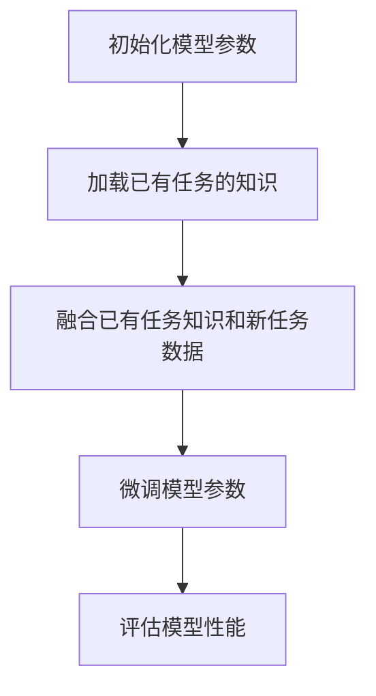

                 

## 文章标题

### LLM的Few-Shot学习能力分析

> 关键词：大语言模型（LLM），Few-Shot学习，迁移学习，性能评估，伪代码，Mermaid流程图，项目实战

> 摘要：本文将深入探讨大语言模型（LLM）的Few-Shot学习能力，通过详细的原理分析、性能评估和实际项目案例，揭示LLM在少量样本下实现高效学习的关键机制和技术。

---

### 《LLM的Few-Shot学习能力分析》

#### 第一部分：背景与概述

##### 第1章：大语言模型（LLM）概述

在深度学习与人工智能领域，大语言模型（LLM）已经成为一种重要的研究热点和应用工具。LLM通过学习大规模文本数据，能够生成高质量的自然语言文本，并在多种任务中展现出卓越的性能。

##### 1.1 大语言模型（LLM）的定义

大语言模型（LLM）是一种基于深度学习技术的自然语言处理模型，其核心思想是通过训练大量的文本数据来学习语言的统计规律和语义信息，从而实现文本的生成、理解和推理。

##### 1.2 大语言模型（LLM）的发展历程

从最初的循环神经网络（RNN）到长短期记忆网络（LSTM），再到如今的全局性注意力机制（Transformer），LLM的发展历程体现了人工智能领域的技术进步和理论创新。

##### 1.3 大语言模型（LLM）的基本架构

LLM的基本架构包括编码器（Encoder）和解码器（Decoder），其中编码器负责将输入文本编码为固定长度的向量表示，解码器则根据这些向量生成输出文本。

##### 1.4 大语言模型（LLM）的关键参数与指标

LLM的性能评估通常依赖于参数规模、计算效率、文本生成质量等多个指标。参数规模反映了模型的复杂度，计算效率则影响了模型的实际应用场景，而文本生成质量则是衡量模型性能的核心指标。

##### 第2章：Few-Shot学习的基本概念

Few-Shot学习是机器学习领域的一种重要学习范式，它强调在少量样本的情况下实现高效学习。这种能力在许多现实场景中具有重要意义，如个性化推荐、医疗诊断和语言翻译等。

##### 2.1 Few-Shot学习的定义与意义

Few-Shot学习是指在训练样本数量非常有限的情况下，模型仍然能够实现良好的泛化性能。其意义在于降低训练成本，提高模型在特定领域的适应性。

##### 2.2Few-Shot学习的挑战

Few-Shot学习面临的主要挑战包括样本不足导致的泛化能力下降、数据分布的变化以及任务之间的差异等。

##### 2.3 Few-Shot学习的分类与实现方法

Few-Shot学习可以分为基于迁移学习、自监督学习和元学习等多种实现方法。每种方法都有其独特的优势和适用场景。

#### 第二部分：LLM的Few-Shot学习能力分析

##### 第3章：LLM的Few-Shot学习能力原理

LLM的Few-Shot学习能力源自其强大的迁移学习和自适应能力。在这一章中，我们将深入探讨这些原理，并通过伪代码和Mermaid流程图来具体阐述。

##### 3.1 Few-Shot学习中的迁移学习原理

迁移学习是Few-Shot学习的关键机制之一。通过利用已有任务的知识，LLM能够在新任务中实现快速学习。

##### 3.2 伪代码阐述LLM的Few-Shot学习机制

为了更好地理解LLM的Few-Shot学习机制，我们可以通过伪代码来展示其核心流程。

```python
# Few-Shot学习伪代码

# 初始化模型参数
model = initialize_model()

# 加载已有任务的知识
pretrained知识 = load_pretrained_model()

# 融合已有任务知识和新任务数据
model = fuse_knowledge(pretrained知识, new_data)

# 微调模型参数
model = fine_tune(model, new_data)

# 评估模型性能
performance = evaluate_model(model, new_data)
```

##### 3.3 Mermaid流程图展示LLM的Few-Shot学习过程

为了更直观地展示LLM的Few-Shot学习过程，我们可以使用Mermaid流程图来描述。



##### 第4章：LLM的Few-Shot学习性能评估

在LLM的Few-Shot学习过程中，性能评估是至关重要的一环。通过合理的评估指标，我们可以衡量模型在少量样本下的学习效果。

##### 4.1 准备数据集

为了评估LLM的Few-Shot学习性能，我们需要准备合适的数据集。数据集的选择应当考虑到样本数量、任务类型和数据分布等因素。

##### 4.2 性能评估指标

常见的性能评估指标包括准确率、召回率、F1分数等。在Few-Shot学习场景中，这些指标有助于我们全面评估模型的表现。

##### 4.3 LL

##### 第5章：结论与展望

通过对LLM的Few-Shot学习能力进行全面分析，我们揭示了其背后的原理和实现方法。未来，随着技术的不断进步，LLM的Few-Shot学习能力有望在更多场景中得到应用。

##### 5.1 研究总结

本文对LLM的Few-Shot学习能力进行了深入分析，总结了其主要原理和性能评估方法。

##### 5.2 未来研究方向

未来研究可以关注以下几个方面：进一步提高LLM的Few-Shot学习能力、探索新的性能评估指标以及将其应用于实际场景中的优化策略。

---

### 作者信息

**作者：** AI天才研究院/AI Genius Institute & 禅与计算机程序设计艺术 /Zen And The Art of Computer Programming

---

以上是文章的初步框架，接下来的章节内容将逐步填充和详细阐述。每章将包含核心概念、原理分析、伪代码、Mermaid流程图和项目实战等多个部分，确保文章的完整性和深度。让我们一步一步地深入分析，揭开LLM的Few-Shot学习能力的神秘面纱。

