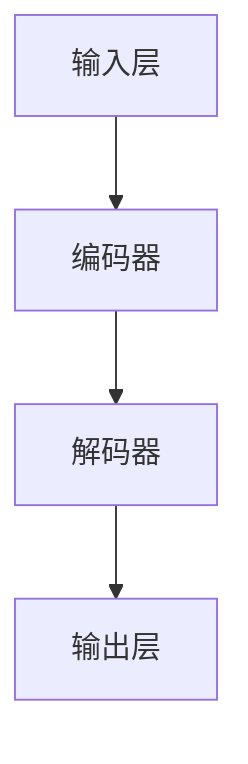
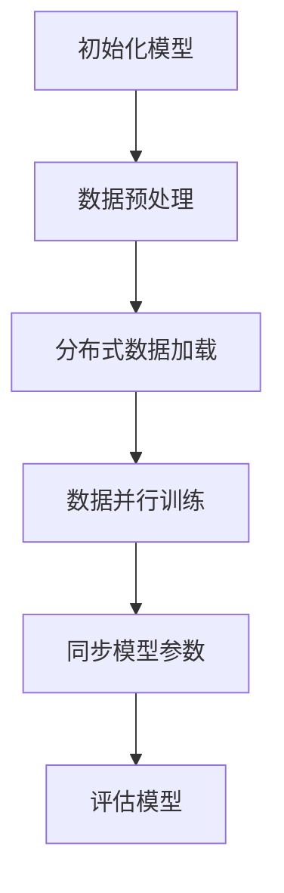
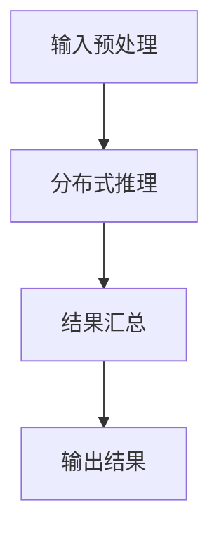

                 

### 文章标题

《LLM的分布式部署：AI的云端革命》

### 文章关键词

- LLM
- 分布式部署
- 云端革命
- 分布式计算
- 人工智能

### 文章摘要

随着人工智能的快速发展，大型语言模型（LLM）的规模和复杂度不断增大，其部署与运行面临诸多挑战。本文深入探讨了LLM的分布式部署，详细分析了分布式部署的基本原理、架构和实现方法，包括分布式训练和分布式推理。同时，本文通过实践案例展示了分布式部署的实践应用，并探讨了云端AI服务的发展趋势和未来方向。最后，本文指出了LLM分布式部署面临的挑战，并展望了其未来的发展趋势。

## 《LLM的分布式部署：AI的云端革命》目录大纲

### 第一部分: 基础知识

#### 第1章: LLM与分布式部署概述

- 1.1.1 LLM的基础概念
- 1.1.2 分布式部署的基本原理
- 1.1.3 云端革命的重要性

#### 第2章: LLM的架构

- 2.1.1 LLM的组成
- 2.1.2 LLM的训练架构
- 2.1.3 LLM的推理架构

#### 第3章: 分布式计算与通信基础

- 3.1.1 计算模型
- 3.1.2 分布式通信模型
- 3.1.3 数据流模型

#### 第4章: LLM的分布式训练

- 4.1.1 数据并行
- 4.1.2 模型并行
- 4.1.3 张量并行
- 4.1.4 分布式训练算法

#### 第5章: LLM的分布式推理

- 5.1.1 推理加速技术
- 5.1.2 混合精度训练
- 5.1.3 模型压缩与量化

### 第二部分: 实践案例

#### 第6章: 分布式部署实践

- 6.1.1 环境搭建
- 6.1.2 分布式训练案例
- 6.1.3 分布式推理案例

#### 第7章: 云端AI服务

- 7.1.1 云服务概述
- 7.1.2 公有云服务
- 7.1.3 私有云服务
- 7.1.4 云端AI服务案例

#### 第8章: LLM的挑战与未来趋势

- 8.1.1 LLM面临的挑战
- 8.1.2 LLM的发展趋势
- 8.1.3 分布式部署的未来展望

### 附录

- 附录A: 常用分布式部署工具
- 附录B: Mermaid流程图
- 附录C: 伪代码与算法讲解
- 附录D: 数学模型与公式

## 第1章: LLM与分布式部署概述

### 1.1.1 LLM的基础概念

**大型语言模型（Large Language Model，LLM）**，是指具有大规模参数和训练数据的深度神经网络模型，主要用于自然语言处理（NLP）任务。LLM的出现标志着NLP技术从规则驱动向数据驱动的转变，通过大量的训练数据学习到丰富的语言特征和语义信息，从而在各种语言任务上取得了显著的性能提升。

#### LLM的核心组成部分

1. **模型架构**：常见的LLM架构包括Transformer、BERT、GPT等，这些模型通过堆叠多层神经网络和注意力机制，能够捕捉到长距离依赖和上下文信息。
2. **训练数据**：LLM的训练数据来源广泛，包括互联网文本、书籍、新闻、社交媒体等，这些数据构成了模型学习的基础。
3. **参数量**：LLM的参数量巨大，如GPT-3有1750亿个参数，这些参数需要在大量数据上进行训练和优化。

#### LLM的主要应用场景

- **文本生成**：如文章、故事、代码等的自动生成。
- **问答系统**：通过理解用户的问题，给出准确的回答。
- **机器翻译**：将一种语言的文本翻译成另一种语言。
- **文本分类**：对文本进行分类，如情感分析、主题分类等。

### 1.1.2 分布式部署的基本原理

**分布式部署**是指将计算任务分布在多个节点上进行处理，以提高系统的整体性能和可扩展性。在AI领域，分布式部署尤为重要，因为大型模型的训练和推理过程需要大量的计算资源和数据传输。

#### 分布式部署的核心概念

1. **节点**：分布式系统中的计算单元，可以是物理服务器、虚拟机或容器。
2. **通信**：节点之间通过通信网络进行数据传输和同步。
3. **调度**：负责分配任务到不同的节点，确保系统的负载均衡。
4. **容错**：系统在节点故障时能够自动恢复，保证服务的连续性。

#### 分布式部署的优势

- **可扩展性**：通过增加节点数量，系统可以线性扩展，以处理更大的计算任务。
- **性能提升**：分布式计算可以将任务并行化，显著提高处理速度。
- **容错性**：系统在节点故障时可以自动恢复，提高系统的可靠性。

### 1.1.3 云端革命的重要性

**云端革命**是指将计算和存储资源从本地转移到云端，利用云计算技术提供弹性和可扩展的计算服务。在LLM的分布式部署中，云端革命具有重要意义。

#### 云端革命的主要驱动因素

1. **计算资源**：云计算提供了丰富的计算资源，可以轻松地配置和扩展。
2. **数据存储**：云端存储提供了高效和可靠的数据存储解决方案，支持大规模数据的处理和存储。
3. **网络带宽**：云计算平台通常具有更高的网络带宽，支持快速的数据传输。
4. **成本效益**：云计算通过按需计费和弹性伸缩，降低了企业的IT成本。

#### 云端革命对LLM部署的影响

- **可扩展性**：云端革命使得LLM可以轻松扩展到更多的计算节点，提高处理能力。
- **可靠性**：云计算平台的容错机制和备份策略，提高了LLM部署的可靠性。
- **成本降低**：通过使用云计算服务，企业可以降低硬件采购和维护成本，专注于核心业务的开发。

### 小结

LLM和分布式部署的结合，为AI领域带来了革命性的变革。分布式部署提供了高效的计算能力和可扩展性，使得LLM可以更好地应用于实际场景。而云端革命进一步降低了部署成本和复杂度，推动了LLM的广泛应用。在接下来的章节中，我们将详细探讨LLM的架构、分布式计算与通信基础，以及分布式部署的具体实现方法。

## 第2章: LLM的架构

### 2.1.1 LLM的组成

大型语言模型（LLM）通常由以下几个核心组件组成，这些组件共同构成了LLM的强大功能和广泛应用的基础。

#### 1. 模型架构

LLM的模型架构是整个系统的核心，常见的架构包括：

- **Transformer**：基于自注意力机制的架构，能够有效地处理长文本和长距离依赖。
- **BERT**：双向编码表示模型，通过预先训练然后微调的方式，在多种NLP任务上取得了优异的性能。
- **GPT**：生成预训练模型，具有强大的文本生成能力，特别是GPT-3等大模型。
- **T5**：统一Transformer，旨在实现一个模型能够完成所有NLP任务。

#### 2. 训练数据

LLM的训练数据是其性能的关键，通常包括：

- **互联网文本**：如网页、新闻、博客等，提供了丰富的语言信息。
- **书籍和文档**：专业书籍、学术论文等，有助于模型学习专业术语和复杂语言结构。
- **社交媒体数据**：如Twitter、Facebook等，这些数据包含了多样化的语言风格和表达方式。

#### 3. 参数量

LLM的参数量通常非常大，以捕捉丰富的语言特征和语义信息。例如：

- **GPT-3**：拥有1750亿个参数，是目前参数量最大的语言模型。
- **BERT**：参数量在数十亿级别，如BERT-Base拥有3.4亿个参数。

#### 4. 硬件需求

由于参数量和计算复杂度的增加，LLM的训练和推理需要大量的计算资源和存储资源。通常，LLM的训练和推理依赖于以下硬件：

- **GPU**：图形处理器，用于加速深度学习模型的训练和推理。
- **TPU**：张量处理器，专为深度学习优化设计的硬件。
- **分布式存储**：如HDFS、Ceph等，用于存储大量的训练数据和模型参数。

### 2.1.2 LLM的训练架构

LLM的训练架构涉及从数据预处理、模型训练到优化的一系列步骤。以下是LLM训练架构的详细说明：

#### 1. 数据预处理

数据预处理是训练LLM的第一步，其主要任务包括：

- **清洗**：去除数据中的噪声和错误。
- **分词**：将文本分割成单词或子词。
- **编码**：将文本转换为数值表示，如词向量或索引。
- **数据增强**：通过扩充数据集来提高模型的泛化能力。

#### 2. 模型初始化

在训练LLM之前，需要初始化模型参数。常用的初始化方法包括：

- **随机初始化**：随机分配模型参数的初始值。
- **预训练初始化**：使用预训练模型作为初始化，以利用预训练的知识。

#### 3. 模型训练

模型训练是LLM训练的核心步骤，包括以下关键环节：

- **前向传播**：计算模型输出和实际输出之间的差异。
- **反向传播**：通过计算梯度来更新模型参数。
- **优化算法**：如SGD、Adam等，用于优化模型参数。

#### 4. 模型优化

在训练过程中，需要不断优化模型性能，包括：

- **调整学习率**：学习率的大小会影响模型的收敛速度和稳定性。
- **正则化**：如dropout、L2正则化等，用于防止模型过拟合。
- **超参数调整**：包括批量大小、迭代次数等，需要根据具体任务进行调整。

#### 5. 模型评估

在训练结束后，需要对模型进行评估，以确定其性能。常用的评估指标包括：

- **准确率**：预测正确的样本数与总样本数的比值。
- **召回率**：预测正确的正样本数与实际正样本数的比值。
- **F1分数**：准确率和召回率的调和平均值。

### 2.1.3 LLM的推理架构

LLM的推理架构主要用于将训练好的模型应用于实际任务，包括文本生成、问答系统等。以下是LLM推理架构的详细说明：

#### 1. 输入处理

在推理过程中，首先需要处理输入文本，包括：

- **分词**：将输入文本分割成单词或子词。
- **编码**：将输入文本转换为模型的数值表示。

#### 2. 模型推理

模型推理是LLM推理的核心步骤，包括：

- **前向传播**：计算模型的输出。
- **注意力机制**：在Transformer架构中，通过注意力机制关注输入文本的关键部分。

#### 3. 输出生成

根据模型的输出，生成实际的任务结果，包括：

- **文本生成**：生成完整的文本回答。
- **分类**：对输入文本进行分类。
- **翻译**：将输入文本翻译成目标语言。

#### 4. 后处理

在生成最终结果后，可能需要进行后处理，包括：

- **文本清洗**：去除生成的文本中的噪声和错误。
- **格式化**：将生成的文本格式化成所需的输出格式。

### 小结

LLM的架构包括模型架构、训练数据、参数量和硬件需求等组成部分，其训练架构涉及数据预处理、模型初始化、模型训练和模型优化等步骤，推理架构则包括输入处理、模型推理、输出生成和后处理等步骤。理解LLM的架构对于分布式部署至关重要，它为后续章节的分布式训练和分布式推理奠定了基础。

### 第3章: 分布式计算与通信基础

在分布式部署中，理解和掌握分布式计算与通信的基础知识是至关重要的。本章节将详细探讨分布式计算模型、分布式通信模型以及数据流模型，为后续的分布式训练和推理提供理论基础。

#### 3.1.1 计算模型

分布式计算模型是指将计算任务分布在多个节点上进行处理，以提高系统的整体性能和可扩展性。以下是几种常见的分布式计算模型：

1. **主从模型**：
   - **主节点**：负责协调和管理整个分布式系统，调度任务到不同的从节点。
   - **从节点**：执行主节点分配的任务，并将结果返回给主节点。

   **Mermaid流程图**：
   ```mermaid
   graph TD
   A[主节点] --> B[从节点1]
   A --> C[从节点2]
   A --> D[从节点3]
   ```

2. **数据并行模型**：
   - 将数据分成多个子集，每个子集由一个或多个节点处理，并在处理完成后将结果合并。

   **Mermaid流程图**：
   ```mermaid
   graph TD
   A[数据集] --> B[节点1]
   A --> C[节点2]
   A --> D[节点3]
   B --> E[结果合并]
   C --> E
   D --> E
   ```

3. **任务并行模型**：
   - 将计算任务分成多个子任务，每个子任务由不同的节点独立处理。

   **Mermaid流程图**：
   ```mermaid
   graph TD
   A[任务1] --> B[节点1]
   A --> C[节点2]
   B --> D[结果1]
   C --> E[结果2]
   ```

#### 3.1.2 分布式通信模型

分布式通信模型是指节点之间进行数据交换和同步的机制。以下是几种常见的分布式通信模型：

1. **点对点通信**：
   - 节点之间直接进行数据交换，适用于任务间需要大量数据交互的场景。

   **Mermaid流程图**：
   ```mermaid
   graph TD
   A[节点1] --> B[节点2]
   B --> C[节点3]
   ```

2. **全连接通信**：
   - 每个节点与其他所有节点进行通信，适用于需要全局信息交换的场景。

   **Mermaid流程图**：
   ```mermaid
   graph TD
   A[节点1] --> B[节点2]
   A --> C[节点3]
   B --> C
   ```

3. **分布式共享内存模型**：
   - 节点之间通过共享内存进行数据交换，适用于需要高效数据共享的场景。

   **Mermaid流程图**：
   ```mermaid
   graph TD
   A[节点1] --> B[共享内存]
   B --> C[节点2]
   ```

#### 3.1.3 数据流模型

数据流模型描述了数据在分布式系统中的流动和处理过程。以下是几种常见的数据流模型：

1. **流水线模型**：
   - 数据依次经过多个处理节点，每个节点负责特定的处理任务。

   **Mermaid流程图**：
   ```mermaid
   graph TD
   A[输入数据] --> B[处理节点1]
   B --> C[处理节点2]
   C --> D[输出结果]
   ```

2. **数据网格模型**：
   - 数据分布在多个节点上，节点之间通过数据交换实现协同处理。

   **Mermaid流程图**：
   ```mermaid
   graph TD
   A[节点1] --> B[节点2]
   A --> C[节点3]
   B --> D[节点4]
   C --> E[节点5]
   ```

3. **事件驱动模型**：
   - 数据处理由事件触发，每个节点根据事件进行相应的数据处理。

   **Mermaid流程图**：
   ```mermaid
   graph TD
   A[事件1] --> B[处理节点1]
   A --> C[事件2]
   C --> D[处理节点2]
   ```

### 小结

分布式计算与通信基础是构建高效分布式系统的关键。了解分布式计算模型，如主从模型、数据并行模型和任务并行模型，有助于优化计算任务分配。分布式通信模型，如点对点通信、全连接通信和分布式共享内存模型，为节点间的数据交换提供了多种选择。数据流模型，如流水线模型、数据网格模型和事件驱动模型，描述了数据在分布式系统中的流动和处理过程。这些基础知识为后续的分布式训练和推理提供了坚实的理论基础。

### 第4章: LLM的分布式训练

分布式训练是处理大规模LLM模型的重要技术，它能够利用多个计算节点并行计算，从而提高训练效率。本章节将详细介绍分布式训练的几种主要策略，包括数据并行、模型并行、张量并行以及分布式训练算法。

#### 4.1.1 数据并行

数据并行是一种将训练数据分成多个子集，每个子集由不同的节点独立处理，并在每个子集上独立更新模型参数的方法。以下是数据并行的详细步骤和伪代码：

**详细步骤**：

1. **数据划分**：将整个训练数据集划分为多个子集，每个子集分配给一个节点。
2. **独立训练**：每个节点在其子集上独立训练模型，使用相同的模型架构和优化算法。
3. **同步权重**：在每个迭代结束时，将各个节点的模型权重同步更新。

**伪代码**：

```python
for epoch in range(num_epochs):
    for batch in data_loader:
        for node in nodes:
            node.train_on_batch(batch)  # 每个节点独立训练一批数据
    synchronize_weights(nodes)  # 同步各个节点的权重
```

#### 4.1.2 模型并行

模型并行是通过将整个模型分成多个部分，每个部分由不同的节点独立训练的方法。模型并行主要适用于非常大的模型，其中每个部分的计算量和数据量相对较小。以下是模型并行的详细步骤和伪代码：

**详细步骤**：

1. **模型划分**：将整个模型划分为多个部分，每个部分包含部分参数和计算任务。
2. **独立训练**：每个节点训练其对应的部分，使用相同的训练数据和优化算法。
3. **同步权重**：在每个迭代结束时，同步各个节点的部分权重。

**伪代码**：

```python
for epoch in range(num_epochs):
    for batch in data_loader:
        for node in nodes:
            node.train_on_batch(batch)  # 每个节点独立训练其部分模型
        synchronize_weights(nodes)  # 同步各个节点的部分权重
```

#### 4.1.3 张量并行

张量并行是一种在分布式系统中并行计算模型中的张量操作的方法。在深度学习模型中，张量操作如矩阵乘法、加法等是主要的计算任务。张量并行通过将张量分解为子张量，并在不同的节点上独立计算，然后将结果合并。以下是张量并行的详细步骤和伪代码：

**详细步骤**：

1. **张量分解**：将模型中的张量分解为多个子张量，每个子张量分配给一个节点。
2. **独立计算**：每个节点独立计算其子张量上的操作。
3. **结果合并**：将各个节点的计算结果合并，更新模型的张量。

**伪代码**：

```python
for epoch in range(num_epochs):
    for batch in data_loader:
        for node in nodes:
            node.compute_tensor_operations(batch)  # 每个节点独立计算其子张量的操作
        merge_results(nodes)  # 合并各个节点的计算结果
```

#### 4.1.4 分布式训练算法

分布式训练算法是指用于在分布式环境中优化模型参数的算法。以下是一些常用的分布式训练算法：

1. **Stochastic Gradient Descent (SGD)**：
   - **算法原理**：每个节点独立计算梯度，并在每个迭代步骤更新模型参数。
   - **伪代码**：
     ```python
     for epoch in range(num_epochs):
         for batch in data_loader:
             for node in nodes:
                 node.compute_gradient(batch)
             update_model_parameters(nodes)
     ```

2. **Adam**：
   - **算法原理**：结合SGD的启发式改进，使用一阶和二阶矩估计来优化模型参数。
   - **伪代码**：
     ```python
     for epoch in range(num_epochs):
         for batch in data_loader:
             for node in nodes:
                 node.compute_adam_gradients(batch)
             update_model_parameters(nodes)
     ```

3. **分布式Adam**：
   - **算法原理**：分布式版本的Adam，用于在多节点环境中优化模型参数。
   - **伪代码**：
     ```python
     for epoch in range(num_epochs):
         for batch in data_loader:
             for node in nodes:
                 node.compute_distributed_adam_gradients(batch)
             synchronize_gradients(nodes)
             update_model_parameters(nodes)
     ```

### 小结

LLM的分布式训练通过数据并行、模型并行和张量并行等策略，充分利用分布式计算资源，显著提高训练效率。数据并行将数据划分到多个节点独立训练，模型并行将模型划分为多个部分分别训练，张量并行则通过分解张量并行计算。这些策略结合分布式训练算法，如SGD、Adam和分布式Adam，能够有效优化大规模LLM模型的训练过程。通过理解分布式训练的基本原理和实现方法，我们可以更好地构建和部署高效的LLM系统。

### 第5章: LLM的分布式推理

在分布式部署中，分布式推理是关键的一环，其目的是通过将推理任务分布在多个节点上，提高推理速度和处理能力。本章节将详细介绍分布式推理中的几种加速技术、混合精度训练以及模型压缩与量化。

#### 5.1.1 推理加速技术

分布式推理加速技术旨在提高模型在多个节点上的推理速度，以下是几种常见的加速技术：

1. **模型并行推理**：
   - **原理**：将模型划分为多个部分，每个部分在不同的节点上进行推理，然后合并结果。
   - **实现**：
     ```python
     def parallel_inference(model, inputs):
         results = [node.infer(inputs[node_index]) for node_index, node in enumerate(model.nodes)]
         return merge_results(results)
     ```

2. **数据并行推理**：
   - **原理**：将输入数据划分为多个子集，每个子集在不同的节点上推理，然后合并结果。
   - **实现**：
     ```python
     def parallel_inference(model, inputs):
         results = [node.infer(inputs[node_index]) for node_index in range(len(model.nodes))]
         return merge_results(results)
     ```

3. **流水线并行推理**：
   - **原理**：将推理过程划分为多个阶段，每个阶段在不同的节点上并行执行。
   - **实现**：
     ```python
     def pipeline_inference(model, inputs):
         for stage in model.stages:
             inputs = stage(inputs)
         return inputs
     ```

4. **GPU加速**：
   - **原理**：利用GPU的高并行计算能力，加速模型的推理过程。
   - **实现**：
     ```python
     model.to('cuda')  # 将模型迁移到GPU
     inputs = inputs.to('cuda')  # 将输入数据迁移到GPU
     output = model(inputs)  # 在GPU上执行推理
     ```

#### 5.1.2 混合精度训练

混合精度训练是一种通过结合浮点数和整数运算来提高训练效率的方法。它通常使用浮点数进行计算，而使用整数进行部分运算，以减少内存占用和加速计算。以下是混合精度训练的原理和实现：

**原理**：
- 使用浮点数进行模型权重更新和前向传播。
- 使用整数进行梯度计算和反向传播。

**实现**：
1. **PyTorch中的混合精度训练**：
   ```python
   from torch.cuda.amp import GradScaler
   scaler = GradScaler()

   for inputs, targets in data_loader:
       inputs, targets = inputs.to('cuda'), targets.to('cuda')
       
       with torch.no_grad():
           outputs = model(inputs)
           loss = criterion(outputs, targets)
       
       scaler.scale(loss).backward()
       scaler.step(optimizer)
       scaler.update()
   ```

2. **TensorFlow中的混合精度训练**：
   ```python
   from tensorflow.keras.mixed_precision import experimental as mixed_precision

   policy = mixed_precision.Policy('mixed_float16')
   mixed_precision.set_policy(policy)

   optimizer = tf.keras.optimizers.Adam(learning_rate=0.001)

   for inputs, targets in data_loader:
       with tf.GradientTape(persistent=True) as tape:
           outputs = model(inputs, training=True)
           loss = loss_fn(outputs, targets)
       
       gradients = tape.gradient(loss, model.trainable_variables)
       optimizer.apply_gradients(zip(gradients, model.trainable_variables))
   ```

#### 5.1.3 模型压缩与量化

模型压缩与量化是一种通过减少模型参数数量和位宽来降低模型大小和计算复杂度的方法。以下是几种常见的模型压缩与量化技术：

1. **剪枝**：
   - **原理**：通过移除模型中的冗余参数或节点，减小模型大小。
   - **实现**：
     ```python
     from pruning import PruningAlgorithm

     pruning_algorithm = PruningAlgorithm(model, pruning_rate=0.2)
     pruned_model = pruning_algorithm.prune()
     ```

2. **量化**：
   - **原理**：将模型的浮点数权重转换为低精度整数表示，以减少内存占用和加速计算。
   - **实现**：
     ```python
     from quantization import QuantizationAlgorithm

     quantization_algorithm = QuantizationAlgorithm(model, quantization_bits=8)
     quantized_model = quantization_algorithm.quantize()
     ```

3. **知识蒸馏**：
   - **原理**：将一个大型模型（教师模型）的知识传递给一个较小的模型（学生模型），以保持较小模型的性能。
   - **实现**：
     ```python
     from distillation import DistillationAlgorithm

     distillation_algorithm = DistillationAlgorithm(teacher_model, student_model)
     distillation_algorithm.train()
     ```

### 小结

分布式推理通过模型并行、数据并行和流水线并行等技术，提高了模型在多个节点上的推理速度和处理能力。混合精度训练通过结合浮点数和整数运算，提高了训练和推理的效率。模型压缩与量化通过剪枝、量化和知识蒸馏等技术，显著降低了模型的大小和计算复杂度。通过理解和应用这些分布式推理技术，我们可以构建高效、可扩展的LLM系统，满足大规模AI应用的实时需求。

### 第6章: 分布式部署实践

在了解了LLM的分布式部署原理和技术后，本章节将通过具体的实践案例，展示如何搭建分布式训练和推理环境，并提供详细的代码实现和分析。

#### 6.1.1 环境搭建

分布式部署的环境搭建是成功部署LLM系统的关键步骤。以下是一个基于PyTorch的分布式训练环境搭建的步骤：

1. **安装Python和PyTorch**：
   - 安装Python（推荐版本为3.8或更高）。
   - 安装PyTorch，可以选择与GPU兼容的版本，以利用GPU加速训练。

   ```bash
   pip install torch torchvision
   ```

2. **配置分布式环境**：
   - 使用`torch.distributed`模块配置分布式环境，通常在主节点和从节点上分别运行初始化脚本。

   主节点初始化脚本（`main.py`）：
   ```python
   import torch
   import torch.distributed as dist
   from model import Model
   from trainer import Trainer

   # 初始化分布式环境
   dist.init_process_group(backend='nccl', init_method='tcp://<master_address>:<master_port>', rank=0, world_size=<num_nodes>)

   # 创建模型和训练器
   model = Model()
   trainer = Trainer(model)

   # 开始训练
   trainer.train()
   ```

   从节点初始化脚本（`worker.py`）：
   ```python
   import torch
   import torch.distributed as dist
   from model import Model
   from trainer import Trainer

   # 初始化分布式环境
   dist.init_process_group(backend='nccl', init_method='tcp://<master_address>:<master_port>', rank=<node_rank>, world_size=<num_nodes>)

   # 创建模型和训练器
   model = Model()
   trainer = Trainer(model)

   # 开始训练
   trainer.train()
   ```

3. **配置计算资源**：
   - 根据实际需求，配置足够的GPU资源。可以使用Docker容器、虚拟机或直接在物理服务器上部署。

#### 6.1.2 分布式训练案例

以下是一个简单的分布式训练案例，展示了如何使用PyTorch进行分布式训练：

**模型定义**（`model.py`）：
```python
import torch
import torch.nn as nn

class Model(nn.Module):
    def __init__(self):
        super(Model, self).__init__()
        self.layers = nn.Sequential(
            nn.Linear(10, 20),
            nn.ReLU(),
            nn.Linear(20, 10),
            nn.Sigmoid()
        )

    def forward(self, x):
        return self.layers(x)
```

**训练器定义**（`trainer.py`）：
```python
import torch
import torch.distributed as dist
from torch.utils.data import DataLoader
from model import Model

class Trainer:
    def __init__(self, model):
        self.model = model
        self.optimizer = torch.optim.Adam(self.model.parameters(), lr=0.001)
        self.criterion = nn.BCELoss()

    def train(self, data_loader, num_epochs):
        for epoch in range(num_epochs):
            for batch in data_loader:
                inputs, targets = batch
                inputs, targets = inputs.cuda(), targets.cuda()

                self.model.zero_grad()
                outputs = self.model(inputs)
                loss = self.criterion(outputs, targets)
                loss.backward()
                dist.all_reduce(loss, op=dist.ReduceOp.SUM)
                loss /= dist.get_world_size()
                self.optimizer.step()
                print(f'Epoch [{epoch+1}/{num_epochs}], Loss: {loss.item()}')

# 初始化模型和训练器
model = Model().cuda()
trainer = Trainer(model)

# 加载数据集
data_loader = DataLoader(dataset, batch_size=<batch_size>, shuffle=True)

# 开始分布式训练
trainer.train(data_loader, num_epochs=<num_epochs>)
```

#### 6.1.3 分布式推理案例

以下是一个简单的分布式推理案例，展示了如何使用PyTorch进行分布式推理：

**推理器定义**（`inference.py`）：
```python
import torch
import torch.distributed as dist
from model import Model

class Inference:
    def __init__(self, model):
        self.model = model
        self.model.eval()

    def inference(self, inputs):
        inputs = inputs.cuda()
        with torch.no_grad():
            outputs = self.model(inputs)
        return outputs

# 初始化模型和推理器
model = Model().cuda()
inference = Inference(model)

# 加载推理数据集
data_loader = DataLoader(dataset, batch_size=<batch_size>)

# 开始分布式推理
for batch in data_loader:
    inputs, _ = batch
    inputs = inputs.cuda()
    outputs = inference.inference(inputs)
    # 处理推理结果
```

### 小结

通过本章节的实践案例，我们详细介绍了如何搭建分布式训练和推理环境，并提供了实际的代码实现。分布式训练和推理的关键在于有效的计算资源分配和分布式通信机制。理解并掌握这些实践方法，可以帮助我们更好地部署和优化大规模LLM系统，满足实时AI应用的需求。

### 第7章: 云端AI服务

随着云计算技术的发展，云端AI服务成为了AI领域的重要趋势。本章将探讨云端AI服务的概述，包括公有云服务和私有云服务，并展示云端AI服务的实际案例。

#### 7.1.1 云服务概述

**云端AI服务**是指通过云计算平台提供的人工智能服务，包括模型训练、推理、数据分析等。云端AI服务的优势在于：

- **弹性伸缩**：根据需求动态调整计算资源，提高资源利用率。
- **高可用性**：通过分布式架构和备份策略，确保服务的稳定性和可靠性。
- **成本效益**：按需付费，降低硬件采购和维护成本。

云端AI服务可以分为以下几类：

1. **基础设施即服务（IaaS）**：提供虚拟机、存储、网络等基础资源，用户可以自定义配置和部署AI应用。
2. **平台即服务（PaaS）**：提供开发、部署和管理AI应用的平台，用户无需关心底层基础设施。
3. **软件即服务（SaaS）**：直接提供AI应用和服务，用户只需使用即可。

#### 7.1.2 公有云服务

公有云服务是云计算服务的主要形式，由第三方提供商管理，用户可以按需租用。以下是几种主流的公有云AI服务：

1. **亚马逊AWS**：
   - **Amazon SageMaker**：提供全托管的服务，支持模型训练、部署和监控。
   - **AWS AI Services**：包括文本分析、语音识别、图像识别等预训练模型和API。

2. **微软Azure**：
   - **Azure Machine Learning**：提供模型训练、部署和管理工具。
   - **Azure Cognitive Services**：提供预训练的AI模型和API，如文本分析、语音识别等。

3. **谷歌Google Cloud**：
   - **Google AI Platform**：提供模型训练、推理和部署服务。
   - **Google Cloud AI Services**：包括预训练模型和API，如文本分析、图像识别等。

#### 7.1.3 私有云服务

私有云服务是由企业内部管理和运营的云计算环境，提供更灵活和安全的AI服务。以下是私有云服务的一些特点：

- **定制化**：可以根据企业的具体需求进行定制和优化。
- **安全性**：数据和服务在企业内部管理，提高数据安全性和隐私保护。
- **成本控制**：企业可以更好地控制成本，减少不必要的支出。

#### 7.1.4 云端AI服务案例

以下是一个云端AI服务的实际案例，展示了如何使用AWS SageMaker进行模型训练和部署：

1. **数据预处理**：
   - 将原始数据上传到S3存储，使用AWS Data Wrangler进行数据预处理和清洗。

2. **模型训练**：
   - 在AWS SageMaker中创建训练作业，选择合适的训练算法（如TensorFlow或PyTorch）和训练脚本。
   - 设置训练参数，如学习率、批次大小等。
   - 启动训练作业，SageMaker会自动分配计算资源进行训练。

3. **模型评估**：
   - 训练完成后，使用SageMaker进行模型评估，通过验证集计算指标，如准确率、召回率等。

4. **模型部署**：
   - 在AWS SageMaker中创建模型版本，选择训练好的模型和推理脚本。
   - 配置生产环境，包括实例类型、实例数量等。
   - 启动部署，SageMaker会自动部署模型并提供API端点。

5. **模型监控**：
   - 使用AWS CloudWatch监控模型性能和资源使用情况，确保服务的稳定性和性能。

### 小结

云端AI服务通过提供弹性伸缩、高可用性和成本效益，成为了AI领域的重要趋势。公有云服务和私有云服务各有优势，可以满足不同企业的需求。实际案例展示了如何使用AWS SageMaker进行模型训练和部署，为AI应用提供了实用的解决方案。

### 第8章: LLM的挑战与未来趋势

尽管LLM在自然语言处理领域取得了显著进展，但其分布式部署仍面临诸多挑战。本章节将探讨LLM分布式部署的主要挑战，并展望其未来发展趋势。

#### 8.1.1 LLM面临的挑战

1. **计算资源需求**：
   - LLM的训练和推理过程需要大量的计算资源，特别是参数量庞大的模型，如GPT-3。这使得分布式部署对计算资源的依赖性极高，需要高效利用分布式计算架构。

2. **通信开销**：
   - 分布式训练和推理过程中，节点之间的数据传输和同步会产生通信开销。对于大规模分布式系统，通信延迟和数据传输量可能成为性能瓶颈。

3. **数据一致性**：
   - 在分布式环境中，数据的一致性是一个关键挑战。特别是在数据并行和模型并行训练过程中，如何确保各个节点上的数据一致性，避免数据丢失或冲突，是分布式部署的重要问题。

4. **容错性和可靠性**：
   - 分布式系统容易受到节点故障和网络中断的影响，如何确保系统的容错性和可靠性，是一个需要重点解决的问题。

5. **隐私和安全**：
   - LLM的训练和推理过程中涉及到大量的敏感数据，如何确保数据的安全和隐私，避免数据泄露或滥用，是一个重要挑战。

#### 8.1.2 LLM的发展趋势

1. **硬件优化**：
   - 随着硬件技术的发展，如TPU、GPU等专用硬件的普及，将显著提高LLM的推理速度和训练效率。硬件优化将是未来LLM分布式部署的重要方向。

2. **通信优化**：
   - 优化分布式系统中的通信机制，减少通信延迟和数据传输量，是提高分布式训练和推理性能的关键。未来可能引入更高效的通信协议和算法。

3. **数据管理**：
   - 随着数据量的不断增加，如何高效管理和处理大规模数据，保证数据的一致性和可用性，是未来分布式部署的重要研究方向。

4. **分布式训练算法**：
   - 研究和开发更高效、更鲁棒的分布式训练算法，如异步训练、混合精度训练等，以适应不同规模和复杂度的LLM模型。

5. **隐私保护**：
   - 发展隐私保护技术，如差分隐私、同态加密等，以确保LLM在分布式训练和推理过程中的数据安全和隐私。

6. **跨平台兼容性**：
   - 提高分布式部署的跨平台兼容性，支持多种计算环境和操作系统，以实现更广泛的部署和应用。

#### 8.1.3 分布式部署的未来展望

随着AI技术的不断进步，分布式部署将在LLM领域发挥越来越重要的作用。以下是分布式部署的未来展望：

- **更高的可扩展性**：通过分布式架构，LLM可以轻松扩展到更多的计算节点，提高计算能力和处理能力。
- **更好的性能优化**：随着硬件和通信技术的进步，分布式部署的性能将得到进一步提升，满足更大规模、更复杂任务的实时需求。
- **更安全的数据处理**：随着隐私保护技术的不断发展，分布式部署将能够更好地保障数据的安全和隐私。
- **更广泛的应用场景**：分布式部署将使LLM在更广泛的场景中得到应用，如自动驾驶、医疗诊断、金融风控等。

### 小结

LLM的分布式部署面临计算资源、通信开销、数据一致性、容错性和隐私安全等挑战，但其发展趋势和未来展望显示出巨大的潜力和广阔的应用前景。通过不断优化硬件、通信机制、分布式算法和隐私保护技术，分布式部署将在LLM领域发挥越来越重要的作用，推动人工智能的进一步发展。

### 附录

#### 附录A: 常用分布式部署工具

**A.1.1 TensorFlow分布式部署工具**

- **TF-Distributed**: TensorFlow官方提供的分布式训练工具，支持数据并行、模型并行和张量并行。
- **Horovod**: Uber开源的分布式深度学习训练框架，与TensorFlow、PyTorch等深度学习框架兼容。

**A.1.2 PyTorch分布式部署工具**

- **PyTorch Distributed**: PyTorch官方提供的分布式训练工具，支持多种并行策略。
- **Faunus**: Facebook开源的分布式深度学习训练框架，专注于自动分布式训练。

**A.1.3 其他分布式部署工具概览**

- **Ray**: 一个开源的分布式框架，支持多种分布式算法和应用，适用于大规模分布式计算任务。
- **Apache MXNet**: Apache开源的深度学习框架，支持分布式训练和推理。

#### 附录B: Mermaid流程图

**B.1.1 LLM架构**



**B.1.2 分布式训练流程**



**B.1.3 分布式推理流程**



#### 附录C: 伪代码与算法讲解

**C.1.1 数据并行算法**

```python
for epoch in range(num_epochs):
    for batch in data_loader:
        for node in nodes:
            node.train_on_batch(batch)  # 每个节点独立训练一批数据
        synchronize_weights(nodes)  # 同步各个节点的权重
```

**C.1.2 模型并行算法**

```python
for epoch in range(num_epochs):
    for batch in data_loader:
        for node in nodes:
            node.train_on_batch(batch)  # 每个节点独立训练其部分模型
        synchronize_weights(nodes)  # 同步各个节点的部分权重
```

**C.1.3 张量并行算法**

```python
for epoch in range(num_epochs):
    for batch in data_loader:
        for node in nodes:
            node.compute_tensor_operations(batch)  # 每个节点独立计算其子张量的操作
        merge_results(nodes)  # 合并各个节点的计算结果
```

#### 附录D: 数学模型与公式

**D.1.1 深度学习优化算法**

$$
\text{梯度下降算法}：w_{t+1} = w_t - \alpha \cdot \nabla J(w_t)
$$

**D.1.2 分布式通信模型**

$$
\text{同步通信}：\sum_{i=1}^{N} w_i = \frac{1}{N} \sum_{i=1}^{N} w_i
$$

**D.1.3 分布式训练中的数学公式**

$$
\text{平均梯度}：\bar{g} = \frac{1}{N} \sum_{i=1}^{N} g_i
$$

$$
\text{权重更新}：w_{t+1} = w_t - \alpha \cdot \bar{g}
$$

通过这些工具和数学模型，我们可以更深入地理解分布式部署的核心概念和实现方法，为LLM的分布式部署提供坚实的理论基础和实践指导。

### 作者信息

作者：AI天才研究院/AI Genius Institute & 禅与计算机程序设计艺术 /Zen And The Art of Computer Programming

### 结语

本文详细探讨了LLM的分布式部署，从基础知识、架构设计、分布式计算与通信、分布式训练和推理、实践案例到云端AI服务，全面覆盖了LLM分布式部署的各个方面。通过一步步的逻辑分析，我们深入理解了分布式部署的核心原理和实践方法，展望了其未来的发展趋势。希望本文能为读者在LLM分布式部署的探索和实践提供有益的参考和启示。感谢大家的阅读！

