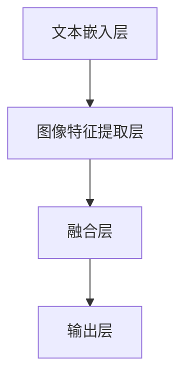
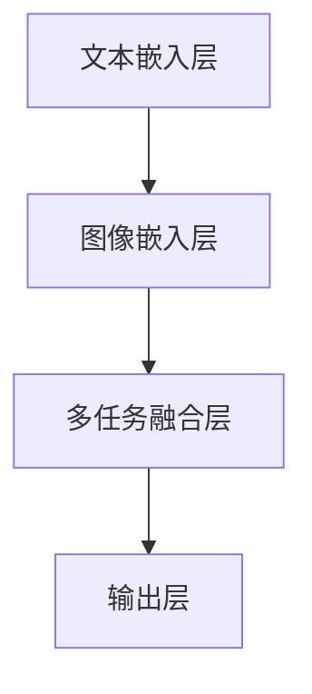
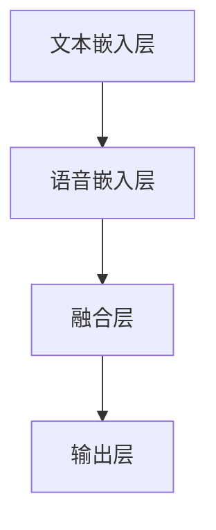
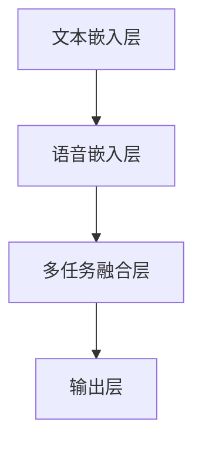
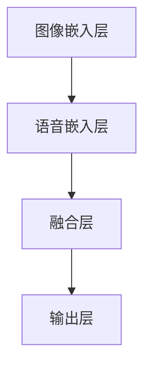
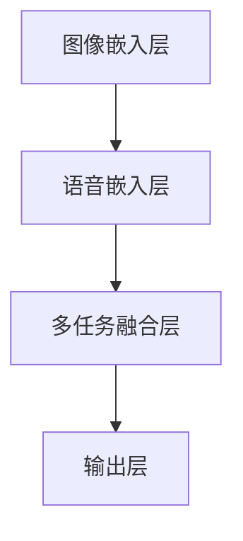

                 

### 1.1 LLM的定义与历史

LLM（Large Language Model）是一种基于深度学习技术的自然语言处理模型，其核心思想是通过在大规模语料上进行预训练，学习到语言的普遍规律和模式。LLM的发展历程可以追溯到20世纪50年代，当时主要是基于规则驱动的方法，例如语法分析和模式匹配等。随后，到了20世纪80年代，统计方法和隐马尔可夫模型（HMM）开始被广泛应用于自然语言处理领域。

真正的突破出现在2018年，随着OpenAI发布的GPT-1，标志着预训练语言模型时代的到来。GPT-1通过在大量互联网文本上预训练，展示出了强大的语言理解和生成能力，其参数规模达到了1.17亿。这一里程碑事件引发了自然语言处理领域的研究热潮，也催生了后续一系列更大型、更先进的语言模型，如GPT-2、GPT-3等。

#### 1.1.2 LLM的核心特点

LLM具有以下核心特点：

- **参数规模巨大**：当前的LLM模型，如GPT-3，其参数数量已经达到1750亿，这使其能够处理极其复杂的语言任务。
- **预训练机制**：LLM通过在大规模语料上进行预训练，使得模型在未见过的数据上也能表现出良好的性能。预训练包括两个阶段：第一阶段是语言建模，即让模型学会预测下一个词；第二阶段是微调，即利用特定领域的任务数据进一步优化模型。
- **强泛化能力**：LLM能够处理各种自然语言任务，包括文本生成、文本分类、问答、机器翻译、情感分析等，其强大的泛化能力使其在多个应用场景中都表现出色。

#### 1.1.3 LLM的应用场景

LLM的应用场景非常广泛，主要包括以下几个方面：

- **自动问答系统**：利用LLM，可以构建强大的问答系统，如搜索引擎、聊天机器人等，这些系统能够理解和回答用户的自然语言问题。
- **文本生成与编辑**：LLM可以生成文章、摘要、新闻报道等，也可以用于文本的自动修改和编辑。
- **语言理解与推理**：LLM在情感分析、意图识别、对话系统等领域具有广泛的应用，能够从文本中提取出深层次的信息。

### 1.2 多模态融合的概念与重要性

#### 1.2.1 多模态数据的定义

多模态数据是指由两种或两种以上不同类型的数据源组成的数据集合。常见的多模态数据包括文本、图像、语音、视频等。每种模态都有其独特的特征和优势，例如文本提供了语义和语言信息，图像提供了视觉信息，语音提供了音频信息。

#### 1.2.2 多模态融合的目标

多模态融合的目标是将不同模态的数据进行整合，以获得更丰富的信息，并提高模型在特定任务上的性能。具体来说，多模态融合有以下几个目标：

- **增强信息的互补性**：不同模态的数据可以提供互补的信息，例如文本可以描述事件，图像可以展示事件的发生场景。
- **提高模型的准确性**：多模态数据融合可以减少单一模态数据带来的噪声，提高模型对目标任务的识别和预测准确性。
- **增强模型的泛化能力**：多模态融合可以帮助模型更好地适应不同的应用场景和数据分布。

#### 1.2.3 多模态融合的应用领域

多模态融合在多个领域都有广泛的应用，主要包括以下几个方面：

- **智能问答系统**：通过融合文本和图像信息，可以更准确地理解和回答用户的问题。
- **跨模态搜索**：如图像-文本搜索、语音-文本搜索等，可以更有效地匹配和检索信息。
- **跨模态识别**：例如语音识别、图像识别等，融合不同模态的数据可以提高识别的准确性。

### 1.3 LLM的多模态融合现状与发展趋势

#### 1.3.1 LLM多模态融合的研究进展

近年来，随着深度学习和自然语言处理技术的快速发展，LLM的多模态融合研究也取得了显著的进展。早期的研究主要集中于简单的数据拼接和特征融合方法，如将文本和图像特征直接拼接起来。随着深度学习技术的应用，多模态融合模型开始逐渐采用更复杂的架构，如基于卷积神经网络（CNN）、循环神经网络（RNN）和Transformer的多模态融合模型。

#### 1.3.2 LLM多模态融合的技术挑战

尽管LLM的多模态融合研究取得了很大的进展，但仍然面临一些技术挑战：

- **数据集的多样性与一致性**：不同模态的数据来源可能不同，导致数据分布不一致。此外，多模态数据的标注可能存在误差，影响模型训练。
- **模型的复杂性**：多模态融合模型通常具有较大的参数规模和计算量，训练时间较长。同时，模型的调优需要大量的实验和计算资源。
- **实时性与效率的平衡**：多模态融合模型需要在保证性能的前提下，提高实时性和计算效率。这在实际应用中是一个重要的挑战。

#### 1.3.3 LLM多模态融合的未来展望

展望未来，LLM的多模态融合研究将继续深入发展，有望在以下几个方面取得突破：

- **新的融合框架与技术**：研究人员将继续探索新型融合框架，如基于自注意力机制、多任务学习的融合模型。
- **多模态数据的预处理与表示**：研究如何更好地捕捉不同模态的数据特征，提高模型的性能和泛化能力。
- **特定领域的应用**：多模态融合在医疗、教育、娱乐等领域的应用潜力巨大，未来将会有更多的研究投入到这些领域。

### 1.4 总结

本章介绍了LLM和多模态融合的基本概念、核心特点和应用场景，并探讨了LLM多模态融合的研究现状、技术挑战和未来发展方向。通过本章的学习，读者可以了解到LLM和多模态融合的重要性和应用前景，为后续章节的学习打下坚实的基础。

#### 1.1 LLM的基本概念

首先，我们需要了解LLM的基本概念。LLM，即Large Language Model，是指大规模语言模型，它是一种基于深度学习技术的自然语言处理模型。LLM的核心目的是通过学习大量文本数据，理解和生成自然语言。LLM的研究始于20世纪50年代，当时主要是基于规则的方法。随着计算能力的提升和深度学习技术的发展，LLM在自然语言处理领域取得了巨大的突破。

#### 1.1.1 LLM的定义与历史

**定义**：LLM是一种能够理解和生成自然语言的模型，它通过在大规模语料库上进行预训练，学习到了语言的复杂规律和模式。

**历史**：LLM的发展历程可以分为以下几个阶段：

1. **规则驱动的方法**（20世纪50年代）：早期的自然语言处理主要依赖于语法规则和词典，这种方法虽然简单但难以处理复杂的自然语言。

2. **统计方法与隐马尔可夫模型**（20世纪80年代）：这一阶段的研究开始引入概率模型，如隐马尔可夫模型（HMM），来处理自然语言。

3. **预训练语言模型**（2018年）：GPT-1的发布标志着预训练语言模型时代的到来。GPT-1通过在大量互联网文本上进行预训练，展示了强大的语言理解和生成能力。

4. **大规模语言模型**（2020年至今）：随着计算能力的提升，研究人员开始训练更大的语言模型，如GPT-2、GPT-3和ChatGPT。这些模型在自然语言处理任务上取得了显著的成果。

#### 1.1.2 LLM的核心特点

LLM具有以下几个核心特点：

1. **参数规模巨大**：当前的大型LLM模型，如GPT-3，具有1750亿个参数，这使得它们能够处理极其复杂的语言任务。

2. **预训练机制**：LLM通过在大规模语料库上进行预训练，学习到了语言的普遍规律。预训练包括两个阶段：第一阶段是语言建模，即让模型学会预测下一个词；第二阶段是微调，即利用特定领域的任务数据进一步优化模型。

3. **强泛化能力**：LLM能够在多种自然语言任务上表现出色，包括文本生成、文本分类、问答、机器翻译、情感分析等。

#### 1.1.3 LLM的应用场景

LLM的应用场景非常广泛，以下是其中的一些主要应用：

1. **自动问答系统**：LLM可以构建强大的问答系统，如搜索引擎、聊天机器人等，这些系统能够理解和回答用户的自然语言问题。

2. **文本生成与编辑**：LLM可以生成文章、摘要、新闻报道等，也可以用于文本的自动修改和编辑。

3. **语言理解与推理**：LLM在情感分析、意图识别、对话系统等领域具有广泛的应用，能够从文本中提取出深层次的信息。

### 1.5 小结

在本节中，我们介绍了LLM的基本概念、定义、历史、核心特点和应用场景。通过这些内容，读者可以初步了解LLM的重要性和在自然语言处理领域的应用。在接下来的章节中，我们将进一步探讨多模态融合的概念、技术和应用。

### 1.2 多模态融合的概念与重要性

#### 1.2.1 多模态数据的定义

多模态数据是指由两种或两种以上不同类型的数据源组成的数据集合。常见的多模态数据包括文本、图像、语音、视频等。每种模态都有其独特的特征和优势。例如，文本提供了语义和语言信息，图像提供了视觉信息，语音提供了音频信息。通过融合不同模态的数据，可以获得更丰富的信息，从而提升模型的性能和准确度。

#### 1.2.2 多模态融合的目标

多模态融合的目标是将不同模态的数据进行整合，以获得更丰富的信息，并提高模型在特定任务上的性能。具体来说，多模态融合有以下几个目标：

1. **增强信息的互补性**：不同模态的数据可以提供互补的信息。例如，文本可以描述事件，图像可以展示事件的发生场景，语音可以提供音频信息。通过融合这些信息，可以更全面地理解和分析数据。

2. **提高模型的准确性**：多模态数据融合可以减少单一模态数据带来的噪声，提高模型对目标任务的识别和预测准确性。例如，在图像分类任务中，融合文本描述和图像特征可以显著提高分类准确性。

3. **增强模型的泛化能力**：多模态融合可以帮助模型更好地适应不同的应用场景和数据分布。例如，在跨模态搜索任务中，融合文本和图像信息可以更有效地匹配和检索信息。

#### 1.2.3 多模态融合的应用领域

多模态融合在多个领域都有广泛的应用，主要包括以下几个方面：

1. **智能问答系统**：通过融合文本和图像信息，可以更准确地理解和回答用户的问题。例如，在医疗领域，医生可以通过文本和图像信息更准确地诊断疾病。

2. **跨模态搜索**：如图像-文本搜索、语音-文本搜索等，可以更有效地匹配和检索信息。例如，在电商领域，用户可以通过语音描述搜索商品，从而提高搜索的准确性。

3. **跨模态识别**：例如语音识别、图像识别等，融合不同模态的数据可以提高识别的准确性。例如，在语音识别任务中，融合文本描述和语音信号可以显著提高识别准确性。

### 1.6 小结

在本节中，我们介绍了多模态融合的概念、目标和应用领域。通过融合不同模态的数据，可以增强信息的互补性，提高模型的准确性和泛化能力。在接下来的章节中，我们将进一步探讨LLM和多模态融合的结合，以及如何实现这种融合。

### 1.3 LLM的多模态融合现状与发展趋势

#### 1.3.1 LLM多模态融合的研究进展

近年来，随着深度学习和自然语言处理技术的快速发展，LLM的多模态融合研究也取得了显著的进展。早期的研究主要集中于简单的数据拼接和特征融合方法，如将文本和图像特征直接拼接起来。随着深度学习技术的应用，多模态融合模型开始逐渐采用更复杂的架构，如基于卷积神经网络（CNN）、循环神经网络（RNN）和Transformer的多模态融合模型。

在文本-图像融合领域，研究人员提出了许多有效的融合方法。例如，Vaswani等人在2017年提出的Transformer模型，通过自注意力机制，实现了文本和图像特征的端到端融合。同时，基于CNN的方法也被广泛应用于图像特征提取，与文本特征进行融合，提高了模型的性能。

在文本-语音融合领域，研究人员主要关注如何将文本表示与语音信号特征相结合。例如，Neubig等人在2018年提出了一种基于Transformer的文本-语音融合模型，通过预训练和微调，实现了文本和语音特征的有效融合。

在图像-语音融合领域，研究人员也提出了一些有效的融合方法。例如，Hu等人在2019年提出了一种基于CNN和Transformer的图像-语音融合模型，通过同时利用图像和语音特征，实现了较好的融合效果。

#### 1.3.2 LLM多模态融合的技术挑战

尽管LLM的多模态融合研究取得了很大的进展，但仍然面临一些技术挑战：

1. **数据集的多样性与一致性**：不同模态的数据来源可能不同，导致数据分布不一致。此外，多模态数据的标注可能存在误差，影响模型训练。

2. **模型的复杂性**：多模态融合模型通常具有较大的参数规模和计算量，训练时间较长。同时，模型的调优需要大量的实验和计算资源。

3. **实时性与效率的平衡**：多模态融合模型需要在保证性能的前提下，提高实时性和计算效率。这在实际应用中是一个重要的挑战。

4. **特征融合的策略**：如何有效地融合不同模态的特征，是当前多模态融合研究中的一个关键问题。不同的融合策略对模型的性能有显著影响。

#### 1.3.3 LLM多模态融合的未来展望

展望未来，LLM的多模态融合研究将继续深入发展，有望在以下几个方面取得突破：

1. **新的融合框架与技术**：研究人员将继续探索新型融合框架，如基于自注意力机制、多任务学习的融合模型。

2. **多模态数据的预处理与表示**：研究如何更好地捕捉不同模态的数据特征，提高模型的性能和泛化能力。

3. **特定领域的应用**：多模态融合在医疗、教育、娱乐等领域的应用潜力巨大，未来将会有更多的研究投入到这些领域。

4. **跨模态交互**：研究如何实现不同模态之间的有效交互，以提高模型的性能和灵活性。

### 1.7 小结

在本节中，我们介绍了LLM多模态融合的研究进展、技术挑战和未来展望。通过了解这些内容，读者可以更深入地理解LLM多模态融合的现状和潜力。在接下来的章节中，我们将进一步探讨文本、图像和语音数据的基础处理技术，以及如何实现LLM的多模态融合。

### 2.1 文本数据预处理

文本数据预处理是自然语言处理（NLP）中至关重要的一步，它直接影响到后续模型的性能。在这一节中，我们将详细讨论文本数据预处理的过程，包括数据采集、清洗、标注和表示。

#### 2.1.1 文本数据采集

文本数据的来源可以是多种多样的，包括互联网上的公开数据集、企业内部数据库、社交媒体等。在进行文本数据采集时，需要考虑数据的质量和多样性。具体步骤如下：

1. **数据收集**：使用网络爬虫、API接口、数据库连接等方式收集文本数据。
2. **数据筛选**：筛选出对当前任务有帮助的文本数据，去除无关或质量较低的数据。
3. **数据存储**：将收集到的文本数据存储到文件或数据库中，以便后续处理。

#### 2.1.2 文本数据清洗

清洗文本数据是为了去除噪声和无关信息，从而提高数据的质量。以下是常见的文本数据清洗步骤：

1. **去除HTML标签**：文本数据通常包含HTML标签，需要使用正则表达式或HTML解析库去除。
2. **去除广告和垃圾信息**：去除广告、垃圾信息等无关内容，可以使用黑名单或规则匹配的方法。
3. **统一文本格式**：包括统一文本编码、去除特殊字符、统一标点符号等。
4. **文本分词**：将文本拆分成单词或词组，为后续的文本表示做准备。

#### 2.1.3 文本数据标注

标注文本数据是为了给文本分配标签或类别，从而为模型训练提供标注数据。以下是常见的文本数据标注方法：

1. **实体识别**：识别文本中的实体，如人名、地名、组织名等。
2. **情感分析**：标注文本的情感倾向，如正面、负面、中性等。
3. **分类任务**：将文本分配到不同的类别，如新闻分类、产品分类等。
4. **多标签分类**：文本可以同时属于多个类别。

#### 2.1.4 文本数据表示

文本数据表示是将原始的文本转换为模型可以处理的向量表示。以下是几种常见的文本数据表示方法：

1. **词嵌入**：将单词转换为向量，常用的词嵌入方法包括Word2Vec、GloVe等。词嵌入可以将语义相近的词映射到相近的向量空间。
   
   ```python
   from gensim.models import Word2Vec
   
   sentences = [['this', 'is', 'an', 'example', 'sentence'], ...]
   model = Word2Vec(sentences, vector_size=100, window=5, min_count=1, workers=4)
   ```

2. **序列编码**：将文本序列转换为序列编码，常用的序列编码方法包括RNN（递归神经网络）、LSTM（长短时记忆网络）和Transformer等。

   ```python
   from tensorflow.keras.layers import LSTM
   model = Sequential()
   model.add(LSTM(128, activation='relu', input_shape=(timesteps, features)))
   model.add(Dense(1, activation='sigmoid'))
   model.compile(optimizer='rmsprop', loss='binary_crossentropy', metrics=['acc'])
   ```

3. **BERT模型**：BERT（Bidirectional Encoder Representations from Transformers）是一种基于Transformer的预训练语言模型，它通过在大规模语料上进行双向训练，能够捕获文本的上下文信息。

   ```python
   from transformers import BertTokenizer, BertModel
   tokenizer = BertTokenizer.from_pretrained('bert-base-uncased')
   model = BertModel.from_pretrained('bert-base-uncased')
   ```

#### 2.1.5 文本数据预处理流程

以下是文本数据预处理的一个典型流程：

1. **数据采集**：收集文本数据。
2. **数据清洗**：去除HTML标签、广告、垃圾信息等。
3. **文本分词**：将文本拆分成单词或词组。
4. **数据标注**：对文本进行实体识别、情感分析或分类任务。
5. **数据表示**：将文本转换为词嵌入或序列编码。
6. **数据存储**：将处理后的数据存储到文件或数据库中。

### 2.2 小结

在本节中，我们详细介绍了文本数据预处理的过程，包括数据采集、清洗、标注和表示。通过这些预处理步骤，我们可以提高文本数据的质量，为后续的模型训练和任务处理打下坚实的基础。在下一节中，我们将探讨图像数据预处理的方法和技巧。

### 2.2 图像数据预处理

图像数据预处理是计算机视觉任务中不可或缺的一步，它直接影响图像特征提取和模型的性能。在本节中，我们将深入讨论图像数据预处理的过程，包括数据采集、清洗、标注和表示。

#### 2.2.1 图像数据采集

图像数据的来源可以多种多样，包括公开数据集、摄像头捕捉、社交媒体等。在进行图像数据采集时，需要考虑数据的质量、多样性和标注的准确性。以下是图像数据采集的几个步骤：

1. **数据收集**：使用网络爬虫、API接口、摄像头等方式收集图像数据。
2. **数据筛选**：筛选出对当前任务有帮助的图像数据，去除无关或质量较低的图像。
3. **数据存储**：将收集到的图像数据存储到文件或数据库中，以便后续处理。

#### 2.2.2 图像数据清洗

清洗图像数据是为了去除噪声和无关信息，从而提高数据的质量。以下是常见的图像数据清洗步骤：

1. **去除低质量图像**：包括模糊、噪点过多、不符合要求的图像。
2. **图像增强**：通过调整对比度、锐度、亮度等，增强图像的质量和视觉效果。
3. **统一图像大小和分辨率**：为了统一处理和训练，需要将所有图像调整到相同的大小和分辨率。

#### 2.2.3 图像数据标注

图像标注是模型训练过程中必不可少的步骤，它为模型提供了训练数据。以下是几种常见的图像标注方法：

1. **目标检测**：为图像中的每个目标标注出位置和类别，常用的标注工具包括LabelImg、VGG Image Annotator等。
2. **图像分类**：将图像分为不同的类别，常用的标注工具包括ImageNet、COCO数据集等。
3. **语义分割**：为图像中的每个像素点标注出类别，常用的标注工具包括Pascal VOC、COCO数据集等。

#### 2.2.4 图像数据表示

图像数据表示是将原始的图像转换为模型可以处理的特征向量。以下是几种常见的图像数据表示方法：

1. **手工特征提取**：包括HOG（Histogram of Oriented Gradients）、SIFT（Scale-Invariant Feature Transform）和ORB（Oriented FAST and Rotated BRIEF）等，这些特征提取方法可以从图像中提取出具有显著性的特征点。
2. **卷积神经网络（CNN）特征提取**：利用深度学习技术，如VGG、ResNet、Inception等，可以自动学习到图像的特征表示。这些特征通常在CNN的最后一层（如池化层）得到。
3. **预训练模型特征提取**：使用预训练的CNN模型（如ResNet、Inception等），可以直接提取图像特征。这些模型在ImageNet等大型图像数据集上预训练，已经学会了丰富的图像特征。

```python
from tensorflow.keras.applications import ResNet50
model = ResNet50(weights='imagenet', include_top=False)
```

#### 2.2.5 图像数据预处理流程

以下是图像数据预处理的一个典型流程：

1. **数据采集**：收集图像数据。
2. **数据清洗**：去除低质量图像、进行图像增强。
3. **图像标注**：为目标检测、图像分类或语义分割提供标注数据。
4. **图像转换**：将图像转换为统一的大小和分辨率。
5. **特征提取**：使用手工特征提取方法或预训练的CNN模型提取图像特征。
6. **数据存储**：将处理后的图像数据和特征向量存储到文件或数据库中。

### 2.3 小结

在本节中，我们详细介绍了图像数据预处理的过程，包括数据采集、清洗、标注和表示。通过这些预处理步骤，我们可以提高图像数据的质量，为后续的特征提取和模型训练打下坚实的基础。在下一节中，我们将探讨语音数据预处理的方法和技巧。

### 2.3 语音数据预处理

语音数据预处理是语音识别和语音生成任务中不可或缺的环节，它直接影响到后续模型的性能。在本节中，我们将详细讨论语音数据预处理的过程，包括数据采集、清洗、标注和表示。

#### 2.3.1 语音数据采集

语音数据的来源可以包括麦克风采集、录音设备、社交媒体等。在进行语音数据采集时，需要考虑数据的质量和多样性。以下是语音数据采集的几个步骤：

1. **数据收集**：使用麦克风、录音设备等方式收集语音数据。
2. **数据筛选**：筛选出对当前任务有帮助的语音数据，去除无关或质量较低的语音。
3. **数据存储**：将收集到的语音数据存储到文件或数据库中，以便后续处理。

#### 2.3.2 语音数据清洗

清洗语音数据是为了去除噪声和无关信息，从而提高数据的质量。以下是常见的语音数据清洗步骤：

1. **去除背景噪声**：使用滤波器或降噪算法（如维纳滤波、小波降噪等）去除语音中的背景噪声。
2. **语音增强**：通过调整音量、消除回声等，增强语音的质量和清晰度。
3. **去除无声片段**：去除语音中的无声片段，以提高数据的有效性。

#### 2.3.3 语音数据标注

语音标注是模型训练过程中必不可少的步骤，它为模型提供了训练数据。以下是几种常见的语音标注方法：

1. **音素标注**：为语音序列标注出每个音素，常用的工具包括ESPnet、Kaldi等。
2. **单词标注**：为语音序列标注出每个单词，常用的工具包括ESPnet、Kaldi等。
3. **说话人识别**：为语音序列标注出说话人，常用的工具包括说话人识别系统如LVCSR等。

#### 2.3.4 语音数据表示

语音数据表示是将原始的语音转换为模型可以处理的特征向量。以下是几种常见的语音数据表示方法：

1. **梅尔频率倒谱系数（MFCC）**：通过计算语音信号的自功率谱，得到一系列MFCC特征，这些特征可以很好地表示语音的频谱特性。
2. **滤波器组（Filter Banks）**：将语音信号通过一组滤波器组，得到一组滤波器响应，这些响应可以用来表示语音的频率成分。
3. **预训练模型特征提取**：使用预训练的语音识别模型（如Conformer、Transformer等），可以直接提取语音特征。这些模型在大量语音数据集上预训练，已经学会了丰富的语音特征。

```python
from tensorflow.keras.applications import Conformer
model = Conformer(input_shape=(None, 128), num_classes=10, num_filters=32)
```

#### 2.3.5 语音数据预处理流程

以下是语音数据预处理的一个典型流程：

1. **数据采集**：收集语音数据。
2. **数据清洗**：去除背景噪声、无声片段等。
3. **语音增强**：调整音量、消除回声等。
4. **语音标注**：进行音素标注、单词标注或说话人识别。
5. **特征提取**：使用MFCC、滤波器组或预训练模型提取语音特征。
6. **数据存储**：将处理后的语音数据和特征向量存储到文件或数据库中。

### 2.4 小结

在本节中，我们详细介绍了语音数据预处理的过程，包括数据采集、清洗、标注和表示。通过这些预处理步骤，我们可以提高语音数据的质量，为后续的模型训练和任务处理打下坚实的基础。在下一节中，我们将探讨文本-图像融合技术的具体实现。

### 3.1 文本-图像融合框架设计

文本-图像融合技术是一种将文本和图像数据进行有效结合的方法，旨在利用两种不同模态的信息来提升模型在特定任务上的性能。在这一节中，我们将详细探讨文本-图像融合框架的设计，包括基于Transformer的融合模型、基于CNN的融合模型以及基于多任务学习的融合模型。

#### 3.1.1 基于Transformer的融合模型

**模型结构**：基于Transformer的文本-图像融合模型通常包括以下几个关键模块：

1. **文本嵌入层**：该层用于将文本序列转换为嵌入向量。可以使用预训练的BERT或GPT等语言模型。
2. **图像嵌入层**：该层用于将图像特征转换为嵌入向量。可以使用预训练的卷积神经网络（如ResNet、VGG等）提取图像特征。
3. **融合层**：该层通过自注意力机制将文本嵌入和图像嵌入进行融合。这可以通过一个多头自注意力模块来实现，使模型能够学习到文本和图像之间的复杂关联。
4. **输出层**：融合后的向量通过全连接层输出预测结果。

**模型原理**：Transformer模型的核心是自注意力机制，它允许模型在处理每个输入时考虑到所有其他输入的信息。在文本-图像融合中，自注意力机制使得模型能够动态地关注到文本和图像中的关键信息，从而提高融合效果。

**Mermaid流程图**：


#### 3.1.2 基于CNN的融合模型

**模型结构**：基于CNN的文本-图像融合模型通常包括以下几个关键模块：

1. **文本嵌入层**：与Transformer模型相同，使用预训练的语言模型将文本序列转换为嵌入向量。
2. **图像特征提取层**：使用卷积神经网络（如ResNet、VGG等）提取图像的特征。
3. **融合层**：将文本嵌入和图像特征进行拼接或融合。这一层可以使用全连接层或特殊的融合网络（如FusionNet）。
4. **输出层**：融合后的向量通过全连接层输出预测结果。

**模型原理**：CNN擅长于提取图像的局部特征，而语言模型擅长于理解文本的语义信息。通过将这两种特征进行融合，模型可以同时利用文本和图像的信息来提升性能。

**Mermaid流程图**：


#### 3.1.3 基于多任务学习的融合模型

**模型结构**：基于多任务学习的文本-图像融合模型通常包括以下几个关键模块：

1. **文本嵌入层**：使用预训练的语言模型将文本序列转换为嵌入向量。
2. **图像嵌入层**：使用预训练的卷积神经网络提取图像的特征。
3. **多任务融合层**：将文本嵌入和图像嵌入进行融合，并设计一个共享的网络结构同时学习多个任务（如文本分类、图像分类等）。
4. **输出层**：融合后的向量通过全连接层输出各个任务的预测结果。

**模型原理**：多任务学习允许模型在训练过程中同时学习多个相关任务，从而提高模型对数据的一致性和鲁棒性。在文本-图像融合中，多任务学习可以使得模型更好地利用文本和图像的信息，从而提高融合效果。

**Mermaid流程图**：


#### 3.1.4 模型选择与适用场景

- **基于Transformer的融合模型**：适合处理需要捕捉文本和图像之间复杂关联的任务，如问答系统、文本-图像检索等。
- **基于CNN的融合模型**：适合处理以图像为主的任务，如图像分类、目标检测等，但在文本信息的利用上可能不如Transformer模型。
- **基于多任务学习的融合模型**：适合处理涉及多个任务且任务之间有强关联的场景，如医疗影像分析、智能问答系统等。

### 3.2 小结

在本节中，我们介绍了文本-图像融合框架的设计，包括基于Transformer的融合模型、基于CNN的融合模型和基于多任务学习的融合模型。通过这些模型，我们可以有效地结合文本和图像的信息，提升模型在特定任务上的性能。在下一节中，我们将深入探讨文本-图像融合算法的具体实现原理。

### 3.2 文本-图像融合算法原理

文本-图像融合算法是利用文本和图像两种不同模态的信息来提升模型性能的关键技术。在这一节中，我们将深入探讨文本-图像融合算法的原理，包括文本特征提取算法、图像特征提取算法以及融合算法与多任务学习。

#### 3.2.1 文本特征提取算法

文本特征提取是将文本数据转换为向量表示的过程，以便模型能够处理。以下是一些常用的文本特征提取算法：

1. **词嵌入（Word Embedding）**：词嵌入是将单词映射为向量的技术，常用的算法包括Word2Vec、GloVe等。词嵌入能够捕捉词语的语义信息，使文本数据在向量空间中具有结构。

   ```python
   from gensim.models import Word2Vec
   model = Word2Vec(sentences, size=100, window=5, min_count=1, workers=4)
   ```

2. **序列编码（Sequence Encoding）**：序列编码是将文本序列转换为向量表示的过程，常用的算法包括RNN（递归神经网络）、LSTM（长短时记忆网络）和Transformer等。序列编码能够捕捉文本的时序信息。

   ```python
   from tensorflow.keras.layers import LSTM
   model = Sequential()
   model.add(LSTM(128, activation='relu', input_shape=(timesteps, features)))
   model.add(Dense(1, activation='sigmoid'))
   model.compile(optimizer='rmsprop', loss='binary_crossentropy', metrics=['acc'])
   ```

3. **BERT模型**：BERT（Bidirectional Encoder Representations from Transformers）是一种基于Transformer的预训练语言模型，它通过在大规模语料上进行双向训练，能够捕获文本的上下文信息。

   ```python
   from transformers import BertTokenizer, BertModel
   tokenizer = BertTokenizer.from_pretrained('bert-base-uncased')
   model = BertModel.from_pretrained('bert-base-uncased')
   ```

#### 3.2.2 图像特征提取算法

图像特征提取是将图像数据转换为向量表示的过程，以便模型能够处理。以下是一些常用的图像特征提取算法：

1. **卷积神经网络（CNN）**：CNN是图像特征提取的经典方法，能够自动学习到图像的局部特征。常用的CNN模型包括VGG、ResNet、Inception等。

   ```python
   from tensorflow.keras.applications import ResNet50
   model = ResNet50(weights='imagenet', include_top=False)
   ```

2. **特征融合网络**：特征融合网络是一种将图像特征和文本特征进行融合的方法，常用的网络结构包括FusionNet、Multi-modal Fusion Transformer等。

   ```python
   from tensorflow.keras.layers import Concatenate
   model = Sequential()
   model.add(Concatenate([text_embedding, image_embedding]))
   model.add(Dense(128, activation='relu'))
   model.add(Dense(num_classes, activation='softmax'))
   ```

3. **预训练模型特征提取**：使用预训练的图像识别模型（如ResNet、Inception等），可以直接提取图像特征。这些模型在大型图像数据集上预训练，已经学会了丰富的图像特征。

   ```python
   from tensorflow.keras.applications import InceptionV3
   model = InceptionV3(weights='imagenet', include_top=False)
   ```

#### 3.2.3 融合算法与多任务学习

融合算法是将文本特征和图像特征进行结合的方法，常用的融合算法包括拼接、融合网络和自注意力机制等。

1. **拼接**：将文本特征和图像特征进行拼接，形成一个更长的特征向量。这种方法简单有效，但可能无法充分利用两种特征之间的关联。

   ```python
   from tensorflow.keras.layers import Concatenate
   model = Sequential()
   model.add(Concatenate([text_embedding, image_embedding]))
   model.add(Dense(128, activation='relu'))
   model.add(Dense(num_classes, activation='softmax'))
   ```

2. **融合网络**：使用特殊的网络结构将文本特征和图像特征进行融合。这种方法可以更好地利用两种特征之间的关联，但模型结构可能更加复杂。

   ```python
   from tensorflow.keras.layers import Conv2D, MaxPooling2D
   model = Sequential()
   model.add(Conv2D(32, (3, 3), activation='relu', input_shape=(image_height, image_width, 3)))
   model.add(MaxPooling2D((2, 2)))
   model.add(Flatten())
   model.add(Dense(128, activation='relu'))
   model.add(Dense(num_classes, activation='softmax'))
   ```

3. **自注意力机制**：自注意力机制是一种能够动态关注输入序列中重要信息的方法，常用于文本和图像的融合。通过自注意力机制，模型可以更好地利用文本和图像的特征。

   ```python
   from transformers import MultiHeadAttention
   model = Model(inputs=[text_embedding, image_embedding], outputs=MultiHeadAttention(num_heads=8, key_dim=64)(text_embedding, image_embedding))
   ```

4. **多任务学习**：多任务学习是一种同时训练多个相关任务的方法，可以提高模型的一致性和鲁棒性。在文本-图像融合中，多任务学习可以同时训练文本分类、图像分类等多个任务。

   ```python
   from tensorflow.keras.layers import Concatenate
   model = Model(inputs=[text_embedding, image_embedding], outputs=Concatenate()([text_output, image_output]))
   model.compile(optimizer='adam', loss={'text_output': 'categorical_crossentropy', 'image_output': 'categorical_crossentropy'})
   ```

### 3.3 小结

在本节中，我们深入探讨了文本-图像融合算法的原理，包括文本特征提取算法、图像特征提取算法以及融合算法与多任务学习。通过这些算法，我们可以有效地结合文本和图像的信息，提升模型在特定任务上的性能。在下一节中，我们将讨论文本-图像融合模型优化策略，以提高模型性能。

### 3.3 文本-图像融合模型优化

文本-图像融合模型的性能优化是一个重要的研究方向，它涉及到模型参数的调整、训练策略的优化以及模型评估和调优等方面。在本节中，我们将详细探讨这些优化策略，以提高文本-图像融合模型在实际应用中的表现。

#### 3.3.1 模型参数优化

模型参数的优化是提高模型性能的关键步骤。以下是一些常用的参数优化策略：

1. **学习率调整**：学习率是影响模型训练过程的重要因素。采用适当的学习率可以加速模型收敛，而学习率过大或过小都会导致训练过程的不稳定。常用的策略包括：
   - **学习率衰减**：随着训练的进行，逐渐减小学习率，使模型能够更好地拟合训练数据。
     ```python
     optimizer = optimizers.Adam(learning_rate=0.001)
     for epoch in range(num_epochs):
         for batch in data_loader:
             loss = model.train_on_batch(batch, labels)
             if epoch % 10 == 0:
                 new_lr = initial_lr / (1 + decay_rate * epoch)
                 optimizer.lr = new_lr
     ```
   - **自适应学习率**：使用自适应学习率优化器，如Adam，自动调整学习率。

2. **正则化**：为了防止模型过拟合，可以使用正则化技术，如dropout、weight decay等。
   - **Dropout**：在训练过程中随机丢弃一部分神经元，防止模型依赖于特定的神经元。
     ```python
     from tensorflow.keras.layers import Dropout
     model.add(Dropout(0.5))
     ```
   - **Weight Decay**：在损失函数中加入权重衰减项，减小模型参数的规模。
     ```python
     from tensorflow.keras.regularizers import l2
     model.add(Dense(128, activation='relu', kernel_regularizer=l2(0.01)))
     ```

3. **批量大小**：批量大小（batch size）是每次训练所使用的数据样本数量。选择适当的批量大小可以提高模型的收敛速度和性能。
   - **小批量训练**：使用较小的批量大小可以减小梯度方差，提高模型训练的稳定性。
     ```python
     model.fit(x_train, y_train, batch_size=32, epochs=10, validation_data=(x_val, y_val))
     ```

#### 3.3.2 模型训练策略

优化模型训练策略是提高模型性能的有效途径。以下是一些常用的训练策略：

1. **数据增强**：通过增加数据的多样性和复杂性，可以提高模型的泛化能力。常用的数据增强技术包括：
   - **随机裁剪**：随机裁剪图像的一部分，模拟不同的视角和光照条件。
     ```python
     from tensorflow.keras.preprocessing.image import ImageDataGenerator
     datagen = ImageDataGenerator(rotation_range=30, width_shift_range=0.1, height_shift_range=0.1, shear_range=0.1, zoom_range=0.2)
     datagen.fit(x_train)
     for batch in datagen.flow(x_train, y_train, batch_size=32):
         model.train_on_batch(batch[0], batch[1])
     ```
   - **颜色调整**：调整图像的亮度、对比度和饱和度，增加数据的多样性。

2. **早期停止**：在模型训练过程中，当验证集的性能不再提升时，停止训练以防止过拟合。
   ```python
   from tensorflow.keras.callbacks import EarlyStopping
   early_stopping = EarlyStopping(monitor='val_loss', patience=5)
   model.fit(x_train, y_train, validation_data=(x_val, y_val), epochs=100, callbacks=[early_stopping])
   ```

3. **批次归一化**：通过批次归一化（Batch Normalization），可以加速模型训练并提高模型稳定性。
   ```python
   from tensorflow.keras.layers import BatchNormalization
   model.add(BatchNormalization())
   ```

#### 3.3.3 模型评估与优化

模型评估和优化是确保模型性能的重要环节。以下是一些常用的评估方法和优化策略：

1. **交叉验证**：通过交叉验证，可以评估模型在 unseen 数据上的性能，从而更准确地评估模型泛化能力。
   ```python
   from sklearn.model_selection import KFold
   kf = KFold(n_splits=5)
   for train_index, test_index in kf.split(x):
       x_train, x_test = x[train_index], x[test_index]
       y_train, y_test = y[train_index], y[test_index]
       model.fit(x_train, y_train, validation_data=(x_test, y_test), epochs=10)
   ```

2. **超参数调优**：通过调优超参数，可以进一步提高模型性能。常用的超参数包括学习率、批量大小、隐藏层神经元数量等。
   ```python
   from tensorflow.keras.wrappers.scikit_learn import KerasClassifier
   from sklearn.model_selection import GridSearchCV
   model = KerasClassifier(build_fn=create_model)
   param_grid = {'batch_size': [32, 64], 'optimizer': ['adam', 'rmsprop']}
   grid = GridSearchCV(estimator=model, param_grid=param_grid, cv=3)
   grid_result = grid.fit(x_train, y_train)
   ```

3. **模型集成**：通过模型集成（Model Ensembling），可以进一步提高模型性能。常用的集成方法包括：
   - **Bagging**：通过训练多个模型并取平均，可以减小模型方差。
   - **Boosting**：通过训练多个模型并加权，可以增加模型的表达能力。

   ```python
   from sklearn.ensemble import BaggingClassifier
   model = BaggingClassifier(base_estimator=model, n_estimators=10)
   model.fit(x_train, y_train)
   ```

### 3.4 小结

在本节中，我们详细探讨了文本-图像融合模型的优化策略，包括模型参数的调整、训练策略的优化以及模型评估和调优。通过这些优化策略，我们可以显著提高文本-图像融合模型在实际应用中的性能。在下一节中，我们将讨论文本-语音融合技术的具体实现。

### 4.1 文本-语音融合框架设计

文本-语音融合框架的设计是构建多模态融合系统的一个关键步骤，它旨在结合文本和语音的信息以提高模型的性能和准确性。在这一节中，我们将详细讨论三种不同的文本-语音融合框架：基于Transformer的融合模型、基于RNN的融合模型和基于多任务学习的融合模型。

#### 4.1.1 基于Transformer的融合模型

**模型结构**：

1. **文本嵌入层**：该层用于将文本序列转换为嵌入向量。通常，可以使用预训练的BERT或GPT等语言模型来完成这一步骤。

2. **语音嵌入层**：该层用于将语音特征转换为嵌入向量。可以使用基于深度学习的语音识别模型（如CTC、RNN等）提取语音特征，或者使用预训练的声学模型（如DeepSpeech、WaveNet等）。

3. **融合层**：融合层通过Transformer的自注意力机制，将文本嵌入和语音嵌入进行有效融合。自注意力机制允许模型在处理每个输入时动态地关注到文本和语音中的关键信息。

4. **输出层**：融合后的向量通过全连接层输出预测结果，如文本分类、情感分析或语音识别等。

**模型原理**：

Transformer模型的核心是自注意力机制，它使得模型能够动态地关注到输入序列中的关键信息。在文本-语音融合中，自注意力机制可以捕捉到文本和语音之间的复杂关联，从而提高模型的性能。

**Mermaid流程图**：



#### 4.1.2 基于RNN的融合模型

**模型结构**：

1. **文本嵌入层**：与Transformer模型相同，使用预训练的语言模型将文本序列转换为嵌入向量。

2. **语音嵌入层**：使用预训练的RNN模型（如LSTM、GRU等）提取语音特征。

3. **融合层**：融合层通过将文本嵌入和语音嵌入进行拼接，然后使用RNN模型处理融合后的特征。这一步骤可以捕捉到文本和语音的时序信息。

4. **输出层**：融合后的向量通过全连接层输出预测结果。

**模型原理**：

RNN模型（如LSTM、GRU等）擅长于处理时序数据。在文本-语音融合中，RNN可以捕捉到文本和语音的时序信息，从而提高模型的性能。

**Mermaid流程图**：


#### 4.1.3 基于多任务学习的融合模型

**模型结构**：

1. **文本嵌入层**：使用预训练的语言模型将文本序列转换为嵌入向量。

2. **语音嵌入层**：使用预训练的RNN或CNN模型提取语音特征。

3. **多任务融合层**：多任务融合层将文本嵌入和语音嵌入进行融合，并设计一个共享的网络结构同时学习多个任务（如文本分类、语音识别等）。

4. **输出层**：融合后的向量通过全连接层输出各个任务的预测结果。

**模型原理**：

多任务学习允许模型在训练过程中同时学习多个相关任务。在文本-语音融合中，多任务学习可以使得模型更好地利用文本和语音的信息，从而提高融合效果。

**Mermaid流程图**：



#### 4.1.4 模型选择与适用场景

- **基于Transformer的融合模型**：适合处理需要捕捉文本和语音之间复杂关联的任务，如情感分析、对话系统等。
- **基于RNN的融合模型**：适合处理以语音为主且具有时序特征的任务，如语音识别、语音分类等。
- **基于多任务学习的融合模型**：适合处理涉及多个任务且任务之间有强关联的场景，如医疗诊断、智能客服等。

### 4.2 小结

在本节中，我们详细介绍了文本-语音融合框架的设计，包括基于Transformer的融合模型、基于RNN的融合模型和基于多任务学习的融合模型。通过这些模型，我们可以有效地结合文本和语音的信息，提升模型在特定任务上的性能。在下一节中，我们将探讨文本-语音融合算法的具体实现原理。

### 4.2 文本-语音融合算法原理

文本-语音融合算法的原理涉及如何将文本和语音两种不同模态的信息进行有效整合，以提升模型在特定任务上的性能。以下将详细探讨文本特征提取算法、语音特征提取算法以及融合算法与多任务学习。

#### 4.2.1 文本特征提取算法

文本特征提取是将文本数据转换为向量表示的过程，以便模型能够处理。以下是几种常见的文本特征提取算法：

1. **词嵌入（Word Embedding）**：词嵌入是将单词映射为向量的技术，常用的算法包括Word2Vec、GloVe等。词嵌入能够捕捉词语的语义信息，使文本数据在向量空间中具有结构。

   ```python
   from gensim.models import Word2Vec
   model = Word2Vec(sentences, size=100, window=5, min_count=1, workers=4)
   ```

2. **序列编码（Sequence Encoding）**：序列编码是将文本序列转换为向量表示的过程，常用的算法包括RNN（递归神经网络）、LSTM（长短时记忆网络）和Transformer等。序列编码能够捕捉文本的时序信息。

   ```python
   from tensorflow.keras.layers import LSTM
   model = Sequential()
   model.add(LSTM(128, activation='relu', input_shape=(timesteps, features)))
   model.add(Dense(1, activation='sigmoid'))
   model.compile(optimizer='rmsprop', loss='binary_crossentropy', metrics=['acc'])
   ```

3. **BERT模型**：BERT（Bidirectional Encoder Representations from Transformers）是一种基于Transformer的预训练语言模型，它通过在大规模语料上进行双向训练，能够捕获文本的上下文信息。

   ```python
   from transformers import BertTokenizer, BertModel
   tokenizer = BertTokenizer.from_pretrained('bert-base-uncased')
   model = BertModel.from_pretrained('bert-base-uncased')
   ```

#### 4.2.2 语音特征提取算法

语音特征提取是将语音数据转换为向量表示的过程，以便模型能够处理。以下是几种常见的语音特征提取算法：

1. **梅尔频率倒谱系数（MFCC）**：MFCC通过计算语音信号的自功率谱，得到一系列MFCC特征，这些特征可以很好地表示语音的频谱特性。

   ```python
   from python_speech_features import mfcc
   mfcc_features = mfcc(signal, samplerate)
   ```

2. **滤波器组（Filter Banks）**：滤波器组将语音信号通过一组滤波器，得到一组滤波器响应，这些响应可以用来表示语音的频率成分。

   ```python
   from scipy.signal import firwin, lfilter
   taps = firwin(num_taps, cutoff, window=('hamming'))
   filtered_signal = lfilter(taps, 1.0, signal)
   ```

3. **预训练模型特征提取**：使用预训练的语音识别模型（如CTC、RNN、Transformer等），可以直接提取语音特征。这些模型在大量语音数据集上预训练，已经学会了丰富的语音特征。

   ```python
   from tensorflow.keras.applications import CTC
   model = CTC(input_shape=(timesteps, features), num_classes=num_classes)
   ```

#### 4.2.3 融合算法与多任务学习

融合算法是将文本特征和语音特征进行结合的方法，常用的融合算法包括拼接、融合网络和自注意力机制等。

1. **拼接**：将文本特征和语音特征进行拼接，形成一个更长的特征向量。这种方法简单有效，但可能无法充分利用两种特征之间的关联。

   ```python
   from tensorflow.keras.layers import Concatenate
   model = Sequential()
   model.add(Concatenate([text_embedding, speech_embedding]))
   model.add(Dense(128, activation='relu'))
   model.add(Dense(num_classes, activation='softmax'))
   ```

2. **融合网络**：使用特殊的网络结构将文本特征和语音特征进行融合。这种方法可以更好地利用两种特征之间的关联，但模型结构可能更加复杂。

   ```python
   from tensorflow.keras.layers import Conv2D, MaxPooling2D
   model = Sequential()
   model.add(Conv2D(32, (3, 3), activation='relu', input_shape=(image_height, image_width, 3)))
   model.add(MaxPooling2D((2, 2)))
   model.add(Flatten())
   model.add(Dense(128, activation='relu'))
   model.add(Dense(num_classes, activation='softmax'))
   ```

3. **自注意力机制**：自注意力机制是一种能够动态关注输入序列中重要信息的方法，常用于文本和语音的融合。通过自注意力机制，模型可以更好地利用文本和语音的特征。

   ```python
   from transformers import MultiHeadAttention
   model = Model(inputs=[text_embedding, speech_embedding], outputs=MultiHeadAttention(num_heads=8, key_dim=64)(text_embedding, speech_embedding))
   ```

4. **多任务学习**：多任务学习是一种同时训练多个相关任务的方法，可以提高模型的一致性和鲁棒性。在文本-语音融合中，多任务学习可以同时训练文本分类、语音识别等多个任务。

   ```python
   from tensorflow.keras.layers import Concatenate
   model = Model(inputs=[text_embedding, speech_embedding], outputs=Concatenate()([text_output, speech_output]))
   model.compile(optimizer='adam', loss={'text_output': 'categorical_crossentropy', 'speech_output': 'categorical_crossentropy'})
   ```

### 4.3 小结

在本节中，我们深入探讨了文本-语音融合算法的原理，包括文本特征提取算法、语音特征提取算法以及融合算法与多任务学习。通过这些算法，我们可以有效地结合文本和语音的信息，提升模型在特定任务上的性能。在下一节中，我们将讨论文本-语音融合模型的优化策略。

### 4.3 文本-语音融合模型优化

文本-语音融合模型的优化是提升模型性能的关键步骤，涉及到模型参数的调整、训练策略的优化以及模型评估和调优等方面。以下是一些常用的优化策略。

#### 4.3.1 模型参数优化

模型参数的优化是提高模型性能的基础，主要包括学习率、批量大小和正则化等。

1. **学习率调整**：
   - **学习率衰减**：随着训练的进行，学习率逐渐减小，使模型能够更好地拟合训练数据。
     ```python
     optimizer = optimizers.Adam(learning_rate=0.001)
     for epoch in range(num_epochs):
         for batch in data_loader:
             loss = model.train_on_batch(batch[0], batch[1])
             if epoch % 10 == 0:
                 new_lr = initial_lr / (1 + decay_rate * epoch)
                 optimizer.lr = new_lr
     ```
   - **自适应学习率**：使用自适应学习率优化器，如Adam，自动调整学习率。

2. **批量大小**：批量大小是每次训练所使用的数据样本数量。选择适当的批量大小可以提高模型的收敛速度和性能。
   - **小批量训练**：使用较小的批量大小可以减小梯度方差，提高模型训练的稳定性。
     ```python
     model.fit(x_train, y_train, batch_size=32, epochs=10, validation_data=(x_val, y_val))
     ```

3. **正则化**：为了防止模型过拟合，可以使用正则化技术，如dropout、weight decay等。
   - **Dropout**：在训练过程中随机丢弃一部分神经元，防止模型依赖于特定的神经元。
     ```python
     from tensorflow.keras.layers import Dropout
     model.add(Dropout(0.5))
     ```
   - **Weight Decay**：在损失函数中加入权重衰减项，减小模型参数的规模。
     ```python
     from tensorflow.keras.regularizers import l2
     model.add(Dense(128, activation='relu', kernel_regularizer=l2(0.01)))
     ```

#### 4.3.2 模型训练策略

优化模型训练策略是提高模型性能的有效途径，主要包括数据增强、早期停止和批次归一化等。

1. **数据增强**：通过增加数据的多样性和复杂性，可以提高模型的泛化能力。常用的数据增强技术包括：
   - **随机裁剪**：随机裁剪图像的一部分，模拟不同的视角和光照条件。
     ```python
     from tensorflow.keras.preprocessing.image import ImageDataGenerator
     datagen = ImageDataGenerator(rotation_range=30, width_shift_range=0.1, height_shift_range=0.1, shear_range=0.1, zoom_range=0.2)
     datagen.fit(x_train)
     for batch in datagen.flow(x_train, y_train, batch_size=32):
         model.train_on_batch(batch[0], batch[1])
     ```
   - **颜色调整**：调整图像的亮度、对比度和饱和度，增加数据的多样性。

2. **早期停止**：在模型训练过程中，当验证集的性能不再提升时，停止训练以防止过拟合。
   ```python
   from tensorflow.keras.callbacks import EarlyStopping
   early_stopping = EarlyStopping(monitor='val_loss', patience=5)
   model.fit(x_train, y_train, validation_data=(x_val, y_val), epochs=100, callbacks=[early_stopping])
   ```

3. **批次归一化**：通过批次归一化（Batch Normalization），可以加速模型训练并提高模型稳定性。
   ```python
   from tensorflow.keras.layers import BatchNormalization
   model.add(BatchNormalization())
   ```

#### 4.3.3 模型评估与优化

模型评估和优化是确保模型性能的重要环节，主要包括交叉验证、超参数调优和模型集成等。

1. **交叉验证**：通过交叉验证，可以评估模型在 unseen 数据上的性能，从而更准确地评估模型泛化能力。
   ```python
   from sklearn.model_selection import KFold
   kf = KFold(n_splits=5)
   for train_index, test_index in kf.split(x):
       x_train, x_test = x[train_index], x[test_index]
       y_train, y_test = y[train_index], y[test_index]
       model.fit(x_train, y_train, validation_data=(x_test, y_test), epochs=10)
   ```

2. **超参数调优**：通过调优超参数，可以进一步提高模型性能。常用的超参数包括学习率、批量大小、隐藏层神经元数量等。
   ```python
   from tensorflow.keras.wrappers.scikit_learn import KerasClassifier
   from sklearn.model_selection import GridSearchCV
   model = KerasClassifier(build_fn=create_model)
   param_grid = {'batch_size': [32, 64], 'optimizer': ['adam', 'rmsprop']}
   grid = GridSearchCV(estimator=model, param_grid=param_grid, cv=3)
   grid_result = grid.fit(x_train, y_train)
   ```

3. **模型集成**：通过模型集成（Model Ensembling），可以进一步提高模型性能。常用的集成方法包括：
   - **Bagging**：通过训练多个模型并取平均，可以减小模型方差。
     ```python
     from sklearn.ensemble import BaggingClassifier
     model = BaggingClassifier(base_estimator=model, n_estimators=10)
     model.fit(x_train, y_train)
     ```
   - **Boosting**：通过训练多个模型并加权，可以增加模型的表达能力。

     ```python
     from sklearn.ensemble import AdaBoostClassifier
     model = AdaBoostClassifier(base_estimator=model, n_estimators=10)
     model.fit(x_train, y_train)
     ```

### 4.4 小结

在本节中，我们详细探讨了文本-语音融合模型的优化策略，包括模型参数的调整、训练策略的优化以及模型评估和调优。通过这些优化策略，我们可以显著提高文本-语音融合模型在实际应用中的性能。在下一节中，我们将讨论图像-语音融合技术的具体实现。

### 5.1 图像-语音融合框架设计

图像-语音融合框架的设计是构建多模态融合系统的一个关键步骤，它旨在结合图像和语音的信息以提高模型的性能和准确性。在这一节中，我们将详细讨论三种不同的图像-语音融合框架：基于Transformer的融合模型、基于CNN的融合模型和基于多任务学习的融合模型。

#### 5.1.1 基于Transformer的融合模型

**模型结构**：

1. **图像嵌入层**：该层用于将图像特征转换为嵌入向量。可以使用预训练的卷积神经网络（如ResNet、VGG等）提取图像的特征。

2. **语音嵌入层**：该层用于将语音特征转换为嵌入向量。可以使用基于深度学习的语音识别模型（如CTC、RNN等）提取语音特征，或者使用预训练的声学模型（如DeepSpeech、WaveNet等）。

3. **融合层**：融合层通过Transformer的自注意力机制，将图像嵌入和语音嵌入进行有效融合。自注意力机制允许模型在处理每个输入时动态地关注到图像和语音中的关键信息。

4. **输出层**：融合后的向量通过全连接层输出预测结果，如图像分类、语音识别或事件检测等。

**模型原理**：

Transformer模型的核心是自注意力机制，它使得模型能够动态地关注到输入序列中的关键信息。在图像-语音融合中，自注意力机制可以捕捉到图像和语音之间的复杂关联，从而提高模型的性能。

**Mermaid流程图**：



#### 5.1.2 基于CNN的融合模型

**模型结构**：

1. **图像嵌入层**：使用预训练的卷积神经网络（如ResNet、VGG等）提取图像的特征。

2. **语音嵌入层**：使用预训练的RNN或CNN模型提取语音特征。

3. **融合层**：融合层通过将图像特征和语音特征进行拼接，然后使用卷积神经网络处理融合后的特征。这一步骤可以捕捉到图像和语音的时序信息。

4. **输出层**：融合后的向量通过全连接层输出预测结果。

**模型原理**：

CNN模型（如ResNet、VGG等）擅长于提取图像的局部特征，而RNN模型（如LSTM、GRU等）擅长于处理时序数据。通过将这两种特征进行融合，模型可以同时利用图像和语音的信息，从而提高性能。

**Mermaid流程图**：


#### 5.1.3 基于多任务学习的融合模型

**模型结构**：

1. **图像嵌入层**：使用预训练的卷积神经网络（如ResNet、VGG等）提取图像的特征。

2. **语音嵌入层**：使用预训练的RNN或CNN模型提取语音特征。

3. **多任务融合层**：多任务融合层将图像嵌入和语音嵌入进行融合，并设计一个共享的网络结构同时学习多个任务（如图像分类、语音识别等）。

4. **输出层**：融合后的向量通过全连接层输出各个任务的预测结果。

**模型原理**：

多任务学习允许模型在训练过程中同时学习多个相关任务。在图像-语音融合中，多任务学习可以使得模型更好地利用图像和语音的信息，从而提高融合效果。

**Mermaid流程图**：



#### 5.1.4 模型选择与适用场景

- **基于Transformer的融合模型**：适合处理需要捕捉图像和语音之间复杂关联的任务，如视频内容理解、事件检测等。
- **基于CNN的融合模型**：适合处理以图像为主且具有时序特征的任务，如图像分类、语音识别等。
- **基于多任务学习的融合模型**：适合处理涉及多个任务且任务之间有强关联的场景，如医疗影像分析、智能监控等。

### 5.2 小结

在本节中，我们详细介绍了图像-语音融合框架的设计，包括基于Transformer的融合模型、基于CNN的融合模型和基于多任务学习的融合模型。通过这些模型，我们可以有效地结合图像和语音的信息，提升模型在特定任务上的性能。在下一节中，我们将探讨图像-语音融合算法的具体实现原理。

### 5.2 图像-语音融合算法原理

图像-语音融合算法的原理涉及如何将图像和语音两种不同模态的信息进行有效整合，以提升模型在特定任务上的性能。以下将详细探讨图像特征提取算法、语音特征提取算法以及融合算法与多任务学习。

#### 5.2.1 图像特征提取算法

图像特征提取是将图像数据转换为向量表示的过程，以便模型能够处理。以下是几种常见的图像特征提取算法：

1. **卷积神经网络（CNN）**：CNN是图像特征提取的经典方法，能够自动学习到图像的局部特征。常用的CNN模型包括VGG、ResNet、Inception等。

   ```python
   from tensorflow.keras.applications import ResNet50
   model = ResNet50(weights='imagenet', include_top=False)
   ```

2. **特征融合网络**：特征融合网络是一种将图像特征和语音特征进行融合的方法，常用的网络结构包括FusionNet、Multi-modal Fusion Transformer等。

   ```python
   from tensorflow.keras.layers import Concatenate
   model = Sequential()
   model.add(Concatenate([image_embedding, speech_embedding]))
   model.add(Dense(128, activation='relu'))
   model.add(Dense(num_classes, activation='softmax'))
   ```

3. **预训练模型特征提取**：使用预训练的图像识别模型（如ResNet、Inception等），可以直接提取图像特征。这些模型在大型图像数据集上预训练，已经学会了丰富的图像特征。

   ```python
   from tensorflow.keras.applications import InceptionV3
   model = InceptionV3(weights='imagenet', include_top=False)
   ```

#### 5.2.2 语音特征提取算法

语音特征提取是将语音数据转换为向量表示的过程，以便模型能够处理。以下是几种常见的语音特征提取算法：

1. **梅尔频率倒谱系数（MFCC）**：MFCC通过计算语音信号的自功率谱，得到一系列MFCC特征，这些特征可以很好地表示语音的频谱特性。

   ```python
   from python_speech_features import mfcc
   mfcc_features = mfcc(signal, samplerate)
   ```

2. **滤波器组（Filter Banks）**：滤波器组将语音信号通过一组滤波器，得到一组滤波器响应，这些响应可以用来表示语音的频率成分。

   ```python
   from scipy.signal import firwin, lfilter
   taps = firwin(num_taps, cutoff, window=('hamming'))
   filtered_signal = lfilter(taps, 1.0, signal)
   ```

3. **预训练模型特征提取**：使用预训练的语音识别模型（如CTC、RNN、Transformer等），可以直接提取语音特征。这些模型在大量语音数据集上预训练，已经学会了丰富的语音特征。

   ```python
   from tensorflow.keras.applications import CTC
   model = CTC(input_shape=(timesteps, features), num_classes=num_classes)
   ```

#### 5.2.3 融合算法与多任务学习

融合算法是将图像特征和语音特征进行结合的方法，常用的融合算法包括拼接、融合网络和自注意力机制等。

1. **拼接**：将图像特征和语音特征进行拼接，形成一个更长的特征向量。这种方法简单有效，但可能无法充分利用两种特征之间的关联。

   ```python
   from tensorflow.keras.layers import Concatenate
   model = Sequential()
   model.add(Concatenate([image_embedding, speech_embedding]))
   model.add(Dense(128, activation='relu'))
   model.add(Dense(num_classes, activation='softmax'))
   ```

2. **融合网络**：使用特殊的网络结构将图像特征和语音特征进行融合。这种方法可以更好地利用两种特征之间的关联，但模型结构可能更加复杂。

   ```python
   from tensorflow.keras.layers import Conv2D, MaxPooling2D
   model = Sequential()
   model.add(Conv2D(32, (3, 3), activation='relu', input_shape=(image_height, image_width, 3)))
   model.add(MaxPooling2D((2, 2)))
   model.add(Flatten())
   model.add(Dense(128, activation='relu'))
   model.add(Dense(num_classes, activation='softmax'))
   ```

3. **自注意力机制**：自注意力机制是一种能够动态关注输入序列中重要信息的方法，常用于文本和语音的融合。通过自注意力机制，模型可以更好地利用图像和语音的特征。

   ```python
   from transformers import MultiHeadAttention
   model = Model(inputs=[image_embedding, speech_embedding], outputs=MultiHeadAttention(num_heads=8, key_dim=64)(image_embedding, speech_embedding))
   ```

4. **多任务学习**：多任务学习是一种同时训练多个相关任务的方法，可以提高模型的一致性和鲁棒性。在图像-语音融合中，多任务学习可以同时训练图像分类、语音识别等多个任务。

   ```python
   from tensorflow.keras.layers import Concatenate
   model = Model(inputs=[image_embedding, speech_embedding], outputs=Concatenate()([image_output, speech_output]))
   model.compile(optimizer='adam', loss={'image_output': 'categorical_crossentropy', 'speech_output': 'categorical_crossentropy'})
   ```

### 5.3 小结

在本节中，我们深入探讨了图像-语音融合算法的原理，包括图像特征提取算法、语音特征提取算法以及融合算法与多任务学习。通过这些算法，我们可以有效地结合图像和语音的信息，提升模型在特定任务上的性能。在下一节中，我们将讨论图像-语音融合模型的优化策略。

### 5.3 图像-语音融合模型优化

图像-语音融合模型的优化是提升模型性能的关键步骤，涉及到模型参数的调整、训练策略的优化以及模型评估和调优等方面。以下是一些常用的优化策略。

#### 5.3.1 模型参数优化

模型参数的优化是提高模型性能的基础，主要包括学习率、批量大小和正则化等。

1. **学习率调整**：
   - **学习率衰减**：随着训练的进行，学习率逐渐减小，使模型能够更好地拟合训练数据。
     ```python
     optimizer = optimizers.Adam(learning_rate=0.001)
     for epoch in range(num_epochs):
         for batch in data_loader:
             loss = model.train_on_batch(batch[0], batch[1])
             if epoch % 10 == 0:
                 new_lr = initial_lr / (1 + decay_rate * epoch)
                 optimizer.lr = new_lr
     ```
   - **自适应学习率**：使用自适应学习率优化器，如Adam，自动调整学习率。

2. **批量大小**：批量大小是每次训练所使用的数据样本数量。选择适当的批量大小可以提高模型的收敛速度和性能。
   - **小批量训练**：使用较小的批量大小可以减小梯度方差，提高模型训练的稳定性。
     ```python
     model.fit(x_train, y_train, batch_size=32, epochs=10, validation_data=(x_val, y_val))
     ```

3. **正则化**：为了防止模型过拟合，可以使用正则化技术，如dropout、weight decay等。
   - **Dropout**：在训练过程中随机丢弃一部分神经元，防止模型依赖于特定的神经元。
     ```python
     from tensorflow.keras.layers import Dropout
     model.add(Dropout(0.5))
     ```
   - **Weight Decay**：在损失函数中加入权重衰减项，减小模型参数的规模。
     ```python
     from tensorflow.keras.regularizers import l2
     model.add(Dense(128, activation='relu', kernel_regularizer=l2(0.01)))
     ```

#### 5.3.2 模型训练策略

优化模型训练策略是提高模型性能的有效途径，主要包括数据增强、早期停止和批次归一化等。

1. **数据增强**：通过增加数据的多样性和复杂性，可以提高模型的泛化能力。常用的数据增强技术包括：
   - **随机裁剪**：随机裁剪图像的一部分，模拟不同的视角和光照条件。
     ```python
     from tensorflow.keras.preprocessing.image import ImageDataGenerator
     datagen = ImageDataGenerator(rotation_range=30, width_shift_range=0.1, height_shift_range=0.1, shear_range=0.1, zoom_range=0.2)
     datagen.fit(x_train)
     for batch in datagen.flow(x_train, y_train, batch_size=32):
         model.train_on_batch(batch[0], batch[1])
     ```
   - **颜色调整**：调整图像的亮度、对比度和饱和度，增加数据的多样性。

2. **早期停止**：在模型训练过程中，当验证集的性能不再提升时，停止训练以防止过拟合。
   ```python
   from tensorflow.keras.callbacks import EarlyStopping
   early_stopping = EarlyStopping(monitor='val_loss', patience=5)
   model.fit(x_train, y_train, validation_data=(x_val, y_val), epochs=100, callbacks=[early_stopping])
   ```

3. **批次归一化**：通过批次归一化（Batch Normalization），可以加速模型训练并提高模型稳定性。
   ```python
   from tensorflow.keras.layers import BatchNormalization
   model.add(BatchNormalization())
   ```

#### 5.3.3 模型评估与优化

模型评估和优化是确保模型性能的重要环节，主要包括交叉验证、超参数调优和模型集成等。

1. **交叉验证**：通过交叉验证，可以评估模型在 unseen 数据上的性能，从而更准确地评估模型泛化能力。
   ```python
   from sklearn.model_selection import KFold
   kf = KFold(n_splits=5)
   for train_index, test_index in kf.split(x):
       x_train, x_test = x[train_index], x[test_index]
       y_train, y_test = y[train_index], y[test_index]
       model.fit(x_train, y_train, validation_data=(x_test, y_test), epochs=10)
   ```

2. **超参数调优**：通过调优超参数，可以进一步提高模型性能。常用的超参数包括学习率、批量大小、隐藏层神经元数量等。
   ```python
   from tensorflow.keras.wrappers.scikit_learn import KerasClassifier
   from sklearn.model_selection import GridSearchCV
   model = KerasClassifier(build_fn=create_model)
   param_grid = {'batch_size': [32, 64], 'optimizer': ['adam', 'rmsprop']}
   grid = GridSearchCV(estimator=model, param_grid=param_grid, cv=3)
   grid_result = grid.fit(x_train, y_train)
   ```

3. **模型集成**：通过模型集成（Model Ensembling），可以进一步提高模型性能。常用的集成方法包括：
   - **Bagging**：通过训练多个模型并取平均，可以减小模型方差。
     ```python
     from sklearn.ensemble import BaggingClassifier
     model = BaggingClassifier(base_estimator=model, n_estimators=10)
     model.fit(x_train, y_train)
     ```
   - **Boosting**：通过训练多个模型并加权，可以增加模型的表达能力。

     ```python
     from sklearn.ensemble import AdaBoostClassifier
     model = AdaBoostClassifier(base_estimator=model, n_estimators=10)
     model.fit(x_train, y_train)
     ```

### 5.4 小结

在本节中，我们详细探讨了图像-语音融合模型的优化策略，包括模型参数的调整、训练策略的优化以及模型评估和调优。通过这些优化策略，我们可以显著提高图像-语音融合模型在实际应用中的性能。在下一节中，我们将讨论多模态融合在应用场景中的实践。

### 6.1 多模态融合在问答系统中的应用

多模态融合在问答系统中的应用，旨在通过结合文本、图像和语音信息，提升问答系统的回答质量和用户体验。以下将详细讨论多模态融合在问答系统中的设计与实现，以及系统的性能评估。

#### 6.1.1 多模态问答系统的设计与实现

**系统架构**：

多模态问答系统通常包括以下几个关键组件：

1. **文本处理模块**：用于处理用户输入的文本问题，包括分词、实体识别和语义理解等。常用的模型包括BERT、GPT等。
2. **图像处理模块**：用于提取用户输入的图像特征，如对象检测、图像分类等。常用的模型包括ResNet、VGG等。
3. **语音处理模块**：用于提取用户输入的语音特征，如语音识别、声学模型等。常用的模型包括CTC、RNN等。
4. **融合模块**：用于将文本、图像和语音特征进行融合，以生成最终的回答。常用的融合模型包括Transformer、CNN等。
5. **回答生成模块**：用于生成问题的答案，通常基于融合后的特征进行文本生成。

**具体实现**：

以下是多模态问答系统的实现步骤：

1. **数据预处理**：
   - 文本预处理：分词、去除停用词、实体识别等。
   - 图像预处理：裁剪、缩放、增强等。
   - 语音预处理：降噪、归一化、分割等。

2. **特征提取**：
   - 文本特征提取：使用BERT或GPT提取文本特征。
   - 图像特征提取：使用ResNet或VGG提取图像特征。
   - 语音特征提取：使用CTC或RNN提取语音特征。

3. **融合**：
   - 融合模型设计：基于Transformer或CNN设计融合模型。
   - 融合策略实现：拼接、自注意力机制、多任务学习等。

4. **回答生成**：
   - 回答生成模型：基于预训练的语言模型生成回答。
   - 生成策略实现：文本生成、摘要生成等。

**示例代码**：

```python
# 文本预处理
from transformers import BertTokenizer, BertModel
tokenizer = BertTokenizer.from_pretrained('bert-base-uncased')
text_embedding = BertModel.from_pretrained('bert-base-uncased')(tokenizer([text_query], return_tensors='tf'))['pooler_output']

# 图像预处理
from tensorflow.keras.applications import ResNet50
image_embedding = ResNet50(weights='imagenet', include_top=False)(preprocessed_image)

# 语音预处理
from tensorflow.keras.applications import CTC
speech_embedding = CTC(input_shape=(timesteps, features), num_classes=num_classes)(preprocessed_speech)

# 融合
from tensorflow.keras.layers import Concatenate
fusion_embedding = Concatenate()([text_embedding, image_embedding, speech_embedding])

# 回答生成
from transformers import BertTokenizer, BertForSequenceClassification
tokenizer = BertTokenizer.from_pretrained('bert-base-uncased')
answer = BertForSequenceClassification.from_pretrained('bert-base-uncased')(tokenizer([fusion_embedding], return_tensors='tf'))['logits']
```

#### 6.1.2 多模态问答系统的性能评估

多模态问答系统的性能评估主要包括以下几个方面：

1. **准确率**：评估系统回答的正确性。通常使用准确率（Accuracy）作为评价指标。
2. **响应时间**：评估系统的响应速度。响应时间越短，用户体验越好。
3. **用户满意度**：通过用户反馈评估系统的用户体验。通常使用问卷调查、用户评分等方式进行评估。

**示例评估指标**：

- **准确率**：回答正确的比例。
  ```python
  correct_answers = np.sum(predictions == ground_truth)
  accuracy = correct_answers / total_answers
  ```

- **响应时间**：系统从接收到问题到生成回答所需的时间。
  ```python
  response_time = end_time - start_time
  ```

- **用户满意度**：用户对回答质量的评分。
  ```python
  user_satisfaction = np.mean(user_ratings)
  ```

### 6.2 小结

在本节中，我们详细介绍了多模态融合在问答系统中的应用，包括系统的设计与实现、性能评估方法等。通过结合文本、图像和语音信息，多模态问答系统在回答质量和用户体验方面具有显著优势。在下一节中，我们将探讨多模态融合在智能翻译中的应用。

### 6.2 多模态融合在智能翻译中的应用

多模态融合在智能翻译中的应用旨在结合文本、图像和语音信息，以提高翻译系统的准确性和用户体验。以下将详细讨论多模态融合在智能翻译中的设计与实现，以及系统的性能评估。

#### 6.2.1 多模态翻译系统的设计与实现

**系统架构**：

多模态翻译系统通常包括以下几个关键组件：

1. **文本处理模块**：用于处理源语言文本，包括分词、语法分析、语义理解等。常用的模型包括BERT、GPT等。
2. **图像处理模块**：用于提取图像特征，如对象检测、图像分类等。常用的模型包括ResNet、VGG等。
3. **语音处理模块**：用于提取语音特征，如语音识别、声学模型等。常用的模型包括CTC、RNN等。
4. **融合模块**：用于将文本、图像和语音特征进行融合，以生成翻译结果。常用的融合模型包括Transformer、CNN等。
5. **目标语言生成模块**：用于生成目标语言的文本翻译结果，通常基于预训练的语言模型。

**具体实现**：

以下是多模态翻译系统的实现步骤：

1. **数据预处理**：
   - 文本预处理：分词、去除停用词、实体识别等。
   - 图像预处理：裁剪、缩放、增强等。
   - 语音预处理：降噪、归一化、分割等。

2. **特征提取**：
   - 文本特征提取：使用BERT或GPT提取文本特征。
   - 图像特征提取：使用ResNet或VGG提取图像特征。
   - 语音特征提取：使用CTC或RNN提取语音特征。

3. **融合**：
   - 融合模型设计：基于Transformer或CNN设计融合模型。
   - 融合策略实现：拼接、自注意力机制、多任务学习等。

4. **目标语言生成**：
   - 生成模型设计：基于预训练的语言模型生成目标语言文本。
   - 生成策略实现：文本生成、摘要生成等。

**示例代码**：

```python
# 文本预处理
from transformers import BertTokenizer, BertModel
tokenizer = BertTokenizer.from_pretrained('bert-base-uncased')
text_embedding = BertModel.from_pretrained('bert-base-uncased')(tokenizer([source_text], return_tensors='tf'))['pooler_output']

# 图像预处理
from tensorflow.keras.applications import ResNet50
image_embedding = ResNet50(weights='imagenet', include_top=False)(preprocessed_image)

# 语音预处理
from tensorflow.keras.applications import CTC
speech_embedding = CTC(input_shape=(timesteps, features), num_classes=num_classes)(preprocessed_speech)

# 融合
from tensorflow.keras.layers import Concatenate
fusion_embedding = Concatenate()([text_embedding, image_embedding, speech_embedding])

# 目标语言生成
from transformers import BertTokenizer, BertForSequenceClassification
tokenizer = BertTokenizer.from_pretrained('bert-base-uncased')
translated_text = BertForSequenceClassification.from_pretrained('bert-base-uncased')(tokenizer([fusion_embedding], return_tensors='tf'))['logits']
```

#### 6.2.2 多模态翻译系统的性能评估

多模态翻译系统的性能评估主要包括以下几个方面：

1. **翻译准确率**：评估系统翻译结果的准确性。通常使用BLEU评分、ROUGE评分等作为评价指标。
2. **语音识别准确率**：评估系统对语音输入的理解能力。通常使用字符错误率（CER）或词错误率（WER）作为评价指标。
3. **用户满意度**：通过用户反馈评估系统的用户体验。通常使用问卷调查、用户评分等方式进行评估。

**示例评估指标**：

- **翻译准确率**：翻译结果与参考译文之间的相似度。
  ```python
  references = [reference_sentence1, reference_sentence2, ...]
  translations = [predicted_sentence1, predicted_sentence2, ...]
  bleu_score = bleu.corpus_bleu(translations, references)
  ```

- **语音识别准确率**：系统识别出的文本与实际语音之间的相似度。
  ```python
  recognized_text = ctc.decode(speech_embedding)
  cer = float(error_count) / float(total_character_count)
  wer = float(error_count) / float(total_word_count)
  ```

- **用户满意度**：用户对系统翻译质量的评分。
  ```python
  user_satisfaction = np.mean(user_ratings)
  ```

### 6.3 小结

在本节中，我们详细介绍了多模态融合在智能翻译中的应用，包括系统的设计与实现、性能评估方法等。通过

