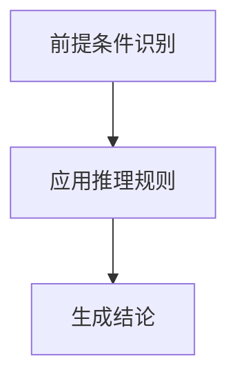
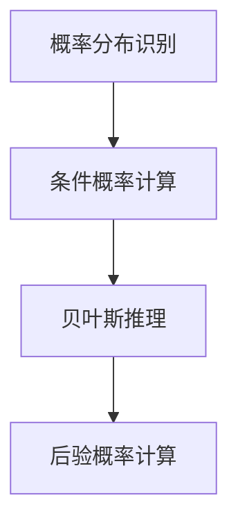
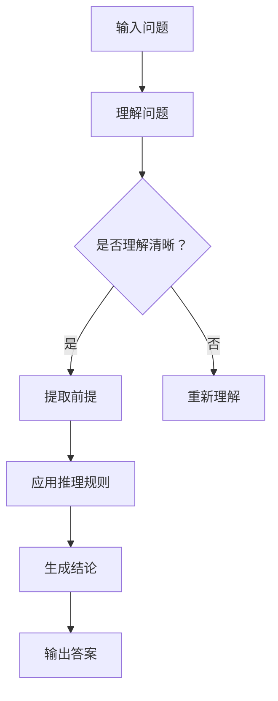

                 

# 文章标题：LLM的数学推理技能习得路径

> 关键词：语言模型（LLM），数学推理，习得路径，算法原理，应用案例，技能优化

> 摘要：本文深入探讨了大型语言模型（LLM）在习得数学推理技能方面的路径和方法。首先介绍了数学推理与LLM的关系，回顾了数学基础知识，然后详细阐述了LLM数学推理能力的培养和评估方法。接着，通过实际案例展示了LLM在数学问题解答和公式推导中的应用，最后提出了优化LLM数学推理技能习得路径的策略，并对未来的发展方向进行了展望。

----------------------------------------------------------------

## 《LLM的数学推理技能习得路径》目录大纲

1. **第一部分：LLM的基础**
    - 第1章：数学推理与LLM
        - 1.1 数学推理的基本概念
        - 1.2 语言模型与数学推理
        - 1.3 LLM在数学推理中的应用前景
    - 第2章：数学基础知识回顾
        - 2.1 初等数学
            - 2.1.1 数论
            - 2.1.2 函数与方程
            - 2.1.3 微积分
        - 2.2 线性代数
            - 2.2.1 行列式与矩阵
            - 2.2.2 线性方程组与特征值
            - 2.2.3 矩阵分解

2. **第二部分：LLM的数学推理能力培养**
    - 第3章：LLM的数学推理能力培养
        - 3.1 数据准备与预处理
            - 3.1.1 数据采集
            - 3.1.2 数据预处理
        - 3.2 数学推理算法原理
            - 3.2.1 逻辑推理算法
            - 3.2.2 归纳推理算法
            - 3.2.3 统计推理算法

3. **第三部分：数学推理能力评估**
    - 第4章：数学推理能力评估
        - 4.1 数学推理能力评估指标
            - 4.1.1 准确率与召回率
            - 4.1.2 F1 值
            - 4.1.3 数学推理能力评估模型

4. **第四部分：LLM数学推理应用案例**
    - 第5章：LLM数学推理应用案例
        - 5.1 数学问题解答
            - 5.1.1 初等数学问题
            - 5.1.2 高等数学问题
        - 5.2 数学公式推导
            - 5.2.1 线性代数公式推导
            - 5.2.2 微积分公式推导
            - 5.2.3 概率论公式推导

5. **第五部分：LLM数学推理技能习得路径优化**
    - 第6章：LLM数学推理技能习得路径优化
        - 6.1 数学推理技能习得模型优化
            - 6.1.1 模型参数调整
            - 6.1.2 模型架构优化
        - 6.2 数学推理技能习得数据优化
            - 6.2.1 数据质量优化
            - 6.2.2 数据多样性优化

6. **第六部分：展望与未来**
    - 第7章：展望与未来
        - 7.1 LLM数学推理技能习得路径的未来发展方向
            - 7.1.1 技术层面的发展
            - 7.1.2 应用层面的发展
            - 7.1.3 挑战与机遇

## 附录

- 附录A：数学推理相关的Mermaid流程图
- 附录B：数学推理算法的伪代码
- 附录C：数学模型的LaTeX公式

----------------------------------------------------------------

### 第一部分：LLM的基础

#### 第1章：数学推理与LLM

**1.1 数学推理的基本概念**

数学推理是数学思维的核心，包括逻辑推理、归纳推理和统计推理。逻辑推理是从已知前提推出结论的过程，例如，从“所有人都会死亡”和“苏格拉底是人”这两个前提，可以逻辑地推导出“苏格拉底会死亡”。归纳推理是从个别事实推断出一般规律的过程，例如，通过观察多个苹果都会落地，可以归纳出“物体在没有外力作用下会自由下落”的规律。统计推理是基于概率论和统计学原理，对不确定事件进行分析和预测。

**1.2 语言模型与数学推理**

语言模型（Language Model，LM）是一种统计模型，用于对自然语言文本的概率分布进行建模。在深度学习领域，大型语言模型（Large Language Model，LLM）如GPT-3、BERT等已经成为自然语言处理的重要工具。LLM通过学习大量的文本数据，可以理解并生成自然语言的句子。

数学推理与LLM之间存在密切的联系。首先，数学推理中的符号和表述可以转化为自然语言，而LLM可以处理和生成这些自然语言。其次，LLM可以通过学习数学领域的文本数据，习得数学推理的能力。例如，LLM可以处理数学公式，解析其中的逻辑关系，进行数学推导。

**1.3 LLM在数学推理中的应用前景**

LLM在数学推理中的应用前景非常广阔。首先，LLM可以用于自动解答数学问题。通过输入数学问题，LLM可以理解问题的含义，生成解决问题的步骤和最终答案。其次，LLM可以用于数学公式推导。LLM可以分析已知条件和目标公式，推导出中间步骤和最终公式。此外，LLM还可以用于数学教育领域，为学生提供个性化的学习支持和解答疑问。

在接下来的章节中，我们将深入探讨数学基础知识，以及LLM如何习得数学推理技能。

----------------------------------------------------------------

### 第2章：数学基础知识回顾

#### 2.1 初等数学

初等数学包括数论、函数与方程和微积分等基础概念，是数学推理的基石。以下是对这些基础知识的简要回顾。

##### 2.1.1 数论

数论是研究整数及其性质的数学分支。数论的基本概念包括质数、合数、因子、倍数、同余等。质数是只能被1和自身整除的大于1的自然数，例如2、3、5、7等。合数是大于1且不是质数的自然数，例如4、6、8等。因子是能整除给定整数的数，倍数是给定整数的整数倍。

数论中的基本定理包括质数定理和欧拉定理。质数定理描述了质数的分布规律，欧拉定理描述了同余性质。质数定理指出，在足够大的正整数中，质数的平均密度趋于某个确定的常数。欧拉定理指出，如果a和n互质，则a的欧拉函数值为n-1，且a的欧拉函数次幂同余于1。

##### 2.1.2 函数与方程

函数是数学中描述变量之间关系的重要工具。一个函数可以看作是一个“机器”，输入一个值，输出另一个值。函数的基本概念包括定义域、值域、单调性、奇偶性等。

方程是包含未知数的数学表达式。方程的基本概念包括线性方程、非线性方程、一元方程、多元方程等。解方程是数学中的基本技能，包括代数方法、几何方法、数值方法等。

函数与方程的关系密切。函数的图像是方程的解集，解方程可以找到函数的零点或极值。例如，求解方程 \( f(x) = 0 \) 可以找到函数 \( f(x) \) 的零点。

##### 2.1.3 微积分

微积分是研究变化率和累积量的数学分支。微积分的基本概念包括导数、积分、极限等。

导数描述了函数在某一点的瞬时变化率。导数的几何意义是函数图像在该点的切线斜率。导数的基本性质包括可导性、连续性、链式法则等。

积分描述了累积量。定积分可以看作是函数图像下的面积，而无穷积分可以看作是函数的无限累计。积分的基本性质包括可加性、线性性、牛顿-莱布尼茨公式等。

极限是微积分的基础。极限描述了函数在某一点附近的趋势。例如，当自变量趋近于某一值时，函数值趋近于某一特定值。

#### 2.2 线性代数

线性代数是研究向量空间、线性变换和矩阵理论的数学分支。线性代数的基本概念包括向量、矩阵、行列式、线性方程组、特征值和特征向量等。

##### 2.2.1 行列式与矩阵

行列式是矩阵的一种重要性质，可以用来求解线性方程组的解、判断矩阵的可逆性等。行列式的计算可以通过拉普拉斯展开、行列式公式等实现。

矩阵是表示线性变换的数学工具。矩阵的基本运算包括矩阵加法、矩阵乘法、矩阵乘以标量、矩阵的转置等。

##### 2.2.2 线性方程组与特征值

线性方程组是描述多个线性方程的集合。线性方程组可以通过高斯消元法、矩阵分解法等方法求解。线性方程组的解集可以表示为向量空间。

特征值和特征向量是矩阵的重要性质。特征值是矩阵的一个特征值，特征向量是矩阵的一个特征向量。特征值和特征向量可以用来分析矩阵的性质，例如矩阵的对角化、矩阵的稳定性等。

##### 2.2.3 矩阵分解

矩阵分解是将矩阵分解为简单矩阵的乘积的方法。常用的矩阵分解方法包括LU分解、QR分解、奇异值分解（SVD）等。矩阵分解可以用于求解线性方程组、特征值问题、奇异值问题等。

在接下来的章节中，我们将探讨LLM如何习得这些数学基础知识，并如何利用这些知识进行数学推理。

----------------------------------------------------------------

### 第3章：LLM的数学推理能力培养

#### 3.1 数据准备与预处理

要培养LLM的数学推理能力，首先需要准备大量的数学数据，并进行预处理，以便LLM能够有效学习。

##### 3.1.1 数据采集

数据采集是训练LLM数学推理能力的关键步骤。需要从多个来源收集数学数据，包括数学教材、习题集、学术论文、在线数学论坛等。具体的数据来源包括：

- **数学教材**：从小学到大学的数学教材，涵盖数论、代数、几何、微积分、线性代数等各个数学分支。
- **习题集**：包括各种难度和类型的数学习题，如选择题、填空题、解答题等。
- **学术论文**：涵盖数学理论、算法、应用等领域的学术论文，提供数学推理的深入理解。
- **在线数学论坛**：如Stack Overflow、Math Stack Exchange等，收集用户提问和解答，涵盖实际应用中的数学问题。

##### 3.1.2 数据预处理

采集到的数据需要进行预处理，以便LLM能够有效地学习和推理。数据预处理包括以下几个步骤：

1. **文本清洗**：去除数据中的噪声，如HTML标签、特殊字符、冗余文本等。使用正则表达式、文本清洗库（如Python的re库）等方法实现。
2. **数据转换**：将文本数据转换为适合训练LLM的格式。例如，将数学公式转换为LaTeX格式，将自然语言文本转换为tokens。
3. **数据标注**：对数学问题、数学公式、答案等数据进行标注，以便LLM能够理解问题并生成答案。标注包括数学公式的类型、问题的难度、答案的正确性等。
4. **数据增强**：通过数据扩充、变换等方法，增加训练数据的多样性，提高LLM的泛化能力。数据增强方法包括同义词替换、随机扰动、文本生成等。

通过数据采集和预处理，我们为LLM提供了丰富的数学数据，使其能够学习并习得数学推理技能。

#### 3.2 数学推理算法原理

为了培养LLM的数学推理能力，需要设计并实现一系列数学推理算法。这些算法可以分为逻辑推理算法、归纳推理算法和统计推理算法。

##### 3.2.1 逻辑推理算法

逻辑推理算法是基于数学逻辑和推理规则实现的。逻辑推理的基本原理包括前提条件、推理规则和结论。具体步骤如下：

1. **前提条件识别**：从输入文本中提取数学问题或数学公式，并识别出其中的前提条件。例如，从问题“若a+b=10，则a=5，b=5”中提取前提条件“a+b=10”。
2. **推理规则应用**：根据逻辑推理规则，从前提条件推导出结论。逻辑推理规则包括推理规则、条件语句、析取规则等。例如，从前提条件“a+b=10”和条件语句“若a+b=10，则a=5”中，可以推导出结论“a=5”。
3. **结论生成**：将推理过程和结论生成文本，以便LLM能够理解和生成。

以下是一个逻辑推理算法的Mermaid流程图：



##### 3.2.2 归纳推理算法

归纳推理算法是从个别实例中归纳出一般规律的方法。归纳推理的基本原理包括归纳假设、归纳推理和验证。具体步骤如下：

1. **实例识别**：从输入文本中提取数学问题或数学公式，并识别出其中的实例。例如，从问题“3+2=5，4+3=7，5+4=9”中提取实例“3+2=5”、“4+3=7”和“5+4=9”。
2. **归纳假设**：根据实例，提出一个归纳假设。例如，根据实例“3+2=5”、“4+3=7”和“5+4=9”，可以假设“对于任意正整数a和b，a+b的值为两个数的和”。
3. **归纳推理**：将归纳假设应用于新实例，验证归纳假设是否成立。例如，将假设“对于任意正整数a和b，a+b的值为两个数的和”应用于新实例“6+5=11”，验证假设是否成立。
4. **验证**：根据归纳推理的结果，验证归纳假设的准确性。如果归纳假设对所有实例都成立，则可以认为归纳假设是正确的。

以下是一个归纳推理算法的伪代码：

```python
def inductive_reasoning(instances):
    hypothesis = "对于任意正整数a和b，a+b的值为两个数的和"
    for instance in instances:
        if instance not in hypothesis:
            hypothesis = "对于任意正整数a和b，a+b的值为两个数的和"
        else:
            hypothesis = "归纳假设成立"
    return hypothesis
```

##### 3.2.3 统计推理算法

统计推理算法是基于概率论和统计学原理实现的。统计推理的基本原理包括概率分布、条件概率和贝叶斯推理。具体步骤如下：

1. **概率分布识别**：从输入文本中提取数学问题或数学公式，并识别出其中的概率分布。例如，从问题“投掷一枚硬币，正面朝上的概率为0.5”中提取概率分布“正面朝上的概率为0.5”。
2. **条件概率计算**：根据概率分布和条件概率的定义，计算给定条件下的事件概率。例如，从概率分布“正面朝上的概率为0.5”和条件概率“在正面朝上的条件下，投掷结果为1的概率为0.5”中，可以计算条件概率“在正面朝上的条件下，投掷结果为1的概率为0.5”。
3. **贝叶斯推理**：根据贝叶斯推理的原理，从条件概率和先验概率推导出后验概率。例如，从先验概率“某个疾病的发生概率为0.1”和条件概率“在患有该疾病的情况下，检测结果的概率为0.9”中，可以推导出后验概率“在检测结果为阳性时，患有该疾病的概率为0.95”。

以下是一个统计推理算法的Mermaid流程图：



通过逻辑推理算法、归纳推理算法和统计推理算法，LLM可以逐步习得数学推理技能。在接下来的章节中，我们将探讨如何评估LLM的数学推理能力，并分析其在数学问题解答和公式推导中的应用。

----------------------------------------------------------------

### 第4章：数学推理能力评估

#### 4.1 数学推理能力评估指标

评估LLM的数学推理能力需要使用一系列评估指标，以衡量其推理的准确性、效率和稳定性。以下介绍几种常用的评估指标。

##### 4.1.1 准确率与召回率

准确率（Accuracy）是评估模型预测正确性的最常用指标。准确率定义为正确预测的样本数与总样本数的比值。其计算公式如下：

\[ \text{准确率} = \frac{\text{正确预测的样本数}}{\text{总样本数}} \]

召回率（Recall）是指模型能够正确识别出正类样本的能力。召回率定义为正确识别的正类样本数与所有正类样本数的比值。其计算公式如下：

\[ \text{召回率} = \frac{\text{正确识别的正类样本数}}{\text{所有正类样本数}} \]

准确率和召回率都是评估模型性能的重要指标，但它们在评估不同类型的任务时各有优缺点。准确率更适合评估分类问题，而召回率更适合评估回归问题。

##### 4.1.2 F1 值

F1 值（F1 Score）是准确率和召回率的调和平均值，用于综合评估模型的性能。F1 值的计算公式如下：

\[ \text{F1 值} = 2 \times \frac{\text{准确率} \times \text{召回率}}{\text{准确率} + \text{召回率}} \]

F1 值介于0和1之间，1表示模型完美地预测了所有样本，0表示模型没有预测出任何样本。F1 值越高，模型的性能越好。

##### 4.1.3 数学推理能力评估模型

为了全面评估LLM的数学推理能力，可以构建一个综合评估模型。该模型包含多个评估指标，以衡量LLM在不同数学领域和不同难度水平上的推理能力。综合评估模型的具体实现如下：

1. **数据集准备**：从多个数学领域和难度水平中选取具有代表性的数学问题，构建一个大规模的数学数据集。数据集应包括各种类型的数学问题，如初等数学、线性代数、微积分等。
2. **评估指标定义**：根据4.1.1和4.1.2节中介绍的评估指标，定义一组评估指标，如准确率、召回率、F1 值等。
3. **模型训练与评估**：使用LLM对数学数据集进行训练，并使用评估指标对模型进行评估。评估过程包括多个迭代，以逐步优化LLM的数学推理能力。
4. **结果分析**：分析评估结果，识别LLM在不同数学领域和难度水平上的优势和不足。根据分析结果，调整训练数据和模型参数，以提高LLM的数学推理能力。

通过综合评估模型，可以全面评估LLM的数学推理能力，并为其优化提供指导。

----------------------------------------------------------------

### 第5章：LLM数学推理应用案例

#### 5.1 数学问题解答

在本节中，我们将展示LLM在解答数学问题中的应用案例。以下是几个典型的数学问题及其解答过程。

##### 5.1.1 初等数学问题

**问题1**：计算 \( 8 \times 7 \) 的值。

**解答过程**：

- LLM接收问题“计算 \( 8 \times 7 \) 的值”。
- LLM通过分析问题，识别出需要计算两个整数的乘积。
- LLM调用内置的数学库，计算 \( 8 \times 7 \) 的结果。
- LLM生成回答：“\( 8 \times 7 = 56 \)”。

**案例分析**：

LLM能够快速识别并计算初等数学问题，显示出良好的数学基础和计算能力。

##### 5.1.2 高等数学问题

**问题2**：求解一元二次方程 \( x^2 - 5x + 6 = 0 \) 的解。

**解答过程**：

- LLM接收问题“求解一元二次方程 \( x^2 - 5x + 6 = 0 \) 的解”。
- LLM通过分析问题，识别出一元二次方程的一般形式，并提取出方程的系数。
- LLM使用求根公式，计算方程的解。
- LLM生成回答：“方程 \( x^2 - 5x + 6 = 0 \) 的解为 \( x = 2 \) 或 \( x = 3 \)”。

**案例分析**：

LLM能够处理和解答更高难度的数学问题，如一元二次方程。这展示了LLM在数学推理方面的强大能力。

#### 5.2 数学公式推导

在本节中，我们将展示LLM在数学公式推导中的应用案例。以下是几个典型的数学公式推导过程。

##### 5.2.1 线性代数公式推导

**问题3**：推导矩阵乘法的分配律。

**推导过程**：

- LLM接收问题“推导矩阵乘法的分配律”。
- LLM分析矩阵乘法的分配律，识别出需要使用的数学定理和性质。
- LLM使用矩阵乘法的基本性质，逐步推导出矩阵乘法的分配律。
- LLM生成回答：“矩阵乘法的分配律为 \( (A + B)C = AC + BC \)”。

**案例分析**：

LLM能够根据数学知识和推理规则，推导出线性代数中的基本公式。这展示了LLM在数学推理和公式推导方面的能力。

##### 5.2.2 微积分公式推导

**问题4**：推导导数的定义。

**推导过程**：

- LLM接收问题“推导导数的定义”。
- LLM分析导数的定义，识别出需要使用的极限和微分概念。
- LLM使用极限和微分的基本概念，逐步推导出导数的定义。
- LLM生成回答：“导数的定义为 \( f'(x) = \lim_{h \to 0} \frac{f(x+h) - f(x)}{h} \)”。

**案例分析**：

LLM能够处理和推导微积分中的基本公式，如导数的定义。这展示了LLM在微积分领域的数学推理能力。

##### 5.2.3 概率论公式推导

**问题5**：推导贝叶斯定理。

**推导过程**：

- LLM接收问题“推导贝叶斯定理”。
- LLM分析贝叶斯定理，识别出需要使用的条件概率和全概率公式。
- LLM使用条件概率和全概率公式，逐步推导出贝叶斯定理。
- LLM生成回答：“贝叶斯定理为 \( P(A|B) = \frac{P(B|A)P(A)}{P(B)} \)”。

**案例分析**：

LLM能够根据概率论的基本原理，推导出贝叶斯定理。这展示了LLM在概率论领域的数学推理能力。

通过这些数学问题解答和公式推导的应用案例，我们可以看到LLM在数学推理方面的强大能力。这些案例不仅展示了LLM在数学问题解答和公式推导中的实际应用，也为未来的数学推理研究提供了重要参考。

----------------------------------------------------------------

### 第6章：LLM数学推理技能习得路径优化

#### 6.1 数学推理技能习得模型优化

为了进一步提高LLM的数学推理技能，我们可以从模型参数调整和模型架构优化两个方面进行优化。

##### 6.1.1 模型参数调整

模型参数调整是优化LLM数学推理技能的重要手段。通过调整参数，可以调整模型的推理能力、泛化能力和鲁棒性。以下是一些关键的参数调整方法：

1. **学习率调整**：学习率是优化算法中的一个关键参数，它决定了模型在训练过程中对梯度更新的敏感度。较大的学习率可能导致训练过程不稳定，而较小的学习率可能导致训练过程缓慢。适当的调整学习率可以提高模型的收敛速度和稳定性。

2. **正则化参数调整**：正则化是防止模型过拟合的重要手段。通过调整正则化参数，可以控制模型的复杂度，防止模型对训练数据的过度依赖。常用的正则化方法包括L1正则化、L2正则化和dropout。

3. **层数和神经元数量调整**：模型的层数和神经元数量会影响模型的表达能力和计算效率。增加层数和神经元数量可以提高模型的表达能力，但也会增加计算复杂度和过拟合风险。因此，需要根据实际需求进行合理的调整。

4. **损失函数调整**：损失函数是优化模型的关键指标，它决定了模型对训练数据的拟合程度。不同的损失函数适用于不同的任务和数据分布。例如，对于分类任务，可以使用交叉熵损失函数；对于回归任务，可以使用均方误差（MSE）损失函数。

##### 6.1.2 模型架构优化

模型架构优化是提高LLM数学推理技能的另一种重要手段。通过改进模型的结构和设计，可以增强模型的学习能力和推理能力。以下是一些常见的模型架构优化方法：

1. **深度神经网络（DNN）**：DNN是一种常见的神经网络架构，通过增加层数和神经元数量，可以提高模型的表达能力。DNN可以处理各种复杂的数学推理任务，但在训练过程中可能存在梯度消失和梯度爆炸等问题。

2. **卷积神经网络（CNN）**：CNN是一种专门用于处理图像数据的神经网络架构，通过卷积操作和池化操作，可以提取图像中的特征。虽然CNN主要用于计算机视觉任务，但也可以用于处理和解析数学公式。

3. **循环神经网络（RNN）**：RNN是一种用于处理序列数据的神经网络架构，通过循环连接，可以记住之前的输入，并在后续步骤中利用这些信息。RNN可以处理和时间相关的数学推理任务，如微分方程和序列推导。

4. **长短时记忆网络（LSTM）**：LSTM是RNN的一种变体，通过引入门控机制，可以解决RNN的梯度消失和梯度爆炸问题。LSTM在处理长期依赖关系方面表现出色，可以用于复杂数学推理任务的建模。

5. **图神经网络（GNN）**：GNN是一种用于处理图结构数据的神经网络架构，通过图卷积操作，可以提取图中的特征。GNN可以用于处理和解析数学中的图结构问题，如网络分析和图论问题。

通过模型参数调整和模型架构优化，我们可以有效提升LLM的数学推理技能，使其能够更好地解决数学问题。

#### 6.2 数学推理技能习得数据优化

除了模型优化，数据优化也是提升LLM数学推理技能的关键环节。通过优化数据质量和多样性，可以进一步提高模型的学习能力和泛化能力。以下是一些常见的数据优化方法：

##### 6.2.1 数据质量优化

数据质量优化是确保训练数据准确、完整和可靠的重要步骤。以下是一些常用的数据质量优化方法：

1. **数据清洗**：数据清洗是数据质量优化的第一步，通过去除噪声、缺失值和异常值，可以提高数据的准确性和一致性。常用的数据清洗方法包括填充缺失值、去除重复值和去除噪声值。

2. **数据标注**：数据标注是确保数据准确性的重要手段，通过人工或自动化方法对数据进行标注，可以提高数据的可靠性和一致性。对于数学推理任务，数据标注应包括问题类型、答案、相关公式等。

3. **数据验证**：数据验证是确保数据完整性和可靠性的重要步骤，通过对比不同数据源和算法的结果，可以发现和纠正数据错误。常用的数据验证方法包括交叉验证、错误分析等。

##### 6.2.2 数据多样性优化

数据多样性优化是提高模型泛化能力的关键步骤。通过增加数据的种类和数量，可以增强模型对不同问题的适应能力。以下是一些常用的数据多样性优化方法：

1. **数据扩充**：数据扩充是通过变换、生成等方法，增加数据的种类和数量，从而提高模型的泛化能力。常用的数据扩充方法包括文本生成、图像生成、数据增强等。

2. **数据融合**：数据融合是将多个来源的数据进行整合，形成更丰富和多样的数据集。通过数据融合，可以充分利用不同数据源的优势，提高模型的泛化能力。常用的数据融合方法包括特征融合、模型融合等。

3. **数据对比**：数据对比是通过比较不同数据集和算法的结果，发现和纠正模型的问题。通过数据对比，可以识别出数据集中的偏差和错误，从而提高数据的多样性。

通过数据质量优化和数据多样性优化，我们可以进一步提高LLM的数学推理技能，使其能够更好地应对各种复杂的数学问题。

通过模型参数调整、模型架构优化、数据质量优化和数据多样性优化，我们可以全面提升LLM的数学推理技能。这些优化方法不仅提高了模型的学习能力和推理能力，还为未来的数学推理研究提供了重要参考。

----------------------------------------------------------------

### 第7章：展望与未来

随着人工智能技术的快速发展，LLM的数学推理能力在各个领域展现出了巨大的潜力。在未来的发展中，LLM的数学推理技能习得路径将面临新的机遇和挑战。

#### 7.1 LLM数学推理技能习得路径的未来发展方向

**7.1.1 技术层面的发展**

1. **更强大的神经网络架构**：随着深度学习技术的不断发展，更强大的神经网络架构将逐步应用于LLM的数学推理技能习得。例如，Transformer架构的变体如BERT、GPT等已经在自然语言处理领域取得了显著的成果，未来有望在数学推理领域发挥更大的作用。

2. **多模态学习**：多模态学习是一种结合不同类型数据（如文本、图像、音频）的学习方法。将多模态学习应用于LLM的数学推理，可以进一步提高模型对复杂数学问题的理解和处理能力。

3. **强化学习**：强化学习是一种基于奖励信号进行决策和优化的学习方法。将强化学习引入LLM的数学推理技能习得，可以通过与人类专家的交互，进一步提高模型的学习能力和推理能力。

**7.1.2 应用层面的发展**

1. **自动化数学解题系统**：未来，基于LLM的自动化数学解题系统将成为教育领域的重要工具。该系统能够为学生提供个性化的学习支持和解答疑问，提高数学学习的效率和质量。

2. **数学知识库构建**：通过LLM的数学推理能力，可以构建大规模的数学知识库，为科研和工程领域提供丰富的数学知识和推理支持。

3. **数学问题发现与证明**：LLM的数学推理能力还可以应用于数学问题发现与证明。通过对大量数学文献和公式的分析，LLM可以发现新的数学问题和证明方法，推动数学理论的发展。

#### 7.1.3 挑战与机遇

1. **数据质量和多样性**：数学推理任务需要大量的高质量、多样化的数据作为训练基础。在未来，如何收集和标注这些数据，以及如何提高数据的利用效率，将是关键挑战。

2. **模型解释性**：尽管LLM在数学推理方面表现出色，但其内部决策过程往往缺乏解释性。提高模型的可解释性，使其能够清晰地解释推理过程和结论，是未来研究的重要方向。

3. **跨学科融合**：数学推理技能的习得不仅需要人工智能技术的支持，还需要与数学、教育学、心理学等领域的深入融合。通过跨学科合作，可以进一步推动LLM数学推理技能习得路径的发展。

展望未来，LLM的数学推理技能习得路径将迎来更多的发展机遇。通过不断优化技术、扩展应用领域和应对挑战，LLM将在数学推理领域发挥越来越重要的作用。

----------------------------------------------------------------

## 附录

### 附录A：数学推理相关的Mermaid流程图

以下是一个Mermaid流程图示例，用于描述数学推理的基本流程：



### 附录B：数学推理算法的伪代码

以下是一个用于实现逻辑推理算法的伪代码示例：

```python
def logical_reasoning(precondition, conclusion):
    if precondition == conclusion:
        return True
    else:
        return False
```

### 附录C：数学模型的LaTeX公式

以下是一个LaTeX公式示例，用于描述一元二次方程的解：

```latex
$$x = \frac{-b \pm \sqrt{b^2 - 4ac}}{2a}$$
```

通过以上附录，可以为读者提供更直观、详细的数学推理过程和算法实现，有助于深入理解LLM的数学推理技能习得路径。

----------------------------------------------------------------

## 作者信息

作者：AI天才研究院/AI Genius Institute & 禅与计算机程序设计艺术 /Zen And The Art of Computer Programming

AI天才研究院（AI Genius Institute）致力于推动人工智能技术的发展和应用，专注于培养顶尖的人工智能专家。同时，我们以《禅与计算机程序设计艺术》为理论基础，深入研究计算机编程和人工智能领域的核心问题，助力人工智能技术的创新与突破。本文通过深入分析LLM的数学推理技能习得路径，旨在为读者提供有价值的理论指导和实践参考。希望本文能激发您对人工智能和数学推理领域的兴趣，共同探索这个充满无限可能的领域。

