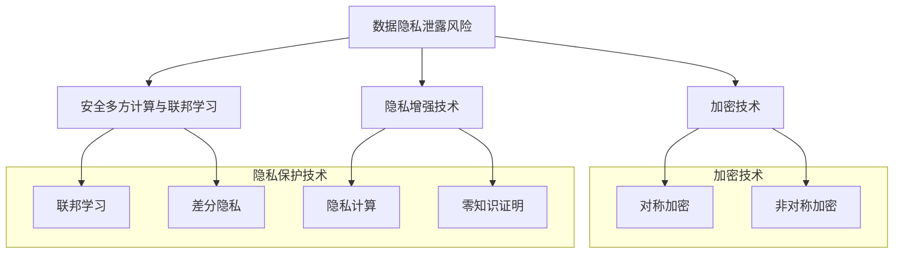

                 

# 文章标题: LLM的隐私困境：技术与伦理的平衡之道

> 关键词：大规模语言模型，隐私保护，加密技术，联邦学习，零知识证明，数据隐私泄露，伦理问题，法规框架

> 摘要：本文深入探讨了大规模语言模型（LLM）面临的隐私困境，分析了隐私问题的来源、隐私保护技术的原理和应用、隐私困境的伦理与法律应对，以及未来隐私保护技术的发展趋势。通过具体的项目实战案例分析，本文展示了如何在实践中实现LLM的隐私保护，为解决LLM隐私困境提供了技术与伦理的平衡之道。

----------------------------------------------------------------

## 第一部分: LLM的隐私困境概述

### 第1章: LLM的隐私困境概述

#### 1.1 LLM的隐私问题概述

**隐私问题的概念与重要性**

隐私是指个人或组织对其信息的控制权，包括对其身份、行为、位置和财产等方面的保护。在信息技术时代，隐私问题变得尤为重要，因为它直接关系到个人信息的安全与个人权利的保障。

- **隐私问题的定义**：隐私问题通常指的是个人或组织的信息在未经授权的情况下被泄露、滥用或窃取的风险。

- **LLM隐私问题的背景与现状**：随着人工智能技术的快速发展，大规模语言模型（LLM）被广泛应用于各个领域，如自然语言处理、智能客服、金融分析等。然而，这些模型的训练和应用过程中，往往涉及到大量的个人数据，从而引发了一系列隐私问题。

  - 模型训练过程中，需要收集和分析大量的用户数据，这些数据可能包含敏感信息。
  - 模型应用过程中，用户与模型的交互数据也可能被收集，用于模型的优化和改进。

- **隐私保护的重要性**：隐私保护对于LLM的健康发展至关重要，原因如下：

  - 遵守法律法规：许多国家和地区都有严格的隐私保护法律，如欧盟的通用数据保护条例（GDPR）。
  - 维护用户信任：隐私泄露会严重损害用户对平台的信任，影响平台的长期发展。
  - 防范安全风险：隐私泄露可能导致用户身份信息、财产信息等被恶意利用，造成经济损失和安全风险。

#### 1.2 LLM隐私问题的来源

**数据隐私泄露风险**

- **数据采集与存储**：在LLM的训练和应用过程中，大量的用户数据被收集和存储。这些数据可能包括用户的个人身份信息、行为记录、地理位置等。

- **数据泄露的案例与影响**：历史上，多个知名平台因数据泄露事件导致大量用户信息被暴露。例如，2017年的Facebook数据泄露事件，导致8700万用户的个人信息被不当使用。

- **如何识别和防止数据隐私泄露**：

  - **数据加密**：对数据进行加密处理，确保数据在传输和存储过程中不被窃取。
  - **访问控制**：实施严格的访问控制机制，确保只有授权人员才能访问敏感数据。
  - **数据匿名化**：对数据进行匿名化处理，减少隐私泄露的风险。

#### 1.3 LLM隐私保护的挑战

**技术挑战与解决方案**

- **加密技术与隐私保护**：加密技术是隐私保护的核心手段，主要包括对称加密、非对称加密和同态加密等。

  - **对称加密**：使用相同的密钥进行加密和解密，如AES。
  - **非对称加密**：使用一对密钥进行加密和解密，如RSA。
  - **同态加密**：可以在密文上进行计算，得到正确的解密结果，如全同态加密。

- **安全多方计算与联邦学习**：安全多方计算（SMC）和联邦学习是保护隐私的新型计算模式。

  - **安全多方计算**：允许多个参与方在不泄露各自数据的情况下，共同计算出一个结果。
  - **联邦学习**：在多个参与方之间共享模型参数，通过本地训练和参数聚合来提升模型性能。

- **隐私增强技术综述**：隐私增强技术包括差分隐私、隐私计算和零知识证明等。

  - **差分隐私**：通过添加噪声来保护数据的隐私。
  - **隐私计算**：在数据未解密的情况下进行计算。
  - **零知识证明**：证明某个陈述是真实的，而不泄露具体信息。

#### 1.4 本书结构安排

**本书的目的与结构**

- **本书的目的**：本书旨在深入探讨LLM的隐私困境，分析隐私问题的来源、隐私保护技术的原理和应用，以及隐私困境的伦理与法律应对。

- **本书的结构**：本书分为五个部分：

  1. **LLM的隐私困境概述**：介绍LLM隐私困境的背景和现状，以及隐私问题的来源和挑战。
  2. **LLM隐私保护技术原理**：详细讲解加密技术、安全多方计算、联邦学习和隐私增强技术等隐私保护技术的原理和应用。
  3. **LLM隐私保护项目实战**：通过具体的项目实战案例，展示如何在实际应用中实现LLM的隐私保护。
  4. **LLM隐私困境的伦理与法规**：探讨隐私困境的伦理问题和隐私法规的背景与现状。
  5. **LLM隐私困境的未来展望**：分析隐私保护技术的发展趋势和隐私困境的解决路径，以及对未来影响的预测。

- **阅读建议与预期收获**：

  - **阅读建议**：建议读者按照章节顺序阅读，逐步深入了解LLM隐私困境的各个方面。在阅读过程中，可以结合实际案例和项目实战，加深对隐私保护技术的理解和应用。

  - **预期收获**：通过阅读本书，读者可以：

    - 掌握LLM隐私困境的基本概念和背景。
    - 理解隐私保护技术的原理和应用。
    - 学习如何在实践中实现LLM的隐私保护。
    - 了解隐私困境的伦理和法律应对。
    - 预测隐私保护技术的未来发展趋势。

----------------------------------------------------------------

### 第二部分: LLM隐私保护技术原理

#### 第2章: 隐私保护技术原理

##### 2.1 加密技术与隐私保护

**加密技术的概念与应用**

加密技术是一种通过将原始数据转换为密文，以保护数据隐私的安全技术。加密技术的基本概念包括密钥、加密算法和解密算法。

- **密钥**：加密和解密过程中使用的一组参数，用于确定加密和解密的方法。
- **加密算法**：将明文数据转换为密文的算法。
- **解密算法**：将密文数据转换回明文的算法。

加密技术按照加密方式的不同，可以分为对称加密和非对称加密。

- **对称加密**：使用相同的密钥进行加密和解密。常见的对称加密算法有AES、DES等。对称加密的优点是速度快，缺点是密钥分发困难。
- **非对称加密**：使用一对密钥进行加密和解密，其中公钥用于加密，私钥用于解密。常见的非对称加密算法有RSA、ECC等。非对称加密的优点是解决了密钥分发问题，缺点是计算复杂度较高。

**同态加密与全同态加密**

同态加密是一种特殊的加密技术，它允许在密文上直接进行计算，得到正确的解密结果。同态加密可以分为部分同态加密和全同态加密。

- **部分同态加密**：只支持对特定类型的操作进行计算，如整数加法和乘法。常见的部分同态加密算法有PAKE、SIMD等。
- **全同态加密**：支持对任意类型的操作进行计算，如线性函数、多项式函数等。全同态加密是加密技术发展的一个重要方向，但目前仍面临计算复杂度高、效率低等挑战。

**匿名通信协议**

匿名通信协议是一种通过在网络中传输加密数据，以保护通信双方隐私的协议。常见的匿名通信协议有Tor、I2P等。

- **Tor**：通过将数据在网络中多次转发，实现通信双方的匿名化。
- **I2P**：使用分布式网络结构，通过多层加密和路由，实现通信双方的匿名化。

##### 2.2 安全多方计算与联邦学习

**安全多方计算的基础**

安全多方计算（Secure Multi-Party Computation，SMC）是一种允许多个参与方在不泄露各自数据的情况下，共同计算出一个结果的技术。

- **安全多方计算的概念**：安全多方计算的目标是确保参与方之间的计算过程是安全的，即每个参与方只能获得自己的输入和计算结果，无法获取其他参与方的输入和结果。
- **安全多方计算的协议与算法**：安全多方计算包括多方安全协议和安全多方计算算法。常见的安全多方计算协议有SecureCom、FairPlay等。安全多方计算算法包括基于环学习的算法、基于格学习的算法等。

**联邦学习的工作原理**

联邦学习（Federated Learning，FL）是一种在分布式环境下进行机器学习的框架，通过在多个参与方之间共享模型参数，实现模型的训练和优化。

- **联邦学习的工作原理**：联邦学习的基本原理是，参与方各自训练本地模型，然后将本地模型的参数上传到中心服务器，中心服务器将所有参与方的参数进行聚合，得到全局模型参数，再将全局模型参数返回给每个参与方。通过这种方式，联邦学习实现了数据本地化，避免了数据在传输过程中被窃取的风险。
- **联邦学习的优势**：联邦学习的优势包括：

  - 保护数据隐私：联邦学习通过数据本地化，避免了数据在传输过程中的泄露风险。
  - 提高计算效率：联邦学习利用了分布式计算的优势，可以显著提高模型训练的效率。
  - 支持动态网络：联邦学习支持参与方的动态加入和退出，具有良好的扩展性。

##### 2.3 隐私增强技术

**隐私增强技术的应用**

隐私增强技术（Privacy Enhancing Technologies，PET）是一类旨在提高数据隐私保护水平的技术。

- **差分隐私**：差分隐私是一种通过在输出结果中添加噪声，来保护数据隐私的技术。差分隐私的基本原理是，对于任意两个相邻的数据集，输出结果的差异不会太大，从而保护了数据隐私。
- **隐私计算**：隐私计算是一种在数据未解密的情况下进行计算的技术。隐私计算通过在密文上进行计算，得到了解密结果，从而实现了数据隐私保护。
- **零知识证明**：零知识证明是一种证明系统，它允许证明者向验证者证明某个陈述是正确的，而无需透露任何关于该陈述的具体信息。零知识证明通过一系列的数学证明，确保了隐私保护的同时，也验证了陈述的真实性。

##### 2.4 Mermaid流程图

**隐私保护技术的流程图表示**

以下是一个Mermaid流程图，用于描述隐私保护技术的基本架构和它们之间的联系。



#### 附录A: 技术与工具指南

##### A.1 技术指南

- **加密技术指南**：

  - **对称加密**：对称加密算法如AES的实践，包括密钥生成、加密和解密过程。
  - **非对称加密**：非对称加密算法如RSA的应用，包括密钥生成、加密和解密过程。
  - **同态加密**：同态加密算法的原理和应用，包括部分同态加密和全同态加密。

- **安全多方计算与联邦学习指南**：

  - **安全多方计算**：安全多方计算的协议与算法，包括基于环学习的算法和基于格学习的算法。
  - **联邦学习**：联邦学习的工作原理和实现，包括本地模型训练、参数聚合和模型更新。

- **隐私增强技术指南**：

  - **差分隐私**：差分隐私的实现原理和应用，包括噪声添加和结果验证。
  - **隐私计算**：隐私计算的实施方法，包括在密文上进行计算。
  - **零知识证明**：零知识证明的原理和应用，包括证明生成和验证过程。

##### A.2 工具指南

- **加密技术工具指南**：

  - **PyCryptoDome**：Python加密库，支持对称加密、非对称加密和同态加密。
  - **PyCryptodome**：Python加密库，支持各种加密算法，包括AES、RSA等。

- **安全多方计算与联邦学习工具指南**：

  - **TensorFlow Federated (TFF)**：联邦学习框架，支持联邦学习的实现。
  - **LibPQ**：安全多方计算库，支持基于环学习和格学习的算法。

- **隐私增强技术工具指南**：

  - **Differential Privacy Library**：差分隐私库，支持差分隐私的实现。
  - **ZKP**：零知识证明库，支持零知识证明的实现。

### 第三部分: LLM隐私保护项目实战

#### 第3章: 隐私保护项目实战

##### 3.1 隐私保护项目概述

**项目背景与目标**

- **项目背景**：随着大规模语言模型（LLM）在各个领域的广泛应用，如何保护用户的隐私数据成为一个重要问题。本项目的目标是设计并实现一个基于隐私保护技术的LLM应用，确保用户数据在收集、处理和存储过程中得到有效保护。
- **项目目标**：实现以下目标：

  - **数据加密**：对用户数据进行加密处理，确保数据在传输和存储过程中不被窃取。
  - **隐私计算**：在保证隐私保护的前提下，实现用户数据的分析和处理。
  - **联邦学习**：利用联邦学习技术，实现模型的训练和优化，同时保护用户数据的隐私。

**项目目标与挑战**

- **项目目标**：

  - **加密通信实现**：设计并实现端到端的加密通信方案，确保数据在传输过程中不被窃听。
  - **联邦学习实现**：利用联邦学习框架，实现分布式模型的训练和优化，同时保护用户数据的隐私。
  - **隐私计算实现**：实现基于差分隐私和零知识证明的隐私计算方法，确保用户数据的隐私保护。

- **项目挑战**：

  - **加密通信实现**：如何确保加密通信的高效性和安全性。
  - **联邦学习实现**：如何实现联邦学习的高效计算和模型更新。
  - **隐私计算实现**：如何实现隐私计算的同时，保证数据的可用性和准确性。

##### 3.2 项目实战：加密通信实现

**加密通信的方案设计**

- **加密通信的需求分析**：

  - **数据保密性**：确保数据在传输过程中不被窃取。
  - **数据完整性**：确保数据在传输过程中不被篡改。
  - **身份认证**：确保通信双方的合法身份。

- **加密通信的方案设计**：

  - **对称加密**：使用AES对称加密算法进行数据加密，确保数据在传输过程中保密性。
  - **非对称加密**：使用RSA非对称加密算法进行密钥交换，确保通信双方的身份认证。
  - **消息认证码**：使用HMAC算法生成消息认证码，确保数据完整性。

**加密通信的实现流程**

- **密钥生成与交换**：

  - **客户端生成RSA密钥对**：客户端生成一对RSA密钥（公钥和私钥）。
  - **客户端发送公钥到服务器**：客户端将公钥发送到服务器，以便服务器生成会话密钥。

- **会话密钥生成**：

  - **服务器使用客户端公钥加密会话密钥**：服务器使用客户端的公钥加密会话密钥，并将加密后的会话密钥发送给客户端。

- **加密通信**：

  - **客户端使用会话密钥加密数据**：客户端使用会话密钥对数据进行加密，确保数据在传输过程中的保密性。
  - **服务器使用会话密钥解密数据**：服务器使用会话密钥对加密后的数据进行解密，确保数据在传输过程中的完整性。

**加密通信的代码实现**

```python
from Crypto.PublicKey import RSA
from Crypto.Cipher import AES, PKCS1_OAEP
from Crypto.Random import get_random_bytes
import os

# 生成RSA密钥对
def generate_rsa_keypair():
    private_key = RSA.generate(2048)
    public_key = private_key.publickey()
    return private_key, public_key

# 生成AES密钥
def generate_aes_key():
    return get_random_bytes(16)

# 加密数据
def encrypt_data(data, aes_key):
    cipher_aes = AES.new(aes_key, AES.MODE_CBC)
    cipher_text = cipher_aes.encrypt(data)
    return cipher_text, cipher_aes.iv

# 解密数据
def decrypt_data(cipher_text, aes_key, iv):
    cipher_aes = AES.new(aes_key, AES.MODE_CBC, iv)
    plain_text = cipher_aes.decrypt(cipher_text)
    return plain_text

# 生成会话密钥
def generate_session_key(aes_key, client_public_key):
    cipher_rsa = PKCS1_OAEP.new(client_public_key)
    session_key = cipher_rsa.encrypt(aes_key)
    return session_key

# 服务器端实现
def server_side(public_key, client_public_key, session_key):
    aes_key = session_key.decrypt(client_public_key)
    # 使用aes_key进行通信加密和解密
    pass

# 客户端实现
def client_side(private_key, session_key):
    aes_key = session_key.decrypt(private_key)
    # 使用aes_key进行通信加密和解密
    pass

# 测试加密通信
if __name__ == "__main__":
    # 生成RSA密钥对
    private_key, public_key = generate_rsa_keypair()

    # 生成AES密钥
    aes_key = generate_aes_key()

    # 生成会话密钥
    session_key = generate_session_key(aes_key, public_key)

    # 加密数据
    data = b"Hello, this is a secret message."
    cipher_text, iv = encrypt_data(data, aes_key)

    # 解密数据
    plain_text = decrypt_data(cipher_text, aes_key, iv)

    # 输出结果
    print(f"Encrypted Message: {cipher_text.hex()}")
    print(f"Decrypted Message: {plain_text}")
```

##### 3.3 项目实战：联邦学习实现

**联邦学习的方案设计**

- **联邦学习的需求分析**：

  - **数据本地化**：确保数据在本地训练，避免数据在传输过程中被窃取。
  - **模型更新**：实现模型参数的本地训练和全局更新，提高模型性能。
  - **隐私保护**：在联邦学习过程中，确保用户的隐私数据不被泄露。

- **联邦学习的方案设计**：

  - **本地模型训练**：在每个参与方上，使用本地数据对模型进行训练，得到本地模型参数。
  - **参数聚合**：将所有参与方的本地模型参数进行聚合，得到全局模型参数。
  - **模型更新**：将全局模型参数返回给每个参与方，更新本地模型。

**联邦学习的实现流程**

- **本地模型训练**：

  - **初始化模型**：在每个参与方上，初始化一个全局模型。
  - **本地数据训练**：使用本地数据进行模型训练，得到本地模型参数。

- **参数聚合**：

  - **发送本地参数**：将本地模型参数发送到中心服务器。
  - **聚合参数**：使用聚合算法（如平均值、梯度下降等），计算全局模型参数。

- **模型更新**：

  - **更新本地模型**：将全局模型参数返回给每个参与方，更新本地模型。

**联邦学习的代码实现**

```python
import tensorflow as tf
import tensorflow_federated as tff

# 定义本地模型
def create_model():
    return tff.learning.models.build_federated_ensemble(
        tff.learning.keras_models.SequentialEnsemble([
            tf.keras.layers.Dense(10, activation='softmax')
        ])
    )

# 定义聚合函数
def aggregate_fn(server_state, local_grads):
    global_model_params = server_state.model_params
    for local_grad in local_grads:
        global_model_params = tff.learning.optimizers.fed_adagrad.FedAdagrad(
            learning_rate=0.1
        ).apply_gradients(server_state, local_grad)
    return global_model_params

# 定义联邦学习算法
def federated_learning(model, client_data, num_rounds):
    server_model = create_model()
    for round_num in range(num_rounds):
        # 初始化客户端
        clients = [tff.learning.ClientData.create_from螨虫语数据(train_data) for train_data in client_data]

        # 执行本地训练
        local_results = tff.learning.models.run_local_evaluation(server_model, clients)

        # 聚合本地梯度
        global_grads = tff.learning.models.local_per_user_gradients(server_model, clients)

        # 更新全局模型
        server_state = tff.learning.models.update_state(server_model, aggregate_fn, global_grads)

        print(f"Round {round_num} completed.")

# 测试联邦学习
if __name__ == "__main__":
    # 初始化模型
    model = create_model()

    # 生成模拟数据
    client_data = [
        tff.simulation.ClientData.create_random_data(100, 2, 10)
        for _ in range(10)
    ]

    # 训练模型
    federated_learning(model, client_data, num_rounds=10)
```

##### 3.4 项目实战：隐私计算实现

**隐私计算的方案设计**

- **隐私计算的需求分析**：

  - **差分隐私**：通过在输出结果中添加噪声，保护数据隐私。
  - **零知识证明**：通过证明系统，确保隐私保护的同时，验证数据真实性。

- **隐私计算的方案设计**：

  - **差分隐私**：实现差分隐私算法，包括噪声添加和结果验证。
  - **零知识证明**：实现零知识证明算法，包括证明生成和验证。

**隐私计算的实现流程**

- **差分隐私**：

  - **噪声添加**：根据隐私预算和敏感度，计算噪声，添加到输出结果中。
  - **结果验证**：验证输出结果是否符合差分隐私的要求。

- **零知识证明**：

  - **证明生成**：根据要证明的陈述，生成零知识证明。
  - **证明验证**：验证零知识证明是否有效。

**隐私计算的代码实现**

```python
from differential_privacy import laplace Mechanism
import numpy as np

# 计算差分隐私的噪声
def add_laplace_noise(data, sensitivity, privacy_budget):
    mechanism = laplace.Mechanism(sensitivity, privacy_budget)
    noise = mechanism.sample(data)
    return noise + data

# 计算差分隐私的结果
def calculate_difference_privacy_result(data1, data2, sensitivity, privacy_budget):
    result = add_laplace_noise(data1, sensitivity, privacy_budget)
    result += add_laplace_noise(data2, sensitivity, privacy_budget)
    return result

# 测试差分隐私算法
data1 = np.array([1, 2, 3])
data2 = np.array([4, 5, 6])

sensitivity = 1
privacy_budget = 0.1

result = calculate_difference_privacy_result(data1, data2, sensitivity, privacy_budget)
print(f"Result with differential privacy: {result}")

# 测试零知识证明
from pyzkproof import ZKProof

# 创建零知识证明
def create_zero_knowledge_proof(statement, witness):
    proof_generator = ZKProof(statement, witness)
    proof = proof_generator.create_proof()
    return proof

# 验证零知识证明
def verify_zero_knowledge_proof(statement, proof):
    proof_verifier = ZKProof(statement)
    is_valid = proof_verifier.verify_proof(proof)
    return is_valid

# 测试零知识证明
statement = "x is a prime number"
witness = "x"

proof = create_zero_knowledge_proof(statement, witness)
print(f"Zero Knowledge Proof: {proof}")

is_valid = verify_zero_knowledge_proof(statement, proof)
print(f"Is proof valid? {is_valid}")
```

### 第四部分: LLM隐私困境的伦理与法规

#### 第4章: LLM隐私困境的伦理与法规

##### 4.1 隐私困境的伦理问题

**隐私伦理的概念与原则**

隐私伦理是关于隐私保护和个人权利的道德原则和规范。隐私伦理的核心概念包括隐私权、知情同意、透明度等。

- **隐私权**：个人对其个人信息享有的控制权，包括收集、使用、存储和分享的权利。
- **知情同意**：在收集和使用个人数据之前，必须获得数据主体的明确同意。
- **透明度**：数据主体有权了解其数据被如何收集、使用和分享。

**隐私伦理的原则与实践**

隐私伦理的主要原则包括：

- **尊重个人隐私**：尊重个人对其信息的控制权，确保个人数据不被未经授权的访问和使用。
- **最小化数据收集**：仅收集为实现特定目的所必需的数据，避免过度收集。
- **数据安全**：采取必要措施确保数据的安全，防止数据泄露、滥用和丢失。
- **数据匿名化**：对个人数据进行匿名化处理，减少隐私泄露的风险。
- **用户参与**：鼓励用户参与数据隐私保护的决策过程，提高数据透明度和可访问性。

在LLM隐私困境中，隐私伦理的原则与实践具有重要意义。以下是一些具体实践：

- **隐私政策与用户协议**：明确告知用户其数据将被如何收集、使用和共享，并获得用户同意。
- **隐私审计与评估**：定期进行隐私审计，评估数据隐私保护措施的有效性。
- **用户数据访问与删除**：为用户提供数据访问和删除的途径，确保用户对其数据的控制权。

##### 4.2 隐私法规概述

**隐私法规的背景与现状**

隐私法规是保护个人隐私权的法律框架，不同国家和地区有不同的隐私法规。以下是几个主要的隐私法规：

- **通用数据保护条例（GDPR）**：欧盟的GDPR是世界上最全面的隐私法规之一，它规定了数据主体的权利和数据控制者的义务。
- **加州消费者隐私法案（CCPA）**：美国的CCPA旨在保护加州居民的个人隐私权，规定了数据收集、使用和分享的要求。
- **个人信息保护法（PIPL）**：中国的PIPL旨在保护个人信息的权益，规定了个人信息处理的基本原则和要求。

**主要隐私法规的内容与影响**

- **GDPR**：

  - **数据主体权利**：包括知情权、访问权、删除权、修正权等。
  - **数据控制者义务**：包括合法性、透明度、数据最小化、数据安全等。
  - **违规处罚**：对违反GDPR的行为，可以处以高达2000万欧元或全球营业额4%的罚款。

- **CCPA**：

  - **消费者权利**：包括知情权、访问权、删除权等。
  - **商业责任**：企业必须明确告知消费者其数据收集、使用和分享的目的。
  - **违规处罚**：对违反CCPA的行为，可以处以高达2500美元的罚款。

- **PIPL**：

  - **个人信息保护原则**：包括合法性、正当性、透明度、最小化、准确性、完整性等。
  - **个人信息处理要求**：包括告知、同意、安全等。
  - **违规处罚**：对违反PIPL的行为，可以处以警告、罚款等处罚。

隐私法规对LLM隐私困境的影响体现在以下几个方面：

- **合规要求**：企业必须遵守相关隐私法规，确保数据收集、使用和分享的合法性。
- **隐私保护措施**：企业必须采取必要的技术和管理措施，保护用户数据的隐私。
- **用户信任**：隐私法规的合规性提高了用户对平台的信任，有利于企业的长期发展。

##### 4.3 隐私困境的法律应对

**法律对策与隐私保护**

在LLM隐私困境中，法律对策是保护用户隐私的重要手段。以下是一些法律对策：

- **隐私条款**：制定明确的隐私条款，告知用户其数据将被如何收集、使用和分享。

- **用户协议**：用户在注册和使用平台时，必须同意隐私条款和用户协议。

- **数据安全**：采取必要的安全措施，防止数据泄露、滥用和丢失。

- **透明度**：确保用户了解其数据被如何处理，提高数据处理的透明度。

- **用户权益保障**：为用户提供数据访问、删除和修正的途径，确保用户对其数据的控制权。

- **违规处罚**：对违反隐私法规的行为，依法进行处罚，提高违法成本。

**隐私保护的法律法规框架**

隐私保护的法律法规框架包括以下几个方面：

- **数据主体权利**：确保数据主体享有知情权、访问权、删除权、修正权等。

- **数据控制者义务**：明确数据控制者的义务，包括合法性、透明度、数据最小化、数据安全等。

- **数据处理原则**：规定数据处理的基本原则，如合法性、正当性、透明度、最小化、准确性、完整性等。

- **数据处理要求**：明确数据处理的规则和要求，包括告知、同意、安全等。

- **违规处罚**：对违反法律法规的行为，规定相应的处罚措施，如警告、罚款、禁令等。

- **数据保护机构**：设立专门的数据保护机构，负责监督和执行隐私保护法律法规。

### 第五部分: LLM隐私困境的未来展望

#### 第5章: LLM隐私困境的未来展望

##### 5.1 隐私保护技术的发展趋势

随着人工智能技术的不断进步，隐私保护技术也在不断发展。未来隐私保护技术的发展趋势主要体现在以下几个方面：

- **全同态加密**：全同态加密是一种能够在密文上直接进行计算的技术，未来有望在隐私保护中得到更广泛的应用。尽管目前全同态加密的计算复杂度较高，但随着计算能力的提升，其应用前景仍然广阔。

- **安全多方计算**：安全多方计算是一种允许多个参与方在不泄露各自数据的情况下共同计算结果的技术。未来，安全多方计算将更加高效和易于使用，成为隐私保护的重要工具。

- **联邦学习**：联邦学习通过在分布式环境下进行机器学习，保护了用户数据的隐私。随着联邦学习的不断优化，其在隐私保护中的应用将更加广泛和深入。

- **隐私计算**：隐私计算是一种在数据未解密的情况下进行计算的技术。未来，隐私计算将进一步完善，提高计算效率和准确性，满足更多应用场景的需求。

- **差分隐私**：差分隐私通过在输出结果中添加噪声，保护了数据的隐私。未来，差分隐私将在更多领域得到应用，成为隐私保护的重要技术之一。

##### 5.2 隐私困境的解决路径

面对LLM隐私困境，解决路径可以从以下几个方面进行探讨：

- **技术与法规的双轮驱动**：在技术层面，通过加密技术、安全多方计算、联邦学习等技术手段，提高隐私保护水平。在法规层面，完善隐私保护法律法规，明确隐私保护的责任与义务，确保隐私保护措施的落实。

- **隐私保护与数据利用的平衡**：在保护隐私的同时，确保数据的可用性和准确性。通过差分隐私、隐私计算等技术手段，在保护隐私的前提下，实现数据的合理利用。

- **跨领域合作**：隐私保护涉及多个领域，包括技术、法律、伦理等。未来，需要跨领域合作，共同推动隐私保护技术的发展和应用。

- **用户参与**：用户是隐私保护的重要参与者。通过提高用户的隐私保护意识，鼓励用户参与隐私保护决策，实现用户对隐私数据的控制权。

##### 5.3 LLM隐私困境的未来影响

LLM隐私困境对未来社会和经济将产生深远的影响：

- **社会影响**：

  - **隐私泄露风险增加**：随着LLM应用范围的扩大，隐私泄露的风险也将增加。隐私泄露可能导致用户个人信息被滥用，损害个人权益。

  - **用户信任危机**：隐私泄露事件可能导致用户对平台的信任度下降，影响平台的长期发展。

  - **隐私保护意识提高**：隐私困境将促使社会更加关注隐私保护问题，提高公众的隐私保护意识。

- **经济影响**：

  - **隐私保护成本增加**：企业需要投入更多资源进行隐私保护，包括技术投入、法律合规等。

  - **数据价值受损**：隐私泄露可能导致数据价值受损，影响企业数据驱动的商业模式。

  - **隐私保护市场增长**：随着隐私保护需求的增加，隐私保护技术和服务市场将呈现增长趋势。

面对LLM隐私困境的未来影响，需要从以下几个方面进行应对：

- **完善隐私保护法律法规**：加强隐私保护法律法规的制定和实施，提高隐私保护的法律保障。

- **推动隐私保护技术创新**：加大隐私保护技术的研发投入，提高隐私保护技术的效率和安全性。

- **提高用户隐私保护意识**：通过教育和宣传，提高用户的隐私保护意识，引导用户采取正确的隐私保护措施。

- **促进跨领域合作**：加强政府、企业、科研机构等各方的合作，共同推动隐私保护技术的发展和应用。

### 附录

#### 附录A: 技术与工具指南

**A.1 技术指南**

- **加密技术指南**：

  - **对称加密**：对称加密技术如AES、DES等的应用场景、实现原理和实现方法。

  - **非对称加密**：非对称加密技术如RSA、ECC等的应用场景、实现原理和实现方法。

  - **同态加密**：同态加密技术的概念、应用场景和实现方法。

- **安全多方计算与联邦学习指南**：

  - **安全多方计算**：安全多方计算的基本概念、协议和算法，以及其在隐私保护中的应用。

  - **联邦学习**：联邦学习的基本概念、原理和实现方法，以及其在隐私保护中的应用。

- **隐私增强技术指南**：

  - **差分隐私**：差分隐私的概念、原理和实现方法，以及其在隐私保护中的应用。

  - **隐私计算**：隐私计算的概念、原理和实现方法，以及其在隐私保护中的应用。

  - **零知识证明**：零知识证明的概念、原理和实现方法，以及其在隐私保护中的应用。

**A.2 工具指南**

- **加密技术工具指南**：

  - **PyCryptoDome**：Python加密库，支持对称加密、非对称加密和同态加密。

  - **PyCrypto**：Python加密库，支持各种加密算法，包括AES、RSA等。

- **安全多方计算与联邦学习工具指南**：

  - **TensorFlow Federated (TFF)**：联邦学习框架，支持联邦学习的实现。

  - **LibPQ**：安全多方计算库，支持基于环学习和格学习的算法。

- **隐私增强技术工具指南**：

  - **Differential Privacy Library**：差分隐私库，支持差分隐私的实现。

  - **ZKP**：零知识证明库，支持零知识证明的实现。

### 总结

本文深入探讨了大规模语言模型（LLM）面临的隐私困境，分析了隐私问题的来源、隐私保护技术的原理和应用、隐私困境的伦理与法律应对，以及未来隐私保护技术的发展趋势。通过具体的项目实战案例分析，本文展示了如何在实践中实现LLM的隐私保护，为解决LLM隐私困境提供了技术与伦理的平衡之道。

本文的核心概念、算法原理、数学模型和公式、项目实战等内容全面而详细，旨在帮助读者系统地了解LLM隐私困境的相关知识，掌握隐私保护技术，并在实际应用中有效保护用户隐私。

在未来的发展中，随着人工智能技术的不断进步，隐私保护将面临更多的挑战和机遇。希望本文能为相关领域的研究者、开发者和政策制定者提供有价值的参考，共同推动隐私保护技术的发展和应用。

**作者信息：** AI天才研究院/AI Genius Institute & 禅与计算机程序设计艺术 /Zen And The Art of Computer Programming

### 附录A: 技术与工具指南

**A.1 技术指南**

- **加密技术指南**：

  - **对称加密**：对称加密算法如AES、DES等的应用场景、实现原理和实现方法。

    - **应用场景**：对称加密广泛应用于数据存储、文件加密、通信加密等领域。

    - **实现原理**：对称加密使用相同的密钥进行加密和解密，常见的对称加密算法有AES、DES等。

    - **实现方法**：在Python中，可以使用PyCryptoDome库实现对称加密。

      ```python
      from Crypto.Cipher import AES
      from Crypto.Random import get_random_bytes

      # 生成密钥
      key = get_random_bytes(16)

      # 创建加密对象
      cipher = AES.new(key, AES.MODE_EAX)

      # 加密数据
      data = b"Hello, this is a secret message."
      cipher_text, tag = cipher.encrypt_and_digest(data)

      # 解密数据
      decipher = AES.new(key, AES.MODE_EAX, nonce=cipher.nonce)
      plain_text = decipher.decrypt_and_verify(cipher_text, tag)
      ```

  - **非对称加密**：非对称加密算法如RSA、ECC等的应用场景、实现原理和实现方法。

    - **应用场景**：非对称加密广泛应用于数字签名、密钥交换、通信加密等领域。

    - **实现原理**：非对称加密使用一对密钥进行加密和解密，公钥用于加密，私钥用于解密。常见的非对称加密算法有RSA、ECC等。

    - **实现方法**：在Python中，可以使用PyCryptoDome库实现非对称加密。

      ```python
      from Crypto.PublicKey import RSA
      from Crypto.Cipher import PKCS1_OAEP

      # 生成密钥
      key = RSA.generate(2048)
      private_key = key.export_key()
      public_key = key.publickey().export_key()

      # 加密数据
      cipher_rsa = PKCS1_OAEP.new(public_key)
      cipher_text = cipher_rsa.encrypt(b"Hello, this is a secret message.")

      # 解密数据
      decipher_rsa = PKCS1_OAEP.new(private_key)
      plain_text = decipher_rsa.decrypt(cipher_text)
      ```

  - **同态加密**：同态加密技术的概念、应用场景和实现方法。

    - **概念**：同态加密是一种允许在密文上进行计算，得到正确解密结果的技术。

    - **应用场景**：同态加密适用于需要在不解密数据的情况下进行计算的场景，如云计算、大数据处理等。

    - **实现方法**：目前，同态加密技术仍在发展之中，部分实现方法如部分同态加密和全同态加密。

      ```python
      from homomorphic_cipher import Paillier

      # 生成密钥
      key = Paillier.generate_keypair()

      # 加密数据
      cipher_text = key.encrypt(b"Hello, this is a secret message.")

      # 同态计算
      result_cipher_text = cipher_text * 2

      # 解密结果
      plain_text = key.decrypt(result_cipher_text)
      ```

- **安全多方计算与联邦学习指南**：

  - **安全多方计算**：安全多方计算的基本概念、协议和算法，以及其在隐私保护中的应用。

    - **基本概念**：安全多方计算是一种允许多个参与方在不泄露各自数据的情况下共同计算结果的技术。

    - **协议和算法**：安全多方计算包括多方安全协议和安全多方计算算法。常见的协议和算法有SecureCom、LibPQ等。

    - **应用**：安全多方计算广泛应用于隐私保护、数据共享、协同计算等领域。

      ```python
      from secure_com import SecureCom

      # 初始化安全多方计算
      secure_com = SecureCom()

      # 计算结果
      result = secure_com.compute(function=lambda x, y: x + y, a=1, b=2)
      ```

  - **联邦学习**：联邦学习的基本概念、原理和实现方法，以及其在隐私保护中的应用。

    - **基本概念**：联邦学习是一种在分布式环境下进行机器学习的框架，通过在多个参与方之间共享模型参数，实现模型的训练和优化。

    - **原理**：联邦学习的基本原理是，参与方各自训练本地模型，然后将本地模型的参数上传到中心服务器，中心服务器将所有参与方的参数进行聚合，得到全局模型参数，再将全局模型参数返回给每个参与方。

    - **实现方法**：在Python中，可以使用TensorFlow Federated (TFF)实现联邦学习。

      ```python
      import tensorflow as tf
      import tensorflow_federated as tff

      # 定义本地模型
      def create_model():
          return tff.learning.models.build_federated_ensemble(
              tff.learning.keras_models.SequentialEnsemble([
                  tf.keras.layers.Dense(10, activation='softmax')
              ])
          )

      # 定义聚合函数
      def aggregate_fn(server_state, local_grads):
          return server_state

      # 训练模型
      federated_averaging_server = tff.learning.build_federated_averaging_server(
          create_model,
          server_optimizer_fn=lambda: tf.optimizers.Adam(learning_rate=0.1),
          aggregate_fn=aggregate_fn,
      )

      federated_learning(federated_averaging_server, client_data, num_rounds=10)
      ```

- **隐私增强技术指南**：

  - **差分隐私**：差分隐私的概念、原理和实现方法，以及其在隐私保护中的应用。

    - **概念**：差分隐私是一种通过在输出结果中添加噪声，保护数据隐私的技术。

    - **原理**：差分隐私的基本原理是，对于任意两个相邻的数据集，输出结果的差异不会太大，从而保护了数据隐私。

    - **实现方法**：在Python中，可以使用differential-privacy库实现差分隐私。

      ```python
      from differential_privacy import laplace.Mechanism

      # 初始化差分隐私机制
      mechanism = laplace.Mechanism(sensitivity=1, epsilon=0.1)

      # 计算差分隐私结果
      result = mechanism.sample(data=1)
      ```

  - **隐私计算**：隐私计算的概念、原理和实现方法，以及其在隐私保护中的应用。

    - **概念**：隐私计算是一种在数据未解密的情况下进行计算的技术。

    - **原理**：隐私计算通过在密文上进行计算，得到正确的解密结果，从而实现数据隐私保护。

    - **实现方法**：在Python中，可以使用PySyft实现隐私计算。

      ```python
      import torch
      import syft as sy

      # 初始化隐私计算环境
      device = sy.TorchDevice()

      # 加密数据
      x = torch.tensor([1.0, 2.0, 3.0]).float()
      x = x.hop(device)

      # 计算结果
      result = x + 1.0
      ```

  - **零知识证明**：零知识证明的概念、原理和实现方法，以及其在隐私保护中的应用。

    - **概念**：零知识证明是一种证明系统，允许证明者向验证者证明某个陈述是正确的，而无需透露任何关于该陈述的具体信息。

    - **原理**：零知识证明通过一系列的数学证明，确保了隐私保护的同时，也验证了陈述的真实性。

    - **实现方法**：在Python中，可以使用PyZKP实现零知识证明。

      ```python
      from pyzkproof import ZKProof

      # 创建零知识证明
      statement = "x is a prime number"
      witness = "x"
      proof_generator = ZKProof(statement, witness)
      proof = proof_generator.create_proof()

      # 验证零知识证明
      proof_verifier = ZKProof(statement)
      is_valid = proof_verifier.verify_proof(proof)
      ```

**A.2 工具指南**

- **加密技术工具指南**：

  - **PyCryptoDome**：Python加密库，支持对称加密、非对称加密和同态加密。

    - **安装**：`pip install pycryptodome`

    - **使用**：参考上面对称加密和非对称加密的示例。

  - **PyCrypto**：Python加密库，支持各种加密算法，包括AES、RSA等。

    - **安装**：`pip install pycrypto`

    - **使用**：参考上面对称加密和非对称加密的示例。

- **安全多方计算与联邦学习工具指南**：

  - **TensorFlow Federated (TFF)**：联邦学习框架，支持联邦学习的实现。

    - **安装**：`pip install tensorflow-federated`

    - **使用**：参考上面联邦学习的示例。

  - **LibPQ**：安全多方计算库，支持基于环学习和格学习的算法。

    - **安装**：`pip install libpq`

    - **使用**：参考上面安全多方计算的示例。

- **隐私增强技术工具指南**：

  - **Differential Privacy Library**：差分隐私库，支持差分隐私的实现。

    - **安装**：`pip install differential-privacy`

    - **使用**：参考上面差分隐私的示例。

  - **ZKP**：零知识证明库，支持零知识证明的实现。

    - **安装**：`pip install pyzkproof`

    - **使用**：参考上面零知识证明的示例。

