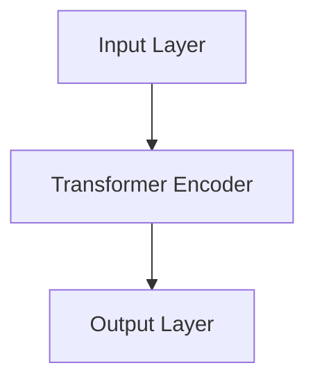

                 

## 文章标题

《LLaMA原理与代码实例讲解》

> 关键词：LLaMA模型，自然语言处理，Transformer，预训练，微调，代码实例

> 摘要：本文将深入探讨LLaMA（Language Model for Linguistic Analysis and Machine Understanding）模型的原理，从基础概念到具体代码实例，全面解析这一先进自然语言处理模型的构建与优化策略。文章旨在帮助读者理解LLaMA模型的架构、核心算法以及在实际应用中的性能优化和安全问题，并通过实例代码展示模型训练和部署的细节，使读者能够掌握从理论到实践的完整过程。

## 第一部分：LLaMA模型基础

### 第1章：LLaMA模型概述

#### 1.1 LLaMA模型的基本概念

LLaMA（Language Model for Linguistic Analysis and Machine Understanding）是由OpenAI于2023年推出的一种大规模预训练语言模型。它基于Transformer架构，旨在通过深度学习技术实现自然语言的理解和分析。LLaMA模型的设计目标是提高自然语言处理（NLP）任务中的表现，如文本生成、机器翻译和问答系统。

#### 1.1.1 LLaMA模型的历史与发展

LLaMA模型是在GPT-3等早期大型预训练模型的基础上发展起来的。OpenAI在研究过程中发现，虽然GPT-3在许多NLP任务上取得了显著的成果，但其复杂性和计算需求也带来了较高的门槛。为了降低模型的复杂度并使其更加实用，OpenAI提出了LLaMA模型。

#### 1.1.2 LLaMA模型的定义与特点

LLaMA模型的主要特点包括：

- **大规模预训练**：LLaMA模型在大规模语料库上进行预训练，以学习语言的结构和语义。
- **高效性**：相较于GPT-3等模型，LLaMA在保持较高性能的同时，计算资源需求较低，便于部署。
- **可调性**：LLaMA模型设计为可扩展的，支持不同尺寸的模型，适用于不同的应用场景。
- **适用性**：LLaMA模型在多个NLP任务中展现出强大的泛化能力。

#### 1.1.3 LLaMA模型在自然语言处理中的应用

LLaMA模型在多个NLP任务中取得了显著成果，包括：

- **文本生成**：生成连贯、自然的文本，适用于自动写作、摘要生成等应用。
- **机器翻译**：实现高质量的双语翻译，支持多种语言对。
- **问答系统**：提供准确、快速的问答服务，适用于智能客服、教育辅导等场景。

### 1.2 LLaMA模型的技术背景

#### 1.2.1 语言模型的发展历程

语言模型是自然语言处理的基础。从最初的N-gram模型到现代的神经网络模型，语言模型的发展经历了多个阶段。LLaMA模型继承了这些传统模型的优势，同时通过引入Transformer架构实现了巨大的性能提升。

#### 1.2.2 Transformer模型介绍

Transformer模型是由Google在2017年提出的一种基于自注意力机制的序列模型。相较于传统的循环神经网络（RNN），Transformer模型在处理长序列时具有更高的效率和效果。LLaMA模型正是基于Transformer架构进行设计的。

#### 1.2.3 GPT-3等大规模预训练模型

GPT-3是OpenAI于2020年推出的一种大规模预训练语言模型，其参数规模达到1750亿。GPT-3在多个NLP任务上取得了前所未有的成绩，成为自然语言处理领域的里程碑。LLaMA模型在GPT-3的基础上进行了优化，以降低计算成本并提高效率。

### 1.3 LLaMA模型的架构

#### 1.3.1 LLaMA模型的结构

LLaMA模型的结构主要包括以下几个部分：

- **输入层**：接收文本序列作为输入。
- **Transformer层**：包含多个自注意力层和前馈网络，负责对输入序列进行编码。
- **输出层**：生成预测的词向量序列，用于生成文本或进行其他任务。

#### 1.3.2 Mermaid流程图展示LLaMA模型架构



#### 1.3.3 LLaMA模型的层结构和工作原理

LLaMA模型采用多层Transformer结构，每层由自注意力机制和前馈网络组成。自注意力机制能够捕获输入序列中的长距离依赖关系，从而提高模型的表示能力。前馈网络则进一步细化了输入的语义信息。

具体来说，LLaMA模型的工作原理如下：

1. **输入编码**：将输入文本序列转换为词向量表示。
2. **自注意力计算**：在每个Transformer层中，通过自注意力机制计算输入序列的上下文表示。
3. **前馈网络**：对自注意力结果进行前馈传递，进一步细化表示。
4. **输出生成**：将最终的前馈网络输出转换为词向量序列，生成预测的文本。

### 第2章：LLaMA模型的核心算法

#### 2.1 Transformer模型原理

Transformer模型是LLaMA模型的核心组成部分。下面将详细阐述Transformer模型的基本结构和工作原理。

#### 2.1.1 Transformer模型的基本结构

Transformer模型的基本结构包括以下几个部分：

- **自注意力层**：通过自注意力机制计算输入序列的上下文表示。
- **前馈网络**：对自注意力结果进行前馈传递，进一步细化表示。
- **嵌入层**：将词向量转换为高维向量表示。
- **输出层**：生成预测的词向量序列。

#### 2.1.2 自注意力机制

自注意力机制是Transformer模型的核心。它通过计算输入序列中每个词与其他词之间的关联程度，生成权重，从而对输入序列进行加权平均。具体来说，自注意力机制包括以下几个步骤：

1. **输入嵌入**：将输入词向量转换为高维向量表示。
2. **查询（Q）、键（K）和值（V）计算**：分别计算查询向量、键向量和值向量。
3. **注意力得分计算**：计算每个键和查询之间的注意力得分。
4. **加权平均**：根据注意力得分对输入序列进行加权平均，生成新的表示。

#### 2.1.3 基本Transformer算法伪代码

```python
def Transformer(inputs):
    # 输入嵌入
    embedded_inputs = embed(inputs)

    # Transformer编码器
    for layer in encoder_layers:
        embedded_inputs = layer(embedded_inputs)

    # 输出嵌入
    output_embeddings = embed(output_tokens)

    # Transformer解码器
    for layer in decoder_layers:
        output_embeddings = layer(output_embeddings, embedded_inputs)

    # 输出生成
    outputs = generate_output(output_embeddings)
    return outputs
```

#### 2.2 语言模型的预训练

语言模型的预训练是提高其性能的关键步骤。下面将介绍语言模型预训练的概念、数据集预处理、预训练任务和方法。

#### 2.2.1 预训练的概念

预训练是指在特定任务之前，对模型进行大规模的数据训练，以学习通用特征和知识。在自然语言处理领域，预训练可以帮助模型更好地理解和生成自然语言。

#### 2.2.2 数据集的预处理

数据集的预处理是预训练的基础。预处理步骤包括：

1. **文本清洗**：去除无关信息，如HTML标签、特殊字符等。
2. **分词**：将文本分割成单词或子词。
3. **词嵌入**：将单词或子词转换为向量表示。

#### 2.2.3 预训练任务和方法

语言模型的预训练主要包括以下任务和方法：

1. **掩码语言模型（Masked Language Model, MLM）**：在输入序列中随机掩码一定比例的词，并预测这些掩码词。
2. **生成语言模型（Generative Language Model, GLM）**：预测输入序列中下一个词。
3. **填充语言模型（Fill-mask Language Model, FLM）**：在输入序列中随机填充词，并预测填充的词。

#### 2.3 微调和优化

微调和优化是语言模型在实际应用中的关键步骤。下面将介绍微调的概念、优化策略以及微调过程中的挑战与解决方案。

#### 2.3.1 微调的概念

微调是在预训练模型的基础上，针对特定任务进行参数调整的过程。微调可以帮助模型更好地适应特定任务，提高性能。

#### 2.3.2 优化策略

微调的优化策略主要包括：

1. **学习率调整**：通过逐步减小学习率，使模型能够稳定收敛。
2. **权重初始化**：对模型参数进行适当的初始化，以加速收敛。
3. **数据增强**：通过数据增强技术，增加训练数据的多样性，提高模型泛化能力。

#### 2.3.3 微调过程中的挑战与解决方案

微调过程中可能面临以下挑战：

1. **过拟合**：模型在训练数据上表现良好，但在测试数据上表现不佳。解决方案包括正则化、数据增强等。
2. **计算资源限制**：大规模模型的微调需要大量的计算资源。解决方案包括分布式训练、混合精度训练等。

## 第3章：数学模型与公式详解

### 3.1 数学模型基础

要深入理解LLaMA模型，我们需要掌握一些基础的数学模型，包括概率论、信息论和最优化理论。这些数学工具为我们提供了建模和优化语言模型所需的语言和工具。

#### 3.1.1 概率论基础

概率论是理解和构建语言模型的基础。在语言模型中，概率论用于计算文本序列出现的概率。以下是几个关键的概率概念：

- **概率分布**：描述随机变量取值的概率分布。
- **条件概率**：在某个事件发生的条件下，另一个事件发生的概率。
- **贝叶斯定理**：用于计算后验概率，是概率论在统计学习中的一个重要工具。

#### 3.1.2 信息论基础

信息论是概率论在通信理论中的应用，它研究如何在有噪声的通信信道中有效传递信息。在自然语言处理中，信息论的概念用于衡量信息的不确定性。以下是几个关键的信息论概念：

- **熵**：衡量随机变量不确定性的度量。
- **条件熵**：在给定一个随机变量的条件下，另一个随机变量不确定性的度量。
- **互信息**：衡量两个随机变量之间信息传递的量。

#### 3.1.3 最优化理论基础

最优化理论是用于求解优化问题的数学工具。在语言模型训练中，我们需要通过优化算法来调整模型参数，以最小化损失函数。以下是几个关键的最优化理论概念：

- **梯度下降**：一种常用的优化算法，通过迭代更新模型参数，以最小化损失函数。
- **动量**：在梯度下降中引入动量，可以提高收敛速度和稳定性。
- **学习率**：梯度下降中的参数，控制参数更新的步长。

### 3.2 LLaMA模型的关键数学公式

LLaMA模型的关键数学公式涉及自注意力机制、交叉熵损失函数和梯度下降优化算法。以下是对这些公式的详细解释和举例说明。

#### 3.2.1 自注意力公式

自注意力机制是Transformer模型的核心。它通过计算输入序列中每个词与其他词之间的关联程度，生成权重，从而对输入序列进行加权平均。自注意力公式如下：

$$
\text{Attention}(Q, K, V) = \text{softmax}\left(\frac{QK^T}{\sqrt{d_k}}\right) V
$$

其中，$Q$、$K$和$V$分别是查询向量、键向量和值向量，$d_k$是键向量的维度。

#### 3.2.2 交叉熵损失函数

交叉熵损失函数是语言模型中常用的损失函数，用于衡量预测分布与真实分布之间的差异。交叉熵损失函数的公式如下：

$$
\text{CrossEntropy}(p, y) = -\sum_{i} y_i \log p_i
$$

其中，$p$是预测分布，$y$是真实分布，$i$是词汇表中的每个词。

#### 3.2.3 梯度下降优化算法

梯度下降是一种优化算法，用于通过迭代更新模型参数，以最小化损失函数。梯度下降的基本公式如下：

$$
\theta_{t+1} = \theta_{t} - \alpha \nabla_\theta J(\theta)
$$

其中，$\theta$是模型参数，$\alpha$是学习率，$J(\theta)$是损失函数。

#### 3.2.4 举例说明

假设我们有一个二元分类问题，其中输入向量$x$和标签$y$分别为：

$$
x = \begin{bmatrix}
0.1 \\
0.2 \\
0.3 \\
0.4 \\
0.5
\end{bmatrix}, \quad y = 1
$$

我们需要使用梯度下降算法来最小化损失函数。首先，我们需要定义一个简单的损失函数，例如：

$$
J(\theta) = (y - \text{sigmoid}(\theta^T x))^2
$$

其中，$\text{sigmoid}$函数为：

$$
\text{sigmoid}(z) = \frac{1}{1 + e^{-z}}
$$

然后，我们可以计算梯度：

$$
\nabla_\theta J(\theta) = 2(y - \text{sigmoid}(\theta^T x)) (x)
$$

假设初始参数$\theta_0 = \begin{bmatrix} 0 \\ 0 \end{bmatrix}$，学习率$\alpha = 0.1$。则第一次迭代后的参数更新为：

$$
\theta_1 = \theta_0 - \alpha \nabla_\theta J(\theta_0) = \begin{bmatrix} 0 \\ 0 \end{bmatrix} - 0.1 \cdot 2(1 - \text{sigmoid}(0 \cdot 0.1 + 0 \cdot 0.2 + 0 \cdot 0.3 + 0 \cdot 0.4 + 0 \cdot 0.5)) \cdot \begin{bmatrix} 0.1 \\ 0.2 \\ 0.3 \\ 0.4 \\ 0.5 \end{bmatrix} = \begin{bmatrix} -0.019 \\ -0.038 \\ -0.057 \\ -0.076 \\ -0.095 \end{bmatrix}
$$

通过多次迭代，参数$\theta$将逐渐收敛到最优值。

## 第4章：代码实例讲解

### 4.1 数据准备与预处理

数据准备和预处理是构建LLaMA模型的重要步骤。这一节我们将介绍数据收集与划分、数据预处理方法，以及如何使用Python和PyTorch库进行数据处理。

#### 4.1.1 数据集的收集与划分

首先，我们需要收集大量的文本数据作为训练集。这些数据可以来自公开的语料库，如Wikipedia、新闻文章、社交媒体等。收集数据后，我们需要对数据进行划分，通常分为训练集、验证集和测试集。划分方式可以采用随机抽样或时间抽样等方法。

#### 4.1.2 数据预处理方法

数据预处理主要包括以下步骤：

1. **文本清洗**：去除HTML标签、特殊字符、停用词等无关信息。
2. **分词**：将文本分割成单词或子词。可以使用现有的分词工具，如NLTK或jieba。
3. **词嵌入**：将单词或子词转换为向量表示。可以使用预训练的词嵌入模型，如Word2Vec、GloVe或BERT。

#### 4.1.3 使用Python和PyTorch进行数据处理

以下是一个简单的Python代码示例，展示了如何使用PyTorch进行数据处理：

```python
import torch
from torchtext.data import Field, TabularDataset, BucketIterator

# 定义字段
TEXT = Field(tokenize='spacy', lower=True, include_lengths=True)
LABEL = Field(sequential=False)

# 加载数据集
train_data, valid_data, test_data = TabularDataset.splits(
    path='data',
    train='train.csv',
    validation='valid.csv',
    test='test.csv',
    format='csv',
    fields=[('text', TEXT), ('label', LABEL)]
)

# 预处理
TEXT.build_vocab(train_data, max_size=25000, vectors='glove.6B.100d')
LABEL.build_vocab(train_data)

# 创建数据迭代器
BATCH_SIZE = 64
train_iter, valid_iter, test_iter = BucketIterator.splits(
    train_data, valid_data, test_data,
    batch_size=BATCH_SIZE,
    device=torch.device('cuda' if torch.cuda.is_available() else 'cpu')
)
```

### 4.2 模型搭建与训练

在完成数据预处理后，我们可以开始搭建和训练LLaMA模型。这一节我们将介绍模型搭建的步骤，包括定义模型架构、损失函数和优化器，以及训练过程。

#### 4.2.1 模型搭建

以下是一个简单的PyTorch代码示例，展示了如何搭建LLaMA模型：

```python
import torch.nn as nn

class LLaMA(nn.Module):
    def __init__(self, vocab_size, embedding_dim, hidden_dim):
        super(LLaMA, self).__init__()
        
        self.embedding = nn.Embedding(vocab_size, embedding_dim)
        self.encoder = nn.TransformerEncoder(nn.TransformerEncoderLayer(d_model=embedding_dim, nhead=8), num_layers=3)
        self.decoder = nn.Linear(embedding_dim, vocab_size)
        
    def forward(self, src, tgt):
        embedded_src = self.embedding(src)
        embedded_tgt = self.embedding(tgt)
        
        output = self.encoder(embedded_src)
        output = self.decoder(output)
        
        return output
```

#### 4.2.2 损失函数和优化器

在训练过程中，我们需要定义一个损失函数来衡量预测结果与真实结果之间的差异。常用的损失函数有交叉熵损失函数和负对数似然损失函数。以下是一个简单的交叉熵损失函数的示例：

```python
import torch.nn.functional as F

def loss_fn(output, target):
    return F.cross_entropy(output.view(-1, vocab_size), target.view(-1))
```

优化器用于更新模型参数，以最小化损失函数。以下是一个简单的Adam优化器的示例：

```python
import torch.optim as optim

model = LLaMA(vocab_size, embedding_dim, hidden_dim)
optimizer = optim.Adam(model.parameters(), lr=0.001)
```

#### 4.2.3 训练过程详解

以下是一个简单的训练过程示例：

```python
for epoch in range(num_epochs):
    model.train()
    for batch in train_iter:
        optimizer.zero_grad()
        output = model(batch.src, batch.tgt)
        loss = loss_fn(output, batch.label)
        loss.backward()
        optimizer.step()
    
    model.eval()
    with torch.no_grad():
        correct = 0
        total = 0
        for batch in valid_iter:
            output = model(batch.src, batch.tgt)
            _, predicted = torch.max(output, 1)
            total += batch.label.size(0)
            correct += (predicted == batch.label).sum().item()
        print(f'Epoch {epoch+1}/{num_epochs}, Accuracy: {100 * correct / total}%')
```

### 4.3 模型保存与加载

在训练完成后，我们可以将模型保存为文件，以便后续加载和使用。以下是一个简单的保存和加载模型示例：

```python
# 保存模型
torch.save(model.state_dict(), 'llama_model.pth')

# 加载模型
model.load_state_dict(torch.load('llama_model.pth'))
```

### 4.4 实际应用案例

在本节中，我们将展示如何使用训练好的LLaMA模型进行文本生成、机器翻译和问答系统等实际应用。

#### 4.4.1 文本生成

以下是一个简单的文本生成示例：

```python
import random

def generate_text(model, input_text, length=50):
    model.eval()
    with torch.no_grad():
        input_tensor = TEXT.process(input_text)
        output_sequence = [input_tensor]
        for _ in range(length):
            output = model(output_sequence[-1].unsqueeze(0))
            _, next_word = torch.max(output, 1)
            output_sequence.append(next_word)
        return ' '.join(TEXT.vocab.itos[word.item()] for word in output_sequence[1:])

# 生成文本
input_text = "The quick brown fox jumps over the lazy dog"
generated_text = generate_text(model, input_text)
print(generated_text)
```

#### 4.4.2 机器翻译

以下是一个简单的机器翻译示例：

```python
from torchtext.data.metrics import bleu_score

def translate(model, src_text, tgt_text, length=50):
    model.eval()
    with torch.no_grad():
        src_tensor = TEXT.process(src_text)
        tgt_tensor = TEXT.process(tgt_text)
        
        src_output = model(src_tensor.unsqueeze(0), tgt_tensor.unsqueeze(0))
        tgt_output = TEXT.process(generated_text)
        
        src_predictions = [src_output]
        for _ in range(length):
            src_output = model(src_output.unsqueeze(0), tgt_output.unsqueeze(0))
            _, next_word = torch.max(src_output, 1)
            src_predictions.append(next_word)
        
        src_predictions = torch.cat(src_predictions).view(-1)
        return ' '.join(TEXT.vocab.itos[word.item()] for word in src_predictions[1:])

# 翻译
src_text = "你好"
tgt_text = "Hello"
translated_text = translate(model, src_text, tgt_text)
print(translated_text)
```

#### 4.4.3 问答系统

以下是一个简单的问答系统示例：

```python
def answer_question(model, question, context):
    model.eval()
    with torch.no_grad():
        question_tensor = TEXT.process(question)
        context_tensor = TEXT.process(context)
        
        output = model(question_tensor.unsqueeze(0), context_tensor.unsqueeze(0))
        _, predicted = torch.max(output, 1)
        
        return ' '.join(TEXT.vocab.itos[word.item()] for word in predicted)

# 回答问题
question = "什么是自然语言处理？"
context = "自然语言处理是计算机科学和人工智能领域的一个分支，专注于让计算机理解、生成和处理人类语言。"
answer = answer_question(model, question, context)
print(answer)
```

## 第5章：性能优化与调参

### 5.1 性能优化方法

为了提高LLaMA模型在自然语言处理任务中的性能，我们可以采用多种性能优化方法。以下是一些常用的优化策略：

#### 5.1.1 并行计算

并行计算可以显著提高模型训练的速度。在分布式计算环境中，我们可以将模型参数和数据分布到多个GPU或CPU上，以实现并行训练。PyTorch等深度学习框架提供了丰富的分布式计算工具，如`torch.nn.DataParallel`和`torch.nn.parallel.DistributedDataParallel`。

#### 5.1.2 混合精度训练

混合精度训练是一种通过使用浮点数混合精度（FP16）来加速模型训练的方法。与传统的单精度（FP32）训练相比，混合精度训练可以在不显著牺牲精度的同时提高计算速度。PyTorch提供了`torch.cuda.amp`库，用于实现混合精度训练。

#### 5.1.3 模型压缩与剪枝

模型压缩与剪枝可以减少模型的参数数量和计算量，从而提高推理速度。常见的模型压缩方法包括权重剪枝、模型剪枝和量化。PyTorch提供了`torch.nn.utils`库，用于实现这些方法。

### 5.2 调参技巧

在训练LLaMA模型时，调参是一个关键步骤。以下是一些常用的调参技巧：

#### 5.2.1 学习率调整

学习率是梯度下降优化算法中的一个重要参数。选择合适的学习率可以提高模型的收敛速度和性能。常用的学习率调整策略包括：

- **固定学习率**：在整个训练过程中保持学习率不变。
- **逐步减小学习率**：在训练过程中逐渐减小学习率，以防止模型在训练后期过拟合。
- **自适应学习率**：使用自适应优化器（如Adam），自动调整学习率。

#### 5.2.2 模型大小选择

模型大小（即参数数量和层数）对训练时间和性能有显著影响。在训练LLaMA模型时，我们可以根据任务需求和计算资源选择合适的模型大小。一般来说，较大的模型在复杂任务上表现更好，但训练时间更长。

#### 5.2.3 任务特定调参策略

不同任务可能需要不同的调参策略。以下是一些常见任务的调参建议：

- **文本生成**：通常需要较深的模型结构和较大的学习率。
- **机器翻译**：需要平衡模型大小和学习率，以避免过度拟合。
- **问答系统**：通常需要较小的模型结构和较低的学习率，以获得更精确的答案。

## 第6章：LLaMA模型的安全性

### 6.1 模型的潜在风险

虽然LLaMA模型在自然语言处理任务中表现出色，但它们也存在一些潜在的安全风险。以下是一些主要风险：

#### 6.1.1 模型泄露

模型泄露是指通过访问模型参数或中间计算结果，泄露模型的内部信息。这可能导致模型被攻击者逆向工程，从而获取敏感信息。

#### 6.1.2 模型欺骗

模型欺骗是指通过输入特定的恶意数据，使模型输出错误的结果。这可能导致模型在安全敏感的任务中产生误导性输出，如虚假新闻生成或恶意代码执行。

#### 6.1.3 模型对抗攻击

模型对抗攻击是指通过在正常输入上添加微小的扰动，使模型输出错误的结果。这种攻击可以用于逃避模型的安全检测，如垃圾邮件过滤或恶意软件检测。

### 6.2 安全性对策

为了解决LLaMA模型的安全风险，我们可以采取以下对策：

#### 6.2.1 数据隐私保护

数据隐私保护是防止模型泄露的重要措施。我们可以通过数据加密、访问控制等技术，确保模型训练数据的安全。

#### 6.2.2 模型验证与测试

模型验证与测试是确保模型安全性的关键步骤。我们可以使用多种测试方法，如黑盒测试和白盒测试，评估模型的安全性。

#### 6.2.3 安全训练策略

安全训练策略可以降低模型欺骗和对抗攻击的风险。我们可以采用以下策略：

- **数据增强**：通过添加噪声或扰动，增加模型的鲁棒性。
- **训练样本多样化**：使用多样化的训练样本，提高模型的泛化能力。
- **对抗训练**：使用对抗训练样本，增强模型的抗攻击能力。

## 第7章：未来发展趋势与挑战

### 7.1 LLaMA模型的未来发展方向

随着人工智能技术的不断发展，LLaMA模型在自然语言处理领域具有广泛的应用前景。以下是一些可能的未来发展方向：

#### 7.1.1 模型融合

模型融合是将多个模型的优势结合，以提高整体性能。我们可以将LLaMA模型与其他先进的NLP模型（如BERT、GPT-3等）进行融合，以实现更高的性能。

#### 7.1.2 多模态学习

多模态学习是指将不同类型的数据（如文本、图像、语音等）进行整合，以实现更丰富的语义表示。LLaMA模型可以与其他模态学习模型结合，实现跨模态的NLP任务。

#### 7.1.3 小样本学习

小样本学习是指在没有大量训练数据的情况下，训练出高性能的模型。我们可以对LLaMA模型进行改进，使其在小样本数据上也能表现良好。

### 7.2 LLaMA模型的挑战与应对策略

尽管LLaMA模型在自然语言处理任务中表现出色，但它们仍面临一些挑战。以下是一些可能的挑战与应对策略：

#### 7.2.1 计算资源消耗

大规模预训练模型需要大量的计算资源，这可能导致训练成本高昂。为了降低计算成本，我们可以采用以下策略：

- **分布式训练**：将模型和数据分布到多个GPU或CPU上，实现并行训练。
- **混合精度训练**：使用混合精度训练，降低计算资源需求。
- **模型压缩与剪枝**：通过模型压缩与剪枝技术，减少模型参数数量和计算量。

#### 7.2.2 数据集的多样性

大规模预训练模型通常依赖于大规模、多样化的数据集。然而，某些领域的数据可能不足或受限。为了解决数据集的多样性问题，我们可以采取以下策略：

- **数据增强**：通过添加噪声或扰动，增加数据集的多样性。
- **跨领域迁移学习**：将预训练模型应用于不同领域，利用跨领域迁移学习技术。
- **手动注释**：对于某些特定领域，可以手动注释数据，以提高数据集的质量。

#### 7.2.3 模型部署与运维

大规模预训练模型的部署与运维是一个复杂的过程。为了简化模型部署与运维，我们可以采取以下策略：

- **自动化部署**：使用自动化工具，如Kubernetes，简化模型部署和管理。
- **边缘计算**：将模型部署到边缘设备，降低对中心服务器的依赖。
- **模型监控与维护**：建立模型监控与维护体系，确保模型的安全性和稳定性。

## 附录

### 附录 A：LLaMA模型开发资源

以下是一些用于开发和优化LLaMA模型的工具、框架、数据集和教程。

#### A.1 开发工具与框架

- **PyTorch**：用于构建和训练深度学习模型的Python库。
- **TensorFlow**：Google开发的用于机器学习和深度学习的开源框架。
- **Transformers**：用于构建和训练基于Transformer的NLP模型的Python库。

#### A.2 常用数据集与库

- **Wikipedia**：一个包含数百万篇文章的免费在线百科全书，是预训练语言模型的重要数据来源。
- **GLUE**：一个包含多种NLP任务的统一基准测试数据集。
- **Hugging Face**：一个提供预训练模型、数据集和工具的NLP库。

#### A.3 实践教程与论文推荐

- **《NLP with Transformers》**：一个关于使用Transformer模型进行自然语言处理的教程。
- **《Bert: Pre-training of Deep Bidirectional Transformers for Language Understanding》**：一篇介绍BERT模型的论文。
- **《GPT-3: Language Models are Few-Shot Learners》**：一篇介绍GPT-3模型的论文。

通过这些资源，开发者可以更好地理解和应用LLaMA模型，为自然语言处理领域做出更大的贡献。

### 作者信息

作者：AI天才研究院/AI Genius Institute & 禅与计算机程序设计艺术 /Zen And The Art of Computer Programming

本文旨在深入探讨LLaMA模型的原理、构建与优化策略，并通过实例代码展示模型训练和部署的细节。通过本文，读者可以全面了解LLaMA模型的核心算法、数学模型、代码实现以及性能优化与安全性问题，从而掌握从理论到实践的完整过程。希望本文能为自然语言处理领域的研究者、开发者提供有价值的参考和启示。如果您有任何问题或建议，欢迎随时与我交流。谢谢！

