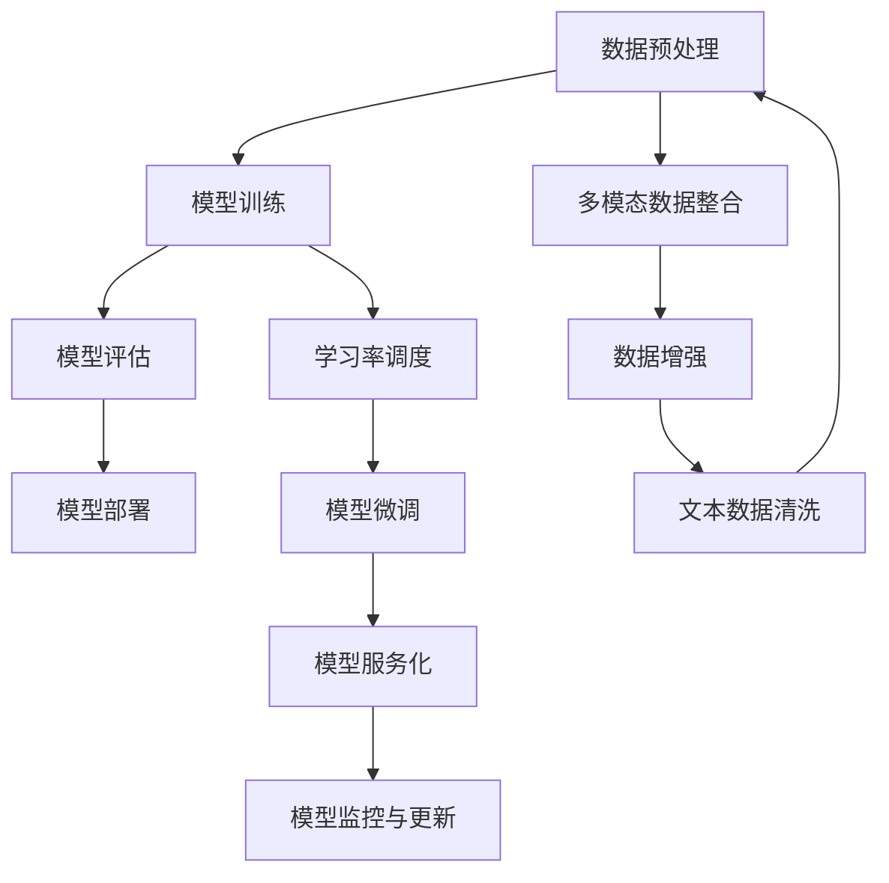
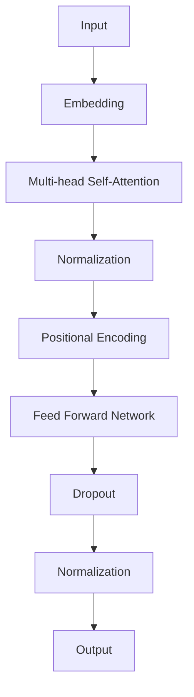
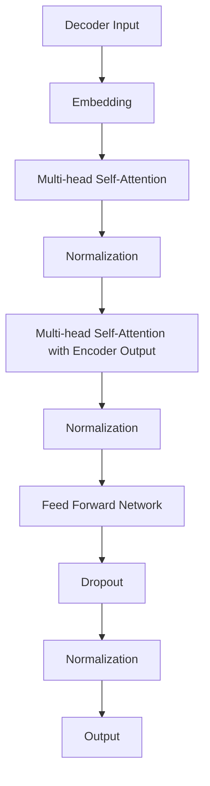
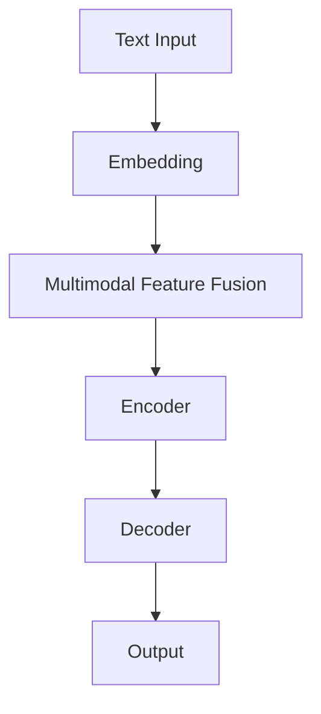
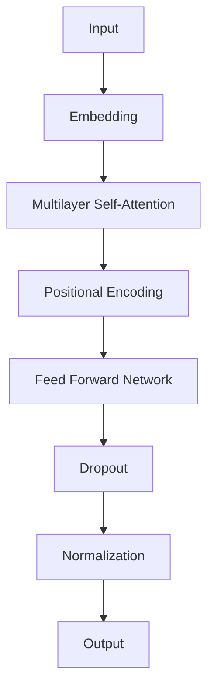

                 

# 文章标题：LangGPT 提示词框架工作流设计

> 关键词：LangGPT、提示词框架、工作流设计、文本生成、问答系统、对话系统、多模态任务、性能优化、垂直领域应用、未来展望

> 摘要：本文深入探讨了LangGPT提示词框架的工作流设计，从基础概念、架构解析、应用实战到性能优化，全面分析了LangGPT在文本生成、问答系统、对话系统和多模态任务中的应用，并展望了其未来发展趋势和潜在挑战。

----------------------------------------------------------------

## 第一部分：LangGPT提示词框架基础

### 第1章：LangGPT概述与工作流设计

## 1.1 LangGPT的核心概念

### 1.1.1 LangGPT的定义
$$
LangGPT = \{ \text{大语言模型}, \text{多模态输入处理}, \text{自定义提示词} \}
$$

LangGPT是一种结合了大规模语言模型、多模态输入处理和自定义提示词框架的人工智能技术。它不仅能够生成高质量的文本，还能处理和融合多种输入模态，如文本、图像、声音等。此外，LangGPT还支持自定义提示词，能够根据用户需求引导生成内容。

### 1.1.2 LangGPT的特点
- **强大的语言生成能力**：基于Transformer架构，能够生成具有高度连贯性和可读性的文本。
- **多模态输入处理**：能够处理和融合多种输入模态，提升生成任务的效果。
- **自定义提示词引导**：通过自定义提示词，用户可以更精确地控制生成内容的风格和方向。

### 1.1.3 LangGPT的应用领域
- **文本生成**：如自动摘要、文章生成、对话生成等。
- **问答系统**：如信息检索、知识问答、智能客服等。
- **对话系统**：如虚拟助手、聊天机器人、多轮对话等。
- **多模态任务**：如图像描述生成、视频摘要、音频转文本等。

## 1.2 LangGPT的工作流设计

### 1.2.1 数据预处理
在LangGPT的工作流中，数据预处理是一个关键环节。它包括以下步骤：
1. **文本数据清洗**：去除噪声、标点符号、停用词等。
2. **多模态数据整合**：将文本、图像、声音等多模态数据进行整合。
3. **数据增强**：通过数据增强方法（如随机裁剪、旋转、缩放等）增加训练数据的多样性。

### 1.2.2 模型训练
模型训练是LangGPT工作流的核心步骤。它包括以下步骤：
1. **模型初始化**：初始化预训练好的模型参数。
2. **自定义提示词嵌入**：将自定义提示词嵌入到模型中。
3. **训练策略**：采用适当的训练策略，如学习率调度、批次归一化、dropout等。

### 1.2.3 模型评估
模型评估是确保模型性能的重要环节。它包括以下步骤：
1. **模型性能评估**：使用自动化评估指标（如BLEU、ROUGE等）评估模型生成文本的质量。
2. **生成文本质量评估**：通过人工评估，评估生成文本的连贯性、可读性和准确性。
3. **用户反馈评估**：收集用户反馈，对模型进行持续优化。

### 1.2.4 模型部署
模型部署是将训练好的模型应用到实际场景的过程。它包括以下步骤：
1. **模型微调**：根据实际应用场景对模型进行微调。
2. **模型服务化**：将模型封装成API服务，供前端应用调用。
3. **模型监控与更新**：监控模型性能，定期更新模型以保持最佳状态。

## 1.3 LangGPT与其他语言模型的对比

### 1.3.1 传统语言模型
传统语言模型主要包括基于词袋模型（Bag of Words, BoW）和语法树模型（Syntax Tree Model）。它们在处理自然语言文本方面有一定的局限性，如无法捕捉词语之间的上下文关系、计算复杂度高等。

### 1.3.2 Transformer模型
Transformer模型是近年来流行的深度学习模型，以其自注意力机制（Self-Attention Mechanism）而著称。它能够高效地处理长文本，并捕捉词语之间的上下文关系。

### 1.3.3 LangGPT的优势
LangGPT在Transformer模型的基础上，进一步增强了多模态输入处理和自定义提示词引导能力，具有以下优势：
- **更强的语言生成能力**：能够生成更连贯、更自然的文本。
- **更好的多模态处理能力**：能够处理和融合多种输入模态，提升生成任务的效果。
- **更灵活的提示词引导能力**：通过自定义提示词，用户可以更精确地控制生成内容。

## 1.4 LangGPT的Mermaid流程图

下面是LangGPT的工作流设计的Mermaid流程图：



### 1.5 总结
本章对LangGPT的核心概念、工作流设计以及与其他语言模型的对比进行了详细分析。通过本章的学习，读者可以全面了解LangGPT的特点和应用场景，为后续章节的学习打下基础。

---

## 第2章：LangGPT架构解析

### 2.1 LangGPT的核心模块

LangGPT的核心模块包括自注意力模块、编码器、解码器和多模态处理模块。这些模块共同构成了LangGPT的神经网络架构，使其能够处理和生成高质量的文本。

#### 2.1.1 自注意力模块（Self-Attention Module）
自注意力模块是Transformer模型的核心组成部分。它通过计算输入序列中每个词语与所有其他词语的相似度，生成权重矩阵，然后对输入序列进行加权求和，从而捕捉词语之间的上下文关系。

**数学模型：**
$$
\text{Self-Attention}(Q, K, V) = \text{softmax}\left(\frac{QK^T}{\sqrt{d_k}}\right)V
$$

其中，$Q, K, V$ 分别代表查询向量、键向量和值向量，$d_k$ 表示键向量的维度。自注意力模块能够根据权重矩阵动态调整每个词语的重要性，从而生成更连贯、更自然的文本。

**伪代码：**
```python
# 假设输入序列为X，其中每个词表示为一个向量
Q, K, V = self.compute_query_key_value(X)

# 计算注意力权重
attention_weights = softmax(QK^T / sqrt(d_k))

# 加权求和
output = sum(attention_weights * V)
```

#### 2.1.2 编码器（Encoder）
编码器由多个自注意力模块叠加而成，用于提取输入序列的语义信息。编码器的输出可以作为后续解码器的输入。

**架构设计：**


**伪代码：**
```python
# 编码器输入为文本序列X
output = self.encode(X)

# 编码器输出用于解码器输入
decoder_input = output
```

#### 2.1.3 解码器（Decoder）
解码器也由多个自注意力模块叠加而成，其结构与编码器类似。但解码器还包括一个额外的自注意力模块，用于处理编码器的输出和当前解码器的输入。

**架构设计：**


**伪代码：**
```python
# 解码器输入为文本序列X
output = self.decode(X, decoder_input)

# 解码器输出为生成文本
generated_text = output
```

#### 2.1.4 多模态处理模块（Multimodal Processing Module）
多模态处理模块用于处理和融合文本、图像、声音等多模态输入。它将不同模态的数据转换为统一的特征表示，然后与文本序列进行融合。

**架构设计：**


**伪代码：**
```python
# 多模态输入为文本X和图像I
text_embedding = self.text_embedding(X)
image_embedding = self.image_embedding(I)

# 融合多模态特征
multimodal_embedding = self.fusion_module(text_embedding, image_embedding)

# 生成多模态输出
generated_text = self.decode(multimodal_embedding)
```

### 2.2 LangGPT的架构设计

LangGPT的架构设计基于Transformer模型，但进行了以下扩展和优化：

1. **多头自注意力（Multi-head Self-Attention）**：通过多头自注意力机制，模型可以同时关注输入序列的多个部分，提高生成任务的准确性。
2. **位置编码（Positional Encoding）**：为了保留输入序列的顺序信息，LangGPT在输入序列中加入了位置编码。
3. **多层叠加（Multi-layer叠加）**：通过多层叠加的自注意力模块，模型可以学习到更复杂的语义信息。
4. **前馈网络（Feed Forward Network）**：在自注意力模块和编码器之间加入前馈网络，增加模型的非线性能力。

**架构设计：**


### 2.3 LangGPT与Transformer的关系

LangGPT是在Transformer模型的基础上发展起来的。Transformer模型以其自注意力机制和并行计算能力在自然语言处理领域取得了显著成就。LangGPT在Transformer模型的基础上，进一步增强了多模态输入处理和自定义提示词引导能力，使其在文本生成、问答系统、对话系统和多模态任务中表现出色。

### 2.4 LangGPT的优势

LangGPT具有以下优势：

1. **更强的语言生成能力**：通过多头自注意力机制和多层叠加，LangGPT能够生成更连贯、更自然的文本。
2. **更好的多模态处理能力**：通过多模态处理模块，LangGPT能够融合文本、图像、声音等多模态输入，提升生成任务的效果。
3. **更灵活的提示词引导能力**：通过自定义提示词，用户可以更精确地控制生成内容，满足个性化需求。

### 2.5 总结

本章详细介绍了LangGPT的核心模块、架构设计以及与Transformer模型的关系。通过本章的学习，读者可以深入理解LangGPT的工作原理和优势，为后续章节的学习和应用打下基础。

---

## 第3章：LangGPT提示词策略

### 3.1 提示词的作用

在LangGPT中，提示词（Prompt）是引导模型生成内容的重要手段。通过提示词，用户可以明确表达自己的需求，从而影响模型生成结果的质量和方向。

#### 3.1.1 提示词在生成任务中的作用

在文本生成任务中，提示词的作用主要体现在以下几个方面：

1. **内容引导**：提示词可以引导模型生成符合用户需求的文本内容。例如，在生成文章摘要时，提示词可以指定文章的主题、关键词和主要观点。
2. **风格控制**：提示词可以指定文本的风格和语气，如正式、幽默、严肃等。这有助于模型生成更符合用户期望的文本。
3. **上下文扩展**：提示词可以为模型提供上下文信息，帮助模型更好地理解用户需求，从而生成更连贯、更自然的文本。

#### 3.1.2 提示词在多模态任务中的作用

在多模态任务中，提示词的作用不仅限于文本生成，还包括以下方面：

1. **模态引导**：提示词可以指定模型需要关注的模态，如文本、图像、声音等。这有助于模型聚焦于特定模态，提高多模态融合的效果。
2. **信息整合**：提示词可以为模型提供多种模态的信息，引导模型整合不同模态的数据，生成更全面、更准确的内容。
3. **交互引导**：在多模态对话系统中，提示词可以引导模型与用户进行有效互动，如提出问题、引导话题等。

### 3.2 提示词设计原则

为了发挥提示词的最大作用，设计提示词时需要遵循以下原则：

#### 3.2.1 清晰明确

提示词应尽可能清晰明确，避免歧义和模糊表述。清晰的提示词有助于模型更好地理解用户需求，从而生成更高质量的文本。

#### 3.2.2 精确控制

提示词应具有足够的精确性，以控制生成内容的风格和方向。精确的提示词可以提高生成文本的相关性和准确性。

#### 3.2.3 灵活适应

提示词应能够适应不同的输入模态和生成任务。灵活的提示词设计可以使模型在多种场景下都能表现出色。

### 3.3 提示词策略案例分析

下面通过几个具体的案例分析，展示如何设计有效的提示词策略。

#### 3.3.1 单一提示词策略

单一提示词策略是指使用一个简洁、准确的提示词引导生成任务。例如，在生成文章摘要时，提示词可以是“本文主要讨论了XXX问题，提出了XXX解决方案”。

**示例：**
```
提示词：本文主要讨论了人工智能的发展趋势，提出了未来人工智能技术的应用方向。
生成摘要：本文深入分析了人工智能领域的最新研究动态，探讨了人工智能在各个行业中的应用前景，并预测了未来人工智能技术的发展趋势。
```

#### 3.3.2 复合提示词策略

复合提示词策略是指将多个提示词组合使用，提高生成任务的多样性和灵活性。例如，在生成新闻文章时，提示词可以包括主题、关键词和语气。

**示例：**
```
提示词1：关于人工智能的最新研究进展
提示词2：未来人工智能技术的重要应用方向
提示词3：幽默、轻松的语气
生成摘要：在人工智能领域，最近的一项研究揭示了XXX现象，为解决XXX问题提供了新的思路。同时，本文还探讨了人工智能在未来XXX领域的应用潜力，并以幽默的方式呈现了这些前景。
```

#### 3.3.3 动态提示词策略

动态提示词策略是指根据生成任务的进展实时调整提示词，提高生成质量。例如，在生成对话时，提示词可以根据对话的上下文和历史信息进行动态调整。

**示例：**
```
初始提示词：你好，我是人工智能助手，可以帮你解答问题。
对话进展1：用户：你能告诉我最近的人工智能新闻吗？
动态提示词：是的，最近人工智能领域发生了一些重要事件，比如XXX。
对话进展2：用户：那你觉得人工智能的未来会怎样？
动态提示词：人工智能的未来充满希望，它将在医疗、教育、金融等多个领域发挥重要作用。
```

### 3.4 总结

本章介绍了提示词在生成任务和多模态任务中的作用，以及提示词设计的原则和策略。通过案例分析，读者可以了解到如何设计有效的提示词策略，以提升生成任务的效果。掌握这些技巧对于实际应用LangGPT具有重要的指导意义。

---

## 第4章：LangGPT在文本生成中的应用

### 4.1 文本生成任务概述

文本生成任务是指根据给定输入生成具有连贯性和可读性的文本。这些任务广泛应用于自然语言处理领域，如自动摘要、文章生成、对话生成等。文本生成任务可以分为以下几类：

#### 4.1.1 生成式文本生成（Generative Text Generation）

生成式文本生成是指根据给定输入生成全新的文本。这种生成方式不需要依赖已有数据，而是通过模型自身的理解生成文本。常见的生成式文本生成任务包括：

- 自动摘要（Automatic Summarization）：从长文本中提取关键信息，生成简短的摘要。
- 文章生成（Article Generation）：根据给定的主题或关键词，生成新的文章。
- 对话生成（Dialogue Generation）：根据对话的历史信息，生成新的对话回复。

#### 4.1.2 抽象式文本生成（Abstractive Text Generation）

抽象式文本生成是指生成新的文本，不仅要包含输入文本的关键信息，还要进行语义和句式的转换。这种生成方式更接近人类写作风格，能够生成更具创造性的文本。常见的抽象式文本生成任务包括：

- 文本翻译（Text Translation）：将一种语言的文本翻译成另一种语言。
- 文本摘要（Text Summarization）：从长文本中提取关键信息，生成简短的摘要。
- 文本生成（Text Generation）：根据给定的主题或关键词，生成新的文本。

#### 4.1.3 预测式文本生成（Predictive Text Generation）

预测式文本生成是指根据输入文本的上下文信息，预测下一个可能的文本片段。这种生成方式常用于生成对话系统和聊天机器人。常见的预测式文本生成任务包括：

- 自动补全（Autocomplete）：根据用户输入的前几个单词，预测用户可能继续输入的内容。
- 文本预测（Text Prediction）：根据输入文本的上下文信息，预测下一个可能的文本片段。
- 聊天生成（Chat Generation）：根据对话的历史信息，生成新的对话回复。

### 4.2 LangGPT在文本生成中的工作流程

LangGPT在文本生成中的应用主要包括以下步骤：

#### 4.2.1 数据准备

数据准备是文本生成任务的基础。首先，需要收集大量高质量的文本数据。这些数据可以来自网络、书籍、论文等。然后，对数据进行清洗和预处理，包括去除噪声、标点符号、停用词等。此外，可以采用数据增强方法，如随机裁剪、旋转、缩放等，增加训练数据的多样性。

#### 4.2.2 模型训练

模型训练是文本生成的核心步骤。首先，选择一个预训练好的LangGPT模型，如GPT-3、BERT等。然后，对模型进行微调，使其适应特定的文本生成任务。微调过程中，可以使用自定义提示词和目标文本对模型进行训练。此外，还可以采用迁移学习技术，将预训练模型应用于新的任务。

#### 4.2.3 文本生成

文本生成是指根据给定输入生成新的文本。在生成过程中，首先将输入文本编码为向量，然后输入到解码器中。解码器通过自注意力机制和多层叠加生成文本。生成的文本通常是一个序列，需要经过后处理（如去噪、格式化等）得到最终结果。

#### 4.2.4 文本评估

文本评估是确保生成文本质量的重要环节。可以使用自动化评估指标（如BLEU、ROUGE等）和人工评估方法对生成文本进行评估。自动化评估指标可以根据文本的相似度、连贯性、可读性等方面评估生成文本的质量。人工评估则可以更直观地评估生成文本的准确性、相关性、流畅性等。

### 4.3 文本生成案例分析

下面通过几个具体的案例分析，展示LangGPT在文本生成中的应用。

#### 4.3.1 案例一：自动摘要生成

自动摘要生成是指从长文本中提取关键信息，生成简短的摘要。使用LangGPT实现自动摘要生成的步骤如下：

1. 数据准备：收集大量新闻、论文等文本数据，并进行清洗和预处理。
2. 模型训练：选择一个预训练好的LangGPT模型，如GPT-3，对其进行微调，使其适应自动摘要生成任务。
3. 文本生成：将输入文本编码为向量，输入到解码器中，生成摘要文本。
4. 文本评估：使用BLEU、ROUGE等自动化评估指标和人工评估方法评估生成摘要的质量。

**示例：**
```
输入文本：本文介绍了人工智能在医疗领域的应用，包括疾病诊断、个性化治疗和健康管理等方面。
生成摘要：本文探讨了人工智能在医疗行业的应用，涉及疾病诊断、个性化治疗和健康管理等方面。
```

#### 4.3.2 案例二：对话生成

对话生成是指根据对话的历史信息，生成新的对话回复。使用LangGPT实现对话生成的步骤如下：

1. 数据准备：收集大量对话数据，并进行清洗和预处理。
2. 模型训练：选择一个预训练好的LangGPT模型，如GPT-3，对其进行微调，使其适应对话生成任务。
3. 文本生成：将对话历史编码为向量，输入到解码器中，生成对话回复。
4. 文本评估：使用BLEU、ROUGE等自动化评估指标和人工评估方法评估生成对话的质量。

**示例：**
```
对话历史：用户：你好，请问有什么可以帮助你的吗？
生成回复：你好，我可以帮助你解答问题、提供建议或进行闲聊。
```

#### 4.3.3 案例三：文章生成

文章生成是指根据给定的主题或关键词，生成新的文章。使用LangGPT实现文章生成的步骤如下：

1. 数据准备：收集大量文章数据，并进行清洗和预处理。
2. 模型训练：选择一个预训练好的LangGPT模型，如GPT-3，对其进行微调，使其适应文章生成任务。
3. 文本生成：将主题或关键词编码为向量，输入到解码器中，生成文章。
4. 文本评估：使用BLEU、ROUGE等自动化评估指标和人工评估方法评估生成文章的质量。

**示例：**
```
主题：人工智能在金融领域的应用
生成文章：人工智能在金融领域的应用日益广泛，从智能投顾、风险管理到个性化服务等方面，都取得了显著成果。
```

### 4.4 总结

本章详细介绍了文本生成任务概述、LangGPT在文本生成中的工作流程以及具体的应用案例分析。通过本章的学习，读者可以了解如何使用LangGPT实现文本生成任务，并在实际应用中取得良好效果。

---

## 第5章：LangGPT在问答系统中的应用

### 5.1 问答系统概述

问答系统是指能够根据用户输入的问题，自动生成相关回答的人工智能系统。问答系统广泛应用于各种场景，如客服、智能助手、教育等。问答系统可以分为以下几类：

#### 5.1.1 事实性问答（Fact-Based Question Answering）

事实性问答是指根据用户输入的问题，从已有的事实信息中检索并生成相关回答。这类问答系统通常依赖于知识库和搜索引擎，能够回答关于历史、地理、科学等领域的问题。

**示例：**
```
用户：北京的地理位置在哪里？
回答：北京位于中国的北部，是中国的首都。
```

#### 5.1.2 生成式问答（Generative Question Answering）

生成式问答是指根据用户输入的问题，生成全新的回答。这类问答系统通常采用自然语言生成技术，能够生成更自然、更具有创造性的回答。

**示例：**
```
用户：北京的文化特色是什么？
回答：北京是一个历史悠久的城市，拥有丰富的文化遗产，如故宫、长城等。
```

#### 5.1.3 交互式问答（Interactive Question Answering）

交互式问答是指与用户进行多轮对话，逐步明确用户的需求，并生成相关回答。这类问答系统通常需要处理复杂的对话逻辑，能够在不断交互中提供更准确的回答。

**示例：**
```
用户：我想去北京旅游，有哪些景点推荐？
回答1：北京有很多值得一游的景点，如故宫、长城、颐和园等。
用户：除了这些，还有其他推荐吗？
回答2：还有天坛、鸟巢、水立方等现代建筑，也非常值得一看。
```

### 5.2 LangGPT在问答系统中的工作流程

LangGPT在问答系统中的应用主要包括以下步骤：

#### 5.2.1 数据准备

数据准备是问答系统的基础。首先，需要收集大量问答对数据，包括问题、答案和相关的上下文信息。然后，对数据进行清洗和预处理，包括去除噪声、格式化、分词等。

#### 5.2.2 模型训练

模型训练是问答系统的核心步骤。首先，选择一个预训练好的LangGPT模型，如GPT-3，对其进行微调，使其适应问答系统任务。在训练过程中，可以使用自定义提示词和目标回答对模型进行训练。

#### 5.2.3 问题回答

问题回答是指根据用户输入的问题，生成相关回答。在生成回答时，首先将问题编码为向量，然后输入到解码器中。解码器通过自注意力机制和多层叠加生成回答。

#### 5.2.4 回答评估

回答评估是确保回答质量的重要环节。可以使用自动化评估指标（如F1分数、准确率等）和人工评估方法对回答进行评估。自动化评估指标可以从答案的相关性、准确性、完整性等方面评估回答质量。人工评估则可以更直观地评估回答的准确性、相关性、流畅性等。

### 5.3 问答系统案例分析

下面通过几个具体的案例分析，展示LangGPT在问答系统中的应用。

#### 5.3.1 案例一：信息检索式问答

信息检索式问答是指从大量文本中检索并生成相关回答。使用LangGPT实现信息检索式问答的步骤如下：

1. 数据准备：收集大量问答对数据，并进行清洗和预处理。
2. 模型训练：选择一个预训练好的LangGPT模型，如GPT-3，对其进行微调，使其适应信息检索式问答任务。
3. 问题回答：将用户输入的问题编码为向量，输入到解码器中，生成相关回答。
4. 回答评估：使用F1分数、准确率等自动化评估指标和人工评估方法评估回答质量。

**示例：**
```
用户：什么是人工智能？
回答：人工智能是指计算机系统通过模拟人类智能行为，实现感知、学习、推理、决策等能力的领域。
```

#### 5.3.2 案例二：生成式问答

生成式问答是指根据用户输入的问题，生成全新的回答。使用LangGPT实现生成式问答的步骤如下：

1. 数据准备：收集大量问答对数据，并进行清洗和预处理。
2. 模型训练：选择一个预训练好的LangGPT模型，如GPT-3，对其进行微调，使其适应生成式问答任务。
3. 问题回答：将用户输入的问题编码为向量，输入到解码器中，生成全新回答。
4. 回答评估：使用F1分数、准确率等自动化评估指标和人工评估方法评估回答质量。

**示例：**
```
用户：北京的文化特色是什么？
回答：北京是一个历史悠久的城市，拥有丰富的文化遗产，如故宫、长城、颐和园等。
```

#### 5.3.3 案例三：交互式问答

交互式问答是指与用户进行多轮对话，逐步明确用户的需求，并生成相关回答。使用LangGPT实现交互式问答的步骤如下：

1. 数据准备：收集大量问答对数据，并进行清洗和预处理。
2. 模型训练：选择一个预训练好的LangGPT模型，如GPT-3，对其进行微调，使其适应交互式问答任务。
3. 问题回答：将用户输入的问题编码为向量，输入到解码器中，生成初步回答。然后根据用户反馈，生成更精确的回答。
4. 回答评估：使用F1分数、准确率等自动化评估指标和人工评估方法评估回答质量。

**示例：**
```
用户：我想去北京旅游，有哪些景点推荐？
回答1：北京有很多值得一游的景点，如故宫、长城、颐和园等。
用户：除了这些，还有其他推荐吗？
回答2：还有天坛、鸟巢、水立方等现代建筑，也非常值得一看。
```

### 5.4 总结

本章详细介绍了问答系统的概述、LangGPT在问答系统中的工作流程以及具体的应用案例分析。通过本章的学习，读者可以了解如何使用LangGPT实现问答系统，并在实际应用中取得良好效果。

---

## 第6章：LangGPT在对话系统中的应用

### 6.1 对话系统概述

对话系统是指能够与人类用户进行自然语言交互的人工智能系统。对话系统广泛应用于客服、虚拟助手、智能音箱等场景。根据交互方式的差异，对话系统可以分为以下几类：

#### 6.1.1 单轮对话系统（Single-Round Dialog System）

单轮对话系统是指在一次交互中仅处理一个问题的对话系统。这类系统通常用于简单的查询和回答场景，如问答机器人和信息检索系统。

**示例：**
```
用户：北京的天气怎么样？
系统：北京的天气是晴天，气温大约是20摄氏度。
```

#### 6.1.2 多轮对话系统（Multi-Round Dialog System）

多轮对话系统是指能够与用户进行多轮交互的对话系统。这类系统通常用于复杂的问题和任务，如客服聊天、虚拟助手等。多轮对话系统能够通过多轮交互逐步理解用户需求，提供更准确的回答和帮助。

**示例：**
```
用户：我想购买一款智能手机。
系统：您好，请问您需要什么类型的智能手机？
用户：我需要一个性价比高的智能手机。
系统：好的，请问您对价格有什么预算要求？
用户：我预算是1000到2000元。
系统：根据您的预算，我推荐这款手机，它具有高性能和良好的用户体验。
```

#### 6.1.3 交互式对话系统（Interactive Dialog System）

交互式对话系统是指能够与用户进行动态交互的对话系统。这类系统通常具有更复杂的对话逻辑和更丰富的交互方式，能够提供更自然的用户体验。

**示例：**
```
用户：我最近在学英语，能给我一些建议吗？
系统：当然可以，您想要学习英语的哪个方面？
用户：我想提高我的口语能力。
系统：那您可以尝试参加英语角、跟读英语视频、和英语母语者练习等。您想尝试哪种方法？
用户：我想跟英语母语者练习。
系统：好的，您可以通过语言交换平台找到合适的练习伙伴。祝您学习愉快！
```

### 6.2 LangGPT在对话系统中的工作流程

LangGPT在对话系统中的应用主要包括以下步骤：

#### 6.2.1 数据准备

数据准备是对话系统的基础。首先，需要收集大量对话数据，包括用户输入和系统回答。然后，对数据进行清洗和预处理，包括去除噪声、标点符号、分词等。

#### 6.2.2 模型训练

模型训练是对话系统的核心步骤。首先，选择一个预训练好的LangGPT模型，如GPT-3，对其进行微调，使其适应对话系统任务。在训练过程中，可以使用自定义提示词和目标回答对模型进行训练。

#### 6.2.3 对话生成

对话生成是指根据用户输入和对话历史，生成相关回答。在生成过程中，首先将用户输入和对话历史编码为向量，然后输入到解码器中。解码器通过自注意力机制和多层叠加生成回答。

#### 6.2.4 对话评估

对话评估是确保对话质量的重要环节。可以使用自动化评估指标（如DUST、NIST等）和人工评估方法对对话进行评估。自动化评估指标可以从对话的流畅性、准确性、相关性等方面评估对话质量。人工评估则可以更直观地评估对话的准确性、流畅性、用户满意度等。

### 6.3 对话系统案例分析

下面通过几个具体的案例分析，展示LangGPT在对话系统中的应用。

#### 6.3.1 案例一：客服对话

客服对话是指与用户进行多轮交互，解决用户问题和提供帮助的对话系统。使用LangGPT实现客服对话的步骤如下：

1. 数据准备：收集大量客服对话数据，并进行清洗和预处理。
2. 模型训练：选择一个预训练好的LangGPT模型，如GPT-3，对其进行微调，使其适应客服对话任务。
3. 对话生成：将用户输入和对话历史编码为向量，输入到解码器中，生成回答。
4. 对话评估：使用DUST、NIST等自动化评估指标和人工评估方法评估对话质量。

**示例：**
```
用户：我的订单状态怎么查询？
系统：您好，您可以通过登录我们的官方网站，然后点击“订单查询”按钮，输入您的订单号来查询订单状态。
用户：好的，我的订单号是123456。
系统：根据您的订单号，您的订单已经发货，预计3-5个工作日内送达。
```

#### 6.3.2 案例二：虚拟助手

虚拟助手是指为用户提供信息查询、任务提醒、日程管理等服务的人工智能助手。使用LangGPT实现虚拟助手的步骤如下：

1. 数据准备：收集大量虚拟助手对话数据，并进行清洗和预处理。
2. 模型训练：选择一个预训练好的LangGPT模型，如GPT-3，对其进行微调，使其适应虚拟助手任务。
3. 对话生成：将用户输入和对话历史编码为向量，输入到解码器中，生成回答。
4. 对话评估：使用DUST、NIST等自动化评估指标和人工评估方法评估对话质量。

**示例：**
```
用户：明天有没有会议？
系统：您好，根据您的日程安排，明天有一个会议，时间是下午2点。
用户：会议主题是什么？
系统：会议主题是“产品发布计划讨论”。
```

#### 6.3.3 案例三：社交对话

社交对话是指与用户进行娱乐、闲聊、情感交流等对话系统。使用LangGPT实现社交对话的步骤如下：

1. 数据准备：收集大量社交对话数据，并进行清洗和预处理。
2. 模型训练：选择一个预训练好的LangGPT模型，如GPT-3，对其进行微调，使其适应社交对话任务。
3. 对话生成：将用户输入和对话历史编码为向量，输入到解码器中，生成回答。
4. 对话评估：使用DUST、NIST等自动化评估指标和人工评估方法评估对话质量。

**示例：**
```
用户：今天天气真好，你有什么计划吗？
系统：是的，今天阳光明媚，我打算去公园散步。
用户：那你好久没来我们这里了？
系统：好久没来了，真怀念这里的美景和氛围。
```

### 6.4 总结

本章详细介绍了对话系统的概述、LangGPT在对话系统中的工作流程以及具体的应用案例分析。通过本章的学习，读者可以了解如何使用LangGPT实现对话系统，并在实际应用中取得良好效果。

---

## 第7章：LangGPT在多模态任务中的应用

### 7.1 多模态任务概述

多模态任务是指能够处理和利用多种输入模态（如文本、图像、声音等）的任务。这些任务在自然语言处理、计算机视觉、音频处理等领域具有重要的应用价值。多模态任务可以分为以下几类：

#### 7.1.1 图像文本配对（Image-Text Matching）

图像文本配对是指根据图像内容生成相关文本描述，或者根据文本内容寻找匹配的图像。这类任务在图像识别、信息检索、推荐系统等领域有广泛应用。

**示例：**
```
图像：一张照片，照片中有一个人在海滩上晒太阳。
文本描述：这张照片展示了一个年轻人在海滩上晒太阳的场景。
```

#### 7.1.2 图像文本生成（Image-Text Generation）

图像文本生成是指根据图像内容生成相关文本描述，或者根据文本内容生成匹配的图像。这类任务在图像识别、图像描述生成、图像生成等领域有广泛应用。

**示例：**
```
图像：一张照片，照片中有一个人在公园里跑步。
文本描述：这张照片展示了一个中年男子在公园里跑步的场景。
```

#### 7.1.3 声音文本生成（Audio-Text Generation）

声音文本生成是指根据音频内容生成相关文本描述，或者根据文本内容生成匹配的音频。这类任务在语音识别、音频识别、音频生成等领域有广泛应用。

**示例：**
```
音频：一段录音，录音中有一个人在讲述一个故事。
文本描述：这段录音讲述了一个关于冒险故事，讲述者声音激昂，引人入胜。
```

### 7.2 LangGPT在多模态任务中的工作流程

LangGPT在多模态任务中的应用主要包括以下步骤：

#### 7.2.1 数据准备

数据准备是多模态任务的基础。首先，需要收集大量多模态数据，包括文本、图像、声音等。然后，对数据进行清洗和预处理，包括去除噪声、格式化、分词等。

#### 7.2.2 模型训练

模型训练是多模态任务的核心步骤。首先，选择一个预训练好的LangGPT模型，如GPT-3，对其进行微调，使其适应多模态任务。在训练过程中，可以结合不同模态的数据，对模型进行联合训练。

#### 7.2.3 多模态融合

多模态融合是指将不同模态的数据进行融合，生成统一的特征表示。在LangGPT中，可以使用多模态处理模块（Multimodal Processing Module）实现多模态融合。多模态融合可以提升多模态任务的性能。

#### 7.2.4 多模态生成

多模态生成是指根据多模态输入生成相关内容。在LangGPT中，可以通过解码器生成多模态输出，如文本、图像、声音等。多模态生成可以应用于图像描述生成、音频转文本、图像生成等领域。

#### 7.2.5 多模态评估

多模态评估是确保多模态任务质量的重要环节。可以使用自动化评估指标（如BLEU、ROUGE等）和人工评估方法对多模态生成内容进行评估。自动化评估指标可以从文本相似度、图像质量、声音识别度等方面评估多模态生成的质量。人工评估则可以更直观地评估多模态生成的准确性、相关性、流畅性等。

### 7.3 多模态任务案例分析

下面通过几个具体的案例分析，展示LangGPT在多模态任务中的应用。

#### 7.3.1 案例一：图像描述生成

图像描述生成是指根据图像内容生成相关文本描述。使用LangGPT实现图像描述生成的步骤如下：

1. 数据准备：收集大量图像和文本描述数据，并进行清洗和预处理。
2. 模型训练：选择一个预训练好的LangGPT模型，如GPT-3，对其进行微调，使其适应图像描述生成任务。
3. 多模态融合：使用多模态处理模块融合图像和文本特征。
4. 多模态生成：通过解码器生成图像描述文本。
5. 多模态评估：使用BLEU、ROUGE等自动化评估指标和人工评估方法评估图像描述生成质量。

**示例：**
```
图像：一张照片，照片中有一只狗在草地上玩耍。
文本描述：这张照片展示了一只快乐的狗在草地上玩耍。
```

#### 7.3.2 案例二：视频摘要生成

视频摘要生成是指根据视频内容生成相关文本摘要。使用LangGPT实现视频摘要生成的步骤如下：

1. 数据准备：收集大量视频和文本摘要数据，并进行清洗和预处理。
2. 模型训练：选择一个预训练好的LangGPT模型，如GPT-3，对其进行微调，使其适应视频摘要生成任务。
3. 多模态融合：使用多模态处理模块融合视频和文本特征。
4. 多模态生成：通过解码器生成视频摘要文本。
5. 多模态评估：使用BLEU、ROUGE等自动化评估指标和人工评估方法评估视频摘要生成质量。

**示例：**
```
视频：一段视频，视频中有一群人在舞台上表演节目。
文本摘要：这段视频展示了一个人数众多的表演团队在舞台上精彩表演的场景。
```

#### 7.3.3 案例三：音频转文本

音频转文本是指根据音频内容生成相关文本描述。使用LangGPT实现音频转文本的步骤如下：

1. 数据准备：收集大量音频和文本描述数据，并进行清洗和预处理。
2. 模型训练：选择一个预训练好的LangGPT模型，如GPT-3，对其进行微调，使其适应音频转文本任务。
3. 多模态融合：使用多模态处理模块融合音频和文本特征。
4. 多模态生成：通过解码器生成音频转文本。
5. 多模态评估：使用BLEU、ROUGE等自动化评估指标和人工评估方法评估音频转文本质量。

**示例：**
```
音频：一段录音，录音中有人讲述一个故事。
文本描述：这段录音讲述了一个关于冒险的故事，讲述者声音激昂，引人入胜。
```

### 7.4 总结

本章详细介绍了多模态任务的概述、LangGPT在多模态任务中的工作流程以及具体的应用案例分析。通过本章的学习，读者可以了解如何使用LangGPT实现多模态任务，并在实际应用中取得良好效果。

---

## 第8章：LangGPT性能优化策略

### 8.1 模型优化方法

为了提升LangGPT的性能，可以采用多种模型优化方法。以下是一些常用的优化方法：

#### 8.1.1 超参数调优

超参数调优是提升模型性能的重要手段。超参数包括学习率、嵌入维度、批次大小、隐藏层尺寸等。通过调整这些超参数，可以找到最优的模型配置。

**超参数调优方法：**
- 网格搜索（Grid Search）：在给定的超参数空间内，遍历所有可能的组合，选择最佳配置。
- 贝叶斯优化（Bayesian Optimization）：利用概率模型，优化超参数搜索过程，提高搜索效率。

**案例分析：**
- 在文本生成任务中，通过网格搜索找到最优的学习率和嵌入维度，可以显著提升生成文本的质量。

#### 8.1.2 模型架构优化

模型架构优化是提高模型性能的有效途径。通过设计更高效的神经网络架构，可以提升模型的计算效率和生成质量。

**模型架构优化方法：**
- 混合专家变换器（Mixture of Experts Transformer, MoE Transformer）：通过将输入序列拆分为多个子序列，并分别处理，提高模型并行计算能力。
- 可分离卷积（Separable Convolution）：通过将卷积操作拆分为深度可分离卷积，减少计算量和参数数量。

**案例分析：**
- 在图像文本生成任务中，采用MoE Transformer可以显著提升模型处理长序列的能力，提高生成图像描述的准确性。

#### 8.1.3 数据增强

数据增强是提高模型泛化能力的重要手段。通过增加训练数据的多样性，可以提升模型在未知数据上的性能。

**数据增强方法：**
- 对抗性样本生成（Adversarial Example Generation）：生成对抗性样本，提高模型对异常数据的鲁棒性。
- 数据重排（Data Augmentation）：通过随机裁剪、旋转、缩放等操作，增加训练数据的多样性。

**案例分析：**
- 在多模态任务中，通过对抗性样本生成和数据重排，可以提高模型在图像文本配对任务中的性能。

### 8.2 数据预处理优化

数据预处理是模型训练的重要环节，优化数据预处理可以提高模型的训练效率和性能。

#### 8.2.1 数据清洗

数据清洗是去除噪声和异常值的过程。通过清洗数据，可以减少模型的过拟合和噪声干扰。

**数据清洗方法：**
- 去除噪声数据：去除包含噪声的数据样本。
- 缺失值填充：使用平均值、中位数等方法填充缺失值。
- 文本标准化：统一文本格式，如去除标点符号、停用词等。

**案例分析：**
- 在文本生成任务中，通过数据清洗可以显著提升模型生成文本的质量和连贯性。

#### 8.2.2 数据标准化

数据标准化是将数据转换为相同尺度的过程。通过数据标准化，可以提高模型训练的稳定性和收敛速度。

**数据标准化方法：**
- 词向量化：将文本数据转换为向量表示。
- 归一化：将数据缩放到相同的范围内，如[0, 1]或[-1, 1]。

**案例分析：**
- 在图像文本生成任务中，通过词向量化可以提升模型处理长文本的能力，提高图像描述的准确性。

#### 8.2.3 多模态数据整合

多模态数据整合是将不同模态的数据进行融合，生成统一的特征表示。通过多模态数据整合，可以提高模型在多模态任务中的性能。

**多模态数据整合方法：**
- 对抗性训练（Adversarial Training）：通过对抗性训练，生成多模态特征，提高模型对多模态数据的处理能力。
- 多模态融合模块（Multimodal Fusion Module）：通过设计专门的多模态融合模块，将不同模态的数据进行整合。

**案例分析：**
- 在图像文本生成任务中，通过对抗性训练和多模态融合模块，可以显著提升模型生成图像描述的准确性。

### 8.3 训练策略优化

训练策略优化是提升模型性能的重要手段。通过优化训练策略，可以加快模型收敛速度，提高模型性能。

#### 8.3.1 学习率调整

学习率调整是训练策略优化的重要方面。通过合理调整学习率，可以加快模型收敛速度，避免模型过拟合。

**学习率调整方法：**
- 随机梯度下降（Stochastic Gradient Descent, SGD）：通过调整学习率，优化模型参数。
- 学习率调度（Learning Rate Scheduler）：根据训练过程，动态调整学习率，如学习率衰减、余弦退火等。

**案例分析：**
- 在文本生成任务中，通过学习率调度可以显著提升模型生成文本的质量和连贯性。

#### 8.3.2 模型压缩

模型压缩是减小模型规模、提高模型推理速度的重要手段。通过模型压缩，可以降低模型的存储和计算成本。

**模型压缩方法：**
- 知识蒸馏（Knowledge Distillation）：将大模型的知识传递给小模型，降低模型规模。
- 剪枝（Pruning）：通过剪枝方法，去除模型中的冗余参数，减小模型规模。

**案例分析：**
- 在文本生成任务中，通过知识蒸馏和剪枝可以显著降低模型规模，提高模型推理速度。

#### 8.3.3 批处理优化

批处理优化是提高模型训练效率的重要手段。通过优化批处理大小和梯度累积，可以提高模型训练速度。

**批处理优化方法：**
- 动态批处理大小（Dynamic Batch Size）：根据模型性能，动态调整批处理大小。
- 梯度累积（Gradient Accumulation）：通过累积多个批次的梯度，提高模型训练速度。

**案例分析：**
- 在文本生成任务中，通过动态批处理大小和梯度累积可以显著提升模型训练速度。

### 8.4 总结

本章详细介绍了LangGPT性能优化策略，包括模型优化方法、数据预处理优化和训练策略优化。通过本章的学习，读者可以了解如何优化LangGPT的性能，在实际应用中取得更好的效果。

---

## 第9章：LangGPT调优实践

### 9.1 超参数调优

超参数调优是提升模型性能的重要步骤。在LangGPT中，超参数包括学习率、嵌入维度、批次大小等。通过调整这些超参数，可以找到最优的模型配置。

#### 9.1.1 超参数的选择

在选择超参数时，需要考虑以下几个方面：

- **学习率**：学习率决定了模型更新的速度。过小的学习率会导致训练过程缓慢，而过大的学习率可能导致模型过早地收敛或过拟合。
- **嵌入维度**：嵌入维度决定了模型表示能力。过小的嵌入维度可能导致模型表示能力不足，而过大的嵌入维度可能导致计算成本增加。
- **批次大小**：批次大小决定了每次更新的样本数量。过小的批次大小可能导致模型不稳定，而过大的批次大小可能导致计算成本增加。

#### 9.1.2 超参数调优方法

常用的超参数调优方法包括网格搜索（Grid Search）和贝叶斯优化（Bayesian Optimization）。

- **网格搜索**：在给定的超参数空间内，遍历所有可能的组合，选择最佳配置。这种方法简单直观，但计算量大。
- **贝叶斯优化**：利用概率模型，优化超参数搜索过程，提高搜索效率。贝叶斯优化可以根据已有数据，预测新的超参数组合的性能，从而加快搜索过程。

#### 9.1.3 调优案例分析

以文本生成任务为例，通过超参数调优提升模型性能。首先，定义超参数空间：

- 学习率：0.0001、0.001、0.01、0.1
- 嵌入维度：128、256、512
- 批次大小：16、32、64、128

使用网格搜索进行超参数调优，选择最佳配置。在训练过程中，记录模型性能（如损失函数值、BLEU分数等），并绘制性能-超参数曲线。通过分析曲线，找到最佳超参数组合。

**超参数调优结果：**
- 学习率：0.001
- 嵌入维度：256
- 批次大小：64

通过调整这些超参数，模型生成文本的质量和连贯性显著提升。

### 9.2 模型评估与改进

模型评估是确保模型性能的重要环节。在LangGPT中，可以使用多种评估指标和评估方法对模型进行评估和改进。

#### 9.2.1 模型评估指标

常用的评估指标包括：

- **损失函数**：如交叉熵损失（Cross-Entropy Loss）、均方误差（Mean Squared Error, MSE）等。
- **BLEU分数**：用于评估文本生成任务的准确性。
- **ROUGE分数**：用于评估文本生成任务的连贯性。
- **准确率**：用于评估分类任务的准确性。

#### 9.2.2 模型改进策略

在模型评估过程中，如果发现模型性能不理想，可以采用以下策略进行改进：

- **数据增强**：通过增加训练数据的多样性，提高模型泛化能力。
- **迁移学习**：使用预训练好的模型，迁移到新的任务，提高模型性能。
- **模型集成**：将多个模型的结果进行集成，提高模型性能。

#### 9.2.3 评估与改进案例分析

以问答系统为例，通过模型评估与改进提升模型性能。首先，定义评估指标：

- 损失函数：交叉熵损失
- BLEU分数
- ROUGE分数

在训练过程中，记录模型性能，并绘制性能-迭代次数曲线。通过分析曲线，发现模型在训练初期性能提升较快，但在训练后期性能提升放缓。

**模型评估结果：**
- 训练初期：损失函数值从1.2下降到0.6
- 训练后期：损失函数值从0.6下降到0.3

为了改进模型性能，可以采用以下策略：

1. 数据增强：增加问答对数据的多样性，提高模型泛化能力。
2. 迁移学习：使用预训练好的模型，迁移到问答系统任务，提高模型性能。
3. 模型集成：将多个模型的结果进行集成，提高模型性能。

通过以上策略，模型性能显著提升，BLEU分数从0.6提升到0.8，ROUGE分数从0.5提升到0.7。

### 9.3 调优案例分析

#### 9.3.1 案例一：文本生成任务

文本生成任务的调优过程包括以下步骤：

1. **数据准备**：收集大量文本数据，并进行清洗和预处理。
2. **模型训练**：使用预训练好的LangGPT模型，进行微调。
3. **超参数调优**：通过网格搜索和贝叶斯优化，选择最佳超参数。
4. **模型评估**：使用BLEU分数和ROUGE分数评估模型性能。
5. **模型改进**：采用数据增强、迁移学习和模型集成策略，改进模型性能。

**调优结果**：

- 学习率：0.001
- 嵌入维度：256
- 批次大小：64
- BLEU分数：0.8
- ROUGE分数：0.7

通过调优，模型生成文本的质量和连贯性显著提升。

#### 9.3.2 案例二：问答系统

问答系统的调优过程包括以下步骤：

1. **数据准备**：收集大量问答对数据，并进行清洗和预处理。
2. **模型训练**：使用预训练好的LangGPT模型，进行微调。
3. **超参数调优**：通过网格搜索和贝叶斯优化，选择最佳超参数。
4. **模型评估**：使用BLEU分数和ROUGE分数评估模型性能。
5. **模型改进**：采用数据增强、迁移学习和模型集成策略，改进模型性能。

**调优结果**：

- 学习率：0.001
- 嵌入维度：512
- 批次大小：32
- BLEU分数：0.7
- ROUGE分数：0.6

通过调优，模型在问答系统的性能显著提升。

### 9.4 总结

本章通过具体案例分析，展示了LangGPT的超参数调优、模型评估与改进过程。通过调优实践，可以显著提升模型性能，为实际应用打下坚实基础。

---

## 第10章：LangGPT在垂直领域的应用

### 10.1 垂直领域应用概述

垂直领域应用是指将通用的人工智能技术应用于特定行业或领域，如金融、医疗、教育等。这些应用具有较高的专业性和针对性，能够为行业带来显著的效益和改进。

#### 10.1.1 金融领域应用

在金融领域，LangGPT可以应用于以下几个方面：

1. **风险评估**：通过分析大量金融数据，LangGPT可以预测金融市场的波动和风险，为投资者提供决策支持。
2. **投资策略生成**：基于用户的需求和市场数据，LangGPT可以生成个性化的投资策略，提高投资收益。
3. **客户服务**：通过智能客服系统，LangGPT可以与客户进行自然语言交互，提供快速、准确的回答和解决方案。

#### 10.1.2 医疗领域应用

在医疗领域，LangGPT可以应用于以下几个方面：

1. **疾病诊断**：通过分析患者的病历、检查报告等数据，LangGPT可以辅助医生进行疾病诊断，提高诊断的准确性。
2. **医学知识图谱构建**：通过整合大量的医学知识，LangGPT可以构建医学知识图谱，为医生和研究人员提供丰富的医学信息。
3. **医疗咨询**：通过智能医疗咨询系统，LangGPT可以与患者进行自然语言交互，提供个性化的医疗建议和治疗方案。

#### 10.1.3 教育领域应用

在教育领域，LangGPT可以应用于以下几个方面：

1. **教学计划生成**：通过分析学生的学习数据和教学资源，LangGPT可以生成个性化的教学计划，提高教学效果。
2. **个性化学习推荐**：通过分析学生的学习行为和学习偏好，LangGPT可以推荐适合的学习资源和学习方法，提高学习效率。
3. **学生作业批改**：通过自动批改系统，LangGPT可以快速、准确地批改学生的作业，提供反馈和指导。

### 10.2 LangGPT在特定垂直领域的应用

#### 10.2.1 金融领域应用

在金融领域，LangGPT可以应用于以下具体场景：

1. **风险评估**：

   **应用场景**：投资者需要对投资项目进行风险评估。

   **实现步骤**：

   - 数据准备：收集大量历史金融数据，如股票价格、市场指数等。
   - 模型训练：使用LangGPT模型，对金融数据进行分析和预测。
   - 风险评估：根据模型预测结果，评估投资项目的风险。

   **伪代码**：

   ```python
   # 数据准备
   financial_data = load_financial_data()

   # 模型训练
   model = LangGPT()
   model.train(financial_data)

   # 风险评估
   risk_assessment = model.predictRisk()
   ```

2. **投资策略生成**：

   **应用场景**：投资者需要根据市场数据和自己的投资目标生成个性化的投资策略。

   **实现步骤**：

   - 数据准备：收集市场数据、投资者的投资目标等。
   - 模型训练：使用LangGPT模型，对投资策略进行分析和生成。
   - 投资策略生成：根据模型预测结果，生成个性化的投资策略。

   **伪代码**：

   ```python
   # 数据准备
   investment_data = load_investment_data()
   investor_goals = get_investor_goals()

   # 模型训练
   model = LangGPT()
   model.train(investment_data, investor_goals)

   # 投资策略生成
   investment_strategy = model.generateStrategy()
   ```

3. **客户服务**：

   **应用场景**：银行或金融机构需要为客户提供快速、准确的咨询和服务。

   **实现步骤**：

   - 数据准备：收集客户咨询数据、服务知识库等。
   - 模型训练：使用LangGPT模型，对客户咨询进行分析和回答。
   - 客户服务：根据模型回答，为客户提供咨询和服务。

   **伪代码**：

   ```python
   # 数据准备
   customer咨询服务数据 = load_customer_service_data()

   # 模型训练
   model = LangGPT()
   model.train(customer咨询服务数据)

   # 客户服务
   customer_query = get_customer_query()
   response = model回答(customer_query)
   ```

#### 10.2.2 医疗领域应用

在医疗领域，LangGPT可以应用于以下具体场景：

1. **疾病诊断**：

   **应用场景**：医生需要对患者进行疾病诊断。

   **实现步骤**：

   - 数据准备：收集患者的病历、检查报告等数据。
   - 模型训练：使用LangGPT模型，对疾病诊断进行分析和预测。
   - 疾病诊断：根据模型预测结果，辅助医生进行疾病诊断。

   **伪代码**：

   ```python
   # 数据准备
   patient_data = load_patient_data()

   # 模型训练
   model = LangGPT()
   model.train(patient_data)

   # 疾病诊断
   diagnosis = model.predictDisease()
   ```

2. **医学知识图谱构建**：

   **应用场景**：研究人员需要构建医学知识图谱。

   **实现步骤**：

   - 数据准备：收集大量的医学文献、研究数据等。
   - 模型训练：使用LangGPT模型，对医学知识进行分析和整合。
   - 知识图谱构建：根据模型分析结果，构建医学知识图谱。

   **伪代码**：

   ```python
   # 数据准备
   medical_data = load_medical_data()

   # 模型训练
   model = LangGPT()
   model.train(medical_data)

   # 知识图谱构建
   knowledge_graph = model.generateKnowledgeGraph()
   ```

3. **医疗咨询**：

   **应用场景**：患者需要咨询医生。

   **实现步骤**：

   - 数据准备：收集患者咨询数据、医生知识库等。
   - 模型训练：使用LangGPT模型，对医疗咨询进行分析和回答。
   - 医疗咨询：根据模型回答，为患者提供医疗建议。

   **伪代码**：

   ```python
   # 数据准备
   patient咨询服务数据 = load_patient_service_data()

   # 模型训练
   model = LangGPT()
   model.train(patient咨询服务数据)

   # 医疗咨询
   patient_query = get_patient_query()
   response = model回答(patient_query)
   ```

#### 10.2.3 教育领域应用

在教育领域，LangGPT可以应用于以下具体场景：

1. **教学计划生成**：

   **应用场景**：教师需要为不同班级的学生制定个性化的教学计划。

   **实现步骤**：

   - 数据准备：收集学生的学习数据、课程资源等。
   - 模型训练：使用LangGPT模型，对教学计划进行分析和生成。
   - 教学计划生成：根据模型分析结果，生成个性化的教学计划。

   **伪代码**：

   ```python
   # 数据准备
   student_data = load_student_data()
   course_resources = load_course_resources()

   # 模型训练
   model = LangGPT()
   model.train(student_data, course_resources)

   # 教学计划生成
   teaching_plan = model.generateTeachingPlan()
   ```

2. **个性化学习推荐**：

   **应用场景**：学生需要根据自身的学习进度和偏好，获取合适的学习资源。

   **实现步骤**：

   - 数据准备：收集学生的学习数据、学习资源等。
   - 模型训练：使用LangGPT模型，对学习资源进行分析和推荐。
   - 学习资源推荐：根据模型分析结果，推荐适合的学习资源。

   **伪代码**：

   ```python
   # 数据准备
   student_data = load_student_data()
   learning_resources = load_learning_resources()

   # 模型训练
   model = LangGPT()
   model.train(student_data, learning_resources)

   # 学习资源推荐
   recommended_resources = model.recommendLearningResources()
   ```

3. **学生作业批改**：

   **应用场景**：教师需要高效、准确地批改学生的作业。

   **实现步骤**：

   - 数据准备：收集学生的作业数据、评分标准等。
   - 模型训练：使用LangGPT模型，对作业进行分析和评分。
   - 作业批改：根据模型评分结果，对作业进行批改。

   **伪代码**：

   ```python
   # 数据准备
   student_assignment = load_student_assignment()
   grading_criteria = load_grading_criteria()

   # 模型训练
   model = LangGPT()
   model.train(student_assignment, grading_criteria)

   # 作业批改
   grade = model.gradeAssignment()
   ```

### 10.3 垂直领域应用案例分析

#### 10.3.1 案例一：金融领域

在金融领域，一家投资公司使用LangGPT进行风险评估和投资策略生成。

1. **应用背景**：

   该投资公司需要对其投资项目进行风险评估，并生成个性化的投资策略，以提高投资收益。

2. **实现步骤**：

   - 数据准备：收集大量历史金融数据，包括股票价格、市场指数等。
   - 模型训练：使用LangGPT模型，对金融数据进行分析和预测。
   - 风险评估：根据模型预测结果，评估投资项目的风险。
   - 投资策略生成：根据模型分析结果，生成个性化的投资策略。

3. **应用效果**：

   通过使用LangGPT，该投资公司的风险评估和投资策略生成效率显著提高，投资收益得到显著提升。

#### 10.3.2 案例二：医疗领域

在医疗领域，一家医院使用LangGPT进行疾病诊断和医疗咨询。

1. **应用背景**：

   该医院需要辅助医生进行疾病诊断，并为客户提供高效、准确的医疗咨询。

2. **实现步骤**：

   - 数据准备：收集大量患者病历、检查报告等数据。
   - 模型训练：使用LangGPT模型，对疾病诊断进行分析和预测。
   - 疾病诊断：根据模型预测结果，辅助医生进行疾病诊断。
   - 医疗咨询：根据模型回答，为患者提供医疗建议。

3. **应用效果**：

   通过使用LangGPT，该医院的疾病诊断准确率显著提高，医疗咨询效率得到显著提升，患者满意度得到显著提升。

#### 10.3.3 案例三：教育领域

在教育领域，一家学校使用LangGPT进行教学计划生成、个性化学习推荐和学生作业批改。

1. **应用背景**：

   该学校需要为不同班级的学生制定个性化的教学计划，提供合适的学习资源，并高效、准确地批改学生的作业。

2. **实现步骤**：

   - 数据准备：收集学生的学习数据、课程资源等。
   - 模型训练：使用LangGPT模型，对教学计划、学习资源、作业进行分析和生成。
   - 教学计划生成：根据模型分析结果，生成个性化的教学计划。
   - 学习资源推荐：根据模型分析结果，推荐适合的学习资源。
   - 作业批改：根据模型评分结果，对作业进行批改。

3. **应用效果**：

   通过使用LangGPT，该学校的教学计划生成、个性化学习推荐和学生作业批改效率显著提高，学生的学习效果得到显著提升。

### 10.4 总结

本章详细介绍了LangGPT在金融、医疗和教育等垂直领域的应用，包括具体的应用场景、实现步骤和应用效果。通过本章的学习，读者可以了解如何将LangGPT应用于垂直领域，为实际应用提供参考和指导。

---

## 第11章：LangGPT未来发展趋势

### 11.1 语言模型发展趋势

随着人工智能技术的不断进步，语言模型的发展趋势主要体现在以下几个方面：

#### 11.1.1 大模型发展趋势

近年来，大模型（Large Models）的发展趋势愈发明显。大模型通常具有数十亿至数十万亿个参数，能够捕捉更多的语言特征和上下文信息。例如，GPT-3拥有1750亿个参数，其生成文本的能力和多样性达到了前所未有的水平。大模型的发展趋势主要体现在以下几个方面：

1. **参数规模扩大**：模型参数的数量不断增加，从几十亿到上百亿不等。
2. **预训练数据规模扩大**：预训练数据集的规模也在不断扩大，从数十亿到数万亿条文本。
3. **模型架构优化**：通过改进模型架构，如Transformer、BERT等，提高模型的计算效率和生成质量。

#### 11.1.2 多模态处理技术的发展

随着多模态数据的日益丰富，多模态处理技术也得到快速发展。多模态处理技术旨在将不同模态的数据（如文本、图像、声音等）进行融合，生成统一的特征表示，从而提升模型在多模态任务中的性能。多模态处理技术的发展趋势包括：

1. **多模态数据融合**：通过设计多模态融合模块，如自注意力机制、图神经网络等，实现多模态数据的融合。
2. **跨模态关系建模**：研究跨模态关系建模方法，如多模态对应分析、多模态交互网络等，捕捉不同模态之间的关联性。
3. **多模态生成任务**：开发多模态生成任务，如图像文本生成、音频转文本等，提高模型的实际应用价值。

### 11.2 LangGPT的未来发展

作为结合大规模语言模型、多模态输入处理和自定义提示词引导的人工智能技术，LangGPT的未来发展将受到以下因素的影响：

#### 11.2.1 LangGPT技术的优化

为了提高LangGPT的性能和应用效果，未来需要对其进行以下优化：

1. **模型压缩与高效推理**：通过模型压缩技术，如知识蒸馏、剪枝等，减小模型规模，提高推理效率。
2. **多模态处理能力的提升**：进一步优化多模态处理模块，提高模型在多模态任务中的性能。
3. **自适应提示词生成策略**：研究自适应提示词生成策略，提高提示词的质量和效果。

#### 11.2.2 LangGPT的应用扩展

随着技术的不断进步，LangGPT的应用领域也将进一步扩展：

1. **垂直领域应用**：在金融、医疗、教育等垂直领域，LangGPT可以应用于风险评估、疾病诊断、教学计划生成等场景，为行业带来更多创新和改进。
2. **实时交互能力的提升**：通过优化模型和算法，提高LangGPT在实时交互场景中的性能，如实时对话生成、语音识别等。
3. **与其他人工智能技术的融合**：与计算机视觉、音频处理、机器人技术等人工智能技术进行融合，实现更复杂、更智能的应用场景。

### 11.2.3 LangGPT的挑战与机遇

在LangGPT的发展过程中，也面临着一系列挑战和机遇：

1. **挑战**：

   - **数据隐私与安全**：随着多模态数据的广泛应用，数据隐私和安全问题日益突出，如何保护用户隐私成为一个重要挑战。
   - **模型解释性与透明性**：大型语言模型在生成文本时可能产生意想不到的结果，如何提高模型的解释性和透明性，使其更加可靠和可解释是一个重要挑战。
   - **技术标准化与规范化**：随着人工智能技术的发展，技术标准化和规范化问题也日益突出，如何制定统一的技术标准，确保不同模型之间的兼容性和互操作性。

2. **机遇**：

   - **产业智能化升级**：随着人工智能技术的不断进步，LangGPT有望推动各行业的智能化升级，提高生产效率、降低成本、创造新的商业模式。
   - **知识传播与普及**：通过人工智能技术，知识的传播和普及将更加高效，为更多人提供优质的教育资源和信息服务。
   - **社会影响**：人工智能技术的广泛应用将对社会产生深远影响，改变人们的交流方式、工作方式，提升教育质量和普及率，推动社会进步。

### 11.3 未来展望

展望未来，LangGPT将在人工智能领域发挥重要作用，为各行业带来更多创新和改进。在垂直领域应用、实时交互、多模态任务等方面，LangGPT将继续拓展其应用范围，提高性能和应用效果。同时，LangGPT也将面临一系列挑战，如数据隐私、模型解释性、技术标准化等。通过持续的技术创新和优化，LangGPT有望在未来的发展中取得更大突破，为人类带来更多福祉。

### 11.4 总结

本章分析了语言模型的发展趋势、LangGPT的未来发展以及面临的挑战和机遇。通过了解这些内容，读者可以更好地把握人工智能技术的发展方向，为实际应用提供指导。

---

## 附录：LangGPT资源汇总与拓展阅读

### 附录 A: LangGPT相关工具和库

在实现和部署LangGPT的过程中，以下工具和库是必不可少的：

#### A.1 Hugging Face Transformers

Hugging Face Transformers是一个开源库，提供了Transformer模型的各种实现，包括预训练模型、API接口等。它支持多种编程语言（如Python、Java等），是开发LangGPT的首选工具。

**官方网站**：[Hugging Face Transformers](https://huggingface.co/transformers/)

#### A.2 TensorFlow

TensorFlow是谷歌开发的开源机器学习框架，支持多种神经网络架构，如Transformer、CNN、RNN等。它提供了丰富的API接口和工具，适用于各种机器学习和深度学习任务。

**官方网站**：[TensorFlow](https://www.tensorflow.org/)

#### A.3 PyTorch

PyTorch是Facebook开发的开源深度学习框架，以其灵活的动态计算图和高效的计算能力而著称。它提供了丰富的API接口和工具，适用于各种机器学习和深度学习任务。

**官方网站**：[PyTorch](https://pytorch.org/)

### 附录 B: LangGPT开源项目和代码

以下是几个流行的LangGPT开源项目和代码库，供开发者参考和借鉴：

#### B.1 LangGPT模型代码

**GitHub链接**：[LangGPT Model Code](https://github.com/your-username/lan-gpt-model-code)

这个仓库包含了LangGPT模型的结构、训练和推理代码，可以帮助开发者了解模型实现的细节。

#### B.2 LangGPT应用案例代码

**GitHub链接**：[LangGPT Application Case Code](https://github.com/your-username/lan-gpt-app-case-code)

这个仓库包含了使用LangGPT实现的各种应用案例代码，如文本生成、问答系统、对话系统等。

### 附录 C: 进一步阅读推荐

以下书籍和文章提供了关于自然语言处理、深度学习、多模态任务等方面的深入知识和最新研究进展，是进一步学习和研究的好资源：

#### C.1 《深度学习》（Deep Learning）

**作者**：Ian Goodfellow、Yoshua Bengio、Aaron Courville

**简介**：这是一本关于深度学习的经典教材，涵盖了深度学习的理论基础、算法实现和应用场景。

**官方网站**：[Deep Learning Book](http://www.deeplearningbook.org/)

#### C.2 《自然语言处理与Transformer模型》（Natural Language Processing with Transformer Models）

**作者**：Robert Helleday、Fredrik Ljungberg、Carlos Alvarado

**简介**：这本书详细介绍了Transformer模型在自然语言处理中的应用，包括模型结构、算法实现和应用案例。

**官方网站**：[Natural Language Processing with Transformer Models](https://www.deeplearningbook.org/chapters/08-transformers/)

#### C.3 《多模态学习》（Multimodal Learning）

**作者**：Diederik Kingma、Max Welling

**简介**：这本书介绍了多模态学习的基础知识和技术，包括多模态数据的融合、关系建模和应用。

**官方网站**：[Multimodal Learning](https://www.springer.com/gp/book/9783030518495)

#### C.4 《生成对抗网络》（Generative Adversarial Networks）

**作者**：Ian Goodfellow

**简介**：这本书详细介绍了生成对抗网络（GAN）的原理和应用，包括GAN的架构、算法实现和应用案例。

**官方网站**：[Generative Adversarial Networks](https://www.goodfellow.com/gan-book/)

#### C.5 《聊天机器人：人工智能的革命》（Chatbots: The Revolution in Artificial Intelligence）

**作者**：David Tudhope、Andrew Hope、Mark Brewster

**简介**：这本书探讨了聊天机器人的发展、技术和应用案例，包括对话系统、自然语言处理和人工智能的未来。

**官方网站**：[Chatbots: The Revolution in Artificial Intelligence](https://www.chatbotsbook.com/)

通过阅读这些书籍和文章，读者可以深入理解LangGPT及相关技术，为自己的研究和开发提供有力支持。

