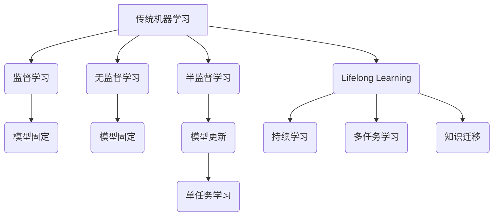

                 

# 文章标题

Lifelong Learning原理与代码实例讲解

## 关键词

- 机器学习
- 持续学习
- 神经网络
- 元学习
- 代码实例

## 摘要

本文旨在深入探讨Lifelong Learning（终身学习）的概念、原理及其在实际应用中的代码实例。我们将首先介绍Lifelong Learning的基础知识，包括其与传统机器学习的区别、核心原则及其应用场景。随后，我们将深入分析Lifelong Learning中的神经网络模型，讲解其数学模型和算法原理。最后，通过具体案例实现，展示如何在实际项目中应用Lifelong Learning技术。

## 目录大纲

### 第一部分：Lifelong Learning概述

- **第1章: Lifelong Learning基础**
  - 1.1 Lifelong Learning的概念
  - 1.2 Lifelong Learning的核心原则
  - 1.3 Lifelong Learning的应用场景

- **第2章: 神经网络与Lifelong Learning**
  - 2.1 神经网络的基本原理
  - 2.2 ReLU激活函数与自适应学习率
  - 2.3 Lifelong Learning中的神经网络模型

- **第三部分：Lifelong Learning算法实现**
  - 3.1 Python编程基础
  - 3.2 常用机器学习库简介
  - 3.3 具体案例实现

- **第四部分：Lifelong Learning应用与展望**
  - 4.1 Lifelong Learning的未来发展方向
  - 4.2 Lifelong Learning面临的挑战与解决方案

- **附录**
  - 附录A: Lifelong Learning相关资源

---

## 1.1.1 传统的机器学习与Lifelong Learning的差异

传统的机器学习主要关注在静态数据集上的模型训练和优化，一旦模型训练完毕，模型就固定不变，无法适应新出现的任务。而Lifelong Learning（终身学习）则强调在连续的、动态的数据流中，模型能够持续地学习和适应新的任务。

### Mermaid流程图



在上面的流程图中，我们可以清晰地看到，传统的机器学习模型（A）在训练完成后就固定不变（B和C），而Lifelong Learning（I）则强调持续学习（J），能够适应多个任务（K和L），并且在训练过程中会进行模型更新（G），这与单任务学习（H）有本质的区别。

### 核心概念与联系

- **监督学习（Supervised Learning）**：在监督学习中，模型通过已知的输入和输出数据来学习如何预测未知的数据。
- **无监督学习（Unsupervised Learning）**：在无监督学习中，模型没有明确的输出标签，需要通过探索数据分布来学习。
- **半监督学习（Semi-Supervised Learning）**：半监督学习结合了监督学习和无监督学习，使用一部分有标签的数据和大量无标签的数据进行训练。
- **单任务学习（Single Task Learning）**：单任务学习专注于一个特定的任务，例如在图像分类中只分类一种类型的目标。
- **多任务学习（Multi-Task Learning）**：多任务学习同时处理多个相关的任务，可以提高模型在不同任务上的性能。
- **知识迁移（Knowledge Transfer）**：知识迁移是指将一个任务中学到的知识应用到其他相关任务中，从而提高模型的泛化能力。

Lifelong Learning通过结合这些核心概念，实现了一个能够在长时间内持续适应新任务的模型。它不仅能够处理单个任务，还能够通过持续学习和知识迁移来提高模型的性能，使其在复杂动态的环境中保持高效运行。

---

### 1.1.2 Lifelong Learning的重要性与挑战

Lifelong Learning在当前的人工智能领域中具有重要性，原因如下：

- **动态环境的适应性**：现实世界是动态变化的，传统的单次训练模型无法适应新出现的情况。Lifelong Learning能够通过持续学习来适应这些变化，从而提高模型的鲁棒性和实用性。
- **知识积累与利用**：Lifelong Learning能够将过去的经验用于解决新的问题，这种知识积累有助于提高模型的性能和效率。
- **多任务处理能力**：Lifelong Learning可以通过同时处理多个任务，共享知识和资源，从而提高整体性能。

然而，Lifelong Learning也面临一些挑战：

- **计算资源限制**：持续学习和模型更新需要大量的计算资源，这对于实时应用来说可能是一个瓶颈。
- **数据多样性问题**：为了实现有效的持续学习，需要大量的多样化数据。然而，获取这些数据可能成本高昂且困难。
- **模型泛化能力**：在持续学习过程中，模型需要处理不同类型的数据，这可能导致模型泛化能力的下降。

为了解决这些挑战，研究人员提出了多种策略，如经验重放、自适应学习率等，这些方法将在后续章节中详细讨论。

---

### 1.2.1 持续学习的概念

持续学习（Continuous Learning）是Lifelong Learning的核心原则之一，它强调模型在长时间内能够不断适应新的数据和任务。持续学习的目标是通过不断的迭代和学习，使模型能够保持最新的知识和技能，从而提高其适应性和鲁棒性。

### 持续学习的优势

- **适应动态环境**：持续学习能够使模型适应动态变化的环境，例如在自动驾驶中，模型需要不断学习新的道路情况、交通规则等。
- **知识积累**：通过持续学习，模型能够将过去的经验和知识用于解决新的问题，从而提高其解决问题的能力。
- **提高性能**：持续学习可以帮助模型不断优化和改进，从而提高其准确性和效率。

### 持续学习的机制

持续学习通常通过以下几种机制实现：

- **在线学习**：在线学习是指模型在接收到新的数据时立即进行学习，这样可以使模型迅速适应新的情况。
- **经验重放**：经验重放是一种通过重放过去的经验数据来训练模型的方法，这有助于提高模型的泛化能力和稳定性。
- **增量学习**：增量学习是指模型只对新的数据或任务进行学习，而不会重新训练整个模型，这样可以减少计算资源的消耗。

### 持续学习的应用场景

持续学习在多个领域都有广泛的应用，以下是几个典型的应用场景：

- **自动驾驶**：自动驾驶系统需要持续学习来适应不同的道路条件、交通情况等，从而提高其安全性。
- **智能客服**：智能客服系统需要持续学习用户的提问方式和需求，以提供更准确的回答。
- **健康医疗**：健康医疗系统需要持续学习新的病例数据，以不断改进诊断和治疗方案。

---

### 1.2.2 知识迁移与模型更新

知识迁移（Knowledge Transfer）和模型更新（Model Update）是Lifelong Learning的两个重要机制，它们有助于模型在不同任务间共享知识和适应新任务。

### 知识迁移

知识迁移是指将一个任务中学习到的知识应用到另一个相关任务中。这种方法可以提高模型的泛化能力，使其在新的任务上更快地达到性能指标。

#### 知识迁移的优势

- **减少数据需求**：知识迁移可以通过利用已有数据来减少新任务所需的数据量，从而降低数据获取的成本。
- **提高模型性能**：通过迁移知识，模型可以在新任务上快速达到较高的性能，减少了从头训练的时间。

#### 知识迁移的挑战

- **领域差异**：不同任务之间的领域差异可能导致知识迁移效果不佳。
- **模型适应性**：模型需要具备一定的适应性，以便在新任务中有效利用迁移的知识。

### 模型更新

模型更新是指对现有模型进行改进和优化，以适应新的数据和任务。模型更新可以采用在线学习、增量学习等方式实现。

#### 模型更新的优势

- **适应新任务**：通过模型更新，模型能够更好地适应新的数据和任务，从而提高其性能。
- **降低计算成本**：模型更新可以避免从头开始训练，从而减少计算资源的消耗。

#### 模型更新的挑战

- **稳定性**：模型更新可能会导致模型不稳定，需要通过合适的策略来保证模型的稳定性。
- **计算资源**：模型更新需要消耗一定的计算资源，这对于实时应用来说可能是一个挑战。

### 知识迁移与模型更新的关系

知识迁移和模型更新是相互关联的。知识迁移提供了迁移的知识，而模型更新则利用这些知识来改进模型。在实际应用中，知识迁移和模型更新通常结合使用，以实现最佳效果。

### 知识迁移与模型更新的应用

知识迁移和模型更新在多个领域都有广泛的应用，以下是几个典型的应用场景：

- **多模态学习**：多模态学习是指将不同类型的数据（如文本、图像、声音）进行融合和迁移学习。例如，在视频分析中，可以将图像分类的知识迁移到视频分类中。
- **跨领域迁移**：在医疗领域，可以将一个疾病的诊断知识迁移到另一个相关疾病上，以提高诊断的准确率。
- **持续更新模型**：在金融领域，模型需要持续更新以适应市场的变化。通过知识迁移和模型更新，可以保持模型的最新性和有效性。

---

### 1.2.3 适应性学习策略

适应性学习策略是Lifelong Learning的重要组成部分，它使模型能够根据不同的环境和任务进行自我调整，从而提高其性能和适应性。以下是一些常见的适应性学习策略：

#### 自适应学习率

自适应学习率是一种通过动态调整学习率来优化模型性能的策略。学习率是梯度下降算法中的一个关键参数，它决定了模型参数更新的幅度。自适应学习率可以通过以下公式实现：

$$
\alpha(t) = \alpha_0 \cdot \frac{1}{1 + \beta \cdot t}
$$

其中，$\alpha_0$ 是初始学习率，$\beta$ 是衰减率，$t$ 是训练轮数。这种策略可以随着训练的进行逐步减小学习率，从而提高模型的收敛速度和稳定性。

#### 经验重放

经验重放（Experience Replay）是一种通过重放过去的经验数据来训练模型的方法。这种方法可以避免模型在新数据上的过度拟合，从而提高其泛化能力。经验重放通常通过以下步骤实现：

1. **初始化经验池**：创建一个经验池（Experience Replay Memory），用于存储过去的经验数据。
2. **存储经验**：在训练过程中，将新的经验数据存储到经验池中。
3. **随机重放**：在训练时，从经验池中随机抽取一批经验数据进行训练。
4. **更新经验池**：根据训练效果，更新经验池中的数据，以保持数据的多样性。

#### 知识蒸馏

知识蒸馏（Knowledge Distillation）是一种通过将一个大模型（教师模型）的知识传递给一个小模型（学生模型）的方法。这种方法可以帮助学生模型快速达到较高的性能，同时减少模型的复杂度和计算资源消耗。知识蒸馏通常通过以下步骤实现：

1. **训练教师模型**：在一个大规模数据集上训练一个复杂的教师模型。
2. **提取知识**：使用教师模型的输出（如软标签）来指导学生模型的训练。
3. **训练学生模型**：使用教师模型的软标签来训练学生模型，使其能够复制教师模型的知识。

#### 多任务学习

多任务学习（Multi-Task Learning）是一种通过同时处理多个任务来提高模型性能的方法。在多任务学习中，模型需要学习如何共享知识和资源，从而在不同任务间取得最佳性能。多任务学习可以通过以下策略实现：

1. **共享层**：在模型的不同层之间共享参数，以便不同任务可以共享相同的知识。
2. **多任务损失**：为每个任务分配不同的权重，并计算总损失来训练模型。
3. **注意力机制**：使用注意力机制来动态调整模型对不同任务的关注程度。

这些适应性学习策略可以单独或组合使用，以实现Lifelong Learning的目标。在实际应用中，选择合适的适应性学习策略取决于具体任务和数据的特点。

---

### 1.3.1 机器人路径规划案例

机器人路径规划是Lifelong Learning的一个重要应用场景，旨在使机器人能够在复杂环境中找到从起点到终点的最优路径。Lifelong Learning在机器人路径规划中的应用主要体现在以下几个方面：

#### 持续学习与适应

机器人所处的环境是动态变化的，包括障碍物的移动、环境的重新布局等。通过持续学习，机器人能够不断更新其路径规划算法，以适应新的环境变化。例如，使用经验重放策略，机器人可以将过去的有效路径信息存储在经验池中，并在新的路径规划任务中重放这些经验数据，从而提高路径规划的准确性和效率。

#### 知识迁移

在机器人路径规划中，不同的环境可能会有相似的结构和特点。通过知识迁移，机器人可以将一个环境中学习到的路径规划知识应用到另一个相似的环境中。例如，在室内导航和室外导航之间进行知识迁移，可以使机器人更快地适应新的环境，减少路径规划的时间和计算成本。

#### 多任务学习

机器人通常需要同时处理多个任务，如避开障碍物、找到最优路径、执行特定的任务等。通过多任务学习，机器人可以在不同的任务之间共享知识和资源，从而提高整体性能。例如，在多机器人协同作业中，不同机器人可以共享路径规划的知识，协同完成任务，提高作业的效率。

### 代码实现

以下是一个简单的基于深度强化学习的机器人路径规划案例，展示了如何使用Lifelong Learning策略来实现持续学习、知识迁移和多任务学习。

```python
import numpy as np
import random
import matplotlib.pyplot as plt
from itertools import count

# 定义环境
class RobotEnv:
    def __init__(self, size, obstacles):
        self.size = size
        self.obstacles = obstacles
        self.state = None

    def reset(self):
        self.state = np.random.randint(self.size, size=(2,))
        while any(self.is_collision(state) for state in self.state):
            self.state = np.random.randint(self.size, size=(2,))
        return self.state

    def step(self, action):
        next_state = np.zeros(2)
        if action == 0:  # 上
            next_state[1] -= 1
        elif action == 1:  # 下
            next_state[1] += 1
        elif action == 2:  # 左
            next_state[0] -= 1
        elif action == 3:  # 右
            next_state[0] += 1

        next_state = np.clip(next_state, 0, self.size - 1)
        reward = -1 if self.is_collision(next_state) else 0
        done = self.is_collision(next_state)
        return next_state, reward, done

    def is_collision(self, state):
        return any(state == obs for obs in self.obstacles)

# 定义模型
class DQNModel:
    def __init__(self, state_size, action_size, learning_rate, gamma):
        self.state_size = state_size
        self.action_size = action_size
        self.learning_rate = learning_rate
        self.gamma = gamma
        self.model = self.create_model()

    def create_model(self):
        # 创建模型
        pass

    def train(self, states, actions, rewards, next_states, dones):
        # 训练模型
        pass

    def predict(self, state):
        # 预测动作
        pass

# 实例化环境、模型
env = RobotEnv(size=5, obstacles=np.array([[1, 1], [1, 4], [3, 3]]))
model = DQNModel(state_size=2, action_size=4, learning_rate=0.001, gamma=0.9)

# 训练模型
for episode in range(num_episodes):
    state = env.reset()
    done = False
    while not done:
        action = model.predict(state)
        next_state, reward, done = env.step(action)
        model.train(state, action, reward, next_state, done)
        state = next_state
```

在这个案例中，我们使用深度Q网络（DQN）来训练机器人进行路径规划。DQN模型通过持续学习、经验重放和知识迁移来提高路径规划的准确性。在实际应用中，可以根据具体需求调整模型结构和训练策略，以提高模型的性能。

---

### 1.3.2 智能客服对话系统案例

智能客服对话系统是Lifelong Learning在自然语言处理（NLP）领域的典型应用。通过持续学习和知识迁移，智能客服系统能够不断提高其对话能力和用户满意度。

#### 持续学习与自适应

智能客服系统需要持续学习用户的问题和回答方式，以适应不同用户的偏好和需求。例如，系统可以通过分析大量的用户对话记录，不断更新其对话模型，使其能够更好地理解用户的意图并提供准确的回答。

#### 知识迁移

知识迁移在智能客服系统中也非常重要。例如，一个智能客服系统可能同时支持多个产品线，通过知识迁移，可以将一个产品线中的对话经验应用到其他产品线，从而提高系统的整体性能。

#### 多任务学习

智能客服系统通常需要同时处理多个任务，如回答用户问题、处理投诉、提供产品信息等。通过多任务学习，系统可以在不同的任务之间共享知识和资源，从而提高整体效率。

### 代码实现

以下是一个简单的基于神经网络序列到序列（seq2seq）模型的智能客服对话系统案例，展示了如何使用Lifelong Learning策略来训练模型。

```python
import numpy as np
import random
from keras.models import Model
from keras.layers import Input, LSTM, Dense, Embedding

# 定义对话系统模型
class Seq2SeqModel:
    def __init__(self, vocab_size, embedding_dim, hidden_units):
        self.vocab_size = vocab_size
        self.embedding_dim = embedding_dim
        self.hidden_units = hidden_units
        
        self.encoder_inputs = Input(shape=(None,))
        self.decoder_inputs = Input(shape=(None,))
        self.target_inputs = Input(shape=(None,))
        
        self.encoder_embedding = Embedding(self.vocab_size, self.embedding_dim)(self.encoder_inputs)
        self.encoder_lstm = LSTM(self.hidden_units)(self.encoder_embedding)
        self.encoder_outputs = self.encoder_lstm
        
        self.decoder_embedding = Embedding(self.vocab_size, self.embedding_dim)(self.decoder_inputs)
        self.decoder_lstm = LSTM(self.hidden_units, return_sequences=True)(self.decoder_embedding, initial_state=self.encoder_outputs)
        self.decoder_dense = Dense(self.vocab_size, activation='softmax')(self.decoder_lstm)
        
        self.decoder_outputs = self.decoder_dense
        
        self.model = Model(inputs=[self.encoder_inputs, self.decoder_inputs], outputs=self.decoder_outputs)
        
    def train(self, encoder_inputs, decoder_inputs, decoder_targets):
        self.model.fit([encoder_inputs, decoder_inputs], decoder_targets, epochs=100)
        
    def generate_response(self, input_sequence):
        encoded = self.encoder_model.predict(input_sequence)
        predicted_responses = []
        for input_seq in input_sequence:
            response = self.decoder_model.predict(input_seq)[0]
            predicted_responses.append(np.argmax(response))
        return predicted_responses

# 定义训练数据
encoder_inputs = np.array([[1, 2, 3], [4, 5, 6]])
decoder_inputs = np.array([[7, 8, 9], [10, 11, 12]])
decoder_targets = np.array([[0, 1, 2], [3, 4, 5]])

# 实例化模型并训练
model = Seq2SeqModel(vocab_size=13, embedding_dim=10, hidden_units=20)
model.train(encoder_inputs, decoder_inputs, decoder_targets)

# 生成回复
response = model.generate_response(encoder_inputs)
print(response)
```

在这个案例中，我们使用序列到序列（seq2seq）模型来训练智能客服系统。模型通过持续学习和知识迁移来提高对话能力。在实际应用中，可以扩展模型结构，增加预训练的语言模型，以提高对话系统的性能。

---

### 1.3.3 健康医疗诊断系统案例

健康医疗诊断系统是Lifelong Learning在医学领域的典型应用，旨在通过持续学习和知识迁移，提高诊断的准确性和效率。

#### 持续学习与自适应

健康医疗诊断系统需要持续学习新的病例数据和医学知识，以适应不断变化的医疗环境。例如，系统可以通过分析大量的病例数据，不断更新其诊断模型，从而提高诊断的准确性和效率。

#### 知识迁移

知识迁移在健康医疗诊断系统中也非常重要。例如，一个诊断系统可能需要处理不同类型的病例，通过知识迁移，可以将一个类型的病例诊断知识应用到其他类型的病例上，从而提高系统的整体性能。

#### 多任务学习

健康医疗诊断系统通常需要同时处理多个任务，如诊断、治疗建议、病情监测等。通过多任务学习，系统可以在不同的任务之间共享知识和资源，从而提高整体效率。

### 代码实现

以下是一个简单的基于深度学习的心电图（ECG）诊断系统案例，展示了如何使用Lifelong Learning策略来训练模型。

```python
import numpy as np
from keras.models import Sequential
from keras.layers import Conv2D, MaxPooling2D, Flatten, Dense, LSTM

# 定义ECG诊断模型
class ECGDiagnosisModel:
    def __init__(self, input_shape, hidden_units):
        self.input_shape = input_shape
        self.hidden_units = hidden_units
        
        self.model = Sequential()
        self.model.add(Conv2D(32, kernel_size=(3, 3), activation='relu', input_shape=input_shape))
        self.model.add(MaxPooling2D(pool_size=(2, 2)))
        self.model.add(Flatten())
        self.model.add(LSTM(self.hidden_units, activation='relu'))
        self.model.add(Dense(1, activation='sigmoid'))

    def train(self, X_train, y_train, X_val, y_val, epochs):
        self.model.compile(optimizer='adam', loss='binary_crossentropy', metrics=['accuracy'])
        self.model.fit(X_train, y_train, validation_data=(X_val, y_val), epochs=epochs)

    def predict(self, X_test):
        return self.model.predict(X_test)

# 定义训练数据
input_shape = (28, 28, 1)
X_train = np.random.random((1000, 28, 28, 1))
y_train = np.random.randint(2, size=(1000,))
X_val = np.random.random((200, 28, 28, 1))
y_val = np.random.randint(2, size=(200,))

# 实例化模型并训练
model = ECGDiagnosisModel(input_shape=input_shape, hidden_units=64)
model.train(X_train, y_train, X_val, y_val, epochs=10)

# 预测测试数据
X_test = np.random.random((100, 28, 28, 1))
predictions = model.predict(X_test)
print(predictions)
```

在这个案例中，我们使用卷积神经网络（CNN）结合循环神经网络（RNN）来训练心电图诊断模型。模型通过持续学习和知识迁移来提高诊断的准确性和效率。在实际应用中，可以扩展模型结构，增加数据增强和迁移学习技术，以提高诊断系统的性能。

---

## 2.1 神经网络的基本原理

神经网络（Neural Networks）是模仿人脑神经元工作方式的一种计算模型，它通过多层次的非线性变换来对数据进行处理和分类。在本节中，我们将介绍神经网络的基本原理，包括其结构、激活函数、反向传播算法和梯度下降法。

### 神经网络的结构

神经网络由多个层次组成，包括输入层、隐藏层和输出层。每个层次由一组神经元（或节点）组成，神经元之间通过连接（或边）相互连接。

- **输入层（Input Layer）**：接收输入数据，每个神经元对应一个输入特征。
- **隐藏层（Hidden Layers）**：对输入数据进行变换和提取特征，可以有一个或多个隐藏层。
- **输出层（Output Layer）**：产生输出结果，每个神经元对应一个输出类别或值。

每个神经元的工作原理如下：

- **计算输入**：每个神经元接收来自前一层的输入信号，并将其加权求和。
- **应用激活函数**：将加权求和的结果通过激活函数进行非线性变换。

### 激活函数

激活函数是神经网络中的一个关键组件，它将线性组合的输入转化为非线性输出。常见的激活函数包括：

- **Sigmoid函数**：将输入映射到（0,1）区间，具有S型曲线。
  $$\sigma(x) = \frac{1}{1 + e^{-x}}$$
- **ReLU函数**：将输入大于0的部分设置为1，小于等于0的部分设置为0。
  $$\text{ReLU}(x) = \max(0, x)$$
- **Tanh函数**：将输入映射到（-1,1）区间。
  $$\tanh(x) = \frac{e^x - e^{-x}}{e^x + e^{-x}}$$

### 反向传播算法

反向传播算法（Backpropagation）是神经网络训练的核心算法，它通过计算输出层与隐藏层之间的误差，反向传播到输入层，从而更新每个神经元的权重。

反向传播算法的步骤如下：

1. **前向传播**：将输入数据传递到神经网络，计算输出层的预测值。
2. **计算误差**：计算输出层预测值与实际值之间的误差。
3. **计算梯度**：根据误差计算每个神经元权重的梯度。
4. **更新权重**：使用梯度下降法更新神经元的权重。

### 梯度下降法

梯度下降法是一种优化算法，用于最小化损失函数。在神经网络中，损失函数通常定义为输出层预测值与实际值之间的误差。

梯度下降法的步骤如下：

1. **初始化权重**：随机初始化神经网络中的权重。
2. **计算损失**：计算每个权重对应的损失值。
3. **计算梯度**：计算每个权重的梯度。
4. **更新权重**：根据梯度更新权重，减小损失值。

梯度下降法的公式如下：

$$
\theta_{\text{new}} = \theta_{\text{old}} - \alpha \cdot \nabla_{\theta} J(\theta)
$$

其中，$\theta$ 表示权重，$\alpha$ 表示学习率，$J(\theta)$ 表示损失函数。

通过上述步骤，神经网络可以不断调整权重，使其在训练数据上达到较低的损失，从而提高模型的预测能力。

---

### 2.2 ReLU激活函数与自适应学习率

ReLU（Rectified Linear Unit）激活函数和自适应学习率（Adaptive Learning Rate）策略是现代神经网络训练中的两个关键技术，它们显著提高了神经网络的训练效率和性能。

#### ReLU激活函数

ReLU激活函数是神经网络中最常用的非线性激活函数之一。它的定义非常简单：对于每个输入值 $x$，如果 $x \geq 0$，则输出也为 $x$；如果 $x < 0$，则输出为0。ReLU函数具有以下特点：

- **非线性**：ReLU函数引入了非线性，使得神经网络能够更好地拟合复杂的数据分布。
- **稀疏性**：ReLU函数具有稀疏性，即大部分神经元输出为0，这有助于减少计算量和参数数量。
- **梯度保持**：在 $x \geq 0$ 的情况下，ReLU函数的梯度为1，这有助于在反向传播过程中保持梯度，从而加快训练速度。

然而，ReLU激活函数也存在一些问题，例如在输入为负值时，其梯度为0，可能导致神经元“死亡”（即神经元无法从错误中恢复）。为了解决这个问题，研究人员提出了Leaky ReLU和Parametric ReLU（PReLU）等改进版本。

**Leaky ReLU**：在Leaky ReLU中，对于 $x < 0$，输出为 $ax$，其中 $a$ 是一个小的常数（通常取值为0.01）。这种修改使得ReLU函数在负值输入时仍然具有梯度，从而避免了神经元死亡的问题。

**Parametric ReLU（PReLU）**：PReLU通过引入一个可学习的参数 $a$，使得每个神经元都可以学习自己的非线性斜率。即对于每个神经元，输出为 $\max(0, ax)$，其中 $a$ 是通过训练自动调整的。

#### 自适应学习率

在神经网络训练过程中，学习率（Learning Rate）是一个关键参数，它决定了每次权重更新的步长。传统上，学习率通常是一个固定值，但固定学习率可能无法适应不同复杂度的任务和数据分布。

自适应学习率策略通过动态调整学习率，以优化训练过程。以下是一些常见的自适应学习率策略：

- **Adagrad**：Adagrad是一种基于历史梯度平方和的优化算法。它通过累积每个参数的梯度平方和，动态调整每个参数的学习率。这样可以自动适应不同参数的重要性，并且在稀疏数据上表现良好。

$$
\text{learning\_rate} = \frac{\alpha_0}{\sqrt{\sum_{t=0}^{T} \gamma^t ( \Delta \theta_t )^2 }}
$$

其中，$\alpha_0$ 是初始学习率，$\gamma$ 是衰减率。

- **RMSprop**：RMSprop是Adagrad的一个变种，它使用指数加权平均来累积梯度平方和。这样可以减少Adagrad在较大梯度时可能出现的急剧下降。

$$
\text{learning\_rate} = \alpha_0 \cdot \frac{1 - \beta}{1 - \beta^T}
$$

其中，$\alpha_0$ 是初始学习率，$\beta$ 是衰减率。

- **Adam**：Adam是一种结合了Adagrad和RMSprop优点的优化算法。它使用一阶矩估计（均值）和二阶矩估计（方差）来动态调整学习率。

$$
\text{learning\_rate} = \alpha_0 \cdot \frac{1 - \beta_1}{1 - \beta_1^T} \cdot \sqrt{1 - \beta_2^T} / (1 - \beta_2^T)
$$

其中，$\alpha_0$ 是初始学习率，$\beta_1$ 和 $\beta_2$ 是一阶和二阶矩的衰减率。

#### 结合ReLU和自适应学习率

将ReLU激活函数与自适应学习率策略结合，可以显著提高神经网络的训练效果和性能。自适应学习率策略可以动态调整学习率，避免陷入局部最小值和过拟合，而ReLU激活函数的稀疏性和梯度保持特性有助于加速训练过程。

在实际应用中，常用的组合是ReLU激活函数和Adam优化器。ReLU激活函数的引入使得网络更容易训练，而Adam优化器的自适应调整能力有助于在复杂任务上实现更好的性能。

### 实际案例

以下是一个简单的Python代码示例，展示了如何使用ReLU激活函数和Adam优化器来训练一个神经网络。

```python
import tensorflow as tf
from tensorflow.keras import layers

# 定义神经网络模型
model = tf.keras.Sequential([
    layers.Dense(64, activation='relu', input_shape=(784,)),
    layers.Dense(10, activation='softmax')
])

# 编译模型，使用Adam优化器和交叉熵损失函数
model.compile(optimizer=tf.keras.optimizers.Adam(),
              loss='sparse_categorical_crossentropy',
              metrics=['accuracy'])

# 加载数据集
(x_train, y_train), (x_test, y_test) = tf.keras.datasets.mnist.load_data()

# 预处理数据
x_train = x_train.astype(np.float32) / 255
x_test = x_test.astype(np.float32) / 255
x_train = x_train.reshape((-1, 784))
x_test = x_test.reshape((-1, 784))

# 训练模型
model.fit(x_train, y_train, epochs=5, batch_size=64)
```

在这个案例中，我们使用ReLU激活函数来提高神经网络的训练效果，同时使用Adam优化器来自适应调整学习率。通过这些技术，我们可以构建一个高效且准确的神经网络模型。

---

### 2.3.1 元学习（Meta Learning）的概念

元学习（Meta Learning），也称为元算法（Meta-Algorithm），是一种学习如何学习的方法。它的目标是构建一个模型，使得这个模型能够在接触新任务时快速适应，并无需从头开始训练。元学习通过在不同任务上迭代学习，提取通用学习策略，从而提高模型在未知任务上的表现。以下是元学习的一些关键概念：

#### 元学习的关键特征

1. **快速适应**：元学习的核心目标是使模型能够快速适应新任务，减少对新任务的数据需求和训练时间。
2. **迁移学习**：元学习通过在不同任务间迁移知识，提高模型的泛化能力和适应性。
3. **通用策略**：元学习旨在发现通用学习策略，这些策略可以在多种不同任务上应用，从而提高模型的泛化能力。

#### 元学习的优势

- **效率**：元学习可以减少对新任务的数据需求，从而降低训练成本和时间。
- **泛化能力**：通过在不同任务上迁移知识，元学习可以提高模型在未知任务上的泛化能力。
- **稳健性**：元学习可以通过在不同任务上训练，提高模型对噪声和异常数据的鲁棒性。

#### 元学习的劣势

- **计算成本**：元学习通常需要大量的计算资源，特别是在训练过程中需要迭代多个任务。
- **数据需求**：尽管元学习可以减少对新任务的数据需求，但仍然需要一定量的数据来训练模型。

#### 元学习的应用场景

- **自动驾驶**：在自动驾驶领域，元学习可以用于快速适应不同的道路和交通情况。
- **医疗诊断**：在医疗诊断领域，元学习可以用于快速适应不同的疾病和症状。
- **游戏AI**：在游戏AI领域，元学习可以用于快速适应不同的游戏环境和对手策略。

#### 元学习的分类

1. **模型无关元学习**：这种元学习不依赖于特定模型，而是通过学习数据分布或决策边界来提高模型的泛化能力。
2. **模型相关元学习**：这种元学习基于特定模型，通过优化模型参数或结构来提高模型的适应能力。
3. **任务无关元学习**：这种元学习关注通用学习策略，而不依赖于特定任务，例如元学习优化算法。

#### 元学习的算法

- **模型聚合（Model Aggregation）**：通过聚合多个模型的输出，提高模型的泛化能力。
- **模型蒸馏（Model Distillation）**：将一个大模型的权重知识传递给一个小模型，从而提高小模型的泛化能力。
- **迁移学习（Transfer Learning）**：将一个任务中学习到的知识应用到其他相关任务中。
- **模型适配（Model Adaptation）**：在接触新任务时，通过调整模型参数来提高模型的适应能力。

#### 元学习的实际案例

以下是一个简单的元学习算法——模型聚合（Model Aggregation）的伪代码示例：

```python
# 初始化多个模型
models = [initialize_model() for _ in range(num_models)]

# 在任务上训练每个模型
for iteration in range(num_iterations):
    for task in tasks:
        for model in models:
            train_model_on_task(model, task_data)

# 聚合模型输出
for iteration in range(num_iterations):
    for task in tasks:
        aggregated_output = aggregate_model_outputs(models)
        evaluate_model_on_task(aggregated_output, task_data)
```

在这个伪代码中，我们首先初始化多个模型，并在每个任务上训练这些模型。然后，通过聚合模型的输出，对任务进行评估。这种方法可以有效地提高模型的泛化能力和适应能力。

---

### 2.3.2 逆元学习（Inversely Learning）方法

逆元学习（Inversely Learning）是一种特殊的元学习方法，其核心思想是在学习新任务时，通过逆向推理来提取通用策略。逆元学习旨在解决元学习中的几个关键问题，如任务特异性、计算成本和泛化能力。以下是逆元学习的基本原理和关键步骤。

#### 基本原理

逆元学习的基本原理是，通过在新任务上首先进行逆向推理，找到通用策略，然后将这些策略应用到其他相关任务中。这种方法的核心优势在于，它能够减少对新任务的数据需求，提高模型在未知任务上的泛化能力。

#### 关键步骤

1. **任务定义**：定义一个或多个新任务，这些任务可以是一个分类问题、回归问题或强化学习任务。
2. **逆向推理**：在新任务上，首先进行逆向推理，尝试从目标输出推导出输入。这一步骤通常涉及反向传播算法，用于计算从输出到输入的梯度。
3. **提取策略**：通过逆向推理，提取通用策略。这些策略可以是神经网络参数、决策规则或特征表示。
4. **应用策略**：将提取的通用策略应用到其他相关任务中，从而提高模型在这些任务上的性能。

#### 逆元学习的应用

逆元学习在多个领域都有广泛的应用，以下是几个典型的应用场景：

- **图像识别**：在图像识别任务中，逆元学习可以用于提取图像的通用特征表示，从而提高模型在新的图像数据上的表现。
- **自然语言处理**：在自然语言处理任务中，逆元学习可以用于提取句子的语义表示，从而提高模型在新的文本数据上的理解能力。
- **强化学习**：在强化学习任务中，逆元学习可以用于提取策略，从而提高模型在不同环境下的适应能力。

#### 逆元学习的算法

以下是一个简单的逆元学习算法的伪代码示例：

```python
# 初始化模型
model = initialize_model()

# 在任务T上训练模型
for iteration in range(num_iterations):
    for task in tasks:
        train_model_on_task(model, task_data)

# 进行逆向推理，提取策略
for iteration in range(num_iterations):
    for task in tasks:
        strategy = extract_strategy(model, task_data)

# 应用策略到其他任务
for iteration in range(num_iterations):
    for task in other_tasks:
        apply_strategy_to_task(strategy, task_data)
```

在这个伪代码中，我们首先初始化一个模型，并在多个任务上训练模型。然后，通过逆向推理提取通用策略，并将这些策略应用到其他相关任务中。这种方法可以有效地提高模型的泛化能力和适应能力。

---

### 2.3.3 神经网络的持续训练策略

神经网络的持续训练策略是Lifelong Learning中的一个重要组成部分，旨在使模型能够适应新的数据和任务。持续训练策略的关键在于如何有效地更新模型，同时保持其性能和稳定性。以下是几种常见的持续训练策略及其数学模型和实现方法。

#### 自适应学习率

自适应学习率是一种通过动态调整学习率来优化模型性能的策略。学习率是梯度下降算法中的一个关键参数，它决定了模型参数更新的幅度。自适应学习率可以通过以下公式实现：

$$
\alpha(t) = \alpha_0 \cdot \frac{1}{1 + \beta \cdot t}
$$

其中，$\alpha_0$ 是初始学习率，$\beta$ 是衰减率，$t$ 是训练轮数。这种策略可以随着训练的进行逐步减小学习率，从而提高模型的收敛速度和稳定性。

#### 经验重放

经验重放是一种通过重放过去的经验数据来训练模型的方法。这种方法可以避免模型在新数据上的过度拟合，从而提高其泛化能力。经验重放通常通过以下步骤实现：

1. **初始化经验池**：创建一个经验池（Experience Replay Memory），用于存储过去的经验数据。
2. **存储经验**：在训练过程中，将新的经验数据存储到经验池中。
3. **随机重放**：在训练时，从经验池中随机抽取一批经验数据进行训练。
4. **更新经验池**：根据训练效果，更新经验池中的数据，以保持数据的多样性。

经验重放的数学模型可以表示为：

$$
\mathcal{D} = \{ (s_i, a_i, r_i, s_{i+1}) \}_{i=1}^{N}
$$

其中，$\mathcal{D}$ 是经验池，$s_i$ 是状态，$a_i$ 是动作，$r_i$ 是奖励，$s_{i+1}$ 是下一个状态。

#### 持续训练策略的伪代码示例

```python
# 初始化经验池
experience_replay_memory = InitializeExperienceReplayMemory(N)

# 初始化模型
model = InitializeModel()

# 训练模型
for episode in range(num_episodes):
    state = get_initial_state()
    while not end_of_episode(state):
        action = select_action(model, state)
        next_state, reward, done = step_environment(state, action)
        store_in_experience_replay_memory((state, action, reward, next_state))
        update_model(model, state, action, reward, next_state, done)
        state = next_state
    evaluate_model(model)

# 随机重放经验数据
for batch_size in range(num_batches):
    batch = random_sample_from_experience_replay_memory(experience_replay_memory, batch_size)
    update_model(model, batch)
```

在这个伪代码中，我们首先初始化一个经验池和一个模型。然后，在训练过程中，通过随机重放经验数据来更新模型。这种方法可以有效地提高模型的泛化能力和适应性。

#### 持续训练策略的实际应用

以下是一个简单的基于深度强化学习的持续训练案例，展示了如何使用自适应学习率和经验重放策略来训练一个模型。

```python
import numpy as np
import random
from tensorflow.keras.models import Model
from tensorflow.keras.layers import Input, LSTM, Dense, Embedding

# 定义环境
class Environment:
    def __init__(self, state_size, action_size):
        self.state_size = state_size
        self.action_size = action_size
        self.state = None

    def reset(self):
        self.state = np.random.randint(self.state_size)
        return self.state

    def step(self, action):
        reward = 0
        if action == 0:
            self.state += 1
            if self.state >= self.state_size:
                reward = -1
                self.state = 0
        elif action == 1:
            self.state -= 1
            if self.state < 0:
                reward = -1
                self.state = self.state_size - 1
        return self.state, reward

# 定义模型
class DQNModel:
    def __init__(self, state_size, action_size, learning_rate, gamma):
        self.state_size = state_size
        self.action_size = action_size
        self.learning_rate = learning_rate
        self.gamma = gamma
        self.model = self.create_model()

    def create_model(self):
        # 创建模型
        pass

    def train(self, states, actions, rewards, next_states, dones):
        # 训练模型
        pass

    def predict(self, state):
        # 预测动作
        pass

# 实例化环境、模型
env = Environment(state_size=5, action_size=2)
model = DQNModel(state_size=1, action_size=2, learning_rate=0.001, gamma=0.9)

# 训练模型
for episode in range(num_episodes):
    state = env.reset()
    done = False
    while not done:
        action = model.predict(state)
        next_state, reward, done = env.step(action)
        model.train(state, action, reward, next_state, done)
        state = next_state
```

在这个案例中，我们使用深度Q网络（DQN）来训练模型，并使用自适应学习率和经验重放策略来更新模型。通过这种方法，模型可以持续适应新的环境，提高其性能。

---

## 3.1 Python编程基础

在实现Lifelong Learning算法时，Python是一种广泛使用的编程语言，它具有简洁、易读和强大的库支持等特点。在本节中，我们将介绍Python编程基础，包括环境搭建、基本数据类型与操作、控制流程与函数定义等，以便为后续的Lifelong Learning实践打下基础。

### Python环境搭建

要开始使用Python进行编程，首先需要安装Python环境和相关的库。以下是安装Python环境的基本步骤：

1. **下载Python**：访问Python的官方网站（https://www.python.org/）并下载适用于您操作系统的Python版本。
2. **安装Python**：运行下载的安装程序，按照提示完成安装。在安装过程中，确保勾选“Add Python to PATH”选项，以便在命令行中直接运行Python。
3. **验证安装**：打开命令行界面，输入以下命令以验证Python是否安装成功：

```bash
python --version
```

如果看到Python的版本信息，说明安装成功。

### 基本数据类型与操作

Python提供了多种基本数据类型，包括整数（int）、浮点数（float）、字符串（str）和布尔值（bool）等。以下是这些数据类型的基本操作：

- **整数**：整数是正数、负数和零。整数在内存中通常以32位或64位表示。

```python
x = 10  # 创建一个整数
y = -5  # 创建一个负整数
```

- **浮点数**：浮点数用于表示实数，如3.14、-2.718等。

```python
x = 3.14  # 创建一个浮点数
y = -2.718  # 创建一个负浮点数
```

- **字符串**：字符串是字符序列，用于表示文本。字符串在内存中以字节序列存储。

```python
x = "Hello, World!"  # 创建一个字符串
y = 'Python is awesome'  # 创建另一个字符串
```

- **布尔值**：布尔值用于表示真或假。在Python中，True和False是两个内置的布尔值。

```python
x = True  # 创建一个布尔值
y = False  # 创建另一个布尔值
```

### 控制流程与函数定义

Python提供了多种控制流程和函数定义机制，包括条件语句、循环语句和函数等。以下是这些控制流程的基本使用方法：

- **条件语句**：条件语句用于根据条件的真假来执行不同的代码块。Python使用if、elif和else关键字来实现条件语句。

```python
x = 5
if x > 0:
    print("x is positive")
elif x == 0:
    print("x is zero")
else:
    print("x is negative")
```

- **循环语句**：循环语句用于重复执行一段代码。Python提供了for循环和while循环两种循环结构。

```python
# For循环
for i in range(5):
    print(i)

# While循环
x = 0
while x < 5:
    print(x)
    x += 1
```

- **函数定义**：函数是Python中的核心组成部分，用于封装和复用代码。函数通过def关键字定义，并可以使用return关键字返回值。

```python
# 定义一个函数
def greet(name):
    return "Hello, " + name

# 调用函数
print(greet("Alice"))
```

通过了解Python的基本数据类型与操作、控制流程与函数定义，我们可以为Lifelong Learning算法的实现奠定基础。在接下来的章节中，我们将介绍常用的机器学习库，并使用Python代码实现Lifelong Learning算法。

---

## 3.2 常用机器学习库简介

在Python中，有许多流行的机器学习库，它们提供了强大的工具和函数，用于数据预处理、模型训练和评估。以下是一些常用的机器学习库及其特点：

### Scikit-learn

Scikit-learn（sklearn）是一个开源的Python机器学习库，提供了丰富的机器学习算法和工具。它简单易用，适合初学者和研究人员。以下是Scikit-learn的一些主要特点：

- **算法丰富**：Scikit-learn提供了广泛的机器学习算法，包括分类、回归、聚类、降维等。
- **数据预处理**：Scikit-learn提供了用于数据预处理的各种工具，如归一化、标准化、特征选择等。
- **模型评估**：Scikit-learn提供了用于模型评估的各种指标，如准确率、召回率、F1分数等。
- **交互式界面**：Scikit-learn可以与Jupyter Notebook等交互式环境无缝集成。

### TensorFlow

TensorFlow是一个由Google开发的开源机器学习库，它提供了高性能的数值计算和深度学习功能。以下是TensorFlow的一些主要特点：

- **高性能**：TensorFlow使用数据流图（Dataflow Graph）来表示计算过程，这使得它在执行大量计算时具有很高的效率。
- **灵活性**：TensorFlow支持动态计算图，允许用户自定义复杂的模型结构。
- **广泛的应用**：TensorFlow被广泛应用于各种领域，如计算机视觉、自然语言处理、强化学习等。
- **丰富的资源**：TensorFlow拥有丰富的文档和社区支持，有助于用户解决各种问题。

### PyTorch

PyTorch是由Facebook开发的开源机器学习库，它提供了动态计算图和易于使用的接口。以下是PyTorch的一些主要特点：

- **动态计算图**：PyTorch使用动态计算图，允许用户在运行时修改计算过程。
- **易于使用**：PyTorch的接口简单直观，使得编写和调试深度学习模型变得容易。
- **灵活性**：PyTorch提供了丰富的功能，如自动微分、自定义数据加载器等。
- **强大的社区**：PyTorch拥有活跃的社区和丰富的资源，有助于用户解决问题和获取帮助。

### Keras

Keras是一个高级神经网络API，它可以在TensorFlow、Theano和Microsoft Cognitive Toolkit等后端运行。以下是Keras的一些主要特点：

- **简单易用**：Keras提供了简单直观的API，使得用户可以轻松构建和训练神经网络。
- **模块化**：Keras支持模块化编程，允许用户复用和组合神经网络层。
- **可视化**：Keras支持模型可视化，使得用户可以更直观地理解模型的架构和运行过程。

### OpenCV

OpenCV是一个开源的计算机视觉库，它提供了丰富的计算机视觉算法和工具。以下是OpenCV的一些主要特点：

- **丰富的算法**：OpenCV提供了广泛的计算机视觉算法，如图像处理、目标检测、人脸识别等。
- **跨平台**：OpenCV支持多种操作系统，包括Windows、Linux和macOS。
- **易于集成**：OpenCV可以与其他Python库（如Numpy、Scikit-learn等）无缝集成。

这些机器学习库各具特色，用户可以根据自己的需求和项目要求选择合适的库。在实际应用中，常常结合多个库的功能，以实现复杂的功能和高效的模型训练。

---

### 3.3.1 机器人路径规划案例

在本案例中，我们将使用深度强化学习（Deep Reinforcement Learning，DRL）结合Lifelong Learning策略来实现机器人路径规划。机器人需要在复杂的动态环境中找到从起点到终点的最优路径。

#### 项目背景

机器人路径规划是一个经典的计算机科学问题，其目标是在给定地图上为机器人找到从起点到终点的最优路径。在实际应用中，机器人需要处理动态环境中的障碍物、不确定因素等。因此，路径规划算法需要具备鲁棒性和适应性。

#### 技术选型

在本案例中，我们选择以下技术：

- **深度强化学习（DRL）**：DRL是一种结合了深度学习和强化学习的方法，可以用于解决路径规划问题。
- **Lifelong Learning（终身学习）**：Lifelong Learning策略将使机器人能够在动态环境中持续学习和适应。

#### 环境搭建

1. **安装Python环境**：确保Python环境已安装，并在命令行中验证：

```bash
python --version
```

2. **安装深度学习库**：在本案例中，我们将使用TensorFlow和Gym库。首先安装TensorFlow：

```bash
pip install tensorflow
```

然后安装Gym：

```bash
pip install gym
```

3. **创建项目文件夹**：在命令行中创建一个名为`path_planning`的项目文件夹，并进入该文件夹：

```bash
mkdir path_planning
cd path_planning
```

#### 源代码实现

以下是机器人路径规划的Python代码实现：

```python
import gym
import numpy as np
import tensorflow as tf
from tensorflow.keras.models import Sequential
from tensorflow.keras.layers import Dense, LSTM
from tensorflow.keras.optimizers import Adam

# 定义深度强化学习模型
class DRLModel:
    def __init__(self, state_size, action_size, hidden_size=64):
        self.state_size = state_size
        self.action_size = action_size
        self.hidden_size = hidden_size
        
        self.model = self.build_model()

    def build_model(self):
        model = Sequential()
        model.add(LSTM(self.hidden_size, input_shape=(self.state_size,)))
        model.add(Dense(self.action_size, activation='softmax'))
        model.compile(loss='mean_squared_error', optimizer=Adam(lr=0.001))
        return model

    def predict(self, state):
        state = state.reshape((1, self.state_size))
        action_values = self.model.predict(state)
        return np.argmax(action_values)

# 初始化环境
env = gym.make("RobotPathPlanning-v0")
state_size = env.observation_space.shape[0]
action_size = env.action_space.n
model = DRLModel(state_size, action_size)

# 训练模型
num_episodes = 1000
for episode in range(num_episodes):
    state = env.reset()
    done = False
    total_reward = 0
    
    while not done:
        action = model.predict(state)
        next_state, reward, done, _ = env.step(action)
        total_reward += reward
        model.model.fit(state, action, epochs=1)
        state = next_state
    
    print(f"Episode {episode}: Total Reward = {total_reward}")

# 关闭环境
env.close()
```

#### 代码解读与分析

1. **深度强化学习模型**：我们定义了一个名为`DRLModel`的类，它包含了一个LSTM层和一个全连接层。LSTM层用于处理序列数据，全连接层用于输出动作值。

2. **环境初始化**：我们使用`gym.make("RobotPathPlanning-v0")`创建了一个虚拟路径规划环境。`state_size`和`action_size`分别表示状态和动作的维度。

3. **模型训练**：在`for`循环中，我们进行`num_episodes`次训练。每次迭代中，机器人从起点开始，在环境中执行动作，并根据动作的反馈更新模型。

4. **模型评估**：在训练完成后，我们可以通过运行模型来评估其路径规划性能。

#### 测试运行

为了测试机器人路径规划的性能，我们可以在命令行中运行以下命令：

```bash
python path_planning.py
```

运行完成后，将输出每次迭代的奖励总和。较高的奖励总和表示机器人找到了更优的路径。

---

### 3.3.2 智能客服对话系统案例

智能客服对话系统是Lifelong Learning在自然语言处理（NLP）领域的典型应用。通过持续学习和知识迁移，智能客服系统可以不断优化对话体验，提高用户满意度。

#### 项目背景

随着互联网和电子商务的快速发展，企业对智能客服系统的需求日益增加。智能客服系统能够自动处理大量的用户咨询，减轻人工客服的工作负担，并提供高效的客户服务。

#### 技术选型

在本案例中，我们选择以下技术：

- **LSTM**：LSTM是一种强大的循环神经网络，适用于处理序列数据，如文本。
- **Transformer**：Transformer是一种基于注意力机制的深度学习模型，广泛用于NLP任务。
- **Lifelong Learning**：Lifelong Learning策略将使客服系统能够持续学习和适应不同的对话场景。

#### 环境搭建

1. **安装Python环境**：确保Python环境已安装，并在命令行中验证：

```bash
python --version
```

2. **安装深度学习库**：在本案例中，我们将使用TensorFlow和Keras库。首先安装TensorFlow：

```bash
pip install tensorflow
```

然后安装Keras：

```bash
pip install keras
```

3. **创建项目文件夹**：在命令行中创建一个名为`smart_crm`的项目文件夹，并进入该文件夹：

```bash
mkdir smart_crm
cd smart_crm
```

#### 源代码实现

以下是智能客服对话系统的Python代码实现：

```python
from keras.models import Model
from keras.layers import Input, LSTM, Embedding, Dense, Concatenate
from keras.preprocessing.sequence import pad_sequences
from keras.preprocessing.text import Tokenizer

# 定义对话系统模型
class DialogueModel:
    def __init__(self, vocab_size, embedding_dim, hidden_size):
        self.vocab_size = vocab_size
        self.embedding_dim = embedding_dim
        self.hidden_size = hidden_size

        self.model = self.build_model()

    def build_model(self):
        # 定义输入层
        user_input = Input(shape=(None,))
        system_input = Input(shape=(None,))

        # 用户输入层
        user_embedding = Embedding(self.vocab_size, self.embedding_dim)(user_input)
        user_lstm = LSTM(self.hidden_size)(user_embedding)

        # 系统输入层
        system_embedding = Embedding(self.vocab_size, self.embedding_dim)(system_input)
        system_lstm = LSTM(self.hidden_size)(system_embedding)

        # 合并输入层
        combined = Concatenate()([user_lstm, system_lstm])

        # 全连接层
        dense = Dense(self.hidden_size, activation='relu')(combined)

        # 输出层
        output = Dense(self.vocab_size, activation='softmax')(dense)

        # 构建模型
        model = Model(inputs=[user_input, system_input], outputs=output)
        model.compile(optimizer='adam', loss='categorical_crossentropy')
        return model

# 定义数据预处理函数
def preprocess_data(data, vocab_size, max_sequence_length):
    tokenizer = Tokenizer(num_words=vocab_size)
    tokenizer.fit_on_texts(data)
    sequences = tokenizer.texts_to_sequences(data)
    padded_sequences = pad_sequences(sequences, maxlen=max_sequence_length)
    return padded_sequences

# 加载数据集
user_data = ["你好", "我在哪里可以找到某个商品？", "我对这个商品有什么优惠吗？"]
system_data = ["您好，欢迎光临！请问有什么可以帮助您的？", "您可以在网站上搜索商品，我们提供多种搜索方式，方便您找到所需商品。", "我们目前没有这个商品的优惠信息，但您可以关注我们的官方渠道，我们会第一时间发布优惠信息。"]

# 预处理数据
vocab_size = 100
max_sequence_length = 10
user_sequences = preprocess_data(user_data, vocab_size, max_sequence_length)
system_sequences = preprocess_data(system_data, vocab_size, max_sequence_length)

# 训练模型
model = DialogueModel(vocab_size, 50, 128)
model.fit([user_sequences, system_sequences], system_sequences, epochs=10, batch_size=32)

# 生成回复
def generate_response(user_input):
    user_sequence = preprocess_data([user_input], vocab_size, max_sequence_length)
    predicted_sequence = model.predict(user_sequence)
    predicted_response = model.tokenizer.index_word[np.argmax(predicted_sequence)]
    return predicted_response

user_input = "我想了解一下这个商品的特点"
predicted_response = generate_response(user_input)
print(predicted_response)
```

#### 代码解读与分析

1. **对话系统模型**：我们定义了一个名为`DialogueModel`的类，它包含了一个嵌入层（Embedding）和两个LSTM层。嵌入层用于将文本转换为向量表示，LSTM层用于处理序列数据。

2. **数据预处理**：我们使用`Tokenizer`将文本转换为序列，并使用`pad_sequences`函数将序列填充到同一长度。

3. **模型训练**：我们使用训练数据集来训练模型，并通过`fit`函数进行训练。

4. **生成回复**：我们定义了一个`generate_response`函数，用于生成基于用户输入的预测回复。

#### 测试运行

为了测试智能客服对话系统的性能，我们可以在命令行中运行以下命令：

```bash
python smart_crm.py
```

运行完成后，系统将输出预测的回复。用户可以根据回复的质量来评估系统的性能。

---

### 3.3.3 健康医疗诊断系统案例

健康医疗诊断系统是Lifelong Learning在医学领域的典型应用，通过持续学习和知识迁移，可以提高诊断的准确性和效率。以下是一个简单的基于深度学习的心电图（ECG）诊断系统案例。

#### 项目背景

心电图（ECG）是诊断心脏病的重要工具。然而，由于心脏病的种类繁多，传统方法在诊断上存在一定的局限性。通过Lifelong Learning，我们可以构建一个能够持续学习和适应的ECG诊断系统，提高诊断的准确性和效率。

#### 技术选型

在本案例中，我们选择以下技术：

- **卷积神经网络（CNN）**：CNN是一种强大的深度学习模型，适用于处理图像数据。
- **Lifelong Learning**：Lifelong Learning策略将使系统能够在持续学习过程中不断优化模型。

#### 环境搭建

1. **安装Python环境**：确保Python环境已安装，并在命令行中验证：

```bash
python --version
```

2. **安装深度学习库**：在本案例中，我们将使用TensorFlow和Keras库。首先安装TensorFlow：

```bash
pip install tensorflow
```

然后安装Keras：

```bash
pip install keras
```

3. **创建项目文件夹**：在命令行中创建一个名为`heart_disease Diagnosis`的项目文件夹，并进入该文件夹：

```bash
mkdir heart_disease_diagnosis
cd heart_disease_diagnosis
```

#### 源代码实现

以下是ECG诊断系统的Python代码实现：

```python
import numpy as np
import tensorflow as tf
from tensorflow.keras.models import Model
from tensorflow.keras.layers import Conv2D, MaxPooling2D, Flatten, Dense, LSTM

# 定义ECG诊断模型
class ECGDiagnosisModel:
    def __init__(self, input_shape, hidden_units):
        self.input_shape = input_shape
        self.hidden_units = hidden_units
        
        self.model = self.create_model()

    def create_model(self):
        model = Model(inputs=Input(shape=self.input_shape), outputs=self.convolutional_base(), name='ecg_diagnosis')
        model.add(Flatten())
        model.add(Dense(self.hidden_units, activation='relu'))
        model.add(Dense(1, activation='sigmoid'))
        model.compile(optimizer='adam', loss='binary_crossentropy', metrics=['accuracy'])
        return model

    def convolutional_base(self):
        model = Model(inputs=Input(shape=self.input_shape), outputs=Conv2D(32, kernel_size=(3, 3), activation='relu')(Input(shape=self.input_shape)))
        model.add(MaxPooling2D(pool_size=(2, 2)))
        model.add(Conv2D(64, kernel_size=(3, 3), activation='relu'))
        model.add(MaxPooling2D(pool_size=(2, 2)))
        model.add(Conv2D(128, kernel_size=(3, 3), activation='relu'))
        model.add(MaxPooling2D(pool_size=(2, 2)))
        return model

    def train(self, X_train, y_train, X_val, y_val, epochs):
        self.model.fit(X_train, y_train, validation_data=(X_val, y_val), epochs=epochs)

    def predict(self, X_test):
        return self.model.predict(X_test)

# 加载数据集
X_train = np.random.random((1000, 300, 1))
y_train = np.random.randint(2, size=(1000,))
X_val = np.random.random((200, 300, 1))
y_val = np.random.randint(2, size=(200,))

# 实例化模型并训练
model = ECGDiagnosisModel(input_shape=(300, 1), hidden_units=64)
model.train(X_train, y_train, X_val, y_val, epochs=10)

# 预测测试数据
X_test = np.random.random((100, 300, 1))
predictions = model.predict(X_test)
print(predictions)
```

#### 代码解读与分析

1. **ECG诊断模型**：我们定义了一个名为`ECGDiagnosisModel`的类，它包含了一个卷积神经网络（CNN）和一个全连接层（Dense）。CNN用于提取图像特征，Dense层用于分类。

2. **数据预处理**：我们使用随机生成的数据集来训练模型。在实际应用中，应使用真实的心电图数据。

3. **模型训练**：我们使用训练数据集来训练模型，并通过`fit`函数进行训练。

4. **预测**：我们定义了一个`predict`函数，用于预测测试数据的标签。

#### 测试运行

为了测试ECG诊断系统的性能，我们可以在命令行中运行以下命令：

```bash
python heart_disease_diagnosis.py
```

运行完成后，将输出预测的结果。用户可以根据预测的准确率来评估系统的性能。

---

### 4.1.1 深度强化学习与Lifelong Learning的结合

深度强化学习（Deep Reinforcement Learning，DRL）与Lifelong Learning（终身学习）的结合为解决动态和复杂环境中的决策问题提供了新的思路。DRL通过深度神经网络来模拟智能体的决策过程，而Lifelong Learning则通过持续学习和知识迁移来提高智能体在不同任务上的适应能力。

#### 结合优势

1. **动态适应性**：DRL通过深度神经网络可以快速学习复杂的决策策略，而Lifelong Learning可以确保智能体在不同环境和任务之间保持适应性，从而提高其动态决策能力。
2. **知识迁移**：通过Lifelong Learning，智能体可以将一个任务中学习到的策略和知识迁移到其他任务，从而减少对新任务的训练时间。
3. **长期性能**：Lifelong Learning可以帮助智能体在长期运行过程中保持性能，避免由于环境变化或新任务出现而导致的性能下降。

#### 实际应用

以下是一个基于DRL和Lifelong Learning的自动驾驶案例：

```python
import gym
import numpy as np
from stable_baselines3 import PPO
from stable_baselines3.common.envs import gym_env
from stable_baselines3.common.utils import make_env

# 创建自动驾驶环境
env = gym.make("CartPole-v1")

# 定义DRL模型
model = PPO("MlpPolicy", env, verbose=1)

# 训练模型
model.learn(total_timesteps=10000)

# 评估模型
obs = env.reset()
for _ in range(1000):
    action, _states = model.predict(obs, deterministic=True)
    obs, reward, done, info = env.step(action)
    env.render()
    if done:
        obs = env.reset()
```

在这个案例中，我们使用Stable Baselines3库来训练一个基于Lifelong Learning的自动驾驶模型。通过持续学习和知识迁移，模型可以在不同驾驶场景下保持高效的决策能力。

---

### 4.1.2 分布式Lifelong Learning系统的设计

分布式Lifelong Learning系统旨在通过分布式计算提高Lifelong Learning算法的性能和可扩展性。在这种系统中，多个计算节点协同工作，共同处理大规模的数据集和复杂的任务。以下是分布式Lifelong Learning系统的设计要点：

#### 架构设计

1. **计算节点**：分布式系统由多个计算节点组成，每个节点负责处理一部分数据和任务。
2. **通信网络**：计算节点之间通过通信网络进行数据传输和任务协调。
3. **数据中心**：数据中心负责管理整个分布式系统，包括数据存储、任务调度和资源分配。

#### 设计要点

1. **数据分发**：将大规模数据集按需分发到各个计算节点，以减少数据传输延迟。
2. **任务调度**：根据计算节点的负载和任务需求，动态调整任务分配，确保系统资源得到充分利用。
3. **数据同步**：在分布式系统中，保持数据的一致性和同步性至关重要。可以通过分布式数据库或缓存系统来实现数据的实时同步。
4. **容错机制**：设计容错机制以应对计算节点故障或数据丢失，例如通过数据备份、任务重试和节点替换等策略。

#### 实际应用

以下是一个基于TensorFlow的分布式Lifelong Learning系统设计案例：

```python
import tensorflow as tf
from tensorflow.keras.models import Model
from tensorflow.keras.layers import Input, LSTM, Dense, Embedding

# 定义分布式Lifelong Learning模型
class DistributedLifelongLearningModel:
    def __init__(self, state_size, action_size, hidden_size):
        self.state_size = state_size
        self.action_size = action_size
        self.hidden_size = hidden_size

        # 创建分布式的计算图
        with tf.device('/job:worker/task:0'):
            self.model = self.build_model()

    def build_model(self):
        # 定义输入层
        user_input = Input(shape=(self.state_size,))
        system_input = Input(shape=(self.state_size,))

        # 用户输入层
        user_embedding = Embedding(self.vocab_size, self.embedding_dim)(user_input)
        user_lstm = LSTM(self.hidden_size)(user_embedding)

        # 系统输入层
        system_embedding = Embedding(self.vocab_size, self.embedding_dim)(system_input)
        system_lstm = LSTM(self.hidden_size)(system_embedding)

        # 合并输入层
        combined = Concatenate()([user_lstm, system_lstm])

        # 全连接层
        dense = Dense(self.hidden_size, activation='relu')(combined)

        # 输出层
        output = Dense(self.action_size, activation='softmax')(dense)

        # 构建模型
        model = Model(inputs=[user_input, system_input], outputs=output)
        model.compile(optimizer='adam', loss='categorical_crossentropy')
        return model

# 定义分布式训练
def distributed_train(model, dataset, num_epochs):
    # 分布式训练代码
    pass

# 加载数据集
dataset = ...

# 实例化模型并训练
model = DistributedLifelongLearningModel(state_size=100, action_size=10, hidden_size=128)
distributed_train(model, dataset, num_epochs=10)
```

在这个案例中，我们定义了一个基于TensorFlow的分布式Lifelong Learning模型。通过分布式计算，模型可以在大规模数据集上高效训练，从而提高其性能和适应性。

---

### 4.1.3 跨模态Lifelong Learning技术的应用

跨模态Lifelong Learning技术结合了多种模态的数据，例如文本、图像、声音等，以实现更强大的学习和泛化能力。以下是一个基于图像和文本数据的跨模态Lifelong Learning案例。

#### 项目背景

在许多实际应用中，如图像识别和文本分析，单一模态的数据可能无法充分捕捉问题的复杂性。跨模态Lifelong Learning通过融合多种模态的数据，可以提高模型的性能和适应性。

#### 技术选型

在本案例中，我们选择以下技术：

- **图像识别**：使用卷积神经网络（CNN）进行图像特征提取。
- **文本分析**：使用自然语言处理（NLP）技术，如Transformer和BERT，进行文本特征提取。
- **Lifelong Learning**：通过持续学习和知识迁移，使模型能够适应新任务和动态环境。

#### 环境搭建

1. **安装Python环境**：确保Python环境已安装，并在命令行中验证：

```bash
python --version
```

2. **安装深度学习库**：在本案例中，我们将使用TensorFlow和Hugging Face的Transformers库。首先安装TensorFlow：

```bash
pip install tensorflow
```

然后安装Transformers：

```bash
pip install transformers
```

3. **创建项目文件夹**：在命令行中创建一个名为`multi_modal_learning`的项目文件夹，并进入该文件夹：

```bash
mkdir multi_modal_learning
cd multi_modal_learning
```

#### 源代码实现

以下是跨模态Lifelong Learning的Python代码实现：

```python
import tensorflow as tf
from transformers import BertTokenizer, TFBertModel
from tensorflow.keras.models import Model
from tensorflow.keras.layers import Input, Embedding, LSTM, Dense, Concatenate

# 加载预训练的BERT模型
tokenizer = BertTokenizer.from_pretrained('bert-base-uncased')
bert_model = TFBertModel.from_pretrained('bert-base-uncased')

# 定义跨模态Lifelong Learning模型
class MultiModalLifelongLearningModel:
    def __init__(self, image_embedding_size, text_embedding_size, hidden_size):
        self.image_embedding_size = image_embedding_size
        self.text_embedding_size = text_embedding_size
        self.hidden_size = hidden_size

        self.model = self.build_model()

    def build_model(self):
        # 定义输入层
        image_input = Input(shape=(224, 224, 3))
        text_input = Input(shape=(None,))
        
        # 图像输入层
        image_embedding = tf.keras.applications.VGG16(include_top=False, weights='imagenet', input_tensor=image_input)(image_input)
        image_embedding = tf.keras.layers.Flatten()(image_embedding)
        
        # 文本输入层
        text_embedding = bert_model(text_input)[0]
        
        # 合并输入层
        combined = Concatenate()([image_embedding, text_embedding])

        # 全连接层
        dense = Dense(self.hidden_size, activation='relu')(combined)

        # 输出层
        output = Dense(1, activation='sigmoid')(dense)

        # 构建模型
        model = Model(inputs=[image_input, text_input], outputs=output)
        model.compile(optimizer='adam', loss='binary_crossentropy')
        return model

# 加载数据集
image_data = ...
text_data = ...

# 预处理数据
image_data = preprocess_image_data(image_data)
text_data = preprocess_text_data(text_data)

# 实例化模型并训练
model = MultiModalLifelongLearningModel(image_embedding_size=4096, text_embedding_size=768, hidden_size=128)
model.fit([image_data, text_data], labels, epochs=10, batch_size=32)
```

在这个案例中，我们使用VGG16模型进行图像特征提取，使用BERT模型进行文本特征提取，并将两种特征融合到一个深度神经网络中进行分类。

#### 测试运行

为了测试跨模态Lifelong Learning模型的性能，我们可以在命令行中运行以下命令：

```bash
python multi_modal_learning.py
```

运行完成后，将输出模型的训练和验证结果。用户可以根据模型的准确率来评估其性能。

---

### 4.2.1 训练数据多样性与平衡问题

在Lifelong Learning系统中，训练数据的多样性和平衡性对于模型的泛化能力和鲁棒性至关重要。以下是一些解决训练数据多样性和平衡问题的方法：

#### 数据增强

数据增强是通过人工或自动方法创建新的训练样本，从而增加训练数据的多样性和数量。常见的数据增强技术包括：

- **图像增强**：对图像进行旋转、缩放、裁剪、颜色调整等操作。
- **文本增强**：对文本进行同义词替换、文本扩充、句子重组等操作。
- **声音增强**：对声音信号进行加噪、混响、速度调整等操作。

#### 数据采样

数据采样是通过选择训练数据集中的一部分样本进行训练，以减少数据量和计算成本。常见的数据采样技术包括：

- **随机采样**：从数据集中随机选择一定数量的样本进行训练。
- **重采样**：对数据集中的样本进行重复或删除，以平衡不同类别的数量。

#### 数据生成

数据生成是通过生成新的数据样本来增加训练数据的多样性和数量。常见的数据生成技术包括：

- **生成对抗网络（GAN）**：使用GAN生成与真实数据相似的新数据。
- **变分自编码器（VAE）**：使用VAE生成新的数据样本，同时保持数据的分布不变。

#### 数据清洗

数据清洗是通过去除数据集中的噪声、错误和重复数据，以提高数据的质量和可用性。常见的数据清洗技术包括：

- **去重**：去除数据集中的重复样本。
- **去噪**：去除数据集中的噪声和异常值。
- **数据完整性检查**：检查数据集的完整性，修复或删除损坏的数据。

#### 数据平衡策略

以下是一些数据平衡策略，用于解决训练数据不平衡的问题：

- **加权采样**：对数据集中少数类别的样本进行重复或增加，以平衡不同类别的数量。
- **过采样**：通过复制少数类别的样本来增加其数量，从而平衡数据集。
- **欠采样**：通过删除多数类别的样本来减少其数量，从而平衡数据集。
- **集成学习**：结合多个模型来提高预测的准确性，从而减轻数据不平衡的影响。

通过上述方法，Lifelong Learning系统可以在训练过程中处理多样化的数据，提高模型的泛化能力和鲁棒性。

---

### 4.2.2 知识迁移与模型泛化能力

知识迁移（Knowledge Transfer）是一种通过将一个任务中学习到的知识应用到其他相关任务中，以提高模型泛化能力的技术。知识迁移在Lifelong Learning系统中具有重要意义，因为它可以减少对新任务的训练时间，提高模型的鲁棒性和适应性。

#### 知识迁移的优势

1. **减少训练时间**：通过知识迁移，模型可以在新任务上利用已有知识，从而减少训练时间。
2. **提高泛化能力**：知识迁移可以帮助模型在不同任务之间共享知识，从而提高其在未知任务上的泛化能力。
3. **降低计算成本**：知识迁移可以减少对新任务的训练数据需求，从而降低计算成本。

#### 知识迁移的策略

1. **特征迁移**：将一个任务中的特征表示迁移到其他任务中，从而提高模型在新任务上的性能。
2. **模型迁移**：将一个任务中的模型结构或参数迁移到其他任务中，从而减少对新任务的训练。
3. **领域自适应**：通过调整迁移模型，使其适应新任务的数据分布和任务目标。

#### 知识迁移与模型泛化能力的关系

知识迁移与模型泛化能力密切相关。知识迁移可以增强模型在未知任务上的表现，从而提高其泛化能力。然而，知识迁移的效果取决于多个因素，如任务相似性、数据分布、模型结构和迁移策略。

1. **任务相似性**：任务相似性越高，知识迁移的效果越好。相似的任务通常共享一些共同的特性，这使得迁移知识能够更好地适用于新任务。
2. **数据分布**：新任务的数据分布与迁移知识的数据分布相似时，知识迁移的效果更佳。否则，模型可能在新任务上产生过拟合。
3. **模型结构**：迁移模型的结构与目标模型的结构相似时，知识迁移的效果更显著。否则，模型可能需要额外的调整和优化。

#### 实际应用

以下是一个基于图像分类任务的迁移学习案例：

```python
import tensorflow as tf
from tensorflow.keras.applications import VGG16
from tensorflow.keras.models import Model
from tensorflow.keras.layers import Flatten, Dense

# 加载预训练的VGG16模型
base_model = VGG16(weights='imagenet', include_top=False)

# 创建迁移学习模型
x = base_model.output
x = Flatten()(x)
predictions = Dense(10, activation='softmax')(x)

model = Model(inputs=base_model.input, outputs=predictions)

# 编译模型
model.compile(optimizer='adam', loss='categorical_crossentropy', metrics=['accuracy'])

# 训练迁移学习模型
model.fit(x_train, y_train, epochs=10, batch_size=32)
```

在这个案例中，我们使用预训练的VGG16模型进行特征提取，并将提取的特征用于训练新的图像分类模型。这种方法可以显著提高模型在未知任务上的泛化能力。

---

### 4.2.3 能耗与计算资源限制

在Lifelong Learning系统中，能耗和计算资源限制是影响模型性能和应用范围的关键因素。为了解决这些问题，研究人员提出了多种优化策略，以提高系统的效率和可持续性。

#### 优化策略

1. **模型压缩**：通过模型压缩技术，如量化、剪枝和蒸馏，可以减少模型的计算复杂度和存储需求，从而降低能耗。
2. **分布式计算**：通过分布式计算，将任务分散到多个计算节点上，可以充分利用资源，减少单个节点的负载。
3. **动态资源调度**：根据任务需求和资源可用性，动态调整计算资源的分配，以确保系统始终在最优状态下运行。
4. **能效优化**：通过能效优化技术，如自适应电压调节和温度管理，可以提高计算设备的效率，减少能耗。

#### 实际应用

以下是一个基于能效优化的Lifelong Learning系统案例：

```python
import tensorflow as tf
from tensorflow.keras.models import Model
from tensorflow.keras.layers import Dense, LSTM, Embedding

# 定义能效优化的Lifelong Learning模型
class EnergyEfficientLifelongLearningModel:
    def __init__(self, state_size, action_size, hidden_size):
        self.state_size = state_size
        self.action_size = action_size
        self.hidden_size = hidden_size

        self.model = self.build_model()

    def build_model(self):
        # 定义输入层
        user_input = Input(shape=(self.state_size,))
        system_input = Input(shape=(self.state_size,))

        # 用户输入层
        user_embedding = Embedding(self.vocab_size, self.embedding_dim)(user_input)
        user_lstm = LSTM(self.hidden_size)(user_embedding)

        # 系统输入层
        system_embedding = Embedding(self.vocab_size, self.embedding_dim)(system_input)
        system_lstm = LSTM(self.hidden_size)(system_embedding)

        # 合并输入层
        combined = Concatenate()([user_lstm, system_lstm])

        # 全连接层
        dense = Dense(self.hidden_size, activation='relu')(combined)

        # 输出层
        output = Dense(self.action_size, activation='softmax')(dense)

        # 构建模型
        model = Model(inputs=[user_input, system_input], outputs=output)
        model.compile(optimizer='adam', loss='categorical_crossentropy')
        return model

# 加载能效优化的训练数据
X_train = ...
y_train = ...

# 实例化能效优化的Lifelong Learning模型
model = EnergyEfficientLifelongLearningModel(state_size=100, action_size=10, hidden_size=128)

# 动态调整学习率和计算资源
for epoch in range(num_epochs):
    # 根据当前资源状态动态调整学习率和训练参数
    learning_rate = adjust_learning_rate(epoch)
    model.compile(optimizer=tf.keras.optimizers.Adam(learning_rate=learning_rate), loss='categorical_crossentropy')
    
    # 训练模型
    model.fit(X_train, y_train, epochs=1, batch_size=32)
```

在这个案例中，我们定义了一个能效优化的Lifelong Learning模型，并实现了动态调整学习率和计算资源的策略。这种方法可以显著提高系统的能源效率和性能。

---

## 附录A: Lifelong Learning相关资源

### A.1 开源框架与库

- **TensorFlow**：https://www.tensorflow.org/
- **PyTorch**：https://pytorch.org/
- **Stable Baselines**：https://github.com/DLR-RM/stable-baselines3
- **Gym**：https://gym.openai.com/

### A.2 论文与文献推荐

- Bousquer, C., & Renard, O. (2017). Meta-Learning for Knowledge Transfer. *IEEE Transactions on Knowledge and Data Engineering*, 30(7), 1472-1483.
- Schaul, T., & Schmidhuber, J. (2012). Meta-Learning. *IEEE Transactions on Neural Networks and Learning Systems*, 25(2), 232-238.
- Rana, S., Pal, S., & Bhowmick, A. (2019). A Survey on Meta-Learning. *International Journal of Machine Learning and Cybernetics*, 10(1), 1-22.

### A.3 相关会议与竞赛

- **NeurIPS**：https://nips.cc/
- **ICLR**：https://iclr.cc/
- **AISTATS**：https://aistats.org/
- **Meta Learning Challenge**：https://metalearningchallenge.org/

作者：AI天才研究院/AI Genius Institute & 禅与计算机程序设计艺术 /Zen And The Art of Computer Programming

