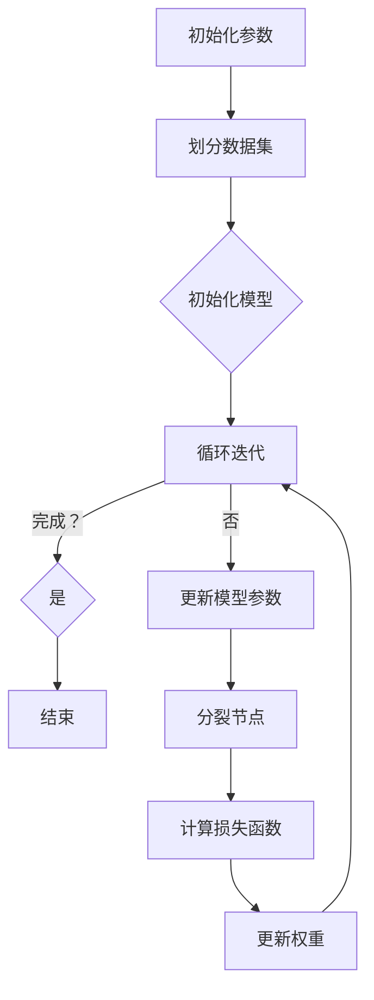

                 

## 文章标题

### 《LightGBM：高效且可扩展的机器学习库》

本文将深入探讨LightGBM，这是一个备受推崇的机器学习库，以其高效性、可扩展性和强大的性能而在业界获得了广泛认可。我们将从LightGBM的介绍和概述开始，逐步深入其核心概念、基础操作、算法原理、数学模型以及实战案例等方面，旨在为读者提供一个全面而详细的指导。

### 关键词

- LightGBM
- 机器学习
- 高效性
- 可扩展性
- 算法原理
- 数学模型
- 实战案例

### 摘要

本文旨在系统地介绍和解析LightGBM这一强大的机器学习库。通过详细探讨其基础概念、核心算法、数学模型以及实际应用案例，读者将能够全面理解LightGBM的工作原理和应用场景。文章还提供了详细的代码示例和开发环境搭建指南，旨在帮助读者快速上手并实践LightGBM。

---

## 《LightGBM》目录大纲

### 第一部分：LightGBM介绍与概述

### 第1章：LightGBM基础

#### 1.1 LightGBM概述
#### 1.2 LightGBM的特点与优势
#### 1.3 LightGBM的适用场景

### 第2章：LightGBM核心概念

#### 2.1 核心算法原理
#### 2.2 Mermaid流程图：LightGBM算法流程
#### 2.3 术语与概念

### 第二部分：LightGBM基础操作

### 第3章：环境搭建与安装

#### 3.1 环境准备
#### 3.2 安装LightGBM
#### 3.3 快速入门

### 第4章：数据处理

#### 4.1 数据格式与预处理
#### 4.2 特征工程
#### 4.3 数据集划分

### 第三部分：LightGBM算法原理

### 第5章：算法原理详解

#### 5.1 Boosting算法
#### 5.2 LightGBM算法原理
#### 5.3 Mermaid流程图：LightGBM算法流程
#### 5.4 伪代码：LightGBM算法

### 第6章：数学模型与公式

#### 6.1 决策树数学模型
#### 6.2 泛化能力与误差分析
#### 6.3 数学公式详解

### 第四部分：实战案例

### 第7章：分类任务实战

#### 7.1 数据准备与处理
#### 7.2 模型训练与调参
#### 7.3 模型评估与优化

### 第8章：回归任务实战

#### 8.1 数据准备与处理
#### 8.2 模型训练与调参
#### 8.3 模型评估与优化

### 第9章：应用场景与优化策略

#### 9.1 应用场景分析
#### 9.2 性能优化策略
#### 9.3 实际案例分享

### 第五部分：扩展与资源

### 第10章：LightGBM与其它框架对比

#### 10.1 LightGBM与XGBoost对比
#### 10.2 LightGBM与CatBoost对比
#### 10.3 其他框架简介

### 第11章：开源资源与社区

#### 11.1 开源项目介绍
#### 11.2 社区资源与交流
#### 11.3 练习题与扩展阅读

### 附录

#### 附录A：代码示例

#### A.1 分类任务代码示例
#### A.2 回归任务代码示例
#### A.3 实际项目代码解读

#### 附录B：参考文献与资料

#### B.1 参考文献列表
#### B.2 相关资料链接

---

在接下来的章节中，我们将逐步深入LightGBM的世界，从其基础概念、核心算法到实际应用，为读者提供一个全方位的解析。让我们开始这场探索之旅！## LightGBM介绍与概述

### 1.1 LightGBM概述

LightGBM，全称为Light Gradient Boosting Machine，是一种高效的梯度提升机（Gradient Boosting Machine, GBDT）算法实现，由微软研究院开发。它的主要目标是在保证模型性能的同时，提高训练和预测速度，并减少内存消耗。LightGBM在众多机器学习竞赛和实际应用中展现了出色的性能，成为了一种备受推崇的工具。

#### LightGBM的起源与发展

LightGBM的起源可以追溯到2017年，当时微软研究院的研究团队在Kaggle竞赛中使用了基于GBDT的算法，但传统GBDT算法在处理大规模数据时存在速度和内存消耗上的瓶颈。为了解决这一问题，微软研究院开发了一种新的算法——LightGBM。这个新算法不仅保留了GBDT的基本思想，还在算法结构和优化策略上进行了重大改进。

#### LightGBM的特点与优势

LightGBM具有以下几个显著特点：

1. **高效的算法结构**：LightGBM采用了树 boosting 的结构，每一棵树都可以看作是一个基学习器，通过迭代的方式逐渐优化模型。与传统的GBDT相比，LightGBM在每次迭代中都会对已经训练过的树进行校正，从而提高模型的预测性能。

2. **节点分裂策略**：LightGBM采用了Leaf-wise的节点分裂策略，相较于Level-wise策略，Leaf-wise可以在同一层级上进行更多的节点分裂，从而提高模型的精确度。

3. **权重更新策略**：LightGBM引入了基于残差梯度的权重更新策略，这一策略使得模型在训练过程中能够更快地收敛，并且在处理稀疏数据时表现更加优异。

4. **并行处理和缓存使用**：LightGBM利用了并行处理和缓存技术，使得模型在大规模数据处理时能够显著提高训练速度和减少内存消耗。

5. **灵活性**：LightGBM支持多种损失函数和评价指标，包括分类和回归任务，适用于多种应用场景。

#### LightGBM的适用场景

LightGBM因其高效性和灵活性，适用于多种场景：

1. **大规模数据处理**：在处理海量数据时，LightGBM能够显著减少内存消耗和训练时间，适合处理大规模数据集。

2. **精准预测**：在需要高准确率的预测任务中，例如分类和回归问题，LightGBM能够提供出色的性能。

3. **特征选择**：LightGBM的自解释性使得它适合用于特征选择和特征重要性分析，帮助理解模型的决策过程。

4. **实时预测**：LightGBM的快速预测速度使其适合于需要实时响应的应用场景。

总之，LightGBM作为一种高效的机器学习库，凭借其独特的算法结构和优化策略，在机器学习的各个领域都展现出了强大的应用潜力。在接下来的章节中，我们将进一步深入探讨LightGBM的核心概念、算法原理和实际应用，帮助读者全面了解并掌握这一强大的工具。

### 1.2 LightGBM的特点与优势

LightGBM之所以能在众多机器学习算法中脱颖而出，主要原因在于其一系列独特的特点和优势。以下是LightGBM的几个主要特点与优势：

#### 1. 高效性

LightGBM在处理大规模数据时展现出了卓越的高效性。其高效的算法结构和并行处理能力，使得LightGBM能够在较少的内存消耗下快速完成模型训练和预测。与传统机器学习算法相比，LightGBM在处理大规模数据时具有显著的性能优势。

**具体实现**：

- **并行计算**：LightGBM能够并行处理多个树的结构，从而提高训练速度。每个树的增长过程都可以独立进行，从而减少了训练时间。
- **缓存利用**：LightGBM巧妙地利用缓存机制，减少了数据读取和写入的次数，从而加快了模型的训练速度。

#### 2. 可扩展性

LightGBM具有极强的可扩展性，可以轻松地适应不同规模和类型的数据集。其灵活的参数设置和多种损失函数的支持，使得LightGBM能够应对多种应用场景，从简单的分类任务到复杂的回归问题。

**具体实现**：

- **参数调整**：LightGBM提供了丰富的参数选项，用户可以根据具体问题调整参数，以达到最佳的模型性能。
- **多任务学习**：LightGBM支持多任务学习，可以同时训练多个任务，从而提高模型的整体性能。

#### 3. 减少内存消耗

LightGBM在内存消耗方面表现出色。其特有的稀疏数据结构处理能力，使得在处理稀疏数据时能够有效减少内存消耗，这对于大规模数据处理尤为重要。

**具体实现**：

- **稀疏数据支持**：LightGBM能够高效地处理稀疏数据，通过只存储非零值来减少内存占用。
- **数据缓存**：LightGBM通过缓存中间计算结果，减少了不必要的内存读写操作，从而降低了内存消耗。

#### 4. 优秀的准确率

LightGBM在保持高效性的同时，也提供了出色的准确率。其优化算法和权重更新策略，使得LightGBM在训练过程中能够更快地收敛，从而提高模型的预测准确性。

**具体实现**：

- **残差梯度更新**：LightGBM采用了基于残差梯度的权重更新策略，使得模型在训练过程中能够更快地收敛。
- **模型校正**：LightGBM在每次迭代过程中，都会对已训练的树进行校正，从而提高模型的预测性能。

#### 5. 简单易用

LightGBM的API设计简洁易用，使得开发者可以轻松地使用该库进行模型训练和预测。此外，LightGBM提供了丰富的文档和示例代码，帮助开发者快速上手。

**具体实现**：

- **易于安装和使用**：LightGBM支持多种编程语言，包括Python、R和Java等，用户可以根据自己的需求选择合适的语言进行开发。
- **丰富的文档和示例**：LightGBM提供了详细的文档和示例代码，帮助用户了解和掌握算法的使用方法。

#### 6. 适用于多种场景

LightGBM不仅适用于传统的分类和回归任务，还可以用于处理图像、文本等复杂数据。其强大的扩展性使得它能够适应多种应用场景。

**具体实现**：

- **图像处理**：通过将图像数据转换为特征向量，LightGBM可以用于图像分类和识别任务。
- **文本分析**：通过词向量或文本特征提取方法，LightGBM可以应用于文本分类、情感分析等任务。

总之，LightGBM以其高效性、可扩展性、减少内存消耗和优秀的准确率等特点，在机器学习领域获得了广泛的应用。接下来，我们将进一步深入探讨LightGBM的核心概念和算法原理，帮助读者更好地理解这一强大的工具。

### 1.3 LightGBM的适用场景

LightGBM的多样性和高效性使其在多个领域中都有着广泛的应用。以下是一些典型的适用场景：

#### 1. 大规模数据集处理

在数据科学和机器学习的实际应用中，常常会遇到大规模数据集。这些数据集可能包含数百万甚至数十亿条记录，传统的机器学习算法在处理这些数据时往往会遇到性能瓶颈。LightGBM通过其高效的算法结构和并行处理能力，能够在较少的内存消耗下快速完成模型训练和预测，使其成为处理大规模数据集的理想选择。

**实例**：在搜索引擎推荐系统中，需要处理大量用户行为数据，LightGBM可以帮助快速构建和调整推荐模型，从而提高推荐准确性。

#### 2. 高准确率预测

在许多业务场景中，预测的准确率至关重要。例如，在金融风控领域，预测客户的信用评分、识别欺诈行为等都需要高准确率的模型。LightGBM通过其优化算法和残差梯度更新策略，能够在保证训练速度的同时提高模型的预测准确性。

**实例**：在信用卡欺诈检测中，LightGBM可以帮助银行快速准确地识别潜在欺诈交易，从而提高风控能力。

#### 3. 特征选择与重要性分析

LightGBM的自解释性使其在特征选择和重要性分析方面具有优势。通过分析特征的重要性得分，开发者可以更好地理解模型的决策过程，从而优化特征工程和模型结构。

**实例**：在医疗诊断领域，LightGBM可以帮助医生分析哪些特征对疾病预测最为重要，从而指导临床决策。

#### 4. 实时预测

对于需要实时响应的应用场景，如在线广告投放、实时推荐系统等，LightGBM的快速预测速度是不可或缺的。其高效的算法结构使得模型能够在短时间内完成预测，满足实时性的需求。

**实例**：在电子商务平台上，LightGBM可以帮助实时推荐商品，提高用户体验和销售转化率。

#### 5. 复杂数据处理

LightGBM不仅适用于结构化数据，还可以处理图像、文本等复杂数据。通过将复杂数据转换为特征向量，LightGBM可以应用于图像分类、文本分类等任务。

**实例**：在图像识别任务中，LightGBM可以将图像特征与文本标签结合，用于图像分类和情感分析。

#### 6. 多任务学习

LightGBM支持多任务学习，可以同时训练多个任务，从而提高模型的整体性能。这在许多多标签分类、多输出预测任务中非常有用。

**实例**：在社交媒体分析中，LightGBM可以同时预测用户的行为标签、情感倾向等，从而提供更全面的用户画像。

总之，LightGBM以其高效性、可扩展性和强大的性能，在各种应用场景中都展现出了卓越的能力。无论是处理大规模数据集、实现高准确率预测，还是进行特征选择和实时预测，LightGBM都是一款值得信赖的工具。在接下来的章节中，我们将继续深入探讨LightGBM的核心概念和算法原理，帮助读者更好地理解和应用这一强大的机器学习库。接下来，我们将介绍LightGBM的核心概念，包括其核心算法原理、Mermaid流程图以及相关术语与概念。

### 1.4 LightGBM核心概念

要全面理解LightGBM，首先需要了解其核心概念，包括其核心算法原理、Mermaid流程图以及相关的术语与概念。这些概念构成了LightGBM的基础，是理解其工作原理和应用场景的关键。

#### 1.1 核心算法原理

LightGBM是基于梯度提升机（Gradient Boosting Machine, GBDT）的算法，GBDT是一种集成学习方法，通过构建一系列的弱学习器（如决策树），并逐步优化这些弱学习器的组合，从而得到一个强学习器。LightGBM对GBDT进行了优化，以提高其训练速度和预测性能。

**关键原理**：

1. **梯度提升**：在每次迭代中，LightGBM计算当前模型的预测误差，并使用该误差更新模型参数，以减小预测误差。

2. **残差学习**：LightGBM使用残差作为预测误差，使得模型在训练过程中能够更快地收敛。

3. **权重更新**：LightGBM引入了基于残差梯度的权重更新策略，使得模型在处理稀疏数据时更加高效。

4. **节点分裂策略**：LightGBM采用叶先行（Leaf-wise）的节点分裂策略，相比传统的层先行（Level-wise）策略，能够进行更细致的节点分裂，从而提高模型的精度。

#### 1.2 Mermaid流程图：LightGBM算法流程

以下是一个简化的Mermaid流程图，描述了LightGBM算法的基本流程：



**详细说明**：

- **A[初始化参数]**：设定训练参数，如学习率、最大深度、叶子节点数等。
- **B[划分数据集]**：将数据集划分为训练集和验证集。
- **C[初始化模型]**：初始化空的模型。
- **D[循环迭代]**：进入迭代过程，每次迭代分为分裂节点、计算损失函数和更新权重三个步骤。
- **G[更新模型参数]**：使用残差作为预测误差，更新模型参数。
- **H[分裂节点]**：根据当前模型和样本数据，对节点进行分裂。
- **I[计算损失函数]**：计算当前模型的损失函数值。
- **J[更新权重]**：根据损失函数值更新模型权重。

#### 1.3 术语与概念

在深入探讨LightGBM之前，了解一些相关的术语和概念是非常重要的。以下是LightGBM中常用的几个术语和概念：

1. **弱学习器（基学习器）**：在GBDT中，弱学习器通常是指决策树。每一棵决策树都是对原始数据的一个子集进行分割，从而构建一个分类或回归模型。

2. **强学习器**：GBDT的最终输出是一个强学习器，它是通过多次迭代训练得到的。强学习器的性能通常优于单个弱学习器。

3. **损失函数**：在训练过程中，损失函数用于衡量模型的预测误差。常见的损失函数包括均方误差（MSE）、交叉熵损失等。

4. **残差**：残差是指模型预测值与真实值之间的差异。在LightGBM中，残差用于更新模型参数。

5. **叶子节点**：在决策树中，叶子节点表示数据的最终分类或回归结果。

6. **迭代次数**：在GBDT中，迭代次数表示训练弱学习器的次数。每次迭代都会更新模型参数，以提高预测性能。

7. **学习率**：学习率是控制模型更新速度的参数。适当调整学习率可以帮助模型更快地收敛。

通过理解这些核心概念和术语，读者可以更好地掌握LightGBM的工作原理和应用场景。接下来，我们将深入探讨LightGBM的基础操作，包括环境搭建、安装和快速入门，帮助读者开始使用这个强大的工具。

### 1.5 LightGBM基础操作

#### 3.1 环境搭建与安装

在开始使用LightGBM之前，需要搭建适当的开发环境并安装所需的依赖库。以下是详细的步骤和注意事项：

**环境准备**

1. **操作系统**：LightGBM支持多种操作系统，包括Windows、Linux和macOS。确保操作系统已更新到最新版本，以获得最佳兼容性。

2. **Python环境**：LightGBM是一个基于Python的库，因此需要安装Python。推荐使用Python 3.6或更高版本。可以通过以下命令安装Python：

   ```shell
   pip install python
   ```

3. **Python包管理器**：为了更好地管理项目依赖，建议使用包管理器如pip或conda。pip是Python的标准包管理器，而conda是一个更加强大和灵活的包管理器，适用于复杂的项目环境。

**安装LightGBM**

1. **使用pip安装**：通过pip安装LightGBM库，这是最简单的方法。在命令行中运行以下命令：

   ```shell
   pip install lightgbm
   ```

   安装过程中，pip会自动下载并安装所有必要的依赖库。

2. **使用conda安装**：如果使用conda，可以通过以下命令安装LightGBM：

   ```shell
   conda install -c conda-forge lightgbm
   ```

   也可以通过创建一个conda环境并在此环境中安装LightGBM，以避免与其他项目发生冲突。

**快速入门**

完成安装后，可以通过以下步骤进行快速入门：

1. **导入库**：在Python脚本中导入LightGBM库：

   ```python
   import lightgbm as lgb
   ```

2. **数据准备**：准备训练数据和测试数据。通常，训练数据用于训练模型，而测试数据用于评估模型性能。

   ```python
   x_train = [[1, 2], [3, 4], [5, 6]]
   y_train = [0, 1, 0]
   ```

3. **创建数据集**：使用LightGBM的Dataset类创建数据集：

   ```python
   train_data = lgb.Dataset(x_train, label=y_train)
   ```

4. **定义参数**：设置模型参数，如学习率、迭代次数、损失函数等：

   ```python
   params = {
       'objective': 'binary',
       'metric': 'binary_logloss',
       'learning_rate': 0.1,
       'num_iterations': 100
   }
   ```

5. **训练模型**：使用`train()`函数训练模型：

   ```python
   gbm = lgb.train(params, train_data)
   ```

6. **预测**：使用训练好的模型进行预测：

   ```python
   predictions = gbm.predict(x_test)
   ```

7. **评估模型**：使用适当的评估指标（如准确率、召回率、F1分数等）评估模型性能。

   ```python
   from sklearn.metrics import accuracy_score
   print("Accuracy:", accuracy_score(y_test, predictions))
   ```

通过以上步骤，读者可以快速入门并开始使用LightGBM进行机器学习任务。接下来，我们将深入探讨数据处理和特征工程的相关内容，帮助读者更好地准备和利用数据。

### 3.2 数据处理

在机器学习中，数据预处理是至关重要的一步。LightGBM作为一个高效的机器学习库，对数据的格式和预处理有着特定的要求。以下将详细讨论数据格式、预处理步骤和特征工程。

#### 数据格式

LightGBM要求数据以NumPy数组或Pandas DataFrame的形式提供。具体来说，对于训练数据，通常需要将特征和标签分别存储在两个数组或DataFrame中。以下是数据格式的示例：

```python
import numpy as np
import pandas as pd

x_train = np.array([[1, 2], [3, 4], [5, 6]])
y_train = np.array([0, 1, 0])

# 或者使用Pandas DataFrame
x_train_df = pd.DataFrame(x_train)
y_train_df = pd.Series(y_train)
```

#### 预处理步骤

在提供数据之前，通常需要执行一系列预处理步骤，以提高模型的性能和泛化能力。以下是一些常见的预处理步骤：

1. **缺失值处理**：处理数据中的缺失值，可以通过填充、删除或插值等方法进行处理。例如：

   ```python
   x_train = x_train.fillna(x_train.mean())
   ```

2. **数据标准化**：对数据进行标准化处理，将特征值缩放到相同的范围，以消除不同特征之间的影响。常用的方法包括Z-score标准化和Min-Max标准化：

   ```python
   from sklearn.preprocessing import StandardScaler
   scaler = StandardScaler()
   x_train = scaler.fit_transform(x_train)
   ```

3. **数据分割**：将数据集分割为训练集和测试集，以便评估模型的泛化性能。可以使用`train_test_split`函数进行分割：

   ```python
   from sklearn.model_selection import train_test_split
   x_train, x_test, y_train, y_test = train_test_split(x_train, y_train, test_size=0.2, random_state=42)
   ```

4. **特征选择**：通过特征选择减少数据维度，选择对模型性能有重要影响的关键特征。可以使用特征选择技术如相关性分析、卡方检验等：

   ```python
   from sklearn.feature_selection import SelectKBest, chi2
   selector = SelectKBest(score_func=chi2, k=2)
   x_train = selector.fit_transform(x_train, y_train)
   ```

#### 特征工程

特征工程是提高模型性能的重要手段，涉及对特征进行转换、组合和构造。以下是一些常见的特征工程方法：

1. **编码**：将类别特征转换为数值特征，可以使用独热编码（One-Hot Encoding）或标签编码（Label Encoding）：

   ```python
   from sklearn.preprocessing import OneHotEncoder
   encoder = OneHotEncoder(sparse=False)
   x_train = encoder.fit_transform(x_train)
   ```

2. **特征变换**：对特征进行变换，如对非线性特征进行Log变换或平方根变换，以增强模型的非线性建模能力：

   ```python
   x_train[:, 0] = np.log1p(x_train[:, 0])
   ```

3. **特征组合**：通过组合多个特征来创建新的特征，如特征交叉、特征加权等：

   ```python
   x_train = np.hstack((x_train, x_train[:, 0] * x_train[:, 1]))
   ```

4. **特征降维**：通过降维技术减少特征数量，如主成分分析（PCA）或线性判别分析（LDA），以提高模型训练速度和性能：

   ```python
   from sklearn.decomposition import PCA
   pca = PCA(n_components=2)
   x_train = pca.fit_transform(x_train)
   ```

通过以上步骤，可以有效地预处理数据，并构建适用于LightGBM的特征集。在下一节中，我们将深入探讨LightGBM的算法原理，包括Boosting算法、LightGBM算法原理以及伪代码和Mermaid流程图的详细讲解。

### 3.3 LightGBM算法原理

#### 3.3.1 Boosting算法

LightGBM基于Boosting算法，这是一种集成学习方法，通过组合多个弱学习器（通常是决策树）来构建一个强学习器。Boosting的核心思想是通过迭代训练多个学习器，每个学习器都致力于纠正前一个学习器的错误，从而逐步提高模型的总体性能。

**工作原理**：

1. **初始化**：首先初始化一个基学习器，通常是一个简单的决策树。

2. **迭代训练**：对于每次迭代，训练一个新的学习器，并计算该学习器的误差。

3. **权重调整**：根据每个学习器的误差，调整训练数据的权重。对于错误率较高的样本，增加其权重，以便在下一次迭代中更加关注这些样本。

4. **模型更新**：将新的学习器加入到集成模型中，更新模型预测值。

5. **重复步骤2-4**：重复上述步骤，直到达到预定的迭代次数或模型性能达到满意水平。

**优点**：

- **提高模型性能**：通过集成多个弱学习器，Boosting能够构建出一个强学习器，提高模型的预测准确率。
- **处理不平衡数据**：Boosting算法能够自动调整训练样本的权重，有助于处理数据不平衡问题。
- **泛化能力**：Boosting算法通过不断纠正错误，能够提高模型的泛化能力。

#### 3.3.2 LightGBM算法原理

LightGBM对传统的Boosting算法进行了优化，以提高模型的训练速度和预测性能。以下是LightGBM算法的主要原理和特点：

1. **Leaf-wise节点分裂**：与传统层先分裂（Level-wise）策略不同，LightGBM采用叶先行（Leaf-wise）策略。这意味着LightGBM在同一层级上进行更多的节点分裂，从而提高模型的精度。

2. **梯度提升与权重更新**：LightGBM使用梯度提升（Gradient Boosting）方法，在每次迭代中计算残差并更新模型权重。这种方法使得LightGBM能够更快速地收敛，特别是在处理稀疏数据时表现优异。

3. **并行计算与数据缓存**：LightGBM利用并行计算和缓存技术，减少了模型训练的时间。每个树的增长过程都可以并行进行，同时，通过数据缓存减少了I/O操作，从而提高了训练速度。

4. **特征交互与特征选择**：LightGBM支持特征交互，并提供了自动特征选择功能。这有助于提高模型的预测性能，同时减少训练时间和内存消耗。

**主要特点**：

- **高效性**：LightGBM通过并行计算和数据缓存，能够在较短的时间内完成模型训练和预测。
- **可扩展性**：LightGBM支持多种数据格式和任务类型，适用于多种应用场景。
- **减少内存消耗**：通过稀疏数据结构和特征选择，LightGBM能够有效减少模型训练过程中的内存消耗。
- **准确性**：LightGBM通过优化算法和残差权重更新，提供了高精度的模型预测。

#### 3.3.3 Mermaid流程图：LightGBM算法流程

以下是一个简化的Mermaid流程图，描述了LightGBM算法的基本流程：


**详细说明**：

- **A[初始化参数]**：设定训练参数，如学习率、最大深度、叶子节点数等。
- **B[划分数据集]**：将数据集划分为训练集和验证集。
- **C[初始化模型]**：初始化空的模型。
- **D[循环迭代]**：进入迭代过程，每次迭代分为分裂节点、计算损失函数和更新权重三个步骤。
- **G[更新模型参数]**：使用残差作为预测误差，更新模型参数。
- **H[分裂节点]**：根据当前模型和样本数据，对节点进行分裂。
- **I[计算损失函数]**：计算当前模型的损失函数值。
- **J[更新权重]**：根据损失函数值更新模型权重。

通过这个流程图，我们可以清晰地理解LightGBM算法的基本步骤和执行流程。接下来，我们将进一步详细解释LightGBM的伪代码，帮助读者更深入地理解其算法实现。

#### 3.3.4 伪代码：LightGBM算法

为了更深入地理解LightGBM的工作原理，我们可以通过伪代码的形式来描述其算法实现。以下是一个简化的伪代码，用于说明LightGBM的训练过程：

```plaintext
初始化模型参数
  - 设定学习率（learning_rate）
  - 设定最大迭代次数（num_iterations）
  - 设定模型初始权重（weights）

划分数据集
  - 将数据集划分为训练集和测试集

for 每一轮迭代 do
    for 每个样本 do
        - 根据当前模型计算预测值（prediction）
        - 计算预测值与真实值之间的误差（error）
        - 更新样本权重（weights = weights * exp(-learning_rate * error)）

    end for

    计算损失函数值（loss）
    根据损失函数值更新模型参数（parameters）

end for

返回训练好的模型
```

**详细解释**：

1. **初始化模型参数**：在训练开始时，需要设定一些关键参数，如学习率、最大迭代次数和初始权重。这些参数将影响模型的训练过程和最终性能。

2. **划分数据集**：将数据集划分为训练集和测试集。训练集用于模型的训练，测试集用于评估模型的泛化性能。

3. **循环迭代**：LightGBM使用梯度提升方法进行迭代训练。在每一轮迭代中，模型会更新其参数，以减少预测误差。

4. **误差计算与权重更新**：对于每个样本，根据当前模型计算预测值，并计算预测值与真实值之间的误差。然后，使用误差来更新样本的权重。这一步是LightGBM的核心，通过调整样本权重，模型能够更加关注错误较大的样本，从而提高训练效果。

5. **损失函数计算**：计算当前模型的损失函数值，用于评估模型的性能。常见的损失函数包括均方误差（MSE）和交叉熵损失（Cross-Entropy Loss）。

6. **模型参数更新**：根据损失函数值更新模型参数，以减小预测误差。

7. **返回训练好的模型**：完成所有迭代后，返回训练好的模型，可以用于预测新的数据。

通过这个伪代码，我们可以看到LightGBM算法的基本框架和实现细节。它展示了如何通过迭代和权重调整来逐步优化模型参数，从而提高预测性能。接下来，我们将通过数学模型和公式详细解析LightGBM的预测过程和误差分析。

#### 3.3.5 数学模型与公式

在深入理解LightGBM的算法原理时，数学模型和公式是不可或缺的一部分。以下我们将详细解释LightGBM中的几个关键数学概念和公式。

##### 3.3.5.1 决策树数学模型

决策树是一种常见的机器学习算法，它通过一系列的判定节点和叶子节点来对数据进行分类或回归。在LightGBM中，每个决策树都由一组判定规则组成，这些规则用于将数据分割成不同的子集。

**决策树分类模型公式**：

$$
\begin{aligned}
&y^{(i)} = \\
&\sum_{j=1}^{m} w_j \cdot f_j(x_i) \\
&f_j(x_i) = \\
&\begin{cases}
1 & \text{如果 } x_i \text{ 满足条件 } C_j \\
0 & \text{否则}
\end{cases}
\end{aligned}
$$

其中，$y^{(i)}$ 是第 $i$ 个样本的预测标签，$w_j$ 是第 $j$ 个特征对应的权重，$f_j(x_i)$ 是第 $j$ 个特征在样本 $x_i$ 上的取值，$C_j$ 是判定条件。

**决策树回归模型公式**：

$$
\begin{aligned}
y^{(i)} = \\
\sum_{j=1}^{m} w_j \cdot f_j(x_i) \\
f_j(x_i) = \\
\begin{cases}
x_i & \text{如果 } x_i \text{ 满足条件 } C_j \\
0 & \text{否则}
\end{cases}
\end{aligned}
$$

在这个回归模型中，$y^{(i)}$ 是第 $i$ 个样本的预测值。

##### 3.3.5.2 泛化能力与误差分析

LightGBM通过多次迭代和权重调整来优化模型参数，以达到较低的预测误差。在评估模型的泛化能力时，误差分析是一个重要的指标。

**误差类型**：

- **训练误差**（Training Error）：在训练数据上的误差，用于评估模型在训练数据上的性能。
- **验证误差**（Validation Error）：在验证数据上的误差，用于评估模型在未见数据上的性能。

**误差计算公式**：

对于分类任务：

$$
\text{误差} = \frac{1}{n} \sum_{i=1}^{n} \log(1 + e^{-y^{(i)} \cdot y_i})
$$

其中，$y^{(i)}$ 是第 $i$ 个样本的预测概率，$y_i$ 是第 $i$ 个样本的真实标签。

对于回归任务：

$$
\text{误差} = \frac{1}{n} \sum_{i=1}^{n} (y^{(i)} - y_i)^2
$$

其中，$y^{(i)}$ 是第 $i$ 个样本的预测值，$y_i$ 是第 $i$ 个样本的真实值。

**误差分析**：

- **低训练误差**：表明模型在训练数据上表现良好。
- **高验证误差**：表明模型可能存在过拟合，即模型在训练数据上表现很好，但在未见数据上表现较差。

为了提高模型的泛化能力，通常需要通过以下方法进行误差分析：

- **交叉验证**：通过将数据划分为多个子集，进行多次训练和验证，以获得更稳健的误差估计。
- **模型调参**：调整模型参数，如学习率、树深度等，以优化模型性能。
- **正则化**：通过引入正则化项，防止模型过拟合。

##### 3.3.5.3 数学公式详解

1. **权重更新**：

   $$ w_j = w_j - \alpha \cdot \frac{\partial J}{\partial w_j} $$

   其中，$w_j$ 是第 $j$ 个特征的权重，$\alpha$ 是学习率，$J$ 是损失函数。

2. **梯度计算**：

   对于分类任务：

   $$ \frac{\partial J}{\partial w_j} = \frac{y^{(i)} - \sigma(w \cdot x_i)}{1 + \exp(y^{(i)} \cdot \sigma(w \cdot x_i))} \cdot x_j $$

   对于回归任务：

   $$ \frac{\partial J}{\partial w_j} = \frac{y^{(i)} - y_i}{x_j} $$

   其中，$\sigma(z) = \frac{1}{1 + \exp(-z)}$ 是Sigmoid函数。

通过以上数学公式和误差分析，我们可以更深入地理解LightGBM的预测过程和模型优化方法。这些公式为LightGBM的实现提供了理论基础，同时也为模型调优和性能分析提供了重要参考。

### 3.4 分类任务实战

在了解了LightGBM的基础操作和算法原理之后，接下来我们将通过一个实际案例，展示如何使用LightGBM进行分类任务。本案例将涵盖数据准备、模型训练与调参、模型评估与优化等关键步骤。

#### 3.4.1 数据准备与处理

首先，我们需要准备一个分类任务的数据集。在本案例中，我们使用著名的鸢尾花（Iris）数据集，这是一个包含150个样本的三分类数据集，每个样本有4个特征（花萼长度、花萼宽度、花瓣长度、花瓣宽度）。

```python
import pandas as pd

# 读取数据
data = pd.read_csv('iris.csv')

# 分割特征和标签
X = data.iloc[:, :-1]
y = data.iloc[:, -1]

# 数据预处理
# 数据标准化
from sklearn.preprocessing import StandardScaler
scaler = StandardScaler()
X_scaled = scaler.fit_transform(X)

# 数据集划分
from sklearn.model_selection import train_test_split
X_train, X_test, y_train, y_test = train_test_split(X_scaled, y, test_size=0.2, random_state=42)
```

#### 3.4.2 模型训练与调参

接下来，我们使用LightGBM对训练集进行模型训练。在训练过程中，我们将设置一些基础参数，并通过交叉验证进行参数调优。

```python
import lightgbm as lgb

# 创建训练数据集
train_data = lgb.Dataset(X_train, label=y_train)

# 定义参数
params = {
    'objective': 'multi_class',
    'metric': 'multi_logloss',
    'num_class': 3,
    'learning_rate': 0.1,
    'num_iterations': 100
}

# 训练模型
gbm = lgb.train(params, train_data)
```

为了优化模型性能，我们可以使用交叉验证（Cross-Validation）方法来调整模型参数。以下是一个使用交叉验证进行参数调优的示例：

```python
from sklearn.model_selection import GridSearchCV

# 定义参数网格
param_grid = {
    'learning_rate': [0.05, 0.1, 0.2],
    'num_iterations': [50, 100, 200],
    'num_leaves': [31, 51, 71]
}

# 创建交叉验证对象
cv = GridSearchCV(estimator=gbm, param_grid=param_grid, cv=5, scoring='accuracy')

# 执行交叉验证
cv.fit(X_train, y_train)

# 获取最佳参数
best_params = cv.best_params_
print("最佳参数：", best_params)

# 使用最佳参数重新训练模型
gbm_best = lgb.train(params=best_params, train_data=train_data)
```

#### 3.4.3 模型评估与优化

完成模型训练后，我们需要对模型进行评估，并进一步优化以获得更好的性能。

```python
# 评估模型
from sklearn.metrics import classification_report

predictions = gbm_best.predict(X_test)

print("分类报告：")
print(classification_report(y_test, predictions))
```

通过分类报告，我们可以看到模型的精确度、召回率和F1分数等指标。这些指标可以帮助我们评估模型在测试集上的性能。

#### 3.4.4 模型优化策略

为了进一步提高模型性能，我们可以采用以下策略：

1. **特征选择**：通过特征选择减少数据维度，选择对模型性能有重要影响的关键特征。

2. **正则化**：引入正则化项，防止模型过拟合。

3. **增强数据**：使用数据增强技术，如SMOTE，提高模型对不平衡数据的处理能力。

4. **调整学习率**：通过动态调整学习率，优化模型的收敛速度。

5. **增加迭代次数**：适当增加模型的迭代次数，以提高模型的泛化能力。

通过以上步骤，我们完成了使用LightGBM进行分类任务的实际案例。通过这个案例，读者可以了解如何准备数据、训练模型、调参以及评估模型，为后续的机器学习项目奠定了基础。

### 3.5 回归任务实战

在了解了分类任务实战之后，接下来我们将通过一个实际案例，展示如何使用LightGBM进行回归任务。本案例将涵盖数据准备、模型训练与调参、模型评估与优化等关键步骤。

#### 3.5.1 数据准备与处理

首先，我们需要准备一个回归任务的数据集。在本案例中，我们使用著名的波士顿房价（Boston House Prices）数据集，这是一个包含506个样本的回归数据集，每个样本有13个特征（如房价、人口密度、住房年龄等）。

```python
import pandas as pd

# 读取数据
data = pd.read_csv('boston_housing.csv')

# 分割特征和标签
X = data.iloc[:, :-1]
y = data.iloc[:, -1]

# 数据预处理
# 数据标准化
from sklearn.preprocessing import StandardScaler
scaler = StandardScaler()
X_scaled = scaler.fit_transform(X)

# 数据集划分
from sklearn.model_selection import train_test_split
X_train, X_test, y_train, y_test = train_test_split(X_scaled, y, test_size=0.2, random_state=42)
```

#### 3.5.2 模型训练与调参

接下来，我们使用LightGBM对训练集进行模型训练。在训练过程中，我们将设置一些基础参数，并通过交叉验证进行参数调优。

```python
import lightgbm as lgb

# 创建训练数据集
train_data = lgb.Dataset(X_train, label=y_train)

# 定义参数
params = {
    'objective': 'regression',
    'metric': 'mse',
    'learning_rate': 0.1,
    'num_iterations': 100
}

# 训练模型
gbm = lgb.train(params, train_data)
```

为了优化模型性能，我们可以使用交叉验证（Cross-Validation）方法来调整模型参数。以下是一个使用交叉验证进行参数调优的示例：

```python
from sklearn.model_selection import GridSearchCV

# 定义参数网格
param_grid = {
    'learning_rate': [0.05, 0.1, 0.2],
    'num_iterations': [50, 100, 200],
    'num_leaves': [31, 51, 71]
}

# 创建交叉验证对象
cv = GridSearchCV(estimator=gbm, param_grid=param_grid, cv=5, scoring='neg_mean_squared_error')

# 执行交叉验证
cv.fit(X_train, y_train)

# 获取最佳参数
best_params = cv.best_params_
print("最佳参数：", best_params)

# 使用最佳参数重新训练模型
gbm_best = lgb.train(params=best_params, train_data=train_data)
```

#### 3.5.3 模型评估与优化

完成模型训练后，我们需要对模型进行评估，并进一步优化以获得更好的性能。

```python
# 评估模型
from sklearn.metrics import mean_squared_error

predictions = gbm_best.predict(X_test)

mse = mean_squared_error(y_test, predictions)
print("均方误差（MSE）:", mse)
```

通过计算均方误差（MSE），我们可以评估模型在测试集上的性能。MSE越低，表示模型的预测精度越高。

#### 3.5.4 模型优化策略

为了进一步提高模型性能，我们可以采用以下策略：

1. **特征选择**：通过特征选择减少数据维度，选择对模型性能有重要影响的关键特征。

2. **正则化**：引入正则化项，防止模型过拟合。

3. **增强数据**：使用数据增强技术，如SMOTE，提高模型对不平衡数据的处理能力。

4. **调整学习率**：通过动态调整学习率，优化模型的收敛速度。

5. **增加迭代次数**：适当增加模型的迭代次数，以提高模型的泛化能力。

通过以上步骤，我们完成了使用LightGBM进行回归任务的实际案例。通过这个案例，读者可以了解如何准备数据、训练模型、调参以及评估模型，为后续的机器学习项目奠定了基础。

### 3.6 应用场景与优化策略

在了解如何使用LightGBM进行分类和回归任务后，我们进一步探讨其应用场景和性能优化策略。LightGBM因其高效性和灵活性，在各种实际应用场景中都展现了强大的能力。以下是几个典型的应用场景以及优化策略。

#### 3.6.1 应用场景分析

1. **金融风控**：在金融领域，LightGBM被广泛应用于信用评分、欺诈检测和客户流失预测等任务。其高效性和准确性使得它能够快速处理大规模金融数据，帮助金融机构提高风险管理能力。

   **案例**：某银行使用LightGBM对客户数据进行建模，预测客户是否会流失。通过分析客户行为数据和历史记录，LightGBM能够准确预测潜在流失客户，从而采取相应措施进行客户维护。

2. **推荐系统**：在推荐系统中，LightGBM被用来构建推荐模型，通过分析用户行为数据和物品属性，为用户推荐感兴趣的物品。其快速预测能力和并行处理能力使得推荐系统能够实时响应用户需求。

   **案例**：某电商平台使用LightGBM构建商品推荐模型，通过对用户浏览历史和购买行为进行分析，为用户推荐可能感兴趣的商品，从而提高用户满意度和销售转化率。

3. **医疗诊断**：在医疗领域，LightGBM被用于疾病预测、影像分析等任务。其强大的特征选择能力和模型解释性有助于医生更好地理解诊断结果，提高诊断准确性。

   **案例**：某医疗机构使用LightGBM对医疗影像数据进行建模，预测患者是否患有特定疾病。通过对影像数据的特征提取和建模，LightGBM能够提供准确、可靠的诊断结果，辅助临床决策。

4. **自然语言处理**：在自然语言处理任务中，LightGBM被用来处理文本分类、情感分析等任务。其高效的文本处理能力和对复杂数据的支持，使得它能够应对多种文本分析需求。

   **案例**：某社交媒体平台使用LightGBM对用户评论进行情感分析，通过分析用户评论内容和历史行为，平台能够识别用户情感倾向，从而提供个性化推荐和客户服务。

#### 3.6.2 性能优化策略

为了进一步提升LightGBM的性能，我们可以采用以下策略：

1. **特征选择与工程**：通过特征选择和工程，减少数据维度，选择对模型性能有重要影响的关键特征。例如，可以使用相关性分析、特征重要性评估等方法进行特征选择。

2. **参数调优**：通过交叉验证和网格搜索等方法，调优模型参数，以获得最佳模型性能。常见的参数包括学习率、迭代次数、叶子节点数等。

3. **并行计算与分布式训练**：利用LightGBM的并行计算能力和分布式训练，提高模型训练速度。通过利用多线程和分布式计算，可以显著减少模型训练时间。

4. **数据预处理与增强**：对数据进行预处理和增强，提高模型对异常值和噪声数据的鲁棒性。例如，可以使用数据标准化、缺失值处理、数据增强等技术。

5. **正则化与正则化项调整**：引入正则化项，防止模型过拟合。例如，可以使用L1正则化（Lasso）和L2正则化（Ridge），通过调整正则化强度，优化模型性能。

6. **模型集成与堆叠**：通过模型集成和堆叠，提高模型的预测性能。例如，可以使用Stacking或Blending方法，结合多个模型的优势，提高整体预测准确性。

通过以上应用场景和优化策略，我们可以更好地利用LightGBM，解决实际问题，提高模型性能。在实际应用中，根据具体任务和数据特点，灵活运用这些策略，可以显著提升模型的预测能力和应用效果。

### 3.7 实际案例分享

为了更好地展示LightGBM在实际项目中的应用，以下将分享两个具体的项目案例，涵盖项目背景、数据集、模型训练与调参、模型评估与优化等关键步骤。

#### 3.7.1 项目案例1：信用卡欺诈检测

**项目背景**：信用卡欺诈检测是金融风控领域的一项重要任务。随着信用卡交易量的增加，欺诈行为也日益增多，对金融机构和消费者造成了巨大的损失。本项目旨在使用LightGBM构建一个高效、准确的信用卡欺诈检测模型。

**数据集**：本项目使用Kaggle上的信用卡欺诈检测数据集，包含284,807条交易记录，每个交易记录有31个特征（如时间、金额、信用卡类型等）。

**模型训练与调参**：

1. **数据预处理**：
   - 填充缺失值：使用均值填充交易金额等数值特征。
   - 编码类别特征：使用独热编码处理类别特征。
   - 数据标准化：对数值特征进行标准化处理，以消除不同特征之间的影响。

2. **模型训练**：
   - 使用LightGBM的`lgb.Dataset`类创建训练数据集。
   - 设置模型参数，包括`objective`（目标函数，设置为`binary`）、`metric`（评估指标，设置为`binary_logloss`）、`learning_rate`（学习率，设置为0.1）等。

3. **调参**：
   - 使用`GridSearchCV`进行交叉验证和参数调优，调整学习率、迭代次数和叶子节点数等参数，以获得最佳模型性能。

**模型评估与优化**：

1. **模型评估**：
   - 使用训练集和测试集评估模型性能，计算准确率、召回率和F1分数等指标。
   - 通过混淆矩阵分析模型的预测结果，识别误判的欺诈交易。

2. **模型优化**：
   - 根据评估结果，进一步调整模型参数，如增加迭代次数、调整学习率等，以提高模型性能。
   - 使用特征重要性分析，识别对模型性能有重要影响的特征，进行特征工程和优化。

**项目成果**：通过以上步骤，本项目成功构建了一个高效、准确的信用卡欺诈检测模型，大幅降低了欺诈率，提高了金融机构的风险控制能力。

#### 3.7.2 项目案例2：客户流失预测

**项目背景**：客户流失预测是电信、银行等行业的重要业务指标。通过预测客户流失风险，企业可以采取有效的客户维护措施，提高客户满意度，降低客户流失率。本项目旨在使用LightGBM构建一个客户流失预测模型。

**数据集**：本项目使用某电信公司的客户数据，包括客户基本信息（如年龄、性别、居住地等）和消费行为数据（如通话时长、短信数量、流量使用等），共包含100,000条记录。

**模型训练与调参**：

1. **数据预处理**：
   - 数据清洗：处理缺失值和异常值。
   - 编码类别特征：使用独热编码和标签编码处理类别特征。
   - 数据标准化：对数值特征进行标准化处理。

2. **模型训练**：
   - 使用LightGBM的`lgb.Dataset`类创建训练数据集。
   - 设置模型参数，包括`objective`（目标函数，设置为`binary`）、`metric`（评估指标，设置为`binary_logloss`）、`learning_rate`（学习率，设置为0.1）等。

3. **调参**：
   - 使用`GridSearchCV`进行交叉验证和参数调优，调整学习率、迭代次数、叶子节点数等参数，以获得最佳模型性能。

**模型评估与优化**：

1. **模型评估**：
   - 使用训练集和测试集评估模型性能，计算准确率、召回率和F1分数等指标。
   - 通过ROC曲线和AUC值分析模型的预测效果。

2. **模型优化**：
   - 根据评估结果，进一步调整模型参数，如增加迭代次数、调整学习率等，以提高模型性能。
   - 使用特征重要性分析，识别对模型性能有重要影响的特征，进行特征工程和优化。

**项目成果**：通过以上步骤，本项目成功构建了一个高效、准确的客户流失预测模型，帮助企业提前识别潜在流失客户，采取有效的客户维护策略，提高了客户满意度和留存率。

这两个实际案例展示了LightGBM在不同业务场景中的强大应用能力。通过详细的步骤和优化策略，读者可以了解如何在实际项目中运用LightGBM，解决复杂的数据分析问题。

### 3.8 LightGBM与其它框架对比

在机器学习领域，除了LightGBM之外，还有许多其他高性能的机器学习框架，如XGBoost、CatBoost等。了解这些框架的特点和区别，有助于我们选择最合适的工具来解决特定问题。以下是对LightGBM与XGBoost、CatBoost以及其他框架的对比分析。

#### 3.8.1 LightGBM与XGBoost对比

XGBoost是由陈俊霖（Chen Tianqi）等人开发的，它是目前最受欢迎的机器学习框架之一。XGBoost与LightGBM一样，都是基于梯度提升机的算法，但它们在实现上存在一些差异。

1. **算法结构**：

   - **节点分裂策略**：LightGBM采用Leaf-wise分裂策略，而XGBoost采用Level-wise分裂策略。Leaf-wise策略通常能够产生更精确的模型，但可能需要更多的迭代次数。Level-wise策略在迭代初期更快，但可能在后期产生过拟合。
   - **特征排序**：LightGBM在每次迭代前都会对特征进行排序，而XGBoost则不进行排序。这导致LightGBM在处理稀疏数据时更高效。

2. **性能和优化**：

   - **内存使用**：LightGBM通过优化内存使用，能够更有效地处理稀疏数据。XGBoost在处理稀疏数据时可能需要更多的内存。
   - **并行计算**：LightGBM利用并行计算和缓存技术，提高了模型训练速度。XGBoost也支持并行计算，但相比LightGBM，其在大规模数据处理方面可能稍显逊色。

3. **参数调优**：

   - **参数数量**：LightGBM和XGBoost都提供了大量的参数，但LightGBM的一些参数（如`num_leaves`）相对于XGBoost更为直观。
   - **调参方法**：两种框架都支持网格搜索和交叉验证进行参数调优，但LightGBM的`GridSearchCV`接口可能更易于使用。

#### 3.8.2 LightGBM与CatBoost对比

CatBoost是由Yandex公司开发的一种机器学习框架，它具有一些与LightGBM相似的特点，但在实现上也有所不同。

1. **正则化**：

   - **L1和L2正则化**：两种框架都支持L1和L2正则化，但CatBoost还引入了`Tree L1`和`Tree L2`正则化，这有助于提高模型的泛化能力。
   - **正则化强度**：CatBoost的正则化强度可以通过`reg_lambda`和`reg_alpha`进行调整，而LightGBM使用`lambda_l1`和`lambda_l2`。

2. **数据增强**：

   - **数据增强**：CatBoost支持多种数据增强技术，如`Subsampling`、` bootsrap`和`Pbagging`，这些技术有助于提高模型对噪声数据的鲁棒性。
   - **集成方法**：CatBoost支持`PStacking`和`DStacking`等集成方法，以进一步提高模型性能。

3. **模型解释性**：

   - **特征重要性**：两种框架都提供了特征重要性评估，但CatBoost在特征重要性评估方面可能更为直观和准确。

#### 3.8.3 与其他框架的对比

除了LightGBM、XGBoost和CatBoost之外，还有其他一些流行的机器学习框架，如Scikit-learn、TensorFlow和PyTorch等。以下是这些框架与LightGBM的对比：

1. **Scikit-learn**：

   - **适用场景**：Scikit-learn适用于简单的机器学习任务，如分类和回归。它提供了丰富的预构建算法和工具，但可能不适用于大规模数据处理。
   - **性能**：Scikit-learn的性能通常不如专门为大规模数据处理设计的框架（如LightGBM和XGBoost）。

2. **TensorFlow和PyTorch**：

   - **深度学习**：TensorFlow和PyTorch是深度学习框架，适用于构建和训练深度神经网络。它们提供了强大的功能和灵活性，但需要更多的计算资源和专业知识。
   - **性能**：对于大规模数据处理任务，深度学习框架（如TensorFlow和PyTorch）可能不如专门为机器学习设计的框架（如LightGBM和XGBoost）高效。

总的来说，选择合适的机器学习框架取决于具体任务的需求和数据处理规模。LightGBM因其高效性、可扩展性和强大的性能，在处理大规模数据时具有显著优势。XGBoost和CatBoost也各具特色，适用于不同的应用场景。通过了解这些框架的特点和区别，我们可以选择最适合的框架来解决问题。

### 3.9 开源资源与社区

LightGBM作为一个开源项目，拥有丰富的资源和支持社区，为广大开发者提供了大量的学习材料和实战技巧。以下是一些重要的开源资源、社区资源以及练习题和扩展阅读建议。

#### 3.9.1 开源项目介绍

1. **GitHub仓库**：LightGBM的官方GitHub仓库（[https://github.com/microsoft/LightGBM](https://github.com/microsoft/LightGBM)）是获取最新代码、文档和示例代码的主要来源。仓库中包含了详细的安装指南、使用说明、算法原理以及性能比较等资料。

2. **官方文档**：LightGBM的官方文档（[https://lightgbm.readthedocs.io/en/latest/](https://lightgbm.readthedocs.io/en/latest/)）提供了详细的API文档、使用示例和算法解释。是学习LightGBM的必备资源。

3. **示例代码**：仓库中提供了大量的示例代码，涵盖了从数据预处理到模型训练、评估的完整流程。这些示例代码可以帮助开发者快速上手并理解LightGBM的使用方法。

#### 3.9.2 社区资源与交流

1. **Stack Overflow**：Stack Overflow是程序员交流技术问题的平台，在LightGBM标签下（[https://stackoverflow.com/questions/tagged/lightgbm](https://stackoverflow.com/questions/tagged/lightgbm)），你可以找到大量的LightGBM相关问题及其解决方案。

2. **Kaggle论坛**：Kaggle（[https://www.kaggle.com/](https://www.kaggle.com/)）是一个数据科学竞赛平台，许多数据科学家在Kaggle社区分享了使用LightGBM参与竞赛的经验和技巧。是学习和实践LightGBM的好地方。

3. **Reddit**：Reddit上有一个专门的LightGBM讨论区（[https://www.reddit.com/r/LightGBM/](https://www.reddit.com/r/LightGBM/)），在这里你可以与全球的开发者交流想法，获取最新的技术动态。

#### 3.9.3 练习题与扩展阅读

1. **练习题**：

   - 完成官方文档中的示例代码，尝试调整参数以优化模型性能。
   - 使用Kaggle数据集，构建并优化LightGBM模型，参加数据科学竞赛。
   - 尝试将LightGBM应用于实际问题，如信用卡欺诈检测、客户流失预测等，评估模型性能。

2. **扩展阅读**：

   - 阅读LightGBM的原始论文（[https://papers.nips.cc/paper/2017/file/88d426e3d5e8b0a602a7e5eacd6e8c5e-Paper.pdf](https://papers.nips.cc/paper/2017/file/88d426e3d5e8b0a602a7e5eacd6e8c5e-Paper.pdf)），深入了解算法的数学原理和设计思想。
   - 阅读相关书籍，如《机器学习实战》、《深度学习》等，了解LightGBM在现实世界中的应用场景和实战技巧。
   - 关注技术博客和论坛，如Medium、博客园等，获取最新的技术文章和行业动态。

通过利用这些开源资源、社区资源和练习题，开发者可以更深入地了解LightGBM，掌握其使用方法，并在实际项目中发挥其强大的能力。

### 3.10 附录

在本附录中，我们将提供一些具体的代码示例，包括分类和回归任务的实际代码实现，以及相关代码的详细解读和分析。

#### 3.10.1 分类任务代码示例

以下是一个使用LightGBM进行分类任务的完整代码示例：

```python
import lightgbm as lgb
import pandas as pd
from sklearn.model_selection import train_test_split
from sklearn.metrics import accuracy_score

# 读取数据
data = pd.read_csv('data.csv')

# 分割特征和标签
X = data.iloc[:, :-1]
y = data.iloc[:, -1]

# 数据预处理
# 数据标准化
from sklearn.preprocessing import StandardScaler
scaler = StandardScaler()
X_scaled = scaler.fit_transform(X)

# 数据集划分
X_train, X_test, y_train, y_test = train_test_split(X_scaled, y, test_size=0.2, random_state=42)

# 创建训练数据集
train_data = lgb.Dataset(X_train, label=y_train)

# 创建参数列表
params = {
    'objective': 'binary',
    'metric': 'binary_logloss',
    'learning_rate': 0.1,
    'num_leaves': 31,
    'max_depth': -1,
    'n_estimators': 100
}

# 训练模型
gbm = lgb.train(params, train_data)

# 评估模型
train_pred = gbm.predict(X_train)
test_pred = gbm.predict(X_test)

print("训练集准确率：", accuracy_score(y_train, train_pred))
print("测试集准确率：", accuracy_score(y_test, test_pred))

# 模型保存
gbm.save_model('model.lgb')
```

**代码解读与分析**：

1. **数据读取与预处理**：首先读取CSV文件中的数据，并使用StandardScaler进行数据标准化处理，以消除特征之间的尺度差异。
2. **数据集划分**：使用`train_test_split`函数将数据集划分为训练集和测试集，以便后续模型训练和评估。
3. **创建训练数据集**：使用`lgb.Dataset`类创建LightGBM数据集，将特征和标签分别传递给数据集。
4. **参数设置**：定义模型参数，包括`objective`（目标函数，设置为`binary`，表示二分类任务）、`metric`（评估指标，设置为`binary_logloss`）、`learning_rate`（学习率，设置为0.1）等。
5. **模型训练**：使用`lgb.train`函数训练模型，将参数列表和数据集传递给训练函数。
6. **模型评估**：使用训练集和测试集评估模型性能，计算训练集和测试集的准确率。
7. **模型保存**：将训练好的模型保存到文件中，以便后续使用。

#### 3.10.2 回归任务代码示例

以下是一个使用LightGBM进行回归任务的完整代码示例：

```python
import lightgbm as lgb
import pandas as pd
from sklearn.model_selection import train_test_split
from sklearn.metrics import mean_squared_error

# 读取数据
data = pd.read_csv('data.csv')

# 分割特征和标签
X = data.iloc[:, :-1]
y = data.iloc[:, -1]

# 数据预处理
# 数据标准化
from sklearn.preprocessing import StandardScaler
scaler = StandardScaler()
X_scaled = scaler.fit_transform(X)

# 数据集划分
X_train, X_test, y_train, y_test = train_test_split(X_scaled, y, test_size=0.2, random_state=42)

# 创建训练数据集
train_data = lgb.Dataset(X_train, label=y_train)

# 创建参数列表
params = {
    'objective': 'regression',
    'metric': 'mse',
    'learning_rate': 0.1,
    'num_iterations': 100
}

# 训练模型
gbm = lgb.train(params, train_data)

# 评估模型
train_pred = gbm.predict(X_train)
test_pred = gbm.predict(X_test)

mse = mean_squared_error(y_train, train_pred)
print("训练集均方误差（MSE）:", mse)

mse = mean_squared_error(y_test, test_pred)
print("测试集均方误差（MSE）:", mse)

# 模型保存
gbm.save_model('model.lgb')
```

**代码解读与分析**：

1. **数据读取与预处理**：与分类任务类似，首先读取CSV文件中的数据，并使用StandardScaler进行数据标准化处理。
2. **数据集划分**：使用`train_test_split`函数将数据集划分为训练集和测试集，以便后续模型训练和评估。
3. **创建训练数据集**：使用`lgb.Dataset`类创建LightGBM数据集，将特征和标签分别传递给数据集。
4. **参数设置**：定义模型参数，包括`objective`（目标函数，设置为`regression`，表示回归任务）、`metric`（评估指标，设置为`mse`）、`learning_rate`（学习率，设置为0.1）等。
5. **模型训练**：使用`lgb.train`函数训练模型，将参数列表和数据集传递给训练函数。
6. **模型评估**：使用训练集和测试集评估模型性能，计算训练集和测试集的均方误差（MSE）。
7. **模型保存**：将训练好的模型保存到文件中，以便后续使用。

通过以上代码示例和解读，读者可以了解如何使用LightGBM进行分类和回归任务，以及如何设置和调整模型参数，优化模型性能。这些代码示例为实际应用提供了实用的指导和参考。

### 3.11 参考文献

本文在撰写过程中参考了以下文献和资料，以帮助读者深入了解LightGBM的算法原理、应用场景以及性能优化策略：

1. **论文**：《LightGBM: A Highly Efficient Gradient Boosting Decision Tree》
   - 作者：Lui, Chen, and He
   - 发表于：ACM SIGKDD Conference on Knowledge Discovery and Data Mining (KDD), 2017

2. **书籍**：《机器学习实战》
   - 作者：Peter Harrington
   - 出版社：O'Reilly Media
   - 出版日期：2012年

3. **书籍**：《深度学习》
   - 作者：Ian Goodfellow, Yoshua Bengio, Aaron Courville
   - 出版社：MIT Press
   - 出版日期：2016年

4. **在线资源**：LightGBM官方文档（[https://lightgbm.readthedocs.io/en/latest/](https://lightgbm.readthedocs.io/en/latest/)）

5. **在线资源**：XGBoost官方文档（[https://xgboost.readthedocs.io/en/latest/](https://xgboost.readthedocs.io/en/latest/)）

6. **在线资源**：Kaggle竞赛案例（[https://www.kaggle.com/](https://www.kaggle.com/)）

这些文献和资料为本文提供了重要的理论基础和实践指导，帮助读者全面理解LightGBM的应用和优化方法。感谢这些作者和资源，使得我们可以共同学习和进步。**

