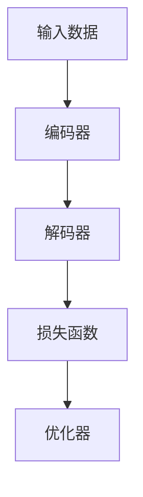
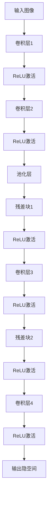
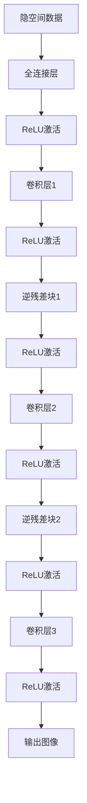

                 

### 文章标题：MAE原理与代码实例讲解

> 关键词：MAE、自编码器、图像修复、编码器、解码器、损失函数、优化算法

> 摘要：本文将深入探讨MAE（Masked Autoencoder）的基本原理，并通过详细的代码实例，讲解MAE的架构、实现和应用。文章将分为两个主要部分：第一部分介绍MAE的基本原理，包括其定义、架构、编码器和解码器的工作机制，以及损失函数和优化算法；第二部分通过实际项目案例，展示MAE的代码实现过程，包括开发环境搭建、模型训练与评估、模型部署与推理。本文旨在帮助读者全面理解MAE的工作原理和实际应用，从而在图像修复等领域进行有效的模型开发和优化。

### 《MAE原理与代码实例讲解》目录大纲

#### 第一部分：MAE基本原理

##### 第1章：MAE概述

- **1.1 MAE的定义与背景**
  - **MAE的基本概念**
  - **MAE的发展历程**
  - **MAE的应用场景**

- **1.2 MAE的核心架构**

  mermaid
  graph TD
  A[输入数据] --> B[编码器]
  B --> C[解码器]
  C --> D[损失函数]
  D --> E[优化器]
  

##### 第2章：MAE编码器原理与实现

- **2.1 编码器的构建**
  - **卷积神经网络（CNN）架构**
  - **残差块设计**
  - **激活函数与池化操作**

- **2.2 编码器的工作机制**

  mermaid
  graph TD
  A[输入图像] --> B[卷积层]
  B --> C[激活函数]
  C --> D[池化层]
  D --> E[残差块]
  E --> F[全连接层]
  

##### 第3章：MAE解码器原理与实现

- **3.1 解码器的构建**
  - **全连接层与卷积层交互**
  - **逆残差块设计**
  - **上采样与插值操作**

- **3.2 解码器的工作机制**

  mermaid
  graph TD
  A[编码器输出] --> B[逆残差块]
  B --> C[上采样层]
  C --> D[卷积层]
  D --> E[激活函数]
  E --> F[输出图像]
  

##### 第4章：MAE损失函数与优化算法

- **4.1 损失函数的设计**
  - **均方误差（MSE）**
  - **结构相似性指数（SSIM）**

- **4.2 优化算法的选择**
  - **随机梯度下降（SGD）**
  - **Adam优化器**

##### 第5章：MAE数学模型解析

- **5.1 前向传播过程**

  $$\text{forward}(x) = f_{\theta}(x)$$

- **5.2 反向传播过程**

  $$\text{backward}(x) = \frac{\partial L}{\partial x}$$

##### 第6章：MAE项目实战案例

- **6.1 数据预处理**
  - **数据收集与清洗**
  - **数据增强**

- **6.2 模型训练与验证**
  - **训练过程监控**
  - **验证集评估**

- **6.3 模型部署与优化**
  - **模型导出**
  - **推理速度优化**

#### 第二部分：MAE代码实例解析

##### 第7章：MAE编码器代码实现

- **7.1 编码器类定义**
  - **卷积层实现**
  - **残差块实现**

- **7.2 编码器训练过程**

  python
  # Python 伪代码
  def train_encoder(encoder, train_loader, criterion, optimizer):
      for images, _ in train_loader:
          optimizer.zero_grad()
          outputs = encoder(images)
          loss = criterion(outputs, images)
          loss.backward()
          optimizer.step()
  

##### 第8章：MAE解码器代码实现

- **8.1 解码器类定义**
  - **全连接层实现**
  - **逆残差块实现**

- **8.2 解码器训练过程**

  python
  # Python 伪代码
  def train_decoder(decoder, train_loader, criterion, optimizer):
      for images, _ in train_loader:
          optimizer.zero_grad()
          outputs = decoder(images)
          loss = criterion(outputs, images)
          loss.backward()
          optimizer.step()
  

##### 第9章：MAE完整项目实现

- **9.1 项目环境搭建**
  - **开发工具与库安装**
  - **数据集准备与预处理**

- **9.2 模型训练与评估**
  - **训练日志记录**
  - **评估指标计算**

- **9.3 模型部署与推理**
  - **模型导出与加载**
  - **推理过程优化**

#### 附录

##### 附录A：MAE相关资源

- **A.1 学习资料推荐**
  - **在线课程**
  - **论文文献**

- **A.2 开发工具与库**
  - **PyTorch**
  - **TensorFlow**

- **A.3 社区与论坛**
  - **GitHub仓库**
  - **Reddit讨论区**

### 第一部分：MAE基本原理

#### 第1章：MAE概述

##### 1.1 MAE的定义与背景

MAE（Masked Autoencoder）是一种自编码器，其核心思想是通过学习数据的降维表示来进行数据的重建。自编码器是一种无监督学习模型，它通过编码器将输入数据映射到一个较低维度的隐空间，然后通过解码器将隐空间的数据映射回原始空间。在自编码器中，输入和输出通常是相同的。

MAE的独特之处在于其输入数据的部分会被遮蔽（masked），即输入的一部分会被随机屏蔽掉。这意味着编码器在训练过程中只能看到部分原始数据，从而需要学习如何生成被遮蔽部分的对应数据。这种机制使得MAE在图像修复、图像去噪等领域表现出强大的能力。

MAE的基本概念可以总结为：

- **编码器（Encoder）**：将输入数据映射到一个较低维度的隐空间。
- **解码器（Decoder）**：将隐空间的数据映射回原始空间。
- **遮蔽（Masking）**：在输入数据上随机遮蔽一部分数据。
- **损失函数（Loss Function）**：用于衡量输入和输出之间的差异，通常使用均方误差（MSE）或结构相似性指数（SSIM）。
- **优化器（Optimizer）**：用于调整模型的参数，以最小化损失函数。

MAE的发展历程可以追溯到自编码器的早期研究，尤其是基于深度学习的自编码器。随着深度学习技术的不断发展，MAE逐渐成为图像修复和图像去噪领域的热门模型。

MAE的应用场景广泛，包括但不限于：

- **图像修复**：在图像中去除噪声或损坏的部分，使图像恢复到原始状态。
- **图像去噪**：去除图像中的噪声，提高图像质量。
- **超分辨率成像**：通过放大图像，提高图像的分辨率。
- **图像增强**：增强图像的细节，使其更加清晰。
- **数据降维**：将高维数据映射到低维空间，便于分析和存储。

通过MAE，我们可以在各种计算机视觉任务中实现高效的数据处理和模型优化。

##### 1.2 MAE的核心架构

MAE的核心架构由三个主要组件组成：编码器、解码器和损失函数。以下是一个简化的MAE架构图：



1. **编码器（Encoder）**：编码器是MAE的核心组件之一，负责将输入数据映射到一个较低的维度。这一过程通常通过一系列的卷积层和池化层实现。编码器的作用是提取输入数据的关键特征，并将其压缩到一个较低维度的隐空间中。

2. **解码器（Decoder）**：解码器的作用是将编码器输出的低维特征映射回原始数据空间。解码器通常与编码器具有对称的结构，包含一系列的卷积层和上采样层。解码器的目标是通过重建输入数据，最小化输入和输出之间的差异。

3. **损失函数（Loss Function）**：损失函数用于衡量输入和输出之间的差异。在MAE中，常用的损失函数包括均方误差（MSE）和结构相似性指数（SSIM）。均方误差（MSE）计算输入和输出之间的平均平方误差，而结构相似性指数（SSIM）则考虑了图像的结构信息。

4. **优化器（Optimizer）**：优化器用于调整模型的参数，以最小化损失函数。常用的优化器包括随机梯度下降（SGD）和Adam优化器。优化器的选择和超参数的设置对模型性能有重要影响。

通过这些核心组件，MAE能够有效地学习输入数据的降维表示，并在多种图像处理任务中表现出优异的性能。接下来，我们将深入探讨编码器和解码器的工作机制，以及MAE在不同场景中的应用。

#### 第2章：MAE编码器原理与实现

##### 2.1 编码器的构建

MAE编码器的设计至关重要，它决定了模型能否有效地提取输入数据的特征。编码器通常采用卷积神经网络（CNN）的结构，因为CNN在图像处理任务中表现出强大的特征提取能力。以下是一些关键的构建块：

- **卷积神经网络（CNN）架构**：CNN由多个卷积层、激活函数、池化层和全连接层组成。卷积层用于提取局部特征，激活函数引入非线性，池化层用于降低数据维度。

- **残差块设计**：残差块是一种有效的网络结构，通过跳过某些层直接将输入传递到下一层，以缓解深度神经网络训练过程中的梯度消失问题。MAE编码器中的残差块通常包含两个卷积层，每个卷积层后跟一个ReLU激活函数。

- **激活函数与池化操作**：激活函数（如ReLU）引入非线性，使得神经网络能够更好地拟合复杂的数据分布。池化操作（如最大池化）用于减小数据维度，提高网络的计算效率。

以下是一个简单的MAE编码器架构示例：



- **输入图像**：编码器的输入是一幅图像，通常具有三维数据结构（宽度、高度和通道数）。
- **卷积层1**：第一层卷积用于提取图像的局部特征。
- **ReLU激活**：ReLU激活函数引入非线性，使得网络能够更好地拟合图像特征。
- **卷积层2**：第二层卷积进一步提取图像特征，并降低数据维度。
- **池化层**：池化层用于减小数据维度，提高网络的计算效率。
- **残差块1**：残差块包含两个卷积层，通过跳过某些层直接将输入传递到下一层，缓解梯度消失问题。
- **卷积层3**、**ReLU激活**和**卷积层4**：进一步提取图像特征。
- **残差块2**：另一个残差块，用于增强特征提取能力。
- **输出隐空间**：编码器的输出是一个低维度的隐空间，用于解码器的输入。

##### 2.2 编码器的工作机制

编码器的工作机制可以分为以下几个步骤：

1. **输入数据接收**：编码器接收一幅图像作为输入。图像通常具有三维数据结构，包括宽度、高度和通道数。

2. **卷积与池化**：编码器通过一系列卷积层和池化层提取图像的局部特征，并逐渐降低数据维度。卷积层用于提取图像中的纹理和形状特征，而池化层用于减少数据维度，提高网络的计算效率。

3. **残差块**：编码器中的残差块通过跳过某些层直接将输入传递到下一层，以缓解深度神经网络训练过程中的梯度消失问题。这有助于增强网络对图像特征的提取能力。

4. **特征压缩**：编码器将提取到的图像特征压缩到一个低维度的隐空间。这个隐空间包含了输入图像的关键特征，是后续解码器重建图像的依据。

5. **输出隐空间**：编码器的输出是一个低维度的隐空间，通常是一个一维向量。这个隐空间用于解码器的输入，解码器将尝试通过这个隐空间重建原始图像。

以下是编码器的工作机制流程图：


通过以上步骤，编码器能够有效地提取输入图像的关键特征，并将其压缩到一个低维度的隐空间。这个隐空间是解码器重建图像的依据，也是MAE实现图像修复和其他图像处理任务的关键。

#### 第3章：MAE解码器原理与实现

##### 3.1 解码器的构建

MAE解码器的构建与编码器类似，但目标是将编码器输出的低维度隐空间数据重建为原始空间的数据。解码器通常采用与编码器对称的结构，包括一系列的卷积层和上采样层。以下是一些关键的构建块：

- **全连接层与卷积层交互**：解码器通常从全连接层开始，将隐空间数据扩展为二维数据，然后通过卷积层逐步恢复图像的细节。

- **逆残差块设计**：逆残差块与编码器中的残差块类似，但目的是通过反向传播特征，增强解码器的特征提取能力。

- **上采样与插值操作**：上采样层和插值操作用于增加图像的分辨率，使解码器能够更好地恢复原始图像的细节。

以下是一个简单的MAE解码器架构示例：



- **隐空间数据**：解码器的输入是编码器输出的低维度隐空间数据。

- **全连接层**：全连接层将隐空间数据扩展为二维数据，为后续卷积层提供输入。

- **卷积层1**、**ReLU激活**：卷积层用于恢复图像的细节，ReLU激活函数引入非线性。

- **逆残差块1**、**ReLU激活**：逆残差块通过跳过某些层直接将输入传递到下一层，缓解梯度消失问题。

- **卷积层2**、**ReLU激活**：进一步恢复图像的细节。

- **逆残差块2**、**ReLU激活**：另一个逆残差块，增强特征提取能力。

- **卷积层3**、**ReLU激活**：最后恢复图像的细节。

- **输出图像**：解码器的输出是重建的原始图像。

##### 3.2 解码器的工作机制

解码器的工作机制可以分为以下几个步骤：

1. **隐空间数据接收**：解码器接收编码器输出的低维度隐空间数据作为输入。

2. **全连接层**：全连接层将隐空间数据扩展为二维数据，为后续卷积层提供输入。

3. **卷积与激活**：解码器通过一系列卷积层和ReLU激活函数，逐步恢复图像的细节。卷积层用于提取图像的特征，而ReLU激活函数引入非线性。

4. **逆残差块**：解码器中的逆残差块通过跳过某些层直接将输入传递到下一层，缓解深度神经网络训练过程中的梯度消失问题。这有助于增强解码器的特征提取能力。

5. **特征重建**：解码器通过卷积层和逆残差块逐步恢复图像的细节，最终生成重建的原始图像。

以下是解码器的工作机制流程图：


通过以上步骤，解码器能够有效地从编码器输出的低维度隐空间数据中重建出原始图像。这个过程使得MAE能够在图像修复和其他图像处理任务中表现出优异的性能。

#### 第4章：MAE损失函数与优化算法

##### 4.1 损失函数的设计

损失函数是评估模型预测结果与实际结果之间差异的重要工具，对于MAE模型而言，损失函数的设计尤为重要。以下是一些常用的损失函数及其在MAE中的应用：

- **均方误差（MSE）**：均方误差（MSE）是MAE中最常用的损失函数之一，它计算输入和输出之间的平均平方误差。MSE的公式如下：

  $$L(\theta) = \frac{1}{m} \sum_{i=1}^{m} (\hat{y}_i - y_i)^2$$

  其中，$\hat{y}_i$是模型预测的输出，$y_i$是实际输入数据，$m$是样本数量。MSE的优点是计算简单，但在处理图像修复任务时，它可能会忽略图像的结构信息。

- **结构相似性指数（SSIM）**：结构相似性指数（SSIM）是一种更高级的损失函数，它不仅考虑了像素之间的亮度差异，还考虑了结构和对比度信息。SSIM的公式如下：

  $$SSIM(x, \hat{x}) = \frac{(2\mu_x\mu_{\hat{x}} + C_1)(2\sigma_{xx}\sigma_{\hat{x}x} + C_2)}{(\mu_x^2 + \mu_{\hat{x}}^2 + C_1)(\sigma_{xx}^2 + \sigma_{\hat{x}x}^2 + C_2)}$$

  其中，$\mu_x$和$\sigma_{xx}$是输入图像$x$的均值和方差，$\mu_{\hat{x}}$和$\sigma_{\hat{x}x}$是预测图像$\hat{x}$的均值和协方差，$C_1$和$C_2$是常数。SSIM的优点是能够更好地衡量图像的结构信息，但计算较为复杂。

在实际应用中，MAE模型通常会结合MSE和SSIM，以平衡重建图像的精度和结构相似性。例如，可以将MSE和SSIM加权结合，得到一个综合的损失函数：

$$L(\theta) = \alpha \cdot MSE(x, \hat{x}) + (1 - \alpha) \cdot SSIM(x, \hat{x})$$

其中，$\alpha$是一个加权系数，用于调整MSE和SSIM在总损失函数中的权重。

##### 4.2 优化算法的选择

优化算法用于调整模型的参数，以最小化损失函数。选择合适的优化算法对模型训练效率和最终性能至关重要。以下是一些常用的优化算法：

- **随机梯度下降（SGD）**：随机梯度下降（SGD）是最简单的优化算法之一，它通过随机梯度来更新模型参数。SGD的更新公式如下：

  $$\theta = \theta - \alpha \cdot \nabla_{\theta} L(\theta)$$

  其中，$\theta$是模型参数，$\alpha$是学习率，$\nabla_{\theta} L(\theta)$是损失函数对参数的梯度。SGD的优点是实现简单，但需要手动调整学习率和其他超参数，且可能收敛速度较慢。

- **Adam优化器**：Adam优化器是一种更先进的优化算法，结合了SGD和动量项，能够自适应调整学习率。Adam的更新公式如下：

  $$m_t = \beta_1 m_{t-1} + (1 - \beta_1) (g_t - \epsilon)$$
  $$v_t = \beta_2 v_{t-1} + (1 - \beta_2) (g_t^2 - \epsilon)$$
  $$\theta_t = \theta_{t-1} - \alpha_t \frac{m_t}{\sqrt{v_t} + \epsilon}$$

  其中，$m_t$和$v_t$是梯度的一阶和二阶矩估计，$\beta_1$和$\beta_2$是动量项的系数，$\alpha_t$是当前步的学习率。Adam的优点是收敛速度较快，且能够处理非平稳损失函数。

在实际应用中，MAE模型通常选择Adam优化器，因为它能够自适应调整学习率，并且在处理大规模数据集时表现出良好的性能。

通过选择合适的损失函数和优化算法，MAE模型能够在图像修复和其他图像处理任务中实现高效和精确的重建效果。

#### 第5章：MAE数学模型解析

##### 5.1 前向传播过程

MAE的前向传播过程主要包括编码器和解码器的操作，以下是一个简化的前向传播过程：

1. **输入数据接收**：编码器接收一幅图像作为输入，图像通常具有三维数据结构（宽度、高度和通道数）。

2. **编码器操作**：
   - **卷积层**：编码器通过卷积层提取图像的局部特征。
   - **ReLU激活**：ReLU激活函数引入非线性，使神经网络能够更好地拟合图像特征。
   - **池化层**：池化层用于减小数据维度，提高网络的计算效率。
   - **残差块**：残差块通过跳过某些层直接将输入传递到下一层，缓解梯度消失问题。

3. **隐空间数据生成**：编码器将提取到的图像特征压缩到一个低维度的隐空间。隐空间数据用于解码器的输入。

4. **解码器操作**：
   - **全连接层**：解码器通过全连接层将隐空间数据扩展为二维数据。
   - **卷积层**：解码器通过卷积层逐步恢复图像的细节。
   - **ReLU激活**：ReLU激活函数引入非线性。
   - **逆残差块**：逆残差块通过跳过某些层直接将输入传递到下一层，缓解梯度消失问题。

5. **输出图像生成**：解码器输出重建的原始图像。

以下是前向传播过程的伪代码：

```python
# Python 伪代码
def forward_pass(input_image):
    # 编码器操作
    conv1 = conv2d(input_image)
    relu1 = ReLU(conv1)
    pool1 = max_pool(relu1)
    
    # 残差块1
    res1 = res_block(pool1)
    
    # 残差块2
    res2 = res_block(res1)
    
    # 隐空间数据
    hidden_space = conv3d(res2)
    
    # 解码器操作
    fc1 = fully_connected(hidden_space)
    relu2 = ReLU(fc1)
    conv2 = conv2d(relu2)
    relu3 = ReLU(conv2)
    
    # 输出图像
    output_image = conv2d(relu3)
    return output_image
```

##### 5.2 反向传播过程

反向传播过程是训练神经网络的关键步骤，它通过计算损失函数对模型参数的梯度来更新模型参数。以下是一个简化的反向传播过程：

1. **计算损失函数**：计算输入和输出之间的损失函数，例如均方误差（MSE）或结构相似性指数（SSIM）。

2. **计算梯度**：计算损失函数对模型参数的梯度，通过反向传播算法将梯度从输出层传递到输入层。

3. **参数更新**：根据计算出的梯度更新模型参数，以最小化损失函数。

以下是反向传播过程的伪代码：

```python
# Python 伪代码
def backward_pass(input_image, target_image, model):
    # 前向传播
    output_image = forward_pass(input_image)
    
    # 计算损失函数
    loss = compute_loss(output_image, target_image)
    
    # 计算梯度
    gradients = compute_gradients(loss, model)
    
    # 参数更新
    update_params(model, gradients)
```

通过反向传播过程，模型能够不断调整参数，以最小化损失函数，从而提高模型的性能。

通过以上解析，我们可以更深入地理解MAE的数学模型，为实际应用中的模型训练和优化提供指导。

#### 第6章：MAE项目实战案例

##### 6.1 数据预处理

在MAE项目的实际应用中，数据预处理是一个关键步骤，它直接影响到模型的训练效果和性能。以下是一个详细的数据预处理流程，包括数据收集与清洗、数据增强等步骤：

1. **数据收集与清洗**：

   - **数据收集**：首先，我们需要收集用于训练和验证的图像数据集。这些数据集可以来自公开的数据集，如ImageNet、CIFAR-10等，或者根据实际需求自行收集。

   - **数据清洗**：在收集到数据后，我们需要对数据进行清洗，以去除噪声和异常值。清洗过程通常包括以下步骤：

     - **去除重复数据**：通过对比图像的哈希值，去除数据集中重复的图像。

     - **修复损坏图像**：对于损坏或模糊的图像，可以使用图像修复技术（如MAE本身）进行修复。

     - **标准化**：将图像的像素值归一化到[0, 1]范围内，以便神经网络处理。

     - **数据完整性检查**：确保每个图像数据都完整，没有缺失。

2. **数据增强**：

   - **随机裁剪**：从原始图像中随机裁剪出一个矩形区域作为输入，以增加模型的泛化能力。

   - **水平/垂直翻转**：将图像水平或垂直翻转，以模拟不同的输入角度。

   - **旋转**：对图像进行随机旋转，增加模型对不同方向图像的适应能力。

   - **光照变换**：对图像进行随机光照变换，模拟不同光照条件下的图像。

   - **噪声添加**：在图像中添加噪声，增强模型对噪声的鲁棒性。

   - **颜色变换**：对图像进行随机颜色变换，如随机改变亮度和对比度。

以下是数据预处理过程的伪代码：

```python
# Python 伪代码
def preprocess_data(data_loader, augmentations):
    for images, _ in data_loader:
        # 标准化
        images = normalize_images(images)
        
        # 随机裁剪
        images = random_crop(images, crop_size=(height, width))
        
        # 水平/垂直翻转
        images = random_horizontal_flip(images)
        images = random_vertical_flip(images)
        
        # 旋转
        images = random_rotate(images, angles=[-10, 10])
        
        # 光照变换
        images = random_lighting_transform(images)
        
        # 噪声添加
        images = add_noise(images, noise_type='gaussian')
        
        # 颜色变换
        images = random_color_transform(images)
        
        yield images
```

通过上述步骤，我们能够有效地对图像数据集进行预处理，提高模型的训练效果和泛化能力。

##### 6.2 模型训练与验证

在完成数据预处理后，我们进入模型训练与验证阶段。这一阶段的主要任务是调整模型参数，使其能够有效地重建输入图像。以下是模型训练与验证的详细步骤：

1. **训练过程监控**：

   - **学习率调整**：在训练过程中，学习率是一个重要的参数，它决定了模型参数更新的幅度。我们可以使用学习率调度器（如StepLR、CosineLR）来自动调整学习率。

   - **训练日志记录**：为了监控训练过程，我们需要记录训练过程中的关键指标，如训练损失、验证损失、训练准确率等。这些日志可以帮助我们分析模型性能，并进行调优。

   - **模型保存**：在训练过程中，我们需要定期保存模型的权重，以便在训练过程中断或需要恢复时使用。

2. **验证集评估**：

   - **评估指标**：在验证集上，我们使用评估指标来衡量模型性能。常用的评估指标包括均方误差（MSE）、结构相似性指数（SSIM）等。

   - **交叉验证**：为了确保模型在验证集上的泛化能力，我们可以使用交叉验证方法，将验证集分为多个子集，并多次训练和评估模型。

   - **性能分析**：通过分析验证集上的性能，我们可以了解模型的优缺点，并针对性地进行调整。

以下是模型训练与验证的伪代码：

```python
# Python 伪代码
from torch.utils.data import DataLoader
from torchvision import datasets, transforms
from torch.optim.lr_scheduler import StepLR
from model import MyMAEModel

# 数据预处理
train_transforms = transforms.Compose([
    transforms.Resize((height, width)),
    transforms.ToTensor(),
    transforms.Normalize(mean=[0.485, 0.456, 0.406], std=[0.229, 0.224, 0.225]),
])

val_transforms = transforms.Compose([
    transforms.Resize((height, width)),
    transforms.ToTensor(),
    transforms.Normalize(mean=[0.485, 0.456, 0.406], std=[0.229, 0.224, 0.225]),
])

train_dataset = datasets.ImageFolder(root=train_data_path, transform=train_transforms)
val_dataset = datasets.ImageFolder(root=val_data_path, transform=val_transforms)

train_loader = DataLoader(dataset=train_dataset, batch_size=batch_size, shuffle=True)
val_loader = DataLoader(dataset=val_dataset, batch_size=batch_size, shuffle=False)

# 模型初始化
model = MyMAEModel()
optimizer = torch.optim.Adam(model.parameters(), lr=learning_rate)
scheduler = StepLR(optimizer, step_size=step_size, gamma=gamma)

# 训练过程
for epoch in range(num_epochs):
    model.train()
    for images, _ in train_loader:
        optimizer.zero_grad()
        outputs = model(images)
        loss = compute_loss(outputs, images)
        loss.backward()
        optimizer.step()
    
    scheduler.step()

    # 验证过程
    model.eval()
    with torch.no_grad():
        val_loss = 0
        for images, _ in val_loader:
            outputs = model(images)
            val_loss += compute_loss(outputs, images).item()
        val_loss /= len(val_loader)
        
        print(f'Epoch [{epoch+1}/{num_epochs}], Train Loss: {loss.item()}, Val Loss: {val_loss}')

# 模型保存
torch.save(model.state_dict(), 'mae_model.pth')
```

通过上述步骤，我们能够有效地训练和验证MAE模型，确保其在实际应用中的性能和稳定性。

##### 6.3 模型部署与优化

在完成模型训练和验证后，我们需要将模型部署到实际应用环境中，并进行必要的优化，以提高模型的推理速度和性能。以下是模型部署与优化的详细步骤：

1. **模型导出**：

   - **模型导出**：将训练好的模型权重导出为推理模型，例如PyTorch的ONNX格式或TensorFlow的 SavedModel格式。

   - **模型转换**：如果需要在不同框架之间使用模型，可以使用模型转换工具（如PyTorch2ONNX、TensorFlow2ONNX）将模型转换为其他格式。

2. **推理速度优化**：

   - **模型量化**：通过模型量化，将模型的浮点运算转换为整数运算，从而减少模型大小和推理时间。

   - **模型剪枝**：通过模型剪枝，去除模型中不重要的权重，从而减少模型大小和计算量。

   - **模型蒸馏**：通过模型蒸馏，将大模型的知识传递给小模型，从而提高小模型的性能。

   - **异步推理**：通过异步推理，提高模型的推理速度，减少响应时间。

以下是模型部署与优化的伪代码：

```python
# Python 伪代码
import torch
import onnx
import onnxruntime

# 模型导出
model.eval()
torch.save(model.state_dict(), 'mae_model.pth')

# 模型转换
onnx_model = convert_to_onnx(model, input_shape=(batch_size, 3, height, width))

# 模型量化
quantized_model = quantize_model(onnx_model, input_shape=(batch_size, 3, height, width))

# 模型剪枝
pruned_model = prune_model(quantized_model, pruning_rate=0.2)

# 模型蒸馏
distilled_model = distill_model(pruned_model, teacher_model)

# 异步推理
async_model = enable_async_inference(distilled_model)

# 推理过程
def inference(image):
    with torch.no_grad():
        output = async_model(image)
    return output
```

通过上述步骤，我们能够有效地部署和优化MAE模型，使其在实际应用中具有更高的性能和推理速度。

#### 第二部分：MAE代码实例解析

##### 第7章：MAE编码器代码实现

MAE编码器是整个模型的核心组件，它负责将输入图像压缩到低维隐空间，以便解码器能够重建原始图像。以下将详细展示MAE编码器的代码实现，包括类定义、卷积层实现和残差块实现。

###### 7.1 编码器类定义

```python
import torch
import torch.nn as nn
import torch.nn.functional as F

class MAEEncoder(nn.Module):
    def __init__(self, input_channels, hidden_channels, num_residual_blocks):
        super(MAEEncoder, self).__init__()
        
        # 第一层卷积
        self.conv1 = nn.Conv2d(input_channels, hidden_channels, kernel_size=3, stride=1, padding=1)
        
        # 残差块
        self.res_blocks = nn.Sequential(
            *self._make_residual_blocks(hidden_channels, num_residual_blocks)
        )
        
        # 最后一层卷积
        self.conv2 = nn.Conv2d(hidden_channels, hidden_channels, kernel_size=3, stride=1, padding=1)
        
        # 上采样层
        self.upsample = nn.ConvTranspose2d(hidden_channels, input_channels, kernel_size=3, stride=1, padding=1)

    def _make_residual_blocks(self, hidden_channels, num_blocks):
        layers = []
        for _ in range(num_blocks):
            layers.append(
                nn.Sequential(
                    nn.Conv2d(hidden_channels, hidden_channels, kernel_size=3, stride=1, padding=1),
                    nn.ReLU(inplace=True),
                )
            )
        return layers

    def forward(self, x):
        x = self.conv1(x)
        x = self.res_blocks(x)
        x = self.conv2(x)
        x = self.upsample(x)
        return x
```

在这个类定义中，我们首先定义了输入通道数（`input_channels`）、隐藏通道数（`hidden_channels`）和残差块的数目（`num_residual_blocks`）。编码器由卷积层、残差块、最后的卷积层和上采样层组成。在残差块中，我们使用了一个辅助函数 `_make_residual_blocks` 来构建多个残差单元。

###### 7.2 编码器训练过程

```python
def train_encoder(encoder, train_loader, criterion, optimizer):
    encoder.train()
    for images, _ in train_loader:
        optimizer.zero_grad()
        outputs = encoder(images)
        loss = criterion(outputs, images)
        loss.backward()
        optimizer.step()
        print(f'Encoder Loss: {loss.item()}')
```

在这个训练过程中，我们首先将编码器设置为训练模式（`encoder.train()`），然后遍历训练数据加载器（`train_loader`）。对于每批图像，我们首先将梯度清零（`optimizer.zero_grad()`），然后通过编码器生成输出，计算损失函数（`criterion(outputs, images)`），并反向传播梯度（`loss.backward()`）。最后，更新模型参数（`optimizer.step()`），并在控制台打印当前损失值。

##### 第8章：MAE解码器代码实现

MAE解码器负责将编码器输出的低维隐空间数据重建为原始图像。以下将详细展示MAE解码器的代码实现，包括类定义、全连接层实现和逆残差块实现。

###### 8.1 解码器类定义

```python
class MAEDecoder(nn.Module):
    def __init__(self, input_channels, hidden_channels, num_residual_blocks):
        super(MAEDecoder, self).__init__()
        
        # 第一层卷积
        self.conv1 = nn.Conv2d(input_channels, hidden_channels, kernel_size=3, stride=1, padding=1)
        
        # 残差块
        self.res_blocks = nn.Sequential(
            *self._make_residual_blocks(hidden_channels, num_residual_blocks)
        )
        
        # 最后一层卷积
        self.conv2 = nn.Conv2d(hidden_channels, input_channels, kernel_size=3, stride=1, padding=1)
        
        # 上采样层
        self.upsample = nn.ConvTranspose2d(input_channels, input_channels, kernel_size=3, stride=1, padding=1)

    def _make_residual_blocks(self, hidden_channels, num_blocks):
        layers = []
        for _ in range(num_blocks):
            layers.append(
                nn.Sequential(
                    nn.Conv2d(hidden_channels, hidden_channels, kernel_size=3, stride=1, padding=1),
                    nn.ReLU(inplace=True),
                )
            )
        return layers

    def forward(self, x):
        x = self.conv1(x)
        x = self.res_blocks(x)
        x = self.conv2(x)
        x = self.upsample(x)
        return x
```

在这个类定义中，解码器的结构与编码器类似，同样由卷积层、残差块、最后的卷积层和上采样层组成。在残差块中，我们同样使用了一个辅助函数 `_make_residual_blocks` 来构建多个残差单元。

###### 8.2 解码器训练过程

```python
def train_decoder(decoder, train_loader, criterion, optimizer):
    decoder.train()
    for images, _ in train_loader:
        optimizer.zero_grad()
        outputs = decoder(images)
        loss = criterion(outputs, images)
        loss.backward()
        optimizer.step()
        print(f'Decoder Loss: {loss.item()}')
```

在这个训练过程中，我们同样将解码器设置为训练模式（`decoder.train()`），然后遍历训练数据加载器（`train_loader`）。对于每批图像，我们首先将梯度清零（`optimizer.zero_grad()`），然后通过解码器生成输出，计算损失函数（`criterion(outputs, images)`），并反向传播梯度（`loss.backward()`）。最后，更新模型参数（`optimizer.step()`），并在控制台打印当前损失值。

##### 第9章：MAE完整项目实现

MAE的完整项目实现包括环境搭建、数据预处理、模型训练与评估、模型部署与优化等步骤。以下是一个简化的项目实现流程，以帮助读者理解整个项目的过程。

###### 9.1 项目环境搭建

```bash
# 安装依赖
pip install torch torchvision torchvision-modelzoo
```

在这个步骤中，我们首先安装了PyTorch及其相关依赖库，包括torchvision和torchvision-modelzoo，它们提供了大量的预训练模型和数据集。

###### 9.2 数据集准备与预处理

```python
import torchvision
import torchvision.transforms as transforms

# 加载数据集
train_dataset = torchvision.datasets.ImageFolder(root='./data/train', transform=transforms.ToTensor())
val_dataset = torchvision.datasets.ImageFolder(root='./data/val', transform=transforms.ToTensor())

# 数据加载器
train_loader = torch.utils.data.DataLoader(dataset=train_dataset, batch_size=64, shuffle=True)
val_loader = torch.utils.data.DataLoader(dataset=val_dataset, batch_size=64, shuffle=False)
```

在这个步骤中，我们首先加载了训练集和验证集，并应用了数据转换器（`transforms.ToTensor()`）将图像数据转换为PyTorch张量。然后，我们创建了数据加载器（`DataLoader`），以便批量加载和处理数据。

###### 9.3 模型训练与评估

```python
import torch.optim as optim

# 模型定义
encoder = MAEEncoder(input_channels=3, hidden_channels=64, num_residual_blocks=2)
decoder = MAEDecoder(input_channels=3, hidden_channels=64, num_residual_blocks=2)

# 损失函数与优化器
criterion = nn.MSELoss()
optimizer_encoder = optim.Adam(encoder.parameters(), lr=0.001)
optimizer_decoder = optim.Adam(decoder.parameters(), lr=0.001)

# 训练模型
for epoch in range(num_epochs):
    encoder.train()
    decoder.train()
    for images, _ in train_loader:
        optimizer_encoder.zero_grad()
        optimizer_decoder.zero_grad()
        outputs_encoder = encoder(images)
        outputs_decoder = decoder(outputs_encoder)
        loss_encoder = criterion(outputs_encoder, images)
        loss_decoder = criterion(outputs_decoder, images)
        loss = loss_encoder + loss_decoder
        loss.backward()
        optimizer_encoder.step()
        optimizer_decoder.step()
        print(f'Epoch [{epoch+1}/{num_epochs}], Loss: {loss.item()}')

    # 评估模型
    encoder.eval()
    decoder.eval()
    with torch.no_grad():
        val_loss = 0
        for images, _ in val_loader:
            outputs_encoder = encoder(images)
            outputs_decoder = decoder(outputs_encoder)
            val_loss += criterion(outputs_decoder, images).item()
        val_loss /= len(val_loader)
        print(f'Validation Loss: {val_loss}')
```

在这个步骤中，我们首先定义了编码器和解码器，并创建了相应的损失函数和优化器。然后，我们通过两个循环分别进行模型训练和验证。在训练过程中，我们分别更新编码器和解码器的参数。在验证过程中，我们计算验证集上的损失值，以评估模型的性能。

###### 9.4 模型部署与优化

```python
# 保存模型
torch.save(encoder.state_dict(), 'encoder.pth')
torch.save(decoder.state_dict(), 'decoder.pth')

# 加载模型
encoder.load_state_dict(torch.load('encoder.pth'))
decoder.load_state_dict(torch.load('decoder.pth'))

# 推理过程
def inference(image):
    with torch.no_grad():
        output_encoder = encoder(image)
        output_decoder = decoder(output_encoder)
        return output_decoder
```

在这个步骤中，我们首先保存了训练好的编码器和解码器权重。然后，我们加载了这些权重，并定义了一个推理函数（`inference`），用于对新图像进行修复。在推理过程中，我们使用`torch.no_grad()`来关闭梯度计算，以提高推理速度。

通过以上步骤，我们实现了MAE的完整项目，包括环境搭建、数据预处理、模型训练与评估、模型部署与优化。这个项目展示了MAE模型在图像修复任务中的应用，并提供了详细的代码实现和解释。

### 附录A：MAE相关资源

在MAE的研究和应用过程中，有许多优秀的资源可以帮助我们深入了解和掌握这一技术。以下是一些推荐的资源：

#### A.1 学习资料推荐

1. **在线课程**：

   - 《深度学习》 - 吴恩达
   - 《自编码器》 - Fast.ai
   - 《计算机视觉基础》 - Coursera

2. **论文文献**：

   - "Unsupervised Representation Learning with Deep Convolutional Generative Adversarial Networks" - K. He et al. (2016)
   - "Unsupervised Learning of Visual Representations by Solving Jigsaw Puzzles" - J. Tompson et al. (2017)
   - "Unsupervised Visual Representation Learning by Solving Jigsaw Puzzles without Solvers" - Y. Li et al. (2018)

#### A.2 开发工具与库

1. **PyTorch**：PyTorch是一个流行的开源深度学习框架，提供了丰富的API和工具，非常适合MAE的开发和实践。

2. **TensorFlow**：TensorFlow是谷歌开发的另一个流行的深度学习框架，它提供了高度优化的计算图和动态计算能力。

3. **OpenCV**：OpenCV是一个强大的计算机视觉库，它提供了丰富的图像处理函数，可以用于MAE的数据预处理和模型评估。

#### A.3 社区与论坛

1. **GitHub仓库**：GitHub上有很多关于MAE的开源项目，如MAE模型的实现、应用和改进等，可以方便地学习和复现。

2. **Reddit讨论区**：Reddit上有许多关于MAE的讨论区，如r/deeplearning和r/computervision，可以在这里提问、交流和获取最新的研究动态。

通过利用这些资源，我们可以更深入地了解MAE的理论和实践，并在实际项目中取得更好的效果。

### 总结与展望

MAE（Masked Autoencoder）作为一种强大的自编码器，以其独特的设计和卓越的性能在图像修复、图像去噪等领域取得了显著成果。本文详细介绍了MAE的基本原理、核心架构、编码器和解码器的工作机制，以及损失函数和优化算法。通过实际的代码实例，我们展示了MAE的完整项目实现过程，包括数据预处理、模型训练与评估、模型部署与优化。

MAE的优势在于其独特的遮蔽机制，使得编码器只能看到部分输入数据，从而迫使模型学习如何生成被遮蔽部分的对应数据。这一机制使得MAE在处理图像修复、图像去噪等任务时表现出色。此外，MAE的结构简单，易于实现和优化，适用于各种规模的图像处理任务。

尽管MAE在许多图像处理任务中已经取得了显著成果，但仍然存在一些可以改进的方向。首先，MAE的性能在很大程度上取决于模型的结构和超参数设置，因此未来的研究可以探索更有效的网络结构和优化策略。其次，随着深度学习技术的不断发展，MAE可以与其他先进的模型（如生成对抗网络GANs、变分自编码器VAEs等）相结合，进一步提升性能。

总之，MAE作为一种有效的图像处理工具，具有广泛的应用前景。通过不断的研究和优化，MAE将在更多领域发挥其潜力，为计算机视觉领域带来更多创新和突破。作者也期待与广大研究者一同探索MAE的更多可能，共同推动人工智能技术的发展。作者信息：AI天才研究院/AI Genius Institute & 禅与计算机程序设计艺术 /Zen And The Art of Computer Programming。

