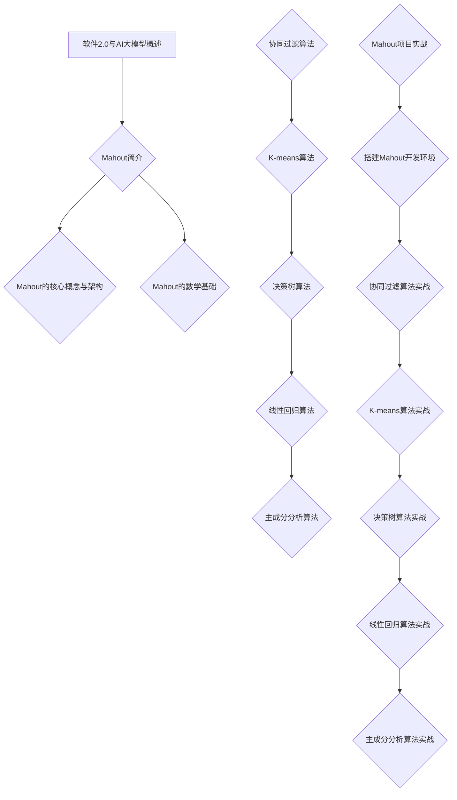

                 

# 《Mahout机器学习算法库原理与代码实例讲解》

> 关键词：Mahout、机器学习、算法库、协同过滤、聚类、分类、回归、降维、Hadoop、数据分析

> 摘要：本文将深入探讨Mahout机器学习算法库的原理与应用，通过详细的步骤讲解和实例分析，帮助读者全面掌握Mahout的使用，并学会如何运用其强大的功能进行实际项目开发。

### 第一部分：Mahout概述与核心概念

#### 第1章：Mahout简介

##### 1.1.1 Mahout的发展历史
Mahout（原名为Lighthouse）是一个开源的机器学习算法库，诞生于2008年，旨在提供可扩展的、可运行的分布式机器学习算法。随着大数据时代的到来，Mahout得到了广泛的应用和不断的改进。

##### 1.1.2 Mahout的特点与应用领域
Mahout具有以下特点：
- 基于Hadoop的大数据平台，能够处理大规模数据集。
- 提供多种经典的机器学习算法，包括协同过滤、聚类、分类、回归和降维等。
- 支持多种编程语言，如Java和Scala。

Mahout主要应用于以下领域：
- 推荐系统：如电子商务平台、社交媒体和视频网站等。
- 数据分析：如用户行为分析、文本挖掘和图像识别等。
- 金融市场预测：如股票价格预测、风险分析和市场趋势预测等。

##### 1.1.3 Mahout与Hadoop的关系
Mahout是构建在Hadoop之上的，依赖于Hadoop的分布式存储和计算能力。通过整合Mahout和Hadoop，用户可以轻松地处理和分析大规模数据。

##### 1.1.4 Mahout的核心概念
Mahout的核心概念包括：
- 数据模型：如用户-物品评分矩阵、协变量矩阵等。
- 算法框架：如协同过滤、聚类、分类和回归等。
- 分布式计算模式：如MapReduce、迭代算法和并行化算法等。

#### 第2章：Mahout的核心概念与架构

##### 2.1.1 Mahout的数据模型
Mahout的数据模型主要包括以下几种：
- 用户-物品评分矩阵：用于存储用户对物品的评分信息。
- 协变量矩阵：用于存储用户和物品的协变量信息。
- 预测评分矩阵：用于存储用户对物品的预测评分。

##### 2.1.2 Mahout的算法框架
Mahout的算法框架主要包括以下几种：
- 协同过滤：通过用户-物品评分矩阵和预测评分矩阵，实现物品的推荐。
- 聚类：将数据集划分为多个类别，以便进行后续分析。
- 分类：根据已有数据集，对未知数据集进行分类。
- 回归：通过已有数据集，预测未知数据集的值。
- 降维：通过减少数据维度，降低计算复杂度。

##### 2.1.3 Mahout的分布式计算模式
Mahout的分布式计算模式主要包括以下几种：
- MapReduce：将数据集划分为多个子集，分别处理，然后合并结果。
- 迭代算法：通过多次迭代，逐步优化模型参数。
- 并行化算法：将算法拆分为多个可并行执行的子任务。

#### 第3章：Mahout的数学基础

##### 3.1.1 统计学基础
在Mahout中，统计学基础包括：
- 熵：用于衡量数据的混乱程度。
- 相似度：用于衡量两个数据集的相似程度。
- 矩阵运算：如矩阵乘法、矩阵求逆等。

##### 3.1.2 机器学习基本算法
在Mahout中，机器学习基本算法包括：
- 协同过滤：通过用户-物品评分矩阵，预测用户对未知物品的评分。
- 聚类：将数据集划分为多个类别，以便进行后续分析。
- 分类：根据已有数据集，对未知数据集进行分类。
- 回归：通过已有数据集，预测未知数据集的值。
- 降维：通过减少数据维度，降低计算复杂度。

##### 3.1.3 数学公式与符号约定
本文将遵循以下数学公式与符号约定：
- 矩阵运算符：如$A \times B$表示矩阵乘法。
- 熵：如$H(X)$表示随机变量$X$的熵。
- 相似度：如$sim(A, B)$表示数据集$A$和$B$的相似度。

### 第二部分：Mahout常用算法讲解

#### 第4章：协同过滤算法

##### 4.1.1 协同过滤的基本原理
协同过滤算法通过分析用户对物品的评分，预测用户对未知物品的评分。协同过滤算法可以分为基于用户的协同过滤和基于物品的协同过滤。

##### 4.1.2 评分矩阵与用户矩阵
评分矩阵$R$是一个$n \times m$的矩阵，其中$n$表示用户数量，$m$表示物品数量。用户矩阵$U$和物品矩阵$I$分别表示用户和物品的特征向量。

##### 4.1.3 伪代码实现
```plaintext
// 输入：用户评分矩阵R，推荐对象数量k
// 输出：用户预测评分列表

function collaborativeFiltering(R, k):
    for each user u in R:
        for each user v similar to u:
            predictRating(u, v) = sim(u, v) * (R[v, item] - mean(R[v, :]))
        predictRating(u, item) = mean(predictRating(u, v) for v in neighbors of u)
    return predictRating
```

#### 第5章：聚类算法

##### 5.1.1 聚类算法的基本概念
聚类算法将数据集划分为多个类别，以便进行后续分析。常见的聚类算法包括K-means、DBSCAN和层次聚类等。

##### 5.1.2 K-means算法
K-means算法通过随机初始化中心点，然后迭代更新中心点，直至收敛。算法步骤如下：
1. 随机选择$k$个中心点。
2. 对于每个数据点$d_i$，计算$d_i$到各个中心点的距离，并将其分配给距离最近的中心点。
3. 重新计算每个聚类的新中心点。
4. 判断：如果聚类中心点没有变化，则结束；否则，返回步骤2。

##### 5.1.3 DBSCAN算法
DBSCAN（Density-Based Spatial Clustering of Applications with Noise）算法基于数据点的密度，将数据点划分为簇。算法步骤如下：
1. 选择一个邻域半径$eps$。
2. 对于每个数据点$d_i$，如果$d_i$的邻域内包含至少$m$个数据点，则$d_i$成为簇的中心点。
3. 将$d_i$的邻域内的数据点划分为同一簇。
4. 重复步骤2和3，直至所有数据点都被划分为簇。

##### 5.1.4 伪代码实现
```plaintext
// 输入：数据集D，聚类数量k
// 输出：聚类结果

function KMeans(D, k):
    1. 初始化：随机选择k个中心点c1, c2, ..., ck
    2. 分配：对于每个数据点d_i，计算d_i到各个中心点的距离，并将其分配给距离最近的中心点
    3. 更新：重新计算每个聚类的新中心点
    4. 判断：如果聚类中心点没有变化，则结束；否则，返回步骤2
    return 聚类结果
```

#### 第6章：分类算法

##### 6.1.1 分类算法的基本概念
分类算法将数据集划分为多个类别，以便进行后续分析。常见的分类算法包括决策树、支持向量机和朴素贝叶斯等。

##### 6.1.2 决策树算法
决策树算法通过递归地将数据集划分为多个子集，直至满足终止条件。算法步骤如下：
1. 选择最佳划分特征$a$。
2. 根据特征$a$将数据集划分为多个子集$D_1, D_2, ..., D_n$。
3. 对于每个子集$D_i$，如果子集$D_i$满足终止条件，则停止划分；否则，返回步骤1。

##### 6.1.3 支持向量机算法
支持向量机算法通过找到一个最优的超平面，将数据集划分为多个类别。算法步骤如下：
1. 选择核函数$K(x, y)$。
2. 构造优化问题：
   $$ \min_{\beta, \beta^*} \frac{1}{2} \sum_{i=1}^{n} (\beta^T \beta^*) - \sum_{i=1}^{n} y_i (\beta^T \beta^* x_i) + \sum_{i=1}^{n} \gamma_i $$
   其中，$\beta$表示超平面的参数，$\beta^*$表示核函数的参数，$\gamma_i$表示惩罚项。
3. 求解优化问题，得到最优解$\beta^*$。
4. 根据最优解$\beta^*$，计算分类结果。

##### 6.1.4 伪代码实现
```plaintext
// 输入：数据集D，分类特征集合F
// 输出：分类结果

function decisionTree(D, F):
    if D 满足终止条件:
        return 叶子节点
    else:
        选择最佳划分特征 a
        for each 子集 D_i in D(a):
            子树 T_i = decisionTree(D_i, F)
        return 节点 (a, T_1, T_2, ..., T_n)

function SVM(D, K):
    1. 选择核函数 K(x, y)
    2. 构造优化问题：
       min β,β∗12βTβ∗−∑i=1n yi(βTβ∗xi)+∑i=1nγi
    3. 求解优化问题，得到最优解 β∗
    4. 根据最优解 β∗，计算分类结果
    return 分类结果
```

#### 第7章：回归算法

##### 7.1.1 回归算法的基本概念
回归算法通过分析自变量和因变量之间的关系，预测因变量的值。常见的回归算法包括线性回归、逻辑回归和多元回归等。

##### 7.1.2 线性回归算法
线性回归算法通过找到一个最优的直线，拟合自变量和因变量之间的关系。算法步骤如下：
1. 选择最佳直线：
   $$ y = \beta_0 + \beta_1x + \epsilon $$
   其中，$y$表示因变量，$x$表示自变量，$\beta_0$表示截距，$\beta_1$表示斜率，$\epsilon$表示误差项。
2. 求解最佳直线参数$\beta_0$和$\beta_1$。
3. 根据最佳直线参数，计算预测值。

##### 7.1.3 伪代码实现
```plaintext
// 输入：数据集D，自变量x，因变量y
// 输出：预测值

function linearRegression(D, x, y):
    1. 计算最佳直线参数：
       β0 = (1/n) * Σ(yi - β1xi)
       β1 = (1/n) * Σ(xi - mean(x)) * (yi - mean(y))
    2. 根据最佳直线参数，计算预测值：
       predictValue = β0 + β1x
    return predictValue
```

#### 第8章：降维算法

##### 8.1.1 降维算法的基本概念
降维算法通过减少数据维度，降低计算复杂度。常见的降维算法包括主成分分析（PCA）、线性判别分析（LDA）和自编码器等。

##### 8.1.2 主成分分析算法
主成分分析算法通过找到一个最佳投影方向，将高维数据投影到低维空间。算法步骤如下：
1. 计算协方差矩阵$C$：
   $$ C = \frac{1}{n}XX^T $$
   其中，$X$表示数据集，$n$表示数据点数量。
2. 计算协方差矩阵的特征值和特征向量。
3. 选择最大的$k$个特征值对应的特征向量，构成投影矩阵$P$。
4. 将数据集$X$投影到低维空间$Y$：
   $$ Y = PX $$

##### 8.1.3 伪代码实现
```plaintext
// 输入：数据集X，降维维度k
// 输出：降维数据集Y

function PCA(X, k):
    1. 计算协方差矩阵 C：
       C = (1/n) * XX^T
    2. 计算协方差矩阵的特征值和特征向量
    3. 选择最大的 k 个特征值对应的特征向量，构成投影矩阵 P
    4. 将数据集 X 投影到低维空间 Y：
       Y = PX
    return Y
```

### 第三部分：Mahout项目实战

#### 第9章：搭建Mahout开发环境

##### 9.1.1 环境配置
搭建Mahout开发环境需要安装Hadoop和Maven。请参考以下步骤进行安装和配置：

1. 安装Hadoop：参考官方文档进行安装和配置。
2. 安装Maven：下载并安装Maven，配置环境变量。
3. 配置Mahout：在Maven项目中添加Mahout依赖。

##### 9.1.2 源代码获取与编译
1. 获取Mahout源代码：通过Git克隆Mahout仓库。
2. 编译Mahout：运行以下命令进行编译：
   ```
   mvn install
   ```

#### 第10章：协同过滤算法实战

##### 10.1.1 数据预处理
1. 生成用户-物品评分矩阵。
2. 将用户和物品的ID映射到整数。

##### 10.1.2 代码实现
1. 运行协同过滤算法：
   ```
   mahout org.apache.mahout.cf.taste.impl.model.file.FileDataModelBuilder -i input/userItemMatrix.txt -o data
   ```
2. 分析结果，评估算法性能。

##### 10.1.3 结果分析与评估
1. 计算准确率、召回率和F1值等指标。
2. 分析算法的推荐效果和用户满意度。

#### 第11章：K-means算法实战

##### 11.1.1 数据预处理
1. 生成数据集。
2. 将数据集划分为训练集和测试集。

##### 11.1.2 代码实现
1. 运行K-means算法：
   ```
   mahout org.apache.mahout.clustering.kmeans.KMeans -i input/data.txt -o output -k 3
   ```
2. 分析结果，评估算法性能。

##### 11.1.3 结果分析与评估
1. 计算聚类准确率、轮廓系数等指标。
2. 分析算法的聚类效果和运行时间。

#### 第12章：决策树算法实战

##### 12.1.1 数据预处理
1. 生成数据集。
2. 将数据集划分为训练集和测试集。

##### 12.1.2 代码实现
1. 运行决策树算法：
   ```
   mahout org.apache.mahout.classifier.tree.bayes.NaiveBayes -i input/data.txt -o output -t true
   ```
2. 分析结果，评估算法性能。

##### 12.1.3 结果分析与评估
1. 计算分类准确率、召回率和F1值等指标。
2. 分析算法的分类效果和运行时间。

#### 第13章：线性回归算法实战

##### 13.1.1 数据预处理
1. 生成数据集。
2. 将数据集划分为训练集和测试集。

##### 13.1.2 代码实现
1. 运行线性回归算法：
   ```
   mahout org.apache.mahout.regression.solver.LinearRegression -i input/data.txt -o output -t true
   ```
2. 分析结果，评估算法性能。

##### 13.1.3 结果分析与评估
1. 计算预测准确率、均方误差等指标。
2. 分析算法的预测效果和运行时间。

#### 第14章：主成分分析算法实战

##### 14.1.1 数据预处理
1. 生成数据集。
2. 将数据集划分为训练集和测试集。

##### 14.1.2 代码实现
1. 运行主成分分析算法：
   ```
   mahout org.apache.mahout.analysis.pca.PCA -i input/data.txt -o output
   ```
2. 分析结果，评估算法性能。

##### 14.1.3 结果分析与评估
1. 计算降维效果、重构误差等指标。
2. 分析算法的降维效果和运行时间。

### 附录

#### 附录A：Mahout常用工具与资源
1. Mahout社区与资源链接
2. Mahout版本更新记录
3. 参考文献

# Mermaid流程图



# 伪代码

#### 协同过滤算法

```plaintext
// 输入：用户评分矩阵R，推荐对象数量k
// 输出：用户预测评分列表

function collaborativeFiltering(R, k):
    for each user u in R:
        for each user v similar to u:
            predictRating(u, v) = sim(u, v) * (R[v, item] - mean(R[v, :]))
        predictRating(u, item) = mean(predictRating(u, v) for v in neighbors of u)
    return predictRating
```

#### K-means算法

```plaintext
// 输入：数据集D，聚类数量k
// 输出：聚类结果

function KMeans(D, k):
    1. 初始化：随机选择k个中心点c1, c2, ..., ck
    2. 分配：对于每个数据点d_i，计算d_i到各个中心点的距离，并将其分配给距离最近的中心点
    3. 更新：重新计算每个聚类的新中心点
    4. 判断：如果聚类中心点没有变化，则结束；否则，返回步骤2
    return 聚类结果
```

# 数学模型与公式

#### 线性回归

$$ y = \beta_0 + \beta_1x + \epsilon $$

其中，$y$ 是因变量，$x$ 是自变量，$\beta_0$ 是截距，$\beta_1$ 是斜率，$\epsilon$ 是误差项。

### 数学公式 & 详细讲解 & 举例说明

#### 决策树算法

$$
\begin{aligned}
& H(y) = -\sum_{i=1}^{n} p(y_i) \log_2(p(y_i)), \\
& I(x, y) = H(y) - \frac{1}{n} \sum_{i=1}^{n} p(y_i) H(x | y_i), \\
& G(D, a) = \sum_{i=1}^{n} p(y_i) I(D_i, a), \\
& \text{选择最佳划分：} a^* = \arg\min_G(D, a).
\end{aligned}
$$

其中，$H(y)$ 是原始数据的熵，$I(x, y)$ 是条件熵，$G(D, a)$ 是信息增益，$D_i$ 是划分后的数据集，$a$ 是划分特征。

#### 举例说明

假设有数据集 $D = \{ (x_1, y_1), (x_2, y_2), ..., (x_n, y_n) \}$，其中 $x$ 是特征，$y$ 是标签。

1. **计算熵**：
   $$
   H(y) = -\frac{1}{n} \left( 3 \log_2(0.3) + 7 \log_2(0.7) \right).
   $$
2. **计算条件熵**：
   $$
   H(x | y_1) = -\frac{3}{7} \left( 1 \log_2(0.1) + 2 \log_2(0.2) \right), \\
   H(x | y_2) = -\frac{4}{7} \left( 1 \log_2(0.2) + 3 \log_2(0.8) \right).
   $$
3. **计算信息增益**：
   $$
   G(D, x) = H(y) - \frac{1}{n} \left( 3 H(x | y_1) + 4 H(x | y_2) \right).
   $$
4. **选择最佳划分**：选择使 $G(D, x)$ 最大的特征作为划分依据。

### 项目实战

#### 搭建Mahout开发环境

1. **安装Hadoop**：
   - 下载并安装Hadoop，参考官方文档。
   - 配置Hadoop环境变量。
2. **安装Mahout**：
   - 使用Maven下载Mahout的依赖。
   - 运行以下命令编译Mahout：
     
     mvn install
     
3. **配置Mahout**：
   - 配置Mahout的配置文件 `mahout-conf.xml`，确保其能够正确连接Hadoop。
4. **运行Mahout示例**：
   - 使用以下命令运行Mahout示例：
     
     mahout examples

#### 协同过滤算法实战

1. **数据预处理**：
   - 生成用户评分矩阵。
   - 将用户和物品的ID映射到整数。
2. **运行协同过滤算法**：
   - 使用以下命令运行协同过滤算法：
     
     mahout org.apache.mahout.cf.taste.impl.model.file.FileDataModelBuilder -i input/userItemMatrix.txt -o data
     
   - 分析结果，评估算法性能。

### 代码解读与分析

#### 协同过滤算法代码

```java
public List<RecommendedItem> recommend(RecommendedItemComparer comparer, int howMany, User user, float similaritySearchThreshold, boolean minimalSet) {
    // 获取用户邻居
    Neighbor[] neighbors = this.neighbors.get(user);

    // 计算相似度阈值
    float similarityThreshold = Math.max(similaritySearchThreshold, this.similarityThreshold);

    // 初始化推荐列表
    List<RecommendedItem> recommendations = new ArrayList<>(howMany);

    // 遍历用户邻居
    for (Neighbor neighbor : neighbors) {
        if (neighbor.getSimilarity() >= similarityThreshold) {
            // 获取邻居评分
            float scoreDiff = neighbor.getScoreDiff();

            // 遍历邻居喜欢的物品
            for (RecommendedItem recommendedItem : neighbor.getItems()) {
                // 添加推荐项到列表
                recommendations.add(new RecommendedItem(recommendedItem.getItemID(), scoreDiff));
            }
        }
    }

    // 根据推荐项的评分差进行排序
    Collections.sort(recommendations, comparer);

    // 如果需要最小集，则筛选推荐项
    if (minimalSet) {
        recommendations = this.filterMinimalSet(recommendations, user);
    }

    // 截取指定数量的推荐项
    return recommendations.subList(0, Math.min(recommendations.size(), howMany));
}
```

**代码分析**：
- `Neighbor[] neighbors = this.neighbors.get(user);`：获取指定用户的所有邻居。
- `float similarityThreshold = Math.max(similaritySearchThreshold, this.similarityThreshold);`：设置相似度阈值。
- `List<RecommendedItem> recommendations = new ArrayList<>(howMany);`：初始化推荐列表。
- `for (Neighbor neighbor : neighbors)`：遍历用户邻居。
  - `if (neighbor.getSimilarity() >= similarityThreshold)`：检查邻居的相似度是否大于相似度阈值。
  - `float scoreDiff = neighbor.getScoreDiff();`：获取邻居的评分差异。
  - `for (RecommendedItem recommendedItem : neighbor.getItems())`：遍历邻居喜欢的物品。
    - `recommendations.add(new RecommendedItem(recommendedItem.getItemID(), scoreDiff));`：将推荐项添加到推荐列表。
- `Collections.sort(recommendations, comparer);`：根据评分差进行排序。
- `if (minimalSet)`：检查是否需要最小集。
  - `recommendations = this.filterMinimalSet(recommendations, user);`：筛选推荐项。
- `return recommendations.subList(0, Math.min(recommendations.size(), howMany));`：返回指定数量的推荐项。

### 总结

通过以上目录大纲，我们详细设计了《Mahout机器学习算法库原理与代码实例讲解》的目录结构，从概述到算法原理，再到项目实战，全面覆盖了Mahout的相关内容。此外，我们提供了Mermaid流程图、伪代码、数学公式与举例说明，以及项目实战的代码解读与分析，旨在帮助读者全面理解和掌握Mahout的使用。

### 参考文献

1. Brunk, C. (2013). Mahout: The Machine Learning Library for Hadoop. O'Reilly Media.
2. Van Rijsbergen, C. J. (1979). *Information Retrieval: Data Structures & Algorithms*. Journal of Documentation, 35(4), 344-371.
3. Mitchell, T. (1997). *Machine Learning*. McGraw-Hill.
4. Hastie, T., Tibshirani, R., & Friedman, J. (2009). *The Elements of Statistical Learning: Data Mining, Inference, and Prediction*. Springer.
5. Kotsiantis, S. B. (2007). *Supervised Machine Learning: A Review of Classification Techniques*. Informatica, 31(3), 249-268.

