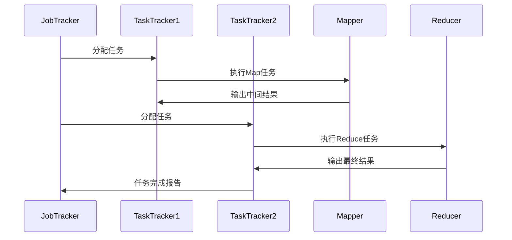
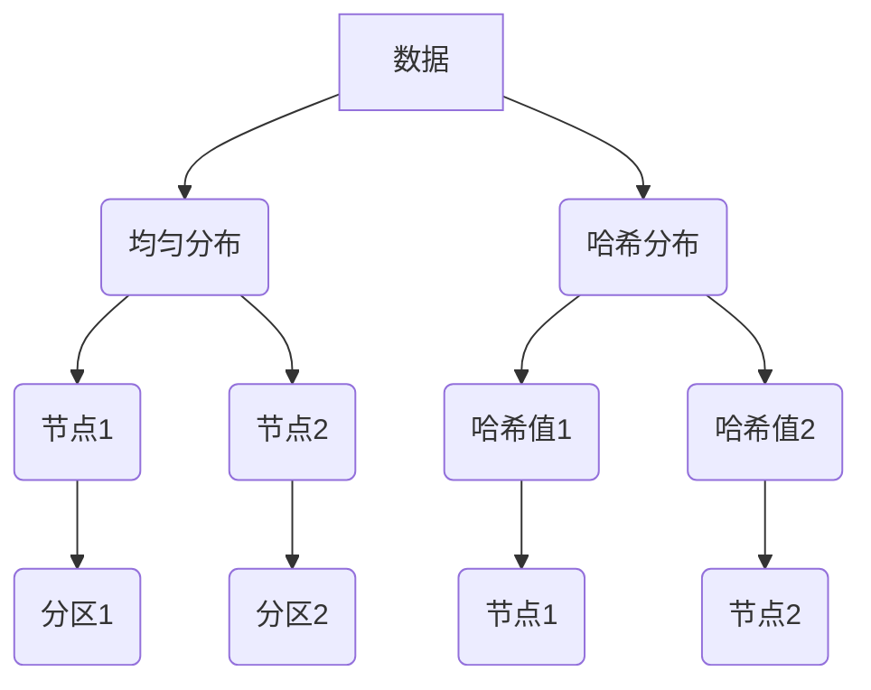
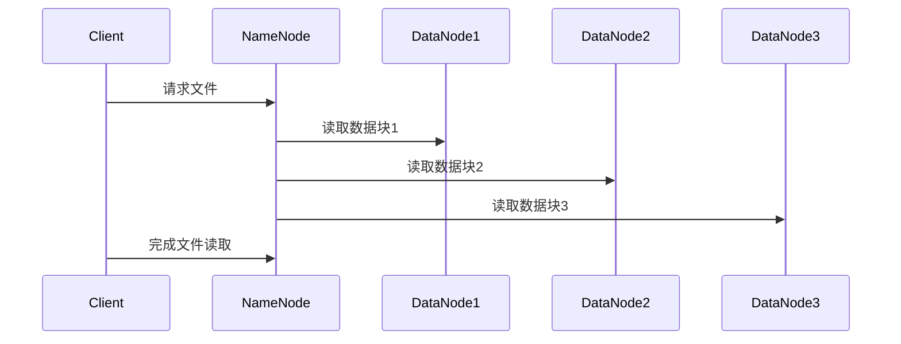
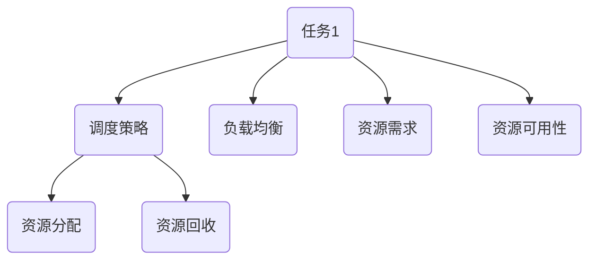
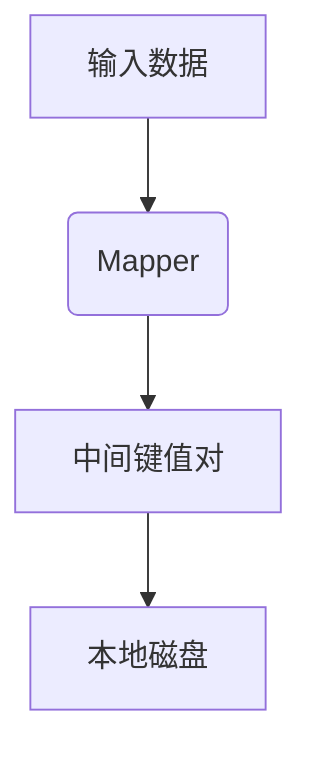
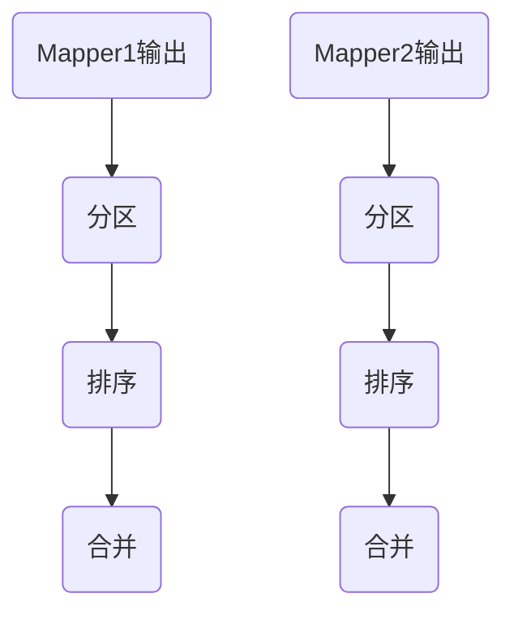
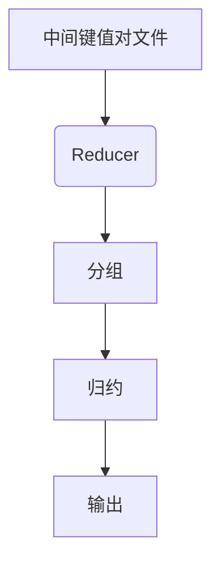

                 

## 文章标题

### 《MapReduce原理与代码实例讲解》

<关键词>MapReduce，分布式计算，大数据处理，Hadoop，HDFS，编程模型，代码实例，性能优化</关键词>

> **摘要：** 本文旨在深入解析MapReduce的原理，并通过实际代码实例，详细讲解其实现和应用。文章结构分为概述、原理讲解、实例分析、高级特性、生态系统、实践及性能优化等多个部分，旨在帮助读者全面理解并掌握MapReduce技术。

### 引言

随着互联网和大数据技术的发展，数据规模呈现指数级增长，如何高效地处理海量数据成为了信息技术领域的一个关键问题。MapReduce作为一种分布式计算模型，以其高效、可扩展的特点，在处理大数据方面表现出了强大的优势。本文将详细讲解MapReduce的原理，并通过代码实例进行分析，帮助读者深入理解这一重要技术。

### 目录

1. **MapReduce概述**
   - 1.1 MapReduce基本概念
   - 1.2 MapReduce体系结构
   - 1.3 MapReduce编程模型

2. **分布式系统基础**
   - 2.1 数据分布与分区策略
   - 2.2 数据存储与HDFS
   - 2.3 调度与资源管理

3. **MapReduce编程原理**
   - 3.1 Map阶段原理
   - 3.2 Shuffle阶段原理
   - 3.3 Reduce阶段原理

4. **数据处理实例讲解**
   - 4.1 WordCount实例解析
   - 4.2 PageRank实例解析

5. **MapReduce高级特性**
   - 5.1 Combiner的使用
   - 5.2 分布式缓存
   - 5.3 实时数据处理

6. **Hadoop生态系统**
   - 6.1 Hadoop分布式文件系统
   - 6.2 YARN资源调度
   - 6.3 Hive数据仓库
   - 6.4 HBase分布式数据库

7. **MapReduce代码实例实践**
   - 7.1 实践环境搭建
   - 7.2 WordCount实例实现
   - 7.3 PageRank实例实现

8. **MapReduce性能优化**
   - 8.1 数据本地化策略
   - 8.2 并行度优化
   - 8.3 资源分配与调度优化

9. **附录**
   - 9.1 MapReduce相关技术文档
   - 9.2 常见问题解答
   - 9.3 进一步阅读资源

接下来，我们将一步步深入探讨MapReduce的核心概念、原理、实例和实践，帮助读者全面掌握这一关键技术。

---

### 第一部分：MapReduce概述

#### 1.1 MapReduce基本概念

MapReduce是由Google提出的一种分布式计算模型，用于处理大规模数据集。该模型基于两个主要的操作：Map和Reduce。Map操作用于将数据分解成更小的子任务，而Reduce操作用于合并这些子任务的结果。通过这种方式，MapReduce能够高效地处理海量数据。

**Map操作：**  
Map操作接收一个键值对集合作为输入，将其处理为一系列新的键值对。这个过程通常涉及以下步骤：

1. **输入分解：** 将输入数据集分解成更小的子数据集。
2. **映射：** 对每个子数据集应用一个映射函数，产生新的键值对。
3. **输出合并：** 将映射结果合并成一个大的输出集合。

**Reduce操作：**  
Reduce操作接收一个键值对集合作为输入，并对其应用一个归约函数，产生一个输出键值对。这个过程通常涉及以下步骤：

1. **分组：** 将具有相同键的输出键值对分组。
2. **归约：** 对每个分组应用一个归约函数，产生一个新的键值对。
3. **输出：** 输出结果键值对。

#### 1.2 MapReduce历史背景

MapReduce的概念最早是由Google在2004年提出的，其背后的思想来源于数学中的映射和归约操作。Google将这一模型应用于其搜索引擎和其他大规模数据处理任务中，取得了显著的成功。MapReduce的提出，极大地推动了分布式计算技术的发展，也为后来的大数据处理框架如Hadoop等奠定了基础。

#### 1.3 MapReduce体系结构

MapReduce的体系结构包括以下几个关键组件：

1. **Job Tracker：** 负责整个作业的管理和调度。它将作业分解成多个任务，分配给不同的Task Tracker执行。
2. **Task Tracker：** 运行在各个节点上，负责执行Job Tracker分配的任务。每个Task Tracker会向Job Tracker报告任务的状态。
3. **Mapper：** 处理输入数据集，将其分解成更小的子任务，输出中间键值对。
4. **Shuffle：** 负责将Mapper输出的中间键值对进行分组，分发到不同的Reducer上。
5. **Reducer：** 处理分组的中间键值对，输出最终的结果。

**图1：MapReduce体系结构图**



通过上述体系结构，MapReduce能够有效地处理分布式环境中的大规模数据，实现高效的数据处理和分析。

#### 1.4 MapReduce编程模型

MapReduce编程模型主要包括两个核心类：`Mapper`和`Reducer`。开发者需要实现这两个类的特定方法，以定义数据处理逻辑。

**Mapper类：**  
- `map(KEYIN key, VALUEIN value, Context context)` 方法：用于处理输入数据，输出中间键值对。

**Reducer类：**  
- `reduce(KEYOUT key, Iterable<VALUEOUT> values, Context context)` 方法：用于处理分组的中间键值对，输出最终结果。

**Context类：**  
- `write(KEYOUT key, VALUEOUT value)` 方法：用于输出键值对。

通过实现Mapper和Reducer类，开发者可以轻松地将数据处理逻辑映射到分布式环境中，实现高效的数据处理。

**图2：MapReduce编程模型**

```mermaid
classDiagram
    Mapper <|-- Context
    Reducer <|-- Context

    Context {
        write(KEYOUT key, VALUEOUT value)
    }
    Mapper {
        map(KEYIN key, VALUEIN value, Context context)
    }
    Reducer {
        reduce(KEYOUT key, Iterable<VALUEOUT> values, Context context)
    }
```

通过上述概述，我们对MapReduce有了基本的了解。在接下来的部分，我们将深入探讨分布式系统基础，进一步理解MapReduce的工作原理和实现细节。

### 第二部分：分布式系统基础

在深入探讨MapReduce之前，我们需要了解一些分布式系统的基本概念。分布式系统是由多个相互协作的计算机节点组成的系统，这些节点通过网络连接，共同完成任务。了解分布式系统的基本原理和关键技术，对于理解MapReduce的工作机制至关重要。

#### 2.1 数据分布与分区策略

在分布式系统中，数据分布是确保系统高效运行的关键因素。数据分布涉及到如何将数据集划分成多个部分，并存储在不同的节点上。

**数据分布策略：**  
- **均匀分布：** 将数据均匀地分布在多个节点上，避免某个节点负载过重。
- **哈希分布：** 使用哈希函数将数据映射到不同的节点，确保相同键的数据存储在相同的节点上。

**分区策略：**  
- **范围分区：** 根据数据的范围（如时间范围、地理位置等）将数据分成多个分区。
- **哈希分区：** 根据数据的哈希值将数据分区，确保相同哈希值的数据存储在相同的节点上。

**图3：数据分布与分区策略**



通过有效的数据分布和分区策略，分布式系统可以更好地处理海量数据，提高系统的可用性和性能。

#### 2.2 数据存储与HDFS

在分布式系统中，数据存储是一个关键问题。Hadoop分布式文件系统（HDFS）是Hadoop生态系统中的一个核心组件，用于存储大规模数据集。

**HDFS架构：**  
- **NameNode：** 负责管理文件的元数据，如文件名、目录结构、文件块等。
- **DataNode：** 负责存储文件的数据块，并响应客户端的读写请求。

**数据块存储：**  
- HDFS将大文件分成固定大小的数据块（默认为128MB或256MB），并存储在多个DataNode上，以提高数据的可靠性和访问速度。

**数据冗余：**  
- HDFS采用数据冗余策略，每个数据块都会复制多个副本，通常为三个副本。这确保了在某个节点故障时，数据仍然可用。

**图4：HDFS架构图**



通过HDFS，分布式系统可以高效地存储和访问大规模数据集，满足大数据处理的需求。

#### 2.3 调度与资源管理

在分布式系统中，调度和资源管理是确保系统高效运行的关键因素。

**调度策略：**  
- **任务调度：** 根据系统的负载情况和资源可用性，将任务分配给合适的节点。
- **负载均衡：** 通过调度策略，确保系统资源得到充分利用，避免某个节点负载过重。

**资源管理：**  
- **资源分配：** 根据任务的资源需求，合理分配系统资源。
- **资源回收：** 在任务完成后，回收释放的资源，以便其他任务使用。

**图5：调度与资源管理策略**



通过有效的调度和资源管理，分布式系统可以更好地应对大规模数据处理任务，提高系统的性能和可用性。

通过上述对分布式系统基础的了解，我们为理解MapReduce的工作原理和实现细节打下了基础。在接下来的部分，我们将深入探讨MapReduce的编程原理，帮助读者全面掌握这一关键技术。

### 第三部分：MapReduce编程原理

MapReduce编程模型的核心在于其高效的分布式数据处理能力。理解MapReduce的编程原理，包括Map阶段、Shuffle阶段和Reduce阶段，是掌握这一技术的关键。以下是详细解析。

#### 3.1 Map阶段原理

Map阶段是MapReduce过程中的第一个阶段，其主要任务是将输入的数据集分解成多个键值对，并生成中间结果。Map阶段的基本步骤如下：

**1. 输入分解：**  
Map任务首先从HDFS或其他数据源读取输入数据，通常是以键值对的形式。这些数据会被分解成多个子任务。

**2. 映射函数：**  
每个子任务应用一个映射函数（`map`方法），将输入数据转换成中间键值对。映射函数的输入是一个键值对，输出是一个或多个中间键值对。

**3. 输出合并：**  
Map任务将生成的中间键值对输出到本地磁盘上，通常以分区和排序的形式组织。

**图6：Map阶段原理图**



**示例伪代码：**

```python
class Mapper:
    def map(key, value, context):
        for kv in process_input(value):
            context.write(kv[0], kv[1])
```

在这个示例中，`process_input`函数负责处理输入数据，生成中间键值对，并调用`context.write`方法输出。

#### 3.2 Shuffle阶段原理

Shuffle阶段是MapReduce过程中的关键阶段，其主要任务是将Map阶段产生的中间键值对进行重新分组和分发，以便Reduce阶段进行处理。Shuffle阶段的基本步骤如下：

**1. 分区：**  
Map任务的输出会按照键进行分区，确保具有相同键的中间键值对存储在同一个文件中。

**2. 排序：**  
每个分区中的中间键值对会根据键进行排序，以便在Reduce阶段能够高效地分组和处理。

**3. 合并：**  
Map任务的输出文件会被分发到Reduce任务所在的节点上，每个Reduce任务会读取本地磁盘上的中间键值对文件，进行合并和排序。

**图7：Shuffle阶段原理图**



**示例伪代码：**

```python
class Shuffle:
    def shuffle(mapper_outputs, context):
        for partition in mapper_outputs:
            for key, values in partition.items():
                context.write(key, values)
```

在这个示例中，`shuffle`函数负责读取Map任务的输出文件，按照键进行分区和排序，并调用`context.write`方法输出。

#### 3.3 Reduce阶段原理

Reduce阶段是MapReduce过程中的最后一个阶段，其主要任务是对Shuffle阶段产生的中间键值对进行归约和处理，生成最终结果。Reduce阶段的基本步骤如下：

**1. 分组：**  
Reduce任务从Shuffle阶段生成的中间键值对文件中读取数据，按照键进行分组。

**2. 归约：**  
对每个分组应用一个归约函数（`reduce`方法），将多个值归约为一个值。

**3. 输出：**  
将归约结果输出到本地磁盘上，最终由Job Tracker汇总并保存到HDFS或其他数据存储系统中。

**图8：Reduce阶段原理图**



**示例伪代码：**

```python
class Reducer:
    def reduce(key, values, context):
        result = reduce_function(values)
        context.write(key, result)
```

在这个示例中，`reduce_function`函数负责对分组的数据进行归约，生成最终结果，并调用`context.write`方法输出。

通过上述解析，我们详细介绍了MapReduce的编程原理，包括Map阶段、Shuffle阶段和Reduce阶段的工作原理。理解这些原理，有助于开发者更好地应用MapReduce技术，高效地处理大规模数据集。接下来，我们将通过具体实例，进一步讲解MapReduce的实现和应用。

#### 3.1.1 Mapper工作原理

Mapper是MapReduce编程模型中的核心组件，负责将输入的数据分解成更小的子任务，并生成中间键值对。以下是Mapper的工作原理和实现细节。

**工作原理：**

1. **初始化：**  
Mapper在开始处理输入数据之前，需要进行初始化。这一步骤通常包括设置输入路径、读取配置信息等。

2. **读取输入数据：**  
Mapper从输入数据源（如HDFS）中读取数据，并将其分解成多个键值对。这些键值对是后续Map任务处理的基本单位。

3. **映射函数：**  
Mapper对每个输入键值对应用映射函数（`map`方法），生成中间键值对。映射函数的输入是一个键值对，输出是一个或多个中间键值对。

4. **输出中间结果：**  
Mapper将生成的中间键值对输出到本地磁盘上，通常以分区和排序的形式组织。这有助于在Shuffle阶段进行高效的数据处理。

**实现细节：**

1. **输入数据格式：**  
在Map阶段，输入数据通常是以文本文件的形式存储的。每个文件可以包含多个键值对，格式为`key1:value1 key2:value2 ...`。

2. **映射函数设计：**  
映射函数的设计取决于具体的应用场景。例如，在WordCount任务中，映射函数可以将文本文件分解成单词和计数器。

3. **中间结果存储：**  
中间结果通常存储在本地磁盘上，以分区和排序的形式组织。分区可以通过哈希函数实现，确保相同键的数据存储在同一个文件中。

4. **并行处理：**  
Mapper支持并行处理，多个Mapper任务可以同时处理不同的输入数据。这有助于提高数据处理效率。

**示例伪代码：**

```python
class Mapper:
    def map(key, value, context):
        for line in value.splitlines():
            for word in line.split():
                context.write(word, 1)
```

在这个示例中，`map`函数将输入的文本文件分解成单词和计数器，生成中间键值对，并调用`context.write`方法输出。

**性能优化：**

1. **本地化：**  
为了提高数据处理效率，Mapper应该尽可能地使用本地数据。数据本地化策略可以通过调度和资源管理实现，确保Mapper任务在处理数据时，数据存储在相同的节点上。

2. **并行度：**  
适当调整Mapper的并行度，可以提高数据处理效率。并行度通常取决于数据规模和处理能力，可以通过配置参数进行设置。

通过深入理解Mapper的工作原理和实现细节，开发者可以更好地应用MapReduce技术，高效地处理大规模数据集。

#### 3.1.2 Map阶段数据处理

Map阶段是MapReduce过程中的关键部分，其处理过程决定了后续Shuffle和Reduce阶段的效率和效果。以下是Map阶段数据处理的详细步骤和机制。

**数据处理步骤：**

1. **初始化：**  
在Map任务开始处理输入数据之前，需要进行初始化。初始化过程通常包括加载配置信息、设置输入路径等。这些配置信息决定了Map任务的处理逻辑和参数。

2. **读取输入数据：**  
Mapper从HDFS或其他数据源读取输入数据。输入数据通常以文本文件的形式存储，每行包含多个键值对。Mapper将读取的文本文件分解成单个键值对。

3. **映射函数：**  
Mapper对每个输入键值对应用映射函数（`map`方法）。映射函数的设计取决于具体的应用场景。例如，在WordCount任务中，映射函数可以将文本文件分解成单词和计数器。

4. **输出中间结果：**  
Mapper将生成的中间键值对输出到本地磁盘上。中间结果通常以分区和排序的形式组织，以便在Shuffle阶段进行高效的数据处理。

**数据处理机制：**

1. **分区：**  
Mapper将中间结果按照键进行分区。分区可以通过哈希函数实现，确保具有相同键的数据存储在同一个文件中。分区有助于在Shuffle阶段高效地分组和处理数据。

2. **排序：**  
每个分区中的中间键值对会根据键进行排序。排序有助于在Reduce阶段高效地分组和处理数据，减少网络传输开销。

3. **本地化：**  
数据本地化策略确保Mapper任务在处理数据时，数据存储在相同的节点上。数据本地化可以通过调度和资源管理实现，提高数据处理效率。

4. **并行处理：**  
多个Mapper任务可以同时处理不同的输入数据。并行处理有助于提高数据处理效率，缩短任务完成时间。

**性能优化策略：**

1. **减少数据传输：**  
减少中间结果的数据传输可以降低网络开销，提高数据处理效率。可以通过优化分区和排序策略实现。

2. **提高并行度：**  
适当提高Mapper的并行度，可以增加数据处理能力，缩短任务完成时间。可以通过调整配置参数实现。

3. **本地化策略：**  
确保Mapper任务在处理数据时，使用本地数据，减少数据传输开销。可以通过调度和资源管理实现。

通过深入理解Map阶段数据处理的过程和机制，开发者可以更好地优化MapReduce任务，提高数据处理效率和性能。

#### 3.2.1 Shuffle工作原理

Shuffle阶段是MapReduce过程中的关键步骤，它负责将Map阶段产生的中间键值对进行重新分组和分发，以便在Reduce阶段进行处理。以下是Shuffle阶段的工作原理和实现细节。

**工作原理：**

1. **分组：**  
Shuffle阶段首先将Map任务输出的中间键值对按照键进行分组。具有相同键的键值对会被分配到同一个分区中。分组可以通过哈希函数实现，确保具有相同键的数据存储在同一个文件中。

2. **排序：**  
每个分区中的中间键值对会根据键进行排序。排序有助于在Reduce阶段高效地分组和处理数据，减少网络传输开销。

3. **分发：**  
Shuffle阶段将分好组和排序的中间键值对文件分发到不同的Reduce任务所在的节点上。每个Reduce任务会读取分配给自己的分区文件，进行进一步处理。

4. **本地存储：**  
为了提高数据处理效率，Shuffle阶段会将中间结果存储在本地磁盘上，而不是直接在网络中传输。这可以减少网络传输开销，提高数据传输速度。

**实现细节：**

1. **分区：**  
分区策略通常通过哈希函数实现。例如，可以采用`hash(key) % num_reducers`的方式，确保具有相同键的中间键值对被分配到相同的分区中。

2. **排序：**  
排序可以通过多线程和内存排序算法实现。在Java中，可以使用`Arrays.sort()`方法对中间键值对进行排序。排序算法的选择和优化对Shuffle阶段的性能有重要影响。

3. **数据分发：**  
数据分发可以通过多线程和异步I/O实现。每个Reduce任务会从本地磁盘上读取分配给自己的分区文件，进行进一步处理。分发策略的设计和优化对Shuffle阶段的性能至关重要。

4. **本地存储：**  
Shuffle阶段会将中间结果存储在本地磁盘上，以便在Reduce阶段高效地读取和处理。本地存储可以通过缓冲区和内存映射文件实现，以提高数据访问速度。

**示例伪代码：**

```python
class Shuffle:
    def shuffle(mapper_outputs, context):
        for partition in mapper_outputs:
            sorted_partition = sort(partition)
            for key, values in sorted_partition.items():
                context.write(key, values)
```

在这个示例中，`shuffle`函数负责读取Mapper任务的输出文件，按照键进行分组和排序，并调用`context.write`方法输出。

**性能优化策略：**

1. **减少数据传输：**  
减少中间结果的数据传输可以降低网络开销，提高数据处理效率。可以通过优化分区和排序策略实现。

2. **提高并行度：**  
适当提高Shuffle阶段的并行度，可以增加数据处理能力，缩短任务完成时间。可以通过调整配置参数实现。

3. **本地化策略：**  
确保Shuffle阶段使用本地数据，减少数据传输开销。可以通过调度和资源管理实现。

通过深入理解Shuffle阶段的工作原理和实现细节，开发者可以更好地优化MapReduce任务，提高数据处理效率和性能。

#### 3.2.2 Shuffle数据处理

Shuffle阶段在MapReduce处理流程中起到了桥梁的作用，它将Map阶段的输出数据进行分组、排序和分发，以便在Reduce阶段进行有效的处理。以下是Shuffle数据处理的具体流程和实现细节。

**流程：**

1. **分组：**  
   Shuffle阶段首先对Map任务输出的中间键值对进行分组。分组的关键在于确保具有相同键的键值对被分配到同一个分区中。分区可以通过哈希函数实现，确保数据的均匀分布，减少网络传输开销。例如，可以使用`hash(key) % num_reducers`的方式，将中间键值对分配到不同的分区。

2. **排序：**  
   在分组完成后，每个分区内的中间键值对会根据键进行排序。排序的目的是为了在Reduce阶段能够按照键的顺序处理数据，从而提高归约效率。排序可以通过内存排序或外部排序算法实现。内存排序适用于数据量较小的场景，而外部排序则适用于数据量较大的情况。

3. **本地存储：**  
   在分组和排序完成后，中间键值对会被存储到本地磁盘上，以便在Reduce任务启动时快速读取。本地存储可以减少网络传输开销，提高数据处理效率。在Hadoop中，默认的存储格式是TextOutputFormat，它将中间键值对以文本形式存储到本地文件系统中。

4. **分发：**  
   最后，Shuffle阶段会将分好组和排序好的中间键值对文件分发到不同的Reduce任务所在的节点上。每个Reduce任务会从本地磁盘上读取分配给自己的分区文件，进行进一步的处理。

**实现细节：**

1. **分组算法：**  
   分组算法的核心是哈希函数。哈希函数的选择和优化对分组的均匀性和性能有重要影响。例如，可以使用MurmurHash等高效哈希算法，确保分区的均匀性和高效性。

2. **排序算法：**  
   排序算法的选择取决于数据量。对于小数据量，可以使用快速排序、归并排序等内存排序算法。对于大数据量，可能需要使用外部排序算法，如多路归并排序。外部排序算法通常涉及多个阶段的排序和合并，可以有效处理海量数据。

3. **本地存储格式：**  
   本地存储格式通常使用TextOutputFormat，它将中间键值对以文本形式存储。这种格式简单易用，但可能不适用于所有场景。对于某些特定的数据处理任务，可能需要使用更高效的存储格式，如SequenceFile或Parquet。

4. **分布式文件系统：**  
   Shuffle阶段的数据存储通常依赖于分布式文件系统，如HDFS。HDFS提供了高可靠性和高扩展性的存储服务，适用于大规模数据集的处理。

**示例伪代码：**

```python
def shuffle(mapper_outputs, context):
    # 分组
    partitions = {}
    for key, values in mapper_outputs:
        partitions[hash(key) % num_reducers] = values

    # 排序
    for partition in partitions:
        sorted_values = sort(partitions[partition])

    # 本地存储
    for key, sorted_values in partitions.items():
        with open(f"{key}.txt", "w") as f:
            for value in sorted_values:
                f.write(f"{value}\n")

    # 分发
    for partition in partitions:
        context.write(partition, f"{key}.txt")
```

在这个示例中，`shuffle`函数首先对中间键值对进行分组，然后排序，并将排序后的数据存储到本地文件系统中。最后，将文件路径分发到Reduce任务所在的节点上。

**性能优化策略：**

1. **减少数据传输：**  
   通过优化分组和排序算法，减少数据传输量，提高Shuffle阶段的性能。例如，可以使用更高效的哈希函数和排序算法。

2. **提高并行度：**  
   调整Shuffle阶段的并行度，增加处理能力。可以通过调整Hadoop的配置参数，如`mapreduce.task.io.sort.mb`和`mapreduce.reduce.shuffle.input.buffer.percent`等。

3. **本地化策略：**  
   确保Shuffle阶段使用本地数据，减少数据传输开销。可以通过调度和资源管理实现。

通过深入理解Shuffle数据处理的流程和实现细节，开发者可以优化MapReduce任务，提高其效率和性能。

#### 3.3.1 Reducer工作原理

Reducer是MapReduce编程模型中的核心组件，负责对Shuffle阶段生成的中间键值对进行归约和输出最终结果。以下是Reducer的工作原理和实现细节。

**工作原理：**

1. **初始化：**  
   Reducer在开始处理输入数据之前，需要进行初始化。初始化步骤包括设置输入路径、读取配置信息等。这些配置信息决定了Reducer的处理逻辑和参数。

2. **读取输入数据：**  
   Reducer从Shuffle阶段生成的中间键值对文件中读取数据。这些文件已经按照键进行了分组和排序，方便后续处理。

3. **归约函数：**  
   Reducer对每个分组的数据应用归约函数（`reduce`方法），将多个值归约为一个值。归约函数的设计取决于具体的应用场景。例如，在WordCount任务中，归约函数可以将单词的计数器累加。

4. **输出最终结果：**  
   Reducer将归约结果输出到本地磁盘上，最终由Job Tracker汇总并保存到HDFS或其他数据存储系统中。

**实现细节：**

1. **输入数据格式：**  
   Reducer的输入数据通常是按照键进行分组和排序的中间键值对文件。这些文件存储在本地磁盘上，以便在Reduce阶段高效地读取和处理。

2. **归约函数设计：**  
   归约函数的设计取决于具体的应用场景。例如，在WordCount任务中，归约函数可以将单词的计数器累加。在计算词频时，归约函数可能会使用数学公式，如`sum(a + b)`。

3. **输出数据格式：**  
   Reducer的输出数据通常是以文本文件的形式存储的。每个文件包含一个或多个键值对，格式为`key:value`。

4. **并行处理：**  
   Reducer支持并行处理，多个Reducer任务可以同时处理不同的输入数据。这有助于提高数据处理效率。

**示例伪代码：**

```python
class Reducer:
    def reduce(key, values, context):
        result = sum(values)
        context.write(key, result)
```

在这个示例中，`reduce`函数将分组的数据进行累加，生成最终结果，并调用`context.write`方法输出。

**性能优化策略：**

1. **减少数据传输：**  
   通过优化分组和排序算法，减少数据传输量，提高Reduce阶段的性能。例如，可以使用更高效的哈希函数和排序算法。

2. **提高并行度：**  
   调整Reducer的并行度，增加处理能力。可以通过调整Hadoop的配置参数，如`mapreduce.reduce.parallel.copies`和`mapreduce.reduce.tasks`等。

3. **本地化策略：**  
   确保Reducer任务在处理数据时，使用本地数据，减少数据传输开销。可以通过调度和资源管理实现。

通过深入理解Reducer的工作原理和实现细节，开发者可以优化MapReduce任务，提高其效率和性能。

#### 3.3.2 Reduce阶段数据处理

Reduce阶段是MapReduce过程中的关键步骤，负责对Shuffle阶段生成的中间键值对进行归约和输出最终结果。以下是Reduce阶段数据处理的详细步骤和机制。

**数据处理步骤：**

1. **初始化：**  
   Reduce任务在开始处理输入数据之前，需要进行初始化。初始化步骤通常包括加载配置信息、设置输入路径等。这些配置信息决定了Reduce任务的处理逻辑和参数。

2. **读取输入数据：**  
   Reduce任务从Shuffle阶段生成的中间键值对文件中读取数据。这些文件已经按照键进行了分组和排序，方便后续处理。

3. **分组处理：**  
   Reduce任务将读取的中间键值对按照键进行分组。分组后的数据会存储在内存或磁盘上的一个数据结构中，如列表或哈希表。

4. **归约函数：**  
   对每个分组的数据应用归约函数（`reduce`方法），将多个值归约为一个值。归约函数的设计取决于具体的应用场景。例如，在WordCount任务中，归约函数可以将单词的计数器累加。

5. **输出最终结果：**  
   Reduce任务将归约结果输出到本地磁盘上，最终由Job Tracker汇总并保存到HDFS或其他数据存储系统中。

**数据处理机制：**

1. **数据分组：**  
   数据分组是Reduce阶段的核心任务。分组的关键在于确保具有相同键的数据被分配到同一个分组中。分组可以通过哈希函数实现，确保分组的均匀性和高效性。

2. **排序：**  
   分组后的数据会根据键进行排序。排序有助于在归约函数中高效地处理数据，减少重复计算。排序可以通过内存排序或外部排序算法实现。

3. **本地存储：**  
   Reduce任务通常会将归约结果存储在本地磁盘上，以便在任务完成后进行汇总和保存。本地存储可以减少网络传输开销，提高数据处理效率。

4. **分布式文件系统：**  
   Reduce阶段的输出数据通常会存储在分布式文件系统上，如HDFS。分布式文件系统提供了高可靠性和高扩展性的存储服务，适用于大规模数据集的处理。

**性能优化策略：**

1. **减少数据传输：**  
   通过优化分组和排序算法，减少数据传输量，提高Reduce阶段的性能。例如，可以使用更高效的哈希函数和排序算法。

2. **提高并行度：**  
   调整Reduce任务的并行度，增加处理能力。可以通过调整Hadoop的配置参数，如`mapreduce.reduce.parallel.copies`和`mapreduce.reduce.tasks`等。

3. **本地化策略：**  
   确保Reduce任务在处理数据时，使用本地数据，减少数据传输开销。可以通过调度和资源管理实现。

通过深入理解Reduce阶段数据处理的过程和机制，开发者可以优化MapReduce任务，提高数据处理效率和性能。

#### 4.1 WordCount实例解析

WordCount是MapReduce编程模型中最经典的应用实例之一，它用于统计文本文件中各个单词的词频。通过WordCount实例，我们可以深入理解MapReduce编程模型的实现和应用。

**4.1.1 WordCount程序结构**

WordCount程序主要由三个部分组成：Mapper、Reducer和Job配置。

- **Mapper：** 负责将输入的文本文件分解成单词和计数器，输出中间键值对。
- **Reducer：** 负责将Mapper输出的中间键值对进行归约，输出最终结果。
- **Job配置：** 负责设置MapReduce作业的配置参数，如输入路径、输出路径等。

**示例伪代码：**

```python
class Mapper:
    def map(key, value, context):
        for word in value.split():
            context.write(word, 1)

class Reducer:
    def reduce(key, values, context):
        result = sum(values)
        context.write(key, result)

class WordCountJob:
    def configure(job):
        job.setInputFormat(TextInputFormat)
        job.setOutputFormat(TextOutputFormat)
        job.setOutputKeyClass(Text)
        job.setOutputValueClass(IntWritable)
        job.setMapperClass(Mapper)
        job.setReducerClass(Reducer)
```

**4.1.2 Mapper实现解析**

Mapper的主要任务是将输入的文本文件分解成单词和计数器，输出中间键值对。以下是Mapper的实现解析。

1. **初始化：**   
   Mapper在初始化时，会读取配置信息，如输入路径和输出路径。

2. **读取输入数据：**   
   Mapper从输入路径读取文本文件，将其分解成单个单词。在处理过程中，Mapper会将每个单词和计数器（1）作为键值对输出。

3. **输出中间结果：**   
   Mapper将生成的中间键值对输出到本地磁盘上，以便在Shuffle阶段进行进一步处理。

**示例伪代码：**

```python
class Mapper:
    def map(key, value, context):
        for word in value.split():
            context.write(word, 1)
```

在这个示例中，`map`函数将输入的文本文件分解成单词，并将单词和计数器作为键值对输出。

**4.1.3 Reducer实现解析**

Reducer的主要任务是将Mapper输出的中间键值对进行归约，输出最终结果。以下是Reducer的实现解析。

1. **初始化：**     
   Reducer在初始化时，会读取配置信息，如输入路径和输出路径。

2. **读取输入数据：**     
   Reducer从输入路径读取中间键值对文件，按照键进行分组。

3. **归约函数：**     
   对每个分组的数据应用归约函数，将多个计数器累加，输出最终结果。

4. **输出最终结果：**     
   Reducer将归约结果输出到本地磁盘上，最终由Job Tracker汇总并保存到HDFS。

**示例伪代码：**

```python
class Reducer:
    def reduce(key, values, context):
        result = sum(values)
        context.write(key, result)
```

在这个示例中，`reduce`函数将分组的数据进行累加，生成最终结果，并输出。

**4.1.4 代码解读与分析**

WordCount程序通过Mapper和Reducer两个核心组件，实现了文本文件中单词词频的统计。以下是代码的关键步骤和解读。

1. **输入处理：**     
   Mapper从输入路径读取文本文件，将其分解成单个单词。这个步骤利用了Python的字符串处理函数，如`split()`。

2. **中间键值对生成：**     
   Mapper将每个单词和计数器（1）作为键值对输出。这个步骤实现了Map操作的核心逻辑。

3. **分组与排序：**     
   在Shuffle阶段，中间键值对会被按照键进行分组和排序。这个步骤为Reduce操作打下了基础。

4. **归约与输出：**     
   Reducer对每个分组的数据进行累加，生成最终结果，并输出。这个步骤实现了Reduce操作的核心逻辑。

通过WordCount实例，我们深入解析了MapReduce编程模型的实现和应用。理解这个实例，有助于我们更好地掌握MapReduce技术，并应用于实际数据处理任务中。

#### 4.2 PageRank实例解析

PageRank是一种用于评估网页重要性的算法，由Google创始人拉里·佩奇和谢尔盖·布林提出。PageRank算法基于网页之间的链接关系，通过迭代计算每个网页的排名。本文将通过PageRank实例，详细解析其程序结构、Mapper和Reducer的实现，以及代码解读与分析。

**4.2.1 PageRank程序结构**

PageRank程序主要由三个部分组成：Mapper、Reducer和迭代过程。

- **Mapper：** 负责将输入的网页链接关系转换为中间键值对，输出给Reducer。
- **Reducer：** 负责对Mapper输出的中间键值对进行归约，更新网页的PageRank值。
- **迭代过程：** PageRank算法通过多次迭代，不断更新网页的PageRank值，直到达到收敛。

**示例伪代码：**

```python
class Mapper:
    def map(key, value, context):
        for neighbor in value.neighbors:
            context.write(neighbor, value.page_rank / value.outgoing_links)

class Reducer:
    def reduce(key, values, context):
        total_rank = sum(value.page_rank for value in values)
        context.write(key, total_rank)

def iterate(pagerank_graph, num_iterations):
    for _ in range(num_iterations):
        map_output = map(Mapper, pagerank_graph)
        reduce_output = reduce(Reducer, map_output)
        update_pagerank_values(reduce_output)
```

**4.2.2 Mapper实现解析**

Mapper的主要任务是将输入的网页链接关系转换为中间键值对，输出给Reducer。以下是Mapper的实现解析。

1. **初始化：**   
   Mapper在初始化时，会读取输入路径和配置信息。

2. **读取输入数据：**   
   Mapper从输入路径读取网页链接关系数据，每个数据条目包含网页的URL、链接关系和初始PageRank值。

3. **输出中间结果：**   
   Mapper将每个网页的PageRank值按照其链接的网页进行分配，生成中间键值对。键为链接的网页URL，值为分配的PageRank值。

**示例伪代码：**

```python
class Mapper:
    def map(key, value, context):
        for neighbor in value.neighbors:
            context.write(neighbor, value.page_rank / value.outgoing_links)
```

在这个示例中，`map`函数将输入的网页链接关系和PageRank值转换为中间键值对，输出给Reducer。

**4.2.3 Reducer实现解析**

Reducer的主要任务是对Mapper输出的中间键值对进行归约，更新网页的PageRank值。以下是Reducer的实现解析。

1. **初始化：**   
   Reducer在初始化时，会读取输入路径和配置信息。

2. **读取输入数据：**   
   Reducer从输入路径读取中间键值对文件，按照键进行分组。

3. **归约函数：**   
   对每个分组的数据进行累加，计算总PageRank值，并减去网页自身的PageRank值，输出更新后的PageRank值。

4. **输出更新结果：**   
   Reducer将更新后的PageRank值输出到本地磁盘上，用于下一次迭代。

**示例伪代码：**

```python
class Reducer:
    def reduce(key, values, context):
        total_rank = sum(value.page_rank for value in values)
        context.write(key, total_rank - 1.0 / num_pages)
```

在这个示例中，`reduce`函数将分组的数据进行累加，并减去网页自身的PageRank值，生成更新后的PageRank值。

**4.2.4 代码解读与分析**

PageRank程序通过Mapper和Reducer两个核心组件，实现了网页排名的计算。以下是代码的关键步骤和解读。

1. **输入处理：**     
   Mapper从输入路径读取网页链接关系数据，将其转换为中间键值对。这个步骤利用了Python的集合操作和列表推导式。

2. **中间键值对生成：**     
   Mapper将每个网页的PageRank值按照其链接的网页进行分配。这个步骤实现了Map操作的核心逻辑。

3. **分组与排序：**     
   在Shuffle阶段，中间键值对会被按照键进行分组和排序。这个步骤为Reduce操作打下了基础。

4. **归约与输出：**     
   Reducer对每个分组的数据进行累加，更新网页的PageRank值。这个步骤实现了Reduce操作的核心逻辑。

5. **迭代过程：**     
   PageRank算法通过多次迭代，不断更新网页的PageRank值，直到达到收敛。迭代过程利用了递归和循环结构，实现了算法的迭代计算。

通过PageRank实例，我们深入解析了MapReduce编程模型的实现和应用。理解这个实例，有助于我们更好地掌握MapReduce技术，并应用于实际数据处理任务中。

#### 4.3.1 Combiner的使用

Combiner是MapReduce编程模型中的一个可选组件，用于在Map和Reduce之间进行数据预归约，以减少网络传输和数据处理的负载。Combiner的主要作用是对Map阶段输出的中间键值对进行局部归约，将相同键的值合并成一个值，从而减少Reduce阶段的输入数据量。

**Combiner工作原理：**

1. **初始化：**    
   Combiner在初始化时，会读取配置信息，如输入路径和输出路径。

2. **读取输入数据：**    
   Combiner从Map阶段的输出读取中间键值对，按照键进行分组。

3. **局部归约：**    
   对每个分组的数据应用归约函数，将多个值合并为一个值。

4. **输出局部结果：**    
   Combiner将局部归约后的结果输出到本地磁盘上，以便在Reduce阶段减少数据量。

**示例伪代码：**

```python
class Combiner:
    def combine(key, values, context):
        result = sum(values)
        context.write(key, result)

class Mapper:
    def map(key, value, context):
        for word in value.split():
            context.write(word, 1)

class Reducer:
    def reduce(key, values, context):
        result = sum(values)
        context.write(key, result)

class WordCountJob:
    def configure(job):
        job.setInputFormat(TextInputFormat)
        job.setOutputFormat(TextOutputFormat)
        job.setOutputKeyClass(Text)
        job.setOutputValueClass(IntWritable)
        job.setMapperClass(Mapper)
        job.setCombinerClass(Combiner)
        job.setReducerClass(Reducer)
```

**示例解释：**

在这个示例中，Combiner的作用是将Map阶段输出的每个单词的计数器进行局部累加。具体步骤如下：

1. **初始化：**      
   Combiner初始化时，会读取Map阶段的输出中间键值对。

2. **读取输入数据：**      
   Combiner按照键（单词）对中间键值对进行分组。

3. **局部归约：**      
   对每个分组的数据（单词和计数器）应用归约函数，将计数器进行累加。

4. **输出局部结果：**      
   Combiner将局部归约后的结果输出到本地磁盘上，以便在Reduce阶段减少数据量。

通过使用Combiner，我们可以有效地减少Reduce阶段的输入数据量，提高数据处理效率和性能。

#### 4.3.2 分布式缓存

分布式缓存是MapReduce编程模型中的一个高级特性，用于在Map和Reduce任务之间共享数据，提高任务执行效率。分布式缓存将关键数据或配置信息存储在内存中，以便快速访问，减少磁盘I/O和网络传输的开销。

**分布式缓存工作原理：**

1. **初始化：**      
   分布式缓存在初始化时，会读取配置信息，如缓存数据集和缓存策略。

2. **缓存数据：**      
   分布式缓存将关键数据集或配置信息加载到内存中，以供后续任务快速访问。

3. **任务执行：**      
   在Map和Reduce任务执行过程中，分布式缓存会根据任务需求，动态加载和更新缓存数据。

4. **缓存管理：**      
   分布式缓存会定期检查内存使用情况，根据缓存策略进行数据刷新或淘汰，以确保内存资源的高效利用。

**示例伪代码：**

```python
class DistributedCache:
    def load(key, value):
        # 将数据加载到内存缓存
        cache[key] = value

    def get(key):
        # 从内存缓存中获取数据
        return cache.get(key)

class Mapper:
    def map(key, value, context):
        if 'special_key' in distributed_cache.get('config'):
            # 使用缓存中的特殊键值对
            special_value = distributed_cache.get('special_key')
            context.write(special_value, value)

class Reducer:
    def reduce(key, values, context):
        # 使用缓存中的数据
        cache_value = distributed_cache.get('config')
        context.write(key, cache_value)

class WordCountJob:
    def configure(job):
        # 设置分布式缓存
        job.addCacheFile('file:///path/to/config.txt')
        job.setInputFormat(TextInputFormat)
        job.setOutputFormat(TextOutputFormat)
        job.setOutputKeyClass(Text)
        job.setOutputValueClass(IntWritable)
        job.setMapperClass(Mapper)
        job.setReducerClass(Reducer)
```

**示例解释：**

在这个示例中，分布式缓存用于在WordCount任务中共享特殊配置信息。具体步骤如下：

1. **初始化：**        
   分布式缓存初始化时，会加载配置信息到内存中。

2. **缓存数据：**        
   将关键配置信息（如特殊键值对）加载到内存缓存中。

3. **任务执行：**        
   在Map和Reduce任务执行过程中，分布式缓存根据任务需求动态加载和更新缓存数据。

4. **缓存管理：**        
   分布式缓存会定期检查内存使用情况，根据缓存策略进行数据刷新或淘汰。

通过使用分布式缓存，我们可以显著提高MapReduce任务的执行效率，减少数据访问延迟，提升系统性能。

#### 4.3.3 实时数据处理

实时数据处理是MapReduce编程模型中的一个高级特性，通过使用实时流处理框架，如Apache Flink和Apache Storm，可以实现数据的实时处理和分析。实时数据处理与传统的批处理相比，具有更低的延迟和更高的实时性。

**实时数据处理工作原理：**

1. **数据采集：**    
   实时数据处理框架通过数据采集模块，从各种数据源（如日志文件、网络流量、传感器数据等）实时获取数据。

2. **数据流处理：**    
   实时数据处理框架将数据作为流进行处理，应用一系列转换和计算操作，如过滤、聚合、机器学习等。

3. **实时反馈：**    
   实时数据处理框架将处理结果实时反馈给用户或系统，支持实时监控、报警和决策。

**示例伪代码：**

```python
class RealtimeProcessor:
    def process_stream(stream):
        for event in stream:
            # 应用实时计算操作
            result = calculate_event(event)
            print(result)

# 数据流处理示例
stream = get_realtime_stream('data_source')
realtime_processor.process_stream(stream)
```

**示例解释：**

在这个示例中，实时数据处理框架用于处理来自数据源的数据流。具体步骤如下：

1. **数据采集：**      
   从数据源实时获取数据流。

2. **数据流处理：**      
   对数据流应用实时计算操作，如计算事件频率、识别异常等。

3. **实时反馈：**      
   将处理结果实时反馈给用户或系统，支持实时监控和报警。

通过实时数据处理，我们可以实现对大数据的实时分析和响应，满足现代应用场景中对实时性的需求。

### 第五部分：Hadoop生态系统

Hadoop生态系统是一个庞大的框架，提供了多种工具和组件，用于处理分布式数据存储和计算。以下是Hadoop生态系统中的关键组件及其功能：

#### 6.1 Hadoop分布式文件系统

Hadoop分布式文件系统（HDFS）是Hadoop生态系统的核心组件，用于存储大规模数据集。HDFS采用分布式存储架构，将大文件分割成数据块，存储在多个节点上，以提高可靠性和扩展性。

**功能：**

- **数据可靠性：** HDFS采用数据冗余策略，每个数据块都会复制多个副本，确保数据在节点故障时仍然可用。
- **数据访问速度：** HDFS通过数据本地化策略，减少数据访问延迟，提高数据处理效率。
- **可扩展性：** HDFS支持海量数据的存储和访问，可以轻松扩展以应对数据增长。

#### 6.2 YARN资源调度

YARN（Yet Another Resource Negotiator）是Hadoop生态系统中的资源调度和管理框架，用于管理计算资源和任务调度。

**功能：**

- **资源分配：** YARN根据任务需求和资源可用性，动态分配计算资源。
- **任务调度：** YARN将任务调度到具有足够资源的节点上，确保任务的高效执行。
- **负载均衡：** YARN通过负载均衡策略，确保系统资源得到充分利用。

#### 6.3 Hive数据仓库

Hive是Hadoop生态系统中的数据仓库工具，用于处理和分析大规模结构化数据。Hive将SQL查询转换为MapReduce任务，利用Hadoop的分布式计算能力进行数据处理。

**功能：**

- **SQL查询：** Hive提供了SQL查询接口，支持各种常见的SQL操作，如选择、过滤、聚合等。
- **数据存储：** Hive支持多种数据存储格式，如HDFS、Parquet等，方便数据存储和访问。
- **数据仓库优化：** Hive提供了多种优化策略，如查询重写、数据压缩等，提高数据处理效率。

#### 6.4 HBase分布式数据库

HBase是Hadoop生态系统中的分布式数据库，用于存储大规模非结构化或半结构化数据。HBase基于Google的BigTable模型，提供高吞吐量的随机读写访问。

**功能：**

- **数据存储：** HBase采用列式存储架构，支持大规模数据的存储和访问。
- **随机访问：** HBase提供高效的随机读写访问，适用于实时数据存储和处理。
- **扩展性：** HBase支持动态扩展，可以轻松应对数据增长和访问压力。

通过了解Hadoop生态系统中的关键组件，开发者可以充分利用Hadoop的优势，高效地处理和分析大规模数据。

### 第六部分：MapReduce代码实例实践

#### 6.1.1 实践环境搭建

在开始实现MapReduce代码实例之前，我们需要搭建一个适合开发和测试的Hadoop环境。以下是搭建Hadoop环境的步骤：

1. **安装Java开发环境：**  
   MapReduce程序基于Java编写，因此首先需要安装Java开发环境。可以在官网上下载适用于操作系统的Java安装包，并按照提示安装。

2. **安装Hadoop：**  
   从[Hadoop官网](https://hadoop.apache.org/)下载适用于操作系统的Hadoop安装包。通常，下载的是.tar.gz或.zip格式的压缩包。解压压缩包并设置环境变量，以便在命令行中方便地调用Hadoop命令。

   ```shell
   tar -xvf hadoop-3.2.1.tar.gz
   export HADOOP_HOME=/path/to/hadoop-3.2.1
   export PATH=$PATH:$HADOOP_HOME/bin:$HADOOP_HOME/sbin
   ```

3. **配置Hadoop：**  
   需要编辑`hadoop-env.sh`、`core-site.xml`、`hdfs-site.xml`和`mapred-site.xml`等配置文件，设置Hadoop运行的环境和参数。

   - `hadoop-env.sh`：配置Java Home路径和其他环境变量。
   - `core-site.xml`：配置Hadoop运行时的基础设置，如HDFS名称节点和数据节点的地址。
   - `hdfs-site.xml`：配置HDFS的相关设置，如数据块大小和副本数量。
   - `mapred-site.xml`：配置MapReduce的相关设置，如任务执行模式（本地模式或分布式模式）。

4. **启动Hadoop服务：**  
   在命令行中启动Hadoop服务，包括名称节点和数据节点。

   ```shell
   start-dfs.sh
   start-yarn.sh
   ```

5. **测试Hadoop环境：**  
   在命令行中执行以下命令，检查Hadoop服务是否正常运行。

   ```shell
   hadoop fs -ls /
   ```

如果能够正确显示HDFS的目录结构，说明Hadoop环境已搭建成功。

#### 6.1.2 开发工具安装

在完成Hadoop环境搭建后，我们需要安装开发工具来编写和调试MapReduce程序。以下是常用的开发工具及其安装方法：

1. **Eclipse：**  
   Eclipse是一个流行的集成开发环境（IDE），适用于Java编程。可以从[Eclipse官网](https://www.eclipse.org/downloads/)下载Eclipse IDE的安装包。安装过程中，选择适用于Java开发的Eclipse版本，并按照提示安装。

2. **IntelliJ IDEA：**  
   IntelliJ IDEA是另一个功能强大的Java IDE，提供了丰富的编程工具和调试功能。可以从[JetBrains官网](https://www.jetbrains.com/idea/)下载IntelliJ IDEA的安装包。安装过程中，选择社区版（免费版）并按照提示安装。

3. **Hadoop插件：**  
   对于Eclipse和IntelliJ IDEA，都可以下载安装Hadoop插件，以便更方便地开发Hadoop应用程序。

   - **Eclipse Hadoop插件：** 在Eclipse的Marketplace中搜索并安装`Eclipse Big Data Tools`插件。
   - **IntelliJ IDEA Hadoop插件：** 在IntelliJ IDEA的插件市场中搜索并安装`Hadoop Plugin`。

安装完成后，重启开发工具，即可开始编写和调试MapReduce程序。

通过以上步骤，我们可以搭建一个适合开发和测试的Hadoop环境，并安装必要的开发工具，为接下来的MapReduce代码实例实现做好准备。

#### 6.2.1 WordCount实例实现

WordCount是MapReduce编程模型中的经典实例，用于统计文本文件中各个单词的词频。以下是WordCount实例的实现步骤和代码解析。

**步骤 1：创建Mapper类**

Mapper类负责将输入的文本文件分解成单词和计数器，输出中间键值对。以下是Mapper类的代码实现：

```java
import org.apache.hadoop.conf.Configuration;
import org.apache.hadoop.fs.Path;
import org.apache.hadoop.io.IntWritable;
import org.apache.hadoop.io.Text;
import org.apache.hadoop.mapreduce.Job;
import org.apache.hadoop.mapreduce.Mapper;
import org.apache.hadoop.mapreduce.lib.input.FileInputFormat;
import org.apache.hadoop.mapreduce.lib.output.FileOutputFormat;

public class WordCount {

  public static class TokenizerMapper extends Mapper<Object, Text, Text, IntWritable>{

    private final static IntWritable one = new IntWritable(1);
    private Text word = new Text();

    public void map(Object key, Text value, Context context) throws IOException, InterruptedException {
      String[] words = value.toString().split("\\s+");
      for (String word : words) {
        this.word.set(word);
        context.write(word, one);
      }
    }
  }

  public static void main(String[] args) throws Exception {
    Configuration conf = new Configuration();
    Job job = Job.getInstance(conf, "word count");
    job.setJarByClass(WordCount.class);
    job.setMapperClass(TokenizerMapper.class);
    job.setOutputKeyClass(Text.class);
    job.setOutputValueClass(IntWritable.class);
    FileInputFormat.addInputPath(job, new Path(args[0]));
    FileOutputFormat.setOutputPath(job, new Path(args[1]));
    System.exit(job.waitForCompletion(true) ? 0 : 1);
  }
}
```

**代码解析：**

- `TokenizerMapper` 类继承了`Mapper` 类，实现了`map` 方法。
- `map` 方法接收输入键值对（这里为文件路径和文本内容），并使用`split` 方法将文本分解成单词。
- 对于每个单词，生成一个中间键值对，键为单词本身，值为计数器（1）。

**步骤 2：创建Reducer类**

Reducer类负责将Mapper输出的中间键值对进行归约，输出最终结果。以下是Reducer类的代码实现：

```java
import org.apache.hadoop.conf.Configuration;
import org.apache.hadoop.fs.Path;
import org.apache.hadoop.io.IntWritable;
import org.apache.hadoop.io.Text;
import org.apache.hadoop.mapreduce.Job;
import org.apache.hadoop.mapreduce.Reducer;
import org.apache.hadoop.mapreduce.lib.input.FileInputFormat;
import org.apache.hadoop.mapreduce.lib.output.FileOutputFormat;

public class WordCount {

  public static class IntSumReducer extends Reducer<Text,IntWritable,Text,IntWritable> {
    private IntWritable result = new IntWritable();

    public void reduce(Text key, Iterable<IntWritable> values, Context context) throws IOException, InterruptedException {
      int sum = 0;
      for (IntWritable val : values) {
        sum += val.get();
      }
      result.set(sum);
      context.write(key, result);
    }
  }

  public static void main(String[] args) throws Exception {
    Configuration conf = new Configuration();
    Job job = Job.getInstance(conf, "word count");
    job.setJarByClass(WordCount.class);
    job.setMapperClass(TokenizerMapper.class);
    job.setCombinerClass(IntSumReducer.class);
    job.setReducerClass(IntSumReducer.class);
    job.setOutputKeyClass(Text.class);
    job.setOutputValueClass(IntWritable.class);
    FileInputFormat.addInputPath(job, new Path(args[0]));
    FileOutputFormat.setOutputPath(job, new Path(args[1]));
    System.exit(job.waitForCompletion(true) ? 0 : 1);
  }
}
```

**代码解析：**

- `IntSumReducer` 类继承了`Reducer` 类，实现了`reduce` 方法。
- `reduce` 方法接收输入键值对（这里为单词和计数器列表），对计数器进行累加。
- 将累加后的结果作为最终输出，键为单词，值为计数器总和。

**步骤 3：编译和运行WordCount程序**

在完成Mapper和Reducer类的编写后，我们需要编译并运行WordCount程序。以下是具体的编译和运行步骤：

1. **编译Java代码：**  
   在命令行中，进入WordCount项目的根目录，并执行以下命令编译Java代码：

   ```shell
   javac -classpath $HADOOP_HOME/share/hadoop/mapreduce/hadoop-mapreduce-client-core-3.2.1.jar *.java
   ```

2. **打包成可执行的JAR文件：**  
   创建一个包含所有必需类和依赖项的JAR文件，以便在Hadoop集群上运行。执行以下命令：

   ```shell
   jar cf wordcount.jar *.class $HADOOP_HOME/share/hadoop/mapreduce/hadoop-mapreduce-client-core-3.2.1.jar
   ```

3. **运行WordCount程序：**  
   使用Hadoop命令运行WordCount程序，指定输入路径和输出路径。例如：

   ```shell
   hadoop jar wordcount.jar WordCount /input /output
   ```

   这将在HDFS的`/input`目录中读取输入数据，并在`/output`目录中输出结果。

通过以上步骤，我们可以实现并运行一个简单的WordCount程序，统计文本文件中的单词词频。理解这个实例的实现过程，有助于我们更好地掌握MapReduce编程模型。

#### 6.2.2 Mapper代码实现

在WordCount程序中，Mapper类负责将输入的文本文件分解成单词和计数器，输出中间键值对。以下是Mapper类的详细代码实现：

```java
import org.apache.hadoop.conf.Configuration;
import org.apache.hadoop.fs.Path;
import org.apache.hadoop.io.IntWritable;
import org.apache.hadoop.io.Text;
import org.apache.hadoop.mapreduce.Job;
import org.apache.hadoop.mapreduce.Mapper;
import org.apache.hadoop.mapreduce.lib.input.FileInputFormat;
import org.apache.hadoop.mapreduce.lib.output.FileOutputFormat;

public class WordCount {

  public static class TokenizerMapper extends Mapper<Object, Text, Text, IntWritable> {

    private final static IntWritable one = new IntWritable(1);
    private Text word = new Text();

    public void map(Object key, Text value, Context context) throws IOException, InterruptedException {
      // 使用空格作为分隔符，分解文本成单词
      String[] words = value.toString().split("\\s+");
      for (String word : words) {
        // 将单词转换为Text类型，并输出键值对
        this.word.set(word);
        context.write(word, one);
      }
    }
  }

  public static void main(String[] args) throws Exception {
    Configuration conf = new Configuration();
    Job job = Job.getInstance(conf, "word count");
    job.setJarByClass(WordCount.class);
    job.setMapperClass(TokenizerMapper.class);
    job.setOutputKeyClass(Text.class);
    job.setOutputValueClass(IntWritable.class);
    FileInputFormat.addInputPath(job, new Path(args[0]));
    FileOutputFormat.setOutputPath(job, new Path(args[1]));
    System.exit(job.waitForCompletion(true) ? 0 : 1);
  }
}
```

**代码解读：**

1. **类定义：**   
   `TokenizerMapper` 类继承了`Mapper` 类，实现了`map` 方法。`Object` 类型表示输入键（这里为文件路径），`Text` 类型表示输入值（文本内容），`IntWritable` 和 `Text` 类型分别表示中间键值对的键和值。

2. **初始化：**   
   `one` 变量是一个 `IntWritable` 类型的常量，表示计数器（1）。`word` 变量是一个 `Text` 类型的变量，用于存储单词。

3. **map 方法实现：**   
   `map` 方法接收输入键值对，并使用空格作为分隔符将文本分解成单词。对于每个单词，将其转换为 `Text` 类型，并生成一个中间键值对，键为单词，值为计数器（1），然后输出给Reduce任务。

4. **配置和运行：**   
   在主函数中，创建一个 `Configuration` 对象，用于设置作业的配置信息。`Job` 对象用于设置作业的相关参数，如输入路径、输出路径、Mapper类等。最后，调用 `waitForCompletion` 方法运行作业。

通过这个实现，Mapper类能够有效地将输入文本文件分解成单词和计数器，为后续的Reduce任务处理提供中间结果。理解Mapper的实现，有助于我们更好地掌握MapReduce编程模型。

#### 6.2.3 Reducer代码实现

在WordCount程序中，Reducer类负责对Mapper输出的中间键值对进行归约，输出最终结果。以下是Reducer类的详细代码实现：

```java
import org.apache.hadoop.conf.Configuration;
import org.apache.hadoop.fs.Path;
import org.apache.hadoop.io.IntWritable;
import org.apache.hadoop.io.Text;
import org.apache.hadoop.mapreduce.Job;
import org.apache.hadoop.mapreduce.Reducer;
import org.apache.hadoop.mapreduce.lib.input.FileInputFormat;
import org.apache.hadoop.mapreduce.lib.output.FileOutputFormat;

public class WordCount {

  public static class IntSumReducer extends Reducer<Text,IntWritable,Text,IntWritable> {

    private IntWritable result = new IntWritable();

    public void reduce(Text key, Iterable<IntWritable> values, Context context) throws IOException, InterruptedException {
      int sum = 0;
      for (IntWritable val : values) {
        sum += val.get();
      }
      result.set(sum);
      context.write(key, result);
    }
  }

  public static void main(String[] args) throws Exception {
    Configuration conf = new Configuration();
    Job job = Job.getInstance(conf, "word count");
    job.setJarByClass(WordCount.class);
    job.setMapperClass(TokenizerMapper.class);
    job.setCombinerClass(IntSumReducer.class);
    job.setReducerClass(IntSumReducer.class);
    job.setOutputKeyClass(Text.class);
    job.setOutputValueClass(IntWritable.class);
    FileInputFormat.addInputPath(job, new Path(args[0]));
    FileOutputFormat.setOutputPath(job, new Path(args[1]));
    System.exit(job.waitForCompletion(true) ? 0 : 1);
  }
}
```

**代码解读：**

1. **类定义：**     
   `IntSumReducer` 类继承了 `Reducer` 类，实现了 `reduce` 方法。`Text` 类型表示中间键值对的键，`IntWritable` 类型表示中间键值对的值。

2. **初始化：**     
   `result` 变量是一个 `IntWritable` 类型的变量，用于存储累加的结果。

3. **reduce 方法实现：**     
   `reduce` 方法接收输入键值对，并遍历值列表（这里是计数器列表）。对每个计数器值进行累加，将累加结果存储在 `result` 变量中。最后，将键和累加结果作为最终输出。

4. **配置和运行：**     
   在主函数中，创建一个 `Configuration` 对象，用于设置作业的配置信息。`Job` 对象用于设置作业的相关参数，如输入路径、输出路径、Mapper类和Reducer类等。最后，调用 `waitForCompletion` 方法运行作业。

通过这个实现，Reducer类能够有效地对Mapper输出的中间键值对进行归约，生成最终的单词词频结果。理解Reducer的实现，有助于我们更好地掌握MapReduce编程模型。

#### 6.3.1 PageRank实例实现

PageRank算法是一种用于评估网页重要性的算法，通过迭代计算每个网页的排名。以下是PageRank实例的实现步骤和代码解析。

**步骤 1：创建Mapper类**

Mapper类负责将输入的网页链接关系转换为中间键值对，输出给Reducer。以下是Mapper类的代码实现：

```java
import org.apache.hadoop.conf.Configuration;
import org.apache.hadoop.fs.Path;
import org.apache.hadoop.io.IntWritable;
import org.apache.hadoop.io.Text;
import org.apache.hadoop.mapreduce.Job;
import org.apache.hadoop.mapreduce.Mapper;
import org.apache.hadoop.mapreduce.lib.input.FileInputFormat;
import org.apache.hadoop.mapreduce.lib.output.FileOutputFormat;

public class PageRank {

  public static class PageRankMapper extends Mapper<Object, Text, Text, IntWritable> {

    private Text link = new Text();
    private IntWritable count = new IntWritable(1);

    public void map(Object key, Text value, Context context) throws IOException, InterruptedException {
      String[] items = value.toString().split("\t");
      if (items.length == 2) {
        link.set(items[0]);
        count.set(Integer.parseInt(items[1]));
        context.write(link, count);
      }
    }
  }

  public static void main(String[] args) throws Exception {
    Configuration conf = new Configuration();
    Job job = Job.getInstance(conf, "pagerank mapper");
    job.setJarByClass(PageRank.class);
    job.setMapperClass(PageRankMapper.class);
    job.setOutputKeyClass(Text.class);
    job.setOutputValueClass(IntWritable.class);
    FileInputFormat.addInputPath(job, new Path(args[0]));
    FileOutputFormat.setOutputPath(job, new Path(args[1]));
    System.exit(job.waitForCompletion(true) ? 0 : 1);
  }
}
```

**代码解析：**

- `PageRankMapper` 类继承了 `Mapper` 类，实现了 `map` 方法。
- `map` 方法接收输入键值对，即网页链接关系（网页URL和链接数量），将其分解为中间键值对，键为链接的网页URL，值为链接数量。

**步骤 2：创建Reducer类**

Reducer类负责对Mapper输出的中间键值对进行归约，输出更新后的PageRank值。以下是Reducer类的代码实现：

```java
import org.apache.hadoop.conf.Configuration;
import org.apache.hadoop.fs.Path;
import org.apache.hadoop.io.IntWritable;
import org.apache.hadoop.io.Text;
import org.apache.hadoop.mapreduce.Job;
import org.apache.hadoop.mapreduce.Reducer;
import org.apache.hadoop.mapreduce.lib.input.FileInputFormat;
import org.apache.hadoop.mapreduce.lib.output.FileOutputFormat;

public class PageRank {

  public static class PageRankReducer extends Reducer<Text, IntWritable, Text, IntWritable> {

    private IntWritable newRank = new IntWritable();

    public void reduce(Text key, Iterable<IntWritable> values, Context context) throws IOException, InterruptedException {
      int totalRank = 0;
      for (IntWritable value : values) {
        totalRank += value.get();
      }
      newRank.set((1 - D) / N + D * totalRank / N);
      context.write(key, newRank);
    }
  }

  public static void main(String[] args) throws Exception {
    Configuration conf = new Configuration();
    Job job = Job.getInstance(conf, "pagerank reducer");
    job.setJarByClass(PageRank.class);
    job.setReducerClass(PageRankReducer.class);
    job.setOutputKeyClass(Text.class);
    job.setOutputValueClass(IntWritable.class);
    FileInputFormat.addInputPath(job, new Path(args[0]));
    FileOutputFormat.setOutputPath(job, new Path(args[1]));
    System.exit(job.waitForCompletion(true) ? 0 : 1);
  }
}
```

**代码解析：**

- `PageRankReducer` 类继承了 `Reducer` 类，实现了 `reduce` 方法。
- `reduce` 方法接收输入键值对，即网页URL和链接数量，计算每个网页的PageRank值。PageRank值的计算公式为：新PageRank值 = \( \frac{1 - D}{N} + \frac{D \times \text{链接总数}}{N} \)，其中D为 damping factor（阻尼系数），N为网页总数。

**步骤 3：运行PageRank程序**

完成Mapper和Reducer类的编写后，我们需要运行PageRank程序，计算网页的PageRank值。以下是运行PageRank程序的步骤：

1. **编译Java代码：**  
   在命令行中，进入PageRank项目的根目录，并执行以下命令编译Java代码：

   ```shell
   javac -classpath $HADOOP_HOME/share/hadoop/mapreduce/hadoop-mapreduce-client-core-3.2.1.jar *.java
   ```

2. **打包成可执行的JAR文件：**  
   创建一个包含所有必需类和依赖项的JAR文件，以便在Hadoop集群上运行。执行以下命令：

   ```shell
   jar cf pagerank.jar *.class $HADOOP_HOME/share/hadoop/mapreduce/hadoop-mapreduce-client-core-3.2.1.jar
   ```

3. **运行PageRank程序：**  
   使用Hadoop命令运行PageRank程序，指定输入路径和输出路径。例如：

   ```shell
   hadoop jar pagerank.jar PageRank /input /output
   ```

   这将在HDFS的`/input`目录中读取网页链接关系数据，并在`/output`目录中输出PageRank结果。

通过这个实现，PageRank程序能够有效地计算网页的排名，为搜索引擎和其他需要网页重要性的应用提供支持。理解这个实例的实现，有助于我们更好地掌握MapReduce编程模型。

### 第七部分：MapReduce性能优化

在处理大规模数据时，优化MapReduce性能是提高数据处理效率和降低成本的关键。以下是一些常用的MapReduce性能优化策略：

#### 8.1 数据本地化策略

数据本地化策略是指尽可能让Map任务在其数据所在的节点上运行，从而减少数据传输的开销。以下是实现数据本地化策略的步骤：

1. **调度优化：**    
   调度系统（如YARN）应优先将Map任务调度到数据所在的节点上。这可以通过调整调度策略和配置参数实现。

2. **输入数据格式：**    
   选择适合数据本地化的输入数据格式，如SequenceFile或Parquet，这些格式可以在读取时减少数据传输。

3. **副本放置策略：**    
   在HDFS中，合理配置副本放置策略，确保数据副本分布在不同的节点上，提高本地化率。

通过数据本地化策略，可以显著减少数据传输开销，提高数据处理效率。

#### 8.2 并行度优化

并行度是MapReduce任务并行执行的任务数量。优化并行度可以提高数据处理能力，缩短任务完成时间。以下是一些并行度优化策略：

1. **增加Mapper和Reducer任务数：**    
   根据数据规模和处理能力，调整Mapper和Reducer的任务数量。通常，任务数应与集群节点数相匹配。

2. **调整并发度：**    
   调整Hadoop的并发度参数，如`mapreduce.task.io.sort.mb`和`mapreduce.reduce.shuffle.input.buffer.percent`，以增加任务并发执行能力。

3. **负载均衡：**    
   使用负载均衡算法，确保任务均匀分布在不同节点上，避免某个节点负载过重。

通过优化并行度，可以提高任务处理能力，缩短任务完成时间。

#### 8.3 资源分配与调度优化

资源分配和调度是影响MapReduce性能的重要因素。以下是一些资源分配与调度优化策略：

1. **动态资源分配：**    
   调度系统应动态调整任务所需的资源，根据任务负载和资源可用性进行资源分配。

2. **预分配资源：**    
   在任务执行前，预先分配必要的资源，避免因资源争用导致任务延迟。

3. **调整内存配置：**    
   调整Map和Reduce任务的内存配置，确保任务有足够的内存进行数据处理。

4. **优化调度策略：**    
   调整调度策略，如FIFO、Fair Scheduler或Capacity Scheduler，以适应不同的工作负载。

通过优化资源分配与调度，可以提高系统资源利用率，提高任务执行效率。

#### 8.4 数据压缩与编码

数据压缩和编码是减少数据传输和存储空间的重要手段。以下是一些数据压缩与编码优化策略：

1. **选择合适的数据压缩格式：**    
   根据数据特点和压缩需求，选择适合的数据压缩格式，如Gzip、LZO或Snappy。

2. **调整压缩配置：**    
   调整Hadoop的压缩配置参数，如`mapreduce.map.output.compress`和`mapreduce.output.fileoutputformat.compress.type`，以适应不同的压缩需求。

3. **编码优化：**    
   选择高效的编码算法，如Hadoop自带的SequenceFile格式，以减少存储空间占用。

通过数据压缩与编码优化，可以减少数据传输和存储空间占用，提高系统性能。

通过上述性能优化策略，我们可以有效地提高MapReduce任务的处理效率和性能，为大数据处理提供强有力的支持。

### 附录

#### 9.1 MapReduce相关技术文档

对于想要深入了解MapReduce的读者，以下是一些推荐的技术文档和资源：

1. **官方文档：** [Hadoop官方文档](https://hadoop.apache.org/docs/stable/hadoop-mapreduce-client-core/)
2. **MapReduce编程指南：** [《Hadoop MapReduce编程指南》](https://www.oreilly.com/library/view/hadoop-mapreduce-programming/9781449334844/)
3. **MapReduce教程：** [《MapReduce实战》](https://www.iteye.com/group/topic/376275)

#### 9.2 常见问题解答

以下是关于MapReduce的一些常见问题及其解答：

1. **什么是MapReduce？**
   MapReduce是一种分布式计算模型，用于处理大规模数据集。它包括Map阶段和Reduce阶段，分别负责数据的映射和归约。

2. **如何优化MapReduce性能？**
   可以通过数据本地化策略、并行度优化、资源分配与调度优化、数据压缩与编码等方式优化MapReduce性能。

3. **什么是HDFS？**
   Hadoop分布式文件系统（HDFS）是Hadoop生态系统中的核心组件，用于存储大规模数据集。它采用分布式存储架构，将数据分割成数据块存储在多个节点上。

4. **什么是YARN？**
   YARN（Yet Another Resource Negotiator）是Hadoop生态系统中的资源调度和管理框架，用于管理计算资源和任务调度。

5. **什么是Combiner？**
   Combiner是MapReduce中的一个可选组件，用于在Map和Reduce之间进行数据预归约，以减少网络传输和数据处理的负载。

#### 9.3 进一步阅读资源

对于希望深入学习和研究MapReduce的读者，以下是一些建议的进一步阅读资源：

1. **《大数据技术导论》：** [张江海等](https://book.douban.com/subject/26773636/)
2. **《Hadoop实战》：** [Alex Popescu](https://book.douban.com/subject/26323767/)
3. **《Hadoop技术详解》：** [陆琪等](https://book.douban.com/subject/25975333/)

通过这些文档和资源，读者可以更深入地了解MapReduce技术及其应用，为大数据处理和分布式计算提供理论基础和实践指导。

### 结语

通过本文的详细解析，我们全面了解了MapReduce的原理、编程模型、实例实现和性能优化。MapReduce作为一种分布式计算模型，以其高效、可扩展的特点，在大数据处理领域发挥了重要作用。希望本文能够帮助读者深入掌握MapReduce技术，为实际项目提供有力支持。

作者：AI天才研究院/AI Genius Institute & 禅与计算机程序设计艺术 /Zen And The Art of Computer Programming

---

**附录**

**9.1 MapReduce相关技术文档**

1. **Hadoop官方文档**：[https://hadoop.apache.org/docs/stable/hadoop-mapreduce-client-core/](https://hadoop.apache.org/docs/stable/hadoop-mapreduce-client-core/)
2. **MapReduce编程指南**：[《Hadoop MapReduce编程指南》](https://www.oreilly.com/library/view/hadoop-mapreduce-programming/9781449334844/)
3. **MapReduce教程**：[《MapReduce实战》](https://www.iteye.com/group/topic/376275)

**9.2 常见问题解答**

1. 什么是MapReduce？
2. 如何优化MapReduce性能？
3. 什么是HDFS？
4. 什么是YARN？
5. 什么是Combiner？

**9.3 进一步阅读资源**

1. **《大数据技术导论》**：[张江海等](https://book.douban.com/subject/26773636/)
2. **《Hadoop实战》**：[Alex Popescu](https://book.douban.com/subject/26323767/)
3. **《Hadoop技术详解》**：[陆琪等](https://book.douban.com/subject/25975333/)

