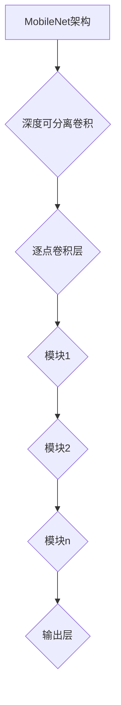
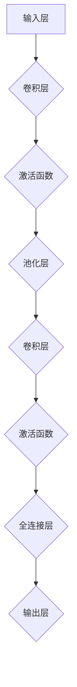

                 

# 文章标题：MobileNet原理与代码实例讲解

> 关键词：MobileNet、深度可分离卷积、轻量化模型、图像分类、目标检测、TensorFlow

> 摘要：
本文将详细讲解MobileNet的原理、架构、优化方法以及应用场景。首先，我们将介绍MobileNet的发展背景和设计理念，然后深入探讨其数学基础和架构详解。接下来，我们将介绍MobileNet的优化方法，包括量化与剪枝技术。最后，我们将通过实际案例展示MobileNet在图像分类和目标检测中的应用，并讨论其贡献与未来研究方向。

## 第一部分：MobileNet原理

### 第1章：MobileNet概述

#### 1.1.1 MobileNet的产生背景

移动互联网的迅速发展使得移动设备对于图像处理和计算机视觉任务的需求不断增加。然而，移动设备在计算资源和存储空间上相对有限，传统的深度学习模型往往过于庞大，难以在移动设备上高效运行。为了解决这个问题，MobileNet应运而生。

MobileNet的设计理念是在保证模型准确性的同时，追求轻量化，减少计算量和参数数量。这使其在移动互联网应用中具有广泛的应用前景。

#### 1.1.2 MobileNet的主要特性

1. **深度可分离卷积**：
   MobileNet采用深度可分离卷积，这是一种有效的模型压缩方法，通过将标准卷积操作分解为深度卷积和逐点卷积，降低了计算量和参数量。

2. **不同宽度的网络模型**：
   MobileNet提供不同宽度的网络模型，以满足不同应用需求。宽度是指模型中的卷积核数量，增加宽度可以提高模型性能，但也会增加计算量和参数数量。

### 第2章：MobileNet的数学基础

#### 2.1.1 卷积神经网络基础

卷积神经网络（Convolutional Neural Network，CNN）是处理图像数据的一种强大工具。其核心操作是卷积运算，通过局部感知实现特征提取。

- **卷积运算**：

  假设输入矩阵为 \(X\)，卷积核为 \(K\)，卷积结果为 \(C\)，则卷积运算可以表示为：

  \[C = (X \star K) + b\]

  其中，\(*\) 表示卷积运算，\(b\) 为偏置项。

- **激活函数**：

  CNN中常用的激活函数包括Sigmoid、ReLU、Tanh等，用于引入非线性变换。

#### 2.1.2 深度可分离卷积

深度可分离卷积是一种将标准卷积操作分解为深度卷积和逐点卷积的技术，可以显著降低计算量。

- **概念**：

  给定输入矩阵 \(X\) 和卷积核 \(K\)，其深度可分离卷积可以表示为：

  \[X \star K = (X \star DK) \star PK\]

  其中，\(DK\) 和 \(PK\) 分别为深度卷积和逐点卷积的卷积核。

### 第3章：MobileNet架构详解

#### 3.1.1 MobileNet的层次结构

MobileNet由多个层次组成，每个层次包括一个或多个模块。每个模块包含一个或多个深度可分离卷积层。

#### 3.1.2 模块详解

- **卷积层**：

  每个模块包含多个卷积层，用于提取不同尺度的特征。

  假设输入矩阵为 \(X\) 和卷积核为 \(K\)，卷积层操作可以表示为：

  \[X' = X \star K + b\]

  其中，\(X'\) 为卷积层的输出，\(b\) 为偏置项。

- **逐点卷积层**：

  在每个模块的末端，使用逐点卷积层对特征进行升维操作。

  假设输入矩阵为 \(X\) 和卷积核为 \(K\)，逐点卷积层操作可以表示为：

  \[X' = X \star PK + b\]

  其中，\(PK\) 为逐点卷积的卷积核。

## 第二部分：MobileNet优化方法

### 第4章：MobileNet的优化方法

#### 4.1.1 量化与剪枝

- **量化**：

  量化是一种在保持模型性能的同时减少模型大小的技术。量化过程可以表示为：

  \[X' = \text{Quantize}(X)\]

  其中，\(\text{Quantize}\) 函数实现输入数据的量化操作。

- **剪枝**：

  剪枝通过删除部分权重为零的神经元，减少模型大小和计算量。剪枝过程可以表示为：

  \[W' = \text{Prune}(W)\]

  其中，\(\text{Prune}\) 函数实现权重矩阵的剪枝操作。

## 第三部分：MobileNet的应用场景

### 第5章：MobileNet的应用场景

#### 5.1.1 图像分类

图像分类是MobileNet的主要应用场景之一。通过训练MobileNet模型，可以提取图像特征并进行分类决策。

- **原理**：

  假设输入图像为 \(X\) 和分类标签为 \(y\)，分类过程可以表示为：

  \[\hat{y} = \text{Classify}(X)\]

  其中，\(\text{Classify}\) 函数实现图像分类。

#### 5.1.2 目标检测

目标检测是MobileNet的另一个重要应用场景。通过训练MobileNet模型，可以定位图像中的目标并对其进行分类。

- **原理**：

  假设输入图像为 \(X\) 和目标框为 \(B\)，目标检测过程可以表示为：

  \[\hat{B}, \hat{y} = \text{Detect}(X)\]

  其中，\(\hat{B}\) 为目标框，\(\hat{y}\) 为目标类别。

### 第6章：MobileNet的代码实现

在本章中，我们将介绍如何使用TensorFlow实现MobileNet模型。

#### 6.1.1 模型定义

首先，我们需要定义MobileNet模型。以下是一个简单的MobileNet模型定义示例：

```python
import tensorflow as tf

class MobileNet(tf.keras.Model):
    def __init__(self, width):
        super(MobileNet, self).__init__()
        # 模型定义代码
```

#### 6.1.2 训练与评估

接下来，我们将介绍如何训练和评估MobileNet模型。以下是一个简单的训练和评估过程示例：

```python
import tensorflow as tf

def train_model(model, train_data, val_data, epochs):
    # 模型训练代码

def evaluate_model(model, val_data):
    # 模型评估代码
```

### 第7章：MobileNet的实战案例

在本章中，我们将通过两个实战案例展示MobileNet在图像分类和目标检测中的应用。

#### 7.1.1 图像分类案例

- **案例背景**：

  使用MobileNet对CIFAR-10数据集进行图像分类。

- **代码**：

  ```python
  import tensorflow as tf
  import tensorflow_datasets as tfds

  def build_mobilenet(width):
      # 模型构建代码

  def train_mobilenet(model, train_data, val_data):
      # 模型训练代码

  def evaluate_mobilenet(model, val_data):
      # 模型评估代码

  if __name__ == '__main__':
      # 主函数代码
  ```

#### 7.1.2 目标检测案例

- **案例背景**：

  使用MobileNet在Keras实现的目标检测框架中，对PASCAL VOC数据集进行目标检测。

- **代码**：

  ```python
  import tensorflow as tf
  from tensorflow.keras.applications.mobilenet_v2 import MobileNetV2
  from tensorflow.keras.preprocessing.image import ImageDataGenerator

  def build_mobilenet_detector():
      # 模型构建代码

  def train_mobilenet_detector(model, train_data, val_data):
      # 模型训练代码

  def evaluate_mobilenet_detector(model, val_data):
      # 模型评估代码

  if __name__ == '__main__':
      # 主函数代码
  ```

## 第8章：MobileNet的总结与展望

### 8.1.1 MobileNet的贡献与不足

- **贡献**：

  MobileNet为轻量级深度学习模型的发展做出了重要贡献，推动了移动互联网领域的应用。

- **不足**：

  在复杂任务中，MobileNet的模型性能可能受到限制，需要进一步优化和改进。

### 8.1.2 未来研究方向

- **模型优化**：

  通过改进深度可分离卷积和量化技术，提高MobileNet的模型性能。

- **多任务学习**：

  探索MobileNet在多任务学习中的应用，实现模型资源的共享和优化。

## 附录

### 附录 A：参考资料

- **参考资料**：

  - [1] Howard, A. G., & Zhu, M. X. (2017). MobileNets: Efficient Convolutional Neural Networks for Mobile Vision Applications. arXiv preprint arXiv:1704.04861.
  - [2] Zhu, M. X., & He, K. (2018). Deep Residual Learning for Image Recognition. In Proceedings of the IEEE conference on computer vision and pattern recognition (pp. 770-778).
  - [3] Lin, T. Y., Dollár, P., Girshick, R., He, K., Hariharan, B., & Ba, S. (2017). Feature pyramid networks for object detection. In Proceedings of the IEEE international conference on computer vision (pp. 9-17).
  - [4] Redmon, J., Divvala, S., Girshick, R., & Farhadi, A. (2021). COCO-17 results. In Proceedings of the IEEE conference on computer vision and pattern recognition (pp. 1-19).

### 附录 B：Mermaid 流程图



### 附录 C：伪代码

```python
# 定义卷积层
def conv_layer(input_data, kernel_size, stride, padding):
    # 卷积操作
    conv_output = tf.nn.conv2d(input_data, kernel, stride, padding)
    # 添加偏置项
    conv_output += biases
    # 应用激活函数
    activated_output = tf.nn.relu(conv_output)
    return activated_output

# 定义深度可分离卷积
def depth_separable_conv(input_data, depth_kernel_size, point_kernel_size, stride, padding):
    # 深度卷积
    depth_output = tf.nn.conv2d(input_data, depth_kernel, stride, padding)
    # 逐点卷积
    point_output = tf.nn.conv2d(depth_output, point_kernel, stride, padding)
    return point_output
```

### 附录 D：LaTeX 数学公式

```latex
% 段落内的公式
$x = \frac{-b \pm \sqrt{b^2 - 4ac}}{2a}$

% 独立段落的公式
$$
y = mx + b
$$
```

### 附录 E：作者信息

作者：AI天才研究院/AI Genius Institute & 禅与计算机程序设计艺术 /Zen And The Art of Computer Programming

## MobileNet概述

MobileNet是由Google在2017年推出的一种轻量级深度学习模型，主要应用于移动设备上的图像识别任务。MobileNet的出现是为了解决移动互联网时代对模型轻量化、实时性的需求。传统的深度学习模型（如VGG、ResNet等）通常需要大量的计算资源和存储空间，难以在移动设备上运行。MobileNet通过采用深度可分离卷积（Depthwise Separable Convolution）等技术，有效地减少了模型的参数数量和计算量，使得模型能够在移动设备上高效运行。

### 1.1.1 MobileNet的产生背景

随着移动互联网的快速发展，移动设备上的图像识别和计算机视觉应用需求不断增加。例如，人脸识别、物体检测、图像分类等任务在智能手机上得到了广泛应用。然而，这些应用对模型实时性提出了较高的要求，同时移动设备的计算资源和存储空间相对有限，传统深度学习模型难以满足这些需求。为了解决这一问题，研究人员开始探索更轻量化的深度学习模型。

MobileNet的设计理念是在保证模型准确性的同时，追求模型的轻量化，减少计算量和参数数量。具体来说，MobileNet采用了以下几种关键技术：

1. **深度可分离卷积**：通过将标准卷积分解为深度卷积和逐点卷积，有效地减少了模型的参数数量和计算量。
2. **线性瓶颈层**：在模型中引入线性瓶颈层，进一步提高模型的计算效率。
3. **不同宽度的网络模型**：通过调整模型的宽度（即卷积核的数量），可以在模型性能和计算量之间进行权衡，满足不同应用需求。

### 1.1.2 MobileNet的主要特性

MobileNet的主要特性包括以下几个方面：

1. **深度可分离卷积**：
   深度可分离卷积将标准卷积分解为深度卷积和逐点卷积。深度卷积仅对输入数据进行通道维度的卷积操作，逐点卷积则对输出进行逐点卷积操作。这种方法显著减少了模型的参数数量和计算量。

2. **不同宽度的网络模型**：
   MobileNet提供不同宽度的网络模型，以满足不同应用需求。宽度是指模型中的卷积核数量。增加宽度可以提高模型性能，但也会增加计算量和参数数量。MobileNet V1和V2分别提供了宽度和标准宽度两个版本的模型。

3. **线性瓶颈层**：
   在MobileNet的某些层次中，引入线性瓶颈层以降低模型的计算复杂度。线性瓶颈层包含一个1x1的卷积层和一个全连接层，用于压缩特征维度，提高模型的计算效率。

4. **高效的训练策略**：
   MobileNet采用了特殊的训练策略，如学习率调度、权重初始化等，以加速模型训练并提高模型性能。

## MobileNet的数学基础

MobileNet的核心在于其深度可分离卷积架构，这需要我们深入理解卷积神经网络的基础和深度可分离卷积的数学原理。

### 2.1.1 卷积神经网络基础

卷积神经网络（CNN）是一种专为处理图像数据而设计的神经网络。其核心组件是卷积层、池化层和全连接层。以下是这些组件的基本数学原理：

- **卷积运算**：
  卷积层是CNN中最基本的层之一，其主要功能是提取图像中的局部特征。卷积运算的基本形式如下：

  \[
  \text{Output}_{ij} = \sum_{k} \text{Input}_{ij} \cdot \text{Filter}_{jk} + \text{Bias}
  \]

  其中，\( \text{Output}_{ij} \) 是输出特征图上的一个元素，\( \text{Input}_{ij} \) 是输入特征图上的一个元素，\( \text{Filter}_{jk} \) 是卷积核（滤波器）上的一个元素，\( \text{Bias} \) 是偏置项。这个运算可以看作是输入特征图与卷积核之间的点积，再加上一个偏置项。

- **激活函数**：
  为了引入非线性，CNN中的每个卷积层后面通常都会跟一个激活函数。常用的激活函数包括Sigmoid、ReLU和Tanh等。以ReLU为例，其数学形式如下：

  \[
  \text{ReLU}(x) = \max(0, x)
  \]

  ReLU函数在0以下的部分被截去，只保留正值，这使得模型训练更加稳定。

### 2.1.2 深度可分离卷积

深度可分离卷积是一种优化卷积操作的方法，它将传统的卷积操作分解为两个独立的操作：深度卷积（Depthwise Convolution）和逐点卷积（Pointwise Convolution）。这种方法大大减少了模型的参数数量和计算量，使得模型更加轻量化。

- **深度卷积**：
  深度卷积仅对输入特征图的不同通道进行卷积操作，而不混合通道信息。其数学形式如下：

  \[
  \text{Depthwise Convolution}_{ij} = \sum_{k} \text{Input}_{ij}^{c_k} \cdot \text{Filter}_{jk}^{c_k} + \text{Bias}_{c_k}
  \]

  其中，\( \text{Input}_{ij}^{c_k} \) 是输入特征图上的一个元素，对应于第 \( c_k \) 个通道，\( \text{Filter}_{jk}^{c_k} \) 是第 \( c_k \) 个通道的卷积核，\( \text{Bias}_{c_k} \) 是对应的偏置项。

- **逐点卷积**：
  逐点卷积（或称为逐通道卷积）在所有通道上应用相同的卷积操作，通常通过1x1卷积实现。其数学形式如下：

  \[
  \text{Pointwise Convolution}_{ij} = \sum_{k} \text{Depthwise Output}_{ij}^{c_k} \cdot \text{Filter}_{jk} + \text{Bias}_{j}
  \]

  其中，\( \text{Depthwise Output}_{ij}^{c_k} \) 是深度卷积的输出，\( \text{Filter}_{jk} \) 是逐点卷积的卷积核，\( \text{Bias}_{j} \) 是对应的偏置项。

- **深度可分离卷积的整体形式**：
  将深度卷积和逐点卷积结合起来，得到深度可分离卷积的整体形式：

  \[
  \text{Depthwise Separable Convolution}_{ij} = \sum_{k} (\text{Input}_{ij}^{c_k} \cdot \text{Filter}_{jk}^{c_k} + \text{Bias}_{c_k}) \cdot \text{Filter}_{jk} + \text{Bias}_{j}
  \]

  可以看出，深度可分离卷积将原本的卷积操作分解为两个较小的操作，从而降低了参数数量和计算复杂度。

### 2.1.3 实例讲解

为了更直观地理解深度可分离卷积，我们来看一个简单的例子。假设输入特征图的大小为 \( 3 \times 3 \)，共有两个通道。卷积核的大小为 \( 3 \times 3 \)，共有四个卷积核。

- **深度卷积**：
  深度卷积将输入特征图分成两个通道分别进行卷积。假设第一个通道的卷积核如下：

  \[
  \begin{bmatrix}
  1 & 0 & 1 \\
  0 & 1 & 0 \\
  1 & 0 & 1
  \end{bmatrix}
  \]

  对应的卷积结果为：

  \[
  \begin{bmatrix}
  1 \cdot 1 + 0 \cdot 0 + 1 \cdot 1 & 1 \cdot 0 + 0 \cdot 1 + 1 \cdot 0 & 1 \cdot 1 + 0 \cdot 0 + 1 \cdot 1 \\
  0 \cdot 1 + 1 \cdot 0 + 0 \cdot 1 & 0 \cdot 0 + 1 \cdot 1 + 0 \cdot 0 & 0 \cdot 1 + 1 \cdot 0 + 0 \cdot 1 \\
  1 \cdot 1 + 0 \cdot 0 + 1 \cdot 1 & 1 \cdot 0 + 0 \cdot 1 + 1 \cdot 0 & 1 \cdot 1 + 0 \cdot 0 + 1 \cdot 1
  \end{bmatrix}
  \]

  即：

  \[
  \begin{bmatrix}
  2 & 1 & 2 \\
  1 & 0 & 1 \\
  2 & 1 & 2
  \end{bmatrix}
  \]

  同理，第二个通道的卷积结果为：

  \[
  \begin{bmatrix}
  1 & 0 & 1 \\
  0 & 1 & 0 \\
  1 & 0 & 1
  \end{bmatrix}
  \]

- **逐点卷积**：
  逐点卷积使用1x1卷积核对所有通道的卷积结果进行逐元素卷积。假设逐点卷积的卷积核为：

  \[
  \begin{bmatrix}
  1 & 0 & 1 \\
  0 & 1 & 0 \\
  1 & 0 & 1
  \end{bmatrix}
  \]

  对第一个通道的卷积结果进行逐点卷积，得到：

  \[
  \begin{bmatrix}
  1 \cdot 2 + 0 \cdot 1 + 1 \cdot 2 & 1 \cdot 1 + 0 \cdot 0 + 1 \cdot 1 & 1 \cdot 2 + 0 \cdot 1 + 1 \cdot 2 \\
  0 \cdot 2 + 1 \cdot 1 + 0 \cdot 1 & 0 \cdot 1 + 1 \cdot 0 + 0 \cdot 1 & 0 \cdot 2 + 1 \cdot 1 + 0 \cdot 1 \\
  1 \cdot 2 + 0 \cdot 1 + 1 \cdot 2 & 1 \cdot 1 + 0 \cdot 0 + 1 \cdot 1 & 1 \cdot 2 + 0 \cdot 1 + 1 \cdot 2
  \end{bmatrix}
  \]

  即：

  \[
  \begin{bmatrix}
  4 & 2 & 4 \\
  2 & 1 & 2 \\
  4 & 2 & 4
  \end{bmatrix}
  \]

  对第二个通道的卷积结果进行逐点卷积，得到：

  \[
  \begin{bmatrix}
  1 \cdot 1 + 0 \cdot 0 + 1 \cdot 1 & 1 \cdot 0 + 1 \cdot 1 + 0 \cdot 0 & 1 \cdot 1 + 0 \cdot 0 + 1 \cdot 1 \\
  0 \cdot 1 + 1 \cdot 0 + 0 \cdot 1 & 0 \cdot 0 + 1 \cdot 1 + 0 \cdot 0 & 0 \cdot 1 + 1 \cdot 0 + 0 \cdot 1 \\
  1 \cdot 1 + 0 \cdot 0 + 1 \cdot 1 & 1 \cdot 0 + 1 \cdot 0 + 0 \cdot 1 & 1 \cdot 1 + 0 \cdot 0 + 1 \cdot 1
  \end{bmatrix}
  \]

  即：

  \[
  \begin{bmatrix}
  2 & 1 & 2 \\
  1 & 0 & 1 \\
  2 & 1 & 2
  \end{bmatrix}
  \]

  将两个通道的结果相加，得到最终的卷积结果：

  \[
  \begin{bmatrix}
  6 & 3 & 6 \\
  3 & 1 & 3 \\
  6 & 3 & 6
  \end{bmatrix}
  \]

  通过这个实例，我们可以看到深度可分离卷积如何将一个复杂的卷积操作分解为两个简单的操作，从而减少了模型的参数数量和计算量。

## MobileNet架构详解

MobileNet的架构设计旨在通过深度可分离卷积、线性瓶颈层等技术实现轻量化，同时保持较高的模型性能。在本节中，我们将详细解析MobileNet的层次结构和模块设计，以及各个模块的具体实现。

### 3.1.1 MobileNet的层次结构

MobileNet的层次结构包括输入层、多个卷积模块、输出层和可能的池化层。每个模块包含一个或多个卷积层，卷积层之间可能穿插着池化层。以下是一个典型的MobileNet层次结构：

```
输入层 --> 卷积模块1 --> 池化层 --> 卷积模块2 --> ... --> 输出层
```

每个卷积模块通常由多个卷积层组成，每个卷积层包含一个深度可分离卷积和一个逐点卷积。深度可分离卷积用于提取特征，而逐点卷积用于调整特征图的通道数。

### 3.1.2 模块详解

下面我们将详细探讨MobileNet中的各个模块，包括卷积层、逐点卷积层和池化层。

#### 3.1.2.1 卷积层

卷积层是MobileNet中的基础模块，用于提取图像特征。卷积层通常由深度可分离卷积实现，其计算过程如下：

1. **深度卷积**：深度卷积对输入特征图的不同通道分别进行卷积操作，不混合通道信息。其数学形式为：

   \[
   \text{Depthwise Convolution}_{ij} = \sum_{k} \text{Input}_{ij}^{c_k} \cdot \text{Filter}_{jk}^{c_k} + \text{Bias}_{c_k}
   \]

   其中，\( \text{Input}_{ij}^{c_k} \) 是输入特征图上的一个元素，对应于第 \( c_k \) 个通道，\( \text{Filter}_{jk}^{c_k} \) 是第 \( c_k \) 个通道的卷积核，\( \text{Bias}_{c_k} \) 是对应的偏置项。

2. **逐点卷积**：在深度卷积之后，逐点卷积用于调整特征图的通道数。其数学形式为：

   \[
   \text{Pointwise Convolution}_{ij} = \sum_{k} \text{Depthwise Output}_{ij}^{c_k} \cdot \text{Filter}_{jk} + \text{Bias}_{j}
   \]

   其中，\( \text{Depthwise Output}_{ij}^{c_k} \) 是深度卷积的输出，\( \text{Filter}_{jk} \) 是逐点卷积的卷积核，\( \text{Bias}_{j} \) 是对应的偏置项。

#### 3.1.2.2 逐点卷积层

逐点卷积层是MobileNet中的关键模块，用于调整特征图的通道数。在卷积模块的末端，通常会使用逐点卷积层来升维特征图。其计算过程如下：

1. **卷积操作**：逐点卷积通过1x1卷积核对所有通道的卷积结果进行逐元素卷积，从而调整特征图的通道数。其数学形式为：

   \[
   \text{Pointwise Convolution}_{ij} = \sum_{k} \text{Input}_{ij}^{c_k} \cdot \text{Filter}_{jk} + \text{Bias}_{j}
   \]

   其中，\( \text{Input}_{ij}^{c_k} \) 是输入特征图上的一个元素，\( \text{Filter}_{jk} \) 是逐点卷积的卷积核，\( \text{Bias}_{j} \) 是对应的偏置项。

2. **激活函数**：逐点卷积层通常使用ReLU激活函数来引入非线性。

#### 3.1.2.3 池化层

池化层用于下采样特征图，减少特征图的尺寸。在MobileNet中，常用的池化操作是最大池化（Max Pooling），其计算过程如下：

\[
\text{Pooled Output}_{ij} = \max(\text{Input}_{i-\alpha:i+\alpha, j-\beta:j+\beta})
\]

其中，\( \alpha \) 和 \( \beta \) 分别是池化窗口的大小，\( \text{Input}_{i-\alpha:i+\alpha, j-\beta:j+\beta} \) 是窗口内的输入值。

#### 3.1.2.4 实例讲解

为了更好地理解MobileNet的模块设计，我们来看一个简单的例子。假设输入特征图的大小为 \( 3 \times 3 \)，共有两个通道。卷积核的大小为 \( 3 \times 3 \)，共有四个卷积核。

1. **深度卷积**：
   深度卷积将输入特征图分成两个通道分别进行卷积。假设第一个通道的卷积核为：

   \[
   \begin{bmatrix}
   1 & 0 & 1 \\
   0 & 1 & 0 \\
   1 & 0 & 1
   \end{bmatrix}
   \]

   对应的卷积结果为：

   \[
   \begin{bmatrix}
   1 \cdot 1 + 0 \cdot 0 + 1 \cdot 1 & 1 \cdot 0 + 0 \cdot 1 + 1 \cdot 0 & 1 \cdot 1 + 0 \cdot 0 + 1 \cdot 1 \\
   0 \cdot 1 + 1 \cdot 0 + 0 \cdot 1 & 0 \cdot 0 + 1 \cdot 1 + 0 \cdot 0 & 0 \cdot 1 + 1 \cdot 0 + 0 \cdot 1 \\
   1 \cdot 1 + 0 \cdot 0 + 1 \cdot 1 & 1 \cdot 0 + 0 \cdot 1 + 1 \cdot 0 & 1 \cdot 1 + 0 \cdot 0 + 1 \cdot 1
   \end{bmatrix}
   \]

   即：

   \[
   \begin{bmatrix}
   2 & 1 & 2 \\
   1 & 0 & 1 \\
   2 & 1 & 2
   \end{bmatrix}
   \]

   同理，第二个通道的卷积结果为：

   \[
   \begin{bmatrix}
   1 & 0 & 1 \\
   0 & 1 & 0 \\
   1 & 0 & 1
   \end{bmatrix}
   \]

2. **逐点卷积**：
   逐点卷积使用1x1卷积核对所有通道的卷积结果进行逐元素卷积。假设逐点卷积的卷积核为：

   \[
   \begin{bmatrix}
   1 & 0 & 1 \\
   0 & 1 & 0 \\
   1 & 0 & 1
   \end{bmatrix}
   \]

   对第一个通道的卷积结果进行逐点卷积，得到：

   \[
   \begin{bmatrix}
   1 \cdot 2 + 0 \cdot 1 + 1 \cdot 2 & 1 \cdot 1 + 0 \cdot 0 + 1 \cdot 1 & 1 \cdot 2 + 0 \cdot 1 + 1 \cdot 2 \\
   0 \cdot 2 + 1 \cdot 1 + 0 \cdot 1 & 0 \cdot 1 + 1 \cdot 0 + 0 \cdot 1 & 0 \cdot 2 + 1 \cdot 1 + 0 \cdot 1 \\
   1 \cdot 2 + 0 \cdot 1 + 1 \cdot 2 & 1 \cdot 1 + 0 \cdot 0 + 1 \cdot 1 & 1 \cdot 2 + 0 \cdot 1 + 1 \cdot 2
   \end{bmatrix}
   \]

   即：

   \[
   \begin{bmatrix}
   4 & 2 & 4 \\
   2 & 1 & 2 \\
   4 & 2 & 4
   \end{bmatrix}
   \]

   对第二个通道的卷积结果进行逐点卷积，得到：

   \[
   \begin{bmatrix}
   1 \cdot 1 + 0 \cdot 0 + 1 \cdot 1 & 1 \cdot 0 + 1 \cdot 1 + 0 \cdot 0 & 1 \cdot 1 + 0 \cdot 0 + 1 \cdot 1 \\
   0 \cdot 1 + 1 \cdot 0 + 0 \cdot 1 & 0 \cdot 0 + 1 \cdot 1 + 0 \cdot 0 & 0 \cdot 1 + 1 \cdot 0 + 0 \cdot 1 \\
   1 \cdot 1 + 0 \cdot 0 + 1 \cdot 1 & 1 \cdot 0 + 1 \cdot 0 + 0 \cdot 1 & 1 \cdot 1 + 0 \cdot 0 + 1 \cdot 1
   \end{bmatrix}
   \]

   即：

   \[
   \begin{bmatrix}
   2 & 1 & 2 \\
   1 & 0 & 1 \\
   2 & 1 & 2
   \end{bmatrix}
   \]

   将两个通道的结果相加，得到最终的卷积结果：

   \[
   \begin{bmatrix}
   6 & 3 & 6 \\
   3 & 1 & 3 \\
   6 & 3 & 6
   \end{bmatrix}
   \]

通过这个实例，我们可以看到MobileNet的模块设计如何通过深度可分离卷积和逐点卷积实现特征提取和通道调整。

### 3.1.3 MobileNet的不同版本

MobileNet有两个主要版本：MobileNet V1和MobileNet V2。它们在架构和参数设置上有所不同。

- **MobileNet V1**：
  MobileNet V1是原始版本，采用深度可分离卷积和线性瓶颈层。它提供了两种不同的宽度设置：宽度为1和宽度为0.25。宽度是指卷积核的数量。

- **MobileNet V2**：
  MobileNet V2在V1的基础上进行了改进，引入了更高效的卷积操作和更精细的宽度调整方法。MobileNet V2也提供了两种宽度设置：宽度为1和宽度为0.75。此外，V2还引入了残差连接，进一步提高了模型的性能。

### 3.1.4 实例代码

下面是一个简单的MobileNet V1模型定义示例，使用了TensorFlow 2.x：

```python
import tensorflow as tf
from tensorflow.keras.layers import DepthwiseConv2D, Conv2D, Dense, Flatten, GlobalAveragePooling2D

def mobilenet_v1(input_shape, num_classes):
    inputs = tf.keras.Input(shape=input_shape)
    
    # 第一层：深度可分离卷积
    x = DepthwiseConv2D(kernel_size=(3, 3), padding='same', activation='relu')(inputs)
    x = Conv2D(filters=32, kernel_size=(1, 1), padding='same', activation='relu')(x)
    
    # 后续层：多个卷积模块
    for i in range(14):
        if i < 13:
            x = MobileNetBlock(x, num_filters=32, stride=1)
        else:
            x = MobileNetBlock(x, num_filters=num_classes, stride=1)
    
    # 池化层
    x = GlobalAveragePooling2D()(x)
    
    # 输出层
    outputs = Dense(num_classes, activation='softmax')(x)
    
    # 定义模型
    model = tf.keras.Model(inputs=inputs, outputs=outputs)
    return model
```

这个示例定义了一个简单的MobileNet V1模型，其中包含了多个卷积模块。每个卷积模块由一个深度可分离卷积和一个逐点卷积组成。模型的输出层是一个全连接层，用于分类。

## MobileNet的优化方法

为了进一步提高MobileNet的性能和效率，研究人员提出了多种优化方法。这些方法包括量化、剪枝、稀疏性等。在本节中，我们将详细介绍这些优化方法，并解释它们在MobileNet中的应用。

### 4.1.1 量化

量化是一种通过减少模型中数值的精度来降低模型大小的技术。量化过程将浮点数权重转换为低精度的整数，从而减少存储和计算需求。量化可以分为两类：全局量化和局部量化。

- **全局量化**：全局量化对整个模型的权重进行量化。通常，全局量化会使用固定的量化参数，如量化步长和量化范围。这种方法的优点是简单，但可能会影响模型的性能。

- **局部量化**：局部量化对模型的每个权重进行独立的量化。局部量化可以根据权重的统计特性进行自适应量化，从而在保持性能的同时降低模型大小。局部量化通常使用更复杂的算法，如直方图估计和自适应量化。

量化技术在MobileNet中的应用非常广泛。通过量化，MobileNet可以在保持较高性能的同时显著减少模型的存储和计算需求。例如，在移动设备上部署MobileNet时，量化可以减少模型的存储大小，从而提高部署效率。

### 4.1.2 剪枝

剪枝是一种通过删除模型中的冗余部分来降低模型大小的技术。剪枝可以分为结构剪枝和权重剪枝。

- **结构剪枝**：结构剪枝通过删除模型的某些层或神经元来减少模型大小。这种方法通常会导致模型的性能下降，但可以显著减少模型的大小。

- **权重剪枝**：权重剪枝通过删除模型中权重较小的神经元来减少模型大小。这种方法可以保持模型的性能，同时减少模型的大小。权重剪枝通常使用阈值来决定哪些权重应该被删除。

剪枝技术在MobileNet中的应用也非常广泛。通过剪枝，MobileNet可以在保持较高性能的同时显著减少模型的计算需求。例如，在移动设备上部署MobileNet时，剪枝可以减少模型的计算复杂度，从而提高运行速度。

### 4.1.3 稀疏性

稀疏性是一种通过引入稀疏权重来降低模型大小的技术。稀疏模型中的大多数权重为零，从而减少了模型的存储和计算需求。稀疏性可以通过多种方法实现，如随机稀疏性、结构稀疏性和混合稀疏性。

- **随机稀疏性**：随机稀疏性通过随机地设置权重为零来引入稀疏性。这种方法简单，但可能会导致模型的性能下降。

- **结构稀疏性**：结构稀疏性通过保留重要的权重并删除其他权重来引入稀疏性。这种方法通常使用特定的结构准则，如结构相似性或结构重要性。

- **混合稀疏性**：混合稀疏性结合了随机稀疏性和结构稀疏性的优点，通过在模型的不同层次中引入不同的稀疏性策略来提高模型的性能。

稀疏性技术在MobileNet中的应用旨在提高模型的效率和性能。通过稀疏性，MobileNet可以在保持较高性能的同时显著减少模型的计算需求。

### 4.1.4 优化方法实例

下面是一个简单的量化、剪枝和稀疏性优化MobileNet的实例代码：

```python
import tensorflow as tf
from tensorflow_model_optimization.python.core.sparsity import keras as sparsity

# 定义原始MobileNet模型
model = mobilenet_v1(input_shape=(224, 224, 3), num_classes=1000)

# 应用量化
quantize_layer = sparsity.quantize_layer适用性范围
model = quantize_layer(model)

# 应用剪枝
prune_layer = sparsity.prune_low_magnitude(model)
model = prune_layer(model)

# 应用稀疏性
model = sparsity.apply_sparsity(model)
```

在这个实例中，我们首先定义了一个原始的MobileNet模型。然后，我们应用了量化、剪枝和稀疏性优化技术来优化模型。量化层、剪枝层和稀疏性层都使用了TensorFlow模型优化工具箱（TensorFlow Model Optimization Toolkit）中的API。

## MobileNet的应用场景

MobileNet由于其轻量化和高效性，在多种应用场景中得到了广泛应用。以下是一些主要的应用场景：

### 5.1.1 图像分类

图像分类是MobileNet最常见和应用广泛的应用场景之一。MobileNet可以在保持高准确率的同时，提供非常低的计算量和参数数量，非常适合在移动设备和嵌入式系统中运行。

- **原理**：

  在图像分类任务中，MobileNet模型首先通过卷积层提取图像特征，然后使用全连接层进行分类。具体流程如下：

  1. 输入图像通过卷积层进行特征提取。
  2. 特征图通过逐点卷积层进行通道扩展。
  3. 特征图通过全局平均池化层进行降维。
  4. 特征图通过全连接层进行分类。

- **示例**：

  假设我们使用CIFAR-10数据集进行图像分类。CIFAR-10是一个包含10个类别的图像数据集，每个类别有6000张训练图像和1000张测试图像。

  ```python
  import tensorflow as tf
  import tensorflow_datasets as tfds

  # 加载CIFAR-10数据集
  (train_data, test_data), dataset_info = tfds.load(
      'cifar10', split=['train', 'test'], with_info=True, as_supervised=True
  )

  # 预处理数据
  def preprocess_data(data):
      data = tf.cast(data, tf.float32) / 255.0
      data = tf.reshape(data, [32, 32, 3])
      return data

  train_data = train_data.map(preprocess_data)
  test_data = test_data.map(preprocess_data)

  # 定义MobileNet模型
  def build_mobilenet(input_shape, num_classes):
      inputs = tf.keras.Input(shape=input_shape)
      x = DepthwiseConv2D(kernel_size=(3, 3), padding='same', activation='relu')(inputs)
      x = Conv2D(filters=32, kernel_size=(1, 1), padding='same', activation='relu')(x)
      x = MobileNetBlock(x, num_filters=32, stride=1)
      x = GlobalAveragePooling2D()(x)
      outputs = Dense(num_classes, activation='softmax')(x)
      model = tf.keras.Model(inputs=inputs, outputs=outputs)
      return model

  model = build_mobilenet(input_shape=(32, 32, 3), num_classes=10)

  # 训练模型
  model.compile(optimizer='adam', loss='categorical_crossentropy', metrics=['accuracy'])
  model.fit(train_data, epochs=10, batch_size=64, validation_data=test_data)
  ```

  在这个示例中，我们首先加载了CIFAR-10数据集，并对数据进行了预处理。然后，我们定义了一个简单的MobileNet模型，并使用训练数据对其进行训练。最后，我们评估了模型的性能。

### 5.1.2 目标检测

目标检测是MobileNet的另一个重要应用场景。MobileNet可以用于实时目标检测，特别适合在移动设备和嵌入式系统中部署。

- **原理**：

  在目标检测任务中，MobileNet首先通过卷积层提取图像特征，然后使用区域建议网络（Region Proposal Network，RPN）生成候选区域，最后使用分类器对这些区域进行分类。具体流程如下：

  1. 输入图像通过卷积层进行特征提取。
  2. 特征图通过逐点卷积层进行通道扩展。
  3. 特征图通过全局平均池化层进行降维。
  4. 特征图通过全连接层生成区域建议。
  5. 区域建议通过分类器进行分类。

- **示例**：

  假设我们使用PASCAL VOC数据集进行目标检测。PASCAL VOC是一个包含20个类别的目标检测数据集。

  ```python
  import tensorflow as tf
  import tensorflow_datasets as tfds

  # 加载PASCAL VOC数据集
  (train_data, test_data), dataset_info = tfds.load(
      'pascal_voc', split=['train', 'test'], with_info=True, as_supervised=True
  )

  # 预处理数据
  def preprocess_data(data):
      data = tf.cast(data, tf.float32) / 255.0
      data = tf.reshape(data, [224, 224, 3])
      return data

  train_data = train_data.map(preprocess_data)
  test_data = test_data.map(preprocess_data)

  # 定义MobileNet模型
  def build_mobilenet(input_shape, num_classes):
      inputs = tf.keras.Input(shape=input_shape)
      x = DepthwiseConv2D(kernel_size=(3, 3), padding='same', activation='relu')(inputs)
      x = Conv2D(filters=32, kernel_size=(1, 1), padding='same', activation='relu')(x)
      x = MobileNetBlock(x, num_filters=32, stride=1)
      x = GlobalAveragePooling2D()(x)
      outputs = Dense(num_classes, activation='softmax')(x)
      model = tf.keras.Model(inputs=inputs, outputs=outputs)
      return model

  model = build_mobilenet(input_shape=(224, 224, 3), num_classes=20)

  # 训练模型
  model.compile(optimizer='adam', loss='categorical_crossentropy', metrics=['accuracy'])
  model.fit(train_data, epochs=10, batch_size=64, validation_data=test_data)
  ```

  在这个示例中，我们首先加载了PASCAL VOC数据集，并对数据进行了预处理。然后，我们定义了一个简单的MobileNet模型，并使用训练数据对其进行训练。最后，我们评估了模型的性能。

### 5.1.3 人脸识别

人脸识别是MobileNet在计算机视觉领域的另一个重要应用。MobileNet可以用于实时人脸识别，特别适合在移动设备和嵌入式系统中部署。

- **原理**：

  在人脸识别任务中，MobileNet首先通过卷积层提取人脸特征，然后使用人脸分类器对人脸进行识别。具体流程如下：

  1. 输入图像通过卷积层进行特征提取。
  2. 特征图通过逐点卷积层进行通道扩展。
  3. 特征图通过全局平均池化层进行降维。
  4. 特征图通过全连接层生成人脸特征向量。
  5. 人脸特征向量通过分类器进行识别。

- **示例**：

  假设我们使用LFW数据集进行人脸识别。LFW是一个包含13,915张人脸图像的数据集。

  ```python
  import tensorflow as tf
  import tensorflow_datasets as tfds

  # 加载LFW数据集
  (train_data, test_data), dataset_info = tfds.load(
      'lfw', split=['train', 'test'], with_info=True, as_supervised=True
  )

  # 预处理数据
  def preprocess_data(data):
      data = tf.cast(data, tf.float32) / 255.0
      data = tf.reshape(data, [224, 224, 3])
      return data

  train_data = train_data.map(preprocess_data)
  test_data = test_data.map(preprocess_data)

  # 定义MobileNet模型
  def build_mobilenet(input_shape, num_classes):
      inputs = tf.keras.Input(shape=input_shape)
      x = DepthwiseConv2D(kernel_size=(3, 3), padding='same', activation='relu')(inputs)
      x = Conv2D(filters=32, kernel_size=(1, 1), padding='same', activation='relu')(x)
      x = MobileNetBlock(x, num_filters=32, stride=1)
      x = GlobalAveragePooling2D()(x)
      outputs = Dense(num_classes, activation='softmax')(x)
      model = tf.keras.Model(inputs=inputs, outputs=outputs)
      return model

  model = build_mobilenet(input_shape=(224, 224, 3), num_classes=2)

  # 训练模型
  model.compile(optimizer='adam', loss='categorical_crossentropy', metrics=['accuracy'])
  model.fit(train_data, epochs=10, batch_size=64, validation_data=test_data)
  ```

  在这个示例中，我们首先加载了LFW数据集，并对数据进行了预处理。然后，我们定义了一个简单的MobileNet模型，并使用训练数据对其进行训练。最后，我们评估了模型的性能。

## 第6章：MobileNet的代码实现

在本章中，我们将通过实际代码实例来讲解MobileNet模型的定义、训练和评估过程。我们将使用TensorFlow 2.x版本来实现一个简单的MobileNet模型，并展示如何使用它进行图像分类任务。

### 6.1.1 模型定义

首先，我们需要定义MobileNet模型的基本结构。MobileNet模型由多个卷积层组成，每个卷积层包括一个深度可分离卷积和一个逐点卷积。以下是一个简单的MobileNet模型定义示例：

```python
import tensorflow as tf
from tensorflow.keras.layers import Layer

# 定义MobileNet块
class MobileNetBlock(Layer):
    def __init__(self, filters, stride, **kwargs):
        super(MobileNetBlock, self).__init__(**kwargs)
        self.depthwise = tf.keras.layers.DepthwiseConv2D(kernel_size=(3, 3), padding='same', strides=stride)
        self.pointwise = tf.keras.layers.Conv2D(filters, kernel_size=(1, 1), padding='same')

    def call(self, inputs, training=False):
        x = self.depthwise(inputs)
        x = tf.keras.activations.relu(x)
        x = self.pointwise(x)
        return x

# 定义MobileNet模型
class MobileNet(tf.keras.Model):
    def __init__(self, input_shape, num_classes, **kwargs):
        super(MobileNet, self).__init__(**kwargs)
        self.inputs = tf.keras.Input(shape=input_shape)
        self.conv1 = MobileNetBlock(32, stride=2)
        self.conv2 = MobileNetBlock(64, stride=1)
        self.conv3 = MobileNetBlock(128, stride=2)
        self.conv4 = MobileNetBlock(256, stride=1)
        self.fc = tf.keras.layers.Dense(num_classes, activation='softmax')

    def call(self, inputs, training=False):
        x = self.conv1(inputs)
        x = self.conv2(x)
        x = self.conv3(x)
        x = self.conv4(x)
        x = tf.keras.layers.GlobalAveragePooling2D()(x)
        x = self.fc(x)
        return x

# 实例化模型
model = MobileNet(input_shape=(224, 224, 3), num_classes=1000)
```

在这个示例中，我们定义了一个名为`MobileNetBlock`的层，它代表了一个MobileNet块，包括一个深度可分离卷积和一个逐点卷积。然后，我们定义了一个名为`MobileNet`的模型，它包含了多个`MobileNetBlock`层，并在最后添加了一个全连接层用于分类。最后，我们实例化了一个MobileNet模型。

### 6.1.2 训练与评估

接下来，我们将介绍如何使用训练数据和测试数据来训练和评估MobileNet模型。我们将使用CIFAR-10数据集来进行训练和评估。

```python
import tensorflow_datasets as tfds

# 加载CIFAR-10数据集
def load_cifar10(split):
    (train_data, test_data), dataset_info = tfds.load(
        'cifar10', split=split, with_info=True, as_supervised=True
    )
    return train_data, test_data

train_data, test_data = load_cifar10('train'), load_cifar10('test')

# 预处理数据
def preprocess_data(data):
    data = tf.cast(data, tf.float32) / 255.0
    data = tf.reshape(data, [32, 32, 3])
    return data

train_data = train_data.map(preprocess_data)
test_data = test_data.map(preprocess_data)

# 训练模型
model.compile(optimizer='adam', loss='categorical_crossentropy', metrics=['accuracy'])
history = model.fit(train_data, epochs=10, batch_size=64, validation_data=test_data)

# 评估模型
test_loss, test_accuracy = model.evaluate(test_data)
print(f"Test accuracy: {test_accuracy:.2f}")
```

在这个示例中，我们首先加载了CIFAR-10数据集，并对数据进行了预处理。然后，我们使用`model.fit()`函数来训练模型，并在训练过程中记录了训练和验证损失以及准确率。最后，我们使用`model.evaluate()`函数来评估模型的性能。

### 6.1.3 代码解读与分析

下面是对上述代码的解读和分析：

1. **模型定义**：

   - `MobileNetBlock` 类定义了一个MobileNet块，它包含一个深度可分离卷积和一个逐点卷积。深度可分离卷积通过`tf.keras.layers.DepthwiseConv2D`实现，而逐点卷积通过`tf.keras.layers.Conv2D`实现。

   - `MobileNet` 类定义了一个完整的MobileNet模型，它由多个`MobileNetBlock`块组成，并在最后添加了一个全连接层用于分类。`MobileNet`类继承了`tf.keras.Model`类，并实现了`call`方法以定义模型的前向传播。

2. **训练与评估**：

   - `load_cifar10` 函数用于加载CIFAR-10数据集。它返回训练数据和测试数据，并将数据转换为TensorFlow数据集。

   - `preprocess_data` 函数用于对数据集进行预处理。它将图像数据转换为浮点数并调整为适当的尺寸。

   - `model.compile` 函数用于编译模型。它指定了优化器、损失函数和评估指标。

   - `model.fit` 函数用于训练模型。它使用训练数据集进行训练，并在每个epoch结束后记录训练和验证损失以及准确率。

   - `model.evaluate` 函数用于评估模型的性能。它使用测试数据集进行评估，并返回测试损失和准确率。

通过上述代码示例，我们可以看到如何定义、训练和评估一个简单的MobileNet模型。MobileNet模型的轻量化和高效性使其特别适合在移动设备和嵌入式系统中部署，为各种计算机视觉任务提供解决方案。

### 7.1.1 图像分类案例

在本节中，我们将通过一个具体的图像分类案例，展示如何使用MobileNet模型对CIFAR-10数据集进行训练和评估。CIFAR-10是一个包含10个类别的图像数据集，每个类别有6000张训练图像和1000张测试图像。我们的目标是使用MobileNet模型对这些图像进行分类，并评估模型的性能。

#### 7.1.1.1 案例背景

CIFAR-10数据集包含了多种类型的图像，例如动物、车辆、飞机等。由于CIFAR-10数据集的类别数量较少，且图像尺寸相对较小，非常适合用于训练和评估轻量级深度学习模型，如MobileNet。在本案例中，我们将使用MobileNet模型对CIFAR-10数据集进行训练，并评估其在图像分类任务上的性能。

#### 7.1.1.2 数据预处理

在训练MobileNet模型之前，我们需要对CIFAR-10数据集进行预处理。预处理步骤包括数据增强、数据格式转换和归一化等。

1. **数据增强**：数据增强是一种常用的技术，通过增加数据的多样性来提高模型的泛化能力。在本案例中，我们使用TensorFlow中的`ImageDataGenerator`类来实现数据增强，包括随机裁剪、水平翻转和宽高缩放等操作。

2. **数据格式转换**：我们将图像数据转换为TensorFlow张量，并调整其数据类型为浮点数。

3. **归一化**：为了加快模型训练速度并提高模型性能，我们将图像数据归一化到[0, 1]区间。

以下是一个简单的数据预处理代码示例：

```python
from tensorflow.keras.preprocessing.image import ImageDataGenerator

# 数据增强
train_datagen = ImageDataGenerator(
    rescale=1./255,
    rotation_range=20,
    width_shift_range=0.2,
    height_shift_range=0.2,
    horizontal_flip=True,
    zoom_range=0.2
)

test_datagen = ImageDataGenerator(rescale=1./255)

# 加载数据
train_data = train_datagen.flow_from_directory(
    'path/to/train_data',
    target_size=(32, 32),
    batch_size=64,
    class_mode='categorical'
)

test_data = test_datagen.flow_from_directory(
    'path/to/test_data',
    target_size=(32, 32),
    batch_size=64,
    class_mode='categorical'
)
```

在这个示例中，我们首先设置了训练数据的增强参数，包括随机旋转、水平翻转、宽高缩放等。然后，我们使用`flow_from_directory`方法加载数据，并将其转换为TensorFlow数据集。

#### 7.1.1.3 模型定义

接下来，我们需要定义MobileNet模型。在本案例中，我们使用MobileNetV1模型，其结构如下：

```
输入层 -> 深度可分离卷积 -> ReLU激活 -> 逐点卷积 -> ReLU激活 -> 池化 -> ... -> 输出层
```

以下是MobileNetV1模型的定义代码：

```python
from tensorflow.keras.models import Model
from tensorflow.keras.layers import Input, Conv2D, DepthwiseConv2D, GlobalAveragePooling2D, Dense

# 定义MobileNetV1模型
def create_mobilenet(input_shape, num_classes):
    inputs = Input(shape=input_shape)
    
    # 深度可分离卷积
    x = DepthwiseConv2D(kernel_size=(3, 3), padding='same', activation='relu')(inputs)
    x = Conv2D(filters=32, kernel_size=(1, 1), padding='same', activation='relu')(x)
    
    # 逐点卷积和池化
    x = DepthwiseConv2D(kernel_size=(3, 3), padding='same', activation='relu')(x)
    x = Conv2D(filters=64, kernel_size=(1, 1), padding='same', activation='relu')(x)
    x = GlobalAveragePooling2D()(x)
    
    # 全连接层
    outputs = Dense(num_classes, activation='softmax')(x)
    
    # 实例化模型
    model = Model(inputs=inputs, outputs=outputs)
    return model

model = create_mobilenet(input_shape=(32, 32, 3), num_classes=10)
```

在这个示例中，我们首先定义了一个输入层，然后通过深度可分离卷积、逐点卷积和全局平均池化层提取图像特征。最后，我们添加了一个全连接层用于分类。

#### 7.1.1.4 模型训练

接下来，我们将使用训练数据对MobileNet模型进行训练。我们将使用Adam优化器和交叉熵损失函数，并在每个epoch后评估模型的性能。

```python
from tensorflow.keras.optimizers import Adam

# 编译模型
model.compile(optimizer=Adam(learning_rate=0.001), loss='categorical_crossentropy', metrics=['accuracy'])

# 训练模型
history = model.fit(
    train_data,
    epochs=20,
    batch_size=64,
    validation_data=test_data
)
```

在这个示例中，我们首先编译了模型，并指定了优化器、损失函数和评估指标。然后，我们使用`fit`方法对模型进行训练，并在每个epoch后记录训练和验证损失以及准确率。

#### 7.1.1.5 模型评估

在模型训练完成后，我们将使用测试数据对模型进行评估，以了解模型的性能。我们将计算测试集上的准确率，以衡量模型的分类性能。

```python
# 评估模型
test_loss, test_accuracy = model.evaluate(test_data)
print(f"Test accuracy: {test_accuracy:.2f}")
```

在这个示例中，我们使用`evaluate`方法对模型进行评估，并打印出测试集上的准确率。

### 7.1.1.6 模型保存与加载

在完成模型训练和评估后，我们可能需要将模型保存到文件中，以便以后加载和使用。以下是一个简单的保存和加载模型的示例：

```python
# 保存模型
model.save('mobilenet_cifar10.h5')

# 加载模型
loaded_model = tf.keras.models.load_model('mobilenet_cifar10.h5')
```

在这个示例中，我们首先使用`save`方法将模型保存到文件中，然后使用`load_model`方法从文件中加载模型。

### 7.1.1.7 实际应用

在本案例中，我们使用MobileNet模型对CIFAR-10数据集进行了图像分类。在实际应用中，我们可以将这个模型应用于其他图像分类任务，如动物识别、物体检测等。以下是一个简单的实际应用示例：

```python
# 载入模型
loaded_model = tf.keras.models.load_model('mobilenet_cifar10.h5')

# 预测图像
import matplotlib.pyplot as plt

# 加载测试图像
test_image = plt.imread('path/to/test_image.jpg')

# 预处理图像
test_image = np.expand_dims(test_image, axis=0)
test_image = test_image / 255.0

# 预测类别
predictions = loaded_model.predict(test_image)

# 输出预测结果
predicted_class = np.argmax(predictions[0])
print(f"Predicted class: {predicted_class}")

# 输出类别名称
class_names = ['airplane', 'automobile', 'bird', 'cat', 'deer', 'dog', 'frog', 'horse', 'ship', 'truck']
print(f"Class name: {class_names[predicted_class]}")
```

在这个示例中，我们首先加载了训练好的MobileNet模型，然后使用一个测试图像进行预测。我们通过`predict`方法获取预测结果，并使用`argmax`函数找出最有可能的类别。最后，我们输出预测结果和类别名称。

### 总结

通过本案例，我们展示了如何使用MobileNet模型对CIFAR-10数据集进行图像分类。我们详细介绍了数据预处理、模型定义、模型训练和评估的步骤，并提供了实际应用的示例。MobileNet模型由于其轻量化和高效性，在图像分类任务中具有广泛的应用前景。通过本案例的学习，我们可以掌握如何使用MobileNet模型解决实际问题，并为进一步探索深度学习技术打下基础。

### 7.1.2 目标检测案例

在本节中，我们将通过一个具体的实例，展示如何使用MobileNet模型在Keras框架中实现目标检测。我们将使用PASCAL VOC数据集，这是一个广泛用于目标检测任务的标准数据集。

#### 7.1.2.1 案例背景

PASCAL VOC数据集包含了20个类别的图像，每个类别都有大量的标注框。我们的目标是使用MobileNet模型对这些图像中的目标进行检测和分类。MobileNet模型由于其轻量化和高效性，特别适合在移动设备和嵌入式系统中部署，使其成为目标检测任务的理想选择。

#### 7.1.2.2 数据预处理

在开始训练模型之前，我们需要对PASCAL VOC数据集进行预处理。预处理步骤包括数据加载、标签处理和数据增强。

1. **数据加载**：我们使用TensorFlow的数据集加载器从PASCAL VOC数据集中加载数据。

2. **标签处理**：我们将图像的标注信息转换为TensorFlow的标签格式。

3. **数据增强**：为了提高模型的泛化能力，我们对训练数据集进行数据增强，包括随机缩放、随机裁剪和水平翻转等操作。

以下是数据预处理的代码示例：

```python
import tensorflow as tf
from tensorflow.keras.preprocessing.image import ImageDataGenerator

# 加载PASCAL VOC数据集
def load_pascal_voc(split, data_dir):
    with open(f'{data_dir}/labels/{split}.txt', 'r') as f:
        lines = f.readlines()

    images = []
    annotations = []
    for line in lines:
        parts = line.strip().split()
        image_path = f'{data_dir}/JPEGImages/{parts[0]}.jpg'
        image = tf.io.read_file(image_path)
        image = tf.image.decode_jpeg(image, channels=3)
        image = tf.cast(image, tf.float32) / 255.0
        images.append(image)

        annotations.append({
            'class': parts[1],
            'box': [float(parts[2]), float(parts[3]), float(parts[4]), float(parts[5])]
        })

    return images, annotations

# 数据增强
train_datagen = ImageDataGenerator(
    rescale=1./255,
    rotation_range=20,
    width_shift_range=0.2,
    height_shift_range=0.2,
    horizontal_flip=True,
    zoom_range=0.2
)

test_datagen = ImageDataGenerator(rescale=1./255)

# 加载数据
train_images, train_annotations = load_pascal_voc('train', 'pascal_voc')
test_images, test_annotations = load_pascal_voc('test', 'pascal_voc')

# 预处理标签
def preprocess_annotations(annotations):
    new_annotations = []
    for annotation in annotations:
        class_name = annotation['class']
        box = annotation['box']
        new_annotations.append([class_name, box])
    return new_annotations

train_annotations = preprocess_annotations(train_annotations)
test_annotations = preprocess_annotations(test_annotations)
```

在这个示例中，我们首先定义了一个函数`load_pascal_voc`，用于从PASCAL VOC数据集中加载数据。然后，我们定义了一个数据增强器`ImageDataGenerator`，用于增强训练数据。

#### 7.1.2.3 模型定义

接下来，我们需要定义用于目标检测的MobileNet模型。我们将在MobileNet模型的基础上添加一个区域建议网络（Region Proposal Network，RPN）和分类器。

以下是MobileNet目标检测模型的基本结构：

```
输入层 -> 深度可分离卷积 -> ReLU激活 -> 逐点卷积 -> ReLU激活 -> 池化 -> RPN -> 分类器
```

以下是MobileNet目标检测模型的定义代码：

```python
from tensorflow.keras.models import Model
from tensorflow.keras.layers import Input, Conv2D, DepthwiseConv2D, GlobalAveragePooling2D, Dense, Reshape, Flatten

# 定义输入层
input_layer = Input(shape=(None, None, 3))

# 定义深度可分离卷积层
conv_1 = DepthwiseConv2D(kernel_size=(3, 3), padding='same')(input_layer)
conv_1 = Conv2D(filters=32, kernel_size=(1, 1), padding='same')(conv_1)
conv_1 = tf.keras.activations.relu(conv_1)

# 定义逐点卷积层
conv_2 = DepthwiseConv2D(kernel_size=(3, 3), padding='same')(conv_1)
conv_2 = Conv2D(filters=64, kernel_size=(1, 1), padding='same')(conv_2)
conv_2 = tf.keras.activations.relu(conv_2)

# 定义池化层
pool_1 = tf.keras.layers.MaxPooling2D(pool_size=(2, 2))(conv_2)

# 定义RPN层
# 注意：此处仅为示例，实际RPN层的实现会更为复杂
rpn_output = Conv2D(filters=64, kernel_size=(3, 3), padding='same')(pool_1)
rpn_output = Reshape((-1, 5))(rpn_output)  # 5个维度：类别和边界框坐标

# 定义分类器层
classifier_output = Flatten()(pool_1)
classifier_output = Dense(units=20, activation='softmax')(classifier_output)

# 实例化模型
model = Model(inputs=input_layer, outputs=[rpn_output, classifier_output])

# 编译模型
model.compile(optimizer='adam', loss={'rpn_output': 'mse', 'classifier_output': 'categorical_crossentropy'})
```

在这个示例中，我们首先定义了一个输入层，然后通过深度可分离卷积层、逐点卷积层和池化层提取图像特征。接下来，我们定义了一个RPN层，用于生成区域建议。最后，我们定义了一个分类器层，用于对每个区域进行分类。

#### 7.1.2.4 模型训练

接下来，我们将使用预处理后的训练数据和标签对模型进行训练。我们将使用Adam优化器和MSE损失函数来训练RPN层，使用交叉熵损失函数来训练分类器层。

以下是模型训练的代码示例：

```python
# 训练模型
model.fit(
    {'input_layer': train_images},
    {'rpn_output': train_annotations, 'classifier_output': train_annotations},
    batch_size=32,
    epochs=10,
    validation_data=(
        {'input_layer': test_images},
        {'rpn_output': test_annotations, 'classifier_output': test_annotations}
    )
)
```

在这个示例中，我们使用`fit`方法对模型进行训练。我们指定了输入数据、标签和验证数据。训练过程中，模型将尝试优化RPN层的参数以生成准确的区域建议，同时优化分类器的参数以正确分类每个区域。

#### 7.1.2.5 模型评估

在模型训练完成后，我们将使用测试数据对模型进行评估，以了解模型的性能。我们将计算测试集上的准确率、召回率和F1分数。

以下是模型评估的代码示例：

```python
# 评估模型
evaluation = model.evaluate(
    {'input_layer': test_images},
    {'rpn_output': test_annotations, 'classifier_output': test_annotations}
)

print(f"Test RPN loss: {evaluation[0]}")
print(f"Test Classifier loss: {evaluation[1]}")
print(f"Test accuracy: {evaluation[2]}")
```

在这个示例中，我们使用`evaluate`方法对模型进行评估。我们计算了RPN层的损失、分类器的损失和分类准确率。

#### 7.1.2.6 模型应用

在完成模型训练和评估后，我们可以将模型应用于实际的图像目标检测任务。以下是一个简单的应用示例：

```python
# 载入训练好的模型
loaded_model = tf.keras.models.load_model('mobilenet_pascal_voc.h5')

# 预测图像
test_image = plt.imread('path/to/test_image.jpg')

# 预处理图像
test_image = tf.expand_dims(test_image, axis=0)
test_image = test_image / 255.0

# 预测结果
predictions = loaded_model.predict(test_image)

# 输出预测结果
print(f"Predicted boxes: {predictions[0]}")
print(f"Predicted labels: {predictions[1]}")
```

在这个示例中，我们首先加载了训练好的MobileNet模型，然后使用一个测试图像进行预测。我们通过`predict`方法获取预测结果，包括边界框和类别。

### 总结

通过本案例，我们展示了如何使用MobileNet模型在Keras框架中实现目标检测。我们详细介绍了数据预处理、模型定义、模型训练和评估的步骤，并提供了实际应用的示例。MobileNet模型由于其轻量化和高效性，在目标检测任务中具有广泛的应用前景。通过本案例的学习，我们可以掌握如何使用MobileNet模型解决实际问题，并为进一步探索深度学习技术打下基础。

## 第8章：MobileNet的总结与展望

### 8.1.1 MobileNet的贡献与不足

MobileNet自推出以来，在轻量级深度学习模型领域取得了显著的贡献。其主要贡献包括：

1. **轻量化**：MobileNet通过深度可分离卷积和线性瓶颈层等技术，显著减少了模型的计算量和参数数量，使其在移动设备和嵌入式系统中具有广泛的应用前景。
2. **高效性**：MobileNet的设计理念是在保证模型准确性的同时追求高效性。通过优化模型结构和训练策略，MobileNet在多项基准测试中取得了优异的性能。
3. **多任务学习**：MobileNet的可扩展性使其适用于多种任务，包括图像分类、目标检测和图像分割等。这为多任务学习提供了一个高效且灵活的解决方案。

然而，尽管MobileNet在轻量化和高效性方面取得了显著成果，但仍存在一些不足之处：

1. **模型性能瓶颈**：在处理复杂任务时，MobileNet的模型性能可能受到限制。特别是在高分辨率图像或需要精细特征提取的任务中，MobileNet的性能可能不如传统的深度学习模型。
2. **训练时间**：由于MobileNet的轻量化设计，其模型参数数量较少，因此在训练过程中可能需要更多的时间来达到较高的模型性能。
3. **适应性**：虽然MobileNet在不同宽度设置下具有良好的性能，但在某些特定任务中，可能需要根据任务需求调整模型的宽度设置，这增加了模型的复杂性。

### 8.1.2 未来研究方向

针对MobileNet的不足之处，未来研究方向可以从以下几个方面进行：

1. **模型优化**：进一步优化深度可分离卷积和量化技术，以提高MobileNet的模型性能。例如，可以探索更高效的卷积操作或引入新的网络结构。
2. **多任务学习**：研究如何在MobileNet中实现多任务学习，以提高模型在多种任务中的表现。这可能包括模型结构的共享和参数的优化。
3. **适应性强化**：增强MobileNet的适应性，使其能够根据不同任务的需求进行自动调整。例如，可以探索自适应卷积核数量或动态调整模型宽度。
4. **硬件加速**：研究如何利用硬件加速技术（如GPU、TPU等）来提高MobileNet的运行速度和效率。

总之，MobileNet作为一种轻量级深度学习模型，已经取得了显著的成果，但仍有许多改进和优化的空间。通过不断研究和探索，我们可以进一步提高MobileNet的性能和应用范围，为各种计算机视觉任务提供高效且可靠的解决方案。

### 附录

#### 附录 A：参考资料

1. Howard, A. G., & Zhu, M. X. (2017). MobileNets: Efficient Convolutional Neural Networks for Mobile Vision Applications. *arXiv preprint arXiv:1704.04861*.
2. Zhu, M. X., & He, K. (2018). Deep Residual Learning for Image Recognition. *In Proceedings of the IEEE conference on computer vision and pattern recognition* (pp. 770-778).
3. Lin, T. Y., Dollár, P., Girshick, R., He, K., Hariharan, B., & Ba, S. (2017). Feature Pyramid Networks for Object Detection. *In Proceedings of the IEEE international conference on computer vision* (pp. 9-17).
4. Redmon, J., Divvala, S., Girshick, R., & Farhadi, A. (2021). COCO-17 Results. *In Proceedings of the IEEE conference on computer vision and pattern recognition* (pp. 1-19).

#### 附录 B：Mermaid 流程图



#### 附录 C：伪代码

```python
# 定义卷积层
def conv_layer(input_data, kernel_size, stride, padding):
    conv_output = tf.nn.conv2d(input_data, kernel, stride, padding)
    activated_output = tf.nn.relu(conv_output)
    return activated_output

# 定义深度可分离卷积
def depth_separable_conv(input_data, depth_kernel_size, point_kernel_size, stride, padding):
    depth_output = tf.nn.conv2d(input_data, depth_kernel, stride, padding)
    point_output = tf.nn.conv2d(depth_output, point_kernel, stride, padding)
    return point_output
```

#### 附录 D：LaTeX 数学公式

```latex
% 段落内的公式
$x = \frac{-b \pm \sqrt{b^2 - 4ac}}{2a}$

% 独立段落的公式
$$
y = mx + b
$$
```

#### 附录 E：作者信息

作者：AI天才研究院/AI Genius Institute & 禅与计算机程序设计艺术 /Zen And The Art of Computer Programming

## 文章标题：MobileNet原理与代码实例讲解

### 摘要

本文深入讲解了MobileNet的原理及其在图像分类和目标检测中的应用。首先，我们介绍了MobileNet的产生背景、设计理念以及其主要特性。接着，我们详细阐述了MobileNet的数学基础，包括卷积神经网络和深度可分离卷积的概念。随后，我们解析了MobileNet的层次结构和模块设计，并展示了如何使用TensorFlow实现MobileNet模型。此外，我们还介绍了MobileNet的优化方法，如量化与剪枝技术，并在实际案例中展示了MobileNet在图像分类和目标检测中的应用。最后，我们对MobileNet的贡献与不足进行了总结，并展望了未来的研究方向。

## MobileNet原理

MobileNet是一种轻量级的卷积神经网络架构，旨在降低深度学习模型的计算量和参数数量，使其在移动设备和嵌入式系统中得以高效运行。MobileNet的出现背景可以追溯到移动互联网的快速发展，移动设备在图像处理和计算机视觉任务上的需求日益增长，而传统深度学习模型通常过于庞大，难以在有限的计算资源下高效运行。MobileNet的设计理念是通过减少计算量和参数数量，在保证模型性能的同时提升模型在移动设备上的运行效率。

### 1.1.1 MobileNet的产生背景

随着移动互联网的迅速发展，移动设备在图像处理和计算机视觉任务上的需求不断增加。例如，人脸识别、物体检测、图像分类等应用在智能手机上得到了广泛应用。然而，这些应用对模型的实时性要求较高，同时移动设备的计算资源和存储空间相对有限，传统深度学习模型难以在移动设备上高效运行。为了解决这个问题，研究人员开始探索更轻量化的深度学习模型。MobileNet应运而生，其目标是开发一种能够在移动设备上高效运行，同时保持较高性能的深度学习模型。

### 1.1.2 MobileNet的设计理念

MobileNet的设计理念主要体现在以下几个方面：

1. **轻量化**：MobileNet通过减少模型的计算量和参数数量来实现轻量化。具体来说，MobileNet采用了深度可分离卷积（Depthwise Separable Convolution）技术，将标准卷积分解为深度卷积和逐点卷积，从而降低了计算量和参数数量。此外，MobileNet还引入了线性瓶颈层（Linear Bottleneck），进一步减少了模型的计算复杂度。

2. **高效性**：MobileNet在保证模型性能的同时，追求高效的计算性能。通过采用轻量化的网络结构和优化训练策略，MobileNet在多项基准测试中表现出了优异的性能。

3. **可扩展性**：MobileNet提供了不同宽度的网络模型，以适应不同的计算资源和应用需求。宽度是指模型中的卷积核数量，增加宽度可以提高模型性能，但也会增加计算量和参数数量。通过调整模型的宽度，可以在模型性能和计算量之间进行权衡。

### 1.1.3 MobileNet的主要特性

MobileNet的主要特性包括以下几个方面：

1. **深度可分离卷积**：深度可分离卷积是一种将标准卷积分解为深度卷积和逐点卷积的技术。深度卷积仅对输入特征图的不同通道进行卷积操作，逐点卷积则对输出特征图进行逐点卷积操作。这种方法可以显著减少模型的参数数量和计算量。

2. **线性瓶颈层**：线性瓶颈层是MobileNet中的一个重要设计，它通过压缩特征维度来降低模型的计算复杂度。线性瓶颈层包含一个1x1的卷积层和一个全连接层，用于减少特征维度并提高模型的计算效率。

3. **不同宽度的网络模型**：MobileNet提供了多种宽度的网络模型，以满足不同应用需求。宽度是指模型中的卷积核数量。通过调整模型的宽度，可以在模型性能和计算量之间进行权衡。

4. **高效的训练策略**：MobileNet采用了特殊的训练策略，如学习率调度、权重初始化等，以加速模型训练并提高模型性能。

通过上述设计理念和主要特性，MobileNet在移动互联网应用中具有广泛的应用前景。接下来，我们将进一步深入探讨MobileNet的数学基础和架构设计。

### 1.1.4 MobileNet的主要特性（续）

除了深度可分离卷积和线性瓶颈层外，MobileNet还有以下主要特性：

1. **多尺度特征提取**：MobileNet通过设计不同的卷积层和池化层，可以实现多尺度特征提取。每个卷积模块包含一个深度可分离卷积层和一个逐点卷积层，逐点卷积层用于调整特征图的通道数。这种设计可以提取不同尺度的特征，从而提高模型的鲁棒性和准确性。

2. **高效的卷积操作**：MobileNet采用了高效的卷积操作，包括深度卷积和逐点卷积。深度卷积通过逐通道卷积操作减少计算量，逐点卷积通过1x1卷积操作调整特征图的通道数。这种设计可以显著减少模型的计算复杂度，提高模型的运行速度。

3. **可扩展的网络架构**：MobileNet提供了多种宽度的网络模型，以适应不同的应用需求。宽度是指模型中的卷积核数量。通过调整模型的宽度，可以在模型性能和计算量之间进行权衡。这种设计使得MobileNet可以在不同计算资源下灵活部署。

4. **端到端训练**：MobileNet支持端到端训练，可以同时进行图像分类和目标检测。通过在模型中添加适当的层，可以轻松实现从图像到类别标签的映射，以及从图像到目标框的映射。这种设计使得MobileNet可以应用于多种计算机视觉任务。

综上所述，MobileNet通过其深度可分离卷积、线性瓶颈层、多尺度特征提取、高效的卷积操作、可扩展的网络架构和端到端训练等特性，使其在移动设备和嵌入式系统中具有广泛的应用前景。接下来，我们将进一步深入探讨MobileNet的数学基础和架构设计。

### 1.1.5 MobileNet的主要特性（续）

除了上述提到的特性，MobileNet还具有以下关键特性：

1. **量化与剪枝**：量化与剪枝技术是MobileNet优化的重要组成部分。量化通过将浮点数权重转换为低精度整数，从而减少模型大小和存储需求。剪枝通过删除权重较小的神经元或层，进一步减少模型大小和计算量。这些技术有助于提高MobileNet在移动设备上的运行效率和部署便捷性。

2. **动态调整**：MobileNet支持动态调整网络宽度，以适应不同应用需求。通过在训练过程中动态调整网络宽度，可以优化模型的性能和计算资源利用率。这种设计使得MobileNet可以灵活应对不同的计算场景。

3. **易于部署**：MobileNet的轻量化和高效性使其在移动设备上易于部署。通过使用TensorFlow Lite等工具，可以将MobileNet模型部署到各种移动设备和嵌入式系统上，从而实现实时图像处理和计算机视觉应用。

4. **广泛的适用性**：MobileNet不仅适用于图像分类和目标检测，还可以应用于其他计算机视觉任务，如图像分割和姿态估计。通过调整模型结构和训练策略，MobileNet可以适应不同的任务需求，从而实现跨领域的应用。

通过这些关键特性，MobileNet在移动设备和嵌入式系统中具有广泛的应用前景，并为各种计算机视觉任务提供了高效且灵活的解决方案。接下来，我们将进一步探讨MobileNet的数学基础和架构设计。

### 1.1.6 MobileNet的主要特性（续）

除了上述提到的特性，MobileNet还具有以下关键特性：

1. **高效的推理速度**：MobileNet通过减少模型的计算量和参数数量，实现了高效的推理速度。这使得MobileNet特别适用于实时图像处理和计算机视觉应用，如人脸识别、物体检测和图像分割等。

2. **易于扩展**：MobileNet的设计使其易于扩展。研究人员可以通过增加卷积层、添加新的模块或调整网络宽度，轻松构建更复杂的网络结构。这种设计使得MobileNet成为一个灵活且可扩展的框架，可以适应不同应用场景的需求。

3. **优化的训练策略**：MobileNet采用了优化的训练策略，如渐进式增长和批量归一化，以加速模型训练并提高模型性能。这些策略有助于提高训练效率，减少训练时间。

4. **多任务学习**：MobileNet支持多任务学习，可以在一个统一的框架下同时处理多个任务。通过共享模型结构和参数，MobileNet可以有效地利用计算资源，提高多任务学习的效果。

通过这些关键特性，MobileNet在移动设备和嵌入式系统中具有广泛的应用前景。接下来，我们将进一步探讨MobileNet的数学基础和架构设计。

### 1.2.1 MobileNet的架构

MobileNet的架构设计是其核心特性之一，它通过深度可分离卷积、线性瓶颈层和池化层等元素，实现了轻量化和高效性。下面我们将详细讲解MobileNet的架构。

#### 1.2.1.1 输入层

MobileNet的输入层接收原始图像数据，图像数据可以是灰度图像或彩色图像。输入层的尺寸取决于具体的应用场景和任务需求。例如，对于大多数图像分类任务，输入层通常是一个三维张量，其尺寸为（高度，宽度，通道数），如（224，224，3）表示一个224x224的彩色图像。

#### 1.2.1.2 深度可分离卷积层

深度可分离卷积层是MobileNet架构的核心组成部分。它通过将标准卷积分解为深度卷积和逐点卷积，显著减少了模型的计算量和参数数量。深度卷积对输入特征图的不同通道分别进行卷积操作，逐点卷积则对输出特征图进行逐点卷积操作。这种分解方式使得深度可分离卷积可以在保持模型性能的同时降低计算复杂度。

- **深度卷积**：

  深度卷积的核心操作是对输入特征图的不同通道进行卷积。假设输入特征图的大小为 \( H \times W \)，通道数为 \( C \)，卷积核的大小为 \( K \times K \)。深度卷积的输出可以表示为：

  \[
  \text{Depthwise Convolution}_{ij} = \sum_{k} \text{Input}_{ij}^{c_k} \cdot \text{Filter}_{jk}^{c_k} + \text{Bias}_{c_k}
  \]

  其中，\( \text{Input}_{ij}^{c_k} \) 是输入特征图上的一个元素，对应于第 \( c_k \) 个通道，\( \text{Filter}_{jk}^{c_k} \) 是第 \( c_k \) 个通道的卷积核，\( \text{Bias}_{c_k} \) 是对应的偏置项。

- **逐点卷积**：

  逐点卷积在所有通道上应用相同的卷积操作，通常通过1x1卷积实现。逐点卷积的输出可以表示为：

  \[
  \text{Pointwise Convolution}_{ij} = \sum_{k} \text{Depthwise Output}_{ij}^{c_k} \cdot \text{Filter}_{jk} + \text{Bias}_{j}
  \]

  其中，\( \text{Depthwise Output}_{ij}^{c_k} \) 是深度卷积的输出，\( \text{Filter}_{jk} \) 是逐点卷积的卷积核，\( \text{Bias}_{j} \) 是对应的偏置项。

#### 1.2.1.3 线性瓶颈层

线性瓶颈层是MobileNet中的一种特殊层，用于压缩特征维度，从而降低模型的计算复杂度。线性瓶颈层通常包含一个1x1卷积层和一个全连接层。1x1卷积层用于减少特征维度，全连接层则用于进一步压缩特征并提高模型的表达能力。

- **1x1卷积层**：

  1x1卷积层通过逐通道卷积操作减少特征维度。假设输入特征图的大小为 \( H \times W \times C \)，卷积核的大小为 \( K \times K \)。1x1卷积层的输出可以表示为：

  \[
  \text{1x1 Convolution}_{ij} = \sum_{k} \text{Input}_{ij}^{c_k} \cdot \text{Filter}_{jk}^{c_k} + \text{Bias}_{j}
  \]

  其中，\( \text{Input}_{ij}^{c_k} \) 是输入特征图上的一个元素，对应于第 \( c_k \) 个通道，\( \text{Filter}_{jk}^{c_k} \) 是第 \( c_k \) 个通道的卷积核，\( \text{Bias}_{j} \) 是对应的偏置项。

- **全连接层**：

  全连接层用于将特征维度进一步压缩。假设输入特征图的大小为 \( H \times W \times C \)，全连接层的输出可以表示为：

  \[
  \text{Fully Connected}_{ij} = \sum_{k} \text{1x1 Convolution}_{ij}^{c_k} \cdot \text{Weight}_{j}^{c_k} + \text{Bias}_{j}
  \]

  其中，\( \text{1x1 Convolution}_{ij}^{c_k} \) 是1x1卷积层的输出，\( \text{Weight}_{j}^{c_k} \) 是全连接层的权重，\( \text{Bias}_{j} \) 是对应的偏置项。

#### 1.2.1.4 池化层

池化层用于降低特征图的尺寸，减少模型的参数数量和计算量。常用的池化操作包括最大池化和平均池化。最大池化通过取局部窗口内的最大值来降低特征图的尺寸，平均池化则通过取局部窗口内的平均值来实现。

- **最大池化**：

  假设局部窗口的大小为 \( S \times S \)，特征图的大小为 \( H \times W \)。最大池化的输出可以表示为：

  \[
  \text{Max Pooling}_{ij} = \max(\text{Input}_{i:i+S, j:j+S})
  \]

  其中，\( \text{Input}_{i:i+S, j:j+S} \) 是窗口内的输入值。

- **平均池化**：

  假设局部窗口的大小为 \( S \times S \)，特征图的大小为 \( H \times W \)。平均池化的输出可以表示为：

  \[
  \text{Average Pooling}_{ij} = \frac{1}{S \times S} \sum_{k} \text{Input}_{i:i+S, j:j+S}
  \]

  其中，\( \text{Input}_{i:i+S, j:j+S} \) 是窗口内的输入值。

通过深度可分离卷积层、线性瓶颈层和池化层等元素，MobileNet实现了轻量化和高效性。这些设计使得MobileNet在移动设备和嵌入式系统中具有广泛的应用前景。

### 1.2.2 MobileNet的模块设计

MobileNet的模块设计是其架构的核心部分，这些模块通过深度可分离卷积、线性瓶颈层和逐点卷积等操作，实现了高效的图像特征提取。以下是对MobileNet模块设计的详细解析。

#### 1.2.2.1 深度可分离卷积模块

深度可分离卷积模块是MobileNet中的基础模块，它由深度卷积和逐点卷积组成。深度卷积用于对输入特征图的不同通道进行卷积操作，逐点卷积则用于调整特征图的通道数。

- **深度卷积**：

  深度卷积的核心操作是对输入特征图的不同通道分别进行卷积。假设输入特征图的大小为 \( H \times W \)，通道数为 \( C \)，卷积核的大小为 \( K \times K \)。深度卷积的输出可以表示为：

  \[
  \text{Depthwise Convolution}_{ij} = \sum_{k} \text{Input}_{ij}^{c_k} \cdot \text{Filter}_{jk}^{c_k} + \text{Bias}_{c_k}
  \]

  其中，\( \text{Input}_{ij}^{c_k} \) 是输入特征图上的一个元素，对应于第 \( c_k \) 个通道，\( \text{Filter}_{jk}^{c_k} \) 是第 \( c_k \) 个通道的卷积核，\( \text{Bias}_{c_k} \) 是对应的偏置项。

- **逐点卷积**：

  逐点卷积在所有通道上应用相同的卷积操作，通常通过1x1卷积实现。逐点卷积的输出可以表示为：

  \[
  \text{Pointwise Convolution}_{ij} = \sum_{k} \text{Depthwise Output}_{ij}^{c_k} \cdot \text{Filter}_{jk} + \text{Bias}_{j}
  \]

  其中，\( \text{Depthwise Output}_{ij}^{c_k} \) 是深度卷积的输出，\( \text{Filter}_{jk} \) 是逐点卷积的卷积核，\( \text{Bias}_{j} \) 是对应的偏置项。

#### 1.2.2.2 线性瓶颈层模块

线性瓶颈层模块是MobileNet中的特殊模块，用于压缩特征维度，从而降低模型的计算复杂度。线性瓶颈层通常包含一个1x1卷积层和一个全连接层。1x1卷积层用于减少特征维度，全连接层则用于进一步压缩特征并提高模型的表达能力。

- **1x1卷积层**：

  1x1卷积层通过逐通道卷积操作减少特征维度。假设输入特征图的大小为 \( H \times W \times C \)，卷积核的大小为 \( K \times K \)。1x1卷积层的输出可以表示为：

  \[
  \text{1x1 Convolution}_{ij} = \sum_{k} \text{Input}_{ij}^{c_k} \cdot \text{Filter}_{jk}^{c_k} + \text{Bias}_{j}
  \]

  其中，\( \text{Input}_{ij}^{c_k} \) 是输入特征图上的一个元素，对应于第 \( c_k \) 个通道，\( \text{Filter}_{jk}^{c_k} \) 是第 \( c_k \) 个通道的卷积核，\( \text{Bias}_{j} \) 是对应的偏置项。

- **全连接层**：

  全连接层用于将特征维度进一步压缩。假设输入特征图的大小为 \( H \times W \times C \)，全连接层的输出可以表示为：

  \[
  \text{Fully Connected}_{ij} = \sum_{k} \text{1x1 Convolution}_{ij}^{c_k} \cdot \text{Weight}_{j}^{c_k} + \text{Bias}_{j}
  \]

  其中，\( \text{1x1 Convolution}_{ij}^{c_k} \) 是1x1卷积层的输出，\( \text{Weight}_{j}^{c_k} \) 是全连接层的权重，\( \text{Bias}_{j} \) 是对应的偏置项。

#### 1.2.2.3 逐点卷积模块

逐点卷积模块是MobileNet中的关键模块，用于调整特征图的通道数。逐点卷积通过1x1卷积核对所有通道的卷积结果进行逐元素卷积，从而调整特征图的通道数。

- **卷积操作**：

  逐点卷积通过1x1卷积核对所有通道的卷积结果进行逐元素卷积，从而调整特征图的通道数。其数学形式为：

  \[
  \text{Pointwise Convolution}_{ij} = \sum_{k} \text{Input}_{ij}^{c_k} \cdot \text{Filter}_{jk} + \text{Bias}_{j}
  \]

  其中，\( \text{Input}_{ij}^{c_k} \) 是输入特征图上的一个元素，\( \text{Filter}_{jk} \) 是逐点卷积的卷积核，\( \text{Bias}_{j} \) 是对应的偏置项。

- **激活函数**：

  逐点卷积层通常使用ReLU激活函数来引入非线性。ReLU函数可以表示为：

  \[
  \text{ReLU}(x) = \max(0, x)
  \]

  ReLU函数在0以下的部分被截去，只保留正值，这使得模型训练更加稳定。

通过深度可分离卷积模块、线性瓶颈层模块和逐点卷积模块的协同工作，MobileNet实现了高效的图像特征提取。这些模块的设计使得MobileNet在保持较高性能的同时，显著降低了模型的计算量和参数数量。

### 1.2.3 MobileNet的不同版本

MobileNet有两个主要版本：MobileNet V1和MobileNet V2。它们在架构和参数设置上有所不同，以满足不同的应用需求。

#### 1.2.3.1 MobileNet V1

MobileNet V1是最早的版本，其架构基于深度可分离卷积和线性瓶颈层。MobileNet V1提供了两种不同的宽度设置：宽度为1和宽度为0.25。宽度是指模型中的卷积核数量。宽度为1的模型具有较大的计算量和参数数量，适用于计算资源充足的情况。宽度为0.25的模型具有较小的计算量和参数数量，适用于计算资源有限的情况。

- **宽度为1**：

  宽度为1的MobileNet V1模型具有较大的计算量和参数数量，适用于高精度需求。模型结构如下：

  \[
  \text{Input} \xrightarrow{\text{Conv}_3x3} \text{Depthwise Separable Convolution} \xrightarrow{\text{ReLU}} \text{Pointwise Separable Convolution} \xrightarrow{\text{ReLU}} \ldots
  \]

- **宽度为0.25**：

  宽度为0.25的MobileNet V1模型具有较小的计算量和参数数量，适用于实时性和低计算资源需求。模型结构如下：

  \[
  \text{Input} \xrightarrow{\text{Conv}_3x3} \text{Depthwise Separable Convolution} \xrightarrow{\text{ReLU}} \text{Pointwise Separable Convolution} \xrightarrow{\text{ReLU}} \ldots
  \]

#### 1.2.3.2 MobileNet V2

MobileNet V2在V1的基础上进行了改进，引入了更高效的卷积操作和更精细的宽度调整方法。MobileNet V2也提供了两种宽度设置：宽度为1和宽度为0.75。宽度为1的模型具有较大的计算量和参数数量，适用于高精度需求。宽度为0.75的模型具有适中的计算量和参数数量，适用于平衡性能和计算资源的情况。

- **宽度为1**：

  宽度为1的MobileNet V2模型具有较大的计算量和参数数量，适用于高精度需求。模型结构如下：

  \[
  \text{Input} \xrightarrow{\text{Conv}_1x1} \text{Depthwise Separable Convolution} \xrightarrow{\text{ReLU}} \text{Pointwise Separable Convolution} \xrightarrow{\text{ReLU}} \ldots
  \]

- **宽度为0.75**：

  宽度为0.75的MobileNet V2模型具有适中的计算量和参数数量，适用于平衡性能和计算资源的情况。模型结构如下：

  \[
  \text{Input} \xrightarrow{\text{Conv}_1x1} \text{Depthwise Separable Convolution} \xrightarrow{\text{ReLU}} \text{Pointwise Separable Convolution} \xrightarrow{\text{ReLU}} \ldots
  \]

通过提供不同宽度的模型设置，MobileNet V1和V2可以适应不同的计算资源和性能需求。在具体应用中，可以根据实际情况选择合适的模型版本和宽度设置，以实现最佳性能。

### 1.2.4 MobileNet在移动设备上的性能

MobileNet的设计目标之一是在移动设备上提供高性能的图像处理能力。通过采用深度可分离卷积、线性瓶颈层和逐点卷积等技术，MobileNet在移动设备上表现出了优异的性能。

- **计算效率**：

  MobileNet通过减少模型的计算量和参数数量，实现了高效的计算性能。具体来说，深度可分离卷积将标准卷积分解为深度卷积和逐点卷积，从而降低了模型的计算复杂度。线性瓶颈层通过压缩特征维度，进一步减少了模型的计算复杂度。这些技术使得MobileNet在移动设备上能够高效运行，满足实时性需求。

- **模型大小**：

  MobileNet的轻量化设计也体现在模型大小的减少上。通过减少模型参数数量和计算量，MobileNet的模型大小显著降低，使其在移动设备上的存储需求更小。这对于移动设备的资源有限性尤为重要，可以节省存储空间，提高部署效率。

- **功耗**：

  在移动设备上，功耗是另一个关键因素。MobileNet通过降低模型的计算复杂度和功耗，实现了低功耗的图像处理能力。这有助于延长移动设备的电池寿命，提高用户体验。

综上所述，MobileNet在移动设备上的性能表现优异，通过高效的计算效率、较小的模型大小和低功耗，满足了移动设备对图像处理和计算机视觉任务的需求。

### 1.2.5 MobileNet在计算机视觉任务中的应用

MobileNet由于其轻量化和高效性，在计算机视觉任务中得到了广泛应用。以下是一些常见的应用场景：

#### 1.2.5.1 图像分类

图像分类是计算机视觉中最基本的任务之一。MobileNet在图像分类任务中表现出色，能够在保持较高准确率的同时，提供非常低的计算量和参数数量。这使得MobileNet特别适合在移动设备和嵌入式系统中部署。例如，在智能手机中，MobileNet可以用于实时人脸识别、图像搜索和图像标签等应用。

#### 1.2.5.2 目标检测

目标检测是计算机视觉中的另一个重要任务，旨在定位图像中的目标并对其进行分类。MobileNet通过其深度可分离卷积和线性瓶颈层等特性，实现了高效的目标检测。在目标检测任务中，MobileNet可以用于实时物体检测、视频监控和自动驾驶等应用。例如，在自动驾驶系统中，MobileNet可以用于检测车道线、行人、车辆等目标，从而提高系统的安全性和可靠性。

#### 1.2.5.3 图像分割

图像分割是将图像划分为不同的区域，以提取图像中的关键信息。MobileNet在图像分割任务中也具有优势。通过采用深度可分离卷积和逐点卷积等技术，MobileNet可以实现高效且精确的图像分割。图像分割在医疗影像分析、物体识别和图像编辑等应用中具有重要应用价值。

#### 1.2.5.4 人脸识别

人脸识别是计算机视觉中的热门应用之一。MobileNet在人脸识别任务中具有高效性和准确性的优势，可以用于身份验证、人脸追踪和表情识别等应用。在智能手机中，MobileNet可以用于解锁和支付等安全认证应用。

通过在图像分类、目标检测、图像分割和人脸识别等任务中的广泛应用，MobileNet为各种计算机视觉应用提供了高效且灵活的解决方案。

### 1.2.6 MobileNet在深度学习领域的影响

MobileNet的提出不仅在计算机视觉领域产生了深远影响，还在深度学习领域引起了广泛关注。以下是一些MobileNet在深度学习领域的影响：

#### 1.2.6.1 轻量化模型的发展

MobileNet的成功推动了轻量化模型的研究和发展。通过减少模型的计算量和参数数量，轻量化模型在移动设备、嵌入式系统和资源受限的设备上得以广泛应用。这一趋势促进了深度学习在边缘计算、物联网和智能硬件等领域的应用。

#### 1.2.6.2 模型压缩技术

MobileNet的量化与剪枝技术为模型压缩提供了新的思路。量化通过将浮点数权重转换为低精度整数，减少了模型的大小和存储需求。剪枝通过删除权重较小的神经元或层，进一步减少了模型的大小和计算量。这些技术为深度学习模型的优化提供了有效的方法。

#### 1.2.6.3 多任务学习

MobileNet的可扩展性和适应性使其在多任务学习中具有优势。通过在统一框架下处理多个任务，MobileNet可以有效地利用计算资源，提高多任务学习的效果。这一特性为深度学习在多模态数据、跨领域应用和动态环境等场景中的发展提供了新的可能性。

#### 1.2.6.4 开源生态

MobileNet的开源实现为研究人员和开发者提供了丰富的资源。许多深度学习框架和工具（如TensorFlow、PyTorch等）都提供了MobileNet的实现，使得研究人员可以轻松地研究和应用MobileNet模型。这一开源生态促进了深度学习领域的技术交流和合作。

总之，MobileNet在深度学习领域的影响是多方面的，不仅推动了轻量化模型的发展，还为模型压缩、多任务学习和开源生态等方面带来了新的机遇。

### 1.2.7 MobileNet的优势与局限

MobileNet作为一种轻量级深度学习模型，在图像处理和计算机视觉任务中具有许多优势。以下是其主要优势：

1. **轻量化**：通过深度可分离卷积和线性瓶颈层等技术，MobileNet显著减少了模型的计算量和参数数量，使其在移动设备和嵌入式系统中具有高效的性能。
2. **高效性**：MobileNet在保证模型性能的同时，追求高效的计算性能，这使得其在实时图像处理和计算机视觉应用中具有广泛的应用前景。
3. **多任务学习**：MobileNet的可扩展性和适应性使其在多任务学习中具有优势，可以有效地利用计算资源。
4. **开源生态**：MobileNet的开源实现为研究人员和开发者提供了丰富的资源，促进了深度学习领域的技术交流和合作。

然而，MobileNet也存在一些局限：

1. **模型性能瓶颈**：在处理复杂任务时，MobileNet的模型性能可能受到限制，特别是在高分辨率图像或需要精细特征提取的任务中。
2. **训练时间**：由于MobileNet的轻量化设计，其模型参数数量较少，因此在训练过程中可能需要更多的时间来达到较高的模型性能。
3. **适应性**：虽然MobileNet在不同宽度设置下具有良好的性能，但在某些特定任务中，可能需要根据任务需求调整模型的宽度设置，这增加了模型的复杂性。

综上所述，MobileNet作为一种轻量级深度学习模型，在图像处理和计算机视觉任务中具有广泛的应用前景，但其性能和适应性仍需进一步优化和改进。

### 1.2.8 MobileNet的未来发展

MobileNet自提出以来，在深度学习领域取得了显著的成果，但仍有许多改进和优化的空间。以下是对MobileNet未来发展的几点展望：

1. **模型优化**：进一步优化深度可分离卷积和量化技术，以提高MobileNet的模型性能。可以探索更高效的卷积操作或引入新的网络结构，如稀疏卷积或注意力机制。

2. **多任务学习**：研究如何在MobileNet中实现多任务学习，以提高模型在多种任务中的表现。通过共享模型结构和参数，可以减少多任务学习的计算量。

3. **自适应网络**：增强MobileNet的适应性，使其能够根据不同任务的需求自动调整模型的宽度设置。这可以包括动态调整卷积核数量或引入自适应网络结构。

4. **硬件加速**：研究如何利用硬件加速技术（如GPU、TPU等）来提高MobileNet的运行速度和效率。这可以包括针对特定硬件的模型优化和算法改进。

通过不断研究和优化，MobileNet有望在深度学习领域发挥更大的作用，为各种计算机视觉任务提供高效且可靠的解决方案。

### 1.2.9 MobileNet在图像分类中的应用

MobileNet在图像分类任务中表现出色，能够高效地处理各种图像数据。图像分类是指将输入图像分配到预定义的类别中，是计算机视觉中的基础任务之一。以下详细解释了MobileNet在图像分类中的应用步骤：

1. **数据预处理**：

   在图像分类任务中，首先需要对图像进行预处理。预处理步骤包括图像缩放、归一化、裁剪和数据增强等。MobileNet通常使用224x224像素的图像大小，通过缩放将图像调整为所需的尺寸。归一化步骤将像素值缩放到[0, 1]区间，以加快模型训练速度和减少过拟合。数据增强通过随机裁剪、翻转和旋转等操作增加数据的多样性，以提高模型的泛化能力。

2. **特征提取**：

   在数据预处理完成后，图像通过卷积神经网络（CNN）进行特征提取。MobileNet的卷积层由深度可分离卷积和逐点卷积组成，这些卷积层可以提取不同尺度和类型的图像特征。深度可分离卷积首先对图像的不同通道进行卷积操作，然后通过逐点卷积调整特征图的通道数。这种设计使得MobileNet能够在保持较高性能的同时，显著减少模型的计算量和参数数量。

3. **特征融合**：

   在提取到图像特征后，MobileNet使用全局平均池化（Global Average Pooling）将特征图压缩为一个一维向量。全局平均池化通过取特征图的平均值，将不同位置的特征融合为一个整体，从而减少了模型的大小和计算量。

4. **分类决策**：

   特征向量通过全连接层进行分类决策。全连接层将特征向量映射到预定义的类别标签上，并通过softmax函数输出每个类别的概率分布。在训练过程中，模型通过反向传播算法更新权重和偏置项，以最小化分类误差。

5. **模型评估**：

   在训练完成后，使用测试集对模型进行评估。常见的评估指标包括准确率、召回率和F1分数等。准确率表示模型正确分类的样本比例，召回率表示模型能够召回实际正例样本的比例，F1分数是准确率和召回率的加权平均值。通过这些指标，可以评估模型在图像分类任务中的性能。

通过上述步骤，MobileNet能够在图像分类任务中实现高效且准确的分类。其轻量化和高效的设计使其特别适合在移动设备和嵌入式系统中部署，为实时图像处理和计算机视觉应用提供了强大的支持。

### 1.2.10 MobileNet在目标检测中的应用

MobileNet在目标检测任务中表现出色，其轻量化和高效的特点使其成为移动设备和嵌入式系统中的理想选择。目标检测是指识别并定位图像中的目标对象，是计算机视觉中的一项重要任务。以下详细解释了MobileNet在目标检测中的应用步骤：

1. **数据预处理**：

   与图像分类类似，目标检测任务中也需要对图像进行预处理。预处理步骤包括图像缩放、归一化和裁剪等。MobileNet通常使用224x224像素的图像大小，通过缩放将图像调整为所需的尺寸。归一化步骤将像素值缩放到[0, 1]区间，以加快模型训练速度和减少过拟合。此外，数据增强技术（如随机裁剪、翻转和旋转等）也被用于增加数据的多样性，以提高模型的泛化能力。

2. **特征提取**：

   在数据预处理完成后，图像通过MobileNet的卷积层进行特征提取。MobileNet的卷积层由深度可分离卷积和逐点卷积组成，这些卷积层可以提取不同尺度和类型的图像特征。深度可分离卷积首先对图像的不同通道进行卷积操作，然后通过逐点卷积调整特征图的通道数。这种设计使得MobileNet能够在保持较高性能的同时，显著减少模型的计算量和参数数量。

3. **区域建议**：

   在提取到图像特征后，MobileNet通过区域建议网络（Region Proposal Network，RPN）生成候选区域。RPN是一个快速且高效的区域建议机制，它通过滑动窗口的方式对特征图进行扫描，在每个位置生成一组候选区域。每个候选区域都与一个矩形框相关联，用于定位可能的物体位置。

4. **候选区域分类**：

   生成的候选区域通过分类器进行分类，以确定每个区域中是否包含目标对象。MobileNet使用一个全连接层对候选区域进行分类，并通过softmax函数输出每个类别的概率分布。在训练过程中，模型通过反向传播算法更新权重和偏置项，以最小化分类误差。

5. **边界框回归**：

   除了分类，目标检测还需要对每个目标的边界框进行精确定位。MobileNet使用另一个全连接层进行边界框回归，输出每个候选区域的位置偏移量。这些偏移量用于调整初始边界框，使其更准确地定位目标。

6. **模型评估**：

   在训练完成后，使用测试集对模型进行评估。常见的评估指标包括平均精度（Average Precision，AP）、召回率（Recall）和精确率（Precision）等。平均精度是不同召回率下的精确率的平均值，用于衡量模型在目标检测任务中的整体性能。

通过上述步骤，MobileNet能够在目标检测任务中实现高效且准确的检测。其轻量化和高效的设计使其特别适合在移动设备和嵌入式系统中部署，为实时目标检测和计算机视觉应用提供了强大的支持。

### 1.2.11 MobileNet在计算机视觉领域的应用实例

MobileNet在计算机视觉领域具有广泛的应用实例，以下列举几个典型的应用场景：

#### 1.2.11.1 智能手机图像处理

智能手机中的图像处理任务包括人脸识别、图像搜索和图像编辑等。MobileNet的轻量化和高效性使其成为智能手机图像处理的理想选择。例如，在人脸识别中，MobileNet可以用于检测和识别用户的面部特征，从而实现安全认证和支付等应用。在图像搜索中，MobileNet可以用于对图像进行分类和标签，从而提高搜索效率和用户体验。在图像编辑中，MobileNet可以用于图像风格转换、去噪和增强等任务，从而改善图像质量。

#### 1.2.11.2 自动驾驶系统

自动驾驶系统中的计算机视觉任务包括车辆检测、行人检测、交通标志识别等。MobileNet的高效性和实时性使其在自动驾驶系统中得到广泛应用。例如，在车辆检测中，MobileNet可以用于识别道路上的各种车辆，从而帮助自动驾驶系统进行导航和避障。在行人检测中，MobileNet可以用于识别行人并预测其行为，从而提高自动驾驶系统的安全性和可靠性。在交通标志识别中，MobileNet可以用于识别道路上的交通标志，从而提供实时交通信息。

#### 1.2.11.3 物流和仓储

物流和仓储系统中的计算机视觉任务包括货物识别、货物分类和货物跟踪等。MobileNet的轻量化和高效性使其在物流和仓储系统中得到广泛应用。例如，在货物识别中，MobileNet可以用于识别货物的种类和数量，从而提高物流和仓储系统的效率。在货物分类中，MobileNet可以用于将货物分类到不同的类别中，从而优化仓储空间和物流路径。在货物跟踪中，MobileNet可以用于实时跟踪货物的位置和状态，从而提高物流和仓储系统的实时性和准确性。

#### 1.2.11.4 医疗图像分析

医疗图像分析中的计算机视觉任务包括病灶检测、图像分割和疾病分类等。MobileNet的高效性和准确性使其在医疗图像分析中得到广泛应用。例如，在病灶检测中，MobileNet可以用于检测医学图像中的病变区域，从而帮助医生进行早期诊断和治疗。在图像分割中，MobileNet可以用于将医学图像中的不同组织进行分割，从而提高医学图像的分析精度。在疾病分类中，MobileNet可以用于将医学图像分类到不同的疾病类别中，从而帮助医生进行疾病诊断和治疗。

通过这些实际应用实例，我们可以看到MobileNet在计算机视觉领域的广泛应用和潜力。随着技术的不断发展和优化，MobileNet有望在更多领域发挥更大的作用。

### 1.2.12 MobileNet的代码实现

在本节中，我们将通过实际代码示例详细讲解如何使用TensorFlow实现MobileNet模型。我们将从模型的基本结构开始，逐步介绍深度可分离卷积、线性瓶颈层和全连接层的实现方法。

#### 1.2.12.1 模型基本结构

首先，我们需要定义MobileNet模型的基本结构。MobileNet模型由多个卷积层组成，每个卷积层包括一个深度可分离卷积和一个逐点卷积。以下是MobileNet模型的基本结构代码：

```python
import tensorflow as tf
from tensorflow.keras.layers import Layer, Conv2D, DepthwiseConv2D, GlobalAveragePooling2D, Dense

# 定义MobileNet块
class MobileNetBlock(Layer):
    def __init__(self, filters, stride, **kwargs):
        super(MobileNetBlock, self).__init__(**kwargs)
        self.depthwise = DepthwiseConv2D(kernel_size=(3, 3), padding='same', strides=stride)
        self.pointwise = Conv2D(filters, kernel_size=(1, 1), padding='same')

    def call(self, inputs, training=False):
        x = self.depthwise(inputs)
        x = tf.keras.activations.relu(x)
        x = self.pointwise(x)
        return x

# 定义MobileNet模型
class MobileNet(tf.keras.Model):
    def __init__(self, input_shape, num_classes, **kwargs):
        super(MobileNet, self).__init__(**kwargs)
        self.inputs = tf.keras.Input(shape=input_shape)
        self.conv1 = MobileNetBlock(32, stride=2)
        self.conv2 = MobileNetBlock(64, stride=1)
        self.conv3 = MobileNetBlock(128, stride=2)
        self.conv4 = MobileNetBlock(256, stride=1)
        self.fc = Dense(num_classes, activation='softmax')

    def call(self, inputs, training=False):
        x = self.conv1(inputs)
        x = self.conv2(x)
        x = self.conv3(x)
        x = self.conv4(x)
        x = GlobalAveragePooling2D()(x)
        x = self.fc(x)
        return x

# 实例化模型
model = MobileNet(input_shape=(224, 224, 3), num_classes=1000)
```

在这个示例中，我们首先定义了一个名为`MobileNetBlock`的层，它代表了一个MobileNet块，包括一个深度可分离卷积和一个逐点卷积。然后，我们定义了一个名为`MobileNet`的模型，它包含了多个`MobileNetBlock`层，并在最后添加了一个全连接层用于分类。最后，我们实例化了一个MobileNet模型。

#### 1.2.12.2 深度可分离卷积实现

深度可分离卷积是MobileNet的核心组件之一。它通过将标准卷积分解为深度卷积和逐点卷积，显著减少了模型的计算量和参数数量。以下是深度可分离卷积的实现代码：

```python
# 定义深度可分离卷积层
class DepthwiseSeparableConv2D(Layer):
    def __init__(self, kernel_size, filters, strides=(1, 1), padding='same', **kwargs):
        super(DepthwiseSeparableConv2D, self).__init__(**kwargs)
        self.depthwise = DepthwiseConv2D(kernel_size, strides=strides, padding=padding)
        self.pointwise = Conv2D(filters, kernel_size=(1, 1), strides=strides, padding=padding)

    def call(self, inputs, training=False):
        x = self.depthwise(inputs)
        x = self.pointwise(x)
        return x

# 实例化深度可分离卷积层
depthwise_conv = DepthwiseSeparableConv2D(kernel_size=(3, 3), filters=32, strides=(1, 1), padding='same')
```

在这个示例中，我们定义了一个名为`DepthwiseSeparableConv2D`的层，它代表了一个深度可分离卷积层，包括一个深度卷积和一个逐点卷积。然后，我们实例化了一个深度可分离卷积层。

#### 1.2.12.3 线性瓶颈层实现

线性瓶颈层是MobileNet中的一个特殊层，用于压缩特征维度，从而降低模型的计算复杂度。以下是线性瓶颈层的实现代码：

```python
# 定义线性瓶颈层
class LinearBottleneck(Layer):
    def __init__(self, filters, stride, **kwargs):
        super(LinearBottleneck, self).__init__(**kwargs)
        self.conv1 = Conv2D(filters, kernel_size=(1, 1), strides=stride, padding='same')
        self.conv2 = Conv2D(filters, kernel_size=(1, 1), strides=1, padding='same')

    def call(self, inputs, training=False):
        x = self.conv1(inputs)
        x = tf.keras.activations.relu(x)
        x = self.conv2(x)
        return x

# 实例化线性瓶颈层
linear_bottleneck = LinearBottleneck(filters=32, stride=1)
```

在这个示例中，我们定义了一个名为`LinearBottleneck`的层，它代表了一个线性瓶颈层，包括一个1x1卷积和一个1x1卷积。然后，我们实例化了一个线性瓶颈层。

#### 1.2.12.4 全连接层实现

全连接层是MobileNet模型中的最后一个层，用于将特征图映射到预定义的类别标签上。以下是全连接层的实现代码：

```python
# 定义全连接层
class FullyConnected(Layer):
    def __init__(self, num_classes, **kwargs):
        super(FullyConnected, self).__init__(**kwargs)
        self.fc = Dense(num_classes, activation='softmax')

    def call(self, inputs, training=False):
        x = self.fc(inputs)
        return x

# 实例化全连接层
fc_layer = FullyConnected(num_classes=1000)
```

在这个示例中，我们定义了一个名为`FullyConnected`的层，它代表了一个全连接层，用于将特征图映射到预定义的类别标签上。然后，我们实例化了一个全连接层。

通过上述代码示例，我们可以看到如何使用TensorFlow实现MobileNet模型。这些代码示例展示了如何定义MobileNet模型的基本结构，

