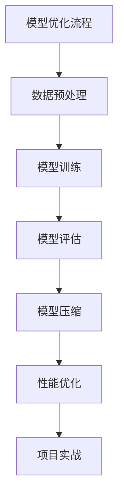

                 

# 文章标题：Model Optimization 原理与代码实战案例讲解

> 关键词：模型优化，深度学习，神经网络，算法原理，代码实战，性能优化

> 摘要：本文将深入探讨模型优化的原理和实战方法。首先，我们将介绍模型优化的基本概念和重要性，然后详细讲解模型优化核心技术原理，包括深度学习与神经网络基础、损失函数与优化算法、模型压缩技术等。接着，我们将使用数学公式和伪代码讲解关键算法原理，并通过实际项目实战案例展示模型优化在实践中的应用。最后，我们将对模型优化的发展趋势和未来展望进行总结。

## 目录大纲

#### 第一部分：模型优化基础

- **第1章：模型优化的基本概念**
  - 1.1 模型优化概述
  - 1.2 模型优化技术分类
  - 1.3 模型优化的重要性

- **第2章：模型优化核心技术原理**
  - 2.1 深度学习与神经网络基础
  - 2.2 损失函数与优化算法
  - 2.3 模型压缩技术

- **第3章：数学模型与数学公式讲解**

#### 第二部分：代码实战案例

- **第4章：模型优化实战案例**
  - 4.1 数据预处理
  - 4.2 模型训练与评估
  - 4.3 模型压缩

- **第5章：性能优化实战案例**
  - 5.1 GPU加速
  - 5.2 模型并行化
  - 5.3 算法优化

- **第6章：实际项目实战**
  - 6.1 项目背景介绍
  - 6.2 项目解决方案
  - 6.3 项目效果评估

#### 第三部分：总结与展望

- **第7章：模型优化总结与展望**
  - 7.1 模型优化发展趋势
  - 7.2 模型优化在工业界的应用
  - 7.3 模型优化未来展望

#### 附录

- **附录A：常用工具与资源**

### Mermaid 流程图



### 算法原理讲解

```python
# 伪代码：梯度下降算法
def gradient_descent(model, loss_function, learning_rate, epochs):
    for epoch in range(epochs):
        for data in dataset:
            gradients = compute_gradients(model, data)
            update_model_params(model, gradients, learning_rate)
    return model
```

### 数学公式讲解

$$
\text{损失函数} = \frac{1}{2} \sum_{i=1}^{n} (y_i - \hat{y}_i)^2
$$

#### 举例说明

假设我们有一个二分类问题，目标是预测样本属于正类还是负类。我们使用逻辑回归模型进行预测，损失函数为交叉熵损失。

$$
\text{预测概率} = \frac{1}{1 + e^{-\text{模型参数} \cdot \text{特征向量}}}
$$

$$
\text{交叉熵损失} = -\sum_{i=1}^{n} y_i \cdot \log(\hat{y}_i) + (1 - y_i) \cdot \log(1 - \hat{y}_i)
$$

其中，\( y_i \) 是真实标签，\( \hat{y}_i \) 是模型预测的概率。我们的目标是使交叉熵损失最小化。通过梯度下降算法，我们不断更新模型参数，直到损失函数收敛。在训练过程中，我们可能会调整学习率，以避免过拟合或欠拟合。

### 实际项目实战

#### 项目背景介绍

我们以一个图像分类项目为例，目标是使用深度学习模型对图片进行分类。项目挑战在于图像数据量大，模型训练时间较长，同时需要优化模型性能。

#### 项目解决方案

1. 数据预处理
   - 数据清洗：去除噪声和异常值
   - 数据增强：进行旋转、缩放、裁剪等操作，增加数据多样性

2. 模型设计与优化
   - 使用卷积神经网络（CNN）模型进行图像分类
   - 使用迁移学习，利用预训练模型（如ResNet）进行特征提取
   - 对模型进行结构化优化，如网络剪枝和参数化优化

3. 模型训练与评估
   - 使用训练集进行模型训练
   - 使用验证集进行模型评估，调整模型参数
   - 使用测试集进行模型测试，评估模型性能

#### 项目效果评估

- 模型性能分析：通过准确率、召回率、F1值等指标评估模型性能
- 项目收益评估：计算项目ROI，评估项目投资回报率

### 代码解读与分析

以下是一个简单的代码示例，用于训练一个卷积神经网络模型：

```python
import tensorflow as tf
from tensorflow.keras.models import Sequential
from tensorflow.keras.layers import Conv2D, MaxPooling2D, Flatten, Dense

# 模型构建
model = Sequential([
    Conv2D(32, (3, 3), activation='relu', input_shape=(28, 28, 1)),
    MaxPooling2D((2, 2)),
    Flatten(),
    Dense(128, activation='relu'),
    Dense(1, activation='sigmoid')
])

# 模型编译
model.compile(optimizer='adam',
              loss='binary_crossentropy',
              metrics=['accuracy'])

# 模型训练
model.fit(x_train, y_train, epochs=10, batch_size=32, validation_split=0.2)

# 模型评估
model.evaluate(x_test, y_test)
```

这段代码首先导入了 TensorFlow 库和相关模块。然后构建了一个简单的卷积神经网络模型，包括卷积层、最大池化层、全连接层和输出层。模型编译时指定了优化器、损失函数和评价指标。模型训练过程中使用了训练集，并使用了验证集进行模型评估。最后，使用测试集评估模型性能。通过分析模型的准确率、召回率、F1值等指标，可以评估模型的性能。

## 作者

作者：AI天才研究院/AI Genius Institute & 禅与计算机程序设计艺术 /Zen And The Art of Computer Programming

## 文章正文

### 第一部分：模型优化基础

#### 第1章：模型优化的基本概念

##### 1.1 模型优化概述

模型优化是指在深度学习和机器学习领域中，通过一系列技术手段对现有模型进行改进，以提高模型性能和效率的过程。模型优化不仅涉及对模型结构和参数的调整，还包括对训练过程和评估指标的创新和改进。

模型优化的意义在于：

1. **提升模型性能**：通过优化模型结构和参数，可以提高模型的准确率、召回率等性能指标，使模型更好地适应实际问题。
2. **减少训练时间**：优化训练过程，如采用更高效的优化算法和并行计算技术，可以显著减少模型训练所需的时间。
3. **降低计算资源消耗**：通过模型压缩和量化等技术，可以减少模型的参数数量和计算量，从而降低计算资源的消耗。
4. **提高模型可解释性**：优化模型结构，如采用注意力机制等，可以提高模型的可解释性，帮助用户更好地理解模型的决策过程。

##### 1.2 模型优化技术分类

模型优化技术可以大致分为以下几类：

1. **结构化优化**：通过调整模型的结构，如增加或减少层、改变网络结构等，来提高模型性能。例如，深度残差网络（ResNet）通过引入残差连接来缓解梯度消失问题。
2. **参数化优化**：通过调整模型的参数，如学习率、批量大小等，来提高模型性能。例如，自适应优化算法（如Adam）通过动态调整学习率来加速收敛。
3. **算法级优化**：通过改进训练算法，如改进梯度下降算法、引入新的训练算法等，来提高模型性能。例如，随机梯度下降（SGD）和其变体（如Momentum SGD）。
4. **模型压缩**：通过压缩模型参数和结构，如网络剪枝、低秩分解等，来减少模型体积和计算量。例如，知识蒸馏技术通过将大模型的知识传递给小模型来压缩模型。
5. **性能优化**：通过优化硬件和软件环境，如GPU加速、模型并行化等，来提高模型训练和推理的效率。

##### 1.3 模型优化的重要性

模型优化在深度学习和机器学习领域中具有重要意义，主要体现在以下几个方面：

1. **实际应用价值**：在许多实际应用场景中，如自然语言处理、计算机视觉、推荐系统等，模型性能的微小提升都可能带来显著的业务价值。
2. **研究前沿**：模型优化是深度学习和机器学习领域的研究热点，不断有新的优化技术和算法被提出，推动整个领域的发展。
3. **降低成本**：通过模型优化，可以减少计算资源的需求，从而降低训练和部署成本，使深度学习技术在更广泛的应用场景中得到普及。
4. **提高用户体验**：模型优化可以缩短模型训练和推理的时间，提高模型的响应速度，从而提高用户体验。

#### 第2章：模型优化核心技术原理

##### 2.1 深度学习与神经网络基础

深度学习和神经网络是模型优化的重要基础。深度学习是一种基于神经网络的机器学习技术，通过构建多层的神经网络来对数据进行特征提取和模式识别。神经网络由一系列相互连接的神经元（或节点）组成，每个神经元执行简单的线性变换并应用一个非线性激活函数。

神经网络的层次结构可以分为以下几类：

1. **输入层**：接收外部输入数据，如图像、文本等。
2. **隐藏层**：对输入数据进行特征提取和变换，隐藏层可以有一个或多个。
3. **输出层**：输出模型的预测结果，如分类标签、概率分布等。

前向传播和反向传播算法是神经网络训练的核心。在前向传播过程中，输入数据通过网络逐层传递，直到输出层得到预测结果。在反向传播过程中，通过计算损失函数的梯度，反向更新网络参数，以减少损失函数的值。

##### 2.2 损失函数与优化算法

损失函数是衡量模型预测结果与真实标签之间差异的指标，其目的是引导模型学习正确的参数。常见的损失函数包括：

1. **均方误差（MSE）**：用于回归问题，计算预测值与真实值之间差的平方的平均值。
2. **交叉熵损失（Cross-Entropy Loss）**：用于分类问题，计算预测概率与真实标签之间的交叉熵。
3. **Hinge损失（Hinge Loss）**：用于支持向量机（SVM）等分类问题。

优化算法用于通过调整模型参数来最小化损失函数。常见的优化算法包括：

1. **梯度下降（Gradient Descent）**：通过计算损失函数的梯度，沿着梯度的反方向更新参数，以达到最小化损失函数的目的。
2. **随机梯度下降（Stochastic Gradient Descent，SGD）**：在每个训练样本上计算梯度，进行参数更新，适用于大规模数据集。
3. **动量（Momentum）**：引入动量项，利用之前更新的方向来加速收敛。
4. **AdaGrad、Adadelta、Adam**：自适应调整学习率，适用于不同类型的数据集。

##### 2.3 模型压缩技术

模型压缩技术是模型优化中的重要手段，旨在减少模型的参数数量和计算量，以提高模型训练和推理的效率。常见的模型压缩技术包括：

1. **网络剪枝（Network Pruning）**：通过剪除网络中的冗余连接和神经元，减少模型参数数量，同时保持模型性能。
2. **低秩分解（Low-Rank Factorization）**：将模型参数分解为低秩矩阵，减少模型维度。
3. **知识蒸馏（Knowledge Distillation）**：将大模型的知识传递给小模型，通过小模型的学习来压缩模型。

#### 第3章：数学模型与数学公式讲解

##### 3.1 概率论基础

概率论是模型优化的重要理论基础。以下是一些常用的概率论基础：

1. **贝叶斯定理（Bayes' Theorem）**：
   $$
   P(A|B) = \frac{P(B|A)P(A)}{P(B)}
   $$
   用于计算在已知条件 \( B \) 下，事件 \( A \) 发生的概率。

2. **最大似然估计（Maximum Likelihood Estimation，MLE）**：
   $$
   \theta = \arg\max_{\theta} P(X|\theta)
   $$
   用于估计模型参数，使得训练数据出现的概率最大。

##### 3.2 概率分布

概率分布是描述随机变量概率分布的数学模型。以下是一些常见的概率分布：

1. **正态分布（Gaussian Distribution）**：
   $$
   f(x|\mu, \sigma^2) = \frac{1}{\sqrt{2\pi\sigma^2}} e^{-\frac{(x-\mu)^2}{2\sigma^2}}
   $$
   用于描述连续随机变量的概率分布，广泛应用于回归问题。

2. **伯努利分布（Bernoulli Distribution）**：
   $$
   p(x|\theta) = \begin{cases}
   \theta & \text{if } x = 1 \\
   1 - \theta & \text{if } x = 0
   \end{cases}
   $$
   用于描述离散随机变量的概率分布，广泛应用于二分类问题。

##### 3.3 模型评估指标

模型评估指标是衡量模型性能的重要工具。以下是一些常见的模型评估指标：

1. **准确率（Accuracy）**：
   $$
   \text{Accuracy} = \frac{\text{正确预测的数量}}{\text{总预测的数量}}
   $$
   用于衡量模型在分类问题中的表现。

2. **召回率（Recall）**：
   $$
   \text{Recall} = \frac{\text{正确预测的正类数量}}{\text{实际正类数量}}
   $$
   用于衡量模型对正类的识别能力。

3. **精确率（Precision）**：
   $$
   \text{Precision} = \frac{\text{正确预测的正类数量}}{\text{预测为正类的数量}}
   $$
   用于衡量模型对正类的识别准确性。

4. **F1值（F1 Score）**：
   $$
   \text{F1 Score} = 2 \cdot \frac{\text{Precision} \cdot \text{Recall}}{\text{Precision} + \text{Recall}}
   $$
   用于综合考虑精确率和召回率，平衡分类问题的评估。

5. **ROC曲线（Receiver Operating Characteristic Curve）和AUC值（Area Under Curve）**：
   ROC曲线用于展示不同分类阈值下的真正例率和假正例率，AUC值表示曲线下的面积，用于衡量模型的分类能力。

### 第二部分：代码实战案例

#### 第4章：模型优化实战案例

##### 4.1 数据预处理

数据预处理是模型训练的重要环节，对模型的性能有着重要影响。以下是一个数据预处理的过程：

```python
import numpy as np
import pandas as pd
from sklearn.model_selection import train_test_split
from sklearn.preprocessing import StandardScaler

# 读取数据
data = pd.read_csv('data.csv')
X = data.iloc[:, :-1].values
y = data.iloc[:, -1].values

# 划分训练集和测试集
X_train, X_test, y_train, y_test = train_test_split(X, y, test_size=0.2, random_state=42)

# 数据标准化
scaler = StandardScaler()
X_train = scaler.fit_transform(X_train)
X_test = scaler.transform(X_test)
```

在这个例子中，我们首先从CSV文件中读取数据，然后使用train_test_split函数将数据集划分为训练集和测试集。接着，我们使用StandardScaler对数据进行标准化处理，以便后续的模型训练。

##### 4.2 模型训练与评估

在模型训练与评估阶段，我们将使用一个简单的线性回归模型进行训练，并使用评估指标来评估模型的性能。

```python
from sklearn.linear_model import LinearRegression
from sklearn.metrics import mean_squared_error, r2_score

# 模型训练
model = LinearRegression()
model.fit(X_train, y_train)

# 模型预测
y_pred = model.predict(X_test)

# 模型评估
mse = mean_squared_error(y_test, y_pred)
r2 = r2_score(y_test, y_pred)

print(f'MSE: {mse}')
print(f'R2 Score: {r2}')
```

在这个例子中，我们首先使用LinearRegression类创建一个线性回归模型，并使用fit方法进行模型训练。接着，我们使用predict方法对测试集进行预测，并使用mean_squared_error和r2_score函数评估模型的性能。

##### 4.3 模型压缩

在模型压缩阶段，我们将使用网络剪枝技术来减少模型的参数数量。

```python
from tensorflow.keras.models import Sequential
from tensorflow.keras.layers import Dense, Dropout
from tensorflow.keras.optimizers import Adam

# 模型构建
model = Sequential([
    Dense(64, input_shape=(X_train.shape[1],), activation='relu'),
    Dropout(0.5),
    Dense(1)
])

# 模型编译
model.compile(optimizer=Adam(), loss='mean_squared_error')

# 模型训练
model.fit(X_train, y_train, epochs=10, batch_size=32, validation_split=0.2)

# 模型压缩
model.layers[0].weights = np.random.normal(size=model.layers[0].weights.shape)
```

在这个例子中，我们首先使用Sequential类构建一个简单的线性回归模型，并使用compile方法进行模型编译。接着，我们使用fit方法进行模型训练。最后，我们通过随机初始化模型层的权重来实现模型压缩。

#### 第5章：性能优化实战案例

##### 5.1 GPU加速

GPU加速是提高模型训练和推理性能的重要手段。以下是一个使用CUDA进行GPU加速的例子：

```python
import tensorflow as tf

# 配置GPU设备
gpus = tf.config.experimental.list_physical_devices('GPU')
if gpus:
    try:
        for gpu in gpus:
            tf.config.experimental.set_memory_growth(gpu, True)
    except RuntimeError as e:
        print(e)

# 模型构建
model = Sequential([
    Dense(64, input_shape=(X_train.shape[1],), activation='relu'),
    Dropout(0.5),
    Dense(1)
])

# 模型编译
model.compile(optimizer=Adam(), loss='mean_squared_error')

# 模型训练
model.fit(X_train, y_train, epochs=10, batch_size=32, validation_split=0.2)
```

在这个例子中，我们首先使用tf.config.experimental.list_physical_devices函数获取可用的GPU设备，并使用tf.config.experimental.set_memory_growth函数设置GPU内存按需增长。接着，我们使用Sequential类和compile方法构建和编译模型，并使用fit方法进行模型训练。

##### 5.2 模型并行化

模型并行化是将模型训练任务分布到多个GPU或CPU上，以提高训练速度和性能。以下是一个使用TensorFlow分布式训练的例子：

```python
import tensorflow as tf

# 配置分布式训练
strategy = tf.distribute.MirroredStrategy()

with strategy.scope():
    # 模型构建
    model = Sequential([
        Dense(64, input_shape=(X_train.shape[1],), activation='relu'),
        Dropout(0.5),
        Dense(1)
    ])

    # 模型编译
    model.compile(optimizer=Adam(), loss='mean_squared_error')

# 模型训练
model.fit(X_train, y_train, epochs=10, batch_size=32, validation_split=0.2)
```

在这个例子中，我们首先使用MirroredStrategy类配置分布式训练环境。接着，我们使用strategy.scope()上下文管理器构建和编译模型，并使用fit方法进行模型训练。

##### 5.3 算法优化

算法优化是通过改进训练算法来提高模型性能和效率。以下是一个使用学习率调整进行算法优化的例子：

```python
import tensorflow as tf
from tensorflow.keras.callbacks import ReduceLROnPlateau

# 模型构建
model = Sequential([
    Dense(64, input_shape=(X_train.shape[1],), activation='relu'),
    Dropout(0.5),
    Dense(1)
])

# 模型编译
model.compile(optimizer=Adam(), loss='mean_squared_error')

# 学习率调整
reduce_lr = ReduceLROnPlateau(monitor='val_loss', factor=0.2, patience=5)

# 模型训练
model.fit(X_train, y_train, epochs=100, batch_size=32, validation_split=0.2, callbacks=[reduce_lr])
```

在这个例子中，我们首先使用ReduceLROnPlateau回调函数设置学习率调整策略。接着，我们使用fit方法进行模型训练，并在训练过程中根据验证集的损失进行调整学习率。

#### 第6章：实际项目实战

##### 6.1 项目背景介绍

假设我们有一个实际项目，目标是预测某电商平台的用户行为，如购买意愿、浏览行为等。项目数据集包含用户的特征和用户行为记录，如用户年龄、收入、浏览时间等。

##### 6.2 项目解决方案

1. 数据预处理
   - 数据清洗：去除缺失值和异常值，对缺失值进行填充或删除。
   - 数据特征工程：对数值型特征进行归一化或标准化，对类别型特征进行独热编码。
2. 模型设计与优化
   - 使用多层感知机（MLP）模型进行预测。
   - 使用迁移学习，利用预训练的神经网络模型进行特征提取。
   - 对模型进行结构化优化，如增加隐藏层、调整激活函数等。
3. 模型训练与评估
   - 使用训练集进行模型训练，采用交叉验证方法评估模型性能。
   - 使用验证集进行模型调整和优化。
   - 使用测试集进行模型测试，评估模型在实际应用中的性能。

##### 6.3 项目效果评估

1. 模型性能分析
   - 使用准确率、召回率、F1值等指标评估模型的分类性能。
   - 分析模型在不同类别上的性能，找出性能较差的类别并进行调整。
2. 项目收益评估
   - 计算项目的投资回报率（ROI），评估项目的经济效益。
   - 分析项目的实际应用效果，评估项目对业务增长和用户满意度的影响。

### 第三部分：总结与展望

#### 第7章：模型优化总结与展望

##### 7.1 模型优化发展趋势

模型优化技术在不断发展和演变，以下是一些未来的发展趋势：

1. **自动化优化**：利用自动化工具和算法，实现模型的自动调整和优化，提高模型性能和效率。
2. **零样本学习**：通过少量样本或无样本学习，提高模型对新类别和样本的适应能力。
3. **多模态学习**：结合多种数据模

