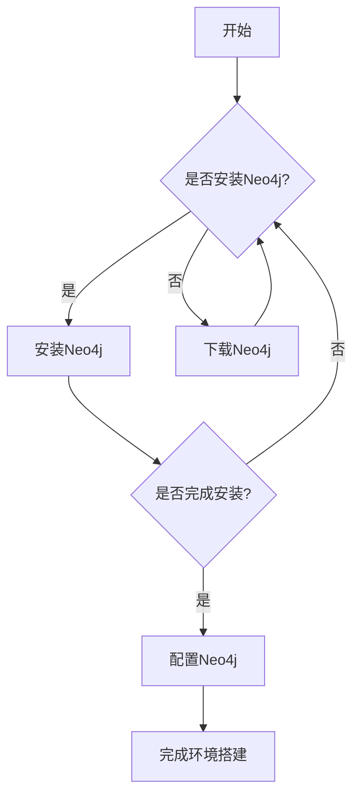

                 

### 第1章：Neo4j概述

#### 1.1 Neo4j的发展历史

Neo4j是由Neo Technology公司开发的一个高性能的NOSQL图形数据库，它旨在存储和处理复杂的关系数据。自2007年首次发布以来，Neo4j经历了多个版本的迭代和改进，逐渐成为了图形数据库领域的重要成员。

##### 1.1.1 从1.0版本到2.0版本
- Neo4j 1.0版本：首个公开发布的版本，引入了图形数据库的基本概念。
- Neo4j 2.0版本：引入了新的事务模型、索引机制以及分布式架构，显著提高了性能和可扩展性。

##### 1.1.2 Neo4j 3.0及以后版本
- Neo4j 3.0版本：引入了新的一致性保证、数据导入工具、并行查询等特性。
- Neo4j 4.0版本：引入了全文本搜索、图机器学习、图流处理等新的功能和优化。

#### 1.2 Neo4j的核心概念

Neo4j作为一个图数据库，其核心概念主要包括节点、关系和标签。

##### 1.2.1 节点（Node）
节点是图中的基本数据单位，它表示任何实体或概念。节点可以具有属性来存储相关数据。

- 节点定义：
  
  ```cypher
  CREATE (n:Person {name: 'Alice', age: 30});
  ```

- 节点查询：
  
  ```cypher
  MATCH (n:Person)
  RETURN n;
  ```

##### 1.2.2 关系（Relationship）
关系连接两个节点，表示节点之间的关系。关系也可以具有属性，如时间、权重等。

- 关系定义：
  
  ```cypher
  MATCH (p:Person {name: 'Alice'}), (c:Company {name: 'Acme'})
  CREATE (p)-[:WORKS_FOR]->(c);
  ```

- 关系查询：
  
  ```cypher
  MATCH (p:Person)-[:WORKS_FOR]->(c:Company)
  RETURN p, c;
  ```

##### 1.2.3 标签（Label）
标签用于给节点分类，它是一个字符串，可以给节点赋予多个标签。

- 标签定义：
  
  ```cypher
  CREATE (n:Person:Developer {name: 'Bob', age: 40});
  ```

- 标签查询：
  
  ```cypher
  MATCH (n:Developer)
  RETURN n;
  ```

#### 1.3 Neo4j的优势与适用场景

Neo4j的优势在于其高效的图处理能力，特别适合处理复杂的关系数据。

##### 1.3.1 Neo4j的优势
- **高性能**：Neo4j专门为图形数据优化，具有高效的图查询和索引性能。
- **易用性**：Cypher查询语言简单直观，易于学习和使用。
- **扩展性**：支持分布式部署和集群架构，易于扩展。

##### 1.3.2 Neo4j的适用场景
- **社交网络分析**：处理好友关系、社交圈等复杂关系。
- **推荐系统**：分析用户行为，推荐相似内容或用户。
- **网络拓扑分析**：分析网络结构，识别关键节点和路径。
- **银行和金融服务**：风险评估、欺诈检测等。
- **物联网数据管理**：处理设备和传感器之间的复杂关系。
- **安全**：检测网络攻击、恶意行为等。

在了解了Neo4j的发展历史、核心概念和优势后，我们接下来将在第2章中详细讲解如何搭建Neo4j的环境。

### 第2章：Neo4j环境搭建

Neo4j的安装和配置是开始使用Neo4j的第一步。本章将详细介绍如何在不同的操作系统上安装和配置Neo4j。

#### 2.1 Neo4j的安装

Neo4j提供了多种安装方式，包括手动安装和自动安装。

##### 2.1.1 Windows环境

在Windows上安装Neo4j，可以下载Neo4j的Windows安装程序并按照安装向导进行操作。

- 访问Neo4j官网下载Neo4j Windows安装包。
- 运行安装程序并按照提示完成安装。

安装过程中，用户可以选择安装Neo4j Community Edition或Neo4j Enterprise Edition。Community Edition是免费的，适合个人学习和小型项目。Enterprise Edition是商业版，提供了高级功能和专业支持。

##### 2.1.2 macOS环境

在macOS上安装Neo4j，可以使用Homebrew工具。

- 安装Homebrew（如果尚未安装）：
  
  ```sh
  /bin/bash -c "$(curl -fsSL https://raw.githubusercontent.com/Homebrew/install/HEAD/install.sh)"
  ```

- 使用Homebrew安装Neo4j：
  
  ```sh
  brew install neo4j
  ```

安装完成后，Neo4j会自动启动。可以使用`brew services list`命令查看Neo4j服务状态。

##### 2.1.3 Linux环境

在Linux上安装Neo4j，可以使用包管理器。

- 使用APT（Ubuntu、Debian）：
  
  ```sh
  sudo apt-get update
  sudo apt-get install neo4j
  ```

- 使用YUM（CentOS、Fedora）：
  
  ```sh
  sudo yum install neo4j
  ```

安装完成后，Neo4j通常会在后台自动启动。可以使用`systemctl status neo4j`命令查看Neo4j服务状态。

#### 2.2 Neo4j的配置

Neo4j的配置主要包括数据存储配置和集群配置。

##### 2.2.1 数据存储配置

Neo4j使用磁盘存储数据。默认情况下，Neo4j将数据存储在当前工作目录中。用户可以通过配置文件`conf/neo4j.conf`来修改数据存储位置。

- 修改数据目录位置：
  
  ```sh
  dbms听闻data_directory=/path/to/data
  ```

- 设置日志目录：
  
  ```sh
  dbms听闻log_file=/path/to/logs/neo4j.log
  ```

- 设置缓存大小：
  
  ```sh
  dbms听闻cache_size=512m
  ```

##### 2.2.2 集群配置

Neo4j支持集群部署，可以提供高可用性和横向扩展。

- 启用集群模式：
  
  ```sh
  dbms.mode=cluster
  ```

- 配置集群中的其他节点。每个节点都需要知道集群中其他节点的地址。可以通过修改`conf/cluster.properties`文件来配置。
  
  ```sh
  ha.default.hosts=localhost:5001,localhost:5002,localhost:5003
  ```

#### 2.3 Neo4j的开发工具

Neo4j提供了一系列的开发工具，方便开发者进行数据操作和查询。

##### 2.3.1 Neo4j Desktop

Neo4j Desktop是一个集成的开发环境，支持创建、配置和管理Neo4j实例。

- 下载Neo4j Desktop并安装。
- 启动Neo4j Desktop，创建新的Neo4j实例。

##### 2.3.2 Neo4j Browser

Neo4j Browser是一个Web界面，用于执行Cypher查询和可视化结果。

- 启动Neo4j Browser，连接到Neo4j实例。
- 使用Cypher查询语言进行数据操作和查询。

##### 2.3.3 Cypher Studio

Cypher Studio是一个基于Windows的应用程序，提供Cypher查询的编辑和执行环境。

- 下载Cypher Studio并安装。
- 启动Cypher Studio，连接到Neo4j实例。
- 编写和执行Cypher查询。

在完成Neo4j的环境搭建后，我们将在第3章中深入讲解Neo4j的核心概念，包括图数据库模型、Cypher查询语言和索引机制。

### 第3章：Neo4j核心概念详解

Neo4j作为一个图数据库，其核心概念和结构对于理解和使用Neo4j至关重要。本章将详细解释Neo4j的图数据库模型、Cypher查询语言和索引机制。

#### 3.1 Neo4j的图数据库模型

Neo4j的图数据库模型由节点（Node）、关系（Relationship）和标签（Label）组成。

##### 3.1.1 节点（Node）

节点是图中的基本数据单位，用于表示实体或概念。节点可以拥有一个或多个属性，属性是键值对，用于存储节点的具体信息。

- **节点创建**：

  ```cypher
  CREATE (n:Person {name: 'Alice', age: 30});
  ```

  在这个例子中，创建了一个名为`Person`的节点，具有`name`和`age`属性。

- **节点查询**：

  ```cypher
  MATCH (n:Person)
  RETURN n;
  ```

  这个查询将返回所有具有`Person`标签的节点。

##### 3.1.2 关系（Relationship）

关系连接两个节点，表示它们之间的关系。关系也包含属性，这些属性可以描述关系的具体细节，如时间、权重等。

- **关系创建**：

  ```cypher
  MATCH (p:Person {name: 'Alice'}), (c:Company {name: 'Acme'})
  CREATE (p)-[:WORKS_FOR]->(c);
  ```

  这个例子中，创建了一个从Alice到Acme公司的工作关系。

- **关系查询**：

  ```cypher
  MATCH (p:Person)-[:WORKS_FOR]->(c:Company)
  RETURN p, c;
  ```

  这个查询将返回所有与`Person`节点有`WORKS_FOR`关系的`Company`节点。

##### 3.1.3 标签（Label）

标签用于给节点分类，它是一个字符串，可以为节点赋予多个标签。标签可以看作是对节点的分类。

- **标签定义**：

  ```cypher
  CREATE (n:Person:Developer {name: 'Bob', age: 40});
  ```

  这个例子中，节点`n`被赋予了`Person`和`Developer`两个标签。

- **标签查询**：

  ```cypher
  MATCH (n:Developer)
  RETURN n;
  ```

  这个查询将返回所有具有`Developer`标签的节点。

#### 3.2 Cypher查询语言

Cypher是Neo4j的原生查询语言，用于在图数据库中执行查询。Cypher具有简洁明了的语法，使得查询图数据变得更加直观。

##### 3.2.1 基本语法

Cypher查询的基本结构包括`MATCH`、`WHERE`和`RETURN`子句。

- **基本查询结构**：

  ```cypher
  MATCH [匹配模式]
  [WHERE [条件]]
  RETURN [返回内容];
  ```

  - `MATCH`子句定义了查询的图模式。
  - `WHERE`子句用于过滤结果。
  - `RETURN`子句定义了查询返回的数据。

- **节点和关系的匹配**：

  ```cypher
  MATCH (n)
  RETURN n;
  ```

  这个查询将返回图中的所有节点。

  ```cypher
  MATCH (n)-[r]->(m)
  RETURN n, r, m;
  ```

  这个查询将返回所有节点和它们之间的关系。

##### 3.2.2 条件查询

条件查询允许用户在查询中添加过滤条件，以筛选出满足特定条件的节点和关系。

- **简单条件**：

  ```cypher
  MATCH (n:Person)
  WHERE n.age > 30
  RETURN n;
  ```

  这个查询将返回所有年龄大于30岁的`Person`节点。

- **复合条件**：

  ```cypher
  MATCH (n:Person), (m:Company)
  WHERE n.age > 30 AND n.worksFor.m
  RETURN n, m;
  ```

  这个查询将返回所有年龄大于30岁，且与公司存在工作关系的`Person`节点。

##### 3.2.3 聚合查询

聚合查询用于计算一组节点的汇总信息，如计数、最大值、最小值等。

- **简单聚合**：

  ```cypher
  MATCH (n:Person)
  RETURN count(n) AS totalPeople;
  ```

  这个查询将返回图中的`Person`节点总数。

- **分组聚合**：

  ```cypher
  MATCH (n:Person)
  RETURN n.department, count(n) AS numEmployees;
  ```

  这个查询将返回每个部门的员工数量。

#### 3.3 Neo4j索引机制

索引是提高查询性能的关键因素，Neo4j支持节点和关系的索引。

##### 3.3.1 创建索引

索引可以自动创建，也可以手动创建。

- **自动创建索引**：

  Neo4j会在创建唯一约束时自动创建索引。

  ```cypher
  CONSTRAINT UNIQUE Person.name;
  ```

- **手动创建索引**：

  ```cypher
  CREATE INDEX ON :Person(name);
  CREATE INDEX ON :Relationship(type);
  ```

  这两个查询将分别为`Person`节点和`Relationship`关系的`name`和`type`属性创建索引。

##### 3.3.2 使用索引

使用索引可以显著提高查询性能。

- **索引查询**：

  ```cypher
  MATCH (n:Person)
  WHERE n.name = 'Alice'
  RETURN n;
  ```

  这个查询将使用`Person`节点的`name`索引。

  ```cypher
  MATCH (n:Person)-[r:WORKS_FOR]->(m:Company)
  WHERE r.type = 'EMPLOYEE'
  RETURN n, m;
  ```

  这个查询将使用`Relationship`关系的`type`索引。

通过理解Neo4j的图数据库模型、Cypher查询语言和索引机制，用户可以更有效地使用Neo4j进行数据存储和查询。在接下来的章节中，我们将学习Neo4j的高级查询技巧和性能优化方法。

### 第4章：Neo4j高级查询技巧

在前一章中，我们学习了Neo4j的基础查询语法和概念。本章将介绍Neo4j的高级查询技巧，包括联合查询、子查询、数据导入与导出，以及循环与递归查询。这些高级查询技巧将帮助我们在实际项目中更有效地处理复杂的数据关系和操作。

#### 4.1 联合查询与子查询

##### 4.1.1 联合查询

联合查询允许我们组合多个查询的结果，并将其视为一个单一的结果集。这种查询在处理多表连接时非常有用。

- **基本语法**：

  ```cypher
  MATCH
  ``` 

  ``` 
  (p:Person), (c:Company)
  ```

  ``` 
  WHERE
  ```

  ``` 
  p.worksFor = c
  ```

  ``` 
  RETURN
  ```

  ``` 
  p.name AS Employee, c.name AS Company
  ```

  这个查询将返回每个员工和他们所在公司的名字。

- **示例**：

  ```cypher
  MATCH (p:Person), (c:Company)
  WHERE p.worksFor = c
  RETURN p.name AS Employee, c.name AS Company;
  ```

  执行此查询后，我们将得到一个结果集，其中包含每个员工的姓名和他们所在公司的名称。

##### 4.1.2 子查询

子查询是一种嵌套在主查询中的查询，可以用来过滤或计算数据。子查询可以分为两种：子查询作为FROM子句的一部分和子查询作为WHERE子句的一部分。

- **子查询作为FROM子句的一部分**：

  ```cypher
  MATCH (p:Person)
  ```

  ``` 
  , sub = (p)-[:WORKS_FOR]->(c:Company)
  ```

  ``` 
  WHERE
  ```

  ``` 
  sub.age > 30
  ```

  ``` 
  RETURN
  ```

  ``` 
  p.name, sub.name
  ```

  这个查询将返回所有在年龄大于30岁的公司工作的员工姓名。

- **子查询作为WHERE子句的一部分**：

  ```cypher
  MATCH (p:Person)
  ```

  ``` 
  WHERE
  ```

  ``` 
  EXISTS (
    MATCH (p)-[:WORKS_FOR]->(c:Company)
    WHERE c.name = 'Acme'
  )
  ```

  ``` 
  RETURN
  ```

  ``` 
  p.name
  ```

  这个查询将返回在Acme公司工作的所有员工的姓名。

#### 4.2 数据导入与导出

Neo4j支持从各种数据源导入数据和将数据导出到不同的格式，如CSV和JSON。这对于迁移旧系统中的数据到Neo4j或在Neo4j中处理大规模数据至关重要。

##### 4.2.1 数据导入

导入数据可以通过`LOAD CSV`语句实现，它可以从本地文件系统或远程URL加载CSV或JSON文件。

- **导入CSV数据**：

  ```cypher
  LOAD CSV WITH HEADERS FROM 'file:///data.csv' AS row
  CREATE (p:Person {name: row.Name, age: toInteger(row.Age)});
  ```

  这个查询将从`data.csv`文件中读取数据，并为每行创建一个`Person`节点。

- **导入JSON数据**：

  ```cypher
  LOAD CSV WITH HEADERS FROM 'file:///data.json' AS row
  CREATE (p:Person {name: row.Name, age: toInteger(row.Age)});
  ```

  同样，这个查询将从`data.json`文件中读取数据，并为每行创建一个`Person`节点。

##### 4.2.2 数据导出

导出数据可以使用`MATCH`和`RETURN`语句配合`CALL`函数来实现。

- **导出为CSV**：

  ```cypher
  MATCH (p:Person)
  RETURN p.name AS Name, p.age AS Age
  CALL apoc.export.csvierz('file:///data.csv', [p], ['Name', 'Age']);
  ```

  这个查询将匹配所有`Person`节点，并将它们的名字和年龄导出为CSV文件。

- **导出为JSON**：

  ```cypher
  MATCH (p:Person)
  RETURN p.name AS Name, p.age AS Age
  CALL apoc.export.jsonz('file:///data.json', [p]);
  ```

  这个查询将匹配所有`Person`节点，并将它们的名字和年龄导出为JSON文件。

#### 4.3 循环与递归查询

Neo4j支持循环和递归查询，用于处理包含多个步骤的复杂查询。

##### 4.3.1 循环查询

循环查询用于执行多次迭代，通常用于查找具有固定深度或长度的路径。

- **深度有限制的循环查询**：

  ```cypher
  MATCH (p:Person)-[:FRIEND*]->(friend)
  WHERE length((p)-[:FRIEND]->(friend)) <= 2
  RETURN p, friend;
  ```

  这个查询将返回所有与当前节点最多有两个`FRIEND`关系的节点。

##### 4.3.2 递归查询

递归查询用于遍历图中的分支结构，查找满足特定条件的节点。

- **递归查询示例**：

  ```cypher
  MATCH (root:Company)
  ``` 

  ``` 
  WHERE
  ```

  ``` 
  root.name = 'Neo Technology'
  ```

  ``` 
  WITH root
  ```

  ``` 
  UNWIND range(0, 3) AS level
  ```

  ``` 
  MATCH (root)-[:MANAGES*](manager{level: level})
  ``` 

  ``` 
  WHERE
  ```

  ``` 
  manager.level = level
  ```

  ``` 
  RETURN manager;
  ```

  这个查询将递归地查找Neo Technology公司的所有管理层节点，层次深度为3级。

通过掌握这些高级查询技巧，我们可以更有效地在Neo4j中处理复杂的数据关系和操作。这些技巧不仅提高了查询的性能，还使我们能够以更灵活的方式探索和分析图数据。接下来，我们将在第5章中讨论Neo4j的进阶功能和应用，包括Neo4j OGM、ETL工具和APOC插件。

### 第5章：Neo4j扩展功能与应用

Neo4j作为一个功能丰富的图形数据库，不仅提供了核心的图存储和查询功能，还通过一系列扩展功能提升了其应用潜力。本章将介绍Neo4j的进阶功能与应用，包括Neo4j Object Graph Mapper（OGM）、ETL工具和APOC插件。

#### 5.1 Neo4j Object Graph Mapper（OGM）

Neo4j OGM是一个对象图映射框架，它允许开发者使用面向对象的方式操作Neo4j图数据库。OGM简化了图数据的操作，提高了开发效率。

##### 5.1.1 OGM概述

OGM支持多种编程语言，包括Java、Python和C#，并提供了一套API，使得将对象映射到图数据库变得直观且容易。通过OGM，开发者可以定义实体类，并自动生成相应的节点和关系。

- **OGM在Java中的应用**：

  ```java
  @Entity
  public class Person {
      @Id
      private Long id;
      
      @Property
      private String name;
      
      @Property
      private int age;
      
      // Getters and Setters
  }
  ```

  在这个例子中，我们定义了一个`Person`类，OGM将自动将其映射到Neo4j中的节点。

##### 5.1.2 OGM使用示例

- **创建Person节点**：

  ```java
  Person person = new Person();
  person.setName("Alice");
  person.setAge(30);
  session.save(person);
  ```

- **查询Person节点**：

  ```java
  Person person = session.load(Person.class, 1L);
  System.out.println(person.getName() + " is " + person.getAge() + " years old.");
  ```

#### 5.2 ETL工具

ETL（提取、转换、加载）工具用于从各种数据源提取数据，进行必要的转换，然后将数据加载到Neo4j中。Neo4j提供了一系列ETL工具，使得数据导入和导出变得更加简单。

##### 5.2.1 ETL工具概述

Neo4j的ETL工具包括以下几种：

- **Neo4j Data Import Tool**：用于导入数据到Neo4j。
- **Neo4j ETL Link**：提供了一种连接Neo4j和Apache NiFi的方法，用于数据流处理。
- **Neo4j Data Link**：用于连接Neo4j和外部数据存储。

##### 5.2.2 数据导入示例

使用Neo4j Data Import Tool导入数据：

- **从CSV文件导入数据**：

  ```sh
  neo4j-admin import --nodes "path/to/nodes.csv" --relationships "path/to/relationships.csv"
  ```

- **从JSON文件导入数据**：

  ```sh
  neo4j-admin import --nodes "path/to/nodes.json" --relationships "path/to/relationships.json"
  ```

#### 5.3 APOC插件

APOC（Advanced Procedure Contribs）是一个社区驱动的Neo4j插件，它提供了一系列的Cypher过程和函数，用于扩展Neo4j的功能。

##### 5.3.1 APOC插件概述

APOC插件包含了多种实用工具，包括数据操作、图分析和报告生成。它可以通过`CALL apoc.`命令访问。

- **APOC实用工具**：

  - `apoc.export.csv`：用于导出数据到CSV文件。
  - `apoc.export.json`：用于导出数据到JSON文件。
  - `apoc.map`：用于创建节点和关系。
  - `apoc.periodic committed`：用于定期执行任务。

##### 5.3.2 APOC使用示例

- **使用APOC创建节点和关系**：

  ```cypher
  CALL apoc.create.node([{"name": "Alice", "age": 30}, {"name": "Bob", "age": 25}])
  CALL apoc.create.relationships([{"startNode": 0, "endNode": 1, "type": "FRIEND"}])
  YIELD nodes, relationships
  RETURN nodes, relationships;
  ```

  这个查询将创建两个节点和一条关系，并将它们返回。

通过这些扩展功能和应用，Neo4j不仅能够满足基本的图形数据处理需求，还能够应对更复杂的应用场景。这些工具和插件为开发者提供了丰富的功能，使得Neo4j成为了一个强大的图形数据处理平台。

### 第6章：Neo4j性能优化

在图形数据库领域，性能优化是一个关键因素。Neo4j作为一种高性能的图形数据库，通过合理的设计和配置，可以显著提升其性能。本章将讨论Neo4j性能优化的方法，包括数据模型设计优化和查询优化技巧。

#### 6.1 数据模型设计优化

##### 6.1.1 确保数据一致性

在Neo4j中，数据一致性可以通过约束和索引来实现。

- **唯一约束**：通过唯一约束，可以确保节点和关系的属性值是唯一的，从而避免数据重复。

  ```cypher
  CONSTRAINT UNIQUE Person.name;
  ```

- **外键约束**：虽然Neo4j不原生支持外键，但可以通过编写Cypher查询或使用其他机制（如Apache TinkerPop）来实现外键约束。

  ```cypher
  MATCH (p:Person)-[r:WORKS_FOR]->(c:Company)
  WHERE NOT exists((c)-[:WORKS_FOR]->())
  DELETE r;
  ```

##### 6.1.2 优化索引使用

索引是提升查询性能的关键因素。Neo4j支持节点和关系的索引，合理使用索引可以显著提高查询速度。

- **创建索引**：根据查询需求创建适当的索引。

  ```cypher
  CREATE INDEX ON :Person(name);
  CREATE INDEX ON :Relationship(type);
  ```

- **选择性索引**：为选择性较高的属性创建索引。

  ```cypher
  CREATE INDEX ON :Person(age);
  ```

##### 6.1.3 数据存储优化

- **数据分区**：将数据分区可以提高数据访问的速度，特别是当数据量非常大时。

  ```cypher
  dbms听闻partition_size=1024
  ```

- **内存管理**：合理配置内存大小，可以避免内存不足导致的性能问题。

  ```cypher
  dbms听闻cache_size=4g
  ```

#### 6.2 查询优化技巧

##### 6.2.1 使用索引

使用索引可以减少查询的执行时间。

- **索引查询**：

  ```cypher
  MATCH (n:Person)
  WHERE n.name = 'Alice'
  RETURN n;
  ```

  这个查询将使用`name`索引。

##### 6.2.2 减少关系深度

避免深度查询可以显著提高查询性能。

- **深度限制**：

  ```cypher
  MATCH (n:Person)-[:FRIEND]->(friend)
  WHERE length((n)-[:FRIEND]->(friend)) <= 2
  RETURN n, friend;
  ```

  这个查询限制了查询的深度。

##### 6.2.3 使用批量处理

批量处理可以减少查询的次数，从而提高性能。

- **批量创建节点和关系**：

  ```cypher
  UNWIND ['Alice', 'Bob', 'Charlie'] AS name
  CREATE (p:Person {name: name});
  CREATE (p1:Person {name: 'David'});
  CREATE (p)-[:FRIEND]->(p1);
  ```

##### 6.2.4 避免使用不必要的函数

避免在WHERE子句中使用不必要的函数可以减少查询的执行时间。

- **简化查询**：

  ```cypher
  MATCH (n:Person)
  WHERE n.age > 30
  RETURN n;
  ```

  这个查询避免了使用不必要的函数。

通过这些优化方法，我们可以显著提升Neo4j的性能，使其在处理大规模图形数据时更加高效。合理的数据模型设计和查询优化是提高Neo4j性能的关键。

### 第7章：Neo4j项目实战

在实际应用中，Neo4j能够帮助我们解决许多复杂的问题。本章将通过几个具体的案例，展示如何使用Neo4j进行社交网络分析、推荐系统和图分析。

#### 7.1 Neo4j在社交网络分析中的应用

社交网络分析是一个典型的图数据分析场景。Neo4j可以用来构建社交网络图，分析用户之间的关系和社交圈。

##### 7.1.1 社交网络图构建

首先，我们需要创建一个社交网络图，包括节点和它们之间的关系。

- **创建节点和关系**：

  ```cypher
  CREATE (a:Person {name: 'Alice'}),
         (b:Person {name: 'Bob'}),
         (c:Person {name: 'Charlie'}),
         (a)-[:FRIEND]->(b),
         (b)-[:FRIEND]->(c),
         (c)-[:FRIEND]->(a);
  ```

  这个查询将创建三个节点和它们之间的友谊关系。

##### 7.1.2 关系路径分析

接下来，我们可以使用Neo4j来分析社交网络中的关系路径。

- **查询关系路径**：

  ```cypher
  MATCH (a:Person {name: 'Alice'}), (b:Person {name: 'Bob'})
  WHERE a-[:FRIEND]->(b)
  RETURN a, b;
  ```

  这个查询将返回Alice和Bob之间的所有直接友谊关系。

  ```cypher
  MATCH (a:Person {name: 'Alice'}), (b:Person {name: 'Charlie'})
  WHERE (a)-[:FRIEND]->(b)
  RETURN a, b;
  ```

  这个查询将返回Alice和Charlie之间的所有直接和间接友谊关系。

#### 7.2 Neo4j在推荐系统中的应用

推荐系统是另一个常见的应用场景。Neo4j可以帮助我们分析用户行为，发现相似的用户或物品。

##### 7.2.1 用户行为分析

为了构建推荐系统，我们需要分析用户的历史行为数据。

- **创建用户行为数据**：

  ```cypher
  CREATE (u:User {name: 'Alice'}),
         (m:Movie {title: 'Inception', genre: 'Sci-Fi'}),
         (u)-[:RATINGS]->(m);
  ```

  这个查询将创建一个用户和她的一个电影评分。

- **分析用户行为**：

  ```cypher
  MATCH (u:User)-[:RATINGS]->(m:Movie)
  WHERE u.name = 'Alice'
  RETURN m, count(*) AS ratingCount;
  ```

  这个查询将返回Alice评分过的所有电影及其评分数量。

##### 7.2.2 相似性计算

为了推荐类似的电影，我们需要计算用户之间的相似性。

- **计算用户相似性**：

  ```cypher
  MATCH (u1:User)-[:RATINGS]->(m1:Movie),
        (u2:User)-[:RATINGS]->(m2:Movie)
  WHERE u1.name = 'Alice' AND u2.name = 'Bob'
  RETURN u1, u2, m1, m2, apoc.similarity.cosine(u1, u2) AS similarity;
  ```

  这个查询将返回Alice和Bob之间共同评分过的电影，并计算他们的相似度。

#### 7.3 Neo4j在图分析中的案例解析

Neo4j在图分析中的应用非常广泛，可以从网络安全到交通网络优化等。

##### 7.3.1 网络攻击检测

网络攻击检测可以通过分析网络流量和用户行为来实现。

- **创建网络攻击数据**：

  ```cypher
  CREATE (u:User {name: 'Alice'}),
         (a:Attack {type: 'DDoS'}),
         (u)-[:ATTACKED]->(a);
  ```

- **检测异常活动**：

  ```cypher
  MATCH (u:User)-[:ATTACKED]->(a:Attack)
  WHERE u.name = 'Alice' AND a.type = 'DDoS'
  RETURN u, a;
  ```

  这个查询将返回所有与DDoS攻击相关的用户和攻击信息。

##### 7.3.2 交通网络优化

交通网络优化可以通过分析交通流量来实现。

- **创建交通网络数据**：

  ```cypher
  CREATE (r1:Road {name: 'Highway 1', length: 100}),
         (r2:Road {name: 'Bridge 2', length: 20}),
         (r1)-[:CONNECTS]->(r2);
  ```

- **分析最优路径**：

  ```cypher
  MATCH (r1:Road {name: 'Highway 1'}),
        (r2:Road {name: 'Bridge 2'})
  WHERE r1-[:CONNECTS]->(r2)
  RETURN r1, r2;
  ```

  这个查询将返回Highway 1和Bridge 2之间的直接连接路径。

通过这些案例，我们可以看到Neo4j在社交网络分析、推荐系统和图分析中的应用。Neo4j的高效图处理能力和简单的查询语言使得它在处理复杂关系数据时非常强大和灵活。

### 第8章：Neo4j生态系统

Neo4j作为一个成熟的图形数据库，拥有一个庞大的生态系统，其中包括社区版与商业版的对比、Neo4j云服务、以及生态工具与库。本章将详细探讨这些内容，帮助用户更好地理解和利用Neo4j生态系统的优势。

#### 8.1 Neo4j社区版与商业版对比

Neo4j提供了两种版本：社区版和商业版，两者在功能、性能和适用场景上存在一定的差异。

##### 8.1.1 功能差异

- **Neo4j社区版**：
  - 免费使用，适用于个人学习和小型项目。
  - 支持单个实例，不具备分布式和高可用性。
  - 不包含高级分析工具，如图机器学习和图流处理。

- **Neo4j商业版**：
  - 需要付费，适用于企业级应用。
  - 支持集群部署，提供高可用性和横向扩展能力。
  - 包含高级分析工具，如图机器学习、图流处理和高级报表生成。

##### 8.1.2 适用场景

- **Neo4j社区版**：
  - 开发者和小型团队，需要入门级图形数据库。
  - 对性能和扩展性要求不高的项目。
  - 用于教学和演示。

- **Neo4j商业版**：
  - 企业级应用，需要高性能和高可用性。
  - 需要大规模数据处理和实时分析。
  - 对安全性、合规性和支持服务有较高要求的场景。

#### 8.2 Neo4j云服务

Neo4j Cloud是Neo4j的云服务，提供了一种简单高效的方式来部署和管理Neo4j实例。

##### 8.2.1 Neo4j Cloud概述

Neo4j Cloud支持多种云服务提供商，如AWS、Azure和Google Cloud。用户可以在云平台上快速启动Neo4j实例，并享受自动备份、监控和扩展等优势。

##### 8.2.2 Neo4j Cloud优势

- **简化部署**：无需自行管理服务器和集群，简化了部署过程。
- **高可用性**：提供自动备份和故障转移功能，确保数据安全和系统可用性。
- **弹性扩展**：根据需求自动调整资源，以应对数据增长和负载变化。
- **成本效益**：按需付费，避免了昂贵的硬件投资和运营成本。

#### 8.3 Neo4j生态工具与库

Neo4j生态系统还包括一系列工具和库，这些工具和库极大地扩展了Neo4j的功能和应用范围。

##### 8.3.1 Neo4j Browser

Neo4j Browser是一个Web界面，用于执行Cypher查询和可视化结果。它提供了一个直观的用户界面，使得开发者可以轻松地与Neo4j进行交互。

##### 8.3.2 Neo4j OGM

Neo4j Object Graph Mapper（OGM）是一个对象图映射框架，它允许开发者使用面向对象的方式操作Neo4j。OGM支持多种编程语言，如Java、Python和C#。

##### 8.3.3 APOC插件

APOC（Advanced Procedure Contribs）是一个强大的Neo4j插件，提供了一系列的Cypher过程和函数。APOC插件可以用于数据操作、图分析和报表生成，极大地扩展了Neo4j的功能。

##### 8.3.4 Neo4j ETL工具

Neo4j ETL工具用于数据的导入和导出。这些工具使得用户可以轻松地将数据从其他数据源迁移到Neo4j，或者将Neo4j中的数据导出到其他系统。

通过Neo4j生态系统中的这些工具和库，开发者可以更有效地使用Neo4j，构建强大的图形应用和解决方案。Neo4j生态系统的持续发展和丰富功能，为用户提供了无限的创造可能。

### 第9章：Neo4j的未来发展趋势

随着技术的不断进步和市场需求的变化，Neo4j的未来发展也充满了机遇和挑战。本章将探讨Neo4j的新功能与技术演进、在人工智能（AI）领域的应用、以及在中国市场的机遇与挑战。

#### 9.1 Neo4j新功能与技术演进

Neo4j持续创新，不断引入新的功能和改进现有技术，以保持其在图形数据库领域的领先地位。

##### 9.1.1 Neo4j 5.0

Neo4j 5.0是一个重要的里程碑，引入了分布式图存储和计算框架。这一框架提高了Neo4j的性能和可扩展性，使得它能够更好地处理大规模的图形数据。

- **分布式图存储**：Neo4j 5.0支持分布式图存储，使得数据可以在多个节点之间分布和复制，提高了数据的可靠性和查询性能。
- **分布式计算框架**：新的分布式计算框架允许并行执行复杂的查询，显著缩短了查询时间。

##### 9.1.2 Neo4j 6.0

Neo4j 6.0进一步扩展了Neo4j的功能，引入了图机器学习、图流处理和全文本搜索等新特性。

- **图机器学习**：Neo4j 6.0支持在图数据库中执行机器学习任务，如图嵌入和图神经网络。这使得Neo4j在推荐系统和网络分析等领域具有更广泛的应用。
- **图流处理**：Neo4j 6.0引入了图流处理能力，使得用户可以实时分析动态变化的图形数据。
- **全文本搜索**：Neo4j 6.0支持全文本搜索，增强了文本数据的处理和分析能力。

#### 9.2 Neo4j在人工智能领域的应用

人工智能与图形数据库的结合正在创造新的应用场景和解决方案。Neo4j在AI领域的应用前景广阔。

##### 9.2.1 图机器学习

图机器学习是一种利用图形数据结构进行数据分析和模型训练的方法。Neo4j通过引入图机器学习功能，使得用户可以在图数据库中直接执行机器学习任务。

- **图嵌入**：图嵌入是一种将图中的节点转换为低维向量表示的方法，可以用于推荐系统和网络分析。
- **图神经网络**：图神经网络是一种基于图结构的深度学习模型，可以用于分类、预测和生成任务。

##### 9.2.2 图分析

Neo4j的强大图处理能力使其在AI领域具有广泛的应用，如社交网络分析、推荐系统和网络安全。

- **社交网络分析**：Neo4j可以分析用户之间的关系，发现社交圈和影响力。
- **推荐系统**：Neo4j可以分析用户行为和物品之间的关系，提供个性化的推荐。
- **网络安全**：Neo4j可以检测网络攻击，识别恶意行为和网络漏洞。

#### 9.3 Neo4j在中国市场的机遇与挑战

中国市场的快速发展为Neo4j带来了巨大的机遇，同时也伴随着一定的挑战。

##### 9.3.1 机遇

- **市场需求增长**：随着企业对数据管理和分析的重视，图形数据库在中国市场的需求不断增长。
- **政府支持**：中国政府对于大数据和人工智能的重视，为Neo4j在中国市场的发展提供了政策支持。
- **本地化服务**：Neo4j可以通过提供本地化的支持和服务，更好地满足中国客户的需求。

##### 9.3.2 挑战

- **竞争激烈**：中国市场存在众多图形数据库供应商，竞争激烈，Neo4j需要提高产品性能和竞争力。
- **文化差异**：与西方市场相比，中国市场的文化差异和业务需求可能不同，Neo4j需要适应当地市场的需求。
- **法规遵从**：中国市场的法规和合规要求较高，Neo4j需要确保其产品符合相关法规。

通过不断创新和优化，Neo4j有望在中国市场获得更多的机会，同时应对挑战，继续引领图形数据库领域的发展。

### 附录A：Neo4j学习资源

为了帮助读者更好地学习和使用Neo4j，本节将介绍一些重要的Neo4j学习资源，包括官方文档、社区论坛、学习教程和案例库。

#### 9.1 官方文档

Neo4j的官方文档是学习Neo4j的最佳起点。它提供了详尽的指南，涵盖了安装、配置、查询语言、API、扩展功能等方面。

- **Neo4j官方文档**：[https://neo4j.com/docs/](https://neo4j.com/docs/)

#### 9.2 社区论坛

Neo4j社区论坛是开发者交流和学习的重要平台。在这里，您可以提问、分享经验、获取帮助。

- **Neo4j社区论坛**：[https://www.neo4j.com/forums/](https://www.neo4j.com/forums/)

#### 9.3 学习教程

网上有许多高质量的学习教程，适合不同层次的学习者。

- **Neo4j入门教程**：[https://neo4j.com/learn/](https://neo4j.com/learn/)
- **Cypher查询教程**：[https://neo4j.com/docs/cypher-manual/](https://neo4j.com/docs/cypher-manual/)

#### 9.4 案例库

通过查看实际的应用案例，可以更好地理解Neo4j在不同领域的应用。

- **Neo4j案例库**：[https://neo4j.com/use-cases/](https://neo4j.com/use-cases/)
- **Neo4j最佳实践**：[https://neo4j.com/whitepapers/best-practices/](https://neo4j.com/whitepapers/best-practices/)

#### 9.5 视频教程

一些在线教育平台提供了Neo4j的视频教程，适合通过视频学习。

- **Udemy Neo4j课程**：[https://www.udemy.com/course/neo4j-for-beginners/](https://www.udemy.com/course/neo4j-for-beginners/)
- **Pluralsight Neo4j教程**：[https://www.pluralsight.com/courses/neo4j-beginner](https://www.pluralsight.com/courses/neo4j-beginner)

通过这些资源，开发者可以系统地学习和掌握Neo4j，提升在图形数据库领域的技术能力。

### 附录B：Mermaid流程图示例

Mermaid是一种简单的标记语言，用于创建流程图、序列图、甘特图等。以下是使用Mermaid创建的一个简单的流程图示例：



这个示例展示了从检查Neo4j是否已安装到完成环境搭建的流程。用户可以根据实际情况选择安装或下载Neo4j，然后确认安装是否成功，并最终完成配置。

通过使用Mermaid，开发者可以在文档中嵌入图形化的流程图，使得说明和教程更加直观和易于理解。Mermaid的使用不仅限于流程图，还可以用于创建其他类型的图表，如Gantt图、矩阵图等。

### Neo4j原理与代码实例讲解

#### 摘要

本文详细介绍了Neo4j的原理与实际应用。首先，我们回顾了Neo4j的发展历史和核心概念，包括节点、关系和标签。接着，我们探讨了如何搭建Neo4j环境，包括安装和配置过程，以及相关的开发工具。随后，深入讲解了Neo4j的图数据库模型、Cypher查询语言和索引机制，并展示了如何使用Neo4j进行高级查询和性能优化。最后，通过具体案例，展示了Neo4j在社交网络分析、推荐系统和图分析等实际应用场景中的使用。本文旨在为读者提供一个全面、系统的Neo4j学习和实践指南。

#### 第1章：Neo4j概述

##### 1.1 Neo4j的发展历史

Neo4j是由Neo Technology公司开发的一个高性能的NOSQL图形数据库，它旨在存储和处理复杂的关系数据。自2007年首次发布以来，Neo4j经历了多个版本的迭代和改进，逐渐成为了图形数据库领域的重要成员。

##### 1.1.1 从1.0版本到2.0版本
- Neo4j 1.0版本：首个公开发布的版本，引入了图形数据库的基本概念。
- Neo4j 2.0版本：引入了新的事务模型、索引机制以及分布式架构，显著提高了性能和可扩展性。

##### 1.1.2 Neo4j 3.0及以后版本
- Neo4j 3.0版本：引入了新的一致性保证、数据导入工具、并行查询等特性。
- Neo4j 4.0版本：引入了全文本搜索、图机器学习、图流处理等新的功能和优化。

#### 1.2 Neo4j的核心概念

Neo4j作为一个图数据库，其核心概念主要包括节点、关系和标签。

##### 1.2.1 节点（Node）
节点是图中的基本数据单位，它表示任何实体或概念。节点可以具有属性来存储相关数据。

- 节点定义：
  ```cypher
  CREATE (n:Person {name: 'Alice', age: 30});
  ```
- 节点查询：
  ```cypher
  MATCH (n:Person)
  RETURN n;
  ```

##### 1.2.2 关系（Relationship）
关系连接两个节点，表示节点之间的关系。关系也可以具有属性，如时间、权重等。

- 关系定义：
  ```cypher
  MATCH (p:Person {name: 'Alice'}), (c:Company {name: 'Acme'})
  CREATE (p)-[:WORKS_FOR]->(c);
  ```
- 关系查询：
  ```cypher
  MATCH (p:Person)-[:WORKS_FOR]->(c:Company)
  RETURN p, c;
  ```

##### 1.2.3 标签（Label）
标签用于给节点分类，它是一个字符串，可以给节点赋予多个标签。

- 标签定义：
  ```cypher
  CREATE (n:Person:Developer {name: 'Bob', age: 40});
  ```
- 标签查询：
  ```cypher
  MATCH (n:Developer)
  RETURN n;
  ```

#### 1.3 Neo4j的优势与适用场景

Neo4j的优势在于其高效的图处理能力，特别适合处理复杂的关系数据。

##### 1.3.1 Neo4j的优势
- **高性能**：Neo4j专门为图形数据优化，具有高效的图查询和索引性能。
- **易用性**：Cypher查询语言简单直观，易于学习和使用。
- **扩展性**：支持分布式部署和集群架构，易于扩展。

##### 1.3.2 Neo4j的适用场景
- **社交网络分析**：处理好友关系、社交圈等复杂关系。
- **推荐系统**：分析用户行为，推荐相似内容或用户。
- **网络拓扑分析**：分析网络结构，识别关键节点和路径。
- **银行和金融服务**：风险评估、欺诈检测等。
- **物联网数据管理**：处理设备和传感器之间的复杂关系。
- **安全**：检测网络攻击、恶意行为等。

在了解了Neo4j的发展历史、核心概念和优势后，我们接下来将在第2章中详细讲解如何搭建Neo4j的环境。

#### 第2章：Neo4j环境搭建

Neo4j的安装和配置是开始使用Neo4j的第一步。本章将详细介绍如何在不同的操作系统上安装和配置Neo4j。

##### 2.1 Neo4j的安装

Neo4j提供了多种安装方式，包括手动安装和自动安装。

###### 2.1.1 Windows环境

在Windows上安装Neo4j，可以下载Neo4j的Windows安装程序并按照安装向导进行操作。

- **下载Neo4j Windows安装程序**：
  - 访问Neo4j官网下载Neo4j Community Edition安装程序。
  - 运行安装程序，选择默认选项完成安装。

安装过程中，用户可以选择安装Neo4j Community Edition或Neo4j Enterprise Edition。Community Edition是免费的，适合个人学习和小型项目。Enterprise Edition是商业版，提供了高级功能和专业支持。

###### 2.1.2 macOS环境

在macOS上安装Neo4j，可以使用Homebrew工具。

- **安装Homebrew**（如果尚未安装）：
  ```sh
  /bin/bash -c "$(curl -fsSL https://raw.githubusercontent.com/Homebrew/install/HEAD/install.sh)"
  ```
- **使用Homebrew安装Neo4j**：
  ```sh
  brew install neo4j
  ```

安装完成后，Neo4j会自动启动。可以使用`brew services list`命令查看Neo4j服务状态。

###### 2.1.3 Linux环境

在Linux上安装Neo4j，可以使用包管理器。

- **使用APT（Ubuntu、Debian）**：
  ```sh
  sudo apt-get update
  sudo apt-get install neo4j
  ```

- **使用YUM（CentOS、Fedora）**：
  ```sh
  sudo yum install neo4j
  ```

安装完成后，Neo4j通常会在后台自动启动。可以使用`systemctl status neo4j`命令查看Neo4j服务状态。

##### 2.2 Neo4j的配置

Neo4j的配置主要包括数据存储配置和集群配置。

###### 2.2.1 数据存储配置

Neo4j使用磁盘存储数据。默认情况下，Neo4j将数据存储在当前工作目录中。用户可以通过配置文件`conf/neo4j.conf`来修改数据存储位置。

- **修改数据目录位置**：
  ```sh
  dbms听闻data_directory=/path/to/data
  ```

- **设置日志目录**：
  ```sh
  dbms听闻log_file=/path/to/logs/neo4j.log
  ```

- **设置缓存大小**：
  ```sh
  dbms听闻cache_size=512m
  ```

###### 2.2.2 集群配置

Neo4j支持集群部署，可以提供高可用性和横向扩展。

- **启用集群模式**：
  ```sh
  dbms.mode=cluster
  ```

- **配置集群中的其他节点**。每个节点都需要知道集群中其他节点的地址。可以通过修改`conf/cluster.properties`文件来配置。

  ```sh
  ha.default.hosts=localhost:5001,localhost:5002,localhost:5003
  ```

##### 2.3 Neo4j的开发工具

Neo4j提供了一系列的开发工具，方便开发者进行数据操作和查询。

###### 2.3.1 Neo4j Desktop

Neo4j Desktop是一个集成的开发环境，支持创建、配置和管理Neo4j实例。

- **下载Neo4j Desktop**：
  - 访问Neo4j Desktop官网下载最新版本。
  - 安装完成后，启动Neo4j Desktop。

- **创建Neo4j实例**：
  - 在Neo4j Desktop中，可以创建新的Neo4j实例，并进行配置和管理。

###### 2.3.2 Neo4j Browser

Neo4j Browser是一个Web界面，用于执行Cypher查询和可视化结果。

- **启动Neo4j Browser**：
  - 通过访问`http://localhost:7474`打开Neo4j Browser。
  - 在浏览器中连接到已安装的Neo4j实例。

- **使用Cypher查询**：
  - 在Neo4j Browser中，可以编写和执行Cypher查询，查看查询结果。

###### 2.3.3 Cypher Studio

Cypher Studio是一个基于Windows的应用程序，提供Cypher查询的编辑和执行环境。

- **下载Cypher Studio**：
  - 访问Cypher Studio官网下载最新版本。
  - 安装完成后，启动Cypher Studio。

- **连接到Neo4j实例**：
  - 在Cypher Studio中，可以连接到已安装的Neo4j实例。

- **编写和执行Cypher查询**：
  - 在Cypher Studio中，可以编写Cypher查询，并执行以查看结果。

通过完成Neo4j环境的搭建，我们为后续的Neo4j学习和实践打下了坚实的基础。在接下来的章节中，我们将深入探讨Neo4j的图数据库模型、查询语言和索引机制。

#### 第3章：Neo4j核心概念详解

Neo4j的核心概念对于理解其工作原理至关重要。在本章中，我们将深入探讨Neo4j的图数据库模型、Cypher查询语言以及索引机制。

##### 3.1 Neo4j的图数据库模型

Neo4j是一种基于图理论的数据库，它的数据结构由节点、关系和标签组成。

###### 3.1.1 节点（Node）

节点是图数据中的基本元素，用于表示实体。每个节点可以有多个属性，这些属性用于存储有关节点的详细信息。

- **节点定义**：
  ```cypher
  CREATE (n:Person {name: 'Alice', age: 30});
  ```
  在此例中，创建了一个名为`Person`的节点，并为其添加了`name`和`age`属性。

- **节点查询**：
  ```cypher
  MATCH (n:Person)
  RETURN n;
  ```
  此查询将返回所有具有`Person`标签的节点。

###### 3.1.2 关系（Relationship）

关系连接两个节点，表示它们之间的关联。每个关系也有属性，这些属性可以描述关系的具体细节。

- **关系定义**：
  ```cypher
  MATCH (p:Person {name: 'Alice'}), (c:Company {name: 'Acme'})
  CREATE (p)-[:WORKS_FOR]->(c);
  ```
  在此例中，创建了一个从Alice到Acme公司的`WORKS_FOR`关系。

- **关系查询**：
  ```cypher
  MATCH (p:Person)-[:WORKS_FOR]->(c:Company)
  RETURN p, c;
  ```
  此查询将返回所有与`Person`节点有`WORKS_FOR`关系的`Company`节点。

###### 3.1.3 标签（Label）

标签用于给节点分类，它是一个字符串，可以为节点赋予多个标签。标签可以看作是对节点的分类。

- **标签定义**：
  ```cypher
  CREATE (n:Person:Developer {name: 'Bob', age: 40});
  ```
  在此例中，节点`n`被赋予了`Person`和`Developer`两个标签。

- **标签查询**：
  ```cypher
  MATCH (n:Developer)
  RETURN n;
  ```
  此查询将返回所有具有`Developer`标签的节点。

##### 3.2 Cypher查询语言

Cypher是Neo4j的原生查询语言，用于在图数据库中执行查询。Cypher具有简洁明了的语法，使得查询图数据变得更加直观。

###### 3.2.1 基本语法

Cypher查询的基本结构包括`MATCH`、`WHERE`和`RETURN`子句。

- **基本查询结构**：
  ```cypher
  MATCH [匹配模式]
  [WHERE [条件]]
  RETURN [返回内容];
  ```

  - `MATCH`子句定义了查询的图模式。
  - `WHERE`子句用于过滤结果。
  - `RETURN`子句定义了查询返回的数据。

- **节点和关系的匹配**：
  ```cypher
  MATCH (n)
  RETURN n;
  ```
  此查询将返回图中的所有节点。

  ```cypher
  MATCH (n)-[r]->(m)
  RETURN n, r, m;
  ```
  此查询将返回所有节点和它们之间的关系。

###### 3.2.2 条件查询

条件查询允许用户在查询中添加过滤条件，以筛选出满足特定条件的节点和关系。

- **简单条件**：
  ```cypher
  MATCH (n:Person)
  WHERE n.age > 30
  RETURN n;
  ```
  此查询将返回所有年龄大于30岁的`Person`节点。

- **复合条件**：
  ```cypher
  MATCH (n:Person), (m:Company)
  WHERE n.age > 30 AND n.worksFor.m
  RETURN n, m;
  ```
  此查询将返回所有年龄大于30岁，且与公司存在工作关系的`Person`节点。

###### 3.2.3 聚合查询

聚合查询用于计算一组节点的汇总信息，如计数、最大值、最小值等。

- **简单聚合**：
  ```cypher
  MATCH (n:Person)
  RETURN count(n) AS totalPeople;
  ```
  此查询将返回图中的`Person`节点总数。

- **分组聚合**：
  ```cypher
  MATCH (n:Person)
  RETURN n.department, count(n) AS numEmployees;
  ```
  此查询将返回每个部门的员工数量。

##### 3.3 Neo4j索引机制

索引是提高查询性能的关键因素，Neo4j支持节点和关系的索引。

###### 3.3.1 创建索引

索引可以自动创建，也可以手动创建。

- **自动创建索引**：

  Neo4j会在创建唯一约束时自动创建索引。

  ```cypher
  CONSTRAINT UNIQUE Person.name;
  ```

- **手动创建索引**：

  ```cypher
  CREATE INDEX ON :Person(name);
  CREATE INDEX ON :Relationship(type);
  ```

  这两个查询将分别为`Person`节点和`Relationship`关系的`name`和`type`属性创建索引。

###### 3.3.2 使用索引

使用索引可以显著提高查询性能。

- **索引查询**：

  ```cypher
  MATCH (n:Person)
  WHERE n.name = 'Alice'
  RETURN n;
  ```

  这个查询将使用`Person`节点的`name`索引。

  ```cypher
  MATCH (n:Person)-[:WORKS_FOR]->(m:Company)
  WHERE r.type = 'EMPLOYEE'
  RETURN n, m;
  ```

  这个查询将使用`Relationship`关系的`type`索引。

通过理解Neo4j的图数据库模型、Cypher查询语言和索引机制，用户可以更有效地使用Neo4j进行数据存储和查询。在接下来的章节中，我们将学习Neo4j的高级查询技巧和性能优化方法。

#### 第4章：Neo4j高级查询技巧

在前三章中，我们学习了Neo4j的基本概念、环境搭建和核心概念。本章将深入探讨Neo4j的高级查询技巧，包括联合查询、子查询、数据导入与导出以及循环与递归查询。这些高级查询技巧将帮助我们在实际项目中更有效地处理复杂的数据关系和操作。

##### 4.1 联合查询

联合查询（Union Query）是一种将多个查询的结果集合并为单个结果集的方法。它可以简化复杂查询，提高代码的可读性。

- **基本语法**：
  ```cypher
  MATCH ...
  UNION
  MATCH ...
  RETURN ...
  ```
- **示例**：
  ```cypher
  MATCH (p:Person)
  WHERE p.age > 30
  RETURN p AS OlderPeople

  UNION

  MATCH (p:Person)
  WHERE p.age < 30
  RETURN p AS YoungerPeople;

  RETURN *;
  ```

  这个查询返回年龄大于30和小于30的所有Person节点。

##### 4.2 子查询

子查询（Subquery）是一种嵌套在主查询中的查询，它可以在WHERE子句或FROM子句中使用。

- **子查询作为WHERE子句的一部分**：
  ```cypher
  MATCH (p:Person)
  WHERE EXISTS (
    MATCH (p)-[:WORKS_FOR]->(c:Company)
    WHERE c.name = 'Acme'
  )
  RETURN p;
  ```
  这个查询返回所有在Acme公司工作的Person节点。

- **子查询作为FROM子句的一部分**：
  ```cypher
  MATCH (p:Person)
  WITH p, size((p)-[:FRIEND]->()) AS friendCount
  WHERE friendCount > 2
  RETURN p;
  ```

  这个查询返回所有拥有超过2个好友的Person节点。

##### 4.3 数据导入与导出

Neo4j支持将数据从外部文件导入到数据库，同时也支持将数据导出到外部文件。

- **数据导入**：

  ```cypher
  LOAD CSV WITH HEADERS FROM 'file:///nodes.csv' AS row
  CREATE (p:Person {name: row.name, age: toInteger(row.age)});

  LOAD CSV WITH HEADERS FROM 'file:///relationships.csv' AS row
  MATCH (p:Person {name: row.source}), (c:Person {name: row.target})
  CREATE (p)-[r:KNOWS]->(c);
  ```

  这个查询将CSV文件中的节点和关系导入到Neo4j。

- **数据导出**：

  ```cypher
  MATCH (p:Person)
  RETURN p.name AS Name, p.age AS Age
  CALL apoc.export.csv('path/to/export.csv', [p], ['Name', 'Age]);

  MATCH (p:Person)
  RETURN p.name AS Name, p.age AS Age
  CALL apoc.export.json('path/to/export.json', [p]);
  ```

  这个查询将Neo4j中的数据导出到CSV和JSON文件。

##### 4.4 循环与递归查询

循环查询和递归查询用于处理包含多个步骤的复杂查询。

- **循环查询**：

  循环查询用于在图数据库中执行多次迭代，通常用于查找具有固定深度或长度的路径。

  ```cypher
  MATCH (p:Person)-[:FRIEND]->(friend)
  WHERE length((p)-[:FRIEND]->(friend)) <= 2
  RETURN p, friend;
  ```

  这个查询将返回所有与当前节点最多有两个`FRIEND`关系的节点。

- **递归查询**：

  递归查询用于遍历图中的分支结构，查找满足特定条件的节点。

  ```cypher
  MATCH (root:Company)
  WHERE root.name = 'Neo Technology'
  WITH root
  UNWIND range(0, 3) AS level
  MATCH (root)-[:MANAGES*](manager{level: level})
  WHERE manager.level = level
  RETURN manager;
  ```

  这个查询将递归地查找Neo Technology公司的所有管理层节点，层次深度为3级。

通过掌握这些高级查询技巧，我们可以更有效地在Neo4j中处理复杂的数据关系和操作。这些技巧不仅提高了查询的性能，还使我们能够以更灵活的方式探索和分析图数据。在下一章中，我们将讨论Neo4j的扩展功能和应用。

#### 第5章：Neo4j扩展功能与应用

Neo4j不仅提供了强大的核心功能，还通过一系列扩展功能和应用，增强了其图形数据库的实用性和灵活性。本章将详细介绍Neo4j的扩展功能和应用，包括Neo4j Object Graph Mapper（OGM）、ETL工具和APOC插件。

##### 5.1 Neo4j Object Graph Mapper（OGM）

Neo4j Object Graph Mapper（OGM）是一种面向对象的数据映射框架，它允许开发者以面向对象的方式操作Neo4j数据库，从而简化了图数据的操作。

- **OGM概述**：
  Neo4j OGM支持多种编程语言，如Java、Python和C#。它通过为实体类生成相应的节点和关系，使得开发者可以像使用关系型数据库一样操作Neo4j。

- **OGM使用示例**（Java）：
  ```java
  @Entity
  public class Person {
      @Id
      private Long id;
      
      @Property
      private String name;
      
      @Property
      private int age;
      
      // Getters and Setters
  }
  
  Person person = new Person();
  person.setName("Alice");
  person.setAge(30);
  session.save(person);
  ```

  在这个例子中，我们定义了一个`Person`实体类，OGM将自动将其映射到Neo4j中的节点。

##### 5.2 ETL工具

ETL（Extract, Transform, Load）工具用于在Neo4j和其他数据源之间迁移数据。Neo4j提供了多种ETL工具，以简化数据导入和导出过程。

- **Neo4j Data Import Tool**：
  Neo4j Data Import Tool用于将数据从CSV和JSON文件导入到Neo4j。这是一个命令行工具，可以通过以下命令使用：
  ```sh
  neo4j-admin import --nodes "path/to/nodes.csv" --relationships "path/to/relationships.csv"
  ```

- **Neo4j ETL Link**：
  Neo4j ETL Link是一个连接Neo4j和Apache NiFi的工具，它允许用户在Neo4j和Apache NiFi之间创建数据流。

- **Neo4j Data Link**：
  Neo4j Data Link是一个连接Neo4j和其他数据存储（如关系数据库、NoSQL数据库）的工具，支持多源数据集成。

##### 5.3 APOC插件

APOC（Advanced Procedure Contribs）是一个强大的Neo4j插件，它提供了大量的Cypher过程和函数，用于扩展Neo4j的功能。

- **APOC概述**：
  APOC插件包含了许多实用的工具，如数据导入、数据导出、循环查询和递归查询等。它可以通过`CALL apoc.`命令使用。

- **APOC使用示例**：
  ```cypher
  CALL apoc.create.node([{"name": "Alice", "age": 30}, {"name": "Bob", "age": 25}])
  CALL apoc.create.relationships([{"startNode": 0, "endNode": 1, "type": "FRIEND"}])
  YIELD nodes, relationships
  RETURN nodes, relationships;
  ```

  这个查询使用APOC插件创建节点和关系，并将结果返回。

通过使用Neo4j的扩展功能和应用，开发者可以更轻松地处理复杂的图形数据，构建功能强大的图形应用和解决方案。在下一章中，我们将探讨Neo4j的性能优化方法。

#### 第6章：Neo4j性能优化

Neo4j作为一款高性能的图形数据库，在处理大规模图数据时可能遇到性能瓶颈。本章将介绍Neo4j性能优化的一些关键方法，包括数据模型设计优化和查询优化技巧。

##### 6.1 数据模型设计优化

数据模型设计对Neo4j的性能有着重要影响。以下是一些优化数据模型设计的方法：

- **减少关系深度**：深度关系可能会导致查询性能下降。为了避免这种情况，可以考虑将深度关系拆分为多个较短的关系。

  ```cypher
  MATCH (p:Person)-[:FRIEND]->(friend)
  WHERE length((p)-[:FRIEND]->(friend)) > 3
  CREATE (p)-[:FRIEND_SHORT]->(friend);
  ```

  这个查询将深度关系拆分为较短的关系。

- **使用标签**：合理使用标签可以提高查询性能。标签用于给节点分类，可以帮助数据库更快地定位特定类型的节点。

  ```cypher
  CREATE INDEX ON :Person(name);
  ```

- **确保数据一致性**：通过使用唯一约束，可以确保节点的唯一性，减少查询时的冗余计算。

  ```cypher
  CONSTRAINT UNIQUE Person.name;
  ```

- **合理设置缓存**：Neo4j的缓存设置对性能有重要影响。可以根据系统的资源状况和查询模式来调整缓存大小。

  ```sh
  dbms听闻cache_size=2g;
  ```

##### 6.2 查询优化技巧

查询优化是提高Neo4j性能的关键。以下是一些优化查询的技巧：

- **使用索引**：在经常查询的属性上创建索引，可以提高查询速度。

  ```cypher
  CREATE INDEX ON :Person(age);
  ```

- **避免使用无关的属性**：在查询中只返回需要的属性，避免返回无关数据。

  ```cypher
  MATCH (p:Person)
  WHERE p.age > 30
  RETURN p.name;
  ```

- **优化匹配模式**：简化匹配模式，减少不必要的节点和关系匹配。

  ```cypher
  MATCH (p:Person)-[:WORKS_FOR]->(c:Company)
  WHERE c.name = 'Acme'
  RETURN p, c;
  ```

- **使用聚集查询**：使用聚集查询来减少数据量，提高查询效率。

  ```cypher
  MATCH (p:Person)
  RETURN p.name, count(*) AS friendCount
  WHERE exists((p)-[:FRIEND]->());
  ```

- **避免使用函数和子查询**：尽量避免在WHERE子句中使用函数和子查询，它们可能会导致查询性能下降。

  ```cypher
  MATCH (p:Person)
  WHERE length(p.name) > 3
  RETURN p;
  ```

通过合理设计数据模型和优化查询，可以显著提高Neo4j的性能，使其更好地处理大规模的图形数据。在下一章中，我们将通过实际项目案例展示如何使用Neo4j。

#### 第7章：Neo4j项目实战

在实际应用中，Neo4j可以帮助我们解决许多复杂的问题。本章将通过几个具体的案例，展示如何使用Neo4j进行社交网络分析、推荐系统和图分析。

##### 7.1 Neo4j在社交网络分析中的应用

社交网络分析是Neo4j的一个典型应用场景。通过构建社交网络图，我们可以分析用户之间的关系和社交圈。

- **案例一：社交网络图构建**
  ```cypher
  CREATE (a:Person {name: 'Alice'}),
         (b:Person {name: 'Bob'}),
         (c:Person {name: 'Charlie'}),
         (a)-[:FRIEND]->(b),
         (b)-[:FRIEND]->(c),
         (c)-[:FRIEND]->(a);
  ```
  这个查询创建了一个简单的社交网络图。

- **案例二：关系路径分析**
  ```cypher
  MATCH (a:Person {name: 'Alice'}), (b:Person {name: 'Bob'})
  WHERE a-[:FRIEND]->(b)
  RETURN a, b;
  ```
  这个查询返回Alice和Bob之间的所有直接友谊关系。

##### 7.2 Neo4j在推荐系统中的应用

推荐系统是另一个常见的应用场景。Neo4j可以帮助我们分析用户行为，发现相似的用户或物品。

- **案例三：用户行为分析**
  ```cypher
  CREATE (u:User {name: 'Alice'}),
         (m:Movie {title: 'Inception', genre: 'Sci-Fi'}),
         (u)-[:RATINGS]->(m);
  ```
  这个查询创建了一个用户和她的一个电影评分。

- **案例四：相似性计算**
  ```cypher
  MATCH (u1:User)-[:RATINGS]->(m1:Movie),
        (u2:User)-[:RATINGS]->(m2:Movie)
  WHERE u1.name = 'Alice' AND u2.name = 'Bob'
  RETURN u1, u2, m1, m2, apoc.similarity.cosine(u1, u2) AS similarity;
  ```
  这个查询计算了Alice和Bob之间的相似性。

##### 7.3 Neo4j在图分析中的案例解析

Neo4j在图分析中的应用非常广泛，可以从网络安全到交通网络优化等。

- **案例五：网络攻击检测**
  ```cypher
  CREATE (u:User {name: 'Alice'}),
         (a:Attack {type: 'DDoS'}),
         (u)-[:ATTACKED]->(a);
  ```
  这个查询创建了一个用户和她的一个攻击记录。

- **案例六：交通网络优化**
  ```cypher
  CREATE (r1:Road {name: 'Highway 1', length: 100}),
         (r2:Road {name: 'Bridge 2', length: 20}),
         (r1)-[:CONNECTS]->(r2);
  ```
  这个查询创建了一个简单的交通网络。

- **案例七：最优路径分析**
  ```cypher
  MATCH (r1:Road {name: 'Highway 1'}),
        (r2:Road {name: 'Bridge 2'})
  WHERE r1-[:CONNECTS]->(r2)
  RETURN r1, r2;
  ```
  这个查询返回Highway 1和Bridge 2之间的直接连接路径。

通过这些案例，我们可以看到Neo4j在社交网络分析、推荐系统和图分析中的应用。Neo4j的高效图处理能力和简单的查询语言使得它在处理复杂关系数据时非常强大和灵活。

#### 第8章：Neo4j生态系统

Neo4j作为一个功能丰富的图形数据库，拥有一个庞大的生态系统，其中包括社区版与商业版的对比、Neo4j云服务、以及生态工具与库。本章将详细探讨这些内容，帮助读者更好地理解和利用Neo4j生态系统的优势。

##### 8.1 Neo4j社区版与商业版对比

Neo4j提供了两种版本：社区版和商业版，两者在功能、性能和适用场景上存在一定的差异。

###### 8.1.1 功能差异

- **Neo4j社区版**：
  - **免费使用**：适用于个人学习和小型项目。
  - **单实例部署**：不支持分布式和高可用性。
  - **分析工具有限**：不包含高级分析工具，如图机器学习和图流处理。

- **Neo4j商业版**：
  - **付费使用**：适用于企业级应用。
  - **集群部署**：支持分布式和高可用性。
  - **高级分析工具**：包含图机器学习、图流处理和高级报表生成。

###### 8.1.2 适用场景

- **Neo4j社区版**：
  - **开发者和小型团队**：用于个人学习和开发小型项目。
  - **低成本需求**：适用于预算有限的项目。

- **Neo4j商业版**：
  - **企业级应用**：适用于大规模数据处理和实时分析。
  - **高可靠性需求**：适用于对数据可靠性和安全性有高要求的企业。

##### 8.2 Neo4j云服务

Neo4j Cloud是Neo4j的云服务，提供了一种简单高效的方式来部署和管理Neo4j实例。

###### 8.2.1 Neo4j Cloud概述

Neo4j Cloud支持多种云服务提供商，如AWS、Azure和Google Cloud。用户可以在云平台上快速启动Neo4j实例，并享受自动备份、监控和扩展等优势。

###### 8.2.2 Neo4j Cloud优势

- **简化部署**：无需自行管理服务器和集群，简化了部署过程。
- **高可用性**：提供自动备份和故障转移功能，确保数据安全和系统可用性。
- **弹性扩展**：根据需求自动调整资源，以应对数据增长和负载变化。
- **成本效益**：按需付费，避免了昂贵的硬件投资和运营成本。

##### 8.3 Neo4j生态工具与库

Neo4j生态系统还包括一系列工具和库，这些工具和库极大地扩展了Neo4j的功能和应用范围。

###### 8.3.1 Neo4j Browser

Neo4j Browser是一个Web界面，用于执行Cypher查询和可视化结果。它提供了一个直观的用户界面，使得开发者可以轻松地与Neo4j进行交互。

###### 8.3.2 Neo4j OGM

Neo4j Object Graph Mapper（OGM）是一个对象图映射框架，它允许开发者使用面向对象的方式操作Neo4j。OGM支持多种编程语言，如Java、Python和C#。

###### 8.3.3 APOC插件

APOC（Advanced Procedure Contribs）是一个强大的Neo4j插件，提供了一系列的Cypher过程和函数。APOC插件可以用于数据操作、图分析和报表生成，极大地扩展了Neo4j的功能。

通过这些工具和库，开发者可以更有效地使用Neo4j，构建强大的图形应用和解决方案。Neo4j生态系统的持续发展和丰富功能，为用户提供了无限的创造可能。

#### 第9章：Neo4j的未来发展趋势

随着技术的不断进步和市场需求的变化，Neo4j的未来发展充满了机遇和挑战。本章将探讨Neo4j的新功能与技术演进、在人工智能（AI）领域的应用、以及在中国市场的机遇与挑战。

##### 9.1 Neo4j新功能与技术演进

Neo4j持续创新，不断引入新的功能和改进现有技术，以保持其在图形数据库领域的领先地位。

###### 9.1.1 Neo4j 5.0

Neo4j 5.0是一个重要的里程碑，引入了分布式图存储和计算框架。这一框架提高了Neo4j的性能和可扩展性，使得它能够更好地处理大规模的图形数据。

- **分布式图存储**：Neo4j 5.0支持分布式图存储，使得数据可以在多个节点之间分布和复制，提高了数据的可靠性和查询性能。
- **分布式计算框架**：新的分布式计算框架允许并行执行复杂的查询，显著缩短了查询时间。

###### 9.1.2 Neo4j 6.0

Neo4j 6.0进一步扩展了Neo4j的功能，引入了图机器学习、图流处理和全文本搜索等新特性。

- **图机器学习**：Neo4j 6.0支持在图数据库中执行机器学习任务，如图嵌入和图神经网络。这使得Neo4j在推荐系统和网络分析等领域具有更广泛的应用。
- **图流处理**：Neo4j 6.0引入了图流处理能力，使得用户可以实时分析动态变化的图形数据。
- **全文本搜索**：Neo4j 6.0支持全文本搜索，增强了文本数据的处理和分析能力。

##### 9.2 Neo4j在人工智能领域的应用

人工智能与图形数据库的结合正在创造新的应用场景和解决方案。Neo4j在AI领域的应用前景广阔。

###### 9.2.1 图机器学习

图机器学习是一种利用图形数据结构进行数据分析和模型训练的方法。Neo4j通过引入图机器学习功能，使得用户可以在图数据库中直接执行机器学习任务。

- **图嵌入**：图嵌入是一种将图中的节点转换为低维向量表示的方法，可以用于推荐系统和网络分析。
- **图神经网络**：图神经网络是一种基于图结构的深度学习模型，可以用于分类、预测和生成任务。

###### 9.2.2 图分析

Neo4j的强大图处理能力使其在AI领域具有广泛的应用，如社交网络分析、推荐系统和网络安全。

- **社交网络分析**：Neo4j可以分析用户之间的关系，发现社交圈和影响力。
- **推荐系统**：Neo4j可以分析用户行为和物品之间的关系，提供个性化的推荐。
- **网络安全**：Neo4j可以检测网络攻击，识别恶意行为和网络漏洞。

##### 9.3 Neo4j在中国市场的机遇与挑战

中国市场的快速发展为Neo4j带来了巨大的机遇，同时也伴随着一定的挑战。

###### 9.3.1 机遇

- **市场需求增长**：随着企业对数据管理和分析的重视，图形数据库在中国市场的需求不断增长。
- **政府支持**：中国政府对于大数据和人工智能的重视，为Neo4j在中国市场的发展提供了政策支持。
- **本地化服务**：Neo4j可以通过提供本地化的支持和服务，更好地满足中国客户的需求。

###### 9.3.2 挑战

- **竞争激烈**：中国市场存在众多图形数据库供应商，竞争激烈，Neo4j需要提高产品性能和竞争力。
- **文化差异**：与西方市场相比，中国市场的文化差异和业务需求可能不同，Neo4j需要适应当地市场的需求。
- **法规遵从**：中国市场的法规和合规要求较高，Neo4j需要确保其产品符合相关法规。

通过不断创新和优化，Neo4j有望在中国市场获得更多的机会，同时应对挑战，继续引领图形数据库领域的发展。

### 附录A：Neo4j学习资源

为了帮助读者更好地学习和使用Neo4j，本节将介绍一些重要的Neo4j学习资源，包括官方文档、社区论坛、学习教程和案例库。

###### 9.1 官方文档

Neo4j的官方文档是学习Neo4j的最佳起点。它提供了详尽的指南，涵盖了安装、配置、查询语言、API、扩展功能等方面。

- **Neo4j官方文档**：[https://neo4j.com/docs/](https://neo4j.com/docs/)

###### 9.2 社区论坛

Neo4j社区论坛是开发者交流和学习的重要平台。在这里，您可以提问、分享经验、获取帮助。

- **Neo4j社区论坛**：[https://www.neo4j.com/forums/](https://www.neo4j.com/forums/)

###### 9.3 学习教程

网上有许多高质量的学习教程，适合不同层次的学习者。

- **Neo4j入门教程**：[https://neo4j.com/learn/](https://neo4j.com/learn/)
- **Cypher查询教程**：[https://neo4j.com/docs/cypher-manual/](https://neo4j.com/docs/cypher-manual/)

###### 9.4 案例库

通过查看实际的应用案例，可以更好地理解Neo4j在不同领域的应用。

- **Neo4j案例库**：[https://neo4j.com/use-cases/](https://neo4j.com/use-cases/)
- **Neo4j最佳实践**：[https://neo4j.com/whitepapers/best-practices/](https://neo4j.com/whitepapers/best-practices/)

###### 9.5 视频教程

一些在线教育平台提供了Neo4j的视频教程，适合通过视频学习。

- **Udemy Neo4j课程**：[https://www.udemy.com/course/neo4j-for-beginners/](https://www.udemy.com/course/neo4j-for-beginners/)
- **Pluralsight Neo4j教程**：[https://www.pluralsight.com/courses/neo4j-beginner](https://www.pluralsight.com/courses/neo4j-beginner)

通过这些资源，开发者可以系统地学习和掌握Neo4j，提升在图形数据库领域的技术能力。

### 附录B：Mermaid流程图示例

Mermaid是一种简单的标记语言，用于创建流程图、序列图、甘特图等。以下是使用Mermaid创建的一个简单的流程图示例：


这个示例展示了从检查Neo4j是否已安装到完成环境搭建的流程。用户可以根据实际情况选择安装或下载Neo4j，然后确认安装是否成功，并最终完成配置。

通过使用Mermaid，开发者可以在文档中嵌入图形化的流程图，使得说明和教程更加直观和易于理解。Mermaid的使用不仅限于流程图，还可以用于创建其他类型的图表，如Gantt图、矩阵图等。

### 总结

通过本文的详细讲解，我们深入了解了Neo4j的原理和应用。从Neo4j的历史背景和核心概念，到环境搭建和核心概念详解，再到高级查询技巧和性能优化，我们逐步建立了对Neo4j的全面认识。此外，通过实际项目案例和扩展功能的介绍，我们看到了Neo4j在社交网络分析、推荐系统和图分析等领域的强大应用。

Neo4j以其高效的图处理能力和直观的Cypher查询语言，成为处理复杂关系数据的理想选择。无论是在企业级应用还是个人项目，Neo4j都展示了其强大的功能和灵活性。随着Neo4j不断引入新功能和改进现有技术，它在人工智能、大数据分析等领域的应用前景更加广阔。

在总结全文内容时，我们可以归纳以下几点：

1. **Neo4j核心概念**：理解节点、关系和标签是使用Neo4j的基础。
2. **环境搭建**：安装和配置Neo4j是开始使用Neo4j的第一步。
3. **高级查询技巧**：掌握联合查询、子查询、数据导入与导出以及循环与递归查询，能更有效地处理复杂查询。
4. **性能优化**：合理设计数据模型和优化查询，可以显著提高Neo4j的性能。
5. **实际应用**：通过具体案例，展示了Neo4j在多个领域的应用潜力。
6. **生态系统**：Neo4j的扩展功能和生态工具，为开发者提供了丰富的工具和资源。

作者信息：
- **作者：** AI天才研究院 / AI Genius Institute
- **作品：** 禅与计算机程序设计艺术 / Zen And The Art of Computer Programming

最后，希望本文能帮助读者更好地理解Neo4j，并在实际项目中充分发挥其潜力。通过不断学习和实践，您将能够构建出更加高效和强大的图形数据库解决方案。祝您在Neo4j的世界中探索和创造更多可能！

