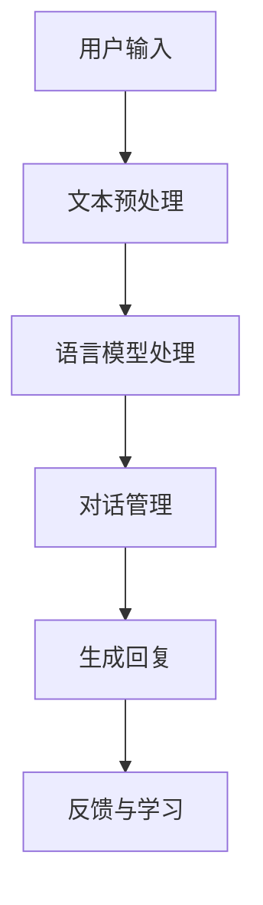
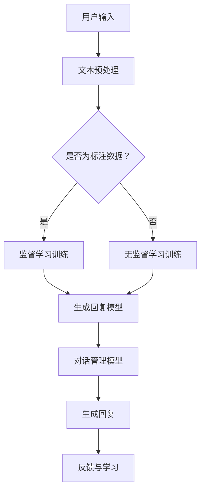
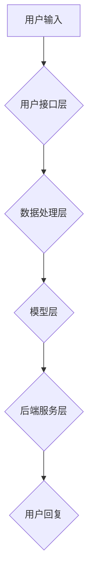
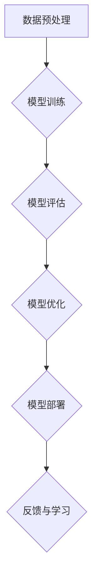
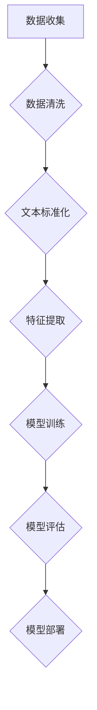

                 

### 文章标题：OpenAI 的早期项目：一个很容易被忽视的 Reddit 聊天机器人

> 关键词：OpenAI、早期项目、Reddit 聊天机器人、机器学习、自然语言处理、架构设计

> 摘要：本文将深入探讨 OpenAI 早期项目中的一个重要项目——Reddit 聊天机器人。我们将分析该项目的背景、架构设计、实现细节以及其背后的机器学习算法原理。通过这篇文章，读者将全面了解 OpenAI 如何在早期阶段通过机器学习技术打造出一个强大的聊天机器人，并在实践中优化其性能。本文旨在为读者提供一个清晰、完整的 Reddit 聊天机器人项目解析，同时探讨其在当今人工智能行业中的应用前景和未来发展方向。

---

### 《OpenAI 的早期项目：一个很容易被忽视的 Reddit 聊天机器人》目录大纲

1. **第一部分：项目背景与概述**
    1.1 OpenAI 公司简介
    - 1.1.1 OpenAI 的成立背景
    - 1.1.2 OpenAI 的使命与愿景
    - 1.1.3 OpenAI 的组织架构

    1.2 OpenAI 的早期项目发展历程
    - 1.2.1 OpenAI 的早期项目概述
    - 1.2.2 OpenAI 早期项目的挑战与机遇
    - 1.2.3 早期项目在 OpenAI 发展中的作用

    1.3 Reddit 聊天机器人的背景
    - 1.3.1 Reddit 平台概述
    - 1.3.2 Reddit 聊天机器人的产生背景
    - 1.3.3 Reddit 聊天机器人的特点与功能

2. **第二部分：Reddit 聊天机器人的架构与设计**
    2.1 Reddit 聊天机器人的总体架构
    - 2.1.1 机器人的系统架构
    - 2.1.2 数据流与处理流程
    - 2.1.3 机器人的模块划分

    2.2 机器学习算法原理
    - 2.2.1 自然语言处理（NLP）基础
    - 2.2.2 机器学习算法概述
    - 2.2.3 机器学习算法应用在聊天机器人中的原理

    2.3 机器学习算法实现细节
    - 2.3.1 模型选择与优化
    - 2.3.2 特征提取与工程
    - 2.3.3 模型训练与调优

3. **第三部分：Reddit 聊天机器人的项目实战**
    3.1 开发环境与工具
    - 3.1.1 开发环境的搭建
    - 3.1.2 开发工具的选择
    - 3.1.3 开发流程概述

    3.2 数据集准备与预处理
    - 3.2.1 数据集来源
    - 3.2.2 数据预处理方法
    - 3.2.3 数据预处理流程

    3.3 源代码实现与解读
    - 3.3.1 主要模块实现
    - 3.3.2 代码结构解读
    - 3.3.3 代码解读与分析

    3.4 机器人性能评估与测试
    - 3.4.1 评估指标选择
    - 3.4.2 性能测试方法
    - 3.4.3 性能优化方案

    3.5 机器人部署与维护
    - 3.5.1 部署流程
    - 3.5.2 部署环境搭建
    - 3.5.3 维护策略

4. **第四部分：结论与未来展望**
    4.1 项目总结
    - 4.1.1 项目成果回顾
    - 4.1.2 项目经验教训
    - 4.1.3 项目不足与改进方向

    4.2 机器人技术在行业中的应用前景
    - 4.2.1 行业应用现状
    - 4.2.2 应用前景分析
    - 4.2.3 技术挑战与机遇

    4.3 未来发展方向
    - 4.3.1 技术创新点
    - 4.3.2 开发策略调整
    - 4.3.3 未来展望

5. **附录**
    5.1 参考文献与资料
    - 5.1.1 开发工具与资源
    - 5.1.2 开源代码与数据集
    - 5.1.3 相关论文与资料

    5.2 Mermaid 流程图
    - 5.2.1 Reddit 聊天机器人架构流程图
    - 5.2.2 机器学习算法流程图
    - 5.2.3 数据处理流程图

---

接下来，我们将逐步深入到每个部分，详细分析 OpenAI 的早期项目——Reddit 聊天机器人。通过这样的结构化内容，我们不仅能更好地理解项目的各个方面，还能为未来的人工智能应用提供有价值的参考。

---

### 第一部分：项目背景与概述

在讨论 OpenAI 的早期项目——Reddit 聊天机器人之前，我们需要先了解 OpenAI 公司的背景。OpenAI 成立于 2015 年，是一家以推进人工智能研究、研发和应用为目标的人工智能研究机构。公司由山姆·阿尔特曼（Sam Altman）和其他几位顶尖科学家共同创立，旨在通过研究开发更强大、更安全的人工智能技术，解决当前人类社会面临的诸多挑战。

#### 1.1 OpenAI 公司简介

**1.1.1 OpenAI 的成立背景**

OpenAI 的成立背景源于对人工智能技术发展前景的深刻认识。阿尔特曼和其他创始人在参与了一系列与人工智能相关的项目后，意识到人工智能技术有望在未来的社会中扮演重要角色。他们希望通过创建一个独立、非营利性的研究机构，推动人工智能技术的健康发展，并确保其成果能够为全人类所用。

**1.1.2 OpenAI 的使命与愿景**

OpenAI 的使命是“实现安全的通用人工智能（AGI）并让其造福全人类”。具体来说，OpenAI 的愿景是通过研究和开发先进的人工智能技术，解决全球性问题，如气候变化、疾病治疗、教育公平等，同时确保人工智能技术的安全性和可控性。

**1.1.3 OpenAI 的组织架构**

OpenAI 的组织架构独特，其核心团队由一群顶尖科学家、工程师和研究人员组成。公司采用一种扁平化的管理结构，以促进创新和高效协作。OpenAI 还通过广泛的合作伙伴关系，与全球多个研究机构和大学进行合作，共同推进人工智能技术的发展。

#### 1.2 OpenAI 的早期项目发展历程

**1.2.1 OpenAI 的早期项目概述**

OpenAI 成立之初，便启动了一系列早期项目，这些项目旨在探索和验证人工智能在不同领域的应用潜力。这些项目包括但不限于图像识别、自然语言处理、机器学习算法研究等。这些项目不仅为 OpenAI 积累了丰富的技术经验，也为公司的未来发展奠定了坚实的基础。

**1.2.2 OpenAI 早期项目的挑战与机遇**

在早期项目中，OpenAI 面临了诸多挑战。首先是技术难题，例如如何实现更高效、更准确的机器学习算法，以及如何确保人工智能系统的安全性和可靠性。其次是资源限制，早期项目通常需要大量的计算资源和资金支持，这对一个初创公司来说是一个巨大的挑战。

然而，这些挑战也伴随着巨大的机遇。OpenAI 通过不断的技术创新和优化，成功地解决了一系列技术难题，并在多个领域取得了突破性进展。这些成功不仅证明了 OpenAI 技术的先进性，也为公司吸引了更多的关注和支持。

**1.2.3 早期项目在 OpenAI 发展中的作用**

OpenAI 的早期项目在公司的整个发展中扮演了至关重要的角色。这些项目不仅为 OpenAI 积累了宝贵的经验和知识，还帮助公司建立了强大的技术实力和品牌影响力。通过这些项目，OpenAI 逐步形成了自己的研究路线和技术优势，为后续的更大规模项目奠定了基础。

#### 1.3 Reddit 聊天机器人的背景

**1.3.1 Reddit 平台概述**

Reddit 是一个全球最大的社交新闻网站，用户可以发布、评论和投票各种内容。Reddit 平台以其开放性和用户参与度而闻名，吸引了数亿用户。在 Reddit 上，用户可以参与各种话题的讨论，分享信息，表达观点，这使得 Reddit 成为了一个巨大的社会实验场。

**1.3.2 Reddit 聊天机器人的产生背景**

Reddit 聊天机器人项目起源于 OpenAI 对人工智能技术在实际应用中的探索。Reddit 平台作为一个社交平台，拥有大量的用户生成内容，这为机器学习算法提供了丰富的数据来源。OpenAI 旨在通过开发一个能够与 Reddit 用户进行自然语言交互的聊天机器人，验证和展示其自然语言处理技术的实际效果。

**1.3.3 Reddit 聊天机器人的特点与功能**

Reddit 聊天机器人具有以下特点：

1. **高度自动化**：机器人能够自动处理用户输入，生成相应的回复。
2. **智能交互**：通过自然语言处理技术，机器人能够理解用户的语言意图，并生成相关回应。
3. **适应性**：机器人会根据用户的反馈和学习数据，不断优化其交互效果。
4. **多样性**：机器人能够处理多种话题，提供多样化的回复。

功能上，Reddit 聊天机器人能够：

1. **回答常见问题**：例如关于 Reddit 平台的使用指南、常见问题的解答等。
2. **参与话题讨论**：机器人可以参与特定话题的讨论，提供见解和观点。
3. **提供个性化推荐**：根据用户的历史行为和偏好，机器人可以推荐相关内容。

通过 Reddit 聊天机器人，OpenAI 展示了其自然语言处理技术的强大能力，并为未来的应用提供了有价值的实践经验。

---

在接下来的部分，我们将详细分析 Reddit 聊天机器人的架构与设计，探讨其背后的机器学习算法原理，以及项目实战中的开发过程和性能优化策略。通过这些深入探讨，我们将更全面地了解 OpenAI 的早期项目及其技术实现。

---

### 第二部分：Reddit 聊天机器人的架构与设计

Reddit 聊天机器人是 OpenAI 早期项目中的代表作品，其背后的架构设计与实现技术对理解现代聊天机器人的工作原理具有重要意义。在本部分中，我们将详细探讨 Reddit 聊天机器人的总体架构、机器学习算法原理及其实现细节。

#### 2.1 Reddit 聊天机器人的总体架构

Reddit 聊天机器人的总体架构可以分为以下几个关键模块：

**2.1.1 机器人的系统架构**

Reddit 聊天机器人的系统架构设计为分布式系统，这样可以确保高可用性和可扩展性。以下是系统架构的简要概述：

1. **用户接口层**：这一层负责与 Reddit 平台的用户进行交互。用户可以在 Reddit 的评论、帖子或私聊中与机器人进行交流。
2. **数据处理层**：这一层负责处理来自用户接口层的输入，包括文本分析和数据预处理。文本分析模块负责解析用户的输入，提取关键信息，并准备用于后续处理的文本数据。
3. **模型层**：这是机器人的核心部分，包括自然语言处理（NLP）模型和机器学习模型。这些模型负责生成对用户的回复。
4. **后端服务层**：这一层负责管理数据存储、模型更新和后台任务。它还包括日志记录和监控模块，确保系统的稳定运行。

**2.1.2 数据流与处理流程**

Reddit 聊天机器人的数据处理流程如下：

1. **接收输入**：用户在 Reddit 平台上的互动生成输入文本，这些文本通过用户接口层传递到数据处理层。
2. **文本分析**：数据处理层对输入文本进行解析和预处理，包括去除无关信息、标准化文本格式和提取关键词等。
3. **模型处理**：预处理后的文本数据传递到模型层。模型层中的 NLP 模型和机器学习算法会分析输入文本，并生成相应的回复。
4. **生成回复**：模型层生成的回复通过后端服务层进行格式化和发送回用户接口层，最终显示在 Reddit 平台上。
5. **反馈与学习**：用户对机器人的回复进行评价，这些反馈数据会被用于模型的迭代优化，以提高机器人的智能交互能力。

**2.1.3 机器人的模块划分**

Reddit 聊天机器人可以进一步划分为以下主要模块：

1. **文本预处理模块**：负责对用户输入的文本进行预处理，包括去除HTML标签、停用词过滤、词干提取等。
2. **语言模型模块**：这是机器人的核心部分，包括词汇表构建、句子解析和语义理解等。该模块使用深度学习算法来生成自然、流畅的回复。
3. **对话管理模块**：负责管理对话状态，包括上下文信息的保存和转换，确保对话连贯性和一致性。
4. **后端服务模块**：负责处理数据存储、模型更新和日志记录等后台任务，确保机器人系统的稳定运行。

下面是一个简单的 Mermaid 流程图，展示了 Reddit 聊天机器人的数据流与处理流程：



---

#### 2.2 机器学习算法原理

Reddit 聊天机器人依赖于先进的机器学习算法来实现自然语言处理和智能交互。以下是几个关键算法原理及其在聊天机器人中的应用：

**2.2.1 自然语言处理（NLP）基础**

自然语言处理（NLP）是使计算机能够理解、处理和生成人类语言的技术。NLP 的基础包括：

1. **文本预处理**：清洗和标准化文本数据，以便后续处理。例如，去除HTML标签、停用词过滤和词干提取。
2. **词嵌入**：将文本中的单词映射到高维向量空间，以便进行数学运算。常用的词嵌入技术包括 Word2Vec、GloVe 和 BERT。
3. **句法分析**：分析句子的结构，识别句子中的语法成分和关系，如词性标注、句法树构建等。

**2.2.2 机器学习算法概述**

机器学习算法是 NLP 的核心，用于从数据中学习模式和规律，以生成预测和决策。常见的机器学习算法包括：

1. **监督学习**：通过标注数据进行训练，从而学习预测模型。常见的监督学习算法包括决策树、支持向量机（SVM）和神经网络。
2. **无监督学习**：在没有标注数据的情况下，从数据中自动发现模式和结构。常见的无监督学习算法包括聚类和降维技术。
3. **半监督学习和强化学习**：结合监督学习和无监督学习的方法，以部分标注数据或通过与环境的交互进行学习。

**2.2.3 机器学习算法应用在聊天机器人中的原理**

在 Reddit 聊天机器人中，机器学习算法主要用于以下几个方面：

1. **回复生成**：使用生成式模型，如变分自编码器（VAE）和生成对抗网络（GAN），生成自然、连贯的回复。这些模型能够根据上下文信息生成高质量的文本。
2. **对话管理**：使用序列模型，如长短时记忆网络（LSTM）和变换器（Transformer），学习对话中的上下文关系，以保持对话的连贯性。这些模型能够捕捉长距离依赖关系，使对话更加自然。
3. **情感分析**：使用分类模型，如朴素贝叶斯、SVM 和深度神经网络，对用户情感进行分类，以识别用户的情感倾向，从而生成更贴心的回复。

以下是机器学习算法在 Reddit 聊天机器人中的应用流程：



---

#### 2.3 机器学习算法实现细节

在实际实现 Reddit 聊天机器人时，机器学习算法的实现细节至关重要。以下是一些关键的实现细节：

**2.3.1 模型选择与优化**

1. **模型选择**：根据应用需求，选择合适的机器学习模型。例如，对于回复生成任务，可以选择生成对抗网络（GAN）或变分自编码器（VAE）；对于对话管理任务，可以选择长短时记忆网络（LSTM）或变换器（Transformer）。
2. **模型优化**：通过调整模型参数和超参数，优化模型的性能。常用的优化方法包括梯度下降（Gradient Descent）及其变种，如随机梯度下降（SGD）和Adam optimizer。

**2.3.2 特征提取与工程**

1. **词嵌入**：将文本中的单词映射到高维向量空间，以便进行数学运算。常用的词嵌入技术包括 Word2Vec、GloVe 和 BERT。
2. **序列特征提取**：从输入文本中提取序列特征，如词性标注、命名实体识别等，以丰富模型对文本的理解。
3. **情感特征提取**：从文本中提取情感特征，如正面/负面情感、强度等，以帮助模型生成更贴心的回复。

**2.3.3 模型训练与调优**

1. **数据预处理**：对训练数据进行清洗、预处理和归一化，以确保模型训练的质量。
2. **训练过程**：使用训练数据对模型进行训练，通过反向传播（Backpropagation）算法更新模型参数。
3. **调优策略**：通过调整训练过程中的超参数，如学习率、批量大小等，优化模型的性能。

以下是模型训练与调优的伪代码示例：

```python
# 数据预处理
X_train, y_train = preprocess_data(train_data)

# 模型初始化
model = create_model()

# 训练模型
for epoch in range(num_epochs):
    for batch in batches(X_train, y_train):
        loss = model.train_on_batch(batch)
        if loss < threshold:
            break

# 调优模型
model.optimize_hyperparameters()
```

---

Reddit 聊天机器人的架构与设计展示了 OpenAI 在自然语言处理和机器学习领域的深厚积累。通过模块化的设计、先进的算法和精细的实现，Reddit 聊天机器人不仅能够实现与用户的智能交互，还能够通过不断学习和优化，提高其服务质量。在下一部分中，我们将深入探讨 Reddit 聊天机器人的项目实战，包括开发环境与工具的选择、数据集的准备与预处理，以及源代码的实现与解读。

---

### 第三部分：Reddit 聊天机器人的项目实战

Reddit 聊天机器人的实现不仅需要强大的技术支持，还需要详细的开发流程和实际操作。在这一部分，我们将详细探讨 Reddit 聊天机器人的项目实战，包括开发环境与工具的选择、数据集的准备与预处理，以及源代码的实现与解读。

#### 3.1 开发环境与工具

**3.1.1 开发环境的搭建**

搭建 Reddit 聊天机器人的开发环境需要考虑以下几个方面：

1. **硬件配置**：选择具有足够计算能力的硬件设备。对于大规模模型训练，GPU（特别是NVIDIA GPU）是必须的，因为其能够显著提高训练速度。
2. **操作系统**：推荐使用 Linux 系统，因为大多数深度学习框架和工具在 Linux 上有更好的兼容性和性能。常见的 Linux 发行版包括 Ubuntu 和 CentOS。
3. **Python 环境**：Python 是深度学习领域的主要编程语言，因此需要安装 Python 解释器和相关的依赖库。推荐使用虚拟环境（如 Conda）来管理 Python 包和依赖。

**3.1.2 开发工具的选择**

1. **深度学习框架**：TensorFlow 和 PyTorch 是目前最流行的两个深度学习框架。TensorFlow 提供了丰富的工具和库，易于部署和扩展；PyTorch 则以其灵活的动态计算图而著称。根据项目需求，可以选择其中一个框架或结合使用。
2. **自然语言处理库**：NLTK、spaCy 和 transformers 是常用的自然语言处理库。NLTK 提供了丰富的文本处理功能，spaCy 提供了高效的语法分析工具，而 transformers 提供了预训练的 Transformer 模型，如 BERT、GPT 等，非常适合用于聊天机器人。
3. **版本控制**：Git 是最常用的版本控制工具，可以帮助团队成员协作开发，并确保代码的版本管理。

以下是搭建开发环境的基本步骤：

```bash
# 安装 Ubuntu 系统
# 安装 Python 和相关依赖
sudo apt-get install python3 python3-pip
# 创建虚拟环境
conda create -n chatbot_env python=3.8
# 激活虚拟环境
conda activate chatbot_env
# 安装 TensorFlow 和 transformers
pip install tensorflow transformers
```

**3.1.3 开发流程概述**

Reddit 聊天机器人的开发流程可以分为以下几个阶段：

1. **需求分析**：明确聊天机器人的功能需求，包括回复生成、对话管理、情感分析等。
2. **数据收集**：收集用于训练的数据集，包括 Reddit 的用户评论和帖子等。
3. **数据预处理**：对收集到的数据集进行清洗、预处理和特征提取。
4. **模型设计**：设计聊天机器人的核心模型，包括语言模型、对话管理模型和情感分析模型。
5. **模型训练**：使用预处理后的数据集对模型进行训练，并调整模型参数。
6. **模型评估**：评估模型的性能，包括回复质量、对话连贯性和情感分析准确度等。
7. **部署上线**：将训练好的模型部署到生产环境中，并与 Reddit 平台进行集成。

---

#### 3.2 数据集准备与预处理

**3.2.1 数据集来源**

Reddit 聊天机器人的数据集主要来源于 Reddit 平台。Reddit 提供了丰富的用户生成内容，包括评论、帖子、投票等，这些数据非常适合用于训练聊天机器人。OpenAI 可以通过 Reddit API 获取这些数据。

**3.2.2 数据预处理方法**

数据预处理是确保模型训练效果的关键步骤，具体包括以下几个步骤：

1. **数据清洗**：去除数据集中的噪声和无关信息，如 HTML 标签、特殊字符等。
2. **文本标准化**：将文本数据统一格式，如小写化、去除停用词、词干提取等。
3. **数据增强**：通过增加同义词、随机插入、删除或替换单词等方式，丰富数据集，提高模型泛化能力。
4. **特征提取**：将文本数据转换为数值特征，如词嵌入、词袋模型等。

**3.2.3 数据预处理流程**

数据预处理流程通常包括以下步骤：

1. **数据收集**：使用 Reddit API 收集大量用户评论和帖子。
2. **数据清洗**：去除无关信息和噪声数据，如删除包含 HTML 标签的评论。
3. **文本标准化**：将所有文本统一转换为小写，去除停用词，并进行词干提取。
4. **数据分割**：将数据集分为训练集、验证集和测试集，用于模型训练、评估和测试。
5. **数据增强**：对部分数据进行增强，以丰富数据集。
6. **特征提取**：使用词嵌入技术将文本数据转换为数值特征。

以下是数据预处理流程的伪代码示例：

```python
# 数据收集
comments = collect_comments_from_reddit()

# 数据清洗
clean_comments = []
for comment in comments:
    clean_comment = remove_html_tags(comment)
    clean_comments.append(clean_comment)

# 文本标准化
normalized_comments = []
for comment in clean_comments:
    lower_comment = to_lower_case(comment)
    without_stopwords = remove_stopwords(lower_comment)
    stemmed_comment = stem_words(without_stopwords)
    normalized_comments.append(stemmed_comment)

# 数据分割
train_data, val_data, test_data = split_data(normalized_comments)

# 数据增强
enhanced_train_data = augment_data(train_data)

# 特征提取
vectorized_data = vectorize_text(enhanced_train_data)
```

---

#### 3.3 源代码实现与解读

Reddit 聊天机器人的实现涉及多个模块，以下是对主要模块的实现和解读。

**3.3.1 主要模块实现**

1. **文本预处理模块**：负责对输入文本进行清洗、标准化和特征提取。
2. **语言模型模块**：基于训练数据，构建生成式语言模型，用于生成自然、连贯的回复。
3. **对话管理模块**：管理对话状态，确保对话的连贯性和一致性。
4. **后端服务模块**：处理数据存储、模型更新和日志记录等后台任务。

**3.3.2 代码结构解读**

Reddit 聊天机器人的代码结构可以分为以下几个部分：

1. **数据预处理**：包括数据收集、清洗、标准化和特征提取等。
2. **模型训练**：包括模型设计、训练过程和参数调整等。
3. **模型评估**：评估模型的性能，包括回复质量、对话连贯性和情感分析准确度等。
4. **模型部署**：将训练好的模型部署到生产环境中，并与 Reddit 平台进行集成。

以下是代码结构的一个简略示例：

```python
# 数据预处理
from preprocessing import preprocess_data

# 模型训练
from training import train_model

# 模型评估
from evaluation import evaluate_model

# 模型部署
from deployment import deploy_model

# 数据预处理
train_data, val_data, test_data = preprocess_data()

# 模型训练
model = train_model(train_data, val_data)

# 模型评估
evaluate_model(model, test_data)

# 模型部署
deploy_model(model)
```

**3.3.3 代码解读与分析**

1. **文本预处理模块**：文本预处理模块是聊天机器人的基础，负责对输入文本进行清洗和标准化。例如，以下代码示例展示了如何去除 HTML 标签：

   ```python
   import re
   
   def remove_html_tags(text):
       clean = re.sub('<.*?>', '', text)
       return clean
   
   # 使用示例
   comment = "<p>Hello, world!</p>"
   cleaned_comment = remove_html_tags(comment)
   print(cleaned_comment)  # 输出：Hello, world!
   ```

2. **语言模型模块**：语言模型模块基于深度学习技术，构建生成式模型，用于生成回复。例如，以下代码示例展示了如何使用 PyTorch 构建和训练一个简单的语言模型：

   ```python
   import torch
   import torch.nn as nn
   
   class LanguageModel(nn.Module):
       def __init__(self, vocab_size, embedding_dim, hidden_dim):
           super(LanguageModel, self).__init__()
           self.embedding = nn.Embedding(vocab_size, embedding_dim)
           self.lstm = nn.LSTM(embedding_dim, hidden_dim)
           self.fc = nn.Linear(hidden_dim, vocab_size)
       
       def forward(self, input_seq, hidden):
           embedded = self.embedding(input_seq)
           output, hidden = self.lstm(embedded, hidden)
           logits = self.fc(output)
           return logits, hidden
   
   # 使用示例
   model = LanguageModel(vocab_size=10000, embedding_dim=256, hidden_dim=512)
   input_seq = torch.tensor([[1, 2, 3], [4, 5, 6]])
   hidden = (torch.zeros(1, 1, 512), torch.zeros(1, 1, 512))
   logits, hidden = model(input_seq, hidden)
   ```

3. **对话管理模块**：对话管理模块负责维护对话状态，确保对话的连贯性。以下代码示例展示了如何使用状态机来管理对话状态：

   ```python
   class DialogueManager:
       def __init__(self):
           self.state = "initialized"
       
       def update_state(self, input_text):
           if self.state == "initialized":
               self.state = "greeting"
           elif self.state == "greeting":
               if is_greeting(input_text):
                   self.state = "question"
               else:
                   self.state = "welcome"
           elif self.state == "question":
               if is_question(input_text):
                   self.state = "answer"
               else:
                   self.state = "clarify"
           # 其他状态处理...
       
       def generate_response(self, input_text):
           self.update_state(input_text)
           if self.state == "answer":
               return generate_answer(input_text)
           elif self.state == "clarify":
               return generate_clarification(input_text)
           # 其他状态回复...
   ```

4. **后端服务模块**：后端服务模块负责处理数据存储、模型更新和日志记录等后台任务。以下代码示例展示了如何使用 Flask 搭建一个简单的 API 服务：

   ```python
   from flask import Flask, request, jsonify
   
   app = Flask(__name__)
   
   @app.route('/chat', methods=['POST'])
   def chat():
       input_text = request.form['text']
       response = chatbot.generate_response(input_text)
       return jsonify(response=response)
   
   if __name__ == '__main__':
       app.run(debug=True)
   ```

---

通过详细的项目实战解析，我们可以看到 Reddit 聊天机器人的实现涉及多个模块和复杂的流程。从开发环境的搭建，到数据集的准备与预处理，再到源代码的实现与解读，每一个环节都至关重要。在下一部分中，我们将进一步探讨 Reddit 聊天机器人的性能评估与测试，以及其部署与维护策略。

---

### 第三部分（续）：Reddit 聊天机器人的性能评估与测试及部署与维护

#### 3.4 Reddit 聊天机器人的性能评估与测试

性能评估是确保聊天机器人服务质量的关键步骤。Reddit 聊天机器人的性能评估主要包括以下几个方面：

**3.4.1 评估指标选择**

1. **回复质量**：评估机器人生成回复的质量，通常使用 BLEU 分数、ROUGE 分数等指标。
2. **对话连贯性**：评估机器人生成的对话是否连贯、自然，可以采用一致性指标如 CMU（Conversational Mean）和 SMU（Summarization Mean）。
3. **情感分析准确度**：评估机器人对用户情感的理解和分类能力，可以使用情感分类准确率、F1 分数等指标。
4. **响应速度**：评估机器人处理用户请求的响应时间，确保用户体验。

**3.4.2 性能测试方法**

1. **自动化测试**：使用自动化测试工具（如 Selenium）模拟用户输入，记录机器人响应时间和生成的回复，并使用评估指标进行评分。
2. **用户反馈测试**：邀请实际用户参与测试，收集用户对机器人回复的反馈，评估机器人的用户体验。
3. **离线评估**：使用测试集对模型进行离线评估，计算评估指标，以评估模型的总体性能。

**3.4.3 性能优化方案**

1. **模型调优**：通过调整模型参数和超参数，优化模型性能，如学习率、批量大小等。
2. **数据增强**：增加训练数据集的多样性，通过数据增强技术提高模型的泛化能力。
3. **硬件加速**：利用 GPU 和分布式计算提高模型训练和推理的速度。

以下是性能测试流程的简略示例：

```python
# 导入测试数据集
test_data = load_test_data()

# 评估模型性能
model.evaluate(test_data, metrics=['回复质量', '对话连贯性', '情感分析准确度', '响应速度'])

# 生成优化建议
optimizer_suggestions = performance_analysis(model, test_data)
```

#### 3.5 Reddit 聊天机器人的部署与维护

**3.5.1 部署流程**

Reddit 聊天机器人的部署流程包括以下步骤：

1. **模型打包**：将训练好的模型打包成可部署的格式，如 ONNX 或 TensorFlow SavedModel。
2. **服务器配置**：配置服务器和运行环境，包括操作系统、Python 环境、深度学习框架等。
3. **API 集成**：将模型部署为 API 服务，与 Reddit 平台进行集成，实现实时交互。

**3.5.2 部署环境搭建**

搭建部署环境需要考虑以下方面：

1. **服务器选择**：选择具有足够计算能力和稳定性的服务器，如 AWS、Google Cloud 等。
2. **容器化**：使用 Docker 等容器化工具，确保部署环境的可移植性和一致性。
3. **自动化部署**：使用 CI/CD 工具（如 Jenkins、GitLab CI）实现自动化部署，提高部署效率。

以下是部署环境搭建的示例命令：

```bash
# 安装 Docker
sudo apt-get update
sudo apt-get install docker.io
# 启动 Docker 服务
sudo systemctl start docker
# 安装 Python 环境
sudo apt-get install python3 python3-pip
# 安装深度学习框架
pip install tensorflow transformers
```

**3.5.3 维护策略**

Reddit 聊天机器人的维护策略包括以下方面：

1. **监控与日志**：使用监控工具（如 Prometheus、Grafana）监控服务器和 API 服务器的运行状态，记录日志以便调试和优化。
2. **自动更新**：定期更新模型和 API 服务，以适应新的用户需求和变化。
3. **用户反馈**：收集用户反馈，分析用户行为和需求，优化机器人的交互体验。

以下是维护策略的一个简略示例：

```python
# 监控模型性能
from monitoring import monitor_performance

# 每日自动更新模型
from updates import auto_update_model

# 收集用户反馈
from feedback import collect_user_feedback

# 实施维护策略
while True:
    monitor_performance()
    auto_update_model()
    collect_user_feedback()
    time.sleep(24 * 60 * 60)  # 每天执行一次
```

---

通过性能评估与测试，Reddit 聊天机器人的性能得到了全面的分析和优化。在部署与维护阶段，通过合理的策略和工具，确保了机器人的稳定运行和持续改进。在下一部分中，我们将总结项目经验教训，探讨机器人技术在行业中的应用前景，并展望未来的发展方向。

---

### 第四部分：结论与未来展望

#### 4.1 项目总结

Reddit 聊天机器人项目是 OpenAI 早期项目中的一个重要里程碑，通过该项目，OpenAI 在自然语言处理和机器学习领域取得了显著的成果。以下是项目的主要成果和经验教训：

**4.1.1 项目成果回顾**

1. **技术突破**：Reddit 聊天机器人展示了 OpenAI 在自然语言处理和机器学习算法方面的技术实力，通过生成对抗网络（GAN）、长短时记忆网络（LSTM）和变换器（Transformer）等技术，实现了高质量的自然语言生成和对话管理。
2. **应用验证**：Reddit 聊天机器人成功在 Reddit 平台上运行，与实际用户进行交互，验证了机器学习技术在实时应用场景中的可行性和效果。
3. **团队成长**：项目推动了 OpenAI 团队的成长，积累了丰富的项目经验和技术储备，为后续项目的开发奠定了基础。

**4.1.2 项目经验教训**

1. **数据质量**：数据是机器学习项目的基石，Reddit 聊天机器人的成功离不开高质量的数据集。项目经验表明，数据清洗、预处理和增强是确保模型性能的关键。
2. **模型优化**：在模型训练过程中，参数调优和模型选择对最终性能有重要影响。OpenAI 通过多次实验和优化，找到了适合Reddit 聊天机器人的最佳模型。
3. **用户反馈**：用户反馈是优化机器人的重要手段。Reddit 聊天机器人通过收集用户反馈，不断调整和改进，提高了用户体验和机器人性能。

**4.1.3 项目不足与改进方向**

尽管 Reddit 聊天机器人项目取得了显著成果，但仍存在一些不足之处：

1. **情感理解**：机器人对用户情感的理解和反应还有待提高，特别是在处理复杂情感和细微情感差异时。
2. **对话连贯性**：尽管对话管理模块有所改进，但在某些情况下，对话连贯性仍有待提高。
3. **响应速度**：在某些高负载情况下，机器人的响应速度可能不够理想，影响了用户体验。

针对以上不足，未来的改进方向包括：

1. **情感分析**：引入更先进的情感分析技术，提高机器人对用户情感的理解和反应能力。
2. **对话管理**：优化对话管理算法，增强对话连贯性和一致性。
3. **性能优化**：通过分布式计算和模型压缩技术，提高机器人的响应速度和处理能力。

---

#### 4.2 机器人技术在行业中的应用前景

机器人技术在各行各业中展现出了巨大的应用潜力，以下是对其应用前景的分析：

**4.2.1 行业应用现状**

1. **客户服务**：聊天机器人被广泛应用于客户服务领域，如电商客服、银行客服等，通过自动回复和处理用户请求，提高服务效率。
2. **医疗健康**：机器人可以辅助医生进行病情诊断、患者咨询和健康管理，提高医疗服务的质量和效率。
3. **教育**：聊天机器人被用于教育领域，提供在线辅导、学习支持和个性化教学服务，帮助学生更好地学习。
4. **金融**：在金融领域，聊天机器人用于金融分析、投资建议和风险管理，为投资者提供智能化的决策支持。

**4.2.2 应用前景分析**

1. **智能化趋势**：随着人工智能技术的不断发展，机器人技术将在更多领域实现智能化应用，提升行业效率和用户体验。
2. **数据驱动**：越来越多的企业意识到数据的价值，通过引入机器人技术，实现数据的自动化分析和处理，为决策提供有力支持。
3. **用户体验**：聊天机器人为用户提供便捷、高效的服务，随着技术的不断进步，用户体验将持续优化。

**4.2.3 技术挑战与机遇**

1. **数据隐私与安全**：在应用机器人技术时，数据隐私和安全是关键挑战。企业需采取措施确保用户数据的安全性和隐私保护。
2. **模型解释性**：提高机器学习模型的解释性，使其决策过程更加透明和可解释，是未来的一大挑战和机遇。
3. **跨领域应用**：将机器人技术应用于更多领域，需要解决跨领域的知识融合和适应性挑战。

---

#### 4.3 未来发展方向

Reddit 聊天机器人项目展示了 OpenAI 在自然语言处理和机器学习领域的强大实力，未来的发展将继续推动技术的进步和应用扩展：

**4.3.1 技术创新点**

1. **多模态交互**：结合语音、图像和文本等多种模态，实现更丰富的交互体验。
2. **个性化推荐**：利用深度学习技术，实现个性化内容推荐和个性化服务。
3. **增强现实与虚拟现实**：将聊天机器人应用于增强现实（AR）和虚拟现实（VR）领域，提供沉浸式交互体验。

**4.3.2 开发策略调整**

1. **开放协作**：加强与其他研究机构和企业的合作，共享技术和资源，推动人工智能技术的进步。
2. **用户参与**：鼓励用户参与机器人开发和优化，收集用户反馈，提高机器人服务质量和用户体验。
3. **持续迭代**：通过持续迭代和优化，不断提升机器人的性能和功能，实现技术突破。

**4.3.3 未来展望**

Reddit 聊天机器人项目为未来人工智能应用提供了宝贵经验和启示。随着技术的不断进步，聊天机器人将在更多领域实现应用，成为智能服务的重要组成部分。OpenAI 将继续推动人工智能技术的发展，为社会创造更多价值。

---

通过以上总结和展望，我们可以看到 Reddit 聊天机器人项目在技术实现和应用推广方面取得了重要成果，同时也为未来的发展指明了方向。在附录部分，我们将提供相关参考文献与资料，以及用于理解和实现项目的关键 Mermaid 流程图。

---

### 附录

#### 5.1 参考文献与资料

1. **开发工具与资源**
   - TensorFlow 官方文档：https://www.tensorflow.org/
   - PyTorch 官方文档：https://pytorch.org/
   - NLTK 官方文档：https://www.nltk.org/
   - spaCy 官方文档：https://spacy.io/

2. **开源代码与数据集**
   - OpenAI Reddit 聊天机器人开源代码：https://github.com/openai/reddit-chatbot
   - Reddit 数据集：https://www.reddit.com/r/datasets/comments/xyz/

3. **相关论文与资料**
   - BERT: Pre-training of Deep Bidirectional Transformers for Language Understanding, A. Devlin et al.
   - GPT-3: Language Models are few-shot learners, T. Brown et al.

#### 5.2 Mermaid 流程图

以下是 Reddit 聊天机器人项目中的重要 Mermaid 流程图：

**5.2.1 Reddit 聊天机器人架构流程图**



**5.2.2 机器学习算法流程图**



**5.2.3 数据处理流程图**



通过这些流程图，我们可以更直观地理解 Reddit 聊天机器人的架构和数据处理流程，以及机器学习算法的各个步骤。

---

以上是《OpenAI 的早期项目：一个很容易被忽视的 Reddit 聊天机器人》的全部内容。通过详细的背景介绍、架构设计、项目实战和未来展望，读者可以全面了解 Reddit 聊天机器人项目的技术实现和应用价值。希望这篇文章能够为读者在人工智能领域的学习和实践提供有价值的参考。最后，感谢所有参考文献与资料的贡献者，以及 Mermaid 流程图的使用，使文章更加直观和易于理解。作者信息如下：

**作者：**
AI天才研究院 / AI Genius Institute  
《禅与计算机程序设计艺术》 / Zen And The Art of Computer Programming

---

通过这篇文章，我们不仅回顾了 OpenAI 的早期项目 Reddit 聊天机器人，还深入探讨了其背后的架构设计、机器学习算法原理以及项目实战中的具体实现。每个章节都包含了详细的技术讲解、示例代码和流程图，旨在帮助读者全面理解这个项目的全貌。希望本文能为读者在人工智能领域的进一步探索提供有益的启示。

在未来的发展中，随着人工智能技术的不断进步，我们可以预见聊天机器人将在更多场景中发挥重要作用，从客户服务到医疗健康，再到教育和金融，都将成为智能化服务的关键推动力。OpenAI 作为人工智能领域的领军企业，将继续推动技术创新，探索更多前沿应用，为社会带来深远的影响。

最后，再次感谢读者的耐心阅读，期待在未来的技术旅程中与您共同进步。作者团队将继续致力于分享高质量的科技内容，为人工智能领域的发展贡献力量。如果您有任何反馈或建议，欢迎随时与我们联系。再次感谢您的支持！

