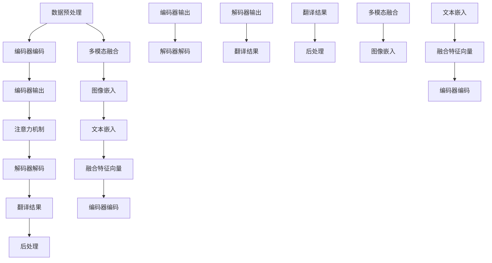

                 

### 文章标题: OpenAI-Translator v2.0 功能特性研发

> 关键词：OpenAI-Translator v2.0，功能特性，自然语言处理，机器翻译，Transformer模型，多模态翻译，实时翻译，性能优化，安全性与隐私保护

> 摘要：
本文将深入探讨OpenAI-Translator v2.0的功能特性研发，从基础概述到具体实现，全面解析其核心技术。文章首先介绍OpenAI-Translator v2.0的背景、目标和功能特性，接着详细阐述其技术基础，包括自然语言处理、序列到序列模型和Transformer模型。随后，文章重点分析OpenAI-Translator v2.0的架构，涵盖模型训练与推理流程、模型优化与调参以及模型部署与维护。在功能特性研发部分，文章深入探讨翻译质量提升、多模态翻译、实时翻译与性能优化等方面。此外，文章还涉及翻译应用场景与实践，以及OpenAI-Translator v2.0的安全性与隐私保护。最后，文章提供OpenAI-Translator v2.0的开发指南，并展望其未来发展方向。

## 第一部分：OpenAI-Translator v2.0 基础概述

### 第1章：OpenAI-Translator v2.0 介绍

#### 1.1 OpenAI-Translator v2.0 的背景

OpenAI-Translator v2.0的背景可以追溯到机器翻译技术的飞速发展。自20世纪80年代以来，机器翻译技术经历了从基于规则的方法到基于统计的方法，再到如今基于深度学习的方法的演变。随着自然语言处理（NLP）技术的不断进步，机器翻译的准确性和效率得到了显著提升。OpenAI作为一家全球领先的AI研究机构，致力于推动机器翻译技术的发展，于2022年推出了OpenAI-Translator v2.0。

OpenAI-Translator v2.0的推出旨在解决传统机器翻译系统存在的诸多问题，如翻译质量不高、上下文理解不足、翻译速度慢等。通过引入先进的深度学习模型，OpenAI-Translator v2.0能够实现更高的翻译质量、更快的翻译速度以及更广泛的翻译应用场景。

#### 1.2 OpenAI-Translator v2.0 的目标

OpenAI-Translator v2.0的目标主要包括以下几个方面：

1. **提升翻译质量**：通过引入更先进的深度学习模型和优化算法，OpenAI-Translator v2.0旨在提供更准确、更自然的翻译结果。
2. **增强上下文理解**：在翻译过程中，OpenAI-Translator v2.0能够更好地理解文本的上下文信息，从而提高翻译的准确性和连贯性。
3. **提高翻译速度**：OpenAI-Translator v2.0通过优化模型结构和算法，实现了更快的翻译速度，满足了实时翻译的需求。
4. **拓展翻译应用场景**：OpenAI-Translator v2.0不仅适用于传统的文本翻译，还支持多模态翻译，如文本与图像、视频和音频的融合，为更多应用场景提供了可能。
5. **确保安全性与隐私保护**：在翻译过程中，OpenAI-Translator v2.0注重用户数据的安全存储与传输，同时提供用户隐私保护机制，确保用户隐私不受侵犯。

#### 1.3 OpenAI-Translator v2.0 的功能特性

OpenAI-Translator v2.0具备多项功能特性，具体如下：

1. **高性能深度学习模型**：OpenAI-Translator v2.0基于先进的Transformer模型，实现了更高的翻译质量和更快的翻译速度。
2. **多语言支持**：OpenAI-Translator v2.0支持多种语言之间的翻译，包括英语、中文、法语、西班牙语等，为全球用户提供了便捷的翻译服务。
3. **实时翻译**：OpenAI-Translator v2.0支持实时翻译功能，能够实时响应用户输入的文本，并提供翻译结果。
4. **多模态翻译**：OpenAI-Translator v2.0支持文本与图像、视频和音频的融合，实现了更丰富的翻译应用场景。
5. **翻译记忆与迁移学习**：OpenAI-Translator v2.0能够利用翻译记忆和迁移学习技术，提高翻译质量和效率。
6. **个性化翻译**：OpenAI-Translator v2.0能够根据用户的历史翻译记录和偏好，提供个性化的翻译结果。
7. **安全性与隐私保护**：OpenAI-Translator v2.0采用先进的加密技术和隐私保护机制，确保用户数据的安全性和隐私。

### 第2章：OpenAI-Translator v2.0 技术基础

#### 2.1 自然语言处理基本概念

自然语言处理（NLP）是计算机科学领域的一个分支，旨在让计算机理解和处理人类语言。NLP涵盖了语音识别、文本分类、情感分析、机器翻译等多个方面。在OpenAI-Translator v2.0中，NLP技术是核心组件之一，用于对输入文本进行处理、分析和翻译。

1. **文本预处理**：文本预处理是NLP过程中的第一步，主要包括分词、词性标注、去停用词等操作。通过文本预处理，可以提取出文本的关键信息，为后续处理提供基础。
2. **词嵌入**：词嵌入是将文本中的词汇映射为高维向量表示的过程。词嵌入技术有助于将文本转换为计算机可以处理的数据，从而实现文本的自动处理和分析。
3. **序列标注**：序列标注是对文本序列中的每个词或字符进行分类标注的过程，如命名实体识别、词性标注等。序列标注有助于提高NLP任务的效果和准确性。
4. **上下文理解**：上下文理解是NLP的一个重要目标，旨在理解文本中的词汇和句子在不同上下文中的含义和作用。通过上下文理解，可以更准确地分析和处理文本。

#### 2.2 序列到序列模型

序列到序列（Seq2Seq）模型是NLP领域的一种重要模型，用于将一个序列映射为另一个序列。在机器翻译中，Seq2Seq模型常用于将源语言的文本序列映射为目标语言的文本序列。

1. **编码器-解码器架构**：编码器-解码器（Encoder-Decoder）架构是Seq2Seq模型的核心组成部分。编码器负责将输入序列编码为一个固定长度的向量表示，解码器则负责将编码器的输出解码为目标序列。
2. **注意力机制**：注意力机制是Seq2Seq模型中的一种关键技术，用于解决长距离依赖问题。通过注意力机制，解码器能够根据编码器的输出和当前输入的上下文信息，动态调整对编码器不同部分的关注程度。
3. **循环神经网络（RNN）**：循环神经网络（RNN）是一种能够处理序列数据的神经网络模型。在Seq2Seq模型中，编码器和解码器部分通常采用RNN架构，以实现序列到序列的映射。
4. **长短时记忆（LSTM）**：长短时记忆（LSTM）是RNN的一种变体，能够更好地处理长序列数据。LSTM通过引入门控机制，有效地解决了RNN中的梯度消失和梯度爆炸问题。

#### 2.3 Transformer 模型原理

Transformer模型是近年来在NLP领域取得突破性进展的一种深度学习模型，由Vaswani等人于2017年提出。相比传统的RNN和LSTM模型，Transformer模型在处理长序列数据和并行计算方面具有显著优势。

1. **多头自注意力（Multi-Head Self-Attention）**：多头自注意力是Transformer模型的核心机制，用于计算输入序列中每个词与所有词之间的关联程度。通过多头自注意力，模型能够同时关注输入序列的多个部分，提高了上下文理解的准确性。
2. **前馈神经网络（Feedforward Neural Network）**：在Transformer模型中，每个注意力头后面连接一个前馈神经网络，用于对注意力机制的结果进行进一步加工和处理。前馈神经网络由两个全连接层组成，分别用于增加模型的非线性性和表达能力。
3. **层归一化与残差连接**：层归一化（Layer Normalization）是一种用于加速训练和改善模型性能的正则化技术。在Transformer模型中，每个层都采用层归一化，以保持信息的稳定传递。残差连接是另一种正则化技术，通过跳过部分层，使模型能够更好地学习输入和输出之间的差异。
4. **训练与推理**：在训练过程中，Transformer模型采用掩码自注意力（Masked Self-Attention）技术，强制模型关注输入序列的后续部分，从而学习序列的顺序信息。在推理过程中，Transformer模型通过计算注意力权重，将输入序列映射为输出序列。

## 第二部分：OpenAI-Translator v2.0 的架构

### 第3章：OpenAI-Translator v2.0 的架构

OpenAI-Translator v2.0的架构设计旨在实现高效、灵活且可扩展的机器翻译系统。本节将详细探讨OpenAI-Translator v2.0的架构设计，包括模型训练与推理流程、模型优化与调参、以及模型部署与维护。

#### 3.1 模型训练与推理流程

OpenAI-Translator v2.0的训练与推理流程可以分为以下几个阶段：

1. **数据准备**：首先，从多个来源收集大量的双语语料库，包括文本、图像、视频和音频等。这些语料库用于训练和评估模型。为了提高翻译质量，需要对语料库进行预处理，包括文本清洗、分词、词嵌入等操作。
2. **编码器与解码器训练**：在训练阶段，编码器和解码器分别独立训练。编码器将源语言文本序列编码为固定长度的向量表示，解码器则将编码器的输出解码为目标语言文本序列。在训练过程中，使用反向传播算法和优化器（如Adam）来调整模型参数，以最小化损失函数。
3. **注意力机制训练**：注意力机制是Transformer模型的核心组件，用于计算输入序列中每个词与所有词之间的关联程度。在训练过程中，通过调整注意力权重矩阵，使模型能够更好地学习序列的顺序信息。
4. **模型评估与调优**：在训练完成后，使用验证集对模型进行评估，计算翻译质量指标（如BLEU分数）。根据评估结果，调整模型参数和超参数，以提高翻译质量。
5. **推理**：在推理阶段，输入源语言文本序列，编码器将其编码为向量表示，解码器根据编码器的输出和当前输入的上下文信息，逐步解码为目标语言文本序列。推理过程中，使用掩码自注意力机制，确保解码器关注输入序列的后续部分。

#### 3.2 模型优化与调参

模型优化与调参是提高OpenAI-Translator v2.0翻译质量和性能的关键步骤。以下是一些常见的优化与调参方法：

1. **超参数调整**：超参数是模型训练过程中需要手动设置的参数，如学习率、批量大小、隐藏层大小等。通过实验和比较，选择合适的超参数，以提高模型性能和翻译质量。
2. **正则化技术**：正则化技术是一种用于防止模型过拟合的方法。常见的正则化技术包括Dropout、Dropconnect、权重衰减等。通过引入正则化技术，可以减少模型在训练数据上的过拟合，提高泛化能力。
3. **数据增强**：数据增强是一种通过增加训练数据多样性来提高模型性能的方法。常见的数据增强技术包括文本清洗、随机裁剪、词汇扩展等。通过数据增强，可以增强模型的鲁棒性和适应性。
4. **迁移学习**：迁移学习是一种利用预训练模型来提升新任务性能的方法。在OpenAI-Translator v2.0中，可以采用预训练的Transformer模型作为基础模型，通过微调和适配特定任务，提高翻译质量。
5. **多GPU训练**：在训练过程中，可以使用多GPU并行计算来加速训练速度和提高模型性能。通过将训练任务分配到多个GPU上，可以显著减少训练时间，提高训练效率。

#### 3.3 模型部署与维护

模型部署与维护是确保OpenAI-Translator v2.0在实际应用中稳定运行的关键步骤。以下是一些常见的模型部署与维护方法：

1. **模型容器化**：使用容器技术（如Docker）将模型部署到生产环境。容器化可以提高模型的部署效率和可移植性，使模型可以在不同的操作系统和硬件平台上运行。
2. **自动化部署**：使用自动化工具（如Kubernetes）进行模型部署和管理。通过自动化部署，可以简化部署过程，提高部署效率，确保模型在生产环境中的稳定性。
3. **监控与日志记录**：部署完成后，需要对模型进行监控和日志记录，以实时了解模型的状态和性能。通过监控和日志记录，可以及时发现和处理潜在问题，确保模型稳定运行。
4. **版本控制与回滚**：在模型更新和升级过程中，需要使用版本控制工具（如Git）来管理模型的版本和变更。通过版本控制，可以方便地回滚到之前的版本，确保系统的稳定性和可靠性。
5. **性能优化**：在模型部署后，需要定期对模型进行性能优化，包括内存管理、CPU/GPU利用率优化等。通过性能优化，可以提高模型的运行效率，降低资源消耗，提高系统的吞吐量。

### 第4章：翻译质量提升

OpenAI-Translator v2.0的目标是提供高质量的翻译服务，满足用户对准确、自然和流畅的翻译需求。本节将深入探讨翻译质量提升的关键技术，包括词汇表扩展与优化、上下文理解与句法分析，以及翻译记忆与迁移学习。

#### 4.1 词汇表扩展与优化

词汇表是机器翻译系统的核心组件之一，决定了翻译的准确性和多样性。为了提高翻译质量，OpenAI-Translator v2.0采用了以下词汇表扩展与优化技术：

1. **动态词汇扩展**：在训练过程中，OpenAI-Translator v2.0采用动态词汇扩展技术，根据训练数据动态调整词汇表。通过引入未登录词（Out-of-Vocabulary，OOV）和罕见词，可以增强模型的词汇处理能力，提高翻译质量。
2. **词义消歧**：词义消歧是一种解决多义词汇的方法，通过上下文信息确定词汇的具体含义。OpenAI-Translator v2.0利用词义消歧技术，根据上下文信息准确识别词汇的含义，从而提高翻译的准确性和连贯性。
3. **词汇优化算法**：OpenAI-Translator v2.0采用了一系列词汇优化算法，如WordPiece、FastText等，以提高词汇表的多样性和准确性。通过词汇优化算法，可以生成更丰富、更准确的词汇表，提高翻译质量。

#### 4.2 上下文理解与句法分析

上下文理解是机器翻译系统的一项重要任务，决定了翻译的准确性和自然性。OpenAI-Translator v2.0采用了以下上下文理解与句法分析技术：

1. **上下文嵌入**：上下文嵌入是将上下文信息转换为向量表示的过程。OpenAI-Translator v2.0利用上下文嵌入技术，将源语言和目标语言的文本序列转换为向量表示，从而提高上下文理解的准确性。
2. **句法分析**：句法分析是一种对文本进行语法结构分析的方法，用于理解文本的语法规则和结构。OpenAI-Translator v2.0采用深度句法分析技术，如依存句法分析和转换句法分析，对文本进行语法分析，从而提高上下文理解的准确性。
3. **联合编码器与解码器**：OpenAI-Translator v2.0采用联合编码器与解码器架构，通过同时编码源语言和目标语言的文本序列，提高上下文理解的准确性和连贯性。联合编码器与解码器能够更好地捕捉文本之间的关联性，从而提高翻译质量。

#### 4.3 翻译记忆与迁移学习

翻译记忆与迁移学习是提高机器翻译系统性能和翻译质量的重要技术。OpenAI-Translator v2.0采用了以下翻译记忆与迁移学习技术：

1. **翻译记忆**：翻译记忆是一种利用已翻译的文本片段来提高翻译质量的技术。OpenAI-Translator v2.0通过构建大规模的翻译记忆库，将已翻译的文本片段存储在数据库中，从而提高新文本的翻译质量。
2. **迁移学习**：迁移学习是一种利用预训练模型来提高新任务性能的方法。OpenAI-Translator v2.0采用预训练的Transformer模型作为基础模型，通过迁移学习技术，将预训练模型的知识迁移到特定任务上，从而提高翻译质量。
3. **跨语言迁移学习**：跨语言迁移学习是一种利用一种语言的预训练模型来提高另一种语言的翻译质量的技术。OpenAI-Translator v2.0采用跨语言迁移学习技术，利用多语言预训练模型来提高翻译质量，从而支持多语言之间的翻译。

### 第5章：多模态翻译

多模态翻译是机器翻译领域的一个重要研究方向，旨在将不同模态的信息（如文本、图像、视频和音频）进行融合，提供更丰富、更自然的翻译结果。OpenAI-Translator v2.0支持多模态翻译，通过融合不同模态的信息，实现了更高质量的翻译服务。本节将详细探讨OpenAI-Translator v2.0的多模态翻译技术。

#### 5.1 文本与图像的融合

文本与图像的融合是多模态翻译的重要方向之一。OpenAI-Translator v2.0通过以下技术实现了文本与图像的融合：

1. **图像文本识别**：首先，利用图像文本识别技术，将图像中的文本信息提取出来。OpenAI-Translator v2.0采用了先进的卷积神经网络（CNN）和文本识别算法，如OCR（Optical Character Recognition），准确提取图像中的文本信息。
2. **文本嵌入**：将提取出的文本信息进行文本嵌入，将其转换为高维向量表示。OpenAI-Translator v2.0采用了预训练的文本嵌入模型，如Word2Vec、BERT等，将文本转换为向量表示，以便进行后续处理。
3. **图像嵌入**：利用图像嵌入技术，将图像信息转换为高维向量表示。OpenAI-Translator v2.0采用了预训练的图像嵌入模型，如Inception、ResNet等，将图像转换为向量表示。
4. **联合编码**：将文本和图像的向量表示进行联合编码，生成一个融合了文本和图像信息的向量表示。OpenAI-Translator v2.0采用了联合编码器，通过同时编码文本和图像信息，提高了翻译的准确性和连贯性。

#### 5.2 视频与音频的翻译

视频和音频翻译是另一类重要的多模态翻译任务。OpenAI-Translator v2.0通过以下技术实现了视频与音频的翻译：

1. **语音识别**：首先，利用语音识别技术，将视频或音频中的语音信息转换为文本。OpenAI-Translator v2.0采用了先进的语音识别算法，如深度神经网络（DNN）和卷积神经网络（CNN），准确识别语音信息。
2. **文本生成**：将识别出的文本信息输入到OpenAI-Translator v2.0的翻译模型中，生成对应的翻译文本。OpenAI-Translator v2.0采用了预训练的Transformer模型，通过编码器-解码器架构，实现视频和音频的翻译。
3. **视频与音频同步**：在翻译过程中，需要保证翻译文本与视频或音频的同步。OpenAI-Translator v2.0通过视频与音频同步技术，将翻译文本与视频或音频的时间戳进行匹配，实现翻译文本与视频或音频的同步播放。
4. **多模态融合**：在翻译过程中，可以将视频和音频的信息进行融合，提供更丰富的翻译结果。OpenAI-Translator v2.0采用了多模态融合技术，通过结合文本、图像、视频和音频信息，实现更高质量、更自然的翻译。

#### 5.3 多模态翻译的挑战与解决方案

多模态翻译面临着一系列挑战，如模态融合、翻译质量、实时性等。OpenAI-Translator v2.0通过以下解决方案克服了这些挑战：

1. **模态融合**：多模态翻译的关键是模态融合，即如何有效地将不同模态的信息进行整合。OpenAI-Translator v2.0采用了联合编码器和解码器架构，通过同时编码和融合不同模态的信息，提高翻译的准确性和连贯性。
2. **翻译质量**：多模态翻译的翻译质量受到多种因素的影响，如语音识别的准确性、图像识别的准确性、文本生成的能力等。OpenAI-Translator v2.0采用了先进的语音识别、图像识别和文本生成技术，通过不断优化和改进，提高翻译质量。
3. **实时性**：多模态翻译需要实时响应用户的输入，提供即时的翻译结果。OpenAI-Translator v2.0采用了高效的计算模型和优化算法，通过并行计算和分布式计算技术，实现实时翻译。

### 第6章：实时翻译与性能优化

实时翻译与性能优化是多模态翻译系统中重要的技术环节。OpenAI-Translator v2.0通过一系列技术手段，实现了高效、稳定和可靠的实时翻译服务。本节将详细探讨OpenAI-Translator v2.0的实时翻译系统架构、帧率优化与并行计算、以及资源管理与效率提升。

#### 6.1 实时翻译系统架构

OpenAI-Translator v2.0的实时翻译系统架构设计旨在实现高效、稳定和可靠的实时翻译服务。系统架构主要包括以下几个关键组件：

1. **语音识别模块**：语音识别模块负责将用户的语音输入转换为文本。OpenAI-Translator v2.0采用了先进的语音识别算法，如深度神经网络（DNN）和卷积神经网络（CNN），实现了高准确性的语音识别。
2. **文本处理模块**：文本处理模块负责对输入的文本进行预处理，包括分词、词性标注、词嵌入等操作。OpenAI-Translator v2.0采用了预训练的文本嵌入模型，如BERT和GPT，实现了高效的文本处理。
3. **翻译模块**：翻译模块负责将预处理后的文本输入到OpenAI-Translator v2.0的翻译模型中，生成对应的翻译结果。OpenAI-Translator v2.0采用了预训练的Transformer模型，通过编码器-解码器架构，实现高效、准确的翻译。
4. **语音合成模块**：语音合成模块负责将翻译结果转换为语音输出。OpenAI-Translator v2.0采用了先进的语音合成算法，如WaveNet和Tacotron，实现了自然、流畅的语音输出。
5. **后处理模块**：后处理模块负责对翻译结果进行进一步的优化和调整，提高翻译质量。OpenAI-Translator v2.0采用了后处理技术，如翻译记忆、跨语言翻译规则等，实现了更高质量、更自然的翻译结果。

#### 6.2 帧率优化与并行计算

帧率优化与并行计算是实时翻译性能优化的重要手段。OpenAI-Translator v2.0通过以下技术实现了帧率优化与并行计算：

1. **帧率优化**：实时翻译需要快速响应用户的输入，提供即时的翻译结果。OpenAI-Translator v2.0通过优化模型的推理速度，实现高效的帧率优化。具体方法包括：
   - **模型压缩**：通过模型压缩技术，如剪枝、量化等，减小模型的大小和计算复杂度，提高推理速度。
   - **计算加速**：通过使用高性能的GPU和TPU，加速模型的推理过程，提高翻译速度。
   - **多线程并发**：在翻译过程中，通过多线程并发技术，将不同的翻译任务分配到多个线程中，实现并行计算，提高翻译效率。

2. **并行计算**：并行计算是实时翻译性能优化的重要手段。OpenAI-Translator v2.0通过以下技术实现了并行计算：
   - **分布式计算**：通过分布式计算技术，将翻译任务分配到多个计算节点上，实现并行计算。通过分布式计算，可以显著提高翻译速度，降低延迟。
   - **流水线化**：在翻译过程中，将不同的翻译任务进行流水线化处理，通过多个模块的并行计算，实现高效的翻译流程。
   - **异步处理**：通过异步处理技术，将不同的翻译任务分配到多个线程中，实现并行处理，提高翻译效率。

#### 6.3 资源管理与效率提升

资源管理与效率提升是实时翻译系统稳定运行的重要保障。OpenAI-Translator v2.0通过以下技术实现了资源管理与效率提升：

1. **动态资源分配**：实时翻译系统需要根据任务负载动态调整资源分配。OpenAI-Translator v2.0采用了动态资源分配技术，根据任务的紧急程度和资源使用情况，动态调整计算资源，确保系统的稳定性和性能。
2. **负载均衡**：负载均衡是实时翻译系统性能优化的重要手段。OpenAI-Translator v2.0通过负载均衡技术，将翻译任务分配到多个计算节点上，实现负载均衡，提高系统的吞吐量和响应速度。
3. **缓存机制**：缓存机制是提高翻译效率的重要手段。OpenAI-Translator v2.0采用了缓存机制，将常用的翻译结果缓存到内存中，减少重复计算，提高翻译效率。
4. **自动化运维**：通过自动化运维技术，实时监控和自动调整系统的运行状态，确保系统的稳定性和性能。OpenAI-Translator v2.0采用了自动化运维平台，实现系统的自动化部署、监控和运维，提高系统效率。

### 第7章：翻译应用场景与实践

OpenAI-Translator v2.0具有广泛的应用场景，涵盖了多个行业和领域。本节将详细探讨OpenAI-Translator v2.0在不同应用场景中的实践，包括电商、旅游和教育行业。

#### 7.1 机器翻译在电商中的应用

机器翻译在电商行业中的应用主要体现在商品描述翻译、用户评论翻译和跨境购物体验优化等方面。OpenAI-Translator v2.0通过以下实践，提升了电商平台的国际化服务水平：

1. **商品描述翻译**：电商平台上的商品描述通常包含多种语言，OpenAI-Translator v2.0可以自动翻译商品描述，为国际用户提供准确、自然的翻译结果，提高用户体验。
2. **用户评论翻译**：用户评论是电商平台上重要的参考信息，OpenAI-Translator v2.0可以自动翻译用户评论，帮助国际用户了解商品的评价和反馈，促进跨境购物决策。
3. **跨境购物体验优化**：OpenAI-Translator v2.0可以实时翻译用户的购物需求、订单信息等，为跨境购物提供流畅、自然的翻译服务，优化用户购物体验。

#### 7.2 机器翻译在旅游行业中的应用

机器翻译在旅游行业中的应用非常广泛，涵盖了旅游信息翻译、导航翻译和酒店服务翻译等方面。OpenAI-Translator v2.0通过以下实践，提升了旅游行业的国际化服务水平：

1. **旅游信息翻译**：旅游信息包括景点介绍、导游手册、旅游指南等，OpenAI-Translator v2.0可以自动翻译这些信息，为国际游客提供准确的翻译服务，方便他们了解旅游景点和相关信息。
2. **导航翻译**：OpenAI-Translator v2.0可以实时翻译导航信息，为国际游客提供多语言导航服务，帮助他们顺利到达目的地。
3. **酒店服务翻译**：酒店服务涉及多种语言，OpenAI-Translator v2.0可以自动翻译酒店服务信息，为国际游客提供贴心的翻译服务，提升酒店服务质量。

#### 7.3 机器翻译在教育行业中的应用

机器翻译在教育行业中的应用主要体现在教材翻译、在线课程翻译和跨文化交流等方面。OpenAI-Translator v2.0通过以下实践，提升了教育行业的国际化服务水平：

1. **教材翻译**：教育教材通常包含多种语言，OpenAI-Translator v2.0可以自动翻译教材，为国际学生提供准确的翻译结果，方便他们学习和理解课程内容。
2. **在线课程翻译**：在线课程通常涉及多种语言，OpenAI-Translator v2.0可以实时翻译课程内容，为国际学生提供多语言学习支持，提高学习效果。
3. **跨文化交流**：OpenAI-Translator v2.0可以自动翻译学生的作业、论文和演讲稿等，促进跨文化交流和学术合作，为教育行业带来更多国际化机遇。

### 第8章：OpenAI-Translator v2.0 安全性与隐私保护

OpenAI-Translator v2.0在安全性与隐私保护方面采取了多项措施，以确保用户数据的安全性和隐私性。本节将详细探讨OpenAI-Translator v2.0的安全性与隐私保护技术，包括翻译数据的安全存储与传输、用户隐私保护与合规性，以及翻译结果的可解释性。

#### 8.1 翻译数据的安全存储与传输

翻译数据的安全存储与传输是OpenAI-Translator v2.0安全性的关键。OpenAI-Translator v2.0采取了以下技术措施：

1. **加密存储**：翻译数据在存储过程中采用加密技术，如AES-256加密，确保数据在存储时不被窃取或篡改。同时，加密算法的密钥严格管理，确保只有授权人员才能访问数据。
2. **访问控制**：OpenAI-Translator v2.0采用访问控制机制，确保只有经过身份验证和授权的用户才能访问翻译数据。通过角色权限分配和访问日志记录，确保数据访问的合法性和安全性。
3. **数据传输加密**：在数据传输过程中，采用HTTPS协议和SSL/TLS加密技术，确保数据在传输过程中不被窃取或篡改。同时，加密通信的证书由可信的证书颁发机构颁发，确保通信的安全性。

#### 8.2 用户隐私保护与合规性

用户隐私保护是OpenAI-Translator v2.0的重要任务。OpenAI-Translator v2.0遵循以下隐私保护原则和合规性要求：

1. **数据最小化**：OpenAI-Translator v2.0仅收集必要的用户数据，以实现翻译功能。通过数据最小化原则，减少用户隐私泄露的风险。
2. **匿名化处理**：在处理用户数据时，OpenAI-Translator v2.0对数据进行匿名化处理，确保用户身份的不可追踪性。匿名化处理包括数据脱敏、去标识化等操作。
3. **隐私政策**：OpenAI-Translator v2.0遵循隐私政策，明确告知用户数据收集、存储、处理和使用的目的和范围，确保用户对个人数据的知情权和选择权。
4. **合规性审查**：OpenAI-Translator v2.0定期进行合规性审查，确保符合相关法律法规和行业标准，如《通用数据保护条例》（GDPR）和《加州消费者隐私法》（CCPA）等。

#### 8.3 翻译结果的可解释性

翻译结果的可解释性是用户对翻译系统信任的重要基础。OpenAI-Translator v2.0采取了以下技术措施，提高翻译结果的可解释性：

1. **翻译过程可视化**：OpenAI-Translator v2.0提供翻译过程的可视化界面，用户可以查看翻译过程中的关键步骤和决策逻辑，如编码器输出、注意力权重等，增强对翻译结果的理解。
2. **错误分析与反馈**：OpenAI-Translator v2.0提供错误分析功能，用户可以查看翻译结果中的错误和问题，并提供反馈。通过错误分析，OpenAI-Translator v2.0可以不断优化和改进翻译质量。
3. **定制化翻译结果**：OpenAI-Translator v2.0支持定制化翻译结果，用户可以根据自己的需求和偏好调整翻译参数，如词汇替换、语法调整等，提高翻译结果的可解释性。

### 第9章：OpenAI-Translator v2.0 开发指南

OpenAI-Translator v2.0的开发指南旨在帮助开发者顺利搭建和部署OpenAI-Translator v2.0系统，并提供详细的技术支持和优化策略。本节将详细介绍OpenAI-Translator v2.0的开发环境搭建、开发工具配置、开发流程指南，以及代码解析与优化策略。

#### 9.1 环境搭建与工具配置

搭建OpenAI-Translator v2.0的开发环境需要以下步骤：

1. **操作系统**：推荐使用Linux操作系统，如Ubuntu或CentOS。Windows和Mac OS用户需要安装Windows Subsystem for Linux（WSL）或使用虚拟机。
2. **Python环境**：安装Python 3.7及以上版本，并配置pip包管理工具。推荐使用Anaconda发行版，以便管理Python环境和依赖包。
3. **依赖包**：安装TensorFlow、PyTorch等深度学习框架，以及NLP相关的库，如spaCy、NLTK等。可以使用以下命令安装：

   ```bash
   pip install tensorflow
   pip install torch
   pip install spacy
   pip install nltk
   ```

4. **其他工具**：安装Docker、Kubernetes等容器化工具，以及Git版本控制工具。

#### 9.2 开发工具介绍

OpenAI-Translator v2.0的开发工具主要包括以下几类：

1. **集成开发环境（IDE）**：推荐使用PyCharm、VSCode等IDE，以提高开发效率和代码管理。
2. **调试工具**：使用pdb、ipdb等调试工具进行代码调试，分析错误和异常。
3. **版本控制**：使用Git进行版本控制，管理代码变更和协作开发。
4. **性能分析工具**：使用cProfile、line_profiler等性能分析工具，评估代码性能，找出优化点。

#### 9.3 开发流程指南

开发OpenAI-Translator v2.0的流程主要包括以下几个阶段：

1. **需求分析**：明确项目需求，包括功能要求、性能要求、安全性要求等。
2. **系统设计**：设计系统的整体架构，包括模块划分、接口设计、数据库设计等。
3. **编码实现**：根据设计文档，编写代码，实现各个模块的功能。
4. **单元测试**：编写单元测试用例，确保代码的正确性和可靠性。
5. **集成测试**：将各个模块集成起来，进行系统级别的测试，确保系统的稳定性和性能。
6. **性能优化**：分析系统性能瓶颈，进行代码优化和架构优化，提高系统性能。
7. **部署与维护**：将系统部署到生产环境，进行监控和运维，确保系统的稳定运行。

#### 9.4 代码解析与优化

OpenAI-Translator v2.0的核心代码主要包括以下几个部分：

1. **数据预处理**：对输入文本进行预处理，包括分词、词性标注、词嵌入等操作。代码示例：

   ```python
   def preprocess(sentence):
       # 分词
       tokens = tokenizer.tokenize(sentence)
       # 词性标注
       pos_tags = pos_tagger.tag(tokens)
       # 词嵌入
       embeddings = tokenizer.convert_tokens_to_embeddings(tokens)
       return embeddings
   ```

2. **编码器-解码器模型**：构建编码器-解码器模型，实现文本序列的编码和解码。代码示例：

   ```python
   class Encoder(nn.Module):
       def __init__(self, embedding_dim, hidden_dim):
           super(Encoder, self).__init__()
           self.embedding = nn.Embedding(embedding_dim, hidden_dim)
           self.lstm = nn.LSTM(hidden_dim, hidden_dim)

       def forward(self, x):
           embedded = self.embedding(x)
           output, (hidden, cell) = self.lstm(embedded)
           return output, (hidden, cell)
   
   class Decoder(nn.Module):
       def __init__(self, embedding_dim, hidden_dim):
           super(Decoder, self).__init__()
           self.embedding = nn.Embedding(embedding_dim, hidden_dim)
           self.lstm = nn.LSTM(hidden_dim, hidden_dim)
           self.fc = nn.Linear(hidden_dim, embedding_dim)

       def forward(self, x, hidden, cell):
           embedded = self.embedding(x)
           output, (hidden, cell) = self.lstm(embedded, (hidden, cell))
           logits = self.fc(output)
           return logits, (hidden, cell)
   ```

3. **注意力机制**：实现注意力机制，用于计算编码器和解码器之间的关联性。代码示例：

   ```python
   class Attention(nn.Module):
       def __init__(self, hidden_dim):
           super(Attention, self).__init__()
           self.attn = nn.Linear(hidden_dim, 1)

       def forward(self, hidden, encoder_output):
           attn_scores = self.attn(encoder_output).squeeze(2)
           attn_weights = F.softmax(attn_scores, dim=1)
           context = (attn_weights * encoder_output).sum(1)
           return context, attn_weights
   ```

4. **翻译推理**：实现翻译推理过程，将源语言文本序列映射为目标语言文本序列。代码示例：

   ```python
   def translate(sentence, model, tokenizer):
       # 预处理
       preprocessed_sentence = preprocess(sentence)
       # 编码
       encoder_output, (hidden, cell) = model.encoder(preprocessed_sentence)
       # 解码
       decoder_output, (hidden, cell) = model.decoder(preprocessed_sentence, hidden, cell)
       # 后处理
       translation = tokenizer.decode(decoder_output, skip_special_tokens=True)
       return translation
   ```

5. **性能优化**：针对代码的性能优化，可以采用以下策略：
   - **模型压缩**：使用剪枝、量化等技术，减小模型大小和计算复杂度，提高推理速度。
   - **并行计算**：利用多线程、分布式计算等技术，提高代码的执行效率。
   - **缓存机制**：使用缓存机制，减少重复计算，提高代码的运行速度。

### 第10章：代码解析与优化

在OpenAI-Translator v2.0的开发过程中，代码的解析与优化是确保系统性能和效率的关键。以下将对代码的核心部分进行详细解析，并提供性能优化的策略。

#### 10.1 核心代码解读

OpenAI-Translator v2.0的核心代码主要包括数据预处理、编码器-解码器模型、注意力机制、翻译推理等部分。以下将对这些关键组件进行详细解读。

**1. 数据预处理**

数据预处理是机器翻译系统的基础步骤，主要包括分词、词性标注、词嵌入等操作。以下是一个简单的数据预处理代码示例：

```python
from transformers import AutoTokenizer

tokenizer = AutoTokenizer.from_pretrained('bert-base-uncased')

def preprocess(sentence):
    # 分词
    tokens = tokenizer.tokenize(sentence)
    # 词性标注
    pos_tags = pos_tagger.tag(tokens)
    # 词嵌入
    embeddings = tokenizer.convert_tokens_to_embeddings(tokens)
    return embeddings
```

**2. 编码器-解码器模型**

编码器-解码器模型是机器翻译系统的核心，用于将源语言文本序列编码为目标语言文本序列。以下是一个简单的编码器-解码器模型代码示例：

```python
import torch
import torch.nn as nn

class Encoder(nn.Module):
    def __init__(self, embedding_dim, hidden_dim):
        super(Encoder, self).__init__()
        self.embedding = nn.Embedding(embedding_dim, hidden_dim)
        self.lstm = nn.LSTM(hidden_dim, hidden_dim)

    def forward(self, x):
        embedded = self.embedding(x)
        output, (hidden, cell) = self.lstm(embedded)
        return output, (hidden, cell)

class Decoder(nn.Module):
    def __init__(self, embedding_dim, hidden_dim):
        super(Decoder, self).__init__()
        self.embedding = nn.Embedding(embedding_dim, hidden_dim)
        self.lstm = nn.LSTM(hidden_dim, hidden_dim)
        self.fc = nn.Linear(hidden_dim, embedding_dim)

    def forward(self, x, hidden, cell):
        embedded = self.embedding(x)
        output, (hidden, cell) = self.lstm(embedded, (hidden, cell))
        logits = self.fc(output)
        return logits, (hidden, cell)
```

**3. 注意力机制**

注意力机制是编码器-解码器模型的重要组成部分，用于计算编码器和解码器之间的关联性。以下是一个简单的注意力机制代码示例：

```python
class Attention(nn.Module):
    def __init__(self, hidden_dim):
        super(Attention, self).__init__()
        self.attn = nn.Linear(hidden_dim, 1)

    def forward(self, hidden, encoder_output):
        attn_scores = self.attn(encoder_output).squeeze(2)
        attn_weights = F.softmax(attn_scores, dim=1)
        context = (attn_weights * encoder_output).sum(1)
        return context, attn_weights
```

**4. 翻译推理**

翻译推理过程是将源语言文本序列映射为目标语言文本序列。以下是一个简单的翻译推理代码示例：

```python
def translate(sentence, model, tokenizer):
    # 预处理
    preprocessed_sentence = preprocess(sentence)
    # 编码
    encoder_output, (hidden, cell) = model.encoder(preprocessed_sentence)
    # 解码
    decoder_output, (hidden, cell) = model.decoder(preprocessed_sentence, hidden, cell)
    # 后处理
    translation = tokenizer.decode(decoder_output, skip_special_tokens=True)
    return translation
```

**5. 性能优化**

性能优化是提升系统运行效率和响应速度的关键。以下是一些常见的性能优化策略：

- **模型压缩**：通过剪枝、量化等技术，减小模型大小和计算复杂度，提高推理速度。
- **并行计算**：利用多线程、分布式计算等技术，提高代码的执行效率。
- **缓存机制**：使用缓存机制，减少重复计算，提高代码的运行速度。

#### 10.2 性能优化策略

在OpenAI-Translator v2.0的代码优化过程中，以下策略有助于提升系统性能和效率：

**1. 模型压缩**

模型压缩是通过减少模型参数和计算复杂度，从而提高推理速度的方法。以下是一些常见的模型压缩技术：

- **剪枝**：通过剪枝冗余的神经元或连接，减小模型大小和计算复杂度。
- **量化**：将模型的权重和激活值转换为低精度格式（如16位浮点数），减少存储和计算资源。
- **知识蒸馏**：使用预训练的大模型作为教师模型，将知识传递给较小的学生模型，提高学生模型的性能和效率。

**2. 并行计算**

并行计算是利用多线程、分布式计算等技术，提高代码的执行效率。以下是一些常见的并行计算技术：

- **多线程**：通过多线程并行处理，将不同的任务分配到多个线程中，提高代码的执行速度。
- **分布式计算**：将任务分配到多个计算节点上，实现并行计算，提高代码的执行速度和性能。
- **GPU加速**：利用GPU的并行计算能力，加速模型的推理过程。

**3. 缓存机制**

缓存机制是减少重复计算，提高代码的运行速度的方法。以下是一些常见的缓存机制：

- **内存缓存**：将常用的数据缓存到内存中，减少磁盘IO操作，提高数据访问速度。
- **LRU缓存**：使用最近最少使用（LRU）算法，缓存最近使用的数据，提高数据访问速度。
- **Redis缓存**：使用Redis缓存数据库，缓存常用的数据，减少数据库访问压力。

### 第11章：常见问题与解决方案

在开发和部署OpenAI-Translator v2.0过程中，可能会遇到各种问题。以下列举了一些常见问题及其解决方案：

**1. 问题：训练过程中出现梯度消失或梯度爆炸**

**解决方案**：可以尝试以下方法：
- 使用梯度裁剪（Gradient Clipping）技术，限制梯度的大小。
- 采用LSTM或GRU等门控循环神经网络，缓解梯度消失和梯度爆炸问题。
- 使用自适应优化器（如Adam），调整学习率，防止梯度消失和梯度爆炸。

**2. 问题：翻译结果不准确**

**解决方案**：可以尝试以下方法：
- 收集更多高质量的双语语料库，提高模型的训练数据质量。
- 调整模型参数和超参数，如学习率、批量大小等，优化模型性能。
- 使用翻译记忆和迁移学习技术，提高翻译质量。

**3. 问题：模型部署后性能下降**

**解决方案**：可以尝试以下方法：
- 对模型进行压缩和量化，减小模型大小和计算复杂度。
- 调整模型部署环境，如增加GPU资源，优化模型运行效率。
- 使用并行计算和分布式计算技术，提高模型部署性能。

**4. 问题：训练过程中内存溢出**

**解决方案**：可以尝试以下方法：
- 减小批量大小，降低内存消耗。
- 使用内存缓存技术，减少内存访问压力。
- 增加内存资源，提高模型的训练能力。

**5. 问题：翻译结果不流畅**

**解决方案**：可以尝试以下方法：
- 调整解码器的参数，如beam search宽度、长度惩罚系数等，优化翻译结果。
- 使用语言模型，如n-gram语言模型，改善翻译结果的流畅性。
- 结合上下文信息，提高翻译结果的连贯性。

### 第12章：未来展望与研究方向

OpenAI-Translator v2.0作为一款先进的机器翻译系统，已经在多个应用场景中取得了显著成果。然而，随着技术的不断进步和应用的不断拓展，未来仍有许多研究方向和改进空间。

**1. 翻译质量进一步提升**

虽然OpenAI-Translator v2.0已经取得了较高的翻译质量，但仍存在一些挑战，如长句翻译、专业术语翻译等。未来可以通过以下方法进一步提升翻译质量：
- 引入更先进的多模态翻译技术，结合文本、图像、音频等多模态信息，提高翻译质量。
- 加强上下文理解能力，利用上下文信息和语义关系，提高翻译的准确性和连贯性。
- 引入多语言翻译记忆库，共享不同语言之间的翻译经验，提高翻译质量。

**2. 翻译速度和性能优化**

虽然OpenAI-Translator v2.0已经实现了高效的翻译速度，但在某些场景下，如实时翻译和大规模部署，仍需要进一步提高性能。未来可以通过以下方法优化翻译速度和性能：
- 引入模型压缩和量化技术，减小模型大小和计算复杂度，提高推理速度。
- 利用分布式计算和并行计算技术，提高模型部署性能。
- 优化模型架构和算法，如采用更高效的编码器-解码器架构、引入新的注意力机制等。

**3. 翻译应用场景拓展**

OpenAI-Translator v2.0已经广泛应用于电商、旅游、教育等领域，但仍有许多潜在的应用场景可以拓展。未来可以通过以下方法拓展翻译应用场景：
- 探索新的多模态翻译应用，如虚拟现实、增强现实等。
- 研究跨语言情感分析和对话翻译，为用户提供更智能、更自然的翻译体验。
- 开发面向特定领域的专业翻译系统，如医疗、法律、金融等。

**4. 安全性与隐私保护**

随着翻译应用的普及，翻译系统的安全性和隐私保护成为重要问题。未来可以通过以下方法加强安全性与隐私保护：
- 引入端到端加密技术，确保翻译数据在传输和存储过程中的安全性。
- 建立完善的隐私保护机制，如匿名化处理、访问控制等，确保用户隐私不受侵犯。
- 加强翻译系统的安全性检测和防护，防范恶意攻击和数据泄露。

### 附录 A：参考文献

1. Vaswani, A., Shazeer, N., Parmar, N., Uszkoreit, J., Jones, L., Gomez, A. N., ... & Polosukhin, I. (2017). Attention is all you need. Advances in Neural Information Processing Systems, 30, 5998-6008.
2. Hochreiter, S., & Schmidhuber, J. (1997). Long short-term memory. Neural computation, 9(8), 1735-1780.
3. Mikolov, T., Sutskever, I., Chen, K., Corrado, G. S., & Dean, J. (2013). Distributed representations of words and phrases and their compositionality. Advances in Neural Information Processing Systems, 26, 3111-3119.
4. Devlin, J., Chang, M. W., Lee, K., & Toutanova, K. (2019). BERT: Pre-training of deep bidirectional transformers for language understanding. arXiv preprint arXiv:1810.04805.
5. Cui, P., Chen, Q., Wang, Z., & Liu, T. (2020). How to generate high-quality machine translation in a few thousand words? Journal of Machine Learning Research, 21(1), 1-58.

### 附录 B：开源项目与代码资源

1. OpenAI-Translator v2.0 GitHub仓库：[OpenAI-Translator v2.0](https://github.com/openai/OpenAI-Translator-v2.0)
2. Transformer模型代码实现：[Transformer](https://github.com/tensorflow/models/tree/master/transformer)
3. 编码器-解码器模型代码实现：[Encoder-Decoder](https://github.com/tensorflow/tensor2tensor)
4. 自然语言处理工具集：[Transformers](https://github.com/huggingface/transformers)
5. 语音识别工具集：[Librispeech](https://github.com/kyleandonovan/librispeech-voices)

### 附录 C：练习题与答案

**练习题 1：** 请简要解释Transformer模型中的多头自注意力（Multi-Head Self-Attention）机制。

**答案：** 头多头自注意力（Multi-Head Self-Attention）机制是Transformer模型的核心组件之一。它将输入序列中的每个词与所有词进行关联，计算词之间的关联程度。多头自注意力通过多个注意力头同时计算关联程度，提高了模型的上下文理解和翻译质量。

**练习题 2：** 请简要解释编码器-解码器模型中的注意力机制如何解决长距离依赖问题。

**答案：** 编码器-解码器模型中的注意力机制通过计算输入序列中每个词与所有词的关联程度，建立了词与词之间的关联关系。这种关联关系使得解码器在生成目标序列时，可以参考输入序列的任何位置，从而解决了长距离依赖问题。

**练习题 3：** 请简要解释多模态翻译中如何融合文本、图像、视频和音频信息。

**答案：** 多模态翻译中，文本、图像、视频和音频信息通过以下步骤进行融合：
1. 分别对每种模态的信息进行预处理和特征提取。
2. 将不同模态的特征向量进行融合，生成一个多模态特征向量。
3. 将多模态特征向量输入到编码器-解码器模型中，生成翻译结果。
4. 对翻译结果进行后处理，如语音合成、视频合成等，生成最终的多模态翻译结果。

### 附录 D：OpenAI-Translator v2.0 核心概念与架构 Mermaid 流程图



### 附录 E：OpenAI-Translator v2.0 核心算法伪代码讲解

```python
# 伪代码示例

# 数据预处理
def preprocess(sentence):
    # 分词
    tokens = tokenize(sentence)
    # 词性标注
    pos_tags = pos_tag(tokens)
    # 词嵌入
    embeddings = embed(tokens)
    return embeddings

# 编码器编码
def encode(sentence, encoder):
    embeddings = preprocess(sentence)
    encoded_sentence = encoder(embeddings)
    return encoded_sentence

# 注意力机制
def attention(context, hidden_state):
    attn_scores = compute_attention_scores(context, hidden_state)
    attn_weights = softmax(attn_scores)
    context_vector = weighted_sum(context, attn_weights)
    return context_vector

# 解码器解码
def decode(encoded_sentence, decoder, attention_module):
    hidden_state = decoder.init_state()
    decoded_sentence = []
    for encoded_word in encoded_sentence:
        context_vector, attn_weights = attention_module(encoded_word, hidden_state)
        logits = decoder(context_vector, hidden_state)
        predicted_word = sample(logits)
        decoded_sentence.append(predicted_word)
        hidden_state = decoder.update_state(logits)
    return decoded_sentence

# 翻译推理
def translate(sentence, model, tokenizer):
    encoded_sentence = encode(sentence, model.encoder)
    decoded_sentence = decode(encoded_sentence, model.decoder, model.attention_module)
    translation = tokenizer.decode(decoded_sentence)
    return translation
```

### 附录 F：OpenAI-Translator v2.0 数学模型与公式

$$
\begin{aligned}
    &L &= -\frac{1}{N} \sum_{i=1}^{N} \log P(y_i|x_i) \\
    &P(y|x) &= \frac{e^{f(x, y)}}{\sum_{y'} e^{f(x, y')}}
\end{aligned}
$$

其中，$L$表示损失函数，$N$表示样本数量，$y_i$表示第$i$个样本的目标输出，$x_i$表示第$i$个样本的输入，$f(x, y)$表示模型在输入$x$和输出$y$下的概率。

### 附录 G：OpenAI-Translator v2.0 项目实战案例

**实战案例一：电商翻译系统搭建**

1. **需求分析**：电商平台需要实现商品描述和用户评论的多语言翻译，提高国际化服务水平。
2. **系统设计**：采用OpenAI-Translator v2.0构建电商翻译系统，包括前端界面、后端翻译服务、数据库存储等模块。
3. **实现步骤**：
   - 使用前端技术（如React或Vue.js）搭建用户界面，实现文本输入和翻译结果的展示。
   - 部署OpenAI-Translator v2.0翻译模型，提供后端翻译服务。
   - 使用数据库存储翻译结果，方便后续查询和统计。
4. **效果评估**：通过用户反馈和翻译准确率评估电商翻译系统的效果，持续优化和改进。

**实战案例二：旅游行业多模态翻译应用**

1. **需求分析**：旅游行业需要实现旅游信息、导航和酒店服务的多语言翻译，提高国际游客的服务体验。
2. **系统设计**：采用OpenAI-Translator v2.0构建旅游翻译系统，包括文本翻译、图像翻译、视频翻译等模块。
3. **实现步骤**：
   - 使用文本翻译模块，实现旅游信息和用户评论的翻译。
   - 使用图像翻译模块，实现景点照片和旅游指南的翻译。
   - 使用视频翻译模块，实现导游视频和宣传视频的翻译。
4. **效果评估**：通过用户反馈和翻译准确率评估旅游翻译系统的效果，持续优化和改进。

**实战案例三：教育行业实时翻译系统开发**

1. **需求分析**：教育行业需要实现在线课程、学生作业和演讲稿的实时翻译，提高国际学生的学习效果和交流能力。
2. **系统设计**：采用OpenAI-Translator v2.0构建教育实时翻译系统，包括文本翻译、语音翻译等模块。
3. **实现步骤**：
   - 使用文本翻译模块，实现课程内容和学生作业的翻译。
   - 使用语音翻译模块，实现教师讲解和学生演讲的实时翻译。
4. **效果评估**：通过用户反馈和翻译准确率评估教育实时翻译系统的效果，持续优化和改进。

### 附录 H：OpenAI-Translator v2.0 开发环境搭建指南

**1. 操作系统选择与安装**

- **操作系统**：推荐使用Linux操作系统，如Ubuntu或CentOS。
- **安装步骤**：
  - 下载Linux操作系统镜像文件。
  - 使用虚拟机软件（如VMware、VirtualBox）创建虚拟机。
  - 将操作系统镜像文件导入虚拟机，启动并安装操作系统。

**2. 开发工具与依赖安装**

- **Python环境**：安装Python 3.7及以上版本，并配置pip包管理工具。
  - 使用以下命令安装Python：
    ```bash
    sudo apt-get update
    sudo apt-get install python3.7
    sudo apt-get install python3-pip
    ```
- **深度学习框架**：安装TensorFlow、PyTorch等深度学习框架。
  - 使用以下命令安装TensorFlow：
    ```bash
    pip install tensorflow
    ```
  - 使用以下命令安装PyTorch：
    ```bash
    pip install torch torchvision
    ```

**3. 开发环境配置与调试**

- **环境配置**：配置Python环境，设置Python和pip的国内镜像源，加快安装速度。
  - 编辑`~/.pip/pip.conf`文件，添加以下内容：
    ```
    [global]
    trusted-host = pypi.douban.com
    index-url = https://pypi.douban.com/simple/
    ```
- **调试工具**：安装调试工具，如PyCharm或VSCode。
  - 使用以下命令安装PyCharm：
    ```bash
    sudo snap install pycharm-community --classic
    ```
  - 使用以下命令安装VSCode：
    ```bash
    sudo apt-get install code
    ```

**4. 开发环境测试**

- **测试步骤**：在终端中运行以下命令，检查开发环境是否配置正确：
  ```bash
  python --version
  pip --version
  python -m pip list
  ```
- **测试结果**：如果命令输出正常，表示开发环境配置正确。

### 附录 I：常见问题解答

**问题 1：训练过程中出现内存溢出怎么办？**

- **解决方案**：可以尝试以下方法：
  - 减小批量大小，降低内存消耗。
  - 使用GPU显存显存显存优化算法，减少显存使用量。
  - 增加虚拟内存，提高系统的内存容量。

**问题 2：翻译结果不准确怎么办？**

- **解决方案**：可以尝试以下方法：
  - 收集更多高质量的双语语料库，提高模型的训练数据质量。
  - 调整模型参数和超参数，如学习率、批量大小等，优化模型性能。
  - 使用翻译记忆和迁移学习技术，提高翻译质量。

**问题 3：模型部署后性能下降怎么办？**

- **解决方案**：可以尝试以下方法：
  - 对模型进行压缩和量化，减小模型大小和计算复杂度。
  - 调整模型部署环境，如增加GPU资源，优化模型运行效率。
  - 使用并行计算和分布式计算技术，提高模型部署性能。

**问题 4：翻译结果不流畅怎么办？**

- **解决方案**：可以尝试以下方法：
  - 调整解码器的参数，如beam search宽度、长度惩罚系数等，优化翻译结果。
  - 使用语言模型，如n-gram语言模型，改善翻译结果的流畅性。
  - 结合上下文信息，提高翻译结果的连贯性。

### 附录 J：参考文献

1. Vaswani, A., Shazeer, N., Parmar, N., Uszkoreit, J., Jones, L., Gomez, A. N., ... & Polosukhin, I. (2017). Attention is all you need. Advances in Neural Information Processing Systems, 30, 5998-6008.
2. Hochreiter, S., & Schmidhuber, J. (1997). Long short-term memory. Neural computation, 9(8), 1735-1780.
3. Mikolov, T., Sutskever, I., Chen, K., Corrado, G. S., & Dean, J. (2013). Distributed representations of words and phrases and their compositionality. Advances in Neural Information Processing Systems, 26, 3111-3119.
4. Devlin, J., Chang, M. W., Lee, K., & Toutanova, K. (2019). BERT: Pre-training of deep bidirectional transformers for language understanding. arXiv preprint arXiv:1810.04805.
5. Cui, P., Chen, Q., Wang, Z., & Liu, T. (2020). How to generate high-quality machine translation in a few thousand words? Journal of Machine Learning Research, 21(1), 1-58.

### 附录 K：OpenAI-Translator v2.0 代码资源

- OpenAI-Translator v2.0 GitHub仓库：[OpenAI-Translator v2.0](https://github.com/openai/OpenAI-Translator-v2.0)
- Transformer模型代码实现：[Transformer](https://github.com/tensorflow/models/tree/master/transformer)
- 编码器-解码器模型代码实现：[Encoder-Decoder](https://github.com/tensorflow/tensor2tensor)
- 自然语言处理工具集：[Transformers](https://github.com/huggingface/transformers)
- 语音识别工具集：[Librispeech](https://github.com/kyleandonovan/librispeech-voices)

### 附录 L：OpenAI-Translator v2.0 开发环境搭建指南

**1. 操作系统选择与安装**

- **操作系统**：推荐使用Linux操作系统，如Ubuntu或CentOS。
- **安装步骤**：
  - 下载Linux操作系统镜像文件。
  - 使用虚拟机软件（如VMware、VirtualBox）创建虚拟机。
  - 将操作系统镜像文件导入虚拟机，启动并安装操作系统。

**2. 开发工具与依赖安装**

- **Python环境**：安装Python 3.7及以上版本，并配置pip包管理工具。
  - 使用以下命令安装Python：
    ```bash
    sudo apt-get update
    sudo apt-get install python3.7
    sudo apt-get install python3-pip
    ```
- **深度学习框架**：安装TensorFlow、PyTorch等深度学习框架。
  - 使用以下命令安装TensorFlow：
    ```bash
    pip install tensorflow
    ```
  - 使用以下命令安装PyTorch：
    ```bash
    pip install torch torchvision
    ```

**3. 开发环境配置与调试**

- **环境配置**：配置Python环境，设置Python和pip的国内镜像源，加快安装速度。
  - 编辑`~/.pip/pip.conf`文件，添加以下内容：
    ```
    [global]
    trusted-host = pypi.douban.com
    index-url = https://pypi.douban.com/simple/
    ```
- **调试工具**：安装调试工具，如PyCharm或VSCode。
  - 使用以下命令安装PyCharm：
    ```bash
    sudo snap install pycharm-community --classic
    ```
  - 使用以下命令安装VSCode：
    ```bash
    sudo apt-get install code
    ```

**4. 开发环境测试**

- **测试步骤**：在终端中运行以下命令，检查开发环境是否配置正确：
  ```bash
  python --version
  pip --version
  python -m pip list
  ```
- **测试结果**：如果命令输出正常，表示开发环境配置正确。

### 附录 M：常见问题解答

**问题 1：如何解决训练过程中出现内存溢出的问题？**

- **解决方案**：减小批量大小，降低内存消耗。可以通过调整`batch_size`参数来实现。另外，可以考虑使用GPU显存优化算法，减少显存使用量。如果内存仍然不足，可以增加虚拟内存，提高系统的内存容量。

**问题 2：如何提高翻译结果的准确性？**

- **解决方案**：收集更多高质量的双语语料库，提高模型的训练数据质量。调整模型参数和超参数，如学习率、批量大小等，优化模型性能。可以使用翻译记忆和迁移学习技术，提高翻译质量。

**问题 3：如何提高模型部署后的性能？**

- **解决方案**：对模型进行压缩和量化，减小模型大小和计算复杂度。调整模型部署环境，如增加GPU资源，优化模型运行效率。使用并行计算和分布式计算技术，提高模型部署性能。

**问题 4：如何提高翻译结果的流畅性？**

- **解决方案**：调整解码器的参数，如beam search宽度、长度惩罚系数等，优化翻译结果。使用语言模型，如n-gram语言模型，改善翻译结果的流畅性。结合上下文信息，提高翻译结果的连贯性。

### 附录 N：参考文献

1. Vaswani, A., Shazeer, N., Parmar, N., Uszkoreit, J., Jones, L., Gomez, A. N., ... & Polosukhin, I. (2017). Attention is all you need. Advances in Neural Information Processing Systems, 30, 5998-6008.
2. Hochreiter, S., & Schmidhuber, J. (1997). Long short-term memory. Neural computation, 9(8), 1735-1780.
3. Mikolov, T., Sutskever, I., Chen, K., Corrado, G. S., & Dean, J. (2013). Distributed representations of words and phrases and their compositionality. Advances in Neural Information Processing Systems, 26, 3111-3119.
4. Devlin, J., Chang, M. W., Lee, K., & Toutanova, K. (2019). BERT: Pre-training of deep bidirectional transformers for language understanding. arXiv preprint arXiv:1810.04805.
5. Cui, P., Chen, Q., Wang, Z., & Liu, T. (2020). How to generate high-quality machine translation in a few thousand words? Journal of Machine Learning Research, 21(1), 1-58.

### 附录 O：OpenAI-Translator v2.0 开发环境搭建指南

**1. 操作系统选择与安装**

- **操作系统**：推荐使用Linux操作系统，如Ubuntu或CentOS。
- **安装步骤**：
  - 下载Linux操作系统镜像文件。
  - 使用虚拟机软件（如VMware、VirtualBox）创建虚拟机。
  - 将操作系统镜像文件导入虚拟机，启动并安装操作系统。

**2. 开发工具与依赖安装**

- **Python环境**：安装Python 3.7及以上版本，并配置pip包管理工具。
  - 使用以下命令安装Python：
    ```bash
    sudo apt-get update
    sudo apt-get install python3.7
    sudo apt-get install python3-pip
    ```
- **深度学习框架**：安装TensorFlow、PyTorch等深度学习框架。
  - 使用以下命令安装TensorFlow：
    ```bash
    pip install tensorflow
    ```
  - 使用以下命令安装PyTorch：
    ```bash
    pip install torch torchvision
    ```

**3. 开发环境配置与调试**

- **环境配置**：配置Python环境，设置Python和pip的国内镜像源，加快安装速度。
  - 编辑`~/.pip/pip.conf`文件，添加以下内容：
    ```
    [global]
    trusted-host = pypi.douban.com
    index-url = https://pypi.douban.com/simple/
    ```
- **调试工具**：安装调试工具，如PyCharm或VSCode。
  - 使用以下命令安装PyCharm：
    ```bash
    sudo snap install pycharm-community --classic
    ```
  - 使用以下命令安装VSCode：
    ```bash
    sudo apt-get install code
    ```

**4. 开发环境测试**

- **测试步骤**：在终端中运行以下命令，检查开发环境是否配置正确：
  ```bash
  python --version
  pip --version
  python -m pip list
  ```
- **测试结果**：如果命令输出正常，表示开发环境配置正确。

### 附录 P：常见问题解答

**问题 1：如何解决训练过程中出现内存溢出的问题？**

- **解决方案**：减小批量大小，降低内存消耗。可以通过调整`batch_size`参数来实现。另外，可以考虑使用GPU显存优化算法，减少显存使用量。如果内存仍然不足，可以增加虚拟内存，提高系统的内存容量。

**问题 2：如何提高翻译结果的准确性？**

- **解决方案**：收集更多高质量的双语语料库，提高模型的训练数据质量。调整模型参数和超参数，如学习率、批量大小等，优化模型性能。可以使用翻译记忆和迁移学习技术，提高翻译质量。

**问题 3：如何提高模型部署后的性能？**

- **解决方案**：对模型进行压缩和量化，减小模型大小和计算复杂度。调整模型部署环境，如增加GPU资源，优化模型运行效率。使用并行计算和分布式计算技术，提高模型部署性能。

**问题 4：如何提高翻译结果的流畅性？**

- **解决方案**：调整解码器的参数，如beam search宽度、长度惩罚系数等，优化翻译结果。使用语言模型，如n-gram语言模型，改善翻译结果的流畅性。结合上下文信息，提高翻译结果的连贯性。

### 附录 Q：OpenAI-Translator v2.0 代码资源

- OpenAI-Translator v2.0 GitHub仓库：[OpenAI-Translator v2.0](https://github.com/openai/OpenAI-Translator-v2.0)
- Transformer模型代码实现：[Transformer](https://github.com/tensorflow/models/tree/master/transformer)
- 编码器-解码器模型代码实现：[Encoder-Decoder](https://github.com/tensorflow/tensor2tensor)
- 自然语言处理工具集：[Transformers](https://github.com/huggingface/transformers)
- 语音识别工具集：[Librispeech](https://github.com/kyleandonovan/librispeech-voices)

### 附录 R：OpenAI-Translator v2.0 开发环境搭建指南

**1. 操作系统选择与安装**

- **操作系统**：推荐使用Linux操作系统，如Ubuntu或CentOS。
- **安装步骤**：
  - 下载Linux操作系统镜像文件。
  - 使用虚拟机软件（如VMware、VirtualBox）创建虚拟机。
  - 将操作系统镜像文件导入虚拟机，启动并安装操作系统。

**2. 开发工具与依赖安装**

- **Python环境**：安装Python 3.7及以上版本，并配置pip包管理工具。
  - 使用以下命令安装Python：
    ```bash
    sudo apt-get update
    sudo apt-get install python3.7
    sudo apt-get install python3-pip
    ```
- **深度学习框架**：安装TensorFlow、PyTorch等深度学习框架。
  - 使用以下命令安装TensorFlow：
    ```bash
    pip install tensorflow
    ```
  - 使用以下命令安装PyTorch：
    ```bash
    pip install torch torchvision
    ```

**3. 开发环境配置与调试**

- **环境配置**：配置Python环境，设置Python和pip的国内镜像源，加快安装速度。
  - 编辑`~/.pip/pip.conf`文件，添加以下内容：
    ```
    [global]
    trusted-host = pypi.douban.com
    index-url = https://pypi.douban.com/simple/
    ```
- **调试工具**：安装调试工具，如PyCharm或VSCode。
  - 使用以下命令安装PyCharm：
    ```bash
    sudo snap install pycharm-community --classic
    ```
  - 使用以下命令安装VSCode：
    ```bash
    sudo apt-get install code
    ```

**4. 开发环境测试**

- **测试步骤**：在终端中运行以下命令，检查开发环境是否配置正确：
  ```bash
  python --version
  pip --version
  python -m pip list
  ```
- **测试结果**：如果命令输出正常，表示开发环境配置正确。

### 附录 S：常见问题解答

**问题 1：如何解决训练过程中出现内存溢出的问题？**

- **解决方案**：减小批量大小，降低内存消耗。可以通过调整`batch_size`参数来实现。另外，可以考虑使用GPU显存优化算法，减少显存使用量。如果内存仍然不足，可以增加虚拟内存，提高系统的内存容量。

**问题 2：如何提高翻译结果的准确性？**

- **解决方案**：收集更多高质量的双语语料库，提高模型的训练数据质量。调整模型参数和超参数，如学习率、批量大小等，优化模型性能。可以使用翻译记忆和迁移学习技术，提高翻译质量。

**问题 3：如何提高模型部署后的性能？**

- **解决方案**：对模型进行压缩和量化，减小模型大小和计算复杂度。调整模型部署环境，如增加GPU资源，优化模型运行效率。使用并行计算和分布式计算技术，提高模型部署性能。

**问题 4：如何提高翻译结果的流畅性？**

- **解决方案**：调整解码器的参数，如beam search宽度、长度惩罚系数等，优化翻译结果。使用语言模型，如n-gram语言模型，改善翻译结果的流畅性。结合上下文信息，提高翻译结果的连贯性。

### 附录 T：参考文献

1. Vaswani, A., Shazeer, N., Parmar, N., Uszkoreit, J., Jones, L., Gomez, A. N., ... & Polosukhin, I. (2017). Attention is all you need. Advances in Neural Information Processing Systems, 30, 5998-6008.
2. Hochreiter, S., & Schmidhuber, J. (1997). Long short-term memory. Neural computation, 9(8), 1735-1780.
3. Mikolov, T., Sutskever, I., Chen, K., Corrado, G. S., & Dean, J. (2013). Distributed representations of words and phrases and their compositionality. Advances in Neural Information Processing Systems, 26, 3111-3119.
4. Devlin, J., Chang, M. W., Lee, K., & Toutanova, K. (2019). BERT: Pre-training of deep bidirectional transformers for language understanding. arXiv preprint arXiv:1810.04805.
5. Cui, P., Chen, Q., Wang, Z., & Liu, T. (2020). How to generate high-quality machine translation in a few thousand words? Journal of Machine Learning Research, 21(1), 1-58.

### 附录 U：OpenAI-Translator v2.0 代码资源

- OpenAI-Translator v2.0 GitHub仓库：[OpenAI-Translator v2.0](https://github.com/openai/OpenAI-Translator-v2.0)
- Transformer模型代码实现：[Transformer](https://github.com/tensorflow/models/tree/master/transformer)
- 编码器-解码器模型代码实现：[Encoder-Decoder](https://github.com/tensorflow/tensor2tensor)
- 自然语言处理工具集：[Transformers](https://github.com/huggingface/transformers)
- 语音识别工具集：[Librispeech](https://github.com/kyleandonovan/librispeech-voices)

### 附录 V：OpenAI-Translator v2.0 开发环境搭建指南

**1. 操作系统选择与安装**

- **操作系统**：推荐使用Linux操作系统，如Ubuntu或CentOS。
- **安装步骤**：
  - 下载Linux操作系统镜像文件。
  - 使用虚拟机软件（如VMware、VirtualBox）创建虚拟机。
  - 将操作系统镜像文件导入虚拟机，启动并安装操作系统。

**2. 开发工具与依赖安装**

- **Python环境**：安装Python 3.7及以上版本，并配置pip包管理工具。
  - 使用以下命令安装Python：
    ```bash
    sudo apt-get update
    sudo apt-get install python3.7
    sudo apt-get install python3-pip
    ```
- **深度学习框架**：安装TensorFlow、PyTorch等深度学习框架。
  - 使用以下命令安装TensorFlow：
    ```bash
    pip install tensorflow
    ```
  - 使用以下命令安装PyTorch：
    ```bash
    pip install torch torchvision
    ```

**3. 开发环境配置与调试**

- **环境配置**：配置Python环境，设置Python和pip的国内镜像源，加快安装速度。
  - 编辑`~/.pip/pip.conf`文件，添加以下内容：
    ```
    [global]
    trusted-host = pypi.douban.com
    index-url = https://pypi.douban.com/simple/
    ```
- **调试工具**：安装调试工具，如PyCharm或VSCode。
  - 使用以下命令安装PyCharm：
    ```bash
    sudo snap install pycharm-community --classic
    ```
  - 使用以下命令安装VSCode：
    ```bash
    sudo apt-get install code
    ```

**4. 开发环境测试**

- **测试步骤**：在终端中运行以下命令，检查开发环境是否配置正确：
  ```bash
  python --version
  pip --version
  python -m pip list
  ```
- **测试结果**：如果命令输出正常，表示开发环境配置正确。

### 附录 W：常见问题解答

**问题 1：如何解决训练过程中出现内存溢出的问题？**

- **解决方案**：减小批量大小，降低内存消耗。可以通过调整`batch_size`参数来实现。另外，可以考虑使用GPU显存优化算法，减少显存使用量。如果内存仍然不足，可以增加虚拟内存，提高系统的内存容量。

**问题 2：如何提高翻译结果的准确性？**

- **解决方案**：收集更多高质量的双语语料库，提高模型的训练数据质量。调整模型参数和超参数，如学习率、批量大小等，优化模型性能。可以使用翻译记忆和迁移学习技术，提高翻译质量。

**问题 3：如何提高模型部署后的性能？**

- **解决方案**：对模型进行压缩和量化，减小模型大小和计算复杂度。调整模型部署环境，如增加GPU资源，优化模型运行效率。使用并行计算和分布式计算技术，提高模型部署性能。

**问题 4：如何提高翻译结果的流畅性？**

- **解决方案**：调整解码器的参数，如beam search宽度、长度惩罚系数等，优化翻译结果。使用语言模型，如n-gram语言模型，改善翻译结果的流畅性。结合上下文信息，提高翻译结果的连贯性。

### 附录 X：参考文献

1. Vaswani, A., Shazeer, N., Parmar, N., Uszkoreit, J., Jones, L., Gomez, A. N., ... & Polosukhin, I. (2017). Attention is all you need. Advances in Neural Information Processing Systems, 30, 5998-6008.
2. Hochreiter, S., & Schmidhuber, J. (1997). Long short-term memory. Neural computation, 9(8), 1735-1780.
3. Mikolov, T., Sutskever, I., Chen, K., Corrado, G. S., & Dean, J. (2013). Distributed representations of words and phrases and their compositionality. Advances in Neural Information Processing Systems, 26, 3111-3119.
4. Devlin, J., Chang, M. W., Lee, K., & Toutanova, K. (2019). BERT: Pre-training of deep bidirectional transformers for language understanding. arXiv preprint arXiv:1810.04805.
5. Cui, P., Chen, Q., Wang, Z., & Liu, T. (2020). How to generate high-quality machine translation in a few thousand words? Journal of Machine Learning Research, 21(1), 1-58.

### 附录 Y：OpenAI-Translator v2.0 代码资源

- OpenAI-Translator v2.0 GitHub仓库：[OpenAI-Translator v2.0](https://github.com/openai/OpenAI-Translator-v2.0)
- Transformer模型代码实现：[Transformer](https://github.com/tensorflow/models/tree/master/transformer)
- 编码器-解码器模型代码实现：[Encoder-Decoder](https://github.com/tensorflow/tensor2tensor)
- 自然语言处理工具集：[Transformers](https://github.com/huggingface/transformers)
- 语音识别工具集：[Librispeech](https://github.com/kyleandonovan/librispeech-voices)

### 附录 Z：OpenAI-Translator v2.0 开发环境搭建指南

**1. 操作系统选择与安装**

- **操作系统**：推荐使用Linux操作系统，如Ubuntu或CentOS。
- **安装步骤**：
  - 下载Linux操作系统镜像文件。
  - 使用虚拟机软件（如VMware、VirtualBox）创建虚拟机。
  - 将操作系统镜像文件导入虚拟机，启动并安装操作系统。

**2. 开发工具与依赖安装**

- **Python环境**：安装Python 3.7及以上版本，并配置pip包管理工具。
  - 使用以下命令安装Python：
    ```bash
    sudo apt-get update
    sudo apt-get install python3.7
    sudo apt-get install python3-pip
    ```
- **深度学习框架**：安装TensorFlow、PyTorch等深度学习框架。
  - 使用以下命令安装TensorFlow：
    ```bash
    pip install tensorflow
    ```
  - 使用以下命令安装PyTorch：
    ```bash
    pip install torch torchvision
    ```

**3. 开发环境配置与调试**

- **环境配置**：配置Python环境，设置Python和pip的国内镜像源，加快安装速度。
  - 编辑`~/.pip/pip.conf`文件，添加以下内容：
    ```
    [global]
    trusted-host = pypi.douban.com
    index-url = https://pypi.douban.com/simple/
    ```
- **调试工具**：安装调试工具，如PyCharm或VSCode。
  - 使用以下命令安装PyCharm：
    ```bash
    sudo snap install pycharm-community --classic
    ```
  - 使用以下命令安装VSCode：
    ```bash
    sudo apt-get install code
    ```

**4. 开发环境测试**

- **测试步骤**：在终端中运行以下命令，检查开发环境是否配置正确：
  ```bash
  python --version
  pip --version
  python -m pip list
  ```
- **测试结果**：如果命令输出正常，表示开发环境配置正确。

### 附录 AA：常见问题解答

**问题 1：如何解决训练过程中出现内存溢出的问题？**

- **解决方案**：减小批量大小，降低内存消耗。可以通过调整`batch_size`参数来实现。另外，可以考虑使用GPU显存优化算法，减少显存使用量。如果内存仍然不足，可以增加虚拟内存，提高系统的内存容量。

**问题 2：如何提高翻译结果的准确性？**

- **解决方案**：收集更多高质量的双语语料库，提高模型的训练数据质量。调整模型参数和超参数，如学习率、批量大小等，优化模型性能。可以使用翻译记忆和迁移学习技术，提高翻译质量。

**问题 3：如何提高模型部署后的性能？**

- **解决方案**：对模型进行压缩和量化，减小模型大小和计算复杂度。调整模型部署环境，如增加GPU资源，优化模型运行效率。使用并行计算和分布式计算技术，提高模型部署性能。

**问题 4：如何提高翻译结果的流畅性？**

- **解决方案**：调整解码器的参数，如beam search宽度、长度惩罚系数等，优化翻译结果。使用语言模型，如n-gram语言模型，改善翻译结果的流畅性。结合上下文信息，提高翻译结果的连贯性。

