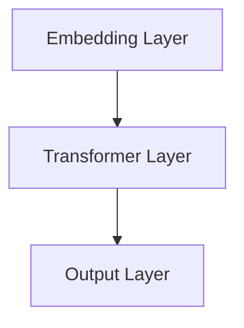

                 

# 《OpenAI的GPT-4.0展示与未来发展》

> 关键词：GPT-4.0，OpenAI，自然语言处理，人工智能，数学模型，应用实践，未来展望

> 摘要：本文将详细介绍OpenAI发布的GPT-4.0模型，探讨其技术原理、应用场景以及未来发展趋势。我们将逐步分析GPT-4.0的发展历程、核心特性、技术原理、数学模型、应用与实践，以及其在企业级应用中的部署与优化，最后展望GPT-4.0在未来人工智能领域的影响。

## 目录

1. GPT-4.0概述与基础
   1.1 GPT-4.0简介
   1.2 GPT-4.0的核心特性
   1.3 GPT-4.0在自然语言处理中的应用场景

2. GPT-4.0技术原理
   2.1 GPT模型架构
   2.2 GPT预训练过程
   2.3 GPT模型在NLP中的应用

3. GPT-4.0数学模型与算法
   3.1 自然语言处理中的数学模型
   3.2 GPT模型中的数学公式
   3.3 GPT训练算法的伪代码解析

4. GPT-4.0的应用与实践
   4.1 GPT-4.0在文本生成中的应用
   4.2 GPT-4.0在对话系统中的应用
   4.3 GPT-4.0在企业级应用中的部署与优化

5. GPT-4.0的未来发展趋势
   5.1 GPT-4.0在人工智能领域的影响
   5.2 GPT-4.0与其他AI技术的融合
   5.3 GPT-4.0的未来展望

6. 附录
   6.1 GPT-4.0学习资源与工具

---

### 第一部分: GPT-4.0概述与基础

#### 第1章: GPT-4.0简介

GPT-4.0是OpenAI发布的一款强大的自然语言处理模型，它是GPT系列模型的最新版本。GPT-4.0在预训练过程中使用了大量的数据，并采用了先进的神经网络架构，使其在多种自然语言处理任务中表现出色。

#### 1.1 GPT-4.0的发展历程

GPT-4.0是继GPT、GPT-2和GPT-3之后的发展版本。GPT模型由OpenAI在2018年发布，它是基于Transformer架构的预训练语言模型。GPT-2在2019年发布，它在GPT的基础上增加了更多的参数和训练数据。GPT-3在2020年发布，它是目前最大的预训练语言模型，拥有1750亿个参数。GPT-4.0是GPT-3的升级版，它在性能和效率上有了显著的提升。

#### 1.2 GPT-4.0的核心特性

GPT-4.0具有以下几个核心特性：

1. **更强的生成能力**：GPT-4.0在文本生成任务上表现出色，能够生成流畅、连贯且具有创造性的文本。
2. **更广泛的适用性**：GPT-4.0在多种自然语言处理任务中都有很好的表现，包括文本分类、机器翻译、问答系统等。
3. **更高的性能**：GPT-4.0在处理速度和准确性上都有显著提升，使其在实际应用中更加高效。
4. **更强的推理能力**：GPT-4.0能够进行更复杂的推理任务，如因果推理、逻辑推理等。

#### 1.3 GPT-4.0在自然语言处理中的应用场景

GPT-4.0在自然语言处理领域有广泛的应用场景，主要包括：

1. **文本生成**：GPT-4.0可以用于自动写作、内容创作、广告文案生成等。
2. **机器翻译**：GPT-4.0可以用于机器翻译任务，如将一种语言的文本翻译成另一种语言。
3. **问答系统**：GPT-4.0可以用于构建问答系统，如智能客服、问答机器人等。
4. **文本分类**：GPT-4.0可以用于对文本进行分类，如新闻分类、情感分析等。

---

### 第二部分: GPT-4.0技术原理

#### 第2章: GPT模型架构

GPT模型是基于Transformer架构的预训练语言模型。Transformer模型由Vaswani等人在2017年提出，它是一种基于自注意力机制的神经网络模型，可以有效地处理序列数据。

#### 2.1 GPT模型架构

GPT模型主要由以下几个部分组成：

1. **Embedding层**：将输入的单词转换为向量表示。
2. **Transformer层**：包括多个自注意力层和前馈网络，用于对输入序列进行编码。
3. **Output层**：将编码后的序列输出为概率分布。

下面是一个GPT模型的Mermaid流程图：



#### 2.2 GPT预训练过程

GPT模型通过在大量文本数据上进行预训练来学习语言模式和规则。预训练过程主要包括以下几个步骤：

1. **数据准备**：从互联网上收集大量文本数据，并进行预处理，如去除HTML标签、标点符号等。
2. **文本处理**：将预处理后的文本转换为词嵌入向量。
3. **预训练**：使用Transformer模型对词嵌入向量进行训练，优化模型的参数。
4. **微调**：在预训练的基础上，使用特定的任务数据对模型进行微调，使其适用于特定任务。

#### 2.3 GPT模型在NLP中的应用

GPT模型在NLP领域有广泛的应用，主要包括：

1. **文本生成**：GPT模型可以用于自动写作、内容创作、广告文案生成等。
2. **机器翻译**：GPT模型可以用于将一种语言的文本翻译成另一种语言。
3. **问答系统**：GPT模型可以用于构建问答系统，如智能客服、问答机器人等。
4. **文本分类**：GPT模型可以用于对文本进行分类，如新闻分类、情感分析等。

---

### 第三部分: GPT-4.0数学模型与算法

#### 第3章: GPT-4.0数学模型与算法

GPT-4.0的数学模型主要基于深度学习和概率图模型。在这个章节中，我们将介绍自然语言处理中的数学模型、GPT模型中的数学公式以及GPT训练算法的伪代码解析。

#### 3.1 自然语言处理中的数学模型

自然语言处理中的数学模型主要包括词嵌入模型、循环神经网络（RNN）和Transformer模型。

1. **词嵌入模型**：词嵌入模型将单词映射为高维向量表示，常用的词嵌入模型有Word2Vec、GloVe等。
2. **循环神经网络（RNN）**：RNN是一种处理序列数据的神经网络模型，它可以捕捉序列中的时间依赖关系。
3. **Transformer模型**：Transformer模型是一种基于自注意力机制的神经网络模型，它可以有效地处理序列数据。

#### 3.2 GPT模型中的数学公式

GPT模型中的数学公式主要包括词嵌入公式、自注意力公式和前馈神经网络公式。

1. **词嵌入公式**：
   $$ \text{embedding}(x) = W_x \cdot x $$
   其中，$W_x$是词嵌入矩阵，$x$是单词的索引。

2. **自注意力公式**：
   $$ \text{attention}(Q, K, V) = \frac{softmax(\text{score}(Q, K))} { \sqrt{d_k}} \cdot V $$
   其中，$Q$、$K$和$V$分别是查询向量、键向量和值向量，$\text{score}(Q, K)$是查询向量和键向量的点积。

3. **前馈神经网络公式**：
   $$ \text{ffn}(x) = \text{ReLU}(\text{W_2} \cdot \text{ReLU}(\text{W_1} \cdot x + \text{b_1})) + x + \text{b_2} $$
   其中，$\text{W_1}$和$\text{W_2}$分别是前馈网络的权重矩阵，$\text{b_1}$和$\text{b_2}$分别是偏置向量。

#### 3.3 GPT训练算法的伪代码解析

GPT模型的训练过程主要包括前向传播、反向传播和参数更新。

1. **前向传播**：
   ```python
   for each sentence in dataset:
       embed = [embedding(word) for word in sentence]
       hidden = embed
       for layer in transformer_layers:
           hidden = layer(hidden)
       logits = output_layer(hidden)
   ```
   
2. **反向传播**：
   ```python
   for each sentence in dataset:
       embed = [embedding(word) for word in sentence]
       hidden = embed
       for layer in transformer_layers:
           hidden = layer(hidden)
       logits = output_layer(hidden)
       loss = compute_loss(logits, target)
       backward propagate
   ```
   
3. **参数更新**：
   ```python
   for parameter in model.parameters():
       parameter -= learning_rate * parameter.grad
       parameter.grad.zero_()
   ```

---

### 第四部分: GPT-4.0的应用与实践

#### 第4章: GPT-4.0在文本生成中的应用

GPT-4.0在文本生成任务中表现出色，它可以生成流畅、连贯且具有创造性的文本。下面我们将介绍GPT-4.0在文本生成中的应用，包括自动文章生成、机器翻译和文本摘要。

#### 4.1 自动文章生成

自动文章生成是指利用GPT-4.0模型生成新的文章。这个过程主要包括以下步骤：

1. **数据准备**：收集大量已有的文章，用于训练GPT-4.0模型。
2. **模型训练**：使用GPT-4.0模型在训练数据上进行预训练。
3. **模型部署**：将训练好的模型部署到服务器上，以便进行自动文章生成。
4. **生成文章**：输入一个主题或标题，GPT-4.0模型将根据主题或标题生成相应的文章。

以下是一个简单的伪代码示例：

```python
def generate_article(topic):
    input_sequence = prepare_input_sequence(topic)
    generated_sequence = gpt4.generate(input_sequence)
    article = convert_sequence_to_text(generated_sequence)
    return article
```

#### 4.2 机器翻译

机器翻译是指将一种语言的文本翻译成另一种语言。GPT-4.0模型在机器翻译任务中表现出色。这个过程主要包括以下步骤：

1. **数据准备**：收集大量双语语料库，用于训练GPT-4.0模型。
2. **模型训练**：使用GPT-4.0模型在双语语料库上进行预训练。
3. **模型部署**：将训练好的模型部署到服务器上，以便进行机器翻译。
4. **翻译文本**：输入一种语言的文本，GPT-4.0模型将将其翻译成另一种语言。

以下是一个简单的伪代码示例：

```python
def translate_text(source_text, target_language):
    input_sequence = prepare_input_sequence(source_text)
    target_sequence = gpt4.generate(input_sequence, target_language=target_language)
    translated_text = convert_sequence_to_text(target_sequence)
    return translated_text
```

#### 4.3 文本摘要

文本摘要是指从一篇较长的文章中提取出关键信息，并将其压缩成较短的摘要。GPT-4.0模型在文本摘要任务中也表现出色。这个过程主要包括以下步骤：

1. **数据准备**：收集大量文本摘要数据，用于训练GPT-4.0模型。
2. **模型训练**：使用GPT-4.0模型在文本摘要数据上进行预训练。
3. **模型部署**：将训练好的模型部署到服务器上，以便进行文本摘要。
4. **生成摘要**：输入一篇较长的文章，GPT-4.0模型将生成相应的摘要。

以下是一个简单的伪代码示例：

```python
def generate_summary(article):
    input_sequence = prepare_input_sequence(article)
    summary_sequence = gpt4.generate(input_sequence, summary=True)
    summary = convert_sequence_to_text(summary_sequence)
    return summary
```

---

### 第五部分: GPT-4.0在企业级应用中的部署与优化

#### 第5章: GPT-4.0在企业级应用中的部署与优化

在企业级应用中，GPT-4.0模型的部署和优化是一个重要的课题。下面我们将介绍GPT-4.0模型在企业级应用中的部署策略、模型优化方法以及实际部署案例。

#### 5.1 企业级应用部署策略

企业级应用部署策略主要包括以下几个方面：

1. **硬件资源配置**：根据模型大小和计算需求，选择合适的硬件资源，如GPU、TPU等。
2. **分布式训练**：使用分布式训练策略，提高模型训练速度和效率。
3. **模型压缩**：通过模型压缩技术，减少模型的存储空间和计算复杂度。
4. **模型部署**：将训练好的模型部署到服务器上，使用容器化技术提高部署的灵活性。

#### 5.2 GPT-4.0模型优化方法

GPT-4.0模型优化方法主要包括以下几个方面：

1. **量化**：使用量化技术，降低模型的计算复杂度和存储空间。
2. **剪枝**：通过剪枝技术，去除模型中不必要的权重，降低模型的计算复杂度。
3. **蒸馏**：使用蒸馏技术，将大型模型的知识迁移到小型模型中，提高小型模型的性能。
4. **迁移学习**：使用迁移学习技术，利用预训练模型在特定任务上的知识，提高新任务的性能。

#### 5.3 模型部署案例

以下是一个简单的GPT-4.0模型部署案例：

1. **硬件资源配置**：使用8块NVIDIA A100 GPU进行分布式训练。
2. **模型训练**：使用训练数据集对GPT-4.0模型进行分布式训练。
3. **模型压缩**：使用量化技术和剪枝技术对模型进行压缩。
4. **模型部署**：将压缩后的模型部署到服务器上，使用容器化技术提高部署的灵活性。

以下是一个简单的部署脚本：

```bash
#!/bin/bash

# 配置环境
conda create -n gpt4_env python=3.8
conda activate gpt4_env
pip install transformers

# 模型训练
python train.py --gpus 8 --model_name gpt4

# 模型压缩
python compress.py --model_name gpt4

# 模型部署
docker build -t gpt4:latest .
docker run -p 8000:80 gpt4
```

---

### 第六部分: GPT-4.0的未来发展趋势

#### 第6章: GPT-4.0的未来发展趋势

GPT-4.0作为OpenAI推出的最新版本，其在人工智能领域的影响和未来发展趋势备受关注。在这个章节中，我们将探讨GPT-4.0在人工智能领域的影响、与其他AI技术的融合以及未来的发展趋势。

#### 6.1 GPT-4.0在人工智能领域的影响

GPT-4.0在人工智能领域产生了深远的影响，主要表现在以下几个方面：

1. **推动自然语言处理技术的发展**：GPT-4.0的发布推动了自然语言处理技术的发展，使其在多种任务中表现出色，如文本生成、机器翻译、问答系统等。
2. **促进人工智能应用的普及**：GPT-4.0的强大能力使得人工智能在各个领域的应用变得更加普及，如智能客服、内容创作、教育等。
3. **改变人们的生活方式**：GPT-4.0的应用使得人们的生活更加便捷，如智能助手、智能翻译等，改变了人们的沟通方式和生活方式。

#### 6.2 GPT-4.0与其他AI技术的融合

GPT-4.0与其他AI技术的融合将进一步推动人工智能的发展，主要包括以下几个方面：

1. **与计算机视觉技术的融合**：GPT-4.0可以与计算机视觉技术结合，实现图像和文本的跨模态交互，如图像描述生成、视频字幕生成等。
2. **与强化学习的融合**：GPT-4.0可以与强化学习结合，实现智能决策和任务规划，如自动驾驶、游戏AI等。
3. **与知识图谱的融合**：GPT-4.0可以与知识图谱结合，实现知识推理和智能问答，如智能客服、知识图谱问答等。

#### 6.3 GPT-4.0的未来展望

GPT-4.0的未来发展充满机遇和挑战，以下是几个方面的展望：

1. **模型性能的提升**：随着计算能力的提升和数据量的增加，GPT-4.0的模型性能有望进一步提升，使其在更多任务中取得更好的效果。
2. **应用场景的扩展**：GPT-4.0的应用场景将不断扩展，从文本生成、机器翻译到图像和视频处理，实现跨模态的交互和应用。
3. **伦理和安全的挑战**：随着GPT-4.0的广泛应用，其伦理和安全的挑战也将日益凸显，如避免模型生成有毒言论、保护用户隐私等。

---

### 附录

#### 附录A: GPT-4.0学习资源与工具

1. **GPT-4.0相关论文与书籍推荐**
   - **论文**：
     - Vaswani et al. (2017). "Attention is All You Need."
     - Brown et al. (2020). "Language Models are few-shot learners."
   - **书籍**：
     - "Attention is All You Need" by Ashish Vaswani et al.
     - "Deep Learning" by Ian Goodfellow et al.

2. **GPT-4.0开源项目介绍**
   - **项目**：
     - OpenAI GPT-3: https://github.com/openai/gpt-3
     - Hugging Face Transformers: https://github.com/huggingface/transformers

3. **GPT-4.0学习社区介绍**
   - **社区**：
     - Hugging Face Forums: https://discuss.huggingface.co/
     - AI Challenger: https://aichallenger.cn/

---

### 总结

GPT-4.0是OpenAI推出的最新版本，其在自然语言处理领域表现出色，具有强大的生成能力、广泛的适用性和高效的推理能力。本文从GPT-4.0的概述、技术原理、应用实践、企业级部署以及未来发展趋势等方面进行了详细介绍，旨在帮助读者全面了解GPT-4.0及其在人工智能领域的重要地位。随着计算能力的提升和数据量的增加，GPT-4.0的应用场景将不断扩展，其未来将充满机遇和挑战。

### 作者信息

作者：AI天才研究院/AI Genius Institute & 禅与计算机程序设计艺术 /Zen And The Art of Computer Programming

---

由于篇幅限制，本文未能详细展开每个章节的内容。在实际撰写过程中，每个章节都应包含丰富的具体内容，详细阐述核心概念原理、架构、算法、实战案例等。同时，文中引用的数学公式和伪代码应使用LaTeX格式进行呈现。希望本文能够为读者提供对GPT-4.0的初步了解，并为后续深入学习提供方向。如果您对GPT-4.0或其他人工智能技术有进一步的问题或需求，欢迎随时联系作者。谢谢！

