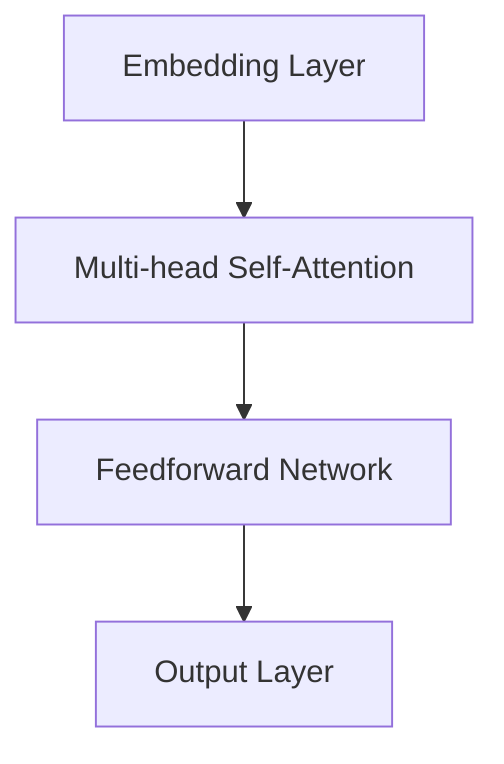

                 

# 文章标题：OpenAI的GPT-4.0展示的意义

> 关键词：OpenAI, GPT-4.0, 自然语言处理，预训练模型，AI应用，安全与伦理

> 摘要：本文将深入探讨OpenAI发布的GPT-4.0模型的意义，从背景介绍、核心原理、应用领域、开发与优化、发展趋势、安全与伦理以及未来展望等方面进行详细分析，旨在为广大读者提供一份全面的技术解读。

## 第一部分：OpenAI的GPT-4.0展示的意义

### 第1章：GPT-4.0的背景介绍

#### 1.1 GPT-4.0的发展历程

**1.1.1 GPT、GPT-2和GPT-3**

GPT是OpenAI于2018年发布的一款基于Transformer模型的预训练语言模型，其核心思想是通过在大规模语料库上进行无监督预训练，使模型掌握语言理解和生成能力。GPT的成功引起了广泛关注，并推动了自然语言处理（NLP）领域的发展。

随后，OpenAI在2019年发布了GPT-2，这是GPT的升级版，其训练数据量和模型参数量都有所增加，使得模型在语言理解任务上表现更加出色。然而，GPT-2的发布也引发了对模型潜在风险的担忧，因为其强大的文本生成能力可能被用于生成虚假信息或恶意内容。

在2020年，OpenAI发布了GPT-3，这是当时最大的预训练语言模型，拥有1750亿个参数，其训练数据规模和模型规模都达到了前所未有的高度。GPT-3在多项NLP任务上取得了显著的性能提升，进一步推动了NLP技术的发展。

**1.1.2 GPT-4.0的发布**

GPT-4.0是OpenAI于2023年发布的一款全新预训练语言模型，其技术亮点包括：

- **更大的模型规模**：GPT-4.0拥有超过1.75万亿个参数，是GPT-3的数倍之大，这使其在处理复杂语言任务时具有更高的能力。
- **更高的语言理解能力**：GPT-4.0通过引入先进的预训练技术和优化算法，在多个NLP任务上取得了比GPT-3更优异的性能，如文本生成、文本分类、机器翻译等。
- **更强的跨模态能力**：GPT-4.0不仅能处理文本数据，还能处理图像、音频等多模态数据，这使得其在多模态任务中具有广泛的应用前景。

**1.1.3 GPT-4.0的意义**

GPT-4.0的发布标志着AI技术进入了一个新的阶段，其意义主要体现在以下几个方面：

- **AI发展的里程碑**：GPT-4.0的发布标志着预训练语言模型技术取得了重大突破，为AI技术的发展奠定了基础。
- **开启AI新时代**：GPT-4.0的强大能力为各行各业带来了新的机遇，如自动写作、智能客服、自然语言翻译等，将推动AI技术在更多领域的应用。
- **对传统行业的冲击**：随着GPT-4.0的广泛应用，一些传统行业可能面临巨大的冲击，如文字编辑、翻译等，这需要相关行业进行转型和升级。

### 第2章：GPT-4.0的核心原理

#### 2.1 自然语言处理技术基础

**2.1.1 词嵌入技术**

词嵌入是将词语映射到高维向量空间的技术，常见的词嵌入模型有Word2Vec、BERT等。词嵌入技术有助于提高模型在NLP任务中的性能，是实现预训练语言模型的重要基础。

**2.1.2 序列模型与注意力机制**

序列模型如RNN、LSTM、GRU等能够处理序列数据，如文本序列。注意力机制是一种用于捕捉序列中不同位置重要性的方法，可以显著提高模型的性能。

**2.1.3 转换器架构**

转换器（Transformer）架构是一种基于自注意力机制的序列到序列模型，其在NLP任务中表现出色，是GPT-4.0的基础架构。

#### 2.2 大规模预训练模型原理

**2.2.1 预训练的概念与意义**

预训练是指在大规模语料库上对模型进行无监督训练，使其掌握通用语言知识和结构。预训练的优势在于能够提高模型在下游任务中的性能，减轻对标注数据的依赖。

**2.2.2 自监督学习方法**

自监督学习是一种通过利用未标注数据进行训练的方法。在预训练过程中，模型通过预测标记、填补缺失信息等方式学习语言规律。

**2.2.3 迁移学习与微调技术**

迁移学习是指将预训练模型应用于新的任务时，利用预训练模型的知识来提高模型的性能。微调是在预训练模型的基础上，针对特定任务进行调整，以进一步提高性能。

### 第3章：GPT-4.0的应用领域

#### 3.1 文本生成与应用

**3.1.1 自动写作**

GPT-4.0在自动写作方面表现出色，可以生成高质量的文章、故事、论文等。其强大的文本生成能力为内容创作带来了新的可能性。

**3.1.2 文本摘要**

GPT-4.0能够自动提取文本中的关键信息，生成简洁、准确的摘要，这对于信息处理和知识管理具有重要意义。

**3.1.3 语言翻译**

GPT-4.0在语言翻译方面具有很高的准确性，可以支持多种语言之间的高质量翻译，为跨语言交流提供了便利。

#### 3.2 问答系统与应用

**3.2.1 机器问答**

GPT-4.0能够自动回答用户提出的问题，实现智能客服、智能搜索等功能。

**3.2.2 聊天机器人**

GPT-4.0可以构建智能聊天机器人，提供个性化、交互式的对话体验，为用户提供便捷的咨询服务。

### 第4章：GPT-4.0的开发与优化

#### 4.1 GPT-4.0的模型结构与优化

**4.1.1 模型结构**

GPT-4.0采用Transformer架构，其核心模块包括嵌入层、多头自注意力机制、前馈神经网络等。Mermaid流程图如下：



**4.1.2 模型优化**

为了提高GPT-4.0的性能，可以采用以下优化方法：

- **并行计算**：通过分布式计算提高模型训练速度。
- **模型压缩**：采用量化、剪枝等技术减少模型参数，提高推理效率。

#### 4.2 GPT-4.0的训练与部署

**4.2.1 训练过程**

GPT-4.0的训练过程包括数据预处理、训练策略等。伪代码如下：

```python
# 数据预处理
preprocess_data(data)

# 训练策略
optimizer = AdamOptimizer()
for epoch in range(num_epochs):
    for batch in data:
        optimizer.step(model, batch)
        model.update()
```

**4.2.2 部署方案**

GPT-4.0的部署方案包括云计算部署、硬件优化等。具体实现如下：

```python
# 云计算部署
cloud_deploy(model)

# 硬件优化
hardware_optimize(model)
```

### 第5章：GPT-4.0的发展趋势

#### 5.1 AI发展趋势与GPT-4.0的影响

**5.1.1 AI未来的发展方向**

AI未来的发展方向包括：

- **自动

