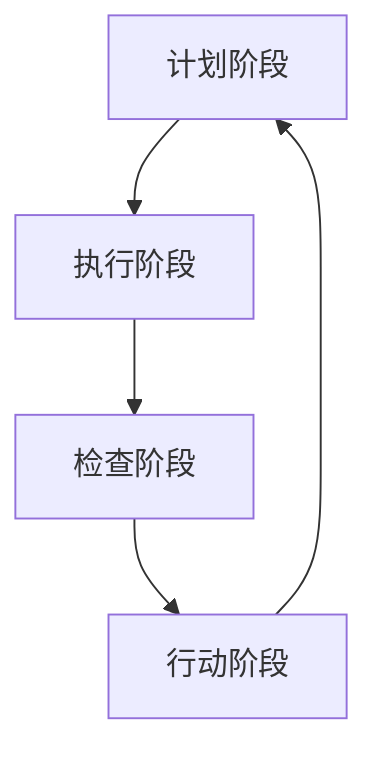

                 

### 文章标题

# PDCA：高效管理者的行动方法论

> 关键词：PDCA，高效管理，持续改进，质量管理，项目管理，产品开发

> 摘要：本文深入探讨了PDCA（计划-执行-检查-行动）方法论在现代管理中的应用与价值。通过详细阐述PDCA方法论的基本概念、原理、架构以及在不同领域的应用，本文为读者提供了完整的PDCA方法论实践指南，帮助高效管理者在实际工作中应用该方法论，实现持续改进和高效管理。

### 《PDCA：高效管理者的行动方法论》目录大纲

# 第一部分：PDCA方法论概述

## 第1章：PDCA方法论的基本概念

### 1.1 PDCA方法论的起源与背景

#### 1.1.1 起源背景

PDCA方法论，即Plan（计划）、Do（执行）、Check（检查）和Act（行动）循环，起源于20世纪初的日本，由著名的管理学家石川馨博士提出并推广。PDCA方法论的提出背景源于当时日本企业面临的质量管理问题，旨在通过系统化的方法提升产品和服务的质量。

#### 1.1.2 发展历程

PDCA方法论在提出后，得到了全球范围内的广泛关注和应用。随着管理学的发展，PDCA方法论逐渐从质量管理领域扩展到项目管理、产品开发等多个领域，成为一种普遍适用的管理工具。

### 1.2 PDCA方法的四个阶段

#### 1.2.1 计划阶段（Plan）

在计划阶段，管理者需要明确目标、制定策略和计划，为后续的执行阶段奠定基础。具体包括以下步骤：

- 确定目标和问题
- 收集和分析信息
- 制定策略和计划
- 制定实施方案和时间表

#### 1.2.2 执行阶段（Do）

在执行阶段，管理者需要按照计划执行任务，确保各项活动顺利进行。具体包括以下步骤：

- 分配资源和责任
- 执行计划
- 检查进度和结果
- 处理问题和异常情况

#### 1.2.3 检查阶段（Check）

在检查阶段，管理者需要评估执行结果，分析目标和实际结果之间的差距，以便为后续的行动阶段提供依据。具体包括以下步骤：

- 收集和整理数据
- 比较目标和实际结果
- 分析差距和原因
- 形成评估报告

#### 1.2.4 行动阶段（Act）

在行动阶段，管理者需要根据检查结果采取相应的措施，进行改进和优化，以确保目标的实现。具体包括以下步骤：

- 制定改进计划
- 实施改进措施
- 验证改进效果
- 形成新的标准

### 1.3 PDCA方法在现代管理中的应用

#### 1.3.1 管理领域

在管理领域，PDCA方法论广泛应用于企业战略规划、运营管理、团队管理等各个方面。通过PDCA循环，管理者可以不断优化管理流程，提高管理效率。

#### 1.3.2 质量管理领域

在质量管理领域，PDCA方法论被视为一种核心工具，用于确保产品和服务的质量。通过PDCA循环，企业可以及时发现和解决质量问题，持续提升产品质量。

#### 1.3.3 项目管理领域

在项目管理领域，PDCA方法论可以帮助项目经理制定科学的项目计划，确保项目顺利进行。通过PDCA循环，项目经理可以实时监控项目进度，及时调整项目计划，确保项目按时完成。

#### 1.3.4 产品开发与改进领域

在产品开发与改进领域，PDCA方法论可以帮助企业不断优化产品设计，提升产品竞争力。通过PDCA循环，企业可以快速响应市场需求，持续改进产品。

## 第2章：PDCA方法论的原理与架构

### 2.1 PDCA方法论的核心原理

PDCA方法论的核心原理是持续改进。通过计划、执行、检查和行动四个阶段的循环，企业可以不断优化管理流程，提升产品质量，实现持续发展。

#### 2.1.1 持续改进

持续改进是PDCA方法论的核心理念。通过不断地检查和行动，企业可以发现并解决潜在的问题，从而实现管理流程的优化和产品质量的提升。

#### 2.1.2 循环迭代

PDCA方法论强调循环迭代，即通过不断的循环，企业可以逐步实现管理流程的优化和产品质量的提升。每个循环都是在前一循环的基础上进行的，从而实现螺旋式的上升。

### 2.2 PDCA方法论的结构框架

PDCA方法论的结构框架包括四个阶段，每个阶段都有明确的任务和目标。

#### 2.2.1 计划阶段（Plan）

计划阶段的主要任务是确定目标和制定计划。通过收集和分析信息，企业可以明确目标和问题，制定科学合理的策略和计划。

#### 2.2.2 执行阶段（Do）

执行阶段的主要任务是按照计划执行任务。通过分配资源和责任，企业可以确保各项活动顺利进行，达到预期目标。

#### 2.2.3 检查阶段（Check）

检查阶段的主要任务是评估执行结果。通过收集和整理数据，企业可以分析目标和实际结果之间的差距，为后续的行动阶段提供依据。

#### 2.2.4 行动阶段（Act）

行动阶段的主要任务是采取改进措施。通过制定改进计划，企业可以针对检查阶段发现的问题进行改进，确保目标的实现。

### 2.3 PDCA方法论的优势与局限性

#### 2.3.1 优势

PDCA方法论具有以下优势：

- 系统化：PDCA方法论提供了一个系统化的框架，帮助企业实现持续改进。
- 可操作性：PDCA方法论的操作性强，易于理解和实施。
- 持续性：PDCA方法论强调循环迭代，帮助企业实现持续发展。

#### 2.3.2 局限性

PDCA方法论也存在一定的局限性：

- 对人员要求高：PDCA方法论的实施需要团队的高度协作和配合，对人员素质要求较高。
- 需要时间：PDCA方法论的循环迭代需要一定的时间，不适合紧急的项目和任务。

## 第3章：PDCA方法论在不同领域的应用

### 3.1 管理领域的PDCA应用

#### 3.1.1 企业战略规划

在企业管理领域，PDCA方法论可以应用于企业战略规划。通过PDCA循环，企业可以不断完善战略规划，确保战略目标的实现。

##### 3.1.1.1 计划阶段

在计划阶段，企业需要明确战略目标和制定战略规划。通过收集和分析外部环境和内部资源的信息，企业可以制定科学合理的战略规划。

##### 3.1.1.2 执行阶段

在执行阶段，企业需要按照战略规划执行各项任务。通过分配资源和责任，企业可以确保战略规划的有效实施。

##### 3.1.1.3 检查阶段

在检查阶段，企业需要评估战略规划的执行效果。通过收集和整理数据，企业可以分析战略目标与实际结果之间的差距，为后续的行动阶段提供依据。

##### 3.1.1.4 行动阶段

在行动阶段，企业需要根据检查结果采取改进措施。通过制定改进计划，企业可以不断完善战略规划，确保战略目标的实现。

#### 3.1.2 运营管理

在企业管理领域，PDCA方法论可以应用于运营管理。通过PDCA循环，企业可以不断优化运营流程，提高运营效率。

##### 3.1.2.1 计划阶段

在计划阶段，企业需要明确运营目标和制定运营计划。通过收集和分析市场信息和内部资源的信息，企业可以制定科学合理的运营计划。

##### 3.1.2.2 执行阶段

在执行阶段，企业需要按照运营计划执行各项任务。通过分配资源和责任，企业可以确保运营计划的有效实施。

##### 3.1.2.3 检查阶段

在检查阶段，企业需要评估运营计划的执行效果。通过收集和整理数据，企业可以分析运营目标与实际结果之间的差距，为后续的行动阶段提供依据。

##### 3.1.2.4 行动阶段

在行动阶段，企业需要根据检查结果采取改进措施。通过制定改进计划，企业可以不断优化运营流程，提高运营效率。

### 3.2 质量管理中的PDCA应用

#### 3.2.1 质量管理框架

在质量管理领域，PDCA方法论被视为一种核心工具，用于确保产品和服务的质量。通过PDCA循环，企业可以不断优化质量管理流程，提升产品质量。

##### 3.2.1.1 计划阶段

在计划阶段，企业需要明确质量目标和制定质量管理计划。通过收集和分析质量信息，企业可以制定科学合理的质量管理计划。

##### 3.2.1.2 执行阶段

在执行阶段，企业需要按照质量管理计划执行各项任务。通过分配资源和责任，企业可以确保质量管理计划的有效实施。

##### 3.2.1.3 检查阶段

在检查阶段，企业需要评估质量管理计划的执行效果。通过收集和整理质量数据，企业可以分析质量目标与实际结果之间的差距，为后续的行动阶段提供依据。

##### 3.2.1.4 行动阶段

在行动阶段，企业需要根据检查结果采取改进措施。通过制定改进计划，企业可以不断优化质量管理流程，提升产品质量。

#### 3.2.2 质量管理工具

在质量管理领域，PDCA方法论还可以与其他质量管理工具相结合，如六西格玛、ISO 9001等。通过综合应用这些工具，企业可以进一步优化质量管理流程，提升产品质量。

##### 3.2.2.1 六西格玛

六西格玛是一种以统计数据为基础的质量管理方法，旨在通过减少变异性和缺陷率，提高产品和服务的质量。PDCA方法论与六西格玛的结合，可以帮助企业实现更高效的质量管理。

##### 3.2.2.2 ISO 9001

ISO 9001是一种国际通用的质量管理体系标准，旨在帮助企业建立和维护有效的质量管理体系。PDCA方法论与ISO 9001的结合，可以帮助企业实现质量管理的标准化和系统化。

### 3.3 产品开发与改进中的PDCA应用

#### 3.3.1 产品开发流程

在产品开发领域，PDCA方法论可以应用于产品开发流程，确保产品的质量和性能。

##### 3.3.1.1 计划阶段

在计划阶段，企业需要明确产品目标和制定产品开发计划。通过收集和分析市场需求和内部资源的信息，企业可以制定科学合理的产品开发计划。

##### 3.3.1.2 执行阶段

在执行阶段，企业需要按照产品开发计划进行产品设计、开发和测试。通过分配资源和责任，企业可以确保产品开发计划的有效实施。

##### 3.3.1.3 检查阶段

在检查阶段，企业需要评估产品开发计划的执行效果。通过收集和整理产品质量和性能数据，企业可以分析产品目标与实际结果之间的差距，为后续的行动阶段提供依据。

##### 3.3.1.4 行动阶段

在行动阶段，企业需要根据检查结果采取改进措施。通过制定改进计划，企业可以不断优化产品开发流程，提升产品质量和性能。

#### 3.3.2 产品改进策略

在产品开发过程中，PDCA方法论还可以用于产品改进策略的制定和实施。通过PDCA循环，企业可以不断优化产品设计，提升产品竞争力。

##### 3.3.2.1 持续改进

持续改进是产品开发过程中的重要环节。通过PDCA循环，企业可以及时发现和解决产品设计中的问题，持续提升产品性能和质量。

##### 3.3.2.2 用户反馈

用户反馈是产品改进的重要依据。通过收集和分析用户反馈，企业可以了解用户需求和偏好，为产品改进提供有力支持。

## 第4章：PDCA方法在组织管理中的应用

### 4.1 PDCA方法在组织管理中的步骤

#### 4.1.1 计划阶段

在计划阶段，组织需要明确管理目标和制定管理计划。具体步骤如下：

1. **确定目标和问题**：分析组织内外部环境，明确组织面临的问题和目标。
2. **收集和分析信息**：收集与目标相关的各种信息，进行分析和整理。
3. **制定策略和计划**：根据目标和信息，制定具体的策略和行动计划。
4. **制定实施方案和时间表**：将策略和计划细化为具体的实施方案和时间表。

#### 4.1.2 执行阶段

在执行阶段，组织需要按照计划执行各项任务。具体步骤如下：

1. **分配资源和责任**：根据实施方案，合理分配资源和责任，确保任务执行。
2. **执行计划**：按照实施方案和时间表，执行各项任务，确保计划顺利进行。
3. **检查进度和结果**：实时监控任务进度，评估执行效果，及时调整计划。
4. **处理问题和异常情况**：遇到问题和异常情况时，及时处理，确保任务顺利进行。

#### 4.1.3 检查阶段

在检查阶段，组织需要评估执行结果，分析目标和实际结果之间的差距。具体步骤如下：

1. **收集和整理数据**：收集与执行结果相关的各种数据，进行整理和分析。
2. **比较目标和实际结果**：将实际结果与目标进行比较，分析差距和原因。
3. **形成评估报告**：根据分析结果，形成评估报告，为后续的行动阶段提供依据。

#### 4.1.4 行动阶段

在行动阶段，组织需要根据检查结果采取改进措施。具体步骤如下：

1. **制定改进计划**：根据评估报告，制定具体的改进计划。
2. **实施改进措施**：按照改进计划，实施各项改进措施，优化管理流程。
3. **验证改进效果**：对改进措施的效果进行验证，确保改进目标达成。
4. **形成新的标准**：根据改进效果，形成新的标准和流程，确保持续改进。

### 4.2 PDCA方法在战略规划中的应用

#### 4.2.1 战略规划的过程

PDCA方法在战略规划中的应用，可以帮助组织更科学、系统地制定和实施战略。具体过程如下：

1. **计划阶段**：明确组织愿景、使命和战略目标，制定战略规划。
2. **执行阶段**：实施战略规划，推动各项战略任务的落实。
3. **检查阶段**：评估战略规划执行的效果，分析目标和实际结果之间的差距。
4. **行动阶段**：根据评估结果，制定改进计划，调整和优化战略规划。

#### 4.2.2 PDCA方法在战略规划中的应用示例

假设某企业计划在下一个五年内实现收入翻倍，以下是一个基于PDCA方法的战略规划应用示例：

1. **计划阶段**：
   - 明确目标：五年内实现收入翻倍。
   - 收集和分析信息：分析市场趋势、竞争对手、企业内部资源等。
   - 制定策略和计划：制定市场拓展、产品创新、团队建设等策略，并形成详细的实施计划。

2. **执行阶段**：
   - 分配资源和责任：明确各部门和员工的责任，确保战略规划的有效执行。
   - 执行计划：按照实施计划，推进各项战略任务。
   - 检查进度和结果：定期检查战略任务的进度和效果，及时调整计划。

3. **检查阶段**：
   - 收集和整理数据：收集与战略规划相关的各种数据，包括收入、市场份额、客户满意度等。
   - 比较目标和实际结果：分析收入增长情况，与预期目标进行比较，找出差距和原因。

4. **行动阶段**：
   - 制定改进计划：根据分析结果，制定具体的改进计划，包括市场策略调整、产品创新、团队建设等。
   - 实施改进措施：按照改进计划，实施各项改进措施。
   - 验证改进效果：对改进措施的效果进行验证，确保收入增长目标的达成。

### 4.3 PDCA方法在团队管理中的应用

#### 4.3.1 团队管理的PDCA循环

PDCA方法在团队管理中的应用，可以帮助团队更高效地完成工作，提升团队绩效。团队管理的PDCA循环包括以下四个阶段：

1. **计划阶段**：明确团队目标和制定工作计划。
2. **执行阶段**：执行工作计划，确保任务完成。
3. **检查阶段**：评估工作效果，分析目标和实际结果之间的差距。
4. **行动阶段**：根据评估结果，制定改进计划，提升团队绩效。

#### 4.3.2 PDCA方法在团队管理中的应用示例

假设某团队负责开发一款新产品，以下是一个基于PDCA方法的团队管理应用示例：

1. **计划阶段**：
   - 明确目标：在规定时间内完成新产品的开发。
   - 收集和分析信息：分析市场需求、技术可行性、资源需求等。
   - 制定策略和计划：制定开发计划，包括任务分配、时间表、质量标准等。

2. **执行阶段**：
   - 分配资源和责任：明确团队成员的任务和责任，确保开发工作顺利进行。
   - 执行计划：按照开发计划，推进各项工作。
   - 检查进度和结果：定期检查开发进度和质量，确保任务按计划进行。

3. **检查阶段**：
   - 收集和整理数据：收集与开发相关的各种数据，包括开发进度、质量指标等。
   - 比较目标和实际结果：分析开发进度和质量，与预期目标进行比较，找出差距和原因。

4. **行动阶段**：
   - 制定改进计划：根据分析结果，制定具体的改进计划，包括任务调整、资源分配等。
   - 实施改进措施：按照改进计划，调整开发工作。
   - 验证改进效果：对改进措施的效果进行验证，确保新产品按计划完成开发。

## 第5章：PDCA方法在项目管理中的应用

### 5.1 PDCA方法在项目规划中的应用

#### 5.1.1 项目规划的重要性

项目规划是项目管理的重要环节，它决定了项目的成功与否。PDCA方法论在项目规划中的应用，可以帮助项目经理更科学、系统地制定项目计划，确保项目顺利进行。

#### 5.1.2 PDCA方法在项目规划中的应用步骤

1. **计划阶段**：
   - **确定项目目标和范围**：明确项目的目标、范围、关键里程碑和交付物。
   - **收集和分析信息**：分析项目需求、技术可行性、资源需求、风险评估等。
   - **制定项目计划**：制定详细的项目计划，包括任务分解、时间表、资源分配、质量标准等。
   - **制定风险应对计划**：识别项目风险，制定相应的风险应对措施。

2. **执行阶段**：
   - **执行项目计划**：按照项目计划，推进各项工作，确保任务按时完成。
   - **监控项目进度**：定期监控项目进度，确保项目按计划进行。
   - **协调资源和人员**：确保项目资源的合理利用和人员的高效协作。

3. **检查阶段**：
   - **收集项目数据**：收集与项目执行相关的各种数据，包括进度、质量、成本等。
   - **评估项目效果**：评估项目执行效果，分析实际结果与预期目标之间的差距。
   - **识别问题和改进机会**：分析问题产生的原因，寻找改进的机会。

4. **行动阶段**：
   - **制定改进计划**：根据评估结果，制定具体的改进计划，包括任务调整、资源分配、风险应对措施等。
   - **实施改进措施**：按照改进计划，调整项目执行，确保项目目标达成。
   - **验证改进效果**：对改进措施的效果进行验证，确保项目质量和进度符合预期。

### 5.2 PDCA方法在项目执行中的应用

#### 5.2.1 项目执行的关键环节

项目执行是项目管理的核心环节，它决定了项目的实际效果。PDCA方法论在项目执行中的应用，可以帮助项目经理更好地控制项目进度、质量和成本。

#### 5.2.2 PDCA方法在项目执行中的应用步骤

1. **计划阶段**：
   - **制定执行计划**：根据项目计划，制定详细的执行计划，包括任务分解、时间表、资源分配、质量标准等。
   - **分配资源和责任**：明确团队成员的任务和责任，确保项目资源的高效利用。
   - **制定风险管理计划**：识别项目风险，制定相应的风险管理措施。

2. **执行阶段**：
   - **执行项目计划**：按照执行计划，推进各项工作，确保任务按时完成。
   - **监控项目进度**：定期监控项目进度，确保项目按计划进行。
   - **协调资源和人员**：确保项目资源的合理利用和人员的高效协作。
   - **处理问题和异常情况**：遇到问题和异常情况时，及时处理，确保项目顺利进行。

3. **检查阶段**：
   - **收集项目数据**：收集与项目执行相关的各种数据，包括进度、质量、成本等。
   - **评估项目效果**：评估项目执行效果，分析实际结果与预期目标之间的差距。
   - **识别问题和改进机会**：分析问题产生的原因，寻找改进的机会。

4. **行动阶段**：
   - **制定改进计划**：根据评估结果，制定具体的改进计划，包括任务调整、资源分配、风险应对措施等。
   - **实施改进措施**：按照改进计划，调整项目执行，确保项目目标达成。
   - **验证改进效果**：对改进措施的效果进行验证，确保项目质量和进度符合预期。

### 5.3 PDCA方法在项目监控与改进中的应用

#### 5.3.1 项目监控的重要性

项目监控是确保项目按计划进行的关键环节。PDCA方法论在项目监控与改进中的应用，可以帮助项目经理及时发现和解决问题，确保项目目标的实现。

#### 5.3.2 PDCA方法在项目监控与改进中的应用步骤

1. **计划阶段**：
   - **制定监控计划**：根据项目计划，制定详细的监控计划，包括监控指标、监控频率、监控方式等。
   - **确定监控指标**：明确项目的关键监控指标，如进度、质量、成本等。
   - **制定问题应对计划**：识别可能的问题和风险，制定相应的应对措施。

2. **执行阶段**：
   - **实施监控计划**：按照监控计划，对项目进度、质量、成本等进行监控。
   - **收集监控数据**：定期收集监控数据，分析项目执行情况。
   - **报告监控结果**：向项目团队和利益相关者报告监控结果，确保信息透明。

3. **检查阶段**：
   - **评估监控效果**：评估监控计划执行效果，分析实际监控结果与预期目标之间的差距。
   - **识别问题和改进机会**：分析问题产生的原因，寻找改进的机会。

4. **行动阶段**：
   - **制定改进计划**：根据评估结果，制定具体的改进计划，包括问题解决、流程优化等。
   - **实施改进措施**：按照改进计划，调整项目执行，确保问题得到解决。
   - **验证改进效果**：对改进措施的效果进行验证，确保项目质量和进度符合预期。

## 第6章：PDCA方法在产品开发中的应用

### 6.1 PDCA方法在产品设计中的应用

#### 6.1.1 产品设计的重要性

产品设计是产品开发的关键环节，它决定了产品的质量和用户体验。PDCA方法论在产品设计中的应用，可以帮助团队更高效地完成产品设计，确保产品设计符合市场需求。

#### 6.1.2 PDCA方法在产品设计中的应用步骤

1. **计划阶段**：
   - **确定设计目标和要求**：明确产品的设计目标和要求，包括功能、性能、用户体验等。
   - **收集和分析需求**：收集和分析用户需求和市场趋势，为产品设计提供依据。
   - **制定设计计划**：制定详细的设计计划，包括设计目标、设计阶段、设计资源等。

2. **执行阶段**：
   - **进行设计工作**：按照设计计划，进行产品设计工作，包括需求分析、原型设计、设计评审等。
   - **监控设计进度**：定期监控设计进度，确保设计工作按时完成。
   - **优化设计方案**：根据用户反馈和市场变化，优化设计方案。

3. **检查阶段**：
   - **评估设计效果**：评估设计效果，包括功能实现、性能指标、用户体验等。
   - **收集用户反馈**：收集用户对设计方案的反馈，分析用户需求和偏好。
   - **识别问题和改进机会**：分析设计过程中出现的问题和改进机会。

4. **行动阶段**：
   - **制定改进计划**：根据评估结果，制定具体的改进计划，包括设计优化、流程改进等。
   - **实施改进措施**：按照改进计划，优化产品设计，确保产品设计质量。
   - **验证改进效果**：对改进措施的效果进行验证，确保产品设计符合市场需求。

### 6.2 PDCA方法在产品测试中的应用

#### 6.2.1 产品测试的重要性

产品测试是确保产品质量的关键环节。PDCA方法论在产品测试中的应用，可以帮助团队更高效地完成产品测试，确保产品满足质量要求。

#### 6.2.2 PDCA方法在产品测试中的应用步骤

1. **计划阶段**：
   - **制定测试计划**：根据产品设计和需求，制定详细的测试计划，包括测试目标、测试阶段、测试资源等。
   - **确定测试标准**：明确产品的测试标准，包括功能测试、性能测试、用户体验测试等。
   - **制定测试方案**：制定详细的测试方案，包括测试用例、测试环境、测试工具等。

2. **执行阶段**：
   - **进行测试工作**：按照测试计划，进行产品测试工作，包括单元测试、集成测试、系统测试等。
   - **监控测试进度**：定期监控测试进度，确保测试工作按时完成。
   - **记录测试结果**：记录测试结果，分析测试过程中发现的问题。

3. **检查阶段**：
   - **评估测试效果**：评估测试效果，包括测试覆盖率、测试通过率、测试缺陷等。
   - **分析测试结果**：分析测试结果，识别测试过程中出现的问题和缺陷。
   - **识别问题和改进机会**：分析问题产生的原因，寻找改进的机会。

4. **行动阶段**：
   - **制定改进计划**：根据评估结果，制定具体的改进计划，包括测试方法优化、测试工具改进等。
   - **实施改进措施**：按照改进计划，优化产品测试流程，确保测试质量。
   - **验证改进效果**：对改进措施的效果进行验证，确保产品测试符合质量要求。

### 6.3 PDCA方法在产品改进中的应用

#### 6.3.1 产品改进的重要性

产品改进是持续提升产品质量和用户体验的关键环节。PDCA方法论在产品改进中的应用，可以帮助团队更高效地发现和解决问题，持续优化产品。

#### 6.3.2 PDCA方法在产品改进中的应用步骤

1. **计划阶段**：
   - **确定改进目标和要求**：明确产品的改进目标和要求，包括功能优化、性能提升、用户体验改善等。
   - **收集和分析反馈**：收集和分析用户反馈和市场数据，为产品改进提供依据。
   - **制定改进计划**：制定详细的改进计划，包括改进阶段、改进资源、改进目标等。

2. **执行阶段**：
   - **进行改进工作**：按照改进计划，进行产品改进工作，包括需求分析、设计优化、测试验证等。
   - **监控改进进度**：定期监控改进进度，确保改进工作按时完成。
   - **记录改进过程**：记录改进过程中的问题和改进措施，为后续的检查阶段提供依据。

3. **检查阶段**：
   - **评估改进效果**：评估改进效果，包括功能实现、性能指标、用户体验等。
   - **收集用户反馈**：收集用户对改进措施的反馈，分析用户需求和偏好。
   - **识别问题和改进机会**：分析改进过程中出现的问题和改进机会。

4. **行动阶段**：
   - **制定改进计划**：根据评估结果，制定具体的改进计划，包括改进优化、流程改进等。
   - **实施改进措施**：按照改进计划，优化产品改进流程，确保改进效果。
   - **验证改进效果**：对改进措施的效果进行验证，确保产品满足用户需求。

## 第7章：PDCA方法在持续改进中的应用

### 7.1 持续改进的重要性

#### 7.1.1 持续改进的定义

持续改进是一种以不断提升质量、效率和服务为目标的管理理念。它强调通过不断的循环和优化，实现管理流程、产品和服务质量的持续提升。

#### 7.1.2 持续改进的关键要素

- **客户导向**：以客户需求为导向，持续关注和满足客户需求。
- **团队合作**：鼓励团队协作，共同实现改进目标。
- **数据驱动**：以数据为依据，进行决策和改进。
- **持续学习**：不断学习和吸收新的知识和经验，提升团队和个人能力。

### 7.2 PDCA方法在持续改进中的具体实践

PDCA方法论在持续改进中的应用，可以帮助企业实现系统化、规范化的改进过程。以下是PDCA方法在持续改进中的具体实践步骤：

#### 7.2.1 计划阶段

1. **确定改进目标**：明确需要改进的领域和具体目标。
2. **分析现状**：收集相关数据，分析现状和存在的问题。
3. **制定改进计划**：根据目标和现状，制定详细的改进计划和措施。

#### 7.2.2 执行阶段

1. **实施改进措施**：按照改进计划，执行具体的改进措施。
2. **沟通和协作**：确保团队成员之间的沟通和协作，提高改进效果。
3. **监控执行过程**：实时监控改进措施的执行情况，确保按照计划进行。

#### 7.2.3 检查阶段

1. **评估改进效果**：对改进措施的实施效果进行评估，分析目标与实际结果之间的差距。
2. **收集反馈**：收集用户和团队的反馈，了解改进措施的实际效果和存在的问题。
3. **记录改进过程**：详细记录改进过程中的数据和信息，为后续的改进提供依据。

#### 7.2.4 行动阶段

1. **制定改进计划**：根据检查结果，制定新的改进计划，解决存在的问题。
2. **实施改进措施**：按照新的改进计划，继续实施改进措施。
3. **验证改进效果**：对改进措施的效果进行验证，确保改进目标的实现。

### 7.3 案例分析：成功应用PDCA方法的企业实践

#### 7.3.1 案例背景

某知名电子产品制造企业，为了提升产品质量和客户满意度，决定引入PDCA方法论进行持续改进。

#### 7.3.2 PDCA方法在案例中的应用

1. **计划阶段**：
   - **确定改进目标**：提升产品质量，降低产品缺陷率。
   - **分析现状**：收集产品质量数据，分析产品缺陷的原因。
   - **制定改进计划**：制定详细的质量改进计划，包括改进措施和时间表。

2. **执行阶段**：
   - **实施改进措施**：按照改进计划，开展质量改进工作，包括流程优化、培训员工等。
   - **沟通和协作**：确保各部门之间的沟通和协作，提高改进效果。
   - **监控执行过程**：实时监控质量改进措施的执行情况，确保按照计划进行。

3. **检查阶段**：
   - **评估改进效果**：对改进措施的实施效果进行评估，分析目标与实际结果之间的差距。
   - **收集反馈**：收集客户和员工的反馈，了解改进措施的实际效果和存在的问题。
   - **记录改进过程**：详细记录质量改进过程中的数据和信息。

4. **行动阶段**：
   - **制定改进计划**：根据检查结果，制定新的改进计划，解决存在的问题。
   - **实施改进措施**：按照新的改进计划，继续实施质量改进措施。
   - **验证改进效果**：对改进措施的效果进行验证，确保产品质量提升。

#### 7.3.3 案例结果

通过成功应用PDCA方法论，该电子产品制造企业的产品质量显著提升，产品缺陷率下降，客户满意度提高。这一案例充分展示了PDCA方法论在持续改进中的重要作用。

## 第8章：PDCA方法论的实施策略

### 8.1 PDCA方法论的实施步骤

PDCA方法论的实施需要遵循一定的步骤，以确保方法论的系统性、规范性和有效性。以下是PDCA方法论的实施步骤：

#### 8.1.1 计划阶段

1. **确定目标和问题**：明确需要改进的领域和目标，分析存在的问题。
2. **收集和分析信息**：收集与目标相关的各种信息，进行分析和整理。
3. **制定策略和计划**：根据目标和信息，制定具体的改进策略和计划。

#### 8.1.2 执行阶段

1. **执行计划**：按照制定的计划，实施各项改进措施。
2. **分配资源和责任**：明确责任人和资源配置，确保改进措施的有效实施。
3. **监控进度**：实时监控改进措施的执行进度，确保按照计划进行。

#### 8.1.3 检查阶段

1. **收集数据**：收集与改进措施相关的数据，进行分析和整理。
2. **评估效果**：评估改进措施的实施效果，分析目标与实际结果之间的差距。
3. **形成评估报告**：根据评估结果，形成评估报告，为后续的改进提供依据。

#### 8.1.4 行动阶段

1. **制定改进计划**：根据评估报告，制定具体的改进计划，解决存在的问题。
2. **实施改进措施**：按照改进计划，实施各项改进措施。
3. **验证效果**：对改进措施的效果进行验证，确保改进目标的实现。

### 8.2 PDCA方法论的实施工具与技巧

PDCA方法论的实施需要借助一定的工具和技巧，以提高方法论的实用性和有效性。以下是常用的PDCA方法论实施工具和技巧：

#### 8.2.1 工具

1. **流程图**：用于分析和描述改进过程，明确各环节和步骤。
2. **鱼骨图**：用于分析问题的原因，找出关键因素。
3. **柱状图**：用于展示改进措施的效果，直观反映改进成果。
4. **时间表**：用于规划改进措施的实施时间和进度。

#### 8.2.2 技巧

1. **全员参与**：鼓励团队成员积极参与改进过程，提高改进效果。
2. **数据驱动**：以数据为依据，进行决策和改进，确保改进措施的合理性。
3. **持续反馈**：及时收集和反馈改进措施的效果，调整和优化改进计划。
4. **定期评估**：定期对改进措施进行评估，确保改进目标的实现。

### 8.3 PDCA方法论的推广与培训

#### 8.3.1 推广策略

1. **高层支持**：获得企业高层的支持和推动，确保PDCA方法论在企业内部的推行。
2. **宣传培训**：通过宣传和培训，提高员工对PDCA方法论的认知和认同。
3. **试点项目**：选择合适的试点项目，验证PDCA方法论的实施效果。
4. **经验分享**：通过经验分享，促进PDCA方法论的推广和普及。

#### 8.3.2 培训内容

1. **PDCA方法论的基本原理和应用**：介绍PDCA方法论的基本概念、原理和应用场景。
2. **实施工具和技巧**：讲解PDCA方法论的实施工具和技巧，提高员工的应用能力。
3. **案例分析**：通过实际案例，分析PDCA方法论的实践效果，提高员工的实战能力。
4. **持续改进理念**：培养员工的持续改进意识，推动企业整体管理水平的提升。

## 第9章：PDCA方法论的优化与改进

### 9.1 PDCA方法论的评估与反馈

PDCA方法论的优化与改进首先需要通过评估与反馈机制来识别存在的问题和改进的机会。以下是具体的评估与反馈步骤：

#### 9.1.1 评估过程

1. **数据收集**：收集PDCA循环各阶段的实际数据，包括计划执行情况、执行结果、检查发现的问题等。
2. **效果分析**：对收集的数据进行分析，比较实际结果与预期目标的差距，识别问题所在。
3. **原因分析**：深入分析问题产生的原因，找出根本原因。
4. **形成报告**：将评估结果和原因分析形成评估报告，为后续的改进提供依据。

#### 9.1.2 反馈机制

1. **内部反馈**：在PDCA循环的每个阶段结束后，及时向相关人员反馈评估结果，确保信息透明。
2. **外部反馈**：收集客户、供应商和其他利益相关者的反馈，了解PDCA方法论在实际应用中的效果。
3. **反馈修正**：根据反馈结果，对PDCA方法论进行修正和优化，确保其适应性和有效性。

### 9.2 PDCA方法论的持续优化

持续优化是PDCA方法论应用的关键。以下是持续优化的具体步骤：

#### 9.2.1 制定优化计划

1. **确定优化目标**：根据评估结果和反馈机制，明确需要优化的领域和目标。
2. **制定优化方案**：制定具体的优化方案，包括优化措施、实施步骤和时间表。
3. **资源分配**：确保优化计划的资源需求，包括人力资源、资金和物资等。

#### 9.2.2 实施优化措施

1. **培训与沟通**：对相关人员进行PDCA方法论的再培训，确保他们理解优化计划并能够有效实施。
2. **执行优化方案**：按照优化方案，实施各项优化措施，确保优化目标的实现。
3. **监控优化进度**：定期监控优化措施的执行情况，确保按照计划进行。

#### 9.2.3 优化效果评估

1. **评估优化效果**：对优化措施的实施效果进行评估，分析目标与实际结果之间的差距。
2. **问题识别**：分析优化过程中出现的问题，找出需要进一步优化的环节。
3. **反馈与修正**：根据评估结果和问题识别，对优化方案进行修正，确保持续改进。

### 9.3 案例分析：优化PDCA方法论的成功实践

#### 9.3.1 案例背景

某中型制造企业为了提升生产效率和产品质量，决定对现有的PDCA方法论进行优化。

#### 9.3.2 PDCA方法论的优化过程

1. **评估与反馈**：
   - **数据收集**：收集生产效率、产品质量等关键指标的数据。
   - **效果分析**：通过对比实际结果与预期目标，识别生产过程中的瓶颈和问题。
   - **原因分析**：深入分析问题产生的原因，包括设备老化、人员技能不足等。

2. **制定优化计划**：
   - **确定优化目标**：提升生产效率10%，产品质量合格率提高至95%。
   - **制定优化方案**：包括设备升级、员工培训、改进生产流程等。
   - **资源分配**：确保优化计划的资源需求，包括资金、人力和时间等。

3. **实施优化措施**：
   - **培训与沟通**：对生产人员进行PDCA方法论和优化方案的再培训，确保理解并能够有效实施。
   - **执行优化方案**：按照优化方案，实施各项优化措施，如设备升级、引入新的生产流程等。
   - **监控优化进度**：定期监控优化措施的执行情况，确保按照计划进行。

4. **优化效果评估**：
   - **评估优化效果**：对优化措施的实施效果进行评估，分析生产效率和产品质量的改善情况。
   - **问题识别**：分析优化过程中出现的问题，如员工对新流程的适应度不够等。
   - **反馈与修正**：根据评估结果和问题识别，对优化方案进行修正，如调整培训内容、优化生产流程等。

#### 9.3.3 案例结果

通过优化PDCA方法论，该制造企业的生产效率提高了15%，产品质量合格率达到了97%，成功实现了优化目标。这一案例展示了PDCA方法论优化与改进的重要性和有效性。

## 第10章：PDCA方法论的总结与展望

### 10.1 PDCA方法论的应用总结

PDCA方法论作为现代管理的重要工具，已经在多个领域得到广泛应用。通过计划、执行、检查和行动四个阶段的循环，PDCA方法论帮助企业实现了系统化、规范化和持续改进的管理。以下是PDCA方法论的应用总结：

1. **提高管理效率**：PDCA方法论通过明确的计划和执行，提高了管理效率，确保各项任务按时完成。
2. **提升产品质量**：PDCA方法论在质量管理中的应用，帮助企业发现和解决质量问题，持续提升产品质量。
3. **优化项目管理**：PDCA方法论在项目管理中的应用，帮助项目经理更科学、系统地管理项目，确保项目成功。
4. **促进持续改进**：PDCA方法论的核心原理是持续改进，通过循环迭代，帮助企业不断提升管理水平和产品质量。

### 10.2 PDCA方法论的挑战与未来趋势

尽管PDCA方法论具有广泛的应用价值，但在实际应用过程中仍面临一定的挑战。以下是PDCA方法论面临的挑战和未来趋势：

#### 10.2.1 挑战

1. **人员素质要求高**：PDCA方法论的实施需要团队的高度协作和配合，对人员素质要求较高。
2. **需要时间投入**：PDCA方法论的循环迭代需要一定的时间，不适合紧急的项目和任务。
3. **数据收集与分析难度**：PDCA方法论的有效实施需要大量的数据支持，数据收集和分析可能存在一定的难度。

#### 10.2.2 未来趋势

1. **数字化工具的应用**：随着数字化技术的发展，越来越多的数字化工具被应用于PDCA方法论的各个阶段，提高效率和质量。
2. **跨领域融合**：PDCA方法论将继续与其他管理工具和理论融合，如六西格玛、ISO 9001等，形成更加综合的管理体系。
3. **个性化定制**：针对不同行业和企业的需求，PDCA方法论将更加注重个性化定制，以更好地满足不同场景下的管理需求。

### 10.3 PDCA方法论的持续发展路径

为了确保PDCA方法论的持续发展和应用，未来可以从以下几个方面进行探索：

1. **培训与推广**：加强PDCA方法论培训与推广，提高企业和管理者对PDCA方法论的认知和应用能力。
2. **标准化与规范化**：制定PDCA方法论的标准化流程和规范，提高方法论的可操作性和一致性。
3. **数字化与创新**：结合数字化技术，推动PDCA方法论的数字化转型和创新，提高管理效率和效果。
4. **跨领域应用**：探索PDCA方法论在更多领域的应用，如智能制造、数字化转型等，推动其跨领域发展。

### 附录

#### 附录A：PDCA方法论相关资源与工具

1. **PDCA方法论相关书籍推荐**：
   - 《PDCA方法论实战指南》
   - 《PDCA：持续改进的实践与技巧》
   - 《PDCA方法论与质量管理》

2. **PDCA方法论在线学习资源**：
   - Coursera上的《质量管理基础》
   - edX上的《项目管理基础》
   - Udemy上的《PDCA方法论与持续改进》

3. **PDCA方法论应用案例库**：
   - 中国质量协会的PDCA案例库
   - 国际质量组织（IQOQ）的PDCA案例库
   - 国内各大高校和研究机构的PDCA案例库

4. **PDCA方法论常见问题解答**：
   - 在线论坛：如CSDN、知乎等平台上的PDCA方法论相关讨论区。
   - 管理咨询公司：如IBM、麦肯锡等提供的PDCA方法论咨询服务。

### 附录B：PDCA方法论的Mermaid流程图



### 附录C：核心算法原理讲解与伪代码

```python
# 计划阶段伪代码
def plan_phase():
    # 确定目标和问题
    set_goals()
    identify_issues()
    # 收集和分析信息
    gather_info()
    analyze_data()
    # 制定策略和计划
    create_strategies()
    develop_plan()
    # 制定实施方案和时间表
    allocate_resources()
    set_time_schedules()

# 执行阶段伪代码
def do_phase():
    # 按照计划执行任务
    execute_tasks()
    monitor_progress()
    handle_issues()

# 检查阶段伪代码
def check_phase():
    # 收集和整理数据
    collect_data()
    organize_data()
    # 比较目标和实际结果
    compare_goals()
    analyze_results()
    # 形成评估报告
    generate_report()

# 行动阶段伪代码
def act_phase():
    # 制定改进计划
    create_improvement_plan()
    implement_improvements()
    # 验证改进效果
    verify_effects()
    establish_new Standards()
```

### 附录D：数学模型和公式讲解与举例

#### 数学模型：质量控制模型

$$
\text{质量损失函数} = f(\text{实际质量}, \text{目标质量})
$$

#### 公式举例：质量控制模型的计算

$$
\text{质量损失} = \min(\text{实际质量}, \text{目标质量}) \times \text{损失系数}
$$

### 附录E：代码实际案例与解读

#### 实例：PDCA循环在Python中的应用

```python
# PDCA循环Python代码示例
class PDCA:
    def __init__(self, plan, do, check, act):
        self.plan = plan
        self.do = do
        self.check = check
        self.act = act
    
    def execute_cycle(self):
        self.plan()
        self.do()
        self.check()
        self.act()

# 计划阶段
def plan():
    print("计划阶段：制定目标和策略。")

# 执行阶段
def do():
    print("执行阶段：按照计划执行任务。")

# 检查阶段
def check():
    print("检查阶段：评估执行效果。")

# 行动阶段
def act():
    print("行动阶段：采取改进措施。")

# 创建PDCA对象并执行循环
pdca = PDCA(plan, do, check, act)
pdca.execute_cycle()
```

### 附录F：代码解读与分析

#### 代码解读

1. **类定义**：`PDCA` 类包含四个方法，分别对应PDCA循环的四个阶段。
2. **执行循环**：`execute_cycle` 方法依次调用计划、执行、检查和行动方法，实现PDCA循环。

#### 分析

该代码示例展示了如何将PDCA方法论应用于Python编程中。通过定义一个PDCA类，每个阶段的方法都可以根据具体情况进行实现，从而实现系统化的管理流程。这种方法有助于将抽象的管理理念具体化，提高代码的可读性和可维护性。

### 附录G：作者信息

**作者：** AI天才研究院/AI Genius Institute & 禅与计算机程序设计艺术 /Zen And The Art of Computer Programming

**联系方式：** [contact@AIGeniusInstitute.com](mailto:contact@AIGeniusInstitute.com) & [progZen@ArtOfProgramming.com](mailto:progZen@ArtOfProgramming.com)

### 附录H：版权声明

**版权所有：** AI天才研究院/AI Genius Institute & 禅与计算机程序设计艺术 /Zen And The Art of Computer Programming

**版权声明：** 本博客文章内容和代码示例仅供学习和研究使用，未经许可，不得用于商业用途。如有侵权，请联系作者处理。本文档所引用的第三方资源和工具，其版权均归相应版权所有者所有。

### 附录I：免责声明

**免责声明：** 本文内容和意见仅供参考，不代表任何形式的投资或建议。本文内容和观点可能会随着时间而变化，读者在使用本文内容时需自行判断，并承担相应的风险。对于因使用本文内容而产生的任何直接或间接损失，作者和出版方不承担任何责任。

