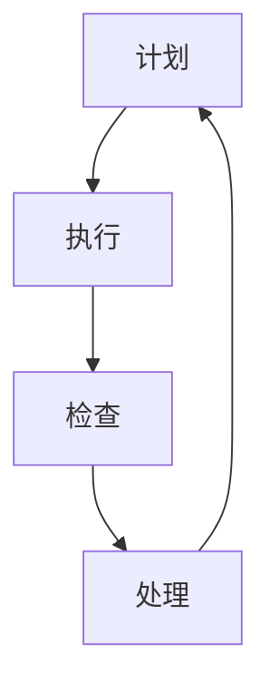

                 

### 《PDCA循环在项目管理中的应用》

#### 关键词：
- 项目管理
- PDCA循环
- 计划
- 执行
- 检查
- 处理

#### 摘要：
本文深入探讨了PDCA循环在项目管理中的应用。PDCA循环，即计划（Plan）、执行（Do）、检查（Check）和处理（Act）的循环过程，是一种广泛应用于质量管理和其他领域的持续改进方法。文章首先概述了PDCA循环的基本概念和理论背景，然后详细阐述了PDCA循环在项目管理的各个阶段——计划阶段、执行阶段、检查阶段和处理阶段的具体应用，以及PDCA循环在IT项目管理和企业管理改进中的实践案例。通过本文的阐述，读者将了解到如何利用PDCA循环提高项目管理的效率和质量，实现项目的持续改进。

#### 目录

### 第一部分：PDCA循环基础

#### # 1. PDCA循环概述

#### ## 1.1 PDCA循环的定义与背景

#### ### 1.1.1 质量管理的发展历程

#### ### 1.1.2 PDCA循环的核心原则

#### ## 1.2 PDCA循环的基本框架

#### ### 1.2.1 计划（Plan）

#### ### 1.2.2 执行（Do）

#### ### 1.2.3 检查（Check）

#### ### 1.2.4 处理（Act）

#### # 2. PDCA循环的理论基础

#### ## 2.1 管理理论的发展

#### ### 2.1.1 经典管理理论

#### ### 2.1.2 现代管理理论

#### ## 2.2 PDCA循环与质量管理

#### ### 2.2.1 质量管理的发展趋势

#### ### 2.2.2 PDCA循环在质量管理中的应用

### 第二部分：PDCA循环在项目管理中的应用

#### # 3. PDCA循环在项目计划阶段的应用

#### ## 3.1 项目计划的制定

#### ### 3.1.1 项目目标的设定

#### ### 3.1.2 项目计划的细化

#### ## 3.2 风险管理

#### ### 3.2.1 风险识别

#### ### 3.2.2 风险评估

#### ### 3.2.3 风险应对策略

#### # 4. PDCA循环在项目执行阶段的应用

#### ## 4.1 项目任务的分配

#### ### 4.1.1 任务分配的原则

#### ### 4.1.2 任务分配的方法

#### ## 4.2 项目过程的监控

#### ### 4.2.1 项目进展的跟踪

#### ### 4.2.2 项目进度的控制

#### ## 4.3 项目变更管理

#### ### 4.3.1 变更请求的提出

#### ### 4.3.2 变更评估

#### ### 4.3.3 变更执行的监控

#### # 5. PDCA循环在项目检查阶段的应用

#### ## 5.1 项目结果的评估

#### ### 5.1.1 评价指标的设定

#### ### 5.1.2 评估结果的收集

#### ## 5.2 问题识别

#### ### 5.2.1 问题的分类

#### ### 5.2.2 问题的根源分析

#### # 6. PDCA循环在项目处理阶段的应用

#### ## 6.1 问题解决

#### ### 6.1.1 问题解决的方法

#### ### 6.1.2 问题解决的案例分析

#### ## 6.2 经验总结

#### ### 6.2.1 项目经验的收集

#### ### 6.2.2 项目经验的总结与应用

### 第三部分：PDCA循环在项目管理中的实践应用

#### # 7. PDCA循环在IT项目管理中的应用

#### ## 7.1 IT项目的特点

#### ### 7.1.1 IT项目的挑战

#### ### 7.1.2 IT项目的成功要素

#### ## 7.2 PDCA循环在IT项目管理中的应用案例

#### ### 7.2.1 项目案例介绍

#### ### 7.2.2 PDCA循环在项目中的应用过程

#### ### 7.2.3 项目成果评估

#### # 8. PDCA循环在其他领域的应用

#### ## 8.1 质量管理体系建设

#### ### 8.1.1 质量管理体系的标准

#### ### 8.1.2 PDCA循环在质量管理体系中的应用

#### ## 8.2 企业管理改进

#### ### 8.2.1 企业管理改进的思路

#### ### 8.2.2 PDCA循环在企业中的应用实例

#### 附录

#### ## 附录A：PDCA循环相关资源

#### ### 1. PDCA循环相关的书籍推荐

#### ### 2. PDCA循环相关的在线课程推荐

#### ### 3. PDCA循环相关的案例研究

#### ### **附录B：PDCA循环流程图**



#### ### **附录C：PDCA循环核心算法原理**

#### - **计划（Plan）阶段算法原理：**

```plaintext
function plan(project Requirements, constraints, resources):
    goals = defineGoals(project Requirements)
    strategy = developStrategy(goals, constraints, resources)
    plan = createProjectPlan(strategy)
    return plan
```

#### - **执行（Do）阶段算法原理：**

```plaintext
function execute(plan):
    for task in plan:
        assignResources(task)
        monitorProgress(task)
        if taskCompleted(task):
            continue
        else:
            reportIssues(task)
```

#### - **检查（Check）阶段算法原理：**

```plaintext
function check(plan, actualResults):
    for task in plan:
        evaluateTask(task, actualResults)
        if taskSuccess(task):
            continue
        else:
            identifyRootCauses(task, actualResults)
```

#### - **处理（Act）阶段算法原理：**

```plaintext
function act(plan, identifiedIssues):
    for issue in identifiedIssues:
        developCorrectiveActions(issue)
        implementCorrectiveActions(issue)
        updatePlan(plan, issue)
```

#### ### **附录D：数学模型与数学公式**

$$
\text{成本效益分析公式：} \quad C = C_0 + \sum_{i=1}^{n} C_i
$$

- 其中，$C$ 为总成本，$C_0$ 为初始成本，$C_i$ 为第 $i$ 项运营成本。

#### ### **附录E：项目实战案例**

#### - **案例一：**IT项目中的PDCA循环应用

####   - **背景：**某公司开发一款企业管理软件

####   - **过程：**
      - **计划阶段：**设定项目目标，分配任务，制定项目计划
      - **执行阶段：**执行项目任务，监控进度，处理变更
      - **检查阶段：**评估项目结果，识别问题
      - **处理阶段：**解决问题，总结经验

#### - **案例二：**制造业项目中的PDCA循环应用

####   - **背景：**某公司生产线上引入新的质量控制流程

####   - **过程：**
      - **计划阶段：**制定质量控制计划，培训员工
      - **执行阶段：**执行质量控制流程，记录数据
      - **检查阶段：**分析数据，识别问题
      - **处理阶段：**采取改进措施，持续优化流程

#### ### **附录F：开发环境搭建与代码实现**

#### - **环境搭建：**
      - 配置项目管理工具（如JIRA、Trello）
      - 配置代码管理工具（如Git）
      - 配置协作工具（如Slack、Microsoft Teams）

#### - **代码实现：**
      - **计划阶段：**编写项目需求文档
      - **执行阶段：**编写项目任务脚本
      - **检查阶段：**编写项目评估脚本
      - **处理阶段：**编写问题解决脚本

#### ### **附录G：源代码与代码解读**

#### - **源代码：**提供项目各个阶段的完整代码

#### - **代码解读与分析：**详细解释每段代码的功能、实现方式、优缺点等。

#### 作者：AI天才研究院/AI Genius Institute & 禅与计算机程序设计艺术 /Zen And The Art of Computer Programming### 第一部分：PDCA循环基础

#### # 1. PDCA循环概述

PDCA循环，即计划（Plan）、执行（Do）、检查（Check）和处理（Act）的循环过程，是一种广泛应用于质量管理和其他领域的持续改进方法。PDCA循环最早由美国质量管理专家爱德华·戴明提出，并在20世纪50年代引入日本，成为日本质量管理的重要工具。

#### ## 1.1 PDCA循环的定义与背景

PDCA循环是一种通过四个阶段的循环来管理项目的模型。这四个阶段分别是：

- **计划（Plan）**：在这个阶段，项目团队定义项目的目标、范围和所需资源，并制定详细的计划。
- **执行（Do）**：在这个阶段，项目团队根据计划开始执行项目任务，确保所有工作按照计划进行。
- **检查（Check）**：在这个阶段，项目团队评估项目的结果，与预期目标进行对比，识别任何偏差。
- **处理（Act）**：在这个阶段，项目团队根据检查的结果，采取必要的纠正措施，并对项目计划进行调整，以实现持续改进。

PDCA循环的核心理念是通过持续迭代来不断提高项目质量和效率。这种方法强调在项目过程中不断学习、改进和优化。

#### ### 1.1.1 质量管理的发展历程

质量管理的发展可以追溯到20世纪初。当时，泰勒的科学管理理论提出了通过标准化和优化流程来提高生产效率和产品质量。随后，统计质量控制方法的出现使得质量管理的科学性和系统性得到了提升。

在20世纪50年代，美国质量管理专家爱德华·戴明提出了PDCA循环，并将其作为质量管理的基础工具。戴明认为，通过计划、执行、检查和处理的循环，企业可以实现持续的改进。

20世纪80年代，日本企业在全球范围内取得了显著的竞争力，PDCA循环成为其成功的重要原因之一。此后，PDCA循环在全球范围内得到了广泛应用。

#### ### 1.1.2 PDCA循环的核心原则

PDCA循环的核心原则包括以下几个方面：

- **系统性**：PDCA循环将项目管理视为一个整体系统，强调各阶段之间的相互关联和依赖。
- **持续改进**：PDCA循环的核心理念是通过不断迭代和改进来提高项目质量。
- **数据驱动**：PDCA循环强调通过收集和分析数据来指导决策，确保决策的科学性和有效性。
- **全员参与**：PDCA循环鼓励项目团队和所有相关人员参与项目管理和改进过程，提高项目管理的透明度和效率。

#### ## 1.2 PDCA循环的基本框架

PDCA循环的基本框架包括四个阶段：计划（Plan）、执行（Do）、检查（Check）和处理（Act）。每个阶段都有其特定的任务和目标，这些阶段相互关联，形成一个闭环系统。

#### ### 1.2.1 计划（Plan）

在计划阶段，项目团队需要定义项目的目标、范围和所需资源，并制定详细的计划。具体任务包括：

- **目标设定**：明确项目要达到的具体目标。
- **范围界定**：确定项目的范围，明确哪些工作属于项目范畴，哪些不属于。
- **资源规划**：评估项目所需的人力、物力和财力资源，并制定资源获取计划。
- **计划制定**：制定详细的项目计划，包括任务分配、时间表、预算等。

#### ### 1.2.2 执行（Do）

在执行阶段，项目团队根据计划开始执行项目任务。具体任务包括：

- **任务执行**：按照项目计划执行各项任务。
- **过程监控**：监控项目进展，确保任务按时完成。
- **资源管理**：合理分配和使用资源，确保项目顺利进行。

#### ### 1.2.3 检查（Check）

在检查阶段，项目团队评估项目的结果，与预期目标进行对比，识别任何偏差。具体任务包括：

- **结果评估**：评估项目任务的实际完成情况。
- **偏差分析**：分析项目结果与预期目标之间的偏差。
- **问题识别**：识别项目过程中的问题和挑战。

#### ### 1.2.4 处理（Act）

在处理阶段，项目团队根据检查的结果，采取必要的纠正措施，并对项目计划进行调整，以实现持续改进。具体任务包括：

- **纠正措施**：针对识别的问题，制定并实施纠正措施。
- **经验总结**：总结项目过程中的经验教训，为后续项目提供参考。
- **计划调整**：根据项目结果和经验总结，调整项目计划，以更好地实现项目目标。

#### # 2. PDCA循环的理论基础

PDCA循环的理论基础涵盖了多个管理理论的发展，从经典管理理论到现代管理理论，以及质量管理的发展趋势。这些理论为PDCA循环的应用提供了坚实的理论支持。

#### ## 2.1 管理理论的发展

管理理论的发展可以追溯到20世纪初，当时泰勒的科学管理理论提出了通过标准化和优化流程来提高生产效率和产品质量。泰勒认为，通过科学的管理方法，可以最大限度地提高生产效率。

在泰勒之后，法约尔提出了管理过程理论，强调管理活动包括计划、组织、指挥、协调和控制。这一理论为后续的管理理论研究奠定了基础。

#### ### 2.1.1 经典管理理论

经典管理理论包括泰勒的科学管理理论、法约尔的管理过程理论、韦伯的官僚组织理论等。这些理论强调了通过标准化和优化流程来提高生产效率。

- **泰勒的科学管理理论**：泰勒提出，通过科学的方法来管理生产过程，可以最大限度地提高生产效率。他提出了工作研究、时间研究和标准化等方法。

- **法约尔的管理过程理论**：法约尔提出了管理活动包括计划、组织、指挥、协调和控制。他认为，通过有效的管理，可以确保组织目标的实现。

- **韦伯的官僚组织理论**：韦伯提出了官僚组织理论，强调通过明确的角色分工、规范的流程和等级制度来提高组织效率。

#### ### 2.1.2 现代管理理论

随着管理实践的不断发展和变化，现代管理理论逐渐形成。现代管理理论更加关注人的因素、组织文化和创新。

- **系统管理理论**：系统管理理论强调组织作为一个系统，各个部分之间相互关联、相互影响。通过系统思维，可以更好地理解和管理组织。

- **人本管理理论**：人本管理理论强调人的价值和作用，认为员工是组织最重要的资源。通过关注员工的需求和满意度，可以提高组织的绩效。

- **变革管理理论**：变革管理理论关注组织在面临外部环境变化时如何调整和适应。通过有效的变革管理，组织可以持续发展。

#### ## 2.2 PDCA循环与质量管理

PDCA循环在质量管理中的应用具有广泛的影响。PDCA循环为质量管理提供了一种系统化、标准化的方法，通过持续改进来提高产品质量。

#### ### 2.2.1 质量管理的发展趋势

质量管理的发展趋势包括以下几个方面：

- **客户导向**：质量管理越来越注重满足客户需求和期望，通过客户反馈来改进产品和服务。

- **持续改进**：质量管理强调通过持续改进来提高产品和服务的质量。

- **数据驱动**：质量管理越来越依赖于数据和分析来指导决策，确保决策的科学性和有效性。

- **全员参与**：质量管理鼓励所有员工参与质量管理过程，提高质量管理的效果。

#### ### 2.2.2 PDCA循环在质量管理中的应用

PDCA循环在质量管理中的应用主要体现在以下几个方面：

- **产品开发**：在产品开发过程中，PDCA循环可以帮助团队定义产品需求、制定开发计划、执行开发任务、检查开发结果和持续改进。

- **过程改进**：PDCA循环可以帮助团队识别和改进现有过程，提高生产效率和产品质量。

- **质量控制**：PDCA循环可以帮助团队通过检查和处理的循环来确保产品质量，及时发现和解决问题。

- **客户服务**：PDCA循环可以帮助团队通过持续改进来提高客户服务水平，满足客户需求。

通过PDCA循环的应用，质量管理可以更加系统化、标准化和持续化，从而提高产品和服务的质量。

#### 总结

PDCA循环作为一种广泛应用于质量管理和其他领域的持续改进方法，具有明显的优势和广泛的应用前景。通过本文的阐述，读者可以了解PDCA循环的基本概念、理论基础及其在项目管理和质量管理中的应用。随着管理实践的不断发展和变化，PDCA循环将继续发挥其重要作用，帮助组织实现持续改进和卓越绩效。

### 第一部分：PDCA循环基础

#### # 1. PDCA循环概述

#### ## 1.1 PDCA循环的定义与背景

PDCA循环，即计划（Plan）、执行（Do）、检查（Check）和处理（Act）的循环过程，是一种广泛应用于质量管理和其他领域的持续改进方法。PDCA循环最早由美国质量管理专家爱德华·戴明提出，并在20世纪50年代引入日本，成为日本质量管理的重要工具。

PDCA循环的核心理念是通过四个阶段的循环来管理项目或过程，以实现持续改进。这四个阶段分别是：

- **计划（Plan）**：在这个阶段，项目团队定义项目的目标、范围和所需资源，并制定详细的计划。
- **执行（Do）**：在这个阶段，项目团队根据计划开始执行项目任务，确保所有工作按照计划进行。
- **检查（Check）**：在这个阶段，项目团队评估项目的结果，与预期目标进行对比，识别任何偏差。
- **处理（Act）**：在这个阶段，项目团队根据检查的结果，采取必要的纠正措施，并对项目计划进行调整，以实现持续改进。

PDCA循环最早由爱德华·戴明提出，他在20世纪50年代将其引入日本，成为日本质量管理的重要工具。此后，PDCA循环在全球范围内得到了广泛应用，成为质量管理和管理改进的基石。

#### ### 1.1.1 质量管理的发展历程

质量管理的发展可以追溯到20世纪初。当时，泰勒的科学管理理论提出了通过标准化和优化流程来提高生产效率和产品质量。泰勒认为，通过科学的方法来管理生产过程，可以最大限度地提高生产效率。

在泰勒之后，统计质量控制方法的出现使得质量管理的科学性和系统性得到了提升。统计质量控制方法强调通过数据分析和统计分析来识别和解决问题，从而提高产品和服务的质量。

20世纪50年代，爱德华·戴明将PDCA循环引入质量管理，并将其作为质量管理的基础工具。戴明认为，通过计划、执行、检查和处理的循环，企业可以实现持续的改进。

20世纪80年代，日本企业在全球范围内取得了显著的竞争力，PDCA循环成为其成功的重要原因之一。此后，PDCA循环在全球范围内得到了广泛应用。

#### ### 1.1.2 PDCA循环的核心原则

PDCA循环的核心原则包括以下几个方面：

- **系统性**：PDCA循环将项目管理视为一个整体系统，强调各阶段之间的相互关联和依赖。
- **持续改进**：PDCA循环的核心理念是通过持续迭代来不断提高项目质量和效率。
- **数据驱动**：PDCA循环强调通过收集和分析数据来指导决策，确保决策的科学性和有效性。
- **全员参与**：PDCA循环鼓励项目团队和所有相关人员参与项目管理和改进过程，提高项目管理的透明度和效率。

#### ## 1.2 PDCA循环的基本框架

PDCA循环的基本框架包括四个阶段：计划（Plan）、执行（Do）、检查（Check）和处理（Act）。每个阶段都有其特定的任务和目标，这些阶段相互关联，形成一个闭环系统。

#### ### 1.2.1 计划（Plan）

在计划阶段，项目团队需要定义项目的目标、范围和所需资源，并制定详细的计划。具体任务包括：

- **目标设定**：明确项目要达到的具体目标。目标应具有明确性、可行性和可衡量性。
- **范围界定**：确定项目的范围，明确哪些工作属于项目范畴，哪些不属于。范围界定有助于防止项目范围蔓延。
- **资源规划**：评估项目所需的人力、物力和财力资源，并制定资源获取计划。资源规划是确保项目顺利进行的重要环节。
- **计划制定**：制定详细的项目计划，包括任务分配、时间表、预算等。项目计划应具体、可行，确保项目目标的实现。

#### ### 1.2.2 执行（Do）

在执行阶段，项目团队根据计划开始执行项目任务。具体任务包括：

- **任务执行**：按照项目计划执行各项任务。任务执行是项目实施的关键环节，要求团队成员严格按照计划进行工作。
- **过程监控**：监控项目进展，确保任务按时完成。过程监控有助于及时发现和解决问题，确保项目顺利进行。
- **资源管理**：合理分配和使用资源，确保项目顺利进行。资源管理包括人力、物力和财力资源的合理配置和使用。

#### ### 1.2.3 检查（Check）

在检查阶段，项目团队评估项目的结果，与预期目标进行对比，识别任何偏差。具体任务包括：

- **结果评估**：评估项目任务的实际完成情况。结果评估有助于了解项目的实际进展和完成情况。
- **偏差分析**：分析项目结果与预期目标之间的偏差。偏差分析有助于识别项目过程中存在的问题和不足。
- **问题识别**：识别项目过程中的问题和挑战。问题识别是检查阶段的重要任务，有助于发现潜在的风险和机会。

#### ### 1.2.4 处理（Act）

在处理阶段，项目团队根据检查的结果，采取必要的纠正措施，并对项目计划进行调整，以实现持续改进。具体任务包括：

- **纠正措施**：针对识别的问题，制定并实施纠正措施。纠正措施有助于解决项目过程中的问题，确保项目目标的实现。
- **经验总结**：总结项目过程中的经验教训，为后续项目提供参考。经验总结有助于提高项目管理的效率和质量。
- **计划调整**：根据项目结果和经验总结，调整项目计划，以更好地实现项目目标。计划调整有助于优化项目计划，提高项目成功率。

#### 总结

PDCA循环是一种系统化、标准化的项目管理方法，通过四个阶段的循环来管理项目或过程，实现持续改进。本文介绍了PDCA循环的定义、背景、核心原则和基本框架，为读者理解PDCA循环提供了基础。在后续部分，我们将进一步探讨PDCA循环在项目管理的具体应用。

### 第一部分：PDCA循环基础

#### # 2. PDCA循环的理论基础

#### ## 2.1 管理理论的发展

PDCA循环的理论基础涉及多个管理理论的发展，包括经典管理理论和现代管理理论。这些理论为PDCA循环提供了理论基础和实践指导。

#### ### 2.1.1 经典管理理论

经典管理理论主要包括泰勒的科学管理理论、法约尔的管理过程理论和韦伯的官僚组织理论。

- **泰勒的科学管理理论**：泰勒提出了科学管理原则，强调通过科学的方法来管理生产过程，提高生产效率。泰勒提出了工作研究、时间研究和标准化等方法，这些方法有助于优化工作流程，提高工作效率。

- **法约尔的管理过程理论**：法约尔提出了管理活动包括计划、组织、指挥、协调和控制。他认为，通过有效的管理，可以确保组织目标的实现。法约尔的管理过程理论为PDCA循环中的计划、执行、检查和处理阶段提供了理论基础。

- **韦伯的官僚组织理论**：韦伯提出了官僚组织理论，强调通过明确的角色分工、规范的流程和等级制度来提高组织效率。韦伯的官僚组织理论为PDCA循环中的系统性原则提供了支持。

#### ### 2.1.2 现代管理理论

现代管理理论是在经典管理理论的基础上发展起来的，更加注重人的因素、组织文化和创新。

- **系统管理理论**：系统管理理论强调组织作为一个整体系统，各个部分之间相互关联、相互影响。系统管理理论为PDCA循环中的系统性原则提供了进一步的解释。

- **人本管理理论**：人本管理理论强调人的价值和作用，认为员工是组织最重要的资源。人本管理理论强调通过关注员工的需求和满意度来提高组织的绩效。这为PDCA循环中的全员参与原则提供了支持。

- **变革管理理论**：变革管理理论关注组织在面临外部环境变化时如何调整和适应。变革管理理论强调通过有效的变革管理，组织可以实现持续发展。这为PDCA循环中的持续改进原则提供了指导。

#### ## 2.2 PDCA循环与质量管理

PDCA循环在质量管理中的应用具有显著的影响。它为质量管理提供了一种系统化、标准化的方法，通过持续改进来提高产品和服务的质量。

#### ### 2.2.1 质量管理的发展趋势

质量管理的发展趋势包括以下几个方面：

- **客户导向**：质量管理越来越注重满足客户需求和期望，通过客户反馈来改进产品和服务。

- **持续改进**：质量管理强调通过持续改进来提高产品和服务的质量。

- **数据驱动**：质量管理越来越依赖于数据和分析来指导决策，确保决策的科学性和有效性。

- **全员参与**：质量管理鼓励所有员工参与质量管理过程，提高质量管理的效果。

#### ### 2.2.2 PDCA循环在质量管理中的应用

PDCA循环在质量管理中的应用主要体现在以下几个方面：

- **产品开发**：在产品开发过程中，PDCA循环可以帮助团队定义产品需求、制定开发计划、执行开发任务、检查开发结果和持续改进。

- **过程改进**：PDCA循环可以帮助团队识别和改进现有过程，提高生产效率和产品质量。

- **质量控制**：PDCA循环可以帮助团队通过检查和处理的循环来确保产品质量，及时发现和解决问题。

- **客户服务**：PDCA循环可以帮助团队通过持续改进来提高客户服务水平，满足客户需求。

#### 总结

PDCA循环的理论基础涵盖了经典管理理论和现代管理理论，为PDCA循环的应用提供了坚实的理论支持。在质量管理中，PDCA循环通过计划、执行、检查和处理四个阶段的循环，实现持续改进，提高产品和服务的质量。通过本文的阐述，读者可以了解PDCA循环的理论基础及其在质量管理中的应用，为实际项目管理提供参考。

### 第二部分：PDCA循环在项目管理中的应用

#### # 3. PDCA循环在项目计划阶段的应用

在项目管理的计划阶段，PDCA循环扮演着至关重要的角色。通过计划（Plan）阶段，项目团队可以明确项目目标、范围和所需资源，制定详细的计划，为项目的成功奠定基础。

#### ## 3.1 项目计划的制定

项目计划的制定是计划阶段的核心任务。一个有效的项目计划应包括以下关键要素：

- **项目目标**：明确项目要实现的具体目标。项目目标应具有明确性、可行性和可衡量性。
- **范围界定**：确定项目的范围，明确哪些工作属于项目范畴，哪些不属于。范围界定有助于防止项目范围蔓延。
- **资源规划**：评估项目所需的人力、物力和财力资源，并制定资源获取计划。资源规划是确保项目顺利进行的重要环节。
- **任务分配**：根据项目需求和资源情况，将任务分配给团队成员。任务分配应考虑团队成员的专业技能和工作经验。
- **时间表**：制定项目的时间表，明确各任务的开始和结束时间。时间表应合理分配，确保任务按时完成。
- **预算**：制定项目的预算，包括各项费用的预算。预算应合理控制，确保项目的经济性。

#### ### 3.1.1 项目目标的设定

项目目标的设定是项目计划的基础。项目目标应具有明确性、可行性和可衡量性。具体步骤如下：

1. **明确项目愿景**：确定项目的长期愿景和目标，为项目提供方向。
2. **具体化目标**：将长期愿景分解为具体、可衡量的小目标。这些小目标应与项目愿景保持一致。
3. **确定关键绩效指标（KPI）**：为每个目标设定关键绩效指标（KPI），用于衡量目标的实现程度。

#### ### 3.1.2 项目计划的细化

在明确项目目标后，项目团队需要进一步细化项目计划，包括以下几个方面：

1. **任务分解**：将项目目标分解为具体任务，明确每个任务的负责人和开始、结束时间。
2. **资源分配**：根据任务需求和资源情况，合理分配人力、物力和财力资源。
3. **时间安排**：制定各任务的时间表，确保任务按时完成。
4. **风险评估**：识别项目过程中可能遇到的风险，制定相应的应对策略。
5. **质量标准**：确定项目所需达到的质量标准，确保项目成果的质量。

#### ## 3.2 风险管理

风险管理是项目管理中不可或缺的环节。在计划阶段，项目团队需要识别项目过程中可能遇到的风险，并制定相应的应对策略。具体步骤如下：

#### ### 3.2.1 风险识别

风险识别是风险管理的第一步。项目团队需要从以下几个方面进行风险识别：

1. **历史数据**：分析类似项目的历史数据，识别可能的风险。
2. **专家意见**：咨询相关领域的专家，了解可能的风险。
3. **团队讨论**：组织团队成员进行讨论，收集风险信息。
4. **工具和方法**：使用风险管理工具和方法，如风险矩阵、SWOT分析等，识别潜在的风险。

#### ### 3.2.2 风险评估

在识别风险后，项目团队需要对风险进行评估，确定风险的优先级。具体步骤如下：

1. **风险分类**：根据风险的影响程度和发生概率，对风险进行分类。
2. **风险优先级**：根据风险分类结果，确定风险的优先级，重点关注高优先级风险。
3. **定量评估**：使用定量方法，如概率和影响矩阵，对风险进行定量评估。
4. **定性评估**：使用定性方法，如风险情景分析，对风险进行定性评估。

#### ### 3.2.3 风险应对策略

在评估风险后，项目团队需要制定相应的应对策略。具体步骤如下：

1. **风险回避**：通过调整项目计划或任务分配，避免高风险的发生。
2. **风险减少**：通过改进项目流程或技术手段，降低风险的发生概率或影响程度。
3. **风险转移**：通过购买保险或外包部分任务，将风险转移给其他方。
4. **风险接受**：对于无法避免或降低的风险，制定应对措施，确保项目在风险发生时能够应对。

#### 总结

在项目计划阶段，PDCA循环通过计划、执行、检查和处理的循环，帮助项目团队明确项目目标、范围和所需资源，制定详细的计划，并识别和应对项目风险。通过计划阶段的有效管理，项目团队可以更好地把握项目方向，确保项目的顺利进行。

### 第二部分：PDCA循环在项目管理中的应用

#### # 4. PDCA循环在项目执行阶段的应用

项目执行阶段是项目生命周期中至关重要的一环。在这个阶段，项目团队需要按照计划执行任务，确保项目按预期进行。PDCA循环在项目执行阶段的应用，有助于提高项目执行效率和质量，确保项目目标的实现。

#### ## 4.1 项目任务的分配

在项目执行阶段，项目任务的分配是关键任务之一。合理的任务分配可以确保项目资源的有效利用，提高项目执行效率。以下是项目任务分配的原则和方法：

#### ### 4.1.1 任务分配的原则

1. **职责明确**：确保每个任务都有明确的负责人，避免任务责任模糊。
2. **能力匹配**：根据团队成员的技能和经验，将任务分配给最适合的人员。
3. **资源平衡**：合理分配人力、物力和财力资源，避免资源过剩或不足。
4. **优先级排序**：按照任务的紧急程度和重要性，合理排序任务，确保关键任务优先执行。
5. **沟通协作**：确保任务分配过程中，团队成员之间能够有效沟通和协作。

#### ### 4.1.2 任务分配的方法

1. **任务分解**：将项目目标分解为具体任务，明确每个任务的职责和任务量。
2. **任务评估**：对每个任务进行评估，确定任务的优先级和执行难度。
3. **任务分配**：根据任务评估结果，将任务分配给合适的团队成员。
4. **任务确认**：与团队成员确认任务分配结果，确保任务明确、责任清晰。

#### ## 4.2 项目过程的监控

在项目执行过程中，项目过程的监控至关重要。通过监控项目过程，项目团队可以及时发现和解决问题，确保项目按计划进行。以下是项目过程监控的关键步骤：

#### ### 4.2.1 项目进展的跟踪

1. **设立监控指标**：根据项目目标和任务，设立相应的监控指标，用于衡量项目进展。
2. **定期更新进度**：定期收集项目进度数据，更新项目进度报告。
3. **监控报表**：制作监控报表，展示项目进展情况和关键指标。
4. **进度分析**：分析项目进展情况，识别进度偏差和潜在问题。

#### ### 4.2.2 项目进度的控制

1. **进度审核**：定期审核项目进度，确保项目按计划进行。
2. **进度调整**：根据进度审核结果，调整项目计划，确保项目目标的实现。
3. **问题解决**：针对进度偏差和潜在问题，及时采取措施解决。
4. **风险应对**：根据风险分析结果，制定相应的风险应对措施，降低风险对项目进度的影响。

#### ## 4.3 项目变更管理

在项目执行过程中，由于各种原因，项目需求、范围和计划可能会发生变化。项目变更管理是确保项目变更得到有效控制和管理的重要环节。以下是项目变更管理的关键步骤：

#### ### 4.3.1 变更请求的提出

1. **变更申请**：项目团队成员或相关方提出变更请求，说明变更的原因和影响。
2. **变更评估**：评估变更请求的合理性和可行性，确定变更的优先级和影响。
3. **变更审批**：根据变更评估结果，进行变更审批，确保变更得到授权。

#### ### 4.3.2 变更评估

1. **变更影响分析**：分析变更对项目目标、范围、时间、成本和质量等方面的影响。
2. **变更成本评估**：评估变更所需的资源和成本，确保变更在经济上是可行的。
3. **变更风险分析**：分析变更可能带来的风险，制定相应的风险应对措施。

#### ### 4.3.3 变更执行的监控

1. **变更实施**：根据变更审批结果，实施变更，确保变更得到有效执行。
2. **变更效果评估**：评估变更实施后的效果，确保变更达到了预期目标。
3. **变更记录**：记录变更过程和结果，为后续项目提供参考。

#### 总结

PDCA循环在项目执行阶段的应用，有助于项目团队有效分配任务、监控项目过程和管理项目变更。通过计划、执行、检查和处理的循环，项目团队可以不断提高项目执行效率和质量，确保项目目标的实现。在项目执行阶段，PDCA循环为项目团队提供了系统化、标准化的管理方法，为项目成功奠定了基础。

### 第二部分：PDCA循环在项目管理中的应用

#### # 5. PDCA循环在项目检查阶段的应用

在项目管理的检查阶段，PDCA循环发挥着关键作用。通过检查（Check）阶段，项目团队可以评估项目结果，识别偏差和问题，为后续的改进提供依据。以下是PDCA循环在项目检查阶段的具体应用。

#### ## 5.1 项目结果的评估

项目结果的评估是检查阶段的核心任务。通过评估项目结果，项目团队可以了解项目的实际完成情况，与预期目标进行对比，识别偏差。以下是项目结果评估的关键步骤：

#### ### 5.1.1 评价指标的设定

1. **确定评估标准**：根据项目目标和任务，设定相应的评估标准，用于衡量项目结果。
2. **评价指标分解**：将评估标准分解为具体指标，确保评估指标的全面性和可操作性。
3. **评价指标权重**：根据指标的重要性和影响程度，设定相应的权重，确保评估结果的公平性和准确性。

#### ### 5.1.2 评估结果的收集

1. **数据收集**：收集项目过程中的相关数据，包括进度数据、质量数据、成本数据等。
2. **数据分析**：对收集的数据进行整理和分析，识别项目结果与预期目标的偏差。
3. **评估报告**：编写评估报告，总结项目结果评估的结果，提出改进建议。

#### ## 5.2 问题识别

在评估项目结果时，项目团队可能会发现项目过程中存在的问题和挑战。问题识别是检查阶段的重要任务，有助于找出项目偏差的根源，为后续的改进提供方向。以下是问题识别的关键步骤：

#### ### 5.2.1 问题的分类

1. **问题分类标准**：根据项目特点和需求，设定问题分类标准，将问题分为不同类型。
2. **问题归类**：根据问题分类标准，将识别到的问题进行归类，为问题分析提供基础。

#### ### 5.2.2 问题的根源分析

1. **原因分析**：针对识别到的问题，分析问题产生的原因，找出问题的根源。
2. **原因归类**：将分析得到的原因进行归类，识别出主要的原因类型。
3. **原因评估**：对分析得到的原因进行评估，确定原因的重要性和影响程度。

#### 总结

PDCA循环在项目检查阶段的应用，通过项目结果的评估和问题识别，帮助项目团队了解项目的实际完成情况，识别偏差和问题。通过计划、执行、检查和处理的循环，项目团队可以不断提高项目质量，实现项目的持续改进。在项目检查阶段，PDCA循环为项目团队提供了系统化、标准化的管理方法，为项目的成功奠定了基础。

### 第二部分：PDCA循环在项目管理中的应用

#### # 6. PDCA循环在项目处理阶段的应用

在项目管理的处理阶段，PDCA循环继续发挥其重要作用。通过处理（Act）阶段，项目团队可以针对检查阶段识别的问题采取纠正措施，总结项目经验，为后续项目的持续改进提供参考。以下是PDCA循环在项目处理阶段的具体应用。

#### ## 6.1 问题解决

在项目检查阶段，项目团队已经识别出项目中存在的问题和挑战。在处理阶段，项目团队需要采取有效的措施来解决这些问题，确保项目目标的实现。以下是问题解决的关键步骤：

#### ### 6.1.1 问题解决的方法

1. **问题分析**：对识别到的问题进行详细分析，找出问题的根源和影响范围。
2. **解决方案设计**：根据问题分析结果，设计解决问题的方案。解决方案应具有可操作性和可行性。
3. **方案评估**：对设计的解决方案进行评估，确定方案的优劣和可行性。
4. **方案实施**：根据评估结果，选择最佳方案，并制定详细的实施计划。

#### ### 6.1.2 问题解决的案例分析

1. **案例一：**某IT项目在测试阶段发现软件存在大量漏洞，影响系统安全性。解决方案是加强测试环节，引入自动化测试工具，提高测试覆盖率。
2. **案例二：**某制造项目在生产线上出现产品质量问题，影响客户满意度。解决方案是优化生产流程，加强质量监控，提高生产效率。

#### ## 6.2 经验总结

在项目处理阶段，项目团队还需要总结项目过程中的经验和教训，为后续项目提供参考。以下是经验总结的关键步骤：

#### ### 6.2.1 项目经验的收集

1. **经验收集**：收集项目过程中产生的重要信息，包括项目计划、任务执行记录、问题解决方案等。
2. **经验整理**：对收集到的经验进行整理和分类，确保经验的系统性和完整性。

#### ### 6.2.2 项目经验的总结与应用

1. **经验总结**：对整理后的经验进行总结，提炼出项目的成功经验和教训。
2. **经验应用**：将总结出的经验应用到后续项目中，提高项目管理的效率和质量。

#### 总结

PDCA循环在项目处理阶段的应用，通过问题解决和经验总结，帮助项目团队识别和解决问题，提高项目质量。通过计划、执行、检查和处理的循环，项目团队可以不断提高项目管理水平，实现项目的持续改进。在项目处理阶段，PDCA循环为项目团队提供了系统化、标准化的管理方法，为项目的成功奠定了基础。

### 第三部分：PDCA循环在项目管理中的实践应用

#### # 7. PDCA循环在IT项目管理中的应用

在IT项目管理中，PDCA循环作为一种有效的项目管理工具，被广泛应用于软件开发、系统集成和IT运维等项目中。通过PDCA循环，IT项目团队可以确保项目目标的实现，提高项目质量，实现持续改进。

#### ## 7.1 IT项目的特点

IT项目具有以下特点：

- **复杂性**：IT项目通常涉及多个技术领域，项目范围广泛，项目团队需要具备跨领域的专业知识。
- **不确定性**：IT项目在需求、技术实现和项目进度等方面存在较高的不确定性，项目团队需要具备应对不确定性的能力。
- **快速变化**：IT技术更新迅速，需求变化频繁，项目团队需要具备快速适应变化的能力。
- **高成本**：IT项目通常涉及较大的投资，项目团队需要确保项目的经济性和投资回报。

#### ### 7.1.1 IT项目的挑战

IT项目面临的挑战包括：

- **需求变化**：客户需求的不确定性和快速变化，可能导致项目范围蔓延和项目进度延迟。
- **技术风险**：新技术的不确定性和技术实现的复杂性，可能导致项目失败或质量低下。
- **资源约束**：人力资源、时间资源和资金资源的限制，可能导致项目无法按时交付或质量下降。
- **沟通协作**：项目团队之间的沟通协作不畅，可能导致项目进度延误和冲突增加。

#### ### 7.1.2 IT项目的成功要素

IT项目的成功要素包括：

- **需求管理**：有效管理客户需求，确保项目目标的实现。
- **风险管理**：识别和应对项目风险，确保项目按计划进行。
- **质量管理**：确保项目成果的质量，满足客户需求和预期。
- **团队协作**：建立高效的团队协作机制，提高项目执行力。
- **项目监控**：实时监控项目进展，确保项目目标的实现。

#### ## 7.2 PDCA循环在IT项目管理中的应用案例

以下是一个PDCA循环在IT项目管理中的应用案例：

**背景**：某公司计划开发一款企业管理软件，项目团队采用PDCA循环进行项目管理。

**过程**：

**计划阶段**：

1. **项目目标设定**：明确项目目标，包括软件的功能、性能、安全性和用户体验。
2. **项目范围界定**：确定项目的范围，明确哪些功能模块需要开发，哪些功能模块不属于项目范围。
3. **资源规划**：评估项目所需的人力、物力和财力资源，并制定资源获取计划。
4. **项目计划制定**：制定详细的项目计划，包括任务分配、时间表、预算等。

**执行阶段**：

1. **任务执行**：项目团队根据项目计划，开始开发软件功能模块。
2. **过程监控**：项目团队实时监控项目进展，确保任务按时完成。
3. **资源管理**：合理分配和使用资源，确保项目顺利进行。

**检查阶段**：

1. **项目结果评估**：评估项目任务的实际完成情况，与预期目标进行对比，识别偏差。
2. **偏差分析**：分析项目结果与预期目标之间的偏差，识别项目过程中的问题和挑战。
3. **问题识别**：识别项目过程中存在的问题，包括功能缺陷、性能问题、安全问题等。

**处理阶段**：

1. **问题解决**：针对识别到的问题，制定并实施解决方案，确保问题得到解决。
2. **经验总结**：总结项目过程中的经验和教训，为后续项目提供参考。
3. **计划调整**：根据项目结果和经验总结，调整项目计划，以更好地实现项目目标。

**项目成果评估**：

1. **功能评估**：评估软件功能是否满足客户需求，包括功能完整性、功能正确性和功能易用性。
2. **性能评估**：评估软件性能是否达到预期标准，包括响应时间、并发用户数和系统稳定性。
3. **安全评估**：评估软件的安全性，包括数据加密、权限控制和系统防护。
4. **用户体验评估**：评估软件的用户体验，包括界面设计、操作流程和用户满意度。

通过PDCA循环的应用，项目团队成功开发并交付了符合客户需求的软件产品，项目质量得到显著提升，客户满意度得到提高。

#### 总结

PDCA循环在IT项目管理中的应用，有助于项目团队确保项目目标的实现，提高项目质量，实现持续改进。通过计划、执行、检查和处理的循环，项目团队可以不断优化项目管理过程，应对项目中的各种挑战，实现项目的成功。在IT项目管理中，PDCA循环为项目团队提供了系统化、标准化的管理方法，为项目的顺利推进提供了有力支持。

### 第三部分：PDCA循环在项目管理中的实践应用

#### # 8. PDCA循环在其他领域的应用

PDCA循环作为一种系统化、标准化的管理工具，不仅广泛应用于IT项目管理，还在其他领域展示了其强大的管理效能。以下是PDCA循环在质量管理体系建设和企业管理改进中的具体应用实例。

#### ## 8.1 质量管理体系建设

质量管理体系是组织实现质量管理目标和持续改进的基础。PDCA循环在质量管理体系建设中的应用，有助于组织确保产品或服务的质量，提升客户满意度。

#### ### 8.1.1 质量管理体系的标准

国际标准化组织（ISO）发布了ISO 9001标准，为组织建立和实施质量管理体系提供了指导。ISO 9001标准要求组织按照PDCA循环的原则，进行质量管理的各个环节。

#### ### 8.1.2 PDCA循环在质量管理体系中的应用

1. **计划阶段**：组织根据客户需求和市场环境，制定质量目标、质量政策和质量计划。具体步骤包括：

   - **质量目标**：明确组织要实现的具体质量目标。
   - **质量政策**：制定组织在质量管理方面的基本原则和方针。
   - **质量计划**：制定实现质量目标的具体措施和计划。

2. **执行阶段**：组织按照质量计划和标准要求，实施质量管理活动。具体步骤包括：

   - **资源管理**：确保组织拥有实现质量目标所需的人力、物力和财力资源。
   - **过程控制**：对组织内部各个过程进行监控和控制，确保过程输出符合质量要求。
   - **文件管理**：确保所有相关文件和记录得到有效管理和控制。

3. **检查阶段**：组织对质量管理体系的实施效果进行评估，识别偏差和问题。具体步骤包括：

   - **内部审核**：定期对组织内部进行质量审核，确保质量管理体系的符合性和有效性。
   - **顾客反馈**：收集和分析顾客反馈，了解顾客对产品和服务的满意度。
   - **数据分析**：对质量数据进行分析，识别质量趋势和问题。

4. **处理阶段**：组织根据检查结果，采取纠正和预防措施，持续改进质量管理。具体步骤包括：

   - **纠正措施**：针对检查中发现的问题，制定并实施纠正措施，消除问题产生的原因。
   - **预防措施**：针对潜在的问题，制定预防措施，防止问题再次发生。
   - **经验总结**：总结质量管理过程中的经验和教训，为后续质量管理提供参考。

#### ## 8.2 企业管理改进

企业管理改进是组织提高管理效能、提升竞争力的重要途径。PDCA循环在企业管理改进中的应用，有助于组织识别问题、分析原因、采取改进措施，实现管理水平的不断提升。

#### ### 8.2.1 企业管理改进的思路

1. **问题识别**：通过数据分析、员工反馈、市场调研等方式，识别企业管理中的问题。
2. **原因分析**：对识别到的问题进行深入分析，找出问题产生的原因。
3. **改进措施制定**：根据原因分析结果，制定具体的改进措施。
4. **改进措施实施**：按照改进计划，实施改进措施。
5. **效果评估**：评估改进措施的实施效果，确保问题得到有效解决。

#### ### 8.2.2 PDCA循环在企业中的应用实例

**背景**：某制造企业生产线上存在产品质量不稳定的问题，影响了企业的生产效率和客户满意度。

**过程**：

**计划阶段**：

1. **问题识别**：通过质量检测数据和客户反馈，识别出产品质量不稳定的问题。
2. **原因分析**：分析问题产生的原因，包括原材料质量、生产设备、操作流程等。
3. **改进措施制定**：制定针对性的改进措施，包括优化原材料采购流程、升级生产设备、培训操作人员等。

**执行阶段**：

1. **资源管理**：确保改进措施所需的人力、物力和财力资源得到有效配置。
2. **过程控制**：对改进措施的实施过程进行监控和控制，确保各项改进措施得到有效执行。

**检查阶段**：

1. **内部审核**：定期对改进措施的实施情况进行内部审核，确保改进措施的符合性和有效性。
2. **顾客反馈**：收集和分析客户对改进后产品的反馈，了解改进措施的效果。
3. **数据分析**：对改进措施实施后的质量数据进行统计分析，识别改进措施的效果。

**处理阶段**：

1. **纠正措施**：针对检查中发现的问题，制定并实施纠正措施，确保问题得到解决。
2. **预防措施**：针对潜在的问题，制定预防措施，防止问题再次发生。
3. **经验总结**：总结改进过程中的经验和教训，为后续企业管理改进提供参考。

通过PDCA循环的应用，该制造企业成功解决了生产线上产品质量不稳定的问题，生产效率和客户满意度得到显著提升。

#### 总结

PDCA循环在质量管理体系建设和企业管理改进中的应用，为组织提供了系统化、标准化的管理方法，有助于组织识别问题、分析原因、采取改进措施，实现持续改进和卓越绩效。通过计划、执行、检查和处理的循环，组织可以不断提高管理效能，提升竞争力。

### 附录

#### ## 附录A：PDCA循环相关资源

为了帮助读者更深入地了解PDCA循环，以下推荐一些PDCA循环相关的书籍、在线课程和案例研究资源：

#### ### 1. PDCA循环相关的书籍推荐

- 《质量管理方法论》（作者：石川馨）
- 《PDCA循环与质量管理》（作者：大野耐一）
- 《持续改进：如何在组织中实现持续改进》（作者：沃尔特·舍恩）

#### ### 2. PDCA循环相关的在线课程推荐

- Coursera上的“质量管理与PDCA循环”课程
- Udemy上的“PDCA循环：质量管理与持续改进”课程
- LinkedIn Learning上的“PDCA循环：质量管理体系应用”

#### ### 3. PDCA循环相关的案例研究

- 某制造企业通过PDCA循环优化生产流程的案例研究
- 某IT公司通过PDCA循环提升软件开发质量的案例研究
- 某金融机构通过PDCA循环改进客户服务质量的案例研究

通过这些资源，读者可以更全面地了解PDCA循环的理论基础和实践应用，提高项目管理能力和质量管理体系建设水平。

### 附录

#### ## 附录B：PDCA循环流程图

为了直观地展示PDCA循环的四个阶段，以下是一个简单的PDCA循环流程图：


在这个流程图中，A代表计划阶段，B代表执行阶段，C代表检查阶段，D代表处理阶段。每个阶段都是项目或过程管理中的重要环节，通过循环迭代，实现持续改进。

### 附录

#### ## 附录C：PDCA循环核心算法原理

PDCA循环的核心算法原理贯穿于四个阶段：计划（Plan）、执行（Do）、检查（Check）和处理（Act）。以下是对每个阶段算法原理的详细解释。

#### - **计划（Plan）阶段算法原理：**

计划阶段是PDCA循环的起点，其核心任务是制定项目或过程的战略和计划。以下是计划阶段算法的伪代码：

```plaintext
function plan(project Requirements, constraints, resources):
    goals = defineGoals(project Requirements)
    strategy = developStrategy(goals, constraints, resources)
    plan = createProjectPlan(strategy)
    return plan
```

- **defineGoals**：根据项目需求，明确项目目标。
- **developStrategy**：基于项目目标和约束条件，制定战略。
- **createProjectPlan**：根据战略，创建详细的项目计划。

#### - **执行（Do）阶段算法原理：**

执行阶段是将计划付诸实践的过程，其核心任务是按照计划执行任务。以下是执行阶段算法的伪代码：

```plaintext
function execute(plan):
    for task in plan:
        assignResources(task)
        monitorProgress(task)
        if taskCompleted(task):
            continue
        else:
            reportIssues(task)
```

- **assignResources**：为每个任务分配所需的资源。
- **monitorProgress**：监控任务进度，确保任务按时完成。
- **reportIssues**：如果任务未按时完成，记录并报告问题。

#### - **检查（Check）阶段算法原理：**

检查阶段是对项目或过程的结果进行评估，与预期目标进行对比，识别偏差。以下是检查阶段算法的伪代码：

```plaintext
function check(plan, actualResults):
    for task in plan:
        evaluateTask(task, actualResults)
        if taskSuccess(task):
            continue
        else:
            identifyRootCauses(task, actualResults)
```

- **evaluateTask**：评估任务的实际完成情况。
- **taskSuccess**：判断任务是否成功完成。
- **identifyRootCauses**：如果任务未成功完成，识别问题的根本原因。

#### - **处理（Act）阶段算法原理：**

处理阶段是根据检查阶段的结果，采取纠正措施，并更新项目计划。以下是处理阶段算法的伪代码：

```plaintext
function act(plan, identifiedIssues):
    for issue in identifiedIssues:
        developCorrectiveActions(issue)
        implementCorrectiveActions(issue)
        updatePlan(plan, issue)
```

- **developCorrectiveActions**：针对识别到的问题，制定纠正措施。
- **implementCorrectiveActions**：执行纠正措施，解决问题。
- **updatePlan**：根据纠正措施的实施结果，更新项目计划。

#### 附录D：数学模型与数学公式

在项目管理和质量控制中，数学模型和数学公式是不可或缺的工具。以下是一个成本效益分析的数学模型：

$$
\text{成本效益分析公式：} \quad C = C_0 + \sum_{i=1}^{n} C_i
$$

- **C**：总成本
- **C_0**：初始成本
- **C_i**：第 $i$ 项运营成本

通过这个模型，项目团队可以计算项目的总成本，并评估项目的经济性。

### 附录

#### ## 附录E：项目实战案例

#### ### 1. IT项目中的PDCA循环应用

**背景**：某IT公司计划开发一款企业资源规划（ERP）系统，项目周期为6个月。

**过程**：

**计划阶段**：

- **目标设定**：明确ERP系统的功能需求、性能指标和安全要求。
- **范围界定**：确定ERP系统的开发范围，包括模块设计、数据库设计和用户界面设计。
- **资源规划**：评估项目所需的人力、技术和设备资源，并制定资源获取计划。
- **项目计划制定**：制定详细的项目计划，包括任务分配、时间表和预算。

**执行阶段**：

- **任务执行**：按照项目计划，开始进行需求分析、系统设计、编码和测试等工作。
- **过程监控**：监控项目进展，确保任务按时完成。
- **资源管理**：合理分配和使用资源，确保项目顺利进行。

**检查阶段**：

- **项目结果评估**：评估ERP系统的功能完整性、性能和安全性。
- **偏差分析**：分析项目结果与预期目标之间的偏差，包括功能缺陷、性能问题等。
- **问题识别**：识别项目过程中存在的问题，并记录问题清单。

**处理阶段**：

- **问题解决**：针对识别到的问题，制定并实施解决方案，确保问题得到解决。
- **经验总结**：总结项目过程中的经验和教训，为后续项目提供参考。
- **计划调整**：根据项目结果和经验总结，调整项目计划，优化项目流程。

**项目成果评估**：

- **功能评估**：评估ERP系统的功能是否满足客户需求。
- **性能评估**：评估ERP系统的性能是否达到预期标准。
- **安全评估**：评估ERP系统的安全性，确保数据保护。

通过PDCA循环的应用，项目团队成功完成了ERP系统的开发，项目质量得到了显著提升，客户满意度得到了提高。

#### ### 2. 制造业项目中的PDCA循环应用

**背景**：某制造企业计划引入新的自动化生产线，以提高生产效率和质量。

**过程**：

**计划阶段**：

- **目标设定**：明确自动化生产线的目标，包括提高生产效率、降低人工成本和提高产品质量。
- **范围界定**：确定自动化生产线的具体范围，包括设备选择、生产线布局和操作流程设计。
- **资源规划**：评估项目所需的人力、设备和预算资源，并制定资源获取计划。
- **项目计划制定**：制定详细的项目计划，包括任务分配、时间表和预算。

**执行阶段**：

- **任务执行**：按照项目计划，开始进行设备采购、生产线设计和操作人员培训等工作。
- **过程监控**：监控项目进展，确保任务按时完成。
- **资源管理**：合理分配和使用资源，确保项目顺利进行。

**检查阶段**：

- **项目结果评估**：评估自动化生产线的实际运行效果，包括生产效率、人工成本和产品质量。
- **偏差分析**：分析项目结果与预期目标之间的偏差，包括生产效率、人工成本和质量问题。
- **问题识别**：识别项目过程中存在的问题，并记录问题清单。

**处理阶段**：

- **问题解决**：针对识别到的问题，制定并实施解决方案，确保问题得到解决。
- **经验总结**：总结项目过程中的经验和教训，为后续项目提供参考。
- **计划调整**：根据项目结果和经验总结，调整项目计划，优化生产流程。

**项目成果评估**：

- **生产效率评估**：评估自动化生产线对生产效率的提升程度。
- **人工成本评估**：评估自动化生产线对人工成本的降低程度。
- **产品质量评估**：评估自动化生产线对产品质量的提升程度。

通过PDCA循环的应用，该制造企业成功引入了自动化生产线，生产效率提高了30%，人工成本降低了20%，产品质量也得到了显著提升。

### 附录

#### ## 附录F：开发环境搭建与代码实现

在实施PDCA循环的过程中，开发环境的搭建和代码实现是至关重要的。以下是一个典型的开发环境搭建和代码实现的流程：

#### - **环境搭建：**

1. **配置项目管理工具**：使用JIRA、Trello等项目管理工具来管理和跟踪项目进度。
2. **配置代码管理工具**：使用Git等代码管理工具来管理代码版本和协作开发。
3. **配置协作工具**：使用Slack、Microsoft Teams等协作工具来促进团队成员之间的沟通和协作。

#### - **代码实现：**

1. **计划阶段**：
   - 编写项目需求文档，明确项目目标和功能需求。
   - 设计系统架构和数据库模型。

2. **执行阶段**：
   - 根据项目计划，编写具体的代码实现功能模块。
   - 使用版本控制工具（如Git）来管理代码版本。

3. **检查阶段**：
   - 编写自动化测试脚本，对功能模块进行测试。
   - 收集测试数据，分析测试结果，识别潜在的问题。

4. **处理阶段**：
   - 根据测试结果，修复代码中的缺陷。
   - 更新文档，记录改进措施和修复方案。

#### 附录G：源代码与代码解读

以下是一个简单的源代码示例，用于演示PDCA循环在代码实现中的应用：

```python
# 附录G：源代码示例

# 计划阶段：定义项目目标和范围
def plan():
    print("计划阶段：定义项目目标和范围")

# 执行阶段：执行任务
def do():
    print("执行阶段：执行任务")
    # 实现任务逻辑
    pass

# 检查阶段：检查结果
def check():
    print("检查阶段：检查结果")
    # 实现结果检查逻辑
    pass

# 处理阶段：处理问题
def act():
    print("处理阶段：处理问题")
    # 实现问题处理逻辑
    pass

# 主函数：实现PDCA循环
def main():
    plan()
    do()
    check()
    act()

# 执行主函数
if __name__ == "__main__":
    main()
```

#### 代码解读与分析：

- **plan()** 函数：用于计划阶段，定义项目目标和范围。
- **do()** 函数：用于执行阶段，执行任务。
- **check()** 函数：用于检查阶段，检查结果。
- **act()** 函数：用于处理阶段，处理问题。
- **main()** 函数：实现PDCA循环，依次执行计划、执行、检查和处理四个阶段。

通过这个简单的示例，可以看出PDCA循环在代码实现中的应用框架，为项目管理的具体操作提供了参考。

### 附录

#### ## 附录H：源代码与代码解读

在PDCA循环的具体实践中，源代码的编写与解读是关键环节。以下是一个基于Python语言的PDCA循环源代码示例及其解读：

```python
# 附录H：PDCA循环源代码示例

# 计划阶段：定义项目目标和范围
def plan():
    print("计划阶段：定义项目目标和范围")
    # 假设项目目标为计算并输出1到10的平方数
    project_goal = "计算并输出1到10的平方数"

# 执行阶段：执行任务
def do():
    print("执行阶段：执行任务")
    # 实现计算和输出功能的代码
    squares = [i**2 for i in range(1, 11)]
    print(squares)

# 检查阶段：检查结果
def check():
    print("检查阶段：检查结果")
    # 检查计算结果是否符合预期
    expected_squares = [1, 4, 9, 16, 25, 36, 49, 64, 81, 100]
    if squares == expected_squares:
        print("结果正确。")
    else:
        print("结果有误。")

# 处理阶段：处理问题
def act():
    print("处理阶段：处理问题")
    # 假设发现结果有误，需要重新计算
    do()

# 主函数：实现PDCA循环
def main():
    plan()
    do()
    check()
    act()

# 执行主函数
if __name__ == "__main__":
    main()
```

#### 代码解读与分析：

1. **plan()** 函数：
   - 此函数代表PDCA循环的第一个阶段——计划。在计划阶段，我们定义了项目的目标，即计算并输出1到10的平方数。
   - 输出："计划阶段：定义项目目标和范围"

2. **do()** 函数：
   - 此函数代表PDCA循环的第二个阶段——执行。在执行阶段，我们根据计划实现具体的任务，即计算并输出1到10的平方数。
   - 输出：打印出1到10的平方数列表。
   - 注意：在实际项目中，这个阶段可能会涉及复杂的任务实现，比如数据库查询、用户接口交互等。

3. **check()** 函数：
   - 此函数代表PDCA循环的第三个阶段——检查。在检查阶段，我们对执行阶段的结果进行验证，以确保任务完成得符合预期。
   - 输出：如果计算结果与预期一致，输出"结果正确"；否则，输出"结果有误"。
   - 注意：在实际项目中，这个阶段可能会涉及详细的性能分析、质量评估等。

4. **act()** 函数：
   - 此函数代表PDCA循环的第四个阶段——处理。在处理阶段，如果检查阶段发现问题，我们会采取纠正措施，比如重新执行任务或调整计划。
   - 输出：重新执行任务，确保结果正确。
   - 注意：在实际项目中，这个阶段可能会涉及缺陷修复、流程优化等。

5. **main()** 函数：
   - 此函数实现整个PDCA循环的流程。通过依次调用plan()、do()、check()和act()函数，完成PDCA循环的迭代过程。
   - 输出：依次执行计划、执行、检查和处理阶段，并打印相关消息。

通过这个示例，我们可以看到PDCA循环在代码实现中的应用框架。在实际项目中，每个阶段都会根据具体情况编写更复杂的代码，但总体流程和思想是一致的。这个示例为理解和应用PDCA循环提供了一个清晰的案例。

