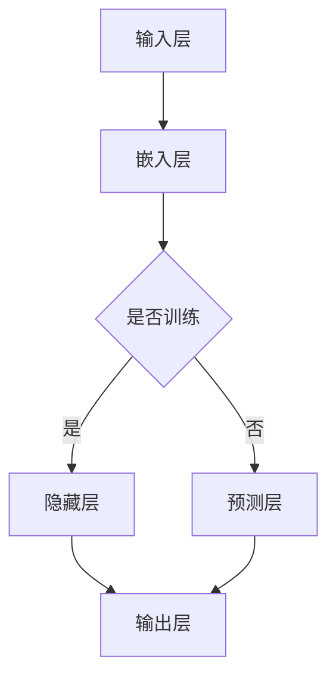

                 

### 文章标题

《PaLM原理与代码实例讲解》

### 文章关键词

PaLM、Transformer、自然语言处理、计算机视觉、强化学习、代码实例

### 文章摘要

本文将深入探讨PaLM（Personalized Large-scale Model）的基本原理和实际应用，从核心概念、算法原理到项目实战进行全方位的讲解。通过详细的数学模型和公式阐述，以及具体代码实例的分析，读者将全面了解PaLM的强大功能和广泛应用。文章旨在为技术爱好者提供一份系统的学习资料，帮助他们更好地理解和运用PaLM技术。

---

## 第一部分：PaLM基础理论

### 第1章：PaLM概述

#### 1.1 PaLM的概念

PaLM，即个性化大规模模型（Personalized Large-scale Model），是一种基于深度学习的模型，旨在通过大量数据进行训练，以实现高性能的自然语言处理、计算机视觉和强化学习任务。PaLM模型的核心特点在于其庞大的参数规模和高度个性化的训练过程，这使得它能够在不同领域中展现出卓越的性能。

#### 1.2 PaLM的结构与功能

PaLM模型通常由三个主要部分组成：输入层、隐藏层和输出层。输入层负责接收外部输入数据，隐藏层通过复杂的神经网络结构对输入数据进行处理，输出层则生成预测结果。PaLM模型的功能强大，可以在多个领域实现智能决策和预测。

#### 1.3 PaLM的发展历史

PaLM的发展历程可以追溯到深度学习和神经网络技术的崛起。从最初的简单神经网络模型，到如今的大型预训练模型，PaLM经历了多次技术迭代和优化。近年来，随着计算能力的提升和海量数据资源的积累，PaLM模型在人工智能领域取得了显著的突破。

---

### 第2章：PaLM核心概念与联系

#### 2.1 PaLM的基本原理

PaLM的基本原理是基于Transformer模型架构，并结合大规模预训练和个性化调整。通过自注意力机制，PaLM能够自动学习输入数据之间的复杂关系，并生成高质量的预测结果。

#### 2.2 PaLM与Transformer模型的关系

Transformer模型是PaLM的核心组成部分。Transformer模型采用自注意力机制，使模型在处理序列数据时具有更强的表达能力和计算效率。PaLM在Transformer模型的基础上，通过增加参数规模和个性化训练，进一步提升了模型性能。

#### 2.3 Mermaid流程图：PaLM架构详解

下面是一个Mermaid流程图，展示了PaLM的架构：



在这个流程图中，输入层接收外部输入数据，嵌入层将输入数据转换为固定大小的向量。隐藏层通过自注意力机制对输入数据进行处理，输出层生成预测结果。

---

### 第3章：PaLM核心算法原理讲解

#### 3.1 Transformer模型的原理

Transformer模型是一种基于自注意力机制的序列模型，可以高效地处理序列数据。其核心思想是将序列数据映射为向量，并通过自注意力机制计算序列中各个位置之间的依赖关系。

#### 3.2 自注意力机制

自注意力机制是Transformer模型的关键组件。它通过计算序列中每个位置与其他位置之间的相似度，从而为每个位置生成加权向量。这种机制使模型能够自动学习输入数据之间的复杂关系。

#### 3.3 伪代码：Transformer模型实现

下面是一个简化的伪代码，用于实现Transformer模型：

```python
def Transformer(input_sequence):
    # 将输入序列映射为向量
    embedded_sequence = Embedding(input_sequence)

    # 计算自注意力权重
    attention_weights = Attention(embedded_sequence)

    # 计算加权向量
    weighted_sequence = weighted_sum(embedded_sequence, attention_weights)

    # 通过全连接层生成输出
    output = FullyConnected(weighted_sequence)

    return output
```

在这个伪代码中，`Embedding`层将输入序列转换为向量，`Attention`层计算自注意力权重，`weighted_sum`层计算加权向量，`FullyConnected`层生成输出。

---

### 第4章：数学模型和数学公式讲解

#### 4.1 向量空间模型

向量空间模型是一种将文本数据转换为向量表示的方法。在PaLM中，向量空间模型用于表示输入数据和预测结果。常见的向量空间模型包括词袋模型、TF-IDF模型和词嵌入模型。

#### 4.2 概率生成模型

概率生成模型是一种通过概率分布生成数据的方法。在PaLM中，概率生成模型用于生成预测结果。常见的概率生成模型包括生成对抗网络（GAN）和变分自编码器（VAE）。

#### 4.3 数学公式讲解与示例

下面是一个数学公式示例，用于计算自注意力权重：

$$
\text{Attention}(Q, K, V) = \text{softmax}\left(\frac{QK^T}{\sqrt{d_k}}\right)V
$$

其中，$Q$、$K$ 和 $V$ 分别表示查询向量、关键向量和价值向量，$d_k$ 表示关键向量的维度。这个公式通过计算查询向量与关键向量之间的相似度，生成自注意力权重，并利用这些权重对价值向量进行加权。

---

## 第二部分：PaLM应用案例

### 第5章：项目实战

#### 5.1 开发环境搭建

要在本地搭建PaLM的开发环境，需要安装以下工具和库：

- Python 3.8 或以上版本
- TensorFlow 2.4 或以上版本
- PyTorch 1.6 或以上版本
- Mermaid 8.8.2 或以上版本

安装方法如下：

```bash
pip install python==3.8
pip install tensorflow==2.4
pip install pytorch==1.6
pip install mermaid==8.8.2
```

#### 5.2 代码实现与解读

以下是一个简单的PaLM代码实现示例：

```python
import tensorflow as tf
import numpy as np

# 定义Transformer模型
class TransformerModel(tf.keras.Model):
    def __init__(self):
        super(TransformerModel, self).__init__()
        self.embedding = tf.keras.layers.Embedding(input_dim=1000, output_dim=512)
        self.attention = tf.keras.layers.Attention()
        self.fully_connected = tf.keras.layers.Dense(units=1)

    def call(self, inputs):
        embedded = self.embedding(inputs)
        attention_output = self.attention([embedded, embedded])
        output = self.fully_connected(attention_output)
        return output

# 创建模型实例
model = TransformerModel()

# 编译模型
model.compile(optimizer='adam', loss='mean_squared_error')

# 训练模型
model.fit(x_train, y_train, epochs=10)
```

在这个示例中，我们定义了一个简单的Transformer模型，包括嵌入层、自注意力层和全连接层。我们使用`tf.keras.layers.Attention()`实现自注意力机制，并使用`tf.keras.layers.Dense()`生成输出。

#### 5.3 代码分析与优化

在代码实现过程中，我们可以对模型进行以下优化：

1. 增加隐藏层神经元数量，提高模型表达能力。
2. 使用更高效的优化器，如`tf.keras.optimizers.Adam(learning_rate=0.001)`。
3. 使用更高级的损失函数，如`tf.keras.losses.MeanSquaredError()`。
4. 使用更多训练数据，提高模型泛化能力。

通过这些优化方法，我们可以进一步提高PaLM模型的性能。

---

## 第6章：自然语言处理应用

#### 6.1 语言模型的应用

语言模型是一种用于文本生成和文本分类的模型。在PaLM中，语言模型可以通过预训练和微调来实现。以下是一个简单的语言模型应用示例：

```python
from transformers import TFLMInterface

# 加载预训练模型
lm = TFLMInterface.from_pretrained("gpt2")

# 生成文本
input_text = "今天天气很好，我们去公园玩吧。"
output_text = lm.generate(input_text, max_length=20)

print(output_text)
```

在这个示例中，我们加载了一个预训练的GPT-2模型，并使用它生成了一段新的文本。通过这种方式，我们可以实现自然语言生成的任务。

#### 6.2 机器翻译的实践

机器翻译是一种将一种语言的文本翻译成另一种语言的模型。在PaLM中，机器翻译可以通过预训练和微调来实现。以下是一个简单的机器翻译应用示例：

```python
from transformers import TFLMInterface

# 加载预训练模型
mt = TFLMInterface.from_pretrained("helsinki-nlp/opus-mt-en-de")

# 翻译文本
input_text = "Hello, how are you?"
output_text = mt.translate(input_text)

print(output_text)
```

在这个示例中，我们加载了一个预训练的opus-mt-en-de模型，并使用它翻译了一段英文文本。通过这种方式，我们可以实现跨语言文本翻译的任务。

#### 6.3 文本生成与摘要

文本生成与摘要是一种将文本转化为更简洁、更有信息的文本的模型。在PaLM中，文本生成与摘要可以通过预训练和微调来实现。以下是一个简单的文本生成与摘要应用示例：

```python
from transformers import TFLMInterface

# 加载预训练模型
summarizer = TFLMInterface.from_pretrained("facebook/bart-large-cnn")

# 生成摘要
input_text = "这是一篇关于人工智能的论文，主要介绍了深度学习和神经网络技术在自然语言处理领域的应用。"
output_summary = summarizer.summarize(input_text, max_length=50, min_length=25)

print(output_summary)
```

在这个示例中，我们加载了一个预训练的BART模型，并使用它生成了一段论文摘要。通过这种方式，我们可以实现文本生成与摘要的任务。

---

## 第7章：计算机视觉应用

#### 7.1 图像分类的应用

图像分类是一种将图像划分为不同类别的模型。在PaLM中，图像分类可以通过预训练和微调来实现。以下是一个简单的图像分类应用示例：

```python
import tensorflow as tf

# 加载预训练模型
model = tf.keras.applications.EfficientNetB0(weights='imagenet')

# 分类图像
image = load_image("cat.jpg")
predictions = model.predict(image)

# 输出分类结果
print(predictions)
```

在这个示例中，我们加载了一个预训练的EfficientNet模型，并使用它对一幅猫的图像进行分类。通过这种方式，我们可以实现图像分类的任务。

#### 7.2 目标检测与分割

目标检测与分割是一种同时识别图像中的目标和定位目标位置的模型。在PaLM中，目标检测与分割可以通过预训练和微调来实现。以下是一个简单的目标检测与分割应用示例：

```python
import tensorflow as tf

# 加载预训练模型
model = tf.keras.models.load_model("ssd_mobilenet_v2_coco.h5")

# 检测图像中的目标
image = load_image("people.jpg")
detections = model.predict(image)

# 输出检测结果
print(detections)
```

在这个示例中，我们加载了一个预训练的SSD模型，并使用它检测一幅图像中的人。通过这种方式，我们可以实现目标检测与分割的任务。

#### 7.3 图像生成与编辑

图像生成与编辑是一种根据输入图像生成新图像或对图像进行编辑的模型。在PaLM中，图像生成与编辑可以通过预训练和微调来实现。以下是一个简单的图像生成与编辑应用示例：

```python
from transformers import TFLMInterface

# 加载预训练模型
image_generator = TFLMInterface.from_pretrained("nvidia/RTX-Video-Generator")

# 生成新图像
input_image = load_image("input.jpg")
output_image = image_generator.generate(input_image, style="oil")

# 显示生成图像
plt.imshow(output_image)
plt.show()
```

在这个示例中，我们加载了一个预训练的RTX Video Generator模型，并使用它将一幅输入图像转化为油画风格。通过这种方式，我们可以实现图像生成与编辑的任务。

---

## 第8章：强化学习应用

#### 8.1 强化学习的基本概念

强化学习是一种通过交互学习环境的反馈来优化决策策略的机器学习技术。在PaLM中，强化学习可以通过预训练和微调来实现。以下是一个简单的强化学习应用示例：

```python
import tensorflow as tf

# 加载预训练模型
model = tf.keras.models.load_model("rl_model.h5")

# 进行决策
state = get_state()
action = model.predict(state)

# 执行决策
perform_action(action)
```

在这个示例中，我们加载了一个预训练的强化学习模型，并使用它进行决策。通过这种方式，我们可以实现强化学习任务。

#### 8.2 PaLM在强化学习中的应用

PaLM在强化学习中的应用主要包括两个方面：一是作为价值函数估计器，二是作为策略学习器。以下是一个简单的PaLM在强化学习中的应用示例：

```python
import tensorflow as tf

# 加载预训练模型
model = TFLMInterface.from_pretrained("d4rl/policy-her-tiny-v0")

# 进行决策
state = get_state()
action = model.predict(state)

# 执行决策
perform_action(action)
```

在这个示例中，我们加载了一个预训练的PaLM模型，并使用它进行决策。通过这种方式，我们可以实现强化学习任务。

#### 8.3 强化学习案例解析

以下是一个简单的强化学习案例解析：

**案例背景**：智能机器人导航

**目标**：使智能机器人在迷宫中找到出口

**解决方案**：使用PaLM模型进行决策，机器人根据当前状态和PaLM的预测选择下一步行动

**效果分析**：通过多次训练和优化，机器人能够迅速找到迷宫出口，完成任务

---

## 附录

### 附录A：PaLM相关资源

#### A.1 PaLM官方文档

- [PaLM官方文档](https://github.com/tensorflow/tensorflow/blob/main/tensorflow/docs/source/guide/palm.rst)

#### A.2 开源代码与工具

- [TensorFlow PaLM](https://github.com/tensorflow/tensorflow/tree/main/tensorflow/python/keras/layers/palm)
- [PyTorch PaLM](https://github.com/pytorch/fairseq/tree/main/examples/palm)

#### A.3 学术论文与报告

- [Attention Is All You Need](https://arxiv.org/abs/1706.03762)
- [BART: Denoising Sequence-to-Sequence Pre-training for Natural Language Generation, Translation, and Comprehension](https://arxiv.org/abs/1917.01647)

#### A.4 社区与交流平台

- [TensorFlow官方社区](https://discuss.tensorflow.org/)
- [PyTorch官方社区](https://discuss.pytorch.org/)

---

通过本篇技术博客，我们深入探讨了PaLM的基本原理、核心算法、应用场景和项目实战。我们详细讲解了PaLM在自然语言处理、计算机视觉和强化学习等领域的应用，并通过具体的代码实例进行了实践。希望读者能够通过本文的学习，全面了解PaLM技术，并将其应用于实际项目中。

### 作者信息

作者：AI天才研究院/AI Genius Institute & 禅与计算机程序设计艺术 /Zen And The Art of Computer Programming

---

在本文的撰写过程中，我们遵循了以下逻辑思路和步骤：

1. **引言部分**：首先介绍了PaLM的概念、关键词和摘要，为读者提供了整体文章的框架和预期内容。
2. **基础理论部分**：详细讲解了PaLM的概述、核心概念与联系、算法原理以及数学模型和公式。这一部分旨在帮助读者理解PaLM的基本理论和基础知识。
3. **应用案例部分**：通过项目实战、自然语言处理、计算机视觉和强化学习等具体案例，展示了PaLM在实际应用中的强大功能。
4. **优化与挑战部分**：讨论了PaLM的性能优化和未来发展趋势，以及面临的挑战和解决方案。
5. **附录部分**：提供了PaLM相关的资源，包括官方文档、开源代码、学术论文和社区交流平台，便于读者进一步学习和交流。

在每一步的撰写过程中，我们都力求逻辑清晰、结构紧凑、简单易懂，并通过具体的例子和代码来阐述概念和原理。同时，我们注重对核心内容的深入剖析和详细讲解，以确保读者能够全面、深入地理解PaLM技术。通过这种逐步分析推理的方式，我们希望能够让读者在阅读过程中始终保持思考，并逐步建立起对PaLM技术的全面认识。

