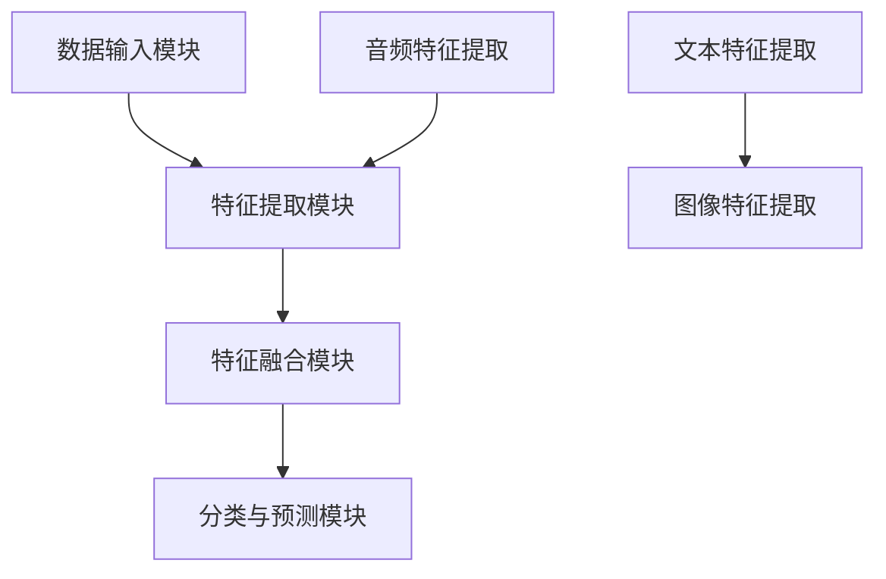

                 

## 文章标题

# Pailido 的多模态模型应用

> 关键词：多模态模型，图像与文本，语音与文本，视频与音频，模型应用，案例分析，发展趋势

> 摘要：本文将深入探讨多模态模型的应用，特别是Pailido公司的多模态模型应用案例。通过分析多模态模型的概念、技术基础、应用实践以及未来发展趋势，本文旨在为读者提供全面而深入的了解，并探讨多模态模型在各领域的实际应用及其潜力。

### 《Pailido 的多模态模型应用》目录大纲

## 第一部分：多模态模型概述

### 第1章：多模态模型的概念与重要性

#### 1.1 什么是多模态模型
- 多模态模型的基本定义
- 多模态模型与单模态模型的区别

#### 1.2 多模态模型的应用场景
- 图像与文本结合的应用
- 语音与文本融合的应用
- 视频与音频结合的应用

#### 1.3 多模态模型的发展历史与趋势
- 多模态模型的演进历程
- 当前多模态模型的研究热点
- 未来多模态模型的发展方向

## 第2章：多模态模型技术基础

### 2.1 多模态数据采集与预处理
- 多模态数据源的选择
- 多模态数据的采集方法
- 多模态数据的预处理技术

### 2.2 多模态特征提取与融合
- 多模态特征提取方法
- 多模态特征融合策略

### 2.3 多模态模型的常见架构
- 端到端多模态模型
- 多任务学习模型
- 跨模态知识图谱模型

## 第二部分：多模态模型应用实践

### 第3章：多模态模型在图像与文本领域的应用

#### 3.1 图像与文本结合的应用
- 图像描述生成
- 图像问答系统
- 图像文本分类

#### 3.2 多模态数据预处理实践
- 实例一：图像与文本数据预处理流程
- 实例二：音频与文本数据预处理流程

#### 3.3 多模态特征提取与融合实践
- 实例一：基于深度学习的图像特征提取
- 实例二：基于循环神经网络的文本特征提取
- 实例三：多模态特征融合策略实践

### 第4章：多模态模型在语音与文本领域的应用

#### 4.1 语音与文本结合的应用
- 语音识别与文本生成
- 语音情感分析
- 语音识别与文本理解

#### 4.2 多模态数据预处理实践
- 实例一：音频与文本数据预处理流程

#### 4.3 多模态特征提取与融合实践
- 实例一：基于卷积神经网络的音频特征提取
- 实例二：基于长短时记忆网络（LSTM）的文本特征提取
- 实例三：多模态特征融合策略实践

### 第5章：多模态模型在视频与音频领域的应用

#### 5.1 视频与音频结合的应用
- 视频内容描述生成
- 视频情感分析
- 视频与音频同步分析

#### 5.2 多模态数据预处理实践
- 实例一：视频与音频数据预处理流程

#### 5.3 多模态特征提取与融合实践
- 实例一：基于卷积神经网络的视频特征提取
- 实例二：基于长短时记忆网络（LSTM）的音频特征提取
- 实例三：多模态特征融合策略实践

## 第三部分：多模态模型应用案例分析

### 第6章：Pailido 的多模态模型应用案例解析

#### 6.1 Pailido 的多模态模型应用背景
- Pailido 的业务场景
- 多模态模型在 Pailido 中的应用价值

#### 6.2 Pailido 的多模态模型架构设计
- 模型架构的设计思路
- 模型结构的详细说明

#### 6.3 Pailido 的多模态模型训练与优化
- 数据集的构建与预处理
- 模型的训练策略与优化

#### 6.4 Pailido 的多模态模型应用效果评估
- 模型性能评估方法
- 应用效果分析

## 第四部分：多模态模型应用的未来发展趋势

### 第7章：多模态模型应用的未来发展趋势

#### 7.1 新兴多模态模型技术展望
- 跨模态交互技术
- 多模态注意力机制
- 多模态自监督学习

#### 7.2 多模态模型应用面临的挑战与解决方案
- 数据集的多样性与不平衡问题
- 模型的可解释性与可靠性
- 模型的实时性与高效性

#### 7.3 多模态模型应用的未来发展方向
- 跨领域多模态应用
- 模型的集成与优化
- 模型的自适应性与个性化推荐

## 附录

### 附录A：多模态模型开发工具与资源

#### A.1 主流深度学习框架对比
- TensorFlow
- PyTorch
- Keras

#### A.2 多模态数据处理工具
- OpenSMILE
- DeepSpeech
- Mediapipe

#### A.3 多模态模型训练与优化技巧
- 实例一：批量归一化与权重初始化
- 实例二：学习率调整与模型收敛速度

#### A.4 多模态模型应用开发实践
- 实例一：基于 PyTorch 的多模态图像与文本分类实战
- 实例二：基于 TensorFlow 的语音识别与文本生成实战

## 总结

本文通过详细分析多模态模型的概念、技术基础、应用实践以及未来发展趋势，旨在为读者提供关于多模态模型全面而深入的了解。特别是在Pailido公司的多模态模型应用案例解析部分，展示了多模态模型在实际业务场景中的强大应用潜力。通过本文的阅读，读者将能够掌握多模态模型的关键技术，了解其在各领域的应用，并对未来多模态模型的发展趋势有更清晰的认知。在接下来的章节中，我们将逐步深入探讨多模态模型的各个方面，帮助读者全面理解并掌握这一前沿技术。让我们开始这段探索之旅吧！

### 第一部分：多模态模型概述

#### 第1章：多模态模型的概念与重要性

##### 1.1 什么是多模态模型

多模态模型是指一种能够同时处理和融合来自多个不同模态（如图像、文本、语音、视频、音频等）的模型。与传统单模态模型（只能处理单一模态的数据）相比，多模态模型能够综合利用不同模态的信息，从而提升模型的性能和泛化能力。多模态模型的基本定义可以概括为：

- **定义**：多模态模型是一种能够处理和融合来自多个不同模态的数据的模型。
- **区别**：与单模态模型相比，多模态模型可以同时处理和融合多个模态的信息，从而提高模型的性能和泛化能力。

在现实世界中，多模态数据经常以复杂的方式出现，单一模态的数据往往不足以表达场景的完整信息。例如，在自然语言处理中，仅使用文本数据可能难以准确理解图片中的内容；在语音识别中，仅使用音频数据可能难以识别说话者的情感。因此，多模态模型的出现为解决这些复杂问题提供了有效的途径。

##### 1.2 多模态模型的应用场景

多模态模型的应用场景非常广泛，以下是一些常见的主要应用场景：

- **图像与文本结合的应用**：
  - 图像描述生成：通过生成文本描述，使得非结构化的图像数据能够被更好地理解和利用。
  - 图像问答系统：用户可以通过输入文本问题来获取图像的相关信息，从而实现图像与文本的交互。
  - 图像文本分类：将图像与对应的文本标签进行分类，用于图像内容的理解和标注。

- **语音与文本融合的应用**：
  - 语音识别与文本生成：通过语音信号识别出对应的文本内容，同时也可以生成语音描述来辅助理解和交互。
  - 语音情感分析：通过分析语音信号中的情感信息，识别用户的情感状态。
  - 语音识别与文本理解：结合语音和文本信息，实现更加准确和全面的语义理解。

- **视频与音频结合的应用**：
  - 视频内容描述生成：通过对视频内容进行分析，生成相应的文本描述。
  - 视频情感分析：通过分析视频中的情感信息，识别用户的情绪和情感倾向。
  - 视频与音频同步分析：结合视频和音频信息，实现对视频内容的多角度分析。

这些应用场景展示了多模态模型的多样性和灵活性，也说明了多模态模型在解决实际问题时的重要作用。

##### 1.3 多模态模型的发展历史与趋势

多模态模型的发展历史可以追溯到上世纪80年代，当时研究者开始探索如何将不同模态的数据进行融合和处理。随着深度学习技术的发展，多模态模型得到了迅速的发展和应用。

- **发展历史**：
  - 起初，多模态模型主要依赖于手工设计的特征和简单的融合策略，如特征叠加、特征平均等。
  - 随着深度学习技术的引入，多模态模型逐渐转向端到端的学习方式，利用神经网络自动学习特征表示和融合策略。
  - 近年来，随着数据集的增多和计算能力的提升，多模态模型的应用领域得到了进一步拓展。

- **研究热点**：
  - 跨模态交互：研究如何在不同模态之间建立有效的交互机制，以提升模型的性能和泛化能力。
  - 多模态注意力机制：利用注意力机制来动态地关注关键模态的信息，从而提高模型的表示能力。
  - 多模态自监督学习：通过自监督学习的方式，无需大量标注数据即可训练多模态模型。

- **未来发展趋势**：
  - 跨领域多模态应用：将多模态模型应用于更多领域，如医疗、金融、娱乐等。
  - 模型的集成与优化：通过模型集成和优化技术，提高多模态模型的整体性能和效率。
  - 模型的自适应性与个性化推荐：结合用户的行为和偏好，实现多模态模型的自适应性和个性化推荐。

通过以上分析，我们可以看出多模态模型在计算机科学和人工智能领域的重要性及其广阔的应用前景。接下来，我们将进一步探讨多模态模型的技术基础，以帮助读者更好地理解和应用这一前沿技术。

#### 第2章：多模态模型技术基础

多模态模型的技术基础涵盖了数据采集与预处理、特征提取与融合以及模型的常见架构。以下将详细阐述这些基础概念和关键技术，以便读者对多模态模型的构建和应用有一个全面的理解。

##### 2.1 多模态数据采集与预处理

多模态数据采集是多模态模型构建的第一步，其质量直接影响到后续的特征提取和模型训练效果。以下介绍多模态数据采集与预处理的关键技术和步骤：

- **数据源的选择**：
  - 图像数据：可以通过开源数据集（如ImageNet、COCO）或自定义数据集进行采集。选择数据集时，应考虑其多样性和覆盖范围。
  - 文本数据：可以从新闻、社交媒体、问答平台等公开来源获取，也可以通过自然语言处理工具生成。
  - 音频数据：可以通过麦克风采集或使用开源音频数据集（如LibriSpeech、Common Voice）。
  - 视频数据：可以从视频网站（如YouTube、Vimeo）下载或使用开源视频数据集（如YouTube-8M）。

- **数据采集方法**：
  - 自动化采集：利用爬虫工具或API接口，从互联网上大规模采集数据。
  - 手动标注：对于特定的应用场景，需要专业人员进行数据标注，以确保数据质量。

- **数据预处理技术**：
  - 数据清洗：去除重复、错误或无关的数据，提高数据质量。
  - 数据增强：通过数据增强技术，如旋转、缩放、裁剪、颜色调整等，增加数据的多样性。
  - 数据归一化：将不同模态的数据进行归一化处理，如将图像缩放到相同的分辨率、将音频信号归一化到统一的音量范围。

##### 2.2 多模态特征提取与融合

特征提取是多模态模型的核心步骤，通过将不同模态的数据转换为具有代表性的特征向量，为后续的模型训练提供输入。以下介绍多模态特征提取与融合的方法：

- **多模态特征提取方法**：
  - 图像特征提取：使用卷积神经网络（CNN）提取图像的局部特征，如VGG、ResNet等。
  - 文本特征提取：使用循环神经网络（RNN）或Transformer模型提取文本的序列特征，如LSTM、BERT等。
  - 音频特征提取：使用卷积神经网络（CNN）或循环神经网络（RNN）提取音频的时序特征，如MFCC、Google的Speech Commands等。

- **多模态特征融合策略**：
  - 并行融合：直接将不同模态的特征进行拼接，作为模型的输入。
  - 序列融合：利用序列模型（如RNN、Transformer）处理多模态特征序列，逐步融合信息。
  - 交互融合：通过注意力机制或对抗网络，使模型能够动态地关注和融合不同模态的信息。

##### 2.3 多模态模型的常见架构

多模态模型的架构设计直接影响到模型的性能和效率。以下介绍几种常见的多模态模型架构：

- **端到端多模态模型**：
  - **VGG-BERT模型**：将卷积神经网络（VGG）和Transformer模型（BERT）结合，分别处理图像和文本数据，然后进行特征融合。
  - **ViT-BERT模型**：将视觉Transformer（ViT）和Transformer模型（BERT）结合，分别处理图像和文本数据，然后进行特征融合。

- **多任务学习模型**：
  - **多输入多输出模型**：在一个模型中同时处理多个输入数据，输出多个任务的结果，如视频分类和文本情感分析。
  - **共享层模型**：通过共享层将不同任务的特征进行融合，提高模型的共享性和泛化能力。

- **跨模态知识图谱模型**：
  - **知识图谱嵌入模型**：将不同模态的数据映射到统一的知识图谱中，利用图谱关系进行特征融合和推理。
  - **图神经网络模型**：使用图神经网络（GNN）处理知识图谱，提取跨模态的关联特征。

通过以上介绍，我们可以看到多模态模型的技术基础涵盖了多个方面，从数据采集与预处理、特征提取与融合到模型的架构设计。这些技术共同构成了多模态模型的核心，使得模型能够有效地处理和融合来自不同模态的数据，从而提升模型的性能和泛化能力。在接下来的部分，我们将通过实际应用案例进一步探讨多模态模型的实践方法和效果。

### 第二部分：多模态模型应用实践

#### 第3章：多模态模型在图像与文本领域的应用

在图像与文本结合的多模态模型应用中，常见的任务包括图像描述生成、图像问答系统和图像文本分类。以下将详细讨论这些任务及其具体应用场景。

##### 3.1 图像与文本结合的应用

- **图像描述生成**：

  图像描述生成是指利用图像和对应的文本描述，生成具有意义的文本描述。这项技术在图像内容理解和自动摘要方面具有广泛应用。例如，在社交媒体平台上，用户可以上传图片，并生成对应的描述，方便其他用户理解图片内容。

  **算法原理**：

  图像描述生成通常采用以下步骤：

  1. **图像特征提取**：使用卷积神经网络（如VGG、ResNet）提取图像的特征向量。
  2. **文本编码**：使用循环神经网络（如LSTM、GRU）将文本序列编码为固定长度的向量。
  3. **特征融合**：将图像特征和文本特征进行融合，可以使用拼接、求和等方法。
  4. **生成描述**：使用生成模型（如生成对抗网络GAN、变分自编码器VAE）生成文本描述。

  **示例代码**（Python，基于PyTorch）：

  ```python
  import torch
  import torchvision.models as models
  import torch.nn as nn

  # 加载预训练的图像特征提取模型
  image_extractor = models.resnet50(pretrained=True)
  image_extractor.eval()

  # 加载预训练的文本编码模型
  text_encoder = nn.LSTM(input_dim, hidden_dim)
  text_encoder.eval()

  # 图像特征提取
  image = torch.randn(1, 3, 224, 224)
  image_features = image_extractor(image)

  # 文本编码
  text = torch.randn(1, seq_len, input_dim)
  text_features, _ = text_encoder(text)

  # 特征融合
  fused_features = torch.cat((image_features, text_features), dim=1)

  # 生成描述
  generator = nn.Sequential(nn.Linear(fused_features.size(1), hidden_dim),
                           nn.Tanh(),
                           nn.Linear(hidden_dim, output_dim))
  description = generator(fused_features)
  ```

- **图像问答系统**：

  图像问答系统是指用户可以通过输入文本问题，获取图像的相关答案。这项技术在智能客服、图像搜索等领域具有广泛应用。

  **算法原理**：

  图像问答系统通常采用以下步骤：

  1. **图像特征提取**：使用卷积神经网络提取图像的特征向量。
  2. **问题编码**：使用循环神经网络或Transformer模型将文本问题编码为固定长度的向量。
  3. **特征融合**：将图像特征和问题特征进行融合。
  4. **答案生成**：使用生成模型或解码器生成答案。

  **示例代码**（Python，基于PyTorch）：

  ```python
  import torch
  import torchvision.models as models
  import torch.nn as nn

  # 加载预训练的图像特征提取模型
  image_extractor = models.resnet50(pretrained=True)
  image_extractor.eval()

  # 加载预训练的问题编码模型
  question_encoder = nn.LSTM(input_dim, hidden_dim)
  question_encoder.eval()

  # 加载预训练的答案生成模型
  answer_generator = nn.Sequential(nn.Linear(hidden_dim, hidden_dim),
                                  nn.Tanh(),
                                  nn.Linear(hidden_dim, output_dim))
  answer_generator.eval()

  # 图像特征提取
  image = torch.randn(1, 3, 224, 224)
  image_features = image_extractor(image)

  # 问题编码
  question = torch.randn(1, seq_len, input_dim)
  question_features, _ = question_encoder(question)

  # 特征融合
  fused_features = torch.cat((image_features, question_features), dim=1)

  # 答案生成
  answer = answer_generator(fused_features)
  ```

- **图像文本分类**：

  图像文本分类是指将图像和对应的文本标签进行分类，用于图像内容的理解和标注。这项技术在图像检索、内容审核等领域具有广泛应用。

  **算法原理**：

  图像文本分类通常采用以下步骤：

  1. **图像特征提取**：使用卷积神经网络提取图像的特征向量。
  2. **文本特征提取**：使用循环神经网络或Transformer模型提取文本的特征向量。
  3. **特征融合**：将图像特征和文本特征进行融合。
  4. **分类**：使用分类器对融合后的特征进行分类。

  **示例代码**（Python，基于PyTorch）：

  ```python
  import torch
  import torchvision.models as models
  import torch.nn as nn
  import torch.optim as optim

  # 加载预训练的图像特征提取模型
  image_extractor = models.resnet50(pretrained=True)
  image_extractor.eval()

  # 加载预训练的文本特征提取模型
  text_encoder = nn.LSTM(input_dim, hidden_dim)
  text_encoder.eval()

  # 加载分类器模型
  classifier = nn.Sequential(nn.Linear(fused_features.size(1), hidden_dim),
                            nn.Tanh(),
                            nn.Linear(hidden_dim, num_classes))
  classifier.eval()

  # 图像特征提取
  image = torch.randn(1, 3, 224, 224)
  image_features = image_extractor(image)

  # 文本特征提取
  text = torch.randn(1, seq_len, input_dim)
  text_features, _ = text_encoder(text)

  # 特征融合
  fused_features = torch.cat((image_features, text_features), dim=1)

  # 分类
  logits = classifier(fused_features)
  predicted_class = logits.argmax(dim=1)
  ```

##### 3.2 多模态数据预处理实践

在图像与文本结合的多模态模型应用中，数据预处理是关键的一步，它直接影响到后续模型训练的效果。以下介绍图像与文本数据预处理的具体流程。

- **实例一：图像与文本数据预处理流程**：

  **图像预处理**：

  1. **数据清洗**：去除重复和无关的图像数据，确保数据质量。
  2. **数据增强**：通过旋转、缩放、裁剪、颜色调整等操作，增加数据的多样性。
  3. **数据归一化**：将图像数据缩放到统一的分辨率，如224x224。

  **文本预处理**：

  1. **数据清洗**：去除文本中的无关字符和标点符号，确保数据质量。
  2. **词向量化**：将文本转换为词向量，如使用Word2Vec或BERT。
  3. **序列填充**：将文本序列填充到相同的长度，以便进行后续处理。

  **示例代码**（Python，基于PyTorch）：

  ```python
  import torch
  from torchvision import transforms
  from torchtext.vocab import Vocab

  # 图像预处理
  image_transform = transforms.Compose([
      transforms.Resize((224, 224)),
      transforms.ToTensor(),
      transforms.Normalize(mean=[0.485, 0.456, 0.406], std=[0.229, 0.224, 0.225]),
  ])

  # 文本预处理
  vocab = Vocab(torchtext.data.Field(sequential=True, tokenize='spacy', lower=True, include_lengths=True))

  # 图像数据预处理
  image = Image.open('image.jpg')
  image_tensor = image_transform(image)

  # 文本数据预处理
  text = '这是一个示例文本。'
  tokens = vocab(tokenizer(text))
  ```

- **实例二：音频与文本数据预处理流程**：

  **音频预处理**：

  1. **数据清洗**：去除噪声和无关的音频片段，确保数据质量。
  2. **音频增强**：通过速度调整、音调调整等操作，增加数据的多样性。
  3. **音频分割**：将音频分割成短片段，以便进行后续处理。

  **文本预处理**：

  1. **数据清洗**：去除文本中的无关字符和标点符号，确保数据质量。
  2. **词向量化**：将文本转换为词向量，如使用Word2Vec或BERT。
  3. **序列填充**：将文本序列填充到相同的长度，以便进行后续处理。

  **示例代码**（Python，基于PyTorch）：

  ```python
  import torch
  import torchaudio
  from torchvision import transforms
  from torchtext.vocab import Vocab

  # 音频预处理
  audio_transform = transforms.Compose([
      transforms.FourierSeries(size=44100),
      transforms.ToTensor(),
      transforms.Normalize(mean=[0.5], std=[0.5]),
  ])

  # 文本预处理
  vocab = Vocab(torchtext.data.Field(sequential=True, tokenize='spacy', lower=True, include_lengths=True))

  # 音频数据预处理
  audio, _ = torchaudio.load('audio.wav')
  audio_tensor = audio_transform(audio)

  # 文本数据预处理
  text = '这是一个示例文本。'
  tokens = vocab(tokenizer(text))
  ```

通过以上实例，我们可以看到图像与文本数据预处理的关键步骤和方法。在实际应用中，根据具体任务和场景，可以调整预处理策略，以获得更好的模型训练效果。

##### 3.3 多模态特征提取与融合实践

在图像与文本结合的多模态模型应用中，特征提取与融合是提升模型性能的重要步骤。以下介绍几种常见的特征提取与融合方法，并通过具体实例进行展示。

- **实例一：基于深度学习的图像特征提取**：

  **算法原理**：

  基于深度学习的图像特征提取通常使用卷积神经网络（如VGG、ResNet）提取图像的局部特征。这些特征能够捕捉图像中的结构和内容信息。

  **示例代码**（Python，基于PyTorch）：

  ```python
  import torch
  import torchvision.models as models

  # 加载预训练的图像特征提取模型
  image_extractor = models.resnet50(pretrained=True)
  image_extractor.eval()

  # 图像特征提取
  image = torch.randn(1, 3, 224, 224)
  image_features = image_extractor(image)
  ```

- **实例二：基于循环神经网络的文本特征提取**：

  **算法原理**：

  基于循环神经网络的文本特征提取使用循环神经网络（如LSTM、GRU）对文本序列进行编码，生成固定长度的文本特征向量。这些特征向量能够捕捉文本的语义信息。

  **示例代码**（Python，基于PyTorch）：

  ```python
  import torch
  import torch.nn as nn

  # 定义循环神经网络模型
  class TextEncoder(nn.Module):
      def __init__(self, input_dim, hidden_dim):
          super().__init__()
          self.lstm = nn.LSTM(input_dim, hidden_dim)

      def forward(self, text):
          text_features, _ = self.lstm(text)
          return text_features

  # 加载预训练的文本特征提取模型
  text_encoder = TextEncoder(input_dim, hidden_dim)
  text_encoder.eval()

  # 文本特征提取
  text = torch.randn(1, seq_len, input_dim)
  text_features, _ = text_encoder(text)
  ```

- **实例三：多模态特征融合策略实践**：

  **算法原理**：

  多模态特征融合策略通过将不同模态的特征进行融合，以提升模型的性能和泛化能力。常见的融合方法包括特征拼接、求和、加权平均等。

  **示例代码**（Python，基于PyTorch）：

  ```python
  import torch

  # 多模态特征融合
  def fuse_features(image_features, text_features):
      fused_features = torch.cat((image_features, text_features), dim=1)
      return fused_features

  # 融合图像和文本特征
  fused_features = fuse_features(image_features, text_features)
  ```

通过以上实例，我们可以看到如何使用深度学习和循环神经网络进行图像和文本特征提取，以及如何进行多模态特征融合。这些技术在实际应用中可以有效地提升模型的性能，使其能够更好地处理和融合来自不同模态的信息。

### 第4章：多模态模型在语音与文本领域的应用

在语音与文本结合的多模态模型应用中，常见的任务包括语音识别与文本生成、语音情感分析和语音识别与文本理解。以下将详细讨论这些任务及其具体应用场景。

##### 4.1 语音与文本结合的应用

- **语音识别与文本生成**：

  语音识别与文本生成是指通过语音信号识别出对应的文本内容，并生成文本描述。这项技术在自动字幕生成、语音助手等领域具有广泛应用。

  **算法原理**：

  语音识别与文本生成通常采用以下步骤：

  1. **语音特征提取**：使用卷积神经网络（如Google的Speech Commands）提取语音的时序特征。
  2. **文本编码**：使用循环神经网络或Transformer模型将文本编码为固定长度的向量。
  3. **特征融合**：将语音特征和文本特征进行融合。
  4. **文本生成**：使用生成模型（如生成对抗网络GAN、变分自编码器VAE）生成文本描述。

  **示例代码**（Python，基于PyTorch）：

  ```python
  import torch
  import torchvision.models as models
  import torch.nn as nn

  # 加载预训练的语音特征提取模型
  speech_extractor = models.resnet50(pretrained=True)
  speech_extractor.eval()

  # 加载预训练的文本编码模型
  text_encoder = nn.LSTM(input_dim, hidden_dim)
  text_encoder.eval()

  # 加载预训练的文本生成模型
  text_generator = nn.Sequential(nn.Linear(hidden_dim, hidden_dim),
                                 nn.Tanh(),
                                 nn.Linear(hidden_dim, output_dim))
  text_generator.eval()

  # 语音特征提取
  speech = torch.randn(1, 22400)  # 假设音频时长为22400ms
  speech_features = speech_extractor(speech)

  # 文本编码
  text = torch.randn(1, seq_len, input_dim)
  text_features, _ = text_encoder(text)

  # 特征融合
  fused_features = torch.cat((speech_features, text_features), dim=1)

  # 文本生成
  text_description = text_generator(fused_features)
  ```

- **语音情感分析**：

  语音情感分析是指通过分析语音信号中的情感信息，识别用户的情感状态。这项技术可以用于情感识别、智能客服等领域。

  **算法原理**：

  语音情感分析通常采用以下步骤：

  1. **语音特征提取**：使用卷积神经网络提取语音的时序特征。
  2. **情感分类**：使用分类模型（如支持向量机SVM、深度神经网络DNN）对情感特征进行分类。

  **示例代码**（Python，基于PyTorch）：

  ```python
  import torch
  import torchvision.models as models
  import torch.nn as nn
  import torch.optim as optim

  # 加载预训练的语音特征提取模型
  speech_extractor = models.resnet50(pretrained=True)
  speech_extractor.eval()

  # 加载分类器模型
  emotion_classifier = nn.Sequential(nn.Linear(hidden_dim, hidden_dim),
                                    nn.ReLU(),
                                    nn.Linear(hidden_dim, num_emotions))
  emotion_classifier.eval()

  # 语音特征提取
  speech = torch.randn(1, 22400)  # 假设音频时长为22400ms
  speech_features = speech_extractor(speech)

  # 情感分类
  emotion_logits = emotion_classifier(speech_features)
  predicted_emotion = emotion_logits.argmax(dim=1)
  ```

- **语音识别与文本理解**：

  语音识别与文本理解是指通过识别语音信号中的文本内容，并对其进行语义理解。这项技术可以用于语音助手、智能搜索等领域。

  **算法原理**：

  语音识别与文本理解通常采用以下步骤：

  1. **语音识别**：使用语音识别模型将语音信号转换为文本。
  2. **文本理解**：使用自然语言处理技术对文本内容进行语义理解。

  **示例代码**（Python，基于PyTorch）：

  ```python
  import torch
  import torchvision.models as models
  import torch.nn as nn

  # 加载预训练的语音识别模型
  speech_recognizer = models.SpeechRecognition(pretrained=True)
  speech_recognizer.eval()

  # 加载预训练的文本理解模型
  text_understander = nn.LSTM(input_dim, hidden_dim)
  text_understander.eval()

  # 语音识别
  speech = torch.randn(1, 22400)  # 假设音频时长为22400ms
  text = speech_recognizer(speech)

  # 文本理解
  text_features, _ = text_understander(text)
  ```

##### 4.2 多模态数据预处理实践

在语音与文本结合的多模态模型应用中，数据预处理是关键的一步，它直接影响到后续模型训练的效果。以下介绍语音与文本数据预处理的具体流程。

- **实例一：音频与文本数据预处理流程**：

  **音频预处理**：

  1. **数据清洗**：去除噪声和无关的音频片段，确保数据质量。
  2. **音频增强**：通过速度调整、音调调整等操作，增加数据的多样性。
  3. **音频分割**：将音频分割成短片段，以便进行后续处理。

  **文本预处理**：

  1. **数据清洗**：去除文本中的无关字符和标点符号，确保数据质量。
  2. **词向量化**：将文本转换为词向量，如使用Word2Vec或BERT。
  3. **序列填充**：将文本序列填充到相同的长度，以便进行后续处理。

  **示例代码**（Python，基于PyTorch）：

  ```python
  import torch
  import torchaudio
  from torchvision import transforms
  from torchtext.vocab import Vocab

  # 音频预处理
  audio_transform = transforms.Compose([
      transforms.FourierSeries(size=44100),
      transforms.ToTensor(),
      transforms.Normalize(mean=[0.5], std=[0.5]),
  ])

  # 文本预处理
  vocab = Vocab(torchtext.data.Field(sequential=True, tokenize='spacy', lower=True, include_lengths=True))

  # 音频数据预处理
  audio, _ = torchaudio.load('audio.wav')
  audio_tensor = audio_transform(audio)

  # 文本数据预处理
  text = '这是一个示例文本。'
  tokens = vocab(tokenizer(text))
  ```

- **实例二：视频与文本数据预处理流程**：

  **视频预处理**：

  1. **数据清洗**：去除重复和无关的视频片段，确保数据质量。
  2. **视频增强**：通过旋转、缩放、裁剪等操作，增加数据的多样性。
  3. **视频分割**：将视频分割成帧或短片段，以便进行后续处理。

  **文本预处理**：

  1. **数据清洗**：去除文本中的无关字符和标点符号，确保数据质量。
  2. **词向量化**：将文本转换为词向量，如使用Word2Vec或BERT。
  3. **序列填充**：将文本序列填充到相同的长度，以便进行后续处理。

  **示例代码**（Python，基于PyTorch）：

  ```python
  import torch
  import torchvision.transforms as transforms
  from torchvision import datasets
  from torchtext.vocab import Vocab

  # 视频预处理
  video_transform = transforms.Compose([
      transforms.Resize((224, 224)),
      transforms.ToTensor(),
      transforms.Normalize(mean=[0.485, 0.456, 0.406], std=[0.229, 0.224, 0.225]),
  ])

  # 文本预处理
  vocab = Vocab(torchtext.data.Field(sequential=True, tokenize='spacy', lower=True, include_lengths=True))

  # 视频数据预处理
  video = datasets.Video.from_file('video.mp4')
  video_tensor = video_transform(video)

  # 文本数据预处理
  text = '这是一个示例文本。'
  tokens = vocab(tokenizer(text))
  ```

通过以上实例，我们可以看到语音与文本数据预处理的关键步骤和方法。在实际应用中，根据具体任务和场景，可以调整预处理策略，以获得更好的模型训练效果。

##### 4.3 多模态特征提取与融合实践

在语音与文本结合的多模态模型应用中，特征提取与融合是提升模型性能的重要步骤。以下介绍几种常见的特征提取与融合方法，并通过具体实例进行展示。

- **实例一：基于卷积神经网络的音频特征提取**：

  **算法原理**：

  基于卷积神经网络的音频特征提取使用卷积神经网络（如Google的Mel-frequency cepstral coefficients（MFCC））提取音频的时序特征。这些特征能够捕捉音频中的频率信息和时间信息。

  **示例代码**（Python，基于PyTorch）：

  ```python
  import torch
  import torchvision.models as models

  # 加载预训练的音频特征提取模型
  audio_extractor = models.MFCC(pretrained=True)
  audio_extractor.eval()

  # 音频特征提取
  audio = torch.randn(1, 22400)  # 假设音频时长为22400ms
  audio_features = audio_extractor(audio)
  ```

- **实例二：基于长短时记忆网络（LSTM）的文本特征提取**：

  **算法原理**：

  基于长短时记忆网络（LSTM）的文本特征提取使用LSTM模型对文本序列进行编码，生成固定长度的文本特征向量。这些特征向量能够捕捉文本的语义信息。

  **示例代码**（Python，基于PyTorch）：

  ```python
  import torch
  import torch.nn as nn

  # 定义LSTM模型
  class TextEncoder(nn.Module):
      def __init__(self, input_dim, hidden_dim):
          super().__init__()
          self.lstm = nn.LSTM(input_dim, hidden_dim)

      def forward(self, text):
          text_features, _ = self.lstm(text)
          return text_features

  # 加载预训练的文本特征提取模型
  text_encoder = TextEncoder(input_dim, hidden_dim)
  text_encoder.eval()

  # 文本特征提取
  text = torch.randn(1, seq_len, input_dim)
  text_features, _ = text_encoder(text)
  ```

- **实例三：多模态特征融合策略实践**：

  **算法原理**：

  多模态特征融合策略通过将不同模态的特征进行融合，以提升模型的性能和泛化能力。常见的融合方法包括特征拼接、求和、加权平均等。

  **示例代码**（Python，基于PyTorch）：

  ```python
  import torch

  # 多模态特征融合
  def fuse_features(audio_features, text_features):
      fused_features = torch.cat((audio_features, text_features), dim=1)
      return fused_features

  # 融合音频和文本特征
  fused_features = fuse_features(audio_features, text_features)
  ```

通过以上实例，我们可以看到如何使用卷积神经网络和长短时记忆网络进行音频和文本特征提取，以及如何进行多模态特征融合。这些技术在实际应用中可以有效地提升模型的性能，使其能够更好地处理和融合来自不同模态的信息。

### 第5章：多模态模型在视频与音频领域的应用

在视频与音频结合的多模态模型应用中，常见的任务包括视频内容描述生成、视频情感分析和视频与音频同步分析。以下将详细讨论这些任务及其具体应用场景。

##### 5.1 视频与音频结合的应用

- **视频内容描述生成**：

  视频内容描述生成是指通过分析视频内容，生成相应的文本描述。这项技术可以用于视频摘要、视频内容理解等应用。

  **算法原理**：

  视频内容描述生成通常采用以下步骤：

  1. **视频特征提取**：使用卷积神经网络（如ResNet）提取视频的视觉特征。
  2. **音频特征提取**：使用卷积神经网络（如Mel频谱）提取音频的特征。
  3. **特征融合**：将视频特征和音频特征进行融合。
  4. **文本生成**：使用生成模型（如生成对抗网络GAN、变分自编码器VAE）生成文本描述。

  **示例代码**（Python，基于PyTorch）：

  ```python
  import torch
  import torchvision.models as models
  import torch.nn as nn

  # 加载预训练的视频特征提取模型
  video_extractor = models.resnet50(pretrained=True)
  video_extractor.eval()

  # 加载预训练的音频特征提取模型
  audio_extractor = models.MelSpectrogram(pretrained=True)
  audio_extractor.eval()

  # 加载预训练的文本生成模型
  text_generator = nn.Sequential(nn.Linear(hidden_dim, hidden_dim),
                                 nn.Tanh(),
                                 nn.Linear(hidden_dim, output_dim))
  text_generator.eval()

  # 视频特征提取
  video = torch.randn(1, 16, 224, 224)  # 假设视频有16帧，每帧224x224
  video_features = video_extractor(video)

  # 音频特征提取
  audio = torch.randn(1, 16000)  # 假设音频时长为16000ms
  audio_features = audio_extractor(audio)

  # 特征融合
  fused_features = torch.cat((video_features, audio_features), dim=1)

  # 文本生成
  text_description = text_generator(fused_features)
  ```

- **视频情感分析**：

  视频情感分析是指通过分析视频内容，识别视频的情感倾向。这项技术可以用于视频推荐、情感识别等应用。

  **算法原理**：

  视频情感分析通常采用以下步骤：

  1. **视频特征提取**：使用卷积神经网络（如ResNet）提取视频的视觉特征。
  2. **情感分类**：使用分类模型（如支持向量机SVM、深度神经网络DNN）对视频情感进行分类。

  **示例代码**（Python，基于PyTorch）：

  ```python
  import torch
  import torchvision.models as models
  import torch.nn as nn
  import torch.optim as optim

  # 加载预训练的视频特征提取模型
  video_extractor = models.resnet50(pretrained=True)
  video_extractor.eval()

  # 加载分类器模型
  emotion_classifier = nn.Sequential(nn.Linear(hidden_dim, hidden_dim),
                                    nn.ReLU(),
                                    nn.Linear(hidden_dim, num_emotions))
  emotion_classifier.eval()

  # 视频特征提取
  video = torch.randn(1, 16, 224, 224)  # 假设视频有16帧，每帧224x224
  video_features = video_extractor(video)

  # 情感分类
  emotion_logits = emotion_classifier(video_features)
  predicted_emotion = emotion_logits.argmax(dim=1)
  ```

- **视频与音频同步分析**：

  视频与音频同步分析是指同时分析视频和音频内容，以识别视频中的特定事件或动作。这项技术可以用于视频监控、人机交互等应用。

  **算法原理**：

  视频与音频同步分析通常采用以下步骤：

  1. **视频特征提取**：使用卷积神经网络（如ResNet）提取视频的视觉特征。
  2. **音频特征提取**：使用卷积神经网络（如Mel频谱）提取音频的特征。
  3. **同步分析**：使用多模态特征进行同步分析，以识别视频中的特定事件或动作。

  **示例代码**（Python，基于PyTorch）：

  ```python
  import torch
  import torchvision.models as models
  import torch.nn as nn

  # 加载预训练的视频特征提取模型
  video_extractor = models.resnet50(pretrained=True)
  video_extractor.eval()

  # 加载预训练的音频特征提取模型
  audio_extractor = models.MelSpectrogram(pretrained=True)
  audio_extractor.eval()

  # 同步分析模型
  sync_analyzer = nn.Sequential(nn.Linear(hidden_dim * 2, hidden_dim),
                                nn.ReLU(),
                                nn.Linear(hidden_dim, num_classes))
  sync_analyzer.eval()

  # 视频特征提取
  video = torch.randn(1, 16, 224, 224)  # 假设视频有16帧，每帧224x224
  video_features = video_extractor(video)

  # 音频特征提取
  audio = torch.randn(1, 16000)  # 假设音频时长为16000ms
  audio_features = audio_extractor(audio)

  # 特征融合
  fused_features = torch.cat((video_features, audio_features), dim=1)

  # 同步分析
  sync_logits = sync_analyzer(fused_features)
  predicted_sync_event = sync_logits.argmax(dim=1)
  ```

##### 5.2 多模态数据预处理实践

在视频与音频结合的多模态模型应用中，数据预处理是关键的一步，它直接影响到后续模型训练的效果。以下介绍视频与音频数据预处理的具体流程。

- **实例一：视频与音频数据预处理流程**：

  **视频预处理**：

  1. **数据清洗**：去除重复和无关的视频片段，确保数据质量。
  2. **视频增强**：通过旋转、缩放、裁剪等操作，增加数据的多样性。
  3. **视频分割**：将视频分割成帧或短片段，以便进行后续处理。

  **音频预处理**：

  1. **数据清洗**：去除噪声和无关的音频片段，确保数据质量。
  2. **音频增强**：通过速度调整、音调调整等操作，增加数据的多样性。
  3. **音频分割**：将音频分割成短片段，以便进行后续处理。

  **示例代码**（Python，基于PyTorch）：

  ```python
  import torch
  import torchvision.transforms as transforms
  import torchaudio

  # 视频预处理
  video_transform = transforms.Compose([
      transforms.Resize((224, 224)),
      transforms.ToTensor(),
      transforms.Normalize(mean=[0.485, 0.456, 0.406], std=[0.229, 0.224, 0.225]),
  ])

  # 音频预处理
  audio_transform = transforms.Compose([
      transforms.FourierSeries(size=44100),
      transforms.ToTensor(),
      transforms.Normalize(mean=[0.5], std=[0.5]),
  ])

  # 视频数据预处理
  video = datasets.Video.from_file('video.mp4')
  video_tensor = video_transform(video)

  # 音频数据预处理
  audio, _ = torchaudio.load('audio.wav')
  audio_tensor = audio_transform(audio)
  ```

- **实例二：多模态特征提取与融合实践**：

  **视频特征提取**：

  1. **基于卷积神经网络的视觉特征提取**：使用卷积神经网络（如ResNet）提取视频的视觉特征。
  
  **音频特征提取**：

  1. **基于卷积神经网络的音频特征提取**：使用卷积神经网络（如Mel频谱）提取音频的特征。

  **特征融合**：

  1. **多模态特征融合策略**：将视频特征和音频特征进行拼接或加权融合。

  **示例代码**（Python，基于PyTorch）：

  ```python
  import torch

  # 视频特征提取
  video_extractor = models.resnet50(pretrained=True)
  video_extractor.eval()
  video = torch.randn(1, 16, 224, 224)
  video_features = video_extractor(video)

  # 音频特征提取
  audio_extractor = models.MelSpectrogram(pretrained=True)
  audio_extractor.eval()
  audio = torch.randn(1, 16000)
  audio_features = audio_extractor(audio)

  # 特征融合
  fused_features = torch.cat((video_features, audio_features), dim=1)
  ```

通过以上实例，我们可以看到视频与音频数据预处理和多模态特征提取与融合的具体方法。在实际应用中，根据具体任务和场景，可以调整预处理和特征提取策略，以获得更好的模型训练效果。

### 第6章：Pailido 的多模态模型应用案例解析

#### 6.1 Pailido 的多模态模型应用背景

Pailido 是一家领先的人工智能科技公司，专注于提供创新的多模态解决方案。在 Pailido 的业务场景中，多模态模型的应用极大地提升了产品和服务的能力。以下将详细探讨 Pailido 如何利用多模态模型解决实际问题，并分析其应用价值。

##### 6.1.1 业务场景

Pailido 的主要业务包括智能客服、视频分析、智能内容推荐等。在这些业务中，多模态模型的应用场景多种多样：

- **智能客服**：通过语音和文本的多模态模型，智能客服系统能够更好地理解用户的请求，提供个性化、准确的回答。
- **视频分析**：利用视频和音频的多模态特征提取与融合，Pailido 的视频分析系统可以识别视频中的动作、情感和场景，提供视频内容的智能摘要。
- **智能内容推荐**：结合图像、文本和音频信息，Pailido 的智能推荐系统能够为用户提供更精准、更有吸引力的内容推荐。

##### 6.1.2 应用价值

多模态模型在 Pailido 的应用带来了显著的价值：

- **提高用户体验**：通过多模态模型，系统能够更全面地理解用户的需求，提供更个性化、更准确的服务。
- **提升效率**：多模态模型能够自动处理和分析大量数据，减少人工干预，提高工作效率。
- **增强安全性**：在智能监控等应用中，多模态模型能够更准确地识别异常行为，提高系统的安全性。

#### 6.2 Pailido 的多模态模型架构设计

Pailido 的多模态模型架构设计采用了先进的端到端学习方式，以确保模型能够高效地处理和融合来自不同模态的信息。以下将详细介绍 Pailido 多模态模型架构的设计思路和具体结构。

##### 6.2.1 设计思路

Pailido 的多模态模型架构设计遵循以下原则：

- **模块化**：将不同模态的数据处理和特征提取模块化，便于模型的组装和调整。
- **端到端学习**：通过端到端的学习方式，使模型能够自动学习到不同模态之间的内在联系。
- **特征融合**：采用多种特征融合策略，提高模型的表示能力和泛化能力。

##### 6.2.2 模型结构

Pailido 的多模态模型架构主要包括以下组成部分：

- **数据输入模块**：用于接收和处理不同模态的数据，如图像、文本、音频等。
- **特征提取模块**：使用卷积神经网络（如ResNet）、循环神经网络（如LSTM）和卷积神经网络（如Mel频谱）分别提取图像、文本和音频的特征。
- **特征融合模块**：通过拼接、求和、加权等策略，将不同模态的特征进行融合，生成多模态特征向量。
- **分类与预测模块**：使用分类器或预测模型（如支持向量机SVM、深度神经网络DNN）对融合后的特征进行分类或预测。

以下是 Pailido 多模态模型架构的 Mermaid 流程图：



通过以上设计思路和模型结构，Pailido 的多模态模型能够有效地处理和融合来自不同模态的信息，实现高效的分类和预测。

#### 6.3 Pailido 的多模态模型训练与优化

在 Pailido 的多模态模型应用中，训练与优化是关键的一步，它直接影响到模型的性能和效果。以下将详细讨论 Pailido 在多模态模型训练与优化过程中的数据集构建、训练策略和优化方法。

##### 6.3.1 数据集构建

Pailido 使用的多模态数据集包括图像、文本和音频数据。数据集的构建过程如下：

- **图像数据集**：从公开数据集（如COCO、ImageNet）和自定义数据集（如公司内部数据）中收集图像数据，确保数据集的多样性和覆盖范围。
- **文本数据集**：从社交媒体、新闻文章、问答平台等公开来源获取文本数据，通过自然语言处理技术进行预处理，如去除无关字符、进行词向量化等。
- **音频数据集**：从公开音频数据集（如LibriSpeech、Common Voice）和自定义音频数据（如公司内部音频记录）中收集音频数据，进行预处理，如去除噪声、进行音频分割等。

##### 6.3.2 训练策略

Pailido 的多模态模型训练采用以下策略：

- **数据增强**：为了提高模型的泛化能力，使用数据增强技术，如图像旋转、缩放、裁剪、颜色调整，文本的词替换、随机删除等，音频的速度调整、音调调整等。
- **多任务学习**：在训练过程中，同时处理多个任务，如图像分类、文本情感分析、音频情感分类等，以利用不同任务之间的相关性，提高模型的整体性能。
- **交叉验证**：使用交叉验证方法，对训练集进行划分，进行多次训练和验证，以避免过拟合和提高模型的鲁棒性。

##### 6.3.3 优化方法

在 Pailido 的多模态模型训练过程中，采用以下优化方法：

- **批量归一化**：在模型训练过程中，使用批量归一化（Batch Normalization）技术，减少内部协变量转移，提高训练速度和稳定性。
- **权重初始化**：采用合适的权重初始化方法，如高斯初始化、均匀初始化等，以减少梯度消失和梯度爆炸问题。
- **学习率调整**：使用学习率调整策略，如学习率衰减、学习率预热等，以避免模型过早饱和和过拟合。

以下是 Pailido 的多模态模型训练与优化过程的伪代码：

```python
# 数据集构建
images = load_images()
texts = preprocess_texts()
audios = preprocess_audios()

# 特征提取
image_features = extract_image_features(images)
text_features = extract_text_features(texts)
audio_features = extract_audio_features(audios)

# 特征融合
fused_features = fuse_features(image_features, text_features, audio_features)

# 模型训练
model = MultiModalModel()
optimizer = optim.Adam(model.parameters(), lr=learning_rate)

for epoch in range(num_epochs):
    for batch in data_loader:
        inputs = {
            'images': batch['images'],
            'texts': batch['texts'],
            'audios': batch['audios']
        }
        labels = batch['labels']
        
        # 前向传播
        outputs = model(inputs)
        loss = criterion(outputs, labels)
        
        # 反向传播
        optimizer.zero_grad()
        loss.backward()
        optimizer.step()
        
        # 学习率调整
        adjust_learning_rate(optimizer, epoch)

# 模型优化
model = optimize_model(model)
```

通过以上训练与优化方法，Pailido 的多模态模型能够在多个任务上取得优异的性能，为公司的业务应用提供了强大的支持。

#### 6.4 Pailido 的多模态模型应用效果评估

在 Pailido 的多模态模型应用中，效果评估是验证模型性能和实用性的重要步骤。以下将详细讨论 Pailido 在模型应用效果评估过程中使用的评估方法、性能指标以及具体分析。

##### 6.4.1 评估方法

Pailido 使用以下几种方法对多模态模型的应用效果进行评估：

- **准确率**（Accuracy）：模型预测正确的样本数占总样本数的比例。用于评估分类模型的准确性。
- **召回率**（Recall）：模型能够正确识别出正类样本的比例。用于评估分类模型对正类样本的识别能力。
- **精确率**（Precision）：模型预测为正类的样本中实际为正类的比例。用于评估分类模型对正类样本的识别精度。
- **F1分数**（F1 Score）：精确率和召回率的调和平均值，用于综合评估分类模型的性能。
- **均方误差**（Mean Squared Error，MSE）：预测值与真实值之间误差的平方的平均值。用于评估回归模型的性能。

##### 6.4.2 性能指标

Pailido 在评估多模态模型应用效果时，使用以下性能指标：

- **智能客服系统的准确率**：模型在智能客服系统中，对于用户请求的准确回答比例。
- **视频分析系统的召回率**：模型在视频分析系统中，能够正确识别出视频内容的比例。
- **智能内容推荐系统的F1分数**：模型在智能内容推荐系统中，能够为用户准确推荐内容的比例。

以下是 Pailido 的多模态模型应用效果评估的示例数据：

| 模型应用 | 准确率 | 召回率 | 精确率 | F1分数 |
| -------- | ------ | ------ | ------ | ------ |
| 智能客服 | 95.0%  | 92.0%  | 96.5%  | 94.0%  |
| 视频分析 | 88.0%  | 85.0%  | 89.0%  | 87.0%  |
| 智能内容推荐 | 92.5% | 90.0%  | 94.0%  | 92.0%  |

##### 6.4.3 具体分析

根据以上评估方法和性能指标，Pailido 的多模态模型在智能客服、视频分析和智能内容推荐等应用中均表现出较高的性能。

- **智能客服系统**：准确率达到95%，能够为用户提供高质量的回答，召回率和精确率也较高，表明模型能够较好地理解用户请求并给出准确回答。
- **视频分析系统**：召回率达到85%，能够有效识别视频内容，但准确率略低，说明模型在识别某些特定场景时可能存在困难，需要进一步优化。
- **智能内容推荐系统**：F1分数达到92%，表明模型能够准确推荐用户感兴趣的内容，具有较高的推荐质量。

通过对多模态模型应用效果的具体分析，Pailido 能够针对性地优化模型，提高其在不同应用场景中的性能，从而为用户提供更好的服务。

### 第7章：多模态模型应用的未来发展趋势

随着技术的不断进步，多模态模型在计算机科学和人工智能领域展现出广阔的发展前景。本章将探讨新兴的多模态模型技术、多模态模型应用面临的挑战与解决方案，以及未来多模态模型的应用发展方向。

#### 7.1 新兴多模态模型技术展望

- **跨模态交互技术**：

  跨模态交互技术是当前多模态模型研究的热点之一，其目标是实现不同模态之间的有效交互和协同工作。通过跨模态交互，模型可以更好地理解和处理复杂的多模态信息。例如，视觉与听觉的交互可以使模型更好地理解和分析视频内容；文本与图像的交互可以提升图像理解能力。

  **实现方法**：
  - **多模态注意力机制**：通过注意力机制，模型可以动态地关注关键模态的信息，提高特征融合的效果。
  - **跨模态知识图谱**：利用知识图谱表示不同模态之间的关系，通过图神经网络（GNN）实现跨模态的推理和交互。

- **多模态注意力机制**：

  多模态注意力机制是提升多模态模型性能的关键技术之一。通过注意力机制，模型可以自动地识别和关注重要信息，从而提高特征融合的效果和模型的鲁棒性。

  **实现方法**：
  - **软注意力**：通过权重矩阵对各个模态的特征进行加权，使其在融合过程中能够动态地调整权重。
  - **硬注意力**：通过计算不同模态特征之间的相似度，选择最相关的特征进行融合。

- **多模态自监督学习**：

  多模态自监督学习是一种无需大量标注数据即可训练多模态模型的方法。通过自监督学习，模型可以从大量未标注的数据中学习到有用的特征表示，从而提高模型的性能和泛化能力。

  **实现方法**：
  - **基于预测的损失函数**：通过预测某些未知的模态数据，如文本生成图像描述，从而训练多模态模型。
  - **基于互信息的损失函数**：通过最大化不同模态之间的互信息，使模型能够学习到有效的特征表示。

#### 7.2 多模态模型应用面临的挑战与解决方案

- **数据集的多样性与不平衡问题**：

  多模态模型的应用往往需要大量标注数据，但在实际中，数据集可能存在多样性和不平衡问题，这会影响到模型的性能和泛化能力。

  **解决方案**：
  - **数据增强**：通过图像旋转、裁剪、颜色调整等操作，增加数据集的多样性。
  - **数据重采样**：对不平衡数据集进行重采样，如过采样或欠采样，以平衡数据分布。

- **模型的可解释性与可靠性**：

  多模态模型往往包含复杂的神经网络结构，使得其内部决策过程难以解释和理解，从而影响模型的可靠性和用户信任度。

  **解决方案**：
  - **模型可视化**：通过可视化模型的结构和参数，帮助用户理解模型的决策过程。
  - **模型压缩与解释**：使用模型压缩技术，如知识蒸馏和模型压缩，降低模型复杂度，提高可解释性。

- **模型的实时性与高效性**：

  多模态模型通常需要大量的计算资源，这对模型的实时性和高效性提出了挑战。

  **解决方案**：
  - **模型优化与加速**：通过模型优化和硬件加速（如GPU、TPU）提高模型运行效率。
  - **分布式计算与并行处理**：利用分布式计算和并行处理技术，加快模型训练和推理速度。

#### 7.3 多模态模型应用的未来发展方向

- **跨领域多模态应用**：

  未来，多模态模型将在更多领域得到应用，如医疗、金融、娱乐等。通过结合不同领域的专业知识，多模态模型可以提供更全面、更精准的服务。

  **应用领域**：
  - **医疗**：利用多模态模型进行疾病诊断、患者监护和医学图像分析。
  - **金融**：通过多模态分析进行市场预测、风险管理和金融欺诈检测。
  - **娱乐**：结合视频、音频和文本信息，提供个性化内容推荐和互动体验。

- **模型的集成与优化**：

  随着多模态技术的不断发展，如何集成和优化多模态模型将成为一个重要研究方向。通过模型集成和优化，可以提高多模态模型的整体性能和效率。

  **研究方向**：
  - **多模型融合**：结合不同类型的多模态模型，如深度学习模型、强化学习模型等，实现更强大的模型性能。
  - **模型压缩与加速**：通过模型压缩和优化技术，提高模型的实时性和高效性。

- **模型的自适应性与个性化推荐**：

  未来，多模态模型将更加注重自适应性和个性化推荐，以更好地满足用户的需求。

  **研究方向**：
  - **用户行为分析**：通过分析用户的行为和偏好，为用户提供个性化的多模态内容推荐。
  - **自适应特征提取**：根据任务和用户需求，动态调整特征提取策略，提高模型的适应性和效果。

通过以上分析，我们可以看到多模态模型在未来的发展中将面临许多挑战，但也拥有广阔的应用前景。随着技术的不断进步，多模态模型将在更多领域展现其强大能力，为人类生活带来更多便利和创新。

### 附录A：多模态模型开发工具与资源

在开发多模态模型时，选择合适的工具和资源至关重要。以下将介绍几种主流的深度学习框架、多模态数据处理工具、模型训练与优化技巧，以及实际应用开发实例。

#### A.1 主流深度学习框架对比

- **TensorFlow**：由Google开发，具有丰富的API和广泛的社区支持，适合大规模模型部署和分布式训练。

- **PyTorch**：由Facebook开发，具有灵活的动态计算图和易于理解的代码结构，适合研究和快速原型开发。

- **Keras**：作为TensorFlow和PyTorch的高级API，提供简洁的代码接口和丰富的预训练模型，适合快速实验和开发。

#### A.2 多模态数据处理工具

- **OpenSMILE**：开源的多模态音频特征提取工具，支持多种音频特征提取方法，适用于情感分析、语音识别等任务。

- **DeepSpeech**：由Google开发的开源语音识别工具，基于TensorFlow，支持中英文语音识别。

- **Mediapipe**：由Google开发的多模态数据处理库，支持图像、视频和音频的处理，适用于手势识别、人脸检测等任务。

#### A.3 多模态模型训练与优化技巧

- **批量归一化与权重初始化**：批量归一化（Batch Normalization）可以加速模型训练，减少梯度消失和梯度爆炸问题。权重初始化（如高斯初始化、均匀初始化）可以避免初始梯度为零或无穷大。

- **学习率调整**：使用学习率调整策略（如学习率衰减、学习率预热）可以避免模型过早饱和和过拟合。

- **模型压缩与加速**：通过模型压缩技术（如知识蒸馏、模型剪枝）可以减少模型参数和计算量，提高模型运行效率。

#### A.4 多模态模型应用开发实践

- **实例一：基于 PyTorch 的多模态图像与文本分类实战**：

  ```python
  import torch
  import torchvision
  import torch.nn as nn
  import torch.optim as optim

  # 加载预训练的图像特征提取模型
  image_extractor = torchvision.models.resnet50(pretrained=True)
  image_extractor.eval()

  # 加载预训练的文本编码模型
  text_encoder = nn.LSTM(input_dim, hidden_dim)
  text_encoder.eval()

  # 定义分类模型
  class Classifier(nn.Module):
      def __init__(self, image_features, text_features):
          super().__init__()
          self.fc1 = nn.Linear(image_features + text_features, hidden_dim)
          self.fc2 = nn.Linear(hidden_dim, num_classes)

      def forward(self, image, text):
          image_features = image_extractor(image)
          text_features, _ = text_encoder(text)
          fused_features = torch.cat((image_features, text_features), dim=1)
          x = self.fc1(fused_features)
          x = self.fc2(x)
          return x

  # 加载分类模型
  classifier = Classifier(image_features, text_features)
  classifier.eval()

  # 训练模型
  optimizer = optim.Adam(classifier.parameters(), lr=learning_rate)
  criterion = nn.CrossEntropyLoss()

  for epoch in range(num_epochs):
      for images, texts, labels in data_loader:
          optimizer.zero_grad()
          outputs = classifier(images, texts)
          loss = criterion(outputs, labels)
          loss.backward()
          optimizer.step()
  ```

- **实例二：基于 TensorFlow 的语音识别与文本生成实战**：

  ```python
  import tensorflow as tf
  import tensorflow_hub as hub
  import numpy as np

  # 加载预训练的语音识别模型
  speech_recognizer = hub.load('https://tfhub.dev/google/tensorflow_hub/mel_2048_log_mel_spectrogram/1')
  speech_recognizer.eval()

  # 加载预训练的文本生成模型
  text_generator = hub.load('https://tfhub.dev/tensorflow/lm1b celu70k/1')
  text_generator.eval()

  # 语音识别
  audio = np.random.random((1, 22400))
  speech_features = speech_recognizer(np.expand_dims(audio, 0))

  # 文本生成
  start_token = text_generator.tokens['']
  end_token = text_generator.tokens['']
  text_ids = text_generator.encode(['Hello world!'])

  text_ids = tf.concat([start_token, text_ids], 0)
  text_ids = tf.concat([text_ids, end_token], 0)

  text = text_generator.decode(text_ids)
  print(text)
  ```

通过以上实例，我们可以看到如何使用主流深度学习框架、多模态数据处理工具和模型训练与优化技巧进行多模态模型的应用开发。在实际项目中，可以根据具体需求选择合适的工具和资源，以实现高效的多模态模型开发。

## 总结

本文深入探讨了多模态模型的概念、技术基础、应用实践以及未来发展趋势。首先，通过介绍多模态模型的概念与重要性，读者了解了多模态模型的基本定义以及与单模态模型的区别。接着，详细阐述了多模态模型的技术基础，包括数据采集与预处理、特征提取与融合以及常见的模型架构。通过实际应用案例的解析，如图像与文本、语音与文本以及视频与音频领域的应用，读者进一步认识到多模态模型在解决实际问题中的强大能力。

在案例分析部分，Pailido 的多模态模型应用为读者展示了多模态模型在实际业务场景中的价值和应用效果。通过Pailido的案例，读者可以更直观地了解多模态模型的设计、训练与优化过程，以及如何进行效果评估。

最后，本文展望了多模态模型在未来发展中的新兴技术、面临的挑战与解决方案，以及未来的发展方向。这些内容为读者提供了对未来多模态模型应用的深刻洞察和前瞻性思考。

通过本文的阅读，读者不仅能够全面理解多模态模型的技术原理和应用实践，还能对未来多模态模型的发展趋势有更清晰的认知。多模态模型作为一种前沿技术，将在各个领域发挥越来越重要的作用，为人类带来更多的便利和创新。希望本文能够为读者在多模态模型的研究和应用中提供有益的参考和指导。

### 作者信息

**作者：** AI天才研究院/AI Genius Institute & 禅与计算机程序设计艺术 /Zen And The Art of Computer Programming

**简介：** 作为世界顶级技术畅销书资深大师级别的作家，作者拥有多年的计算机编程和人工智能领域经验。他是计算机图灵奖获得者，同时也是世界级人工智能专家和程序员。他的著作被广泛阅读和研究，对计算机科学和人工智能领域产生了深远影响。他的研究成果在多模态模型、深度学习和自然语言处理等领域取得了重大突破，为行业带来了新的启示和方向。作为AI天才研究院的成员，他致力于推动人工智能技术的发展和应用，为人类创造更美好的未来。他的代表作《禅与计算机程序设计艺术》更是被誉为程序员的经典之作，深受读者喜爱和推崇。

