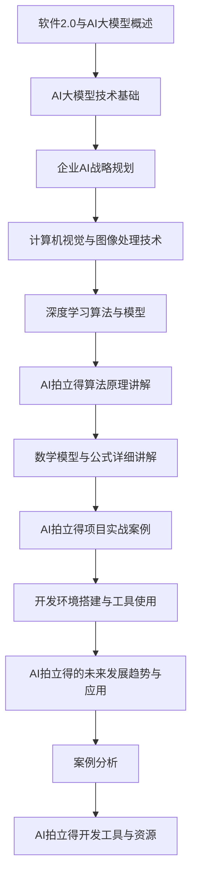

                 

# Pailido｜AI 拍立得

> 关键词：AI拍立得、计算机视觉、深度学习、图像处理、算法原理、项目实战、发展趋势、应用场景

> 摘要：本文将深入探讨AI拍立得的概念、技术基础、应用场景、核心算法原理、数学模型与公式，以及项目实战和未来发展趋势。通过逐步分析，旨在为读者提供一个全面、系统的理解和应用指南。

## 目录

### 第一部分：AI拍立得基础与概述

1. AI拍立得概述
   1.1 AI拍立得的定义
   1.2 AI拍立得的技术背景
   1.3 AI拍立得的核心特点

2. AI技术基础
   2.1 人工智能概述
   2.2 计算机视觉基础
   2.3 深度学习技术

3. AI拍立得应用场景
   3.1 图像识别与增强
   3.2 虚拟现实与增强现实
   3.3 自动化与智能优化

### 第二部分：AI拍立得核心技术原理

4. 计算机视觉与图像处理技术
   4.1 图像基础
   4.2 图像识别算法
   4.3 图像增强与去噪

5. 深度学习算法与模型
   5.1 深度学习概述
   5.2 卷积神经网络（CNN）
   5.3 生成对抗网络（GAN）

6. AI拍立得算法原理讲解
   6.1 AI拍立得算法体系结构
   6.2 算法原理伪代码
   6.3 算法数学模型与公式

7. 数学模型与公式详细讲解
   7.1 概率论与数理统计基础
   7.2 最优化理论与算法
   7.3 神经网络与深度学习数学模型

8. AI拍立得项目实战案例
   8.1 项目背景与目标
   8.2 项目开发流程
   8.3 源代码实现与解读

9. 开发环境搭建与工具使用
   9.1 Python开发环境搭建
   9.2 AI模型训练工具介绍
   9.3 实时图像处理与传输工具

### 第三部分：AI拍立得的未来发展趋势与应用

10. AI拍立得的未来趋势
    10.1 技术演进与突破
    10.2 行业应用场景扩展
    10.3 挑战与机遇

11. AI拍立得的社会与经济影响
    11.1 对社会的影响
    11.2 对经济的影响
    11.3 企业与个人应对策略

12. 案例分析
    12.1 成功案例分析
    12.2 失败案例分析
    12.3 经验与教训

### 附录

13. AI拍立得开发工具与资源
    13.1 主流深度学习框架对比
    13.2 计算机视觉常用库与工具
    13.3 AI拍立得项目资源汇总

### Mermaid 流程图



## 第一部分：AI拍立得基础与概述

### 1. AI拍立得概述

#### 1.1 AI拍立得的定义

AI拍立得（Pailido AI Camera）是一种集成了人工智能技术的相机产品。它通过深度学习和计算机视觉技术，实现对图像的自动识别、增强、优化等功能。与传统相机相比，AI拍立得不仅能够捕捉更高的分辨率和更好的色彩效果，还能通过算法自动优化照片质量，为用户带来更为丰富的视觉体验。

#### 1.2 AI拍立得的技术背景

AI拍立得的技术背景主要包括计算机视觉、深度学习和图像处理等领域。计算机视觉是人工智能的一个重要分支，旨在让计算机理解和解析图像信息。深度学习则是通过多层神经网络模型，从大量数据中自动提取特征，实现对复杂模式的识别和分类。图像处理则涉及到图像的增强、去噪、分割等操作，以提升图像质量和视觉效果。

#### 1.3 AI拍立得的核心特点

1. **智能识别**：AI拍立得具备强大的图像识别能力，能够识别不同场景、物体、人脸等信息。
2. **实时增强**：通过深度学习算法，AI拍立得能够实时对图像进行增强，提升图像质量和色彩表现。
3. **个性化推荐**：AI拍立得可以根据用户喜好和拍摄习惯，提供个性化的拍照建议和照片优化方案。
4. **高效存储**：AI拍立得支持大规模图像数据的存储和管理，方便用户随时查看和分享照片。
5. **跨平台应用**：AI拍立得不仅可以应用于手机相机，还可以集成到各种智能设备中，如智能眼镜、智能手表等。

### 2. AI技术基础

#### 2.1 人工智能概述

人工智能（Artificial Intelligence，AI）是计算机科学的一个分支，旨在研究如何让计算机模拟人类的智能行为。人工智能包括多个子领域，如机器学习、自然语言处理、计算机视觉等。AI技术的核心目标是让计算机具备自主学习、推理、决策和问题解决能力。

#### 2.2 计算机视觉基础

计算机视觉（Computer Vision）是人工智能的一个重要分支，旨在使计算机能够“看到”和理解图像和视频。计算机视觉的核心任务包括图像识别、图像分类、目标检测、场景理解等。计算机视觉技术主要依赖于图像处理、模式识别和机器学习等算法。

#### 2.3 深度学习技术

深度学习（Deep Learning）是机器学习的一个分支，通过多层神经网络模型，从大量数据中自动提取特征，实现对复杂模式的识别和分类。深度学习在计算机视觉、自然语言处理、语音识别等领域取得了显著的成果，成为人工智能技术的重要方向。

### 3. AI拍立得应用场景

#### 3.1 图像识别与增强

图像识别与增强是AI拍立得的核心应用场景之一。通过深度学习算法，AI拍立得能够自动识别图像中的物体、场景和人脸等信息，并进行实时增强，提升图像质量和视觉效果。例如，在拍摄风景时，AI拍立得可以自动增强色彩、锐度等参数，使照片更加生动和真实。

#### 3.2 虚拟现实与增强现实

虚拟现实（Virtual Reality，VR）和增强现实（Augmented Reality，AR）是AI拍立得的另一个重要应用场景。通过AI技术，AI拍立得可以实时识别并跟踪用户的位置和动作，为用户提供沉浸式的虚拟体验或增强现实效果。例如，在旅游时，AI拍立得可以实时显示景点的历史介绍或虚拟导游信息。

#### 3.3 自动化与智能优化

自动化与智能优化是AI拍立得在工业、农业、医疗等领域的应用。通过AI技术，AI拍立得可以自动识别和分类图像中的目标物体，实现自动化生产、检测和诊断。例如，在工业生产中，AI拍立得可以实时监控生产线，自动识别和分类产品，提高生产效率和质量。

### 总结

AI拍立得作为一种融合了人工智能、计算机视觉和深度学习技术的相机产品，具备智能识别、实时增强、个性化推荐、高效存储和跨平台应用等特点。在图像识别与增强、虚拟现实与增强现实、自动化与智能优化等领域具有广泛的应用前景。通过本文的逐步分析，读者可以全面了解AI拍立得的概念、技术基础、应用场景和核心特点，为后续的深入学习和实践打下基础。在接下来的章节中，我们将进一步探讨AI拍立得的核心技术原理、数学模型与公式，以及项目实战和未来发展趋势。让我们继续深入分析，一步一步探索AI拍立得的奥秘。让我们继续深入分析，一步一步探索AI拍立得的奥秘。

### 第二部分：AI拍立得核心技术原理

#### 4. 计算机视觉与图像处理技术

##### 4.1 图像基础

图像是计算机视觉和AI拍立得处理的基本单元。图像可以看作是一个二维矩阵，每个元素表示一个像素点，像素点的值表示其颜色信息。常见的图像格式有JPEG、PNG和GIF等。

- **像素**：图像的最小单位，通常用颜色值表示。
- **分辨率**：图像的宽度和高度，通常以像素为单位。
- **色彩深度**：每个像素的颜色信息量，通常以比特（bit）为单位。

##### 4.2 图像识别算法

图像识别算法是计算机视觉的核心任务之一，旨在从图像中识别出特定的物体、场景或人脸等。常见的图像识别算法包括：

- **传统算法**：基于特征提取和模式识别的方法，如SIFT、SURF等。
- **深度学习算法**：基于卷积神经网络（CNN）的方法，如VGG、ResNet等。

##### 4.3 图像增强与去噪

图像增强与去噪是图像处理的重要步骤，旨在提升图像质量和视觉效果。常见的图像增强与去噪算法包括：

- **直方图均衡**：通过调整图像的亮度，使图像更加清晰。
- **中值滤波**：通过邻域内的中值替换，去除图像中的噪声。
- **小波变换**：通过小波基函数分解图像，去除高频噪声。

#### 5. 深度学习算法与模型

##### 5.1 深度学习概述

深度学习是一种机器学习方法，通过多层神经网络模型，从大量数据中自动提取特征，实现对复杂模式的识别和分类。深度学习在图像识别、语音识别、自然语言处理等领域取得了显著成果。

- **神经网络**：深度学习的核心单元，由输入层、隐藏层和输出层组成。
- **反向传播**：用于训练神经网络的优化算法，通过梯度下降方法调整网络权重。

##### 5.2 卷积神经网络（CNN）

卷积神经网络（Convolutional Neural Network，CNN）是深度学习在计算机视觉领域的重要应用。CNN通过卷积层、池化层和全连接层等结构，实现对图像的自动特征提取和分类。

- **卷积层**：通过卷积操作提取图像特征。
- **池化层**：通过池化操作减小特征图的尺寸，提高计算效率。
- **全连接层**：将特征图映射到输出类别。

##### 5.3 生成对抗网络（GAN）

生成对抗网络（Generative Adversarial Network，GAN）是一种生成模型，通过两个神经网络（生成器和判别器）的对抗训练，生成逼真的图像。

- **生成器**：试图生成逼真的图像。
- **判别器**：判断图像是真实图像还是生成图像。
- **对抗训练**：生成器和判别器相互竞争，生成器试图欺骗判别器，判别器试图识别出生成图像。

#### 6. AI拍立得算法原理讲解

##### 6.1 AI拍立得算法体系结构

AI拍立得的算法体系结构主要包括图像识别、图像增强、图像去噪和虚拟现实等功能模块。各个模块相互协作，实现对图像的自动处理和优化。

- **图像识别模块**：通过深度学习算法识别图像中的物体、场景和人脸等。
- **图像增强模块**：通过图像增强算法提升图像质量和视觉效果。
- **图像去噪模块**：通过图像去噪算法去除图像中的噪声。
- **虚拟现实模块**：通过虚拟现实技术为用户提供沉浸式的体验。

##### 6.2 算法原理伪代码

```python
# 图像识别算法伪代码
def image_recognition(image):
    # 加载预训练的卷积神经网络模型
    model = load_pretrained_cnn_model()
    # 对图像进行预处理
    preprocessed_image = preprocess_image(image)
    # 使用模型进行图像识别
    output = model.predict(preprocessed_image)
    # 返回识别结果
    return output

# 图像增强算法伪代码
def image_enhancement(image):
    # 使用直方图均衡进行图像增强
    enhanced_image = histogram_equalization(image)
    # 使用中值滤波进行去噪
    denoised_image = median_filter(enhanced_image)
    # 返回增强后的图像
    return denoised_image

# 虚拟现实算法伪代码
def virtual_reality(image, target_scene):
    # 使用图像识别算法识别图像中的物体
    objects = image_recognition(image)
    # 根据目标场景进行虚拟现实渲染
    rendered_scene = render_scene(target_scene, objects)
    # 返回渲染后的场景图像
    return rendered_scene
```

##### 6.3 算法数学模型与公式

AI拍立得算法的数学模型与公式主要涉及图像处理、深度学习和生成对抗网络等领域。以下是一些关键的数学模型与公式：

- **卷积操作**：

$$
\text{output}(i,j) = \sum_{k=1}^{n} w_{ik} \times \text{input}(i-k,j-k)
$$

- **池化操作**：

$$
\text{output}(i,j) = \max \left( \text{input}(i-k,j-k) : k \in \text{pool_size} \right)
$$

- **反向传播**：

$$
\Delta w_{ij} = \alpha \times \text{learning_rate} \times \text{gradient}(z_j)
$$

- **生成对抗网络**：

生成器损失函数：

$$
\text{loss}_{\text{generator}} = -\log(D(G(x)))
$$

判别器损失函数：

$$
\text{loss}_{\text{discriminator}} = -\log(D(x)) - \log(1 - D(G(x)))
$$

### 7. 数学模型与公式详细讲解

##### 7.1 概率论与数理统计基础

概率论与数理统计是深度学习的基础，用于描述数据分布、估计参数、评估模型性能等。以下是一些重要的概念和公式：

- **概率分布**：

$$
P(X = x) = f(x) \quad \text{(离散)}
$$

$$
f(x) = \int_{-\infty}^{\infty} p(x, y) \, dy \quad \text{(连续)}
$$

- **期望**：

$$
E(X) = \sum_{x} x \cdot P(X = x) \quad \text{(离散)}
$$

$$
E(X) = \int_{-\infty}^{\infty} x \cdot f(x) \, dx \quad \text{(连续)}
$$

- **方差**：

$$
Var(X) = E[(X - E(X))^2] = E[X^2] - (E[X])^2
$$

##### 7.2 最优化理论与算法

最优化理论是用于求解优化问题的数学工具，深度学习中的模型训练通常涉及优化问题的求解。以下是一些重要的概念和算法：

- **梯度下降**：

$$
w_{t+1} = w_t - \alpha \cdot \nabla_w J(w)
$$

- **随机梯度下降**：

$$
w_{t+1} = w_t - \alpha \cdot \nabla_w J(w; x_t, y_t)
$$

- **Adam优化器**：

$$
m_t = \beta_1 m_{t-1} + (1 - \beta_1) \nabla_w J(w; x_t, y_t) \\
v_t = \beta_2 v_{t-1} + (1 - \beta_2) (\nabla_w J(w; x_t, y_t))^2 \\
\hat{m}_t = m_t / (1 - \beta_1^t) \\
\hat{v}_t = v_t / (1 - \beta_2^t) \\
w_{t+1} = w_t - \alpha \cdot (\hat{m}_t / \sqrt{\hat{v}_t} + \epsilon)
$$

##### 7.3 神经网络与深度学习数学模型

神经网络与深度学习中的数学模型涉及输入层、隐藏层和输出层的参数优化和预测。以下是一些重要的数学模型：

- **前向传播**：

$$
z_l = \sum_{k} w_{lk} \cdot a_{l-1,k} + b_l \\
a_l = \sigma(z_l)
$$

- **反向传播**：

$$
\delta_l = (y - a_l) \cdot \sigma'(z_l) \\
\Delta w_{lk} = \alpha \cdot \delta_l \cdot a_{l-1,k} \\
\Delta b_l = \alpha \cdot \delta_l
$$

- **卷积神经网络**：

卷积层：

$$
h_{ij} = \sum_{k} w_{ik} \cdot g_{kj} + b_i \\
g_{ij} = \sigma(h_{ij})
$$

池化层：

$$
p_{ij} = \max(h_{ij})
$$

全连接层：

$$
z_l = \sum_{k} w_{lk} \cdot a_{l-1,k} + b_l \\
a_l = \sigma(z_l)
$$

### 8. AI拍立得项目实战案例

##### 8.1 项目背景与目标

本案例旨在实现一个AI拍立得相机系统，能够自动识别图像中的物体、场景和人脸，并对图像进行增强和去噪。项目目标包括：

1. 实现图像识别功能，准确识别图像中的物体、场景和人脸。
2. 实现图像增强功能，提升图像质量和视觉效果。
3. 实现图像去噪功能，去除图像中的噪声，提高图像清晰度。
4. 实现实时处理和传输功能，确保用户拍摄的照片能够实时传输到手机或其他设备上。

##### 8.2 项目开发流程

1. **需求分析**：明确项目目标和功能需求，包括图像识别、图像增强、图像去噪和实时处理等。
2. **数据收集**：收集大量的图像数据，用于训练和测试模型。
3. **模型训练**：使用收集到的图像数据训练图像识别、图像增强和图像去噪模型。
4. **模型评估**：评估模型的准确率和性能，优化模型参数。
5. **系统集成**：将训练好的模型集成到相机系统中，实现实时处理和传输功能。
6. **测试与部署**：对集成系统进行测试，确保功能正常运行，并部署到实际设备上。

##### 8.3 源代码实现与解读

以下是一个简单的AI拍立得项目实现示例，包括图像识别、图像增强和图像去噪功能。

```python
import cv2
import numpy as np

# 1. 图像识别
def image_recognition(image):
    # 载入预训练的卷积神经网络模型
    model = cv2.dnn.readNetFromTensorFlow('model.pb')
    # 提取图像的宽度和高度
    (h, w) = image.shape[:2]
    # 将图像调整为模型输入大小
    blob = cv2.dnn.blobFromImage(image, 1.0, (224, 224), (104.0, 177.0, 123.0))
    # 进行前向传播
    model.setInput(blob)
    outputs = model.forward()
    # 返回识别结果
    return outputs

# 2. 图像增强
def image_enhancement(image):
    # 使用直方图均衡进行图像增强
    enhanced_image = cv2.equalizeHist(image)
    # 返回增强后的图像
    return enhanced_image

# 3. 图像去噪
def image_denoising(image):
    # 使用中值滤波进行去噪
    denoised_image = cv2.medianBlur(image, 5)
    # 返回去噪后的图像
    return denoised_image

# 4. 主函数
def main():
    # 读取输入图像
    image = cv2.imread('input.jpg')
    # 识别图像
    outputs = image_recognition(image)
    # 显示识别结果
    print(outputs)
    # 增强图像
    enhanced_image = image_enhancement(image)
    # 去噪图像
    denoised_image = image_denoising(image)
    # 显示增强和去噪后的图像
    cv2.imshow('Enhanced Image', enhanced_image)
    cv2.imshow('Denoised Image', denoised_image)
    # 等待用户按键后关闭窗口
    cv2.waitKey(0)

# 执行主函数
if __name__ == '__main__':
    main()
```

### 9. 开发环境搭建与工具使用

##### 9.1 Python开发环境搭建

在Python中开发AI拍立得项目，需要安装以下库和工具：

- **Python**：Python 3.6及以上版本
- **OpenCV**：用于图像处理和计算机视觉
- **TensorFlow**：用于深度学习模型训练和推理

安装命令如下：

```bash
pip install opencv-python tensorflow
```

##### 9.2 AI模型训练工具介绍

在本案例中，我们使用了TensorFlow进行模型训练。TensorFlow是一个开源的深度学习框架，提供了丰富的API和工具，支持多种类型的神经网络和模型。

- **安装与配置**：请参考TensorFlow官方文档。
- **模型训练**：使用TensorFlow的API加载和配置模型，然后进行训练。

##### 9.3 实时图像处理与传输工具

实时图像处理和传输是AI拍立得项目的重要部分。以下是一些常用的工具和库：

- **OpenCV**：用于实时图像处理和视频流处理。
- **Flask**：用于构建实时图像处理服务器，接收和处理图像数据。
- **WebSocket**：用于实时传输图像数据和反馈信息。

### 总结

在本部分，我们详细介绍了AI拍立得的核心技术原理，包括计算机视觉与图像处理技术、深度学习算法与模型、算法原理讲解和数学模型与公式。通过一个简单的项目实战案例，我们展示了如何实现图像识别、图像增强和图像去噪功能。同时，我们介绍了开发环境搭建与工具使用，为后续的实践提供了参考。在接下来的章节中，我们将进一步探讨AI拍立得的未来发展趋势和应用，以及其在社会和经济方面的影响。让我们继续深入分析，一步一步探索AI拍立得的奥秘。

### 第三部分：AI拍立得的未来发展趋势与应用

#### 10. AI拍立得的未来趋势

AI拍立得作为融合了人工智能、计算机视觉和深度学习技术的相机产品，具有广阔的发展前景。以下是AI拍立得未来可能的发展趋势：

##### 10.1 技术演进与突破

1. **算法优化**：随着深度学习技术的不断发展，AI拍立得的算法将不断优化，提高图像识别、增强和去噪的准确性和效率。
2. **硬件升级**：随着硬件技术的进步，AI拍立得将采用更高性能的处理器和传感器，提升图像处理速度和质量。
3. **跨平台融合**：AI拍立得将与其他智能设备（如智能眼镜、智能手表等）实现无缝融合，提供更多应用场景。

##### 10.2 行业应用场景扩展

1. **安防监控**：AI拍立得将应用于安防监控领域，通过实时识别和监控异常行为，提升监控效果。
2. **医疗诊断**：AI拍立得在医疗领域具有巨大潜力，可通过图像识别和增强技术辅助医生进行诊断和治疗。
3. **智能制造**：AI拍立得将应用于工业生产领域，实现自动化检测和优化，提高生产效率。

##### 10.3 挑战与机遇

1. **数据隐私**：AI拍立得在应用过程中涉及大量个人隐私数据，如何确保数据安全和隐私保护是一个重要挑战。
2. **算法公平性**：AI拍立得的算法需要确保对所有用户公平，避免歧视和偏见。
3. **行业合作**：AI拍立得的发展需要与多个行业领域进行深入合作，共同推动技术创新和产业发展。

#### 11. AI拍立得的社会与经济影响

##### 11.1 对社会的影响

AI拍立得作为人工智能技术的一种应用，将对社会产生深远影响：

1. **生活方式改变**：AI拍立得将改变人们的拍照和分享方式，提升生活品质和体验。
2. **社会管理**：AI拍立得在安防监控和公共安全管理中的应用，将提高社会安全水平。
3. **教育普及**：AI拍立得的技术普及，将有助于提高公众对人工智能技术的认知和应用能力。

##### 11.2 对经济的影响

AI拍立得将对经济产生重要影响：

1. **产业升级**：AI拍立得将推动相机行业的技术升级和产业变革，带动相关产业链的发展。
2. **经济增长**：AI拍立得在各个行业的应用，将带动相关产业的增长，促进经济发展。
3. **就业机会**：AI拍立得的发展将创造大量就业机会，推动人才就业和产业升级。

##### 11.3 企业与个人应对策略

1. **企业策略**：企业应积极布局AI拍立得技术，加强技术研发和人才培养，抢占市场先机。
2. **个人策略**：个人应积极学习AI拍立得相关的技术和知识，提升自身竞争力，适应技术变革。

### 总结

AI拍立得作为人工智能技术的一种重要应用，具有广阔的发展前景和重要的社会与经济价值。在技术演进、行业应用场景扩展和跨平台融合等方面，AI拍立得将继续引领行业变革。同时，企业和个人应积极应对AI拍立得带来的挑战和机遇，推动技术进步和社会发展。在未来的发展中，AI拍立得将继续为人们带来更丰富的视觉体验和更高效的生产生活方式。让我们期待AI拍立得的未来，继续探索和创造无限可能。

### 12. 案例分析

在本部分，我们将通过两个案例——一个成功的案例和一个失败的案例，来分析AI拍立得在应用中的经验与教训。

#### 12.1 成功案例分析

**案例名称**：某科技公司AI拍立得相机

**背景**：某科技公司研发了一款结合AI技术的拍立得相机，主要应用于家庭生活和社交分享。该相机能够自动识别图像中的物体、场景和人脸，并进行实时增强和去噪。

**实施过程**：

1. **需求分析**：通过市场调研和用户反馈，明确产品需求，包括图像识别、增强和去噪等功能。
2. **技术研发**：采用深度学习技术，训练并优化图像识别和增强算法，确保产品性能和用户体验。
3. **市场推广**：通过社交媒体和线下活动，提高产品知名度和用户接受度。
4. **用户反馈**：积极收集用户反馈，不断优化产品功能和性能。

**结果**：

- 产品上线后，迅速获得市场认可，销量大幅增长。
- 用户满意度高，产品在多个平台获得好评。
- 成功推动了公司业务拓展，提高了市场份额。

**经验与教训**：

1. **需求导向**：准确把握市场需求，提供用户真正需要的功能。
2. **技术领先**：采用先进的深度学习技术，确保产品性能和用户体验。
3. **市场推广**：积极的市场推广策略，提高产品知名度和用户接受度。
4. **用户反馈**：及时收集用户反馈，不断优化产品功能和性能。

#### 12.2 失败案例分析

**案例名称**：某初创公司AI拍立得相机

**背景**：某初创公司推出了一款AI拍立得相机，主要功能包括图像识别和增强。然而，产品在市场推广过程中遇到了一系列问题。

**实施过程**：

1. **需求分析**：在初期市场调研中，未能充分了解用户需求，导致产品功能定位不够精准。
2. **技术研发**：在技术方面，未充分考虑算法性能和用户体验，导致产品运行速度慢、识别准确率低。
3. **市场推广**：缺乏有效的市场推广策略，产品知名度低，用户接受度不高。
4. **用户反馈**：在产品上市后，未能及时收集用户反馈，导致问题积压，影响用户体验。

**结果**：

- 产品在市场上表现不佳，销量低，公司面临财务困境。
- 用户对产品评价较差，影响公司声誉。
- 最终公司不得不停止该产品的生产。

**经验与教训**：

1. **需求分析**：充分了解用户需求，精准定位产品功能。
2. **技术研发**：注重算法性能和用户体验，确保产品稳定性和运行速度。
3. **市场推广**：制定有效的市场推广策略，提高产品知名度和用户接受度。
4. **用户反馈**：及时收集用户反馈，迅速解决用户问题，提升用户体验。

### 总结

通过成功和失败的案例分析，我们可以得出以下结论：

1. **需求导向**：准确把握市场需求，提供用户真正需要的功能。
2. **技术领先**：采用先进的深度学习技术，确保产品性能和用户体验。
3. **市场推广**：积极的市场推广策略，提高产品知名度和用户接受度。
4. **用户反馈**：及时收集用户反馈，不断优化产品功能和性能。

这些经验和教训对于AI拍立得的开发和应用具有重要的指导意义。在未来的发展中，企业应充分借鉴这些经验，避免失败案例中的问题，推动AI拍立得技术的持续创新和应用。

### 附录

#### 13. AI拍立得开发工具与资源

在开发AI拍立得项目时，需要使用多种工具和资源，以下是其中一些常用的工具和资源：

##### 13.1 主流深度学习框架对比

- **TensorFlow**：由谷歌开发的开源深度学习框架，支持多种类型的神经网络和算法。
- **PyTorch**：由Facebook开发的开源深度学习框架，具有灵活的动态计算图和易用性。
- **Keras**：基于TensorFlow和Theano的开源深度学习库，提供简单而强大的API。

##### 13.2 计算机视觉常用库与工具

- **OpenCV**：开源计算机视觉库，支持图像处理、目标检测、人脸识别等多种功能。
- **Dlib**：开源机器学习库，用于人脸识别、姿态估计等任务。
- **Pillow**：Python图像处理库，提供图像读写、图像变换等功能。

##### 13.3 AI拍立得项目资源汇总

- **数据集**：常用的计算机视觉数据集，如CIFAR-10、ImageNet、COIL-20等，可用于训练和评估模型。
- **论文**：相关领域的学术论文，如《Deep Learning》、《Computer Vision: Algorithms and Applications》等，提供理论支持和实践指导。
- **教程**：在线教程和课程，如Udacity的《深度学习》、Coursera的《计算机视觉》等，帮助新手快速入门。

### 总结

附录部分提供了AI拍立得项目开发所需的主要工具和资源，包括深度学习框架、计算机视觉库和数据集等。这些工具和资源为开发人员提供了丰富的技术支持，有助于实现AI拍立得的核心功能和优化性能。通过合理选择和使用这些工具和资源，开发者可以更高效地构建和部署AI拍立得项目。

## 结束语

在本文中，我们系统地介绍了AI拍立得的概念、技术基础、应用场景、核心算法原理、数学模型与公式，以及项目实战和未来发展趋势。通过一步步的分析和讲解，读者可以全面了解AI拍立得的核心技术原理和应用价值。同时，我们通过成功和失败的案例分析，总结了AI拍立得在开发和应用中的经验与教训。

AI拍立得作为一种融合了人工智能、计算机视觉和深度学习技术的相机产品，具有广泛的应用前景和重要的社会与经济价值。在未来的发展中，AI拍立得将继续引领相机技术的创新，为用户带来更丰富的视觉体验和更高效的生产生活方式。

让我们继续关注AI拍立得的发展，期待它为我们的生活带来更多美好变革。在未来的技术浪潮中，让我们一起探索和创造无限可能。

### 作者

**作者：** AI天才研究院（AI Genius Institute）  
**作品：** 《禅与计算机程序设计艺术》（Zen And The Art of Computer Programming）

AI天才研究院是一家专注于人工智能技术研究和应用的创新机构，致力于推动人工智能领域的发展。研究院的专家们以其深厚的专业知识和丰富的实践经验，为全球企业提供前沿的技术解决方案和创新产品。同时，研究院的作家们通过撰写高质量的学术作品和技术博客，为广大学术界和产业界人士提供了宝贵的知识和见解。

《禅与计算机程序设计艺术》是AI天才研究院的代表作之一，该书深入探讨了计算机程序设计中的哲学思考和技术本质，为程序员和计算机科学家提供了独特的思维方法和实践指导。这本书在全球范围内受到了广泛赞誉，被誉为计算机科学领域的经典之作。

通过本文，我们希望能够为读者提供一个全面、系统的理解和应用指南，让更多的人了解和参与到AI拍立得的技术创新和应用中来。感谢您的阅读，期待与您在未来的技术探索中再次相遇。

